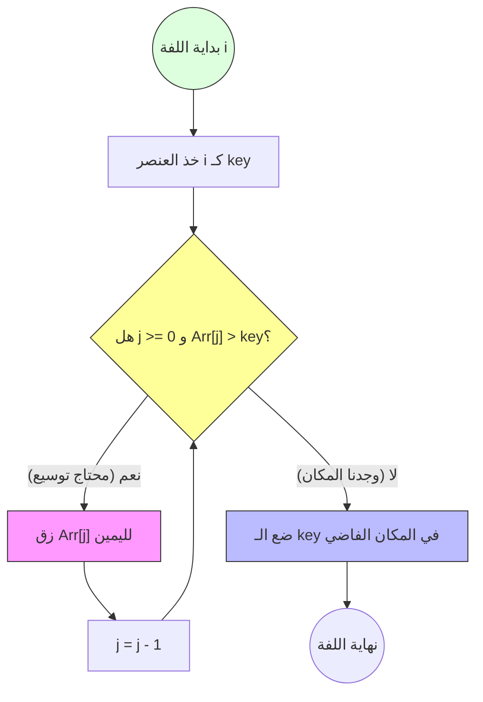

وصلنا للمحطة الأخيرة في "عالم الترتيب البسيط"، ومعانا النهاردة **Insertion Sort**. بص يا بطل، لو الـ Bubble Sort والـ Selection Sort هما بتوع "الكتب والمناهج"، فالـ **Insertion Sort** هو اللي "شغال بجد" في الكواليس. ده الـ Algorithm اللي لغات برمجة زي Python و Java بتعتمد عليه (كجزء من Timsort) لما الـ Data حجمها بيصغر.

تعال نفهم "الزتونة" وليه ده أذكى واحد في اخواته الـ $O(N^2)$.

---

## [[Algorithms]]/Sorting/Insertion Sort

### التعريف السريع

الـ **Insertion Sort** هي خوارزمية ترتيب بتعتمد على بناء الجزء المترتب عنصر بعنصر. الفكرة إنك بتاخد عنصر من الجزء "غير المترتب" وتدور له على "أنسب مكان" في الجزء "المترتب" وتحشره فيه. هي خوارزمية **Adaptive**، **Stable**، و **In-place**.

---

### الشرح التفصيلي

تخيل إنك قاعد في قاعدة كوتشينة، وبتوزع عليك الورق. أنت بتمسك الورق في إيدك الشمال، وكل ورقة جديدة بتسحبها بإيدك اليمين، بتبص عليها وتشوف مكانها فين وسط الورق اللي في إيدك الشمال (اللي أنت رتبته فعلاً)، وبعدين "تحشرها" في مكانها الصح. أهو ده بالظبط الـ Insertion Sort.

#### 1. المستوى السطحي (إيه ده؟)

هو طريقة ترتيب بتبني الـ Sorted Array عنصر بعنصر. ميزته الكبرى إنه بيتعامل مع الداتا وهي جاية (On-the-fly). يعني لو عندك Stream بتاع داتا شغال، الـ Insertion Sort يقدر يرتب اللي جاله لحد دلوقتي بكفاءة عالية جداً.

#### 2. المستوى المتوسط (إزاي بيشتغل؟)

الخوارزمية بتقسم الـ Array لجزئين (وهمياً):

- **Sorted Part:** بيبدأ بأول عنصر بس (لأن أي عنصر لوحده يعتبر مترتب).
    
- **Unsorted Part:** باقي الـ Array.
    

**الخطوات الميكانيكية:**

1. بنمسك أول عنصر من الـ Unsorted Part ونسميه الـ `key` (أو الكارت اللي في إيدنا اليمين).
    
2. بنقارن الـ `key` باللي قبله (في الـ Sorted Part).
    
3. طول ما اللي قبله "أكبر" من الـ `key` بنعمل **Shift** (زق) للرقم اللي قبله خطوة لليمين عشان نفضي مكان (Hole).
    
4. أول ما نلاقي رقم أصغر من الـ `key` أو نوصل لبداية الـ Array، "بنزرع" الـ `key` في المكان الفاضي ده.
    

#### 3. المستوى العميق (ليه اتصمم كده؟ والـ Trade-offs)

هنا بقى تظهر عبقرية الـ Insertion Sort:

- **الـ Adaptive Nature:** دي أهم ميزة. لو الـ Array مترتبة فعلاً، الـ Insertion Sort بيمشي عليها في $O(N)$ بس! لأنه في كل لفة بيلاقي إن الـ `key` أكبر من اللي قبله فمبيعملش أي Shifting وبيخلص فوراً. عشان كده هو أسرع من الـ Selection والـ Bubble في الحياة العملية.
    
- **الـ Stability:** هو خوارزمية **Stable** جداً، لأننا مش بنبدل الأرقام المتساوية، بنسيبهم في مكانهم النسبي.
    
- **الـ Space:** طبعاً $O(1)$ لأنه شغال In-place.
    
- **الـ Hybrid Use:** في الـ Production، خوارزمية `std::sort` في C++ بتستخدم حاجة اسمها **Introsort**. دي عبارة عن خليط، لما الـ Recursion بتاع الـ Quick Sort يخلي الـ Sub-array حجمها صغير (مثلاً أقل من 16 عنصر)، الـ الـ Compiler بيحول فوراً لـ **Insertion Sort** لأنه الأسرع في المساحات الصغيرة بسبب قلة الـ Overhead.
    

---

#### كيفية العمل (How It Works) - سيناريو عملي

تخيل الـ Array دي:
`[12, 11, 13, 5, 6]`

1. **Pass 1:** 
2.الـ 12 مترتبة. الـ `key` هو 11.
    
    - هل 12 > 11؟ أيوة. زق الـ 12 يمين -> `[12, 12, 13, 5, 6]`.
        
    - احشر الـ 11 في الأول -> `[11, 12, 13, 5, 6]`.
        
2. **Pass 2:** الـ `key` هو 13.
    
    - هل 12 > 13؟ لأ. مفيش Shifting.
        
    - تفضل زي ما هي -> `[11, 12, 13, 5, 6]`.
        
3. **Pass 3:** الـ `key` هو 5.
    
    - الـ 5 أصغر من 13، 12، 11. كلهم هيتزقوا يمين.
        
    - النتيجة -> `[5, 11, 12, 13, 6]`.
        
4. **Pass 4:** الـ `key` هو 6.
    
    - الـ 6 أصغر من 13، 12، 11. هيتزقوا يمين لحد ما نلاقي الـ 5.
        
    - النتيجة النهائية -> `[5, 6, 11, 12, 13]`.
        

---

#### الأمثلة العملية (C++ Implementation)

ده كود احترافي مع شرح "دسم" لكل تفصيلة:


```c++
#include <iostream>
#include <vector>

using namespace std;

/**
 * Insertion Sort Function
 * Time Complexity: O(N^2) Worst, O(N) Best Case.
 * Space Complexity: O(1) - In-place.
 */
void insertionSort(vector<int>& arr) {
    int n = arr.size();
    
    // بنبدأ من العنصر التاني (index 1) لأن الأولاني بنعتبره مترتب لوحده
    for (int i = 1; i < n; i++) {
        int key = arr[i]; // ده العنصر اللي عايزين نحشره في مكانه الصح
        int j = i - 1;    // ده آخر عنصر في الجزء المترتب

        /*
           اللوب دي بتمشي بظهرها في الجزء المترتب.
           طول ما العناصر أكبر من الـ key، بنزقها خطوة لليمين عشان نوسع مكان.
        */
        while (j >= 0 && arr[j] > key) {
            arr[j + 1] = arr[j]; // عملية الـ Shifting
            j--;                 // نرجع خطوة لورا
        }
        
        // أول ما نلاقي المكان الصح (أو نوصل للصفر)، بنحط الـ key
        arr[j + 1] = key;
    }
}

// دالة مساعدة لطباعة المصفوفة
void printArray(const vector<int>& arr) {
    for (int x : arr) cout << x << " ";
    cout << endl;
}

int main() {
    // مثال لمصفوفة شبه مترتبة عشان نشوف قوة الـ Insertion Sort
    vector<int> data = {12, 11, 13, 5, 6};
    
    cout << "Original Array: ";
    printArray(data);

    insertionSort(data);

    cout << "Sorted Array:   ";
    printArray(data);
    
    /*
       الـ Output المتوقع: 5 6 11 12 13
       نصيحة: جرب تشغل الكود ده على مصفوفة مترتبة أصلاً 
       وشوف إنه مش هياخد وقت خالص في الـ Shifting.
    */
    
    return 0;
}
```

---

#### الـ Edge Cases والتفاصيل الدقيقة

1. **Nearly Sorted Data:** لو الـ Array مترتبة بنسبة 90%، الـ Insertion Sort هو الملك، مفيش أي خوارزمية (حتى الـ Quick Sort) تقدر تغلب سرعته هنا.
    
2. **Reverse Sorted Data:** ده الـ Worst Case بتاعته. هيضطر يعمل Max Shifting لكل عنصر $O(N^2)$.
    
3. **Online Sorting:** لو الداتا بتجيلك واحدة واحدة (Stream)، الـ Insertion Sort هو الاختيار الأمثل لأنك في كل مرة بتستلم رقم، بتحطه في مكانه الصح فوراً وبتفضل الـ Array مترتبة دايماً.
    

---

### الربط بالمفاهيم التانية

- الموضوع ده مرتبط بـ:
    
    - **Timsort:** الخوارزمية الهجينة المستخدمة في لغات البرمجة الحديثة.
        
    - **Shell Sort:** هي تطوير للـ Insertion Sort بتعتمد على فكرة إننا نرتب العناصر اللي بعيدة عن بعض الأول عشان نقلل الـ Shifting.
        
    - **Linked Lists:** الـ Insertion Sort فعال جداً مع الـ Linked Lists لأن عملية الـ "Insertion" فيها مش بتحتاج Shifting (مجرد تغيير Pointers).
        

---

### المصادر والقراءة الإضافية

- **Algorithm Design Manual (Steven Skiena):** بيشرح ليه الـ Insertion Sort هو المفضل في التطبيقات العملية الصغيرة.
    
- **Visualgo.net:** اتفرج على الـ "Shifting" بيحصل إزاي كأنك بترتب كوتشينة.
    

---

### Mermaid Visualization (تطبيقاً للوصايا السبع)

Code snippet



كده يا بطل خلصنا "المحطة الأولى" (Sorting) بامتياز. إيه رأيك؟ تحب ندخل في **المحطة التانية** (Trees) ونشوف الـ **DFS** والـ **BST** العميقة، ولا نخش على **السحر الأسود** بتاع الـ **Hashing**؟