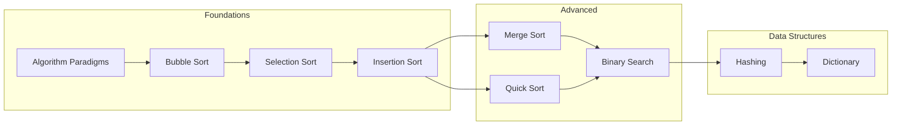

# 🧮 Algorithms

> **الخوارزميات هي "الوصفة" اللي بتحل بيها المشكلة. مش مجرد كود، دي طريقة تفكير.**

---

## 📊 Quick Complexity Reference

### Sorting Algorithms Comparison

| Algorithm | Best | Average | Worst | Space | Stable? | When to Use |
|-----------|------|---------|-------|-------|---------|-------------|
| [[Bubble Sort]] | O(n) | O(n²) | O(n²) | O(1) | ✅ Yes | Learning only, small data |
| [[Selection Sort]] | O(n²) | O(n²) | O(n²) | O(1) | ❌ No | When memory writes are expensive |
| [[Insertion Sort]] | O(n) | O(n²) | O(n²) | O(1) | ✅ Yes | Nearly sorted data, small arrays |
| [[Quick Sort]] | O(n log n) | O(n log n) | O(n²) | O(log n) | ❌ No | General purpose, in-memory |
| [[Merge sort\|Merge Sort]] | O(n log n) | O(n log n) | O(n log n) | O(n) | ✅ Yes | Linked lists, external sorting |

### Searching Algorithms Comparison

| Algorithm | Best | Average | Worst | Prerequisite |
|-----------|------|---------|-------|--------------|
| Linear Search | O(1) | O(n) | O(n) | None |
| [[Binary Search]] | O(1) | O(log n) | O(log n) | **Sorted data** |
| [[Hashing\|Hash Lookup]] | O(1) | O(1) | O(n) | Hash function |

---

## 🗂️ Topics by Category

### 🎯 Algorithm Paradigms (Start Here!)
- [[Algorithm Paradigms]] - Brute Force, Divide & Conquer, Greedy, DP

### 🔀 Sorting Algorithms

#### Simple Sorts (O(n²) - Good for Learning)
- [[Bubble Sort]] - The grandfather of sorting
- [[Selection Sort]] - Minimize swaps
- [[Insertion Sort]] - Best for nearly sorted data

#### Efficient Sorts (O(n log n) - Production Ready)  
- [[Merge sort|Merge Sort]] - Divide & Conquer, stable
- [[Quick Sort]] - Fastest in practice

### 🔍 Searching Algorithms
- [[Binary Search]] - The O(log n) magic

### #️⃣ Hashing
- [[Hashing]] - Hash functions, collision handling
- [[Dictionary]] - Key-Value ADT implementation

---

## 🛤️ Learning Path

---

## 🎯 Interview Priority

| Priority | Algorithm | Why Important |
|----------|-----------|---------------|
| ⭐⭐⭐ | Binary Search | Foundation for many problems |
| ⭐⭐⭐ | Quick Sort | Asked about pivot selection |
| ⭐⭐⭐ | Merge Sort | Divide & Conquer foundation |
| ⭐⭐ | Hashing | O(1) lookup understanding |
| ⭐⭐ | Two Pointers | Pattern recognition |
| ⭐ | Bubble/Selection | Explain complexity only |

---

## 📈 What's Missing (Future Topics)

- [ ] Graph Algorithms (DFS, BFS, Dijkstra)
- [ ] Recursion Fundamentals
- [ ] Backtracking
- [ ] Sliding Window Pattern
- [ ] Two Pointers Pattern

---

## 🔗 Related
- [[Data Structure/_Data Structures MOC|Data Structures MOC]]
- [[problem solving/problem solving road map|Problem Solving Roadmap]]
