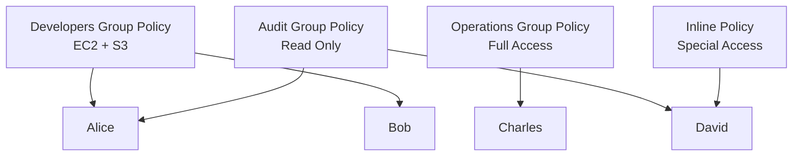
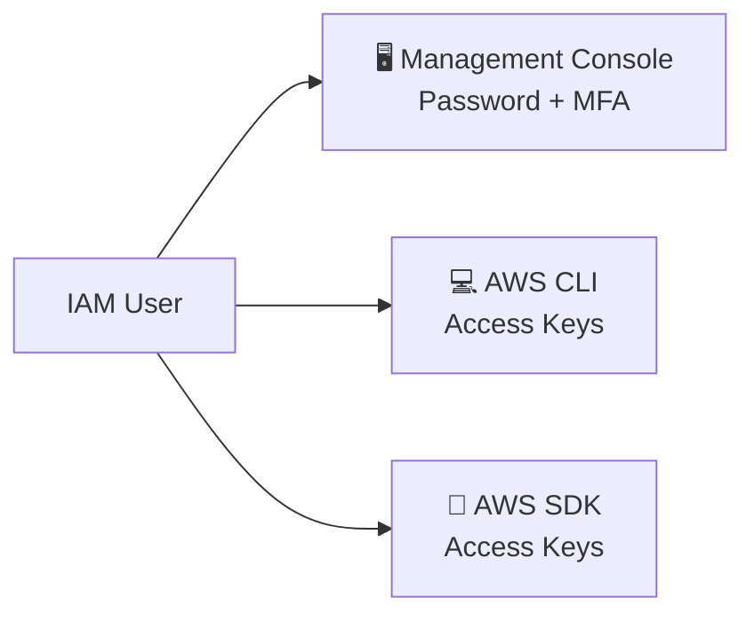
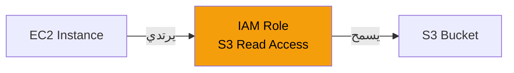
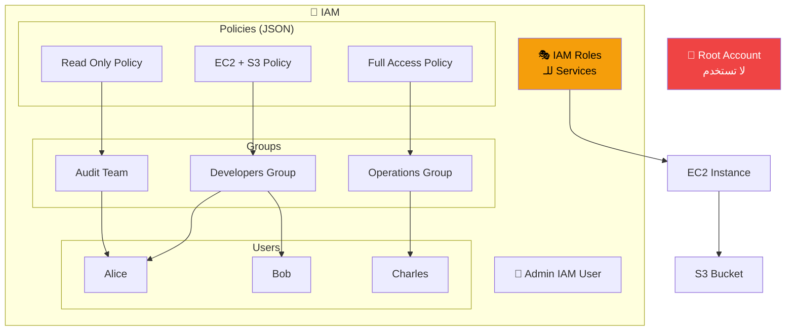

---
tags:
  - AWS
  - CLF-C02
  - IAM
  - Security
  - Cloud-Practitioner
aliases:
  - IAM
  - Identity and Access Management
date: 2024-01-01
section: 02
status: complete
---

# 🔐 IAM — Identity and Access Management

> [!abstract] الفكرة الجوهرية
> IAM هو نظام التحكم في "مين يقدر يعمل إيه" داخل الـ AWS Account بتاعتك. هو الحارس الرئيسي، وكل حاجة في AWS بتعدي من خلاله.

---

## 🏛️ البداية — لما فتحت الـ Account

لما بتفتح AWS Account جديدة، أول حاجة بتحصل هي إن الـ Cloud بيديك مفتاحاً واحداً يفتح كل الأبواب — اسمه **Root Account**. ده الأكونت الاعظم. مفيش صلاحية ممنوعة عليه، مفيش قيد بيوقفه. يقدر يحذف كل الـ Resources، يغير الـ Billing، يلغي الـ Account نفسها.

وعشان كده بالظبط — لازم **تحطه في درج وتنساه**.

> [!danger] ⛔ القاعدة الذهبية للـ Root Account
> - **لا تستخدمه** في العمل اليومي أبداً
> - **لا تشاركه** مع أي حد مهما كان
> - **فعّل عليه MFA** فوراً بعد ما تفتح الـ Account
> - استخدمه **مرة واحدة فقط** — لما تعمل Setup أول مرة وبعدين تعمل Admin User

الـ Exam بيحب يسأل عن ده — الإجابة دايماً: الـ Root Account لا تُستخدم ولا تُشارك.

---

## 👥 Users وGroups — هيكل شركتك على AWS

بعد ما عملت الـ Root Account وأمّنتها، الخطوة الجاية هي إنك تبني هيكل تنظيمي لـ AWS Account بتاعتك بالظبط زي ما بتبني هيكل وظيفي في شركة.

**الـ IAM User** هو كيان رقمي بيمثل شخصاً حقيقياً — موظف، developer، أو حتى تطبيق. كل User عنده Username وPassword للـ Console، وممكن كمان عنده Access Keys للـ CLI.

**الـ IAM Group** هي مجموعة من الـ Users بتتشارك نفس الصلاحيات. بدل ما تدي كل موظف صلاحيات منفردة — بتعمل Group وبتحط فيها الصلاحيات، وكل User جوّاها بياخد نفس الصلاحيات تلقائياً.

تخيل شركة فيها:
- فريق Developers: بيحتاجوا EC2 وS3 وCodeDeploy
- فريق Operations: بيحتاجوا كل حاجة
- فريق Audit: بيقرأوا بس، مش بيعدلوا

بدل ما تدي كل واحد من الـ 50 موظف صلاحيات يدوياً — بتعمل الـ 3 Groups دول وبتحط كل موظف في الـ Group المناسبة. لما بييجي موظف جديد في الـ Developers — بتضيفه للـ Group وخلاص.

> [!info] 📐 القواعد التقنية للـ Groups
> - الـ Groups **بتحتوي على Users بس** — مش ممكن تحط Group جوه Group
> - الـ User **مش مجبور** يكون في Group
> - الـ User **ممكن يكون في أكتر من Group** في نفس الوقت
> - لو User في مجموعتين — بياخد **مجموع صلاحيات الاتنين**

---

## 📋 Policies — قانون الصلاحيات المكتوب

الـ Groups والـ Users لوحدهم مش بيعملوا حاجة — اللي بيدي الصلاحيات هو الـ **Policy**. الـ Policy هو document بصيغة **JSON** بيحدد بالظبط: مين يقدر يعمل إيه، على إيه، وتحت أي شروط.

```json
{
  "Version": "2012-10-17",
  "Statement": [
    {
      "Effect": "Allow",
      "Action": "ec2:Describe*",
      "Resource": "*"
    },
    {
      "Effect": "Allow",
      "Action": "s3:GetObject",
      "Resource": "arn:aws:s3:::my-bucket/*"
    }
  ]
}
```

الـ Policy دي بتقول: "مسموح تعرض (Describe) أي حاجة في EC2، ومسموح تقرأ (GetObject) الملفات من هذا الـ Bucket بالتحديد."

### 🔬 تشريح الـ Policy — كل عنصر بمعناه

| العنصر | إلزامي؟ | الوظيفة |
|--------|---------|---------|
| `Version` | ✅ | نسخة لغة الـ Policy — **دايماً** `"2012-10-17"` |
| `Id` | ❌ | معرّف اختياري للـ Policy كلها |
| `Statement` | ✅ | القلب — بيحتوي على القواعد |
| `Sid` | ❌ | اسم اختياري للـ Statement |
| `Effect` | ✅ | `"Allow"` أو `"Deny"` — مفيش تالت |
| `Principal` | ✅* | مين اللي الـ Policy دي بتتطبق عليه |
| `Action` | ✅ | الفعل — زي `"s3:GetObject"` أو `"ec2:*"` |
| `Resource` | ✅ | على إيه — `"*"` يعني كل حاجة |
| `Condition` | ❌ | شروط إضافية — زي IP معين أو وقت معين |

> [!warning] ⚠️ قاعدة الـ Conflict
> لو Policy قالت **Allow** وتانية قالت **Deny** على نفس الـ Action — الـ **Deny بيكسب دايماً** بدون استثناء.

### 🔄 Inheritance — إزاي الصلاحيات بتتوّرث

الـ Inheritance بسيطة: كل Policy على Group بتنتقل تلقائياً لكل User جوّاها.



Alice في الـ Developers وفي الـ Audit في نفس الوقت — بتاخد صلاحيات الاتنين مجمّعين. David عنده **Inline Policy** — صلاحية ملصوقة بيه هو شخصياً وبس، مش من خلال Group.

> [!tip] 💡 Inline Policy vs Managed Policy
> - **Managed Policy** (عبر Groups) = الـ Best Practice — سهل الإدارة والـ Audit
> - **Inline Policy** (ملصوقة بـ User مباشرة) = لحالات استثنائية بس — بتتجنبها قدر الإمكان

---

## 🛡️ الحماية — الطبقتان اللي مش نزلتش عنهم

دلوقتي عندك Users وGroups وPolicies — بس ده لسه مش كافي. لازم تحمي الـ Credentials نفسها. فيه طبقتان من الحماية لازم تفهمهم.

### الطبقة الأولى: Password Policy

الـ **Password Policy** هي مجموعة قواعد إلزامية بتطبقها على كل الـ IAM Users في الـ Account. بتحدد:

- **Minimum Length** — أقل طول لكلمة المرور (مثلاً 12 حرف)
- **Character Requirements** — Uppercase + Lowercase + Numbers + Special Characters
- **Password Expiration** — إجبار تغيير الباسورد كل X يوم
- **Password Reuse Prevention** — منع إعادة استخدام باسورد قديم
- **User Self-Service** — السماح للـ Users بتغيير الباسورد بتاعتهم

> [!example] 🏢 المثال العملي
> شركة فيها 200 موظف — كلهم بيستخدموا AWS. لو مفيش Password Policy، موظف ممكن يحط `123456` كباسورد. أول Brute Force Attack والـ Account اتفتحت. الـ Password Policy هي القانون الإلزامي اللي بيمنع ده.

### الطبقة التانية: MFA — الحارس اللي مش بينام

الـ **MFA (Multi-Factor Authentication)** هو الفارق بين Account آمنة وAccount قنبلة موقوتة.

المعادلة:

$$\text{MFA} = \underbrace{\text{شيء بتعرفه}}_{\text{الباسورد}} + \underbrace{\text{شيء بتمتلكه}}_{\text{Device أو App}}$$

حتى لو حد سرق الباسورد — مش هيقدر يكمل لأنه مش عنده الـ Device. الـ Hacker بيحتاج الاتنين مع بعض.

**أنواع الـ MFA Devices على AWS:**

| النوع | الأمثلة | الملاحظة |
|-------|---------|---------|
| **Virtual MFA App** | Google Authenticator, Authy | على الموبايل — بيولّد كود كل 30 ثانية |
| **U2F Security Key** | YubiKey (Yubico) | USB Key مادي — بتحطه في الكمبيوتر |
| **Hardware Key Fob** | Gemalto | جهاز مادي منفصل بيولّد Codes |
| **GovCloud Key Fob** | SurePassID | خاص بـ AWS GovCloud الحكومي الأمريكي |

> [!tip] 💡 Virtual MFA = الأشهر والأوفر
> Google Authenticator وAuthy هم الأكتر استخداماً لأنهم مجانيين وعلى الموبايل. الـ YubiKey أقوى أمنياً لكن بيتكلف فلوس. في الشركات الكبيرة، الـ YubiKey هو الـ Standard.

---

## 🚪 طرق الوصول لـ AWS — الأبواب التلاتة

دلوقتي عندنا Users وCredentials محمية. السؤال: إزاي بيوصلوا لـ AWS؟ فيه **3 طرق** وكل طريقة ليها حماية مختلفة.



### 1. AWS Management Console

الواجهة الرسومية على المتصفح على `console.aws.amazon.com`. محمية بـ **Username + Password + MFA**. ده اللي بتستخدمه لما بتعمل حاجة يدوياً وبتحتاج تشوف بعينك.

### 2. AWS CLI — Command Line Interface

أداة بتكتب فيها Commands في الـ Terminal عشان تتحكم في AWS من غير ما تفتح المتصفح. مثال:

```bash
aws s3 ls                    # بتعرض كل الـ Buckets
aws ec2 describe-instances   # بتعرض كل الـ Instances
aws s3 cp file.txt s3://my-bucket/  # بترفع ملف
```

محمية بـ **Access Keys** مش باسورد. الـ CLI مبني على الـ SDK بتاع Python من جوّه — وهو Open Source على GitHub.

### 3. AWS SDK — Software Development Kit

مش هتكتب فيه Commands — هتستخدمه من جوّه الـ Code بتاعتك. بتـ import الـ Library وبتتحكم في AWS برمجياً.

```python
import boto3

s3 = boto3.client('s3')
s3.upload_file('file.txt', 'my-bucket', 'file.txt')
```

بيدعم: **JavaScript, Python, PHP, .NET, Ruby, Java, Go, Node.js, C++, Android, iOS، وحتى Arduino للـ IoT.**

### 🔑 Access Keys — الباسورد البرمجي

الـ **Access Keys** هي الـ Credentials اللي بيستخدمها الـ CLI والـ SDK. بتتكون من اتنين:

| العنصر | يشبه | مثال |
|--------|-----|------|
| **Access Key ID** | Username | `AKIASK4E37PV4983d6C` |
| **Secret Access Key** | Password | `AZPN3zojWozWCndIjhB0Unh8239...` |

> [!danger] ⛔ قواعد الـ Access Keys — مش اختيارية
> - **لا تشاركهم** مع أي حد أبداً
> - **لا تحطهم** في الـ Code أو GitHub
> - **كل User بيدير Access Keys بتاعته** هو — مش حد تاني
> - لو Access Key اتسرب — **ألغيه فوراً** واعمل واحد جديد

---

## 🎭 IAM Roles — لما الـ Service محتاجة تتكلم مع خدمة تانية

تخيل سيناريو: عندك **EC2 Instance** (Server) شغّال عليه Application، والـ Application دي محتاجة تقرأ ملفات من **S3**. إزاي الـ EC2 هيتصل بـ S3 بأمان؟

الإجابة الغلط: تحط Access Keys جوّه الـ Code على الـ Server مباشرة — ده خطر جداً لأن الـ Keys دي ممكن تتسرب.

الإجابة الصح: **IAM Role**.

الـ **IAM Role** هو مجموعة صلاحيات ممكن تـ"ترتديها" أي Service أو User مؤقتاً. بدل ما تدي الـ EC2 Instance باسورد أو Access Key — بتدي الـ EC2 نفسه **Role** بيقول "الـ Instance ده مسموحله يقرأ من S3."



الـ AWS بتدير الـ Credentials التقنية جوّاها تلقائياً — إنت مش شايف Passwords أو Keys. الـ Role بتنتهي تلقائياً لما الـ Instance يوقف.

**الـ Roles الشائعة:**
- **EC2 Instance Roles** — بتدي EC2 صلاحية وصول لخدمات تانية
- **Lambda Function Roles** — بتدي Lambda صلاحية عشان تشتغل
- **CloudFormation Roles** — بتدي CloudFormation صلاحية يبني الـ Infrastructure
- **Cross-Account Roles** — بتسمح لـ Account تانية توصل لـ Resources عندك

> [!info] 💡 الفرق بين User وRole
> - **User** = شخص حقيقي، عنده Permanent Credentials
> - **Role** = لبس مؤقت، بتلبسه Service أو User وقت الحاجة وبيتخلع بعدين

---

## 🔍 IAM Security Tools — عيون المراقبة

حتى بعد ما بنيت كل ده، لازم تراقب وتتحقق. AWS بيوفر أداتين أساسيتين للـ Audit.

### IAM Credentials Report — على مستوى الـ Account

بيولّد Report شامل بكل الـ Users في الـ Account وحالة الـ Credentials بتاعتهم — مين فعّل MFA، مين ما فعّلش، مين عنده Access Keys وآخر استخدامها إمتى، مين مش اتسجل من زمان.

**استخدامه:** لما تعمل Security Audit على الـ Account كلها — تشوف مين محتاج Review.

### IAM Access Advisor — على مستوى الـ User

بيوريك لكل **User** — إيه الـ Services اللي عنده صلاحية عليها، وآخر مرة استخدمها.

**استخدامه:** لو User عنده صلاحية على 50 Service بس بيستخدم 5 بس — الـ Access Advisor بيوريك ده وبتقدر تشيل الصلاحيات الزيادة وتطبق الـ Least Privilege.

---

## ✅ Best Practices — القواعد الذهبية قبل ما تمشي

ده تلخيص لكل الـ Best Practices اللي AWS نفسها بتوصي بيها:

> [!success] ✅ الـ IAM Best Practices
> 1. **لا تستخدم الـ Root Account** إلا في الـ Initial Setup
> 2. **شخص حقيقي = IAM User واحد** — لا تشارك Users
> 3. **حط Users في Groups** وادي الصلاحيات للـ Groups مش للـ Users مباشرة
> 4. **Password Policy قوية** على الـ Account كلها
> 5. **MFA إلزامي** على الـ Root وعلى الـ Admin Users على الأقل
> 6. **Roles للـ Services** — لا تستخدم Access Keys جوّه الـ Servers
> 7. **Access Keys للـ CLI/SDK بس** — مش للـ Console
> 8. **Audit دوري** باستخدام Credentials Report وAccess Advisor
> 9. **لا تشارك IAM Users أو Access Keys** مع حد

---

## 🤝 الـ Shared Responsibility في الـ IAM

تذكر الـ Shared Responsibility Model من القسم الأول؟ ينطبق هنا كمان:

| المسؤولية | عليك إنت |
|-----------|---------|
| ☁️ **AWS** | Infrastructure الـ IAM Service نفسها + Global Network Security + Compliance Certifications |
| 👤 **أنت** | Users وGroups وRoles وPolicies + تفعيل MFA + تدوير الـ Keys + مراجعة الصلاحيات + Audit دوري |

---

## 🎯 فخاخ الـ Exam — IAM Edition

> [!warning] 🚨 الفخاخ الكلاسيكية

**الفخ الأول — IAM هو Global:**
السؤال بيقول "في أي Region بتعمل IAM User؟" — الإجابة: ==IAM هو Global Service، مش Region-specific. الـ User موجود في كل الـ Regions تلقائياً.==

**الفخ التاني — Root vs Admin:**
"ما الـ Account اللي لازم تستخدمه للعمل اليومي؟" — ==مش الـ Root، بل IAM User بصلاحيات Admin.== الـ Root للـ Initial Setup بس.

**الفخ التالت — Groups مش بتحتوي Groups:**
"ممكن تحط Group جوه Group؟" — ==لأ. Groups بتحتوي على Users فقط.==

**الفخ الرابع — Deny يكسب:**
"User عنده Allow على S3 من Group، وعنده Deny على S3 من Policy تانية — هيحصل إيه؟" — ==الـ Deny بيكسب دايماً بدون استثناء.==

**الفخ الخامس — مين مسؤول عن الـ MFA؟**
"AWS بتفعّل MFA تلقائياً؟" — ==لأ. إنت (Customer) مسؤول عن تفعيل MFA. AWS بس بتوفر الـ Tool.==

**الفخ السادس — Roles مش Users:**
"EC2 محتاجة توصل لـ S3 — تعمل إيه؟" — ==تعمل IAM Role وتحطه على الـ EC2، مش تحط Access Keys في الـ Code.==

**الفخ السابع — Access Keys مش للـ Console:**
"كيف بتحمي الـ AWS Management Console؟" — ==Password + MFA. الـ Access Keys للـ CLI والـ SDK بس، مش للـ Console.==

---

## 📊 الـ Cheat Sheet النهائي

| المفهوم | الإجابة السريعة |
|--------|----------------|
| IAM = | Identity and Access Management |
| IAM scope | **Global** — مش Regional |
| Root Account | لا تُستخدم، لا تُشارك، فعّل عليها MFA |
| Policy format | **JSON** |
| Policy Version | دايماً `"2012-10-17"` |
| Deny vs Allow | **Deny يكسب** دايماً |
| Groups تحتوي | **Users فقط** — مش Groups |
| User في Groups | ممكن في **أكتر من Group** |
| Console protection | Password + MFA |
| CLI/SDK protection | **Access Keys** |
| Service needs permissions | **IAM Role** — مش Access Keys |
| Audit tool (account level) | **IAM Credentials Report** |
| Audit tool (user level) | **IAM Access Advisor** |
| Least Privilege | أقل صلاحية ممكنة لكل User |

---

## 🗺️ الصورة الكاملة للـ IAM



---

*القسم الجاي: [[03_EC2_Elastic_Compute_Cloud]] — السيرفرات الافتراضية، أنواع الـ Instances، الـ Security Groups، وكيف تشتري الـ Compute بأذكى طريقة.*
