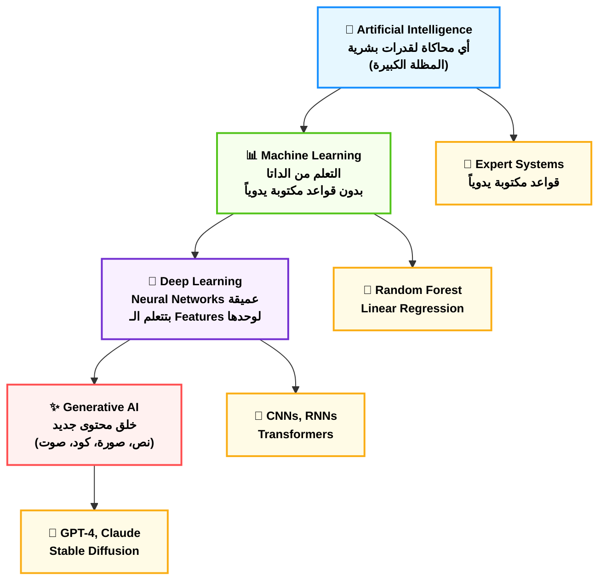
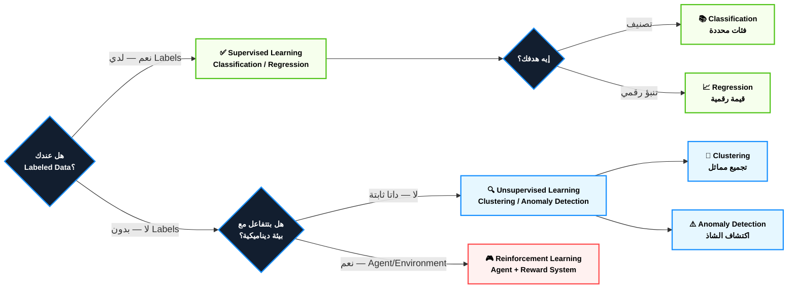
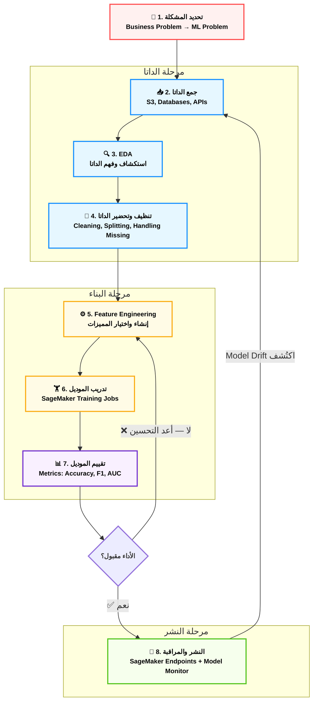
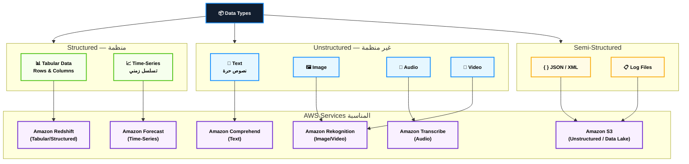
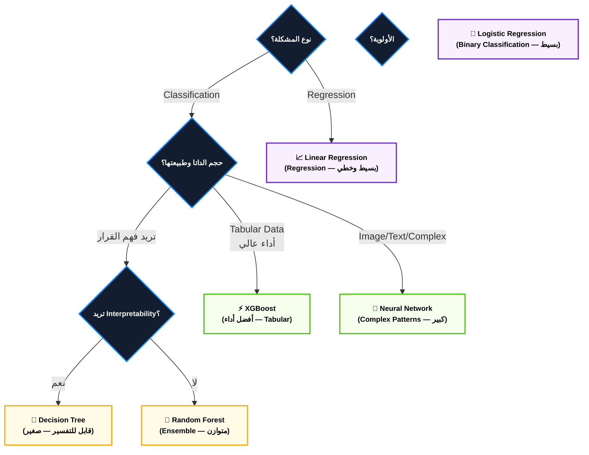
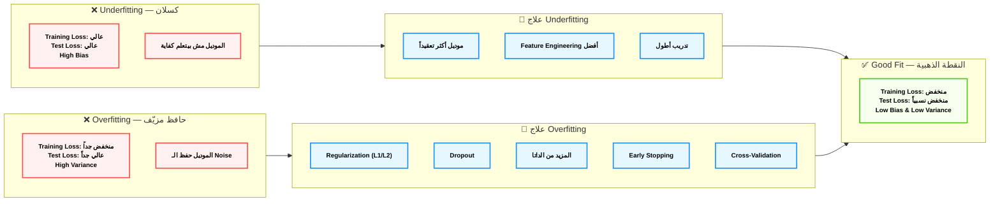
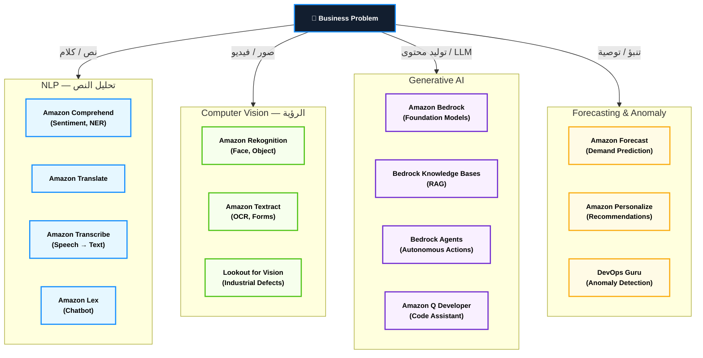
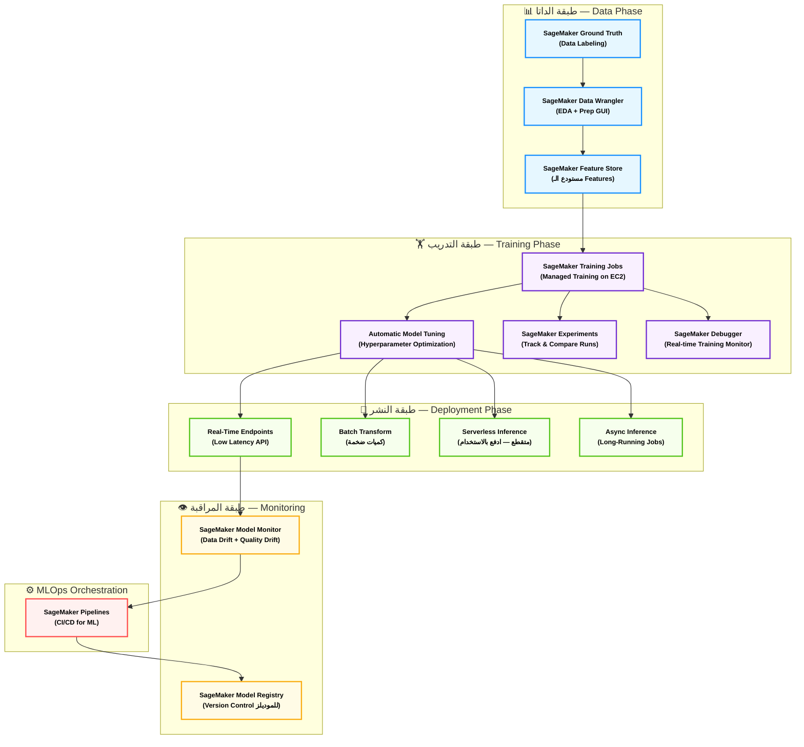
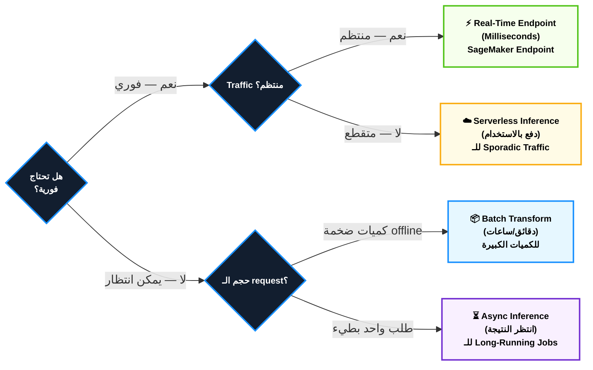

# Domain 1: أساسيات الـ AI والـ ML — AIF-C01 Deep Dive Notes
> **الوزن في الامتحان:** 20% من المحتوى المُقيَّم
> **عدد الأسئلة التقريبي:** ~10 أسئلة من أصل 65
> **آخر تحديث:** يونيو 2026

---

## 📋 فهرس المحتوى

1. [الخريطة الكبيرة — إيه الفرق بين AI وML وDeep Learning وGenAI؟](#1-الخريطة-الكبيرة)
2. [أنواع الـ Machine Learning — الأساليب التلاتة](#2-أنواع-الـ-machine-learning)
3. [الـ ML Pipeline — رحلة الداتا من الخام للموديل](#3-الـ-ml-pipeline)
4. [أنواع الداتا في عالم الـ AI](#4-أنواع-الداتا)
5. [الـ Supervised Learning Algorithms بالتفصيل](#5-الـ-supervised-learning-algorithms)
6. [الـ Loss Function وفخ الـ Overfitting والـ Underfitting](#6-الـ-loss-function-وفخاخ-التدريب)
7. [الـ Neural Networks والـ Deep Learning من الجذور](#7-الـ-neural-networks-والـ-deep-learning)
8. [حالات الاستخدام العملية للـ AI — Use Cases](#8-حالات-الاستخدام-العملية)
9. [الـ ML Development Lifecycle على AWS](#9-الـ-ml-development-lifecycle-على-aws)
10. [الـ Inferencing — ازاي الموديل بيشتغل بعد ما يتدرب](#10-الـ-inferencing)
11. [ملخص شفرات الامتحان الكبير — Master Exam Codes](#11-ملخص-شفرات-الامتحان)

---

## 1. الخريطة الكبيرة

**أصل الحكاية (The Core Problem):**

تخيل إنك صحيت الصبح وشوفت الأخبار فيها كلمتين بيتخلطوا مع بعض: "الذكاء الاصطناعي أتقن لعبة الشطرنج"، "الـ Machine Learning حسّن خوارزمية التوصية على يوتيوب"، "الـ Deep Learning بيشخّص السرطان"، "الـ Generative AI بتكتب كود". الكلام ده كله صح، لكنه بيخلّط في دماغك. الأربعة مش نفس الشيء — هما طبقات متداخلة زي البصلة. لو مش فاهم الفرق، هتلتغط في أول سؤال في الامتحان.

### ⚙️ تشريح الأربع طبقات — من الأكبر للأصغر

#### أ. الـ Artificial Intelligence (AI) — "العقل المصطنع الكبير"
الـ AI ده المظلة الكبيرة — أي نظام كمبيوتر بيحاكي قدرات بشرية زي التفكير والتعلم واتخاذ القرار. من زمان، الـ AI كانت بتتبنى قواعد يكتبها إنسان يدوياً (Expert Systems). يعني كنا بنقوله: "لو درجة الحرارة أكتر من 38، قول للمريض عنده حمى." القواعد دي بتشتغل كويس... لحد ما الدنيا تتعقد.

#### ب. الـ Machine Learning (ML) — "آلة التعلم الذاتي"
الـ ML هي الثورة اللي قلبت المعادلة. بدل ما إنت بتكتب القواعد، إنت **بتكتب خوارزمية تتعلم القواعد لوحدها من الداتا**. ده الفرق الجوهري:

- **الـ Traditional Programming:** `Data + Rules → Output`
- **الـ Machine Learning:** `Data + Output → Rules (Model)`

مثال مصري: بدل ما تكتب كود يقول "لو السعر أكتر من 2 مليون جنيه والمساحة أقل من 100 متر، المنطقة ده غالي" — إنت بتديله ألاف صفقات العقارات في مصر ومنطقتها وأسعارها، وهو يتعلم القواعد ده لوحده.

#### ج. الـ Deep Learning (DL) — "العقل المحاكي للأعصاب"
الـ Deep Learning هي نوع مخصوص من الـ ML بيستخدم **Artificial Neural Networks** بطبقات كتير (من هنا كلمة "Deep"). الفرق إنها بتتعلم **التمثيلات (Representations)** من الداتا لوحدها — مش محتاجة إنت تستخرج الـ Features يدوياً.

قبل الـ Deep Learning، لو عايز تتعرف على صور قطط — كنت لازم تقوله إنت: "دور على ودانين مدببين، عيون لوزاوية، شوارب..." الـ Deep Learning اتعلم ده لوحده من ملايين الصور.

#### د. الـ Generative AI (GenAI) — "فنان الخلق من العدم"
الـ GenAI هي نوع من الـ Deep Learning متخصص في **إنتاج محتوى جديد** (نص، صور، كود، صوت، فيديو). الفرق إن النماذج التقليدية كانت **تصنّف أو تتنبأ** — GenAI **تخلق**. 

الـ Foundation Models (زي Claude, GPT-4, Gemini) هما القلب — نماذج اتدربت على داتا هائلة وممكن تتخصص في مهام مختلفة.

> [!danger] فخ الامتحان 🚨
> الامتحان بيحب يسألك: "هل كل الـ ML هو Deep Learning؟" — الإجابة **لأ**. الـ Deep Learning هي **subset** من الـ ML. وكل الـ GenAI هو **subset** من الـ Deep Learning. زي حلقات متداخلة مش مترادفات.

> [!info] نصيحة الحل السريع
> لو الامتحان قالك "Foundation Model" أو "Large Language Model" — إنت في منطقة الـ GenAI. لو قالك "predict house prices" أو "classify images" — إنت في الـ ML العادي. لو قالك "generate new content" — **GenAI حتماً**.

### 📊 شفرات الامتحان: الفرق بين الطبقات الأربعة

| السيناريو في الامتحان (Keyword) | الإجابة الصحيحة |
|---|---|
| System that mimics human decision-making | **Artificial Intelligence (AI)** |
| Learn patterns from data without explicit rules | **Machine Learning (ML)** |
| Automatically learn features from raw data | **Deep Learning** |
| Create new text/images/code from a prompt | **Generative AI** |
| Uses layers of artificial neurons | **Deep Learning / Neural Networks** |
| Foundation Model / LLM | **Generative AI** |
| Rules written manually by domain experts | **Traditional AI / Expert Systems** |

---

## 2. أنواع الـ Machine Learning

**أصل الحكاية (The Core Problem):**

تخيل إنك بتدرّب موظف جديد في بنك. عندك ٣ طرق تعليم مختلفة تماماً: الطريقة الأولى — تيجيله بملفات عملاء قديمة ومكتوب عليها "العميل ده دفع / ما دفعش" وتقوله "اتعلم". الطريقة التانية — تيجيله بملفات بس بدون أي تصنيف وتقوله "دور لوحدك على patterns غريبة في الداتا". الطريقة التالتة — تعمله لعبة محاكاة: لو اتخذ قرار صح، يأخذ نقطة؛ لو غلط، بتخصم. الـ ML بالظبط عنده نفس الـ ٣ أساليب.

### ⚙️ تشريح أنواع الـ Learning الثلاثة

#### 1. الـ Supervised Learning — "التعلم بالإجابة النموذجية"

ده أشهر نوع وأكتر نوع هتشوفه في الامتحان. **بتديه داتا مُعلَّمة (Labeled Data)** — يعني كل صف فيه Input وكمان فيه الـ Output الصحيح. الموديل بيتعلم يربط بينهم.

**نوعين رئيسيين:**
- **Classification:** الـ Output فئة (Category). مثال: البريد الإلكتروني ده Spam ولا مش Spam؟ السرطان ده خبيث ولا حميد؟
- **Regression:** الـ Output رقم مستمر. مثال: سعر الشقة في المهندسين هيكون إيه؟ كمية المطر بكرة هتكون كام مليمتر؟

**أمثلة خوارزميات:**
- Linear Regression (للـ Regression)
- Logistic Regression (للـ Classification رغم الاسم الـ misleading!)
- Decision Trees, Random Forests, XGBoost (للتنين)
- Neural Networks (للتنين وبقوة أكبر)

#### 2. الـ Unsupervised Learning — "التعلم بدون مرشد"

هنا الداتا **مش مُعلَّمة** — مفيش إجابات صح وغلط. الموديل بيدور لوحده على **بنية أو patterns خفية** في الداتا.

**أشهر التطبيقات:**
- **Clustering:** تقسيم العملاء لمجموعات متشابهة بدون تصنيف مسبق (مثال: تطبيق Vodafone Cash يقسّم المستخدمين لـ segments تلقائياً)
- **Dimensionality Reduction:** تقليل عدد المتغيرات مع الحفاظ على المعنى (زي PCA — Principal Component Analysis)
- **Anomaly Detection:** اكتشاف الحالات الشاذة (غسيل الأموال في البنوك المصرية)
- **Association Rules:** "اللي اشترى X اشترى كمان Y" — مثل توصيات Noon.com

#### 3. الـ Reinforcement Learning (RL) — "تعلم المكافأة والعقاب"

ده الأغرب من بينهم. مفيش داتا ثابتة من الأول — في **Agent** بيتفاعل مع **Environment**، وعلى أساس كل قرار بياخد **Reward** أو **Penalty**. الهدف: يتعلم الاستراتيجية اللي تعظّم المكافآت على المدى البعيد.

مثال أشهر: AlphaGo من DeepMind اللي تعلم لعبة الـ Go وهزم أبطال العالم. كمان بيُستخدم في:
- تحسين حركة مرور الشبكات
- Robotics (تعليم الروبوت يمشي)
- تحسين بيانات التوصية في التطبيقات

> [!warning] تحذير تقني مهم
> الـ Reinforcement Learning **مش بيُستخدم في معظم business applications** على AWS. هو موجود نظرياً في الامتحان، لكن لو السؤال عن تطبيق تجاري حقيقي (customer churn, fraud detection, recommendation) — الإجابة دايماً Supervised أو Unsupervised، مش RL.

#### 4. الـ Semi-Supervised Learning — "النوع الرابع الخفي"

مش بيجي كتير في الامتحان، لكن مهم تعرفه: **شوية داتا معلّمة (Labeled) وكتير غير معلّمة (Unlabeled)**. الموديل بيستخدم الـ Labeled عشان يفهم البنية ويطبّق على الـ Unlabeled. مفيد لما التعليم (Labeling) غالي جداً.

#### 5. الـ Self-Supervised Learning — "أساس الـ GenAI"

ده الأهم في عالم الـ GenAI. النموذج بيعلّم نفسه من الداتا نفسها بدون labels بشرية. مثال: الـ LLM بياخد جملة ويخبّي كلمة ويحاول يتنبأ بيها. الـ Label بييجي من الداتا نفسها. ده اللي اتدرب عليه GPT وClaude.

### 📊 شفرات الامتحان: نوع الـ Learning

| السيناريو في الامتحان (Keyword) | الإجابة الصحيحة |
|---|---|
| Training data includes correct answers / labels | **Supervised Learning** |
| Predict a category (yes/no, spam/not spam) | **Classification** |
| Predict a numeric value (price, temperature) | **Regression** |
| No labels, find hidden patterns | **Unsupervised Learning** |
| Group similar customers automatically | **Clustering (Unsupervised)** |
| Detect fraudulent transactions automatically | **Anomaly Detection (Unsupervised)** |
| Agent learns by receiving rewards/penalties | **Reinforcement Learning** |
| LLM trained to predict next word | **Self-Supervised Learning** |
| Limited labeled data, large unlabeled dataset | **Semi-Supervised Learning** |

---

## 3. الـ ML Pipeline

**أصل الحكاية (The Core Problem):**

الغلطة اللي بيعملها المبتدئين: بيفكروا إن الـ ML هي "تاخد داتا → تدرّب موديل → خلصت". ده غلط تماماً. في الحقيقة، الـ ML هو **pipeline متكامل** من 8 مراحل، وكل مرحلة ممكن تبقى العقبة الأساسية اللي بتوقّف المشروع كله. في ITI والـ AIF-C01، لازم تفهم كل مرحلة وعلاقتها بالتانية.

### ⚙️ تشريح الـ 8 مراحل الكاملة

#### المرحلة 1: تحديد المشكلة — "صياغة الرسالة"
قبل أي داتا، لازم تعرف **إيه السؤال بالظبط**. هل إنت بتعمل Classification ولا Regression ولا Clustering؟ هل الهدف تقليل الـ False Positives ولا الـ False Negatives؟ 

مثال مصري: لو بنك مصر عايز يتنبأ بمن مش هيدفع القرض — الهدف تقليل الـ False Negatives (عملاء هيتنبأ بهم كـ"هيدفع" وهم مش هيدفعوا)، حتى لو ده معناه إننا نرفض بعض العملاء الكويسين.

#### المرحلة 2: جمع الداتا — "صيد البيانات"
الداتا بييجي من:
- **Databases داخلية** (المعاملات، logs، إلخ)
- **APIs خارجية** (social media, weather data)
- **Web Scraping** (بحذر قانوني)
- **Data Lakes على AWS S3** (للداتا غير المنظمة)
- **Data Warehouses** (Amazon Redshift للداتا المنظمة)

#### المرحلة 3: استكشاف وتحليل الداتا — "EDA — العدسة المكبّرة"
الـ **Exploratory Data Analysis** هي المرحلة اللي بتفهم فيها طبيعة داتاك قبل ما تحاول تبني أي موديل:
- توزيع القيم (Distribution)
- القيم المفقودة (Missing Values)
- القيم الشاذة (Outliers)
- العلاقات بين المتغيرات (Correlations)

على AWS: **Amazon SageMaker Data Wrangler** بيعمل EDA بـ GUI من غير كود.

#### المرحلة 4: تحضير وتنظيف الداتا — "مطبخ الداتا"
دي من أطول المراحل وأكتر واحدة بتاخد وقت (70% من وقت المشروع في الغالب!):
- **Data Cleaning:** تعامل مع القيم المفقودة (حذف / استبدال بالمتوسط / interpolation)
- **Handling Outliers:** حذف أو معالجة القيم الشاذة
- **Data Transformation:** تحويل التواريخ، encoding الفئات
- **Data Splitting:** تقسيم الداتا لـ Training / Validation / Test sets

> [!info] نصيحة ذهبية
> **قاعدة 70/15/15** الكلاسيكية: 70% Training, 15% Validation, 15% Test. لكن لو داتاك صغيرة، ممكن تعمل **K-Fold Cross Validation** بدل التقسيم الثابت.

#### المرحلة 5: هندسة المميزات — "Feature Engineering — فن الصياغة"
ده الفرق بين Data Scientist عادي ومتميز. **إنت بتخلق features جديدة أو بتختار الـ features الأهم**:
- **Feature Creation:** مثلاً من تاريخ الميلاد بتستخرج العمر
- **Feature Selection:** اختيار الـ features الأكثر تأثيراً
- **Feature Scaling:** Normalization / Standardization (مهم جداً للخوارزميات بتستخدم المسافات)
- **Encoding:** تحويل الـ Categorical features لأرقام (One-Hot Encoding, Label Encoding)

#### المرحلة 6: اختيار وتدريب الموديل — "وقت التعلم"
بتختار الخوارزمية المناسبة (Classification؟ Regression؟ Clustering؟) وبتدرّبها على الـ Training Set. على AWS: **Amazon SageMaker Training Jobs**.

#### المرحلة 7: تقييم الموديل — "ميزان الحكم"
بتقيس أداء الموديل على الـ Test Set (الداتا اللي ما شافهاش أثناء التدريب):
- **Classification Metrics:** Accuracy, Precision, Recall, F1-Score, AUC-ROC
- **Regression Metrics:** MAE, MSE, RMSE, R²

#### المرحلة 8: النشر والمراقبة — "الإطلاق وما بعده"
الموديل بيتنشر كـ API Endpoint. على AWS: **SageMaker Endpoints**. المراقبة المستمرة (Monitoring) مهمة عشان تكتشف **Model Drift** (لما أداء الموديل يبدأ يتراجع لأن الداتا الحقيقية تغيّرت).

> [!tip] التريكة المعمارية
> في الامتحان لو سألك "أي مرحلة بتاخد أطول وقت في ML؟" — الإجابة دايماً **Data Preparation / Feature Engineering**. مش التدريب. الداتا هي العمل الحقيقي.

---

## 4. أنواع الداتا

**أصل الحكاية (The Core Problem):**

مش كل الداتا بالتساوي. الموديل اللي بتبنيه مش هو اللي بيحدد النتيجة — **نوع وجودة الداتا** هما اللي بيحددوا. فاهم ده؟ ممكن يكون عندك أحسن خوارزمية في العالم، لو الداتا بتاعتك مش مناسبة أو مش نظيفة — النتيجة هتكون كارثية. في الـ AIF-C01، محتاج تفهم التصنيفات المختلفة للداتا وامتى تستخدم كل نوع.

### ⚙️ تصنيفات الداتا الأساسية

#### أ. التصنيف الأول: Labeled vs. Unlabeled

- **Labeled Data — "الداتا المُوسومة":** كل مثال فيه الـ input والـ output الصحيح. مثال: صورة قطة عليها tag "قطة". ضروري للـ Supervised Learning. **مكلفة جداً في إنتاجها** — بتحتاج بشر يعلّموها.
- **Unlabeled Data — "الداتا الخام":** بيانات بدون تصنيف. رخيصة ووفيرة. بتُستخدم في الـ Unsupervised Learning والـ Self-Supervised Learning.

#### ب. التصنيف الثاني: Structured vs. Unstructured

**Structured Data — "الداتا المنظمة":**
- بيانات في جداول (Rows & Columns)
- كل عمود له معنى محدد ونوع بيانات ثابت
- أمثلة: بيانات عملاء البنك، فواتير الكهرباء، معاملات Vodafone Cash
- بتُخزّن في Relational Databases أو Data Warehouses (Amazon Redshift)
- الـ ML الكلاسيكي (XGBoost, Random Forest) بيشتغل عليها بكفاءة

**Unstructured Data — "الداتا المنفلتة":**
- مفيش شكل ثابت — كل عينة ممكن تكون مختلفة عن التانية
- أمثلة: صور، ملفات صوت، فيديوهات، نصوص حرة، PDF
- بتُخزّن في Data Lakes (Amazon S3)
- الـ Deep Learning هو الأقوى في التعامل معاها
- **80% من الداتا في العالم Unstructured**

**Semi-Structured Data — "بين الاتنين":**
- فيها شكل نسبي لكن مش جدول ثابت
- أمثلة: JSON, XML, CSV مع قيم متغيرة
- أمثلة: بيانات الـ API responses, log files

#### ج. التصنيف الثالث: حسب نوع المحتوى

| نوع الداتا | التعريف | أمثلة | الـ AWS Service |
|---|---|---|---|
| **Tabular** | جداول رقمية وفئوية | بيانات عملاء، معاملات | SageMaker, Redshift |
| **Text** | نصوص حرة بكل اللغات | مراجعات، ايميلات، تغريدات | Comprehend, Bedrock |
| **Image** | صور بكل أشكالها | صور منتجات، X-rays | Rekognition, SageMaker |
| **Audio** | ملفات صوتية | مكالمات call center | Transcribe |
| **Video** | تسلسل من الصور + صوت | تسجيلات، مراقبة | Rekognition Video |
| **Time-Series** | قيم مرتبة زمنياً | أسعار البورصة، IoT sensors | Forecast, Lookout |

#### د. مفهوم الـ Data Quality — "النظافة أساس النجاح"

الداتا النظيفة بتتميز بـ:
- **Completeness:** مفيش قيم مفقودة بشكل مبالغ
- **Accuracy:** البيانات صحيحة وما فيهاش أخطاء إدخال
- **Consistency:** نفس المفهوم مش بيُعبَّر عنه بطرق مختلفة في أماكن مختلفة
- **Timeliness:** الداتا حديثة ومش قديمة جداً

> [!warning] تحذير تقني
> **"Garbage In, Garbage Out"** — لو ديتك مش نظيفة ومش ممثّلة للواقع، الموديل هيتعلم الغلط بكفاءة عالية جداً. السرطان الحقيقي في الـ ML مش في الخوارزمية — في جودة الداتا.

#### هـ. مفهوم الـ Data Labeling على AWS

لما بتحتاج تعلّم الداتا Unstructured:
- **Amazon SageMaker Ground Truth:** خدمة توظّف بشر (أو AI مُساعد) لتعليم الداتا
- **Amazon SageMaker Ground Truth Plus:** نسخة مُدارة بالكامل
- **Mechanical Turk:** منصة AWS للـ Crowdsourcing في تعليم الداتا

### 📊 شفرات الامتحان: أنواع الداتا

| السيناريو في الامتحان (Keyword) | الإجابة الصحيحة |
|---|---|
| Data stored in rows and columns | **Structured / Tabular Data** |
| Images, videos, audio files | **Unstructured Data** |
| Sensor readings over time / stock prices | **Time-Series Data** |
| Data without category labels | **Unlabeled Data** |
| JSON logs from applications | **Semi-Structured Data** |
| Expensive to produce, requires human annotation | **Labeled Data** |
| Store unstructured data at scale on AWS | **Amazon S3 (Data Lake)** |
| Human-in-the-loop data labeling on AWS | **SageMaker Ground Truth** |

---

## 5. الـ Supervised Learning Algorithms

**أصل الحكاية (The Core Problem):**

حضرت كورس ML كامل واتعلمت ٢٠ خوارزمية؟ كويس. بس في الامتحان مش هيسألك تكتب الكود — هيسألك: "في السيناريو ده، أنهي خوارزمية تختار؟" ده سؤال حكمة مش سؤال حفظ. الـ AIF-C01 محتاج تعرف الـ intuition وراء كل خوارزمية وامتى تستخدمها.

### ⚙️ الخوارزميات الأساسية بالتفصيل

#### 1. الـ Linear Regression — "خط المستقيم الأمين"

**الفكرة الجوهرية:** إنت بتفترض إن العلاقة بين الـ Input والـ Output **خطية** — يعني ممكن تُعبَّر عنها بمعادلة `y = mx + b`. الموديل بيدور على أفضل قيم لـ m وb عشان يقلّل الخطأ.

- **المشكلة:** Regression (تنبؤ بقيمة رقمية)
- **متى تستخدمه؟** لما تظن إن في علاقة خطية، وعايز تفسير واضح (Interpretable)
- **عيوبه:** بيفشل مع العلاقات غير الخطية

#### 2. الـ Logistic Regression — "الـ Classifier المتنكّر في زي Regression"

**الفكرة الجوهرية:** رغم الاسم، ده **Classification وليس Regression!** بيستخدم دالة الـ Sigmoid لتحويل أي رقم لـ probability بين 0 و1، ثم يحدد الفئة.

- **المشكلة:** Binary Classification (فئتين فقط: 0 أو 1)
- **متى تستخدمه؟** سؤال "هل؟" — هل العميل سيغادر؟ هل البريد spam؟
- **الميزة:** سريع، Interpretable، بيديك Probabilities

> [!danger] فخ الامتحان 🚨
> **Logistic Regression = Classification مش Regression!** الامتحان بيحب يتأكد إنك فاهم ده. الاسم خادع. لو السؤال قال "Binary Classification, interpretable model, simple" — الإجابة Logistic Regression.

#### 3. الـ Decision Tree — "شجرة القرار"

**الفكرة الجوهرية:** الموديل بيتعلم سلسلة من الـ "إذا/وإلا" (If/Else) المتداخلة. كل node في الشجرة بيسأل سؤال عن feature معين، والـ leaf nodes (الأوراق) هي القرارات النهائية.

- **الميزة الكبيرة:** سهل الفهم والتفسير البصري — مهم في القطاعات المنظَّمة زي البنوك والتأمين
- **العيب:** بيعمل Overfitting بسهولة (يحفظ الـ Training Data جامد)

#### 4. الـ Random Forest — "الغابة الحكيمة"

**الفكرة الجوهرية:** بدل ما تثق في شجرة واحدة (ممكن تبقى مغالطة)، بتبني **مئات الأشجار** كل واحدة منهم بتترن على **sample عشوائي** من الداتا وعلى **subset عشوائي** من الـ features. القرار النهائي هو **التصويت الأغلبي** (للـ Classification) أو **المتوسط** (للـ Regression).

- **مفهوم رئيسي: Ensemble Learning** — قوة المجموعة أكبر من قوة الفرد
- **الميزة:** أقاوم للـ Overfitting من الـ Decision Tree الواحد
- **العيب:** أقل Interpretability (صعب تفسّر ١٠٠٠ شجرة)

#### 5. الـ XGBoost — "بطل الـ Kaggle" و"فرعون الـ Tabular Data"

**الفكرة الجوهرية:** **Gradient Boosting** — بيبني الأشجار بشكل **تسلسلي**: كل شجرة جديدة بتتعلم من **أخطاء** الشجرة اللي قبلها. مش تصويت — إصلاح تدريجي.

- **الـ XGBoost** هو تطبيق مُحسَّن للـ Gradient Boosting
- **على AWS:** بيشتغل بكفاءة عالية مع **SageMaker** وعنده built-in algorithm
- **الميزة:** أداء استثنائي على الـ Tabular Data، سرعة، مقاومة للـ Overfitting
- **متى تستخدمه؟** أغلب مشاكل الـ Tabular Classification/Regression

> [!tip] التريكة المعمارية
> في الامتحان: "best algorithm for tabular data with high performance" = **XGBoost**. ده الإجابة الذهبية للـ Tabular Data في الـ AWS ecosystem.

#### 6. الـ K-Nearest Neighbors (KNN) — "الجيران الشاهدين"

**الفكرة الجوهرية:** لما ييجيلك مثال جديد، بتدور على أقرب K أمثلة في الـ Training Data (بالمسافة في الـ Feature Space) وبتتوقع بناءً على أغلبيتهم.

- **بدون تدريب حقيقي!** — الموديل بيحتفظ بكل الداتا ويستخدمها وقت الـ Inference
- **مشكلة:** بطيء جداً على الـ Large Datasets، حساس للـ Scaling

#### 7. الـ Support Vector Machine (SVM) — "الحد الفاصل الأمثل"

**الفكرة الجوهرية:** بيدور على **الخط الفاصل الأمثل** (Hyperplane) بين الفئتين اللي **يُعظّم الهامش** (Margin) بين أقرب نقاط من كل فئة.

- **مميزة في:** الـ High-Dimensional Spaces (متغيرات كتير)، البيانات الصغيرة أو المتوسطة
- **الـ Kernel Trick:** بيخلّيها تتعامل مع العلاقات غير الخطية

### 📊 شفرات الامتحان: اختيار الخوارزمية

| السيناريو في الامتحان (Keyword) | الإجابة الصحيحة |
|---|---|
| Predict a numeric value with linear relationship | **Linear Regression** |
| Predict yes/no with explainable model | **Logistic Regression** |
| Need to explain model decisions in banking/insurance | **Decision Tree** |
| High accuracy on tabular data, AWS built-in | **XGBoost** |
| Reduce overfitting, ensemble of trees | **Random Forest** |
| Image recognition / Natural language processing | **Neural Network / Deep Learning** |
| Best performance for structured/tabular data competitions | **XGBoost (Gradient Boosting)** |

---

## 6. الـ Loss Function وفخاخ التدريب

**أصل الحكاية (The Core Problem):**

تخيل طالب بيذاكر للامتحان. في ناس بيذاكروا بالطريقة الغلط: بيحفظوا الكتاب كلمة كلمة وبعدين في الامتحان الحقيقي بيرسبوا لأن الأسئلة مختلفة. في ناس تانية بيذاكروا بسطحية وما بيحفظوش حاجة. الـ Machine Learning عنده نفس المشكلتين بالظبط — وعندهم أسماء تقنية: **Overfitting** و**Underfitting**. فهم الاتنين ده فرق الامتحان.

### ⚙️ ثالوث الحكمة: Loss, Overfitting, Underfitting

#### أ. الـ Loss Function — "بوصلة التدريب"

**الفكرة الجوهرية:** الـ Loss Function هي الدالة الرياضية اللي بتقيس **قد إيه الموديل غلط**. أثناء التدريب، الموديل بيحاول يقلّل قيمتها لأدنى درجة ممكنة.

**أشهر الـ Loss Functions:**
- **MSE (Mean Squared Error):** للـ Regression — متوسط مربع الفرق بين التوقع والحقيقة. بيعاقب الأخطاء الكبيرة أكتر
- **Cross-Entropy Loss:** للـ Classification — بتقيس الفرق بين الـ probability المتوقعة والفعلية
- **MAE (Mean Absolute Error):** للـ Regression — أقل حساسية للـ Outliers من MSE

**ازاي الموديل بيتعلم؟**
الـ **Gradient Descent** هو الخوارزمية: بتحسب اتجاه الانحدار في الـ Loss Function وتحدّث الـ Weights في الاتجاه اللي بيقلّل الـ Loss. زي إنت على جبل بتحاول تنزل للأسفل خطوة خطوة.

#### ب. الـ Overfitting — "موديل الحافظ المزيّف"

**التعريف:** الموديل اتعلم الـ Training Data **بشكل مفرط**، بما في ذلك الضوضاء (Noise) والشذوذات. أداؤه على الـ Training Set ممتاز، لكن على الداتا الجديدة — كارثة.

**العلامات:**
- Training Loss منخفض جداً
- Validation/Test Loss مرتفع جداً
- فرق كبير بينهم = Overfitting

**الأسباب:**
- الموديل معقد جداً (كتير parameters)
- الداتا قليلة جداً
- التدريب طويل جداً

**الحلول:**
- **Regularization:** إضافة عقوبة على الـ parameters الكبيرة (L1/L2)
- **Dropout:** (في الـ Neural Networks) بيوقف عشوائياً neurons أثناء التدريب
- **More Data:** زيادة حجم الـ Training Data
- **Early Stopping:** وقف التدريب لما الـ Validation Loss يبدأ يرتفع
- **Simplify Model:** استخدام موديل أبسط

#### ج. الـ Underfitting — "موديل الكسلان"

**التعريف:** الموديل **مش متعلمش كفاية** — مش قادر يلتقط الـ patterns الأساسية في الداتا. أداؤه ضعيف على الـ Training Set نفسه.

**الأسباب:**
- الموديل بسيط جداً (مثلاً Linear Model لداتا غير خطية)
- Features قليلة أو مش معبّرة
- التدريب وقف بدري

**الحلول:**
- موديل أكبر وأكثر تعقيداً
- Feature Engineering أفضل
- تدريب لفترة أطول

#### د. الـ Bias-Variance Tradeoff — "التوازن الصعب"

- **High Bias = Underfitting:** الموديل بيعمل افتراضات مبسّطة جداً عن الداتا
- **High Variance = Overfitting:** الموديل حساس جداً لتفاصيل الـ Training Data
- **الهدف:** إيجاد النقطة الذهبية اللي فيها Bias وVariance منخفضين قدر المستطاع

#### هـ. مقاييس التقييم — "أرقام الحقيقة"

**للـ Classification:**

| المقياس | المعادلة البسيطة | امتى يهمّك |
|---|---|---|
| **Accuracy** | صح / الكل | لو الـ classes متوازنة |
| **Precision** | TP / (TP + FP) | لو تكلفة الـ False Positive عالية (spam filter) |
| **Recall (Sensitivity)** | TP / (TP + FN) | لو تكلفة الـ False Negative عالية (cancer detection) |
| **F1-Score** | 2×P×R / (P+R) | لو عايز توازن بين الاتنين |
| **AUC-ROC** | مساحة تحت منحنى ROC | تقييم عام لجودة الـ classifier |

**للـ Regression:**

| المقياس | ما بيقيسه |
|---|---|
| **MAE** | متوسط الخطأ المطلق — سهل التفسير |
| **MSE** | متوسط مربع الخطأ — يعاقب الأخطاء الكبيرة |
| **RMSE** | جذر MSE — نفس وحدات الـ output |
| **R²** | نسبة التباين اللي الموديل بيفسّره (الأعلى أحسن) |

> [!danger] فخ الامتحان 🚨
> **لو السؤال عن كشف السرطان أو الاحتيال المالي** — المقياس المهم هو **Recall (Sensitivity)** مش Accuracy! لأن الـ False Negative (تشخيص مريض صح كأنه مريض سليم) أخطر من الـ False Positive.

### 📊 شفرات الامتحان: Loss وOverfitting

| السيناريو في الامتحان (Keyword) | الإجابة الصحيحة |
|---|---|
| High training accuracy, low test accuracy | **Overfitting** |
| Low accuracy on both training and test | **Underfitting** |
| Reduce overfitting in neural networks | **Dropout / Regularization / Early Stopping** |
| Measure to minimize during training | **Loss Function** |
| Best metric for imbalanced dataset (fraud detection) | **F1-Score / AUC-ROC** |
| Best metric when False Negatives are costly | **Recall (Sensitivity)** |
| Best metric when False Positives are costly | **Precision** |

---

## 7. الـ Neural Networks والـ Deep Learning

**أصل الحكاية (The Core Problem):**

لحد ٢٠١٢، كانت الـ Machine Learning التقليدية في ذروتها. بعدين جه AlexNet (شبكة عصبية عميقة) وفاز في مسابقة ImageNet بفارق ضخم عن كل الخوارزميات التقليدية. ده أعلن الثورة. السبب: الـ Deep Learning بتتعلم **تمثيلات (Representations)** الداتا المعقدة تلقائياً بدون ما حد يقولها "دور على الحواف" أو "دور على الألوان". في الـ AIF-C01، محتاج تفهم البنية الأساسية وليه هي مختلفة.

### ⚙️ تشريح الـ Neural Network من الجذور

#### أ. الـ Neuron الصناعي — "الخلية العصبية المصطنعة"

الـ Artificial Neuron بيحاكي الـ Biological Neuron البشري:
1. **Inputs:** بياخد قيم متعددة (زي الإشارات الكيميائية)
2. **Weights:** كل input بيتضرب في وزن (بيعبّر عن أهميته)
3. **Summation:** بيجمع كل الـ (Input × Weight)
4. **Bias:** بيضيف ثابت للمرونة
5. **Activation Function:** بيطبّق دالة تحويل على المجموع النهائي

**Activation Functions الشهيرة:**
- **ReLU (Rectified Linear Unit):** أشهرهم وأبسطهم: `f(x) = max(0, x)` — لو الناتج سالب، يبقى صفر
- **Sigmoid:** بتحوّل أي رقم لقيمة بين 0 و1 — مثالية لآخر Layer في الـ Binary Classification
- **Softmax:** بتحوّل vector من الأرقام لـ probability distribution — للـ Multi-class Classification
- **Tanh:** بتحوّل لقيم بين -1 و1

#### ب. الـ Feedforward Neural Network — "البنية الأساسية"

التركيب الكلاسيكي:
- **Input Layer:** بياخد الـ Features
- **Hidden Layers:** تحسب الـ Representations المعقدة. كل طبقة بتتعلم مستوى أعلى من التجريد
- **Output Layer:** بيطلع النتيجة (class probability أو قيمة رقمية)

الـ **Backpropagation** هي خوارزمية تعديل الـ Weights: بتحسب كيف أثر كل weight في الـ Loss وبتعدّله. هي + Gradient Descent = آلية التعلم الكاملة.

#### ج. أشهر أنواع الـ Deep Learning Networks

**1. الـ CNN (Convolutional Neural Network) — "حارس الصور"**
- متخصص في الصور والبيانات الشبكية (Grid-like)
- بيستخدم **Convolution Filters** تمسح على الصورة وتستخرج Features (حواف، ألوان، أشكال)
- **أمثلة استخدام:** تصنيف الصور، Detection، Segmentation
- **على AWS:** SageMaker Image Classification, Rekognition

**2. الـ RNN (Recurrent Neural Network) — "ذاكرة التسلسل"**
- متخصص في البيانات التسلسلية (النص، الصوت، Time-Series)
- بيحتفظ بـ "ذاكرة" من الخطوات السابقة
- **المشكلة:** الـ Vanishing Gradient Problem — الذاكرة بتتلاشى مع الأجزاء البعيدة
- **الحل:** LSTM (Long Short-Term Memory) وGRU

**3. الـ Transformer — "ثورة الـ NLP والـ GenAI"**
- معمارية ثورية ظهرت في ورقة "Attention Is All You Need" (2017)
- بدل الـ Sequential processing، بيعالج كل الكلمات **في نفس الوقت (Parallel)**
- **الـ Attention Mechanism:** بيحدد أي أجزاء من الـ Input أهم لفهم كل جزء
- ده الأساس لكل الـ LLMs: GPT, Claude, Gemini, BERT

> [!info] نصيحة الحل السريع
> في الامتحان: أي حاجة عن LLM أو Foundation Model → **Transformer Architecture**. أي حاجة عن صور → **CNN**. أي حاجة عن time-series أو audio تقليدي → **RNN/LSTM**.

```mermaid
flowchart TD
    classDef default font-weight:bold,font-size:12px,stroke-width:2px;
    classDef cnn fill:#e6f7ff,stroke:#1890ff,color:#000;
    classDef rnn fill:#fffbe6,stroke:#faad14,color:#000;
    classDef transformer fill:#f9f0ff,stroke:#722ed1,color:#000;
    classDef input fill:#f6ffed,stroke:#52c41a,color:#000;
    classDef header fill:#121e2f,stroke:#1890ff,stroke-width:2px,color:#fff;

    DL["🧠 Deep Learning<br/>أنواع الشبكات"]

    subgraph CNNBox ["CNN — للصور والـ Grid Data"]
        CNNIn["📷 صورة<br/>(Pixel Matrix)"]
        Conv["🔍 Convolution Layers<br/>(استخراج Features)"]
        Pool["📉 Pooling<br/>(تقليص الحجم)"]
        CNNOut["✅ Class Label<br/>(قطة / كلب)"]
        CNNIn --> Conv --> Pool --> CNNOut
    end

    subgraph RNNBox ["RNN/LSTM — للتسلسلات"]
        RNNIn["📝 كلمة 1 → 2 → 3"]
        RNNCell["🔄 Recurrent Cell<br/>(ذاكرة التسلسل)"]
        RNNOut["✅ الكلمة التالية /<br/>Sentiment"]
        RNNIn --> RNNCell --> RNNOut
    end

    subgraph TrBox ["Transformer — للـ LLMs"]
        TrIn["📝 كل الكلمات دفعة واحدة"]
        Attn["👁️ Multi-Head Attention<br/>(كل كلمة تشوف كل الباقي)"]
        FFN["⚡ Feed-Forward Network"]
        TrOut["✅ Generated Text"]
        TrIn --> Attn --> FFN --> TrOut
    end

    DL --> CNNBox
    DL --> RNNBox
    DL --> TrBox

    class CNNIn,Conv,Pool,CNNOut cnn;
    class RNNIn,RNNCell,RNNOut rnn;
    class TrIn,Attn,FFN,TrOut transformer;
    class DL header;
```

#### د. مفهوم الـ Transfer Learning — "استغلال خبرة الغير"

**الفكرة:** بدل ما تدرّب موديل من الصفر (بيكلّف ملايين الدولارات وأسابيع)، تاخد موديل متدرب مسبقاً على داتا ضخمة، وتعمل **Fine-Tuning** عليه لمهمتك المحددة.

مثال: تاخد ResNet المتدرب على ImageNet (ملايين صورة) وتعمل عليه Fine-Tuning بـ ١٠٠٠ صورة طبية. الموديل بيستخدم خبرته القديمة ويتخصص.

- **على AWS:** SageMaker JumpStart بيوفّر Pre-trained Models جاهزة للـ Fine-Tuning

### 📊 شفرات الامتحان: الـ Neural Networks

| السيناريو في الامتحان (Keyword) | الإجابة الصحيحة |
|---|---|
| Architecture behind LLMs like GPT and Claude | **Transformer** |
| Best for image classification/detection | **CNN (Convolutional Neural Network)** |
| Process sequential data with memory | **RNN / LSTM** |
| Mechanism that allows model to focus on relevant parts | **Attention Mechanism** |
| Reuse a pre-trained model for a new task | **Transfer Learning / Fine-Tuning** |
| Pre-trained models available in AWS for customization | **SageMaker JumpStart** |
| Technique to prevent overfitting in neural networks | **Dropout** |

---

## 8. حالات الاستخدام العملية

**أصل الحكاية (The Core Problem):**

الامتحان مش هيسألك نظريات فقط — هو بيسألك "الشركة دي عندها مشكلة X، أنهي AWS Service أو ML approach الأمثل؟" محتاج تكون قادر تترجم مشكلة تجارية لحل تقني. ده الـ Bridge الأساسي بين الدومين الأول والباقي.

### ⚙️ الـ Use Cases المهمة في الـ AIF-C01

#### 1. معالجة اللغة الطبيعية (NLP)

| الحالة | الـ AWS Service |
|---|---|
| **تحليل المشاعر (Sentiment Analysis)** في مراجعات العملاء | Amazon Comprehend |
| **استخراج الكيانات (NER)** من النصوص (أسماء، تواريخ، أماكن) | Amazon Comprehend |
| **ترجمة النصوص** تلقائياً | Amazon Translate |
| **تحويل الكلام لنص** (call center recordings) | Amazon Transcribe |
| **Chatbot / Virtual Assistant** | Amazon Lex |
| **توليد نص / تلخيص / إجابة على أسئلة** | Amazon Bedrock (LLMs) |

#### 2. رؤية الكمبيوتر (Computer Vision)

| الحالة | الـ AWS Service |
|---|---|
| **التعرف على الوجوه** في صور وفيديوهات | Amazon Rekognition |
| **اكتشاف الـ Objects** في الصور | Amazon Rekognition |
| **تحليل نص في الصور** (OCR) | Amazon Textract |
| **استخراج بيانات من الفواتير والنماذج** | Amazon Textract |
| **فحص جودة المنتجات** في المصانع | Amazon Lookout for Vision |

#### 3. التوصيات والتخصيص

| الحالة | الـ AWS Service |
|---|---|
| **نظام التوصية** (زي Netflix أو Amazon.eg) | Amazon Personalize |
| **Search Personalization** حسب سلوك المستخدم | Amazon Personalize |

#### 4. التنبؤ والتحليل

| الحالة | الـ AWS Service |
|---|---|
| **التنبؤ بالطلب** (Demand Forecasting) | Amazon Forecast |
| **كشف الشذوذ** في الـ Metrics (DevOps) | Amazon DevOps Guru |
| **كشف الشذوذ** في الصور الصناعية | Amazon Lookout for Vision |
| **كشف الشذوذ** في المعدات IoT | Amazon Lookout for Equipment |

#### 5. الـ Generative AI على AWS

| الحالة | الـ AWS Service |
|---|---|
| **الوصول لـ Foundation Models** مختلفة (Claude, Titan, Llama) | Amazon Bedrock |
| **بناء Chatbot** على الداتا الخاصة بالشركة | Bedrock + Knowledge Bases (RAG) |
| **Agents** يتخذون إجراءات تلقائياً | Amazon Bedrock Agents |
| **توليد صور** من نصوص | Amazon Bedrock (Stability AI, Titan Image) |
| **Code Generation** | Amazon CodeWhisperer / Q Developer |
| **مساعد ذكي للمطورين** | Amazon Q Developer |
| **مساعد ذكي لبيانات الأعمال** | Amazon Q Business |

> [!tip] التريكة المعمارية
> **الـ Bedrock هو قلب الـ GenAI على AWS**. لما تشوف في السؤال: "Foundation Model", "LLM", "Generative AI", "chatbot on your data", "RAG" → الإجابة تبدأ بـ **Amazon Bedrock**. حفّظ ده كويس.

### 📊 شفرات الامتحان: الـ Use Cases

| السيناريو في الامتحان (Keyword) | الإجابة الصحيحة |
|---|---|
| Analyze customer reviews for sentiment | **Amazon Comprehend** |
| Convert call center audio to text | **Amazon Transcribe** |
| Build a chatbot with conversational AI | **Amazon Lex** |
| Extract data from invoices and forms (OCR) | **Amazon Textract** |
| Detect faces and objects in images | **Amazon Rekognition** |
| Access Foundation Models (Claude, Titan, Llama) | **Amazon Bedrock** |
| Build RAG chatbot on company documents | **Amazon Bedrock + Knowledge Bases** |
| Product recommendations like Netflix/Amazon | **Amazon Personalize** |
| Demand forecasting for inventory | **Amazon Forecast** |
| AI code assistant for developers | **Amazon Q Developer** |
| Quality inspection defect detection in factory | **Amazon Lookout for Vision** |

---

## 9. الـ ML Development Lifecycle على AWS

**أصل الحكاية (The Core Problem):**

الـ ML مش "كتبت كود على laptop وخلصت". في production، في teams كاملة بتشتغل على الـ models، في pipelines بتشتغل تلقائياً، في monitoring مستمر. الـ **MLOps** هو الـ DevOps بس للـ ML — إزاي تبني وتنشر وتدير الـ ML models بشكل مستدام. الـ AWS SageMaker هو السلاح الرئيسي هنا، وفي الـ AIF-C01 لازم تفهم مكوناته.

### ⚙️ مكونات الـ SageMaker Ecosystem

#### أ. الـ Data Phase — مرحلة الداتا

- **Amazon SageMaker Data Wrangler:** أداة GUI للـ Data Preparation، تنظيف، تحويل بدون كود. بيصدّر الكود Python بعد ما تخلص.
- **Amazon SageMaker Feature Store:** مستودع مركزي للـ Features — بتحسب الـ features مرة واحدة وتستخدمها في أكتر من موديل. بيحل مشكلة إعادة الحسابات.
- **Amazon SageMaker Ground Truth:** لتعليم الداتا (Data Labeling) باستخدام بشر و/أو AI.

#### ب. الـ Training Phase — مرحلة التدريب

- **Amazon SageMaker Training Jobs:** بيشغّل التدريب على EC2 instances مُدارة. بتحدد الـ Algorithm، الـ Hyperparameters، والـ Data Source.
- **Amazon SageMaker Automatic Model Tuning (Hyperparameter Tuning):** بيضبط الـ Hyperparameters تلقائياً (زي Learning Rate, Number of Trees) عشان يوصل لأفضل أداء.
- **Amazon SageMaker Experiments:** بيتتبع ويقارن بين runs مختلفة (زي MLflow).
- **Amazon SageMaker Debugger:** بيراقب التدريب في الـ real-time، بيكتشف مشاكل زي الـ Overfitting والـ Vanishing Gradients.

> [!info] نصيحة ذهبية
> **Hyperparameters** هي الإعدادات اللي إنت بتحددها **قبل** التدريب (مش الـ Weights اللي الموديل بيتعلمها). مثال: عدد أشجار الـ Random Forest، الـ Learning Rate. **SageMaker Automatic Model Tuning** هو اللي بيحسّنها تلقائياً.

#### ج. الـ Deployment Phase — مرحلة النشر

- **Amazon SageMaker Endpoints (Real-Time Inference):** بتنشر الموديل كـ HTTP API تقدر تتكلم معه في اللحظة. مثالي للـ latency-sensitive apps.
- **Amazon SageMaker Batch Transform:** لما عندك ملايين records ومش محتاج real-time — بتشغّل الـ inference على الكل دفعة واحدة.
- **Amazon SageMaker Serverless Inference:** للـ workloads المتقطعة — بتدفع بس لما فيه requests، مفيش instances شغّالة طول اليوم.
- **Amazon SageMaker Asynchronous Inference:** للـ requests الكبيرة اللي بتاخد وقت (مثلاً معالجة فيديو طويل) — بتستقبل نتيجة لاحقاً.

#### د. الـ Monitoring Phase — مرحلة المراقبة

- **Amazon SageMaker Model Monitor:** بيراقب الـ Model في الـ Production ويكشف:
  - **Data Drift:** لو توزيع الـ Input Data اتغيّر عن وقت التدريب
  - **Model Quality Drift:** لو أداء الموديل اتراجع
  - **Bias Drift:** لو الموديل بدأ يتحيّز لمجموعة معينة
  - **Feature Attribution Drift:** لو أهمية الـ features اتغيّرت

#### هـ. الـ MLOps Pipeline — الأتمتة الكاملة

- **Amazon SageMaker Pipelines:** بيبني CI/CD pipeline كامل للـ ML — من الداتا للنشر
- **Amazon SageMaker Model Registry:** سجل مركزي لكل الـ Models versions (زي git للـ code بس للـ models)
- **Amazon SageMaker Canvas:** No-Code ML للمستخدمين العاديين — بدون برمجة

### 📊 شفرات الامتحان: الـ ML Lifecycle على AWS

| السيناريو في الامتحان (Keyword) | الإجابة الصحيحة |
|---|---|
| Prepare and clean data visually without coding | **SageMaker Data Wrangler** |
| Label training data with human reviewers | **SageMaker Ground Truth** |
| Reuse computed features across multiple models | **SageMaker Feature Store** |
| Automatically tune model hyperparameters | **SageMaker Automatic Model Tuning** |
| Deploy model for real-time low-latency predictions | **SageMaker Real-Time Endpoint** |
| Run inference on millions of records offline | **SageMaker Batch Transform** |
| No-code ML for business analysts | **SageMaker Canvas** |
| Detect data drift in production model | **SageMaker Model Monitor** |
| Automate end-to-end ML workflow (CI/CD) | **SageMaker Pipelines** |
| Track model versions in production | **SageMaker Model Registry** |
| Train model without managing infrastructure | **SageMaker Training Jobs** |

---

## 10. الـ Inferencing

**أصل الحكاية (The Core Problem):**

حضرت فاهم الفرق بين الـ Training والـ Inference؟ الـ Training هو لما الموديل بيتعلم — ده بياخد وقت طويل وموارد ضخمة وبيحصل مرة أو مرات محدودة. الـ Inference هو لما الموديل الجاهز بيستخدمه ناس حقيقيين للحصول على تنبؤات — ده بيحصل مليارات المرات يومياً. في الـ AIF-C01، فهم أنواع الـ Inference وامتى كل نوع مهم.

### ⚙️ أنواع الـ Inference

#### أ. الـ Real-Time Inference — "الإجابة الفورية"

الموديل منشور كـ API Endpoint. تبعت request، في milliseconds تاخد إجابة.

- **SageMaker Real-Time Endpoints**
- **متى؟** أي تطبيق بيحتاج response فوري — Chatbot، نظام توصية أثناء تصفح المستخدم، كشف احتيال في real-time

#### ب. الـ Batch Inference — "المعالجة الجماعية"

بتجمع آلاف أو ملايين records وتشغّل عليهم الـ inference دفعة واحدة في وقت ما. مفيش استجابة فورية.

- **SageMaker Batch Transform**
- **متى؟** تحليل ملفات الشهر كاملة، إرسال توصيات للـ newsletters، تحليل سجلات طبية كاملة

#### ج. الـ Serverless Inference — "الدفع بالاستخدام"

الـ endpoint موجود، لكن مفيش servers شغّالة لما مفيش requests. AWS بتوفر الـ compute تلقائياً لما تيجي request.

- **متى؟** Traffic متقطع ومش منتظم — مثلاً نظام بيُستخدم في أوقات معينة بس

#### د. الـ Asynchronous Inference — "الصبر على النتيجة"

للـ requests اللي بتاخد وقت طويل في المعالجة (أكتر من ثانية أو دقائق). بتبعت الطلب، الـ job بيشتغل في الخلفية، وبتاخد الـ response لما يخلص.

- **متى؟** معالجة فيديوهات، تحليل ملفات كبيرة، تشغيل نماذج ضخمة

> [!warning] تحذير تقني
> **الـ Latency Tradeoff:** Real-Time = أسرع لكن أغلى (servers شغّالة طول اليوم). Batch = أبطأ لكن أرخص بكتير. Serverless = اقتصادي للـ sporadic traffic لكن فيه Cold Start.

#### هـ. مفهوم الـ Model Parameters vs Hyperparameters

| | **Parameters** | **Hyperparameters** |
|---|---|---|
| **هما إيه؟** | القيم اللي الموديل بيتعلمها أثناء التدريب (Weights) | الإعدادات اللي إنت بتحددها قبل التدريب |
| **مثال** | الأوزان في الـ Neural Network | Learning Rate, Number of Trees, Batch Size |
| **بيتحدد من؟** | الموديل نفسه (التعلم التلقائي) | إنت أو SageMaker Automatic Model Tuning |

#### و. مفهوم الـ Inference في الـ Generative AI

في الـ LLMs، الـ Inference بيسمّى **Generation** — الموديل بيولّد tokens واحدة واحدة. عوامل بتتحكم في الـ Generation:

- **Temperature:** بيتحكم في الـ Randomness. قريب من 0 = حتمي ومتوقع. قريب من 1 = إبداعي وعشوائي
- **Top-P (Nucleus Sampling):** بيختار من أعلى P% من الـ probabilities
- **Top-K:** بيختار من أعلى K tokens فقط
- **Max Tokens:** الحد الأقصى لطول الـ response

### 📊 شفرات الامتحان: الـ Inferencing

| السيناريو في الامتحان (Keyword) | الإجابة الصحيحة |
|---|---|
| Real-time fraud detection during transaction | **Real-Time Inference (SageMaker Endpoint)** |
| Process a million customer records overnight | **Batch Inference (Batch Transform)** |
| Application used occasionally, minimize cost | **Serverless Inference** |
| Process long videos that take minutes | **Asynchronous Inference** |
| Settings decided before training (learning rate) | **Hyperparameters** |
| Values learned during training (weights) | **Model Parameters** |
| Control creativity/randomness in LLM responses | **Temperature** |
| Limit length of generated response | **Max Tokens** |

---

## 11. ملخص شفرات الامتحان

> هنا المُلخَّص الأشمل لكل Domain 1 في جدول واحد كبير — إطبعه وشيله جنبك.

### 🔵 المفاهيم الأساسية — Core Concepts

| السيناريو في الامتحان (Keyword) | الإجابة الصحيحة |
|---|---|
| Umbrella term for systems mimicking human intelligence | **Artificial Intelligence** |
| Learns from data without explicit rules | **Machine Learning** |
| Uses layered neural networks, learns features automatically | **Deep Learning** |
| Creates new content (text, images, code) | **Generative AI** |
| Foundation Model / Large Language Model | **Generative AI (Transformer-based)** |
| Training data has correct labels/answers | **Supervised Learning** |
| No labels, find hidden patterns | **Unsupervised Learning** |
| Agent learns via reward/penalty feedback | **Reinforcement Learning** |
| Predict category (yes/no) | **Classification** |
| Predict numeric value | **Regression** |
| Group similar data points | **Clustering** |
| Detect unusual patterns without labels | **Anomaly Detection** |
| Architecture powering all modern LLMs | **Transformer** |
| Best for image recognition | **CNN** |
| Best for sequence data (legacy) | **RNN / LSTM** |
| Training data includes correct labels | **Supervised Learning** |
| Reuse pre-trained model on new task | **Transfer Learning / Fine-Tuning** |

### 🟢 الداتا والخوارزميات — Data & Algorithms

| السيناريو في الامتحان (Keyword) | الإجابة الصحيحة |
|---|---|
| Rows and columns (table format) | **Structured / Tabular Data** |
| Images, audio, video, free text | **Unstructured Data** |
| Time-ordered sensor readings | **Time-Series Data** |
| Human-annotated data with categories | **Labeled Data** |
| Best algorithm for tabular data on AWS | **XGBoost** |
| Interpretable binary classification | **Logistic Regression** |
| Predict continuous numeric value | **Linear Regression** |
| Multiple trees voting (ensemble) | **Random Forest** |
| Sequential tree building (error correction) | **Gradient Boosting / XGBoost** |
| High variance = model memorized training data | **Overfitting** |
| High bias = model too simple | **Underfitting** |
| Solution for overfitting in neural networks | **Dropout / Regularization / Early Stopping** |
| Metric when false negatives are costly | **Recall** |
| Metric when false positives are costly | **Precision** |
| Balanced metric for imbalanced datasets | **F1-Score / AUC-ROC** |

### 🟣 الـ AWS Services — خدمات AWS

| السيناريو في الامتحان (Keyword) | الإجابة الصحيحة |
|---|---|
| Store unstructured data at scale | **Amazon S3** |
| SQL queries on structured data warehouse | **Amazon Redshift** |
| Access Foundation Models (Claude, Titan, Llama) | **Amazon Bedrock** |
| Build RAG chatbot on company documents | **Amazon Bedrock + Knowledge Bases** |
| Sentiment analysis on customer reviews | **Amazon Comprehend** |
| Speech to text (audio transcription) | **Amazon Transcribe** |
| Build conversational chatbot | **Amazon Lex** |
| Face and object detection in images | **Amazon Rekognition** |
| Extract text and data from documents (OCR) | **Amazon Textract** |
| Product recommendations | **Amazon Personalize** |
| Demand forecasting | **Amazon Forecast** |
| AI assistant for developers (code) | **Amazon Q Developer** |
| Prepare ML data visually (no code) | **SageMaker Data Wrangler** |
| Label training data with human reviewers | **SageMaker Ground Truth** |
| Tune hyperparameters automatically | **SageMaker Automatic Model Tuning** |
| Real-time predictions (low latency API) | **SageMaker Real-Time Endpoint** |
| Process large datasets offline | **SageMaker Batch Transform** |
| Cost-effective for sporadic traffic | **SageMaker Serverless Inference** |
| Monitor for data drift in production | **SageMaker Model Monitor** |
| Automate ML workflow end-to-end | **SageMaker Pipelines** |
| No-code ML for business users | **SageMaker Canvas** |
| Pre-trained models ready for fine-tuning | **SageMaker JumpStart** |

---

> [!tip] زيتونة المذاكرة — Interview Zitona 🫒
> **الـ 5 أسرار اللي بيفرّقوا في الامتحان:**
> 1. الـ AI ⊃ ML ⊃ Deep Learning ⊃ GenAI — دايرات متداخلة مش مترادفات
> 2. **Logistic Regression = Classification** مش Regression (الاسم خادع!)
> 3. لو سألك عن أداء عالي على Tabular Data → **XGBoost** دايماً
> 4. لو سألك عن GenAI / LLM / Foundation Model → ابدأ بـ **Amazon Bedrock**
> 5. الـ Training بياخد وقت ومورد. الـ Inference هو اللي بيشتغل كل يوم — فهم الفرق بين Real-Time/Batch/Serverless/Async مهم جداً
>
> **وأهم من ده كله:** الامتحان بيسألك "ليه" مش "إيه". لو فاهم المنطق وراء كل خدمة وكل مفهوم — هتعدّي بإذن الله. 💪

---

*آخر الـ Domain 1 — المحتوى الكامل للأساسيات. الجلسة الجاية: Domain 2 — Fundamentals of Generative AI (24%)*
