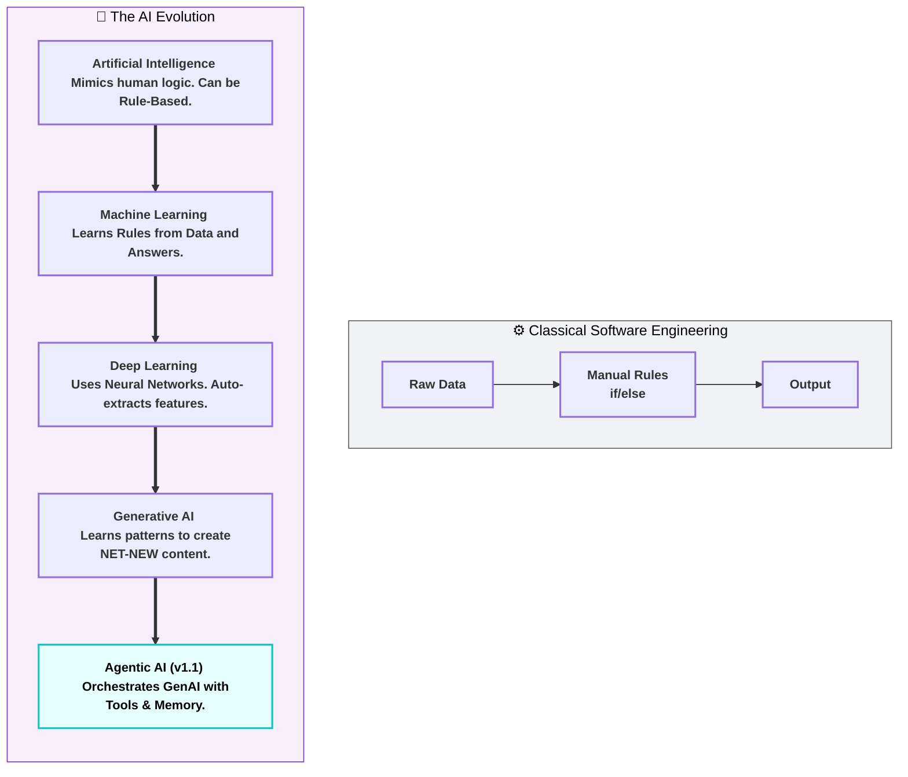
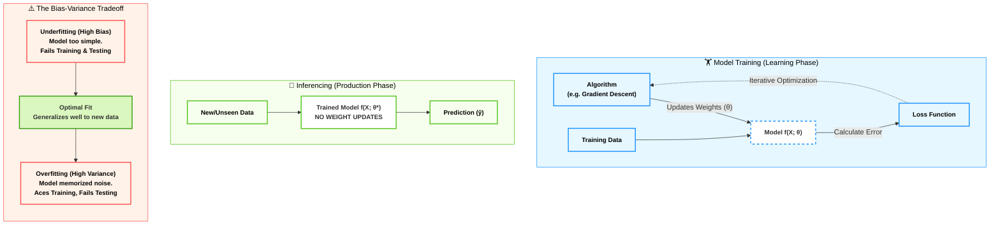

# Domain 1: Fundamentals of AI and ML (20%)

## Phase 1 - Part 1: Hierarchical Boundaries of AI (التفكيك المعماري لطبقات الذكاء الاصطناعي)

### 1. أصل الحكاية والمشكلة المعمارية (The Core Problem)

في هندسة البرمجيات الكلاسيكية (Classical Software Engineering)، إحنا كـ Backend Developers بنعتمد على الـ **Deterministic Logic**. اليوزر بيبعت (Data)، الكود بيمشي على قواعد صارمة احنا كاتبينها (Rules / If-Else Conditions)، وبيطلع (Output).

**المشكلة (The Bottleneck):**

الـ Architecture دي بتنهار تماماً لما المشكلة تكون معقدة وصعب وصفها بقواعد ثابتة. تخيل إن مطلوب منك تكتب كود بـ `if/else` يفرق بين صورة قطة وصورة كلب! هل هتكتب قاعدة لكل بيكسل (Pixel)؟ هل هتكتب `if (RGB == 255)`؟ مستحيل.

التعقيد (Complexity) بتاع العالم الحقيقي أكبر من إننا نحصره في `Rules` يدوية.

من هنا حصل التحول المعماري الأهم في تاريخ الكمبيوتر: **"بدل ما نبرمج القواعد، خلينا نخلي المكنة تستنتجها"**.

### 2. التشريح العميق لطبقات التجريد (The Matryoshka Doll of AI)

الامتحان (AIF-C01) بيختبر بدقة قدرتك كـ Tech Lead إنك تفرق بين الـ 5 طبقات دول هندسياً. هما مش حاجة واحدة، هما دوائر جوه بعض، كل دايرة بتضيف مستوى أعلى من التعقيد والتجريد (Abstraction):

#### 🛡️ المظلة الكبرى: Artificial Intelligence (AI)

- **المعنى الهندسي:** الـ AI هو المظلة الشاملة (The Superset). أي نظام أو (System) بيقدر يحاكي الوظائف الإدراكية للبشر (زي الإدراك، التفكير، حل المشاكل، أو اتخاذ القرار) بيقع تحت المظلة دي.
    
- **العمق التقني:** **الـ AI مش شرط يكون بيتعلم!** في بدايات الـ AI كان عندنا حاجة اسمها الأنظمة الخبيرة (Expert Systems) أو (Rule-based AI). يعني لو عملت شجرة قرارات (Decision Tree) ضخمة جداً متبرمجة بـ `if/else` عشان تشخص أمراض بناءً على أعراض واضحة (زي نظام MYCIN في السبعينات)، النظام ده اسمه AI، رغم إنه مش بيتعلم أي حاجة جديدة من الداتا، هو مجرد بينفذ قواعد برمجية معقدة.
    

#### ⚙️ محرك الاستنتاج: Machine Learning (ML)

- **المعنى الهندسي:** دايرة أعمق جوه الـ AI. هنا إحنا بنرمي برمجة القواعد الصريحة (Explicit Programming) في الزبالة. النظام هنا **بيتعلم** الخرائط (Mapping) من البيانات التاريخية.
    
- **التعريف الأكاديمي الصارم (Mitchell's Definition):** السيستم بيتقال عليه بيعمل Machine Learning لو كان أداؤه في مهمة معينة `(Task T)`، بيتحسن مع اكتساب خبرة `(Experience E)`، وبنقيس التحسن ده بمقياس `(Performance P)`.
    
- **العمق التقني:** الموديل هنا بيتعلم دالة رياضية `f(X) → Y`. الـ `X` هي البيانات (Features)، والـ `Y` هي النتيجة (Label). بدل ما تقوله "لو لقيت كلمة كذا، اعتبر الإيميل Spam"، إنت بتديله 10,000 إيميل Spam، وخوارزميات الـ ML (الإحصائية) هي اللي بتوزن الكلمات وتستنتج القاعدة.
    

#### 🧠 الشبكات العصبية: Deep Learning (DL)

- **المعنى الهندسي:** دايرة أعمق جوه الـ ML. خوارزميات الـ ML الكلاسيكية قوية، بس بتيجي عند البيانات الغير مهيكلة (Unstructured Data) زي الصور، الفيديوهات، والصوت.. وبتعطل. هنا ظهر الـ DL.
    
- **العمق التقني:** بيعتمد على معمارية اسمها **Artificial Neural Networks (ANNs)**. الميزة الهندسية المرعبة للـ DL اللي فرقت مع المهندسين هي الـ **Automatic Feature Representation**. في الـ ML العادي، كان لازم مهندس داتا يعمل (Manual Feature Engineering) ويقول للموديل "ركز على طول ودن القطة". في الـ DL، الشبكة العصبية بتتكون من طبقات مخفية متعددة (Hidden Layers). الطبقات دي بتكتشف الـ Features لوحدها من الـ Raw Data.
    
- **متطلبات البنية التحتية:** المعمارية دي مبنية على عمليات ضرب مصفوفات (Matrix Multiplication) ضخمة جداً، عشان كده مبتشتغلش بكفاءة على الـ CPU وبتحتاج **GPUs**.
    

#### ✨ محرك الإبداع: Generative AI (GenAI)

- **المعنى الهندسي:** دايرة أعمق جوه الـ DL. معظم أنظمة الـ ML/DL القديمة كانت بتعمل "تصنيف" أو "توقع" (Discriminative AI)، يعني الموديل بيتعلم `P(Y|X)` "احتمالية إن الصورة دي قطة بناءً على البيكسلات". الـ GenAI بيعمل حاجة تانية خالص..
    
- **العمق التقني:** الموديل هنا بيتعلم **التوزيع الاحتمالي** للبيانات نفسها `P(X)`. ولأنه فهم الداتا بتتوزع إزاي، بيقدر يولد (Generate) عينات جديدة تماماً (Synthetic artifacts) سواء كانت نصوص، صور، أو كود، من نفس التوزيع ده. النماذج دي بتبقى ضخمة جداً واسمها Foundation Models (FMs).
    

#### 🕵️ الذكاء المستقل: Agentic AI (إضافة حيوية في امتحان AIF-C01 v1.1)

- **المعنى الهندسي:** ده التطور الجديد اللي الامتحان بيركز عليه. الـ LLM العادي عبارة عن (Request -> Response). الـ Agentic AI هو نظام بيخلي الـ LLM يشتغل كـ "مخ" جوه حلقة تشغيل (Orchestration Loop) عشان يحقق هدف معقد بيحتاج خطوات كتير.
    
- **العمق التقني:** الـ Agent بيتميز بـ 3 حاجات:
    
    1. **التخطيط (Planning):** يكسر المشكلة الكبيرة لخطوات صغيرة.
        
    2. **الذاكرة (Memory):** يفتكر هو عمل إيه في الخطوة اللي فاتت (سواء Short-term في الـ Context، أو Long-term في Vector DB).
        
    3. **استخدام الأدوات (Tool Usage):** يقدر يكلم APIs خارجية، ينفذ كود، أو يعمل Web Search (من خلال بروتوكولات زي Model Context Protocol - MCP).
        

### 3. المجاز المعماري (The Corporate Metaphor)

عشان تثبت الفروقات دي في دماغك للـ Scenario Questions:

- **Rule-based AI:** الموظف البصمجي اللي معاه شيت إكسيل فيه ماكرو (Macro). لو الدخل كذا، ارفض القرض. مبيفكرش.
    
- **Machine Learning:** المحلل المالي الجونيور. بتديله ملفات القروض بتاعة آخر 10 سنين وتقوله "ذاكرهم"، عشان لما يجيلك عميل جديد تعرف تقيمه بناءً على الأنماط القديمة.
    
- **Deep Learning:** قسم كامل من المحللين الماليين، كل واحد بيدقق في تفصيلة صغيرة جداً (واحد بيبص على السن، التاني على السكن، التالت على حركة الحساب)، ومن غير ما تديهم قواعد، هما لوحدهم بيكتشفوا إن "العميل اللي بيشتري قهوة كتير فرصة سداده أعلى" (اكتشاف Features مخفية).
    
- **Generative AI:** مدير التسويق الإبداعي. مش بس بيحلل الداتا، لأ ده بيكتبلك خطة تسويقية جديدة تماماً بلغة احترافية بناءً على خبرته الطويلة.
    
- **Agentic AI:** الـ CEO المستقل. بتقوله "زود المبيعات 10%" وتسيبه. هو هيفكر، يبعت إيميلات (Tool Use)، يحلل الردود (Memory)، ويعدل الخطط لوحده بدون تدخلك (Autonomous).
    

### 4. اللوحة المعمارية: مسار الـ Data والـ Logic (Mermaid)

Code snippet

### 5. دستور الامتحان (Exam Traps & Keyword Mapping)

في امتحان הـ AIF-C01، الأسئلة بتيجي في شكل سيناريو لشركة (Use Case)، وبيطلب منك تحدد التقنية المظبوطة. دي الـ Keywords الصارمة اللي بتلخص الإجابات:

|**فخ السيناريو في الامتحان (The Trap/Keyword)**|**التقنية المطلوبة (The Answer)**|**التفسير المعماري (Why?)**|
|---|---|---|
|`Mimics human behavior but does NOT learn from data`, `Expert system`|**Artificial Intelligence (AI)**|دي إشارة صريحة للـ Rule-based AI اللي مفيش فيه تدريب أو موديلز.|
|`Improves performance through data`, `Uses statistical algorithms`|**Machine Learning (ML)**|مفيش ذكر لبيانات معقدة أو إنشاء محتوى جديد، مجرد استنتاج إحصائي.|
|`Complex unstructured data (Images/Audio)`, `Multi-layered neural networks`, `Requires GPUs`|**Deep Learning (DL)**|ذكر الطبقات المتعددة والبيانات الغير مهيكلة بيحسم الإجابة للـ DL.|
|`Produce novel content`, `Create new artifacts`, `Foundation Models`|**Generative AI (GenAI)**|الكلمة المفتاحية هي `Create/Generate` و `Novel` (جديد). لو بيصنف بس مش GenAI.|
|`Take autonomous actions`, `Use tools/APIs`, `Orchestrate multi-step workflows`|**Agentic AI**|إضافة الإصدار v1.1. التركيز على الـ "أفعال المستقلة" واستخدام الـ Tools (الأدوات).|

---
جاهز يا بطل، إحنا لسه جوه **Domain 1** وفي نفس الـ **Phase 1**، بس هندخل دلوقتي بمشرط الجراح عشان نفكك "لغة الآلة".

استلم **(Phase 1 - الجزء الثاني)**، خده Copy/Paste في الـ Obsidian تحت الجزء اللي فات على طول:

## Phase 1 - Part 2: Core ML Terminology & The Bias-Variance Tradeoff (ميكانيكا المصطلحات وفخاخ التدريب)

### 1. أصل الحكاية والمشكلة المعمارية (The Core Problem)

في الـ Backend العادي، لو الكود شغال على جهازك وشغال على الـ Staging، بنسبة 99% هيشتغل على الـ Production (طالما الـ Environment واحدة).

في الـ Machine Learning، القاعدة دي بتتدمر تماماً! الموديل ممكن يجيب دقة 100% في المعمل، وأول ما يطلع Production يودي الشركة في داهية. ليه؟ لأن الموديل "حفظ" الداتا بدل ما "يفهمها".

عشان كده هندسة الذكاء الاصطناعي خلقت مصطلحات صارمة جداً توصف حالة الموديل، وتفصل بين مرحلة "المذاكرة" ومرحلة "الامتحان"، وتحدد بالضبط إيه سبب الفشل لو حصل.

### 2. التشريح العميق للقاموس المعماري (Strict Engineering Definitions)

الامتحان بيوقعك في الفروقات البسيطة بين الكلمات دي. لازم تتعامل معاهم كأنهم Variables في الكود، كل واحد ليه Data Type مختلف:

#### ⚙️ ميكانيكا التشغيل (The Mechanics)

- **الخوارزمية (Algorithm):**
    
    ده "المحرك" الرياضي أو إجراء التحسين (Optimization Procedure) اللي بنستخدمه عشان ندرب الموديل. (أمثلة: Gradient Descent, Random Forest, K-Means). الخوارزمية مش هي الموديل، الخوارزمية هي الأداة اللي بتبني الموديل.
    
- **النموذج (Model):**
    
    هو "المنتج النهائي". عبارة عن دالة رياضية `f(X; θ)` محكومة بـ Parameters (أوزان `θ`) الخوارزمية ظبطتها. ده اللي بناخده نعمله Deploy كـ API.
    
- **التدريب (Training):**
    
    العملية المتكررة (Iterative) اللي بنغذي فيها الخوارزمية ببيانات (Training Dataset) عشان تقلل نسبة الخطأ (Loss Function). **هنا الأوزان (`θ`) بتتعدل وتتحدث باستمرار.**
    
- **الاستنتاج / التشغيل (Inferencing):**
    
    إنك تاخد الموديل الجاهز `f(X; θ*)` وتطبق عليه بيانات جديدة تماماً (Unseen Data) عشان تطلع النتيجة `ŷ`. **(قاعدة معمارية صارمة: في مرحلة الـ Inference، مفيش أي تعديل للأوزان بيحصل. الموديل بيكون Read-only).**
    

#### ⚖️ مثلث الرعب المعماري (Fit, Bias, and Variance)

دول أهم 3 مفاهيم في تقييم جودة الـ ML Model:

- **Fit (الملاءمة):**
    
    الدرجة اللي الموديل قدر بيها يلقط الـ Pattern الحقيقي بتاع الداتا من غير ما يتأثر بالدوشة (Noise).
    
- **Statistical Bias (التحيز الإحصائي):**
    
    _(ملاحظة: ده غير التحيز الأخلاقي / العنصرية اللي هنشوفه في Domain 4)._ الـ Bias هنا معناه إن الموديل "مبسط بزيادة" (Too simple) لدرجة إنه مش قادر يفهم العلاقات المعقدة في الداتا. الموديل عنده افتراضات مسبقة قوية جداً معمياه عن الحقيقة.
    
    - **النتيجة الكارثية:** **Underfitting** (القصور). الموديل أداؤه سيء جداً في الـ Training وسيء في الـ Testing.
        
- **Variance (التشتت الإحصائي):**
    
    حساسية الموديل المفرطة لأي تفصيلة أو "دوشة" في بيانات التدريب. الموديل معقد جداً (Too complex) لدرجة إنه بيعامل الدوشة كأنها قواعد أساسية.
    
    - **النتيجة الكارثية:** **Overfitting** (الإفراط). الموديل أداؤه 100% في الـ Training، بس بينهار ويفشل تماماً في الـ Validation/Testing لأنه "حفظ" ومقدرش "يعمم" (Poor Generalization).
        
- **The Bias-Variance Tradeoff (المقايضة الهندسية):**
    
    الـ Error الكلي للموديل = `Bias² + Variance + Irreducible Noise`.
    
    لو حاولت تقلل الـ Bias جداً (بإنك تزود تعقيد الموديل)، الـ Variance هيضرب في السما (Overfitting). ولو قللت الـ Variance جداً (بإنك تبسط الموديل)، الـ Bias هيزيد (Underfitting). وظيفتك كمهندس تلاقي "نقطة التوازن" (Optimal Capacity).
    

#### 🌐 تخصصات فرعية جوه الـ ML (Sub-disciplines)

- **Large Language Models (LLMs):** نماذج Deep Learning عملاقة متدربة على كميات مهولة من النصوص (Corpora). بتستخدم أهداف تدريب ذاتية (Self-supervised) زي توقع الكلمة الجاية (Next-token prediction). بتتميز بظهور قدرات مفاجئة (Emergent capabilities).
    
- **Computer Vision (CV):** فرع الذكاء الاصطناعي الخاص باستخراج المعاني من البيانات المرئية (الصور، الفيديو).
    
- **Natural Language Processing (NLP):** فرع الذكاء الاصطناعي الخاص بفهم، وتوليد، وتحويل اللغات البشرية.
    

### 3. المجاز المعماري (The Student Metaphor)

عشان عمرك ما تتلخبط بين الـ Overfitting والـ Underfitting تاني:

تخيل عندنا امتحان آخر السنة (Production / Inference) وإدينا للطلاب امتحانات السنين اللي فاتت يذاكروا منها (Training Data).

- **الـ High Bias (طالب الـ Underfitting):** طالب كسلان أو قدراته محدودة. فتح امتحانات السنين اللي فاتت، مفهمش حاجة، ومذاكرش. دخل الامتحان التجريبي (Training) سقط، ودخل الفاينال (Testing) سقط برضه. الموديل ده محتاج يتعقد أو يتشرح له أحسن (Capacity increase).
    
- **الـ High Variance (طالب الـ Overfitting):** طالب "بصمجي" بدرجة امتياز. حفظ امتحانات السنين اللي فاتت بالمللي، لدرجة إنه حفظ إن "لو السؤال مكتوب بخط أحمر تبقى إجابته أ". دخل الامتحان التجريبي (Training) جاب 100%. دخل الفاينال (Testing) لقى نفس الأسئلة بس مكتوبة بخط أزرق.. سقط! الموديل ده حفظ الدوشة (Noise) وفشل في التعميم (Generalization).
    

### 5. دستور الامتحان (Exam Traps & Keyword Mapping)

الجدول ده هو الـ Cheat Sheet بتاعك عشان تترجم خدع أمازون في الأسئلة لقرارات معمارية:

|**فخ السيناريو في الامتحان (The Trap/Keyword)**|**المصطلح الهندسي (The Concept)**|**التفسير المعماري (Why?)**|
|---|---|---|
|`Updating parameters`, `Iterative optimization of weights`, `Minimizing loss`|**Training**|طالما الأوزان بتتعدل والموديل بيتعلم، إحنا في مرحلة التدريب.|
|`Applying the model to new data`, `Generating predictions in production`, `No parameter updates`|**Inferencing**|الاستنتاج يعني الموديل بقى (Read-only) وبيستخدم في الواقع.|
|`Model performs well on training data but poorly on validation/test data`, `Memorized training noise`|**Overfitting (High Variance)**|الفجوة الكبيرة بين أداء التدريب وأداء الاختبار (Training loss << Validation loss) معناها إن الموديل حفظ الداتا ومقدرش يعمم.|
|`Model performs poorly on BOTH training and validation data`, `Model is too simple`|**Underfitting (High Bias)**|الموديل مش قادر يفهم الـ Pattern أصلاً سواء في التدريب أو بره التدريب.|
|`Balancing model complexity to minimize total error`|**Bias-Variance Tradeoff**|المقايضة الهندسية الأساسية لمنع الموديل من إنه يتغبى أو يبصم.|
|`Model capability not explicitly trained for, arising from massive scale`|**Emergent Capabilities (LLMs)**|قدرات مفاجئة بتظهر في الـ LLMs لما تكبر (زي قدرتها على كتابة كود وهي متدربة على نصوص عامة).|

----
