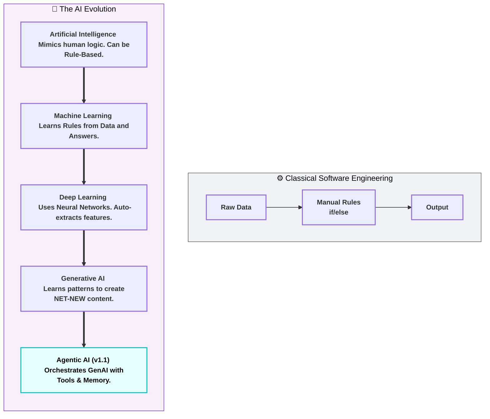
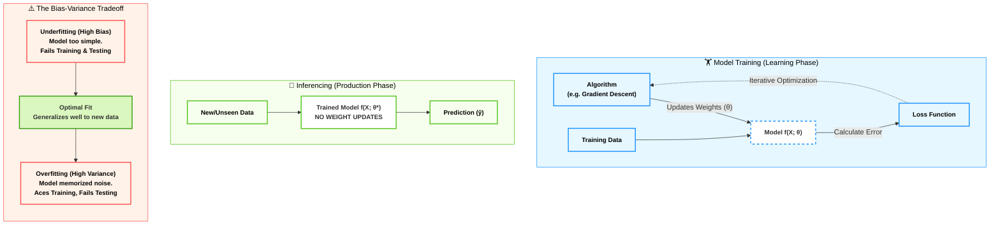
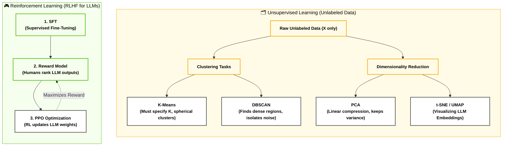
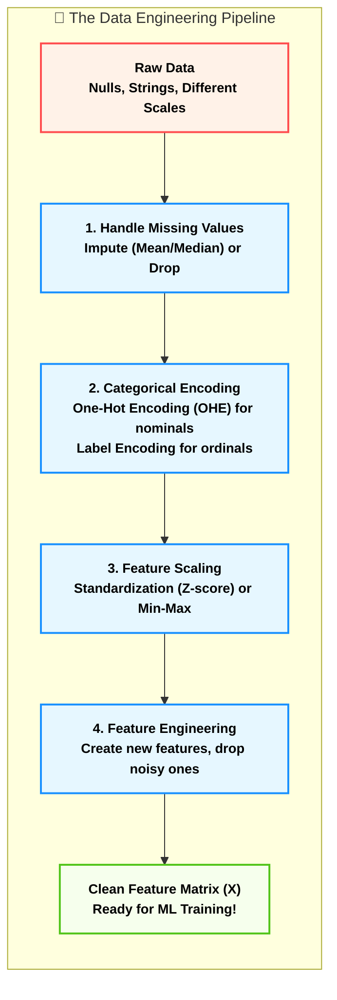
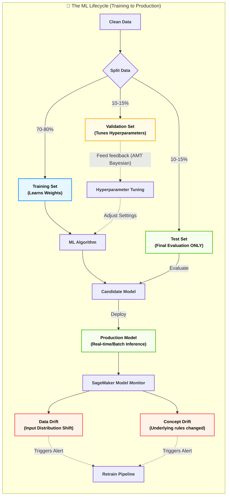
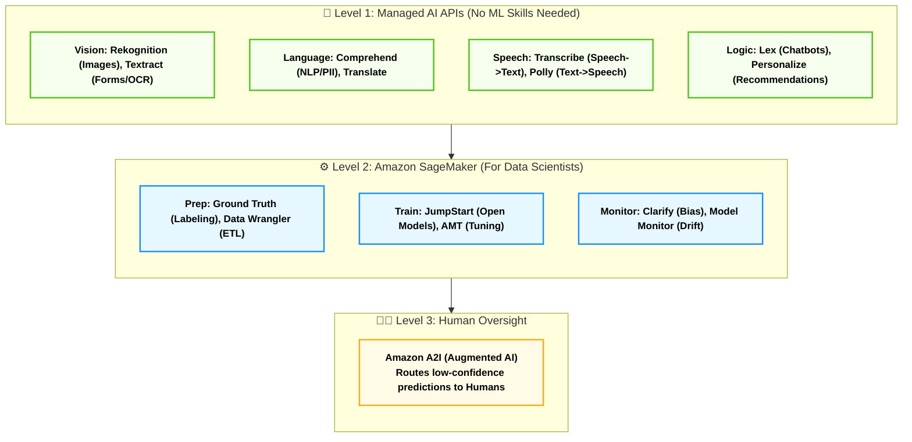

# Domain 1: Fundamentals of AI and ML (20%)

## Phase 1 - Part 1: Hierarchical Boundaries of AI (التفكيك المعماري لطبقات الذكاء الاصطناعي)

### 1. أصل الحكاية والمشكلة المعمارية (The Core Problem)

في هندسة البرمجيات الكلاسيكية (Classical Software Engineering)، إحنا كـ Backend Developers بنعتمد على الـ **Deterministic Logic**. اليوزر بيبعت (Data)، الكود بيمشي على قواعد صارمة احنا كاتبينها (Rules / If-Else Conditions)، وبيطلع (Output).

**المشكلة (The Bottleneck):**

الـ Architecture دي بتنهار تماماً لما المشكلة تكون معقدة وصعب وصفها بقواعد ثابتة. تخيل إن مطلوب منك تكتب كود بـ `if/else` يفرق بين صورة قطة وصورة كلب! هل هتكتب قاعدة لكل بيكسل (Pixel)؟ هل هتكتب `if (RGB == 255)`؟ مستحيل.

التعقيد (Complexity) بتاع العالم الحقيقي أكبر من إننا نحصره في `Rules` يدوية.

من هنا حصل التحول المعماري الأهم في تاريخ الكمبيوتر: **"بدل ما نبرمج القواعد، خلينا نخلي المكنة تستنتجها"**.

### 2. التشريح العميق لطبقات التجريد (The Matryoshka Doll of AI)

الامتحان (AIF-C01) بيختبر بدقة قدرتك كـ Tech Lead إنك تفرق بين الـ 5 طبقات دول هندسياً. هما مش حاجة واحدة، هما دوائر جوه بعض، كل دايرة بتضيف مستوى أعلى من التعقيد والتجريد (Abstraction):

#### 🛡️ المظلة الكبرى: Artificial Intelligence (AI)

- **المعنى الهندسي:** الـ AI هو المظلة الشاملة (The Superset). أي نظام أو (System) بيقدر يحاكي الوظائف الإدراكية للبشر (زي الإدراك، التفكير، حل المشاكل، أو اتخاذ القرار) بيقع تحت المظلة دي.
    
- **العمق التقني:** **الـ AI مش شرط يكون بيتعلم!** في بدايات الـ AI كان عندنا حاجة اسمها الأنظمة الخبيرة (Expert Systems) أو (Rule-based AI). يعني لو عملت شجرة قرارات (Decision Tree) ضخمة جداً متبرمجة بـ `if/else` عشان تشخص أمراض بناءً على أعراض واضحة (زي نظام MYCIN في السبعينات)، النظام ده اسمه AI، رغم إنه مش بيتعلم أي حاجة جديدة من الداتا، هو مجرد بينفذ قواعد برمجية معقدة.
    

#### ⚙️ محرك الاستنتاج: Machine Learning (ML)

- **المعنى الهندسي:** دايرة أعمق جوه الـ AI. هنا إحنا بنرمي برمجة القواعد الصريحة (Explicit Programming) في الزبالة. النظام هنا **بيتعلم** الخرائط (Mapping) من البيانات التاريخية.
    
- **التعريف الأكاديمي الصارم (Mitchell's Definition):** السيستم بيتقال عليه بيعمل Machine Learning لو كان أداؤه في مهمة معينة `(Task T)`، بيتحسن مع اكتساب خبرة `(Experience E)`، وبنقيس التحسن ده بمقياس `(Performance P)`.
    
- **العمق التقني:** الموديل هنا بيتعلم دالة رياضية `f(X) → Y`. الـ `X` هي البيانات (Features)، والـ `Y` هي النتيجة (Label). بدل ما تقوله "لو لقيت كلمة كذا، اعتبر الإيميل Spam"، إنت بتديله 10,000 إيميل Spam، وخوارزميات الـ ML (الإحصائية) هي اللي بتوزن الكلمات وتستنتج القاعدة.
    

#### 🧠 الشبكات العصبية: Deep Learning (DL)

- **المعنى الهندسي:** دايرة أعمق جوه الـ ML. خوارزميات الـ ML الكلاسيكية قوية، بس بتيجي عند البيانات الغير مهيكلة (Unstructured Data) زي الصور، الفيديوهات، والصوت.. وبتعطل. هنا ظهر الـ DL.
    
- **العمق التقني:** بيعتمد على معمارية اسمها **Artificial Neural Networks (ANNs)**. الميزة الهندسية المرعبة للـ DL اللي فرقت مع المهندسين هي الـ **Automatic Feature Representation**. في الـ ML العادي، كان لازم مهندس داتا يعمل (Manual Feature Engineering) ويقول للموديل "ركز على طول ودن القطة". في الـ DL، الشبكة العصبية بتتكون من طبقات مخفية متعددة (Hidden Layers). الطبقات دي بتكتشف الـ Features لوحدها من الـ Raw Data.
    
- **متطلبات البنية التحتية:** المعمارية دي مبنية على عمليات ضرب مصفوفات (Matrix Multiplication) ضخمة جداً، عشان كده مبتشتغلش بكفاءة على الـ CPU وبتحتاج **GPUs**.
    

#### ✨ محرك الإبداع: Generative AI (GenAI)

- **المعنى الهندسي:** دايرة أعمق جوه الـ DL. معظم أنظمة الـ ML/DL القديمة كانت بتعمل "تصنيف" أو "توقع" (Discriminative AI)، يعني الموديل بيتعلم `P(Y|X)` "احتمالية إن الصورة دي قطة بناءً على البيكسلات". الـ GenAI بيعمل حاجة تانية خالص..
    
- **العمق التقني:** الموديل هنا بيتعلم **التوزيع الاحتمالي** للبيانات نفسها `P(X)`. ولأنه فهم الداتا بتتوزع إزاي، بيقدر يولد (Generate) عينات جديدة تماماً (Synthetic artifacts) سواء كانت نصوص، صور، أو كود، من نفس التوزيع ده. النماذج دي بتبقى ضخمة جداً واسمها Foundation Models (FMs).
    

#### 🕵️ الذكاء المستقل: Agentic AI (إضافة حيوية في امتحان AIF-C01 v1.1)

- **المعنى الهندسي:** ده التطور الجديد اللي الامتحان بيركز عليه. الـ LLM العادي عبارة عن (Request -> Response). الـ Agentic AI هو نظام بيخلي الـ LLM يشتغل كـ "مخ" جوه حلقة تشغيل (Orchestration Loop) عشان يحقق هدف معقد بيحتاج خطوات كتير.
    
- **العمق التقني:** الـ Agent بيتميز بـ 3 حاجات:
    
    1. **التخطيط (Planning):** يكسر المشكلة الكبيرة لخطوات صغيرة.
        
    2. **الذاكرة (Memory):** يفتكر هو عمل إيه في الخطوة اللي فاتت (سواء Short-term في الـ Context، أو Long-term في Vector DB).
        
    3. **استخدام الأدوات (Tool Usage):** يقدر يكلم APIs خارجية، ينفذ كود، أو يعمل Web Search (من خلال بروتوكولات زي Model Context Protocol - MCP).
        

### 3. المجاز المعماري (The Corporate Metaphor)

عشان تثبت الفروقات دي في دماغك للـ Scenario Questions:

- **Rule-based AI:** الموظف البصمجي اللي معاه شيت إكسيل فيه ماكرو (Macro). لو الدخل كذا، ارفض القرض. مبيفكرش.
    
- **Machine Learning:** المحلل المالي الجونيور. بتديله ملفات القروض بتاعة آخر 10 سنين وتقوله "ذاكرهم"، عشان لما يجيلك عميل جديد تعرف تقيمه بناءً على الأنماط القديمة.
    
- **Deep Learning:** قسم كامل من المحللين الماليين، كل واحد بيدقق في تفصيلة صغيرة جداً (واحد بيبص على السن، التاني على السكن، التالت على حركة الحساب)، ومن غير ما تديهم قواعد، هما لوحدهم بيكتشفوا إن "العميل اللي بيشتري قهوة كتير فرصة سداده أعلى" (اكتشاف Features مخفية).
    
- **Generative AI:** مدير التسويق الإبداعي. مش بس بيحلل الداتا، لأ ده بيكتبلك خطة تسويقية جديدة تماماً بلغة احترافية بناءً على خبرته الطويلة.
    
- **Agentic AI:** الـ CEO المستقل. بتقوله "زود المبيعات 10%" وتسيبه. هو هيفكر، يبعت إيميلات (Tool Use)، يحلل الردود (Memory)، ويعدل الخطط لوحده بدون تدخلك (Autonomous).
    

### 4. اللوحة المعمارية: مسار الـ Data والـ Logic (Mermaid)

Code snippet



### 5. دستور الامتحان (Exam Traps & Keyword Mapping)

في امتحان הـ AIF-C01، الأسئلة بتيجي في شكل سيناريو لشركة (Use Case)، وبيطلب منك تحدد التقنية المظبوطة. دي الـ Keywords الصارمة اللي بتلخص الإجابات:

|**فخ السيناريو في الامتحان (The Trap/Keyword)**|**التقنية المطلوبة (The Answer)**|**التفسير المعماري (Why?)**|
|---|---|---|
|`Mimics human behavior but does NOT learn from data`, `Expert system`|**Artificial Intelligence (AI)**|دي إشارة صريحة للـ Rule-based AI اللي مفيش فيه تدريب أو موديلز.|
|`Improves performance through data`, `Uses statistical algorithms`|**Machine Learning (ML)**|مفيش ذكر لبيانات معقدة أو إنشاء محتوى جديد، مجرد استنتاج إحصائي.|
|`Complex unstructured data (Images/Audio)`, `Multi-layered neural networks`, `Requires GPUs`|**Deep Learning (DL)**|ذكر الطبقات المتعددة والبيانات الغير مهيكلة بيحسم الإجابة للـ DL.|
|`Produce novel content`, `Create new artifacts`, `Foundation Models`|**Generative AI (GenAI)**|الكلمة المفتاحية هي `Create/Generate` و `Novel` (جديد). لو بيصنف بس مش GenAI.|
|`Take autonomous actions`, `Use tools/APIs`, `Orchestrate multi-step workflows`|**Agentic AI**|إضافة الإصدار v1.1. التركيز على الـ "أفعال المستقلة" واستخدام الـ Tools (الأدوات).|

---
جاهز يا بطل، إحنا لسه جوه **Domain 1** وفي نفس الـ **Phase 1**، بس هندخل دلوقتي بمشرط الجراح عشان نفكك "لغة الآلة".

استلم **(Phase 1 - الجزء الثاني)**، خده Copy/Paste في الـ Obsidian تحت الجزء اللي فات على طول:

## Phase 1 - Part 2: Core ML Terminology & The Bias-Variance Tradeoff (ميكانيكا المصطلحات وفخاخ التدريب)

### 1. أصل الحكاية والمشكلة المعمارية (The Core Problem)

في الـ Backend العادي، لو الكود شغال على جهازك وشغال على الـ Staging، بنسبة 99% هيشتغل على الـ Production (طالما الـ Environment واحدة).

في الـ Machine Learning، القاعدة دي بتتدمر تماماً! الموديل ممكن يجيب دقة 100% في المعمل، وأول ما يطلع Production يودي الشركة في داهية. ليه؟ لأن الموديل "حفظ" الداتا بدل ما "يفهمها".

عشان كده هندسة الذكاء الاصطناعي خلقت مصطلحات صارمة جداً توصف حالة الموديل، وتفصل بين مرحلة "المذاكرة" ومرحلة "الامتحان"، وتحدد بالضبط إيه سبب الفشل لو حصل.

### 2. التشريح العميق للقاموس المعماري (Strict Engineering Definitions)

الامتحان بيوقعك في الفروقات البسيطة بين الكلمات دي. لازم تتعامل معاهم كأنهم Variables في الكود، كل واحد ليه Data Type مختلف:

#### ⚙️ ميكانيكا التشغيل (The Mechanics)

- **الخوارزمية (Algorithm):**
    
    ده "المحرك" الرياضي أو إجراء التحسين (Optimization Procedure) اللي بنستخدمه عشان ندرب الموديل. (أمثلة: Gradient Descent, Random Forest, K-Means). الخوارزمية مش هي الموديل، الخوارزمية هي الأداة اللي بتبني الموديل.
    
- **النموذج (Model):**
    
    هو "المنتج النهائي". عبارة عن دالة رياضية `f(X; θ)` محكومة بـ Parameters (أوزان `θ`) الخوارزمية ظبطتها. ده اللي بناخده نعمله Deploy كـ API.
    
- **التدريب (Training):**
    
    العملية المتكررة (Iterative) اللي بنغذي فيها الخوارزمية ببيانات (Training Dataset) عشان تقلل نسبة الخطأ (Loss Function). **هنا الأوزان (`θ`) بتتعدل وتتحدث باستمرار.**
    
- **الاستنتاج / التشغيل (Inferencing):**
    
    إنك تاخد الموديل الجاهز `f(X; θ*)` وتطبق عليه بيانات جديدة تماماً (Unseen Data) عشان تطلع النتيجة `ŷ`. **(قاعدة معمارية صارمة: في مرحلة الـ Inference، مفيش أي تعديل للأوزان بيحصل. الموديل بيكون Read-only).**
    

#### ⚖️ مثلث الرعب المعماري (Fit, Bias, and Variance)

دول أهم 3 مفاهيم في تقييم جودة الـ ML Model:

- **Fit (الملاءمة):**
    
    الدرجة اللي الموديل قدر بيها يلقط الـ Pattern الحقيقي بتاع الداتا من غير ما يتأثر بالدوشة (Noise).
    
- **Statistical Bias (التحيز الإحصائي):**
    
    _(ملاحظة: ده غير التحيز الأخلاقي / العنصرية اللي هنشوفه في Domain 4)._ الـ Bias هنا معناه إن الموديل "مبسط بزيادة" (Too simple) لدرجة إنه مش قادر يفهم العلاقات المعقدة في الداتا. الموديل عنده افتراضات مسبقة قوية جداً معمياه عن الحقيقة.
    
    - **النتيجة الكارثية:** **Underfitting** (القصور). الموديل أداؤه سيء جداً في الـ Training وسيء في الـ Testing.
        
- **Variance (التشتت الإحصائي):**
    
    حساسية الموديل المفرطة لأي تفصيلة أو "دوشة" في بيانات التدريب. الموديل معقد جداً (Too complex) لدرجة إنه بيعامل الدوشة كأنها قواعد أساسية.
    
    - **النتيجة الكارثية:** **Overfitting** (الإفراط). الموديل أداؤه 100% في الـ Training، بس بينهار ويفشل تماماً في الـ Validation/Testing لأنه "حفظ" ومقدرش "يعمم" (Poor Generalization).
        
- **The Bias-Variance Tradeoff (المقايضة الهندسية):**
    
    الـ Error الكلي للموديل = `Bias² + Variance + Irreducible Noise`.
    
    لو حاولت تقلل الـ Bias جداً (بإنك تزود تعقيد الموديل)، الـ Variance هيضرب في السما (Overfitting). ولو قللت الـ Variance جداً (بإنك تبسط الموديل)، الـ Bias هيزيد (Underfitting). وظيفتك كمهندس تلاقي "نقطة التوازن" (Optimal Capacity).
    

#### 🌐 تخصصات فرعية جوه الـ ML (Sub-disciplines)

- **Large Language Models (LLMs):** نماذج Deep Learning عملاقة متدربة على كميات مهولة من النصوص (Corpora). بتستخدم أهداف تدريب ذاتية (Self-supervised) زي توقع الكلمة الجاية (Next-token prediction). بتتميز بظهور قدرات مفاجئة (Emergent capabilities).
    
- **Computer Vision (CV):** فرع الذكاء الاصطناعي الخاص باستخراج المعاني من البيانات المرئية (الصور، الفيديو).
    
- **Natural Language Processing (NLP):** فرع الذكاء الاصطناعي الخاص بفهم، وتوليد، وتحويل اللغات البشرية.
    

### 3. المجاز المعماري (The Student Metaphor)

عشان عمرك ما تتلخبط بين الـ Overfitting والـ Underfitting تاني:

تخيل عندنا امتحان آخر السنة (Production / Inference) وإدينا للطلاب امتحانات السنين اللي فاتت يذاكروا منها (Training Data).

- **الـ High Bias (طالب الـ Underfitting):** طالب كسلان أو قدراته محدودة. فتح امتحانات السنين اللي فاتت، مفهمش حاجة، ومذاكرش. دخل الامتحان التجريبي (Training) سقط، ودخل الفاينال (Testing) سقط برضه. الموديل ده محتاج يتعقد أو يتشرح له أحسن (Capacity increase).
    
- **الـ High Variance (طالب الـ Overfitting):** طالب "بصمجي" بدرجة امتياز. حفظ امتحانات السنين اللي فاتت بالمللي، لدرجة إنه حفظ إن "لو السؤال مكتوب بخط أحمر تبقى إجابته أ". دخل الامتحان التجريبي (Training) جاب 100%. دخل الفاينال (Testing) لقى نفس الأسئلة بس مكتوبة بخط أزرق.. سقط! الموديل ده حفظ الدوشة (Noise) وفشل في التعميم (Generalization).
    




### 5. دستور الامتحان (Exam Traps & Keyword Mapping)

الجدول ده هو الـ Cheat Sheet بتاعك عشان تترجم خدع أمازون في الأسئلة لقرارات معمارية:

|**فخ السيناريو في الامتحان (The Trap/Keyword)**|**المصطلح الهندسي (The Concept)**|**التفسير المعماري (Why?)**|
|---|---|---|
|`Updating parameters`, `Iterative optimization of weights`, `Minimizing loss`|**Training**|طالما الأوزان بتتعدل والموديل بيتعلم، إحنا في مرحلة التدريب.|
|`Applying the model to new data`, `Generating predictions in production`, `No parameter updates`|**Inferencing**|الاستنتاج يعني الموديل بقى (Read-only) وبيستخدم في الواقع.|
|`Model performs well on training data but poorly on validation/test data`, `Memorized training noise`|**Overfitting (High Variance)**|الفجوة الكبيرة بين أداء التدريب وأداء الاختبار (Training loss << Validation loss) معناها إن الموديل حفظ الداتا ومقدرش يعمم.|
|`Model performs poorly on BOTH training and validation data`, `Model is too simple`|**Underfitting (High Bias)**|الموديل مش قادر يفهم الـ Pattern أصلاً سواء في التدريب أو بره التدريب.|
|`Balancing model complexity to minimize total error`|**Bias-Variance Tradeoff**|المقايضة الهندسية الأساسية لمنع الموديل من إنه يتغبى أو يبصم.|
|`Model capability not explicitly trained for, arising from massive scale`|**Emergent Capabilities (LLMs)**|قدرات مفاجئة بتظهر في الـ LLMs لما تكبر (زي قدرتها على كتابة كود وهي متدربة على نصوص عامة).|


----
## Phase 2 - Part 1: Supervised Learning Mechanics (التشريح الهندسي للتعلم الخاضع للإشراف)

### 1. أصل الحكاية والمشكلة المعمارية (The Core Problem)

الـ Machine Learning مش سحر، هو في الأساس "Optimization Problem" (مشكلة تحسين رياضي).

المشكلة بتبدأ لما يكون عندنا بيانات تاريخية متسجلة في الـ Database، وعارفين النتيجة بتاعتها (زي بيانات أسعار شقق اتباعت فعلاً، أو إيميلات اتصنفت يدوياً إنها Spam). المشكلة المعمارية هي: **إزاي نبني دالة رياضية `f(X)` تقدر تاخد المدخلات `X` (مساحة الشقة) وتطلع نتيجة `ŷ` تكون أقرب ما يمكن للنتيجة الحقيقية `y` (السعر الفعلي)؟**

من هنا ظهر الـ **Supervised Learning** (التعلم الخاضع للإشراف). السيستم هنا عامل زي طالب معاه "نموذج الإجابة" (Ground-Truth Labels). بيحل، يغلط، يقارن إجابته بنموذج الإجابة، ويعدل طريقة تفكيره (يعدل الأوزان `θ`) لحد ما نسبة الخطأ (Loss) توصل لأقل حد ممكن.

### 2. التشريح العميق لخوارزميات الـ Supervised Learning

التعلم الخاضع للإشراف بينقسم هندسياً لنوعين أساسيين بناءً على نوع الناتج (Output `Y`):

#### 📈 النوع الأول: الانحدار (Regression Algorithms)

بنستخدمه لما يكون الـ Output بتاعنا **قيمة رقمية متصلة (Continuous Output `Y ∈ ℝ`)**. (مثال: سعر، درجة حرارة، نسبة مبيعات).

**1. الانحدار الخطي (Linear Regression):**

- **الميكانيكا:** أبسط وأقدم خوارزمية. بتحاول ترسم "أفضل خط مستقيم" يمر بين نقاط الداتا بحيث يكون مجموع المسافات بين النقط والخط أقل ما يمكن.
    
- **المعادلة:** `ŷ = θ₀ + θ₁x₁ + θ₂x₂ ...` (الـ `x` هي الـ Features، والـ `θ` هي الأوزان اللي الموديل بيتعلمها).
    
- **دالة الخسارة (Loss Function):** بيستخدم الـ `MSE` (Mean Squared Error). بيحسب مربع الفرق بين التوقع والحقيقة عشان يتجاهل الإشارات السالبة ويعاقب الأخطاء الكبيرة بشدة.
    
- **الاستخدام (Use Case):** توقع المبيعات المستقبلية بناءً على ميزانية الإعلانات.
    

**2. خوارزمية XGBoost (Extreme Gradient Boosting) - نجمة الامتحان:**

- **الميكانيكا:** دي مش خوارزمية عادية، دي **Ensemble Method** (مجموعة خوارزميات شغالة مع بعض). بتعتمد على فكرة بناء أشجار قرار (Decision Trees) بشكل متسلسل (Sequentially).
    
- **السر المعماري:** الشجرة الأولى بتتبني وبتغلط. الشجرة التانية مبتتدربش على الداتا من الأول، لأ، دي بتتدرب على "الأخطاء" (Residuals) بتاعة الشجرة الأولى عشان تصلحها. الشجرة التالتة تصلح أخطاء التانية.. وهكذا. النتيجة النهائية هي مجموع تصحيحات كل الأشجار: `F(x) = Σ h_t(x)`.
    
- **الـ Hyperparameters المهمة:**
    
    - `n_estimators`: عدد الأشجار (لو زاد أوي يعمل Overfitting).
        
    - `learning_rate (η)`: بيقلل تأثير كل شجرة عشان الموديل يتعلم بالراحة وميبصمش الداتا.
        
- **الاستخدام (Use Case):** الساحر الأول في التعامل مع أي **بيانات مجدولة (Tabular/Structured Data)** زي ملفات الـ CSV. بيكتسح أي خوارزمية تانية في الداتا المهيكلة زي توقع احتمالية تخلف العميل عن سداد القرض.
    

#### 🗂️ النوع الثاني: التصنيف (Classification Algorithms)

بنستخدمه لما يكون الـ Output بتاعنا **فئة محددة (Discrete/Categorical Output)**. (مثال: مريض/سليم، أو قطة/كلب/عصفورة).

**1. الانحدار اللوجستي (Logistic Regression):**

- **الميكانيكا:** اسمه Regression بس هو في الحقيقة خوارزمية Classification! بيعمل إيه؟ بياخد الناتج بتاع الانحدار الخطي العادي، ويمرره جوه دالة اسمها **Sigmoid Function `σ(z) = 1/(1 + e^-z)`**.
    
- **السر المعماري:** الدالة دي بتعصر أي رقم في الدنيا (سواء مليون أو سالب مليون) وتطلعه في شكل **احتمالية (Probability) بين 0 و 1**.
    
- **اتخاذ القرار:** بنحط `Threshold` (عتبة). لو الاحتمالية > 0.5، الموديل يقول "Spam" (Class 1). لو أقل، يقول "Not Spam" (Class 0).
    
- **دالة الخسارة:** بيستخدم الـ `Log Loss` (Binary Cross-Entropy).
    

**2. أشجار القرار (Decision Trees):**

- **الميكانيكا:** بتشتغل زي لعبة "عروستي". الشجرة بتبدأ من الـ Root، وتسأل أسئلة بـ Yes/No بناءً على الـ Features (هل العمر > 30؟ -> هل الدخل > 50k؟) لحد ما توصل للـ Leaf Node اللي فيها القرار النهائي.
    
- **السر المعماري (Splitting Criteria):** إزاي الشجرة بتختار السؤال؟ بتستخدم معادلة رياضية زي الـ **Gini Impurity** أو הـ **Entropy**. بتختار السؤال اللي بيفصل الداتا لأكثر مجموعات نقاءً (يعني مجموعة كلها Spam ومجموعة كلها Not Spam).
    
- **المشكلة الكارثية:** الـ Decision Tree عندها قابلية مرعبة للـ **Overfitting** (High Variance). لو مفرملتهاش بـ `max_depth`، هتفضل تسأل أسئلة لحد ما تحفظ كل صف في الداتا لوحده.
    

**3. غابات القرار (Random Forests):**

- **الميكانيكا:** دي برضه **Ensemble Method**، بس بتعالج عيب الشجرة الواحدة (الـ Overfitting) عن طريق بناء "غابة" من مئات الأشجار.
    
- **السر المعماري (Bagging & Feature Randomness):** * كل شجرة بتتدرب على عينة عشوائية ومختلفة من الداتا (Bootstrap sample).
    
    - عند كل سؤال، الشجرة مبيكونش مسموح ليها تشوف كل الـ Features، بتشوف جزء عشوائي بس. ده بيخلي الأشجار (Decorrelated) مش شبه بعض.
        
- **القرار النهائي:** بناخد النتيجة بـ **"تصويت الأغلبية" (Majority Vote)** للـ Classification، أو الـ "متوسط" (Mean) للـ Regression.
    
- **الميزة:** بتقلل الـ Variance جداً ومبتبصمش الداتا.
    

### 3. المجاز المعماري (The Board of Directors Metaphor)

عشان نفرق بين الـ Decision Tree والـ Random Forest والـ XGBoost في اتخاذ القرار:

- **Decision Tree (المدير الديكتاتور):** مدير واحد بياخد كل القرارات بناءً على أسئلة صارمة في دماغه. قراره سريع جداً، بس لأنه لوحده، غالباً بيكون متحيز وتفكيره ضيق (High Variance).
    
- **Random Forest (البرلمان الديمقراطي):** بنجيب 100 خبير، كل واحد بنوريه جزء مختلف من المشكلة، وكل واحد بياخد قرار في السر. في الآخر بنجمع الأصوات والأغلبية بتكسب. الغلطات الفردية بتضيع في وسط الزحمة، والقرار النهائي بيكون متزن جداً (Low Variance).
    
- **XGBoost (لجنة المراجعة المتسلسلة):** بنجيب خبير يحل المشكلة. بعد ما يخلص، نجيب مراجع يدور على أخطاء الخبير الأول ويصلحها. بعدين نجيب مراجع تالت يصلح أخطاء التاني. التراكم ده بيطلع نتيجة دقيقة بشكل مرعب (Low Bias).
    

### 4. اللوحة المعمارية: مسارات الـ Supervised Learning (Mermaid)

Code snippet

```
graph TD

classDef default font-weight:bold,font-size:14px,stroke-width:2px;
classDef supervised fill:#e6f7ff,stroke:#1890ff,color:#000;
classDef algo fill:#fff,stroke:#595959,color:#000;
classDef ensemble fill:#f6ffed,stroke:#52c41a,color:#000;

subgraph Supervised_Learning_Engine ["⚙️ Supervised Learning (Labeled Data)"]
    direction TB
    
    Data["Dataset: Features (X) + Ground Truth (Y)"] --> Split
    
    Split{"What is the type of Output (Y)?"}
    
    Split -->|Continuous Number<br>(e.g. $150.5, 30.2°C)| Regression["📈 Regression Task"]
    Split -->|Discrete Category<br>(e.g. Spam, Not Spam)| Classification["🗂️ Classification Task"]
    
    Regression --> LinReg["Linear Regression<br>(Fits a straight line)"]:::algo
    Regression --> XGB_Reg["XGBoost (Regression)<br>(Sequential Trees correcting errors)"]:::ensemble
    
    Classification --> LogReg["Logistic Regression<br>(Uses Sigmoid for Probabilities)"]:::algo
    Classification --> DTree["Decision Trees<br>(Yes/No splitting logic)"]:::algo
    Classification --> RForest["Random Forest<br>(Parallel Trees + Majority Vote)"]:::ensemble
    Classification --> XGB_Class["XGBoost (Classification)"]:::ensemble

end

class Data,Split,Regression,Classification supervised;
```

### 5. دستور الامتحان (Exam Traps & Keyword Mapping)

ركز في الـ Keywords دي لأنها بتيجي بالنص في أسئلة السيناريو (Use Cases):

|**فخ السيناريو في الامتحان (The Trap/Keyword)**|**الخوارزمية / الإجابة المطلوبة**|**التفسير المعماري (Why?)**|
|---|---|---|
|`Structured data`, `Tabular datasets`, `Consistently wins Kaggle`, `Gradient boosted trees`|**XGBoost**|الـ XGBoost هو المكتسح لأي داتا موجودة في أعمدة وصفوف (Tabular)، الامتحان دايماً بيجيبه كأفضل حل للـ Structured data.|
|`Binary outcome`, `Probability of an event between 0 and 1`|**Logistic Regression**|رغم وجود كلمة Regression، إلا إنه الحل الكلاسيكي لتحويل الأرقام لاحتمالات (0 أو 1) عبر دالة الـ Sigmoid.|
|`Ensemble of decorrelated trees`, `Bootstrap sample`, `Majority vote`|**Random Forests**|دي الميكانيكا الحرفية لبناء غابات القرار لمنع الـ Overfitting (طريقة الـ Bagging).|
|`Sequential trees correcting previous errors`, `Residual learning`|**XGBoost** أو **Gradient Boosting**|طريقة الـ Boosting بتعتمد على التدريب "المتسلسل" (Sequential)، عكس الـ Random forest اللي بيتدرب "بالتوازي" (Parallel).|
|`Highly interpretable`, `Human-readable rules`, `Prone to overfitting`|**Decision Trees**|شجرة القرار هي أكتر خوارزمية الـ البشر بيقدروا يقرأوا القواعد بتاعتها كأنها `If/Else`، بس عيبها إنها بتبصم.|

---
## Phase 2 - Part 2: Unsupervised & Reinforcement Learning (خوارزميات الاستكشاف والتعلم المعزز)

### 1. أصل الحكاية والمشكلة المعمارية (The Core Problem)

في الـ Supervised Learning إحنا كنا مرفهين، الداتا جاية بـ Labels وإجابات نموذجية. المشكلة الحقيقية في هندسة البيانات إن 90% من الداتا اللي في الشركات (زي الـ Logs، سلوكيات المستخدمين في الموقع، أو التكست الخام) بتيجي **بدون أي Labels**. عندنا المتغير `X` بس، ومفيش `Y`.

المشكلة الثانية: أحياناً مبيكونش عندنا داتا من الأساس! تخيل إنك بتبرمج Agent عشان يضارب في البورصة أو روبوت يمشي. مفيش "داتا تاريخية" هتعلمه كل سيناريو ممكن يحصل، لازم ينزل البيئة الحية ويتعلم بـ "التجربة والخطأ".

هنا بيتدخل الـ Unsupervised Learning والـ Reinforcement Learning كحلول معمارية للتعامل مع "المجهول".

### 2. التشريح العميق لخوارزميات الاستكشاف (Unsupervised Learning)

بما إن مفيش Labels، هدف الموديل هنا مش "التوقع" (Prediction)، هدفه هو "استكشاف البنية الخفية" للداتا (Discovering Latent Structures).

#### 🗂️ أ. التجميع (Clustering Algorithms)

الهدف هو تجميع البيانات المتشابهة في جروبات، من غير ما نكون عارفين مسبقاً إيه هي الجروبات دي.

**1. خوارزمية K-Means (التقسيم المركزي):**

- **الميكانيكا (Lloyd's Algorithm):** بتجبر الخوارزمية إنها تقسم الداتا لعدد محدد من التجمعات (K). بنرمي نقط وهمية (Centroids) بشكل عشوائي. كل نقطة داتا تروح تلزق في أقرب Centroid. بعدين الـ Centroid يحسب المتوسط (Mean) بتاع النقط اللي لزقت فيه ويتحرك للمركز الجديد. تفضل اللفة دي تتعاد لحد ما النقط تثبت (Convergence).
    
- **معمارية التقييم:** بنقيس جودتها بحاجة اسمها `WCSS (Within-Cluster Sum of Squares)`، يعني المسافة بين النقط والمركز بتاعها.
    
- **فخاخ الـ K-Means:** لازم تحدد رقم الـ `K` مسبقاً (عن طريق طريقة اسمها Elbow Method). وتفترض إن التجمعات شكلها "دائري" (Spherical)، وبتتأثر جداً بالـ Outliers (القيم الشاذة).
    

**2. خوارزمية DBSCAN (التجميع الكثافي):**

- **الميكانيكا:** دي الخوارزمية اللي بتعالج عيوب K-Means. مش بتحتاج تقولها عدد الـ Clusters كام! بتشتغل عن طريق البحث عن "المناطق المزدحمة" (High-density regions). لو لقت نقط كتير متجمعة جنب بعض في مسافة `eps`، بتعتبرهم Cluster.
    
- **الميزة المعمارية:** بتقدر تكتشف Clusters بأشكال هندسية غريبة (مش شرط دوائر)، والأهم إنها بتقدر تعزل النقط المتطرفة لوحدها وتسميها `Noise` (شواذ).
    

#### 📉 ب. تقليل الأبعاد (Dimensionality Reduction)

الهدف هو ضغط البيانات وتقليل حجمها بدون فقدان المعلومات الجوهرية (Variance).

**1. خوارزمية PCA (Principal Component Analysis):**

- **الميكانيكا:** لو عندك داتا فيها 100 عامود (Features)، الـ PCA بيعمل تحويل رياضي (Linear Projection / Eigenvectors) عشان يدمج العواميد دي ويطلعلك مثلاً 10 عواميد جديدة (Principal Components) شايلين 95% من المعنى الأصلي بتاع الداتا.
    
- **الاستخدام:** ضغط البيانات لتسريع الـ Training، وتقليل الـ Noise.
    

**2. خوارزميات t-SNE & UMAP:**

- **الاستخدام (في الـ GenAI):** دي خوارزميات غير خطية (Non-linear). بنستخدمها بشكل أساسي عشان نقدر نرسم الـ Vector Embeddings بتاعة الـ LLMs. الـ Embedding بيبقى 1024 بُعد، الخوارزميات دي بتضغطه لـ 2D أو 3D عشان نقدر نشوفه بعنينا كبشر في شاشة ونفهم الكلمات المتشابهة.
    

### 3. التشريح العميق للتعلم المعزز (Reinforcement Learning & RLHF)

ده الـ Paradigm اللي بيعتمد على المكافأة والعقاب. مفيش داتا متسجلة للتدريب، في "تفاعل حي".

#### 🎮 أ. الميكانيكا الأساسية (Core Mechanics)

السيستم بيتكون من:

- **Agent (المتعلم):** الكود بتاعنا.
    
- **Environment (البيئة):** العالم اللي الـ Agent بيتحرك فيه.
    
- **State (الحالة `S`):** وضع البيئة الحالي.
    
- **Action (الحركة `A`):** القرار اللي الـ Agent خده.
    
- **Reward (المكافأة `R`):** السكور اللي الـ Agent خده بعد ما عمل الحركة.
    
- **الهدف الرياضي:** الـ Agent بيحاول يبني **Policy `π`** (دليل استرشادي) يخليه يختار الـ Action اللي يعظم إجمالي المكافآت المستقبلية (Expected cumulative return). الخوارزمية الأشهر هنا هي **Q-Learning**.
    

#### 🧠 ب. دور التعلم المعزز في الذكاء التوليدي (RLHF - Exam Critical)

خوارزميات الـ LLMs زي (Claude و GPT) في الأصل متدربة على "توقع الكلمة الجاية" من الإنترنت كله (يعني ممكن تشتم أو تخرف). إزاي بنخلي الموديل "مؤدب ومساعد" (Aligned)؟ عن طريق تقنية **RLHF (Reinforcement Learning from Human Feedback)**، وبتتم على 3 مراحل معمارية:

1. **SFT (Supervised Fine-Tuning):** بنجيب ناس تكتب أسئلة وإجابات نموذجية ممتازة، وندرب الـ LLM عليها عشان يتعلم شكل الـ "محادثة".
    
2. **Reward Model (نموذج المكافأة):** نخلي الـ LLM يجاوب على سؤال بـ 4 إجابات مختلفة. ونجيب بشر (Human Annotators) يرتبوا الإجابات دي من الأحسن للأسوأ. بندرب موديل تاني (Reward Model) على الترتيب ده، عشان يبقى هو "القاضي" اللي بيقيم الإجابات.
    
3. **PPO (Proximal Policy Optimization):** دي خوارزمية الـ RL. بنخلي الـ LLM يولد إجابات، والـ Reward Model يديله سكور (مكافأة). خوارزمية PPO بتعدل أوزان الـ LLM عشان يزود من الإجابات اللي بتعجب القاضي ويبعد عن الإجابات اللي بتترفض.
    

### 4. المجاز المعماري (The Abstract Concepts)

- **K-Means vs DBSCAN (المدير الكلاسيكي vs المدير الذكي):**
    
    - الـ K-Means هو مدير دخل مخزن مكركب وقال للعمال: "قسمولي الحاجات دي لـ 3 أكوام بالظبط، ماليش دعوة".
        
    - الـ DBSCAN هو مدير دخل المخزن وقال: "أي حاجة تلاقوها متكدسة فوق بعض اعتبروها كومة، وأي حاجة واقعة لوحدها في الركن ارموها في الزبالة (Noise/Outliers)".
        
- **PCA (تقليل الأبعاد):** تخيل إنك ماسك مجسم 3D لعربية، وسلطت عليه كشاف نور عشان يعكس ضله على الحيطة (2D). إنت كده قللت الأبعاد من 3 لـ 2، بس لسه قادر تتعرف إن دي عربية من شكل الضل.
    
- **RLHF (تأديب العبقري):** الـ LLM عامل زي طفل عبقري قرأ كل كتب مكتبة الإسكندرية بس معندوش ذكاء اجتماعي. الـ RLHF هي مرحلة "التربية"؛ كل ما الطفل يجاوب بأدب نديله بونبوني (Reward)، وكل ما يجاوب بوقاحة نزعقله (Penalty)، لحد ما يفهم إتيكيت الكلام.
    




### 6. دستور الامتحان (Exam Traps & Keyword Mapping)

الـ Keywords دي بتفصل بين الخوارزميات المتقدمة في الامتحان:

|**فخ السيناريو في الامتحان (The Trap/Keyword)**|**الخوارزمية / الإجابة المطلوبة**|**التفسير المعماري (Why?)**|
|---|---|---|
|`Requires specifying number of clusters in advance`, `Elbow method`|**K-Means Clustering**|الـ K-Means أعمى، لازم تديله حرف الـ K (عدد التجمعات) قبل ما يشتغل.|
|`Clusters of arbitrary shape`, `Identify outliers or noise`|**DBSCAN**|الـ DBSCAN بيعتمد على الكثافة (Density-based)، عشان كده بيقدر يعزل الـ Outliers ويتعامل مع الأشكال الغريبة.|
|`Reduce number of features`, `Retain variance`, `Compress data`|**PCA (Principal Component Analysis)**|ده الحل الكلاسيكي لضغط الـ Features رياضياً بدون فقدان جوهر الداتا.|
|`Visualize high-dimensional embeddings in 2D or 3D`|**t-SNE** أو **UMAP**|دي الأدوات القياسية لتمثيل الـ Embeddings المعقدة بتاعة الـ LLMs مرئياً.|
|`Align model with human preferences`, `Human annotators rank responses`, `Reward model`|**RLHF (Reinforcement Learning from Human Feedback)**|البصمة الثابتة لأي سؤال بيسأل عن إزاي بنخلي الـ LLMs آمنة ومناسبة للبشر.|

**(بنسخك للرسالة دي في الـ Obsidian، إنت كده معاك Phase 2 بالكامل ومحركات الـ ML بقت في جيبك. اديني إشارة البدء عشان ندخل في Phase 3: The ML Lifecycle، واللي فيها فخاخ الـ Data Leakage والـ Data Wrangling اللي بيعشقوها في الامتحانات!)**

---

## Phase 3 - Part 1: Data Engineering & Preprocessing (هندسة البيانات وتجهيزها)

### 1. أصل الحكاية والمشكلة المعمارية (The Core Problem)

الـ ML Models من جوه عبارة عن "معادلات رياضية" بحتة (ضرب مصفوفات وحساب تفاضل). المعادلة دي مبتقبلش غير "أرقام".

تخيل إنك سحبت داتا العملاء من الداتا بيز عشان تتوقع مين هيلغي اشتراكه (Churn Prediction). الداتا فيها:

- خانات فاضية (NULLs) لأن العميل مدخلش سنه.
    
- خانات نصية (Strings) زي اسم المحافظة "القاهرة".
    
- خانات بأرقام فلكية زي الراتب (50,000) وخانات بأرقام صغيرة زي عدد الأطفال (2).
    

لو رميت الداتا دي زي ما هي للموديل.. هيكراش فوراً! ولو اشتغل، هيعتبر إن العميل اللي راتبه 50,000 أهم 25,000 مرة من العميل اللي عنده طفلين (لأن الخوارزمية بتعتمد على المسافات الرياضية).

من هنا طلع المبدأ الهندسي الأهم: **Garbage In, Garbage Out (GIGO)**. لو مدخلتش داتا متقشرة وموزونة، الموديل هيطلع زبالة، مهما كانت الخوارزمية معقدة.

### 2. التشريح العميق لطبقات تنظيف البيانات (Data Wrangling Layers)

هنا بنفكك الداتا الخام لبيانات جاهزة للتدريب. الخطوات دي بتتعمل بالترتيب في الـ Pipeline:

#### 🧹 أ. التعامل مع القيم المفقودة (Handling Missing Values)

- **المشكلة:** وجود `NaN` أو `NULL` في الداتا.
    
- **الحلول المعمارية:**
    
    1. **الاستبعاد (Dropping):** نمسح الصف (العميل) بالكامل. بنعمل كده بس لو نسبة الـ Missing Data صغيرة جداً (مثلاً 2%) ومسحها مش هيأثر.
        
    2. **التعويض البسيط (Imputation):** نعوض القيمة الفاضية بـ (المتوسط Mean) لو الداتا متوزعة طبيعي، أو بـ (الوسيط Median) لو الداتا فيها أرقام شاذة بتسحب المتوسط، أو (المنوال Mode) لو القيمة دي فئة (Categorical) زي لون العربية.
        
    3. **التعويض المتقدم (Model-based Imputation):** نستخدم ML Model صغير (زي K-NN) عشان يتوقع القيمة الفاضية دي كانت مفروض تكون كام بناءً على باقي بيانات العميل.
        

#### 🔠 ب. تشفير النصوص (Encoding Categorical Variables)

- **المشكلة:** الخوارزمية بتفهم أرقام بس. لازم نحول النصوص (Categorical) لأرقام من غير ما نلخبط الموديل.
    
- **الحلول المعمارية:**
    
    1. **Label Encoding (التشفير الترتيبي):** بنحول الكلمات لأرقام متسلسلة (1, 2, 3).
        
        - _إمتى نستخدمه؟_ لما يكون المتغير ليه "ترتيب منطقي" (Ordinal). مثال: مستوى التعليم (ابتدائي = 1، إعدادي = 2، جامعي = 3).
            
    2. **One-Hot Encoding (OHE) - 🚨 فخ امتحان:**
        
        - _الميكانيكا:_ لو المتغير ملوش ترتيب منطقي (Nominal) زي المحافظات (القاهرة، إسكندرية، أسوان). لو اديناهم أرقام (1, 2, 3)، الموديل هيفتكر إن أسوان (3) أكبر أو أهم من القاهرة (1)! الحل؟ الـ OHE بيكسر العامود ده لـ 3 عواميد جديدة (Is_Cairo, Is_Alex, Is_Aswan)، ويحط فيهم (0 أو 1).
            
        - _العيب:_ بيزود أبعاد الداتا جداً (Curse of Dimensionality).
            

#### ⚖️ ج. توحيد المقاييس (Feature Scaling)

- **المشكلة:** تفاوت أحجام الأرقام. خوارزميات زي الـ K-Means والـ Neural Networks بتعتمد على حساب "المسافة" (Euclidean Distance). لو عامود الراتب بالألوفات وعامود العمر بالعشرات، الموديل هيهمل العمر تماماً.
    
- **الحلول المعمارية:**
    
    1. **Standardization (الـ Z-score):** بنطرح المتوسط ونقسم على الانحراف المعياري `(x - μ)/σ`. الناتج بيكون داتا متوسطها 0 وانحرافها المعياري 1. (ده الحل القياسي والأكثر استخداماً وبيستحمل الشواذ Outliers).
        
    2. **Normalization (الـ Min-Max):** بنضغط كل الأرقام عشان تكون في رينج من `[0, 1]`. (حساس جداً للقيم الشاذة).
        

#### 🛠️ د. هندسة الخصائص (Feature Engineering & Selection)

- **Feature Creation:** إنك تصنع عامود جديد من العواميد اللي عندك. (مثال: عندك عامود "تاريخ الميلاد"، الموديل مش هيفهمه، فنحسب إحنا عامود جديد اسمه "العمر بالسنوات").
    
- **Feature Selection:** مش كل الداتا مفيدة. لو عندك 1000 عامود، ممكن تختار أهم 50 عامود بس (باستخدام خوارزميات زي PCA أو من الـ Feature Importance بتاعة الـ Random Forest) عشان تقلل الـ Noise وتسرع التدريب.
    

### 3. المجاز المعماري (The Master Chef Metaphor)

تخيل إن الخوارزمية (ML Algorithm) هي "البوتاجاز"، والداتا (Raw Data) هي "الخضار واللحمة اللي لسه جايين من السوق".

- لو رميت بصلة بقشرها وفرخة بريشها في الحلة (البوتاجاز)، الأكل هيطلع مسمم (Garbage In, Garbage Out).
    
- **Missing Values Handling:** إنك ترمي الطماطم البايظة (Dropping) أو تقطع الحتة السليمة منها بس.
    
- **One-Hot Encoding:** إنك تقطع اللحمة مكعبات متساوية عشان كلها تستوي في نفس الوقت، بدل ما ترمي الفرخة سليمة فحتة تستوي والتانية لأ.
    
- **Feature Scaling:** إنك توحد مقاسات التقطيع.. متقطعش بطاطساية كبيرة جداً وجزراية صغيرة جداً، عشان النار (الخوارزمية) توزع الحرارة (الأوزان) عليهم بالتساوي!
    

### 4. اللوحة المعمارية: مسار الـ Data Pipeline (Mermaid)




### 5. دستور الامتحان (Exam Traps & Keyword Mapping)

الـ Keywords هنا هي لغة الـ Data Scientists، والامتحان بيختبرك هتعرف تختار التكنيك الصح للمشكلة ولا لأ:

|**فخ السيناريو في الامتحان (The Trap/Keyword)**|**الحل الهندسي (The Answer)**|**التفسير المعماري (Why?)**|
|---|---|---|
|`Convert colors (Red, Green, Blue) for ML`, `Categorical data with no natural order`|**One-Hot Encoding (OHE)**|الألوان ملهاش ترتيب. لو استخدمت Label Encoding الموديل هيفتكر الأزرق أكبر من الأحمر. لازم OHE.|
|`Ensure features contribute equally`, `Distance-based algorithms`, `Prevent one feature from dominating`|**Standardization / Feature Scaling**|ده التعريف المعماري للـ Scaling، بنعمله عشان خوارزميات زي K-Means والشبكات العصبية متتخدعش بالأرقام الكبيرة.|
|`Fill in missing values`, `Handle nulls effectively`|**Imputation (Mean / Median)**|الـ Imputation هو المصطلح العلمي لـ "التعويض".|
|`Extracting 'Day of Week' from a Timestamp`|**Feature Engineering**|إنك تخلق دلالة جديدة (Feature) الموديل يقدر يفهمها من داتا خام.|
|`Visual, low-code tool for data preparation`, `300+ built-in transforms`|**Amazon SageMaker Data Wrangler**|دي الأداة المخصصة جوه AWS للـ Data Engineers عشان يعملوا كل الخطوات دي بـ UI بدل كتابة كود بايثون.|

---
## Phase 3 - Part 2: Training Strategies, Tuning, & Drift Mechanics (استراتيجيات التدريب وفخاخ الانهيار)

### 1. أصل الحكاية والمشكلة المعمارية (The Core Problem)

الـ Data Scientist المبتدئ بيفرح لما ينظف الداتا، فيروح مدخلها كلها للموديل عشان يتدرب عليها. المشكلة المعمارية هنا: **هتمتحن الموديل إزاي؟** لو امتحنته في نفس الداتا اللي اتدرب عليها، هيجيب 100% (لأنه حفظها)، وأول ما يطلع للـ Production هيفشل.

المشكلة التانية: بعد ما الموديل يطلع Production ويشتغل شهرين تلاتة ممتاز، فجأة دقته بتبدأ تقل وتنهار. ليه؟ لأن "العالم بيتغير" وسلوك الناس بيتغير، والموديل لسه عايش في الماضي.

عشان كده، هندسة الـ ML خلقت قواعد صارمة لتقسيم الداتا (Splitting)، وضبط الإعدادات (Tuning)، والمراقبة المستمرة (Monitoring).

### 2. التشريح العميق لطبقات التدريب والمراقبة (Deep Architectural Dive)

#### 🗃️ أ. استراتيجيات تقسيم البيانات (Data Splitting & Leakage)

الداتا النظيفة لازم تتقسم لـ 3 أجزاء معمارية لا تتداخل أبداً:

1. **Training Set (بيانات التدريب - 70-80%):** دي الداتا اللي الموديل بيذاكر منها وبيعدل أوزانه (Weights `θ`) بناءً عليها.
    
2. **Validation Set (بيانات التحقق - 10-15%):** دي بيانات الموديل مشافهاش في التدريب. بنستخدمها كـ "امتحان تجريبي" عشان نضبط الإعدادات (Hyperparameters) ونختار أفضل نسخة من الموديل ونمنع الـ Overfitting.
    
3. **Test Set (بيانات الاختبار - 10-15%):** **(قاعدة مقدسة):** الداتا دي بتتشال في الخزنة ومبتتفتحش غير مرة واحدة بس في نهاية المشروع عشان نقيم بيها الموديل تقييم نهائي قبل الـ Deployment.
    

🚨 **الكارثة الهندسية (Data Leakage - تسرب البيانات):**

دي خطيئة مميتة بيسألوا عليها في الامتحان. بتحصل لما "معلومات" من الـ Test Set تتسرب للـ Training Set.

- _مثال:_ لو عملت `Feature Scaling` (زي الـ Z-score اللي شرحناه) على **كل الداتا** قبل ما تقسمها. كده إنت حسبت الـ Mean بتاع الداتا كلها (بما فيها الـ Test Set)، ولما جيت تدرب الموديل، الموديل بقى عنده فكرة مسبقة عن "متوسط" داتا الامتحان! ده بيطلع نتائج وهمية.
    
- _الحل:_ دايماً اعمل التقسيم (Split) **قبل** أي Data Wrangling.
    

#### 🎛️ ب. هندسة الإعدادات المسبقة (Hyperparameter Tuning - HPO)

لازم تفرق هندسياً بين:

- **Parameters (الأوزان `θ`):** دي أرقام الموديل بيتعلمها لوحده أثناء التدريب.
    
- **Hyperparameters (الإعدادات):** دي أرقام **إنت كمهندس** بتضبطها بإيدك قبل التدريب ما يبدأ أصلاً (زي الـ `max_depth` في الشجرة، أو الـ `Learning Rate`).
    

إزاي بنلاقي أفضل إعدادات؟

1. **Grid Search (البحث الشبكي):** بتجرب كل الاحتمالات الممكنة. (طريقة غبية رياضياً ومكلفة جداً في الـ Compute).
    
2. **Random Search (البحث العشوائي):** بتختار قيم عشوائية من الرينج. أسرع من الـ Grid Search وبتجيب نتائج كويسة.
    
3. **Bayesian Optimization (التحسين البايزي - الأهم في AWS):** بدل ما يجرب عشوائي، بيبني موديل احتمالي صغير يتوقع "إيه هي أفضل إعدادات ممكنة بناءً على التجارب اللي فاتت". دي أذكى وأسرع طريقة، وAWS بتستخدمها كـ Default في خدمة **SageMaker Automatic Model Tuning (AMT)**.
    

#### 📉 ج. الانحراف وفخاخ الانهيار (Model & Data Drift)

الموديل في الإنتاج بيعفن (Decays). الامتحان بيختبر تفريقك بين أنواع العفن ده:

1. **Data Drift / Covariate Shift (انحراف البيانات):**
    
    - _المعنى:_ توزيع الـ Input Data `P(X)` اتغير، بس العلاقة بالنتيجة متغيرتش.
        
    - _مثال:_ عملت موديل لمستشفى بيكتشف أمراض القلب، واتدرب على داتا لشباب. المستشفى فتحت فرع جديد في منطقة كلها كبار سن. "نوعية الداتا" اتغيرت، فالموديل هيبدأ يخرف.
        
2. **Concept Drift (انحراف المفهوم):**
    
    - _المعنى:_ العلاقة الأساسية بين الـ Input والـ Output `P(Y|X)` هي اللي اتغيرت. القواعد نفسها اتغيرت.
        
    - _مثال:_ موديل بيكتشف الـ Fraud (النصب) في البنوك. النصابين غيروا طريقتهم وابتكروا طريقة جديدة (Pattern جديد). الداتا زي ما هي، بس "مفهوم" النصب اتغير.
        
3. **Model/Performance Drift:**
    
    - النتيجة النهائية للانحرافين اللي فوق، بنلاقي دقة الموديل (Accuracy) بتقل تدريجياً في الـ Dashboards.
        

### 3. المجاز المعماري (The High School Metaphor)

- **Training Set:** الشيتات اللي المدرس بيحلها مع الطلبة في الفصل.
    
- **Validation Set:** امتحانات الشهور. المدرس بيشوف درجات الطلبة فيها، وبناءً عليها بيغير "طريقة شرحه" (Hyperparameter Tuning).
    
- **Test Set:** امتحان آخر السنة اللي بيجي من الوزارة ومتبرشم.
    
- **Data Leakage (تسرب البيانات):** المدرس وهو بيشرح في الفصل، فلتت منه معلومة صريحة من امتحان الوزارة. الطالب جاب 100%، بس هو مش فاهم، هو غش المعلومة.
    
- **Concept Drift (انحراف المفهوم):** طالب دخل كلية الطب وذاكر من كتب سنة 1990 (الموديل اتدرب). اتخرج وراح يشتغل، لقى إن في أدوية جديدة نزلت وأمراض جديدة ظهرت والقواعد الطبية اتغيرت. لو فضل يعالج الناس بمعلومات 1990، هيموتهم!
    

### 4. اللوحة المعمارية: مسار التدريب والمراقبة (Mermaid)

Code snippet




### 5. دستور الامتحان (Exam Traps & Keyword Mapping)

لو شفت الكلمات دي، دي الإجابات الصارمة لمشاكل الـ Lifecycle:

|**فخ السيناريو في الامتحان (The Trap/Keyword)**|**الحل الهندسي / المصطلح**|**التفسير المعماري (Why?)**|
|---|---|---|
|`Model performs well during training but poorly in production`, `Test data was accidentally used during preprocessing`|**Data Leakage**|دي جريمة الـ Data Leakage. لو لمست الـ Test set قبل الـ Split، الموديل بيغش النتيجة.|
|`Search method for hyperparameters`, `Builds a probabilistic model`, `AWS SageMaker AMT`|**Bayesian Optimization**|دي الطريقة الذكية اللي AWS بتفضلها وبتسأل عليها، لأنها أذكى من الـ Grid/Random search.|
|`Consumer behavior changed due to a new trend`, `Relationship between features and target has changed`|**Concept Drift**|طالما "العلاقة" أو "القواعد" (Relationship) اتغيرت، يبقى ده انحراف في المفهوم نفسه.|
|`Demographics of users changed`, `Input distribution P(X) shifted`|**Data Drift (Covariate Shift)**|طالما اللي اتغير هو شكل "المدخلات" (Inputs) مش القواعد، يبقى ده Data drift.|
|`Used to prevent training-serving skew`, `Store features for training and real-time inference`|**Amazon SageMaker Feature Store**|دي الخدمة اللي بتضمن إن الداتا اللي دربت بيها الموديل هي هي بنفس الـ Format اللي بتجيله في الـ Production.|

---

## Phase 4: Model Evaluation Metrics (مقاييس التقييم المعمارية)

### 1. أصل الحكاية والمشكلة المعمارية (The Core Problem)

الـ Data Scientist المبتدئ بيجري دايماً ورا مقياس الـ **Accuracy (الدقة)**. لو عمل موديل بيكتشف عمليات النصب في البنك (Fraud Detection)، ولقى الدقة 99%، بيطير من الفرحة ويرفعه Production.

المشكلة المعمارية الكارثية هنا: البنك بيعمل مليون عملية في اليوم، منهم 100 عملية نصب بس (Imbalanced Data). لو الموديل ده كان "غبي" ومتبرمج إنه يقول على **كل العمليات** "سليمة" (Not Fraud)، هيطلع صح في 999,900 عملية، ودقته هتبقى 99.9%.. بس الـ 100 عملية نصب عدوا والبنك اتخرب بيته!

من هنا، هندسة الـ ML رمت الـ Accuracy في الزبالة (في حالة البيانات غير المتوازنة)، وابتكرت مقاييس تفصيلية تقيس الموديل بيغلط "إزاي" وفين بالظبط.

### 2. التشريح العميق لطبقات التقييم (Deep Architectural Dive)

عشان نقيم أي موديل، لازم الأول نعرف هو Classification ولا Regression، لأن كل واحد ليه أدوات قياس مختلفة تماماً.

#### 🗂️ أ. مقاييس التصنيف (Classification Metrics)

الأساس هنا هو مصفوفة الارتباك (Confusion Matrix). دي جدول 2x2 بيقسم توقعات الموديل لـ 4 أرباع:

1. **True Positive (TP):** الموديل قال "حرامي" وطلع فعلاً "حرامي". (برافو).
    
2. **True Negative (TN):** الموديل قال "عميل محترم" وطلع فعلاً "محترم". (برافو).
    
3. **False Positive (FP - Type I Error):** الموديل قال "حرامي" بس طلع "عميل محترم" وتصرفاته عادية. (إنذار كاذب / إزعاج).
    
4. **False Negative (FN - Type II Error):** الموديل قال "عميل محترم" بس طلع "حرامي" وسرق البنك. (كارثة صامتة / مصيبة).
    

**المقاييس المشتقة من المصفوفة:**

- **Accuracy (الدقة):** `(TP + TN) / Total`. مضللة جداً لو الداتا مش متوازنة (Imbalanced).
    
- **Precision (الدقة الإيجابية):** `TP / (TP + FP)`.
    
    - _السؤال اللي بتجاوبه:_ "من وسط كل اللي الموديل مسكهم وقال عليهم حرامية، كام واحد طلع حرامي بجد؟"
        
    - _التركيز:_ بتقلل الـ False Positives. (بنركز عليها لو الإزعاج أو الإنذار الكاذب تكلفته عالية، زي فلتر الـ Spam، لو حط إيميل الشغل المهم في الـ Spam هتبقى مشكلة).
        
- **Recall / Sensitivity (الاستدعاء):** `TP / (TP + FN)`.
    
    - _السؤال اللي بتجاوبه:_ "من وسط الحرامية الحقيقيين كلهم اللي في الداتا، الموديل قدر يصطاد كام واحد؟"
        
    - _التركيز:_ بتقلل الـ False Negatives. (بنركز عليها جداً في الطب والأمن.. مفيش مشكلة نكشف على المريض مرتين (FP)، بس منسيبوش يموت وهو مريض ومكتشفناهوش (FN)).
        
- **F1-Score:** `2 * (Precision * Recall) / (Precision + Recall)`.
    
    - _الفكرة:_ ده الـ Harmonic Mean (المتوسط التوافقي) بينهم. لو إنت محتار والبيزنس طالب توازن بين الـ Precision والـ Recall وعندك Imbalanced Data، الرقم ده هو اللي بتعتمد عليه.
        

#### 📈 ب. مقاييس الانحدار (Regression Metrics)

هنا مفيش Confusion Matrix لأن الموديل بيتوقع أرقام (مثال: سعر البيت). التقييم بيكون بحساب "المسافة" بين توقع الموديل والسعر الحقيقي.

- **MAE (Mean Absolute Error):** متوسط الخطأ المطلق. بيجيب الفرق بين التوقع والحقيقة ويجمعهم. (مقاوم للـ Outliers).
    
- **MSE (Mean Squared Error):** متوسط الخطأ المربع. بيربع الفرق قبل ما يجمعه. (بيعاقب الأخطاء الكبيرة بشراسة، لو الموديل غلط في رقم كبير، الـ MSE هيضرب في السما).
    
- **RMSE (Root Mean Squared Error):** جذر الـ MSE. الميزة الهندسية هنا إن نتيجته بتطلع بنفس "وحدة القياس" بتاعة الداتا (يعني لو بتتوقع بالدولار، الـ RMSE بيطلع بالدولار، فسهل تشرحه للمدير المالي).
    
- **R² (Coefficient of Determination):** من 0 لـ 1. بيقولك الموديل قدر يفسر كام في المية من التغيرات اللي في الداتا. (لو 1 يبقى موديل مثالي، لو 0 يبقى الموديل زيه زي لو أخدنا متوسط الأسعار).
    

#### 💼 ج. مقاييس البيزنس (Business Metrics - AIF-C01 v1.1)

الامتحان الجديد ضاف الجزء ده عشان يتأكد إنك مش مجرد أكاديمي:

- **Cost per user / interaction:** التكلفة الإجمالية للإنفراسركتشر مقسومة على عدد التوقعات.
    
- **ROI (العائد على الاستثمار):** الفلوس اللي الموديل وفرها أو جابها ناقص تكلفة تشغيله.
    

### 3. المجاز المعماري (The Fire Alarm Metaphor)

عشان عمرك ما تتلخبط بين الـ Precision والـ Recall في الامتحان، افتكر "إنذار الحريق":

- **True Positive (TP):** في حريقة، والإنذار زمر.
    
- **False Positive (FP - Low Precision):** واحد بيشوي لحمة في البلكونة، الإنذار زمر ورش مية وبوظ العفش. (إزعاج عالي، تكلفة مادية، بس مفيش أرواح راحت).
    
- **False Negative (FN - Low Recall):** البيت بيولع، والإنذار فضل ساكت مزمرش! (كارثة، خسارة أرواح).
    

لو الشقة بتاعتك، هتخلي حساسية الإنذار عالية جداً (High Recall) عشان تضمن إن مفيش حريقة هتفوتك، حتى لو زمر مرة بالغلط (Low Precision). لكن لو بتعمل فلتر إيميلات، هتفضل الـ (High Precision) عشان مديرك ميتجننش إن إيميلات الشغل بتروح للسبام.

### 4. اللوحة المعمارية: شجرة اتخاذ القرار للمقاييس (Mermaid)

Code snippet

```mermaid
graph TD

classDef default font-weight:bold,font-size:14px,stroke-width:2px;
classDef question fill:#e6f7ff,stroke:#1890ff,color:#000;
classDef metric fill:#f6ffed,stroke:#52c41a,color:#000;
classDef note fill:#fffbe6,stroke:#faad14,color:#000;

subgraph Metrics_Decision_Tree ["🌳 How to Choose the Right Metric?"]
    direction TB
    
    Q1{"What is the ML Task?"}:::question
    
    Q1 -->|Predicting Numbers| RegTask["Regression Task"]
    RegTask --> Q2{"Are there large outliers?"}:::question
    Q2 -->|Yes, don't over-penalize| MAE["Use MAE"]:::metric
    Q2 -->|No, penalize large errors| RMSE["Use RMSE (Same Unit)"]:::metric
    
    Q1 -->|Categorizing Data| ClassTask["Classification Task"]
    ClassTask --> Q3{"Is the dataset balanced?"}:::question
    Q3 -->|Yes (50% Cat, 50% Dog)| Acc["Use Accuracy"]:::metric
    Q3 -->|No (99% Normal, 1% Fraud)| Q4{"What is the Business Risk?"}:::question
    
    Q4 -->|Cost of False Alarm (FP) is High<br>e.g., Spam Filter| Prec["Optimize for Precision"]:::metric
    Q4 -->|Cost of Missing a Case (FN) is Fatal<br>e.g., Cancer Detection| Rec["Optimize for Recall (Sensitivity)"]:::metric
    Q4 -->|Need a balance between both| F1["Use F1-Score"]:::metric
end
```

### 5. دستور الامتحان (Exam Traps & Keyword Mapping)

أسئلة الجزء ده في الامتحان بتكون "موقف بيزنس" بيطلب منك تختار المقياس الصح. دي الشفرة:

|**فخ السيناريو في الامتحان (The Trap/Keyword)**|**المقياس المطلوب (The Answer)**|**التفسير المعماري (Why?)**|
|---|---|---|
|`Highly imbalanced dataset`, `Only 1% of transactions are fraudulent`|**F1-Score** أو **Precision/Recall**|الـ Accuracy في الداتا دي مضللة تماماً (فخ صريح). لازم تروح للـ F1-Score.|
|`Minimize the risk of missing a sick patient`, `Disease screening`, `Safety-critical`|**Recall (Sensitivity)**|تكلفة الـ False Negative (تجاهل حالة مريضة) كارثية، فلازم نعظم الـ Recall.|
|`Avoid flagging legitimate emails as spam`, `Minimize false alarms`|**Precision**|هنا إحنا خايفين من الـ False Positives (اتهام بريء)، فبنعظم الـ Precision.|
|`Penalize large errors heavily in continuous predictions`|**MSE** أو **RMSE**|الـ Squared error (التربيع) بيضخم الأرقام الكبيرة، فبيعاقب الموديل بشدة لو غلط غلطة كبيرة.|
|`Evaluate economic efficiency of the ML system`, `Operational overhead`|**Cost per interaction** أو **ROI**|لما يطلب Metric له علاقة بالـ Business objectives (فلوس وتكلفة)، اختار مقاييس البيزنس.|

---
## Phase 5: The AWS ML Ecosystem (رصة أمازون المعمارية للذكاء الاصطناعي)

### 1. أصل الحكاية والمشكلة المعمارية (The Core Problem)

الشركات كلها بتجري ورا الـ AI، بس مش كل الشركات عندها رفاهية إنها تعين فريق كامل من الـ Data Scientists بمرتبات خرافية عشان يبنوا موديل بيتعرف على وشوش الموظفين في البصمة!

المشكلة المعمارية هنا هي الـ **(Build vs. Buy)**. هل تبني الموديل من الصفر وتدفع تكاليف سيرفرات وتدريب (Compute Costs)، ولا تشتري "مخ جاهز" متدرب وتكلمه بـ API Call؟

أمازون حلت الأزمة دي بإنها قسمت خدمات الـ ML لطبقات (Tiers)، بتبدأ من الـ APIs السهلة جداً لأي Backend Developer، لحد الـ IDE المعقد المخصص لعلماء البيانات.

### 2. التشريح العميق لطبقات أمازون (AWS ML Stack Deep Dive)

#### 🚀 الطبقة الأولى: خدمات الـ AI الجاهزة (Managed AI Services)

دي طبقة الـ (No ML Expertise Required). إنت كمهندس بتبعت Request فيه الداتا، وأمازون ترد عليك بـ JSON فيه النتيجة.

**1. خدمات الرؤية (Vision):**

- **Amazon Rekognition:** بتديله صورة أو فيديو. بيطلعلك: وجوه الناس، مشاعرهم، الـ Objects اللي في الصورة، وبيقدر يعمل (Content Moderation) عشان يفلتر الصور الإباحية أو العنيفة.
    
- **Amazon Textract:** أوعى تقول عليه OCR عادي! ده بيقرأ الـ "مستندات المعقدة". لو اديته صورة فاتورة، هيطلعلك الجداول (Tables) والـ Key-Value pairs (زي Total: $50)، مش مجرد تكست مرصوص.
    

**2. خدمات اللغة والنصوص (Language/NLP):**

- **Amazon Comprehend:** دكتور التحليل النفسي للنصوص. تديله ريفيو لعميل، يقولك الـ Sentiment (إيجابي/سلبي)، ويطلعلك الـ Entities (أماكن، أسماء، تواريخ)، والأهم: بيعمل **PII Redaction** (بيشفر البيانات الحساسة زي أرقام الكريدت كارد من التكست).
    
- **Amazon Translate:** ترجمة عصبية (Neural) سريعة، وبتدعم الـ Custom Terminology لو عندك مصطلحات خاصة بشركتك مش عاوزها تترجم حرفياً.
    

**3. خدمات الصوت والمحادثة (Speech & Chatbots):**

- **Amazon Transcribe:** بيحول الصوت لتكست (Speech-to-Text). الميزة المعمارية: بيعمل Speaker Diarization (يعني يقدر يفرق بين صوت العميل وصوت موظف خدمة العملاء في المكالمة).
    
- **Amazon Polly:** العكس (Text-to-Speech). بياخد التكست يحوله لصوت بشري طبيعي.
    
- **Amazon Lex:** المحرك اللي مبني عليه المساعد الصوتي Alexa. بنستخدمه عشان نبني Chatbots بتفهم الـ Intents (نوايا العميل) وتنفذها.
    

**4. خدمات البيزنس (Business Logic):**

- **Amazon Personalize:** محرك التوصيات (Recommendation Engine) زي بتاع Netflix. بياخد داتا كليكات اليوزر ويقترحله المنتجات اللي ممكن يشتريها.
    
- **Amazon Forecast:** محرك التوقع الزمني (Time-series). بياخد داتا مبيعات السنين اللي فاتت، ويتوقعلك مبيعات الشهر الجاي عشان تضبط المخازن.
    
- **Amazon Kendra:** محرك بحث ذكي (Enterprise Search) للملفات الداخلية بتاعة الشركة، شغال بالـ ML عشان يفهم "معنى" السؤال مش مجرد الكلمات المفتاحية.
    

#### ⚙️ الطبقة الثانية: بيئة SageMaker (The Workbench)

لو الخدمات الجاهزة مش مكفياك (مثلاً عاوز تتوقع احتمالية إصابة مريض بمرض نادر بناءً على جينات معينة)، لازم تبني موديل مخصص. هنا بتدخل الـ SageMaker Ecosystem.

- **تجهيز البيانات:** * **Ground Truth:** خدمة بتخلي "بشر" حقيقيين يخشوا يعلموا على الداتا (Labeling) عشان الموديل يتدرب عليها.
    
    - **Data Wrangler:** أداة Visual جوه SageMaker لتنظيف الداتا (Wrangling) من غير ما تكتب كود بايثون كتير.
        
- **التدريب والبحث:** * **JumpStart:** ده الـ Hub بتاع أمازون. بتلاقي فيه خوارزميات جاهزة ونماذج Open-source (زي Llama و Stable Diffusion) تقدر تعملها Fine-tuning بضغطة زرار.
    
    - **Automatic Model Tuning (AMT):** المحرك اللي بيجرب إعدادات الموديل (Hyperparameters) عشان يوصل لأفضل دقة باستخدام الـ Bayesian Optimization اللي شرحناه.
        
- **الرقابة والحوكمة (Governance):**
    
    - **Clarify:** المحقق السري. بيكتشف الـ Bias (التحيز) في الموديل، وبيشرح الموديل أخد القرار ده ليه (Explainability).
        
    - **Model Monitor:** الرادار اللي شغال في الـ Production عشان يلقط الـ Data Drift اللي بيحصل بعد الـ Deployment.
        

#### 🧑‍⚖️ الطبقة الثالثة: Amazon A2I (Augmented AI)

- **الميكانيكا:** مهما كان الموديل قوي، أحياناً ثقته في الإجابة بتكون قليلة (Low Confidence). הـ A2I بياخد الـ Predictions الضعيفة دي ويحولها لـ "موظف بشري" عشان يراجعها ويأكد عليها قبل ما تروح للعميل. (Human-in-the-loop).
    

### 3. المجاز المعماري (The Restaurant Metaphor)

- **AWS Managed AI (الـ Delivery):** إنت جعان، فبتفتح أوبر إيتس تطلب بيتزا. سريعة، مضمونة، ومفيش مجهود (API Call). بس عيبها إنك متقدرش تدخل المطبخ وتقول للشيف يقلل الملح. بتاخدها زي ما هي.
    
- **Amazon SageMaker (تأجير مطبخ تجاري):** إنت هنا الشيف. أمازون بتأجرلك البوتاجاز (Compute) والمقادير وأدوات التقطيع (Data Wrangler & JumpStart). إنت اللي بتطبخ الوصفة السرية بتاعتك من الصفر للعميل.
    
- **Amazon A2I (مراقب الجودة):** ده المتر دوتيل (Maitre D) اللي واقف على باب المطبخ. لو الشيف مطلع طبق شكله غريب أو شاكك فيه (Low Confidence)، المتر بيدوقه الأول (Human Review) قبل ما ينزل للترابيزة.
    

### 4. اللوحة المعمارية: خريطة خدمات الـ ML (Mermaid)




### 5. دستور الامتحان (Exam Traps & Disambiguation)

أمازون بتعشق تلخبطك بين الخدمات اللي شبه بعض. الجدول ده هو حائط الصد بتاعك:

|**فخ السيناريو في الامتحان (The Trap/Keyword)**|**الخدمة المطلوبة (The Answer)**|**التفسير المعماري (Why?)**|
|---|---|---|
|`Extract data from scanned forms`, `Tables and Key-Value pairs`|**Amazon Textract**|لو قالك "صور وجوه ومحتوى سيء" تختار Rekognition، لكن لو "ورق وفواتير وجداول" تختار Textract.|
|`Detect and redact PII`, `Find sentiment in text`|**Amazon Comprehend**|الـ Comprehend هو المحلل اللغوي الأقوى لفلترة البيانات الحساسة من النصوص الخام.|
|`Human review of low-confidence predictions` vs `Human labeling for training data`|**A2I** (Review) vs **Ground Truth** (Labeling)|(فخ خطير): הـ A2I بيراجع النتيجة **في الـ Production** (بعد ما الموديل يشتغل). הـ Ground Truth بيعمل Labels **قبل التدريب** عشان نبني الموديل أصلاً.|
|`Detect bias in ML models`, `Explain feature attribution/importance`|**SageMaker Clarify**|الكلمة المفتاحية للـ Clarify هي הـ Bias (التحيز) والـ Explainability (قدرته يفسر القرار).|
|`Access open-source models (Llama, Stable Diffusion)`, `One-click deployment`|**SageMaker JumpStart**|ده المتجر بتاع الـ Open-source اللي جوه بيئة SageMaker.|

---
