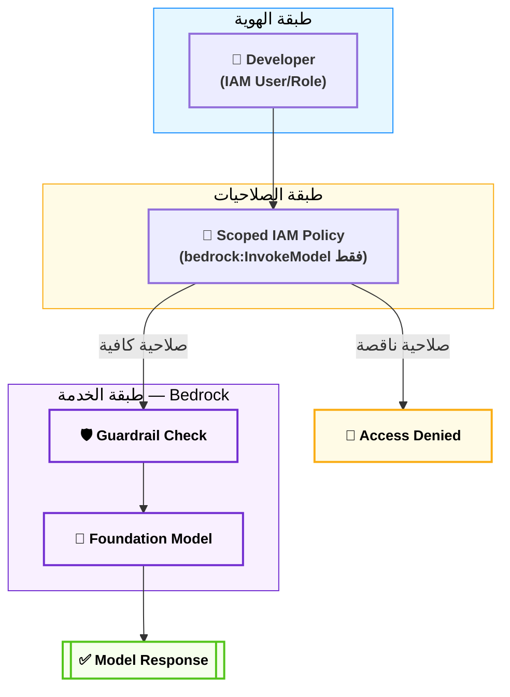
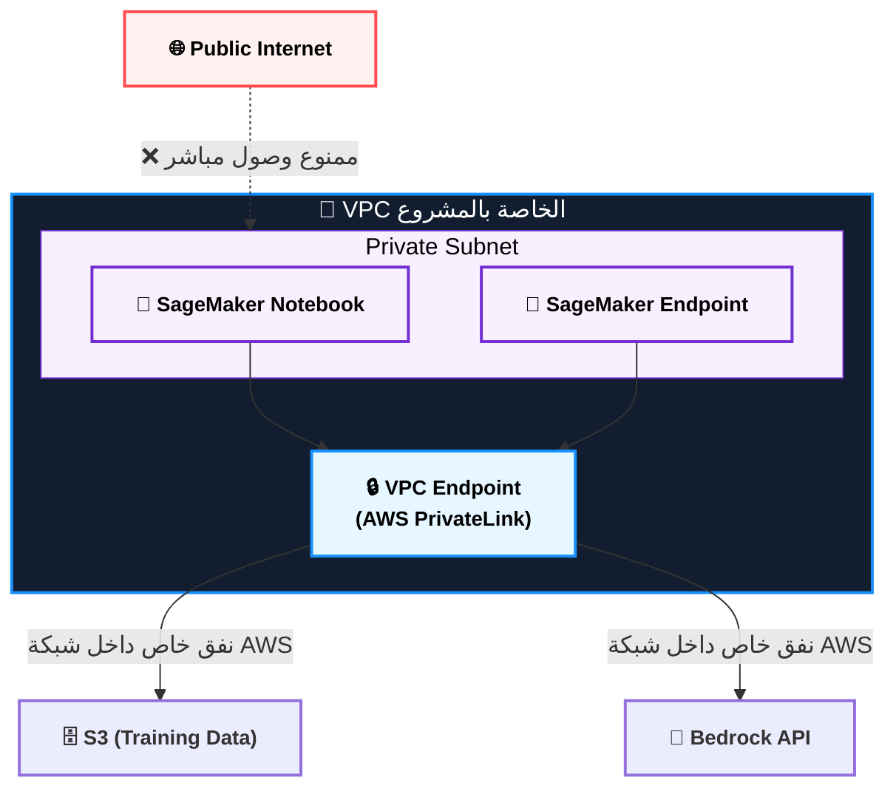
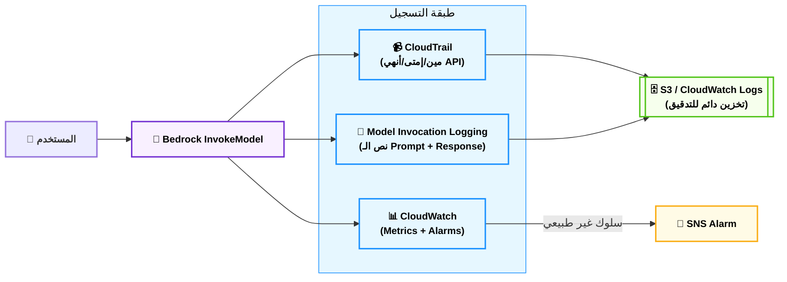

# Domain 5: Security, Compliance, and Governance for AI Solutions — AIF-C01 Deep Dive Notes
### الوزن في الامتحان: 14% من المحتوى المُقيَّم
### عدد الأسئلة التقريبي: ~7 أسئلة من أصل 50

## 📋 فهرس المحتوى
1. مقدمة الدومين — ليه AWS مخصصة 14% للأمان والـ Governance؟
2. IAM والتحكم في الوصول لخدمات الـ AI
3. تشفير الداتا: في الراحة (At Rest) وفي الحركة (In Transit)
4. عزل الشبكة: VPC وPrivateLink لبيئات الـ ML
5. Amazon Bedrock Guardrails — "الدرع الأخلاقي"
6. المراقبة والتدقيق: CloudTrail وCloudWatch وBedrock Logging
7. تتبع المصدر والـ Source Citation
8. معايير الامتثال (Compliance Standards): GDPR, HIPAA, ISO, SOC
9. AWS AI Service Cards — "جواز سفر النموذج"
10. أبعاد الـ Responsible AI الثمانية
11. استراتيجيات حوكمة الداتا: Lineage, Residency, Monitoring
12. Model Cards والشفافية
13. خلاصة الدومين — جدول المراجعة السريعة

---

## 1. مقدمة الدومين — ليه AWS مخصصة 14% للأمان والـ Governance؟

**أصل الحكاية (The Core Problem):**

تخيل إنك Team Leader في مشروع "Masar" بتاعك للـ NBE، وقررتوا تدمجوا فيه موديل GenAI يرد على استفسارات العملاء عن أرصدتهم. لو الموديل ده مش محمي صح، ممكن يحصل واحد من ثلاث كوارث: الأول، حد يـ "Prompt Inject" فيه ويخليه يطلع بيانات عميل تاني. التاني، الداتا اللي بتتبعت للموديل (أرقام حسابات، IBANs) تتسرب وهي ماشية على الشبكة لأنها مش متشفرة. الثالث، البنك المركزي المصري (أو أي جهة تنظيمية) يسألكوا "إزاي الموديل ده بيتخذ قراراته؟ ودي عملية Audit-able ولا لأ؟" ولو مفيش إجابة، يبقى المشروع كله سقط مش بس تقنياً، لكن قانونياً كمان.

دومين 5 في امتحان AIF-C01 مش بيسألك "إزاي تبني موديل" — ده بيسألك "إزاي تتأكد إن الموديل ده آمن، موثوق، وقابل للمراجعة من جهة خارجية." الفرق هنا إن الدومينات التانية بتتكلم عن الـ "Capability"، ودومين 5 بيتكلم عن الـ "Accountability". وده بالظبط اللي خلى AWS تدّيله 14% — لأن في عالم الشركات الحقيقي (بنوك، تأمين، حكومة)، موديل قوي بدون Governance هو قنبلة موقوتة.

> [!info] الفكرة الجوهرية للدومين كله
> كل قسم في الدومين ده بيدور حوالين سؤال واحد: **"مين يقدر يعمل إيه، على أنهي داتا، وإزاي نقدر نثبت ده بعدين؟"** (Who can do What, on which Data, and can we Prove it later?)

---

## 2. IAM والتحكم في الوصول لخدمات الـ AI

**أصل الحكاية (The Core Problem):**

في مشروع "Masar"، عندك ستة أعضاء فريق — كل واحد له دور مختلف. سلمى شغالة على الـ OAuth integration، كريم شغال على الـ email polling. لو كل واحد فيهم له صلاحية كاملة (Admin) على حساب AWS بتاع المشروع، ودخل حد غلط استخدم الـ Access Key بتاعه بإهمال، ممكن حد يشغّل موديل Bedrock مكلف جداً أو — الأسوأ — يقرا داتا حساسة للعملاء مالهوش دعوة بيها. الحل: مبدأ "أقل صلاحية ممكنة" (Least Privilege)، وده اللي الـ IAM بيطبقه.

### ⚙️ التشريح التقني — مكونات الـ IAM في سياق الـ AI

#### أ. الـ IAM Roles مقابل الـ IAM Users — "البدلة المؤقتة مقابل الهوية الدايمة"
- **IAM User:** هوية دايمة ليها Access Key ثابت، زي موظف عنده بطاقة دخول دايمة للمبنى. خطر لو اتسرب الـ Key لأنه ما بينتهيش.
- **IAM Role:** "بدلة مؤقتة" بتلبسها لما تحتاجها بس، وبتنزعها لما تخلص. دي اللي AWS بتنصح بيها لخدمات الـ AI — مثلاً، SageMaker Execution Role بتاخدها الـ Notebook Instance وقت التشغيل بس، وبتنتهي صلاحيتها (Temporary Credentials عبر STS) بعد فترة محددة.

#### ب. الـ Policies — "العقد المكتوب"
- **Identity-based Policies:** متعلقة بالـ User أو الـ Role نفسه — "إنت مسموحلك تعمل إيه؟"
- **Resource-based Policies:** متعلقة بالـ Resource نفسه (زي S3 Bucket Policy) — "مين مسموحله يوصلني؟"
- في سياق Bedrock، بتستخدم Identity-based Policy عشان تحدد مين يقدر يـ `InvokeModel` ومين يقدر يـ `CreateGuardrail`.

#### ج. مبدأ أقل الصلاحيات (Principle of Least Privilege) — "متديش مفتاح القصر كله عشان تفتح أوضة واحدة"
- لو سلمى محتاجة بس تستدعي موديل واحد (Claude مثلاً) في Bedrock، متديهاش صلاحية `bedrock:*` (كل الصلاحيات)، ادّيها بس `bedrock:InvokeModel` على الـ Model ARN المحدد.

> [!danger] فخ الامتحان 🚨
> الامتحان ممكن يجيب سيناريو فيه "Data Scientist محتاج يدرب موديل بس مش محتاج يحذف الـ S3 Bucket" — والإجابة الصح دايماً هي **أضيق Policy ممكنة تحقق المطلوب**، مش "Full Access عشان نضمن إنه ميتعطلش".

> [!warning] قاعدة ذهبية
> أي سؤال فيه "minimize risk" أو "principle of least privilege" أو "restrict access" — دايماً فكر في IAM Roles + Scoped Policies، مش في تشفير أو شبكات.

### 🏗️ اللوحة المعمارية: تدفق الصلاحيات في Bedrock

### 📊 شفرات الامتحان: IAM في سياق الـ AI

| السيناريو في الامتحان (Keyword) | الإجابة الصحيحة |
|---|---|
| `Restrict who can invoke a specific Bedrock model` | **IAM Identity-based Policy scoped to Model ARN** |
| `Temporary access for a training job` | **IAM Role with STS temporary credentials** |
| `Grant minimum permissions needed` | **Principle of Least Privilege** |
| `Control which AWS account can access an S3 bucket with training data` | **Resource-based Policy (S3 Bucket Policy)** |

---

## 3. تشفير الداتا: في الراحة (At Rest) وفي الحركة (In Transit)

**أصل الحكاية (The Core Problem):**

افتكر "Badaly" — مشروعك اللي بيكلم خطوط IVR بنكية. لو رقم تليفون العميل أو محتوى المكالمة اتخزن في قاعدة بيانات من غير تشفير، أي حد عنده وصول فيزيائي أو منطقي للـ Storage يقدر يقراها زي ما هي. ولو الداتا دي بتتنقل بين الـ Frontend والـ Backend من غير TLS، أي حد بيعمل "Man in the Middle" على نفس الشبكة يقدر يلقطها وهي طايرة. التشفير هو "الصندوق المُقفل" اللي بيحمي الداتا في الحالتين: وهي قاعدة (At Rest)، ووهي ماشية (In Transit).

### ⚙️ التشريح التقني — طبقات التشفير

#### أ. التشفير في الراحة (Encryption at Rest) — "الخزنة المغلقة"
- بتستخدم AWS KMS (Key Management Service) عشان تدير المفاتيح اللي بتشفر الداتا المخزنة في S3, EBS, RDS, أو حتى الـ Model Artifacts بتاعة SageMaker.
- في Bedrock، الداتا اللي بتستخدمها لعمل Fine-tuning أو Continued Pre-training بتتشفر تلقائياً، وممكن كمان تستخدم **Customer Managed Keys (CMK)** بدل الـ AWS Managed Keys لو محتاج تحكم أكبر (مين يقدر يستخدم المفتاح، ومتى يتلغي).

#### ب. التشفير في الحركة (Encryption in Transit) — "العربية المصفحة"
- بيتحقق عن طريق TLS/SSL — أي اتصال بين الـ Client والـ Bedrock API، أو بين الـ SageMaker Endpoint والتطبيق بتاعك، لازم يكون عبر HTTPS.
- AWS بتفرض TLS كـ Default على كل الـ API calls بتاعتها للخدمات المُدارة، لكن في حالة بناء بنية تحتية مخصصة (Custom VPC)، إنت مسؤول إنك تتأكد إن كل Endpoint بتاعك بيستخدم TLS.

> [!warning] الفرق بين Encryption والـ Access Control
> التشفير بيحميك لو حد "سرق" الداتا من الـ Storage نفسه (Data Exfiltration). أما الـ IAM فبيحميك من حد "يدخل" يقرا الداتا أصلاً. الاتنين مكملين بعض، مش بدائل لبعض — ده مفهوم بييجي في أسئلة الامتحان كـ Distractor.

> [!info] نصيحة الحل السريع
> لو السؤال فيه كلمة "data is stored" أو "saved" → فكر في **At Rest (KMS)**. لو فيه "transmitted" أو "sent over the network" أو "API call" → فكر في **In Transit (TLS)**.

### 📊 شفرات الامتحان: التشفير

| السيناريو في الامتحان (Keyword) | الإجابة الصحيحة |
|---|---|
| `Encrypt training data stored in S3` | **SSE-KMS (Server-Side Encryption with KMS)** |
| `Full control over key rotation and revocation` | **Customer Managed Key (CMK) in KMS** |
| `Secure data while calling the Bedrock API` | **TLS/HTTPS (enforced by default)** |
| `Protect model artifacts at rest` | **KMS encryption on SageMaker model artifacts (S3)** |

---

## 4. عزل الشبكة: VPC وPrivateLink لبيئات الـ ML

**أصل الحكاية (The Core Problem):**

لو عندك SageMaker Notebook بيتدرب على داتا حساسة بتاعة "Masar" (بيانات عملاء البنك)، وده الـ Notebook متاح على الـ Public Internet بشكل مباشر — يبقى إنت فاتح باب البيت على الشارع. الحل إنك "تحبس" الموديل والداتا جوه شبكة معزولة (VPC)، وتخلي أي اتصال بين الخدمات يتم من غير ما يمر على الإنترنت العام أصلاً.

### ⚙️ التشريح التقني — عزل البنية التحتية

#### أ. الـ VPC (Virtual Private Cloud) — "الحي السكني المسوّر"
- بتحط فيه الـ SageMaker Notebook Instances، الـ Training Jobs، والـ Endpoints جوه Subnets خاصة (Private Subnets) من غير Internet Gateway مباشر.

#### ب. الـ VPC Endpoints / AWS PrivateLink — "النفق الخاص"
- بدل ما الـ Traffic بين الـ VPC بتاعك وخدمة AWS (زي S3 أو Bedrock) يمشي عبر الإنترنت العام، PrivateLink بيعمل "نفق خاص" يوصل مباشرة جوه شبكة AWS الداخلية، من غير ما يطلع برّه أبداً.

> [!tip] التريكة المعمارية
> أي سؤال فيه "without traversing the public internet" أو "keep traffic within AWS network" → الإجابة دايماً **VPC Endpoint / AWS PrivateLink**.

### 🏗️ اللوحة المعمارية: عزل بيئة الـ ML بالـ VPC

### 📊 شفرات الامتحان: عزل الشبكة

| السيناريو في الامتحان (Keyword) | الإجابة الصحيحة |
|---|---|
| `Keep ML traffic off the public internet` | **AWS PrivateLink / VPC Endpoint** |
| `Isolate training environment from external access` | **Private Subnet within VPC** |
| `Control inbound/outbound traffic at instance level` | **Security Groups** |

---

## 5. Amazon Bedrock Guardrails — "الدرع الأخلاقي"

**أصل الحكاية (The Core Problem):**

تخيل إنك حطيت Chatbot بتاع "Masar" قدام عميل، وقاله حد "ازاي أعمل احتيال على نظام الـ ATM؟" — لو الموديل بيرد على أي حاجة من غير فلترة، ممكن يجاوب فعلاً وده كارثة قانونية وأخلاقية. كمان، لو عميل سأل عن موضوع برّه نطاق الخدمة (زي نصيحة طبية)، الموديل المفروض "يرفض بأدب" مش يحاول يجاوب وهو مالوش خبرة. الحل: **Bedrock Guardrails** — طبقة فلترة بتقف بين المستخدم والموديل، زي الحارس اللي بيقف قدام باب القصر.

### ⚙️ التشريح التقني — مكونات الـ Guardrails

#### أ. Content Filters — "الفلتر الكيميائي"
- بيمنع أنواع معينة من المحتوى الضار (Hate, Insults, Sexual, Violence, Misconduct) بمستويات حساسية مختلفة (None, Low, Medium, High) — تقدر تظبط كل نوع لوحده.

#### ب. Denied Topics — "المنطقة المحرمة"
- بتحدد مواضيع ممنوعة تماماً (مثلاً "نصايح استثمارية" لو الـ Chatbot بتاعك خدمة عملاء بس، مش مستشار مالي).

#### ج. Word Filters — "القايمة السودا"
- كلمات أو عبارات محددة (Profanity أو كلمات حساسة بتاعة الشركة) يتمنع ظهورها تماماً.

#### د. PII Redaction — "إخفاء الهوية"
- بيكتشف ويخفي (Mask) أو يمنع المعلومات الشخصية الحساسة (أرقام حسابات، أرقام قومية، إيميلات) سواء في الـ Input أو الـ Output.

#### هـ. Contextual Grounding Check — "كاشف الهلوسة"
- بيتأكد إن إجابة الموديل **مبنية فعلاً على المصدر** (في حالة RAG) ومش "مهلوس" — بيقارن الإجابة بالـ Source Documents ويرفض الإجابة لو الـ Relevance أو الـ Grounding score واطي عن حد معين.

> [!danger] فخ الامتحان 🚨
> الامتحان بيحب يلخبط بين **Guardrails** (طبقة أمان/سياسات عامة على مستوى التطبيق) و**Fine-tuning** (تغيير سلوك الموديل بالتدريب). لو السؤال فيه "block harmful content without retraining the model" → الإجابة **Guardrails** مش Fine-tuning.

> [!info] نصيحة الحل السريع
> Guardrails = **سياسة خارجية** تتطبق فوق أي موديل في Bedrock (Model-agnostic). تقدر تستخدم نفس الـ Guardrail مع أكتر من موديل.

### 📊 شفرات الامتحان: Bedrock Guardrails

| السيناريو في الامتحان (Keyword) | الإجابة الصحيحة |
|---|---|
| `Prevent the model from discussing competitor products` | **Denied Topics in Guardrails** |
| `Mask customer SSN or account numbers in responses` | **PII Redaction (Guardrails)** |
| `Detect when model response is not grounded in source` | **Contextual Grounding Check** |
| `Block hate speech and violent content` | **Content Filters in Guardrails** |
| `Apply the same safety policy across multiple models` | **Bedrock Guardrails (model-agnostic policy)** |

---

## 6. المراقبة والتدقيق: CloudTrail وCloudWatch وBedrock Logging

**أصل الحكاية (The Core Problem):**

بعد شهر من تشغيل "Masar"، البنك المركزي بيطلب تقرير: "مين استخدم الموديل، إمتى، وإيه اللي سأله بالظبط؟" لو معندكش سجل (Log) لكل ده، مش هتقدروا تردوا. ودي بالظبط الفكرة من الـ Audit Trail — مش بس "تشغيل الموديل"، لكن "إثبات إنك تقدر تتتبع كل حاجة حصلت".

### ⚙️ التشريح التقني — أدوات المراقبة

#### أ. AWS CloudTrail — "كاميرا المراقبة على كل الباب"
- بيسجل **كل API Call** اتعمل في حسابك — مين عمل إيه، إمتى، ومن أنهي IP. في سياق Bedrock، CloudTrail بيسجل أحداث زي `CreateGuardrail`, `InvokeModel` (بس مش بالضرورة محتوى الـ Prompt نفسه — ده دور Logging تاني).

#### ب. Amazon CloudWatch — "لوحة عدادات الأداء"
- بيراقب الـ Metrics (زي Latency, Invocation Count, Throttling) ويقدر يبعتلك Alarm لو حصل سلوك غير طبيعي (زي عدد طلبات غير عادي يدل على هجوم).

#### ج. Bedrock Model Invocation Logging — "دفتر يوميات المحادثة"
- ده الميزة المخصصة اللي بتسجل **محتوى الـ Prompt الكامل ومحتوى الـ Response الكامل** لكل استدعاء للموديل، وبتتخزن في S3 أو CloudWatch Logs. ده ضروري جداً للـ Audit والـ Compliance، لكنه **مش مُفعّل تلقائياً** — لازم تفعّله بنفسك.

> [!warning] قاعدة ذهبية
> CloudTrail بيقولك "**مين** استدعى الموديل وإمتى"، لكن Bedrock Invocation Logging هو اللي بيقولك "**إيه بالظبط** كان نص السؤال والإجابة". الامتحان بيحب يفرّق بينهم بدقة.

### 🏗️ اللوحة المعمارية: منظومة المراقبة الكاملة

### 📊 شفرات الامتحان: المراقبة والتدقيق

| السيناريو في الامتحان (Keyword) | الإجابة الصحيحة |
|---|---|
| `Track who called which AWS API and when` | **AWS CloudTrail** |
| `Audit the exact prompts and responses sent to a model` | **Bedrock Model Invocation Logging** |
| `Alert when invocation count spikes abnormally` | **CloudWatch Alarms** |
| `Prove compliance to a regulator about model usage history` | **CloudTrail + Model Invocation Logging combined** |

---

## 7. تتبع المصدر والـ Source Citation

**أصل الحكاية (The Core Problem):**

لو عميل سأل Chatbot "Masar" عن سياسة معينة في البنك، والموديل جاوب بثقة لكن من غير ما يقول "ده جاي من أنهي مستند" — مفيش طريقة تتأكد إن الإجابة دي صح أصلاً، ولا تقدر "تراجعها" لو غلط. الحل في أنظمة الـ RAG هو إن الموديل **يرجع المصدر مع كل إجابة**.

### ⚙️ التشريح التقني

- في **Bedrock Knowledge Bases**، أي استعلام بيستخدم RAG بيرجع مش بس الإجابة، لكن كمان الـ **Citations** — أجزاء من المستندات الأصلية اللي اتسحب منها الإجابة (مع الـ S3 location بتاعها).
- ده بيحقق هدفين: **الشفافية** (المستخدم يشوف من فين جاية الإجابة)، و**القابلية للتدقيق** (المراجع يقدر يتأكد إن الإجابة صح فعلاً موجودة في المصدر، مش هلوسة).

> [!info] نصيحة الحل السريع
> أي سؤال فيه "trace the response back to original document" أو "verify answer accuracy against source" → الإجابة **RAG with Citations (Bedrock Knowledge Bases)**.

### 📊 شفرات الامتحان: تتبع المصدر

| السيناريو في الامتحان (Keyword) | الإجابة الصحيحة |
|---|---|
| `Provide traceability of generated answers to source documents` | **Bedrock Knowledge Bases Citations** |
| `Reduce hallucination by grounding responses in verified data` | **RAG (Retrieval Augmented Generation)** |

---

## 8. معايير الامتثال (Compliance Standards): GDPR, HIPAA, ISO, SOC

**أصل الحكاية (The Core Problem):**

كل قطاع له "قواعد لعبة" مختلفة. مشروع طبي لازم يلتزم بـ HIPAA (حماية بيانات المرضى في أمريكا)، مشروع بيتعامل مع بيانات أوروبيين لازم يلتزم بـ GDPR، وأي شركة بتتعامل مع بنوك بتتسأل "إنت عندك ISO 27001 أو SOC 2؟" الامتحان مش بيطلب منك تبقى محامي، بس بيطلب منك **تعرف الفرق بين المعايير دي وتعرف أنهي خدمة AWS بتساعدك تحققها**.

### ⚙️ التشريح التقني — لمحة عن كل معيار

#### أ. GDPR (General Data Protection Regulation) — "دستور الخصوصية الأوروبي"
- بيركز على حقوق الفرد في بياناته: حق الوصول، حق المسح ("Right to be Forgotten")، وضرورة الموافقة الصريحة على استخدام البيانات.

#### ب. HIPAA (Health Insurance Portability and Accountability Act) — "حارس البيانات الطبية"
- معيار أمريكي خاص بحماية بيانات المرضى الصحية (PHI). أي نظام AI بيتعامل مع بيانات طبية أمريكية لازم يكون "HIPAA Eligible Services" بس.

#### ج. ISO/IEC Standards (زي ISO 27001, ISO 42001) — "شهادة الجودة العالمية"
- ISO 27001 خاص بإدارة أمن المعلومات بشكل عام. ISO 42001 (أحدث) خاص تحديداً بإدارة أنظمة الـ AI (AI Management Systems) — ده معيار جديد نسبياً ومهم جداً للـ Governance.

#### د. SOC (System and Organization Controls) — SOC 1/2/3 — "تقرير الثقة لمزودي الخدمة"
- تقارير بتثبت إن الشركة (زي AWS نفسها) عندها ضوابط داخلية كافية لحماية بيانات عملائها. SOC 2 بالذات بيركز على Security, Availability, Confidentiality.

> [!warning] قاعدة ذهبية
> AWS عمرها ما هتديك "Compliance" جاهزة — هي بتديك **الأدوات** (Encryption, Logging, Access Control) اللي تساعدك توصل للامتثال. المسؤولية مشتركة (Shared Responsibility Model) — AWS مسؤولة عن أمان الـ Cloud نفسه (Of the Cloud)، وإنت مسؤول عن أمان استخدامك للـ Cloud (In the Cloud).

> [!info] نصيحة الحل السريع
> لو السؤال ذكر "healthcare data" → فكر HIPAA. لو ذكر "EU citizens data" أو "right to erasure" → فكر GDPR. لو ذكر "demonstrate security controls to auditors/customers" → فكر SOC 2. لو ذكر "AI-specific management system certification" → فكر ISO 42001.

### 📊 شفرات الامتحان: معايير الامتثال

| السيناريو في الامتحان (Keyword) | الإجابة الصحيحة |
|---|---|
| `Customer requests deletion of all their personal data` | **GDPR — Right to Erasure** |
| `AI system processes patient medical records in the US` | **HIPAA Eligible Services** |
| `Prove security controls to enterprise customers/auditors` | **SOC 2 Report** |
| `Certification specifically for AI management systems` | **ISO/IEC 42001** |
| `Who is responsible for securing data IN the AWS cloud?` | **The Customer (Shared Responsibility Model)** |

---

## 9. AWS AI Service Cards — "جواز سفر النموذج"

**أصل الحكاية (The Core Problem):**

لو هتستخدم موديل Foundation Model من Bedrock في مشروع حساس، إزاي تعرف "إيه حدوده، استخداماته المقصودة، وقيوده المعروفة" من غير ما تقرا كل الـ Research Papers؟ AWS عملت حل اسمه **AI Service Cards** — وثيقة رسمية بتلخص كل ده.

### ⚙️ التشريح التقني

- كل AI Service Card بتغطي: **Intended Use Cases** (الاستخدامات المقصودة)، **Limitations** (القيود المعروفة)، **Responsible AI Design Considerations** (اعتبارات التصميم الأخلاقي)، و**Performance Expectations** (توقعات الأداء).
- متاحة لخدمات زي Amazon Rekognition, Amazon Textract, وبعض موديلات Bedrock.
- الهدف: تدّيك **شفافية** قبل ما تستخدم الخدمة في حالة استخدام حساسة (زي التعرف على الوجوه في تطبيق أمني).

> [!info] نصيحة الحل السريع
> لو السؤال فيه "where can I find documented limitations and intended use of an AWS AI service" → الإجابة **AWS AI Service Cards**.

### 📊 شفرات الامتحان: AI Service Cards

| السيناريو في الامتحان (Keyword) | الإجابة الصحيحة |
|---|---|
| `Understand intended use and known limitations of a model before deployment` | **AWS AI Service Cards** |
| `Document responsible AI considerations for a specific service` | **AI Service Cards** |

---

## 10. أبعاد الـ Responsible AI الثمانية

**أصل الحكاية (The Core Problem):**

لو موديل "Masar" بيرفض قروض لعملاء معينين بشكل متحيز (Biased) من غير سبب منطقي، ده مش بس مشكلة تقنية — ده مشكلة أخلاقية وقانونية ممكن تجيب للبنك دعوى قضائية. AWS حددت **8 أبعاد** لازم أي نظام AI مسؤول يحققها، وده "دستور" الـ Responsible AI بتاعها.

### ⚙️ التشريح التقني — الأبعاد الثمانية

| البُعد | المعنى | مثال عملي |
|---|---|---|
| **Fairness** (العدالة) | الموديل ميفرقش بين الناس بشكل غير عادل | رفض قرض بناءً على العرق بدل الجدارة الائتمانية |
| **Explainability** (القابلية للتفسير) | تقدر تشرح ليه الموديل اتخذ قرار معين | استخدام SageMaker Clarify لشرح أسباب القرار |
| **Privacy and Security** (الخصوصية والأمان) | حماية بيانات الأفراد المستخدمة في التدريب | تشفير وإخفاء PII |
| **Safety** (السلامة) | منع ضرر فيزيائي أو نفسي للمستخدمين | Guardrails ضد المحتوى الخطر |
| **Controllability** (القابلية للتحكم) | البشر يقدروا يوقفوا أو يعدلوا سلوك النظام | Human-in-the-loop review |
| **Veracity and Robustness** (الصحة والمتانة) | الموديل دقيق وثابت تحت ظروف مختلفة | اختبار الموديل ضد Adversarial inputs |
| **Governance** (الحوكمة) | وجود سياسات وعمليات واضحة لإدارة دورة حياة الـ AI | تطبيق Model Cards وAudit Trails |
| **Transparency** (الشفافية) | وضوح إن المستخدم بيتكلم مع AI، مش إنسان | الإفصاح "إنت بتتكلم مع مساعد آلي" |

> [!warning] فخ الامتحان 🚨
> الامتحان بيحب يدّيك سيناريو وتقولوا "ده أنهي بُعد؟" — لازم تفرّق بدقة بين **Fairness** (التحيز في القرار) و**Explainability** (هل تقدر تشرح القرار ده) — دول مختلفين تماماً حتى لو شكلهم متشابه.

### 📊 شفرات الامتحان: أبعاد Responsible AI

| السيناريو في الامتحان (Keyword) | الإجابة الصحيحة |
|---|---|
| `Model gives unequal outcomes based on demographic group` | **Fairness** |
| `Stakeholders need to understand why a decision was made` | **Explainability** |
| `Humans can intervene and override model decisions` | **Controllability** |
| `Users are informed they are interacting with AI, not a human` | **Transparency** |
| `Model performs consistently across edge cases and attacks` | **Veracity and Robustness** |

---

## 11. استراتيجيات حوكمة الداتا: Lineage, Residency, Monitoring

**أصل الحكاية (The Core Problem):**

في "Masar"، الداتا اللي دربتوا عليها الموديل جاية منين بالظبط؟ مرّت بإيه معالجات؟ اتخزنت فين جغرافياً؟ لو معرفتوش تجاوبوا على الأسئلة دي، مش هتقدروا تثقوا في الموديل، ومش هتقدروا تثبتوا للمنظم إنكم ملتزمين بقوانين زي "بيانات المصريين تفضل في مصر" (Data Residency requirements).

### ⚙️ التشريح التقني — ثلاث ركائز

#### أ. Data Lineage — "شجرة نسب الداتا"
- تتبع كامل لمسار البيانات: من فين جاية، إيه التحويلات (Transformations) اللي اتعملتلها، ووصلت فين في النهاية. أدوات زي **AWS Glue DataBrew** و**SageMaker ML Lineage Tracking** بتسجل ده تلقائياً.

#### ب. Data Residency — "جواز إقامة الداتا"
- بعض القوانين (زي قوانين مصرية أو أوروبية) بتطلب إن الداتا الحساسة **تفضل فيزيائياً** جوه حدود دولة معينة. لازم تختار AWS Region صح عشان تحقق المتطلب ده.

#### ج. Data Monitoring — "الحارس المستمر"
- مراقبة مستمرة لجودة الداتا (Data Quality) واكتشاف أي Drift (انحراف) في توزيع البيانات بمرور الوقت، عشان تتأكد إن الموديل لسه شغال صح على داتا حقيقية مشابهة لما اتدرب عليها.

> [!info] نصيحة الحل السريع
> أي سؤال فيه "must keep data within country borders" → **Data Residency → اختار AWS Region المناسب**. أي سؤال فيه "trace data transformations from source to model" → **Data Lineage**.

### 📊 شفرات الامتحان: حوكمة الداتا

| السيناريو في الامتحان (Keyword) | الإجابة الصحيحة |
|---|---|
| `Track the full history of data from source to model training` | **Data Lineage (SageMaker ML Lineage Tracking)** |
| `Sensitive data must remain within a specific country` | **Data Residency — choose correct AWS Region** |
| `Detect when production data distribution shifts over time` | **Data Monitoring / Drift Detection** |

---

## 12. Model Cards والشفافية

**أصل الحكاية (The Core Problem):**

لو فريقك في "Masar" دربتوا موديل خاص (مش بس استخدمتوا موديل جاهز من Bedrock)، إزاي توثقوا تفاصيله بشكل قياسي يقدر أي حد جديد في الفريق (أو أي Auditor) يفهمها بسرعة؟ الحل هو **Model Cards**.

### ⚙️ التشريح التقني

- Model Card بتوثق: الغرض من الموديل، الداتا المستخدمة في التدريب، مقاييس الأداء (Metrics)، القيود المعروفة، واعتبارات الـ Bias.
- **Amazon SageMaker Model Cards** بتسمحلك تنشئ وتدير الوثيقة دي مباشرة جوه SageMaker، وتربطها بالموديل نفسه طول دورة حياته.
- الفرق عن AI Service Card: **AI Service Card** بتوثق خدمة AWS جاهزة (زي Rekognition)، أما **Model Card** فبتوثق **موديل إنت دربته أو خصصته بنفسك**.

> [!warning] قاعدة ذهبية
> AI Service Card = "AWS بتوثق منتجها هي". Model Card = "إنت بتوثق موديلك إنت". متلخبطش بينهم في الامتحان.

### 📊 شفرات الامتحان: Model Cards

| السيناريو في الامتحان (Keyword) | الإجابة الصحيحة |
|---|---|
| `Document training data, intended use, and limitations of a custom-trained model` | **Amazon SageMaker Model Cards** |
| `Standardize documentation across the team for an internal model` | **SageMaker Model Cards** |

---

## 13. خلاصة الدومين — جدول المراجعة السريعة

| الموضوع | الأداة/المفهوم الأساسي | السؤال اللي بيجاوب عليه |
|---|---|---|
| التحكم في الوصول | IAM Roles + Least Privilege | مين يقدر يعمل إيه؟ |
| حماية الداتا المخزنة | KMS (At Rest) | الداتا محمية وهي قاعدة؟ |
| حماية الداتا الماشية | TLS (In Transit) | الداتا محمية وهي بتتنقل؟ |
| عزل الشبكة | VPC + PrivateLink | البنية التحتية معزولة عن الإنترنت؟ |
| فلترة المحتوى | Bedrock Guardrails | الموديل بيرفض المحتوى الضار؟ |
| تتبع كل API Call | CloudTrail | مين استخدم إيه وإمتى؟ |
| تسجيل المحادثات | Bedrock Invocation Logging | إيه نص الـ Prompt والـ Response؟ |
| تتبع مصدر الإجابة | RAG Citations | الإجابة دي جاية منين؟ |
| الامتثال القانوني | GDPR / HIPAA / SOC 2 / ISO 42001 | إحنا ملتزمين بالقانون؟ |
| توثيق خدمة AWS | AI Service Cards | إيه حدود الخدمة الجاهزة؟ |
| توثيق موديلي الخاص | SageMaker Model Cards | إيه تفاصيل الموديل اللي دربته؟ |
| الأخلاقيات الثمانية | Fairness, Explainability, إلخ | هل الموديل ده "مسؤول"؟ |
| حوكمة الداتا | Lineage, Residency, Monitoring | الداتا منين، وفين، وسليمة؟ |

> [!tip] التريكة المعمارية الأخيرة
> لو حسّيت إن سؤال الامتحان "مالوش علاقة بالـ ML نفسه" وأقرب لأسئلة الـ Security العامة بتاعة AWS (زي IAM, KMS, VPC, CloudTrail) — متتلخبطش، هو فعلاً كده، بس مطبّق على سياق AI. الدومين ده بيختبر معرفتك بـ AWS Security الأساسية وإزاي تطبقها على Bedrock/SageMaker تحديداً.

---

**كده يا محمد خلصنا الدومين كامل من غير ما نسيب أي Topic Statement من الـ Official Exam Guide. الدومين التالي لو حابب نكمل عليه، قولي وهبدأ جلسة جديدة بنفس الأسلوب.**
