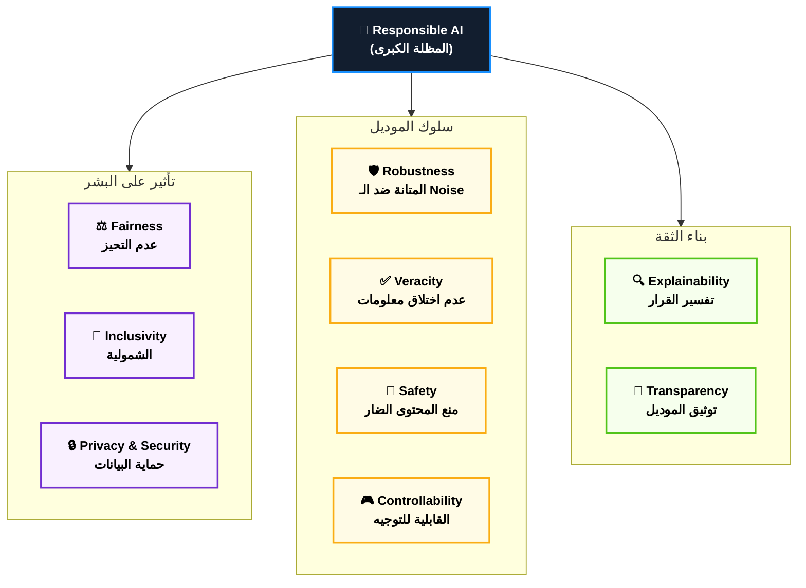
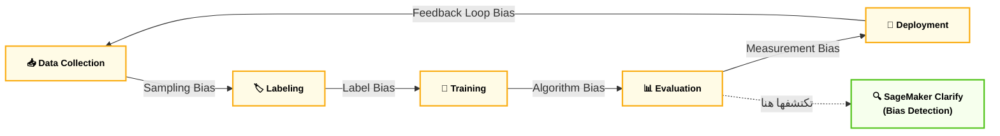
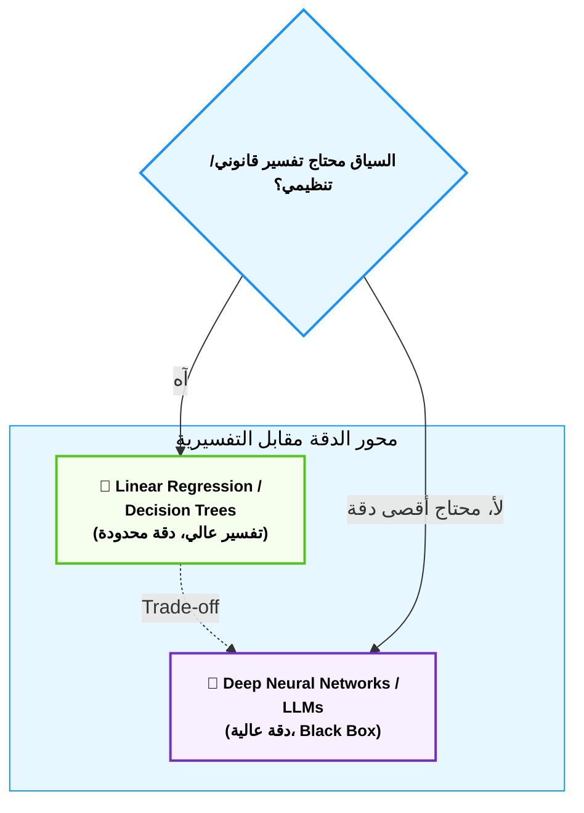
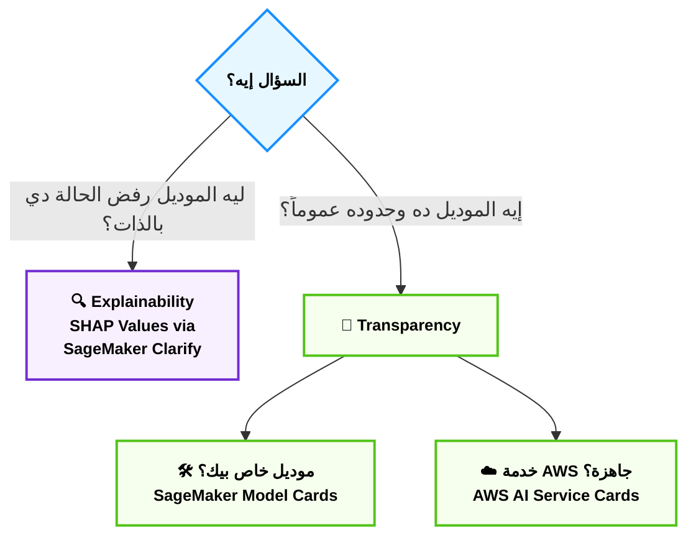
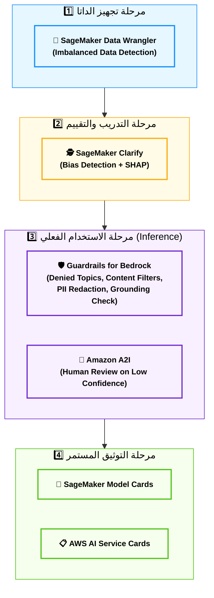

# Domain 4: Guidelines for Responsible AI — AIF-C01 Deep Dive Notes
### الوزن في الامتحان: 14% من المحتوى المُقيَّم
### عدد الأسئلة التقريبي: ~7 أسئلة من أصل 50

## 📋 فهرس المحتوى
1. أصل الحكاية الكبرى — ليه أصلاً محتاجين "Responsible AI"؟
2. الأعمدة السبعة للـ Responsible AI (Fairness, Robustness, Safety, Veracity...)
3. الـ Bias — العدو الخفي جوه الداتا
4. الـ Variance والـ Trade-offs (Safety vs Performance, Accuracy vs Explainability)
5. الشفافية والتفسيرية (Transparency & Explainability)
6. الـ Human-in-the-Loop — مين بيتدخل وفين في الـ ML Lifecycle؟
7. عدة الشغل: الأدوات اللي AWS مديهالك (Clarify, Guardrails, Model Cards, AI Service Cards)
8. مقارنة Open-Source vs Proprietary Models من منظور الـ Governance
9. جدول التجميع النهائي (Master Exam Codes Table)

---

## 1. أصل الحكاية الكبرى — ليه أصلاً محتاجين "Responsible AI"؟

**أصل الحكاية (The Core Problem):**

تخيل معايا السيناريو ده: بنك زي NBE قرر يعمل موديل AI يقرر "مين ياخد قرض ومين لأ" عشان يسرّع عملية الموافقات. الموديل اتدرب على بيانات تاريخية لقروض اتوافق عليها واتُرفضت في آخر 10 سنين. المشكلة؟ البيانات التاريخية دي فيها أثر تحيزات بشرية قديمة — يمكن موظفين زمان كانوا بيرفضوا قروض لسكان مناطق معينة بشكل غير عادل، أو بيفضّلوا فئة معينة عن تانية. الموديل، وهو "بيتعلم"، مش بيتعلم العدالة — هو بيتعلم "الباترن" اللي شافه في الداتا. لو الباترن متحيز، الموديل هيبقى متحيز، وأخطر من كده: هيبقى متحيز بثقة رياضية 99%، وده أخطر من تحيز موظف بشري لأن محدش هيشك في "الخوارزمية" بسهولة.

ده بالظبط السبب اللي خلّى AWS تحط دومين كامل في الامتحان اسمه "Guidelines for Responsible AI" — مش عشان يفلسفوك، لكن عشان أي حد هيبني أنظمة AI لازم يبقى عنده "وعي هندسي" بإن الموديل مش بس "أداة دقة"، هو كمان "أداة قرار" بتأثر على ناس حقيقية. والامتحان بيختبر فيك: هل تقدر تتعرف على المشكلة (Bias, Lack of Explainability, Safety Risk) قبل ما تحصل، وهل تعرف الأداة الصح من AWS اللي تحلها؟

> [!info] القاعدة الذهبية للدومين ده
> الدومين ده مش بيسألك "احسب الـ Accuracy"، هو بيسألك أسئلة من نوع "السيناريو ده فيه مشكلة إيه؟" أو "هتستخدم أنهي خدمة من AWS عشان تكتشف/تمنع المشكلة دي؟". يعني هو دومين **تصنيفي وتطبيقي** أكتر منه حسابي.

---

## 2. الأعمدة السبعة للـ Responsible AI

**أصل الحكاية (The Core Problem):**

لو سألت AWS "إيه معنى إن الموديل يبقى Responsible؟"، هيقولك إن الكلمة دي مش حاجة واحدة — هي **مظلة** بتحت سبع خصائص (Features) لازم تتوفر مع بعض. لو خصلة واحدة ناقصة، الموديل ممكن يبقى دقيق جداً (High Accuracy) بس "خطير" في نفس الوقت. AWS بتجمعهم في وثيقة اسمها **AWS Responsible AI Dimensions**، وده اللي الامتحان بيركز عليه:

### ⚙️ الأعمدة السبعة بالتفصيل

#### أ. Fairness (العدالة) — "ميزان القاضي"
- الموديل لازم ميديش نتايج متحيزة ضد فئة معينة (نوع، عرق، سن، منطقة جغرافية...) — زي مثال البنك اللي فوق بالظبط.
- بيتقاس عن طريق مقارنة الـ Outcomes بين الـ Groups المختلفة (هل نسبة الموافقة على القروض لفئة معينة أقل بشكل غير منطقي؟).

#### ب. Explainability (التفسيرية) — "زجاج الصندوق الأسود"
- قدرتك إنك تشرح "ليه الموديل اتخد القرار ده" بلغة بشرية مفهومة، مش بس "كده لأن الأرقام طلعت كده".
- مهم جداً في القطاعات المنظمة (Regulated) زي البنوك والصحة — لو رفضت قرض حد، القانون المصري (وقوانين تانية عالمية) بيقولك "لازم تقدر تفسّر ليه".

#### ج. Robustness (المتانة) — "الجندي اللي ميهزّش"
- الموديل لازم يفضل شغال صح حتى لو الداتا اللي جاتله شوية مختلفة عن اللي اتدرب عليها (Edge Cases, Noisy Data, Adversarial Inputs).
- مثال: موديل OCR بيقرأ بطاقات الرقم القومي المصرية — لازم يفضل دقيق حتى لو الصورة مائلة شوية أو فيها انعكاس ضوء.

#### د. Veracity & Robustness (الصدقية) — "أمانة الكلام"
- خاص جداً بالـ Generative AI: الموديل ميختلقش معلومات (Hallucination). لو الموديل مش متأكد، الأفضل يقول "مش عارف" بدل ما يخترع إجابة بثقة.

#### هـ. Safety (الأمان) — "الكابح"
- الموديل ميطلعش محتوى ضار، عنيف، أو خطير. ده اللي بتعمله الـ **Guardrails**.

#### و. Controllability (القابلية للتحكم) — "عربة فيها فرامل يد"
- قدرتك كمطوّر إنك "توجّه" سلوك الموديل (تمنعه يتكلم عن مواضيع معينة، تخليه يلتزم بنبرة صوت/Tone معينة).

#### ز. Privacy & Security (الخصوصية والأمان) — "خزنة البيانات"
- البيانات اللي اتستخدمت في التدريب أو الـ Inference متتسربش، وميتقدرش حد "يستخرج" بيانات حساسة من الموديل بالسؤال الذكي.

#### ح. Transparency (الشفافية) — "بطاقة الهوية"
- إنك توثّق وتنشر معلومات عن الموديل نفسه: إزاي اتدرب، على أنهي داتا، وحدوده (Limitations) — ده اللي بتعمله الـ **Model Cards** و **AI Service Cards**.

#### ط. Inclusivity (الشمولية) — "طاولة فيها مكان للكل"
- الموديل يخدم كل الفئات بعدالة (لغات مختلفة، لهجات، ناس بإعاقات، خلفيات ثقافية مختلفة) مش بس الفئة اللي اتدرب عليها أكتر.

> [!warning] فخ الامتحان 🚨
> الامتحان أحياناً بيدّيلك سيناريو ويسألك "ده مشكلة في إيه من الخصائص دي؟" — لازم تفرّق كويس بين **Fairness** (تحيز ضد فئة) و **Veracity** (اختلاق معلومات/Hallucination) و **Safety** (محتوى ضار). الثلاثة دول أكتر تلات حاجات بيتلخبط فيهم الطلاب.

### 🏗️ اللوحة المعمارية: خريطة الأعمدة السبعة

### 📊 شفرات الامتحان: تصنيف المشاكل

| السيناريو في الامتحان (Keyword) | الخاصية المتأثرة |
|---|---|
| `Model approves loans more for one demographic group` | **Fairness** |
| `Chatbot invents a fake company policy` | **Veracity (Hallucination)** |
| `Model generates violent or offensive content` | **Safety** |
| `Model works well on test data but fails on slightly different real-world data` | **Robustness** |
| `Stakeholders cannot understand why the model made a decision` | **Explainability** |
| `Company wants to publish documentation about model training data and limitations` | **Transparency** |
| `Model performs poorly for users speaking a different dialect` | **Inclusivity** |
| `Restricting chatbot from discussing certain topics` | **Controllability** |

---

## 3. الـ Bias — العدو الخفي جوه الداتا

**أصل الحكاية (The Core Problem):**

الـ Bias مش "خطأ برمجي" بتقدر تصلحه بسطر كود — هو "أثر" بيتسرب من مصادر مختلفة في رحلة الموديل من الداتا للـ Deployment. علشان تفهم إزاي تمنعه، لازم الأول تعرف **هو جاي منين**. AWS بتقسّم مصادر الـ Bias في الـ ML Lifecycle لمجموعة مراحل، وكل مرحلة ليها نوع تحيز مختلف ليها اسمه الخاص.

### ⚙️ تشريح أنواع الـ Bias

#### أ. Sampling Bias (تحيز العيّنة) — "البير اللي بيشرب منه الموديل"
- لما الداتا اللي جمعتها مش ممثلة (Representative) للمجتمع الحقيقي اللي الموديل هيشتغل عليه.
- مثال: موديل تعرّف على الوجوه اتدرب بس على صور لناس من دولة واحدة → هيفشل مع ملامح وجوه تانية.

#### ب. Measurement Bias (تحيز القياس)
- لما طريقة جمع أو قياس الداتا نفسها فيها خلل منهجي يخلّي فئة معينة تظهر "أسوأ" أو "أحسن" من الواقع.
- مثال: لو سؤال استبيان مكتوب بصيغة بتفضّل إجابة معينة.

#### ج. Label Bias (تحيز التصنيف) — "حكم الموظف البشري"
- لما البشر اللي عمّلوا Labeling للداتا (مثلاً وسموا الإيميلات بـ Spam/Not Spam) جابوا تحيزاتهم الشخصية معاهم للتصنيف.

#### د. Observer Bias / Confirmation Bias
- لما الفريق اللي بيبني الموديل بيفسّر النتائج بطريقة تأكد افتراضاتهم المسبقة، فبيتجاهلوا إشارات الخطأ.

> [!danger] فخ الامتحان 🚨
> الامتحان بيحب يسأل: "الفريق لاحظ إن نسبة دقة الموديل عالية جداً على الـ Test Set بس فشل في الإنتاج (Production)" — ده مش بالضرورة Bias، ده ممكن يبقى **Overfitting** (هيتشرح في القسم الجاي). لازم تفرّق: لو المشكلة "ناس فئة معينة بتتظلم"، ده **Bias**. لو المشكلة "الموديل عموماً مش شغال زي ما كان متوقع"، ده غالباً **Variance/Overfitting**.

### 🏗️ اللوحة المعمارية: رحلة الـ Bias في ML Lifecycle

### 📊 شفرات الامتحان: أنواع الـ Bias

| السيناريو في الامتحان (Keyword) | نوع الـ Bias |
|---|---|
| `Training data does not represent the full population` | **Sampling Bias** |
| `Human annotators' personal opinions affect the labels` | **Label Bias** |
| `Survey questions were worded to favor a certain answer` | **Measurement Bias** |
| `Team only sees results that confirm their hypothesis` | **Confirmation/Observer Bias** |
| `Detect and measure bias in training data and model predictions` | **Amazon SageMaker Clarify** |

---

## 4. الـ Variance والـ Trade-offs

**أصل الحكاية (The Core Problem):**

أي مهندس AI بيواجه معضلة أزلية: "لو زودت دقة الموديل، باقي حاجات بتتأثر؟" الإجابة: أه، دايماً. مفيش "Free Lunch" في الـ Machine Learning. الامتحان بيركز على نوعين أساسيين من الـ Trade-offs لازم تفهمهم كويس.

### ⚙️ التشريح التقني للـ Trade-offs

#### أ. Bias-Variance Trade-off — "الزنبلك المشدود"
- **High Bias (Underfitting):** الموديل "بسيط أوي" — مش قادر يلتقط الباترنز في الداتا حتى. أداءه وحش على الـ Training وعلى الـ Test كمان.
- **High Variance (Overfitting):** الموديل "حافظ" الداتا اللي اتدرب عليها بدل ما "يتعلم" منها — أداءه ممتاز على الـ Training، بس بيفشل تماماً مع داتا جديدة (Production) ميشفهاش قبل كده.
- **الموازنة المثالية (Sweet Spot):** موديل معقّد بالقدر اللي يقدر يلتقط الباترن الحقيقي من غير ما "يحفظ" التفاصيل العشوائية (Noise).

> [!tip] التريكة المعمارية
> لو سؤال الامتحان وصف "أداء ممتاز على بيانات التدريب، أداء ضعيف جداً على بيانات حقيقية جديدة" → الإجابة **Overfitting (High Variance)**. الحل المقترح غالباً: زيادة حجم وتنوع الـ Training Data، أو استخدام Regularization، أو تبسيط الموديل.

#### ب. Model Safety vs Performance Trade-off — "الفرامل اللي بتبطّي العربية"
- كل ما زودت طبقات الحماية (Guardrails، فلاتر المحتوى، قيود الـ Topic) كل ما الموديل بيبقى "أأمن"، بس ممكن يبقى:
  - أبطأ (Latency أعلى — كل رسالة بتتفحص قبل/بعد الإرسال).
  - أقل "إبداع" أو أقل قدرة على الإجابة على أسئلة حدّية مشروعة (False Positives — يرفض يجاوب على سؤال طبي شرعي لأنه فيه كلمة حساسة).
- بالعكس، موديل "مفلوت" بدون Guardrails هيبقى أسرع وأكتر مرونة، بس معرّض لمخاطر أمان وسمعة أعلى.

#### ج. Accuracy vs Explainability Trade-off — "كل ما عقّدت، كل ما اتعتّمت"
- موديلات زي **Linear Regression** و **Decision Trees** البسيطة → سهل جداً تفسّرها (تقدر تقول "القرار اتاخد لأن X و Y")، بس دقتها محدودة على مسائل معقدة.
- موديلات زي **Deep Neural Networks** و **Large Language Models** → دقة عالية جداً على مسائل معقدة، بس بقت "Black Box" — صعب توضح بالظبط ليه اتخدت القرار ده بالتحديد.

> [!warning] فخ الامتحان 🚨
> الامتحان بيحب يحط سيناريو "بنك محتاج يفسر قرار رفض القرض للعميل قانونياً" → الإجابة المتوقعة هي اختيار موديل **أبسط وأكتر تفسيرية** (زي Decision Tree) حتى لو فيه موديل تاني أدق شوية، أو استخدام أدوات تفسير (زي SHAP values جوه SageMaker Clarify) فوق الموديل المعقد.

### 🏗️ اللوحة المعمارية: محور الـ Trade-offs

### 📊 شفرات الامتحان: الـ Trade-offs

| السيناريو في الامتحان (Keyword) | المفهوم |
|---|---|
| `High accuracy on training data, low accuracy on new data` | **Overfitting (High Variance)** |
| `Model is too simple and performs poorly on both training and test data` | **Underfitting (High Bias)** |
| `Adding more guardrails increases latency` | **Safety vs Performance Trade-off** |
| `Regulator requires the institution to explain credit decisions` | **اختيار موديل تفسيري (Explainability over Accuracy)** |
| `Need to understand which features influenced a model's prediction` | **SHAP values via SageMaker Clarify** |

---

## 5. الشفافية والتفسيرية (Transparency & Explainability)

**أصل الحكاية (The Core Problem):**

تخيل إنك مدير منتج في فودافون مصر، وعندك موديل AI بيقترح "عروض مخصصة" لكل عميل. يوم من الأيام، عميل اشتكى إنه "ليه أنا ما اخدتش العرض ده والزميل بتاعي أخده؟" — لو معندكش إجابة، الشركة في ورطة قانونية وسمعة. الـ Transparency والـ Explainability هما السلاحين اللي بيحلوا المشكلة دي، بس كل واحد بيحلها بطريقة مختلفة.

### ⚙️ الفرق الجوهري بين الاتنين

#### أ. Explainability (التفسيرية) — "ليه الموديل قال كده؟"
- بتجاوب على سؤال محدد: **ليه الموديل اتخد القرار المعيّن ده، للحالة المعيّنة دي؟**
- بتعتمد على تقنيات زي **SHAP (SHapley Additive exPlanations)** اللي بتوضح "وزن" كل Feature (مثلاً: الدخل الشهري ساهم بـ 40% في قرار الرفض، عمر الحساب ساهم بـ 25%...).
- مدمجة جوه **Amazon SageMaker Clarify**.

#### ب. Transparency (الشفافية) — "إيه أصل الموديل ده؟"
- بتجاوب على سؤال أعم: **إيه الموديل ده؟ اتدرب إزاي؟ على أنهي داتا؟ إيه حدوده وقيوده؟**
- بتتحقق عن طريق **التوثيق (Documentation)** — يعني تقارير وبطاقات بيانات بتوصف الموديل من بره، مش بتفسّر قرار بعينه.
- الأدوات الأساسية هنا: **SageMaker Model Cards** و **AWS AI Service Cards**.

> [!info] نصيحة أخيرة للحل السريع
> لو السؤال بيتكلم عن "قرار واحد محدد"، فكّر **Explainability**. لو السؤال بيتكلم عن "توثيق الموديل ونشر معلومات عنه بشكل عام"، فكّر **Transparency**.

### ⚙️ أدوات التوثيق بالتفصيل

#### Amazon SageMaker Model Cards — "شهادة ميلاد الموديل"
- بتوثق: الغرض المقصود من الموديل (Intended Use)، حدوده (Limitations)، اعتبارات الأخلاقيات (Ethical Considerations)، مقاييس الأداء (Performance Metrics)، وتفاصيل التدريب.
- الهدف: أي حد جديد (مهندس، Auditor، حتى عميل) يقدر يفهم الموديل من غير ما يفتح الكود.

#### AWS AI Service Cards — "كرت الهوية الرسمي من AWS لخدماتها الجاهزة"
- زي الـ Model Cards بالظبط، بس دي **AWS نفسها** اللي بتصدرها عن خدماتها الجاهزة (زي Amazon Rekognition، Amazon Textract) — مش حاجة إنت بتعملها لموديلك الخاص.
- بتوثق: حالات الاستخدام المقصودة (Intended Use Cases)، القيود (Limitations)، اعتبارات العدالة (Fairness Considerations)، الأداء (Performance Expectations)، أفضل الممارسات (Best Practices) للخدمة دي.

> [!warning] فخ الامتحان 🚨
> ميتلخبطش بين الاتنين: **Model Cards** = إنت بتعملها لموديلاتك إنت (Custom Models). **AI Service Cards** = AWS بتعملها لخدماتها الجاهزة (Managed AI Services).

### 🏗️ اللوحة المعمارية: مسار التوثيق والتفسير

### 📊 شفرات الامتحان: التوثيق والتفسير

| السيناريو في الامتحان (Keyword) | الأداة/المفهوم |
|---|---|
| `Explain why a specific model prediction was made` | **SHAP values via Amazon SageMaker Clarify** |
| `Document a custom model's intended use, limitations, and training data` | **Amazon SageMaker Model Cards** |
| `Find documented limitations of an AWS managed AI service (e.g., Rekognition)` | **AWS AI Service Cards** |
| `Understand feature importance/weight in a prediction` | **SHAP / Explainability** |

---

## 6. الـ Human-in-the-Loop — مين بيتدخل وفين في الـ ML Lifecycle؟

**أصل الحكاية (The Core Problem):**

موديل الـ AI، مهما كان ذكي، مينفعش "يسيب نفسه" لوحده في القرارات الحساسة. فكرة الـ **Human-in-the-Loop (HITL)** بتقول: في نقاط معينة جوه دورة حياة المشروع، **لازم** إنسان يراجع، يصحّح، أو يوافق قبل ما القرار ييجي نهائي. السؤال اللي الامتحان بيسأله: "فين بالظبط النقط دي؟"

### ⚙️ نقاط تدخل الإنسان في الـ ML Lifecycle

#### أ. مرحلة جمع وتجهيز الداتا (Data Collection & Labeling)
- مراجعة بشرية لجودة الـ Labels، خصوصاً في الحالات الحدّية أو الغامضة.
- استخدام **Amazon SageMaker Ground Truth** اللي بتدمج بشر في عملية الـ Labeling نفسها (Active Learning).

#### ب. مرحلة التقييم (Model Evaluation)
- خبراء بشريين (Domain Experts) بيراجعوا مخرجات الموديل، خصوصاً للـ Generative AI، عشان يقيّموا حاجات صعب تقاسها رقمياً زي "هل الرد ده طبيعي/منطقي؟" — ده اسمه **Human Evaluation** أو **RLHF (Reinforcement Learning from Human Feedback)**.

#### ج. مرحلة القرارات عالية المخاطر (High-Stakes Decisions)
- في القرارات اللي ليها تأثير قانوني/مالي/صحي كبير (موافقة قرض، تشخيص طبي، قرار توظيف)، لازم يبقى فيه **مراجعة بشرية نهائية** قبل تنفيذ القرار — الموديل بيقترح، الإنسان بيقرر.

#### د. مرحلة المراقبة المستمرة (Continuous Monitoring)
- بعد الـ Deployment، فريق بشري بيراقب أداء الموديل باستمرار عشان يكتشف **Model Drift** (لما سلوك الموديل يبدأ يبعد عن المتوقع بسبب تغيّر طبيعة الداتا الحقيقية مع الوقت).

> [!danger] فخ الامتحان 🚨
> الامتحان أحياناً بيوصف سيناريو "موديل توظيف بيرفض كل السير الذاتية تلقائياً من غير مراجعة بشرية" ويسألك "إيه المشكلة؟" — الإجابة مش بس "Bias"، هي كمان **غياب الـ Human-in-the-Loop** في قرار عالي المخاطر.

### 🏗️ اللوحة المعمارية: نقاط HITL في دورة الحياة

```mermaid
flowchart LR
    classDef default font-weight:bold,font-size:13px,stroke-width:2px;
    classDef human fill:#fffbe6,stroke:#faad14,color:#000;
    classDef ml fill:#f9f0ff,stroke:#722ed1,color:#000;

    Data["📥 Data Collection"] --> H1["👤 Human Review<br/>(Ground Truth Labeling)"]
    H1 --> Train["🧠 Model Training"]
    Train --> H2["👤 Human Evaluation<br/>(RLHF / Domain Experts)"]
    H2 --> Deploy["🚀 Deployment"]
    Deploy --> H3["👤 Human-in-the-Loop<br/>(High-Stakes Final Approval)"]
    H3 --> Monitor["📡 Continuous Monitoring"]
    Monitor --> H4["👤 Human Oversight<br/>(Detect Drift)"]
    H4 -.Feedback.-> Data

    class Data,Train,Deploy,Monitor ml;
    class H1,H2,H3,H4 human;
```

### 📊 شفرات الامتحان: HITL

| السيناريو في الامتحان (Keyword) | المفهوم/الأداة |
|---|---|
| `Combine human judgment with model labeling for better data quality` | **Amazon SageMaker Ground Truth** |
| `Improve a generative model's responses using human feedback` | **RLHF (Reinforcement Learning from Human Feedback)** |
| `High-risk decision should not be fully automated` | **Human-in-the-Loop final review** |
| `Model behavior changes over time as real-world data shifts` | **Model Drift → يحتاج Continuous Human Monitoring** |

---

## 7. عدة الشغل: الأدوات اللي AWS مديهالك

**أصل الحكاية (The Core Problem):**

عارف لحد دلوقتي إيه المشاكل (Bias, Lack of Explainability, Safety)، بس إنت مش هتحلهم بإيدك — AWS عندها "عدة شغل" جاهزة لكل مشكلة. القسم ده هو "خريطة الأدوات" اللي لازم تحفظها زي ما تحفظ اسمك، لأن نص أسئلة الدومين ده هي ببساطة "السيناريو ده؟ → استخدم أنهي أداة؟"

### ⚙️ الأدوات الأساسية واحدة واحدة

#### أ. Amazon SageMaker Clarify — "المحقق الجنائي للداتا والموديل"
- بيكتشف الـ **Bias** في مرحلتين: **Pre-training** (قبل ما تدرب — يفحص الداتا الخام نفسها) و **Post-training** (بعد التدريب — يفحص تصرفات الموديل).
- بيوفر **SHAP values** لتفسير قرارات الموديل (Explainability).
- بيشتغل على Tabular Data, NLP, Computer Vision.

#### ب. Guardrails for Amazon Bedrock — "الحارس الشخصي للموديل"
- بتحط حدود (Policies) على مدخلات ومخرجات أي Foundation Model في Bedrock:
  - **Denied Topics:** تمنع الموديل من الكلام في مواضيع معينة (سياسة، دين، نصايح طبية...).
  - **Content Filters:** تفلتر محتوى ضار (عنف، كراهية، محتوى جنسي...) بمستويات حساسية مختلفة (Low/Medium/High).
  - **Word Filters:** تمنع كلمات أو عبارات معينة بالظبط (زي كلمات بذيئة أو أسماء منافسين).
  - **Sensitive Information Filters:** تكتشف وتخفي معلومات حساسة زي أرقام بطاقات ائتمان أو أرقام قومية (PII Redaction).
  - **Contextual Grounding Check:** تتأكد إن إجابة الموديل "مبنية فعلاً" على المصدر (Source Document) في حالات الـ RAG، عشان تمنع الـ Hallucination.
- بتشتغل **مستقلة عن الموديل نفسه** — يعني تقدر تطبّق نفس الـ Guardrail على موديلات مختلفة في Bedrock.

#### ج. AWS AI Service Cards — "كرت الهوية الرسمي" (شرحناها فوق بالتفصيل في القسم 5)

#### د. SageMaker Model Cards — "شهادة الميلاد" (شرحناها فوق بالتفصيل في القسم 5)

#### هـ. Amazon SageMaker Data Wrangler — "غسالة الداتا"
- أداة بصرية لتجهيز وتنظيف الداتا قبل التدريب، وفيها قدرة على اكتشاف الـ **Imbalanced Data** (داتا فيها فئة ممثَّلة أكتر من تانية بشكل كبير) اللي هي مصدر شائع جداً للـ Bias.

#### و. Amazon A2I (Augmented AI) — "جسر الإنسان والآلة"
- خدمة بتسهّل بناء Workflows فيها **Human Review** لمخرجات موديلات الـ ML، خصوصاً لما الموديل يكون "مش واثق" من إجابته (Low Confidence Score) فبيحوّل الحالة لمراجع بشري تلقائياً.

> [!tip] التريكة المعمارية
> فكّر في الأدوات دي كـ "خط دفاع" مرتب:
> 1. **Data Wrangler** يكتشف المشكلة في الداتا الخام.
> 2. **Clarify** يكتشف ويقيس الـ Bias قبل وبعد التدريب، ويفسّر القرارات.
> 3. **Guardrails for Bedrock** يحمي مخرجات الموديل وقت الاستخدام الفعلي (Runtime).
> 4. **A2I** يضيف مراجعة بشرية للحالات الحرجة.
> 5. **Model Cards / AI Service Cards** توثق كل حاجة بشكل دائم.

### 🏗️ اللوحة المعمارية: خط الدفاع الكامل للـ Responsible AI

### 📊 شفرات الامتحان: الأدوات (الجدول الأهم في الدومين كله)

| السيناريو في الامتحان (Keyword) | الأداة الصحيحة |
|---|---|
| `Detect bias in training data before model training` | **SageMaker Clarify (Pre-training bias)** |
| `Measure bias in model predictions after training` | **SageMaker Clarify (Post-training bias)** |
| `Explain individual feature contribution to a prediction` | **SageMaker Clarify (SHAP values)** |
| `Prevent a Bedrock model from discussing competitor products` | **Guardrails — Denied Topics** |
| `Filter hate speech or violent content from model output` | **Guardrails — Content Filters** |
| `Redact credit card numbers or PII from a model's response` | **Guardrails — Sensitive Information Filters** |
| `Ensure RAG response is grounded in the source document, not hallucinated` | **Guardrails — Contextual Grounding Check** |
| `Block specific words or phrases from appearing in output` | **Guardrails — Word Filters** |
| `Apply consistent safety policy across multiple Bedrock models` | **Guardrails for Amazon Bedrock** |
| `Detect class imbalance in a dataset` | **SageMaker Data Wrangler** |
| `Route low-confidence predictions to a human reviewer` | **Amazon A2I (Augmented AI)** |
| `Document a custom model's purpose, training data, and limitations` | **SageMaker Model Cards** |
| `Find published limitations of Amazon Rekognition or Textract` | **AWS AI Service Cards** |

---

## 8. مقارنة Open-Source vs Proprietary Models من منظور الـ Governance

**أصل الحكاية (The Core Problem):**

لما تختار Foundation Model لمشروعك (سواء جوه Bedrock أو SageMaker JumpStart)، إنت مش بس بتختار "أداء"، إنت بتختار "فلسفة حوكمة" كمان. الفرق بين موديل Open-Source (زي Llama أو Mistral) وموديل Proprietary (زي Anthropic Claude أو موديلات مملوكة لشركة واحدة) بيأثر مباشرة على قدرتك على تحقيق الـ Transparency والـ Explainability.

### ⚙️ التشريح المقارن

| الجانب | Open-Source Models | Proprietary Models |
|---|---|---|
| **الشفافية حول التدريب** | غالباً أعلى — ممكن تشوف تفاصيل الـ Architecture وأحياناً الداتا | أقل — تفاصيل التدريب غالباً سرّية (Trade Secret) |
| **التخصيص (Customization)** | حرية كاملة تقريباً (Fine-tuning, تعديل الـ Weights) | محدود بحسب ما تسمح بيه الشركة المالكة (API-based fine-tuning فقط أحياناً) |
| **المسؤولية القانونية** | بتقع عليك إنت بشكل أكبر (إنت اللي بتستضيف وتشغّل) | الشركة المالكة بتتحمل جزء من المسؤولية حسب الـ License Agreement |
| **سرعة التحديث/الدعم** | بيعتمد على المجتمع (Community-driven) | دعم تجاري رسمي ومستمر من الشركة |
| **التكلفة** | غالباً تكلفة استضافة فقط (لا ترخيص) | تكلفة استخدام (Usage-based pricing) عادةً |

> [!info] نصيحة أخيرة للحل السريع
> لو السؤال بيتكلم عن "شركة محتاجة أقصى درجة شفافية وتحكم في الداتا الداخلية وميقبلش تبعت داتاها لطرف خارجي"، فكّر **Open-Source model يتم استضافته داخلياً (Self-hosted)**. لو السؤال بيتكلم عن "أسرع طريق للإنتاج بأقل مجهود صيانة"، فكّر **Proprietary Model عبر API (زي Bedrock)**.

---

## 9. جدول التجميع النهائي (Master Exam Codes Table)

| السيناريو في الامتحان (Keyword) | الإجابة الصحيحة |
|---|---|
| `Loan approval model favors one demographic over another` | **Fairness issue / Bias** |
| `Chatbot confidently states false information` | **Veracity issue / Hallucination** |
| `Model outputs offensive or harmful text` | **Safety issue → Guardrails for Bedrock** |
| `Model performs great on training set, poorly on real-world data` | **Overfitting (High Variance)** |
| `Model too simple, performs poorly everywhere` | **Underfitting (High Bias)** |
| `Need to explain a single prediction's reasoning` | **SageMaker Clarify — SHAP values** |
| `Need to detect bias before/after training` | **SageMaker Clarify** |
| `Need to document model purpose, data, and limitations (custom model)` | **SageMaker Model Cards** |
| `Need documented limitations of an AWS managed AI service` | **AWS AI Service Cards** |
| `Block competitor mentions or restricted topics from a Bedrock model` | **Guardrails — Denied Topics** |
| `Redact PII like credit card numbers from output` | **Guardrails — Sensitive Information Filters** |
| `Ensure RAG answers are grounded, not hallucinated` | **Guardrails — Contextual Grounding Check** |
| `Detect class imbalance in dataset before training` | **SageMaker Data Wrangler** |
| `Route uncertain predictions to a human for review` | **Amazon A2I (Augmented AI)** |
| `Combine human judgment in data labeling` | **SageMaker Ground Truth** |
| `Improve generative output quality using human feedback` | **RLHF** |
| `High-stakes automated decision needs a human checkpoint` | **Human-in-the-Loop** |
| `Need maximum transparency and full data control, self-hosted` | **Open-Source Model (self-hosted)** |
| `Need fastest path to production with managed support` | **Proprietary Model via Amazon Bedrock** |

---

> [!warning] خلاصة الدومين قبل ما تقفل الملف
> الدومين ده "تصنيفي" بالأساس — مفيش حسابات معقدة، بس فيه **تشابه لفظي مقصود** بين المفاهيم (Bias vs Variance, Explainability vs Transparency, Fairness vs Inclusivity) وده اللي بيوقع الطلاب. ذاكر الجدول الأخير كويس، وحاول تحل أسئلة Practice على كل سطر فيه لحد ما تقدر تفرّق بينهم في أقل من 5 ثواني.

---

**حالة الملف:** ✅ مكتمل بالكامل — تغطية شاملة لكل الـ Task Statements الرسمية في Domain 4 (4.1 و 4.2) من الـ Official Exam Guide لـ AIF-C01.
