FLow:
1. watch the video without pause build mental map. (x1.25-2)
2. paste transcript 
3. Deepen understandment (Gemini)
4. Read notes (Claude)
5. test myself.
6. Next Day Read all notes again. 

==========================================================

# 📦 Amazon S3 – Section 8:

## What is S3?
- AWS's core **object storage** service
- Infinitely scalable — no storage limits
- Used by websites, apps, and AWS services as a backbone

## Main Use Cases
- Backup & storage, Disaster recovery, Archiving (S3 Glacier)
- Host media, static websites, data lakes & analytics

## Buckets & Objects
- **Bucket** = container for files (like a top-level folder)
- **Object** = value(the actual file stored inside a bucket) + Key (full path) + Metadata (size,type,..)
- Bucket names must be **globally unique** and are **region-specific**

## Object Keys
- Every object has a **key** = its full path (e.g. `folder/file.txt`)
- S3 has **no real folders** — just keys with slashes

## Quick Facts
- Max object size = **5 TB**
- Files **> 5 GB** require **multi-part upload**

---

# 📦 Amazon S3 – Buckets & Objects (Key Concepts)

## Access & Security
- Public access is **blocked by default** — objects are private unless explicitly made public
- **Public URL** → ❌ won't work on private objects
- **Pre-signed URL** → ✅ works because your credentials are embedded in the URL, proving your identity

# 🔒 Amazon S3 – Security

## Ways to Control Access

**1. IAM Policies (User-Based)**
- Attached to IAM users — defines what S3 API calls they can make

**2. Bucket Policies (Resource-Based) ✅ Most Common**
- JSON-based rules attached directly to the bucket
- Can allow public access, cross-account access, or force encryption
- Structure (PARCE): **Resource** (which bucket/objects) + **Effect** (Allow/Deny) + **Action** (e.g. GetObject) + **Principal** (who it applies to)

**3. ACLs (Access Control Lists)**
- Finer-grained control at object or bucket level
- Less common and can be disabled

**4. Encryption**
- Encrypt objects using encryption keys as an extra security layer

---

## When Can a User Access an S3 Object?
- IAM policy **or** Bucket policy allows it **AND** there's no explicit deny

---

## Common Access Scenarios
- **Public access** → attach a bucket policy allowing everyone (Principal: `*`)
- **IAM user access** → assign IAM policy to the user
- **EC2 access** → use an IAM Role (not a user)
- **Cross-account access** → use a bucket policy allowing the other account

- This means if need someone from outside so leave the خزنة مفتوحة
---

## Block Public Access Setting
- Enabled by default — overrides any bucket policy that tries to make the bucket public
- Acts as a **safety net** against accidental data leaks
- Can be set at the **account level** to protect all buckets at once

---

# 🔒 Amazon S3 – Bucket Policy (Demo Key Concepts)

## Making a Bucket Public — Two Required Steps
- **Step 1:** Disable "Block Public Access" setting
- **Step 2:** Attach a bucket policy allowing public read

> ⚠️ Both steps are required — the block setting overrides any bucket policy

## Public Bucket Policy Structure
- **Principal:** `*` (everyone)
- **Action:** `GetObject` (read files)
- **Resource:** `arn:aws:s3:::bucket-name/*` (all objects inside the bucket, not the bucket itself) 

---

# 🌐 Amazon S3 – Static Website Hosting

- S3 can host (not download, so act as webserver) **static websites** (HTML, images, etc.) accessible on the internet
- Must use index.html file as the start point. 
- The website gets a **public URL** based on the bucket name and region

## Key Requirement
- Bucket **must be public** — if you get a **403 error**, it means the bucket policy allowing public read is missing

---

# 🗂️ Amazon S3 – Versioning

- Enabled at the **bucket level** and applied on the files. 
- Every upload to the same key creates a new version (v1, v2, v3...)

## Why Use It?
- **Protection against accidental deletes** — deleting a file just adds a "delete marker", the file isn't really gone
- **Easy rollback** — restore any previous version of a file

## Good to Know
- Files uploaded **before** enabling versioning get version `null`
- **Suspending** versioning doesn't delete existing versions — it's safe
- If you have 5 versions of 1 file so you pay for the 5 to aws not 1. 
- **Deleting a specific version ID** (choose to delete fileX v3 explicitly) = permanent delete ❌
- **Deleting without showing versions** = just adds a delete marker ✅ (file is recoverable)
- Restore by deleting the delete marker.

> ✅ **Best practice:** Always enable versioning on your buckets

---

# 🔄 Amazon S3 – Replication

## Two Types
- **CRR (Cross-Region Replication)** → source and destination in different regions
- **SRR (Same-Region Replication)** → source and destination in the same region

## Requirements
- **Versioning must be enabled** on both source and destination buckets
- Proper **IAM permissions** (IAM Role) must be given to S3 to read/write between buckets
- Replication happens **asynchronously** (in the background)
- Buckets can be in **different AWS accounts**

## Use Cases
- **CRR** → compliance, lower latency for users in other regions, cross-account replication
- **SRR** → aggregating logs from multiple buckets, syncing production and test environments (link btw static website Hosting)

## Good To Know:
- **Replication only applies to new objects** uploaded after replication is set up — existing objects are NOT replicated automatically
- To replicate existing objects you need a separate **S3 Batch Operation**
- SRR automatically keeps both in sync, so your test environment always has real production data to test against — without touching the actual production bucket.
### Example:
- Production bucket → your real website (e.g. mywebsite.com)
- Replica bucket → your test environment (e.g. test.mywebsite.com)
---

# 🗄️ Amazon S3 – Storage Classes

## Two Key Concepts First

- **Durability** → how often S3 loses an object — **11 nines (99.999999999%)** for ALL classes. Practically means losing 1 object every 10,000 years
- **Availability** → how often the service is accessible — **varies by class**

---

## Storage Classes

### 1. S3 Standard (General Purpose)
- For **frequently accessed** data
- Highest availability (99.99%), low latency, high throughput
- Use cases: big data, gaming, content distribution

### 2. S3 Standard-IA (Infrequent Access)**
- For data accessed **less often** but needs to be retrieved quickly when needed
- Cheaper than Standard but has a **retrieval cost**
- Use cases: disaster recovery, backups

### 3. S3 One Zone-IA**
- Same as Standard-IA but stored in **one AZ only**
- Data is lost if that AZ is destroyed 
- The lowest Durability Class
- Lowest availability (99.5%)
- Use cases: secondary backups, recreatable data

### 4.GLacier Classes: (archiving)**

***4.1. S3 Glacier Instant Retrieval***
- Archival storage with **millisecond retrieval**
- For data accessed roughly once a quarter
- Minimum storage: **90 days**

**4.2. S3 Glacier Flexible Retrieval**
- Archival storage, willing to wait for retrieval
- Retrieval options: **1-5 mins** (expedited), **3-5 hours** (standard), **5-12 hours** (bulk/free)
- Minimum storage: **90 days**

**4.3. S3 Glacier Deep Archive**
- Cheapest option, for **long-term storage**
- Retrieval: **12 hours** (standard) or **48 hours** (bulk)
- Minimum storage: **180 days**

### 5. S3 Intelligent-Tiering**
- Automatically moves objects between tiers based on **usage patterns**
- Small monthly monitoring fee, **no retrieval charges**
- Tiers (LifeCycle Rules): Frequent Access → Infrequent (30 days) → Archive Instant (90 days) → Archive (90-700+ days) → Deep Archive (180-700+ days)

### 6. S3 Express One Zone

- Stored in a **single AZ** using a special **directory bucket**
- **10x faster** than S3 Standard, **50% cheaper**, single-digit ms latency
- Lower availability — single AZ risk & lower durability, if the single AZ failed.
- Use cases: AI/ML, financial modeling, HPC, media processing

---

## Key Rule of Thumb
- **Accessed often** → Standard
- **Accessed rarely but needs quick retrieval** → Standard-IA
- **Archival, can wait** → Glacier (Flexible or Deep Archive)
- **Don't want to think about it** → Intelligent-Tiering
- Ultra-high performance + single AZ = **S3 Express One Zone**

> ✅ **Exam tip:** You don't need to memorize exact numbers — just understand which class fits which scenario

--- 

# 🔐 S3 Encryption

- **Server-side encryption** → S3 encrypts the file automatically after upload — **on by default**
- **Client-side encryption** → user encrypts the file before uploading

> ✅ Default = Server-side encryption, always on

---

# 🔍 IAM Access Analyzer for S3

- Monitors S3 buckets to ensure **only intended people have access**
- Analyzes bucket policies, ACLs, and access point policies
- Flags buckets that are **publicly accessible** or **shared with other AWS accounts**
- Helps you spot and fix **unintended access**

> ✅ Think of it as a **security watchdog** for your S3 buckets, just monitor and the action is upon you.

---

# ❄️ AWS Snowball
> ⚠️ Being discontinued — but may still appear on the exam

- A **physical device** shipped to you to transfer large data to/from AWS
- Use it when network transfer would take **over a week**

## Two Device Types
- **Storage Optimized** → 210 TB — for data migration + local computing
- **Compute Optimized** → 28 TB — for edge computing

## Three Job Types
- **Import** → you load data onto device → ship to AWS → lands in S3
- **Export** → AWS loads data onto device → ships to you
- **Edge Computing** → local compute & storage only (no data transfer) 
## Edge Computing Use Case
- Process data in remote areas with no internet (ships, trucks, mines)
- Can run **EC2 & Lambda** directly on the device
- Use cases: ML, media transcoding, data pre-processing

## Pricing
- **Data into S3** → free ($0/GB) ✅
- **Data out of AWS** → you pay
- **On-demand** → pay per job (includes 10-15 days free usage)
- **Committed upfront** → monthly/1yr/3yr — up to **62% discount**

> ✅ Slow/limited network + large data = **Snowball**

---

# 🌉 AWS Storage Gateway

- Bridges **on-premises storage** and **AWS cloud** storage
- Used in **hybrid cloud** setups where some infrastructure stays on-premises
- Use cases: disaster recovery, backup, tiered storage

## AWS Storage Types (Quick Reference)
- **Block storage** → EBS / EC2 Instance Store
- **File storage** → EFS
- **Object storage** → S3 / Glacier
- **Hybrid (on-premises ↔ cloud)** → **Storage Gateway**

> ✅ On-premises + AWS storage integration = **Storage Gateway**

---

# 🗄️ Databases on AWS – Section 9

## Why Use a Database?
- More structured than storing files on EBS/S3
- Allows **indexing, querying, and defining relationships** between data

## Two Types of Databases

**Relational (SQL)**
- Data stored in linked tables (like Excel spreadsheets)
- Tables are connected via relationships
- Queried using **SQL language**

**NoSQL (Non-Relational)**
- Modern, flexible, built for specific purposes
- Data stored in formats like **JSON**
- Scales **horizontally** (add more servers)
- Types: key-value, document, graph, in-memory, search

## Managed vs Self-Managed Databases

**AWS Managed DB ✅**
- AWS handles: patching, backups, scaling, high availability, monitoring

**Self-hosted on EC2 ❌**
- You handle everything yourself — resiliency, backups, patching, scaling

> ✅ **Exam tip:** If a question mentions ease of management, automatic backups, or no OS patching → **managed database**

---

# 🗄️ Amazon RDS & Aurora

## 1. Amazon RDS
- **Managed relational database** service using SQL
- Supported engines: PostgreSQL, MySQL, MariaDB, Oracle, SQL Server, IBM DB2, Aurora
- AWS handles: provisioning, patching, backups, monitoring, scaling, multi-AZ
- ❌ Cannot SSH into RDS — AWS manages it fully

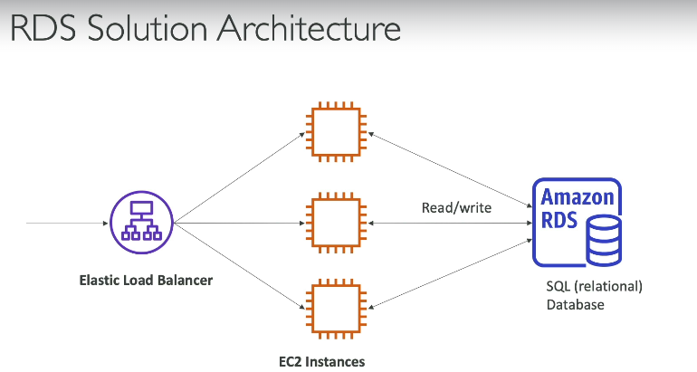
## 2. Amazon Aurora
- AWS's own **cloud-optimized** relational database
- Supports **PostgreSQL & MySQL** only
- **5x faster** than MySQL on RDS, **3x faster** than PostgreSQL on RDS
- Storage auto-grows in 10 GB increments up to **256 TB**
- ~20% more expensive than RDS but more efficient

## 3. Aurora Serverless
- **No capacity planning** — scales automatically based on usage
- Pay **per second** — cost-effective for unpredictable workloads
- Zero management

## Key RDS Features
- **Snapshots** → manual backup — can restore, copy to another region, or share with other accounts
- **Storage autoscaling** → automatically expands storage when needed
- **IAM authentication** → use IAM instead of passwords to connect
- **AWS Secrets Manager** → manages DB passwords automatically (more secure, extra cost)

---

## Quick Comparison
- **RDS** → managed, familiar DB engines, standard use cases
- **Aurora** → cloud-native, higher performance, auto-scaling storage
- **Aurora Serverless** → unpredictable/infrequent workloads, zero management

> ✅ SQL + managed = RDS | High performance + cloud-native = Aurora | No management + unpredictable load = Aurora Serverless

---

# 🗄️ RDS – Deployment Options

**Read Replicas**
- Up to 15 replicas of your main DB
- Apps can read from replicas → scales read workload
- Writes still go to the main DB only
- Main purpose Scalability

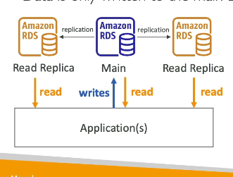

**Multi-AZ**
- A passive failover DB (Sleepy DB) in a different AZ
- Only activates if the main DB crashes
- Gives high availability — not used for scaling reads
- Main purpose High Availability

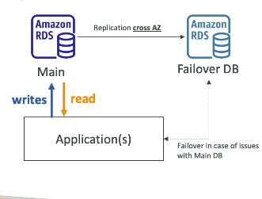

**Multi-Region**
- Read replicas across different regions
- Local reads = lower latency for users in other regions
- Disaster recovery — if one region goes down, another has a copy
- ⚠️ Replication cost — data transfer between regions is not free

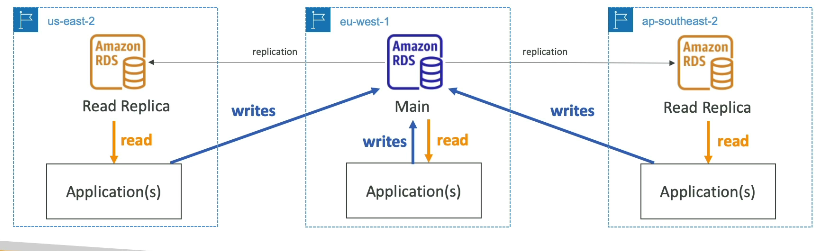

✅ Scale reads = Read Replicas | High availability = Multi-AZ | Disaster recovery + low latency globally = Multi-Region

---

# ⚡ Amazon ElastiCache

- Managed **in-memory** database (Redis or Memcached)
- High performance, low latency
- Reduces load on RDS by caching frequent queries instead of hitting the DB every time
- AWS handles patching, setup, monitoring, backups

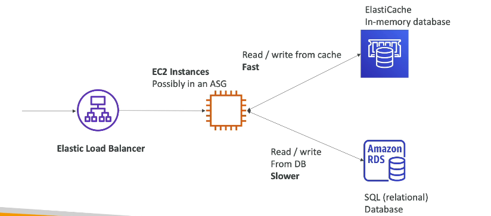
✅ In-memory database = ElastiCache | Reduce DB read pressure = ElastiCache

---

# 🗃️ Amazon DynamoDB

- Fully managed, serverless NoSQL database — no servers to provision
- Replicates across 3 AZs automatically
- Scales to millions of requests/sec, trillions of rows, hundreds of TB
- Single-digit millisecond latency, integrated with IAM, auto-scaling built-in
- Flexible schema — each item can have different attributes, no joins between tables

## DAX (DynamoDB Accelerator)
- In-memory cache built specifically for DynamoDB
- Boosts latency from milliseconds → microseconds
- Use DAX for DynamoDB caching, ElastiCache for all other databases

## Global Tables
- Replicate a DynamoDB table across multiple regions (up to 10)
- Active-active — users can read and write in any region
- Low latency access for users worldwide

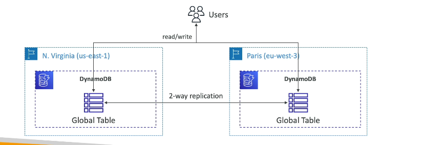

✅ Serverless + NoSQL + low latency = DynamoDB | DynamoDB caching = DAX | Multi-region DynamoDB = Global Tables

---

# 📊 Amazon Redshift

- OLAP database (Online Analytical Processing) — for analytics & data warehousing, not OLTP
- 10x better performance than other data warehouses, scales to petabytes
- Columnar storage (not row-based) + MPP engine for fast computations
- Data loaded in batches (e.g. every hour), not continuously
- SQL interface, integrates with BI tools like QuickSight & Tableau

## Redshift Serverless
- No provisioning or scaling needed — AWS handles it automatically
- Pay only for compute & storage used during analysis
- Use cases: reporting, dashboards, real-time analytics

✅ Analytics + data warehouse = Redshift | Columnar storage = Redshift | No infrastructure management = Redshift Serverless

---
# Amazon EMR (Elastic MapReduce)

- Used to create a **Hadoop cluster** for big data processing
- Spins up hundreds of EC2 instances that work together to analyze data
- AWS handles all provisioning and configuration automatically
- Supports Apache Spark, HBase, Presto, Flink
- Has auto-scaling + Spot instance integration

## Use Cases
- Big data processing, machine learning, web indexing

✅ Hadoop cluster = EMR | Big data on AWS = EMR

---

# 🦉 Amazon Athena

- Serverless query service — analyzes data directly in S3
- No need to load data — just point Athena at your S3 files
- Uses SQL to query files (CSV, JSON, ORC, Avro, Parquet)
- ~$5 per TB scanned — cheaper with compressed/columnar data
- Often paired with QuickSight for dashboards & reporting

## Use Cases
- Business intelligence, analytics, reporting
- Analyzing AWS logs (VPC Flow Logs, CloudTrail, ELB logs)

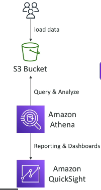

> ✅ Serverless + query S3 with SQL = Athena

---
# 📊 Amazon QuickSight

- Serverless BI tool — creates interactive dashboards & charts
- Machine learning-powered, auto-scalable, per-session pricing
- Used to visually represent data for business users

## Integrates With
- RDS, Aurora, Athena, Redshift, S3 and more

## Use Cases
- Business analytics, visualizations, ad-hoc analysis

> ✅ Dashboards + visualizations on AWS = QuickSight

---

# 🍃 Amazon DocumentDB

- AWS's managed version of **MongoDB**
- NoSQL database — stores, queries, and indexes JSON data
- Fully managed, highly available, replicates across 3 AZs
- Storage auto-grows in 10 GB increments
- Scales to millions of requests/sec

> ✅ MongoDB on AWS = DocumentDB | NoSQL = DocumentDB or DynamoDB

---

# 🔱 Amazon Neptune 

- Fully managed **graph database**
- Stores billions of relations, queries with millisecond latency
- Replicates across 3 AZs, up to 15 read replicas

## Use Cases
- Social networks, knowledge graphs (e.g. Wikipedia), fraud detection, recommendation engines

> ✅ Graph database = Neptune | Highly connected data = Neptune
>> Neptune is planet so, needs graph

---

# ⏱️ Amazon Timestream

- Fully managed, serverless **time series** database
- For data that changes over time (e.g. metrics, sensor data)
- Stores & analyzes trillions of events per day
- 1000x faster & 1/10th the cost of relational databases
- Built-in time series analytics to find patterns in real time

> ✅ Time series data = Timestream

---

# ⛓️ Amazon Managed Blockchain

- Managed service to create or join **blockchain** networks
- Decentralized — no central authority needed
- Compatible with **Hyperledger Fabric** & **Ethereum**

> ✅ Blockchain + Hyperledger Fabric + Ethereum = Amazon Managed Blockchain

---

# 🔧 AWS Glue

- Managed, serverless **ETL** service (Extract, Transform, Load)
- Extracts data from sources (S3, RDS), transforms it, loads it into destinations (Redshift)
- No servers to manage — just write the transformation logic

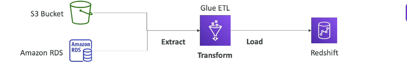

## Glue Data Catalog
- A catalog of all your datasets — stores column names, field names, field types
- Used by Athena, Redshift & EMR to discover and understand datasets

> ✅ ETL + serverless data preparation = Glue
>> laza2 (glue) el data fe ba3d we e3mel analysis

---

# 🚚 AWS DMS (Database Migration Service)

- Migrates databases to AWS — fast, secure, resilient
- Source database stays online during migration — no downtime
- Runs on an EC2 instance to extract & insert data

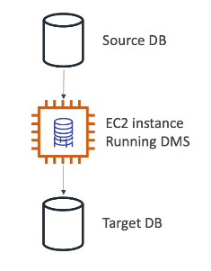

## Migration Types
- **Homogeneous** — same engine (e.g. Oracle → Oracle)
- **Heterogeneous** — different engines (e.g. SQL Server → Aurora)

> ✅ Database migration = DMS

----

# 🗄️ Databases & Analytics – Cheat Sheet

- **RDS / Aurora** → Relational DB, OLTP, SQL
- **ElastiCache** → In-memory cache
- **DynamoDB** → Serverless key-value NoSQL
- **DAX** → In-memory cache for DynamoDB only
- **Redshift** → Data warehouse, OLAP, SQL
- **EMR** → Hadoop cluster, big data
- **Athena** → Serverless SQL queries on S3
- **QuickSight** → Serverless dashboards & BI
- **DocumentDB** → Managed MongoDB, JSON, NoSQL
- **Neptune** → Graph database
- **Timestream** → Time-series database
- **Managed Blockchain** → Hyperledger Fabric & Ethereum
- **Glue** → Serverless ETL + Data Catalog
- **DMS** → Database migration

> ✅ Use this as your quick reference before the exam!

---

# Section 10:

# 🐳 Docker

- Platform to package apps into **containers** that run anywhere
- Same behavior on any OS, any machine — no compatibility issues
- Easy to scale up/down in seconds
- Multiple containers can run on a single EC2 instance

## Docker Images & Repositories
- **Docker Hub** → public repository for base images (Ubuntu, MySQL, NodeJS...)
- **Amazon ECR (Elastic Container Registry)** → AWS's private repository for your own Docker images

## Docker vs EC2
- EC2 → each instance has its own full OS (heavier)
- Docker → containers share the host OS — lighter, faster, easier to scale

---

# 📦 ECS, Fargate & ECR

## ECS (Elastic Container Service)
- Runs Docker containers on AWS
- You must provision & manage EC2 instances yourself
- AWS handles starting/stopping containers & placement

## Fargate
- Also runs Docker containers on AWS
- **No EC2 instances to manage** — fully serverless
- Just define CPU & RAM needed, AWS runs it for you
> 7ot el far fe 3elba we sebo

## ECR (Elastic Container Registry)
- Private Docker image repository on AWS
- Stores your Docker images so ECS or Fargate can run them

## Quick Comparison
- ECS → Docker on AWS, you manage EC2 instances
- Fargate → Docker on AWS, no servers to manage
- ECR → where you store your Docker images

> ✅ Docker containers on AWS = ECS or Fargate | Serverless containers = Fargate | Store Docker images = ECR

---

# ☸️ Amazon EKS (Elastic Kubernetes Service)

- Managed **Kubernetes** cluster on AWS
- Kubernetes = open source system to deploy, manage & scale containers
- Containers run on EC2 instances or Fargate (serverless)
- Cloud agnostic — Kubernetes works on AWS, Azure, GCP & on-premises

> ✅ Kubernetes on AWS = EKS

## GOOD TO KNOW:

- **Docker (Containerization)** → a **chef** that cooks a single dish (runs one container)
- **Kubernetes(Orchestration)** → the **restaurant manager** that coordinates all the chefs, decides who cooks what, and keeps the kitchen running smoothly 👨‍🍳

> ✅ Docker = run it | Kubernetes = manage it at scale

---

# ☁️ Serverless – Introduction

- Serverless = you don't manage, provision, or see any servers
- Servers still exist behind the scenes — you just don't deal with them
- You only focus on deploying code or functions
- Serverless was started as FaaS (Function as a Service) concept  by AWS Lambda — you just deploy a function and AWS runs it for you

## Serverless Services We've Seen So Far
- **S3** → storage, no servers to manage
- **DynamoDB** → database, auto-scales, no servers
- **Fargate** → run containers, no EC2 to manage
- **Lambda** → run functions in the cloud *(coming next)*

### Good to know: 
- تخيل إنك عايز تشرب ماية. زمان كنت لازم تحفر بير وتشتري مضخة وتعملها صيانة (EC2). دلوقتي إنت بس بتفتح الحنفية والماية تنزل، وبتدفع فاتورة على قد الماية اللي استهلكتها بالظبط (Serverless). شركة الماية هي اللي بتدير المحطات والمواسير من غير ما توجع دماغك (AWS).
> ✅ No server management = Serverless

---

# λ AWS Lambda

- Run code without managing servers — **serverless functions**
- Runs on demand — only executes when triggered, not billed when idle
- Scales automatically — no need to add/remove servers
- Supports Node.js, Python, Java, Ruby, C#, Go, Rust and more

## Pricing
- First **1M invocations/month free**, then $0.20 per 1M requests
- First **400,000 GB-seconds/month free**, then $1 per 600,000 GB-seconds
- Bottom line — very cheap to run

## Key Features
- **Event-driven**: Since it's function so need to be called.
- For Ex: Lambda Triggered by S3 (s3 send JSON to lambda to prepare a container so my code run in it )
- Up to **10 GB RAM** per function — more RAM = better CPU & network
- Monitored via **CloudWatch Logs**
- Uses **IAM Roles** to access other AWS services

## Common Use Cases
- **Thumbnail creation** → image uploaded to S3 → Lambda resizes it → saves back to S3
- **CRON jobs** → EventBridge triggers Lambda on a schedule (e.g. every hour)

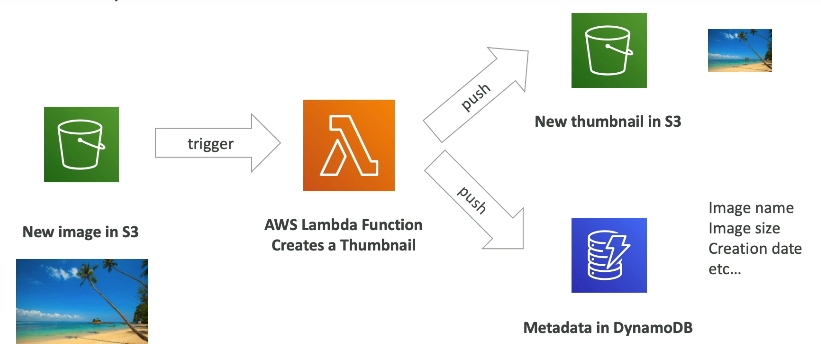

> ✅ Serverless + event-driven + short executions = Lambda | Lambda pricing = per call + per duration

---

# 🚪 Amazon API Gateway

- It's used because Lambda isn't exposed to outside world.
- Fully managed service to create, publish & secure APIs in the cloud
- Serverless & fully scalable
- Acts as the front door — clients talk to API Gateway → it forwards to Lambda → Lambda reads/writes to DynamoDB
- Supports **RESTful APIs** & **WebSocket APIs** (real-time streaming)
- Includes security, authentication, throttling, API keys & monitoring

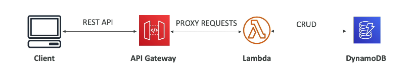

> ✅ Serverless HTTP API = API Gateway + Lambda

---

# 🔄 AWS Batch

- Fully managed batch processing service — runs at any scale
- A **batch job** = has a clear start & end (not continuous)
- Automatically launches EC2 or Spot Instances to handle the load
- Batch jobs are defined as **Docker images** running on ECS
- You just submit jobs to the queue — AWS handles the rest

## Lambda vs Batch
- **Lambda** → max 15 min, limited languages, serverless
- **Batch** → no time limit, any language via Docker, uses EC2 (not serverless)

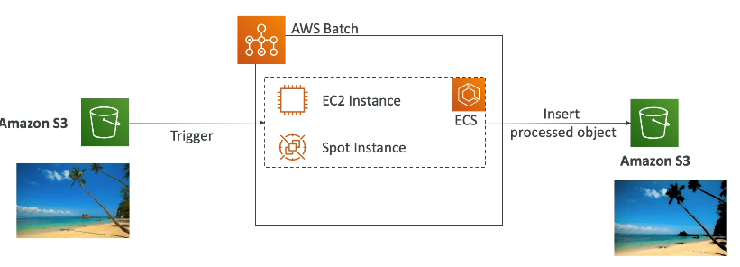

> ✅ Short tasks = Lambda | Long/heavy jobs with no time limit = Batch
>> Lambda is Microwave, but Batch is Factory oven.

---

# 🪶 Amazon Lightsail

- Simplified, all-in-one service — virtual servers, storage, databases & networking
- Low & predictable pricing, easy to use
- **Not** deeply integrated with other AWS services
- Has basic high availability but **no auto-scaling**

## Who Is It For?
- People with little/no cloud experience who want to get started quickly
- No need to understand EC2, RDS, ELB, EBS etc.

## Use Cases
- Simple web apps (WordPress, Joomla, LAMP, Node.js)
- Dev & test environments

## Exam Tip
> ✅ No cloud experience + get started fast + low predictable pricing = Lightsail
>> Almost always a **wrong answer** unless the question specifically describes a beginner needing simplicity
>>> Light so little experience.
---

# 🖥️ Compute Services – Cheat Sheet

- **ECS** → Run Docker containers on EC2 instances (you provision them)
- **Fargate** → Run Docker containers, serverless (no EC2 to manage)
- **ECR** → Private repository to store Docker images
- **Batch** → Run batch jobs on managed EC2 instances via ECS, no time limit
- **Lightsail** → Simple apps for beginners, low predictable pricing, limited AWS integration
- **Lambda** → Serverless functions, FaaS, scales automatically, max 15 min, pay per call + duration
- **API Gateway** → Expose Lambda functions as HTTP APIs, adds security, throttling & API keys

> ✅ Containers = ECS or Fargate 
>> Serverless functions = Lambda 
>>> Expose Lambda as API = API Gateway 
>>>> Long batch jobs = Batch 
>>>>> Beginner simple apps = Lightsail

---

# 🏗️ AWS CloudFormation

- **Infrastructure as Code (IaC)** — define your AWS resources in a file instead of creating each step manualy
- CloudFormation creates everything automatically in the right order
- Supports almost all AWS resources

## Benefits
- **Control** →before changes their will be code review
- **Cost** → resources get tagged automatically, easy to estimate costs
- **Savings** → automate deletion at 5PM & recreation at 8AM to avoid paying for idle resources
- **Productivity** → destroy & recreate infrastructure on the fly, no need to figure out creation order
- **Reusable** → leverage existing templates from the web

## Infrastructure Composer
- Visualizes your CloudFormation template as an architecture diagram
- Shows all resources and how they connect

> ✅ Infrastructure as Code on AWS = CloudFormation | Repeat architecture across regions/accounts = CloudFormation

---

# 🛠️ AWS CDK (Cloud Development Kit)

- Write your cloud infrastructure using a **real programming language** (Python, JavaScript, TypeScript, Java, .NET) instead of YAML/JSON
- CDK compiles your code → generates a CloudFormation template → deploys it
- Deploy infrastructure & app code together (great for Lambda & ECS/EKS)

## Why Use CDK Over CloudFormation Directly?
- More familiar — use loops, conditions, functions
- Type safety & code reuse
- Faster to write for developers

## How It Works
Your code (Python/JS/etc.) → Compiled by CDK CLI → CloudFormation template file → deployment using CloudFormation

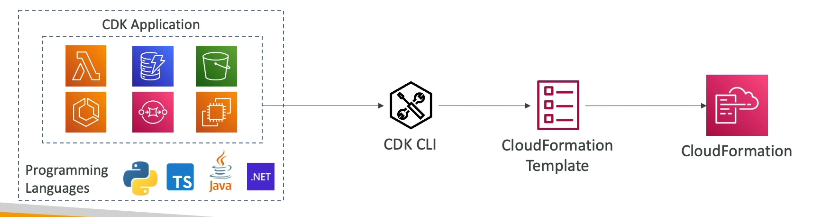

> ✅ Infrastructure as Code using a programming language = CDK | CDK always compiles into CloudFormation under the hood

---

# 🌱 AWS Elastic Beanstalk

- **PaaS (Platform as a Service)** — you only worry about your code, Beanstalk handles everything else
- AWS manages: EC2 instances, OS, load balancer, auto-scaling, health monitoring
- Free to use — you only pay for the underlying resources
- Uses CloudFormation in background to create all infrastructure

## Deployment Models
- **Single Instance** → 1 server without Load balancer (for dev)
- **Load Balancer + ASG** → Multi servers (for prod)
- **ASG only** → for non-web background worker apps (backgrd tasks)

## Key Features
- Deploy multiple environments (e.g. Dev, Prod) for the same app
- Upload new code → Beanstalk deploys it automatically
- Has Ability to configure settings if you want.
- Built-in health monitoring dashboard — health agent on each EC2
- Supports many platforms: Python, Node.js, Java, PHP, Ruby, Docker and more

## Beanstalk vs CloudFormation
- **CloudFormation** → deploy any arbitrary infrastructure as code
- **Beanstalk** → developer-focused, deploy your app & let AWS handle the infrastructure

> ✅ Developer wants to deploy code without managing infrastructure = Elastic Beanstalk | PaaS on AWS = Beanstalk

---

# 🚀 AWS CodeDeploy

- Automatically deploys your app from **v1 → v2**
- Works on both **EC2 instances** and **on-premises servers**
- That's why it's called a **hybrid service** — cloud + on-premises
- Servers must be set up in advance with the **CodeDeploy agent** installed

> ✅ Auto deploy app updates / Versioning to EC2 or on-premises servers = CodeDeploy

---

# 💾 AWS CodeCommit

- AWS's own **private Git repository** — like GitHub but inside AWS
- Store, version, and collaborate on code
- Fully managed, scalable, secure & integrated with AWS services

> ✅ Private Git repo on AWS = CodeCommit

---

# 🔨 AWS CodeBuild

- **Compiles your code, runs tests, and produces a ready-to-deploy package**
- Fully managed, serverless — no servers to manage
- Pay only for the time it takes to build
- Works great with CodeCommit → CodeBuild grabs your code, builds it → ready for CodeDeploy

> ✅ Build & test code in the cloud = CodeBuild

---

# 🔄 AWS CodePipeline

- **Connects and automates all steps** — code → build → test → deploy
- The glue between CodeCommit, CodeBuild, CodeDeploy & Beanstalk
- Fully managed, works with GitHub and other third-party tools
- Core of **CI/CD (Continuous Integration & Continuous Delivery)** on AWS (every code push → auto build, test & deploy)

## Example Pipeline
CodeCommit → CodeBuild → CodeDeploy → Elastic Beanstalk

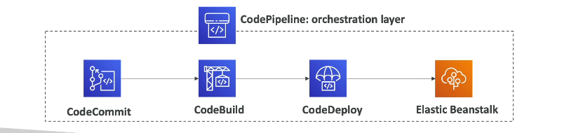

> ✅ Automate code from push to production = CodePipeline | CI/CD on AWS = CodePipeline

----

# 📦 AWS CodeArtifact

- A place to **store and retrieve code dependencies** (packages your code needs to run)
- Fully managed — no need to set up your own system
- Works with common tools: npm, pip, Maven, Gradle, yarn, NuGet
- CodeBuild can pull dependencies directly from CodeArtifact when building

> ✅ Store & manage code dependencies on AWS = CodeArtifact

---

# 🛠️ AWS Systems Manager (SSM)

- Manage and control **EC2 instances + on-premises servers** from one place
- Hybrid service — works for both cloud and on-premises
- Works on Linux, Windows, macOS
- Needs an **SSM Agent** installed on each server (pre-installed on Amazon Linux & some Ubuntu AMIs)

## Key Features
- **Auto patching** → patch all your servers at once
- **Run commands** → run a command across your entire fleet at once
- **Session Manager** → get a secure shell into any instance without SSH keys or port 22
- **Parameter Store** → store configs & secrets securely in one place

## Session Manager
- Access your EC2 instance directly from AWS — no SSH needed, port 22 stays closed
- EC2 instance needs an **IAM role** that allows it to talk to SSM
- Logs all sessions to S3 or CloudWatch for security
- 3 ways to access EC2:
  - SSH → needs port 22 + SSH key
  - EC2 Instance Connect → needs port 22 (no key needed)
  - **Session Manager** → needs nothing open, just IAM role ✅

## Parameter Store
- Securely store **passwords, API keys, and configs** in one place
- Serverless, scalable, access controlled via IAM
- Supports plain text or **encrypted values** (via KMS)
- Tracks versions every time a parameter changes

> ✅ Manage/patch fleet of servers = SSM | Secure shell without SSH = Session Manager | Store secrets & configs = Parameter Store

---

# 🚀 Deployment & Developer Services – Cheat Sheet

## Deployment Services
- **CloudFormation** → Infrastructure as Code, repeatable across regions & accounts
- **Elastic Beanstalk** → PaaS, just upload your code, AWS handles the rest
- **CodeDeploy** → Auto deploy app updates to EC2 or on-premises servers (hybrid)
- **SSM** → Patch, configure & run commands across all servers (hybrid)

## Developer Services
- **CodeCommit** → Private Git repo on AWS
- **CodeBuild** → Build & test code serverlessly on AWS
- **CodeDeploy** → Deploy built code onto servers
- **CodePipeline** → Orchestrate the full pipeline (code → build → test → deploy)
- **CodeArtifact** → Store and manage code dependencies
- **CDK** → Write infrastructure using a programming language → compiles to CloudFormation

> ✅ Use this as your quick reference before the exam!

---
