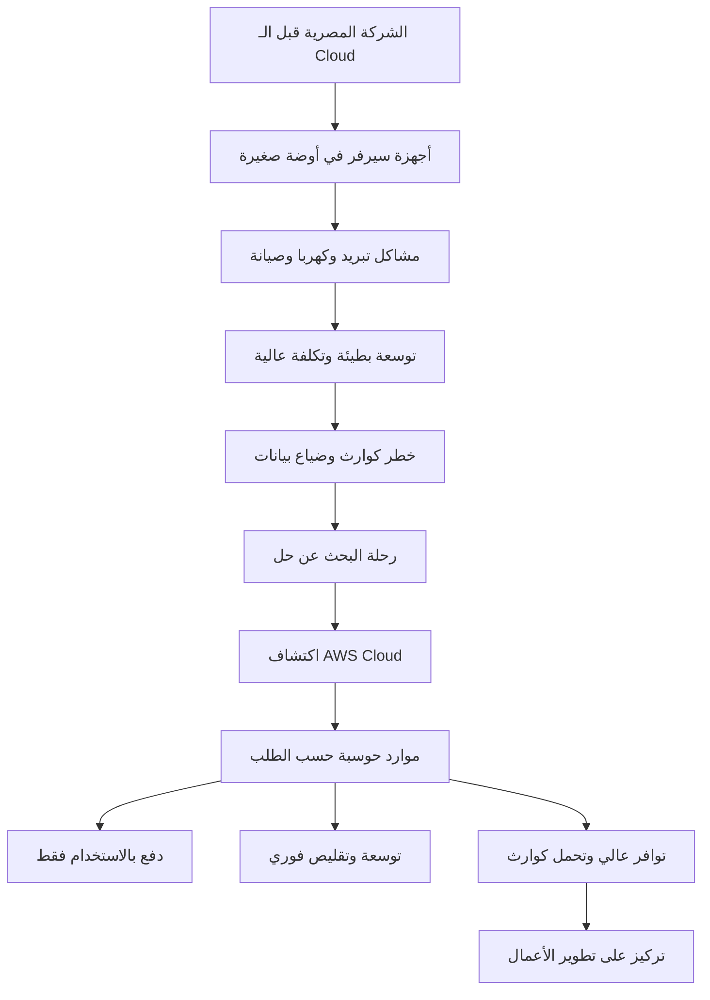
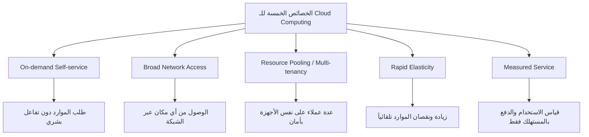

هات كوباية الشاي يا هندسة.. السهرة دي بتاعتنا وهنفصص AWS حتة حتة بالرسومات من غير ما نكروت حرف!

---

## المفهوم الأول: يعني إيه Cloud Computing؟ (أصل الحكاية والمشكلة)

تخيل معايا يا باشا، شركة سياحة مصرية كبيرة — زي مثلاً "ترافكو للسياحة" — فتحت فرع جديد في الغردقة وشرم الشيخ والأقصر وأسوان، وكل فرع محتاج نظام حجوزات مركزي، وموقع إلكتروني يحجز عليه العميل من أي حتة في العالم. في البداية، مدير تقنية المعلومات بتاع الشركة، الأستاذ هشام، فكر إنه يبني سيرفرات في مقر الشركة الرئيسي في المعادي. اشترى بالفعل جهازين سيرفر (كومبيوترات ضخمة) من نوع Dell PowerEdge، وركّبهم في أوضة صغيرة جنب مكتب المحاسبة، ووصلهم بخط إنترنت فائق السرعة من شركة الاتصالات. الدنيا كانت ماشية، بس ده كان مجرد البداية.

بعد شهرين، الموقع بدأ يعلق، الزبائن بتشتكي من البطء، والسيرفرات حرارتها بتزيد بشكل مرعب لدرجة إن الأستاذ هشام اضطر يفتح الشباك ويجيب مروحة كبيرة تقف على الأرض علشان تبرد الأجهزة! ده غير إن التيار الكهربي قطع مرتين في الأسبوع، فاضطر يجيب بطاريات UPS ضخمة ومولد كهرباء ديزل عشان يضمن إن الحجوزات متضعش. بدأ يحس إنه مش قادر ينام من القلق — كل يوم فيه مشكلة جديدة: كابل شبكة اتقطع، هارد ديسك ضرب، السوفتوير محتاج تحديث، والنسخة الاحتياطية فشلت. والأهم من كله، في موسم العمرة، الشركة شافت إقبال رهيب جدًا من الزبائن، لكن السيرفرات ما استحملتش عدد المستخدمين المتزامنين، فوقع الموقع لمدة 6 ساعات. في الوقت ده، الأستاذ هشام كان بيلطم على وشه، لأن التوسعة محتاجة يشترى أجهزة جديدة، والشركة مش قادرة تدفع مئات الآلاف على طول، والمعدات الجديدة هتاخد أسبوعين على ما توصل من أمريكا وتتركب. وبعد العمرة، الزحمه راحت، فبقى عنده أجهزة فائضة مش شغالة وعمالة تستهلك كهربا وصيانة على الفاضي. وبعد ما هديت الدنيا، قرر إنه ينقل السيرفرات لمركز بيانات (داتا سنتر) متخصص في مدينة السادس من أكتوبر، عشان يضمن تبريد أفضل وأمان أعلى. لكن الموضوع كان أحلام: إيجار الداتا سنتر غالي جدًا بالدولار، وبنود عقد الصيانة معقدة، وأي طلب لزيادة مساحة رف واحد بياخد موافقات ووقت طويل. بالإضافة إن الفنيين بتوع الداتا سنتر ممكن يتأخروا في الرد في حالة عطل طارئ. الكارثة الكبيرة حصلت لما حصل حريق صغير في جزء من الداتا سنتر، وانقطعت الخدمة عن الشركة لمدة يوم كامل، رغم إن السيرفرات بتاعتهم ما اتأثرتش مباشرة، لكن الكهربا قطعت على المبنى كله. الأستاذ هشام وقتها قال: "مش معقول اللي إحنا فيه ده! طب ما فيه طريقة أدفع فيها فلوس أقل، وأتحكم في كل حاجة بضغطة زرار، وأكبر وأصغر على حسب الزحمه، وما أقلقش على الكوارث؟".

بعد البحث، سمع عن ناس بتستخدم Amazon Web Services (AWS). في الأول كان متشكك: "يعني هاحط بيانات عملائي على سيرفرات بره مصر؟ طب والأمان؟ طب وال latency؟". لكن لما جرب، أدرك إن دي نقلة نوعية. الـ Cloud Computing ببساطة هو إنك تستأجر موارد حوسبة (سيرفرات، تخزين، قواعد بيانات، شبكات) من Amazon بدل ما تشتريها وتمتلكها، وبتدفع بالاستخدام الفعلي زى عداد الكهربا بالظبط. تقدر تزود عدد السيرفرات في دقائق، وتقللهم برضه، من غير ما تلمس أي كابلات. الخدمة شغالة على طول، وموزعة على مراكز بيانات عملاقة في أنحاء العالم، فلو حصلت كارثة في منطقة، منطقتك التانية تشتغل فوراً.

### البطل وصل: كيف تحل AWS المشكلة دي؟

باستخدام نموذج الـ Cloud، الأستاذ هشام قدر يبني البنية التحتية بتاعته على AWS باستخدام خدمات زي EC2 (سيرفرات افتراضية) و RDS (قاعدة بيانات مُدارة) و S3 (تخزين). خلاص مبقاش لازم يشتري أجهزة، ولا يدفع إيجار داتا سنتر، ولا يقلق من الصيانة. لما زادت الزحمه في موسم العمرة الجاي، استخدم خاصية Auto Scaling علشان AWS تزود عدد السيرفرات لوحدها تلقائي، ولما الزحمه خفت، السيرفرات تقل تاني، وبالتالي الدفع بالاستخدام الفعلي فقط. الكوارث بقت مجرد ذكرى لأنه ممكن يوزع التطبيق على أكثر من منطقة (Region)، لو حصل زلزال أو عطل في منطقة، التطبيق يشتغل من منطقة تانية في ثواني. والأهم، استطاع يركز على تطوير التطبيق بدل ما يضيع وقته في إدارة الكابلات والمبردات.


*الرسم ده بيمثل الرحلة من المعاناة التقليدية لاعتماد الـ Cloud. الـ Diagram مساعد بس، والكلام هو الأساس.*

### الزبدة التقنية (Under the Hood)

> 💡 **معلومة سريعة:** الـ Cloud Computing مش مجرد "سيرفرات في السحاب"، لكنه نموذج لتوصيل خدمات تقنية المعلومات عبر الإنترنت بطريقة مرنة واقتصادية.

**تعريف دقيق (CLF-C02):**
- **On-demand delivery**: تقدر تطلب وتشغل موارد حوسبة (CPU, RAM, تخزين) بمجرد ضغطة زرار بدون أي تفاعل بشري مع مزود الخدمة.
- **Pay-as-you-go pricing**: بتدفع بس مقابل اللي استخدمته فعلاً، زي فاتورة المياه أو الكهرباء.
- **Provision exactly right type and size**: بتقدر تختار حجم ونوع الموارد اللي محتاجها بالضبط (مش لازم تشتري جهاز ضخم لو محتاج حاجة صغيرة).
- **Access almost instantly**: الموارد بتكون جاهزة في دقائق مش أسابيع.
- **Shared Responsibility**: AWS مسؤولة عن أمان الـ Cloud نفسه (المباني، الأجهزة، الشبكات)، وأنت مسؤول عن الأمان *جوه* الـ Cloud (بياناتك، إعداداتك، نظام التشغيل).

**مقارنة بين On-Premises و Cloud:**

| الميزة | On-Premises (التقليدي) | AWS Cloud |
| :--- | :--- | :--- |
| **الإنفاق الرأسمالي (CAPEX)** | عالي جداً (شراء أجهزة، داتا سنتر) | لا يوجد (تحول إلى OPEX) |
| **التوسعة (Scalability)** | محدودة وبطيئة وتحتاج شراء أجهزة | فورية وتلقائية (Elasticity) |
| **إدارة الكوارث** | صعبة ومكلفة (تحتاج موقع بديل) | سهلة بتوزيع التطبيق على مناطق متعددة |
| **المرونة (Agility)** | منخفضة جداً | عالية جداً، التجربة سريعة |
| **تخمين السعة (Capacity)** | غالباً بيكون فيه زيادة أو نقص | تضبط بالضبط على الاستخدام الفعلي |

**Use Case / NOT Use Case ⚠️:**
- **Use Case:** أي شركة عايزة تبدأ بمخاطرة قليلة، تطبيقات ذات أحمال متغيرة، الشركات الناشئة، وبيئات التطوير والاختبار.
- **NOT Use Case:** حالات نادرة جداً اللي محتاجة تأخير أقل من 1 مللي ثانية بشكل دائم مع أجهزة مخصصة بالكامل (بتتعالج حالياً بـ Outposts و Local Zones)، أو لو عندك متطلبات رقابية تمنع خروج البيانات من مبنى معين، وده نادر.

**Pricing Model:**
- **الدفع حسب الاستخدام** (Pay-as-you-go) لأغلب الخدمات: تدفع مقابل ساعات تشغيل السيرفر، حجم البيانات المخزنة، وكمية البيانات الخارجة (Data Transfer OUT). البيانات الداخلة (IN) مجانية.
- **خيارات توفير:** Reserved Instances (حجز لمدة سنة أو 3 بخصم كبير)، Savings Plans (مرونة أكبر).

**Shared Responsibility:**
- **AWS مسؤولة عن** (Security *of* the Cloud): أمان مراكز البيانات، الأجهزة المادية، الشبكات العالمية، وبرامج Hypervisor.
- **العميل مسؤول عن** (Security *in* the Cloud): تشفير البيانات، إدارة أنظمة التشغيل، إعدادات جدار الحماية، إدارة الهوية والوصول (IAM).

---

## المفهوم التاني: نماذج نشر الـ Cloud (Deployment Models)

### الحكاية والمشكلة: أمان جوج ومرونة ماجد

بعد ما شركة "ترافكو" نجحت مع الـ Public Cloud بتاع AWS، جاتلها شركة شقيقة بتشتغل في المدفوعات الإلكترونية، اسمها "بيتك كاش". الشركة دي بتتعامل مع بيانات بنوك مصرية حساسة جدًا، والقوانين المصرية بتلزمهم إن بعض البيانات (زي أرقام الحسابات) تفضل موجودة على سيرفرات موجودة فعليًا جوه مصر وتحت سيطرة الشركة مباشرة، مش على سحابة عامة مشتركة. وفي نفس الوقت، عندهم تطبيق جديد للموبايل مخصص للعروض والتخفيضات، والتطبيق ده مش عليه أي قيود تنظيمية، ونفسهم يستفيدوا بمرونة الـ Cloud في طرحه بسرعة والتوسع فيه. كمان، شركة "بيتك كاش" بالفعل عندها غرفة سيرفرات صغيرة في مقرها بمدينة نصر، فيها حاجات Legacy شغالة بقالها ١٠ سنين، ومش هينفع ينقلوها بسهولة للسحابة العامة. فصار عندهم مزيج: جزء من الأحمال لازم يفضل "عندهم" (on-premises)، وجزء يقدر يروح للـ Public Cloud. المشكلة إنهم كانوا فاكرين إن الـ Cloud هو حل واحد بس (Public)، لكن اكتشفوا إن فيه نماذج مختلفة تناسب كل احتياج.

الأستاذ هشام هنا تفاجأ إن AWS نفسها بتوفر مرونة في *نموذج النشر* نفسه، مش بس في الموارد. قعد يشرح ليهم إن الـ Cloud مش بس سيرفرات أمازون اللي في أمريكا وأوروبا؛ فيه ٣ نماذج كبار، وفيه حتى حلول هجينه بتخلط ما بينهم.

### البطل وصل: نماذج النشر بتلبي كل الأذواق

النماذج دي بتديك حرية تختار مستوى العزل والتحكم اللي يناسبك، مع الاستفادة القصوى من مميزات الـ Cloud. الشركات الكبيرة اللي عندها متطلبات رقابية زي "بيتك كاش" ممكن تستفيد من Hybrid Cloud أو Private Cloud. AWS بتدعم الـ Private Cloud بإنشاء VPC (سحابة افتراضية خاصة) جوه AWS ومعزولة تماماً، لكن برضه ممكن تستخدم حاجة اسمها AWS Outposts لو عايز أجهزة AWS الفعلية تتركب في الداتا سنتر بتاعك. الـ Hybrid Cloud بيدي أفضل ما في العالمين.

```mermaid
flowchart LR
    A[أنواع نشر الـ Cloud] --> B[Public Cloud]
    A --> C[Private Cloud]
    A --> D[Hybrid Cloud]
    B --> B1[مملوكة لمزود طرف تالت (AWS)]
    B1 --> B2[تخدم عامة الناس عبر الإنترنت]
    C --> C1[مخصصة لمؤسسة واحدة]
    C1 --> C2[موجودة في مقر العميل أو في داتا سنتر خاص]
    C1 --> C3[تحكم كامل وأمان عالي]
    D --> D1[مزيج من Public و Private]
    D1 --> D2[استمرار بعض الأحمال On-Premises]
    D1 --> D3[مرونة الـ Public Cloud عند الحاجة]
```
*الرسم يوضح التفرعات؛ النص الثري هو الأساس.*

### الزبدة التقنية (CLF-C02)

> ⭐ **في الامتحان:** هيسألوك عن كل نموذج وامتى تستخدمه. المفتاح: Public للمرونة والسرعة، Private للرقابة والبيانات الحساسة، Hybrid لربط القديم بالجديد.

**النماذج الثلاثة:**

1. **Public Cloud (سحابة عامة):**
   - الموارد مملوكة ومدارة من طرف ثالث (زي AWS) ومتاحة للعامة عبر الإنترنت.
   - **المزايا:** لا تكاليف رأسمالية، مرونة وسرعة لا تُضاهى، تكلفة الدفع بالاستخدام.
   - **مناسب لـ:** الشركات الناشئة، التطبيقات اللي ما عليهاش بيانات فائقة الحساسية، أحمال العمل المتغيرة.

2. **Private Cloud (سحابة خاصة):**
   - الموارد مستخدمة حصرياً من مؤسسة واحدة، وما تتعرضش للعامة. ممكن تكون موجودة في داتا سنتر المؤسسة نفسها أو في موقع خارجي مخصص لها.
   - **المزايا:** تحكم كامل في الأجهزة والبرمجيات، أمان عالي للمتطلبات التنظيمية الصارمة.
   - **مناسب لـ:** الجهات الحكومية، البنوك، المستشفيات اللي تتطلب عزل بيانات تام.

3. **Hybrid Cloud (سحابة هجينة):**
   - دمج بين البنية التحتية الخاصة (On-Premises أو Private Cloud) والسحابة العامة.
   - **المزايا:** تحتفظ ببياناتك الحساسة على أجهزتك، وتستفيد من قدرات الـ Public Cloud غير المحدودة للتطبيقات الحديثة أو كحل للكوارث.
   - **مناسب لـ:** الشركات الكبيرة اللي عندها أنظمة قديمة (Legacy) لا يمكن ترحيلها بسهولة، وتريد استغلال السحابة تدريجياً.

**Use Case / NOT Use Case ⚠️ (لكل نموذج):**
- **Public:** Use Case لتطبيق جديد يحتاج وصول عالمي سريع. NOT Use Case إذا كان القانون يمنع تخزين بيانات المواطنين خارج نطاق جغرافي معين (ولو ممكن Public مع Region محدد).
- **Private:** Use Case لبيانات بنكية حساسة. NOT Use Case لشركة ناشئة ميزانيتها محدودة لأنها تحتاج استثمار مبدئي كبير.
- **Hybrid:** Use Case لشركة تصنيع تريد الاحتفاظ بنظام ERP القديم وتريد تحليلات Big Data على الـ Cloud. NOT Use Case لو كل الأحمال ممكن تترفع للـ Public Cloud بسهولة.

**Pricing Model:**
- الثلاث نماذج لهم نفس مبدأ الـ Pay-as-you-go عند استخدام خدمات AWS العامة، لكن الـ Private Cloud باستخدام AWS Outposts مثلاً لها نموذج تسعير يشمل رسوم تركيب الأجهزة واشتراكات.
- لتوسعة الـ Hybrid لأحمال موجودة، بتدفع على موارد الـ Cloud العامة بس.

**Shared Responsibility:**
- في الـ Public Cloud، كما سبق.
- في الـ Private Cloud المُدارة ذاتياً، العميل يكون مسؤولاً عن الأمان الفيزيائي والأجهزة أيضاً، لكن مع حلول مثل AWS Outposts، أمازون توفر الأجهزة وتديرها وتكون مسؤولة عن أمان الكابينة نفسها (Security *of* the Rack)، بينما أنت مسؤول عن البيانات والإعدادات.

---

## المفهوم الثالث: الخصائص الخمسة الأساسية للـ Cloud Computing

### الحكاية والمشكلة: عداد الكهرباء الذكي

نرجع تاني للأستاذ هشام بعد ما قعد مع أصحاب "بيتك كاش". لاحظ حاجة مهمة جداً: مش أي حاجة اسمها "Cloud" تبقى Cloud بجد بمجرد إن السيرفر في مكان بعيد. في ناس كتير بتفتح شركة تأجير سيرفرات وتقول "دي سحابة"، لكن الحقيقة إن الـ Cloud الناضجة زي AWS لازم يكون فيها خمس خواص أساسية عشان تقدم الوعود اللي سمعنا عنها. الأستاذ هشام شرح للمدير المالي الفرق بين مجرد تأجير سيرفر (Colocation) والـ Cloud الحقيقية بقصة عداد الكهربا.

تخيل معايا، زمان أيام ما كانت شركة الكهربا بتجيلك كل شهر موظف يقرأ العداد، وبعد كده تدفع الفاتورة. لكن دلوقتي مع العدادات الذكية، أنت نفسك ممكن تشوف استهلاكك أونلاين، وتضبط الأجهزة عشان تقفل في أوقات الذروة، وتدفع بالظبط اللي استهلكته. كمان شركة الكهرباء مش بتيجي تطلب منك تشتري محول كهرباء جديد لو حبيت تشغل مكيف إضافي؛ هي بس بتزود الـ Ampere المقنن اللي يوصل للعداد. هذا هو التشبيه: الـ Cloud الحقيقي يسمح لك تزود موارد وتنقصها في أي وقت (Rapid Elasticity)، وتشوف فاتورتك بتفصيلة دقيقة (Measured Service)، ومن غير ما تكلم حد (On-demand Self-service)، وكله عن طريق الإنترنت من أي موبايل أو لابتوب (Broad Network Access). والأروع، إنك مش لوحدك اللي بيدفع تكلفة المواتير والمحطات، دي شركة الكهربا خدمت ملايين الناس، فالتكلفة على الفرد قليلة (Resource Pooling / Multi-tenancy). لو السيرفر المستأجر القديم ما فيش فيه الكلام ده، يبقى ده مجرد استضافة عادية، مش Cloud حقيقي.

### البطل وصل: الخمس خواص اللي يتأكدوا إنك في السحابة الحقيقية

الخصائص دي مش مجرد مصطلحات للحفظ، لكنها ضمان إن الخدمة اللي قدامك هتقدر تقدم المرونة والكفاءة اللي وعدتك بيها. AWS حققت كل خاصية من دول بأسلوب تقني متطور جداً، وده اللي بيفرقها عن أي مزود تاني.


*الرسم لتذكير سريع، لكن شرح كل عنصر بالتفصيل.*

### الزبدة التقنية (للـ CLF-C02)

> 💡 **معلومة سريعة:** أي سؤال في الامتحان بيقولك "أي من الخيارات يمثل خاصية من خصائص الـ Cloud؟" إبقى فكر في الخمسة دول، وهما الـ DNA بتاع الـ Cloud Computing الحقيقي.

**الخصائص كما يعرّفها NIST:**

1. **On-demand Self-service (الخدمة الذاتية حسب الطلب):**
   - تقدر تطلب موارد (زي EC2) من واجهة الويب أو CLI من غير ما تتصل بحد من AWS. كل حاجة تلقائية.

2. **Broad Network Access (اتصال شبكي واسع):**
   - الموارد متاحة عبر الشبكة (الإنترنت) ويمكن الوصول إليها من منصات مختلفة: موبايل، لابتوب، تابلت.

3. **Resource Pooling (Multi-tenancy) (تجميع الموارد وتعدد المستأجرين):**
   - AWS بتخدم عملاء كتير من نفس الأجهزة الفعلية مع ضمان عزل كامل. انت مستأجر مع غيرك في نفس المبنى، لكن لكل شقة بابها الخاص.

4. **Rapid Elasticity (المرونة السريعة):**
   - تقدر تزود الموارد وتنقصها بسرعة (يدوياً أو تلقائياً بأوتو سكيلنج) كأنها أستيكة بتتمط وتتقلص.

5. **Measured Service (الخدمة المُقاسة):**
   - كل استخدامك (ساعات، نقل بيانات، تخزين) متراقب ومحسوب، وتدفع بالضبط بالمليم. زي عداد الكهربا.

**Use Case / NOT Use Case ⚠️:**
- **Use Case:** الأصل أي خدمة Cloud حقيقية لازم تطبق الخمس خواص. بس لو حصلت مشكلة في Auto Scaling (Elasticity) يبقى الخدمة مش Cloud كامل.
- **NOT Use Case:** استضافة ويب عادية بمشاركة موارد بدون عزل حقيقي (Resource Pooling بدون أمان) أو بدون إمكانية الدفع الدقيق (Measured Service)، ده مش Cloud.

**Pricing Model:**
- كل خاصية بتدعم نموذج Pay-per-use. القياس الدقيق هو أساس الفوترة العادلة.

**Shared Responsibility:**
- الخمس خواص بتوضح إنك مسؤول عن إدارة طلباتك (Self-service) وإعدادات التوسع، بينما AWS مسؤولة عن توفير البنية اللي تسمح بـ Pooling و Broad Access.

---
[أنا شرحت جزء من الدومين بالتفصيل الممل.. قولي "كمل" عشان أدخل على المواضيع اللي بعدها بنفس العمق]