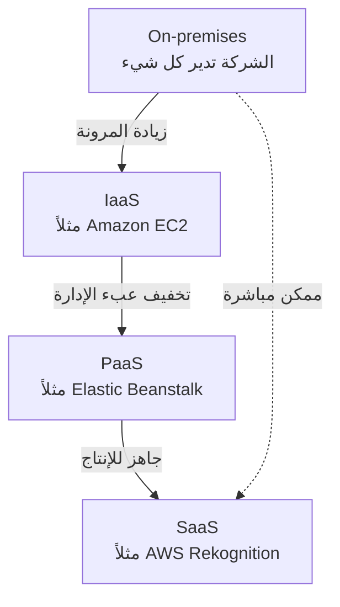
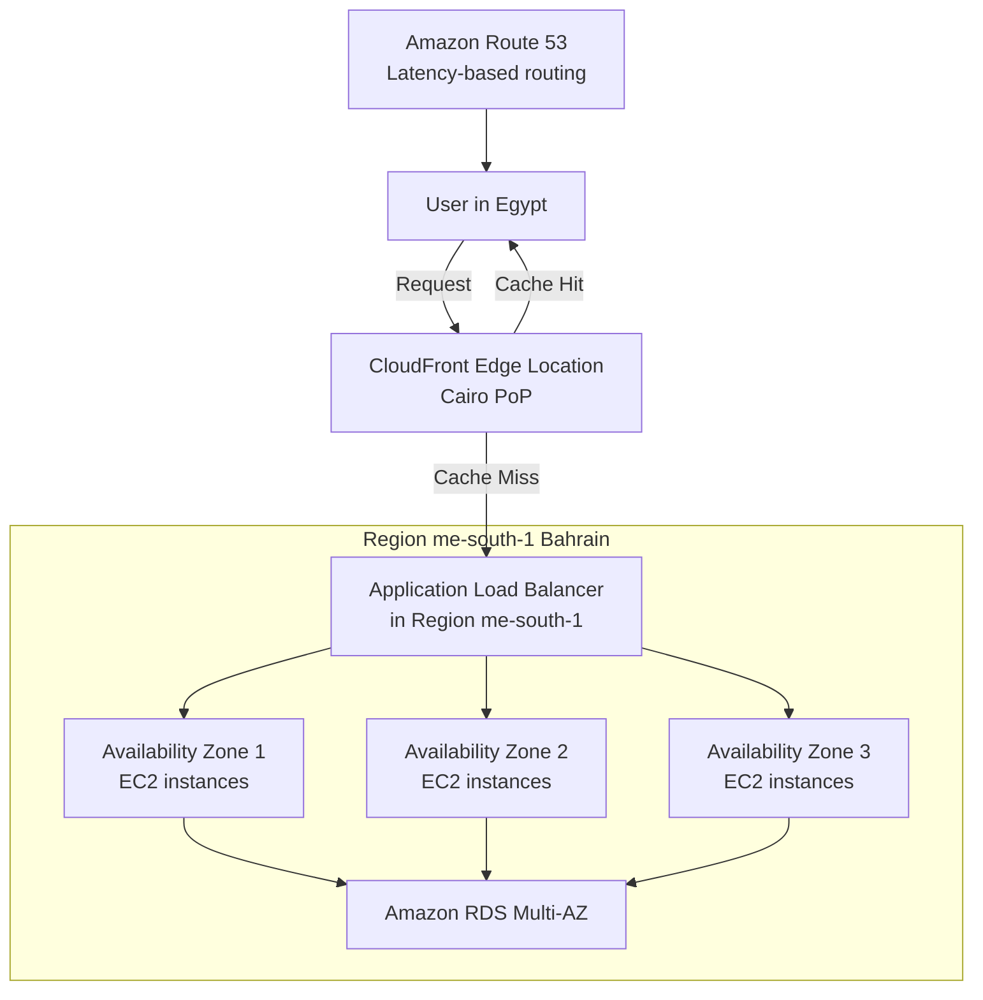

هات كوباية الشاي يا هندسة.. السهرة دي بتاعتنا وهنفصص AWS معمارياً وتقنياً من غير كروتة!

---

## المفهوم الأول: تعريف الـ Cloud Computing وخصائصه، موديلز النشر، والميزات الستة (CLF-C02 Core)

### 1. السيناريو العملي من السوق المصري
تخيل معايا شركة مصرية ناشئة في مجال e-commerce، اسمها "سوق مصر"، عندها منصة متجر إلكتروني على سيرفرات مستضافة في داتا سنتر خاص بشركة استضافة محلية. البيزنس شغال كويس، لكن المشكلة بتيجي في المواسم زي البلاك فرايدي أو رمضان.  
الـ traffic بيدخل فجأة 10 أضعاف الطبيعي والسيرفرات مبتستحملش، الداون تايم بيحصل، الطلبات بتضيع، والـ Ops team بيقعدوا يشتروا هاردوير جديد بسرعة ويركبوه في أيام، وتكاليف شراء السيرفرات والراك والفيزكال سكيورتي بتبقى فوق طاقة الشركة. الأهم إن بعد الموسم الـ hardware ده بيكون idle وفلوسه راحت على الفاضي.  
كمان الموظفين بيصرفوا وقت طويل في إدارة الكابلات والتبريد بدل ما يركزوا على الـ features الجديدة. الموضوع من منظور مالي كئيب: CAPEX عالي، TCO متضخم، و scalability شبه مستحيلة. هل في حل يخلي البيزنس يدفع حسب الاستخدام الفعلي ويركز على التطوير بدل البنية التحتية؟

### 2. الحل المعماري باستخدام AWS
الـ Cloud Computing هو الـ on-demand delivery لموارد الـ IT (compute power, database storage, applications) عبر منصة خدمات سحابية بنظام pay-as-you-go.  
بدل ما تشتري سيرفرات وتدفع إيجار داتا سنتر، تقدر تستخدم AWS عشان تـ provision الموارد اللي محتاجها بالظبط في وقتها، وتزودها أو تقللها تلقائيًا حسب الـ load.  
مش محتاج تخطط للطاقة الاستيعابية مسبقًا، ومش محتاج تدفع تكاليف بنية تحتية مش مستغلة. ده بالضبط اللي بيعالج أزمة "سوق مصر": إمكانية scale out في البلاك فرايدي بمجرد ضغطة زر أو باستخدام Auto Scaling، وبعد الموسم scale in تلقائيًا بدون ما تدفع غير على اللي استخدمته.

### 3. الزبدة التقنية للامتحان (متأصلش في الملخص، هنا التفاصيل الكاملة)

دلوقتي هندخل في أعماق الـ Cloud Computing من نظرة CLF-C02. مش هنسيب نقطة.

#### 🔹 تعريف الـ Cloud Computing
- هي delivery عند الطلب (on-demand) لموارد الـ IT عبر الإنترنت.
- النموذج ده بيشتغل بـ pay-as-you-go pricing (تدفع بس على اللي استخدمته).
- تقدر تـ provision الموارد بالشكل والحجم المناسبين بسرعة.

#### 🔹 خصائص الـ Cloud Computing الخمسة (The Five Characteristics)
<table>
<tr><th>الخاصية</th><th>التفسير التقني</th></tr>
<tr><td>On-demand self-service</td><td>المستخدم يقدر ينشئ موارد (servers, storage) بدون تفاعل بشري مع مزود الخدمة.</td></tr>
<tr><td>Broad network access</td><td>الموارد متاحة عبر الشبكة (الإنترنت) ومنصات متنوعة (mobile, laptop, etc.).</td></tr>
<tr><td>Multi-tenancy and resource pooling</td><td>أكتر من عميل بيشتركوا في نفس البنية التحتية الفيزيائية مع عزل أمني وخصوصية. الـ pooling بيسمح بكفاءة أعلى وتكلفة أقل.</td></tr>
<tr><td>Rapid elasticity and scalability</td><td>قدرة تزويد أو تخفيض الموارد تلقائيًا أو بسرعة حسب الحاجة (scale out/in).</td></tr>
<tr><td>Measured service</td><td>الاستخدام مُقاس بدقة، والدفع يكون بناءً على هذه القياسات (metering/billing).</td></tr>
</table>

#### 🔹 موديلات النشر (Deployment Models)
- **Public Cloud**: موارد السحابة مملوكة ومدارة عبر third-party cloud provider (زي AWS) ومتاحة للعامة عبر الإنترنت.
- **Private Cloud**: سحابة خاصة لمؤسسة واحدة، ممكن تكون on-premises أو في داتا سنتر خاص. توفر تحكم كامل وأمان للتطبيقات الحساسة.
- **Hybrid Cloud**: مزيج بين on-premises (private) و public cloud. بتدي مرونة وفعالية تكلفة الـ public مع الاحتفاظ بالأصول الحساسة في الـ private. ده شائع في مصر في القطاع البنكي والمؤسسات الحكومية.

#### 🔹 الأنواع الأساسية للـ Cloud Service Models (IaaS, PaaS, SaaS)
- **Infrastructure as a Service (IaaS)**: بتوفر building blocks (networking, virtual machines, storage). أنت المسؤول عن OS, middleware, runtime, والـ applications. (مثال: Amazon EC2)
- **Platform as a Service (PaaS)**: بتلم إدارة الـ infrastructure وتحتها، وركز على تطوير وإدارة التطبيقات. (مثال: AWS Elastic Beanstalk)
- **Software as a Service (SaaS)**: منتج كامل متاح للمستخدم النهائي، مقدم الخدمة هو المسؤول عن كل حاجة. (مثال: Gmail, Dropbox, AWS Rekognition)

**جدول المقارنة:**
| الطبقة | إنت بتدير إيه | AWS بتدير إيه |
|--------|--------------|----------------|
| On-premises | كل حاجة (physical, virtualization, OS, middleware, apps) | لا شيء |
| IaaS | OS, middleware, runtime, apps, data | virtualization, servers, storage, networking |
| PaaS | apps, data | OS, middleware, runtime, virtualization, servers, storage, networking |
| SaaS | لا شيء | كل حاجة |

#### 🔹 الميزات الستة للـ Cloud Computing (Six Advantages) – دول أساسيين جدًا للامتحان
1. **Trade CAPEX for OPEX**  
   بدل ما تدفع مقدمًا في شراء hardware (Capital Expense)، بتدفع شهريًا أول بأول على اللي بتستخدمه (Operational Expense). ده بيقلل Total Cost of Ownership (TCO) بشكل كبير.
2. **Economies of Scale**  
   لأن AWS عندها ملايين العملاء، بتقدر تشتري hardware بأسعار أقل جدًا، وده بينعكس على تسعيرهم التنافسي.
3. **Stop Guessing Capacity**  
   مش محتاج تحسب الحمل المتوقع قبل ما تشتري. ممكن تستخدم AWS Auto Scaling عشان تـ scale بناءً على الـ actual usage.
4. **Increase Speed and Agility**  
   الموارد بتظهر في دقائق، فتقدر تجرب وتطور بسرعة.
5. **Stop Spending Money on Data Centers**  
   مش هتحتاج تدفع إيجار داتا سنتر، تبريد، كهربا، صيانة، ومرتبات فرق الـ physical security.
6. **Go Global in Minutes**  
   تقدر تنشر تطبيقك في أي AWS Region في العالم بسرعة فائقة لتوصيل محتوى قريب من العملاء.

#### 🔹 نظرة على Pricing Fundamentals (خاص بـ AWS)
- **Compute**: الدفع حسب وقت الـ compute (سهولة per hour/second لـ EC2).
- **Storage**: الدفع حسب كمية الداتا المخزنة.
- **Data transfer OUT of the cloud**: الداتا الخارجة من AWS بتتسعر (الـ data transfer IN مجانية).

> ⭐ **في الامتحان:** هيجيبوا سؤال عن الفرق بين CAPEX و OPEX، ومعاني Rapid Elasticity vs. Scalability، ومتى تستخدم IaaS vs. PaaS vs. SaaS. ركز على Six Advantages دول.

#### 🎨 رسم توضيحي (Mermaid flowchart) لمسارات التطور من On-premises إلى Cloud  

الرسم بيوضح إن كل ما تتحرك يمين، أنت بتدي مسؤوليات أكتر لـ AWS وبتقلل الـ undifferentiated heavy lifting.

#### ⚠️ Use Case / NOT Use Case  
- **Use Case**: تطبيقات ويب ذات حركة مرورية متغيرة (زي المتاجر الإلكترونية)، startups تبدأ صغيرة وتكبر بسرعة، أحمال موسمية، بيئات تطوير واختبار سريعة.  
- **NOT Use Case**: أحمال تتطلب سيطرة فيزيائية كاملة على الهاردوير بدون أي مشاركة موارد (مثلاً بعض تطبيقات الدفاع العسكري الحساسة جدًا) – رغم إن AWS Outposts ممكن تحل جزء من ده، لكن في حالات تظل الـ on-premises أفضل.

#### 💰 Pricing Model  
- **Pay-as-you-go** مع إمكانية reserved instances لتوفير أكبر. لا توجد تكاليف مسبقة، وتدفع فقط مقابل compute (وقت المعالجة)، storage (مساحة مستخدمة)، والـ data transfer الخارجي.

#### 🛡️ Shared Responsibility (مبدئيًا)  
هنا بنتكلم عن المفهوم العام للسحابة: AWS مسؤولة عن **أمن السحابة** (physical, hypervisor, infrastructure)، والعميل مسؤول عن **الأمن داخل السحابة** (OS patches, firewall rules, data encryption, IAM). هنتعمق في المفهوم ده في جزء لاحق.

---

## المفهوم الثاني: البنية التحتية العالمية لـ AWS (Regions, Availability Zones, Edge Locations)

### 1. السيناريو العملي من السوق المصري  
بنك "المصري" عايز يطلق تطبيق موبايل بنكي جديد يخدم العملاء في مصر والشرق الأوسط. المتطلب الأساسي: البيانات لازم تفضل داخل حدود جغرافية معينة لأسباب تنظيمية (Data Residency) وقوانين البنك المركزي.  
كمان زمن الاستجابة (latency) لازم يكون أقل ما يمكن عشان العميل يقدر يعمل تحويلات بسرعة. في نفس الوقت، البنك عنده خطة لـ Disaster Recovery: لو الـ Region الرئيسي وقع بسبب أي كارثة (زلزال، عطل شبكة ضخم)، الخدمة تنتقل لـ Region آخر بأقل down time.  
التحدي إنك تبني architecture توفر high availability و resilience وامتثال قانوني، بدون ما تضطر تحط سيرفرات في كل بلد فيزيائيًا.

### 2. الحل المعماري مع AWS  
AWS بتوفر بنية تحتية عالمية تتكون من **Regions** و **Availability Zones** (AZs) و **Edge Locations**.  
البنك ممكن يختار AWS Region الأقرب لمصر (مثل Bahrain: me-south-1 أو UAE: me-central-1) بشرط تتوافق مع متطلبات الـ data residency.  
عشان الـ high availability، الخدمة تتنشر عبر Availability Zones متعددة (على الأقل 3) داخل نفس الـ Region، بحيث لو zone فشلت التانيين مستمرين.  
للـ Disaster Recovery، بننشئ بيئة standby في Region تاني (مثلاً Frankfurt eu-central-1) مع Route 53 لإدارة failover.  
لتقليل latency للعملاء في مصر وفي أي مكان في العالم، نستخدم CloudFront (CDN) اللي بيخدم الـ static content من Edge Locations قريبة من المستخدمين.  
كل ده تحت سيطرة العميل: مش محتاج يبني داتا سنترات ولا يخاف من الحوادث الفيزيائية.

### 3. الزبدة التقنية للامتحان (كل تفصيلة تقنية)

#### 🗺️ هيكل AWS العالمي
```
Region → Availability Zone (واحد أو أكثر من داتا سنتر منفصلة) → Edge Location (Points of Presence)
```
- **Region**: تجمع جغرافي لـ availability zones. كل Region عبارة عن cluster من داتا سنترات في منطقة معينة. الخدمات السحابية بتكون إما Regional (مرتبطة بـ Region معين) أو Global.
- **Availability Zone (AZ)**: مجموعة واحدة أو أكثر من داتا سنترات منفصلة داخل Region،
  * لديها redundant power, networking, and connectivity.
  * تباعد مادي بين الـ AZs (عادةً كيلومترات) عشان يكونوا isolated من الكوارث (عزل فشل).
  * متصلة ببعض بشبكات high-bandwidth و ultra-low latency.
  * كل Region فيها على الأقل 3 AZs (والحد الأقصى 6).
  * أسماء AZs: مثل `us-east-1a`, `us-east-1b`, `us-east-1c`.
- **Edge Locations (Points of Presence)**: أكثر من 400 نقطة تواجد في أكثر من 90 مدينة حول العالم. بتستخدمها خدمات زي CloudFront و Route 53 و Global Accelerator لتقليل الـ latency للمستخدمين، لأن الداتا بتتسلم من أقرب Edge Location بدل ما تروح للـ Region البعيد.

#### 📋 كيفية اختيار Region (How to Choose an AWS Region)
الاختيار مش عشوائي؛ لازم تضع في اعتبارك:
| المعيار | التفصيل |
|---------|----------|
| Compliance (الامتثال القانوني) | البيانات لا تترك الـ Region إلا بإذنك الصريح. مثال: بعض القوانين تمنع نقل البيانات خارج بلد معين. |
| Proximity to customers | كلما كان الـ Region أقرب للمستخدمين، قل الـ latency. |
| Available services within a Region | الخدمات والميزات الجديدة قد لا تكون متاحة في كل Regions فورًا. |
| Pricing | التسعير بيختلف من Region لآخر، وشفاف في صفحة تسعير الخدمة. |

#### 🌐 الفرق بين الخدمات Global و Regional
- **Global Services**: لا ترتبط بـ Region محدد، مثل:
  * IAM (Identity and Access Management)
  * Route 53 (DNS service)
  * CloudFront (CDN)
  * WAF (Web Application Firewall)
- **Regional Services**: ترتبط بـ Region معين، مثل:
  * Amazon EC2, Lambda, Elastic Beanstalk, RDS, Rekognition.
- لازم تعرف ده عشان متحاولش تبحث عن S3 bucket مثلاً (اللي هو Global namespace لكن تخزينه في Region معين، لكن الخدمة نفسها بتعتبر Regional-stored). الامتحان ممكن يسأل: أي من الخدمات التالية Global؟

#### 🔁 تطبيق Global Application Architecture (لمحة سريعة)
- **Route 53**: DNS routing لتحويل المستخدمين لأقرب deployment بأقل latency. يوفر Routing Policies مختلفة (Simple, Weighted, Latency, Failover).
- **CloudFront**: CDN لتسريع delivery المحتوى المخزن مؤقتًا (cache) من Edge Locations.
- **S3 Transfer Acceleration**: تسريع رفع وتنزيل الملفات إلى S3 باستخدام Edge Locations.
- **AWS Global Accelerator**: بيوجه حركة المرور عبر الشبكة الداخلية لـ AWS لتحسين الأداء للـ applications اللي بتستخدم TCP/UDP.

#### 🎨 رسم توضيحي (Mermaid flowchart) للبنية التحتية مع Region, AZs, Edge Locations

الرسم يوضح إن المستخدم في مصر يطلب عبر CloudFront Edge قريب؛ لو المحتوى مش cached، بيتجه للـ Region ويوزع الطلب على AZs.

#### ⚠️ Use Case / NOT Use Case  
- **Use Case**: تطبيقات تحتاج إلى توفر عالي وDR عالمي، مثل الخدمات البنكية، تطبيقات الألعاب ذات التأخير المنخفض، منصات البث المباشر.  
- **NOT Use Case**: خدمة بسيطة محلية في نطاق جغرافي واحد لا تحتاج أي وجود خارجي، أو عندما لا تسمح القوانين بنقل البيانات خارج الحدود ولا يوجد Region في الدولة (في هذه الحالة الـ Outposts أو الـ on-premises هو الحل).

#### 💰 Pricing Model (مافيش تسعير مباشر للـ Region اختياره، لكن له تأثير)
- اختيار Region بيأثر في تكلفة الخدمات (مثلاً EC2 في بعض المناطق أغلى من غيرها).
- الـ data transfer بين AZs داخل نفس Region له تكلفة (بسيطة)، وdata transfer بين Regions له تكلفة أعلى.
- استخدام CloudFront و Edge Locations له تكلفة إضافية (لكن Data Transfer Out من Origin لـ CloudFront أرخص).

#### 🛡️ Shared Responsibility (ينطبق)
- AWS مسؤول عن الأمان المادي للـ Regions و AZs و Edge Locations، وإدارة الكوارث الفيزيائية.
- العميل مسؤول عن تشفير البيانات، تكوين الشبكة بشكل آمن (VPC، ACLs)، إدارة IAM، وحماية endpoints.

---

[أنا شرحت الجزء ده تقنياً بالتفصيل.. قولي "كمل" عشان أدخل على المواضيع اللي بعدها بنفس العمق]