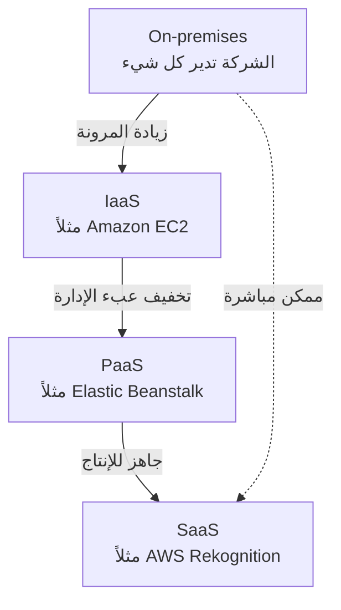
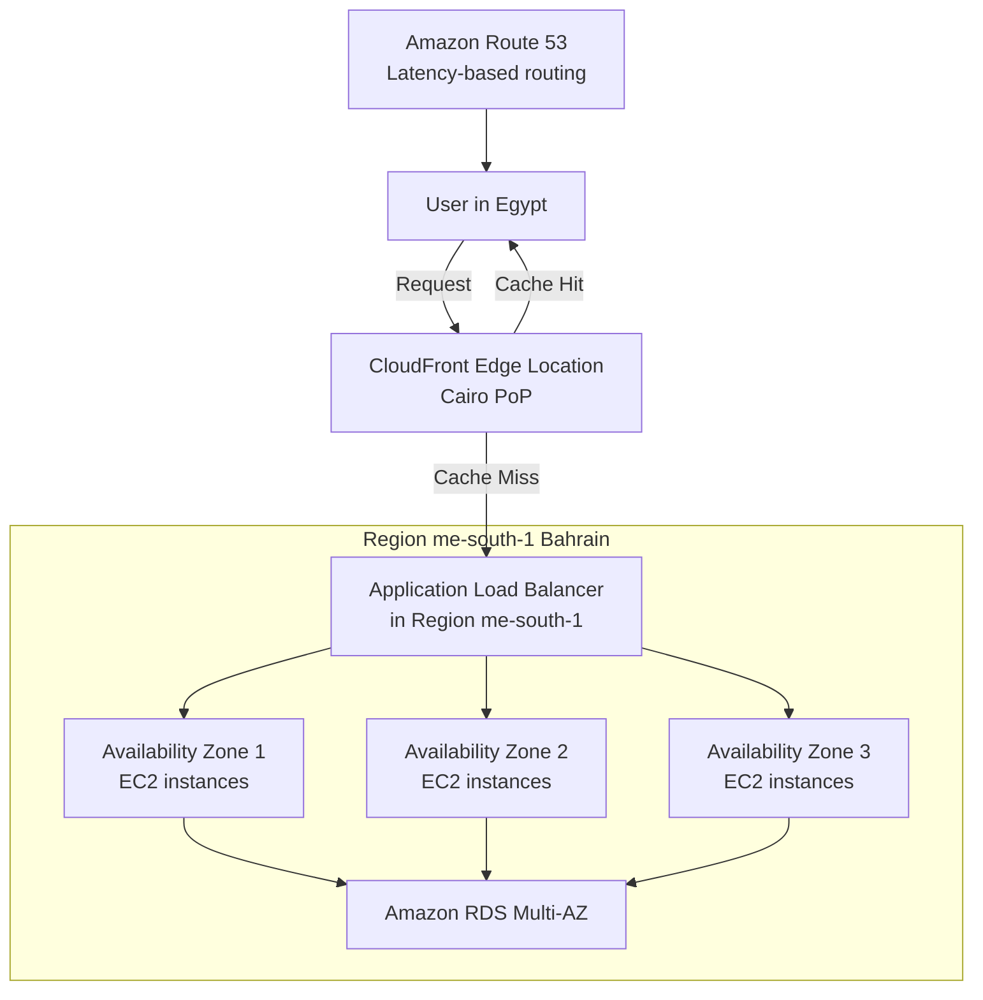
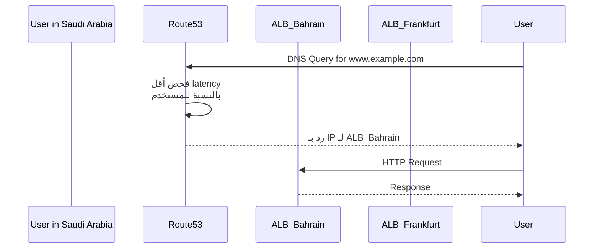

هات كوباية الشاي يا هندسة.. السهرة دي بتاعتنا وهنفصص AWS معمارياً وتقنياً من غير كروتة!

---

## المفهوم الأول: تعريف الـ Cloud Computing وخصائصه، موديلز النشر، والميزات الستة (CLF-C02 Core)

### 1. السيناريو العملي من السوق المصري
تخيل معايا شركة مصرية ناشئة في مجال e-commerce، اسمها "سوق مصر"، عندها منصة متجر إلكتروني على سيرفرات مستضافة في داتا سنتر خاص بشركة استضافة محلية. البيزنس شغال كويس، لكن المشكلة بتيجي في المواسم زي البلاك فرايدي أو رمضان.  
الـ traffic بيدخل فجأة 10 أضعاف الطبيعي والسيرفرات مبتستحملش، الداون تايم بيحصل، الطلبات بتضيع، والـ Ops team بيقعدوا يشتروا هاردوير جديد بسرعة ويركبوه في أيام، وتكاليف شراء السيرفرات والراك والفيزكال سكيورتي بتبقى فوق طاقة الشركة. الأهم إن بعد الموسم الـ hardware ده بيكون idle وفلوسه راحت على الفاضي.  
كمان الموظفين بيصرفوا وقت طويل في إدارة الكابلات والتبريد بدل ما يركزوا على الـ features الجديدة. الموضوع من منظور مالي كئيب: CAPEX عالي، TCO متضخم، و scalability شبه مستحيلة. هل في حل يخلي البيزنس يدفع حسب الاستخدام الفعلي ويركز على التطوير بدل البنية التحتية؟

### 2. الحل المعماري باستخدام AWS
الـ Cloud Computing هو الـ on-demand delivery لموارد الـ IT (compute power, database storage, applications) عبر منصة خدمات سحابية بنظام pay-as-you-go.  
بدل ما تشتري سيرفرات وتدفع إيجار داتا سنتر، تقدر تستخدم AWS عشان تـ provision الموارد اللي محتاجها بالظبط في وقتها، وتزودها أو تقللها تلقائيًا حسب الـ load.  
مش محتاج تخطط للطاقة الاستيعابية مسبقًا، ومش محتاج تدفع تكاليف بنية تحتية مش مستغلة. ده بالضبط اللي بيعالج أزمة "سوق مصر": إمكانية scale out في البلاك فرايدي بمجرد ضغطة زر أو باستخدام Auto Scaling، وبعد الموسم scale in تلقائيًا بدون ما تدفع غير على اللي استخدمته.

### 3. الزبدة التقنية للامتحان (متأصلش في الملخص، هنا التفاصيل الكاملة)

دلوقتي هندخل في أعماق الـ Cloud Computing من نظرة CLF-C02. مش هنسيب نقطة.

#### 🔹 تعريف الـ Cloud Computing
- هي delivery عند الطلب (on-demand) لموارد الـ IT عبر الإنترنت.
- النموذج ده بيشتغل بـ pay-as-you-go pricing (تدفع بس على اللي استخدمته).
- تقدر تـ provision الموارد بالشكل والحجم المناسبين بسرعة.

#### 🔹 خصائص الـ Cloud Computing الخمسة (The Five Characteristics)
<table>
<tr><th>الخاصية</th><th>التفسير التقني</th></tr>
<tr><td>On-demand self-service</td><td>المستخدم يقدر ينشئ موارد (servers, storage) بدون تفاعل بشري مع مزود الخدمة.</td></tr>
<tr><td>Broad network access</td><td>الموارد متاحة عبر الشبكة (الإنترنت) ومنصات متنوعة (mobile, laptop, etc.).</td></tr>
<tr><td>Multi-tenancy and resource pooling</td><td>أكتر من عميل بيشتركوا في نفس البنية التحتية الفيزيائية مع عزل أمني وخصوصية. الـ pooling بيسمح بكفاءة أعلى وتكلفة أقل.</td></tr>
<tr><td>Rapid elasticity and scalability</td><td>قدرة تزويد أو تخفيض الموارد تلقائيًا أو بسرعة حسب الحاجة (scale out/in).</td></tr>
<tr><td>Measured service</td><td>الاستخدام مُقاس بدقة، والدفع يكون بناءً على هذه القياسات (metering/billing).</td></tr>
</table>

#### 🔹 موديلات النشر (Deployment Models)
- **Public Cloud**: موارد السحابة مملوكة ومدارة عبر third-party cloud provider (زي AWS) ومتاحة للعامة عبر الإنترنت.
- **Private Cloud**: سحابة خاصة لمؤسسة واحدة، ممكن تكون on-premises أو في داتا سنتر خاص. توفر تحكم كامل وأمان للتطبيقات الحساسة.
- **Hybrid Cloud**: مزيج بين on-premises (private) و public cloud. بتدي مرونة وفعالية تكلفة الـ public مع الاحتفاظ بالأصول الحساسة في الـ private. ده شائع في مصر في القطاع البنكي والمؤسسات الحكومية.

#### 🔹 الأنواع الأساسية للـ Cloud Service Models (IaaS, PaaS, SaaS)
- **Infrastructure as a Service (IaaS)**: بتوفر building blocks (networking, virtual machines, storage). أنت المسؤول عن OS, middleware, runtime, والـ applications. (مثال: Amazon EC2)
- **Platform as a Service (PaaS)**: بتلم إدارة الـ infrastructure وتحتها، وركز على تطوير وإدارة التطبيقات. (مثال: AWS Elastic Beanstalk)
- **Software as a Service (SaaS)**: منتج كامل متاح للمستخدم النهائي، مقدم الخدمة هو المسؤول عن كل حاجة. (مثال: Gmail, Dropbox, AWS Rekognition)

**جدول المقارنة:**
| الطبقة | إنت بتدير إيه | AWS بتدير إيه |
|--------|--------------|----------------|
| On-premises | كل حاجة (physical, virtualization, OS, middleware, apps) | لا شيء |
| IaaS | OS, middleware, runtime, apps, data | virtualization, servers, storage, networking |
| PaaS | apps, data | OS, middleware, runtime, virtualization, servers, storage, networking |
| SaaS | لا شيء | كل حاجة |

#### 🔹 الميزات الستة للـ Cloud Computing (Six Advantages) – دول أساسيين جدًا للامتحان
1. **Trade CAPEX for OPEX**  
   بدل ما تدفع مقدمًا في شراء hardware (Capital Expense)، بتدفع شهريًا أول بأول على اللي بتستخدمه (Operational Expense). ده بيقلل Total Cost of Ownership (TCO) بشكل كبير.
2. **Economies of Scale**  
   لأن AWS عندها ملايين العملاء، بتقدر تشتري hardware بأسعار أقل جدًا، وده بينعكس على تسعيرهم التنافسي.
3. **Stop Guessing Capacity**  
   مش محتاج تحسب الحمل المتوقع قبل ما تشتري. ممكن تستخدم AWS Auto Scaling عشان تـ scale بناءً على الـ actual usage.
4. **Increase Speed and Agility**  
   الموارد بتظهر في دقائق، فتقدر تجرب وتطور بسرعة.
5. **Stop Spending Money on Data Centers**  
   مش هتحتاج تدفع إيجار داتا سنتر، تبريد، كهربا، صيانة، ومرتبات فرق الـ physical security.
6. **Go Global in Minutes**  
   تقدر تنشر تطبيقك في أي AWS Region في العالم بسرعة فائقة لتوصيل محتوى قريب من العملاء.

#### 🔹 نظرة على Pricing Fundamentals (خاص بـ AWS)
- **Compute**: الدفع حسب وقت الـ compute (سهولة per hour/second لـ EC2).
- **Storage**: الدفع حسب كمية الداتا المخزنة.
- **Data transfer OUT of the cloud**: الداتا الخارجة من AWS بتتسعر (الـ data transfer IN مجانية).

> ⭐ **في الامتحان:** هيجيبوا سؤال عن الفرق بين CAPEX و OPEX، ومعاني Rapid Elasticity vs. Scalability، ومتى تستخدم IaaS vs. PaaS vs. SaaS. ركز على Six Advantages دول.

#### 🎨 رسم توضيحي (Mermaid flowchart) لمسارات التطور من On-premises إلى Cloud  

الرسم بيوضح إن كل ما تتحرك يمين، أنت بتدي مسؤوليات أكتر لـ AWS وبتقلل الـ undifferentiated heavy lifting.

#### ⚠️ Use Case / NOT Use Case  
- **Use Case**: تطبيقات ويب ذات حركة مرورية متغيرة (زي المتاجر الإلكترونية)، startups تبدأ صغيرة وتكبر بسرعة، أحمال موسمية، بيئات تطوير واختبار سريعة.  
- **NOT Use Case**: أحمال تتطلب سيطرة فيزيائية كاملة على الهاردوير بدون أي مشاركة موارد (مثلاً بعض تطبيقات الدفاع العسكري الحساسة جدًا) – رغم إن AWS Outposts ممكن تحل جزء من ده، لكن في حالات تظل الـ on-premises أفضل.

#### 💰 Pricing Model  
- **Pay-as-you-go** مع إمكانية reserved instances لتوفير أكبر. لا توجد تكاليف مسبقة، وتدفع فقط مقابل compute (وقت المعالجة)، storage (مساحة مستخدمة)، والـ data transfer الخارجي.

#### 🛡️ Shared Responsibility (مبدئيًا)  
هنا بنتكلم عن المفهوم العام للسحابة: AWS مسؤولة عن **أمن السحابة** (physical, hypervisor, infrastructure)، والعميل مسؤول عن **الأمن داخل السحابة** (OS patches, firewall rules, data encryption, IAM). هنتعمق في المفهوم ده في جزء لاحق.

---

## المفهوم الثاني: البنية التحتية العالمية لـ AWS (Regions, Availability Zones, Edge Locations)

### 1. السيناريو العملي من السوق المصري  
بنك "المصري" عايز يطلق تطبيق موبايل بنكي جديد يخدم العملاء في مصر والشرق الأوسط. المتطلب الأساسي: البيانات لازم تفضل داخل حدود جغرافية معينة لأسباب تنظيمية (Data Residency) وقوانين البنك المركزي.  
كمان زمن الاستجابة (latency) لازم يكون أقل ما يمكن عشان العميل يقدر يعمل تحويلات بسرعة. في نفس الوقت، البنك عنده خطة لـ Disaster Recovery: لو الـ Region الرئيسي وقع بسبب أي كارثة (زلزال، عطل شبكة ضخم)، الخدمة تنتقل لـ Region آخر بأقل down time.  
التحدي إنك تبني architecture توفر high availability و resilience وامتثال قانوني، بدون ما تضطر تحط سيرفرات في كل بلد فيزيائيًا.

### 2. الحل المعماري مع AWS  
AWS بتوفر بنية تحتية عالمية تتكون من **Regions** و **Availability Zones** (AZs) و **Edge Locations**.  
البنك ممكن يختار AWS Region الأقرب لمصر (مثل Bahrain: me-south-1 أو UAE: me-central-1) بشرط تتوافق مع متطلبات الـ data residency.  
عشان الـ high availability، الخدمة تتنشر عبر Availability Zones متعددة (على الأقل 3) داخل نفس الـ Region، بحيث لو zone فشلت التانيين مستمرين.  
للـ Disaster Recovery، بننشئ بيئة standby في Region تاني (مثلاً Frankfurt eu-central-1) مع Route 53 لإدارة failover.  
لتقليل latency للعملاء في مصر وفي أي مكان في العالم، نستخدم CloudFront (CDN) اللي بيخدم الـ static content من Edge Locations قريبة من المستخدمين.  
كل ده تحت سيطرة العميل: مش محتاج يبني داتا سنترات ولا يخاف من الحوادث الفيزيائية.

### 3. الزبدة التقنية للامتحان (كل تفصيلة تقنية)

#### 🗺️ هيكل AWS العالمي
```
Region → Availability Zone (واحد أو أكثر من داتا سنتر منفصلة) → Edge Location (Points of Presence)
```
- **Region**: تجمع جغرافي لـ availability zones. كل Region عبارة عن cluster من داتا سنترات في منطقة معينة. الخدمات السحابية بتكون إما Regional (مرتبطة بـ Region معين) أو Global.
- **Availability Zone (AZ)**: مجموعة واحدة أو أكثر من داتا سنترات منفصلة داخل Region،
  * لديها redundant power, networking, and connectivity.
  * تباعد مادي بين الـ AZs (عادةً كيلومترات) عشان يكونوا isolated من الكوارث (عزل فشل).
  * متصلة ببعض بشبكات high-bandwidth و ultra-low latency.
  * كل Region فيها على الأقل 3 AZs (والحد الأقصى 6).
  * أسماء AZs: مثل `us-east-1a`, `us-east-1b`, `us-east-1c`.
- **Edge Locations (Points of Presence)**: أكثر من 400 نقطة تواجد في أكثر من 90 مدينة حول العالم. بتستخدمها خدمات زي CloudFront و Route 53 و Global Accelerator لتقليل الـ latency للمستخدمين، لأن الداتا بتتسلم من أقرب Edge Location بدل ما تروح للـ Region البعيد.

#### 📋 كيفية اختيار Region (How to Choose an AWS Region)
الاختيار مش عشوائي؛ لازم تضع في اعتبارك:
| المعيار | التفصيل |
|---------|----------|
| Compliance (الامتثال القانوني) | البيانات لا تترك الـ Region إلا بإذنك الصريح. مثال: بعض القوانين تمنع نقل البيانات خارج بلد معين. |
| Proximity to customers | كلما كان الـ Region أقرب للمستخدمين، قل الـ latency. |
| Available services within a Region | الخدمات والميزات الجديدة قد لا تكون متاحة في كل Regions فورًا. |
| Pricing | التسعير بيختلف من Region لآخر، وشفاف في صفحة تسعير الخدمة. |

#### 🌐 الفرق بين الخدمات Global و Regional
- **Global Services**: لا ترتبط بـ Region محدد، مثل:
  * IAM (Identity and Access Management)
  * Route 53 (DNS service)
  * CloudFront (CDN)
  * WAF (Web Application Firewall)
- **Regional Services**: ترتبط بـ Region معين، مثل:
  * Amazon EC2, Lambda, Elastic Beanstalk, RDS, Rekognition.
- لازم تعرف ده عشان متحاولش تبحث عن S3 bucket مثلاً (اللي هو Global namespace لكن تخزينه في Region معين، لكن الخدمة نفسها بتعتبر Regional-stored). الامتحان ممكن يسأل: أي من الخدمات التالية Global؟

#### 🔁 تطبيق Global Application Architecture (لمحة سريعة)
- **Route 53**: DNS routing لتحويل المستخدمين لأقرب deployment بأقل latency. يوفر Routing Policies مختلفة (Simple, Weighted, Latency, Failover).
- **CloudFront**: CDN لتسريع delivery المحتوى المخزن مؤقتًا (cache) من Edge Locations.
- **S3 Transfer Acceleration**: تسريع رفع وتنزيل الملفات إلى S3 باستخدام Edge Locations.
- **AWS Global Accelerator**: بيوجه حركة المرور عبر الشبكة الداخلية لـ AWS لتحسين الأداء للـ applications اللي بتستخدم TCP/UDP.

#### 🎨 رسم توضيحي (Mermaid flowchart) للبنية التحتية مع Region, AZs, Edge Locations

الرسم يوضح إن المستخدم في مصر يطلب عبر CloudFront Edge قريب؛ لو المحتوى مش cached، بيتجه للـ Region ويوزع الطلب على AZs.

#### ⚠️ Use Case / NOT Use Case  
- **Use Case**: تطبيقات تحتاج إلى توفر عالي وDR عالمي، مثل الخدمات البنكية، تطبيقات الألعاب ذات التأخير المنخفض، منصات البث المباشر.  
- **NOT Use Case**: خدمة بسيطة محلية في نطاق جغرافي واحد لا تحتاج أي وجود خارجي، أو عندما لا تسمح القوانين بنقل البيانات خارج الحدود ولا يوجد Region في الدولة (في هذه الحالة الـ Outposts أو الـ on-premises هو الحل).

#### 💰 Pricing Model (مافيش تسعير مباشر للـ Region اختياره، لكن له تأثير)
- اختيار Region بيأثر في تكلفة الخدمات (مثلاً EC2 في بعض المناطق أغلى من غيرها).
- الـ data transfer بين AZs داخل نفس Region له تكلفة (بسيطة)، وdata transfer بين Regions له تكلفة أعلى.
- استخدام CloudFront و Edge Locations له تكلفة إضافية (لكن Data Transfer Out من Origin لـ CloudFront أرخص).

#### 🛡️ Shared Responsibility (ينطبق)
- AWS مسؤول عن الأمان المادي للـ Regions و AZs و Edge Locations، وإدارة الكوارث الفيزيائية.
- العميل مسؤول عن تشفير البيانات، تكوين الشبكة بشكل آمن (VPC، ACLs)، إدارة IAM، وحماية endpoints.

---

ها هيّا كملت معاك يا هندسة.. يلا بينا ندخل على خدمات AWS Global Application، وبالتركيز الشديد على اللي هييجي في CLF-C02.

---

## المفهوم الثالث: Amazon Route 53 – DNS الذكي عشان disaster recovery و latency منخفض

### 1. السيناريو العملي من السوق المصري
تخيّل موقع أخبار رياضي كبير في مصر، "بطولات". الموقع بيغطي ماتشات بشكل لحظي وعنده متابعين كتير جدًا من مصر والخليج.  
حاجة واحدة ممكن تقتل الموقع: إنه يكون down وقت ماتش القمة. دا معناه خسارة ملايين من الـ page views والدخل الإعلاني.  
المشكلة التقليدية: لو السيرفرات اللي موجودة في داتا سنتر واحد حصل فيه عطل، الموقع كله يختفي. ولو مستخدم من السعودية بيحاول يدخل، الطلب لازم يقطع بحار ومسافات عشان يوصل للسيرفر في مصر، والـ latency عالي.  
الـ Ops team بيقولوا: عايزين نظام DNS يوجّه الزوّار لأقرب وأسرع نسخة من الموقع، ولو location وقع يوجّههم تلقائيًا لـ location تاني شغّال. وكمان عايزين حل بسيط لإدارة أسماء النطاقات بدون تعقيد.

### 2. الحل المعماري مع AWS
Amazon Route 53 هو Managed DNS Service. هتسجّل domain الموقع عنده، وتعمله hosted zone.  
عشان تحل مشكلة الـ latency، تستخدم **Latency Routing Policy**: Route 53 هيوجّه المستخدمين لأقرب AWS Region بناءً على أقل latency. لو المستخدم في الرياض، Route 53 هيديله IP للـ Application Load Balancer الموجود في Region Bahrain؛ ولو في القاهرة، هيديله IP للـ ALB الموجود في Region UAE (أو أي Region شغّال فيه).  
ولضمان الـ high availability وعمل DR، تستخدم **Failover Routing Policy**: حدد Primary (الموقع الرئيسي) و Secondary (النسخة الاحتياطية في Region تاني). Route 53 هيراقب صحة الـ primary باستخدام health checks، ولو الـ primary فشل، يحول كل الـ traffic للـ secondary تلقائيًا.  
كده بقى عندك توجيه ذكي لا يعتمد على عنوان IP ثابت واحد، وبتضمن تجربة مستخدم أسرع وموثوقية أعلى.

### 3. الزبدة التقنية للامتحان (تحت الغطاء بقى)

#### 🧬 مفهوم DNS و Route 53
- DNS (Domain Name System): مجموعة قواعد وrecords بتحول أسماء النطاقات (URLs) لعناوين IP.
- Route 53 هو managed DNS، متاح كـ **Global Service** (مش مربوط بـ Region).
- المصطلح "Route 53" جاي من المنفذ 53 اللي بيستخدمه DNS.

#### 📋 أنواع الـ DNS Records اللي لازم تعرفها للـ CLF-C02
| نوع الـ Record | الوظيفة | مثال |
|---------------|---------|------|
| **A** | ربط hostname بـ IPv4 address | `www.example.com => 12.34.56.78` |
| **AAAA** | ربط hostname بـ IPv6 address | `www.example.com => 2001:db8:...` |
| **CNAME** | توجيه hostname لـ hostname آخر (بس للـ non-root domains) | `search.example.com => www.example.com` |
| **Alias** | توجيه hostname لـ AWS resource (ويدعم root domains و مجاني للاستعلامات الداخلية) | `example.com => CloudFront Distribution, ELB, S3 bucket, RDS, ...` |

> ⭐ **في الامتحان:** هيسأل عن الفرق بين CNAME و Alias. الـ CNAME مش مناسب للـ zone apex (root domain زي `example.com`)، لكن الـ Alias ينفع ويعتبر نوع خاص من AWS مجاني.

#### 🧭 الـ Routing Policies (دي أهم حاجة في الامتحان)
1. **Simple Routing Policy**: توجيه بسيط بدون health checks. بتربط domain بـ IP واحد أو أكثر، لكن لو فيه أكتر من IP، الـ DNS بيختار واحد عشوائيًا. لا يدعم الفحص الصحي.
2. **Weighted Routing Policy**: بتوزع الـ traffic بين resources بنسب مئوية معينة (وزن). مثلاً: 70% على Region A، 20% على B، 10% على C. تقدر تستخدمه عشان A/B testing أو deployments متدرجة.
3. **Latency Routing Policy**: يوجه المستخدم للمنطقة الأقل latency بالنسبة له. Route 53 بيحسب latency من جداول بيانات شبكية، مش بالضرورة الأقرب جغرافيًا.
4. **Failover Routing Policy**: بيستخدم health checks على الـ primary. لو فشل، يفشل تلقائيًا إلى secondary. مثالي لـ Disaster Recovery.

#### 🩺 الـ Health Checks
- Route 53 يقدر يراقب الـ endpoints بتاعتك (HTTP, HTTPS, TCP) للتأكد إنهم متاحين.
- ممكن تدمج الـ health checks مع الـ failover routing policy عشان تضمن إن الـ traffic بيتوجه فقط للموارد السليمة.

#### 🛡️ DNS Security
- Route 53 يدعم DNSSEC لتوقيع الـ zones وحمايتها من التلاعب.
- يتكامل مع AWS Shield و AWS WAF لتوفير حماية DDoS عند استخدامه مع خدمات زي CloudFront.

#### 🔁 Route 53 Resolver
- خدمة تسمح بـ DNS resolution هجين بين on-premises و AWS، بس دي للمستوى المتقدم مش لـ CLF-C02.

#### 🎨 رسم توضيحي (Sequence Diagram) لـ Latency Routing

حصل تأخير أقل لأن الطلب تم توجيهه لأقرب نقطة.

#### ⚠️ Use Case / NOT Use Case  
- **Use Case**: مواقع تحتاج latency منخفض أو DR، توزيع حركة المرور جغرافيًا، موازنة تحميل DNS-based، إدارة domains متعددة.  
- **NOT Use Case**: توجيه يعتمد على محتوى الطلب (layer 7 routing) – هنا تستخدم Application Load Balancer. Route 53 مجرد DNS، مابيتدخلش في الـ packet forwarding.

#### 💰 Pricing Model
- تدفع حسب كل hosted zone شهريًا، وعدد queries اللي بتتعمل (كل مليون query لها سعر). الـ Alias queries داخل AWS تكون مجانية.

#### 🛡️ Shared Responsibility
- **AWS**: مسؤولة عن أمان وتوافر خوادم DNS العالمية، وصيانتها.
- **أنت**: مسؤول عن إدارة الـ records، تكوين الـ routing policies والـ health checks بالشكل الصحيح، وحماية مفاتيح DNSSEC.

---

## المفهوم الرابع: Amazon CloudFront – CDN عشان الدليفري السريع وحماية المحتوى

### 1. السيناريو العملي من السوق المصري
منصة "سينما مصر" اللي بتبث أفلام ومسلسلات عربية بجودة عالية للمشتركين. عندهم مكتبة فيديو ضخمة مخزنة على S3 bucket في Region أوروبا (عشان التكلفة).  
المشكلة: مشتركي المنصة في مصر والخليج بيبلغوا عن بطء في تحميل الفيديوهات وتقطيع متكرر. كل مرة يُطلب فيديو، الـ data لازم تخرج من S3 في أوروبا عبر الإنترنت العام وتقطع مسافات طويلة، والـ latency عالي جدًا.  
كمان في مشكلة أمنية: الـ S3 bucket محتاج يبقى مغلق للعامة، لكن المنصة عايزة تقدم المحتوى للعملاء بسرعة من غير ما تعرض الـ bucket مباشرة.

### 2. الحل المعماري مع AWS
Amazon CloudFront هو Content Delivery Network (CDN). هتنشئ CloudFront distribution وتخلي الـ Origin هو الـ S3 bucket اللي فيه الفيديوهات.  
CloudFront هيخزّن (cache) المحتوى ده في Edge Locations حول العالم – في القاهرة، الرياض، دبي، وغيرها. لما مستخدم من القاهرة يطلب فيلم، الطلب يروح لأقرب Edge Location بدل ما يروح لأوروبا. ولو الفيلم مش موجود مؤقتًا في الكاش، الـ Edge Location يطلبه مرة واحدة من الـ origin، يخزنه، ويبعت النسخة المخزنة لباقي المستخدمين بسرعة فائقة.  
عشان تحل المشكلة الأمنية، هتستخدم **Origin Access Control (OAC)** اللي بيدي CloudFront صلاحية حصرية للقراءة من الـ S3 bucket، وتمنع أي وصول مباشر للـ bucket من العام. وبكده تحمي المحتوى ويكون سريع وآمن.

### 3. الزبدة التقنية للامتحان (كل دقائق الـ CDN)

#### 🌐 مفهوم الـ CDN
- CloudFront هو CDN يحسن read performance عن طريق تخزين المحتوى في مواقع طرفية قريبة من المستخدمين.
- يوفر DDoS protection لأنه متكامل مع AWS Shield Standard و AWS WAF.
- أكثر من 400+ Point of Presence (Edge Locations + Regional Edge Caches) في أكثر من 90 مدينة حول العالم.

#### 🎯 أنواع الـ Origins المدعومة
| Origin Type | التفصيل |
|-------------|---------|
| **S3 Bucket** | يستضيف ملفات ثابتة (فيديو، صور، CSS، JS). يمكن تأمينه بـ **OAC** (Origin Access Control) بحيث CloudFront بس هو اللي يقرأ. |
| **VPC Origin** | يصل إلى تطبيقات داخل VPC خاص (Private ALB، NLB، EC2 instances) باستخدام OAC. |
| **Custom Origin (HTTP)** | أي خادم HTTP عام مثل S3 website bucket enabled as static website أو public ALB. |

#### 🔒 تأمين الـ S3 Origin بـ OAC
- قبل OAC كان OAI (Origin Access Identity) لكن OAC هو الأحدث من AWS ويوفر تحكم أفضل بالأذونات.
- تنشئ OAC، تربطه بالـ CloudFront distribution، وتعدل S3 bucket policy بحيث تسمح بالقراءة فقط من الـ distribution ده.
- النتيجة: الـ bucket مقفول للعامة، ومحدش يقدر يوصله مباشرة.

#### 🧠 التخزين المؤقت (Caching) وسياسة الـ TTL
- المحتوى بيتخزن في Edge Locations لمدة TTL (Time To Live) اللي انت بتحددها.
- بعد ما الـ TTL ينتهي، الـ Edge بيطلب النسخة الحديثة من الـ origin لو اتطلبت.
- تقدر تتحكم في سلوك الكاش باستخدام Cache Policies و Invalidation لإزالة كائنات معينة من الكاش فورًا.

#### ↔️ CloudFront vs S3 Cross-Region Replication (CRR)
السؤال ده متكرر في الامتحان:
| المعيار | CloudFront | S3 Cross-Region Replication |
|---------|------------|------------------------------|
| الطبيعة | CDN، كاش مؤقت | نسخ دائم في كل Region |
| التحديث | حسب TTL (ممكن يوم كامل) | شبه فوري (near real-time) |
| الاستخدام | محتوى ثابت يُقرأ بكثرة عالميًا | محتوى ديناميكي يحتاج latency منخفض في Regions محددة |
| الصلاحية | للقراءة فقط (cache) | للقراءة فقط (replica bucket) |

> ⭐ **في الامتحان:** هيجيبوا سيناريو: عندي محتوى static يجب أن يكون متاح بسرعة في كل العالم. الحل CloudFront. لو محتوى dynamic محتاج latency بسيط في منطقتين فقط، S3 CRR ممكن يبقى أفضل.

#### ⚡ S3 Transfer Acceleration
- مش CloudFront لكن مكمل له: يسرّع رفع الملفات إلى S3 bucket عبر Edge Locations.
- بدل ما ترفع مباشر من مصر لـ bucket في أمريكا، تستخدم S3 Transfer Acceleration عشان الملف الأول يروح لأقرب Edge Location (في القاهرة) وبعدين ينتقل عبر شبكة AWS الداخلية للسيرفر البعيد. تقدر تختبر السك السريع في الرابط اللي في الـ slides.

#### 🎨 رسم توضيحي (Flowchart) لـ CloudFront مع OAC
```mermaid
flowchart TD
    Client[User in Egypt] -->|GET /movie.mp4| Edge[Edge Location Cairo<br/>cache check]
    Edge -->|Cache Hit| Client
    Edge -->|Cache Miss| S3[S3 Bucket in eu-west-1<br/>Origin via OAC]
    S3 -->|Object| Edge
    Edge -->|Cached Object| Client
    Note over S3,Edge: Bucket Policy يسمح فقط<br/>لـ CloudFront بالقراءة عبر OAC
```
الرسم يوضح إن الـ Bucket محمي ولا يقبل غير طلبات الـ Edge.

#### ⚠️ Use Case / NOT Use Case  
- **Use Case**: توصيل محتوى ثابت (static & streaming)، مواقع الويب، حماية من DDoS مع WAF، تسريع downloads عالميًا.  
- **NOT Use Case**: تطبيق يحتاج write in-place بشكل مباشر على S3 عبر CDN، أو محتوى متغير جدًا بشكل لحظي مع الحاجة لـ consistency عالي – هنا S3 CRR أو حلول تانية أفضل.

#### 💰 Pricing Model
- تدفع مقابل عدد طلبات HTTP/HTTPS، وكمية البيانات التي تخرج من CloudFront (Data Transfer Out). الـ data transfer من origin إلى CloudFront غالبًا أقل تكلفة من الخروج المباشر.
- لا توجد رسوم إضافية على استخدام AWS Shield Standard.

#### 🛡️ Shared Responsibility
- **AWS**: مسؤولة عن أمان وصيانة شبكة Edge Locations، وطبقة الحماية الأساسية من DDoS.
- **أنت**: مسؤول عن تكوين OAC بشكل صحيح، كتابة bucket policies الآمنة، إدارة شهادات SSL/TLS، وتكوين WAF rules لو مستخدم.

---

## المفهوم الخامس: AWS Global Accelerator – تسريع التطبيقات عبر شبكة AWS الداخلية

### 1. السيناريو العملي من السوق المصري
شركة "Nile Games" المصرية الناشئة طوّرت لعبة موبايل تنافسية لعبة Real-time Multiplayer. الـ Game Servers موجودين في Region واحد (us-east-1) لأن التطوير هناك، لكن اللاعبين من مصر وباقي العالم.  
الـ gameplay بيحتاج latency أقل من 100ms، لكن مرور الداتا عبر الإنترنت العام من القاهرة لأمريكا بيدي latency فوق 200ms مع jitter عالي، واللعبة بتتهنج.  
كمان محتاجين IPs ثابتة (static anycast) عشان يربطوا الـ game client بخادم واحد ويقدروا يعملوا failover سريع بين Regions لو حصل مشكلة في Region أمريكا. CloudFront مش مناسب لأنه بيشتغل مع HTTP/s والمحتوى القابل للتخزين، أما اللعبة بتستخدم TCP/UDP مباشر.

### 2. الحل المعماري مع AWS
AWS Global Accelerator بيستخدم الشبكة الداخلية الخاصة بـ AWS (الـ AWS global network) عشان يوجه الـ traffic من المستخدم إلى تطبيقك عبر أقصر طريق وبأقل latency.  
بتنشئ Accelerator وتربطه بـ endpoints (زي Application Load Balancer أو EC2 instances) في Region معين (أو Regions متعددة). الخدمة بتديك 2 static Anycast IP addresses، هما دول اللي العملاء بيتصلوا بيهم.  
الـ traffic بيوصل لأقرب Edge Location، وبدل ما يكمل عبر الإنترنت العام، بيتم توجيهه عبر كوابل AWS الداخلية عالية الأداء من الـ Edge للـ Region اللي فيه التطبيق. النتايج بتقول إن الأداء بيتحسن بنسبة قد تصل لـ 60%.  
ولو حبيت تعمل DR، تقدر تحط endpoints في Region تاني، والـ Global Accelerator هيكتشف فشل الـ primary ويفشل تلقائيًا للـ Region السليم، باستخدام health checks.

### 3. الزبدة التقنية للامتحان (التفاصيل اللي متتغفلش)

#### 🧬 مفهوم Anycast IPs
- Global Accelerator بيديك 2 static IPv4 addresses من أي مكان في العالم. الـ Anycast يعني إن نفس الـ IP بيُعلن من مواقع Side متعددة (Edge Locations)، وبيوصل المستخدم لأقرب موقع.
- مفيد للـ whitelisting firewalls، ومش محتاج تغيير DNS او انتظار propagation.

#### 🛣️ الفرق الجوهري: Global Accelerator vs CloudFront
دي مقارنة من ذهب للامتحان:
| المعيار | AWS Global Accelerator | Amazon CloudFront |
|---------|------------------------|-------------------|
| البروتوكولات | TCP, UDP (أي تطبيق) | HTTP, HTTPS مع caching |
| التخزين المؤقت | لا يوجد caching | يخزن المحتوى في Edge Locations |
| IP Address | ثابت (Static Anycast) | يقدم hostname تابع لـ CloudFront (مش IP ثابت) |
| التحويل | proxying packets عند الحافة للتطبيق عبر الشبكة الداخلية | forwarding request للمحتوى الأصلي إذا لم يكن مخزنًا |
| الاستخدام المثالي | Gaming, VoIP, IoT, حالات تحتاج failover إقليمي سريع وIPs ثابت | مواقع الويب، توزيع محتوى ثابت، حماية DDoS |

#### ⚡ تحسين الأداء
- بيستخدم الشبكة الداخلية لـ AWS اللي أسرع وأقل ازدحامًا من الإنترنت العام.
- بيفيد جدًا في أحمال TCP و UDP اللي لا تعتمد على HTTP.

#### 🔀 التكامل مع AWS Shield
- كل من Global Accelerator و CloudFront بيتكاملا مع AWS Shield Standard تلقائيًا للحماية من هجمات DDoS.

#### 🎨 رسم توضيحي (Flowchart) لمسار الـ Traffic مع Global Accelerator
```mermaid
flowchart LR
    User[User in Egypt] -->|TCP/UDP to anycast IP| Edge[Edge Location Cairo]
    Edge -->|AWS Private Network| GA[Global Accelerator Endpoint]
    GA --> ALB[ALB in us-east-1]
    ALB --> Game[Game Server]
    Note over User,Edge: No internet routing<br/>بعد الحافة
```
الـ traffic من اللاعب لحد الـ Edge، ومن هناك ينتقل عبر شبكة AWS الخاصة بسرعة عالية، متأثرش بالـ internet congestion.

#### ⚠️ Use Case / NOT Use Case  
- **Use Case**: تطبيقات تعتمد على TCP/UDP مع latency منخفض جدًا، gaming، streaming live، VoIP، تطبيقات تحتاج Static IPs وعمليات failover سريعة بين Regions.  
- **NOT Use Case**: توزيع محتوى ثابت قابل للتخزين – CloudFront أفضل وأوفر. لو تطبيق HTTP عادي مش محتاج الـ static IPs، ممكن تكتفي بـ CloudFront أو Route 53 Latency Routing.

#### 💰 Pricing Model
- تدفع رسوم ثابتة لكل ساعة لكل Accelerator، بالإضافة لرسوم على الـ data transfer اللي بتمر عبر الـ accelerator (نسبة من الـ DT-Premium). مشمول رسوم الـ static IPs لو مش مستخدمين.
- أغلى شوية من CloudFront، فلازم تستخدمه فقط للحالات اللي محتاجة الميزات المتقدمة.

#### 🛡️ Shared Responsibility
- **AWS**: مسؤولة عن أمان وعمليات الشبكة الداخلية العالمية، وصيانة Points of Presence.
- **أنت**: مسؤول عن تكوين endpoints بشكل آمن (مثل Security Groups)، إدارة الـ health checks، وتأمين التطبيق نفسه.

---

[أنا شرحت الجزء ده تقنياً بالتفصيل.. قولي "كمل" عشان أدخل على المواضيع اللي بعدها بنفس العمق]