# 🌩️ Domain 1 — Cloud Concepts (24%) | AWS CLF-C02
### هات كوباية الشاي يا هندسة.. ويلا نفهم AWS صح!

> [!info] معلومة سريعة: عن الـ Domain ده
> الـ Domain 1 هو **24% من الامتحان** — يعني كل 4 أسئلة منهم، واحدة من هنا. الـ Domain ده هو **الأساس الفلسفي** لكل AWS. لو فهمته صح، باقي الـ Domains هيبقى منطقي ومش حفظ أعمى.

---

## 🗺️ Domain Mindmap — Cloud Concepts

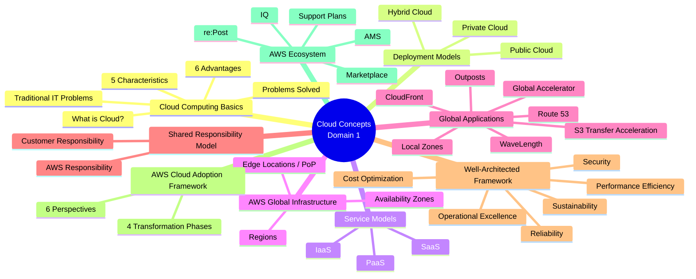

---

# 📖 الفصل الأول: ما هو الـ Cloud Computing؟

## 🏗️ المشهد الأول — كيف كانت الدنيا قبل AWS؟

> [!example] السيناريو: شركة e-commerce مصرية في 2005
> تخيل معايا السيناريو ده — أنت صاحب موقع بيع أونلاين زي Jumia في أول أيامها. جيت تبني الموقع، طب إيه اللي محتاج تعمله؟
>
> 1. **تأجر مكان** — Data Center في مدينة نصر أو المعادي، بإيجار شهري غالي
> 2. **تشتري Servers** — كل Server بعشرات الآلاف من الجنيهات
> 3. **تشتري كابلات و Routers و Switches**
> 4. **تشغل كهرباء 24/7** — وفلوس التبريد (cooling) اللي ممكن تبقى أغلى من الكهرباء نفسها
> 5. **تعين فريق IT** يصحى الساعة 3 الصبح لو حاجة اتعطلت
> 6. **تخمن capacity** — كم مستخدم هيدخل البلاك فرايداي؟ لو اتعطلت في أوج البيع؟

---

## 🛜 ما هو الـ Server أصلاً؟

قبل ما نكمل، لازم نفهم لغة الناس دول.

| المكوّن | التعريف بالعربي |
|---|---|
| **CPU (Compute)** | العقل — بيحسب ويعمل العمليات |
| **RAM (Memory)** | الذاكرة المؤقتة — بيخزن اللي بيتشتغل دلوقتي |
| **Storage (Disk)** | الذاكرة الدائمة — بيخزن الملفات والداتا |
| **Database** | تخزين منظّم للداتا — زي Excel بس على ستيرويد |
| **Network** | السلك اللي بيربط كل ده ببعض وبالإنترنت |

> [!info] معلومة سريعة: Client vs Server
> - **Client** = أنت وجهازك (موبايلك، لابتوبك) — عنده IP address
> - **Server** = الجهاز اللي بيرد عليك وبيديك البيانات — وعنده هو كمان IP address
> - الكلام بينهم يمشي عبر الـ **Network** زي البريد المضمون بالظبط — عنوان إرسال، عنوان استلام!

---

## 🌐 الشبكة في 30 ثانية

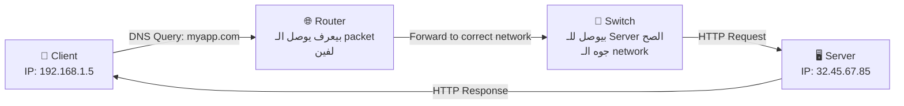

- **Router** = حارس المرمى اللي بيعرف يوجّه الـ packets بين الـ networks المختلفة
- **Switch** = السنترال الداخلي — بيوصّل الـ packet للجهاز الصح *جوه* نفس الـ network

---

## 😤 مشاكل الـ Traditional IT — ليه الكل بقى يجري على Cloud؟

> [!warning] ⚠️ مشاكل الـ On-Premises الكلاسيكية
> 1. **تدفع إيجار** للـ Data Center — سواء اشتغلت أو لأ
> 2. **تدفع كهرباء وتبريد وصيانة** — فلوس ثابتة كل شهر
> 3. **إضافة Hardware بتاخد وقت** — اشتري، استنى الشحن، ركّب، سيت أب
> 4. **الـ Scaling محدود** — اشتريت 10 servers؟ تقدر تبقوا 10 بس
> 5. **فريق 24/7** للمراقبة — حتى لو مفيش حاجة بتحصل
> 6. **الكوارث** — زلزال، حريق، قطع كهرباء؟ ودّع بياناتك

---

## ✅ الحل — ما هو الـ Cloud Computing؟

> [!important] ⭐ التعريف الرسمي للـ Exam
> **Cloud Computing** هو الـ **on-demand delivery** لـ:
> - Compute power
> - Database storage  
> - Applications
> - Other IT resources
>
> وده بيحصل عبر **pay-as-you-go pricing** — يعني بتدفع على قد ما استخدمت بالظبط.

### المبدأ البسيط:
> تخيل معايا إنك بدل ما تشتري generator كهرباء وتصرف عليه — بتدفع لشركة الكهرباء بالـ meter. AWS هي شركة الكهرباء دي، بس بدل كهرباء — Computing!

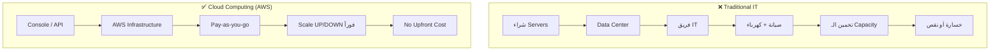

---

# 🧱 الفصل الثاني: خصائص وفوائد الـ Cloud

## ⭐ الـ 5 Characteristics — الـ NIST Definition

دي الخصائص اللي بتعرّف أي Cloud Computing ديني بشكل صحيح.

> [!important] ⭐ Exam Focus: الـ 5 Characteristics
> لازم تحفظهم **بالأسماء الإنجليزية** لأن الامتحان بيسأل عنهم كده.

| # | الخاصية | المعنى بالعربي | مثال |
|---|---|---|---|
| 1 | **On-demand self service** | توفير الموارد بدون تدخل بشري | بتضغط زرار في Console وعندك Server في ثواني |
| 2 | **Broad network access** | الوصول من أي جهاز وأي مكان | بتدخل على AWS من موبايلك في المواصلات |
| 3 | **Multi-tenancy & Resource Pooling** | أكتر من عميل بيشاركوا نفس الـ Infrastructure بأمان | إنت وشركة تانية على نفس الـ Physical Server بس معزولين |
| 4 | **Rapid elasticity & scalability** | تكبير وتصغير الموارد لحظياً | Black Friday: scale up. بعد الفيستا: scale down |
| 5 | **Measured service** | بتدفع على قد ما استخدمت بالظبط | زي عداد الكهرباء — كيلوات بكيلوات |

---

## 🚀 الـ 6 Advantages — ليه تروح Cloud؟

> [!important] ⭐ Exam Focus: الـ 6 Advantages
> الامتحان بيسأل عنهم كتير، خصوصاً الـ CAPEX vs OPEX والـ TCO.

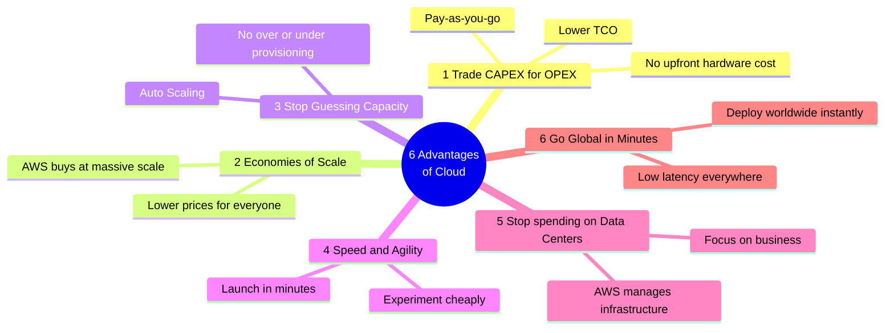

### شرح تفصيلي للـ 6 Advantages:

**1️⃣ Trade CAPEX for OPEX:**
- **CAPEX** (Capital Expense) = مصاريف رأس مال — بتشتري servers بفلوس كتير من الأول
- **OPEX** (Operational Expense) = مصاريف تشغيلية — بتدفع شهرياً على قد الاستخدام
- **TCO** (Total Cost of Ownership) = إجمالي التكلفة — بينخفض في الـ Cloud

**2️⃣ Benefit from Economies of Scale:**
AWS بتشتري ملايين الـ Servers — يعني تكلفة الـ Server عندها أرخص بكتير منك. وفورات الحجم دي بتتنعكس في أسعار أرخص عليك.

**3️⃣ Stop Guessing Capacity:**
مش محتاج تخمّن هيجي كام مستخدم. الـ Auto Scaling بيتعامل مع ده أوتوماتيك.

**4️⃣ Increase Speed and Agility:**
بدل ما تستنى 3 أسابيع لـ Server جديد يوصل ويتركّب — دلوقتي في ثانية.

**5️⃣ Stop Spending on Data Centers:**
وفّر الفلوس والوقت اللي كانت بتروح على الـ Infrastructure وحوّله لبناء منتجك.

**6️⃣ Go Global in Minutes:**
عايز تفتح Server في اليابان؟ 3 دقايق وخلص — مش سنة من التفاوض على عقد Data Center.

---

## 🔧 Problems Solved by the Cloud

> [!info] معلومة سريعة: إيه اللي Cloud بتحله؟
> - **Flexibility** — غيّر الـ Resource type وقت ما تحب
> - **Cost-Effectiveness** — ادفع على اللي استخدمته بس
> - **Scalability** — استوعب حمل أكبر بـ Hardware أقوى أو nodes أكتر
> - **Elasticity** — Scale out (زيادة) و Scale-in (تقليل) حسب الطلب
> - **High-availability & Fault-tolerance** — بني على Data Centers متعددة
> - **Agility** — طوّر، اختبر، وابعت Applications بسرعة

---

# ☁️ الفصل الثالث: نماذج الـ Cloud Deployment

## 🏛️ الثلاثة نماذج — Public, Private, Hybrid

> [!example] السيناريو: أختار أنهي نموذج؟
> تخيل إنك مدير IT في بنك مصري كبير:
> - **عندك داتا عملاء** حساسة جداً — مش هتحطها في أي حتة
> - **عندك موقع إلكتروني** للعملاء ومحتاج يكون fast وscalable
> - **عندك نظام داخلي** للموظفين بس
>
> إيه الحل؟ **Hybrid Cloud** — بعض حاجات على premises وبعض على AWS!

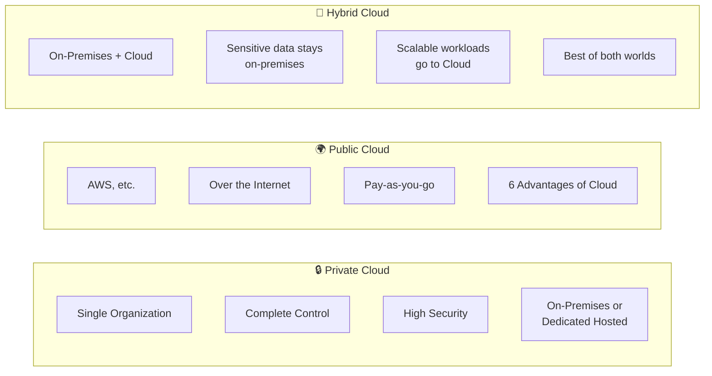

| النموذج | مين يمتلكه؟ | مين يدخله؟ | الأفضل لـ |
|---|---|---|---|
| **Private Cloud** | المنظمة نفسها | منظمة واحدة فقط | بيانات حساسة، امتثال قانوني |
| **Public Cloud** | AWS | الكل عبر الإنترنت | معظم التطبيقات الحديثة |
| **Hybrid Cloud** | الاتنين | موظفو المنظمة + العملاء | البنوك، الحكومات، Healthcare |

> [!important] ⭐ Exam Focus: Hybrid Cloud
> الامتحان بيحب السؤال عن **Hybrid Cloud** — تعرّفه على إنه: **Keep some servers on-premises + extend capabilities to the Cloud**. مش معناه إن كل حاجة على Cloud.

---

# 🗂️ الفصل الرابع: أنواع الـ Cloud Computing — IaaS, PaaS, SaaS

## 🍕 استعارة البيتزا الأشهر في الـ Cloud!

> [!example] السيناريو: البيتزا وأنت والـ Cloud
> تخيل إنك عايز تاكل بيتزا:
> - **On-Premises** = بتشتري الدقيق، التنور، الجبنة، وبتعمل كل حاجة في البيت — كل حاجة مسؤوليتك
> - **IaaS** = بتاخد kitchen جاهزة — بس إنت اللي بتطبخ
> - **PaaS** = بتاخد العجينة جاهزة والتنور — إنت بس بتحط التوبينج
> - **SaaS** = بتطلب بيتزا ديلفري — مش مهتم بأي حاجة غير الأكل

---

## 📊 الـ Shared Responsibility في الـ Service Models

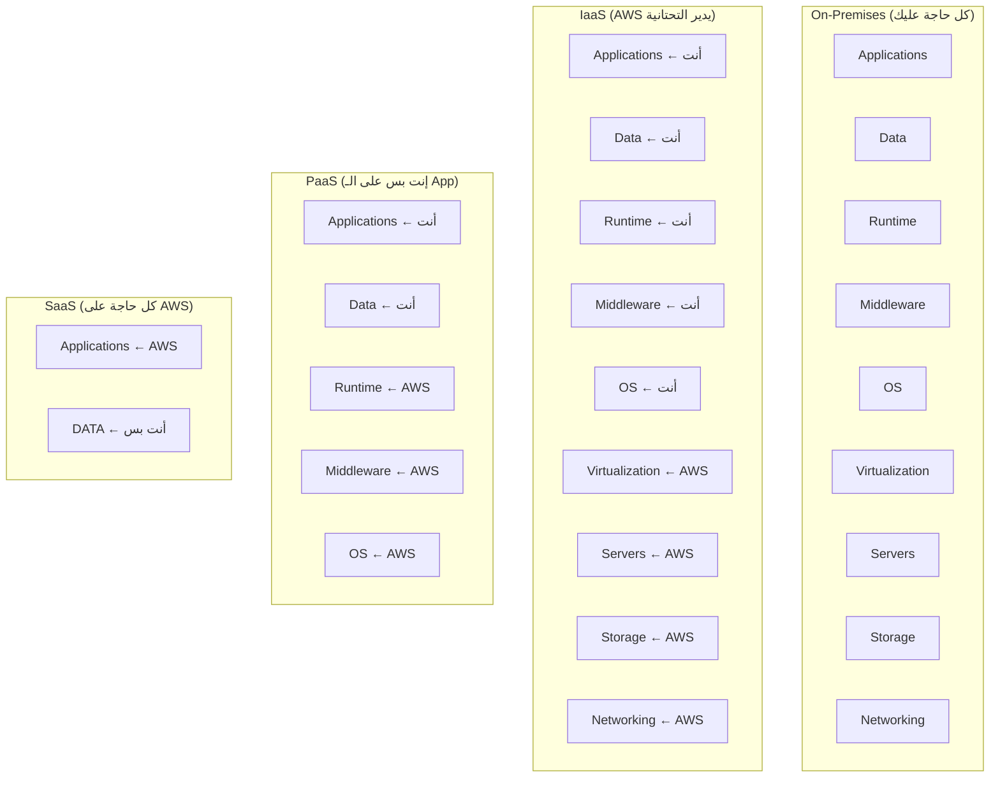

| النوع | إيه اللي بتديريه؟ | مثال AWS | مثال خارجي |
|---|---|---|---|
| **IaaS** | Applications, Data, OS, Runtime, Middleware | **Amazon EC2** | Digital Ocean, Linode |
| **PaaS** | Applications & Data فقط | **AWS Elastic Beanstalk** | Heroku, Google App Engine |
| **SaaS** | مش بتدير حاجة — بتستخدم فقط | **Amazon Rekognition** | Gmail, Dropbox, Zoom |

> [!important] ⭐ Exam Focus: IaaS vs PaaS vs SaaS Examples
> - **EC2 = IaaS** — بتدير الـ OS والـ Runtime والـ App كلها
> - **Elastic Beanstalk = PaaS** — بترمي الـ Code وهو يتكفل بالباقي
> - **Rekognition = SaaS** — بتكلمه بـ API وهو يجاوبك بنتيجة الـ ML

> [!warning] ⚠️ Common Trap: مين مثال IaaS في الامتحان؟
> الامتحان ممكن يسألك "Which service is an example of IaaS?" — الإجابة دايماً **EC2**. مش Lambda (ده FaaS/Serverless)، مش Rekognition (ده SaaS).

---

# 💰 الفصل الخامس: Pricing of the Cloud

## 💲 الـ 3 Fundamentals للـ AWS Pricing

> [!info] معلومة سريعة: الـ 3 محاور التسعير
> AWS بتسعّر على 3 حاجات بس:

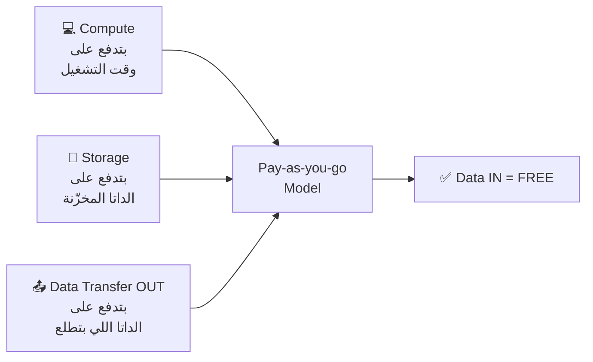

> [!important] ⭐ Exam Focus: Data Transfer
> **Data Transfer IN to AWS = مجاني تماماً**
> **Data Transfer OUT from AWS = بتدفع عليه**
> 
> ده سؤال بيجي في الامتحان! "Which data transfer is free?" → **Inbound (IN)**

---

# 🏢 الفصل السادس: AWS — التاريخ والأرقام

## 📅 AWS Cloud History Timeline

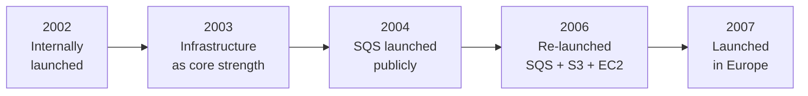

> [!info] معلومة سريعة: AWS بالأرقام 2024
> - **$90 Billion** إيرادات سنوية في 2023
> - **31% حصة سوقية** في Q1 2024 — الأول عالمياً
> - **1,000,000+ مستخدم نشط**
> - **13 سنة متتالية** كـ Leader في الـ Gartner Magic Quadrant

---

# 🌍 الفصل السابع: AWS Global Infrastructure

## البنية التحتية العالمية لـ AWS — الأهم في الامتحان

> [!example] السيناريو: ليه تهمني المناطق الجغرافية؟
> تخيل معايا إن عندك تطبيق للتجارة الإلكترونية. عميلك في القاهرة يفتح الصفحة — لو Server الـ Application في أمريكا، هيستنى 200ms لكل request. لو Server في أوروبا أو الخليج؟ 20ms. المسافة = Latency = تجربة مستخدم وحشة. عشان كده AWS بنت Infrastructure في كل حتة في الدنيا!

---

## 🗺️ الـ 4 مستويات للـ AWS Global Infrastructure

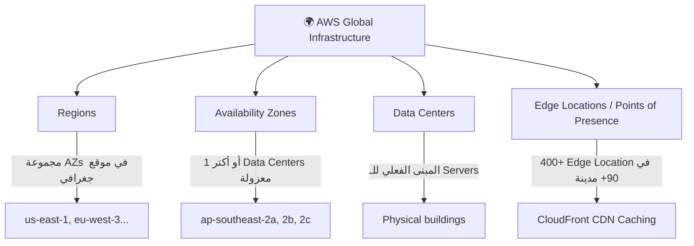

---

## 🏙️ AWS Regions — العقل المدبّر

> [!info] معلومة سريعة: الـ Region
> - **Region** = مجموعة من الـ Data Centers في موقع جغرافي معين
> - كل Region ليها **كود اسم** زي: `us-east-1`, `eu-west-3`, `me-south-1` (Bahrain!)
> - **معظم خدمات AWS هي Region-scoped** — يعني بتشتغل جوه region واحدة

### 🤔 ازاي تختار الـ Region المناسبة؟

> [!important] ⭐ Exam Focus: الـ 4 Factors لاختيار Region
> الامتحان بيسأل عن ده كتير — اتذكر الـ **CAPS**:

| العامل | التفاصيل |
|---|---|
| **C**ompliance | قوانين حماية البيانات — الداتا مش بتغادر الـ Region من غير إذنك |
| **A**vailability | مش كل الخدمات موجودة في كل Region |
| **P**roximity | أقرب للعملاء = Latency أقل |
| **S**avings (Pricing) | السعر بيختلف من Region لـ Region |

> [!warning] ⚠️ Common Trap: Compliance أول حاجة!
> لو السؤال بيتكلم عن **بيانات حساسة أو متطلبات قانونية** — الإجابة دايماً **Compliance** هي أول عامل في اختيار الـ Region، مش Pricing أو Latency.

---

## 🏗️ Availability Zones — درع الـ High Availability

> [!example] السيناريو: ليه محتاج أكتر من Data Center؟
> تخيل المنظومة الكهربائية في القاهرة — لو فيه حريق في محطة واحدة، مش كل القاهرة بتقع. في حيط عزل بين المحطات. AWS عملت نفس الحكاية مع الـ Data Centers!

### ما هو الـ Availability Zone (AZ)؟

- كل **Region** فيها عادةً **3 AZs** (minimum 3، maximum 6)
- كل AZ = **Data Center واحد أو أكتر** بـ redundant power ونيتوورك
- الـ AZs بتكون **معزولة عن بعض** عشان لو حصل حادث — ما يأثرش على باقيهم
- بين بعض بـ **high bandwidth, ultra-low latency networking** (private fiber cables)

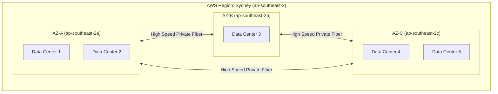

> [!important] ⭐ Exam Focus: AZ vs Region
> - **Region** = المدينة كلها (Sydney)
> - **AZ** = الحي جوه المدينة (ap-southeast-2a)
> - الـ AZs بتكون **physically separated** — مش في نفس المبنى!

---

## 📡 Edge Locations / Points of Presence — للسرعة القصوى

> [!info] معلومة سريعة: Edge Locations
> - **400+ Edge Locations** في **90+ مدينة** في **40+ دولة**
> - دي مش Data Centers كاملة — دي **Cache Servers** صغيرة موزّعة
> - الهدف الوحيد: توصيل المحتوى للمستخدم بأسرع سرعة ممكنة
> - بيستخدمها **CloudFront** (CDN الخاص بـ AWS)

---

## 🌐 Global vs Regional Services

> [!important] ⭐ Exam Focus: Global vs Regional Services
> الامتحان بيحب يسأل عن خدمات Global vs Regional!

| 🌍 Global Services (مش محتاجة Region) | 🏙️ Region-Scoped Services |
|---|---|
| **IAM** — إدارة الصلاحيات | **EC2** — الـ Virtual Machines |
| **Route 53** — الـ DNS | **Elastic Beanstalk** — PaaS |
| **CloudFront** — الـ CDN | **Lambda** — Serverless |
| **WAF** — Web Application Firewall | **Rekognition** — ML/AI |

---

# 🛡️ الفصل الثامن: Shared Responsibility Model

## من المسؤول عن إيه؟

> [!example] السيناريو: إيجار شقة
> لما بتأجر شقة — صاحب العمارة مسؤول عن **الأعمدة والسقف والمصعد**. إنت مسؤول عن **الأمن جوه شقتك، الأجهزة، والنظافة**. AWS وإنت نفس الفكرة!

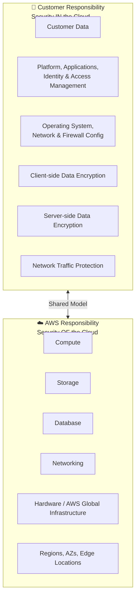

| المسؤولية | AWS | العميل (إنت) |
|---|---|---|
| **Physical Security** | ✅ AWS تتحكم | ❌ |
| **Network Infrastructure** | ✅ Cables, Routers | ❌ |
| **Hypervisor (Virtualization)** | ✅ | ❌ |
| **Guest OS (في EC2)** | ❌ | ✅ إنت تعمل Patching |
| **Applications** | ❌ | ✅ Code إنت |
| **Data Encryption** | ❌ (بيوفر الأداة) | ✅ إنت تقرر |
| **IAM Users & Permissions** | ❌ | ✅ إنت تعمل |
| **S3 Bucket Policy** | ❌ | ✅ إنت تكتب |

> [!important] ⭐ Exam Focus: Shared Responsibility
> **AWS = Security OF the Cloud** (كل حاجة تحت الـ hypervisor)
> **Customer = Security IN the Cloud** (كل حاجة فوق الـ hypervisor)
>
> **المثال الأشهر في الامتحان:**
> - **EC2**: AWS مسؤولة عن الـ Physical Host وهي إنت مسؤول عن الـ OS Updates والـ Security Groups
> - **RDS**: AWS مسؤولة عن الـ DB Software patching وإنت مسؤول عن الـ Database Access Control

> [!warning] ⚠️ Common Trap: Managed Services
> في **Managed Services** زي RDS — AWS بتتحمل مسؤولية أكبر. مش هتحتاج تعمل OS patching. لكن في EC2 — إنت المسؤول الكامل عن الـ OS.

---

# 🌐 الفصل التاسع: Global Applications في AWS

## ليه تبني تطبيق Global؟

> [!info] معلومة سريعة: ليه Global Application؟
> - **Decreased Latency** — قرّب الـ Server من المستخدم
> - **Disaster Recovery** — لو Region واقعة، Region تانية بتشتغل
> - **Attack Protection** — Infrastructure موزّعة أصعب في الهجوم عليها

---

## 🗺️ Amazon Route 53 — دكتور الشبكات والـ DNS

### المشكلة:
> تخيل معايا إنك هتفتح `www.jumia.com.eg` — جهازك مش عارف الـ IP. محتاج حاجة تترجمله الـ Domain Name لـ IP Address. ده اللي بيعمله الـ DNS.

### الحل:

> [!info] معلومة سريعة: Route 53 هو الـ DNS الخاص بـ AWS
> - **Managed DNS** — بتدير الـ DNS records بتاعتك
> - اسمه Route 53 عشان الـ DNS port هو **53**!

### أنواع الـ DNS Records في الامتحان:

| نوع الـ Record | معناه | مثال |
|---|---|---|
| **A Record** | Domain → IPv4 | `www.google.com → 12.34.56.78` |
| **AAAA Record** | Domain → IPv6 | `www.google.com → 2001:0db8...` |
| **CNAME** | Hostname → Hostname | `search.google.com → www.google.com` |
| **Alias** | Domain → AWS Resource | `example.com → ELB أو CloudFront` |

### Route 53 Routing Policies:

> [!important] ⭐ Exam Focus: الـ 4 Routing Policies
> في الـ CLF-C02، بس محتاج تعرفهم على مستوى High-Level.

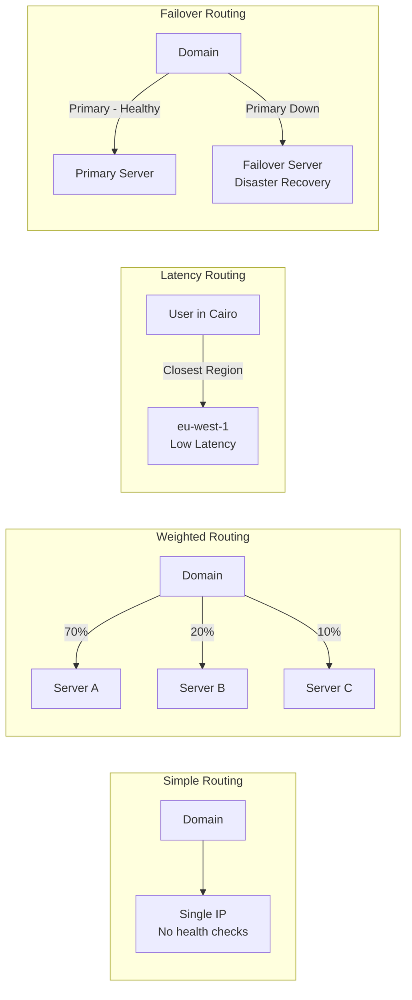

| الـ Policy | متى تستخدمه؟ |
|---|---|
| **Simple** | Server واحد، مش محتاج تعقيد |
| **Weighted** | A/B Testing أو توزيع Traffic بنسب معينة |
| **Latency** | وصّل المستخدم للـ Region الأسرع ليه |
| **Failover** | Disaster Recovery — Primary وBackup |

> [!info] معلومة سريعة: Route 53 Use Cases
> - **Use Case:** DNS management, Routing traffic, Domain registration, Health checks
> - **Pricing Model:** تدفع على الـ Hosted Zones وعدد الـ DNS Queries

---

## 🚀 Amazon CloudFront — CDN الـ AWS

### المشكلة:
> عميلك في أستراليا بيفتح موقعك وصوره (Images) محفوظة على S3 Bucket في us-east-1 (فيرجينيا). كل صورة بتاخد ~300ms بسبب المسافة. مع إن الـ Content ما بيتغيرش كتير. مش ممكن نخزّن الصور أقرب من المستخدم؟

### الحل — CloudFront:

> [!info] معلومة سريعة: CloudFront هو الـ CDN بتاع AWS
> **Content Delivery Network** = شبكة من الـ Cache Servers المنتشرة حول العالم

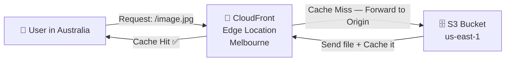

**إزاي بيشتغل:**
1. المستخدم بيطلب صورة
2. CloudFront بيدوّر في الـ Edge Location الأقرب ليه
3. لو الصورة **cached** (Cache Hit) → يرجعها فوراً
4. لو مش موجودة (Cache Miss) → يجيبها من الـ Origin ويخزّنها للـ request القادمة

### مصادر الـ Origin في CloudFront:

| نوع الـ Origin | التفاصيل |
|---|---|
| **S3 Bucket** | لتوزيع الـ Static Files وحمايتها بـ OAC |
| **VPC Origin** | للـ Apps في Private Subnets |
| **Custom Origin (HTTP)** | أي Backend زي ALB أو EC2 |

### CloudFront مقابل S3 Cross Region Replication:

> [!important] ⭐ Exam Focus: CloudFront vs S3 Cross Region Replication

| الخاصية | CloudFront | S3 Cross Region Replication |
|---|---|---|
| **الانتشار** | Global (400+ Edge Locations) | Specific Regions بس |
| **الـ Update** | TTL (يوم مثلاً) — Cached | Near real-time |
| **الاستخدام** | Static content everywhere | Dynamic content — few regions |
| **الوصول** | Read + Write | Read Only |

> [!warning] ⚠️ Common Trap
> CloudFront مش بيحمل Dynamic content بكفاءة. لو عندك محتوى بيتغير كل ثانية (زي live prices) — S3 Cross Region Replication أو Database مناسب أكتر.

### CloudFront — Exam Checklist:
- ✅ **DDoS Protection** — CloudFront بيحمي من الهجمات الموزعة
- ✅ **Integration مع AWS Shield وWAF**
- ✅ **Hundreds of Points of Presence** حول العالم
- ✅ **Improves read performance** بالـ Caching

> [!info] معلومة سريعة: Shared Responsibility — CloudFront
> - **AWS مسؤولة عن:** الـ Global Infrastructure والـ Edge Network
> - **إنت مسؤول عن:** الـ Origin Configuration، الـ Cache Policies، والـ Content

---

## ⚡ S3 Transfer Acceleration

### المشكلة:
> عندك ملفات كبيرة في أمريكا وعايز ترفعها على S3 Bucket في أستراليا. الـ Upload الطبيعي بطيء جداً عبر الإنترنت.

### الحل:

> [!info] معلومة سريعة: S3 Transfer Acceleration
> بدل ما ترفع مباشرة على الـ S3 Bucket:
> 1. بتبعت الملف لأقرب **Edge Location** ليك عبر الإنترنت (Fast)
> 2. الـ Edge Location بتبعته لـ S3 Bucket عبر الـ **AWS Private Network** (Ultra-Fast)

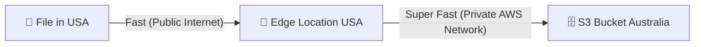

> [!important] ⭐ Exam Focus
> **S3 Transfer Acceleration** = رفع ملفات لـ S3 بسرعة أعلى عبر Edge Locations
> **Use Case:** Uploading large files to S3 from distant locations

---

## 🌐 AWS Global Accelerator

### المشكلة:
> عندك Application على EC2 في us-east-1. مستخدميك في أوروبا وآسيا بيعانوا من Latency عالي. CloudFront مش ينفع هنا عشان الـ Content مش Static (API calls, Gaming, IoT).

### الحل:

> [!info] معلومة سريعة: AWS Global Accelerator
> - بيوفّرلك **2 Static Anycast IPs** لتطبيقك
> - الـ Traffic بيدخل من أقرب **Edge Location**
> - ومن هناك بيتنقل عبر الـ **AWS Private Network** لتطبيقك
> - النتيجة: تحسين ~60% في الـ Performance

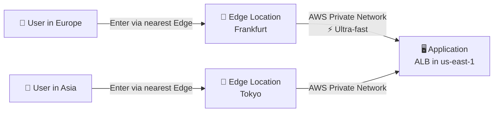

### CloudFront vs Global Accelerator — الفرق الجوهري:

> [!important] ⭐ Exam Focus: الفرق ده بيجي في الامتحان!

| الخاصية | CloudFront | Global Accelerator |
|---|---|---|
| **النوع** | CDN — Content Caching | Network Accelerator — No Caching |
| **الـ Content** | Static (Images, Videos) | Dynamic (APIs, Gaming, IoT) |
| **الـ Protocol** | HTTP/HTTPS | TCP و UDP |
| **الـ IP** | Dynamic | **2 Static Anycast IPs** |
| **DDoS** | ✅ AWS Shield | ✅ AWS Shield |

> [!warning] ⚠️ Common Trap
> **Global Accelerator لا يعمل Caching!** — هو بس بيسرّع الـ routing. لو السؤال عن Static content وتوفير تكلفة → CloudFront. لو عن Gaming/UDP/Static IPs → Global Accelerator.

---

# 🏠 الفصل العاشر: AWS على الأرض — Outposts, WaveLength, Local Zones

## 🖥️ AWS Outposts — AWS في مكانك أنت

### المشكلة:
> بعض الشركات الكبيرة (بنوك، مستشفيات، حكومات) عندها **قوانين صارمة** تمنع أي بياناتها تطلع من مبانيها. بس بيحبوا يستفيدوا من AWS Services. مش قادرين يروحوا Cloud الطبيعي. إيه الحل؟

### الحل:

> [!info] معلومة سريعة: AWS Outposts
> AWS بتجيبلك **Rack فعلي من الـ Servers** وتركّبه في مبناك الأنت — وهو شغّال بنفس الـ AWS APIs وConsole والخدمات!
>
> "AWS في بيتك بالظبط"

**فوايد Outposts:**
- **Low-latency** للـ On-Premises Systems
- **Local data processing** — الداتا ما بتخرجش
- **Data residency** — امتثال قانوني
- **Migration bridge** — خطوة أولى نحو الـ Cloud

**الخدمات اللي بتشتغل على Outposts:**
EC2 — EBS — S3 — EKS — ECS — RDS — EMR

> [!warning] ⚠️ المسؤولية الجديدة في Outposts
> **إنت مسؤول عن الـ Physical Security للـ Rack!** — هو موجود في مبناك. AWS مسؤولة عن الـ Software والإدارة.

---

## 📶 AWS WaveLength — 5G وما أدراك ما 5G

### المشكلة:
> عايز تبني تطبيق **AR/VR** أو **Connected Vehicles** أو **Real-time Gaming** — ده محتاج Latency أقل من 10ms. حتى الـ Edge Locations التقليدية مش بتوصل لده.

### الحل:

> [!info] معلومة سريعة: AWS WaveLength
> AWS بتحط Compute Servers داخل **مراكز بيانات شركات الاتصالات (Telecom)** مباشرة عند حافة الـ **5G Networks**!
>
> يعني الـ Traffic مش بيخرج حتى من شبكة الاتصالات — **Ultra-low latency** حقيقي.

**Use Cases:**
- Smart Cities
- ML-assisted diagnostics (تشخيص طبي فوري)
- Connected Vehicles
- Interactive Live Video Streams
- AR/VR
- Real-time Gaming

---

## 📍 AWS Local Zones — قرّب من المدن الكبيرة

### المشكلة:
> عندك مستخدمين في مدينة كبيرة (زي بوسطن) بعيدة عن أقرب Region (us-east-1 في فيرجينيا). محتاج Latency منخفض ومش محتاج Full Region.

### الحل:

> [!info] معلومة سريعة: AWS Local Zones
> **Extension صغيرة من الـ AWS Region** بتتحط جوه أو قريب من مدن كبيرة. بيدعم EC2، RDS، ECS، EBS، ElastiCache، Direct Connect.
>
> مثال: Region هي us-east-1 (N. Virginia)، Local Zones في: Boston, Chicago, Dallas, Houston, Miami

**الفرق بين WaveLength وLocal Zones:**

| | WaveLength | Local Zones |
|---|---|---|
| **موجودة في** | مراكز بيانات الـ Telecom | مدن كبيرة |
| **الاتصال** | عبر 5G | عبر الإنترنت العادي |
| **الـ Latency** | Single-digit ms (ميللي ثانية منخفضة جداً) | Low but not as extreme |
| **الـ Use Case** | 5G Apps, AR/VR, Gaming | Latency-sensitive apps for specific cities |

---

## 🗺️ Global Application Architectures

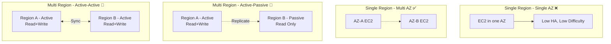

| Architecture | الـ HA | الـ Latency | الصعوبة |
|---|---|---|---|
| Single Region, Single AZ | ❌ | ⚠️ | ⭐ |
| Single Region, Multi AZ | ✅ | ⚠️ | ⭐⭐ |
| Multi Region, Active-Passive | ✅✅ | Global Reads OK | ⭐⭐⭐ |
| Multi Region, Active-Active | ✅✅✅ | Global Reads+Writes OK | ⭐⭐⭐⭐ |

---

# 🏛️ الفصل الحادي عشر: AWS Well-Architected Framework

## الإطار الذهبي لبناء أي شيء على AWS

> [!example] السيناريو: هندسة البناء في الـ Cloud
> تخيل إنك مهندس بناء — مش بتبني عشوائي. عندك كود هندسي ومعايير. AWS Well-Architected Framework هو **كود البناء الرسمي** لـ AWS — الـ 6 ركائز اللي أي معمار صح لازم يتحقق فيها.

### الـ General Guiding Principles:

1. **Stop guessing capacity** — استخدم Auto Scaling
2. **Test at production scale** — مش على بيئة اختبار فقط
3. **Automate** — اعمل Serverless وInfrastructure as Code
4. **Allow evolutionary architectures** — صمّم للتغيير
5. **Drive with data** — قرارات على أساس Metrics
6. **Improve through Game Days** — اختبر بـ simulated disasters

### AWS Cloud Design Principles:

| المبدأ | المعنى |
|---|---|
| **Scalability** | Vertical (أقوى) و Horizontal (أكتر) |
| **Disposable Resources** | الـ Servers ممكن تترمي وتتعمل من أول |
| **Automation** | Serverless, IaC, Auto Scaling |
| **Loose Coupling** | كسّر الـ Monolith لـ Microservices |
| **Services not Servers** | استخدم Managed Services مش EC2 بس |

---

## 🏛️ الـ 6 Pillars — الأعمدة الستة

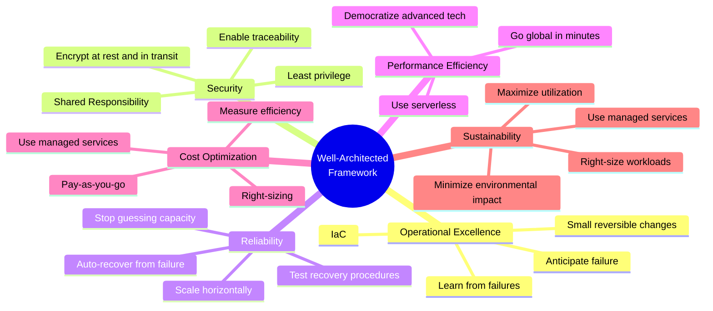

---

### 1️⃣ Operational Excellence — التشغيل الممتاز

> [!info] معلومة سريعة: Operational Excellence
> **التعريف:** القدرة على تشغيل ومراقبة الأنظمة وتحسينها باستمرار

**Design Principles:**
- Perform operations **as code** — Infrastructure as Code
- Make **frequent, small, reversible changes** — عشان لو حاجة بانظت تقدر ترجع
- **Anticipate failure** — فكر في الأسوأ قبل ما يحصل
- **Learn from all operational failures** — كل بانظة = درس

**AWS Services:**
- **Prepare:** CloudFormation, Config
- **Operate:** CloudFormation, Config, CloudTrail, CloudWatch
- **Evolve:** CodeCommit, CodeBuild, CodeDeploy, CodePipeline, X-Ray

---

### 2️⃣ Security — الأمان

> [!info] معلومة سريعة: Security Pillar
> **التعريف:** حماية المعلومات والأنظمة والـ Assets مع إدارة المخاطر

**Design Principles:**
- **Strong identity foundation** — Least Privilege + IAM
- **Enable traceability** — Logs + Metrics + Alerts
- **Security at all layers** — Edge, VPC, Subnet, Instance, OS, App
- **Protect data in transit and at rest** — Encryption كل حتة
- **Keep people away from data** — Automation بدل Manual Access

**AWS Services:**
- **Identity:** IAM, STS, MFA, Organizations
- **Detective Controls:** Config, CloudTrail, CloudWatch
- **Infrastructure Protection:** CloudFront, VPC, Shield, WAF, Inspector
- **Data Protection:** KMS, S3, EBS, RDS
- **Incident Response:** CloudWatch Events

---

### 3️⃣ Reliability — الموثوقية

> [!info] معلومة سريعة: Reliability Pillar
> **التعريف:** القدرة على التعافي من الأعطال وتلبية الطلب

**Design Principles:**
- **Test recovery procedures** — Simulate failures
- **Auto-recover from failure** — Automatic, not manual
- **Scale horizontally** — Add more small servers, not one big one
- **Stop guessing capacity** — Auto Scaling
- **Manage change via automation**

**AWS Services:** IAM, VPC, Service Quotas, Trusted Advisor, Auto Scaling, CloudWatch, CloudTrail, Config, CloudFormation, S3, S3 Glacier, Route 53

---

### 4️⃣ Performance Efficiency — كفاءة الأداء

> [!info] معلومة سريعة: Performance Efficiency
> **التعريف:** استخدام الـ Computing Resources بكفاءة وتحسينها مع الوقت

**Design Principles:**
- **Democratize advanced tech** — استخدم ML وAdvanced DBs كـ Managed Services
- **Go global in minutes** — Deploy في كل Regions بسهولة
- **Use serverless** — مش محتاج تدير Servers
- **Experiment more often** — A/B Testing بتكلفة زهيدة
- **Mechanical sympathy** — اعرف كل AWS Services

**AWS Services:** Auto Scaling, Lambda, EBS, S3, CloudFormation, CloudWatch, ElastiCache, Snowball, CloudFront, RDS

---

### 5️⃣ Cost Optimization — تحسين التكلفة

> [!info] معلومة سريعة: Cost Optimization
> **التعريف:** تشغيل الأنظمة بأقل سعر ممكن مع تحقيق متطلبات الأعمال

**Design Principles:**
- **Adopt consumption mode** — Pay for what you use only
- **Measure efficiency** — CloudWatch
- **Stop spending on Data Center ops**
- **Analyze & attribute expenditure** — Tags على كل resource
- **Use managed services** — أرخص من بناء الحاجة من الصفر

**AWS Services:**
- **Expenditure Awareness:** Budgets, Cost & Usage Report, Cost Explorer
- **Cost-Effective Resources:** Spot Instances, Reserved Instances, S3 Glacier
- **Matching supply/demand:** Auto Scaling
- **Optimizing Over Time:** Trusted Advisor, Cost & Usage Report, Lambda

---

### 6️⃣ Sustainability — الاستدامة

> [!info] معلومة سريعة: Sustainability Pillar (أضيف 2021)
> **التعريف:** تقليل الأثر البيئي لتشغيل الـ Cloud Workloads

**Design Principles:**
- **Understand your impact** — قيس Carbon Footprint
- **Maximize utilization** — Right-size كل workload
- **Use managed services** — Shared resources = أقل Carbon
- **Reduce downstream impact** — خليّ مستخدميك ما محتاجوش يغيروا أجهزتهم

**AWS Services:**
- EC2 Auto Scaling, Lambda, Fargate (لتشغيل فقط لما في طلب)
- Cost Explorer, Graviton2 Processors (أكفأ طاقوياً)
- EFS-IA, S3 Glacier, EBS Cold HDD (Cold Storage لتوفير الطاقة)
- S3 Lifecycle Configurations, S3 Intelligent Tiering
- RDS Read Replicas, Aurora Global DB, DynamoDB Global Tables, CloudFront

---

## 🔧 AWS Well-Architected Tool

> [!info] معلومة سريعة: Well-Architected Tool
> - **مجاني** — بتقدر تستخدمه من الـ Console
> - بتختار الـ Workload وبتجاوب على أسئلة
> - بيراجع إجاباتك على الـ 6 Pillars
> - بيعمل Report وبيقولك فين الـ gaps

---

## 🌿 AWS Customer Carbon Footprint Tool

> [!info] معلومة سريعة: Carbon Footprint Tool
> - بيتتبع Carbon Emissions من استخدامك لـ AWS
> - بيعرضها over time وبالـ geography وبالـ service
> - بيساعدك تحقق أهداف الـ Sustainability بتاعتك

---

# 🗺️ الفصل الثاني عشر: AWS Cloud Adoption Framework (CAF)

## الدليل الشامل للتحول الرقمي

> [!example] السيناريو: شركة مصرية عايزة تتحول لـ Cloud
> تخيل إن بنك كبير زي البنك الأهلي قرر يحوّل كل أنظمته لـ AWS. الموضوع مش بس تقني — في ناس محتاجة تتدرب، في عمليات محتاجة تتغير، في قوانين محتاجة تتراعى. **AWS CAF** هو الخريطة اللي بتوجّهك في الرحلة دي كلها.

### ما هو الـ CAF؟

> [!info] معلومة سريعة: AWS Cloud Adoption Framework
> - **CAF** = خطة شاملة للتحول الرقمي عبر AWS
> - بيحدد **Organizational Capabilities** المطلوبة للنجاح
> - بني من خبرات **آلاف العملاء** حول العالم
> - بينظّم القدرات في **6 Perspectives** (مناظير)

---

## 🔭 الـ 6 CAF Perspectives

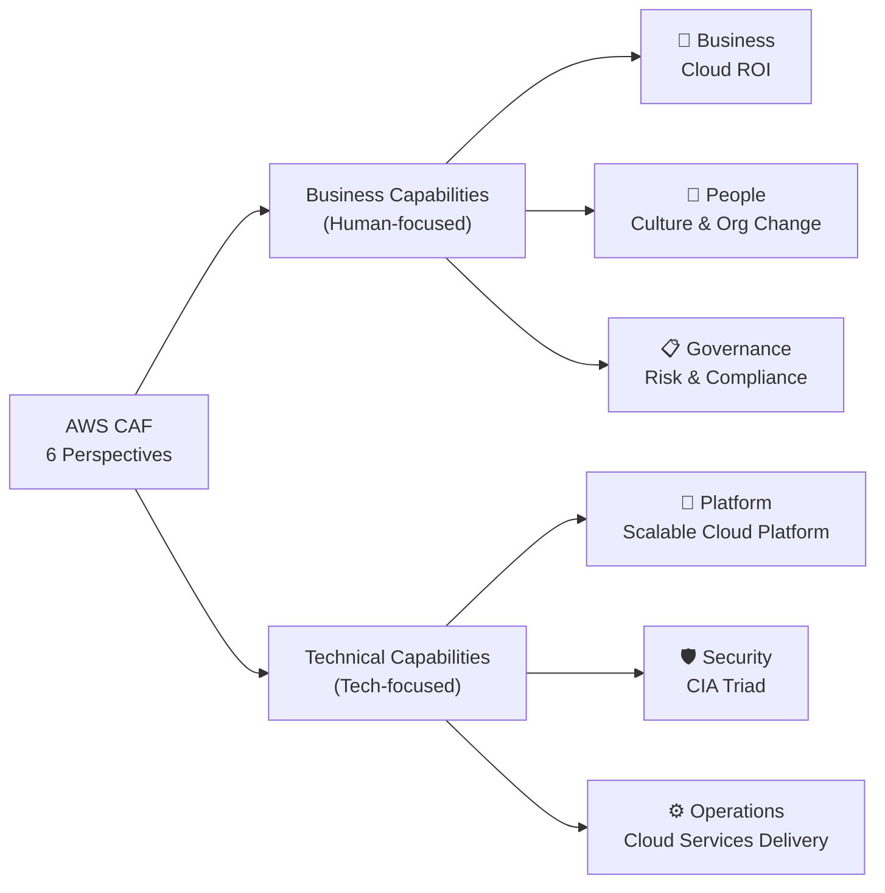

| الـ Perspective | الفئة | التركيز |
|---|---|---|
| **Business** | Business | التأكد إن الـ Cloud يحقق ROI وأهداف الأعمال |
| **People** | Business | التغيير الثقافي والهيكل التنظيمي والقيادة |
| **Governance** | Business | إدارة المخاطر والامتثال وتعظيم فوائد الـ Cloud |
| **Platform** | Technical | بناء Cloud Platform قابل للتوسع وتحديث الأنظمة |
| **Security** | Technical | تحقيق الـ Confidentiality, Integrity, Availability |
| **Operations** | Technical | ضمان تقديم الخدمات بمستوى يلبي احتياجات الأعمال |

> [!important] ⭐ Exam Focus: Business vs Technical Capabilities
> - **Business Capabilities:** Business, People, Governance
> - **Technical Capabilities:** Platform, Security, Operations

---

## 🚀 Transformation Domains — 4 مجالات التحول

| الـ Domain | المعنى |
|---|---|
| **Technology** | Migrate وModernize الـ Legacy Infrastructure والتطبيقات |
| **Process** | رقمنة وأتمتة وتحسين العمليات — ML للـ Customer Service |
| **Organization** | إعادة هيكلة الفرق حول المنتجات، Agile Methods |
| **Product** | إعادة تخيّل نموذج الأعمال وإنشاء Value Propositions جديدة |

---

## 📅 Transformation Phases — 4 مراحل التنفيذ

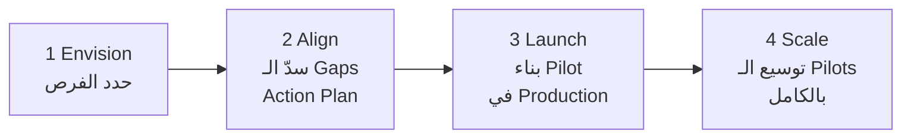

> [!important] ⭐ Exam Focus: الـ 4 Phases
> - **Envision** — إيه اللي Cloud هيحقهولك؟ الفرص؟
> - **Align** — فين الـ Gaps في الـ 6 Perspectives؟ عمل Action Plan
> - **Launch** — بناء وتوصيل Pilot Initiatives في Production
> - **Scale** — توسيع الـ Pilots لـ Full Scale مع تحقيق الفوائد

---

# 📏 الفصل الثالث عشر: AWS Right Sizing

> [!info] معلومة سريعة: Right Sizing
> **Right Sizing** = اختيار الـ Instance Type والـ Size الأنسب لـ workload بأقل تكلفة ممكنة

**المبدأ الذهبي:**
> "ابدأ صغير — الـ Cloud Elastic وتقدر تكبّر" أسهل بكتير من إنك تبدأ كبير وتحاول تصغّر.

**مراحل الـ Right Sizing:**
1. **قبل الـ Migration** — قيّس الاستخدام الفعلي وختار السايز المناسب
2. **بعد الـ Migration باستمرار** — المتطلبات بتتغير مع الوقت

**الأدوات اللي بتساعد في الـ Right Sizing:**
- **CloudWatch** — مراقبة الـ CPU/Memory Utilization
- **Cost Explorer** — تحليل التكلفة واقتراح توفيرات
- **Trusted Advisor** — توصيات جاهزة
- **3rd Party Tools**

---

# 🌐 الفصل الرابع عشر: AWS Ecosystem

## كل الأدوات المحيطة بـ AWS

---

## 📚 Free Resources

- **AWS Blogs** — آخر أخبار وخدمات AWS
- **AWS Forums/re:Post** — مجتمع للأسئلة والأجوبة
- **AWS Whitepapers & Guides** — الوثائق الرسمية العميقة
- **AWS Solutions Library** — حلول جاهزة وMoodeled

---

## 🎧 AWS Support Plans

> [!important] ⭐ Exam Focus: Support Plans — هيجي في الامتحان!

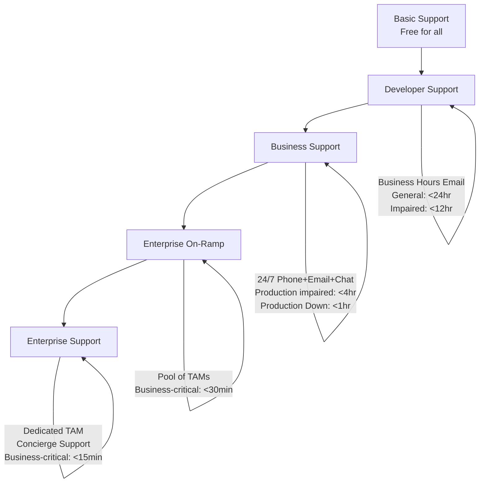

| الـ Plan | السعر | الـ Response Time المميز | الميزة الكبرى |
|---|---|---|---|
| **Basic** | مجاني | - | Documentation + Community |
| **Developer** | ~$29/شهر | General: <24hr | Business Hours Email |
| **Business** | ~$100/شهر+ | Production Down: **<1 hour** | 24/7 Phone + Chat |
| **Enterprise On-Ramp** | ~$5,500/شهر+ | Business-critical: **<30 min** | Pool of TAMs |
| **Enterprise** | ~$15,000/شهر+ | Business-critical: **<15 min** | Dedicated **TAM** + Concierge |

> [!important] ⭐ Exam Focus: TAM
> **TAM = Technical Account Manager** — موجود بس في Enterprise Support Plans. بيبقى زي مستشارك الشخصي من AWS.

> [!warning] ⚠️ Common Trap: Response Times
> - Business Down في **Business Plan** = **< 1 Hour**
> - Business Critical في **Enterprise** = **< 15 Minutes**
> - الامتحان بيسألك تطابق الـ scenario مع الـ Plan المناسب

---

## 🛒 AWS Marketplace

> [!info] معلومة سريعة: AWS Marketplace
> - **Catalog رقمي** بآلاف الحلول من Independent Software Vendors (ISV)
> - بتلاقي فيه: Custom AMIs، CloudFormation Templates، SaaS، Containers
> - اشتريت حاجة منه؟ بيتحسب في **AWS Bill بتاعك مباشرة**
> - تقدر أنت كمان **تبيع** حلولك عليه

**Use Case:** محتاج Firewall Software جاهزة؟ روح AWS Marketplace وادفع مباشرة من AWS Bill.

---

## 🎓 AWS Training

| نوع التدريب | التفاصيل |
|---|---|
| **AWS Digital Training** | أونلاين مجاني |
| **AWS Classroom Training** | حضوري أو Virtual |
| **AWS Private Training** | لشركتك بالكامل |
| **AWS Academy** | للجامعات (للطلاب!) |
| **AWS Training for Gov** | للحكومات الأمريكية |

---

## 🤝 AWS Professional Services & Partner Network (APN)

> [!info] معلومة سريعة: APN
> - **AWS Professional Services** = فريق AWS نفسه بيشتغل معاك
> - **APN Technology Partners** = Hardware, Connectivity, Software vendors
> - **APN Consulting Partners** = شركات استشارية تساعدك تبني على AWS
> - **APN Training Partners** = بيساعدوك تتعلم AWS

---

## 💬 AWS re:Post

> [!info] معلومة سريعة: AWS re:Post
> - بديل الـ **AWS Forums** القديمة
> - Community-driven Q&A — زي Stack Overflow بس لـ AWS
> - Members بيكسبوا **Reputation Points** بالإجابات الصح
> - لو سؤالك مش اتجاوب من المجتمع → بيتنقل لـ **AWS Support Engineers**
> - **مش للأسئلة الحساسة أو العاجلة** — ده community مش support رسمي

---

## 🔗 AWS IQ

> [!info] معلومة سريعة: AWS IQ
> - بتلاقي **AWS Certified Freelancers** لمشاريعك على AWS
> - **للعملاء:** Submit Request → Review Responses → Select Expert → Work Securely → Pay per Milestone
> - **للخبراء:** Create Profile → Connect with Customers → Start Proposal → Get Paid
> - الدفع بيتحسب في **AWS Bill بتاعك**

---

## 🛡️ AWS Managed Services (AMS)

> [!info] معلومة سريعة: AMS
> AWS بتدير **Infrastructure والـ Operations** بالكامل عنك.
>
> - **24/365** operations
> - بيتكفل بـ: Change requests, Monitoring, Patch management, Security, Backup
> - بيطبّق **Best Practices** تلقائياً
> - **هدفه:** تقليل الـ Operational Overhead وتمكينك تركّز على Business

**الفوائد:**
- Improved Security
- Stronger Compliance
- Reduced Operating Costs
- Simplified Management
- Frictionless Innovation

> [!important] ⭐ Exam Focus: متى تستخدم AMS؟
> لما الشركة مش عندها فريق AWS محترف — AMS بتعوّض ده بفريق AWS نفسه.

---

# 📋 Interview/Exam Checkpoint — اختبر نفسك!

## 🧩 Q&A Format

**Q1: إيه الفرق بين Scalability وElasticity؟**
> **A:** Scalability = القدرة على التكيّف مع حمل أكبر (Scale Up/Out). Elasticity = القدرة على الـ Scale تلقائياً وحسب الطلب الفعلي (Scale Up AND Down automatically).

**Q2: ليه تختار Private Cloud على Public Cloud؟**
> **A:** للأمان والـ Compliance على البيانات الحساسة، والتحكم الكامل في الـ Infrastructure.

**Q3: إيه الفرق بين IaaS وPaaS وSaaS في سياق AWS؟**
> **A:** IaaS (EC2) = إنت بتدير OS وApp. PaaS (Elastic Beanstalk) = بترمي Code وهو يتكفل بالباقي. SaaS (Rekognition) = بتستدعي API وبس.

**Q4: إيه الـ 5 Characteristics للـ Cloud؟**
> **A:** On-demand self service, Broad network access, Multi-tenancy & Resource Pooling, Rapid elasticity, Measured service.

**Q5: إيه الفرق بين CloudFront وGlobal Accelerator؟**
> **A:** CloudFront = CDN للـ Static content بـ Caching. Global Accelerator = Network Accelerator للـ Dynamic content/TCP/UDP بـ Static IPs ومن غير Caching.

**Q6: مين مسؤول عن Patching الـ OS في EC2؟**
> **A:** العميل (أنت) — ده في جانبك من الـ Shared Responsibility Model.

**Q7: إيه الـ 6 Pillars للـ Well-Architected Framework؟**
> **A:** Operational Excellence, Security, Reliability, Performance Efficiency, Cost Optimization, Sustainability.

**Q8: متى تستخدم AWS Outposts؟**
> **A:** لما عندك Data Residency requirements أو Low Latency للـ On-Premises systems أو Legal/Regulatory constraints تمنع البيانات من الخروج.

**Q9: إيه الـ 6 CAF Perspectives؟**
> **A:** Business, People, Governance (Business Capabilities) + Platform, Security, Operations (Technical Capabilities).

**Q10: إيه Response Time لـ Business Plan لما Production system down؟**
> **A:** Less than **1 hour**.

---

# 🫒 زتونة الامتحان — Top Guaranteed Exam Points

> [!important] ⭐ الـ 5 زتونات المضمونة في Domain 1

**1️⃣ التعريف الكامل للـ Cloud Computing:**
> "On-demand delivery of IT resources with pay-as-you-go pricing" — الامتحان بيسأل عن التعريف ده أو عن خصائصه الـ 5 (On-demand, Broad access, Multi-tenancy, Elasticity, Measured service)

**2️⃣ الـ 6 Advantages — خصوصاً CAPEX vs OPEX:**
> تعرف الفرق بين CAPEX (Capital Expense — شراء Hardware) وOPEX (Operational Expense — Pay-as-you-go). الـ Cloud بتحوّل CAPEX لـ OPEX. وKPI مهم = TCO (Total Cost of Ownership).

**3️⃣ الـ Shared Responsibility Model:**
> **AWS = Security OF the Cloud** (Physical, Hypervisor, Network Hardware)
> **Customer = Security IN the Cloud** (OS في EC2، Data، IAM، App Security)
> في Managed Services (زي RDS) AWS بتتحمل أكتر.

**4️⃣ CloudFront vs Global Accelerator:**
> CloudFront = Static Content + Caching. Global Accelerator = Dynamic + TCP/UDP + Static IPs + No Caching.
> كلاهم بيستخدموا Edge Locations وكلاهم مع AWS Shield.

**5️⃣ الـ 6 Pillars + Support Plans:**
> Operational Excellence, Security, Reliability, Performance Efficiency, Cost Optimization, Sustainability.
> Business Support = Production Down في < 1hr. Enterprise = < 15min + Dedicated TAM.

---

> [!info] 🎉 انتهى Domain 1 — Cloud Concepts
> ده كان الأساس اللي كل حاجة تانية في AWS مبنية عليه. فهمت إزاي AWS نشأت، إيه الـ Value بتاعتها، وإزاي Infrastructure العالمي بتاعها بيشتغل.
>
> **Domain 2 جاي — Cloud Technology & Services (33%)!** خلي نفسك عشان ده الـ Domain الأتقل.

[الرحلة لسه مخلصتش.. قولي "كمل" عشان أكمل من نفس المكان]
