# 🌩️ AWS CLF-C02 — Domain 1: Cloud Concepts (24%)
### بقلم: Senior AWS Solutions Architect & Master Tech Storyteller
---

> **هات كوباية الشاي يا هندسة.. ويلا نفهم AWS صح!** ☕
>
> الـ Domain ده هو قلب الامتحان — 24% من الأسئلة. يعني كل 4 أسئلة، سؤال واحد من هنا. مش هنحفظ، هنفهم. ومش هنفهم بس، هنحكي قصة. تعالى أحكيلك الحكاية من الأول!

---

## 🗺️ Mindmap — Domain 1 Overview

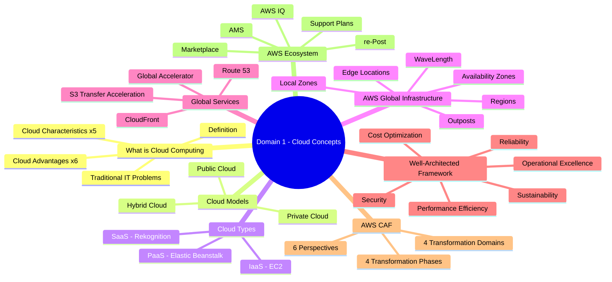

---

## ☁️ الفصل الأول: ما هو الـ Cloud Computing؟

### 🎬 المشكلة — تخيل معايا السيناريو ده

تخيل معايا إنك عندك شركة ناشئة في مصر، عملت App كويس بيبيعوا منتجات هدايا أون لاين. كل حاجة تمام. وفجأة جه إعلان على Facebook وطار الـ App! في يوم العيد، 100,000 مستخدم حاولوا يدخلوا في نفس الوقت.

إيه اللي بيحصل؟

**الـ Server وقع.** مش لأن الـ app بايظ، لأن الـ hardware مش قادر يتحمل. وأنت كنت شاري Server بـ 50 ألف جنيه، حاطه في أوضة في الشركة، مفيش تبريد كافي، والـ IT Engineer بياخد إجازة في العيد! 😅

ده بالظبط هو مشكلة الـ Traditional IT.

---

### 🔥 المشاكل الكلاسيكية مع الـ Infrastructure التقليدية

```
❌ المشاكل الكلاسيكية:
┌─────────────────────────────────────────────────────┐
│ 1. فلوس الإيجار — Data Center محتاج مكان          │
│ 2. الكهرباء والتبريد — الـ Servers بتشتغل 24/7    │
│ 3. الـ Scaling محدود — لازم تشتري Hardware جديد  │
│ 4. فريق 24/7 — Monitoring مش نايم                  │
│ 5. الكوارث — حريق؟ زلزال؟ انقطاع كهرباء؟         │
│ 6. وقت طويل — إضافة Server بياخد أسابيع           │
└─────────────────────────────────────────────────────┘
```

> **بمعنى آخر:** أنت بتدفع كتير عشان تتملك حاجة مش بتستخدمها بالكامل طول الوقت. زي ما تشتري أوتوبيس 50 كرسي عشان كل يوم تروح الشغل لوحدك!

---

### ✅ الحل — Cloud Computing

هنا بيتدخل الـ AWS عشان ينقذ الموقف!

**الـ Cloud Computing** هو ببساطة:

> "الـ **On-Demand Delivery** بتاع Compute Power، Database Storage، Applications، وأي IT resources تانية — عن طريق الـ Internet بنظام **Pay-as-you-go**"

يعني إيه بالعربي؟

- **On-Demand:** متاح في أي وقت زي ما تطلب
- **Pay-as-you-go:** بتدفع بس على اللي بتستخدمه، زي بالظبط الـ Meter بتاع الكهرباء في بيتك!
- **Scalable:** لما جا العيد وجه 100,000 مستخدم، الـ Cloud بيوسع تلقائياً، ولما العيد يخلص يرجع تاني

**تخيل معايا:** AWS عندها Data Centers ضخمة جداً في كل أنحاء العالم. أنت بتستأجر جزء صغير منها بالساعة أو بالثانية. مش بتشتري Hardware، بتشتري وقت ومساحة!

---

### 🧱 ما هو تكوين الـ Server؟

قبل ما ندخل في الـ Cloud، لازم نفهم إيه اللي بيكونه الـ Server:

```
Server = مكونات الـ IT الأساسية:
┌────────────────────────────────────┐
│  🧠 Compute = CPU                  │
│  💾 Memory = RAM                   │
│  📀 Storage = Hard Disk            │
│  🗄️ Database = Structured Storage  │
│  🌐 Network = Routers, Switch, DNS │
└────────────────────────────────────┘
```

**اللي بيحصل هنا على الـ Internet:**

```
Client (أنت)          Network            Server
┌───────────┐    ──────────────────→    ┌──────────┐
│ IP Address │   HTTP Request           │ IP Address│
│           │   ←──────────────────    │          │
└───────────┘   HTTP Response           └──────────┘
```

زي بالظبط لما بتبعت خطاب — بتكتب عنوانك (IP أنت) وعنوان المستلم (IP السيرفر)، والـ Router هو بتاع البريد اللي بيوصل الخطاب!

---

### ⭐ CLF-C02 Exam Focus — تعريف الـ Cloud Computing

> ⭐ الامتحان بيسأل: **"What is Cloud Computing?"**
> الإجابة الصح دايماً: **"On-demand delivery of IT resources with pay-as-you-go pricing"**

---

## ☁️ الفصل الثاني: نماذج الـ Cloud (Deployment Models)

### 🏛️ القصة — مش كل Cloud زي بعض!

تعالى أحكيلك قصة ثلاث شركات مصرية مختلفة:

**شركة أولى — بنك مصري كبير:** عنده بيانات حساسة جداً، محتاج يتحكم في كل حاجة، ومش هيعدي بيانات العملاء على Internet عام. → **Private Cloud**

**شركة تانية — Startup ناشئة:** مش عندها فلوس تشتري Servers، محتاجة تبدأ بسرعة، والـ Traffic مش ثابت. → **Public Cloud**

**شركة تالتة — شركة هايبريد:** عندها Legacy Systems قديمة مش هتنقلها على Cloud بسهولة، بس عايزة تاخد مميزات الـ Cloud في باقي الأنظمة. → **Hybrid Cloud**

---

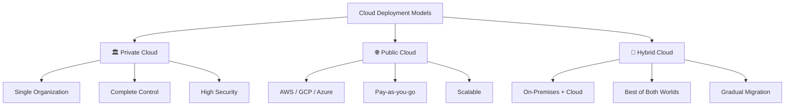

---

| | Private Cloud 🏛️ | Public Cloud 🌐 | Hybrid Cloud 🔄 |
|---|---|---|---|
| **المالك** | المنظمة نفسها | Provider زي AWS | الاثنين |
| **التحكم** | كامل | محدود | متوسط |
| **الأمان** | أعلى | عالي بس مش 100% | يعتمد |
| **التكلفة** | عالية (CapEx) | منخفضة (OpEx) | متوسطة |
| **المثال** | OpenStack في بنك | AWS، EC2 | AWS + On-Premises |
| **⭐ في الامتحان** | Organization فقط | Third-party provider | Keep some on-premises |

> ⭐ **الامتحان بيحب السؤال ده:** "A company wants to keep sensitive data on-premises but leverage the cloud for other workloads" = **Hybrid Cloud**

---

## ☁️ الفصل الثالث: الـ 5 خصائص الأساسية للـ Cloud

### 🎯 الـ NIST Definition — الخمس Characteristics

تخيل إنك فتحت مطعم كشري وعايز تعمله Franchise. الـ Cloud Computing بالنسبة للـ IT زي الـ Franchise بالنسبة للأكل!

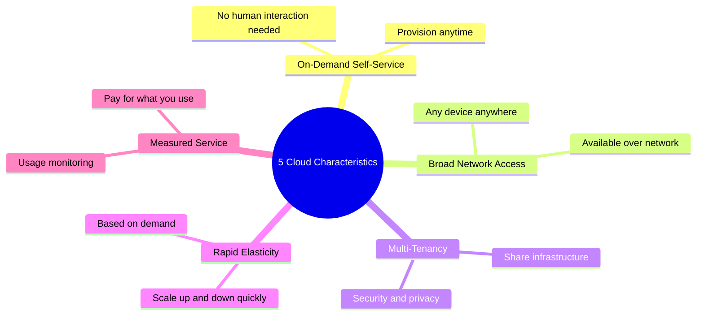

---

### 1. 🖥️ On-Demand Self-Service

**القصة:** تخيل معايا إنك دخلت على AWS Console الساعة 3 الصبح، عايز تشغل Server جديد — مفيش حاجة تمنعك! مفيش حد محتاج توافق، مفيش ورق بيروقراطي، مفيش Call Center.

**الـ AWS بيقولك:** روح لوحدك، اعمل اللي انت عايزه!

```
المستخدم → AWS Console → Server شغال خلال دقائق ✅
(مفيش انتظار لموافقة إنساني)
```

---

### 2. 🌐 Broad Network Access

الـ Resources متاحة عن طريق الـ Network وتقدر توصلها من أي Device — Laptop، Mobile، Tablet. المهم عندك Internet.

**المثال المصري:** زي بالظبط الـ Mobile Banking — تقدر تعمل تحويل من أي مكان، من أي موبايل، في أي وقت.

---

### 3. 👥 Multi-Tenancy & Resource Pooling

**اللي بيحصل هنا هو ده بالظبط اللي بيخلي AWS رخيص!**

تخيل عمارة فيها 100 شقة. كل شقة بتدفع حصتها من الكهرباء والمياه والأمن. مش كل واحد لازم يبني عمارة لوحده!

بالظبط كده AWS — آلاف الشركات بتشارك نفس الـ Physical Infrastructure، بس كل واحد مش شايف التاني (Security & Isolation).

> ⚠️ **انتبه:** مشاركة الـ Infrastructure مش معناها مشاركة البيانات! كل Customer معزول تماماً.

---

### 4. ⚡ Rapid Elasticity & Scalability

ده النجمة الحقيقية في الكلام! 

**القصة:** شركة بتبيع ملابس أون لاين. في يوم الجمعة البيضاء (Black Friday)، الـ Traffic بيزيد 10 أضعاف. مع الـ Traditional IT = الموقع بيوقع. مع الـ Cloud = الـ AWS تلقائياً بيضيف Servers، ولما اليوم يخلص يشيلهم تاني.

```
Normal Day:     [Server] [Server]
Black Friday:   [Server] [Server] [Server] [Server] [Server] [Server] [Server] [Server]
After BF:       [Server] [Server]

كل ده بيحصل تلقائياً! ✅
```

---

### 5. 📊 Measured Service

بتدفع على اللي استخدمته بس. زي بالظبط عداد الكهرباء — مش بتدفع للكهرباء الموجودة في الشبكة، بتدفع على اللي استخدمته انت بالفعل.

> ⭐ **الامتحان بيسأل:** "Which characteristic allows you to pay only for what you use?" = **Measured Service**

---

## ☁️ الفصل الرابع: الـ 6 مزايا الـ Cloud Computing

### 🏆 الـ Six Advantages — حفظهم كده!

```
The 6 Advantages of Cloud Computing:

1. Trade CapEx for OpEx        → مش بتشتري Hardware، بتدفع شهري
2. Massive Economies of Scale  → AWS أرخص منك لأنه بيشتري ملايين
3. Stop Guessing Capacity      → Scale on demand, مش Guess
4. Increase Speed & Agility    → بدل سنين، بتبدأ في دقايق
5. Stop Spending on DC         → AWS بيهتم بالـ Data Center
6. Go Global in Minutes        → Deploy في أي مكان في العالم فوراً
```

---

### 💰 1. Trade CapEx for OpEx

**CapEx (Capital Expenditure):** مصاريف رأس مال — زي ما تشتري أرض وتبني عمارة.

**OpEx (Operational Expenditure):** مصاريف تشغيل — زي ما تستأجر شقة وتدفع إيجار شهري.

**المثال:** شركة زي Vodafone لو عايزة تعمل Infrastructure من الصفر ممكن تصرف مليار. أو تروح على AWS وتبدأ بـ $100 في الشهر وتكبر على حسب الاحتياج!

**نتيجة ده:** انخفاض الـ TCO (Total Cost of Ownership) بشكل كبير.

---

### 📈 2. Benefit from Massive Economies of Scale

**اللي بيحصل هنا:** AWS بتشتري ملايين الـ Servers في نفس الوقت. لما حاجة بتتشترى بالكميلات دي، السعر بينزل. وبكده AWS بتقدر تقدملك Servers برخص يصعب تلاقيه لو بتشتري لوحدك.

**المثال المصري:** زي سوق الجملة في العتبة. لو روحت لوحدك هتشتري كيلو بـ 100 جنيه. بس لو روحت مع ألف تاجر هتلاقي الكيلو بـ 30 جنيه! AWS بيوفر لك سعر الجملة ده.

---

### 🎯 3. Stop Guessing Capacity

**المشكلة التقليدية:** "هنحتاج كام Server السنة الجاية؟" — لو اشتريت قليل، الـ Service بتوقع. لو اشتريت كتير، بتدفع على حاجة مش بتستخدمها.

**الحل:** مع الـ Cloud، بتبدأ بصغير وتكبر على حسب الطلب الفعلي. مش Guessing، Data-Driven Scaling!

---

### 🚀 4. Increase Speed & Agility

تخيل إنك عايز تعمل تجربة جديدة — Feature جديدة. في الـ Traditional IT لازم تطلب Hardware، تنتظر أسابيع، تركب، تشغل... بعد شهر تلاقي الفكرة مش مجدية!

في الـ Cloud: بتعمل بيئة جديدة في دقايق، بتجرب، لو مش كويسة بتحذفها، مش خسرت غير وقت تجربة بسيط.

---

### 🏗️ 5. Stop Spending Money Running & Maintaining Data Centers

أنت شركة Software، مش شركة IT Infrastructure! خلي AWS يهتم بالكابلات والتبريد والأمن الجسدي وانقطاع الكهرباء — وانت تركز على Product بتاعك اللي بيجيب الفلوس!

---

### 🌍 6. Go Global in Minutes

⭐ **ده من أهم النقط في الامتحان!**

تخيل إن Startup مصرية عايزة تفتح لها presence في أمريكا واليابان وأستراليا. في الـ Traditional IT = شهور وملايين. في الـ AWS = بتختار Region وبتـ Deploy بالضغط على زرار!

---

## ☁️ الفصل الخامس: أنواع الـ Cloud (IaaS, PaaS, SaaS)

### 🏗️ القصة — Pizza as a Service!

```
المقارنة الشهيرة:

                Made at Home  | Takeout    | Restaurant  | Catering
Applications       أنت         أنت          Provider       Provider
Data               أنت         أنت          Provider       Provider
Runtime            أنت         أنت          Provider       Provider
Middleware         أنت         أنت          Provider       Provider
O/S                أنت         أنت          Provider       Provider
Virtualization     أنت         Provider     Provider       Provider
Servers            أنت         Provider     Provider       Provider
Storage            أنت         Provider     Provider       Provider
Networking         أنت         Provider     Provider       Provider

                On-Premises    IaaS         PaaS           SaaS
```

---

### 1. 🖥️ IaaS — Infrastructure as a Service

**ما هو:** أعلى مستوى من الـ Flexibility. AWS بيديك الـ Hardware، وانت بتهتم بكل حاجة فوقيه.

**المثال الأرضي:** زي إنك استأجرت أرض فاضية — انت اللي بتبني عليها وتزود وتديرها.

**AWS Example:** `Amazon EC2`

**امتى تستخدمه ✅:**
- عندك تحكم كامل في الـ OS والـ Runtime
- محتاج تشغل Legacy Applications
- عندك Sysadmin team قادر يدير الـ Servers

**امتى ماتستخدمهوش ⚠️:**
- مش عندك خبرة في إدارة Servers
- عايز تركز على Code بس مش على Infrastructure

---

### 2. 🛠️ PaaS — Platform as a Service

**ما هو:** AWS بيهتم بكل الـ Infrastructure، وانت بتحط Code بس وبترجع.

**المثال الأرضي:** زي إنك استأجرت محل جاهز بالكهرباء والمياه — بس تجيب بضاعتك وتبيع.

**AWS Example:** `AWS Elastic Beanstalk`

**امتى تستخدمه ✅:**
- Developers عايزين يركزوا على الكود بس
- مش محتاجين تحكم كامل في الـ Infrastructure

**امتى ماتستخدمهوش ⚠️:**
- محتاج تخصيص كبير في الـ Infrastructure
- عندك Requirements معينة في الـ OS

---

### 3. 📱 SaaS — Software as a Service

**ما هو:** Product كامل ومتاح. بتدفع وبتستخدم. مفيش Code، مفيش Infrastructure.

**المثال الأرضي:** زي الـ WhatsApp — مش محتاج تعرف إزاي اتبنى، بس بتستخدمه!

**AWS Examples:** `Amazon Rekognition`، `Amazon Chime`، `AWS WorkMail`

**Non-AWS Examples:** `Gmail`، `Zoom`، `Dropbox`

---

### مقارنة IaaS vs PaaS vs SaaS

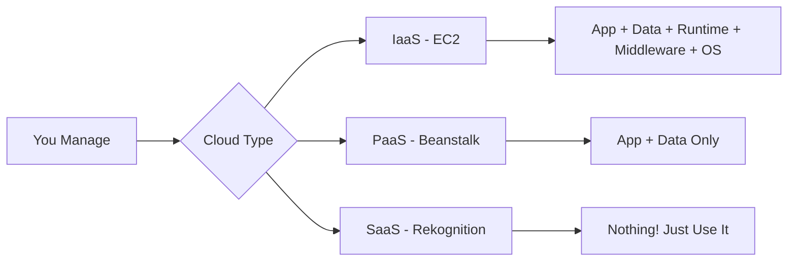

| | IaaS | PaaS | SaaS |
|---|---|---|---|
| **تتحكم في إيه** | كل حاجة فوق الـ Virtualization | App & Data فقط | لا شيء |
| **الـ Flexibility** | الأعلى | متوسط | الأقل |
| **الـ Complexity** | عالي | متوسط | منخفض |
| **AWS Example** | EC2 | Elastic Beanstalk | Rekognition |
| **مناسب لـ** | Sysadmins | Developers | Business Users |

> ⭐ **الامتحان بيسأل:** "Which service type allows you to focus only on your application and data?" = **PaaS**

---

## 🌍 الفصل السادس: AWS Global Infrastructure

### 🗺️ القصة — AWS في كل مكان!

تخيل معايا إن AWS بنت مدن كاملة للـ Servers حول العالم. مش مجرد Data Centers عادية — نظام كامل ومتكامل بيضمن إن خدماتك متاحة دايماً، سريعة، وآمنة.

تعالى نفهم التسلسل الهرمي:

```
AWS Global Infrastructure:
┌─────────────────────────────────────────────────────────┐
│                    🌍 WORLD                              │
│  ┌───────────────────────────────────────────────────┐  │
│  │              📍 REGION (مثلاً: us-east-1)         │  │
│  │  ┌─────────────────────────────────────────────┐  │  │
│  │  │       🏗️ AVAILABILITY ZONE (us-east-1a)     │  │  │
│  │  │  ┌─────────────┐  ┌─────────────┐           │  │  │
│  │  │  │ Data Center │  │ Data Center │           │  │  │
│  │  │  └─────────────┘  └─────────────┘           │  │  │
│  │  └─────────────────────────────────────────────┘  │  │
│  │       🏗️ AVAILABILITY ZONE (us-east-1b)           │  │  
│  │       🏗️ AVAILABILITY ZONE (us-east-1c)           │  │  
│  └───────────────────────────────────────────────────┘  │
│  ⚡ EDGE LOCATIONS (400+ حول العالم)                    │
└─────────────────────────────────────────────────────────┘
```

---

### 📍 AWS Regions — المدن

**ما هي الـ Region؟** مجموعة Data Centers متقاربة جغرافياً، ليها اسم زي `us-east-1` أو `eu-west-3`.

**الـ Fact المهم:** معظم الـ AWS Services بتشتغل على مستوى الـ Region — يعني لو عملت EC2 Instance في us-east-1، مش هتشوفها في eu-west-1.

**⭐ إزاي تختار الـ Region؟ — 4 عوامل:**

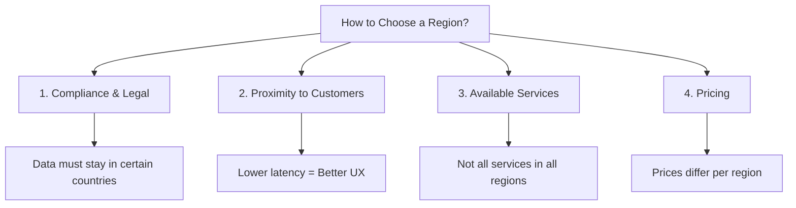

**المثال المصري:** لو بتبني App للمصريين، منطقي تختار `me-south-1` (Bahrain) أو أقرب Region، عشان الـ Latency تبقى أقل. بس لو عندك Data Residency Requirements، ممكن تلاقي إنك لازم تفضل في Region معينة بسبب القانون.

---

### 🏗️ AWS Availability Zones — الأحياء داخل المدينة

**ما هي الـ AZ؟** كل Region فيها من 3 لـ 6 AZs. كل AZ = Data Center أو أكتر معزولين عن بعض.

**الفلسفة:** لو حصل حريق في AZ واحدة، الـ AZs التانية لسه شغالة. مش بتقع الـ Service كلها!

```
Sydney Region (ap-southeast-2):
┌──────────────────────────────────────────────────────┐
│  ┌───────────┐  ┌───────────┐  ┌───────────┐        │
│  │ AZ: 2a    │  │ AZ: 2b    │  │ AZ: 2c    │        │
│  │           │  │           │  │           │        │
│  │ 🔥 Fire!  │  │ ✅ OK!    │  │ ✅ OK!    │        │
│  │ (وقعت)   │  │ (شغالة)   │  │ (شغالة)   │        │
│  └───────────┘  └───────────┘  └───────────┘        │
│  High Bandwidth + Ultra-Low Latency بيربطهم           │
└──────────────────────────────────────────────────────┘
```

**⭐ في الامتحان:** "Minimum number of AZs per region" = **3**، "Maximum" = **6**

---

### ⚡ Edge Locations — الفروع السريعة

**ما هي؟** 400+ نقطة موزعة في 90+ مدينة حول العالم. مش Data Centers كاملة — بس بيكون فيها Cache للمحتوى الشائع.

**المثال:** تخيل معايا إن فيه فيديو على YouTube مشهور في مصر. بدل ما كل مرة حد مصري يفتحه يجيب الفيديو من America، الـ Edge Location في القاهرة بتحتفظ بـ Copy منه. وبكده السرعة أعلى والـ Latency أقل!

الـ Service المستخدمة لده: **Amazon CloudFront**

---

### 🌐 Global vs Regional Services

```
Global Services (مش بتبقى في Region معينة):
┌─────────────────────────────────┐
│ ⭐ IAM — Identity & Access Mgmt │
│ ⭐ Route 53 — DNS               │
│ ⭐ CloudFront — CDN             │
│ ⭐ WAF — Web App Firewall       │
└─────────────────────────────────┘

Regional Services (لكل Region نسخة):
┌─────────────────────────────────┐
│ EC2 — Virtual Machines          │
│ Elastic Beanstalk — PaaS        │
│ Lambda — Serverless Functions   │
│ Rekognition — AI/ML Service     │
└─────────────────────────────────┘
```

> ⭐ **الامتحان بيسأل كتير:** "Which AWS service is Global?" — الإجابة دايماً IAM، Route 53، CloudFront، WAF

---

## 🛡️ الفصل السابع: Shared Responsibility Model

### ⚖️ القصة — الـ Contract بينك وبين AWS

تعالى أحكيلك على العقد اللي بينك وبين AWS. مش عقد قانوني، بس مبدأ جوهري لازم تفهمه!

**AWS مسؤول عن:** الأمان **OF** the Cloud (الحماية الجسدية، الـ Hardware، الـ Network، الـ Data Centers)

**أنت مسؤول عن:** الأمان **IN** the Cloud (بياناتك، إعداداتك، الـ Access، الـ Encryption)

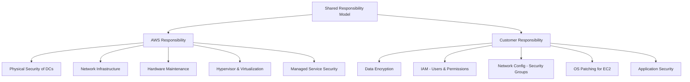

---

### 🔍 ما هو مسؤولية كل طرف بالتفصيل؟

**مثال عملي مع EC2:**

| المسؤولية | AWS | أنت |
|---|---|---|
| **الـ Physical Server** | ✅ | ❌ |
| **الـ Hypervisor** | ✅ | ❌ |
| **الـ OS Patching** | ❌ | ✅ |
| **الـ Application** | ❌ | ✅ |
| **الـ Data** | ❌ | ✅ |
| **الـ Security Groups** | ❌ | ✅ |
| **الـ IAM Permissions** | ❌ | ✅ |

**مثال مع S3:**

| المسؤولية | AWS | أنت |
|---|---|---|
| **الـ S3 Infrastructure** | ✅ | ❌ |
| **Bucket Public Access Settings** | ❌ | ✅ |
| **Data Encryption** | Optional | ✅ |
| **Bucket Policy** | ❌ | ✅ |

> ⚠️ **Trap شائعة:** الـ AWS مسؤول عن الـ Security "of" the Cloud، مش "in". البيانات دايماً مسؤوليتك انت!

> ⭐ **Exam Question:** "Who is responsible for patching the OS on EC2?" = **Customer**

---

## 🗺️ الفصل الثامن: Global Applications — خدمات الـ Infrastructure العالمية

### 🌍 ليه نحتاج Global Application؟

تخيل معايا App كبير زي Noon أو Amazon. عملاؤه في مصر، السعودية، أمريكا، أوروبا. لو الـ Servers كلها في US → المستخدم المصري بيستنى ثانية كمان عشان الـ Packet يروح أمريكا ويرجع. ده اسمه **Latency** وده بيخس الـ User Experience.

**الحل:** توزيع الـ Application على عدة Regions وEdge Locations.

```
بدون Global Distribution:              مع Global Distribution:
User in Egypt → US Servers             User in Egypt → Edge Location
     High Latency ❌                        Low Latency ✅
```

---

### 📡 Amazon Route 53 — الـ DNS العالمي

**ما هو الـ DNS أصلاً؟**

تخيل الـ Internet زي دليل التليفونات القديم. انت بتعرف اسم الشركة (google.com) بس مش عارف الرقم (IP: 142.250.185.78). الـ DNS هو الدليل اللي بيترجم الاسم للرقم!

```
المستخدم يكتب: www.myapp.com
         ↓
Route 53 يبحث في Records
         ↓
يرجع IP: 32.45.67.85
         ↓
المتصفح يتصل بالـ IP ده مباشرة ✅
```

**أنواع الـ DNS Records:**

| Record Type | الوصف | المثال |
|---|---|---|
| **A Record** | Domain → IPv4 | google.com → 142.250.185.78 |
| **AAAA Record** | Domain → IPv6 | google.com → 2001:db8::1 |
| **CNAME** | Hostname → Hostname | www.google.com → google.com |
| **Alias** | Domain → AWS Resource | myapp.com → my-lb.us-east-1.elb.amazonaws.com |

**⭐ ملاحظة مهمة:** الـ **Alias Record** مميز جداً — بيقدر يشاور على AWS Resources زي ELB، CloudFront، S3 Websites.

---

### 🔄 Route 53 Routing Policies

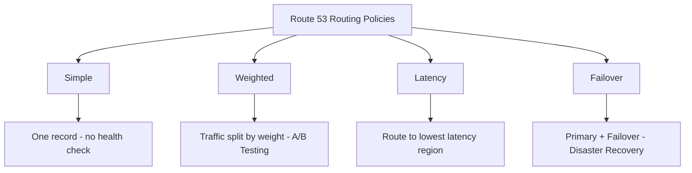

| Routing Policy | الاستخدام | ليه؟ |
|---|---|---|
| **Simple** | موقع بسيط، Server واحد | مفيش Health Check |
| **Weighted** | A/B Testing، Traffic Splitting | 70% هنا، 30% هناك |
| **Latency** | Users في مناطق مختلفة | وجّههم للأسرع Region |
| **Failover** | Disaster Recovery | لو Primary وقع، روح Failover |

> ⭐ **الامتحان:** "Route traffic to the region with the lowest latency" = **Latency Routing Policy**

---

### ⚡ Amazon CloudFront — شبكة توزيع المحتوى (CDN)

**القصة:**

تخيل شركة أفلام مصرية رفعت فيلم جديد على S3 في us-east-1. مستخدم في أستراليا حاول يشوف الفيلم — المسافة بعيدة جداً والتحميل بطيء!

هنا بيتدخل الـ CloudFront!

**إزاي بيشتغل:**

```
أول مرة:
User Australia → CloudFront Edge (Sydney) → لا يوجد Cache → S3 (US) → Cache Edge → المستخدم

تاني مرة:
User Australia → CloudFront Edge (Sydney) → ✅ Cache موجود → المستخدم مباشرة (سريييع!)
```

**المميزات:**

- **Content is cached at the edge** لـ TTL (Time To Live) معين
- **DDoS Protection** — لأن الهجمات بتتوزع على 400+ Edge Location
- **Integration مع AWS Shield و WAF** للحماية

**Sources اللي ممكن تتاخد منها:**

```
CloudFront Origins:
1. S3 Bucket (مع OAC - Origin Access Control)
2. VPC Origin (Private Subnets)
3. Custom HTTP Origin (أي HTTP Server)
4. Elastic Load Balancer
```

---

### 🔄 CloudFront vs S3 Cross Region Replication — الفرق المهم!

> ⭐ **ده سؤال كلاسيكي في الامتحان — لازم تفرق بينهم!**

| | CloudFront | S3 Cross Region Replication |
|---|---|---|
| **الآلية** | Cache عند الـ Edge | نسخ كامل للـ Files |
| **الـ Update** | TTL (مش Real-time) | Near Real-time |
| **الـ Coverage** | 400+ Edge Locations عالمياً | Regions معينة بس |
| **الـ Content** | Static Content (صور، فيديو) | Dynamic Content |
| **الـ Access** | Read + Write | Read Only |
| **الـ Use Case** | محتوى لازم يوصل لكل العالم | محتوى محتاجه في Regions محددة بسرعة |

**الـ Trick:** CloudFront مش بيعمل Copy، بيعمل Cache مؤقت. S3 Cross Region Replication بيعمل Copy كاملة.

---

### 🚀 S3 Transfer Acceleration

**المشكلة:** عايز ترفع ملفات ضخمة على S3 في Australia وانت في US — الاتصال المباشر على الـ Public Internet بطيء.

**الحل:**

```
File in USA → (Public www - Fast) → Edge Location USA
                                         ↓
                                    (Private AWS Network - Super Fast!)
                                         ↓
                              S3 Bucket in Australia ✅
```

بدل ما البيانات تسافر على الـ Public Internet من USA لـ Australia، بتسافر على الـ Private AWS Global Network الداخلية اللي أسرع بكتير!

---

### 🌐 AWS Global Accelerator

**المشكلة:** عندك Application في us-east-1 وعملاؤك في كل العالم. الـ Public Internet routes مش دايماً optimal.

**الحل:**

```
User Anywhere → Nearest Edge Location → AWS Private Network → Your App
                      ↑
             (Anycast IP - ثابت دايماً!)
```

**المميزات:**
- بيديك **2 Static Anycast IPs** ثابتين — مش بتتغير
- الـ Traffic بيتروح على الـ AWS Private Network (أسرع وأكثر استقراراً)
- تحسين بنسبة **60%** في الـ Performance

---

### ⚡ CloudFront vs Global Accelerator — الفرق الجوهري!

> ⭐ **ده من أهم الفروق في الامتحان:**

| | CloudFront | Global Accelerator |
|---|---|---|
| **الفكرة** | CDN — بيعمل Cache للمحتوى | TCP/UDP Proxy — مفيش Cache |
| **الـ Use Case** | Static Content، Images، Videos | Gaming، IoT، VoIP، APIs |
| **الـ IPs** | Dynamic | Static (2 Anycast IPs) |
| **الـ Failover** | ممكن | Deterministic & Fast |
| **الـ Protocol** | HTTP/HTTPS | TCP + UDP |

**الـ Common Trap:** لو السؤال قال "static IP addresses required" = **Global Accelerator**
لو السؤال قال "cache content at the edge" = **CloudFront**

---

## 🏗️ الفصل التاسع: AWS Outposts, WaveLength, Local Zones

### 🏭 AWS Outposts — AWS في بيتك!

**القصة:**

بعض الشركات زي المستشفيات والبنوك عندها Requirements صعبة — لازم البيانات تفضل داخل مبنى الشركة نفسها بسبب القانون أو الـ Latency. بس برضو عايزين يستخدموا AWS Services!

**الحل:** AWS بتبعتلك Rack كامل (زي الـ Server Rack) وتحطه جوا Data Center بتاعك. وبعدين أنت بتشتغل عليه بنفس الـ AWS APIs والـ Console!

```
Corporate Data Center:
┌──────────────────────────────────────┐
│  ┌──────────────────────────────┐    │
│  │     AWS Outposts Rack        │    │
│  │  EC2 | EBS | S3 | RDS | EKS │    │
│  │  (نفس AWS Services بالضبط!) │    │
│  └──────────────────────────────┘    │
│                    ↕                 │
│  ┌──────────────┐                    │
│  │ AWS Cloud   │← Connected via VPN │
│  └──────────────┘                   │
└──────────────────────────────────────┘
```

> ⚠️ **مهم:** أنت مسؤول عن الـ **Physical Security** بتاع الـ Outposts Rack (لأنه في مبناك انت مش في AWS Data Center)

**الـ Services المتاحة على Outposts:**
EC2، EBS، S3، EKS، ECS، RDS، EMR

---

### 📡 AWS WaveLength — AWS على حافة شبكة الـ 5G

**القصة:**

تخيل إنك بتعمل App للـ Self-Driving Cars أو الـ Augmented Reality. ده نوع من الـ Applications اللي مش تقدر تتحمل أي Latency — مللي ثانية بتفرق!

**الحل:** AWS بيحط Servers جوا Data Centers بتاعة شركات الاتصالات (Telecom) — جنب الـ 5G Towers بالظبط!

```
5G Device → Telecom Tower → WaveLength Zone → AWS Services
               ↑
     (مفيش خروج من شبكة الـ Telecom)
     Ultra-Low Latency!
```

**الـ Use Cases:**
- Smart Cities
- Connected Vehicles (Self-Driving)
- Interactive Live Video Streams
- AR/VR
- Real-time Gaming
- ML-Assisted Diagnostics

---

### 📍 AWS Local Zones — AWS أقرب من المستخدم

**الفرق عن الـ Regions:** الـ Local Zones مش Regions كاملة، هي امتداد لـ Region موجودة، بس أقرب جغرافياً للمستخدمين.

**المثال:** الـ Region الرئيسية us-east-1 في Virginia. بس عندك Local Zones في Boston, Chicago, Dallas, Houston, Miami — عشان المستخدمين في المدن دي يلاقوا Latency أقل.

```
us-east-1 (Virginia - Main Region):
       ↓ extension
us-east-1-bos-1 (Boston Local Zone)
us-east-1-chi-1 (Chicago Local Zone)
```

**⭐ الفرق بين الثلاث:**

| | Outposts | WaveLength | Local Zones |
|---|---|---|---|
| **الموقع** | Data Center بتاعك | Telecom DC | AWS Edge Cities |
| **الـ Use Case** | Data Residency, On-prem | 5G Ultra-low latency | City-level low latency |
| **المسؤولية** | Physical security عليك | AWS بالكامل | AWS بالكامل |

---

## 🏗️ الفصل العاشر: Well-Architected Framework — الـ 6 Pillars

### 🏛️ القصة — مش كل Cloud Architecture صح!

تعالى أحكيلك قصة مطور مصري اسمه أحمد. أحمد عمل App ورفعه على AWS بسرعة — بس مش فكر في أي حاجة غير إنه شغال. بعد شوية:
- الـ App اتهاك لأن مفيش Security
- حصل مشكلة وما عرفوش يرجعوا (مفيش Disaster Recovery)
- التكلفة طارت عن الـ Budget
- الـ Performance بطيء مع زيادة المستخدمين

AWS قررت تعمل Framework بيساعد الناس تبني صح من الأول — اتسمى **Well-Architected Framework** وعنده **6 Pillars**.

---

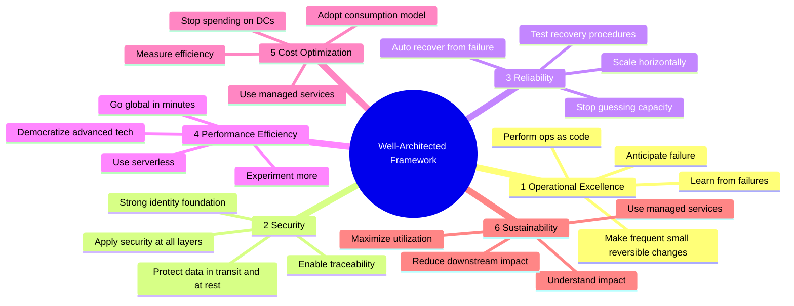

---

### 1️⃣ Operational Excellence — التميز التشغيلي

**ما هو:** القدرة على تشغيل ومراقبة الأنظمة لتحقيق Business Value، مع التحسين المستمر.

**الـ Design Principles:**
- **Perform operations as code** → Infrastructure as Code (IaC)
- **Make frequent, small, reversible changes** → مش تغييرات ضخمة مرة واحدة
- **Anticipate failure** → هندس للفشل، مش للنجاح بس
- **Learn from all failures** → Post-Mortems

**الـ AWS Services:**

```
Prepare:    CloudFormation + Config
Operate:    CloudTrail + CloudWatch + X-Ray
Evolve:     CodeBuild + CodeCommit + CodeDeploy + CodePipeline
```

---

### 2️⃣ Security — الأمان

**ما هو:** حماية المعلومات والأنظمة والـ Assets مع الـ Risk Assessment والـ Mitigation.

**الـ Design Principles:**
- **Implement a strong identity foundation** → IAM، Least Privilege
- **Enable traceability** → Logs، Metrics، CloudTrail
- **Apply security at all layers** → Network، Subnet، Instance، Application
- **Protect data in transit and at rest** → Encryption

**الـ AWS Services:**

```
Identity:    IAM + STS + MFA + Organizations
Detective:   Config + CloudTrail + CloudWatch
Protection:  CloudFront + VPC + Shield + WAF + Inspector
Data:        KMS + S3 + EBS + RDS
```

---

### 3️⃣ Reliability — الموثوقية

**ما هو:** القدرة على الاسترداد من الفشل وتلبية الطلب بشكل ديناميكي.

**الـ Design Principles:**
- **Test recovery procedures** → Chaos Engineering
- **Automatically recover from failure** → Health Checks + Auto Scaling
- **Scale horizontally** → بدل Server واحد ضخم، عمل Servers صغيرة كتير
- **Stop guessing capacity** → Auto Scaling

**الـ AWS Services:**

```
Foundations:         IAM + VPC + Service Quotas + Trusted Advisor
Change Management:   Auto Scaling + CloudWatch + CloudTrail + Config
Failure Management:  Backups + CloudFormation + S3 + S3 Glacier + Route 53
```

---

### 4️⃣ Performance Efficiency — كفاءة الأداء

**ما هو:** استخدام موارد الـ Computing بكفاءة لتلبية متطلبات النظام.

**الـ Design Principles:**
- **Democratize advanced technologies** → AWS بيقدم ML وAI كـ Services جاهزة
- **Go global in minutes** → Deploy بسرعة في أي Region
- **Use serverless** → مش محتاج تدير Servers
- **Experiment more often** → جرب بتكلفة منخفضة

**الـ AWS Services:**

```
Selection:   Auto Scaling + Lambda + EBS + S3 + RDS
Review:      CloudFormation
Monitoring:  CloudWatch + Lambda
Tradeoffs:   ElastiCache + Snowball + CloudFront + RDS
```

---

### 5️⃣ Cost Optimization — تحسين التكلفة

**ما هو:** تشغيل الأنظمة بأقل تكلفة ممكنة مع تحقيق Business Value.

**الـ Design Principles:**
- **Adopt a consumption model** → Pay only for what you use
- **Measure overall efficiency** → CloudWatch metrics
- **Stop spending on data center operations** → AWS بيتكفل بالـ Infrastructure
- **Analyze and attribute expenditure** → Use Tags!

**الـ AWS Services:**

```
Expenditure Awareness:   Budgets + Cost Explorer + Cost & Usage Report
Cost-Effective:          Spot Instances + Reserved Instances + S3 Glacier
Supply/Demand:           Auto Scaling + Lambda
Optimizing over time:    Trusted Advisor + Cost & Usage Report
```

---

### 6️⃣ Sustainability — الاستدامة (النجمة الجديدة)

**ما هو:** تقليل الأثر البيئي لتشغيل Cloud workloads.

> ⭐ **ده أحدث Pillar في الـ Well-Architected Framework — الامتحان بيسأل عليه!**

**الـ Design Principles:**
- **Understand your impact** → قيس الـ Carbon Footprint
- **Maximize utilization** → Right-size الـ Workloads
- **Use managed services** → أقل هدر في الـ Resources
- **Reduce downstream impact** → مستخدمك مش محتاج يغير Device

**الـ AWS Services:**
```
EC2 Auto Scaling + Lambda + Fargate + Cost Explorer
Graviton Instances + Spot Instances
EFS-IA + S3 Glacier + EBS Cold HDD
S3 Lifecycle + S3 Intelligent Tiering
```

**الـ Tool المهم:** **Customer Carbon Footprint Tool** — بيتتبع Carbon Emissions بتاعتك على AWS.

---

### 🔧 Well-Architected Tool

**ما هو:** Tool مجاني على AWS Console بيساعدك تراجع Architecture بتاعتك ضد الـ 6 Pillars.

**إزاي بيشتغل:**
```
1. اختار الـ Workload بتاعك
2. جاوب على أسئلة الـ 6 Pillars
3. AWS بيعطيك Report + Recommendations + Videos
```

---

## 🎯 الفصل الحادي عشر: AWS Cloud Adoption Framework (CAF)

### 🚀 القصة — الرحلة للـ Cloud مش بس تقنية!

تخيل إن شركة كبيرة زي بنك مصر عايزة تنتقل لـ Cloud. المشكلة مش بس في الـ Technology — في الـ Culture، الـ People، الـ Processes، والـ Governance!

**الـ AWS CAF** هو Framework شامل بيساعد المنظمات تخطط لرحلة انتقالها للـ Cloud بشكل ناجح.

---

### 6️⃣ Perspectives — الـ 6 زوايا للنظر

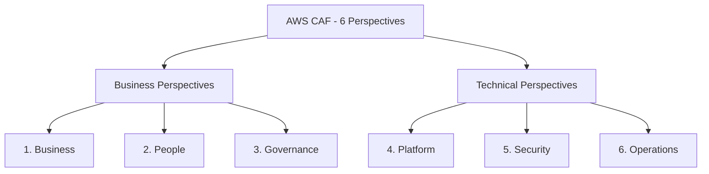

**الـ Business Capabilities (الجانب التجاري):**

| Perspective | دورها |
|---|---|
| **Business** | Cloud investments تتوافق مع Digital Transformation |
| **People** | Bridge بين Technology والـ Business — Culture & Leadership |
| **Governance** | تنسيق Cloud initiatives وتقليل الـ Risks |

**الـ Technical Capabilities (الجانب التقني):**

| Perspective | دورها |
|---|---|
| **Platform** | بناء Enterprise-grade Cloud Platform |
| **Security** | Confidentiality, Integrity, Availability |
| **Operations** | Cloud services تتم على مستوى يناسب Business |

---

### 🔄 4 Transformation Domains

```
Technology  → Migrate & Modernize Legacy Systems
Process     → Digitize & Automate Business Operations  
Organization → Reimagine Operating Model
Product     → Create New Value Propositions & Revenue Models
```

---

### 📋 4 Transformation Phases

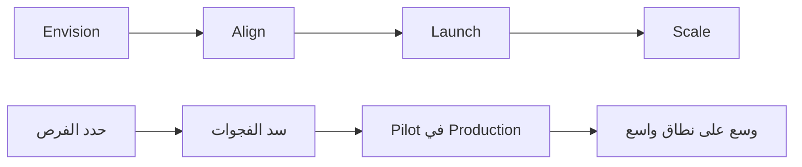

| Phase | ما تعمل فيه |
|---|---|
| **Envision** | إظهار كيف الـ Cloud يسرع الـ Business Outcomes |
| **Align** | تحديد Capability Gaps في الـ 6 Perspectives |
| **Launch** | بناء Pilot Initiatives وإظهار Business Value |
| **Scale** | توسيع الـ Pilot لتحقيق الـ Business Benefits |

> ⭐ **الامتحان:** الـ CAF له 6 Perspectives: Business, People, Governance, Platform, Security, Operations

---

## 💰 الفصل الثاني عشر: AWS Pricing & Economics

### 💵 الـ 3 Fundamentals of AWS Pricing

**AWS بتقدم Pay-as-you-go على 3 أشياء:**

```
AWS Pricing Fundamentals:

1. 🖥️ Compute (EC2, Lambda...)
   → بتدفع على وقت التشغيل (Per Hour or Per Second)

2. 📀 Storage (S3, EBS...)
   → بتدفع على الـ GB المخزنة

3. 🌐 Data Transfer OUT
   → بتدفع على البيانات اللي خرجت من AWS للـ Internet
   → ⭐ Data Transfer IN مجاني دايماً!
```

> ⭐ **Exam Trap:** "Data transfer IN to AWS is always FREE" — Data OUT بتدفع عليه!

---

### 🔢 AWS Cloud History — Quick Facts

```
2002: AWS Launched Internally at Amazon
2004: Launched Publicly with SQS
2006: Re-launched with SQS + S3 + EC2
2007: Expanded to Europe

2023 Facts:
- $90 Billion Annual Revenue
- 31% Market Share (Q1 2024)
- 13th Consecutive Year as Magic Quadrant Leader
- 1,000,000+ Active Users
```

---

## 🌐 الفصل الثالث عشر: AWS Ecosystem

### 🆘 AWS Support Plans — خطط الدعم

تخيل معايا إن عندك مشكلة حرجة في Production الساعة 3 الصبح. هتتصل بمين؟ الإجابة بتعتمد على الـ Support Plan!

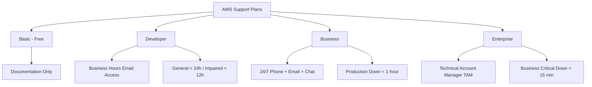

**المقارنة التفصيلية:**

| Feature | Developer | Business | Enterprise |
|---|---|---|---|
| **Access** | Business hours email | 24/7 Phone + Email + Chat | 24/7 All channels |
| **General Guidance** | < 24 hours | < 24 hours | < 24 hours |
| **System Impaired** | < 12 hours | < 4 hours | < 4 hours |
| **Production Down** | ❌ | < 1 hour | < 1 hour |
| **Business Critical** | ❌ | ❌ | **< 15 minutes** |
| **TAM** | ❌ | ❌| ✅ |
| **Concierge** | ❌ | ❌ | ✅ |

> ⭐ **الامتحان بيسأل:** "Business-critical system down, need response in 15 minutes" = **Enterprise Support**
> ⭐ **الامتحان بيسأل:** "TAM (Technical Account Manager)" = **Enterprise Plan فقط**

---

### 🛒 AWS Marketplace

**ما هو:** كتالوج رقمي فيه آلاف الـ Software Solutions من Third-Party Vendors.

**إيه اللي تلاقيه:**
- Custom AMIs (نظام تشغيل جاهز مع برامج محددة)
- CloudFormation Templates
- SaaS Solutions
- Containers

**ملاحظة مهمة:** لو اشتريت من الـ Marketplace، الفلوس بتتضاف على AWS Bill بتاعك مباشرة!

---

### 🤝 AWS IQ — المساعدة المتخصصة

**ما هو:** بتلاقي فيه AWS-Certified Experts من Third-Party للعمل على Projects محددة.

**إزاي بيشتغل:**

```
للعميل:                              للـ Expert:
Submit Request             ←→      Create Profile
(وصّف المشروع)                     (صورة، Bio، Certifications)
        ↓                                  ↓
Review Responses           ←→      Connect with Customers
(اختار من الردود)                    (Start a Proposal)
        ↓                                  ↓
Work Securely              ←→      Work Securely
(ادي الـ Expert Access)             (Access to AWS Account)
        ↓                                  ↓
Pay per Milestone                   Get Paid after Milestones
(على AWS Bill)
```

---

### 💬 AWS re:Post — المجتمع التقني

**ما هو:** Platform مجتمعي بديل لـ AWS Forums القديمة. فيه أسئلة وأجوبة مراجَعة من Experts.

**المميزات:**
- Community Members بيكسبوا Reputation Points
- أسئلة Premium Support بتتروح للـ AWS Support Engineers لو مجاوبتش
- ⚠️ مش للأسئلة الـ Time-Sensitive أو المعلومات الـ Proprietary

---

### 🔧 AWS Managed Services (AMS)

**ما هو:** AWS تدير الـ Infrastructure والعمليات بدلاً منك بالكامل.

**إيه اللي AMS بيعمله:**
- Change Requests
- Monitoring
- Patch Management
- Security
- Backup Services

**النتيجة:**
```
✅ Improved Security
✅ Stronger Compliance
✅ Reduced Operating Costs
✅ Simplified Management
✅ Focus on Automation
✅ Frictionless Innovation
```

> **بالظبط زي:** التوكيل — انت مش محتاج تيجي كل يوم، الوكيل بيتصرف نيابة عنك!

---

### 📐 AWS Right Sizing

**المفهوم:** إختيار أصغر وأرخص Instance Type اللي بيلبي احتياجاتك.

**الـ Insight الهام:** الـ Cloud مرن، مش لازم تشتري أكبر حاجة من الأول. ابدأ صغير وكبّر.

```
Right Sizing Process:
1. قبل الـ Migration → لا تنقل Oversized Instances
2. بعد الـ Migration → راقب وقلص
3. مستمر → كل فترة راجع واضبط
```

**الـ Tools المساعدة:**
- CloudWatch (Metrics)
- Cost Explorer
- Trusted Advisor
- Third-party tools

---

## 📊 الفصل الرابع عشر: Global Applications Architecture Patterns

### 🏗️ أنماط الـ Architecture العالمية

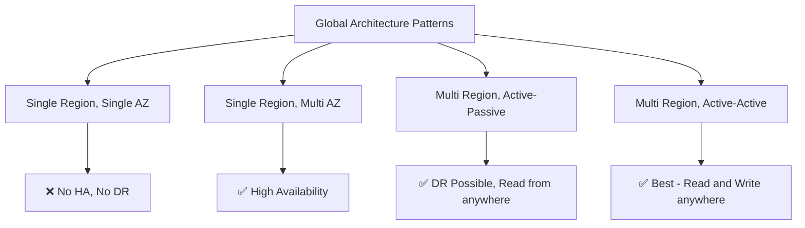

**المقارنة:**

| Pattern | High Availability | Latency | Difficulty |
|---|---|---|---|
| Single Region, Single AZ | ❌ | High | Easy |
| Single Region, Multi AZ | ✅ | Medium | Medium |
| Multi Region, Active-Passive | ✅ | Read OK, Write High | Hard |
| Multi Region, Active-Active | ✅✅ | Low Everywhere | Hardest |

**الـ Active-Passive:**
- Users في كل مكان يقدروا **يقروا** من أقرب Region
- الكتابة (Write) بتروح على الـ Primary Region بس

**الـ Active-Active:**
- Users في كل مكان يقدروا **يقروا ويكتبوا** في أي Region
- الأصعب لأن محتاج Data Sync بين كل الـ Regions

---

## ✅ Interview & Exam Checkpoint

### 🧪 أسئلة وأجوبة للامتحان

**Q1: What is the definition of Cloud Computing?**
> A: On-demand delivery of IT resources (compute, storage, databases, etc.) over the Internet with pay-as-you-go pricing.

**Q2: What are the 5 characteristics of Cloud Computing?**
> A: On-Demand Self-Service، Broad Network Access، Multi-Tenancy & Resource Pooling، Rapid Elasticity، Measured Service.

**Q3: What are the 6 advantages of Cloud Computing?**
> A: Trade CapEx for OpEx، Economies of Scale، Stop Guessing Capacity، Increase Speed & Agility، Stop Spending on Data Centers، Go Global in Minutes.

**Q4: What's the difference between IaaS, PaaS, and SaaS?**
> A: IaaS = you manage OS up (EC2). PaaS = you manage App & Data only (Beanstalk). SaaS = you just use it (Rekognition, Gmail).

**Q5: What are Global AWS Services?**
> A: IAM، Route 53، CloudFront، WAF.

**Q6: Who is responsible for OS patching on EC2?**
> A: The Customer (you). AWS only manages the underlying hardware.

**Q7: How many AZs are in a Region minimum?**
> A: Minimum 3, Maximum 6.

**Q8: What is the difference between CloudFront and Global Accelerator?**
> A: CloudFront = CDN, caches content at Edge. Global Accelerator = TCP/UDP proxy, no caching, uses static IPs.

**Q9: What Support Plan gives you a TAM?**
> A: Enterprise Support Plan only.

**Q10: What are the 6 Pillars of Well-Architected Framework?**
> A: Operational Excellence، Security، Reliability، Performance Efficiency، Cost Optimization، Sustainability.

**Q11: What are the 6 CAF Perspectives?**
> A: Business، People، Governance، Platform، Security، Operations.

**Q12: Data transfer IN to AWS is...**
> A: Always FREE. Only Data transfer OUT costs money.

**Q13: "Business-critical system down, need response in less than 15 minutes" — which Support Plan?**
> A: Enterprise Support Plan.

**Q14: Which Routing Policy is used for Disaster Recovery?**
> A: Failover Routing Policy.

**Q15: What is AWS Outposts?**
> A: Server racks deployed in your on-premises data center, running AWS services locally.

---

## 🫒 زتونة الامتحان — أهم 5 نقط من Domain 1

> ده القسم الأهم! هوّ ملخص ملخص الملخص 😄

---

### 🥇 نقطة 1: تعريف الـ Cloud Computing

**حفظ كده:**
> "**On-demand delivery** of IT resources with **pay-as-you-go** pricing, accessed over the **Internet**, owned and maintained by **AWS**"

الـ 5 Characteristics: **OBRME** (On-demand, Broad, Resource pooling, Measured, Elasticity)
الـ 6 Advantages: **TSGISA** (Trade CapEx, Scale, Stop Guessing, Increase Speed, Stop DC Spending, Agility + Go Global)

---

### 🥈 نقطة 2: الـ Shared Responsibility Model

**الـ Rule الذهبية:**
- **AWS مسؤول عن:** Security "**OF**" the Cloud (Hardware، Physical، Network)
- **أنت مسؤول عن:** Security "**IN**" the Cloud (Data، IAM، OS Patching على EC2، Encryption)

**الـ Trap:** لو السؤال عن "who patches the EC2 OS" = **Customer**
لو السؤال عن "who is responsible for physical security" = **AWS**

---

### 🥉 نقطة 3: الـ Global Infrastructure

**الترتيب الهرمي:**
```
Region → Availability Zones (3-6 per Region) → Data Centers → Edge Locations (400+)
```

**الـ Global Services:** IAM، Route 53، CloudFront، WAF (الباقي Regional)

**اختيار الـ Region:** Compliance → Proximity → Available Services → Pricing

---

### 🏅 نقطة 4: الـ Well-Architected Framework

**الـ 6 Pillars بالترتيب:**
1. Operational Excellence
2. Security
3. Reliability
4. Performance Efficiency
5. Cost Optimization
6. **Sustainability** (الأحدث — لازم تعرفه!)

**مش Trade-offs، ده Synergy** — الـ Pillars بتكمل بعض مش بتتعارض.

---

### 🎖️ نقطة 5: الـ Support Plans + Pricing

**Support Plans SLA:**
- Developer: < 12 hours (System Impaired)
- Business: < 1 hour (Production Down)
- **Enterprise: < 15 minutes (Business Critical)**

**TAM؟** → Enterprise فقط!

**Pricing:**
- Data IN → **FREE**
- Data OUT → **Paid**
- 3 Fundamentals: Compute، Storage، Data Transfer OUT

---

## 📋 Final Summary Diagram

```mermaid
graph TD
    A[Domain 1 - Cloud Concepts 24%] --> B[What is Cloud?]
    A --> C[Deployment Models]
    A --> D[IaaS PaaS SaaS]
    A --> E[Global Infrastructure]
    A --> F[Global Services]
    A --> G[Shared Responsibility]
    A --> H[Well-Architected]
    A --> I[CAF]
    A --> J[Ecosystem]

    B --> B1[5 Characteristics]
    B --> B2[6 Advantages]
    
    C --> C1[Private]
    C --> C2[Public - AWS]
    C --> C3[Hybrid]
    
    E --> E1[Regions - 34+]
    E --> E2[AZs - 3 to 6 per Region]
    E --> E3[Edge Locations - 400+]
    E --> E4[Local Zones]
    E --> E5[WaveLength - 5G]
    E --> E6[Outposts - On-Prem]
    
    F --> F1[Route 53 - DNS]
    F --> F2[CloudFront - CDN]
    F --> F3[Global Accelerator]
    F --> F4[S3 Transfer Acceleration]
    
    G --> G1[AWS - Security OF Cloud]
    G --> G2[Customer - Security IN Cloud]
    
    H --> H1[6 Pillars]
    H --> H2[WAT - Well Architected Tool]
    
    I --> I1[6 Perspectives]
    I --> I2[4 Domains]
    I --> I3[4 Phases]
    
    J --> J1[Support Plans]
    J --> J2[Marketplace]
    J --> J3[IQ]
    J --> J4[re-Post]
    J --> J5[AMS]
    J --> J6[Right Sizing]
```

---

> ⭐ **نصيحة الخبراء الأخيرة:** الـ Domain ده مش صعب بس واسع. المفاتيح الثلاث:
> 1. **افهم** إيه الـ Shared Responsibility (AWS vs. You)
> 2. **احفظ** الـ 6 Pillars + الـ 6 CAF Perspectives
> 3. **ميّز** بين CloudFront vs Global Accelerator, Outposts vs WaveLength vs Local Zones

---

[الرحلة لسه مخلصتش.. قولي "كمل" عشان نكمل بـ Domain 2 من نفس المكان] 🚀
