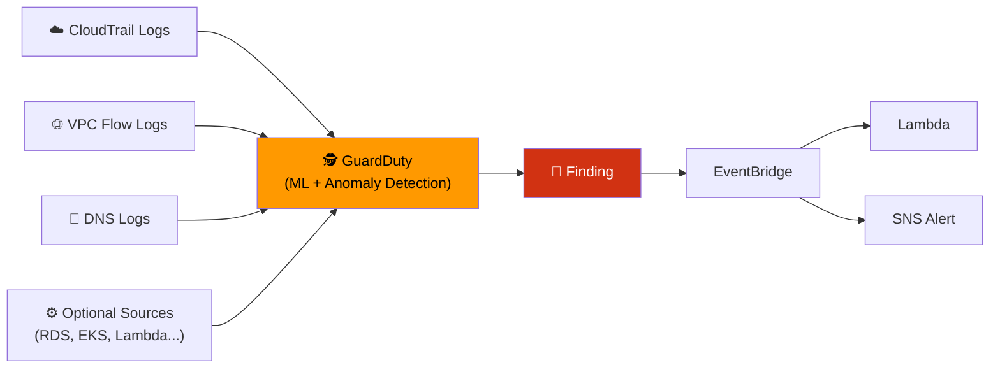
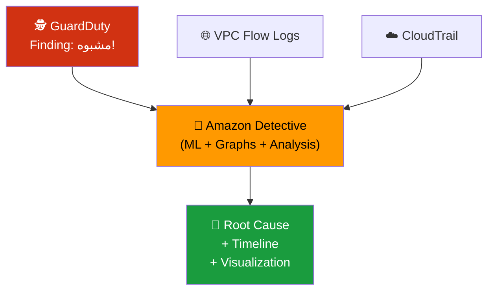
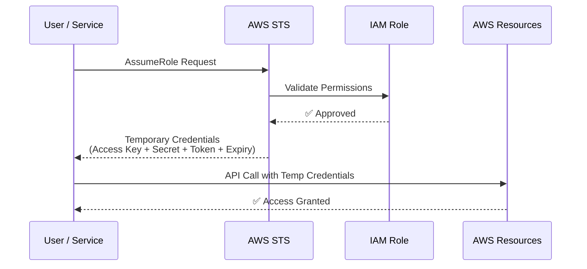
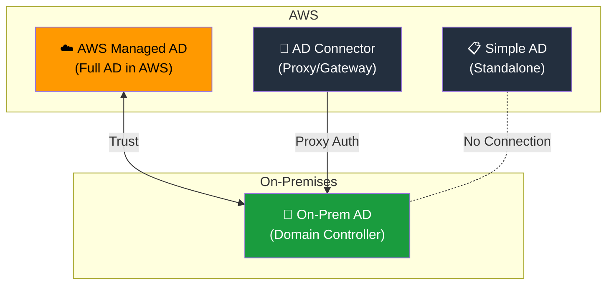

# 🔍 Security & Compliance — الجزء الثاني
### AWS Certified Cloud Practitioner — CLF-C02
### كشف التهديدات + الـ Advanced Identity

---

## 🦠 الحكاية بتبدأ بسؤال مقلق — إيه اللي بيحصل جوا Infrastructure بتاعتك دلوقتي؟

حتى لو ضبطت كل الـ Firewalls وفعّلت كل الـ Encryption وعملت أحسن Password Policy — لسه ممكن يكون فيه حاجة غريبة بتحصل من جوا. EC2 Instance اتـ Compromise وبقى بيعمل Crypto Mining. حساب IAM اتـ Leak وشخص غريب بيعمل API Calls في الساعة 3 الصبح من بلد ما لوش دعوة. Bucket فيه بيانات حساسة اتبقى Public من غير ما حد يحس.

الـ AWS عندها مجموعة خدمات متخصصة للرصد والكشف عن التهديدات. كل واحدة فيهم ليها دور مختلف، وفهم الفروق بينهم هو اللي بيعملك الفرق في الامتحان.

---

## 🕵️ Amazon GuardDuty — المحقق الذكي

الـ **GuardDuty** هو خدمة الـ **Intelligent Threat Detection** — بتستخدم Machine Learning وAnomaly Detection وبيانات من جهات خارجية متخصصة عشان تكشف الأنشطة المشبوهة في Account بتاعتك تلقائياً.

الحلو فيها: تشغيلها بضغطة زرار واحدة، وفيه 30 يوم Trial مجاناً. مش محتاج تركّب أي Agent أو Software. بس تفعّلها — وبدأت تراقب.

**بتاكل البيانات دي وتحللها:**
- **CloudTrail Logs** — بتشوف لو فيه API Calls غريبة (مثلاً: Delete S3 Bucket من IP مجهول).
- **VPC Flow Logs** — بتشوف لو فيه Traffic غير عادي جوا الـ Network (مثلاً: Instance بيتكلم مع Server في دولة مشبوهة).
- **DNS Logs** — بتشوف لو فيه EC2 Instance بيرسل Requests لـ DNS مشبوه (علامة على إن الـ Instance اتـ Compromise).
- **Optional Features**: EKS Audit Logs، RDS وAurora Login Activity، EBS، Lambda Network Activity.

لو GuardDuty لاقى حاجة مشبوهة — بيولّد **Finding**. وبتقدر تضبطه يبعت الـ Finding لـ **EventBridge** اللي بيشغّل Lambda أو SNS يبعتلك Alert. كمان عنده Detection خاص لهجمات الـ CryptoCurrency — لأن الـ Compromised Instances كتير بتتحول لـ Mining.

---

## 🔬 Amazon Inspector — فاحص الثغرات

بينما GuardDuty بيراقب الـ Behavior وبيكشف التهديدات في الـ Runtime، الـ **Inspector** بيشتغل بطريقة مختلفة — بيعمل **Automated Security Assessments** بيفحص الـ Software نفسه عشان يلاقي الثغرات المعروفة قبل ما المهاجم يستغلها.

**بيشتغل على تلات أماكن:**

**EC2 Instances** — بيتجوز SSM Agent اللي على الـ Instance، وبيفحص الـ OS والـ Packages المثبتة ضد قاعدة بيانات الـ CVE (Common Vulnerabilities and Exposures). كمان بيفحص هل الـ Instance accessible من الإنترنت بشكل غير متوقع (Network Reachability).

**Container Images على Amazon ECR** — كل ما تدفع Image جديدة على الـ ECR، Inspector بيفحصها تلقائياً قبل ما تتنشر على الـ ECS أو EKS.

**Lambda Functions** — بيفحص الـ Code والـ Dependencies بتاعت الـ Function عشان يكشف Vulnerable Packages.

لكل ثغرة يلاقيها، بيدي **Risk Score** عشان تقدر تحدد الأولويات — الأعلى خطراً أهم يتصلح أول. النتائج بتتبعت لـ **AWS Security Hub** وكمان لـ **Amazon EventBridge**.

> [!important] GuardDuty vs Inspector — الفرق المهم
> - **GuardDuty** = بيراقب الـ Activity والـ Behavior — بيكشف لو حاجة غلط بتحصل الـ Runtime.
> - **Inspector** = بيفحص الـ Software — بيكشف الثغرات الموجودة في الكود والـ Packages.
> - GuardDuty يكشف "حاجة بتحصل دلوقتي". Inspector يكشف "حاجة ممكن تحصل لو استُغلت ثغرة".

---

## ⚙️ AWS Config — سجل التاريخ والامتثال

الـ **AWS Config** مش خدمة أمان بالمعنى التقليدي — هو خدمة **Compliance وAudit**. بيسجّل كل تغيير بيحصل على الـ Resources بتاعتك على مر الوقت، وبيقارن الـ State الحالية بقواعد Compliance إنت بتحددها.

السؤال اللي Config بيجاوب عليه: **"إيه اللي اتغير ومتى؟"**

أمثلة على الأسئلة اللي Config يقدر يجاوب عليها:
- فيه Security Group فيه SSH مفتوح للعالم؟
- فيه S3 Bucket أصبح Publicly Accessible؟
- الـ ALB Configuration اتغير إزاي على آخر 6 أشهر؟

بيشتغل على مستوى الـ Region — بس ممكن تجمع النتائج من كل الـ Regions والـ Accounts في مكان واحد. والبيانات ممكن تتخزن في S3 وتتحلل بـ Athena.

> [!abstract]+ Config في التطبيق الفعلي
>
> تخيل إن أحد الـ Developers غلطة فتح الـ Port 22 (SSH) على Security Group في الـ Production Environment. Config عنده Rule بتقول "الـ SSH ما يكونش مفتوح للعالم." في اللحظة اللي فيها التغيير حصل — Config يرصده، يعلّمه Non-Compliant، ويبعتلك SNS Alert. تقدر حتى تعمل **Auto Remediation** — Lambda تقفل الـ Port تلقائياً.

---

## 🔎 Amazon Macie — صيد البيانات الحساسة

الـ **Macie** هو خدمة متخصصة في حاجة واحدة بالظبط: **إيجاد البيانات الحساسة في S3**. بيستخدم Machine Learning وPattern Matching عشان يفتش في الـ S3 Buckets ويكشف لو فيه بيانات من النوع الحساس.

**Personally Identifiable Information (PII)** هو أشهر مثال — بيانات شخصية زي أسماء وأرقام بطاقات هوية وأرقام تأمين اجتماعي وبيانات بطاقات بنكية. لو Macie لاقى ملف فيه بيانات زي دي في Bucket ما المفروض يكون فيه — بيبعتلك Alert عبر **Amazon EventBridge**.

الاستخدام الأشهر له: شركات عندها S3 Buckets كتيرة ومش عارفين بالظبط إيه المخزون فيهم — Macie بيعمل Scan تلقائي ويكشف أي حاجة حساسة مخبّأة.

> [!important] Macie في الامتحان
> لما السؤال يذكر: "sensitive data in S3"، "PII"، "personally identifiable information"، "data privacy in S3" — الإجابة **Amazon Macie**.

---

## 🏛️ AWS Security Hub — غرفة العمليات المركزية

تخيل إنك عندك GuardDuty وInspector وMacie وConfig وIAM Access Analyzer — كل واحد منهم بيولّد Findings في مكانه. إزاي تتابع كل ده؟ هنا الـ **AWS Security Hub** بييجي.

الـ Security Hub هو **الـ Dashboard المركزي للأمان** — بيجمع النتائج الأمنية من كل الخدمات دي (وخدمات شركاء AWS كمان) في مكان واحد، وبيعرضها في Dashboard موحد مع تقييم للـ Compliance.

**بيجمع Findings من:**
Config، GuardDuty، Inspector، Macie، IAM Access Analyzer، AWS Systems Manager، AWS Firewall Manager، AWS Health، وAWS Partner Solutions.

**شرط أساسي:** لازم **AWS Config يكون enabled** عشان Security Hub يشتغل صح.

وبيشتغل على مستوى **Multi-Account** — بتقدر تربط كل الـ Accounts في Organization وتتابعهم من مكان واحد.

---

## 🔭 Amazon Detective — التحقيق العميق

لما GuardDuty يلاقي Finding مشبوه — بيبدأ التساؤل: **ليه؟ إيه اللي حصل؟ مين اللي عمله؟ إزاي وصل؟** التحقيق ده بيدي بتقعد تجمع بيانات من أماكن مختلفة ومضيّع وقت. الـ **Amazon Detective** بييجي لحل المشكلة دي.

Detective بيجمع ويحلل تلقائياً البيانات من VPC Flow Logs وCloudTrail وGuardDuty ويبني **Unified View** بتصورات بيانية بتوضح العلاقات والأنماط. هدفه إنك توصل لـ **Root Cause** بسرعة — مش بس تعرف إن فيه حاجة غلط، لكن تفهم بالظبط إيه اللي حصل وإزاي.

> [!important] Security Hub vs Detective — الفرق المهم
> - **Security Hub** = يجمع ويعرض الـ Findings من كل الخدمات في Dashboard موحد.
> - **Detective** = يحقق في الـ Finding ويكشف الـ Root Cause — للتحليل العميق.

---

## 🚨 AWS Abuse — لما AWS نفسها بتُستخدم في شر

الـ **AWS Abuse** هو الطريقة الرسمية اللي بتبلّغ بيها لو لاحظت إن AWS Resources (سواء بتاعتك أو بتاعة حد تاني) بتتستخدم في أنشطة ضارة أو غير قانونية.

الأنشطة اللي بتبلّغ عنها:
- **Spam** — بتستقبل Emails مزعجة من IP Addresses بتاعة AWS.
- **Port Scanning** — حد بيعمل Scan على Ports بتاعتك من Instance على AWS.
- **DDoS Attacks** — IP بتاعة AWS بيهاجم Infrastructure بتاعتك.
- **Intrusion Attempts** — محاولات Brute Force على Servers بتاعتك من IP بتاعة AWS.
- **Malware Distribution** — Instance على AWS بيوزع برمجيات خبيثة.
- **Illegal Content Hosting** — محتوى مخالف للقانون أو محمي بحقوق ملكية.

**إزاي بتبلّغ؟** عبر **AWS Abuse Form** الرسمي أو عبر البريد الإلكتروني: `abuse@amazonaws.com`.

---

## 👑 Root User Privileges — اللي ما يعملوش غير الـ Root

الـ Root Account هو الـ Owner الأصلي للـ AWS Account. اتكلمنا عن إنه يتأمن ومش يتاستخدم يومياً — بس في حاجات بس الـ Root يقدر يعملها. ده مهم في الامتحان.

**Actions ما يعملهاش غير Root User:**
- تغيير إعدادات الـ Account (الاسم، الـ Email، باسورد الـ Root، الـ Root Access Keys).
- الاطلاع على بعض الفواتير الضريبية.
- إغلاق الـ AWS Account نهائياً.
- استعادة صلاحيات IAM User معطّل.
- تغيير أو إلغاء الـ AWS Support Plan.
- التسجيل كـ Seller في Reserved Instance Marketplace.
- ضبط S3 Bucket لتفعيل الـ MFA Delete.
- تعديل أو حذف S3 Bucket Policy فيها Invalid VPC ID.
- التسجيل في AWS GovCloud.

> [!important] Root Privileges في الامتحان
> لو السؤال سألك "which action requires Root user?" — أشهر إجابات: **Close AWS Account** وChange Account Settings وChange AWS Support Plan.

---

## 🔍 IAM Access Analyzer — مين خارج النطاق؟

الـ **IAM Access Analyzer** بيجاوب على سؤال واحد مهم جداً: **"أيه من Resources بتاعتك متاحة لناس خارج الـ AWS Account بتاعتك؟"**

بتحدد **Zone of Trust** — إما الـ AWS Account بتاعتك، أو الـ AWS Organization كلها. وأي Resource معطي صلاحية لحد خارج الـ Zone دي — بيطلع **Finding**.

الـ Resources اللي بيفحصها:
- S3 Buckets.
- IAM Roles.
- KMS Keys.
- Lambda Functions والـ Layers.
- SQS Queues.
- Secrets Manager Secrets.

مثلاً: S3 Bucket معمول عليه Bucket Policy بيسمح لـ AWS Account تانية بالوصول — Access Analyzer بيشيلها كـ Finding. تراجعه وتقرر: ده مقصود (External Collaboration) ولا خطأ لازم تصلحه.

---

## 🌐 الجزء الثاني — Advanced Identity

---

## 🎫 AWS STS — تذاكر المرور المؤقتة

الـ **STS (Security Token Service)** هو الخدمة اللي بتوفر **Temporary Security Credentials** — يعني بدل ما تدي حد Access Key دايمة، بتديله تذكرة مؤقتة بتنتهي بعد وقت محدد.

**الميزة الأساسية:** الـ Credentials دي Short-Lived — إنت بتحدد مدة صلاحيتها. لو اتسرقت — بعد ساعة مثلاً بتبقى بلا قيمة.

**متى بيتستخدم STS؟**
- **Identity Federation** — شركة عندها موظفين على Active Directory. بدل ما تعمل IAM User لكل واحد فيهم على AWS — STS بيصدر لهم Temporary Credentials بناءً على هويتهم الموجودة.
- **IAM Roles Cross-Account** — Account A محتاجة تعمل Action على Resource في Account B. Account A تـ Assume Role في Account B — وSTS بيصدر Temporary Credentials.
- **EC2 Instance Roles** — الـ EC2 Instance بتـ Assume Role، وSTS بيديها Credentials مؤقتة تستخدمها للوصول لـ S3 أو DynamoDB.

---

## 👤 Amazon Cognito — هوية مستخدمي الـ Apps

الـ IAM مصمم للموظفين والـ Services الداخلية. بس لو عندك Mobile App أو Web App وعندك **ملايين** مستخدمين عاوزين يسجلوا — مش معقول تعمل IAM User لكل واحد.

الـ **Amazon Cognito** هو الحل — بيوفر Identity Management للـ End Users الخارجيين للـ Applications. بيخليهم يسجلوا بـ Email وباسورد، أو عبر **Social Identity Providers** زي Google وFacebook وTwitter. والأهم: بيدي كل مستخدم Access مؤقت للـ AWS Resources المناسبة بدون ما يكون عنده IAM User.

> [!important] IAM vs Cognito — متى تستخدم إيه
> - **IAM** = للـ Users اللي بتثق فيهم وجزء من Organization بتاعتك (Employees، Services).
> - **Cognito** = لمستخدمي التطبيقات الخارجيين — Customers على Web أو Mobile Apps.

---

## 🏢 Microsoft Active Directory وAWS Directory Services

**Microsoft Active Directory (AD)** هو الـ Identity System اللي أغلب الشركات الكبيرة بتستخدمه On-Premises. فيه Database مركزية لكل Users وComputers والصلاحيات في الشركة — الـ Domain Controller هو اللي بيـ Authenticate.

لما الشركة دي بتيجي تشتغل على AWS — بتحتاج طريقة تربط الـ AD بتاعتها بـ AWS. وعندها **ثلاث خيارات:**

**AWS Managed Microsoft AD** — AWS بتنشئلك AD جديد جوا AWS نفسها. بتدير الـ Users محلياً في AWS، مع دعم MFA، وتقدر تعمل **Trust Connection** بين الـ AWS AD والـ On-Premises AD — يعني الاتنين مترابطين وبيشاركوا الهوية.

**AD Connector** — مش AD جديد — ده **Gateway** بيعمل Proxy. الـ Users بيعملوا Authentication على الـ On-Premises AD بتاعهم، الـ AD Connector بيوجّه الطلب ليه. الـ Users بيتعملوا إدارتهم دايماً On-Premises — AWS مش بتخزن بياناتهم.

**Simple AD** — AD بسيط ومتوافق مع Microsoft AD — بس ما يتوصلش بـ On-Premises AD. للشركات الصغيرة اللي محتاجة AD على AWS بدون تعقيد.

> [!important] الفرق في الامتحان
> - "Create your own AD in AWS, connect to On-Prem with trust" → **AWS Managed AD**
> - "Redirect auth to existing On-Prem AD" → **AD Connector**
> - "Simple AD-compatible, no On-Prem connection needed" → **Simple AD**

---

## 🔑 AWS IAM Identity Center — دخلة واحدة لكل حاجة

الـ **IAM Identity Center** (اللي كان اسمه AWS Single Sign-On أو SSO) هو الخدمة اللي بتديك **Login واحد يفتحلك كل حاجة**:
- كل الـ AWS Accounts في الـ AWS Organization.
- Business Apps زي Salesforce وMicrosoft 365 وBox.
- أي Application بيدعم SAML 2.0.
- Windows EC2 Instances.

**كيف بيشتغل:** المستخدم بيدخل على الـ IAM Identity Center Portal مرة واحدة — وبعدين بيشوف قائمة بكل الـ AWS Accounts والـ Applications اللي عنده صلاحية عليها، ويدخل عليها بنقرة من غير ما يدخل باسورد تاني.

**مصادر الهوية (Identity Providers):**
- **Built-in** — بتعمل Users جوه الـ IAM Identity Center نفسه.
- **Third-Party** — Active Directory (عبر AWS Directory Services)، Okta، OneLogin، أو أي SAML 2.0 Provider.

> [!abstract]+ ليه IAM Identity Center أحسن من إنك تـ Login على كل Account لوحده؟
>
> تخيل شركة عندها 30 AWS Account — للـ Development والـ Staging والـ Production ولكل Team. لو كل DevOps Engineer لازم يـ Login على كل Account بـ Credentials مختلفة — ده كابوس. مع IAM Identity Center:
> - Login مرة واحدة.
> - بتشوف كل الـ Accounts اللي عندك Permission عليها.
> - Permission Sets بتحدد مين يقدر يعمل إيه في كل Account — من مكان مركزي واحد.
> - Audit Trail موحد لكل الـ Logins.

---

## 🎯 فخاخ الـ Exam — الجزء الثاني

**الـ Trap الأول — GuardDuty مش بيفحص الكود:** GuardDuty بيراقب الـ Behavior والـ Network Activity في الـ Runtime. اللي بيفحص الكود والـ Packages عشان يلاقي Vulnerabilities هو **Inspector**.

**الـ Trap التاني — Macie بس لـ S3:** Macie متخصص في S3 فقط. مش بيفحص Databases ولا EC2. لو السؤال قال "find PII in S3" — Macie. لو قال "find vulnerabilities in EC2" — Inspector.

**الـ Trap التالت — Config مش Monitoring Tool:** Config مش بيراقب Behavior زي GuardDuty. Config بيتتبع Configuration Changes وبيقيّم الـ Compliance. السؤال "did this resource comply with the rule?" → Config. السؤال "is someone attacking me?" → GuardDuty.

**الـ Trap الرابع — Security Hub بيحتاج Config:** لازم AWS Config يكون enabled قبل ما تفعّل Security Hub. لو جت في سؤال — هو prerequisite.

**الـ Trap الخامس — STS Temporary Credentials:** لو السؤال قال "temporary" أو "short-lived credentials" أو "cross-account access" → **STS**. لو قال "permanent credentials" → IAM User Access Keys.

**الـ Trap السادس — Cognito مش لـ Employees:** Cognito للـ External End Users (Customers). الـ Employees والـ Services بتستخدم IAM أو IAM Identity Center.

**الـ Trap السابع — AD Connector مش بيخزن Users:** AD Connector بس Proxy. الـ Users بيفضلوا على الـ On-Premises AD. لو السؤال قال "users managed on-premises" → **AD Connector**. لو قال "manage users locally in AWS" → **AWS Managed AD**.

**الـ Trap الثامن — IAM Identity Center اسمه القديم AWS SSO:** الامتحان ممكن يسأل بالاسمين. "Single Sign-On" أو "one login for multiple accounts" → **IAM Identity Center**.

---

## 📝 أسئلة الـ Exam — الجزء الثاني

### Q1. A company suspects that one of their EC2 instances has been compromised and is communicating with a known malicious IP address. Which AWS service automatically detects this type of threat?

- A. Amazon Inspector
- B. Amazon GuardDuty
- C. AWS Config
- D. AWS Trusted Advisor

> [!success]- ✅ Reveal Answer & Explanation
> **Correct Answer: B**
>
> الـ **GuardDuty** هو الخدمة المصممة لكشف التهديدات في الـ Runtime. بيحلل الـ VPC Flow Logs ويكشف لو فيه EC2 Instance بيتواصل مع IP مشبوه معروف. ده بالظبط الـ Use Case بتاعه — Anomaly Detection والتواصل مع Malicious IPs في قاعدة بياناته.
>
> **ليه الباقي غلط:**
> - **A** — Inspector بيفحص الثغرات في الـ Software (CVEs) مش الـ Runtime Communication.
> - **C** — Config بيتتبع التغييرات على الـ Resources — مش الـ Network Traffic.
> - **D** — Trusted Advisor بيقدم توصيات لتوفير التكلفة وتحسين الأمان العام — مش كشف التهديدات في الـ Real-Time.

---

### Q2. A security engineer wants to automatically scan newly pushed container images in Amazon ECR for known software vulnerabilities. Which service provides this capability?

- A. Amazon GuardDuty
- B. Amazon Macie
- C. Amazon Inspector
- D. AWS Security Hub

> [!success]- ✅ Reveal Answer & Explanation
> **Correct Answer: C**
>
> الـ **Amazon Inspector** هو الخدمة اللي بتعمل Automated Security Assessments على Container Images في ECR. كل ما Image اتدفعت — Inspector بيفحصها تلقائياً ضد قاعدة بيانات الـ CVE ويعطي Risk Score للثغرات.
>
> **ليه الباقي غلط:**
> - **A** — GuardDuty بيراقب الـ Runtime Behavior — مش بيفحص الـ Container Images.
> - **B** — Macie متخصص في إيجاد البيانات الحساسة في S3 — مش فحص Container Images.
> - **D** — Security Hub بيجمع الـ Findings من Inspector وغيره — بس هو مش اللي بيعمل الفحص نفسه.

---

### Q3. A company stores millions of files in Amazon S3 across hundreds of buckets. The compliance team wants to automatically identify any buckets that may contain personally identifiable information (PII). Which AWS service should they use?

- A. Amazon GuardDuty
- B. Amazon Inspector
- C. AWS Config
- D. Amazon Macie

> [!success]- ✅ Reveal Answer & Explanation
> **Correct Answer: D**
>
> الـ **Amazon Macie** متخصص بالظبط في إيجاد البيانات الحساسة (زي PII) في S3 Buckets باستخدام Machine Learning. ده الـ Use Case الوحيد اللي هو موجود عشانه.
>
> **ليه الباقي غلط:**
> - **A** — GuardDuty بيكشف التهديدات والأنشطة المشبوهة — مش محتوى الملفات في S3.
> - **B** — Inspector بيفحص Software Vulnerabilities على EC2 وECR وLambda — مش S3 Content.
> - **C** — Config بيتتبع إعدادات الـ Buckets (هل هي Public؟) — مش محتوى الملفات.

---

### Q4. An operations team needs a centralized security dashboard that aggregates findings from GuardDuty, Inspector, Macie, and Config across all 15 accounts in their AWS Organization. Which service provides this?

- A. AWS CloudTrail
- B. Amazon Detective
- C. AWS Security Hub
- D. AWS Trusted Advisor

> [!success]- ✅ Reveal Answer & Explanation
> **Correct Answer: C**
>
> الـ **AWS Security Hub** هو الـ Central Security Dashboard. بيجمع الـ Findings من GuardDuty وInspector وMacie وConfig وIAM Access Analyzer وغيرها في Dashboard واحد — ويدعم Multi-Account عبر Organizations.
>
> **ليه الباقي غلط:**
> - **A** — CloudTrail بيسجل الـ API Calls — مش Dashboard لتجميع الـ Security Findings.
> - **B** — Detective بيحقق في سبب الـ Finding — مش بيجمع الـ Findings من خدمات مختلفة.
> - **D** — Trusted Advisor بيقدم توصيات للتحسين — مش بيجمع Security Findings.

---

### Q5. A GuardDuty finding indicates unusual API activity in an AWS account. A security analyst needs to perform deep root-cause analysis by examining the relationships between entities involved in the incident. Which AWS service is designed for this investigation?

- A. AWS Security Hub
- B. Amazon Detective
- C. AWS Config
- D. AWS CloudTrail Insights

> [!success]- ✅ Reveal Answer & Explanation
> **Correct Answer: B**
>
> الـ **Amazon Detective** هو الأداة المصممة للتحقيق العميق وإيجاد الـ Root Cause. بيجمع ويحلل البيانات من VPC Flow Logs وCloudTrail وGuardDuty ويعمل Visualizations توضح العلاقات والـ Timeline بتاعة الحادثة.
>
> **ليه الباقي غلط:**
> - **A** — Security Hub بيجمع الـ Findings ويعرضها — لكن مش بيقدم التحليل العميق للعلاقات.
> - **C** — Config بيتتبع التغييرات على الـ Configuration — مش يحلل الأنشطة المشبوهة.
> - **D** — CloudTrail Insights بيكشف API Patterns غير عادية — مش يعمل Root Cause Analysis للعلاقات.

---

### Q6. Which of the following actions can ONLY be performed by the AWS Root user account? (Select TWO)

- A. Creating a new IAM user with administrator permissions
- B. Closing the AWS account permanently
- C. Enabling MFA on IAM users
- D. Changing or canceling the AWS Support plan
- E. Creating a new S3 bucket with cross-region replication

> [!success]- ✅ Reveal Answer & Explanation
> **Correct Answers: B and D**
>
> **B (Closing the AWS Account)** هو Action يتطلب Root User — مش أي IAM User، حتى لو Full Admin، يقدر يغلق الـ Account كلها.
>
> **D (Change/Cancel AWS Support Plan)** كمان Root User فقط — تغيير أو إلغاء الـ Support Plan (من Business لـ Basic مثلاً) ما ينفعش من IAM User.
>
> **ليه الباقي غلط:**
> - **A** — IAM Admin User يقدر يعمل Users جديدة وإدي صلاحيات.
> - **C** — IAM Admin User يقدر يفعّل MFA على الـ Users التانية.
> - **E** — أي User عنده S3 Permissions يقدر يعمل Bucket بـ Cross-Region Replication.

---

### Q7. A company uses an existing on-premises Microsoft Active Directory. They want AWS users to authenticate against this on-premises AD without migrating users to AWS. Which AWS Directory Service option should they use?

- A. AWS Managed Microsoft AD
- B. AD Connector
- C. Simple AD
- D. AWS IAM Identity Center

> [!success]- ✅ Reveal Answer & Explanation
> **Correct Answer: B**
>
> الـ **AD Connector** هو Proxy بيوجّه الـ Authentication Requests للـ On-Premises AD. الـ Users مش بيتنقلوا لـ AWS — بيفضلوا على الـ On-Premises AD وبيعملوا Authentication منه. ده بالظبط اللي السؤال بيطلبه: "authenticate against on-premises AD without migrating users."
>
> **ليه الباقي غلط:**
> - **A** — AWS Managed AD بينشئ AD جديد في AWS — مش بيستخدم الـ On-Premises AD مباشرة (وإن كان ممكن يعمل Trust).
> - **C** — Simple AD هو AD مستقل في AWS — ما يتوصلش بـ On-Premises AD خالص.
> - **D** — IAM Identity Center هو SSO Service — مش بديل لـ Directory Service بالمعنى الكامل.

---

### Q8. A startup is building a mobile app expected to reach 5 million users. Each user needs to authenticate and access specific AWS resources. Creating an IAM user for each customer is impractical. Which AWS service is designed to handle this?

- A. AWS IAM with Groups and Roles
- B. AWS STS with AssumeRole
- C. Amazon Cognito
- D. AWS Directory Services

> [!success]- ✅ Reveal Answer & Explanation
> **Correct Answer: C**
>
> الـ **Amazon Cognito** هو الخدمة المصممة بالظبط لـ Identity Management للـ End Users الخارجيين على Mobile وWeb Apps. بيخليهم يسجلوا بـ Email أو Social Providers (Google/Facebook) وبيدي كل User Access مؤقت للـ AWS Resources المناسبة — من غير IAM Users.
>
> **ليه الباقي غلط:**
> - **A** — IAM مصمم للموظفين والـ Services الداخلية — مش لملايين الـ Customers.
> - **B** — STS بيصدر Temporary Credentials — لكن لازم تكون فيه هوية موجودة أصلاً يـ Assume منها. Cognito هو اللي بيدير الهوية نفسها.
> - **D** — Directory Services للتكامل مع Microsoft AD — مش لـ End Users على Mobile Apps.

---

## 📊 الملخص النهائي — الـ Cheat Sheet الكامل لـ Security & Compliance

| السؤال | الإجابة |
|--------|---------|
| Intelligent Threat Detection (ML) | Amazon GuardDuty |
| GuardDuty — بياكل بيانات من | CloudTrail + VPC Flow Logs + DNS Logs |
| GuardDuty — محتاج Agent؟ | لا — Agentless |
| GuardDuty — Trial Period | 30 يوم مجاناً |
| فحص Vulnerabilities في EC2 وECR وLambda | Amazon Inspector |
| Inspector — بيستخدم | CVE Database + Risk Scores |
| بيانات حساسة (PII) في S3 | Amazon Macie |
| تتبع Configuration Changes والـ Compliance | AWS Config |
| Config — Global أم Regional؟ | Regional (ممكن Aggregate) |
| Dashboard مركزي لـ Security Findings | AWS Security Hub |
| Security Hub — Prerequisite | AWS Config لازم Enabled |
| Root Cause Analysis للـ Incidents | Amazon Detective |
| البلاغ عن AWS Resources مشبوهة | AWS Abuse / abuse@amazonaws.com |
| Actions تتطلب Root User | Close Account + Change Support Plan + Change Account Settings |
| External Resources Sharing Detection | IAM Access Analyzer |
| Temporary Security Credentials | AWS STS |
| Identity للـ End Users (Mobile/Web Apps) | Amazon Cognito |
| On-Prem AD — Auth بدون نقل Users | AD Connector |
| AD جديد في AWS + Trust مع On-Prem | AWS Managed Microsoft AD |
| SSO لكل الـ AWS Accounts والـ Apps | AWS IAM Identity Center |
| IAM Identity Center — الاسم القديم | AWS Single Sign-On (SSO) |
| Macie vs GuardDuty | Macie → S3 Content / GuardDuty → Behavior |
| Inspector vs GuardDuty | Inspector → CVE Vulnerabilities / GuardDuty → Runtime Threats |
| Security Hub vs Detective | Security Hub → Aggregates / Detective → Investigates |

---

## 🗺️ خريطة الخدمات الأمنية — متى تستخدم إيه

```mermaid
graph TD
    Q1["❓ عايز تحمي من هجمات الـ Network؟"] --> Shield["🛡️ AWS Shield<br/>(Standard + Advanced)"]
    Q2["❓ عايز تفلتر HTTP Requests؟"] --> WAF["🔥 AWS WAF<br/>(SQL Injection, XSS, Geo-Block)"]
    Q3["❓ عايز تشفّر البيانات؟"] --> KMS["🗝️ KMS / CloudHSM"]
    Q4["❓ عايز تحط Secrets بأمان؟"] --> SM["🔑 Secrets Manager"]
    Q5["❓ عايز تكشف تهديدات في Runtime؟"] --> GD["🕵️ GuardDuty"]
    Q6["❓ عايز تفحص Vulnerabilities في Code؟"] --> INS["🔬 Inspector"]
    Q7["❓ عايز تلاقي PII في S3؟"] --> MAC["🔎 Macie"]
    Q8["❓ عايز تتتبع Config Changes؟"] --> CFG["⚙️ Config"]
    Q9["❓ عايز Dashboard مركزي؟"] --> HUB["🏛️ Security Hub"]
    Q10["❓ عايز تحقق في Incident؟"] --> DET["🔭 Detective"]

    style Shield fill:#1A9C3E,color:#fff
    style WAF fill:#D13212,color:#fff
    style KMS fill:#FF9900,color:#000
    style SM fill:#FF9900,color:#000
    style GD fill:#232F3E,color:#fff
    style INS fill:#232F3E,color:#fff
    style MAC fill:#232F3E,color:#fff
    style CFG fill:#232F3E,color:#fff
    style HUB fill:#232F3E,color:#fff
    style DET fill:#232F3E,color:#fff
```

---

*القسم الجاي: **EC2 — Elastic Compute Cloud** — السيرفرات الافتراضية، Instance Types، Security Groups، EBS، وخيارات الـ Purchasing.*
