# 🚀 AWS Certified Cloud Practitioner (CLF-C02)
# الدليل المرجعي الشامل — Domain 1: Cloud Concepts (24%)
> **المصدر:** Stephane Maarek — AWS CLF-C02 Course Slides  
> **الأسلوب:** Senior AWS Solutions Architect يحضّر زميله للامتحان  
> **اللغة:** Corporate Egyptian Arabic + English Technical Terms  
> **الهدف:** فهم عميق + اجتياز الامتحان بثقة

---

> [!important]+ 🎯 Domain Weight
> Domain 1 — Cloud Concepts = **24% من الامتحان**. ده أكبر domain في الـ CLF-C02.
> كل سطر في الملف ده بيمثّل سؤال محتمل في الامتحان. اقرأ بتركيز.

---

# PART 1 — What is Cloud Computing

---

## 1.1 — أساسيات الشبكات والـ Server

### 1. 🏚️ أصل المشكلة

تخيّل إنك في 2003 وعندك startup في مجال الـ FinTech في مصر. المستثمر بعتلك seed money وأنت محتاج تشغّل application للمدفوعات الإلكترونية. يجي يوم 1 في الشغل وأنت بتفكّر: فين هتحط الـ server؟ في البيت؟ في الجراج؟ في مكتبك؟ الـ IT infrastructure التقليدية كانت كابوس لأي شركة ناشئة — لازم تشتري hardware بالملايين قبل ما حتى تعرف عندك customers ولا لأ.

### 2. ☁️ الحل المعماري

الـ Cloud بسّط الفكرة: مش محتاج تمتلك servers. المبدأ اللي بيشتغل عليه كل ده هو إن في client بيتواصل مع server عبر network — وكل واحد فيهم عنده IP address فريد. زي الـ Post Mail بالظبط: كل بيت عنده عنوان، والـ Router هو الـ Post Office اللي بيوصّل الرسالة للعنوان الصح.

### 3. 🔬 الزبدة التقنية للامتحان

**مكونات الـ Server:**
- **Compute:** CPU — العقل اللي بيعمل الحسابات
- **Memory:** RAM — الذاكرة المؤقتة للبيانات
- **Storage:** Data — تخزين البيانات على المدى البعيد
- **Database:** تخزين البيانات بشكل structured ومنظّم
- **Network:** Routers, Switches, DNS Servers

**مكونات الـ Network:**
- **Router:** جهاز بيوجّه الـ data packets بين الشبكات — هو اللي بيعرف يبعت الـ packet لفين على الـ Internet
- **Switch:** بيأخد الـ packet ويبعته للـ server أو الـ client الصح **داخل** الشبكة المحلية

> [!info] فرق مهم للامتحان
> **Router** = يشتغل بين networks مختلفة (inter-network)
> **Switch** = يشتغل داخل نفس الـ network (intra-network)

**البنية التحتية التقليدية كانت بتمرّ بـ 3 مراحل:**
1. Home/Garage (الشركات الصغيرة)
2. Office (الشركات المتوسطة)
3. Data Center (الشركات الكبيرة)

---

## 1.2 — مشاكل الـ IT التقليدي

### 1. 🏚️ أصل المشكلة

بنك تجاري كبير في القاهرة سنة 2000 كان لازم يستثمر مئات الملايين في data center خاص. الـ TCO (Total Cost of Ownership) كان ضخم جداً: إيجار، كهرباء، تكييف، صيانة، فريق عمل 24/7، وفوق ده كله — لما بتيجي كارثة طبيعية أو power outage، ممكن تخسر كل حاجة.

### 3. 🔬 الزبدة التقنية للامتحان

**مشاكل الـ Traditional IT الـ 7 اللي لازم تحفظهم:**

- 💸 **Pay for rent** for the data center
- ⚡ **Pay for power supply**, cooling & maintenance
- ⏳ **Adding/replacing hardware takes time** — لا scalability سريعة
- 📉 **Scaling is limited** — الـ hardware عنده حد أقصى
- 👥 **Hire 24/7 team** to monitor infrastructure
- 🌍 **Disaster recovery** challenge (earthquakes, power shutdown, fire)
- ❓ **"Can we externalize all this?"** — ده بالظبط اللي أدّى لفكرة الـ Cloud

> [!important]+ Exam Trigger
> لو الامتحان سألك عن "reduce operational overhead" أو "eliminate infrastructure management" — الإجابة دايماً هتتعلق بالـ Cloud أو الـ Managed Services.

---

## 1.3 — ما هو الـ Cloud Computing؟

### 1. 🏚️ أصل المشكلة

الـ E-commerce startup محتاجة تـ scale بسرعة في يوم Black Friday من 1000 request/sec لـ 100,000 request/sec — مع الـ traditional IT ده مستحيل بدون شراء hardware إضافي بشهور مقدماً.

### 2. ☁️ الحل المعماري

الـ Cloud Computing = **On-demand delivery** of compute, storage, databases, and applications. مش لازم تمتلك حاجة — بس تستخدم وتدفع على الاستخدام. التعريف الرسمي اللي AWS بتستخدمه:

### 3. 🔬 الزبدة التقنية للامتحان

**التعريف الرسمي لـ AWS Cloud Computing:**
- **On-demand delivery** of compute power, database storage, applications, and other IT resources
- **Pay-as-you-go pricing** — ادفع على ما بتستخدمه بس
- **Provision exactly the right type and size** of computing resources
- **Access as many resources as you need, almost instantly**
- **Simple way** to access servers, storage, databases and application services
- **AWS owns and maintains** the network-connected hardware — انت بس بتستخدم عبر web application

**أمثلة على Cloud Services يومية:**
- **Gmail** = Email cloud service — بتدفع على Storage بس (no infrastructure)
- **Dropbox** = Cloud Storage — Originally built on AWS
- **Netflix** = Built on AWS — Video on Demand

> [!info] Fun Fact للامتحان
> Dropbox وNetflix، اللي بيستخدمهم ملايين الناس، بُنيوا على AWS. ده بيثبت إن الـ Cloud مش بس للـ startups — ده للـ Enterprise أيضاً.

### 4. 🗺️ Architecture Diagram

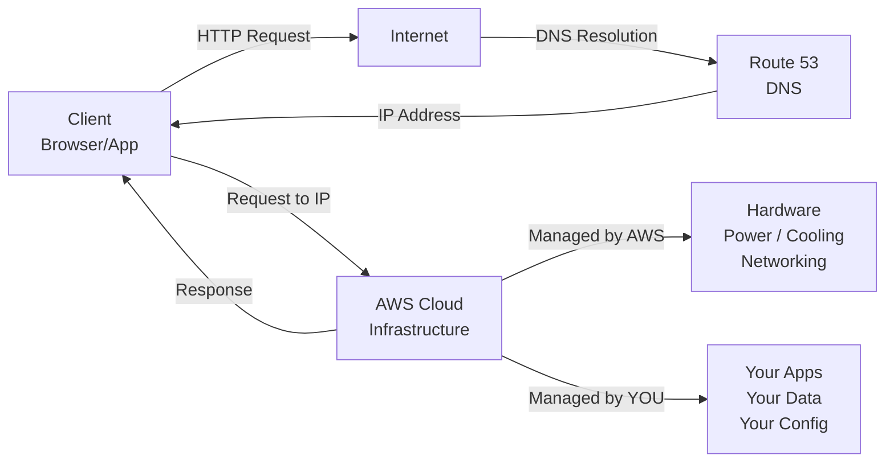

### 5. ⚔️ المقارنات الحاسمة للامتحان

| الوظيفة | الكلمة المفتاحية في الامتحان | متى تختاره؟ |
|---|---|---|
| Traditional IT | "Data center", "hardware purchase", "CAPEX" | سؤال عن التكلفة الأولية العالية |
| Cloud Computing | "On-demand", "pay-as-you-go", "OPEX" | سؤال عن المرونة وتقليل التكلفة |
| Managed Services | "No infrastructure management" | سؤال عن تقليل العبء التشغيلي |

### 6. 🎯 فخاخ الـ Exam

- **الـ Trap:** "A company wants to avoid managing physical servers entirely. Which model should they use?" — **الإجابة الصح:** Cloud Computing / Managed Services لأن AWS تمتلك وتدير الـ hardware بالكامل.
- **الـ Trap:** "What does 'pay-as-you-go' mean in AWS?" — **الإجابة الصح:** تدفع فقط على الـ resources اللي بتستخدمها فعلاً، مفيش minimum fees لمعظم الـ services.
- **الـ Trap:** "Netflix is an example of which type of cloud service?" — **الإجابة الصح:** SaaS (مش IaaS)، لأنها completed product.

### 7. 📊 الـ Cheat Sheet & Metadata

- ✅ **Use Case:** أي شركة محتاجة flexibility في الـ compute/storage بدون CapEx ضخم
- ⚠️ **NOT Use Case:** أنظمة تحتاج latency أقل من 1ms أو data sovereignty صارم جداً
- 💰 **Pricing Model:** Pay-as-you-go — ادفع على ما بتستخدم
- 🔐 **Shared Responsibility:** AWS = security OF the cloud | Customer = security IN the cloud
- 🔑 **Exam Keyword:** "If you see 'on-demand delivery' or 'pay-as-you-go' → الإجابة هي Cloud Computing"

---

## 1.4 — Deployment Models of the Cloud

### 1. 🏚️ أصل المشكلة

مستشفى خاص عنده patient records حساسة جداً (HIPAA compliance) ومش قادر يحطّ كل حاجة على الـ public cloud — بس في نفس الوقت عاوز يستفيد من الـ cloud في الأنظمة الإدارية. المشكلة: مفيش نموذج "واحد يناسب الكل" في الـ cloud deployment.

### 2. ☁️ الحل المعماري

AWS بتقدم 3 نماذج للـ deployment — كل واحد ليه use case معين:

### 3. 🔬 الزبدة التقنية للامتحان

**Private Cloud:**
- بتستخدمه organization واحدة بس
- مش متاح للعموم (not exposed to the public)
- **Complete control** على كل الـ infrastructure
- **Security for sensitive applications**
- تلبية متطلبات business محددة
- مثال: Rackspace (on-premises private cloud)

**Public Cloud:**
- Cloud resources ملك لـ third-party cloud service provider
- بتتوصّل عبر الـ Internet
- Six Advantages of Cloud Computing بتطبّق هنا
- مثال: **AWS, Microsoft Azure, Google Cloud**

**Hybrid Cloud:**
- بتحتفظ بـ بعض الـ servers on-premises
- وبتوسّع بعض الـ capabilities على الـ Cloud
- **Control over sensitive assets** في الـ private infrastructure
- **Flexibility and cost-effectiveness** من الـ public cloud
- مثال: بنك عنده Core Banking System on-premises + customer portal على AWS

> [!important]+ Exam Critical
> الامتحان بيسأل كتير: "Which deployment model gives you FULL CONTROL?" — الإجابة: **Private Cloud**.
> "Which deployment model combines on-premises with cloud?" — الإجابة: **Hybrid Cloud**.

### 4. 🗺️ Architecture Diagram

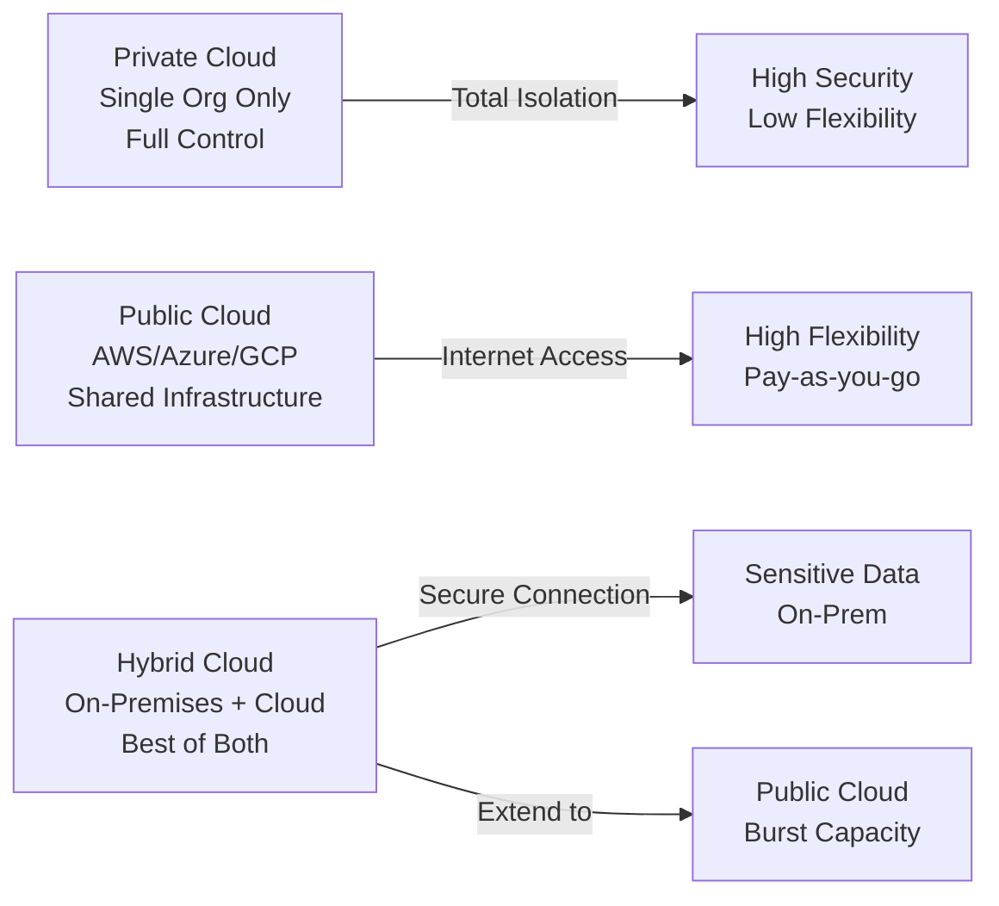

### 5. ⚔️ المقارنات الحاسمة للامتحان

| النموذج | الكلمة المفتاحية | متى تختاره؟ |
|---|---|---|
| Private Cloud | "Full control", "single organization", "sensitive data" | Compliance صارم أو Data Sovereignty |
| Public Cloud | "Pay-as-you-go", "third-party provider", "internet" | Startups, scalable apps |
| Hybrid Cloud | "On-premises + cloud", "extend capabilities", "sensitive assets" | Banks, Healthcare, Government |

### 6. 🎯 فخاخ الـ Exam

- **الـ Trap:** "A bank wants to keep customer PII on-premises but use AWS for analytics. Which model?" — **الإجابة الصح:** Hybrid Cloud.
- **الـ Trap:** "Which model gives you the MOST flexibility?" — **الإجابة الصح:** Public Cloud (مش Hybrid — ده يديك control أكثر بس مش flexibility أكثر).
- **الـ Trap:** "AWS itself is an example of which deployment model?" — **الإجابة الصح:** Public Cloud.

### 7. 📊 الـ Cheat Sheet

- ✅ **Private Cloud Use Case:** Government, Defense, Healthcare (HIPAA)
- ✅ **Public Cloud Use Case:** E-commerce, SaaS, Startups
- ✅ **Hybrid Cloud Use Case:** Banks, Enterprise migrating gradually
- 🔑 **Exam Keyword:** "If you see 'on-premises + cloud' → Hybrid | 'Full control, single org' → Private | 'AWS/Azure/GCP' → Public"

---

## 1.5 — الـ 5 Characteristics of Cloud Computing (NIST Definition)

### 1. 🏚️ أصل المشكلة

NIST (National Institute of Standards and Technology) حدّد 5 خصائص جوهرية لأي service تتسمّى "Cloud Computing". الامتحان بيسأل عنهم مباشرة — وبيحب يحطّ واحد غلط ويخليك تاخده.

### 3. 🔬 الزبدة التقنية للامتحان

**الـ 5 Characteristics بالتفصيل:**

1. **On-demand self service:**
   - المستخدم يـ provision resources **بدون human interaction** من الـ service provider
   - انت بتطلب EC2 instance وبتاخده في ثواني — مفيش موظف بيوافق على طلبك

2. **Broad network access:**
   - Resources متاحة على الـ network
   - بتتوصّل من **diverse client platforms** (mobile, laptop, tablet, desktop)

3. **Multi-tenancy and resource pooling:**
   - **Multiple customers** بيشاركوا نفس الـ infrastructure والـ applications
   - مع ضمان الـ **security and privacy**
   - Multiple customers → serviced from **same physical resources**
   - ده اللي بيخلّي AWS تقدر تقدّم أسعار رخيصة

4. **Rapid elasticity and scalability:**
   - **Automatically and quickly** acquire and dispose resources when needed
   - تـ scale up وتـ scale down بسرعة based on demand
   - مثال: Netflix بتـ scale في وقت الـ prime time وتـ scale down بعده

5. **Measured service:**
   - Usage is **measured** — بتدفع correctly على ما بتستخدمه بالظبط
   - Pay-as-you-go بيتبنى على الـ characteristic ده

> [!important]+ اللي بيجي في الامتحان
> الامتحان بيحب يسألك: "Which characteristic allows multiple customers to share the same physical resources?" — الإجابة: **Resource Pooling / Multi-tenancy**.
> "Which characteristic means you don't need to call AWS to provision resources?" — الإجابة: **On-demand self service**.

### 4. 🗺️ Architecture Diagram

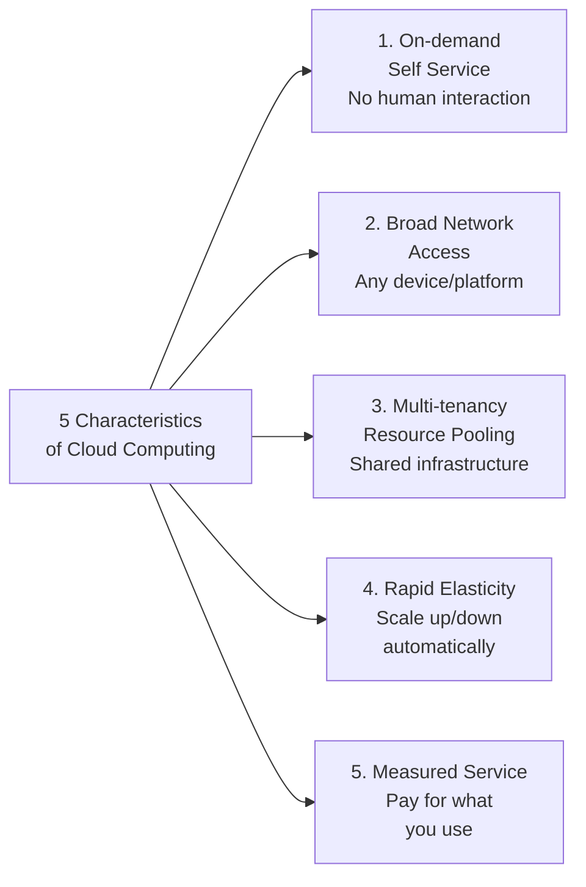

### 5. ⚔️ المقارنات الحاسمة للامتحان

| الـ Characteristic | الكلمة المفتاحية | السؤال النموذجي |
|---|---|---|
| On-demand Self Service | "No human interaction", "provision automatically" | "Who approves resource creation?" |
| Broad Network Access | "Any device", "internet access", "diverse platforms" | "Access from mobile and laptop?" |
| Multi-tenancy | "Shared infrastructure", "multiple customers", "resource pooling" | "How does AWS reduce costs?" |
| Rapid Elasticity | "Auto scale", "quickly acquire", "dispose resources" | "Handle traffic spikes?" |
| Measured Service | "Pay for what you use", "metered", "usage tracking" | "Billing model?" |

### 6. 🎯 فخاخ الـ Exam

- **الـ Trap:** "Which characteristic ensures you only pay for what you consume?" — **الإجابة الصح:** Measured Service (مش On-demand — ده عن الـ provisioning).
- **الـ Trap:** "Multi-tenancy means that different customers can see each other's data." — **الإجابة الصح:** FALSE — Multi-tenancy مع ضمان security وprivacy لكل customer.
- **الـ Trap:** "Elasticity and Scalability are the same thing." — **الإجابة الصح:** Elasticity = auto scale in AND out | Scalability = ability to grow larger.

---

## 1.6 — الـ 6 Advantages of Cloud Computing

### 1. 🏚️ أصل المشكلة

شركة E-commerce كبيرة بتحسب ROI بتاعت الـ cloud migration. المديرين بيسألوا: "ليه ننتقل للـ cloud؟ ما احنا شغالين!" — لازم تقدم لهم 6 arguments قاطعة مبنية على business value.

### 3. 🔬 الزبدة التقنية للامتحان

**الـ 6 Advantages بالتفصيل (دي أكثر حاجة بتيجي في الامتحان):**

1. **Trade Capital Expense (CAPEX) for Operational Expense (OPEX):**
   - مش لازم تشتري hardware — بتدفع **On-Demand**
   - **Reduced Total Cost of Ownership (TCO)** وReduced OPEX
   - من capital investment ثقيل لـ operational expense مرن

2. **Benefit from massive economies of scale:**
   - AWS بتخدم ملايين الـ customers → الأسعار بتنزل مع الوقت
   - "Prices are reduced as AWS is more efficient due to large scale"
   - بتاخد أسعار enterprise وانت startup

3. **Stop guessing capacity:**
   - مع الـ traditional IT كنت بتشتري hardware على تقدير
   - دلوقتي: **Scale based on actual measured usage**
   - مفيش over-provisioning (دفع على حاجة مش بتستخدمها) ومفيش under-provisioning (الـ system يوقع)

4. **Increase speed and agility:**
   - من أسابيع أو أشهر لـ procurement → لـ **دقائق** على AWS
   - بتجرّب وبتـ fail fast وبتـ iterate بسرعة

5. **Stop spending money running and maintaining data centers:**
   - AWS بتتولى الـ infrastructure — انت تركّز على الـ business value

6. **Go global in minutes:**
   - **Leverage the AWS global infrastructure**
   - Deploy application في Tokyo وSão Paulo وFrankfurt في نفس اليوم
   - Latency أقل لعملاءك في كل مكان

> [!important]+ CAPEX vs OPEX — محوري جداً
> **CAPEX (Capital Expenditure):** شراء assets ثابتة مسبقاً (servers, data center) — بتدفع قبل ما تستخدم
> **OPEX (Operational Expenditure):** مصاريف تشغيلية جارية (cloud subscription) — بتدفع على ما بتستخدم
> **TCO (Total Cost of Ownership):** المجموع الكلي لتكلفة الامتلاك والتشغيل

### 4. 🗺️ Architecture Diagram

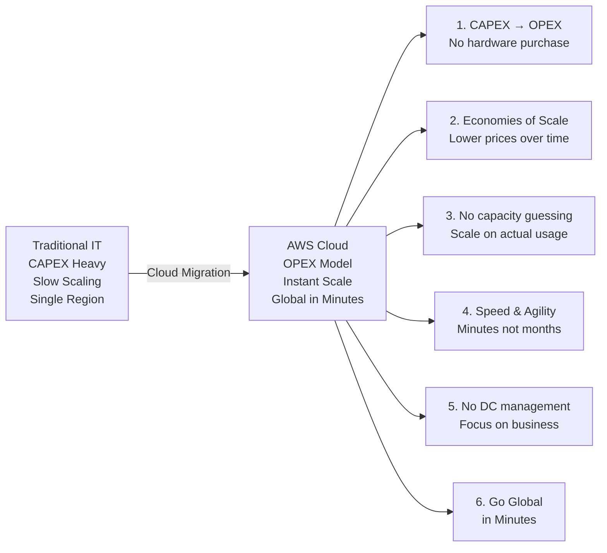

### 5. ⚔️ المقارنات الحاسمة للامتحان

| الـ Advantage | الكلمة المفتاحية | مثال سؤال |
|---|---|---|
| CAPEX → OPEX | "Reduce upfront costs", "TCO", "no hardware" | "How does cloud reduce initial investment?" |
| Economies of Scale | "Lower prices", "AWS efficiency", "shared infrastructure" | "Why does AWS pricing decrease over time?" |
| Stop Guessing Capacity | "Right-size", "actual usage", "no over-provisioning" | "How to avoid paying for unused capacity?" |
| Speed & Agility | "Minutes not months", "faster time-to-market" | "How to launch faster?" |
| No DC Management | "Focus on business", "AWS manages hardware" | "Reduce operational burden?" |
| Go Global in Minutes | "Global infrastructure", "low latency worldwide" | "Deploy in multiple regions quickly?" |

### 6. 🎯 فخاخ الـ Exam

- **الـ Trap:** "Which advantage directly reduces the TOTAL cost including operations?" — **الإجابة الصح:** Reduced TCO (Trade CAPEX for OPEX) — مش بس CAPEX.
- **الـ Trap:** "Economies of scale benefits only large enterprises." — **الإجابة الصح:** FALSE — حتى الـ startups بتستفيد من أسعار AWS المنخفضة اللي بنت على economies of scale بتاعتها.
- **الـ Trap:** "Which advantage helps a startup launch their app in Japan in the same day?" — **الإجابة الصح:** Go Global in Minutes.

### 7. 📊 الـ Cheat Sheet

- 🔑 **Exam Keyword:** "If you see 'reduce upfront cost' → CAPEX to OPEX | 'lower prices due to AWS size' → Economies of Scale | 'no over-provisioning' → Stop Guessing Capacity | 'deploy globally fast' → Go Global in Minutes"

---

## 1.7 — Problems Solved by the Cloud

### 3. 🔬 الزبدة التقنية للامتحان

**الـ Cloud بيحل 6 مشاكل رئيسية:**

| المشكلة | الحل السحابي |
|---|---|
| **Flexibility** | Change resource types when needed |
| **Cost-Effectiveness** | Pay as you go, for what you use |
| **Scalability** | Accommodate larger loads (vertical or horizontal) |
| **Elasticity** | Scale out AND scale-in when needed |
| **High-availability & fault-tolerance** | Build across multiple data centers |
| **Agility** | Rapidly develop, test, and launch software applications |

> [!important]+ فرق مهم: Scalability vs Elasticity
> - **Scalability:** القدرة على الـ grow (scale UP أو scale OUT) لاستيعاب load أكبر
> - **Elasticity:** القدرة على الـ scale OUT وكمان الـ scale IN (shrink back) تلقائياً لما الـ load ينزل
> الـ Elasticity أشمل لأنها بتشمل الاتجاهين.

> [!info] High-Availability vs Fault-Tolerance
> - **High-Availability (HA):** النظام متاح بنسبة عالية (99.9%+) حتى لو في failure
> - **Fault-Tolerance:** النظام يكمّل شغله بالكامل حتى مع وجود failure
> الـ Fault-Tolerance أقوى من الـ HA

---

## 1.8 — Types of Cloud Computing (IaaS, PaaS, SaaS)

### 1. 🏚️ أصل المشكلة

شركة SaaS بتبني CRM application. فريقها مكوّن من Full-Stack developers — مش DevOps engineers. لو اشتروا IaaS هيضيّعوا وقت في إدارة الـ OS والـ networking والـ patching. محتاجين نموذج يخليهم يركّزوا على الـ code بس.

### 2. ☁️ الحل المعماري

AWS بتقدم ثلاث طبقات من الـ cloud service models — كل طبقة بتأخد عن كتافك responsibility أكتر. الأنالوجي: فكّر في الموضوع كـ Pizza:
- **IaaS** = Pizza كاملة بتعملها انت في المطبخ (بتاعت الجيران) — هم بس بيقدّمولك الفرن والخامات
- **PaaS** = Pizza جاهزة للخبز — بس انت بتحط التوبنج بتاعك
- **SaaS** = بتطلب Pizza Delivery — بتاكل بس

### 3. 🔬 الزبدة التقنية للامتحان

**Infrastructure as a Service (IaaS):**
- بيوفّر **building blocks** لـ cloud IT
- بيوفّر: Networking, Computers (VMs), Data Storage
- **Highest level of flexibility**
- سهل المقارنة بالـ traditional on-premises IT
- **AWS Examples:** Amazon EC2
- **Non-AWS Examples:** GCP, Azure, Rackspace, Digital Ocean, Linode

**Platform as a Service (PaaS):**
- بيُزيل الحاجة لإدارة الـ underlying infrastructure
- تركّز على **deployment and management of your applications** بس
- **AWS Examples:** Elastic Beanstalk
- **Non-AWS Examples:** Heroku, Google App Engine, Windows Azure

**Software as a Service (SaaS):**
- **Completed product** — بيشغّله ويديره الـ service provider
- المستخدم بيستخدم الـ software فقط
- **AWS Examples:** Rekognition (ML), many other AWS services
- **Non-AWS Examples:** Google Apps (Gmail), Dropbox, Zoom

**طبقات الـ Responsibility — مين بيدير إيه؟**

| الطبقة | On-Premises | IaaS | PaaS | SaaS |
|---|---|---|---|---|
| Applications | ✅ You | ✅ You | ✅ You | ☁️ AWS |
| Data | ✅ You | ✅ You | ✅ You | ☁️ AWS |
| Runtime | ✅ You | ✅ You | ☁️ AWS | ☁️ AWS |
| Middleware | ✅ You | ✅ You | ☁️ AWS | ☁️ AWS |
| O/S | ✅ You | ✅ You | ☁️ AWS | ☁️ AWS |
| Virtualization | ✅ You | ☁️ AWS | ☁️ AWS | ☁️ AWS |
| Servers | ✅ You | ☁️ AWS | ☁️ AWS | ☁️ AWS |
| Storage | ✅ You | ☁️ AWS | ☁️ AWS | ☁️ AWS |
| Networking | ✅ You | ☁️ AWS | ☁️ AWS | ☁️ AWS |

> [!important]+ دي أكثر جدول بيجي في الامتحان — احفظه كويس!
> كلما اتحرّكنا من IaaS لـ SaaS، AWS بتتحمّل responsibility أكتر وانت أقل.

### 4. 🗺️ Architecture Diagram

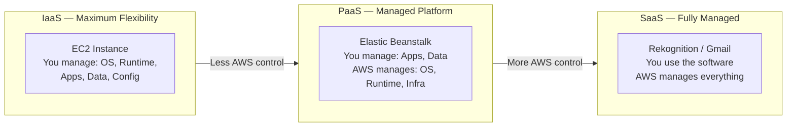

### 5. ⚔️ المقارنات الحاسمة للامتحان

| النموذج | الكلمة المفتاحية | AWS Example | متى تختاره؟ |
|---|---|---|---|
| IaaS | "Maximum control", "VMs", "infrastructure building blocks" | EC2 | لما تحتاج full control على الـ OS |
| PaaS | "Managed platform", "focus on code", "no OS management" | Elastic Beanstalk | Developers مش DevOps |
| SaaS | "Completed product", "end-user application", "fully managed" | Rekognition, Gmail, Zoom | لما تستخدم الـ software مباشرة |

### 6. 🎯 فخاخ الـ Exam

- **الـ Trap:** "Amazon Rekognition is an example of which cloud model?" — **الإجابة الصح:** SaaS — لأنه completed product تستخدمه بـ API بدون أي infrastructure management.
- **الـ Trap:** "Elastic Beanstalk is IaaS because it uses EC2 underneath." — **الإجابة الصح:** FALSE — Elastic Beanstalk هو **PaaS** لأنه بيدير الـ infrastructure نيابةً عنك.
- **الـ Trap:** "Which model gives developers the most flexibility?" — **الإجابة الصح:** IaaS (EC2) — أعلى flexibility لأنك بتتحكم في كل حاجة.

### 7. 📊 الـ Cheat Sheet

- 🔑 **Exam Keyword:** "If you see 'Elastic Beanstalk' → PaaS | 'EC2 with full control' → IaaS | 'Rekognition/Gmail/Zoom' → SaaS"
- 🔑 **Memory Trick:** **IaaS** = Infrastructure (أنت المهندس) | **PaaS** = Platform (أنت الـ Developer) | **SaaS** = Software (أنت المستخدم)

---

## 1.9 — AWS Pricing Model

### 1. 🏚️ أصل المشكلة

شركة Logistics كبيرة كانت بتدفع $50,000/شهر على data center — fixed cost سواء استخدموا 10% أو 100% من الـ capacity. مع الـ cloud، الهدف إن تدفع بالظبط على ما بتستخدم.

### 3. 🔬 الزبدة التقنية للامتحان

**AWS لها 3 Pricing Fundamentals:**

1. **Compute:**
   - بتدفع على **compute time** — الوقت اللي الـ VM/Function بتشتغل فيه
   - مثال: EC2 بتدفع per-second أو per-hour

2. **Storage:**
   - بتدفع على **data stored in the Cloud**
   - مثال: S3 بتدفع per GB stored

3. **Data Transfer OUT of the Cloud:**
   - **Data transfer IN is FREE** (بيانات داخلة لـ AWS = مجاناً)
   - بتدفع على **الـ data اللي بتطلع** من AWS للإنترنت
   - ده بيحل الـ expensive issue في التقليدي

> [!important]+ قاعدة ذهبية في الأسعار
> **Inbound (IN) to AWS = FREE**
> **Outbound (OUT) from AWS = PAID**
> دي واحدة من أكتر الحاجات اللي بتيجي في الامتحان!

**ليه الـ Pricing ده بيحل مشكلة التقليدي؟**
- مفيش fixed costs ضخمة
- بتدفع على ما بتستخدم فعلاً
- بتوفّر الـ CAPEX وتحوّله لـ OPEX

### 4. 🗺️ Architecture Diagram

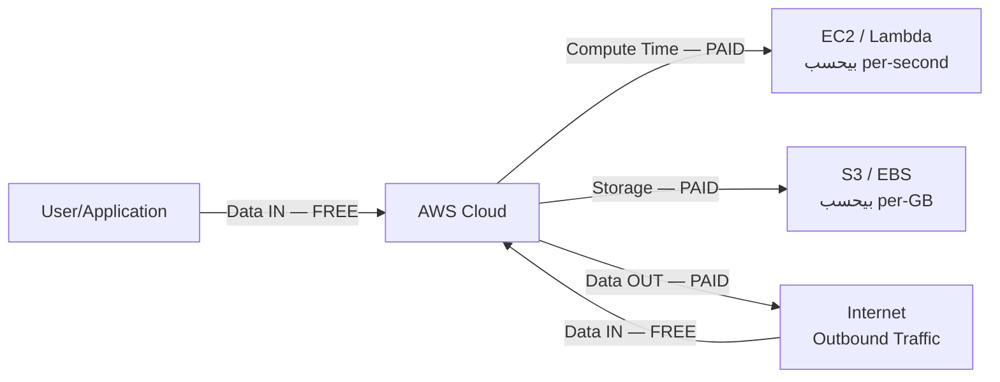

### 5. ⚔️ المقارنات الحاسمة للامتحان

| نوع التكلفة | الاتجاه | مدفوع؟ |
|---|---|---|
| Data Transfer INTO AWS | Inbound | ✅ FREE |
| Data Transfer OUT of AWS | Outbound | 💰 PAID |
| Compute (EC2/Lambda runtime) | Running time | 💰 PAID |
| Storage (S3, EBS, RDS) | Data at rest | 💰 PAID |

### 6. 🎯 فخاخ الـ Exam

- **الـ Trap:** "Which direction of data transfer in AWS is free?" — **الإجابة الصح:** Data transfer **INTO** AWS (Inbound) — الـ Outbound بتدفع عليه.
- **الـ Trap:** "A company transfers 1TB from their data center TO S3. What's the transfer cost?" — **الإجابة الصح:** $0 — لأن Inbound = Free.

---

## 1.10 — AWS Cloud History & Numbers

### 3. 🔬 الزبدة التقنية للامتحان

**تاريخ AWS (Timeline مهم):**
- **2002:** AWS launched **internally** داخل Amazon
- **2003:** Amazon infrastructure recognized as a core strength — فكرة تسويقها
- **2004:** First **public launch** with **SQS** (Simple Queue Service)
- **2006:** Re-launched publicly with **SQS, S3, and EC2**
- **2007:** Launched in **Europe** (أول expansion خارج أمريكا)

**أرقام AWS الحالية (كما في 2024):**
- **$90 billion** in annual revenue in 2023
- **31% market share** in Q1 2024
- Microsoft Azure في المركز الثاني بـ **25%**
- **13th consecutive year** كـ Pioneer and Leader في Gartner Magic Quadrant
- أكتر من **1,000,000 active users**

**AWS Cloud Use Cases:**
- Enterprise IT, Backup & Storage, Big Data Analytics
- Website Hosting, Mobile & Social Apps
- **Gaming** — AWS بتستخدمها كبرى شركات الـ gaming

> [!info] لـ Context
> أول service AWS أطلقتها للعموم كانت SQS سنة 2004 — مش EC2 ولا S3. خلي بالك من التسلسل الزمني.

---

# PART 2 — AWS Global Infrastructure

---

## 2.1 — AWS Global Infrastructure Overview

### 3. 🔬 الزبدة التقنية للامتحان

**مكونات الـ AWS Global Infrastructure الـ 4:**
1. **AWS Regions**
2. **AWS Availability Zones (AZs)**
3. **AWS Data Centers** (داخل الـ AZs)
4. **AWS Edge Locations / Points of Presence**

---

## 2.2 — AWS Regions

### 1. 🏚️ أصل المشكلة

شركة Banking في أوروبا محتاجة تتأكد إن بيانات الـ customers مش بتخرج من حدود الاتحاد الأوروبي (GDPR compliance). لو رفعت infrastructure في us-east-1، كده هتخترق القانون الأوروبي.

### 3. 🔬 الزبدة التقنية للامتحان

**تعريف الـ AWS Region:**
- مجموعة من الـ **data centers** متوزّعة جغرافياً
- كل Region عندها **اسم** (مثال: us-east-1, eu-west-3)
- **معظم الـ AWS services هي Region-scoped** (بتشتغل في region معينة بس)
- الـ resources في region مش automatically visible من regions تانية

**الـ 4 عوامل لاختيار الـ AWS Region:**
1. **Compliance with data governance and legal requirements:**
   - البيانات **مش بتخرج من الـ region** بدون إذنك الصريح
   - GDPR, Financial Regulations, Healthcare Compliance

2. **Proximity to customers:**
   - أقرب لعملاءك = **latency أقل** = user experience أحسن
   - Egyptian fintech مستخدمها في القاهرة → اختار **me-south-1 (Bahrain)** أو **eu-south-1** مثلاً

3. **Available services within a Region:**
   - **New services and new features aren't available in every Region**
   - لو محتاج service جديدة، اختار region بتدعمها

4. **Pricing:**
   - **Pricing varies region to region**
   - الأسعار متاحة على the service pricing page
   - مثال: us-east-1 عادةً أرخص من ap-southeast-1

> [!important]+ الـ 4 عوامل — CAPS
> **C**ompliance → **A**vailability of Services → **P**roximity → **P**ricing
> (أو تتذكّرها: "Can Any Place Pay?")

### 4. 🗺️ Architecture Diagram

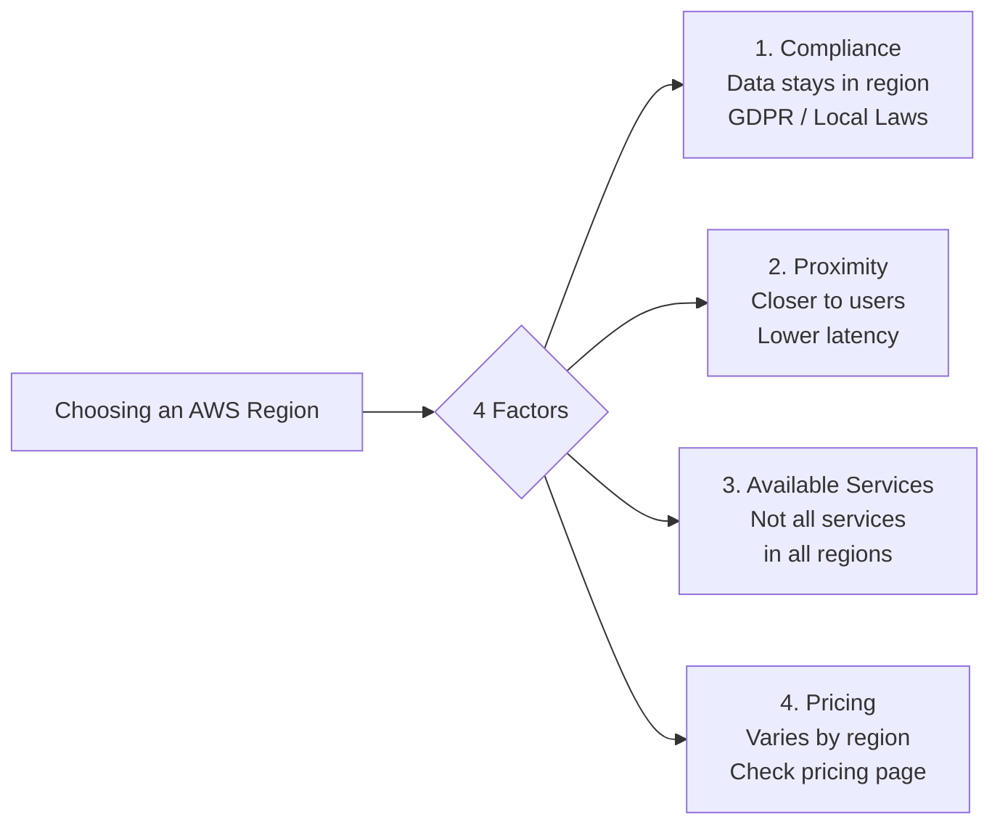

### 5. ⚔️ المقارنات الحاسمة للامتحان

| العامل | متى هو الأهم؟ | مثال |
|---|---|---|
| Compliance | دايماً أولوية لو في legal requirement | GDPR, Egyptian Data Law |
| Proximity | لما الـ latency حرجة | Gaming, Real-time Trading |
| Available Services | لما محتاج service معينة | Bedrock, Wavelength |
| Pricing | لما التكلفة هي الأولوية | Non-production workloads |

### 6. 🎯 فخاخ الـ Exam

- **الـ Trap:** "A US company wants to store European customer data in AWS. What's the MOST important factor?" — **الإجابة الصح:** Compliance (GDPR) — Proximity مهم بس الـ Compliance أهم.
- **الـ Trap:** "Are all AWS services available in all regions?" — **الإجابة الصح:** NO — New services and features aren't available in every region.
- **الـ Trap:** "Data in us-east-1 automatically replicates to eu-west-1 for HA." — **الإجابة الصح:** FALSE — Data stays in the region unless YOU configure replication.

### 7. 📊 الـ Cheat Sheet

- 🔑 **Exam Keyword:** "If you see 'data must stay in Europe' → Compliance / Region selection | 'latency for users in Asia' → Proximity | 'new AWS service not available' → check Available Services"
- 🔐 **Shared Responsibility:** AWS بتضمن إن الـ data مش بتتحرك بين regions بدون إذنك — انت مسؤول عن تفعيل الـ replication

---

## 2.3 — AWS Availability Zones (AZs)

### 1. 🏚️ أصل المشكلة

شركة E-commerce عملت deployment على server واحد في data center واحد في Cairo. جاء flood في المنطقة دي — وبعدها الموقع وقع لـ 3 أيام وخسروا ملايين. الـ single point of failure هو عدو الـ High Availability.

### 3. 🔬 الزبدة التقنية للامتحان

**تعريف الـ Availability Zone:**
- كل Region فيها **عدة AZs** (usually 3, minimum 3, maximum 6)
- **Examples:**
  - ap-southeast-2a (Sydney AZ A)
  - ap-southeast-2b (Sydney AZ B)
  - ap-southeast-2c (Sydney AZ C)

**خصائص الـ AZ:**
- كل AZ = **one or more discrete data centers** مع:
  - Redundant power ✅
  - Redundant networking ✅
  - Redundant connectivity ✅
- **Separate from each other** = معزولة عن الكوارث
- **Connected with high bandwidth, ultra-low latency networking** = تقدر تـ replicate بسرعة

> [!important]+ قاعدة الـ 3 AZs
> كل Region عندها على الأقل **3 AZs**. دي قاعدة مهمة في الامتحان.
> AZ name = Region name + letter (a, b, c, d…)

### 4. 🗺️ Architecture Diagram

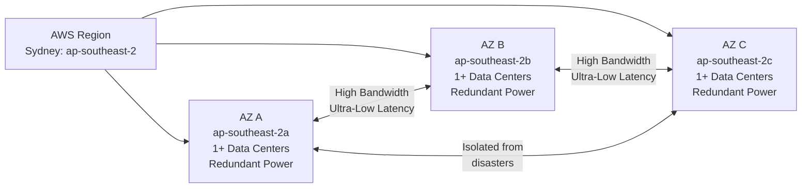

### 5. ⚔️ المقارنات الحاسمة للامتحان

| المفهوم | التعريف | نطاق الفشل |
|---|---|---|
| Data Center | مبنى واحد فيه servers | Building-level failure |
| Availability Zone | مجموعة Data Centers معزولة | Zone-level failure |
| Region | مجموعة AZs | Region-level failure (نادر جداً) |

### 6. 🎯 فخاخ الـ Exam

- **الـ Trap:** "AZ = single data center." — **الإجابة الصح:** FALSE — AZ = one OR MORE discrete data centers.
- **الـ Trap:** "How many AZs does a region typically have?" — **الإجابة الصح:** Usually 3, min 3, max 6.
- **الـ Trap:** "AZs in the same region are on the same physical premises." — **الإجابة الصح:** FALSE — AZs are SEPARATE and isolated from each other.

---

## 2.4 — AWS Edge Locations / Points of Presence

### 1. 🏚️ أصل المشكلة

مستخدم في المغرب بيحاول يفتح موقع E-commerce مستضاف على S3 في us-east-1 (Virginia). كل request بيقطع المحيط الأطلسي → latency عالية → user experience سيئة → bounce rate عالي.

### 3. 🔬 الزبدة التقنية للامتحان

**AWS Points of Presence:**
- **400+ Edge Locations** و**10+ Regional Caches**
- موزّعة على **90+ cities** في **40+ countries**
- الـ content بيتوصّل لـ end users بـ **lower latency**
- بتستخدمها الـ **CloudFront CDN**

> [!info] فرق مهم: Region vs Edge Location
> - **Region:** فيها compute, storage, databases — بتعمل فيها infrastructure كامل
> - **Edge Location:** بتستخدمها لـ caching وتوصيل الـ content فقط — مش بتعمل فيها EC2 مثلاً

### 4. 🗺️ Architecture Diagram

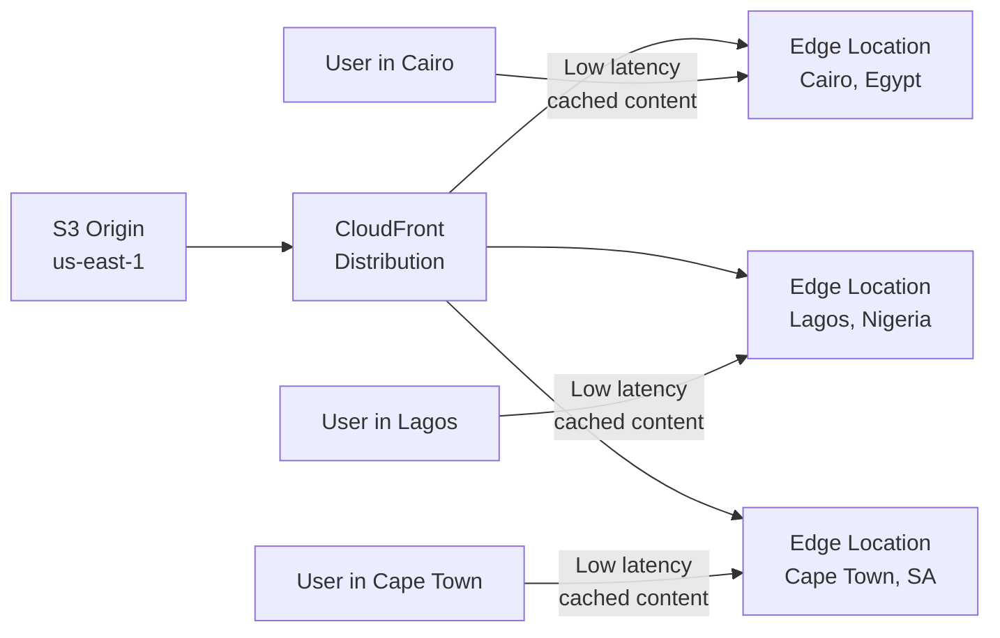

### 6. 🎯 فخاخ الـ Exam

- **الـ Trap:** "Can you deploy EC2 instances in Edge Locations?" — **الإجابة الصح:** NO — Edge Locations هي بس لـ content caching وCDN.
- **الـ Trap:** "How many Edge Locations does AWS have?" — **الإجابة الصح:** 400+ Edge Locations (مش 400+ Regions).

---

## 2.5 — Global vs Regional Services

### 3. 🔬 الزبدة التقنية للامتحان

**AWS Global Services** (مش مرتبطة بـ Region معينة):
- **IAM** — Identity and Access Management
- **Route 53** — DNS Service
- **CloudFront** — Content Delivery Network
- **WAF** — Web Application Firewall

**AWS Region-Scoped Services** (بتختار ليها Region):
- **Amazon EC2** — IaaS
- **Elastic Beanstalk** — PaaS
- **Lambda** — Function as a Service (FaaS)
- **Rekognition** — SaaS/ML

> [!important]+ الـ Global Services — احفظهم
> **IAM, Route 53, CloudFront, WAF** = Global
> كل service تانية تقريباً = Regional

---

## 2.6 — Shared Responsibility Model

### 1. 🏚️ أصل المشكلة

بعد حادثة أمنية، شركة سألت: "مين المسؤول؟ AWS ولا احنا؟" الإجابة مش بسيطة — AWS بتتحمّل جزء والـ customer بيتحمّل جزء. لو مفهمتش الفرق ده، هتفضل في الظلام وممكن تتعرّض لـ breach.

### 3. 🔬 الزبدة التقنية للامتحان

**الـ Shared Responsibility Model:**

**AWS = Security OF the Cloud:**
- Physical security of data centers
- Hardware infrastructure (servers, storage, networking)
- Global infrastructure (Regions, AZs, Edge Locations)
- Managed services (RDS → AWS manages OS patching)

**Customer = Security IN the Cloud:**
- Data protection and encryption
- IAM (who has access to what)
- OS configuration and patching (for EC2)
- Network and firewall configuration
- Application-level security

> [!important]+ الـ Golden Rule
> **AWS = Hardware & Physical + Global Infrastructure**
> **Customer = Everything you configure, your data, your access**

### 5. ⚔️ المقارنات الحاسمة للامتحان

| الـ Responsibility | AWS | Customer |
|---|---|---|
| Physical data center security | ✅ AWS | ❌ |
| Hardware maintenance | ✅ AWS | ❌ |
| EC2 OS patching | ❌ | ✅ Customer |
| RDS OS patching | ✅ AWS | ❌ |
| S3 data encryption | ❌ | ✅ Customer |
| IAM user management | ❌ | ✅ Customer |
| Network ACL config | ❌ | ✅ Customer |
| DDoS protection (basic) | ✅ AWS Shield Standard | ❌ |

> [!important]+ الفرق الحاسم: EC2 vs RDS
> **EC2:** انت مسؤول عن الـ OS patching (لأنه IaaS)
> **RDS:** AWS مسؤولة عن الـ OS patching (لأنه Managed Service)

### 6. 🎯 فخاخ الـ Exam

- **الـ Trap:** "Who is responsible for patching the OS of an Amazon RDS database?" — **الإجابة الصح:** AWS — لأن RDS هو managed service.
- **الـ Trap:** "Who is responsible for data encryption in S3?" — **الإجابة الصح:** Customer — انت اللي بتفعّل الـ encryption ومسؤول عن الـ data.
- **الـ Trap:** "AWS is responsible for security IN the cloud." — **الإجابة الصح:** FALSE — AWS مسؤولة عن security OF the cloud. انت مسؤول عن security IN the cloud.

### 7. 📊 الـ Cheat Sheet

- 🔑 **Exam Keyword:** "If you see 'physical security' → AWS | 'data encryption, IAM, OS patching on EC2' → Customer | 'RDS OS patching' → AWS (managed service)"

---

## 2.7 — AWS Acceptable Use Policy

### 3. 🔬 الزبدة التقنية للامتحان

**AWS Acceptable Use Policy يحظر:**
- **No Illegal, Harmful, or Offensive Use or Content**
- **No Security Violations** (hacking, penetration testing بدون إذن)
- **No Network Abuse** (DoS attacks, spam)
- **No E-Mail or Other Message Abuse** (bulk spam)

---

# PART 3 — Global Applications in AWS

---

## 3.1 — ليه نبني Global Applications؟

### 1. 🏚️ أصل المشكلة

شركة Egyptian FinTech بتتوسع لأوروبا وآسيا. لو الـ infrastructure كلها في us-east-1، مستخدم في Tokyo هيحسّ بـ latency 150ms+ في كل request. تجربة الـ user سترخص والمنافسون الإقليميين هيكسبوا السوق.

### 3. 🔬 الزبدة التقنية للامتحان

**أسباب بناء Global Application:**

1. **Decreased Latency:**
   - الـ latency = الوقت اللي الـ packet بياخده يوصل للـ server
   - باكت من Asia للـ US بياخد وقت طويل
   - Deploy your applications **closer to your users** to decrease latency

2. **Disaster Recovery (DR):**
   - لو AWS region اتضرّبت (earthquake, storms, power shutdown, politics)
   - تقدر **fail-over to another region** والـ app يفضل شغّال
   - DR plan مهم لـ availability عالية

3. **Attack Protection:**
   - **Distributed global infrastructure is harder to attack**
   - لو الـ infrastructure موزّعة، الـ attacker محتاج يضرب أماكن كتير في نفس الوقت

---

## 3.2 — Amazon Route 53

### 1. 🏚️ أصل المشكلة

شركة SaaS عندها users في 5 قارات. لو كل الـ traffic بيروح لـ server واحد في us-east-1، هيتحمّل load ضخم والـ users البعيدين هيعانوا من latency عالية. محتاج "ذكاء" في توجيه الـ traffic.

### 2. ☁️ الحل المعماري

Route 53 = الـ "Smart Post Office" بتاع AWS. بتديه domain name وهو بيعرف يوجّه كل user لأقرب وأسرع server ليه — مع دعم Disaster Recovery تلقائي.

### 3. 🔬 الزبدة التقنية للامتحان

**Route 53 = Managed DNS (Domain Name System):**
- DNS = مجموعة rules وrecords بتساعد الـ clients يفهموا إزاي يوصلوا لـ server من خلال URLs

**أنواع الـ DNS Records (مهمة للامتحان):**
| نوع الـ Record | التعريف | مثال |
|---|---|---|
| **A Record** | hostname → IPv4 | www.google.com → 12.34.56.78 |
| **AAAA Record** | hostname → IPv6 | www.google.com → 2001:0db8:... |
| **CNAME Record** | hostname → hostname | search.google.com → www.google.com |
| **Alias Record** | hostname → AWS resource | example.com → ELB/CloudFront/S3/RDS |

**Routing Policies (High-level for CLF-C02):**

1. **Simple Routing Policy:**
   - No health checks
   - DNS query → single IP returned
   - مثال: foo.example.com → 11.22.33.44

2. **Weighted Routing Policy:**
   - توزيع الـ traffic بـ نسب مئوية على servers مختلفة
   - مثال: 70% → Server A, 20% → Server B, 10% → Server C
   - **Use case:** A/B Testing, gradual deployment

3. **Latency Routing Policy:**
   - بيوجّه المستخدم لـ region الأقل latency ليه
   - **Use case:** Global application performance optimization

4. **Failover Routing Policy:**
   - Health check على الـ Primary server
   - لو الـ Primary اتعطل → Route 53 بيحوّل لـ Failover (Secondary)
   - **Use case:** Disaster Recovery

> [!important]+ Route 53 = Global Service
> Route 53 مش Region-scoped — هو **Global Service**. لازم تعرف ده لأن الامتحان بيحب يسأل عن الـ Global services.

### 4. 🗺️ Architecture Diagram

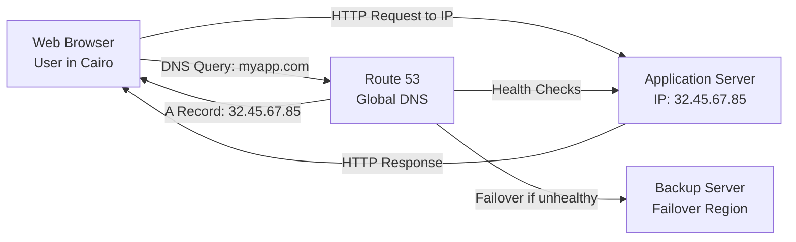

### 5. ⚔️ المقارنات الحاسمة للامتحان

| الـ Policy | الكلمة المفتاحية | متى تختارها؟ |
|---|---|---|
| Simple | "Single server", "no health checks" | Simple apps, single destination |
| Weighted | "A/B testing", "gradual rollout", "traffic split" | Blue/Green deployment |
| Latency | "Closest region", "lowest latency", "performance" | Global users, performance optimization |
| Failover | "Disaster recovery", "health check", "active-passive" | HA + DR requirements |

### 6. 🎯 فخاخ الـ Exam

- **الـ Trap:** "Route 53 is a regional service." — **الإجابة الصح:** FALSE — Route 53 is a **Global Service**.
- **الـ Trap:** "Which routing policy automatically routes traffic to the closest AWS region?" — **الإجابة الصح:** **Latency Routing Policy** (مش Geolocation — ده بيـ route based on location مش latency).
- **الـ Trap:** "CNAME record maps a hostname to an IP address." — **الإجابة الصح:** FALSE — CNAME maps hostname to **hostname**. A Record maps hostname to IP.

### 7. 📊 الـ Cheat Sheet

- ✅ **Use Case:** DNS management, traffic routing, DR, latency optimization
- 💰 **Pricing Model:** Per hosted zone + per DNS query
- 🔑 **Exam Keyword:** "If you see 'route users to closest region' → Latency Policy | 'disaster recovery DNS' → Failover Policy | 'DNS management' → Route 53"

---

## 3.3 — Amazon CloudFront

### 1. 🏚️ أصل المشكلة

شركة Media بتـ stream video content من S3 bucket في us-east-1. المستخدم في Cape Town بيفتح الفيديو فيبقى slow وبيعمل buffer كل شوية لأن الـ video data بيجي من Virginia. الـ CDN هو الحل.

### 2. ☁️ الحل المعماري

CloudFront = الـ "محل فرعي" اللي بيبيع من مخزون المحل الأصلي. بدل ما كل مستخدم يجيب البضاعة من المستودع الرئيسي في Virginia، في فروع (Edge Locations) قريبة منه — وهو بياخد من أقرب فرع.

### 3. 🔬 الزبدة التقنية للامتحان

**CloudFront = Content Delivery Network (CDN):**
- بيحسّن الـ **read performance** — الـ content بيتـ cache عند الـ edge
- **Hundreds of Points of Presence** globally (edge locations + caches)
- بيحسّن **user experience**
- **DDoS protection** (worldwide distribution) — مع integration مع:
  - **AWS Shield**
  - **AWS Web Application Firewall (WAF)**

**CloudFront Origins (من فين بيجيب الـ content):**

1. **S3 Bucket:**
   - لـ distributing files وcaching them at the edge
   - لـ uploading files to S3 through CloudFront
   - مؤمّنة بـ **Origin Access Control (OAC)**

2. **VPC Origin:**
   - لـ applications hosted في VPC private subnets
   - Private Application Load Balancer / Network Load Balancer / EC2 Instances

3. **Custom Origin (HTTP):**
   - S3 website (لازم تفعّل الـ bucket كـ static S3 website أولاً)
   - أي public HTTP backend (مثال: Public ALB)

**كيف CloudFront بيشتغل:**
1. User في Cairo يطلب /beach.jpg
2. CloudFront Edge Location في Cairo بتدور على الـ file في الـ local cache
3. لو مش موجودة (cache miss) → بتروح للـ Origin (S3 أو HTTP)
4. بتـ cache الـ response لـ TTL معين (قد يكون يوم)
5. الـ request الجاية لنفس الـ file → من الـ cache مباشرة (cache hit)

> [!important]+ CloudFront = Global Service
> CloudFront مش Region-scoped. هو Global Service بيشتغل عبر الـ Edge Locations كلها.

### 4. 🗺️ Architecture Diagram

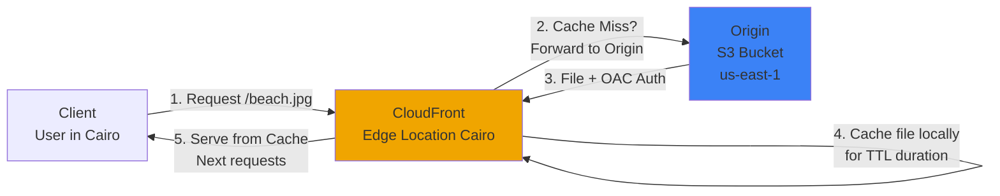

### 5. ⚔️ المقارنات الحاسمة للامتحان

**CloudFront vs S3 Cross-Region Replication:**

| الخاصية | CloudFront | S3 Cross-Region Replication |
|---|---|---|
| نوع | Global Edge Network — CDN | Per-Region Replication |
| الـ Files | Cached for TTL (maybe a day) | Updated in near real-time |
| الـ Write Access | Read-only cached content | Read only (للـ destination) |
| الاستخدام المثالي | Static content available everywhere | Dynamic content, low-latency in FEW regions |
| الإعداد | Single distribution | Must be set up for each region |

> [!important]+ الفرق الحاسم في الامتحان
> **CloudFront** = Static content, cache, global reach
> **S3 Cross-Region Replication** = Dynamic content, near real-time, specific regions

### 6. 🎯 فخاخ الـ Exam

- **الـ Trap:** "CloudFront can be used to speed up dynamic content like API responses." — **الإجابة الصح:** CloudFront **primarily** optimizes cacheable (static) content. For dynamic/non-cacheable content, Global Accelerator is better.
- **الـ Trap:** "To secure CloudFront with S3, you should make the S3 bucket public." — **الإجابة الصح:** FALSE — استخدم **Origin Access Control (OAC)** وخلّي الـ bucket private.
- **الـ Trap:** "CloudFront is a regional service." — **الإجابة الصح:** FALSE — CloudFront is a **Global Service**.

### 7. 📊 الـ Cheat Sheet

- ✅ **Use Case:** Static websites, image/video delivery, global content distribution
- ⚠️ **NOT Use Case:** Real-time dynamic API calls (use Global Accelerator instead)
- 💰 **Pricing Model:** Per GB transferred + per HTTP request
- 🔐 **Shared Responsibility:** AWS manages edge network | Customer manages content, OAC config, WAF rules
- 🔑 **Exam Keyword:** "Cache at edge", "CDN", "reduce latency for static content" → CloudFront

---

## 3.4 — S3 Transfer Acceleration

### 3. 🔬 الزبدة التقنية للامتحان

**S3 Transfer Acceleration:**
- **Accelerate global uploads & downloads** into Amazon S3
- **كيف بيشتغل:**
  1. File في USA محتاج يتـ upload لـ S3 bucket في Australia
  2. بدل ما يمشي على الـ public internet (slow)
  3. بيتبعت لـ **AWS Edge Location** في USA أولاً (fast, public internet)
  4. من الـ Edge Location لـ S3 bucket في Australia عبر الـ **AWS private network** (fast)
- الـ private AWS network أسرع وأكثر موثوقية من الـ public internet

> [!info] S3 Transfer Acceleration = Edge + Private Network
> الـ magic بتاعتها: استخدام الـ AWS global backbone network بدل الـ public internet للجزء الأطول من الرحلة.

### 5. ⚔️ المقارنات الحاسمة للامتحان

| الخاصية | S3 Standard Upload | S3 Transfer Acceleration |
|---|---|---|
| الطريق | Public internet كله | Edge Location → AWS private network |
| السرعة | Standard | أسرع (خصوصاً لمسافات طويلة) |
| التكلفة | Standard S3 pricing | إضافي على Standard |
| الاستخدام | Uploads من regions قريبة | Uploads من regions بعيدة |

---

## 3.5 — AWS Global Accelerator

### 1. 🏚️ أصل المشكلة

شركة Gaming عندها application على ALB في us-east-1. اللاعبين في India وEurope بيعانوا من packet loss وhigh latency لأن الـ traffic بيسافر على الـ public internet اللي فيه congestion وrouting غير مثالي.

### 2. ☁️ الحل المعماري

Global Accelerator = "Fast Lane" خاص على الـ AWS backbone network. بدل ما الـ traffic يسافر على الـ highway العام (public internet)، بيدخل أقرب AWS Edge Location وبعدين يمشي على الـ AWS private motorway المخصص.

### 3. 🔬 الزبدة التقنية للامتحان

**AWS Global Accelerator:**
- بيحسّن الـ **global application availability and performance**
- بيستخدم الـ **AWS internal network** to optimize the route
- **60% improvement** في performance
- **2 Anycast IPs** بيتعملوا لـ application
- Traffic بيتبعت عبر **Edge Locations**
- الـ Edge Locations بتبعت الـ traffic للـ application

**انتبه:** اللي بيبدأ من الـ Users → Edge Location → AWS private network → ALB/NLB/EC2

> [!important]+ الفرق الجوهري: Global Accelerator vs CloudFront
> **CloudFront:** Content is **SERVED** from Edge (cached)
> **Global Accelerator:** Traffic is **PROXIED** through Edge to the application (no caching)

### 4. 🗺️ Architecture Diagram

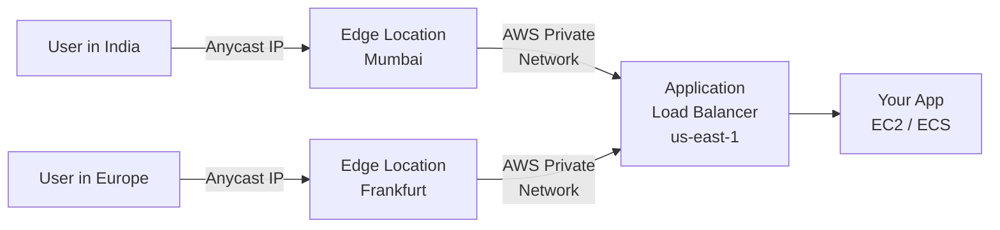

### 5. ⚔️ المقارنات الحاسمة للامتحان

| الخاصية | CloudFront | Global Accelerator |
|---|---|---|
| الـ Use Case | Static cacheable content | Dynamic, non-cacheable apps |
| الـ Caching | ✅ Yes (TTL-based) | ❌ No caching |
| الـ Proxy | Content served from edge | Packets proxied to app |
| الـ Protocol | HTTP/HTTPS | TCP, UDP, HTTP |
| الـ IPs | Dynamic | **2 Static Anycast IPs** |
| DDoS Protection | ✅ AWS Shield | ✅ AWS Shield |
| الـ Use case keywords | "images, videos, static files" | "static IP", "fast failover", "TCP/UDP" |

**كلاهما:**
- يستخدم the AWS global network and edge locations
- يتكامل مع AWS Shield لـ DDoS protection

**متى تختار Global Accelerator:**
- Good for HTTP use cases requiring **static IP addresses**
- Good for HTTP use cases requiring **deterministic, fast regional failover**
- Good for **TCP or UDP** applications

### 6. 🎯 فخاخ الـ Exam

- **الـ Trap:** "Global Accelerator caches content at the edge like CloudFront." — **الإجابة الصح:** FALSE — Global Accelerator does NOT cache; it proxies traffic.
- **الـ Trap:** "A company needs 2 static IPs for their global application. Which service?" — **الإجابة الصح:** **Global Accelerator** — بيوفّر 2 Anycast static IPs.
- **الـ Trap:** "Both CloudFront and Global Accelerator use the AWS global network." — **الإجابة الصح:** TRUE — كلاهما يستخدم الـ AWS global network وEdge Locations.

### 7. 📊 الـ Cheat Sheet

- ✅ **Global Accelerator Use Case:** Online gaming (TCP/UDP), real-time bidding, IoT, static IPs needed, fast failover
- ✅ **CloudFront Use Case:** Images, videos, websites, static files, API caching
- 🔑 **Exam Keyword:** "If you see 'static IP + global' → Global Accelerator | 'cache + CDN' → CloudFront | 'TCP/UDP global' → Global Accelerator"

---

## 3.6 — AWS Outposts

### 1. 🏚️ أصل المشكلة

بنك مركزي عنده Core Banking System on-premises بسبب regulatory requirements — مش ممكن يحوّله للـ cloud. بس عاوز يستخدم AWS services (EC2, RDS, S3) جنب الـ on-premises systems مع نفس الـ APIs والـ tools بتاعت AWS.

### 2. ☁️ الحل المعماري

AWS Outposts = "AWS بتيجيلك انت" بدل ما تروح ليها. AWS بتبعت rack مادي (server rack) لـ data center بتاعك، بيشتغل بنفس software ونفس APIs بتاعت AWS.

### 3. 🔬 الزبدة التقنية للامتحان

**AWS Outposts:**
- Hybrid Cloud solution للشركات اللي بتحتاج on-premises + cloud
- AWS بتوفّر **server racks** بنفس الـ AWS infrastructure, services, APIs & tools
- AWS بتـ **setup وتـ manage** الـ Outposts Racks في data center بتاعك
- انت مسؤول عن الـ **physical security** of the Outposts Rack (ده داخل بنايتك)

**Benefits:**
- **Low-latency access** to on-premises systems (microseconds)
- **Local data processing** — البيانات ما بتخرجش من premises
- **Data residency** — compliance مع الـ data sovereignty laws
- **Easier migration** from on-premises to the cloud
- **Fully managed service** (AWS بتدير الـ software stack)

**Services تشتغل على Outposts:**
- Amazon EC2 | Amazon EBS | Amazon S3
- Amazon EKS | Amazon ECS
- Amazon RDS | Amazon EMR

> [!important]+ الـ Physical Security Exception
> في كل الـ Shared Responsibility Model، AWS مسؤولة عن الـ physical security.
> **الاستثناء الوحيد:** AWS Outposts — انت مسؤول عن الـ physical security لأن الـ rack في مكانك.

### 4. 🗺️ Architecture Diagram

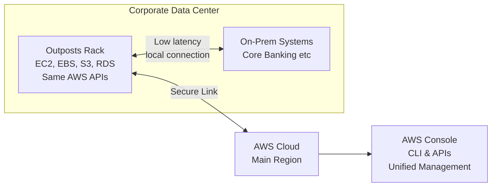

### 5. ⚔️ المقارنات الحاسمة للامتحان

| الخاصية | AWS Outposts | AWS Local Zones | AWS WaveLength |
|---|---|---|---|
| الموقع | داخل data center بتاعك | مدينة قريبة | داخل 5G carrier network |
| الـ Latency Target | Microseconds (on-prem) | Milliseconds (city-level) | Sub-millisecond (5G) |
| الـ Use Case | Data residency, compliance | City-level latency | 5G mobile apps |
| مين بيدير الـ Hardware؟ | AWS (انت بس Physical Security) | AWS | AWS |

### 6. 🎯 فخاخ الـ Exam

- **الـ Trap:** "With AWS Outposts, AWS manages ALL security including physical security." — **الإجابة الصح:** FALSE — Customer is responsible for **physical security** of the Outposts Rack.
- **الـ Trap:** "A company needs to run AWS services on-premises due to data residency laws. Which service?" — **الإجابة الصح:** **AWS Outposts**.
- **الـ Trap:** "Outposts is a way to extend on-premises infrastructure to AWS Cloud." — **الإجابة الصح:** It's the opposite — it extends **AWS Cloud TO on-premises**.

### 7. 📊 الـ Cheat Sheet

- ✅ **Use Case:** Regulated industries (banking, government, healthcare), data residency, ultra-low latency on-premises
- ⚠️ **NOT Use Case:** Cost reduction (Outposts أغلى من standard cloud)
- 🔐 **Shared Responsibility Exception:** Customer = Physical security of the rack
- 🔑 **Exam Keyword:** "If you see 'run AWS services on-premises' or 'data residency' → AWS Outposts"

---

## 3.7 — AWS WaveLength

### 3. 🔬 الزبدة التقنية للامتحان

**AWS WaveLength:**
- WaveLength Zones هي infrastructure deployments مدمجة في **telecommunications providers' datacenters**
- عند **edge of 5G networks**
- بتجيب AWS services لـ **edge of the 5G networks**
- **Examples:** EC2, EBS, VPC
- **Ultra-low latency** applications عبر 5G networks
- Traffic **مش بيخرج** من الـ Communication Service Provider's (CSP) network
- **High-bandwidth and secure connection** لـ parent AWS Region
- **No additional charges or service agreements**

**Use Cases:**
- Smart Cities
- ML-assisted diagnostics
- Connected Vehicles
- Interactive Live Video Streams
- AR/VR
- Real-time Gaming

> [!info] WaveLength = 5G Edge Computing
> لو رأيت "5G" في السؤال → WaveLength هو الجواب.

---

## 3.8 — AWS Local Zones

### 3. 🔬 الزبدة التقنية للامتحان

**AWS Local Zones:**
- بتحط AWS compute, storage, database وservices **أقرب لـ end users**
- "Extension of an AWS Region" لمدن معينة
- بتـ **extend your VPC** to more locations
- **Compatible with:** EC2, RDS, ECS, EBS, ElastiCache, Direct Connect

**Example:**
- AWS Region: N. Virginia (us-east-1)
- AWS Local Zones: Boston, Chicago, Dallas, Houston, Miami…

**Use Case:** Latency-sensitive applications في مدن معينة مش عندها AWS Region قريبة

---

## 3.9 — Global Applications Architecture

### 3. 🔬 الزبدة التقنية للامتحان

**4 أنماط معمارية للـ Global Applications:**

**1. Single Region, Single AZ:**
- ❌ Low High Availability
- ❌ High Global Latency
- ✅ Low Difficulty (simple)
- الاستخدام: Development/testing environments

**2. Single Region, Multi AZ:**
- ✅ High Availability (داخل الـ region)
- ❌ High Global Latency
- المستوى: Medium Difficulty

**3. Multi-Region, Active-Passive:**
- ✅ Better Global Reads Latency
- ❌ Writes Latency لا تزال عالية (بتكتب في الـ active region بس)
- المستوى: Higher Difficulty
- مثال: Global database مع read replicas

**4. Multi-Region, Active-Active:**
- ✅ Best Reads AND Writes Latency
- المستوى: Highest Difficulty
- مثال: DynamoDB Global Tables

### 4. 🗺️ Architecture Diagram

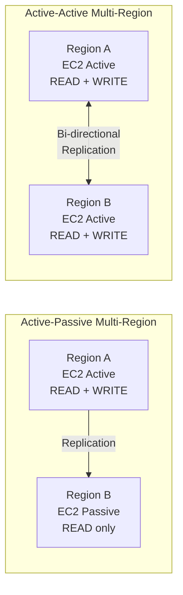

---

# PART 4 — AWS Architecting & Ecosystem

---

## 4.1 — AWS Well-Architected Framework

### 1. 🏚️ أصل المشكلة

شركة بتبني application على AWS وما عندهاش reference لمعرفة إذا كانت architecture بتاعتها صح ولا لأ. بعد 6 أشهر، الـ architecture بتاعتها فيها security gaps، الـ costs بتزيد بدون مبرر، والـ reliability منخفض. AWS خلقت framework عشان الـ engineers يقدروا يقيّموا architectures بشكل منهجي.

### 3. 🔬 الزبدة التقنية للامتحان

**General Guiding Principles:**
- **Stop guessing capacity needs** — استخدم الـ cloud elasticity
- **Test systems at production scale** — ممكن تعمل production-scale testing بتكلفة منخفضة
- **Automate to make architectural experimentation easier**
- **Allow for evolutionary architectures** — Design based on changing requirements
- **Drive architectures using data** — decisions بتتبنى على metrics
- **Improve through game days** — Simulate applications for flash sale days

**AWS Cloud Best Practices:**
- **Scalability:** vertical (أقوى) & horizontal (أكتر)
- **Disposable Resources:** servers should be disposable & easily configured
- **Automation:** Serverless, IaC, Auto Scaling
- **Loose Coupling:** break monoliths into smaller, loosely coupled components
- **Services, not Servers:** استخدم managed services ودatabases وServerless

> [!important]+ Loose Coupling مهم جداً
> الـ monolith = application عملاقة كل حاجة فيها مرتبطة ببعض — failure في component واحد = crash الكل
> الـ Loose Coupling = microservices، كل component مستقل، failure في واحدة مش بتأثر على التانية

---

## 4.2 — الـ 6 Pillars of the Well-Architected Framework

### 3. 🔬 الزبدة التقنية للامتحان

> [!important]+ الـ 6 Pillars — مش Trade-offs، دي Synergy
> "They are not something to balance, or trade-offs, they're a **synergy**" — AWS
> بمعنى: مش لازم تضحّي بـ Security عشان Cost Optimization — ممكن تحقق الاتنين مع بعض.

---

### Pillar 1: Operational Excellence

**التعريف:** القدرة على run ومراقبة الأنظمة لتقديم business value وتحسين مستمر للـ processes.

**Design Principles:**
- **Perform operations as code** — Infrastructure as Code (IaC)
- **Make frequent, small, reversible changes** — عشان تقدر ترجع لو حاجة اتكسّرت
- **Refine operations procedures frequently** — وتأكد إن الفريق يعرف الـ procedures
- **Anticipate failure** — افترض إن في failures هتحصل
- **Learn from all operational failures**
- **Use managed services** to reduce operational burden
- **Implement observability** for actionable insights

**AWS Services for Operational Excellence:**
- **Prepare:** CloudFormation, Config
- **Operate:** CloudFormation, Config, CloudTrail, CloudWatch
- **Evolve:** CodeBuild, CodeCommit, CodeDeploy, CodePipeline, X-Ray

---

### Pillar 2: Security

**التعريف:** القدرة على حماية المعلومات والأنظمة والـ assets مع تقديم business value.

**Design Principles:**
- **Implement a strong identity foundation** — Centralize privilege management, Principle of Least Privilege, IAM
- **Enable traceability** — Integrate logs and metrics, automated response
- **Apply security at all layers** — Edge network, VPC, subnet, load balancer, instance, OS, application
- **Automate security best practices**
- **Protect data in transit and at rest** — Encryption, tokenization, access control
- **Keep people away from data** — Reduce direct access or manual processing
- **Prepare for security events** — Incident response simulations

**Shared Responsibility Model applies here.**

**AWS Services for Security:**
- Identity: IAM, AWS-STS, MFA, AWS Organizations
- Detective Controls: AWS Config, CloudTrail, CloudWatch
- Infrastructure Protection: CloudFront, VPC, Shield, WAF, Inspector
- Data Protection: KMS, S3, EBS, RDS, CloudFormation, ELB
- Incident Response: CloudWatch Events

---

### Pillar 3: Reliability

**التعريف:** القدرة على التعافي من infrastructure failures، اكتساب computing resources ديناميكياً، وتخفيف التعطلات.

**Design Principles:**
- **Test recovery procedures** — Use automation to simulate different failures
- **Automatically recover from failure** — Anticipate and remediate before they occur
- **Scale horizontally** — Distribute requests across multiple smaller resources (no single point of failure)
- **Stop guessing capacity** — Use Auto Scaling
- **Manage change in automation** — Use automation to make changes to infrastructure

**AWS Services for Reliability:**
- Foundations: IAM, VPC, Service Quotas, Trusted Advisor
- Change Management: Auto Scaling, CloudWatch, CloudTrail, Config
- Failure Management: Backups, CloudFormation, S3, S3 Glacier, Route 53

---

### Pillar 4: Performance Efficiency

**التعريف:** القدرة على استخدام computing resources بكفاءة لتلبية متطلبات النظام.

**Design Principles:**
- **Democratize advanced technologies** — Advanced tech become services, focus on product
- **Go global in minutes** — Easy deployment in multiple regions
- **Use serverless architectures** — Avoid server management burden
- **Experiment more often** — Easy comparative testing
- **Mechanical sympathy** — Be aware of all AWS services

**AWS Services for Performance Efficiency:**
- Selection: Auto Scaling, Lambda
- Review: CloudFormation
- Monitoring: CloudWatch, Lambda
- Tradeoffs: ElastiCache, S3, RDS, Snowball, CloudFront

---

### Pillar 5: Cost Optimization

**التعريف:** القدرة على تشغيل الأنظمة بتقديم business value بأقل سعر ممكن.

**Design Principles:**
- **Adopt a consumption mode** — Pay only for what you use
- **Measure overall efficiency** — Use CloudWatch
- **Stop spending money on data center operations** — AWS manages infrastructure
- **Analyze and attribute expenditure** — Use tags for cost allocation, measure ROI
- **Use managed and application-level services** — Lower cost per transaction

**AWS Services for Cost Optimization:**
- Expenditure Awareness: AWS Budgets, Cost and Usage Report, Cost Explorer, Reserved Instance Reporting
- Cost-Effective Resources: Spot Instances, Reserved Instances, S3 Glacier
- Matching Supply and Demand: Auto Scaling, Lambda
- Optimizing Over Time: Trusted Advisor, Cost and Usage Report

---

### Pillar 6: Sustainability

**التعريف:** التركيز على تقليل الـ environmental impacts لتشغيل cloud workloads.

**Design Principles:**
- **Understand your impact** — Establish performance indicators
- **Establish sustainability goals** — Set long-term goals, model ROI
- **Maximize utilization** — Right size each workload, minimize idle resources
- **Anticipate and adopt new, more efficient hardware** — Design for flexibility
- **Use managed services** — Shared services reduce infrastructure, automate sustainability
- **Reduce downstream impact** — Reduce energy/resources needed to use your services

**AWS Services for Sustainability:**
- EC2 Auto Scaling, Lambda, Fargate
- Cost Explorer, AWS Graviton 2, EC2 T instances, Spot Instances
- EFS-IA, Amazon S3 Glacier, EBS Cold HDD
- S3 Lifecycle Configurations, S3 Intelligent Tiering
- Amazon Data Lifecycle Manager
- RDS Read Replicas, Aurora Global DB, DynamoDB Global Tables, CloudFront

> [!important]+ الـ 6 Pillars — جدول سريع للحفظ
> | # | الـ Pillar | الـ Keyword |
> |---|---|---|
> | 1 | Operational Excellence | "Operations as code", "small reversible changes" |
> | 2 | Security | "Least privilege", "encrypt data", "traceability" |
> | 3 | Reliability | "Auto-recover", "horizontal scaling", "test failure" |
> | 4 | Performance Efficiency | "Right resources", "serverless", "go global" |
> | 5 | Cost Optimization | "Pay only for use", "right size", "managed services" |
> | 6 | Sustainability | "Environmental impact", "maximize utilization", "managed services" |

### 4. 🗺️ Architecture Diagram

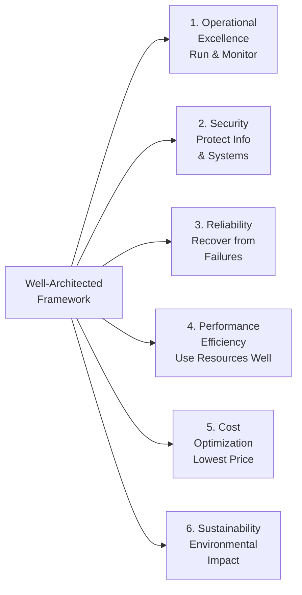

### 6. 🎯 فخاخ الـ Exam

- **الـ Trap:** "The 6 pillars require you to make trade-offs between them." — **الإجابة الصح:** FALSE — AWS says they are a **synergy**, not trade-offs.
- **الـ Trap:** "Which pillar focuses on reducing the carbon footprint?" — **الإجابة الصح:** **Sustainability** (Pillar 6).
- **الـ Trap:** "Operational Excellence is about keeping costs low." — **الإجابة الصح:** FALSE — Cost Optimization هو الـ pillar الخاص بالتكلفة. Operational Excellence = running and monitoring systems.
- **الـ Trap:** "Reliability means the system never fails." — **الإجابة الصح:** FALSE — Reliability = القدرة على **التعافي** من الفشل، مش تجنّبه كلياً.

### 7. 📊 الـ Cheat Sheet

- 🔑 **Exam Keyword:** "If you see 'Infrastructure as Code' → Operational Excellence | 'Least Privilege, IAM' → Security | 'Auto Scaling for failure recovery' → Reliability | 'Serverless, right resources' → Performance | 'Pay per use, right size' → Cost Optimization | 'carbon footprint, idle resources' → Sustainability"

---

## 4.3 — AWS Well-Architected Tool

### 3. 🔬 الزبدة التقنية للامتحان

**AWS Well-Architected Tool:**
- **Free tool** لمراجعة الـ architectures مقابل الـ 6 Pillars
- **كيف بيشتغل:**
  1. Select your workload
  2. Answer questions (بتسألك عن كل pillar)
  3. Review your answers against the 6 pillars
  4. Obtain advice: videos, documentation, generate reports, dashboard
- الـ URL: https://console.aws.amazon.com/wellarchitected

> [!info] Free Tool!
> الـ Well-Architected Tool مجاناً — بتدفع بس على الـ AWS resources اللي بتستخدمها.

---

## 4.4 — AWS Customer Carbon Footprint Tool

### 3. 🔬 الزبدة التقنية للامتحان

**AWS Customer Carbon Footprint Tool:**
- **Track, measure, review, and forecast** Carbon Emissions من AWS usage
- بيساعدك تحقق **sustainability goals**
- بيوريلك:
  - Carbon Emissions over time
  - Carbon Emissions by geography and by service
  - مسارك نحو 100% renewable energy

> [!info] Sustainability Pillar Tool
> ده هو الـ tool الرئيسي لـ Pillar 6 (Sustainability). لو في سؤال عن "carbon emissions on AWS" → هذا هو الجواب.

---

## 4.5 — AWS Cloud Adoption Framework (AWS CAF)

### 1. 🏚️ أصل المشكلة

شركة كبيرة قررت تنقل الـ infrastructure بتاعتها للـ cloud. بعد 6 أشهر، الـ project فشل لأنهم ركّزوا على الـ technology بس وتجاهلوا الجانب البشري والتنظيمي والـ governance. الـ cloud migration مش بس technology — هو transformation شامل.

### 2. ☁️ الحل المعماري

AWS CAF = الـ "خريطة الكاملة للـ digital transformation". بيوجّه الشركات مش بس على التكنولوجيا، لكن على الـ People, Governance, Operations, Platform, Security — كل شيء.

### 3. 🔬 الزبدة التقنية للامتحان

**AWS Cloud Adoption Framework (AWS CAF):**
- بيساعدك تبني وتنفذ خطة شاملة للـ digital transformation
- مبني على **AWS Best Practices** وتجارب **1000s of customers**
- بيحدد **organizational capabilities** اللي بتدعم cloud transformations
- بيجمّع الـ capabilities في **6 Perspectives**

**الـ 6 Perspectives:**

**Business Capabilities (الجانب التجاري):**

1. **Business Perspective:**
   - Ensures cloud investments **accelerate digital transformation** وبتحقق **business outcomes**
   - يربط الـ cloud بالـ business strategy

2. **People Perspective:**
   - Bridge between technology and business
   - Focus on: Culture, organizational structure, leadership, workforce
   - يسرّع الـ cloud journey → culture of continuous growth وlearning

3. **Governance Perspective:**
   - Orchestrate cloud initiatives
   - Maximize organizational benefits
   - Minimize transformation-related risks

**Technical Capabilities (الجانب التقني):**

4. **Platform Perspective:**
   - Build enterprise-grade, scalable, hybrid cloud platform
   - Modernize existing workloads
   - Implement new cloud-native solutions

5. **Security Perspective:**
   - Achieve **confidentiality, integrity, and availability** of data and cloud workloads

6. **Operations Perspective:**
   - Ensure cloud services are delivered at a level that **meets business needs**

> [!important]+ الـ 6 Perspectives — طريقة الحفظ
> **B**usiness + **P**eople + **G**overnance = Business Capabilities (3 Perspectives)
> **P**latform + **S**ecurity + **O**perations = Technical Capabilities (3 Perspectives)
> اختصار: **BPG — PSO**

### الـ 4 Transformation Domains:

1. **Technology:** Using cloud to migrate and modernize legacy infrastructure, apps, data & analytics
2. **Process:** Digitizing, automating, and optimizing business operations; using ML to improve customer service
3. **Organization:** Reimagining your operating model; organizing teams around products and value streams; agile methods
4. **Product:** Reimagining your business model; creating new value propositions and revenue models

### الـ 4 Transformation Phases:

1. **Envision:**
   - Demonstrate how Cloud will accelerate business outcomes
   - Identify transformation opportunities
   - Create foundation for digital transformation

2. **Align:**
   - Identify capability gaps across the **6 AWS CAF Perspectives**
   - Results in an **Action Plan**

3. **Launch:**
   - Build and deliver **pilot initiatives** in production
   - Demonstrate **incremental business value**

4. **Scale:**
   - Expand pilot initiatives to **desired scale**
   - Realize desired business benefits

### 4. 🗺️ Architecture Diagram

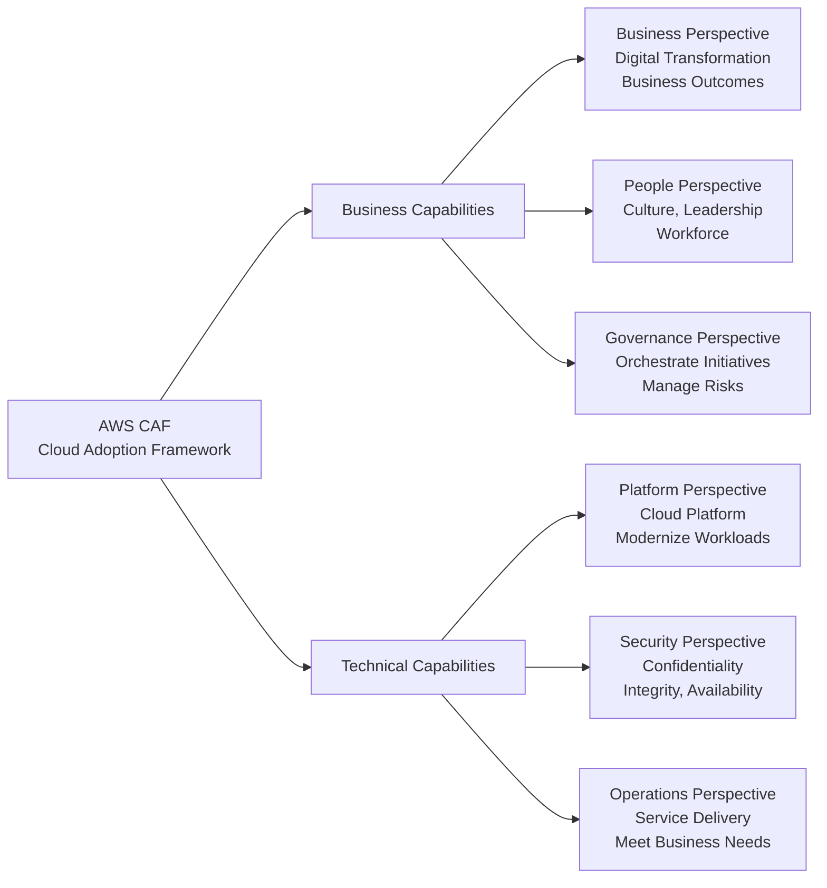

### 5. ⚔️ المقارنات الحاسمة للامتحان

| الـ Perspective | التركيز | الـ Keyword |
|---|---|---|
| Business | ROI, business outcomes, digital ambitions | "business value", "ROI" |
| People | Culture, change management, workforce | "culture", "organizational structure" |
| Governance | Risk, compliance, benefits realization | "manage risk", "orchestrate" |
| Platform | Architecture, modern cloud platform | "scalable platform", "cloud-native" |
| Security | CIA triad, data protection | "confidentiality, integrity, availability" |
| Operations | Service delivery, SLA | "meet business needs", "cloud services delivery" |

### 6. 🎯 فخاخ الـ Exam

- **الـ Trap:** "AWS CAF focuses only on technical aspects of cloud migration." — **الإجابة الصح:** FALSE — CAF بيشمل Business, People, وGovernance Perspectives كمان.
- **الـ Trap:** "The first phase of CAF transformation is to Launch pilots." — **الإجابة الصح:** FALSE — الأول هو **Envision**، بعدين **Align**، بعدين **Launch**، بعدين **Scale**.
- **الـ Trap:** "Which CAF Perspective addresses CIA triad (Confidentiality, Integrity, Availability)?" — **الإجابة الصح:** **Security Perspective**.
- **الـ Trap:** "Governance Perspective is about setting up the cloud platform architecture." — **الإجابة الصح:** FALSE — Governance = risk management وbenefits maximization. Platform Perspective هو اللي بيبني الـ platform.

### 7. 📊 الـ Cheat Sheet

- ✅ **Use Case:** Enterprise digital transformation planning, cloud migration strategy
- 🔑 **Exam Keyword:** "If you see 'organizational capabilities for cloud' → AWS CAF | 'culture and people change' → People Perspective | 'CIA triad' → Security Perspective | 'Envision → Align → Launch → Scale' → CAF Phases"

---

## 4.6 — AWS Right Sizing

### 1. 🏚️ أصل المشكلة

شركة عندها 500 EC2 instance. بعد مراجعة، اكتشفوا إن 40% من الـ instances بتعمل على أقل من 10% CPU utilization. بيدفعوا على compute مش بيستخدموه. المشكلة دي شائعة جداً خصوصاً بعد lift-and-shift migrations.

### 3. 🔬 الزبدة التقنية للامتحان

**AWS Right Sizing:**
- الـ Cloud elastic — **مش لازم تاخد أقوى instance دايماً**
- Right Sizing = عملية **matching instance types and sizes** لـ workload performance وcapacity requirements **بأقل تكلفة ممكنة**
- **"Scaling up is easy so always start small"**
- كمان هي عملية النظر للـ deployed instances وتحديد فرص:
  - **Eliminate** (إلغاء instances غير ضرورية)
  - **Downsize** (تصغير instances) بدون compromising capacity
  - النتيجة: **lower costs**

**متى تعمل Right Sizing؟**
- **Before a Cloud Migration** (قبل ما تنقل، صغّي الـ on-premises footprint)
- **Continuously after cloud onboarding** (لأن requirements بتتغير مع الوقت)

**Tools for Right Sizing:**
- **CloudWatch** — Monitor actual usage metrics
- **Cost Explorer** — Analyze cost and usage patterns
- **Trusted Advisor** — Recommendations for right sizing
- **3rd party tools** — Cloudability, Apptio, etc.

### 6. 🎯 فخاخ الـ Exam

- **الـ Trap:** "Always choose the most powerful EC2 instance for best performance." — **الإجابة الصح:** FALSE — "The cloud is elastic, so always start small and scale up."
- **الـ Trap:** "Right Sizing should only be done once, right before cloud migration." — **الإجابة الصح:** FALSE — يجب أن يكون **continuous process** بعد الـ migration كمان.
- 🔑 **Keyword:** "If you see 'optimize EC2 costs' or 'identify oversized instances' → Right Sizing + Cost Explorer + Trusted Advisor"

---

# PART 5 — AWS Ecosystem

---

## 5.1 — AWS Ecosystem – Free Resources

### 3. 🔬 الزبدة التقنية للامتحان

**Free Resources:**
- **AWS Blogs:** aws.amazon.com/blogs/aws — Latest announcements and deep dives
- **AWS Forums (Community):** forums.aws.amazon.com — Community support (قديم)
- **AWS Whitepapers & Guides:** aws.amazon.com/whitepapers — Reference architectures, best practices
- **AWS Solutions Library** (formerly Quick Starts): aws.amazon.com/solutions
  - Vetted Technology Solutions for the AWS Cloud
  - مثال: Live streaming on AWS

---

## 5.2 — AWS Support Plans

### 1. 🏚️ أصل المشكلة

Production database وقعت الساعة 3 الصبح. الـ DevOps engineer بيحتاج يتكلم مع AWS engineer متخصص **دلوقتي** — مش بكرة. نوع الـ Support Plan اللي اشتريته بيحدد مدى سرعة الاستجابة.

### 3. 🔬 الزبدة التقنية للامتحان

**AWS Support Plans — الـ 4 Plans:**

**1. Basic Support (Free):**
- مجاني مع كل AWS account
- Customer Service, documentation, whitepapers, support forums
- AWS Trusted Advisor (7 core checks)
- AWS Personal Health Dashboard

**2. Developer Support:**
- **Business hours** email access to Cloud Support Associates
- **General guidance:** < 24 business hours response
- **System impaired:** < 12 business hours response
- ده لـ Development/testing environments

**3. Business Support:**
- **24x7** phone, email, and chat access to Cloud Support Engineers
- **Production system impaired:** < 4 hours response
- **Production system down:** < 1 hour response
- Full set of Trusted Advisor checks

**4. Enterprise On-Ramp / Enterprise Support:**
- Access to a **Technical Account Manager (TAM)**
- **Concierge Support Team** (for billing and account best practices)
- **Business-critical system down: < 15 minutes** response
- Infrastructure Event Management (IEM)

> [!important]+ الأرقام المهمة في الامتحان
> | Plan | Email | Phone/Chat | Impaired | Down | Critical |
> |---|---|---|---|---|---|
> | Developer | ✅ Business hrs | ❌ | 12hrs | 24hrs | — |
> | Business | ✅ 24x7 | ✅ 24x7 | 4hrs | 1hr | — |
> | Enterprise | ✅ 24x7 | ✅ 24x7 | 4hrs | 1hr | **15min** |
> | All have: TAM? | No | No | No | No | **Enterprise Only** |

### 4. 🗺️ Architecture Diagram

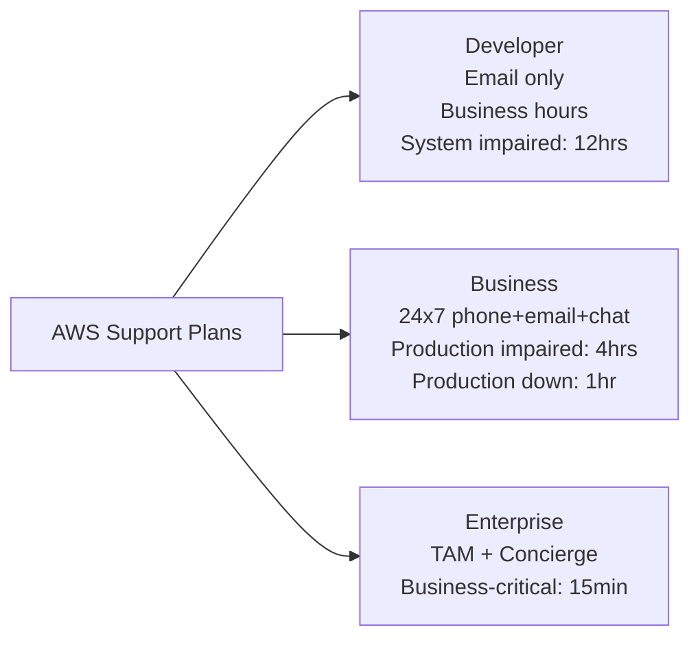

### 5. ⚔️ المقارنات الحاسمة للامتحان

| الـ Scenario | الـ Plan المطلوب |
|---|---|
| "Development environment, email support only" | Developer |
| "Production system, need phone support 24/7" | Business |
| "Business-critical system, need TAM" | Enterprise |
| "Need < 15 min response for critical outage" | Enterprise |

### 6. 🎯 فخاخ الـ Exam

- **الـ Trap:** "Which plan provides a Technical Account Manager (TAM)?" — **الإجابة الصح:** **Enterprise** Support Plan.
- **الـ Trap:** "The Business plan provides < 15 minute response for critical systems." — **الإجابة الصح:** FALSE — ده خاص بـ Enterprise Plan.
- **الـ Trap:** "Developer plan provides 24/7 phone support." — **الإجابة الصح:** FALSE — Developer plan = business hours EMAIL ONLY.

### 7. 📊 الـ Cheat Sheet

- 🔑 **Exam Keyword:** "If you see 'TAM' → Enterprise | '< 15 min critical' → Enterprise | '24/7 phone' → Business or Enterprise | 'email only, business hours' → Developer"

---

## 5.3 — AWS Marketplace

### 3. 🔬 الزبدة التقنية للامتحان

**AWS Marketplace:**
- Digital catalog with **thousands of software listings** from **independent software vendors (3rd party)**
- **Examples of what you can buy:**
  - Custom AMI (custom OS, firewalls, technical solutions)
  - CloudFormation templates
  - Software as a Service
  - Containers

- **Key Points:**
  - لو اشتريت عبر AWS Marketplace → الفلوس بتتضاف لـ **AWS bill** بتاعك
  - ممكن **تبيع solutions بتاعتك** على AWS Marketplace

> [!info] AWS Marketplace = App Store for AWS
> فكّر فيه زي App Store أو Google Play — بس للـ enterprise software على AWS.

### 6. 🎯 فخاخ الـ Exam

- **الـ Trap:** "AWS Marketplace software is always free." — **الإجابة الصح:** FALSE — في مدفوع ومجاني، وبيتضاف للـ AWS bill.
- 🔑 **Keyword:** "If you see '3rd party software on AWS' or 'custom AMI marketplace' → AWS Marketplace"

---

## 5.4 — AWS Training

### 3. 🔬 الزبدة التقنية للامتحان

**AWS Training Options:**
- **AWS Digital (online) and Classroom Training** (in-person or virtual)
- **AWS Private Training** (for your organization)
- **Training and Certification for the U.S Government**
- **Training and Certification for the Enterprise**
- **AWS Academy:** helps universities teach AWS
- Stephane Maarek's courses 😄 (mentioned in the slides)

---

## 5.5 — AWS Professional Services & Partner Network

### 3. 🔬 الزبدة التقنية للامتحان

**AWS Professional Services:**
- Global team of AWS experts
- بيشتغلوا جنب فريقك وجنب APN partner

**APN = AWS Partner Network:**
- **APN Technology Partners:** providing hardware, connectivity, and software
- **APN Consulting Partners:** professional services firms to help build on AWS
- **APN Training Partners:** help you learn AWS

**AWS Competency Program:**
- AWS Competencies بتتمنح لـ APN Partners اللي أثبتوا **technical proficiency** وـ**customer success** في specialized solution areas

**AWS Navigate Program:**
- Helps Partners become better Partners

---

## 5.6 — AWS IQ

### 3. 🔬 الزبدة التقنية للامتحان

**AWS IQ:**
- بتساعدك تلاقي professional help لـ AWS projects بسرعة
- تـ engage وتدفع لـ **AWS Certified 3rd party experts** for on-demand project work
- بيوفّر: Video-conferencing, contract management, secure collaboration, integrated billing

**For Customers:**
1. Submit Request — describe your project
2. Review Responses — Connect to experts
3. Select Expert — Based on rates & experience
4. Work Securely — Give experts appropriate access
5. Pay per Milestone — Charges added to your AWS Bill

**For Experts:**
1. Create Profile — Photo, bio, certs
2. Connect with Customers
3. Start a Proposal — work description, price, milestones
4. Work Securely — Get appropriate access to customers' AWS account
5. Get Paid — Request payment after milestones are met

---

## 5.7 — AWS re:Post

### 3. 🔬 الزبدة التقنية للامتحان

**AWS re:Post:**
- **AWS-managed Q&A service** — بيقدم crowd-sourced, expert-reviewed answers
- بتحلّ محل الـ **original AWS Forums** القديمة
- Community members ممكن يكسبوا **reputation points** بتقديم accepted answers
- Questions من AWS Premium Support customers اللي ما اتردّتش من الـ community → بتتبعت لـ **AWS Support engineers**
- **مش للـ time-sensitive questions أو proprietary information**

**AWS re:Post Knowledge Center:**
- Contains the most frequent & common questions and requests
- https://repost.aws/knowledge-center

---

## 5.8 — AWS Managed Services (AMS)

### 1. 🏚️ أصل المشكلة

شركة كبيرة نقلت infrastructure لـ AWS لكن فريقها الـ IT مش عنده خبرة كافية في cloud operations. بيحتاجوا تشغيل يومي للـ AWS environment (patching, monitoring, security, backup) بدون إنهم يبنوا فريق cloud متخصص كامل.

### 3. 🔬 الزبدة التقنية للامتحان

**AWS Managed Services (AMS):**
- Provides infrastructure and **application support on AWS**
- Team of AWS experts بيـ manage وبيـ operate your infrastructure
- للـ **security, reliability, and availability**
- بيساعد organizations تـ offload **routine management tasks**
- **Fully managed service** — AWS handles:
  - Change requests
  - Monitoring
  - Patch management
  - Security
  - Backup services
- بيطبّق **best practices** ويحافظ على AWS infrastructure
- لتقليل **operational overhead and risk**
- **AMS Business hours: 24/365**

**AMS Benefits:**
- ✅ Improved Security
- ✅ Stronger Compliance
- ✅ Reduced Operating Costs
- ✅ Simplified Management
- ✅ Frictionless Innovation
- ✅ Focus on Automation

**AMS Phases:**
1. **Enable:** Create baseline governance and control model (people, process, tools)
2. **Sustain, Build, or Migrate:** Fastest and most efficient way to integrate, develop, migrate workloads
3. **Operate:** Achieve operational outcomes at scale (observability, compliance, financial management)

> [!info] AMS vs AWS Support
> **AWS Support** = تسألهم سؤال وبيجاوبوك
> **AWS Managed Services (AMS)** = هم اللي بيشغّلوا الـ infrastructure بالكامل نيابةً عنك

### 6. 🎯 فخاخ الـ Exam

- **الـ Trap:** "AWS Managed Services is the same as AWS Support." — **الإجابة الصح:** FALSE — AMS هو fully managed operational service (بيشغّلوا الـ infrastructure) وAWS Support هو advisory/reactive service.
- 🔑 **Keyword:** "If you see 'offload routine operations', 'patch management by AWS', 'reduce operational overhead' → AMS"

---

# 🎯 MASTER CHEAT SHEET — Domain 1 Quick Reference

---

## The Ultimate Comparison Table

| الـ Concept | الـ Keyword | الإجابة السريعة |
|---|---|---|
| Cloud Computing | "on-demand", "pay-as-you-go" | Instant resources, no hardware |
| Private Cloud | "full control", "single organization" | Rackspace, on-prem private |
| Public Cloud | "AWS/Azure/GCP", "internet delivery" | Third-party provider |
| Hybrid Cloud | "on-premises + cloud" | Best of both worlds |
| IaaS | "EC2", "maximum flexibility", "manage OS" | You control everything |
| PaaS | "Elastic Beanstalk", "focus on code" | AWS manages infrastructure |
| SaaS | "Rekognition", "Gmail", "completed product" | AWS manages everything |
| CAPEX | "upfront cost", "buy hardware" | Traditional IT |
| OPEX | "pay-as-you-go", "no hardware" | Cloud model |
| TCO | "total cost", "ownership" | CAPEX + OPEX combined |
| On-demand Self Service | "no human interaction", "automatic provision" | NIST Characteristic 1 |
| Multi-tenancy | "shared infrastructure", "resource pooling" | NIST Characteristic 3 |
| Rapid Elasticity | "auto scale in and out" | NIST Characteristic 4 |
| Measured Service | "pay for what you use", "metered" | NIST Characteristic 5 |
| AWS Region | "cluster of data centers", "us-east-1" | Most services are regional |
| Availability Zone | "one or more data centers", "AZ" | Min 3 per region, max 6 |
| Edge Location | "400+", "CDN caching", "CloudFront" | Content delivery only |
| IAM | "Global Service", "identity management" | Access control, global |
| Route 53 | "Global DNS", "routing policies" | DNS + traffic routing |
| CloudFront | "CDN", "cache at edge", "TTL" | Static content delivery |
| Global Accelerator | "static IP", "TCP/UDP", "no cache", "60% improvement" | Dynamic app performance |
| S3 Transfer Acceleration | "fast upload to S3", "edge location" | Accelerate S3 uploads |
| AWS Outposts | "AWS on-premises", "data residency" | Run AWS in your DC |
| AWS WaveLength | "5G edge", "ultra-low latency" | 5G applications |
| AWS Local Zones | "city-level latency", "VPC extension" | City proximity |
| Shared Responsibility | "security OF vs IN the cloud" | AWS=hardware, Customer=data |
| Well-Architected | "6 pillars", "synergy not trade-off" | Framework for best practices |
| Operational Excellence | "IaC", "small reversible changes" | Pillar 1 |
| Security | "least privilege", "CIA", "traceability" | Pillar 2 |
| Reliability | "auto-recover", "horizontal scale" | Pillar 3 |
| Performance Efficiency | "serverless", "right resources" | Pillar 4 |
| Cost Optimization | "pay for use", "right size" | Pillar 5 |
| Sustainability | "carbon footprint", "maximize utilization" | Pillar 6 |
| AWS CAF | "6 perspectives", "digital transformation" | Enterprise cloud strategy |
| CAF Business | "ROI", "digital ambition" | Business Perspective |
| CAF People | "culture", "workforce" | People Perspective |
| CAF Governance | "risk", "orchestrate" | Governance Perspective |
| CAF Platform | "scalable platform", "modernize" | Platform Perspective |
| CAF Security | "confidentiality, integrity, availability" | Security Perspective |
| CAF Operations | "service delivery", "meet needs" | Operations Perspective |
| CAF Phases | "Envision → Align → Launch → Scale" | 4 phases in order |
| Right Sizing | "optimize EC2 cost", "start small" | CloudWatch + Cost Explorer |
| AWS Marketplace | "3rd party software", "custom AMI" | Digital catalog |
| Developer Support | "email only, business hours, 12hrs" | Dev/test environments |
| Business Support | "24/7 phone, 4hrs impaired, 1hr down" | Production |
| Enterprise Support | "TAM, concierge, 15min critical" | Business-critical |
| AWS IQ | "certified expert, on-demand, per milestone" | Find AWS expert |
| AWS re:Post | "Q&A, crowd-sourced, replaces forums" | Community answers |
| AWS AMS | "fully managed operations, patch/monitor" | Offload AWS operations |

---

## 🏆 الـ "زتونة الامتحان" — Interview Zitona

> [!important]+ زتونة الـ CLF-C02 Domain 1
> 
> **القاعدة الذهبية #1:** AWS = Security **OF** the Cloud | Customer = Security **IN** the Cloud
> 
> **القاعدة الذهبية #2:** Data Transfer **IN** to AWS = FREE | Data Transfer **OUT** = PAID
> 
> **القاعدة الذهبية #3:** الـ 6 Pillars of WAF = **Synergy**, مش Trade-offs
> 
> **القاعدة الذهبية #4:** IAM + Route 53 + CloudFront + WAF = **GLOBAL** Services (مش Regional)
> 
> **القاعدة الذهبية #5:** Min AZs per Region = **3** | Max = **6**
> 
> **القاعدة الذهبية #6:** EC2 OS patching = **Customer** | RDS OS patching = **AWS** (Managed Service)
> 
> **القاعدة الذهبية #7:** CloudFront = **Cache** (static content) | Global Accelerator = **No Cache** (dynamic, TCP/UDP, static IP)
> 
> **القاعدة الذهبية #8:** CAF Phases = **Envision → Align → Launch → Scale** (بالترتيب ده!)
> 
> **القاعدة الذهبية #9:** TAM (Technical Account Manager) = **Enterprise Support** بس
> 
> **القاعدة الذهبية #10:** AWS Outposts Physical Security = **Customer Responsibility** (الاستثناء الوحيد!)

---

*📚 الدليل ده مبني على Stephane Maarek's CLF-C02 Course Slides*  
*✅ Domain 1 Coverage: 100% of provided slide content*  
*🎯 Target: AWS Certified Cloud Practitioner (CLF-C02)*  
*⚡ Generated by: Elite AWS Exam Prep Mentor*
