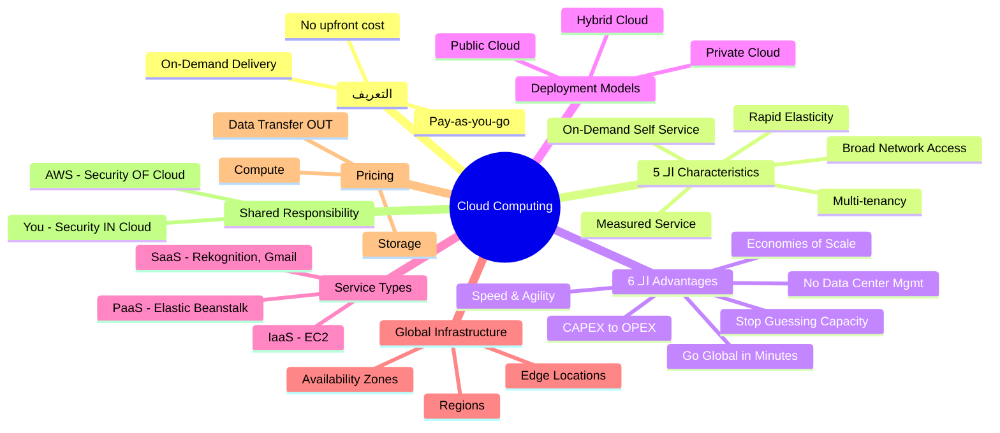

# الفصل 1 — Cloud Computing: إيه ده وليه AWS موجودة أصلاً؟

> **المتطلبات:** مش محتاج حاجة — ده أول فصل. بس لو عندك فكرة عن إزاي الإنترنت بيشتغل ده هيساعدك تفهم أسرع.

---

## البداية — المشكلة اللي خلّت الـ Cloud يتعمل أصلاً

تخيّل معايا إنك سنة 2000 عندك شركة ناشئة وعايز تبني موقع. إيه اللي كنت هتعمله؟ كنت هتيجي تشتري سيرفر — مش رخيص — وتحطه في أوضة، وتدفع فلوس كهرباء وتبريد، وتوظف ناس يبقوا صاحيين 24/7 يحرسوه. لو جه زلزال أو انقطع التيار؟ شيل موقعك واروح. ولو كبرت فجأة وجاك مليون مستخدم في يوم واحد؟ السيرفر هيموت — وانت مش قادر تشتري سيرفر جديد في نص ساعة.

المشكلة مش في التكنولوجيا — المشكلة إن البنية التحتية (Infrastructure) كانت باهظة، بطيئة، وغير مرنة. الشركات الصغيرة كانت بتتحطم تحت التكاليف قبل ما تكبر.

> بدل ما تشتري السيرفر — إيه لو كنت "تستأجره" بالساعة وتدفع بالاستخدام بس؟

---

## 🏚️ قبل الـ Cloud — الحياة مع الـ Traditional IT

### إزاي الإنترنت بيشتغل أصلاً؟

أنت لما بتفتح موقع، جهازك (Client) بيبعت Request لـ IP معين — والسيرفر اللي على الـ IP ده بيرد عليك. زي ما بتبعت جواب بالبريد لعنوان بيت — محتاج عنوان واضح من الطرفين.

الـ Server نفسه مكوّن من:
- **CPU (Compute)** — العقل اللي بيعمل الحسابات
- **RAM (Memory)** — الذاكرة السريعة للشغل الجاري
- **Storage** — الهارد اللي بيحفظ الداتا
- **Database** — تخزين منظّم للداتا بشكل يسهّل البحث فيها
- **Network (روتر + سويتش)** — الكابلات والأجهزة اللي بتوصّل كل حاجة ببعض

```
المستخدم (Client)  →  [إنترنت]  →  Router  →  Switch  →  Server
      ↑                                                        ↓
      ←←←←←←←←←←←←← Response (الصفحة) ←←←←←←←←←←←←←←←←←←←
```

### مشاكل الـ Traditional IT

- **دفع إيجار Data Center** — سواء شغّلت أم لا
- **الكهرباء والتبريد والصيانة** — مصاريف ثابتة ما توقفتش
- **إضافة سيرفرات بتاخد وقت** — مش بتضغط زرار وييجيلك سيرفر جديد
- **الـ Scaling محدود** — مش قادر تكبّر بسرعة وقت الـ Peak
- **فريق 24/7** — حتى لو مفيش حاجة بتحصل
- **الكوارث الطبيعية** — حريق واحد وخلاص!

---

## ☁️ Cloud Computing — الحل اللي غيّر كل حاجة

الـ Cloud بالظبط زي شبكة الكهرباء في البيت. إنت مش بتشتري محطة كهرباء عشان تنوّر شقتك — إنت بتوصّل السلك وتدفع على اللي استهلكته. نفس الفكرة بالظبط.

**الـ Cloud Computing هو:** توصيل On-Demand لـ Computing Power وStorage وApplications وغيرهم — عبر الإنترنت — بنموذج Pay-as-you-go.

```
انت عايز سيرفر؟          → اضغط زرار ← يجيلك في ثواني
انت عايز تكبّر؟          → اضغط زرار ← يتكبّر
انت عايز توقف؟           → اضغط زرار ← بتدفع بس اللي استخدمته
```

AWS بتمتلك الـ Hardware وبتصونه — وانت بتستخدمه عبر الـ Web Application بس.

---

## 🔬 الـ Five Characteristics — اللي بيخلي الـ Cloud هو الـ Cloud

الـ NIST (المنظمة اللي عرّفت الـ Cloud رسمياً) قالت إن أي Cloud لازم يكون فيه 5 خصائص:

### 1. On-Demand Self Service
إنت اللي بتشغّل ريسورسات بنفسك — من غير ما تكلم حد في AWS. بتدخل على الـ Console وتعمل اللي عايزه على طول.

### 2. Broad Network Access
الريسورسات متاحة على الإنترنت من أي جهاز — لابتوب، موبايل، تابلت. مش محتاج تكون في مكان معين.

### 3. Multi-tenancy & Resource Pooling
كتير من الكليانتس بيشتركوا في نفس الـ Physical Resources — بس بعزل كامل وأمان. زي عمارة فيها شقق كتير — كل شقة خاصة بصاحبها بس الأرض والأعمدة مشتركة.

### 4. Rapid Elasticity & Scalability
تقدر تزود أو تقلل الريسورسات أوتوماتيك وبسرعة حسب الطلب. لو جالك مليون مستخدم فجأة — الـ Cloud يتعامل معاه.

### 5. Measured Service
استخدامك بيتقاس بدقة وبتدفع على اللي استخدمته بس. زي فاتورة الكهرباء — بالكيلوواط.

> [!important]+ الـ Five Characteristics في الامتحان
> الامتحان ممكن يسألك عن خاصية بالاسم أو بالوصف. افتكر: **Self-Service, Network Access, Multi-tenancy, Elasticity, Measured.**

---

## ⚡ الـ Six Advantages — ليه تيجي الـ Cloud أصلاً؟

| الميزة | المعنى البسيط |
|---|---|
| **Trade CAPEX for OPEX** | بدل ما تشتري، استأجر — مش محتاج رأس مال كبير |
| **Massive Economies of Scale** | AWS بتشتري بالملايين → تكلفة أقل → أسعار أرخص ليك |
| **Stop Guessing Capacity** | مش محتاج تتوقع — بتدفع على الاستخدام الفعلي |
| **Increase Speed & Agility** | بتبدأ مشاريع في دقائق مش أشهر |
| **Stop Maintaining Data Centers** | AWS بتتكفّل بكل الـ Maintenance |
| **Go Global in Minutes** | بتنشر على مناطق كتير في العالم بكليكات |

> 🔑 **Keyword في الامتحان:** لو شفت "pay only for what you use" أو "no upfront cost" — الإجابة دايماً الـ Cloud's Pay-as-you-go model.

---

## ⚔️ نماذج الـ Deployment — هتبني فين؟

| | Private Cloud | Public Cloud | Hybrid Cloud |
|---|---|---|---|
| **التعريف** | Cloud خاص بشركة واحدة | Cloud مشترك بيديره Provider زي AWS | خليط من الاتنين |
| **التحكم** | كامل | محدود | جزئي |
| **الأمان** | أعلى للداتا الحساسة | عالي بس مشترك | مرن |
| **التكلفة** | عالية | Pay-as-you-go | متوسط |
| **مثال** | بنك عنده سيرفرات خاصة | Netflix على AWS | شركة عندها DB on-premise وApp على AWS |
| **الكلمة المفتاحية في الامتحان** | "Control", "Sensitive data" | "Third-party", "Internet" | "On-premises + Cloud" |
| **متى تختاره؟** | حكومات وبنوك | Startups وأغلب الشركات | لما عندك legacy systems |

---

## 🖥️ أنواع الـ Cloud Computing — IaaS vs PaaS vs SaaS

تخيّل إنك عايز تاكل بيتزا:
- **IaaS** = بتشتري الطحين والجبن والفرن وتعمل كل حاجة بنفسك
- **PaaS** = بتروح مطبخ جاهز — أنت بس بتعمل البيتزا
- **SaaS** = بتطلب بيتزا جاهزة تماماً وبس بتاكل

| | IaaS | PaaS | SaaS |
|---|---|---|---|
| **إيه اللي بتديره؟** | OS, Runtime, App, Data | App, Data بس | لا شيء |
| **إيه اللي AWS بتديره؟** | Network, Storage, Servers | كل حاجة تحت الـ App | كل حاجة |
| **الـ Flexibility** | أعلى | متوسط | أقل |
| **الـ Complexity** | عالية | متوسط | بسيطة |
| **مثال AWS** | EC2 | Elastic Beanstalk | Rekognition |
| **مثال خارجي** | Digital Ocean, Azure VMs | Heroku, Google App Engine | Gmail, Dropbox, Zoom |
| **الكلمة المفتاحية** | "Full control", "Configure OS" | "Deploy without managing infra" | "Ready to use" |

```
┌─────────────────────────────────────────────────────┐
│              مين بيتحكم في إيه؟                     │
├──────────────┬──────────────┬───────────────────────┤
│  On-Premises │     IaaS     │   PaaS    │    SaaS   │
├──────────────┼──────────────┼───────────┼───────────┤
│ Applications │ Applications │   ████    │   ████    │
│     Data     │    Data      │   ████    │   ████    │
│    Runtime   │   Runtime    │   ████    │   ████    │
│  Middleware  │  Middleware  │   ████    │   ████    │
│     O/S      │    O/S       │   ████    │   ████    │
│ Virtualizat. │    ████      │   ████    │   ████    │
│   Servers    │    ████      │   ████    │   ████    │
│   Storage    │    ████      │   ████    │   ████    │
│  Networking  │    ████      │   ████    │   ████    │
└──────────────┴──────────────┴───────────┴───────────┘
  انت بتديره        ████ = AWS بتديره
```

---

## 💰 تسعير AWS — إيه اللي بتدفع عليه بالظبط؟

AWS فيها **3 محاور تسعير** بس:

1. **Compute** → بتدفع على وقت التشغيل (مثلاً: EC2 بيتحسب بالساعة أو بالثانية)
2. **Storage** → بتدفع على الداتا المخزنة (مثلاً: بالـ GB في الشهر)
3. **Data Transfer OUT** → بتدفع لما الداتا بتخرج من AWS للإنترنت فقط — الـ Data Transfer IN مجاني تماماً!

> ⚠️ **انتبه:** الـ Data Transfer IN مجاني — بس الـ Data Transfer OUT مش مجاني. الامتحان بيحب يسأل في ده!

> 🔑 **Keyword في الامتحان:** لو شفت "pay-as-you-go" — ده أساس تسعير AWS.

---

## 🌍 الـ AWS Global Infrastructure — AWS موجودة فين في العالم؟

### الـ AWS Regions
الـ Region هي منطقة جغرافية فيها Cluster من Data Centers. كل Region ليها اسم كود زي `us-east-1` أو `eu-west-3`. **معظم الـ AWS Services هي Region-Scoped** — يعني لما بتعمل EC2 في `us-east-1` — الـ EC2 دي مش موجودة في `eu-west-3`.

### إزاي تختار الـ Region المناسبة؟

لو مش عارف تختار Region، افكر في 4 حاجات:

1. **Compliance** — بعض الداتا لازم تفضل في دولة معينة (بيانات حكومية مثلاً) — الداتا **مش بتتحرك من الـ Region من غير إذنك**
2. **Proximity** — قرّب من المستخدمين بتوعك عشان تقلل الـ Latency
3. **Available Services** — مش كل الـ Services موجودة في كل Region
4. **Pricing** — الأسعار بتختلف من Region لـ Region

### الـ Availability Zones (AZs)
كل Region فيها **عادةً 3 AZs** (الحد الأدنى 3، الأقصى 6). كل AZ هي Data Center أو أكتر معزولة عن غيرها. لو حريق في AZ واحدة — الـ AZs التانية مش بتتأثر. بيتوصلوا ببعض بـ High Bandwidth, Ultra-Low Latency network.

```
┌─────────────────────────── AWS Region: ap-southeast-2 (Sydney) ──┐
│                                                                    │
│  ┌──────────────┐  ┌──────────────┐  ┌──────────────┐            │
│  │  ap-seast-2a │  │  ap-seast-2b │  │  ap-seast-2c │            │
│  │  (AZ 1)      │  │  (AZ 2)      │  │  (AZ 3)      │            │
│  │  Data Center │  │  Data Center │  │  Data Center │            │
│  └──────┬───────┘  └──────┬───────┘  └──────┬───────┘            │
│         └──────────────────┴──────────────────┘                   │
│              High-speed private fiber connection                   │
└────────────────────────────────────────────────────────────────────┘
```

### الـ Edge Locations (Points of Presence)
AWS عندها **+400 Edge Location** في أكتر من 90 مدينة في 40+ دولة. دي مش لـ EC2 أو الـ Services العادية — دي لـ CloudFront (CDN) عشان يوصّل الـ Content للمستخدم من أقرب نقطة جغرافية.

> 🔑 **Keyword في الامتحان:** لو شفت "low latency content delivery" — الإجابة **Edge Location / CloudFront**.

---

## 🌐 Global vs Regional Services

| النوع | الأمثلة | ملاحظة |
|---|---|---|
| **Global Services** | IAM, Route 53, CloudFront, WAF | مش بتختار Region لما بتستخدمهم |
| **Regional Services** | EC2, Elastic Beanstalk, Lambda, Rekognition | بيشتغلوا في Region محددة |

> [!important]+ الـ Global Services اللي لازم تحفظها
> **IAM** (الـ Users والـ Permissions) — Global
> **Route 53** (الـ DNS) — Global
> **CloudFront** (الـ CDN) — Global
> **WAF** (Web Application Firewall) — Global

---

## 🔐 الـ Shared Responsibility Model — مين مسؤول عن إيه؟

ده من أهم المفاهيم في الامتحان. التقسيمة بسيطة:

```
┌─────────────────────────────────────────────────────────┐
│                    YOU (الكلياتن)                       │
│        Security IN the Cloud (الأمان داخل الـ Cloud)    │
│  - Data Encryption                                       │
│  - IAM Users & Permissions                              │
│  - Network Configuration (Security Groups)              │
│  - Operating System Patches (لو بتستخدم EC2)           │
├─────────────────────────────────────────────────────────┤
│                      AWS                                │
│        Security OF the Cloud (الأمان الـ Cloud نفسه)   │
│  - Physical Data Centers                                │
│  - Hardware & Networking                                │
│  - Hypervisor & Virtualization Layer                    │
│  - Global Infrastructure                                │
└─────────────────────────────────────────────────────────┘
```

**التشبيه:** زي إيجار شقة. صاحب العمارة مسؤول عن الأعمدة والسقف والكهرباء الرئيسية (AWS). إنت المسؤول عن إيه اللي جوه شقتك — تغلق الباب، تأمّن حاجاتك (أنت).

> 🔑 **Keyword في الامتحان:** 
> - "Security **OF** the Cloud" → AWS مسؤولة
> - "Security **IN** the Cloud" → إنت مسؤول

---

## 🎯 فخاخ الـ Exam — اللي بيوقع فيه الناس

**الـ Trap 1 — Data Transfer:**
"إيه اللي بيتحسب في تسعير AWS؟"
— الإجابة الصح: Data Transfer OUT مدفوع — Data Transfer IN مجاني تماماً.

**الـ Trap 2 — Global Services:**
"إنت عملت IAM User في us-east-1، هو متاح في eu-west-1؟"
— الإجابة الصح: آه، لأن IAM خدمة **Global** مش Regional.

**الـ Trap 3 — AZs Number:**
"كل Region فيها كام AZ؟"
— الإجابة الصح: عادةً 3، الحد الأدنى **3**، الأقصى **6** — مش 2، مش 1.

**الـ Trap 4 — Shared Responsibility:**
"مين المسؤول عن تحديث (Patching) الـ EC2 Operating System؟"
— الإجابة الصح: **إنت** — مش AWS. إنت اللي بتدير الـ OS جوه الـ EC2.

**الـ Trap 5 — Private vs Public Cloud:**
"شركة بتحتاج Control كامل وبياناتها حساسة جداً — إيه الـ Deployment Model؟"
— الإجابة الصح: **Private Cloud** — مش Public.

**الـ Trap 6 — Edge Location vs AZ:**
"إيه الـ Edge Locations بتستخدم في إيه؟"
— الإجابة الصح: لـ **CloudFront (CDN)** وتوصيل الـ Content بـ Low Latency — مش لـ EC2 أو الـ Compute العادي.

**الـ Trap 7 — Region Selection:**
"إيه أهم عامل لما بتختار Region؟"
— الإجابة الصح: **Compliance** (القوانين والمتطلبات القانونية) بييجي أولاً — حتى لو الـ Latency عالية.

---

## 🗺️ خريطة الـ Cloud Computing كاملة



---

## ✅ Checkpoint — أسئلة الامتحان في الـ Cloud Computing

**س: إيه الفرق بين الـ Region والـ AZ والـ Edge Location؟**
> الـ Region هي منطقة جغرافية كبيرة زي "us-east-1" فيها Cluster من Data Centers. الـ AZ (Availability Zone) هي Data Center واحد أو أكتر **جوه** الـ Region — معزولة عن غيرها لو حصل Disaster. الـ Edge Location دي حاجة مختلفة تماماً — هي نقاط موزعة حول العالم (+400 نقطة) بستخدمها CloudFront عشان يوصّل الـ Content بسرعة للمستخدمين.

**س: مين المسؤول عن الـ Security في الـ Cloud؟**
> التقسيمة واضحة: AWS مسؤولة عن الـ Physical Infrastructure والـ Hardware والـ Hypervisor (Security **OF** the Cloud). إنت مسؤول عن الداتا بتاعتك والـ IAM والـ Network Configuration والـ OS Patches (Security **IN** the Cloud).

**س: إيه الفرق بين IaaS وPaaS وSaaS؟**
> في IaaS زي EC2 — إنت بتدير الـ OS والـ Runtime والـ App والـ Data. في PaaS زي Elastic Beanstalk — إنت بس بترفع الـ Code وAWS بتدير الـ Infrastructure. في SaaS زي Rekognition — الـ Service جاهزة خالص وإنت بس بتستخدمها عبر API.

**س: إيه الـ Services الـ Global في AWS؟**
> الـ Services الـ Global الأساسية هي: **IAM** (Identity), **Route 53** (DNS), **CloudFront** (CDN), **WAF** (Web Firewall). أي Service تانية زي EC2 أو Lambda — دي Regional.

**س: إزاي بتختار الـ AWS Region لـ Application جديد؟**
> بترتّب الأولويات: أول حاجة **Compliance** (القوانين المحلية للبيانات)، بعدين **Proximity** (قُرب المستخدمين لتقليل الـ Latency)، بعدين **Available Services** (مش كل Services موجودة في كل Region)، وأخيراً **Pricing** (الأسعار بتتفاوت).

---

## 📊 الـ Cheat Sheet النهائي

| السؤال | الإجابة الفورية |
|---|---|
| إيه الـ Cloud Computing؟ | On-Demand IT resources بـ Pay-as-you-go |
| كام AZ في الـ Region؟ | عادةً 3، الحد الأدنى 3، الأقصى 6 |
| كام Edge Location؟ | +400 في 90+ مدينة |
| الـ Data Transfer IN مدفوع؟ | لأ — مجاني. بس OUT مدفوع |
| IAM Global أم Regional؟ | **Global** |
| EC2 Global أم Regional؟ | **Regional** |
| مين مسؤول عن الـ OS Patch في EC2؟ | **إنت** (مش AWS) |
| إيه الـ Private Cloud؟ | Cloud خاص بشركة واحدة — Control كامل |
| إيه الـ Hybrid Cloud؟ | On-Premises + Public Cloud |
| أول عامل في اختيار الـ Region؟ | **Compliance** (القوانين) |
| إيه الـ SaaS مثال على AWS؟ | Rekognition |
| إيه الـ IaaS مثال على AWS؟ | EC2 |
| إيه الـ PaaS مثال على AWS؟ | Elastic Beanstalk |
| "Security OF the Cloud" — مين؟ | **AWS** |
| "Security IN the Cloud" — مين؟ | **إنت (الكليانت)** |
| الـ CloudFront بيستخدم إيه؟ | Edge Locations |
| AWS Revenue سنة 2023؟ | $90 Billion |
| AWS حصة السوق Q1 2024؟ | 31% |

---

## 🫒 زتونة الإنترفيو

> **"الـ Cloud Computing ببساطة هو إنك بدل ما تشتري وتصوّن Infrastructure خاص بيك — بتستأجره بالساعة أو بالثانية من AWS وبتدفع على اللي استخدمته بس. AWS بتديرلك الـ Physical Hardware، وإنت بتدير الـ Application والداتا بتاعتك — وده اللي بنسميه الـ Shared Responsibility Model. الـ Infrastructure بتاعت AWS متوزعة على Regions حوالين العالم، كل Region فيها على الأقل 3 Availability Zones معزولة عن بعض لضمان الـ High Availability. لو عايز تعرف تختار الـ Service المناسبة — IaaS زي EC2 لو عايز Control كامل، PaaS زي Elastic Beanstalk لو عايز تركز على الـ Code بس، وSaaS لو عايز Service جاهزة تماماً. والأهم من كل ده: الـ Data Transfer IN مجاني — بس OUT بتدفع عليه."**

---

*Next → الفصل 2 — IAM: Identity and Access Management — هتتعلم إزاي بتتحكم في مين يقدر يعمل إيه في حساب AWS بتاعك، وده من أكتر Topics الامتحان سؤالاً.*
