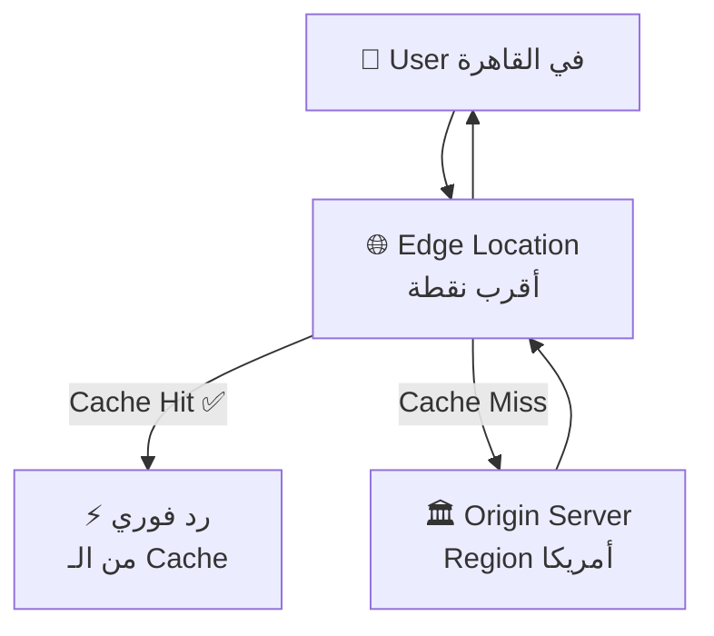
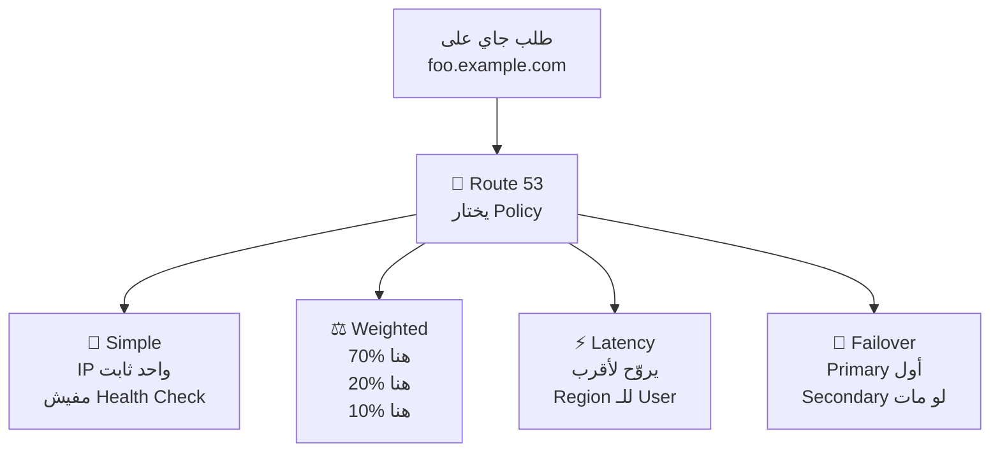
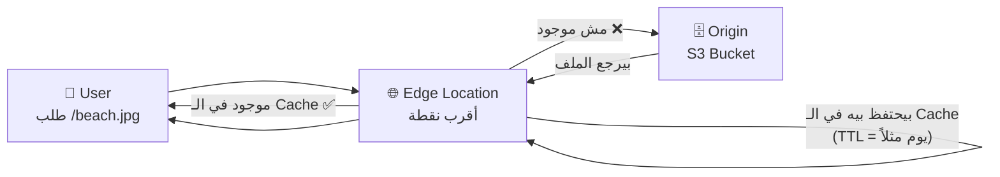
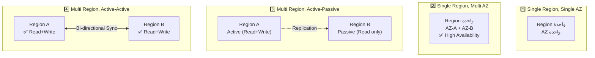
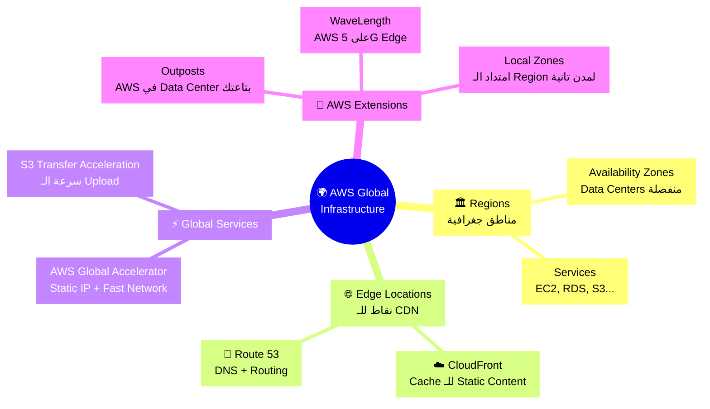

# 🌍 الـ Global Infrastructure — AWS في كل مكان في الدنيا

---

## 🏚️ قبل الـ Global Infrastructure — المشكلة اللي حلتها AWS

تخيّل معايا إنك بنيت تطبيق جميل، Server واحد في أمريكا، والناس في القاهرة أو طوكيو بيفتحوا الموقع — وبيلاقوا إنه **بطيييء جداً**. ليه؟ لأن الـ packet الصغير ده بيسافر حرفياً آلاف الكيلومترات قبل ما يوصلك الرد. ده زي ما حد في الإسكندرية يتصل بفرع بنك في نيويورك عشان يسأل عن رصيده — بدل ما يروح الفرع اللي ناحيته.

المشكلة مش بس في السرعة. تخيّل كمان إن الـ Server ده وقع — زلزال، كهرباء انقطعت، أي حاجة — خلاص، التطبيق كله مات. مفيش Backup، مفيش Failover، مفيش أي حاجة. الناس تشتكي، أنت تخسر فلوس، والموضوع بيبقى كارثة.

AWS حلّت المشكلة دي بإنها بنت Infrastructure موزع على طول الدنيا — مش Server واحد، ولا مكان واحد — لكن شبكة ضخمة من الـ Regions والـ Availability Zones والـ Edge Locations. وده اللي بنتكلم فيه النهارده.

---

## ☁️ الـ Global Infrastructure — الخريطة الكبيرة

الـ AWS Infrastructure زي سلسلة مطاعم فاست فود كبيرة. المطبخ الرئيسي (الـ Region) موجود في أماكن كبيرة زي أمريكا وأوروبا وآسيا. جوّا كل فرع فيه أكتر من كاونتر شغال (الـ Availability Zones). وفيه كمان نقاط توصيل سريعة (الـ Edge Locations) قريبة منك عشان توصّلك أكلك بسرعة من غير ما تروح المطبخ الكبير.

الـ AWS بتقسّم الـ Infrastructure لـ **3 مستويات**:

```
Regions (الأكبر)
    └── Availability Zones (AZs)
            └── Data Centers
Edge Locations (Points of Presence) — منفصلة للـ CDN
```

---

## 🔬 التفاصيل اللي بتيجي في الامتحان

### الـ Regions

الـ Region هي منطقة جغرافية كاملة (زي `us-east-1` في فيرجينيا أو `eu-west-1` في أيرلندا). لما بتنشر الـ Application بتاعك، بتختار Region. كل الـ Services المهمة بيتم Deploy عليها في الـ Region.

> [!important]+ ليه تختار Region معينة؟
> ✅ **Latency** — قرّب الـ Users من الـ Server
> ✅ **Compliance** — بعض الدول بتطلب إن الـ Data تفضل جوّا حدودها
> ✅ **Service Availability** — مش كل الـ Services متاحة في كل الـ Regions
> ✅ **Pricing** — الأسعار بتختلف من Region لأخرى

### الـ Availability Zones (AZs)

كل Region فيها على الأقل **2 AZs** (الغالب 3 أو أكتر). كل AZ هي Data Center منفصلة (أو مجموعة Data Centers) بكهرباء وشبكة وأمان مستقل عن غيرها. لو AZ واحدة وقعت، الباقيين شغالين.

🔑 **Keyword في الامتحان:** لو شفت "High Availability" أو "fault tolerance" — الإجابة بتتعلق دايماً بالـ Multi-AZ deployment.

### الـ Edge Locations (Points of Presence)

دي مختلفة عن الـ AZs. الـ Edge Locations مش للـ Deploy — دي للـ **Content Delivery**. فيه منها مئات حول العالم. CloudFront بيستخدمها عشان يحط الـ Content قريب من المستخدم.



---

## 🗺️ الـ Services اللي بتخلي التطبيق Global

### 1. Amazon Route 53 — دليل التليفون للإنترنت

تخيّل إنك عايز تكلم حد وعندك اسمه بس مش عندك رقمه — بتروح الدليل وتبحث عن الاسم وتلاقي الرقم. Route 53 بيعمل نفس الكلام — بيحوّل الـ Domain Name (`www.myapp.com`) لـ IP Address تقدر توصله.

> [!important]+ الـ DNS Record Types في الامتحان
> - **A Record** — Domain → IPv4 (زي `www.google.com → 12.34.56.78`)
> - **AAAA Record** — Domain → IPv6
> - **CNAME** — Domain → Domain تاني (زي `search.google.com → www.google.com`)
> - **Alias** — Domain → AWS Resource (ELB, CloudFront, S3) — ده الأهم في AWS

#### الـ Routing Policies — Route 53 مش بس DNS!



🔑 **Keyword في الامتحان:**
- "**Disaster Recovery**" أو "**Failover**" → **Failover Routing Policy**
- "**Closest region**" أو "**lowest latency**" → **Latency Routing Policy**
- "**A/B testing**" أو "**weight**" → **Weighted Routing Policy**

---

### 2. Amazon CloudFront — الفرع القريب منك

تخيّل إن بيتك بعيد عن المحل الكبير. بدل ما تمشي ساعة كل ما تحتاج حاجة، فتحوا فرع صغير في حيّك يحتفظ بأكتر الحاجات المطلوبة. CloudFront هو الفرع الصغير ده — بيحتفظ بنسخة من الـ Content في أقرب Edge Location للمستخدم.

**CloudFront Origins — مين اللي بيجيب منه الـ Content؟**

| الـ Origin | الوصف | امتى تستخدمه |
|---|---|---|
| **S3 Bucket** | توزيع ملفات وصور وـ Static Content | Static websites، ملفات، ميديا |
| **VPC Origin** | ALB أو EC2 في الـ Private Subnet | Applications بـ Backend |
| **Custom HTTP** | أي HTTP endpoint عام | Legacy systems، S3 Static Website |

**إزاي CloudFront بيشتغل؟**



> [!important]+ CloudFront + S3: الـ OAC
> لما بتستخدم S3 كـ Origin، لازم تستخدم **Origin Access Control (OAC)** عشان الـ Bucket يبقى Private والناس ميقدروش يوصلوه directly — يوصلوه بس عن طريق CloudFront.

---

### 3. CloudFront vs S3 Cross-Region Replication — أكبر مقارنة في الامتحان

| | **CloudFront** | **S3 Cross-Region Replication** |
|---|---|---|
| **الوظيفة** | Cache الـ Content في الـ Edge Locations | نسخ الملفات لـ S3 Bucket في Region تانية |
| **الـ Coverage** | Globally — مئات الـ Edge Locations | Region معينة (بتحددها أنت) |
| **الـ Update** | بعد انتهاء الـ TTL | Near Real-time |
| **الـ Read/Write** | Read & Write (لو S3 Origin) | Read Only |
| **الكلمة المفتاحية** | "cache", "static content", "worldwide" | "real-time replication", "few regions", "dynamic content" |
| **متى تختاره؟** | Static content لازم يوصل لكل الدنيا بسرعة | Dynamic content محتاج يبقى متاح بـ Low Latency في Regions محددة |

🔑 **Keyword في الامتحان:**
- "**globally cached**" أو "**static content everywhere**" → **CloudFront**
- "**real-time**" أو "**specific regions**" أو "**dynamic**" → **S3 Cross-Region Replication**

---

### 4. S3 Transfer Acceleration — الطريق السريع للـ Upload

تخيّل إنك في الغردقة وعايز ترسل طرد لشنغهاي. بدل ما تبعته مباشرة، بتوصّله لأقرب فرع DHL في الغردقة، وهم يستخدموا طريقهم الداخلي السريع جداً. S3 Transfer Acceleration بيعمل نفس الكلام — بدل ما الـ File يتحرك على الـ Public Internet البطيء، بيروح لأقرب Edge Location وبعدين يتحرك على الـ AWS Private Network السريع جداً.


🔑 **Keyword في الامتحان:** "**accelerate uploads to S3**" أو "**global uploads**" → **S3 Transfer Acceleration**

---

### 5. AWS Global Accelerator — الـ IP الثابت السريع

Global Accelerator زي ما تكون عندك VIP Line في الاتصالات — بدل ما تروح على الشبكة العادية المزدحمة، بتدخل على الشبكة الخاصة المضمونة. بيدّيك **2 Static Anycast IPs** ثابتين، والـ Traffic بيدخل من أقرب Edge Location وبيروح على الـ AWS Global Network لـ Region بتاعتك.

**مقارنة أساسية — CloudFront vs Global Accelerator:**

| | **CloudFront** | **AWS Global Accelerator** |
|---|---|---|
| **الوظيفة الأساسية** | CDN — بيـ Cache الـ Content | Proxy — بيوصّل الـ Packets بسرعة |
| **Caching** | ✅ بيعمل Cache | ❌ مفيش Cache |
| **الـ IP** | متغير | **Static IP ثابت** |
| **مناسب لـ** | Static content (صور، فيديو، HTML) | TCP/UDP applications، Gaming، IoT |
| **الكلمة المفتاحية** | "cache", "images", "videos", "CDN" | "static IP", "TCP/UDP", "fast failover", "non-HTTP" |

> [!important]+ الفرق الجوهري بينهم
> **CloudFront** بيخدم الـ Content من الـ Edge نفسها (Cache).
> **Global Accelerator** بيوصّل الـ Request من الـ Edge لـ Application في الـ Region — من غير ما يحتفظ بأي حاجة في الـ Edge.

🔑 **Keyword في الامتحان:**
- "**static IP**" أو "**deterministic IP**" → **Global Accelerator**
- "**fast regional failover**" و "**non-HTTP**" → **Global Accelerator**
- "**cache**" أو "**images**" أو "**videos**" → **CloudFront**

---

## 🌐 الـ Services اللي بتمدّ AWS لأماكن تانية

### AWS Outposts — AWS في Data Center بتاعتك

تخيّل إن AWS بعتلك Rack جاهز تحطه في مكانك — وده بيشتغل بنفس الـ APIs والـ Tools بتاعت AWS. ده بالظبط الـ Outposts. بتحتاجه لو:
- عندك **Data Residency** requirements (البيانات لازم تفضل في مكان معين)
- محتاج **Low Latency** لـ On-premises systems
- بتعمل Migration تدريجي للـ Cloud

> ⚠️ **انتبه:** الـ Physical Security بتاع الـ Outposts Rack **مسؤوليتك أنت** — مش AWS.

Services شغّالة على Outposts: EC2، EBS، S3، RDS، ECS، EKS، EMR.

---

### AWS WaveLength — AWS على حافة الـ 5G

الـ WaveLength بيحط الـ AWS Infrastructure **جوّا** شبكة الـ Telecom carriers نفسها. يعني الـ Traffic مبيطلعش من شبكة الـ Carrier أصلاً. ده بيدّي Latency منخفض جداً جداً — مهم لـ Use Cases زي:

- Self-driving cars (السيارات ذاتية القيادة)
- Real-time gaming
- AR/VR
- Live streaming

🔑 **Keyword في الامتحان:** "**5G**" أو "**ultra-low latency**" أو "**telecom**" → **WaveLength**

---

### AWS Local Zones — امتداد الـ Region ليك

الـ Local Zones بتمدّ الـ Region الأساسية (زي `us-east-1`) لمدن أقرب منك. مثلاً `us-east-1` موجودة في فيرجينيا، لكن ممكن تستخدم Local Zone في بوسطن أو شيكاغو عشان تقرّب من Users في المدن دي.

**الفرق بين WaveLength والـ Local Zones:**

| | **WaveLength** | **Local Zones** |
|---|---|---|
| **موجودة عند** | Telecom Carrier (داخل شبكة الـ 5G) | مدن كبيرة بعيدة عن الـ Region |
| **الـ Use Case** | Ultra-low latency مع 5G | Latency-sensitive apps لمدن معينة |
| **الكلمة المفتاحية** | "5G", "telecom" | "closer to end users", "specific city" |

---

## ⚔️ الـ Global Applications Architectures — التصميمات الأربعة



| | **Single/Single** | **Single/Multi AZ** | **Multi-Region Active-Passive** | **Multi-Region Active-Active** |
|---|---|---|---|---|
| **الـ Availability** | ❌ منخفضة | ✅ عالية | ✅✅ | ✅✅✅ |
| **Global Latency** | ❌ عالية | ❌ عالية | ✅ Reads سريعة | ✅✅ كل حاجة سريعة |
| **التعقيد** | ⭐ | ⭐⭐ | ⭐⭐⭐ | ⭐⭐⭐⭐ |
| **الكلمة المفتاحية** | Dev/Test | Production بسيطة | DR مع Reads موزّعة | Global app كاملة |

---

## 🎯 فخاخ الـ Exam — اللي بيوقع فيه الناس

**الـ Trap 1 (CloudFront vs Global Accelerator):**
"تطبيقك بيستخدم TCP وعايز تحسّن الـ Performance globally"
— الإجابة الصح: **Global Accelerator** لأن CloudFront بيشتغل مع HTTP/HTTPS فقط والـ Cache، بس Global Accelerator يشتغل مع TCP/UDP.

**الـ Trap 2 (CloudFront vs S3 CRR):**
"عايز الـ Content يكون متاح بـ near real-time في 3 Regions محددة"
— الإجابة الصح: **S3 Cross-Region Replication** لأن CloudFront بيعمل Cache وبيتأخر بالـ TTL، S3 CRR بيكون real-time.

**الـ Trap 3 (WaveLength vs Local Zones):**
"عايز تشغّل Application للـ Connected Vehicles على شبكة 5G"
— الإجابة الصح: **WaveLength** لأن الـ Traffic لازم يفضل جوّا شبكة الـ Telecom نفسها.

**الـ Trap 4 (Outposts Physical Security):**
"مين المسؤول عن أمان الـ Outposts؟"
— الإجابة الصح: **أنت (Customer)** مسؤول عن الـ Physical Security — AWS مسؤولة عن الـ Software والـ Management.

**الـ Trap 5 (Route 53 Routing Policies):**
"عايز تعمل Disaster Recovery وتتحوّل للـ Backup لو الـ Primary وقع"
— الإجابة الصح: **Failover Routing Policy** مش Latency — الـ Latency مبتعملش Health Check تلقائي.

**الـ Trap 6 (S3 Transfer Acceleration):**
"عايز تسرّع الـ Downloads من S3 لكل دنيا"
— الإجابة الصح: **CloudFront** مش S3 Transfer Acceleration — الـ Transfer Acceleration مهو للـ Uploads والـ Downloads على S3 بس، بس CloudFront أحسن للـ Distribution العام.

**الـ Trap 7 (Edge Locations vs AZs):**
"الـ Edge Locations هي نفسها الـ Availability Zones؟"
— الإجابة الصح: **لأ** — الـ AZs للـ Deploying Applications، الـ Edge Locations للـ Content Delivery (CloudFront) بس.

---

## 🗺️ خريطة الـ Global Infrastructure كاملة



---

## 📊 الـ Cheat Sheet النهائي

| السؤال | الإجابة الفورية |
|---|---|
| إيه الفرق بين Region وAZ؟ | Region = منطقة جغرافية، AZ = Data Center جوّا الـ Region |
| الـ Edge Locations بتستخدمها مين؟ | CloudFront + Route 53 |
| عايز DNS مع Failover؟ | Route 53 — Failover Routing Policy |
| عايز Routing بناءً على القرب؟ | Route 53 — Latency Routing Policy |
| عايز توزّع Traffic بنسب؟ | Route 53 — Weighted Routing Policy |
| عايز Cache للـ Static Content globally؟ | CloudFront |
| عايز Static IP لـ Application على TCP؟ | AWS Global Accelerator |
| عايز تسرّع الـ Uploads لـ S3؟ | S3 Transfer Acceleration |
| عايز Real-time Replication لـ S3؟ | S3 Cross-Region Replication |
| عايز AWS في Data Center بتاعتك؟ | AWS Outposts |
| عايز Ultra-low latency مع 5G؟ | AWS WaveLength |
| عايز توصّع Region لمدينة معينة؟ | AWS Local Zones |
| مين المسؤول عن Physical Security في Outposts؟ | **أنت (Customer)** |
| CloudFront بيعمل Caching؟ | ✅ نعم |
| Global Accelerator بيعمل Caching؟ | ❌ لأ — Proxying بس |
| S3 CRR بيسمح بالـ Write في الـ Replica؟ | ❌ لأ — Read Only |
| الـ Alias Record في Route 53 بيوصل لإيه؟ | AWS Resources (ELB, CloudFront, S3, RDS) |

---

## ✅ Checkpoint — أسئلة الامتحان

**س: إيه الفرق بين CloudFront وGlobal Accelerator؟**
> CloudFront هو CDN — بيحتفظ بنسخة من الـ Content في الـ Edge Locations وبيردها من هناك من غير ما يروح الـ Origin. Global Accelerator مبيعملش Cache — بيوصّل الـ Packets من الـ Edge لـ Application عن طريق الـ AWS Private Network. CloudFront مناسب للـ HTTP وـ Static Content، Global Accelerator مناسب لـ TCP/UDP وـ Static IPs.

**س: امتى تستخدم Route 53 Failover وامتى تستخدم Latency؟**
> Failover لما عندك Primary وSecondary وعايز تتحوّل تلقائياً لو الـ Primary مات (Disaster Recovery). Latency لما عندك Regions متعددة وعايز المستخدم يروح للأقرب ليه تلقائياً لتقليل الـ Latency.

**س: إيه اللي بيحصل لما المستخدم يطلب File من CloudFront وده مش موجود في الـ Cache؟**
> CloudFront بيبعت الطلب للـ Origin (S3 Bucket أو ALB مثلاً)، بيجيب الـ File، بيحطه في الـ Cache في الـ Edge Location بتاعته للـ TTL المحدد، وبعدين بيردّه للمستخدم. المرة الجاية، الـ File هيتردّ من الـ Cache مباشرة.

**س: إيه الفرق بين WaveLength وLocal Zones؟**
> WaveLength بيحط الـ Infrastructure جوّا شبكة الـ Telecom نفسها، يعني الـ Traffic مبيطلعش من الـ 5G network أصلاً — Ultra-low latency لـ Use Cases زي Connected Vehicles. Local Zones بتمدّ الـ Region لمدن تانية قريبة من الـ Users — مناسب لـ Latency-sensitive applications في مدن محددة.

**س: إيه أكبر غلطة الناس بتعملها في موضوع الـ Outposts؟**
> بيفتكروا إن AWS مسؤولة عن كل حاجة في الـ Outposts. الحقيقة إن AWS بتدير الـ Software والـ Services، بس الـ Physical Security والـ Physical Maintenance مسؤوليتك أنت كـ Customer.

---

## 🫒 زتونة الامتحان

> **"الـ AWS Global Infrastructure مش مجرد Servers في أماكن كتير — هي استراتيجية كاملة لتوصيل التطبيقات بسرعة وموثوقية لأي مكان في الدنيا. الـ Regions والـ AZs بيدّوك الـ High Availability والـ Resilience. الـ Edge Locations مع CloudFront وRoute 53 بيقرّبوا الـ Content من المستخدمين. لما تشوف 'Static Content Globally' → CloudFront، 'Static IP or TCP/UDP' → Global Accelerator، 'Accelerate S3 Upload' → Transfer Acceleration، 'Real-time Replication' → S3 CRR. الـ Outposts لـ On-premises، WaveLength للـ 5G، Local Zones لمدن معينة. وافتكر دايماً: الـ Physical Security في Outposts مسؤوليتك أنت."**

---

*Next → الـ Cloud Security — IAM, Organizations, وكل حاجة بتتحكم في الـ Access والـ Permissions في AWS*
