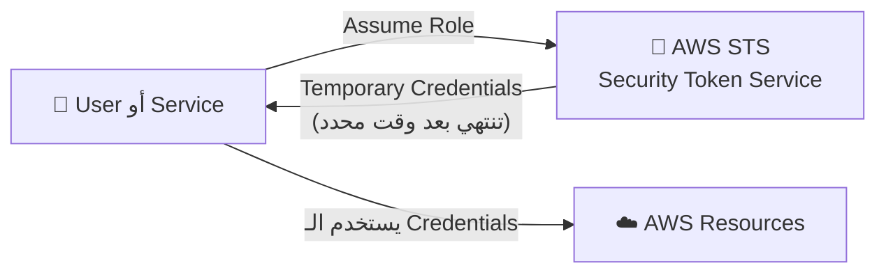
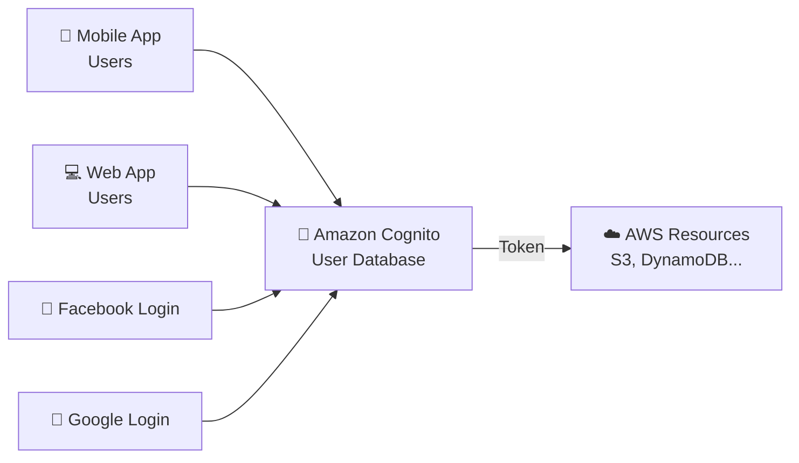
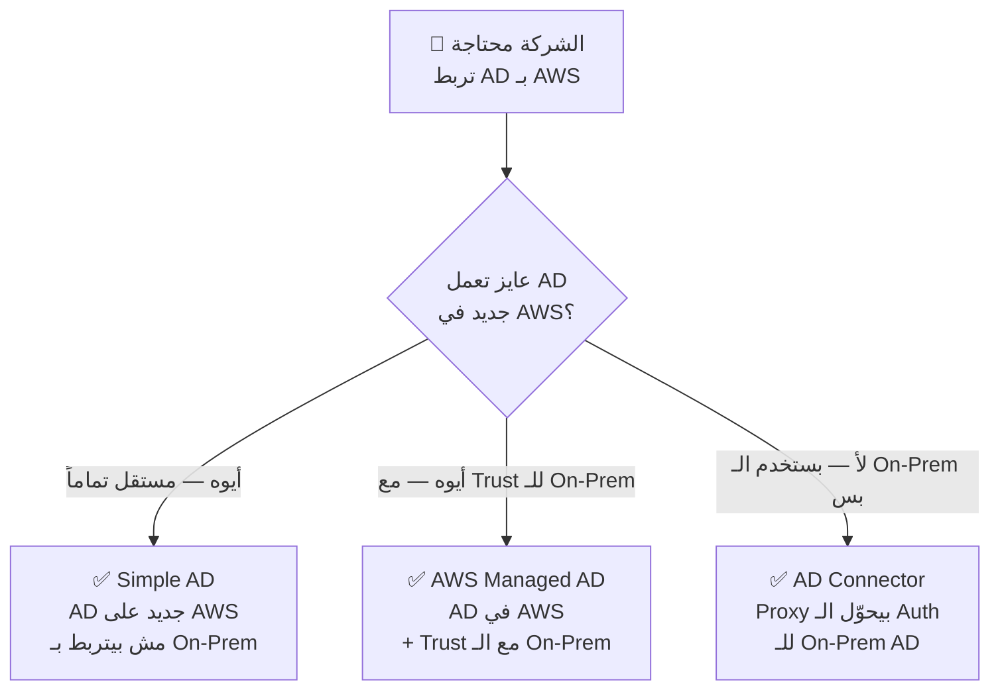
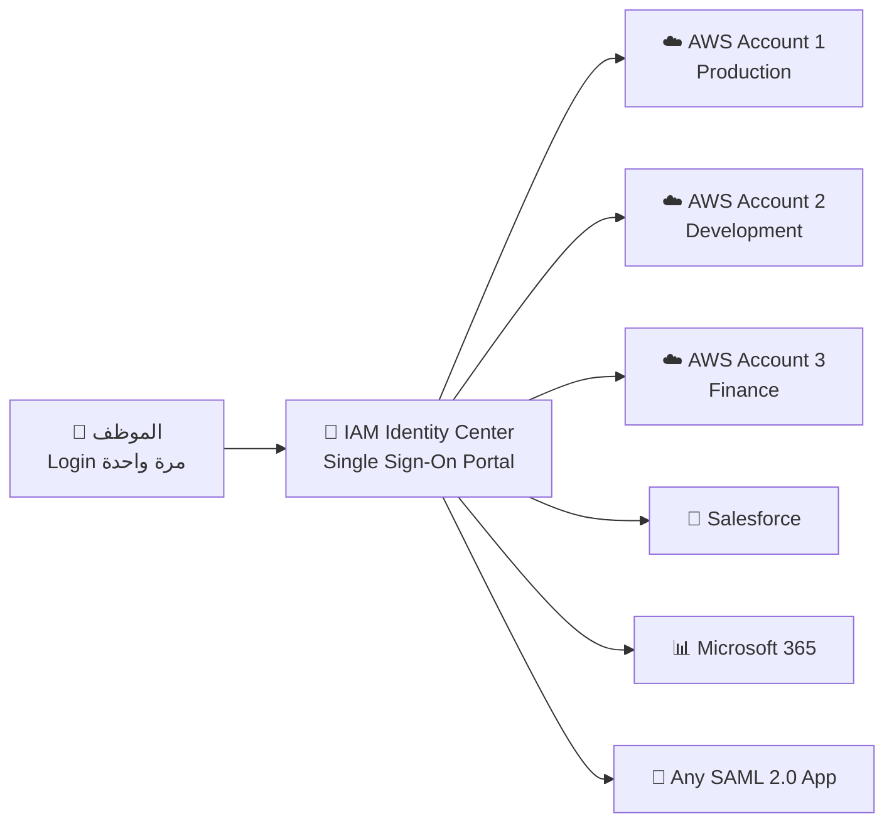

# 🪪 Advanced Identity
### نوتس امتحان AWS Certified Cloud Practitioner (CLF-C02)

---

## 🏚️ قبل الكلام ده — المشكلة الأصلية

تخيّل 3 سيناريوهات بتحصل في شركات حقيقية:

**السيناريو 1:** شركة عندها **50 موظف** كل واحد محتاج يوصل لـ AWS — هتعمل 50 IAM User وتديرهم كلهم؟ وامتى حد يمشي تلغيه يدوياً من كل مكان؟

**السيناريو 2:** عندك **تطبيق موبايل** بمليون مستخدم — معقول تعمل IAM User لكل مستخدم؟ AWS هتفضل تشتغل؟

**السيناريو 3:** شركة عندها **10 AWS Accounts** مختلفة — موظف المحاسبة محتاج يدخل على الـ Finance Account والـ Billing Account. هيعمل Login مرتين بـ Passwords مختلفة في كل مرة؟

الـ Section ده بيحل الـ 3 مشاكل دي بأدوات مختلفة.

---

# 📖 الجزء الأول: الـ AWS STS — Security Token Service

## ☁️ الـ STS — التذكرة المؤقتة

الـ STS ده زي **تذكرة يومية في فندق** — بدلاً من ما تدي الضيف نسخة من مفتاح الفندق الرئيسي (Permanent Credentials)، بتدي له Card يفتح الأوضة بتاعته بس ولفترة محددة — وبعدها بتنتهي أوتوماتيك.

الـ STS بيعمل **Temporary Security Credentials** — أوقات الصلاحية بتحددها أنت، وبعد انتهائها مش بتشتغل.

**أهم حالات الاستخدام في الامتحان:**

| الحالة | الشرح |
|---|---|
| **Identity Federation** | مستخدم موجود في نظام تاني (زي Google أو Active Directory) يوصل لـ AWS بدون IAM User |
| **Cross-Account Access** | موظف في Account A يوصل لـ Resources في Account B |
| **EC2 Instance Access** | الـ EC2 تحتاج تتعامل مع S3 — تاخد Credentials مؤقتة بدلاً من Access Keys ثابتة |

> 🔑 **Keyword في الامتحان:** لو شفت "temporary credentials" أو "short-term access" أو "assume role" — الإجابة **AWS STS**

---

# 📖 الجزء التاني: الـ Amazon Cognito — لتطبيقات الموبايل والويب

## ☁️ الـ Cognito — قاعدة بيانات المستخدمين

الـ Cognito ده زي **بواب تطبيقك** اللي بيعرف كل المستخدمين ويتحقق منهم. بدلاً من ما تعمل IAM User لكل مستخدم في تطبيقك (مستحيل!) — بتحطهم في Cognito وهو اللي يتعامل معاهم.

تخيّل التطبيق زي نادي رياضي: IAM ده للموظفين الداخليين، والـ Cognito ده للأعضاء المشتركين — ملايين ناس بيسجلوا بـ Google أو Facebook أو Email وبيدخلوا.

**الفرق الجوهري:**
- **IAM Users:** للموظفين اللي بتثق فيهم جوه الشركة (عدد محدود)
- **Cognito Users:** لمستخدمي التطبيق الخارجيين (ممكن ملايين)

> 🔑 **Keyword في الامتحان:** لو شفت "mobile app users" أو "millions of users" أو "social login (Facebook, Google)" — الإجابة **Amazon Cognito**

---

# 📖 الجزء التالت: الـ AWS Directory Services

## ☁️ الـ Microsoft Active Directory (AD) — إيه هو؟

الـ Active Directory ده زي **دفتر الموظفين المركزي** في شركة — فيه كل الموظفين، أجهزة الكمبيوتر، الطابعات، والصلاحيات. لما موظف بيعمل Login على أي جهاز في الشركة — الـ AD بيتحقق منه.

المشكلة: الشركات عندها Active Directory **On-Premises** (على السيرفرات عندهم). لما بيجوا على الـ AWS — ازاي يربطوا الـ AD القديم بالـ Cloud؟

## 🔬 الـ 3 طرق للـ Directory Services على AWS

### الـ 3 خيارات بالتفصيل:

**1. AWS Managed Microsoft AD:**
بتعمل **AD جديد كامل على AWS** وبتربطه بالـ On-Premises AD بـ "Trust Connection". الـ Users ممكن يتعاملوا من الجانبين. بيدعم MFA.

**2. AD Connector:**
ده مش AD حقيقي — ده **Proxy**. الموضوع إن الـ Users والـ Passwords مش موجودة في AWS أصلاً — كل طلب Authentication بيتحوّل للـ On-Premises AD. الـ Users بيتم إدارتهم **On-Prem بس**.

**3. Simple AD:**
AD بسيط **مستقل على AWS** — مش بيتربط بأي On-Premises AD. للشركات اللي مش عندها On-Prem AD ومحتاجة AD Compatibility بسرعة.

> ⚔️ **مقارنة حاسمة — الـ 3 خيارات:**

| | **AWS Managed AD** | **AD Connector** | **Simple AD** |
|---|---|---|---|
| **وين المستخدمين؟** | AWS + On-Prem (Trust) | On-Prem بس | AWS بس |
| **AD حقيقي على AWS؟** | ✅ نعم | ❌ Proxy بس | ✅ نعم |
| **بيتربط بـ On-Prem؟** | ✅ بـ Trust | ✅ كـ Proxy | ❌ لأ |
| **MFA؟** | ✅ | ✅ | ❌ |
| **الكلمة المفتاحية** | "Trust with On-Prem" | "Redirect to On-Prem" | "Standalone, no On-Prem" |

> 🔑 **Keyword في الامتحان:**
> - "Manage users locally in AWS + trust on-prem" → **AWS Managed AD**
> - "Proxy, redirect auth to on-premises" → **AD Connector**
> - "Simple, no on-premises AD" → **Simple AD**

---

# 📖 الجزء الرابع: الـ IAM Identity Center — Single Sign-On

## 🏚️ المشكلة اللي بيحلها

شركة عندها 10 AWS Accounts وكل موظف محتاج يوصل لـ 3 أو 4 منهم. كل مرة بيبدل Account بيعمل Login من الأول. ده وجع حقيقي ومضيعة وقت. وكمان شركة بتستخدم Salesforce وMicrosoft 365 — كمان Login تاني.

## ☁️ الـ IAM Identity Center — الحل

الـ IAM Identity Center ده زي **ريموت كونترول واحد لكل التليفزيونات** — Login مرة واحدة وبعدين توصل لكل حاجة. ده اللي بيسموه **Single Sign-On (SSO)**.

تخيّل إنك بتدخل بوابة الشركة الصبح ببطاقتك — ومن غير ما تعمل أي حاجة تانية بتقدر توصل لأوضتك، الكافيتيريا، والـ Gym. مرة واحدة كفاية.

**بيشتغل مع:**
- كل الـ AWS Accounts في الـ AWS Organization
- Business Cloud Apps: Salesforce, Box, Microsoft 365
- أي تطبيق بيدعم **SAML 2.0**
- EC2 Windows Instances

**مصادر الـ Identity (من فين بتجيب اليوزرات؟):**
- **Built-in:** إنشاء Users مباشرة في الـ IAM Identity Center
- **3rd Party:** Active Directory, Okta, OneLogin

> 🔑 **Keyword في الامتحان:** لو شفت "single sign-on" أو "one login for multiple AWS accounts" أو "SSO for business applications" — الإجابة **IAM Identity Center**

---

## ⚔️ جدول المقارنة الكبير — كل الـ Identity Services

| الـ Service | بتحل إيه؟ | الجمهور | الكلمة المفتاحية |
|---|---|---|---|
| **IAM** | إدارة الصلاحيات لـ Users موثوقين في الـ Account | موظفي الشركة | "Users, Roles, Policies" |
| **STS** | Temporary Credentials للوصول المؤقت | Services & Federated Users | "Temporary, assume role" |
| **Cognito** | قاعدة بيانات للـ App Users الخارجيين | ملايين مستخدمي App | "Mobile/Web app, millions of users" |
| **Directory Services** | ربط Microsoft AD بـ AWS | الشركات اللي عندها AD | "Active Directory, on-premises" |
| **IAM Identity Center** | Login واحد لكل الـ Accounts والـ Apps | موظفين محتاجين multi-account | "SSO, single sign-on" |

---

## 🎯 فخاخ الـ Exam — اللي بيوقع فيه الناس

**الـ Trap 1 — Cognito للموظفين الداخليين:**
"عندك 500 موظف محتاجين يدخلوا على الـ AWS Console — تستخدم Cognito؟"
— الإجابة الصح: **لأ!** Cognito للمستخدمين الخارجيين (App Users). الموظفين الداخليين → **IAM** أو **IAM Identity Center**.

**الـ Trap 2 — STS بيدي Permanent Credentials:**
"الـ STS بيدي Credentials دايمة للـ Services؟"
— الإجابة الصح: **لأ!** STS بيدي **Temporary Credentials** بتنتهي صلاحيتها.

**الـ Trap 3 — AD Connector بيخزن Users في AWS:**
"الـ AD Connector بيحتفظ بنسخة من الـ Users في AWS؟"
— الإجابة الصح: **لأ!** AD Connector هو **Proxy بس** — الـ Users موجودين على الـ On-Premises فقط. مفيش أي بيانات Users على AWS.

**الـ Trap 4 — Simple AD ينضم لـ On-Premises AD:**
"تقدر تعمل Trust بين الـ Simple AD والـ On-Premises AD؟"
— الإجابة الصح: **لأ!** Simple AD مستقل تماماً — مش بيتربط بأي On-Premises AD. عايز Trust؟ استخدم **AWS Managed AD**.

**الـ Trap 5 — IAM Identity Center بس للـ AWS:**
"الـ IAM Identity Center بيوفر SSO لـ AWS Accounts بس؟"
— الإجابة الصح: **لأ!** بيوفر SSO لـ **AWS Accounts + Business Apps (Salesforce, M365) + أي SAML 2.0 App**.

**الـ Trap 6 — Cognito بيعمل IAM Users:**
"الـ Cognito بيعمل IAM User لكل مستخدم جديد في التطبيق؟"
— الإجابة الصح: **لأ!** Cognito عنده User Pool خاص بيه — مش IAM Users.

---

## 📊 الـ Cheat Sheet النهائي

| السؤال | الإجابة الفورية |
|---|---|
| Temporary credentials للـ Services والـ Roles؟ | **AWS STS** |
| ملايين مستخدمين على App موبايل أو ويب؟ | **Amazon Cognito** |
| Login بـ Facebook/Google على App؟ | **Amazon Cognito** |
| ربط Microsoft AD الـ On-Premises بـ AWS؟ | **AWS Directory Services** |
| AD في AWS مع Trust بالـ On-Premises؟ | **AWS Managed Microsoft AD** |
| Proxy يحوّل الـ Auth للـ On-Premises AD؟ | **AD Connector** |
| AD بسيط على AWS بدون On-Prem؟ | **Simple AD** |
| Login مرة واحدة لكل الـ AWS Accounts؟ | **IAM Identity Center** |
| SSO مع Salesforce وMicrosoft 365؟ | **IAM Identity Center** |
| SAML 2.0 SSO؟ | **IAM Identity Center** |
| Identity للموظفين الموثوقين جوه الشركة؟ | **IAM** |
| الـ STS بيدي Permanent ولا Temporary؟ | **Temporary** |
| AD Connector بيخزن Users في AWS؟ | **لأ — Proxy بس** |
| Simple AD بيتربط بـ On-Premises؟ | **لأ — مستقل تماماً** |
| IAM Identity Center = بديل إيه؟ | **AWS Single Sign-On (SSO)** |
