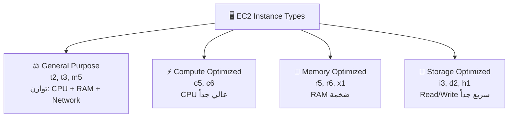
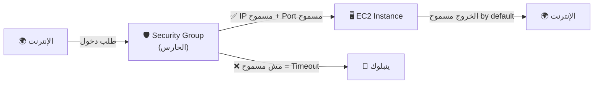
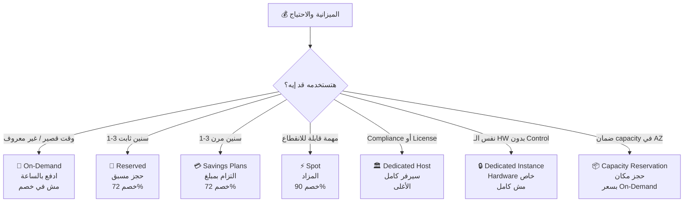
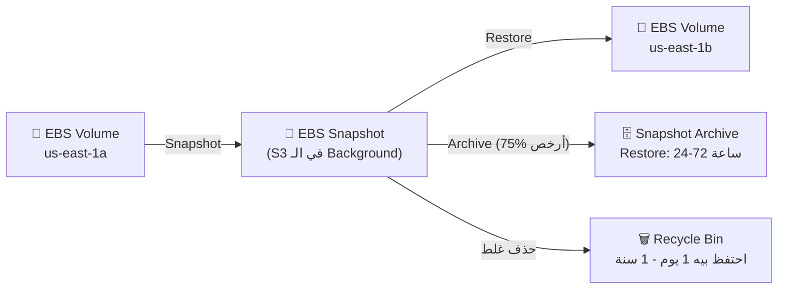

# 🖥️ Amazon EC2 & EC2 Storage
### نوتس امتحان AWS Certified Cloud Practitioner (CLF-C02)

---

## 🏚️ قبل الـ EC2 — المشكلة الأصلية

زمان لما شركة كانت تحتاج Server — كانت بتشتري جهاز فيزيائي بعشرات الآلاف من الدولارات، تستنى التوصيل أسابيع، تركّبه في الـ Data Center، وتشيّل فريق يصونه. لو الـ Traffic زاد — تستنى تاني شهرين عشان تشتري سيرفر جديد. لو الـ Traffic نزل — السيرفر القديم قاعد بيتأكله الصدا وبيكلفك. الـ EC2 جاء يقلب الموضوع رأساً على عقب.

---

# 📖 الجزء الأول: الـ EC2 نفسه

## ☁️ الـ EC2 — الحل

الـ EC2 (Elastic Compute Cloud) ده زي **تأجير شقة مفروشة بدل ما تبني بيت**. عايز Server؟ بتطلبه في دقائق، وبتدفع بالساعة أو بالثانية بس. مش عايزه؟ توقفه وبيقف الحساب. ده بالظبط معنى **IaaS — Infrastructure as a Service**.

**إيه اللي بتحدده لما بتعمل EC2 Instance:**

- **Operating System:** Linux, Windows, أو Mac OS
- **CPU:** عدد الـ vCPUs والـ Cores
- **RAM:** قدر الـ Memory
- **Storage:** EBS, EFS, أو Instance Store
- **Network Card:** السرعة والـ Public IP
- **Security Group:** الـ Firewall Rules
- **EC2 User Data:** Script بيتنفذ أول مرة بس عند التشغيل

---

## 🚀 الـ EC2 User Data — السكريبت التلقائي

تخيّل إنك اشتريت موبايل جديد وفيه "إعداد تلقائي" بيحمّل كل التطبيقات بتاعتك من أول ما تشغّله. الـ User Data نفس الفكرة — **Script بتكتبه مرة واحدة** وبيتنفذ عند أول تشغيل للـ Instance عشان يعمل كل الإعداد التلقائي.

**ينفع لإيه؟**
- تثبيت الـ Updates والـ Software
- تحميل ملفات من الإنترنت
- أي حاجة محتاجها تتعمل أوتوماتيك عند البداية

> [!important]+ نقطة مهمة
> الـ User Data Script بيشتغل بـ **Root User Privileges** — وبيتنفذ **مرة واحدة فقط** عند أول Start للـ Instance.

---

## 🏷️ أنواع الـ EC2 Instances — Naming Convention

اسم زي **m5.2xlarge** بيقولك كل حاجة:
- **m** = Instance Class (نوع الاستخدام)
- **5** = الـ Generation (الجيل — كلما أعلى كلما أحدث)
- **2xlarge** = الحجم جوه الـ Class

### الـ 4 أنواع الرئيسية في الامتحان:

| النوع | الكلمة المفتاحية | الاستخدامات |
|---|---|---|
| **General Purpose** | "Balanced, web servers" | Web Servers, Code Repos، التطبيقات العادية |
| **Compute Optimized** | "High CPU, HPC, Gaming" | Batch Processing, ML, Gaming Servers, Media Transcoding |
| **Memory Optimized** | "In-memory, Big Data, BI" | Databases, Cache, Real-time Big Data Processing |
| **Storage Optimized** | "OLTP, High IOPS, sequential" | OLTP, NoSQL Databases, Data Warehousing, Distributed File Systems |

> 🔑 **Keyword في الامتحان:** لو شفت "high performance processors" أو "batch jobs" → **Compute Optimized**. لو شفت "in-memory database" أو "BI" → **Memory Optimized**. لو شفت "OLTP" أو "high sequential I/O" → **Storage Optimized**.

**ملاحظة:** الـ **t2.micro** هو الـ Instance اللي بيُستخدم في الـ Free Tier — **1 vCPU و 1 GiB RAM**.

---

# 📖 الجزء التاني: الـ Security Groups

## ☁️ الـ Security Group — البواب الذكي

الـ Security Group ده زي **حارس عند مدخل العمارة** — بيشوف كل حد عايز يدخل ويقرر: مسموح ولا لأ؟ وبيتحكم كمان في اللي خارج.

**قواعد الـ Security Group:**

**أهم الخصائص اللي بتيجي في الامتحان:**

- **بتحتوي على Rules بس** — مفيش Allow AND Deny في نفس الـ Rule
- **Inbound مبلوك by Default** — يعني مش هيدخل أي حاجة إلا لو أنت سمحت
- **Outbound مسموح by Default** — كل حاجة خارجة من الـ Instance مسموحة
- **بيشتغل "خارج" الـ EC2** — لو حاجة اتبلكت، الـ EC2 نفسه مش حيشوفها
- **ممكن تتعلق بأكتر من Instance**
- **مقيدة بالـ Region/VPC** — Security Group في us-east-1 مش بتشتغل في eu-west-1
- **ممكن تحدد Security Group تانية كـ Source** بدلاً من IP

**تشخيص المشاكل:**
- الـ App بتعمل **Time Out** → مشكلة في الـ **Security Group** (Port مبلوك)
- الـ App بترد بـ **Connection Refused** → مشكلة في الـ **Application** نفسها (مش شغال)

> [!important]+ الـ Ports المهمة — لازم تحفظها
> - **22** = SSH (Linux) وـ SFTP
> - **21** = FTP
> - **80** = HTTP
> - **443** = HTTPS
> - **3389** = RDP (Windows)

> 🔑 **Keyword في الامتحان:** لو شفت "firewall for EC2" أو "control inbound/outbound traffic" — الإجابة **Security Group**

---

## 🔌 الـ SSH والـ EC2 Instance Connect

**SSH:** بيخليك تتحكم في الـ EC2 Instance بالـ Command Line عن بُعد — على Port 22.

| الطريقة | على مين؟ | الأداة |
|---|---|---|
| **SSH** | Mac/Linux | Terminal مباشرة |
| **SSH** | Windows | Putty |
| **EC2 Instance Connect** | كل الأجهزة | Browser مباشرة (مش محتاج Key File) |

> [!important]+ EC2 Instance Connect
> بيشتغل مباشرة من المتصفح — AWS بترفع Temporary Key أوتوماتيك. لكن لازم Port 22 يكون مفتوح في الـ Security Group!

---

# 📖 الجزء التالت: خيارات الشراء (Purchasing Options)

## ☁️ الـ 7 خيارات — تشبيه الفندق

تخيّل إنك بتحجز فندق — في أكتر من طريقة للحجز:

---

### 🏨 الـ 7 خيارات بالتفصيل

**1. On-Demand — "الفندق العادي"**
- بتيجي لما تحب وبتدفع بالساعة/بالثانية (Linux/Windows بالثانية بعد الدقيقة الأولى)
- **أعلى سعر** لكن مفيش التزام
- **متى تستخدمه؟** للـ Workloads قصيرة المدة أو الغير متوقعة

**2. Reserved Instances — "الإيجار السنوي"**
- خصم يوصل لـ **72%** عن الـ On-Demand
- بتحدد: Instance Type + Region + OS + Tenancy
- المدة: **1 سنة** (خصم أقل) أو **3 سنين** (خصم أكتر)
- الدفع: All Upfront (أعلى خصم) / Partial Upfront / No Upfront
- **Convertible Reserved:** بيسمح بتغيير الـ Instance Type — خصم أقل (66%)
- تقدر **تبيع وتشتري** في الـ Reserved Instance Marketplace
- **متى تستخدمه؟** Databases وأي حاجة شغالة 24/7 لفترة طويلة ومعروفة

**3. Savings Plans — "اشتراك شهري بمبلغ محدد"**
- خصم لـ **72%** زي الـ Reserved
- بتلتزم بـ **مبلغ دولار/ساعة** مش بـ Instance Type معين (مثلاً $10/hour لمدة سنة)
- مرن في: الحجم، الـ OS، والـ Tenancy — لكن محدود بـ Instance Family وـ Region
- **متى تستخدمه؟** لما تعرف قد إيه هتصرف بس مش عارف الـ Instance Type المحدد

**4. Spot Instances — "المزاد على أوضة الفندق الفاضية"**
- **أرخص خيار بـ 90% خصم**
- AWS بتعرض الـ Capacity الفاضية بالمزاد — لو السعر وصل فوق سعرك، AWS تقفل الـ Instance!
- **متى تستخدمه؟** Batch Jobs, Data Analysis, Image Processing — أي حاجة مش مشكلة لو اتقطعت
- **مش مناسب:** لـ Databases أو أي Workload مش يتحمل الانقطاع

**5. Dedicated Hosts — "بتشتري العمارة كلها"**
- سيرفر فيزيائي كامل مخصص لك وحدك
- **الأغلى على الإطلاق**
- **متى تستخدمه؟** لما عندك Software Licenses ترخيصها على عدد الـ Sockets/Cores (BYOL)، أو لمتطلبات Compliance صارمة

**6. Dedicated Instances — "أوضة لوحدك في الفندق بس مش الفندق كله"**
- الـ Hardware مخصص لأكاونتك بس — مش هتشاركه مع أكاونتات تانية
- بس ممكن يتنقل من Hardware لتاني
- أرخص من الـ Dedicated Host

**7. Capacity Reservations — "حجز أوضة بالسعر الكامل حتى لو مجاش"**
- بتحجز Capacity في **AZ معينة** لأي مدة
- بتدفع سعر الـ On-Demand **حتى لو مش شغّال**
- مفيش خصم — بس ضامن إن الـ Capacity موجودة لما تحتاجها

---

### ⚔️ جدول مقارنة خيارات الشراء — للامتحان

| الخيار | الخصم | الالتزام | متى؟ | الكلمة المفتاحية |
|---|---|---|---|---|
| **On-Demand** | مفيش | مفيش | Short-term, unpredictable | "Pay as you go" |
| **Reserved** | 72% | 1-3 سنين | Steady-state (DB, production) | "Long term, 1 or 3 years" |
| **Savings Plans** | 72% | 1-3 سنين (مبلغ) | Flexible long-term | "Commit to dollar amount" |
| **Spot** | 90% | مفيش | Fault-tolerant, batch | "Cheapest, can be interrupted" |
| **Dedicated Host** | حسب | On-Demand/Reserved | BYOL, Compliance | "Physical server, licensing" |
| **Dedicated Instance** | متوسط | مفيش | No hardware sharing needed | "Hardware dedicated, no control" |
| **Capacity Reservation** | مفيش | مفيش | Guaranteed capacity in AZ | "Reserve capacity, no discount" |

---

# 📖 الجزء الرابع: الـ EC2 Storage

## 💾 الـ EBS — Elastic Block Store

الـ EBS ده زي **فلاشة USB بتتوصل بالـ Network** على الـ EC2 بدلاً من أن تكون موصولة بالكابل. بيانات بتفضل موجودة حتى لو وقفت أو حذفت الـ Instance.

**أهم خصائص الـ EBS:**

- **Network Drive** — مش Physical، بيستخدم الـ Network = ممكن يكون في Latency بسيطة
- **One Instance at a time** — الـ EBS Volume واحدة بتتوصل بـ Instance واحد بس (في الـ CCP Level)
- **Bound to an AZ** — لو عملت EBS في us-east-1a، مش تقدر تحطه على Instance في us-east-1b إلا بعد Snapshot
- **Provisioned Capacity** — بتحدد الحجم مسبقاً وبتتفوتر عليه حتى لو مش بتستخدمه كله
- **Delete on Termination:** الـ Root Volume بيتمسح لما تحذف الـ Instance (by default) — بس تقدر تغير الإعداد ده

**الـ EBS Snapshot:**
بيعمل نسخة احتياطية من الـ Volume في وقت معين. فايدته: تقدر تنقل البيانات لـ AZ تانية أو Region تاني.

> 🔑 **Keyword في الامتحان:** لو شفت "network drive for EC2" أو "persist data after termination" أو "bound to AZ" — الإجابة **EBS**

---

## 🖼️ الـ AMI — Amazon Machine Image

الـ AMI ده زي **Image الموبايل** — لو عندك موبايل مضبوط تماماً بكل التطبيقات والإعدادات، تقدر تعمل له "نسخة" وتحطها على موبايل تاني فيجي مضبوط من أول وجديد.

**الـ AMI هو:**
- Customization للـ EC2 Instance (OS + Software + Config)
- بيخلي الـ Boot أسرع لأن كل حاجة جاهزة مسبقاً
- **مقيد بالـ Region** (لكن ممكن تنسخه لـ Regions تانية)

**أنواع الـ AMIs:**
- **Public AMI:** اللي AWS بتوفرها (زي Amazon Linux 2)
- **Custom AMI:** اللي أنت بتعملها وبتحافظ عليها
- **Marketplace AMI:** اللي حد تاني عمله ومتاح (ببلاش أو بفلوس)

**خطوات عمل Custom AMI:**
1. شغّل Instance وضبطها زي ما تحب
2. وقّف الـ Instance (للـ Data Integrity)
3. عمل AMI منها (بيعمل EBS Snapshots في الباطن)
4. شغّل Instances جديدة من الـ AMI دي

> 🔑 **Keyword في الامتحان:** لو شفت "custom OS image" أو "faster boot" أو "pre-packaged software" — الإجابة **AMI**

---

## 🏗️ الـ EC2 Image Builder

ده Service بيعمل الـ AMI أوتوماتيك — بيبني Instance، يثبّت الـ Software، يعمل Tests، وبعدين يوزع الـ AMI على الـ Regions.

**المميزات:**
- **مجاني** — بتدفع بس على الـ Resources الأساسية
- ممكن يشتغل على جدول زمني (أسبوعي، كل ما يحصل Update إلخ)
- بيعمل Test Suite تلقائي على الـ AMI الجديدة

> 🔑 **Keyword في الامتحان:** لو شفت "automate AMI creation" أو "automated image pipeline" — الإجابة **EC2 Image Builder**

---

## ⚡ الـ EC2 Instance Store

الـ EBS كويس لكن هو **Network Drive** — يعني في Latency بسيطة. لو محتاج **أعلى أداء ممكن** من ناحية الـ I/O — الـ Instance Store هو اللي تحتاجه.

**الـ Instance Store هو Hard Disk فيزيائي** موصول بالسيرفر اللي الـ Instance بتشتغل عليه مباشرة.

> [!important]+ الخطر الأكبر — Ephemeral Storage
> الـ Instance Store **بتتمسح** لو الـ Instance اتوقفت أو اتحذفت. مش زي الـ EBS اللي بياخد Data بعيد. ده معناه:
> - **استخدمه في:** Cache, Buffer, Temp Files, Scratch Data
> - **متستخدمهوش في:** أي بيانات مهمة محتاج تفضل موجودة

| | **EBS** | **EC2 Instance Store** |
|---|---|---|
| **النوع** | Network Drive | Physical Disk |
| **الأداء** | جيد | ممتاز (High IOPS) |
| **البيانات بعد الإيقاف** | ✅ بتفضل | ❌ بتتمسح |
| **الاستخدام** | Databases, OS Volumes | Cache, Temp Data |
| **الكلمة المفتاحية** | "Persist data" | "Ephemeral, high IOPS" |

---

## 📁 الـ EFS — Elastic File System

الـ EBS بتتوصل بـ Instance واحد بس. لكن لو عندك **100 Instance محتاجة تشاور نفس الملفات** — ده مش هيشتغل. هنا بييجي الـ EFS.

الـ EFS ده زي **سيرفر ملفات مشترك** — كل الـ Instances ممكن تفتح نفس الملفات في نفس الوقت.

**أهم خصائص الـ EFS:**
- بيتوصل بمئات الـ EC2 Instances في وقت واحد
- بيشتغل مع **Linux EC2 بس** (مش Windows)
- **Multi-AZ** — متاح في أكتر من AZ في نفس الوقت
- **Scalable** — ينمو أوتوماتيك بدون ما تحدد حجم
- أغلى من الـ EBS (3 أمثال gp2 تقريباً)
- بتدفع على اللي بتستخدمه بس (Pay per use)

**الـ EFS-IA (Infrequent Access):**
زي الـ S3 Intelligent Tiering — الملفات اللي مش بتوصلهاش بتتنقل أوتوماتيك لـ Storage أرخص بـ 92% من الـ EFS Standard. بتفعّله بـ **Lifecycle Policy** (مثلاً: كل ملف مش اتوصله من 60 يوم ينتقل لـ EFS-IA).

---

## 🗄️ الـ Amazon FSx — ملفات للحالات الخاصة

الـ EFS للينوكس. لكن لو عندك Windows Clients أو HPC — محتاج حاجة تانية. هنا بييجي **FSx**.

**نوعين مهمين في الامتحان:**

**1. FSx for Windows File Server:**
- بيشتغل مع **Windows** بـ **SMB Protocol** و **NTFS**
- متكامل مع **Microsoft Active Directory**
- تقدر توصله من الـ AWS ومن الـ On-Premises

**2. FSx for Lustre:**
- لـ **High Performance Computing (HPC)**
- الاسم = Linux + Cluster
- يوصل لـ 100s GB/s و millions of IOPS
- بيستخدم في: ML, Analytics, Video Processing, Financial Modeling

| | **EFS** | **FSx for Windows** | **FSx for Lustre** |
|---|---|---|---|
| **الـ OS** | Linux فقط | Windows | Linux |
| **البروتوكول** | NFS | SMB/NTFS | Lustre |
| **الاستخدام** | Shared file system | Windows workloads | HPC |
| **الكلمة المفتاحية** | "Shared Linux files" | "Windows, AD, SMB" | "HPC, ML, millions IOPS" |

---

## ⚔️ المقارنة الكبيرة — كل الـ Storage Options

| | **EBS** | **Instance Store** | **EFS** | **FSx Windows** | **FSx Lustre** |
|---|---|---|---|---|---|
| **النوع** | Block | Block (Physical) | File | File | File |
| **الـ Instances** | 1 فقط | 1 فقط | مئات | مئات | مئات |
| **Multi-AZ؟** | ❌ | ❌ | ✅ | ✅ | ✅ |
| **بعد الإيقاف** | ✅ بتفضل | ❌ بتتمسح | ✅ | ✅ | ✅ |
| **الكلمة المفتاحية** | "Network USB, persist" | "Ephemeral, high IOPS" | "Shared Linux files" | "Windows, SMB" | "HPC, Lustre" |

---

## 🤝 الـ Shared Responsibility لـ EC2 والـ Storage

| الموضوع | AWS | أنت |
|---|---|---|
| **EC2** | Global network security, Physical hosts, Hardware | Security Groups, OS Patches, Software, IAM Roles |
| **Storage** | Infrastructure Replication, Hardware replacement, Staff access prevention | Backup/Snapshot setup, Encryption, Data responsibility, Instance Store risks |

---

## 🎯 فخاخ الـ Exam — اللي بيوقع فيه الناس

**الـ Trap 1 — الـ EBS Multi-AZ:**
"تقدر تحط EBS Volume في us-east-1a وتوصله على EC2 في us-east-1b مباشرة؟"
— الإجابة الصح: **لأ!** الـ EBS مقيد بالـ AZ. لازم تعمل **Snapshot** الأول وبعدين تعمل Volume جديدة في الـ AZ التانية.

**الـ Trap 2 — الـ EBS موصول بأكتر من Instance:**
"تقدر توصل نفس الـ EBS Volume بـ 5 Instances في نفس الوقت؟"
— الإجابة الصح: **لأ! (في الـ CCP Level)** — EBS واحدة = Instance واحدة. عايز تشارك؟ استخدم **EFS**.

**الـ Trap 3 — الـ Instance Store بيحتفظ بالبيانات:**
"Instance Store هو أحسن خيار لقاعدة البيانات عشان سريع جداً؟"
— الإجابة الصح: **لأ!** Instance Store **Ephemeral** — بيتمسح لو الـ Instance وقفت. مش مناسب للـ DB.

**الـ Trap 4 — الـ Spot Instance للـ Databases:**
"الـ Spot Instance هو أرخص طريقة لتشغيل Production Database؟"
— الإجابة الصح: **لأ!** الـ Spot ممكن يتقفل أي وقت. الـ DB محتاجة استمرارية → **Reserved Instance**.

**الـ Trap 5 — الـ Dedicated Host = Dedicated Instance:**
"الـ Dedicated Host والـ Dedicated Instance نفس الحاجة؟"
— الإجابة الصح: **لأ!** الـ **Dedicated Host** = سيرفر فيزيائي كامل لك مع تحكم كامل + BYOL. الـ **Dedicated Instance** = Hardware مخصص لأكاونتك بس لكن بدون تحكم في المكان.

**الـ Trap 6 — الـ EFS بيشتغل مع Windows:**
"محتاج تشارك ملفات بين 100 EC2 Windows Instances — تستخدم EFS؟"
— الإجابة الصح: **لأ!** EFS للـ **Linux فقط**. Windows يحتاج **FSx for Windows File Server**.

**الـ Trap 7 — الـ Capacity Reservation بيدي خصم:**
"الـ Capacity Reservation أرخص من الـ On-Demand؟"
— الإجابة الصح: **لأ!** الـ Capacity Reservation بسعر الـ **On-Demand** — بتضمن الـ Capacity بس، مفيش خصم.

**الـ Trap 8 — الـ Security Group بيدي Deny Rules:**
"تقدر تعمل Deny Rule في الـ Security Group؟"
— الإجابة الصح: **لأ!** الـ Security Group بيعمل **Allow فقط** — مفيش Deny Rules. عايز Deny؟ استخدم **NACL**.

**الـ Trap 9 — الـ Time Out مشكلة في التطبيق:**
"الـ Application بتعمل Time Out لما تحاول توصلها — المشكلة في الـ Code؟"
— الإجابة الصح: **لأ!** الـ Time Out = مشكلة في الـ **Security Group** (Port مبلوك). الـ Connection Refused = مشكلة في الـ **Application**.

---

## 📊 الـ Cheat Sheet النهائي

| السؤال | الإجابة الفورية |
|---|---|
| الـ EC2 ده IaaS ولا PaaS؟ | **IaaS** |
| الـ User Data بيتنفذ امتى؟ | **أول مرة بس عند أول Start** |
| الـ Security Group مبلوك Inbound by default؟ | **أيوه** |
| الـ Security Group مسموح Outbound by default؟ | **أيوه** |
| Time Out = مشكلة في إيه؟ | **Security Group** |
| Connection Refused = مشكلة في إيه؟ | **Application** |
| Port الـ SSH؟ | **22** |
| Port الـ RDP (Windows)؟ | **3389** |
| Port الـ HTTPS؟ | **443** |
| أرخص خيار شراء؟ | **Spot (90% خصم)** |
| أرخص للـ Steady-State (DB)؟ | **Reserved Instance** |
| BYOL أو Compliance صارمة؟ | **Dedicated Host** |
| مرن + طويل الأجل بمبلغ ثابت؟ | **Savings Plans** |
| ضمان Capacity في AZ بدون خصم؟ | **Capacity Reservation** |
| الـ EBS مقيد بـ؟ | **AZ (Availability Zone)** |
| الـ EBS موصول بكام Instance؟ | **1 فقط (CCP Level)** |
| نقل EBS من AZ لتانية؟ | **Snapshot ثم Restore** |
| الـ Root EBS بيتمسح لما الـ Instance تتحذف؟ | **أيوه (by default)** |
| الـ Instance Store بيحتفظ بالبيانات؟ | **لأ — Ephemeral** |
| الـ Instance Store الاستخدام الصح؟ | **Cache / Buffer / Temp** |
| الـ EFS بيشتغل مع إيه؟ | **Linux EC2 فقط** |
| الـ EFS-IA بتفعّله بإيه؟ | **Lifecycle Policy** |
| Windows Shared Files؟ | **FSx for Windows** |
| HPC / ML File System؟ | **FSx for Lustre** |
| AMI مقيد بـ؟ | **Region (بس ينسخ)** |
| أتمتة بناء الـ AMI؟ | **EC2 Image Builder** |
