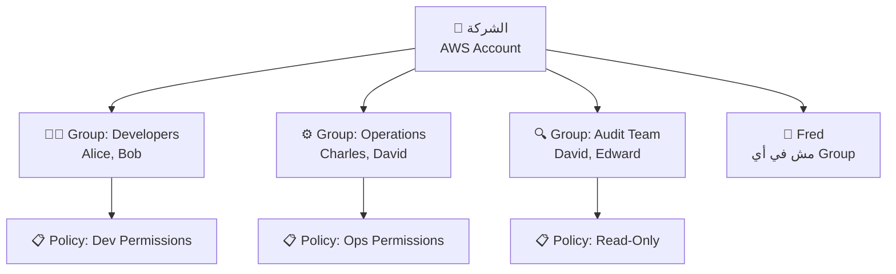
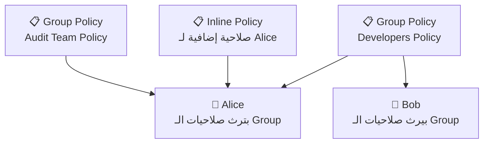
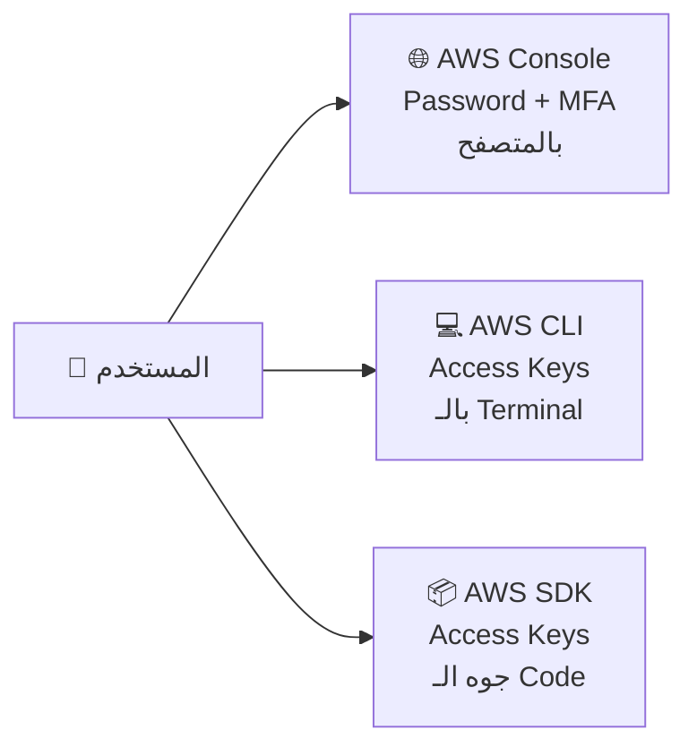
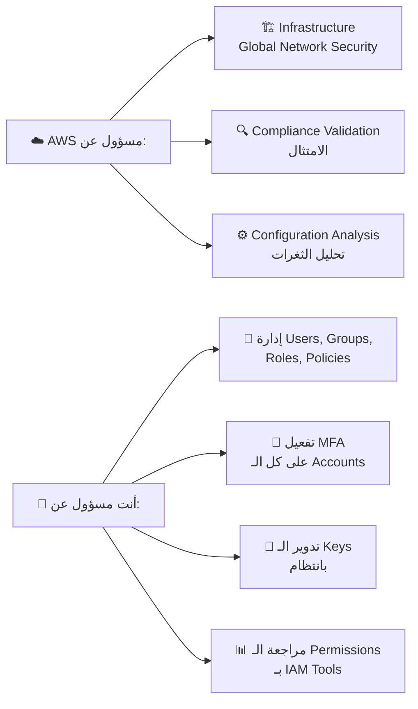

# 🔐 IAM – Identity & Access Management
### نوتس امتحان AWS Certified Cloud Practitioner (CLF-C02)

---

## 🏚️ قبل الـ IAM — المشكلة

تخيّل شركة عندها 50 موظف وكلهم بيدخلوا على الـ AWS بنفس الـ Password — Password الـ Root Account. يوم من الأيام موظف استقال وحمل معاه الـ Password، أو حد غلط بالعكس وحذف Production Database. مفيش طريقة تعرف مين اللي عمل إيه، ومفيش طريقة تقفل صلاحيات شخص معين من غير ما تغير الـ Password لكل الناس. الفوضى دي بالظبط هي اللي جاء الـ IAM يحلها.

---

## ☁️ الـ IAM — الحل

الـ IAM (Identity and Access Management) ده زي **نظام بطاقات الدخول في شركة كبيرة**. تخيّل بنك فيه: الكاشير بيقدر يفتح الخزنة الصغيرة بس، المدير بيقدر يفتح كل الخزن، والمحاسب بيقدر يشوف الأرقام بس مش يلمس الفلوس. كل واحد عنده بطاقة بصلاحيات محددة. لو واحد اترمى — تلغي بطاقته وخلاص، الباقيين مش متأثرين.

**نقطة مهمة جداً:** الـ IAM هو **Global Service** — يعني مش مرتبط بـ Region معين. لما تعمل User أو Policy، بتظهر في كل الـ Regions أوتوماتيك.

> [!important]+ الـ Root Account — الخط الأحمر
> الـ Root Account هو أول Account بيتعمل لما تسجل في AWS. ده عنده صلاحيات مطلقة على كل حاجة. القاعدة الذهبية: **استخدمه مرة واحدة بس عشان تعمل الـ IAM Users الأولانية — وبعدين قفله واحتفظ بيه في الدرج.**

---

## 🔬 التفاصيل اللي بتيجي في الامتحان

### 👤 الـ Users والـ Groups

الـ **User** هو شخص حقيقي في شركتك ليه اسم وـ Password. الـ **Group** هو مجموعة من الـ Users بيتشاركوا نفس الصلاحيات.



**قواعد لازم تحفظها:**
- الـ Group بيحتوي على **Users فقط** — مش Groups جوه Groups
- الـ User ممكن **يكون في أكتر من Group** في نفس الوقت (زي David في Operations وAudit معاً)
- الـ User ممكن **يكونش في أي Group خالص** (زي Fred) — وده مش Best Practice لكنه ممكن

---

### 📋 الـ IAM Policies — قائمة الصلاحيات

الـ Policy ده زي **عقد عمل مكتوب بالتفصيل**: "مسموح تعمل كذا، ومش مسموح تعمل كذا."

بيتكتب بـ **JSON** وليه شكل ثابت:

```json
{
  "Version": "2012-10-17",
  "Statement": [
    {
      "Effect": "Allow",
      "Action": "ec2:Describe*",
      "Resource": "*"
    }
  ]
}
```

**مكونات الـ Policy اللي بتيجي في الامتحان:**

| العنصر | الوظيفة | مثال |
|---|---|---|
| **Version** | إصدار اللغة — دايماً `"2012-10-17"` | ثابت ومش بيتغير |
| **Effect** | مسموح ولا ممنوع؟ | `Allow` أو `Deny` |
| **Principal** | مين اللي بتنطبق عليه الـ Policy؟ | User / Account / Role |
| **Action** | إيه اللي بيعمله / ممنوع يعمله؟ | `ec2:StartInstance` |
| **Resource** | على أي Resource بتنطبق؟ | `*` (كل حاجة) أو ARN معين |
| **Condition** | متى بتنطبق؟ | (اختياري) |

> [!important]+ مبدأ الـ Least Privilege
> القاعدة الذهبية في الـ IAM: **"ادي الشخص الصلاحيات اللي يحتاجها بالظبط — مش أكتر."** زي ما بتدي الـ Delivery Boy مفتاح باب البيت بس — مش مفتاح الخزنة.

**الـ Policy Inheritance (الوراثة):**



Alice عندها صلاحيات من 3 مصادر: الـ Developers Group Policy + الـ Audit Team Policy + الـ Inline Policy الخاصة بيها.

---

### 🔑 الـ Password Policy والـ MFA

#### الـ Password Policy
الـ AWS بيديك تتحكم في قوة الـ Passwords:
- **الحد الأدنى لطول الـ Password**
- **إجبار وجود:** Uppercase, Lowercase, Numbers, Special Characters
- **السماح للـ Users بتغيير الـ Password بنفسهم**
- **انتهاء صلاحية الـ Password** بعد فترة معينة
- **منع إعادة استخدام نفس الـ Password**

#### الـ MFA (Multi-Factor Authentication)
الـ MFA ده بيضيف طبقة أمان تانية — مش بس الـ Password، لازم كمان جهاز أو تطبيق.

تخيّل البنك: مش بس الـ PIN الرقمي — لازم كمان كارت الـ ATM نفسه. لو حد عرف الـ PIN بس من غير الكارت، مش هينفعه.

**معادلة الـ MFA:**
```
Password (حاجة تعرفها) + Security Device (حاجة تمتلكها) = أمان أعلى
```

**أنواع الـ MFA Devices في الامتحان:**

| النوع | المثال | ملاحظة |
|---|---|---|
| **Virtual MFA** | Google Authenticator, Authy | على الموبايل — بيدعم أكتر من Token |
| **U2F Security Key** | YubiKey (Yubico) | USB Key — بيدعم أكتر من User |
| **Hardware Key Fob** | Gemalto (3rd party) | جهاز مادي |
| **Hardware Key Fob (GovCloud)** | SurePassID (3rd party) | للحكومة الأمريكية بس |

> 🔑 **Keyword في الامتحان:** لو شفت "password is compromised but account is safe" — الإجابة **MFA**

---

### 🖥️ طرق الوصول لـ AWS — 3 طرق



**الـ Access Keys:** دي زي "Password للـ CLI والـ SDK". بتتكون من جزئين:
- **Access Key ID** → زي الـ Username
- **Secret Access Key** → زي الـ Password

> [!important]+ قواعد الـ Access Keys
> - بتعملها من الـ Console لكن **مش بتشوفها تاني** بعد ما تعملها
> - **متشاركهاش أبداً** — هي سر زي الـ Password
> - كل User بيدير الـ Access Keys بتاعته بنفسه

---

### ⚡ الـ AWS CLI والـ SDK

**الـ CLI (Command Line Interface):** أداة بتكتب فيها أوامر في الـ Terminal وبتوصل لـ AWS مباشرة. مثال: `aws s3 ls` بتليست كل الـ Buckets.

**الـ SDK (Software Development Kit):** مكتبات بتحطها جوه الـ Code بتاعك عشان تتعامل مع AWS من الكود مباشرة. بيدعم: Python, JavaScript, Java, .NET, Go, وغيرهم.

**ملاحظة مهمة:** الـ AWS CLI نفسه مبني على الـ AWS SDK for Python (boto3).

---

### 🎭 الـ IAM Roles — الأدوار

الـ Role ده زي **بدلة عمل مؤقتة** بتلبسها لما تحتاجها وبتخلعها بعدين. مش User ثابت — Role بيتدي لـ Services عشان يعمل حاجات معينة.

تخيّل: الـ EC2 Instance عايز يقرأ من الـ S3 Bucket. ده Machine مش إنسان — مش هتدي له Username وPassword. بدلاً من كده، بتدي له **Role** بيقول "مسموح تقرأ من S3".

**أكتر الـ Roles شيوعاً في الامتحان:**

| الـ Role | الاستخدام |
|---|---|
| **EC2 Instance Roles** | عشان الـ EC2 يوصل لـ Services تانية |
| **Lambda Function Roles** | عشان الـ Lambda تتنفذ وتوصل لـ Resources |
| **Roles for CloudFormation** | عشان الـ CloudFormation ينشئ Resources |

> 🔑 **Keyword في الامتحان:** لو شفت "AWS service needs to access another service" — الإجابة **IAM Role** مش IAM User

---

### 🔍 الـ IAM Security Tools — أدوات المراجعة

**1. الـ IAM Credentials Report (مستوى الـ Account):**
تقرير شامل بيليست **كل الـ Users** في الـ Account وحالة الـ Credentials بتاعتهم (هل عندهم MFA، هل الـ Password شغال، هل الـ Access Keys قديمة إلخ).

**2. الـ IAM Access Advisor (مستوى الـ User):**
بيوريك الـ Permissions اللي اتديت لـ User معين **وآخر مرة استخدمها**. لو User ليه صلاحية S3 بس آخر مرة استخدمها من 6 شهور — ممكن تشيلها منه (Least Privilege).

> 🔑 **Keyword في الامتحان:**
> - "Review credentials across all users" → **Credentials Report**
> - "When was this service last accessed?" → **Access Advisor**

---

### 🤝 الـ Shared Responsibility Model للـ IAM



---

## ⚔️ المقارنات الحاسمة

### User vs Group vs Role vs Policy

| | **User** | **Group** | **Role** | **Policy** |
|---|---|---|---|---|
| **إيه هو؟** | شخص حقيقي | مجموعةUsers | دور مؤقت | وثيقة صلاحيات JSON |
| **بيتدي لمين؟** | إنسان | Users | AWS Services / Users | User / Group / Role |
| **له Credentials؟** | ✅ Password + Keys | ❌ | ❌ (بس له Token مؤقت) | ❌ |
| **الكلمة المفتاحية** | "Human needs access" | "Team permissions" | "Service needs access" | "Define permissions" |

---

### CLI vs SDK vs Console

| | **Console** | **CLI** | **SDK** |
|---|---|---|---|
| **طريقة الوصول** | Browser | Terminal | Code |
| **الحماية** | Password + MFA | Access Keys | Access Keys |
| **مين بيستخدمه** | المبتدئين والإدارة | الـ DevOps | الـ Developers |
| **الكلمة المفتاحية** | "Graphical Interface" | "Command line" | "Programmatically" |

---

### Credentials Report vs Access Advisor

| | **Credentials Report** | **Access Advisor** |
|---|---|---|
| **المستوى** | Account Level (كل الـ Account) | User Level (User واحد) |
| **بيوري إيه** | حالة كل الـ Credentials | الـ Services اللي اتوصلت وامتى |
| **الاستخدام** | Audit شامل | تطبيق Least Privilege |
| **الكلمة المفتاحية** | "All users credentials" | "Last accessed / When" |

---

## 🎯 فخاخ الـ Exam — اللي بيوقع فيه الناس

**الـ Trap 1 — الـ Root Account للاستخدام اليومي:**
"محتاج تعمل S3 Bucket — تدخل بالـ Root Account عشان ده أسهل؟"
— الإجابة الصح: **لأ أبداً!** الـ Root Account بس للـ Setup الأولاني — بعدين تعمل IAM User.

**الـ Trap 2 — الـ IAM هو Regional Service:**
"عملت IAM User في us-east-1 — مش هيشتغل في eu-west-1؟"
— الإجابة الصح: **غلط!** الـ IAM هو **Global Service** — بيشتغل في كل الـ Regions.

**الـ Trap 3 — الـ Group يحتوي على Groups:**
"ممكن تحط Group جوه Group في الـ IAM؟"
— الإجابة الصح: **لأ!** الـ Groups بتحتوي على **Users فقط** — مفيش Nested Groups.

**الـ Trap 4 — الـ Role للـ Users بس:**
"الـ EC2 محتاج يقرأ من S3 — تعمل له IAM User؟"
— الإجابة الصح: **لأ!** الـ Services مش بتاخد Users — بتاخد **Roles**.

**الـ Trap 5 — مشاركة الـ Access Keys:**
"عايز تدي زميلك Access للـ CLI — تبعتله الـ Access Keys بتاعتك؟"
— الإجابة الصح: **لأ!** كل User لازم يعمل الـ Access Keys بتاعته هو. متشاركهاش أبداً.

**الـ Trap 6 — الـ Credentials Report على مستوى الـ User:**
"عايز تعرف كل الـ Users وحالة الـ MFA بتاعتهم — تستخدم Access Advisor؟"
— الإجابة الصح: **لأ!** ده الـ **Credentials Report** اللي بيشتغل على مستوى الـ Account كله.

**الـ Trap 7 — الـ MFA بيحمي لو الـ Password اتسرق:**
"لو Password الـ User اتسرق وفيه MFA — الـ Account آمن؟"
— الإجابة الصح: **أيوه!** المتسلل محتاج الـ Password + الجهاز المادي أو الـ App — مش بس الـ Password.

---

## 📊 الـ Cheat Sheet النهائي

| السؤال | الإجابة الفورية |
|---|---|
| الـ IAM هو Global ولا Regional Service؟ | **Global** |
| الـ Root Account — امتى تستخدمه؟ | **Setup الأولاني فقط** |
| الـ Group يحتوي على Groups؟ | **لأ — Users فقط** |
| الـ User ممكن يكون في أكتر من Group؟ | **أيوه** |
| إيه اللي بيحمي الـ Console؟ | **Password + MFA** |
| إيه اللي بيحمي الـ CLI والـ SDK؟ | **Access Keys** |
| الـ Access Key ID ده زي إيه؟ | **Username** |
| الـ Secret Access Key ده زي إيه؟ | **Password** |
| الـ Service محتاج Access لـ Service تانية — تعمل إيه؟ | **IAM Role** |
| عايز تراجع كل الـ Users وحالة الـ Credentials؟ | **IAM Credentials Report** |
| عايز تعرف User بيستخدم الـ Permissions بتاعته؟ | **IAM Access Advisor** |
| مبدأ الـ Least Privilege معناه إيه؟ | **ادي الصلاحيات اللي يحتاجها بالظبط** |
| الـ Policy بتتكتب بإيه؟ | **JSON** |
| عنصر الـ Effect في الـ Policy بياخد إيه؟ | **Allow أو Deny** |
| الـ Virtual MFA بتاع الموبايل — مثاله؟ | **Google Authenticator, Authy** |
| الـ Physical MFA Key — مثاله؟ | **YubiKey (U2F)** |
| الـ AWS CLI مبني على إيه؟ | **AWS SDK for Python** |
| مين المسؤول عن تفعيل الـ MFA؟ | **أنت (مش AWS)** |
| مين المسؤول عن الـ Global Network Security؟ | **AWS** |
