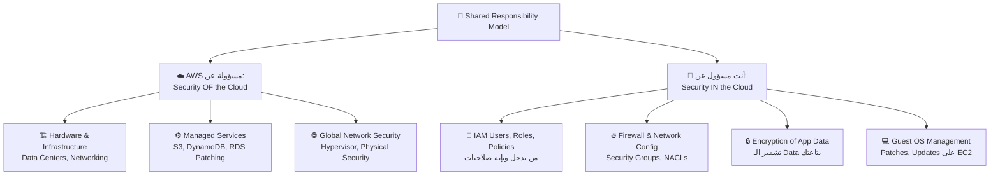
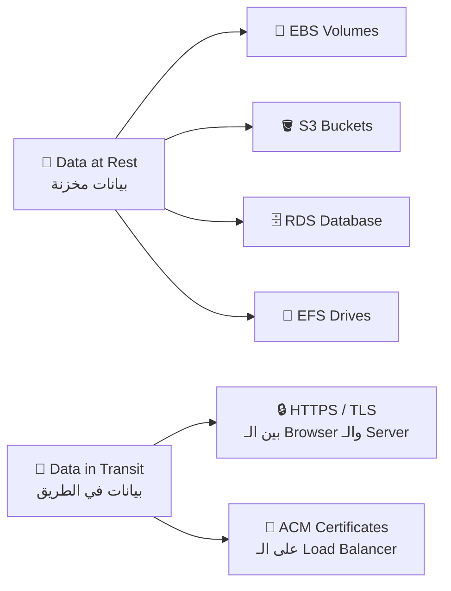
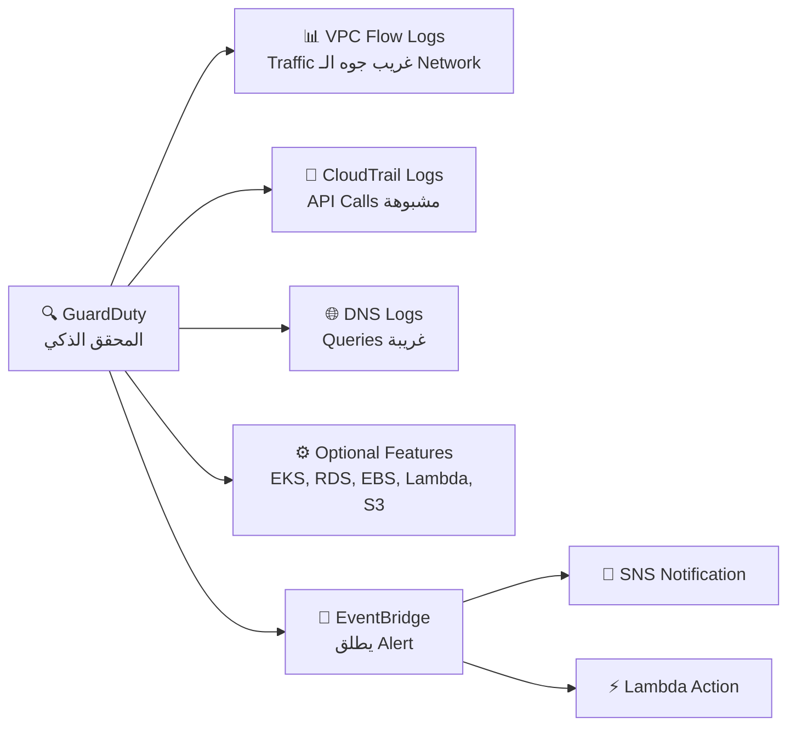
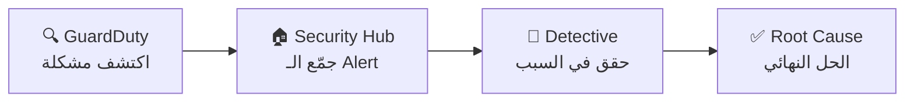

# 🛡️ Security & Compliance
### نوتس امتحان AWS Certified Cloud Practitioner (CLF-C02)

---

## 🏚️ قبل الكلام ده — المشكلة الأصلية

تخيّل شركة بتشغّل موقعها على الـ AWS وفجأة — الموقع وقع تماماً. بعد التحقيق اتضح إن هاكرز بعتوا ملايين الـ Requests في وقت واحد (DDoS Attack)، وفي نفس الوقت في حد تسلّل للـ Database وسرق بيانات العملاء (PII Data)، وفي موظف داخلي عمل API Calls مشبوهة. السؤال: مين مسؤول عن كل ده؟ AWS ولا الشركة؟ وإيه الأدوات اللي هتحمي من كل نوع هجوم؟ — الـ Section ده هيجاوب على كل ده.

---

# 📖 الجزء الأول: الـ Shared Responsibility Model

## ☁️ الفكرة الأساسية

الـ Shared Responsibility Model ده زي **عقد إيجار شقة**: الـ Building Owner مسؤول عن العمارة نفسها (الأساس، السلالم، الكهرباء الرئيسية)، وأنت كمستأجر مسؤول عن اللي جوه شقتك (الأثاث، قفل الباب، نظافة الأوضة). AWS نفس الكلام.

---

### أمثلة عملية في الامتحان — RDS مقابل S3

**مثال الـ RDS:**

| مسؤولية | المسؤول |
|---|---|
| تشغيل الـ EC2 Instance الـ Database شغال عليه | **AWS** |
| عمل Automated OS Patching | **AWS** |
| ضمان عمل الـ Disk والـ Instance | **AWS** |
| تشفير الـ Database (Enable/Disable) | **أنت** |
| الـ Security Group — مين يوصل للـ DB | **أنت** |
| إنشاء الـ Database Users والصلاحيات | **أنت** |
| تحديد إذا الـ Database Public ولا Private | **أنت** |

**مثال الـ S3:**

| مسؤولية | المسؤول |
|---|---|
| ضمان إن الـ Storage مش بينتهي | **AWS** |
| الفصل بين بيانات العملاء المختلفين | **AWS** |
| منع موظفي AWS من الوصول لبياناتك | **AWS** |
| Bucket Policy — مين يوصل | **أنت** |
| تفعيل الـ Encryption | **أنت** |
| إعداد الـ IAM Roles | **أنت** |

> [!important]+ الـ Shared Controls (المسؤولية المشتركة)
> في حاجات مسؤوليتها مشتركة: **Patch Management** (AWS بتعمل Patch للـ Infrastructure، أنت بتعمل Patch للـ OS بتاعك)، **Configuration Management**، وـ **Awareness & Training**.

> 🔑 **Keyword في الامتحان:** لو شفت "who is responsible for X" — افهم هل X جوه الـ Cloud (أنت) ولا الـ Cloud نفسه (AWS)

---

# 📖 الجزء التاني: حماية الـ Network والـ DDoS

## 🌊 إيه هو الـ DDoS Attack؟

تخيّل عندك محل صغير وفيه باب واحد. فجأة ألف شخص وقفوا قدام الباب وبيدخلوا ويخرجوا بسرعة — الزباين الحقيقيين مش قادرين يدخلوا خالص. ده بالظبط الـ DDoS (Distributed Denial of Service): بتبعت طلبات مليارية من أجهزة كتير (Bots) عشان تغرق الـ Server وتوقفه عن الخدمة.

---

## 🛡️ الـ AWS Shield — حماية DDoS

الـ Shield ده زي **سكيورتي الجيش** — في مستويين:

**AWS Shield Standard (المجاني):**
- **مجاني لكل عملاء AWS** أوتوماتيك من غير أي إعداد
- بيحمي من الهجمات على **Layer 3 (Network) و Layer 4 (Transport)**
- مثال: SYN Floods, UDP Floods, Reflection Attacks

**AWS Shield Advanced (المدفوع):**
- بيكلّف **$3,000 في الشهر لكل Organization**
- بيحمي على مستوى أعلى: EC2, ELB, CloudFront, Global Accelerator, Route 53
- **24/7 وصول لفريق AWS DDoS Response (DRP)**
- **بيحميك من رسوم إضافية** لو حصل DDoS وزاد الـ Usage فجأة

> 🔑 **Keyword في الامتحان:**
> - "Free DDoS protection" → **Shield Standard**
> - "24/7 DDoS response team" أو "$3,000" → **Shield Advanced**

---

## 🔥 الـ AWS WAF — Web Application Firewall

الـ WAF ده زي **بواب ذكي عند باب الموقع** — مش بس يوقف الناس، لكن بيقرأ طلباتهم ويقرر مين يعدّي ومين لأ.

**بيشتغل على Layer 7 (Application Layer / HTTP)**، يعني بيفهم الطلبات نفسها مش بس الـ Packets.

**بيتنشر على:**
- Application Load Balancer (ALB)
- API Gateway
- CloudFront

**بيحمي من:**
- **SQL Injection:** حد بيكتب SQL في الـ Form عشان يسرق البيانات
- **Cross-Site Scripting (XSS):** حقن JavaScript خبيث في الصفحة
- **IP Blocking:** حجب IPs أو بلدان بأكملها (Geo-Match)
- **Rate-Based Rules:** لو نفس الـ IP بعت أكتر من عدد معين من الطلبات — احجبه

> 🔑 **Keyword في الامتحان:** لو شفت "Layer 7" أو "SQL Injection" أو "XSS" أو "Block specific IPs" — الإجابة **WAF**

---

## 🔒 الـ AWS Network Firewall

ده أشمل من الـ WAF — بيحمي الـ **VPC بالكامل** من Layer 3 لـ Layer 7. بيتحكم في كل حاجة داخلة وخارجة من الـ VPC.

**فرق مهم:**

| | **WAF** | **Network Firewall** |
|---|---|---|
| **المستوى** | Layer 7 (HTTP) | Layer 3 → Layer 7 (كل شيء) |
| **بيحمي إيه؟** | Web Applications | الـ VPC بالكامل |
| **بيتنشر على** | ALB, API GW, CloudFront | الـ VPC نفسه |
| **الكلمة المفتاحية** | "Web exploits, SQL Injection" | "Protect entire VPC" |

---

## 🏛️ الـ AWS Firewall Manager

تخيّل شركة عندها **50 AWS Account** — كيف تضمن إن كل Account عنده نفس قواعد الأمان؟ الـ Firewall Manager بيحل ده.

بيديرك تطبّق Security Policies واحدة على **كل الـ Accounts في الـ AWS Organization** في وقت واحد — Security Groups, WAF Rules, Shield Advanced, Network Firewall — كلها بتتطبق أوتوماتيك حتى على الـ Accounts الجديدة.

> 🔑 **Keyword في الامتحان:** لو شفت "manage security rules across multiple accounts" أو "AWS Organization security" — الإجابة **Firewall Manager**

---

## ⚔️ مقارنة حاسمة — Shield vs WAF vs Network Firewall vs Firewall Manager

| | **Shield** | **WAF** | **Network Firewall** | **Firewall Manager** |
|---|---|---|---|---|
| **بيحمي من؟** | DDoS Attacks | Web Exploits (SQLi, XSS) | كل أنواع Traffic | إدارة كل الـ Firewalls |
| **الـ Layer** | 3 و 4 | 7 | 3 → 7 | Management Layer |
| **التكلفة** | Standard مجاني | مدفوع | مدفوع | مدفوع |
| **الكلمة المفتاحية** | "DDoS" | "SQL Injection, XSS" | "VPC Protection" | "Multi-account rules" |
| **متى تختاره؟** | دايماً (Standard) | موقع ويب محتاج فلترة | حماية شاملة للـ VPC | عندك Organization كاملة |

---

# 📖 الجزء التالت: التشفير (Encryption)

## ☁️ Data at Rest vs Data in Transit

تخيّل بتبعت جواب بالبريد. الجواب ده ممكن يتكشف في وقتين:
- **وهو قاعد في الدرج** (Data at Rest) — قبل ما تبعته
- **وهو في الطريق** (Data in Transit) — جوه عربية البريد

AWS بتوفر تشفير في الحالتين:

---

## 🔑 الـ AWS KMS (Key Management Service)

الـ KMS ده زي **خزنة المفاتيح المُدارة من AWS**. انت بتقرر مين يستخدم المفتاح وامتى — وAWS بتحتفظ بالمفتاح نفسه آمناً.

**القاعدة الذهبية:** لو شفت كلمة "encryption" في أي Service على AWS — الإجابة بالتأكيد بتتضمن **KMS**.

**الـ Services اللي بتشتغل مع KMS:**

| نوع التشفير | الـ Services |
|---|---|
| **Opt-in (اختياري — أنت بتفعّله)** | EBS, S3 (SSE-KMS), Redshift, RDS, EFS |
| **Automatically Enabled (مفعّل تلقائياً)** | CloudTrail Logs, S3 Glacier, Storage Gateway |

> [!important]+ ملاحظة مهمة عن الـ S3
> الـ S3 دلوقتي بيجي بـ **SSE-S3 (Encryption) مفعّل by default**. لو حبيت تستخدم مفاتيح KMS الخاصة بيك — تفعّل SSE-KMS يدوياً.

---

## 🔐 أنواع الـ KMS Keys الأربعة

| النوع | مين بيعمله؟ | مين بيتحكم فيه؟ | الاستخدام |
|---|---|---|---|
| **Customer Managed Key** | أنت | أنت (Rotation, Enable/Disable) | Full control |
| **AWS Managed Key** | AWS | AWS (نيابة عنك) | aws/s3, aws/ebs |
| **AWS Owned Key** | AWS | AWS (مشترك بين Accounts) | لا تشوفه |
| **CloudHSM Keys** | من Hardware خاص بيك | أنت (على الـ HSM) | أقصى درجات الـ Compliance |

---

## 🖥️ الـ CloudHSM — Hardware Security Module

الـ KMS هو AWS بتدير الـ Software اللي فيه المفاتيح. الـ **CloudHSM** ده مستوى أعلى: AWS بتوفر لك **Hardware مادي متخصص** وأنت بتدير المفاتيح بنفسك بشكل كامل.

تخيّل الفرق:
- **KMS:** زي تأجير خزنة من البنك — البنك عنده نسخة من المفتاح
- **CloudHSM:** زي إنك تشتري خزنتك وتحتفظ بالمفتاح أنت بس

**خاصية مهمة:** الـ CloudHSM بيحقق **FIPS 140-2 Level 3 Compliance** — أعلى معيار أمان للـ Cryptography.

> 🔑 **Keyword في الامتحان:**
> - "AWS manages encryption keys" → **KMS**
> - "You manage your own keys on hardware" أو "FIPS 140-2" → **CloudHSM**

---

## 📜 الـ AWS Certificate Manager (ACM)

الـ ACM بيدير الـ **SSL/TLS Certificates** اللي بتخلي الموقع يشتغل بـ HTTPS. بدلاً من ما تشتري Certificate من شركات خارجية بفلوس كتير وتجدده كل سنة يدوياً — الـ ACM بيعمل ده **مجاناً** وبيجدده **أوتوماتيك**.

بيشتغل مع: **Elastic Load Balancers, CloudFront, API Gateway**

> 🔑 **Keyword في الامتحان:** لو شفت "HTTPS" أو "SSL/TLS Certificate" أو "in-flight encryption" — الإجابة **ACM**

---

## 🤫 الـ AWS Secrets Manager

الـ Secrets Manager ده زي **برنامج حفظ الـ Passwords** بس للـ Applications. بدلاً من ما تكتب الـ Database Password في الـ Code (كارثة أمنية!) — بتحطها في الـ Secrets Manager.

**الميزة الكبيرة:** بيقدر **يغير الـ Password أوتوماتيك** (Rotation) كل X يوم باستخدام Lambda — ومن غير ما تحتاج تغير الـ Code.

**أكتر استخدام:** مع **RDS, MySQL, PostgreSQL, Aurora**. الـ Secrets بتتشفر بـ **KMS**.

> 🔑 **Keyword في الامتحان:** لو شفت "store database credentials" أو "automatic rotation of secrets" — الإجابة **Secrets Manager**

---

## 📋 الـ AWS Artifact

الـ Artifact مش Service حقيقية — ده **Portal** لتحميل وثائق الـ Compliance والاتفاقيات القانونية.

بيتضمن نوعين:
- **Artifact Reports:** وثائق من Auditors خارجيين — ISO Certifications, PCI, SOC Reports
- **Artifact Agreements:** اتفاقيات قانونية زي BAA (للـ HIPAA) و GDPR

> 🔑 **Keyword في الامتحان:** لو شفت "compliance reports" أو "PCI" أو "ISO certification" أو "download audit reports" — الإجابة **AWS Artifact**

---

# 📖 الجزء الرابع: الكشف والتحقيق في التهديدات

## 🕵️ الـ Amazon GuardDuty — الكاشف الذكي

الـ GuardDuty ده زي **محقق خبير بيراقب كل حاجة** في الـ Account بتاعك ويكشف الأنشطة المشبوهة باستخدام الـ Machine Learning.

**بيتفعّل بكليكة واحدة — 30 يوم Trial مجاني — مش محتاج تثبت أي Software.**

**بيحلل الـ Logs دي:**

**مميزة خاصة:** عنده **CryptoCurrency Finding** — بيكشف لو في EC2 Instance اتحولت لـ Crypto Mining بدون علمك.

> 🔑 **Keyword في الامتحان:** لو شفت "threat detection" أو "malicious behavior" أو "ML-based security" أو "VPC Flow Logs + CloudTrail analysis" — الإجابة **GuardDuty**

---

## 🔬 الـ Amazon Inspector — فاحص الثغرات

الـ Inspector ده زي **دكتور بيعمل Check-up دوري** لـ Infrastructure بتاعك بحثاً عن ثغرات أمنية.

**بيشتغل على 3 حاجات بس — لازم تحفظهم:**

| المكان | اللي بيفحصه |
|---|---|
| **EC2 Instances** | ثغرات الـ OS والـ Software (CVE Database) + إمكانية الوصول الشبكي |
| **Container Images (ECR)** | فحص الـ Images لما تتبعت للـ Registry |
| **Lambda Functions** | ثغرات في الكود والـ Dependencies |

**مهم:** الفحص مستمر (Continuous) — مش مرة واحدة. وبيعمل **Risk Score** لكل ثغرة عشان تعرف تبدأ بالأهم.

> 🔑 **Keyword في الامتحان:** لو شفت "software vulnerabilities" أو "CVE" أو "EC2/ECR/Lambda security assessment" — الإجابة **Inspector**

---

## ⚙️ الـ AWS Config — سجل التغييرات

الـ Config ده زي **كاميرا مراقبة بتسجل كل تغيير في الـ Resources** بتاعتك على مر الوقت. مش بيمنع — بيسجل ويراقب.

**أسئلة بيجاوب عليها:**
- "هل في Security Group فاتح SSH للعالم كله؟"
- "هل الـ S3 Buckets عليها Public Access؟"
- "الـ Load Balancer Configuration اتغير إزاي على مر الوقت؟"

**ملاحظة مهمة:** الـ Config هو **Per-Region Service** — لكن تقدر تجمّع البيانات من كل الـ Regions والـ Accounts.

> 🔑 **Keyword في الامتحان:** لو شفت "track configuration changes over time" أو "compliance history" أو "is SSH port open?" — الإجابة **AWS Config**

---

## 🔎 الـ Amazon Macie — صياد البيانات الحساسة

الـ Macie ده زي **كلب بوليسي مُدرّب على اكتشاف البيانات الحساسة**. بيفتش في الـ S3 Buckets بتاعتك ويكشف لو في بيانات حساسة (PII = Personally Identifiable Information) زي أرقام بطاقات ائتمان، عناوين، أرقام تأمين اجتماعي.

**بيشتغل إزاي:** Macie ← يحلل ← S3 Buckets ← يبعت Alerts لـ EventBridge.

> 🔑 **Keyword في الامتحان:** لو شفت "PII data" أو "sensitive data in S3" أو "data privacy" — الإجابة **Amazon Macie**

---

## 🏠 الـ AWS Security Hub — مركز التحكم الأمني

الـ Security Hub ده زي **غرفة العمليات الأمنية** — بيجمع كل الـ Findings من كل الـ Security Services في مكان واحد على Dashboard.

**بيجمع من:** GuardDuty + Inspector + Macie + Config + IAM Access Analyzer + Firewall Manager + Systems Manager + AWS Health + Partner Tools

**شرط:** لازم تفعّل **AWS Config** الأول.

> 🔑 **Keyword في الامتحان:** لو شفت "centralized security dashboard" أو "aggregate findings from multiple services" — الإجابة **Security Hub**

---

## 🔬 الـ Amazon Detective — المحقق الجنائي

لما الـ GuardDuty يلاقي مشكلة — بتعرف في حاجة غلط. لكن **ليه** حصلت؟ ومين اللي وراها؟ ده السؤال اللي الـ **Detective** بيجاوب عليه.

الـ Detective بيجمع الـ Data من VPC Flow Logs, CloudTrail, GuardDuty ويعمل **Visualizations** وـ **Graphs** بالـ ML عشان تقدر تعرف الـ Root Cause بسرعة.

> 🔑 **Keyword في الامتحان:** لو شفت "root cause analysis" أو "investigate security issues" — الإجابة **Amazon Detective**

---

# 📖 الجزء الخامس: حاجات تانية مهمة

## 🧪 الـ Penetration Testing — اختبار الاختراق

تقدر تعمل Penetration Testing على الـ AWS Infrastructure بتاعتك **من غير إذن مسبق** على **8 Services** محددة: EC2, RDS, CloudFront, Aurora, API Gateway, Lambda, Lightsail, Elastic Beanstalk.

**لكن في حاجات ممنوعة تعملها:**
- DDoS Attacks (حقيقية أو مُحاكاة)
- DNS Zone Walking
- Port Flooding
- Protocol Flooding
- Request Flooding

> [!important]+ قاعدة مهمة
> لو حبيت تعمل Simulated Events تانية غير اللي ذكرنا — لازم تتواصل مع AWS على **aws-security-simulatedevent@amazon.com**

---

## 🔎 الـ IAM Access Analyzer

الـ IAM Access Analyzer بيسألك سؤال مهم: **مين برّه الـ Account بيوصل للـ Resources بتاعتك؟**

بيفحص: S3 Buckets, IAM Roles, KMS Keys, Lambda Functions, SQS Queues, Secrets Manager Secrets.

لو لاقى Resource متاح لـ External Entity — بيعمل **Finding** ويعلمك.

**Zone of Trust:** أنت بتحدده — ممكن يكون الـ Account ده بس، أو كل الـ AWS Organization.

> 🔑 **Keyword في الامتحان:** لو شفت "resources shared externally" أو "external access to S3/Roles" — الإجابة **IAM Access Analyzer**

---

## 🚨 الـ AWS Abuse

لو لاحظت إن AWS Resources (مش بتاعتك — بتاعة حد تاني) بتستخدم في حاجات ضارة زي: Spam، Port Scanning، DDoS، Malware، محتوى غير قانوني — تقدر تبلّغ AWS عن طريق:
- **AWS Abuse Form**
- **abuse@amazonaws.com**

---

## 👑 الـ Root User Privileges — الصلاحيات الحصرية للـ Root

في حاجات **مش أي IAM User يقدر يعملها — Root User بس**. دي الأكتر ظهوراً في الامتحان:

| العملية | مين يعملها؟ |
|---|---|
| تغيير اسم الـ Account أو Email أو Password | **Root فقط** |
| إغلاق الـ AWS Account | **Root فقط** |
| تغيير أو إلغاء الـ Support Plan | **Root فقط** |
| التسجيل كـ Seller في Reserved Instance Marketplace | **Root فقط** |
| تفعيل MFA Delete على الـ S3 Bucket | **Root فقط** |
| الاشتراك في AWS GovCloud | **Root فقط** |
| استعادة صلاحيات IAM User | **Root فقط** |

---

## ⚔️ جدول المقارنة الكبير — كل الـ Security Services

| الـ Service | الوظيفة | الكلمة المفتاحية |
|---|---|---|
| **Shield Standard** | حماية DDoS مجانية (L3/L4) | "Free DDoS" |
| **Shield Advanced** | حماية DDoS متقدمة + DRP Team | "$3,000/month, 24/7 team" |
| **WAF** | فلتر Web Requests (L7) | "SQL Injection, XSS, Layer 7" |
| **Network Firewall** | حماية الـ VPC كاملة (L3-L7) | "Protect entire VPC" |
| **Firewall Manager** | إدارة Firewall Rules على Organization | "Multi-account security rules" |
| **KMS** | إدارة مفاتيح التشفير (Software) | "Encryption keys, AWS manages" |
| **CloudHSM** | Hardware Encryption (أنت تدير المفاتيح) | "FIPS 140-2, your own keys" |
| **ACM** | شهادات SSL/TLS | "HTTPS, TLS certificate" |
| **Secrets Manager** | تخزين وتدوير الـ Passwords | "Database credentials, rotation" |
| **Artifact** | تحميل وثائق الـ Compliance | "PCI, ISO, SOC reports" |
| **GuardDuty** | اكتشاف التهديدات بالـ ML | "Threat detection, malicious behavior" |
| **Inspector** | فحص ثغرات EC2/ECR/Lambda | "CVE, software vulnerabilities" |
| **Config** | تتبع تغييرات الـ Configuration | "Track changes over time, compliance" |
| **Macie** | اكتشاف PII في S3 | "PII, sensitive data, S3" |
| **Security Hub** | مركز تجميع كل الـ Findings | "Centralized security, aggregate" |
| **Detective** | تحقيق في الـ Root Cause | "Root cause, investigate" |
| **IAM Access Analyzer** | كشف الـ Resources المشتركة خارجياً | "External access, shared resources" |

---

## 🎯 فخاخ الـ Exam — اللي بيوقع فيه الناس

**الـ Trap 1 — Shield Standard مدفوع:**
"عايز تفعّل الحماية من DDoS على الـ Account — تشتري Shield Standard؟"
— الإجابة الصح: **لأ! Shield Standard مجاني ومفعّل أوتوماتيك لكل العملاء.**

**الـ Trap 2 — WAF بيحمي من DDoS بس:**
"الـ WAF بيحمي من DDoS Attacks؟"
— الإجابة الصح: **لأ!** الـ WAF بيحمي من Web Exploits (SQL Injection, XSS). الـ DDoS ده Shield.

**الـ Trap 3 — CloudHSM = AWS بتدير المفاتيح:**
"عايز AWS تدير مفاتيح التشفير — تستخدم CloudHSM؟"
— الإجابة الصح: **لأ!** CloudHSM = أنت بتدير المفاتيح. AWS تدير المفاتيح → **KMS**.

**الـ Trap 4 — Inspector على كل الـ Resources:**
"الـ Inspector بيفحص الـ RDS Databases؟"
— الإجابة الصح: **لأ!** Inspector بيشتغل على **EC2, Container Images (ECR), Lambda فقط**.

**الـ Trap 5 — Macie بيفحص كل الـ Storage:**
"الـ Macie بيكشف PII في الـ EBS Volumes؟"
— الإجابة الصح: **لأ!** Macie بيشتغل على **S3 فقط**.

**الـ Trap 6 — GuardDuty vs Inspector:**
"عايز تكشف Malware على الـ EC2 — GuardDuty ولا Inspector؟"
— الإجابة الصح: **GuardDuty** للـ Threat Detection (سلوك مشبوه). **Inspector** لفحص ثغرات الـ Software.

**الـ Trap 7 — Config يمنع التغييرات:**
"الـ Config بيمنع الـ Resources من الاتغيير بشكل مخالف للـ Policy؟"
— الإجابة الصح: **لأ!** Config بيسجّل ويراقب فقط — مش بيمنع. عايز تمنع؟ استخدم **SCP في AWS Organizations**.

**الـ Trap 8 — الـ Penetration Testing محتاج إذن:**
"لازم تستأذن AWS قبل تعمل Pen Test على EC2؟"
— الإجابة الصح: **لأ!** الـ 8 Services المحددة مش محتاجة إذن. الممنوع هو الـ DDoS Simulation.

---

## 📊 الـ Cheat Sheet النهائي

| السؤال | الإجابة الفورية |
|---|---|
| مين مسؤول عن الـ OS Patching على EC2؟ | **أنت (Customer)** |
| مين مسؤول عن الـ OS Patching على RDS؟ | **AWS** |
| حماية DDoS مجانية؟ | **Shield Standard** |
| حماية DDoS مع 24/7 Response Team؟ | **Shield Advanced ($3,000/شهر)** |
| حماية من SQL Injection؟ | **WAF** |
| WAF بيشتغل على أنهي Layer؟ | **Layer 7 (HTTP)** |
| بتشفر الـ Data وAWS بتدير المفاتيح؟ | **KMS** |
| أنت بتدير المفاتيح على Hardware؟ | **CloudHSM** |
| FIPS 140-2 Compliance؟ | **CloudHSM** |
| شهادات HTTPS مجانية ومتجددة أوتوماتيك؟ | **ACM** |
| تخزين Database Passwords مع Rotation؟ | **Secrets Manager** |
| تحميل وثائق PCI/ISO/SOC؟ | **AWS Artifact** |
| اكتشاف تهديدات بالـ ML (VPC + CloudTrail + DNS)؟ | **GuardDuty** |
| فحص ثغرات EC2/ECR/Lambda؟ | **Amazon Inspector** |
| تتبع التغييرات على الـ Resources؟ | **AWS Config** |
| اكتشاف PII في S3؟ | **Amazon Macie** |
| مركز تجميع كل الـ Security Findings؟ | **Security Hub** |
| تحقيق في الـ Root Cause؟ | **Amazon Detective** |
| كشف Resources مشتركة مع خارج الـ Account؟ | **IAM Access Analyzer** |
| إدارة Security Rules على كل الـ Organization؟ | **Firewall Manager** |
| حماية الـ VPC كاملة Layer 3-7؟ | **Network Firewall** |
| إغلاق الـ AWS Account — مين يعملها؟ | **Root User فقط** |
| تغيير الـ Support Plan — مين يعملها؟ | **Root User فقط** |
| الابلاغ عن AWS Resources بتُستخدم بشكل ضار؟ | **AWS Abuse / abuse@amazonaws.com** |
| الـ Config هو Per-Region ولا Global؟ | **Per-Region (بس يتجمع)** |
| الـ Inspector بيشتغل على RDS؟ | **لأ — EC2/ECR/Lambda فقط** |
| Macie بيشتغل على EBS؟ | **لأ — S3 فقط** |
