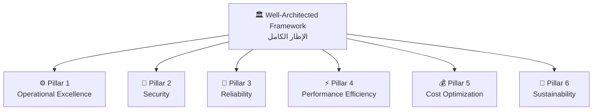
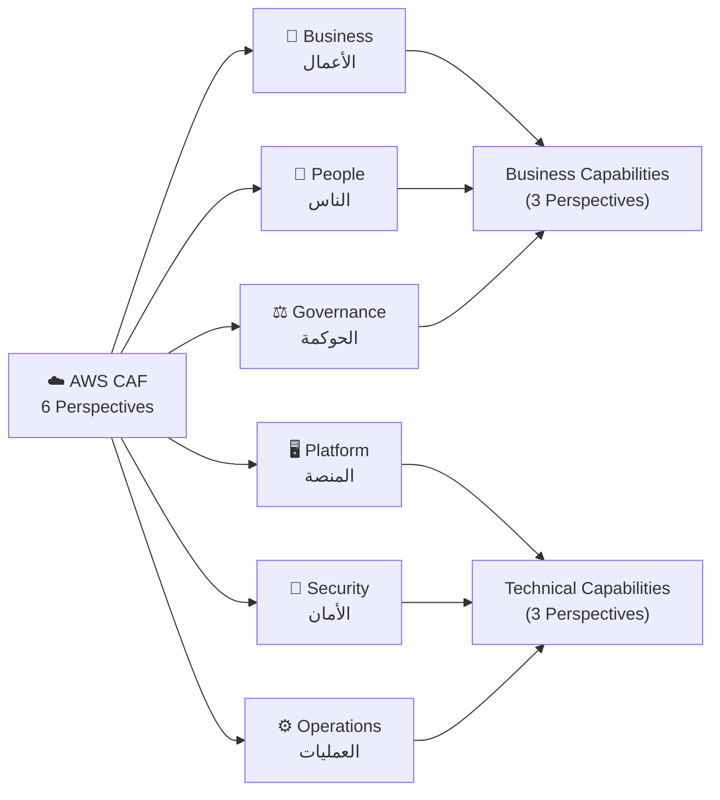
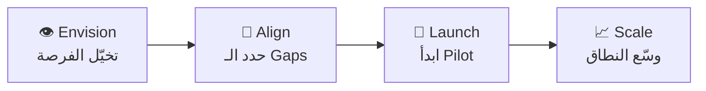
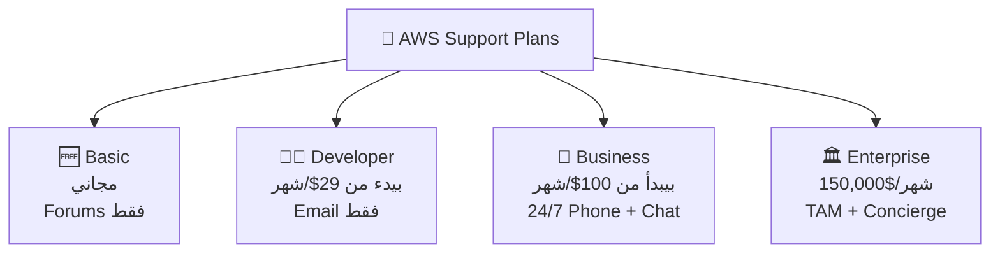

# 🏛️ الـ Well-Architected Framework & AWS CAF
### نوتس امتحان AWS Certified Cloud Practitioner (CLF-C02)

---

## 🏚️ قبل الكلام ده — المشكلة الأصلية

تخيّل إنك بتبني تطبيق على الـ Cloud وبعد 6 شهور الموضوع بقى فوضى كاملة. الـ Costs طلعت من السيطرة، الـ System بيوقع كل ما في ناس كتير تدخل، والأمان مفيش له ضابط. إيه اللي حصل؟ مفيش إطار عمل واضح اتبعته من الأول. AWS شافت الموضوع ده بيتكرر مع آلاف الشركات، فاتفتكرت: "ليه منعملش دليل شامل يوجّه الناس؟" — من هنا اتولد الـ **Well-Architected Framework**.

---

# 📖 الجزء الأول: الـ Well-Architected Framework

## ☁️ إيه ده؟

الـ Well-Architected Framework ده زي **دليل المعماري المحترف** — تخيّل إنك هتبني عمارة، المعماري بيديك قائمة بكل الحاجات اللازم تراعيها: الأساس، الأمان، التهوية، التكلفة. الـ Framework ده نفس الفكرة لكن للـ Cloud. AWS جمعت خبرة آلاف الـ Projects في 6 مبادئ أساسية (Pillars) بتضمن إنك تبني صح.

---

## 🔬 المبادئ العامة للـ Design

قبل الـ 6 Pillars، في مبادئ عامة لازم تعرفها:

**بدّل طريقة تفكيرك في الـ Capacity:** متحزرش قديش هتحتاج. الـ Cloud بتديك الـ Auto Scaling — ابدأ صغير وكبّر لما تحتاج.

**اتعامل مع الـ Servers كأنها مؤقتة (Disposable):** الـ Server مش لازم يكون "جهاز غالي" بتحافظ عليه زي الموبايل. لو عطل — اشيله واعمل واحد تاني. الـ Automation بتخلي ده سهل.

**Loose Coupling — مش كل حاجة في كل حاجة:** تخيّل لو في مطعم، الكاشير هو نفسه الطباخ هو نفسه المحاسب — لو واحد اتعطل، كل حاجة وقفت. الصح إنك تفصل الأجزاء عن بعض. لو جزء واحد اتكسر — الباقي يشتغل.

**Services مش Servers:** متستخدمش EC2 لكل حاجة! في RDS للـ Database، Lambda للـ Code، S3 للملفات. الـ Managed Services بتوفر عليك وجع التشغيل.

> [!important]+ القاعدة الذهبية
> الـ 6 Pillars مش Trade-offs — مش هتتفادى الـ Security عشان توفر في الـ Cost. هما **Synergy** — بيكملوا بعض مش بيتعارضوا.

---

## 🏛️ الـ 6 Pillars — الأعمدة الستة

---

### ⚙️ Pillar 1 — Operational Excellence (التميز التشغيلي)

**المشكلة:** شركة بتشتغل يدوي على كل حاجة — كل Deploy بيعمله الـ Developer يدوي، كل مشكلة بتتعالج بعد ما تحصل، ومفيش documentation. النتيجة؟ أخطاء بشرية كتير وضياع وقت.

**الحل:** الـ Operational Excellence بيقول "اعمل كل حاجة كـ Code، غيّر بخطوات صغيرة، وتعلم من الأخطاء."

**المبادئ اللي بتيجي في الامتحان:**

- **Infrastructure as Code:** استخدم **CloudFormation** عشان تعمل الـ Infrastructure كـ Code — مش بإيدك
- **Small, Reversible Changes:** خلي كل تغيير صغير وقابل للرجوع عنه — لو حاجة غلطت، ترجع بسرعة
- **Anticipate Failure:** افتكر إن حاجة هتتكسر وحضّر ليها قبل ما تحصل
- **Learn from Failures:** كل مشكلة = درس تعلّمه للفريق

**الـ Services المرتبطة بالـ Pillar ده:**

| المرحلة | الـ Service |
|---|---|
| **Prepare (التحضير)** | CloudFormation, AWS Config |
| **Operate (التشغيل)** | CloudTrail, CloudWatch, X-Ray |
| **Evolve (التطوير)** | CodeCommit, CodeBuild, CodeDeploy, CodePipeline |

> 🔑 **Keyword في الامتحان:** لو شفت "Operations as Code" أو "Automate deployments" — الإجابة **Operational Excellence Pillar**

---

### 🔐 Pillar 2 — Security (الأمان)

**المشكلة:** شركة عندها Application على الـ Cloud، كل الـ Developers عندهم نفس الـ Password للـ Admin، مفيش Logs لمين عمل إيه، والـ Data مش متشفرة. يوم من الأيام — **Data Breach** وفضيحة.

**الحل:** الـ Security Pillar بيقول "الأمان في كل طبقة، مش بس عند الباب."

تخيّل بنك محترم: في حارس عند الباب، كاميرات جوه، الخزنة محتاجة مفتاحين، والموظفين عندهم صلاحيات محدودة بس لما يحتاجوا. ده بالظبط الـ Security Pillar.

**المبادئ:**
- **Strong Identity Foundation:** الـ **IAM** — أديله أقل صلاحيات يحتاجها بس (Least Privilege)
- **Enable Traceability:** الـ **CloudTrail** — سجّل كل حاجة بتحصل
- **Security at All Layers:** الأمان مش بس عند الباب — في الـ VPC، الـ Subnet، الـ EC2، الـ App نفسها
- **Protect Data in Transit and at Rest:** الـ **KMS** للتشفير، HTTPS للنقل

**الـ Services حسب الوظيفة:**

| الوظيفة | الـ Services |
|---|---|
| **Identity & Access** | IAM, AWS STS, MFA, AWS Organizations |
| **Detective Controls** | AWS Config, CloudTrail, CloudWatch |
| **Infrastructure Protection** | CloudFront, VPC, Shield, WAF, Inspector |
| **Data Protection** | KMS, S3, EBS, RDS |
| **Incident Response** | CloudWatch Events |

> 🔑 **Keyword في الامتحان:** لو شفت "Least Privilege" أو "Protect data at rest" — الإجابة **Security Pillar**

---

### 💪 Pillar 3 — Reliability (الموثوقية)

**المشكلة:** الـ Application بتاعتك شغال على Server واحد. يوم الـ Black Friday — السيرفر انهار من الـ Load، والموقع وقع. الـ Customers زهقوا ومشوا لل competitor.

**الحل:** الـ Reliability بيقول "افتكر إن حاجة هتوقع — وحضّر للموضوع."

تخيّل مستشفى محترم: في generators للكهرباء لو النور اتقطع، في أطباء احتياطيين، والـ Data متسجلة في أكتر من مكان. ده الـ Reliability.

**المبادئ:**
- **Test Recovery Procedures:** اعمل Simulation للمشاكل قبل ما تحصل فعلاً
- **Automatically Recover from Failure:** الـ Auto Scaling بيعمل ده أوتوماتيك
- **Scale Horizontally:** بدل ما تزود قوة Server واحد (Vertical)، زود عدد الـ Servers (Horizontal)
- **Stop Guessing Capacity:** استخدم الـ Auto Scaling عشان متزودش أو تنقصش

**الـ Services المرتبطة:**

| الوظيفة | الـ Services |
|---|---|
| **Foundations** | IAM, VPC, Service Quotas, Trusted Advisor |
| **Change Management** | Auto Scaling, CloudWatch, CloudTrail, Config |
| **Failure Management** | Backups, CloudFormation, S3, S3 Glacier, Route 53 |

> 🔑 **Keyword في الامتحان:** لو شفت "High Availability" أو "Fault Tolerance" أو "Auto Scaling" — الإجابة **Reliability Pillar**

---

### ⚡ Pillar 4 — Performance Efficiency (كفاءة الأداء)

**المشكلة:** شركة بتستخدم نفس الـ Technology القديمة منذ 5 سنين، بتشغل Database على EC2 يدوي، وبترفض تجرب حاجات جديدة. النتيجة؟ التطبيق بطيء والمنافسين جاهم بأحسن منك.

**الحل:** الـ Performance Efficiency بيقول "استخدم أحسن أداة لكل مهمة، وجرّب دايماً."

زي ورشة نجارة محترفة: مش بتستخدم مطرقة عشان تقص خشب — عندك منشار للقص، ومثقاب للحفر، وكل أداة في مكانها. كده كل Service على AWS ليها وظيفة واضحة.

**المبادئ:**
- **Democratize Advanced Technologies:** الـ Machine Learning والـ AI بقوا Services جاهزة — ماشيش تبنيها من الصفر
- **Go Global in Minutes:** Deploy في أي Region بكليكات
- **Use Serverless:** متشغلش Servers — استخدم Lambda وخليها تتعامل مع الـ Scaling
- **Experiment More Often:** جرب Configurations مختلفة بسهولة

**الـ Services المرتبطة:**

| الوظيفة | الـ Services |
|---|---|
| **Selection** | Auto Scaling, Lambda |
| **Review** | AWS CloudFormation |
| **Monitoring** | CloudWatch |
| **Tradeoffs** | ElastiCache, CloudFront, RDS, Snowball |

> 🔑 **Keyword في الامتحان:** لو شفت "Serverless" أو "Go global in minutes" — الإجابة **Performance Efficiency Pillar**

---

### 💰 Pillar 5 — Cost Optimization (تحسين التكلفة)

**المشكلة:** شركة بتدفع لـ AWS كل شهر وملهاش أي فكرة على إيه بتدفع. في Servers شغالة 24/7 مش بيستخدمها حد، وفي Services مفتوحة من زمان ومنسية. في آخر الشهر — الفاتورة كارثة.

**الحل:** الـ Cost Optimization بيقول "ادفع بس على اللي بتستخدمه، وراقب كل قرش."

زي فاتورة الكهرباء: لو عارف أي جهاز بياكل أكتر، تقدر تقلل — تطفي الأوضة اللي مش شاغلها، وتستخدم أجهزة موفرة للطاقة. نفس الفكرة بالظبط.

**المبادئ:**
- **Adopt Consumption Mode:** ادفع بس على اللي بتستخدمه (Pay-as-you-go)
- **Measure Overall Efficiency:** CloudWatch بيساعدك تعرف الكفاءة
- **Use Tags:** وسّم كل Resource بالـ Project اللي بيتبعه عشان تعرف مين بياكل أكتر
- **Use Managed Services:** أرخص من ما تشغّل حاجات بنفسك

**الـ Services المرتبطة:**

| الوظيفة | الـ Services |
|---|---|
| **Expenditure Awareness** | AWS Budgets, Cost Explorer, Cost & Usage Report |
| **Cost-Effective Resources** | Spot Instances, Reserved Instances, S3 Glacier |
| **Supply & Demand Matching** | Auto Scaling, Lambda |
| **Optimizing Over Time** | Trusted Advisor, Cost & Usage Report |

> 🔑 **Keyword في الامتحان:** لو شفت "Pay only for what you use" أو "Reduce costs" أو "Tags for cost allocation" — الإجابة **Cost Optimization Pillar**

---

### 🌱 Pillar 6 — Sustainability (الاستدامة)

**المشكلة:** الـ Data Centers بتستهلك كهرباء هائلة وبتأثر على البيئة. شركة بتشغل Servers بطاقة 10% بس (الباقي بايظ) — ده هدر في الطاقة وزيادة في الـ Carbon Footprint.

**الحل:** الـ Sustainability Pillar بيقول "استخدم الموارد بكفاءة وقلل أثرك على البيئة."

زي موضوع ترشيد المياه في مصر: متسيبش الصنبور يجري لو مش بتستخدمه. نفس الموضوع — متشغّلش Servers مش محتاجاها.

**المبادئ:**
- **Understand Your Impact:** قيس أثرك البيئي
- **Maximize Utilization:** الـ Right Sizing — استخدم الـ Resources بشكل كامل مش ناقص
- **Use Managed Services:** بتشارك Infrastructure مع ناس تانيين = أقل هدر
- **Adopt New Efficient Hardware:** استخدم الـ Graviton Processors من AWS — أكفأ وأرخص وأصدق للبيئة

**الـ Services المرتبطة:**
Auto Scaling, Lambda, Fargate, EC2 Graviton, Spot Instances, EFS-IA, S3 Glacier, S3 Intelligent Tiering, CloudFront

> 🔑 **Keyword في الامتحان:** لو شفت "Environmental impact" أو "Carbon footprint" أو "Minimize idle resources" — الإجابة **Sustainability Pillar**

---

## ⚔️ جدول المقارنة الحاسمة — الـ 6 Pillars

| | الـ Pillar | الكلمة المفتاحية | السؤال اللي بيجيب |
|---|---|---|---|
| ⚙️ | **Operational Excellence** | Operations as Code | إزاي أشغّل بكفاءة وأتعلم من الأخطاء؟ |
| 🔐 | **Security** | Least Privilege, Traceability | إزاي أحمي الـ Data والـ Systems؟ |
| 💪 | **Reliability** | High Availability, Fault Tolerance | إزاي أخلي النظام ما يوقعش؟ |
| ⚡ | **Performance Efficiency** | Serverless, Go Global | إزاي أستخدم الـ Resources بأكفأ طريقة؟ |
| 💰 | **Cost Optimization** | Pay as you go, Tags | إزاي أقلل التكاليف؟ |
| 🌱 | **Sustainability** | Carbon footprint, Minimize waste | إزاي أقلل التأثير على البيئة؟ |

---

## 🛠️ الـ AWS Well-Architected Tool

ده **أداة مجانية** على الـ AWS Console بتساعدك تراجع الـ Architecture بتاعتك على الـ 6 Pillars.

إزاي بتشتغل؟ بتدخل على الـ Console، بتختار الـ Workload بتاعك، وبيسألك أسئلة عن كل Pillar. في الآخر بيديلك تقرير فيه الـ Gaps والتوصيات.

> 🔑 **Keyword في الامتحان:** لو شفت "Review architecture against best practices" — الإجابة **AWS Well-Architected Tool**

---

# 📖 الجزء التاني: الـ AWS Cloud Adoption Framework (CAF)

## 🏚️ قبل الـ CAF — المشكلة

تخيّل شركة كبيرة قررت تنقل كل حاجاتها على الـ Cloud. الـ IT Team متحمسين وبدأوا ينقلوا الـ Servers، لكن الـ HR Team مش فاهمين إيه اللي بيحصل، والـ Finance مش عارفين يحسبوا الـ ROI، والـ CEO مش مصدق إن ده هيفيد. النتيجة؟ الـ Project فشل مش لأنه فكرة غلط — لكن لأن التحول ده لازم يكون **شامل لكل أجزاء الشركة** مش بس الـ IT.

## ☁️ الـ CAF — الحل

الـ AWS Cloud Adoption Framework هو دليل AWS اللي بيساعد الشركات تتحول للـ Cloud بشكل **كامل ومنظم**، مش بس تنقل الـ Servers.

تخيّله زي **خطة الانتقال لشقة جديدة**: مش بس تنقل الأثاث — لازم تغير العنوان عند الحكومة، تودي أولادك مدرسة جديدة، تعرف الجيران الجدد. الـ CAF بيقول نفس الكلام: التحول للـ Cloud محتاج تغييرات في التقنية والناس والعمليات والحوكمة.

---

## 🔬 الـ 6 Perspectives في الـ CAF

### الـ Business Perspectives (3 Perspectives جهة الأعمال)

**1. Business Perspective (منظور الأعمال):**
بيضمن إن استثمارك في الـ Cloud بيخدم أهداف الشركة فعلاً ومش بس ترقيع تقني. بيسأل: إيه الـ ROI؟ إيه الـ Business Outcomes اللي هتتحسن؟

**2. People Perspective (منظور الناس):**
ده بمثابة **جسر بين التقنية والأعمال**. بيهتم بالثقافة والتدريب والهيكل الوظيفي. لو الموظفين مش جاهزين للتغيير — أي خطة تقنية هتفشل.

**3. Governance Perspective (منظور الحوكمة):**
بيضمن إن مشاريع الـ Cloud منظمة وبتحقق أقصى فايدة بأقل مخاطر. زي مجلس الإدارة اللي بيراقب إن كل حاجة ماشية صح.

### الـ Technical Perspectives (3 Perspectives جهة التقنية)

**4. Platform Perspective (منظور المنصة):**
بيساعدك تبني الـ Cloud Platform نفسها — الـ Infrastructure الهجين، نقل الـ Workloads القديمة، وبناء حلول Cloud-Native جديدة.

**5. Security Perspective (منظور الأمان):**
بيضمن السرية والسلامة والتوافر للـ Data والـ Workloads — اختصارها **CIA: Confidentiality, Integrity, Availability**.

**6. Operations Perspective (منظور العمليات):**
بيضمن إن الـ Cloud Services بتشتغل بالمستوى اللي الـ Business محتاجه.

---

## 🗺️ الـ CAF Transformation Phases — خطوات التحول الأربع

**Envision (تخيّل):** وضّح إزاي الـ Cloud هيسرّع نتائج الـ Business. ده مرحلة "الـ Vision".

**Align (وازن):** حدد الـ Gaps في الـ 6 Perspectives وبيطلع منه Action Plan واضح.

**Launch (أطلق):** ابدأ بـ Pilot initiatives صغيرة في الـ Production وأثبت إن الفكرة شغالة.

**Scale (وسّع):** بعد ما الـ Pilot نجح — وسّع النطاق لكل الشركة.

> 🔑 **Keyword في الامتحان:** لو شفت "Digital transformation plan" أو "Organizational capabilities" أو "6 perspectives" — الإجابة **AWS CAF**

---

## 🔄 الـ CAF Transformation Domains (مجالات التحول)

| المجال | الوصف |
|---|---|
| **Technology** | نقل وتحديث الـ Infrastructure القديمة |
| **Process** | رقمنة وأتمتة العمليات، استخدام الـ ML |
| **Organization** | إعادة هيكلة الفرق حول المنتجات |
| **Product** | ابتكار نماذج أعمال جديدة وخلق قيمة جديدة |

---

## ⚔️ مقارنة الـ Well-Architected Framework vs الـ CAF

| | الـ Well-Architected Framework | الـ AWS CAF |
|---|---|---|
| **الهدف** | مراجعة وتحسين Architecture موجود | التخطيط للتحول الكامل للـ Cloud |
| **الجمهور المستهدف** | الـ Architects والـ Developers | كل أجزاء الشركة (Business + IT) |
| **المبادئ** | 6 Pillars | 6 Perspectives |
| **الأداة** | Well-Architected Tool (مجاني) | CAF Action Plan |
| **الكلمة المفتاحية** | "Review architecture" | "Digital transformation" |
| **متى تستخدمه؟** | عندك Application موجود وعايز تراجعه | عندك شركة وعايز تنقلها للـ Cloud |

---

# 📖 الجزء التالت: الـ AWS Right Sizing

## 🏚️ المشكلة

شركة عندها EC2 Instance من نوع m5.4xlarge (غالي جداً) ومستخدمته 15% بس. بيدفعوا على 100% من الـ Capacity وعاملين 85% منها هدر صافي. ده اسمه Over-provisioning وبياكل فلوس بدون فايدة.

## ☁️ الـ Right Sizing — الحل

الـ Right Sizing ده عملية تطابق حجم الـ Instance مع الـ Workload الفعلي بأقل تكلفة ممكنة.

تخيّل إنك بتوصّل ناس بعربية. لو بتوصّل شخص واحد، متاخدش أتوبيس — خد تاكسي. ولو بتوصّل 50 شخص، متاخدش تاكسي — خد أتوبيس. الـ Right Sizing ده بالظبط: الحجم الصح للحاجة الصح.

**نقطتين مهمتين:**
- **قبل المايجريشن:** Right Sizing قبل ما تنقل على الـ Cloud — متنقلش Instance غلط
- **بعد المايجريشن:** راجع الـ Right Sizing باستمرار لأن المتطلبات بتتغير

**الـ Tools اللي بتساعد:** CloudWatch, Cost Explorer, Trusted Advisor, أدوات تانية من الـ 3rd Party

> 🔑 **Keyword في الامتحان:** لو شفت "Match instance to workload" أو "Lowest possible cost" أو "Start small" — الإجابة **Right Sizing**

---

# 📖 الجزء الرابع: الـ AWS Ecosystem

## الـ Free Resources (المصادر المجانية)

AWS عندها كتير من المحتوى المجاني:
- **AWS Blogs:** آخر الأخبار والـ Best Practices
- **AWS Whitepapers & Guides:** وثائق تقنية معمقة
- **AWS Solutions Library:** حلول جاهزة ومجربة

---

## 🆘 الـ AWS Support Plans — الخطط الأربع

ده من أكتر المواضيع اللي بتيجي في الامتحان. لازم تحفظ الـ Response Times!

| | Developer | Business | Enterprise |
|---|---|---|---|
| **الوصول** | Email في ساعات العمل | 24/7 Phone, Email, Chat | 24/7 + TAM شخصي |
| **General Guidance** | < 24 ساعة عمل | < 24 ساعة | < 24 ساعة |
| **System Impaired** | < 12 ساعة عمل | < 4 ساعات | < 4 ساعات |
| **Production Down** | ❌ مفيش | **< 1 ساعة** | **< 1 ساعة** |
| **Business-Critical Down** | ❌ | ❌ | **< 15 دقيقة** |
| **TAM** | ❌ | ❌ | ✅ |
| **Concierge Team** | ❌ | ❌ | ✅ |

> [!important]+ الأرقام اللي لازم تحفظها
> - Developer: **24h** للـ General, **12h** للـ System Impaired
> - Business: **4 hours** للـ Production Impaired, **1 hour** للـ Production Down
> - Enterprise: **15 دقيقة** للـ Business-Critical
> - الـ TAM (Technical Account Manager) = Enterprise فقط

---

## 🛒 الـ AWS Marketplace

ده زي **AppStore بس للـ Business Software على AWS**. تقدر تشتري Software جاهز من شركات تانية (ISV - Independent Software Vendors) وهيتضاف على الـ AWS Bill بتاعك مباشرة.

إيه اللي هتلاقيه فيه؟ Custom AMIs، CloudFormation Templates، SaaS Software، Containers.

> 🔑 **Keyword في الامتحان:** لو شفت "Third-party software on AWS" أو "Added to AWS bill" — الإجابة **AWS Marketplace**

---

## 🤝 الـ Professional Services & Partner Network

**AWS Professional Services:** فريق خبراء من AWS نفسها بيساعد في الـ Cloud Projects.

**AWS Partner Network (APN):** شركاء AWS من الخارج — في 3 أنواع:
- **Technology Partners:** شركات بتعمل Hardware أو Software
- **Consulting Partners:** شركات بتساعدك تبني على AWS
- **Training Partners:** شركات بتدرب على AWS

---

## 💼 الـ AWS IQ

ده زي **Upwork بس لـ AWS Certified Experts**. محتاج متخصص AWS لـ Project معين؟ تدخل على الـ IQ، تشرح الـ Project، وبتتوصل بـ Certified Experts وبتدفعهم Per Milestone على الـ AWS Bill بتاعك.

> 🔑 **Keyword في الامتحان:** لو شفت "Engage AWS Certified experts" أو "On-demand project work" — الإجابة **AWS IQ**

---

## 💬 الـ AWS re:Post

ده بديل الـ AWS Forums القديمة — منتدى Q&A بيجاوب فيه Community Members ومتخصصين. لو سؤالك مش اتجاوب من الـ Community — بيتبعت لـ AWS Support.

**مهم:** الـ re:Post **مش للأسئلة العاجلة أو المعلومات الحساسة**.

> 🔑 **Keyword في الامتحان:** لو شفت "Community Q&A" أو "Replaces AWS Forums" — الإجابة **AWS re:Post**

---

## 🏢 الـ AWS Managed Services (AMS)

تخيّل إنك اشتريت مصنع جديد لكن مش عندك فريق يشغّله. الـ AMS ده زي **شركة إدارة متخصصة** بتأجرها تشغّل الـ AWS Infrastructure بدالك. هما بيتعاملوا مع كل حاجة: الـ Monitoring، الـ Patching، الـ Security، الـ Backup — وأنت بتتفرغ للـ Business بتاعتك.

**الـ AMS شغالة 24/365** وبتطبق الـ Best Practices أوتوماتيك.

| الـ AMS بيعمل إيه | التفاصيل |
|---|---|
| **Enable** | بيعمل Baseline Governance وControl Model |
| **Sustain/Build/Migrate** | بيحدد أسرع طريقة للـ Migration |
| **Operate** | بيحقق Operational Outcomes على النطاق |

> 🔑 **Keyword في الامتحان:** لو شفت "Offload routine management" أو "AWS manages your infrastructure" — الإجابة **AWS Managed Services (AMS)**

---

## 🌍 الـ AWS Customer Carbon Footprint Tool

أداة بتساعدك تتابع وتقيس الـ Carbon Emissions الناتجة عن استخدامك لـ AWS — بتقسمها حسب الـ Service وحسب الـ Geography وبتساعدك تحقق أهداف الـ Sustainability بتاعتك.

> 🔑 **Keyword في الامتحان:** لو شفت "Track carbon emissions" أو "Sustainability goals" — الإجابة **Customer Carbon Footprint Tool**

---

# 🎯 فخاخ الـ Exam — اللي بيوقع فيه الناس

**الـ Trap 1 — الـ 6 Pillars بيتعارضوا مع بعض:**
"عايز تقلل الـ Cost، ممكن تتنازل عن الـ Security؟"
— الإجابة الصح: **لأ!** الـ 6 Pillars مش Trade-offs — هما Synergy ومع بعض.

**الـ Trap 2 — الـ TAM مع كل الـ Plans:**
"مين بيحتاج Technical Account Manager؟"
— الإجابة الصح: **Enterprise Plan فقط** — مش Developer ولا Business.

**الـ Trap 3 — Response Time الـ Business Critical:**
"الـ Business Plan بيضمن Response في 15 دقيقة لو Production وقع؟"
— الإجابة الصح: **لأ!** الـ 15 دقيقة دي Enterprise فقط. الـ Business Plan = 1 ساعة لو Production Down.

**الـ Trap 4 — الـ CAF vs الـ Well-Architected Framework:**
"عايز تراجع الـ Architecture على الـ Best Practices — هتستخدم إيه؟"
— الإجابة الصح: **Well-Architected Tool** مش الـ CAF. الـ CAF للـ Digital Transformation، مش لمراجعة Architecture.

**الـ Trap 5 — الـ CAF Perspectives عددها:**
"الـ CAF عنده كام Pillar؟"
— الإجابة الصح: الـ CAF عنده **6 Perspectives** مش Pillars — الكلمة "Pillar" للـ Well-Architected Framework.

**الـ Trap 6 — الـ re:Post للأسئلة العاجلة:**
"ممكن تستخدم الـ re:Post لو عندك Production System واقع؟"
— الإجابة الصح: **لأ!** الـ re:Post مش للأسئلة العاجلة — اللي محتاج دعم سريع يستخدم الـ Support Plan.

**الـ Trap 7 — الـ Right Sizing بس قبل المايجريشن:**
"الـ Right Sizing بتعمله مرة واحدة قبل الـ Migration وخلاص؟"
— الإجابة الصح: **لأ!** الـ Right Sizing عملية **مستمرة** — قبل وبعد وباستمرار.

---

# 📊 الـ Cheat Sheet النهائي

| السؤال | الإجابة الفورية |
|---|---|
| كام Pillar في الـ Well-Architected Framework؟ | **6 Pillars** |
| كام Perspective في الـ CAF؟ | **6 Perspectives** |
| الـ Pillar اللي بيهتم بالـ Carbon Footprint؟ | **Sustainability** |
| الـ Pillar اللي فيه IAM وCloudTrail؟ | **Security** |
| الـ Pillar اللي فيه Auto Scaling لمنع الـ Downtime؟ | **Reliability** |
| الـ Pillar اللي فيه CodePipeline وCodeDeploy؟ | **Operational Excellence** |
| مين عنده TAM؟ | **Enterprise Plan فقط** |
| Business-Critical System Down — كام دقيقة؟ | **15 دقيقة** (Enterprise فقط) |
| Production System Down — Business Plan؟ | **1 ساعة** |
| إيه اللي بيراجع الـ Architecture على الـ 6 Pillars؟ | **Well-Architected Tool** |
| إيه اللي بيساعد الشركة تتحول للـ Cloud كلها؟ | **AWS CAF** |
| مين بيبيع Software تانية على الـ AWS Bill؟ | **AWS Marketplace** |
| مين بيوفر AWS Certified Experts on-demand؟ | **AWS IQ** |
| بديل الـ AWS Forums؟ | **AWS re:Post** |
| مين بيشغّل الـ Infrastructure بدلك؟ | **AWS Managed Services (AMS)** |
| إيه أداة قياس الـ Carbon Emissions؟ | **Customer Carbon Footprint Tool** |
| الـ Right Sizing بتعمله امتى؟ | **قبل وبعد وباستمرار** |
| الـ CAF الـ Phases الأربع؟ | **Envision → Align → Launch → Scale** |
| Business Perspective في الـ CAF = مين؟ | **Business, People, Governance** |
| Technical Perspective في الـ CAF = مين؟ | **Platform, Security, Operations** |
