# 🌩️ AWS CLF-C02 — Domain 1: Cloud Concepts (24%)
### Elite Study Notes | Stephane Maarek Aligned | بالعربي المصري

---

## 📋 Table of Contents

1. [ما هو الـ Cloud Computing؟](#1-ما-هو-الـ-cloud-computing)
2. [مشاكل الـ Traditional IT](#2-مشاكل-الـ-traditional-it)
3. [تعريف الـ Cloud Computing الرسمي](#3-تعريف-الـ-cloud-computing-الرسمي)
4. [Deployment Models — أنواع الـ Cloud](#4-deployment-models--أنواع-الـ-cloud)
5. [الـ 5 Characteristics of Cloud Computing](#5-الـ-5-characteristics-of-cloud-computing)
6. [الـ 6 Advantages of Cloud Computing](#6-الـ-6-advantages-of-cloud-computing)
7. [Types of Cloud Computing — IaaS / PaaS / SaaS](#7-types-of-cloud-computing--iaas--paas--saas)
8. [AWS Pricing Fundamentals](#8-aws-pricing-fundamentals)
9. [AWS History & Global Numbers](#9-aws-history--global-numbers)
10. [AWS Global Infrastructure](#10-aws-global-infrastructure)
11. [Global Applications — Route 53](#11-global-applications--route-53)
12. [Amazon CloudFront](#12-amazon-cloudfront)
13. [S3 Transfer Acceleration](#13-s3-transfer-acceleration)
14. [AWS Global Accelerator](#14-aws-global-accelerator)
15. [AWS Outposts / WaveLength / Local Zones](#15-aws-outposts--wavelength--local-zones)
16. [Well-Architected Framework — الـ 6 Pillars](#16-well-architected-framework--الـ-6-pillars)
17. [AWS Cloud Adoption Framework (CAF)](#17-aws-cloud-adoption-framework-caf)
18. [AWS Ecosystem & Support](#18-aws-ecosystem--support)
19. [🎯 Exam Cheatsheet — المراجعة السريعة](#19--exam-cheatsheet--المراجعة-السريعة)

---

## 1. ما هو الـ Cloud Computing؟

### 🧠 Big Picture — القصة الكاملة

تخيل إنك عندك شركة startup وعايز تشغّل application. زمان كان لازم تشتري servers، تبني data center، تدفع إيجار، تصرف على كهرباء وتبريد، وتعيّن فريق IT كامل... كل ده قبل ما تكتب حتى سطر كود واحد!

الـ Cloud Computing جاء يقول: **"إيه رأيك نخليها زي الكهرباء؟"**
- أنت مش بتشتري generator عشان تضوّي بيتك
- بتدفع على قد ما بتستهلك
- الشركة اللي بتوفر الكهرباء هي المسؤولة عن كل حاجة

ده بالظبط الـ Cloud — AWS بيوفرلك الـ infrastructure وأنت بتستخدمه على قد احتياجك وبتدفع على قد ما بتستخدم.

---

### ⚙️ Server مكوّن من إيه؟

أي server في الأساس عبارة عن:

| Component | الوظيفة |
|-----------|---------|
| **CPU (Compute)** | بيعمل الـ processing والـ calculations |
| **RAM (Memory)** | بيخزن الـ data المؤقتة اللي بيشتغل عليها الـ CPU |
| **Storage** | بيخزن الـ data بشكل دائم (hard drives / SSDs) |
| **Database** | بيخزن الـ data في صورة structured (جداول، documents) |
| **Network** | Routers + Switches + Cables اللي بتربط كل حاجة ببعض |

---

### 🌐 ازاي الـ Internet بيشتغل بشكل مبسط؟

```
Client (Browser) --[HTTP Request]--> Router --> Switch --> Server
Server -----------[HTTP Response]-> Switch --> Router --> Client
```

- الـ **Router**: بيعرف يوصّل الـ packets بين networks مختلفة — زي بوسطجي بيعرف يوصّل الجواب للمدينة الصح
- الـ **Switch**: بيوصّل الـ packet للجهاز الصح جوه نفس الـ network — زي بواب العمارة بيوصّل الجواب للشقة الصح
- كل جهاز عنده **IP address** — زي رقم الشقة

---

## 2. مشاكل الـ Traditional IT

### 😤 ليه كانت on-premises مؤلمة؟

لو كنت هتبني infrastructure تقليدي كنت هتواجه:

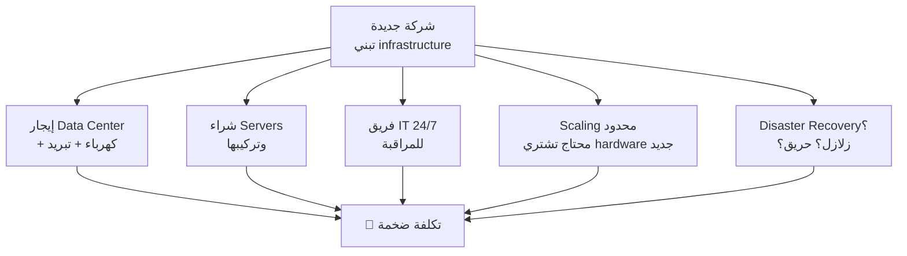

**المشاكل الرئيسية:**

1. **Capital Expense ضخمة (CAPEX)** — بتشتري hardware بالملايين قبل ما تبدأ
2. **Capacity Guessing** — لو عملت Flash Sale، الـ servers هتتعطل. لو اشتريت زيادة، بتدفع على حاجة مش بتستخدمها
3. **Slow Scaling** — لو محتاج servers جديدة، ممكن تاخد أسابيع أو شهور
4. **Operations Team 24/7** — بتصرف على فريق كامل لمراقبة حاجة AWS بتعملها بالـ automation
5. **Disaster Risk** — حريق في الـ data center = الـ application وقفت

> **ال Bottom Line:** كانت الشركات بتصرف معظم وقتها وفلوسها على **تشغيل infrastructure** بدل ما تفكر في **بناء products**.

---

## 3. تعريف الـ Cloud Computing الرسمي

### 📖 التعريف الرسمي (AWS Definition)

> *"Cloud computing is the on-demand delivery of compute power, database storage, applications, and other IT resources through a cloud services platform with pay-as-you-go pricing."*

**بالعربي المصري:**
الـ Cloud Computing هو: **توصيل فوري للـ IT resources على demand بنظام ادفع على قد ما تستخدم.**

**الكلمات المفتاحية في التعريف:**
- **On-demand** — تطلب وتاخد فوراً، مش لازم تستنى
- **Pay-as-you-go** — بتدفع على قد الاستخدام بس
- **Provision the right type and size** — بتختار بالظبط اللي محتاجه
- **Almost instantly** — الـ scalability فوري تقريباً

---

## 4. Deployment Models — أنواع الـ Cloud

### 🏗️ الثلاث نماذج

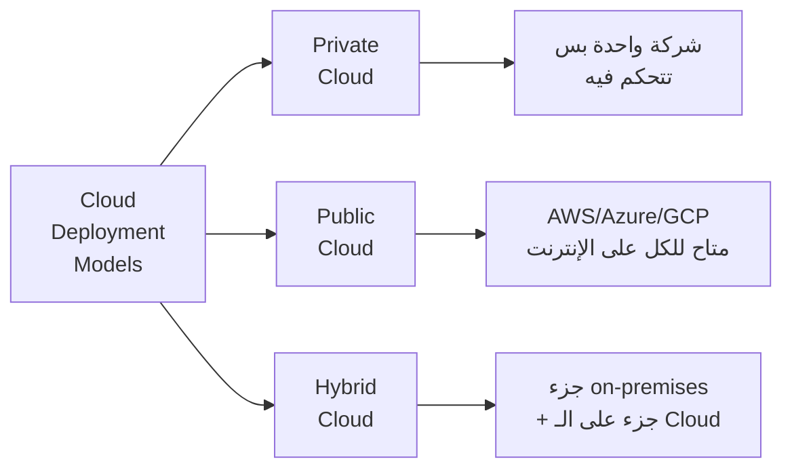

| Feature | Private Cloud | Public Cloud | Hybrid Cloud |
|---------|-------------|-------------|-------------|
| **Owner** | شركة واحدة | AWS / Azure / GCP | الاتنين |
| **Access** | Internal only | Internet | Mix |
| **Cost** | CAPEX ضالي | OPEX (Pay-as-you-go) | Mix |
| **Control** | Full control | محدود | Partial |
| **Use Case** | Banks, Gov, حاجات sensitive | Startups, SaaS | Enterprise migration |
| **Security** | أنت مسؤول بالكامل | Shared Responsibility | Mix |

**أمثلة واقعية:**
- **Private Cloud:** البنك المركزي المصري — بيخزن بياناته على infrastructure خاصة لاعتبارات أمنية وقانونية
- **Public Cloud:** Netflix — بنت كل حاجة على AWS
- **Hybrid Cloud:** Fawry — ممكن تبقى عندها بعض الـ databases on-premises لاشتراطات البنك المركزي، والـ application layer على AWS

> **🎯 Exam Trap:** لو السؤال قال "compliance requirements" أو "data sovereignty" — الجواب غالباً Private Cloud أو Hybrid Cloud مش Public.

---

## 5. الـ 5 Characteristics of Cloud Computing

### ✨ الخصائص الخمس (لازم تحفظها كويس)

دول الـ 5 characteristics اللي بيعرّفوا الـ Cloud Computing حسب NIST:

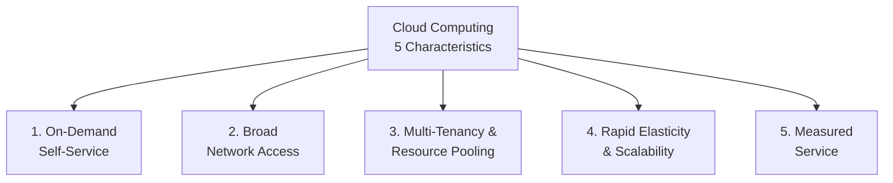

| # | Characteristic | المعنى بالبشري |
|---|---------------|----------------|
| **1** | On-Demand Self-Service | تقدر تـ provision resources من غير ما تكلم حد من AWS |
| **2** | Broad Network Access | تقدر توصله من أي device (موبايل، laptop، إلخ) |
| **3** | Multi-Tenancy & Resource Pooling | أنت وآلاف العملاء بتشاركوا نفس الـ physical infrastructure بأمان |
| **4** | Rapid Elasticity & Scalability | تكبّر وتصغّر الـ resources فوراً حسب الطلب |
| **5** | Measured Service | بتدفع على قد ما بتستخدم بالظبط — زي عداد المياه |

**تذكّر Multi-Tenancy كده:**

```
Physical Server واحد في AWS
├── Customer A → Virtual Machine (معزولة)
├── Customer B → Virtual Machine (معزولة)
└── Customer C → Virtual Machine (معزولة)
```

كل customer معزول تماماً عن التاني رغم إنهم على نفس الـ hardware.

> **🎯 Exam Trick:** لو شافك سؤال "which characteristic allows users to provision resources without human interaction?" — الجواب: **On-Demand Self-Service**

---

## 6. الـ 6 Advantages of Cloud Computing

### 💡 الفوايد الستة (الـ AWS بتذكرهم دايماً)

دول الـ 6 advantages الرسمية اللي AWS بتعلنهم:

#### Advantage 1: Trade CAPEX for OPEX

الزمن ده:
- **CAPEX (Capital Expenditure)** = بتشتري hardware بالملايين مرة واحدة
- **OPEX (Operational Expenditure)** = بتدفع شهرياً على قد الاستخدام

```
Traditional IT: 💰💰💰💰💰 (كل الفلوس أول يوم)
Cloud:          💵  💵  💵  💵  💵 (تدفع شهر بشهر)
```

**فايدة ضخمة للـ startups:** مش محتاج capital ضخم عشان تبدأ.

---

#### Advantage 2: Benefit from Massive Economies of Scale

AWS بيخدم millions من العملاء، يعني بيشتري hardware بأسعار مش متاحة لأي شركة عادية. ده بيتحوّل لـ **reduced prices** عليك إنت.

---

#### Advantage 3: Stop Guessing Capacity

زمان كنت بتـ guess: "هل هنحتاج 10 servers ولا 100 server للـ Black Friday؟"
- لو غلطت فوق → دفعت على حاجة مش استخدمتها
- لو غلطت تحت → الـ application وقفت

مع الـ Cloud → **تـ scale based on actual measured usage**.

---

#### Advantage 4: Increase Speed and Agility

- بدل ما تستنى أسابيع تجيب hardware وتركّبه
- دلوقتي بتـ deploy في دقايق
- ده بيخليك تـ experiment بسرعة وتـ iterate أسرع

---

#### Advantage 5: Stop Spending Money on Running Data Centers

بدل ما فريق الـ IT يصرف وقته على رفع servers وتركيب cables ومراقبة درجة حرارة الـ data center — يركز على بناء features للمنتج.

---

#### Advantage 6: Go Global in Minutes

بدل ما تفتح data center في أوروبا وتاخد سنة — تـ deploy على AWS region في أوروبا في دقايق.

---

### 📊 المشاكل اللي بيحلها الـ Cloud

| المشكلة | الحل |
|---------|------|
| Flexibility | تغيير الـ resource types وقت ما تحتاج |
| Cost | ادفع على قد الاستخدام بس |
| Scalability | Scale up (أقوى) أو Scale out (أكتر) |
| Elasticity | Scale in وقت الهدوء وScale out وقت الذروة |
| High Availability | بني on multiple data centers |
| Agility | Develop، Test، وLaunch بسرعة |

> **🎯 Exam Confusion:** الفرق بين **Scalability** و **Elasticity**:
> - **Scalability**: القدرة على الـ scale عموماً
> - **Elasticity**: Scale UP *وكمان* Scale DOWN أوتوماتيكي حسب الطلب (يعني elastic زي الأستيكة — بتكبر وبترجع)

---

## 7. Types of Cloud Computing — IaaS / PaaS / SaaS

### 🏗️ الثلاث طبقات — القصة الكاملة

تخيل بتبني بيت:
- **IaaS** = AWS بيديلك الأرض والطوب والأسمنت — إنت بتبني كل حاجة
- **PaaS** = AWS بنالك الهيكل والسقف — إنت بس بتدي الفرش والديكور
- **SaaS** = AWS بنالك بيت كامل جاهز ومفروش — إنت بس تسكن فيه

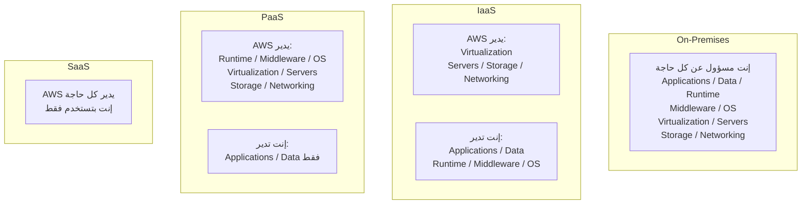

---

### 📊 جدول المقارنة الكامل

| Layer | IaaS | PaaS | SaaS |
|-------|------|------|------|
| **المسؤولية** | Networking→OS على AWS, باقي عليك | Networking→Runtime على AWS | كل حاجة على AWS |
| **Flexibility** | أعلى | وسط | أقل |
| **Management** | إنت تدير الـ OS والـ middleware | إنت تدير الـ app والـ data بس | إنت بس بتستخدم |
| **AWS Example** | **EC2** | **Elastic Beanstalk** | **Rekognition** |
| **Non-AWS Examples** | GCP, Azure, Digital Ocean | Heroku, Google App Engine | Gmail, Dropbox, Zoom |

---

### 🎯 أمثلة عملية

**IaaS — EC2:**
```
إنت بتـ launch EC2 instance
وبتـ install Node.js عليه
وبتـ configure الـ security
وبتـ deploy الـ application بتاعتك
```

**PaaS — Elastic Beanstalk:**
```
إنت بتـ upload كودك
AWS بتـ handle الباقي (server provisioning, load balancing, auto-scaling)
```

**SaaS — Rekognition:**
```
إنت بتبعت صورة لـ API
بيرجعلك: "This is a cat with 99.8% confidence"
مش محتاج تعرف إزاي هو شغّال
```

> **🎯 Exam Trap:** الـ SaaS مش بس Gmail وZoom — في AWS كمان في SaaS services زي Rekognition. اسأل نفسك: "هل بتدير أي infrastructure؟" — لو لا → SaaS.

---

## 8. AWS Pricing Fundamentals

### 💰 الـ 3 أعمدة للـ Pricing

AWS بنت نموذج تسعيرها على 3 محاور رئيسية:

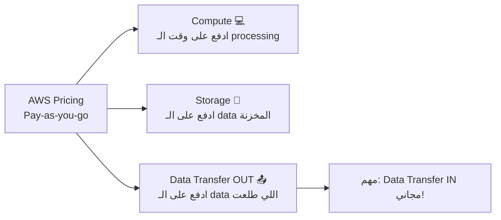

**الثلاث Rules الذهبية:**

1. **Compute** → بتدفع على الـ CPU/RAM time اللي استخدمته
2. **Storage** → بتدفع على كل GB بتخزنه في الـ Cloud
3. **Data Transfer OUT** → بتدفع لما الـ data تطلع من AWS للإنترنت
   - **Data Transfer IN مجاني** ← ده مهم جداً في الـ exam!

**ليه ده Solve مشكلة الـ Traditional IT؟**
- Traditional IT: دفعت مليون جنيه على hardware — سواء استخدمته أو لا
- AWS: استخدمت 2 ساعة EC2 في الشهر؟ دفعت على 2 ساعة بس

> **🎯 Exam Trick:** لو سألك "what is free in AWS data transfer?" — الجواب: **Data transfer INTO AWS is always free.**

---

## 9. AWS History & Global Numbers

### 📅 Timeline بتاع AWS

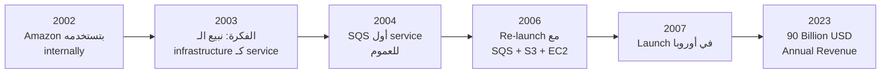

**أرقام مهمة تحفظها:**
- 💰 **$90 Billion** annual revenue في 2023
- 📊 **31%** من الـ Cloud market (Q1 2024) — AWS رقم 1
- 🥈 Microsoft Azure في المرتبة التانية بـ 25%
- 🏆 **13 سنة متتالية** كـ Leader في الـ Gartner Magic Quadrant
- 👥 أكتر من **1,000,000 active user**

---

## 10. AWS Global Infrastructure

### 🌍 بيتكوّن من إيه؟

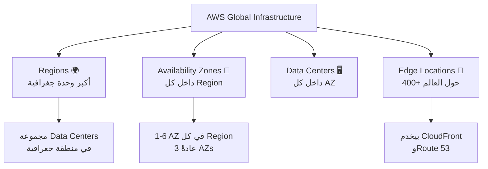

---

### 🗺️ AWS Regions

**تعريف:** الـ Region هو cluster من data centers في منطقة جغرافية معينة.

**أمثلة على Region names:**
- `us-east-1` → North Virginia (أكبر وأقدم Region)
- `eu-west-3` → Paris
- `ap-southeast-2` → Sydney
- `me-south-1` → Bahrain (أقرب Region لمصر)

> معظم الـ AWS services بيتم تسعيرها وتشغيلها على مستوى الـ **Region**.

---

### ❓ ازاي تختار الـ Region المناسبة؟

لما بتقرر تـ launch application على AWS، بتفكر في 4 عوامل:

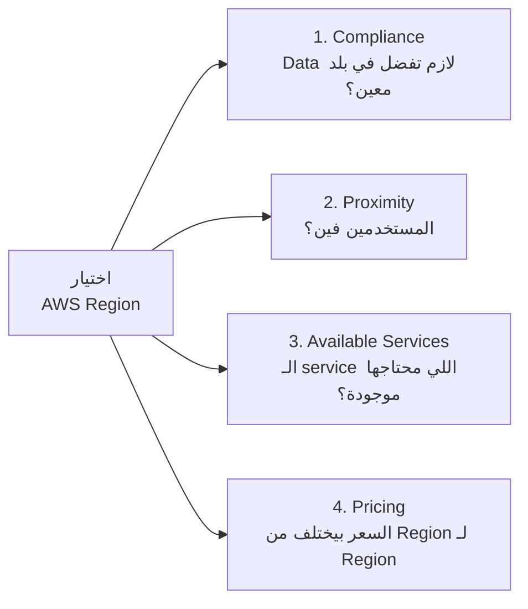

| العامل | المثال | الأولوية |
|--------|--------|---------|
| **Compliance** | GDPR في أوروبا، Data في مصر | **الأعلى — لازم تلتزم** |
| **Proximity** | Users في مصر → Region في Bahrain أو Frankfurt | عالية |
| **Available Services** | مش كل services متاحة في كل Region | وسط |
| **Pricing** | us-east-1 أرخص من بعض الـ Regions | منخفضة |

> **🎯 Exam Pattern:** لو السؤال ذكر "data residency" أو "regulatory compliance" → **Compliance هو أول اعتبار**.

---

### 🏢 Availability Zones (AZs)

الـ AZ هي مجموعة من **data centers منفصلة جسدياً** داخل نفس الـ Region.

**الخصائص المهمة:**
- كل Region عندها **من 3 لـ 6 AZs** (الـ minimum دلوقتي 3)
- كل AZ منفصلة عن التانية — بعيدة بعدة كيلومترات (isolated من disasters)
- متوصلة ببعض بـ **high bandwidth, ultra-low latency networking** (private fiber)
- لو AZ واحدة اتعطلت → الـ AZs التانية شغالة

**مثال:**

```
AWS Region: Sydney (ap-southeast-2)
├── ap-southeast-2a  ← AZ #1 (Data Center في شمال سيدني)
├── ap-southeast-2b  ← AZ #2 (Data Center في وسط سيدني)
└── ap-southeast-2c  ← AZ #3 (Data Center في جنوب سيدني)
```

**ليه مهمة؟**
- بتـ deploy الـ application بتاعك على أكتر من AZ → لو AZ واحدة اتعطلت، الـ app شغال على التانية
- ده اسمه **High Availability**

---

### 📡 Edge Locations (Points of Presence)

- **400+ Edge Locations** في أكتر من 90 مدينة في 40+ دولة
- بيستخدمهم **CloudFront** (CDN) و**Route 53** (DNS)
- هدفهم: تقليل الـ **latency** عند تقديم الـ content للمستخدمين
- الـ content بيتـ cache على أقرب Edge Location من المستخدم

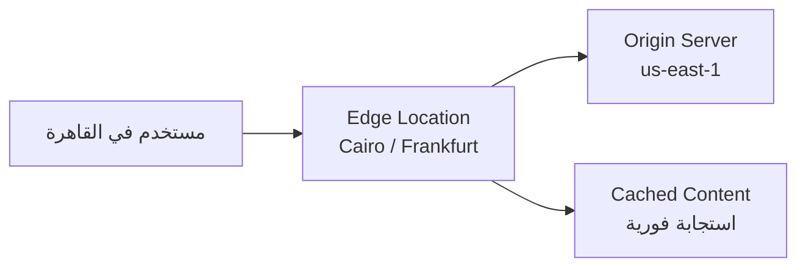

---

### 🌐 Global vs Regional Services

**Global Services** (مش مربوطة بـ Region معين):
- **IAM** — Identity and Access Management
- **Route 53** — DNS service
- **CloudFront** — CDN
- **WAF** — Web Application Firewall

**Regional Services** (لازم تختار Region):
- **EC2** — Virtual Servers
- **Elastic Beanstalk** — PaaS
- **Lambda** — Serverless functions
- **Rekognition** — AI/ML service

> **🎯 Exam Trick:** اسألوا "which service is global?" — الإجابة دايماً IAM, Route 53, CloudFront, أو WAF.

---

### 🔒 Shared Responsibility Model

ده من أهم concepts في الـ exam:

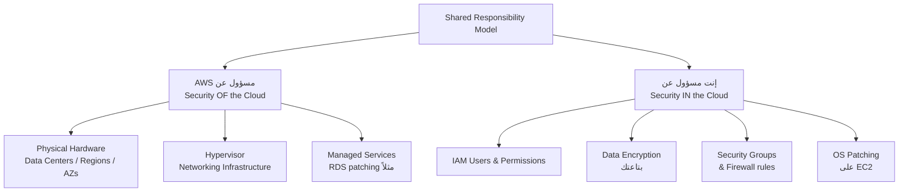

**مثال عملي:**
- لو استخدمت EC2 → إنت مسؤول عن تحديث الـ OS وإدارة الـ security groups
- لو استخدمت RDS (managed database) → AWS مسؤول عن OS patching، إنت مسؤول عن الـ database permissions والـ data

> **🎯 Exam Trap الكبير:** "Who is responsible for patching the OS on an EC2 instance?" → **Customer** (إنت). لو كان RDS؟ → **AWS**.

---

## 11. Global Applications — Route 53

### 🌐 ليه Global Applications؟

قبل ما نتكلم عن Route 53، محتاج تفهم ليه بنـ deploy globally:

| السبب | التفاصيل |
|-------|---------|
| **Decreased Latency** | قرّب الـ servers من المستخدمين |
| **Disaster Recovery** | لو Region دخت → Region تانية بتـ serve |
| **Attack Protection** | Infrastructure موزعة أصعب تتهاجم |

---

### 🗺️ Route 53 — الـ Managed DNS

**تعريف:** Route 53 هو الـ **Managed DNS** service بتاع AWS.

**DNS شغّال ازاي؟**

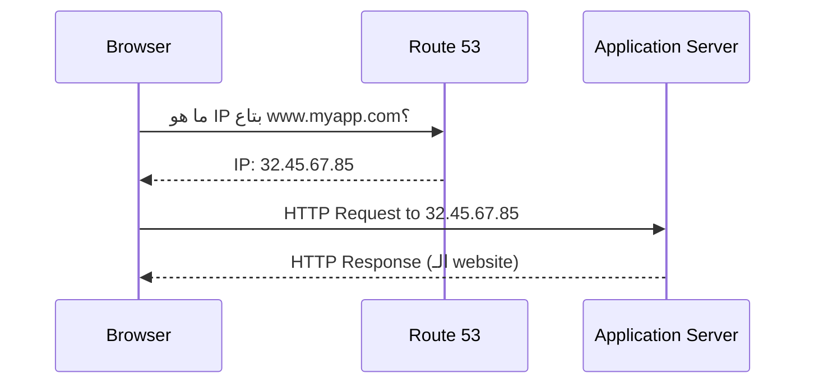

**أنواع الـ DNS Records اللي لازم تعرفها:**

| Record Type | المعنى | مثال |
|-------------|--------|------|
| **A Record** | hostname → IPv4 | www.google.com → 12.34.56.78 |
| **AAAA Record** | hostname → IPv6 | www.google.com → 2001:0db8:... |
| **CNAME** | hostname → hostname تاني | search.google.com → www.google.com |
| **Alias** | hostname → AWS resource | example.com → ELB / CloudFront / S3 |

---

### 🛣️ Routing Policies — Route 53 بيوجّه ازاي؟

لازم تعرفهم على مستوى high-level للـ exam:

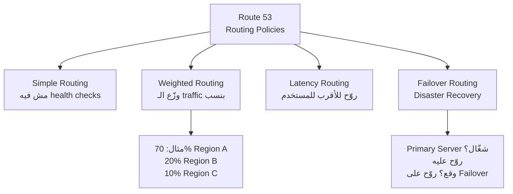

| Policy | الاستخدام |
|--------|---------|
| **Simple** | routing عادي، مش محتاج intelligence |
| **Weighted** | A/B Testing أو Blue/Green Deployment |
| **Latency** | المستخدم في أوروبا → يروح لـ Frankfurt Region |
| **Failover** | Primary Server وقع → روّح على Backup |

> **🎯 Exam Tip:** "What Route 53 policy is best for Disaster Recovery?" → **Failover Routing Policy**.

---

## 12. Amazon CloudFront

### 📦 CloudFront — الـ CDN بتاع AWS

**تعريف:** CloudFront هو الـ **Content Delivery Network (CDN)** بتاع AWS.

**المشكلة اللي بيحلها:**

```
بدون CloudFront:
مستخدم في طوكيو يطلب ملف من server في us-east-1
→ الـ packet بيسافر 14,000 كيلومتر
→ latency عالية = تجربة سيئة

مع CloudFront:
مستخدم في طوكيو يطلب ملف
→ CloudFront بيديه من أقرب Edge Location في طوكيو
→ latency منخفضة جداً = تجربة ممتازة
```

---

### ⚙️ ازاي CloudFront بيشتغل؟

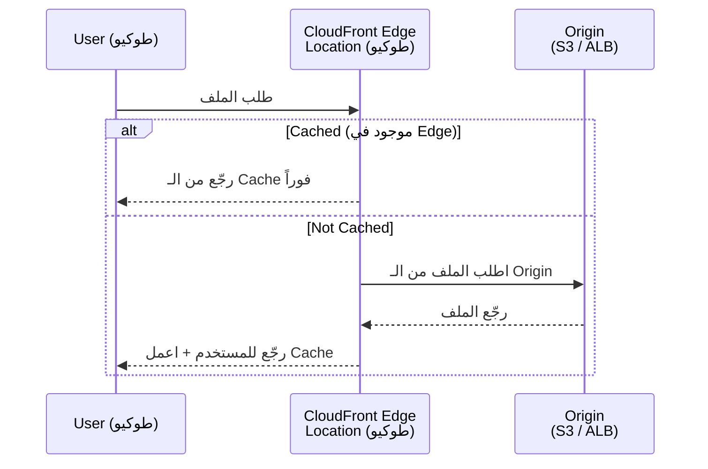

**الـ Cache بيفضل لمدة TTL (Time To Live)** — عادةً يوم كامل.

---

### 📂 CloudFront Origins — من فين بياخد الـ Content؟

| Origin Type | الاستخدام |
|------------|---------|
| **S3 Bucket** | توزيع static files (images, videos) + secured بـ OAC |
| **VPC Origin** | Apps في private subnets (ALB / NLB / EC2) |
| **Custom HTTP Origin** | أي HTTP backend (public ALB, S3 static website) |

---

### ⚔️ CloudFront vs S3 Cross Region Replication

ده سؤال بييجي كتير في الـ exam:

| Feature | CloudFront | S3 Cross Region Replication |
|---------|-----------|---------------------------|
| **النوع** | Global CDN (Edge Locations) | S3 replication لـ regions محددة |
| **الـ Cache** | يتخزن عند الـ Edge (TTL) | بيتحدث في real-time تقريباً |
| **الـ Use Case** | Static content للكل | Dynamic content لـ regions معينة |
| **الـ Access** | Read/Write | Read Only |
| **الـ Setup** | Global تلقائياً | لازم تعمل setup لكل Region |

> **🎯 Exam Trick:** "Dynamic content low-latency for specific regions?" → **S3 Cross Region Replication**. "Static content globally?" → **CloudFront**.

---

### 🛡️ Security Features في CloudFront

- **DDoS Protection** — لأنه موزع globally، الـ attacks بيتوزع على كل الـ edge locations
- **Integration with AWS Shield** — حماية إضافية
- **Integration with AWS WAF** — تصفية الـ requests الخطيرة

---

## 13. S3 Transfer Acceleration

### 🚀 المشكلة والحل

**المشكلة:** عندك user في مصر محتاج يـ upload ملف كبير لـ S3 bucket في us-east-1 (أمريكا).
- الـ upload هيعدي على الإنترنت العام = بطيء ومش مستقر

**الحل:** S3 Transfer Acceleration

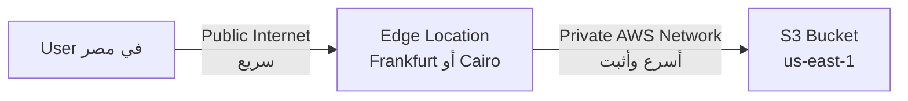

**ازاي بيشتغل:**
1. الـ user بيرفع للـ Edge Location الأقرب ليه (سريع)
2. الـ Edge Location بيبعت الملف لـ S3 على الـ **AWS internal backbone network** (أسرع بكتير)
3. النتيجة: upload أسرع بكتير من الإنترنت العادي

> **🎯 Exam Keyword:** "accelerate uploads to S3 from anywhere in the world" → **S3 Transfer Acceleration**.

---

## 14. AWS Global Accelerator

### ⚡ ما هو الـ Global Accelerator؟

**المشكلة:** عندك application في us-east-1 وعندك users في أستراليا. الـ latency عالية جداً.

**الحل:** AWS Global Accelerator

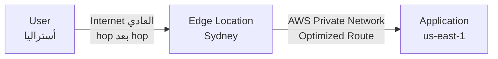

**الفكرة:** بدل ما الـ traffic يعدي على الإنترنت العام مع كل مشاكله — بيدخل على **AWS backbone network** من أقرب Edge Location.

**الأرقام:** تحسين يصل لـ **60%** في الـ performance.

**آلية العمل:**
- بيتم إنشاء **2 Anycast IP addresses** لـ application بتاعك
- الـ users بيتوجهوا لأقرب Edge Location
- الـ Edge بيبعت الـ traffic على الـ private AWS network

---

### ⚔️ Global Accelerator vs CloudFront — الفرق الجوهري

| Feature | CloudFront | Global Accelerator |
|---------|-----------|-------------------|
| **الوظيفة** | CDN — يـ cache الـ content | Network Accelerator — يـ proxy الـ packets |
| **الـ Caching** | ✅ يعمل caching | ❌ مفيش caching |
| **الـ Content** | Static content (images, videos) | أي application (TCP/UDP) |
| **الـ IP** | Dynamic | Static (Anycast IPs) — مهم! |
| **Best For** | HTTP cacheable content | Non-HTTP, gaming, IoT, VoIP |
| **Failover** | عبر الـ CDN | Fast regional failover |

> **🎯 الكلمة السحرية:** لو السؤال قال "static IP" أو "deterministic failover" → **Global Accelerator**. لو قال "cache" أو "content delivery" → **CloudFront**.

**مشتركين في:**
- بيستخدموا الـ AWS global network وEdge Locations
- Integration مع AWS Shield للـ DDoS protection

---

## 15. AWS Outposts / WaveLength / Local Zones

### الثلاثة دول بيجاوبوا على سؤال واحد: "عايز أقرّب الـ AWS لمستخدميّ" — بس كل واحد بطريقة مختلفة

---

### 🏭 AWS Outposts

**القصة:** شركة زي Fawry أو بنك مصر عندها data center خاص بها. مش قادرة تنقل كل حاجة للـ Cloud بسبب regulatory requirements. بس عايزة تستخدم AWS services.

**الحل:** AWS بيجيبلك **Outpost Rack** — سيرفر حقيقي من AWS بيتركب في الـ data center بتاعك.

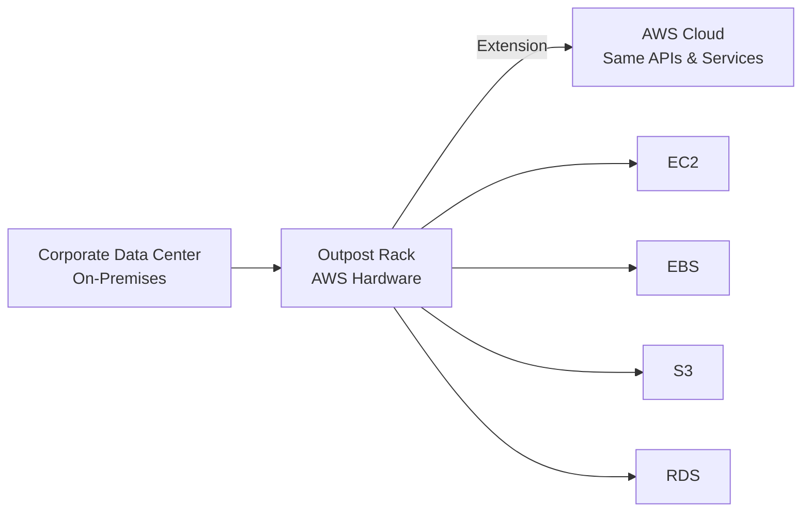

**مهم:** إنت مسؤول عن الـ **physical security** للـ Outpost Rack لأنه في مكانك.

**الفوايد:**
- Low-latency لـ on-premises systems
- Local data processing (data ما تطلعش من مكانك)
- Data residency compliance
- Easier migration path للـ Cloud

---

### 📱 AWS WaveLength

**القصة:** عندك application محتاج يشتغل على شبكات 5G بـ ultra-low latency (أقل من 10 milliseconds).

**مثال:** Autonomous vehicles، live video streaming على الموبايل، AR/VR experiences

**الحل:** WaveLength Zones — AWS infrastructure مدفون جوه الـ telecom data center نفسه

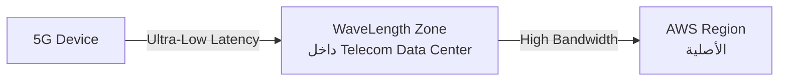

**Use Cases:** Smart Cities, AR/VR, Real-time Gaming, Connected Vehicles

---

### 🏙️ AWS Local Zones

**القصة:** عندك users في مدينة معينة (زي بوسطن أو ميامي) وما فيش AWS Region قريبة منهم.

**الحل:** Local Zones — AWS بيـ extend الـ Region لمدن مختلفة

```
AWS Region: us-east-1 (N. Virginia)
├── AZ-1
├── AZ-2
└── Local Zone: Boston (مش AZ — بس extension)
    └── Private Subnet
    └── بتـ extend VPC بتاعك للمدينة دي
```

**الفرق عن WaveLength:** Local Zones مش مرتبطة بـ 5G networks — هي extension عادية للـ Region لمدن محددة.

---

### 📊 الثلاثة في جدول واحد

| Feature | Outposts | WaveLength | Local Zones |
|---------|---------|-----------|------------|
| **الموقع** | Data Center بتاعك | Telecom 5G Network | مدن قريبة من users |
| **الهدف** | Hybrid Cloud compliance | 5G ultra-low latency | قرّب الـ compute من users |
| **Physical ownership** | إنت | Telecom | AWS |
| **Use Case** | Banks, Gov, Healthcare | Smart Cities, AR/VR | Media, Gaming |

> **🎯 Exam Keyword Matrix:**
> - "on-premises AWS services" → **Outposts**
> - "5G ultra-low latency" → **WaveLength**
> - "extend VPC to a city" → **Local Zones**

---

### 🏗️ Global Applications Architecture — Summary

| Architecture | High Availability | Latency | Difficulty |
|-------------|-----------------|---------|-----------|
| **Single Region, Single AZ** | ❌ | عالية | آسان |
| **Single Region, Multi AZ** | ✅ | وسط | وسط |
| **Multi Region, Active-Passive** | ✅✅ | Reads OK / Writes عالية | صعب |
| **Multi Region, Active-Active** | ✅✅✅ | Reads + Writes منخفضة | أصعب |

---

## 16. Well-Architected Framework — الـ 6 Pillars

### 🏛️ ما هو الـ Well-Architected Framework؟

AWS بعد ما راجعت آلاف الـ architectures، وضعت دليل يسمى **Well-Architected Framework** — بيقولك ازاي تبني architecture صح على AWS.

**الـ Framework بيتكون من 6 Pillars** — مش trade-offs، ده **synergy** — كلهم بيكملوا بعض.

**الـ General Guiding Principles:**
- **Stop guessing capacity** — استخدم Auto Scaling
- **Test at production scale** — Test Load Testing على الـ Cloud سهل وبسعر معقول
- **Automate everything** — Infrastructure as Code
- **Allow evolutionary architectures** — الـ requirements بتتغير
- **Drive architectures using data** — استخدم الـ metrics
- **Improve through game days** — simulate disasters بشكل دوري

---

### 🔧 Cloud Best Practices (Design Principles)

قبل الـ pillars، في design principles عامة:

| Principle | المعنى |
|-----------|--------|
| **Scalability** | Vertical (instance أكبر) + Horizontal (instances أكتر) |
| **Disposable Resources** | Servers مش sacred — تقدر تحذفهم وتعملهم تاني |
| **Automation** | Serverless / IaC / Auto Scaling |
| **Loose Coupling** | Microservices — failure في component مش يـ cascade |
| **Services not Servers** | استخدم managed services بدل EC2 لكل حاجة |

---

### 🏛️ الـ 6 Pillars

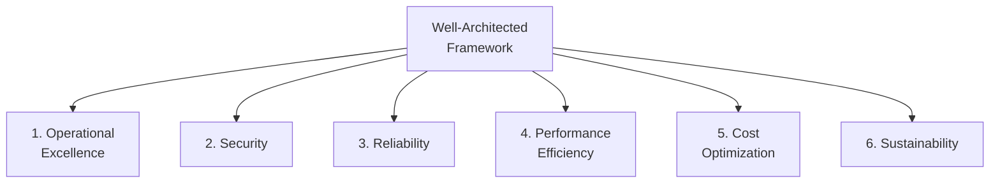

---

#### Pillar 1: Operational Excellence 🔧

**التعريف:** القدرة على تشغيل ومراقبة الأنظمة بشكل يحقق قيمة للـ business، ويحسّن العمليات باستمرار.

**Design Principles:**
- **Operations as Code** — Infrastructure as Code (CloudFormation)
- **Frequent small reversible changes** — Deploy صغيرة وكتيرة بدل deploy كبيرة ونادرة
- **Anticipate failure** — فكر هيحصل إيه لو كذا component وقع
- **Learn from failures** — كل incident هو فرصة تعلم
- **Use managed services** — تقليل الـ operational burden

**AWS Services المرتبطة:**

| Phase | Services |
|-------|---------|
| **Prepare** | CloudFormation, Config |
| **Operate** | CloudFormation, Config, CloudTrail, CloudWatch, X-Ray |
| **Evolve** | CodeBuild, CodeCommit, CodeDeploy, CodePipeline |

---

#### Pillar 2: Security 🔒

**التعريف:** القدرة على حماية المعلومات والأنظمة مع تحقيق قيمة للـ business.

**Design Principles:**
- **Strong identity foundation** — IAM + Principle of Least Privilege
- **Enable traceability** — CloudTrail + CloudWatch Logs
- **Security at all layers** — مش بس الـ edge — وصل للـ OS والـ application
- **Protect data in transit and at rest** — Encryption everywhere
- **Keep people away from data** — Automation بدل الـ manual access
- **Prepare for security events** — Incident response playbooks

**AWS Services المرتبطة:**

| Category | Services |
|---------|---------|
| **Identity** | IAM, AWS-STS, MFA, AWS Organizations |
| **Detective** | CloudTrail, CloudWatch, Config |
| **Infrastructure Protection** | VPC, CloudFront, Shield, WAF, Inspector |
| **Data Protection** | KMS, S3 encryption, EBS encryption |
| **Incident Response** | CloudWatch Events |

---

#### Pillar 3: Reliability ⚡

**التعريف:** القدرة على الاسترداد من failures وتلبية الطلبات.

**Design Principles:**
- **Test recovery procedures** — simulate failures قبل ما تحصل
- **Automatically recover from failure** — Health checks + Auto Scaling
- **Scale horizontally** — وزّع الـ load على instances كتيرة
- **Stop guessing capacity** — Auto Scaling بيتعامل مع الـ fluctuations
- **Manage change through automation** — CloudFormation بدل manual changes

**AWS Services المرتبطة:**

| Category | Services |
|---------|---------|
| **Foundations** | IAM, VPC, Service Quotas, Trusted Advisor |
| **Change Management** | Auto Scaling, CloudWatch, CloudTrail, Config |
| **Failure Management** | Backups, CloudFormation, S3, Glacier, Route 53 |

---

#### Pillar 4: Performance Efficiency ⚙️

**التعريف:** استخدام الـ resources بكفاءة لتلبية متطلبات الأنظمة.

**Design Principles:**
- **Democratize advanced technologies** — استخدم ML وAI كـ services جاهزة
- **Go global in minutes** — Deploy لـ multiple regions بسهولة
- **Use serverless architectures** — تجنب إدارة servers
- **Experiment more often** — Cloud بيخليك تـ test بسرعة
- **Mechanical sympathy** — افهم الـ services المتاحة واستخدم الصح منها

**AWS Services المرتبطة:**

| Category | Services |
|---------|---------|
| **Selection** | Auto Scaling, Lambda |
| **Review** | CloudFormation |
| **Monitoring** | CloudWatch |
| **Tradeoffs** | ElastiCache, Snowball, CloudFront, RDS |

---

#### Pillar 5: Cost Optimization 💰

**التعريف:** تشغيل الأنظمة لتحقيق قيمة للـ business بأقل تكلفة ممكنة.

**Design Principles:**
- **Adopt a consumption model** — ادفع على اللي بتستخدمه بس
- **Measure overall efficiency** — استخدم CloudWatch
- **Stop spending on data center operations** — AWS بيـ handle الـ infrastructure
- **Analyze expenditure** — استخدم Tags عشان تعرف كل service بتصرف كام
- **Use managed services** — أرخص per transaction

**AWS Services المرتبطة:**

| Category | Services |
|---------|---------|
| **Expenditure Awareness** | Budgets, Cost & Usage Report, Cost Explorer |
| **Cost-Effective Resources** | Spot Instances, Reserved Instances, S3 Glacier |
| **Supply & Demand** | Auto Scaling |
| **Optimizing Over Time** | Trusted Advisor, Lambda |

---

#### Pillar 6: Sustainability 🌱

**التعريف:** تقليل الأثر البيئي لتشغيل الـ workloads.

**Design Principles:**
- **Understand impact** — قيس carbon footprint بتاعك
- **Establish sustainability goals** — حدد long-term targets
- **Maximize utilization** — Right size الـ instances — إياك تشغّل instance أكبر من اللازم
- **Use managed services** — Shared infrastructure = أكفأ من the energy
- **Reduce downstream impact** — اعمل app أخف على devices المستخدمين

**AWS Services المرتبطة:**

| Category | Services |
|---------|---------|
| **Compute** | EC2 Auto Scaling, Lambda, Fargate, Graviton, Spot |
| **Storage** | EFS-IA, S3 Glacier, EBS Cold HDD, S3 Intelligent Tiering |
| **Data Lifecycle** | S3 Lifecycle, Data Lifecycle Manager |
| **Global** | RDS Read Replicas, Aurora Global, DynamoDB Global, CloudFront |

---

### 🔧 AWS Well-Architected Tool

- **مجاني** تماماً
- بتختار الـ workload بتاعك وبتجاوب على أسئلة
- بيقيّم الـ architecture بتاعتك على الـ 6 Pillars
- بيقدملك توصيات، videos، documentation، وdashboard

> **🎯 Exam Fact:** "What tool helps you review architectures against the 6 pillars for free?" → **AWS Well-Architected Tool**

---

### 🌿 AWS Customer Carbon Footprint Tool

- بيتتبع الـ carbon emissions الناتجة عن استخدامك لـ AWS
- بيعرضها over time، by geography، by service
- بيساعدك تحقق sustainability goals بتاعتك

---

## 17. AWS Cloud Adoption Framework (CAF)

### 🗺️ ما هو الـ CAF؟

الـ AWS Cloud Adoption Framework (CAF) هو دليل شامل بيساعد الشركات **يخططوا ويـ execute الـ digital transformation** بتاعتهم.

**من أنشأه؟** AWS Professionals بناءً على تجارب مع آلاف الـ customers.

**الفرق بين CAF وWell-Architected:**
- **Well-Architected** → بيقولك ازاي تبني architecture صح
- **CAF** → بيقولك ازاي تتحوّل للـ Cloud كـ organization (الـ people، العمليات، التكنولوجيا)

---

### 🔭 الـ 6 Perspectives

الـ CAF بيقسّم الـ capabilities اللي محتاجها للـ transformation في 6 perspectives:

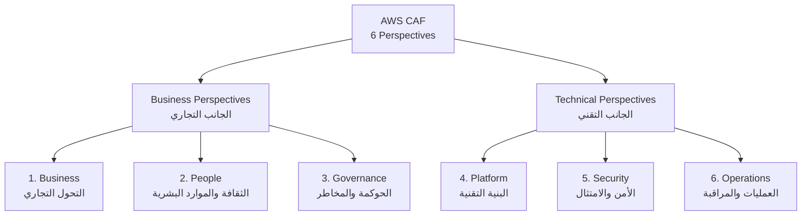

---

#### Business Perspectives

| Perspective | الهدف |
|------------|-------|
| **Business** | التأكد إن الـ cloud investments بتـ accelerate الـ business outcomes |
| **People** | Bridge بين الـ technology والـ business — ثقافة continuous growth |
| **Governance** | Orchestrate الـ cloud initiatives وتقليل الـ risks |

#### Technical Perspectives

| Perspective | الهدف |
|------------|-------|
| **Platform** | بناء enterprise-grade scalable hybrid cloud platform |
| **Security** | Confidentiality + Integrity + Availability للـ data |
| **Operations** | التأكد إن الـ cloud services بتلبي متطلبات الـ business |

---

### 🔄 Transformation Domains

الـ CAF بيحدد 4 مجالات للـ transformation:

| Domain | المعنى |
|--------|--------|
| **Technology** | Migrate وmodernize legacy infrastructure والـ apps |
| **Process** | Digitize وautomate العمليات التجارية |
| **Organization** | Reimagine الـ operating model وتنظيم الفرق |
| **Product** | Reimagine الـ business model وإنشاء value propositions جديدة |

---

### 🚀 Transformation Phases

الـ CAF بيحدد 4 phases للـ cloud journey:

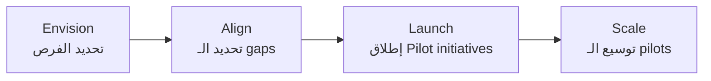

| Phase | المعنى |
|-------|--------|
| **Envision** | اكتشاف كيف الـ Cloud يـ accelerate الـ business outcomes |
| **Align** | تحديد الـ capability gaps في الـ 6 Perspectives → Action Plan |
| **Launch** | بناء وتنفيذ pilot initiatives في production |
| **Scale** | توسيع الـ pilots لتحقيق الـ business benefits |

> **🎯 Exam Tip:** "What phases make up the AWS CAF?" — لازم تحفظ الـ 4: Envision → Align → Launch → Scale

---

## 18. AWS Ecosystem & Support

### 🌐 الـ Ecosystem الكامل

#### AWS Right Sizing

**المفهوم:** اختيار الـ EC2 instance type المناسب لـ workload بتاعك بأقل تكلفة ممكنة.

**القاعدة الذهبية:** "Always start small — scaling up is easy"

- الـ Right Sizing بيبدأ **قبل الـ migration** وبيستمر **بعدها** (الـ requirements بتتغير)
- الـ Tools: CloudWatch, Cost Explorer, Trusted Advisor

---

#### AWS Free Resources

| Resource | الوصف |
|---------|--------|
| **AWS Blogs** | آخر updates من AWS |
| **AWS re:Post** | Community Q&A (خلف الـ old Forums) |
| **AWS Whitepapers** | Technical deep-dives مجانية |
| **AWS Solutions Library** | Vetted solutions جاهزة |

---

#### AWS Support Plans — مهم جداً في الـ Exam!

| Plan | الـ Access | Response Time | الـ TAM |
|------|----------|--------------|--------|
| **Basic** | Documentation / Community | N/A | ❌ |
| **Developer** | Business hours email | General: < 24h / Impaired: < 12h | ❌ |
| **Business** | 24/7 phone, email, chat | Production impaired: < 4h / Down: < 1h | ❌ |
| **Enterprise On-Ramp** | 24/7 | Business-critical: < 30 min | Pool of TAMs |
| **Enterprise** | 24/7 | Business-critical: < **15 min** | Dedicated TAM |

**مهمات يعرفها في الـ Exam:**
- **TAM (Technical Account Manager)** → متاح بس في Enterprise plans
- **Concierge Support Team** (billing & account) → Enterprise فقط
- **< 15 minutes SLA** → Enterprise plan فقط

> **🎯 Exam Trap:** "Which plan provides a TAM?" → **Enterprise** (أو Enterprise On-Ramp). **Developer plan لا يوفر TAM.**

---

#### AWS Marketplace

- Digital catalog فيه آلاف الـ solutions من vendors تانيين (ISVs)
- أمثلة: Custom AMIs، CloudFormation templates، SaaS products، Containers
- لو اشتريت من AWS Marketplace → يتحاسب على AWS bill بتاعك
- تقدر تبيع solutions بتاعتك كمان على الـ Marketplace

---

#### AWS Professional Services & APN

- **AWS Professional Services:** Global team من الـ AWS experts بيساعدوا في الـ implementation
- **APN (AWS Partner Network):**
  - **Technology Partners:** Hardware, connectivity, software
  - **Consulting Partners:** Professional services للـ build
  - **Training Partners:** للـ learning

---

#### AWS IQ

- بيربطك بـ AWS-certified experts للـ project work بالساعة
- Video conferencing + contract management + billing على AWS bill
- **للـ Customers:** ابعت request وصف المشروع → اختار expert
- **للـ Experts:** اعمل profile → ابعت proposals

---

#### AWS re:Post

- Q&A platform بيخلف الـ AWS Forums القديمة
- Community members بيكسبوا reputation points
- Questions من Premium Support customers اللي ما اتجاوبتش → بتتحوّل لـ AWS Support engineers
- **مش** للأسئلة الـ time-sensitive أو اللي فيها proprietary information

---

#### AWS Managed Services (AMS)

- AWS team بتدير وتشغّل الـ infrastructure بتاعتك
- بتـ handle: change requests، monitoring، patch management، security، backups
- **Business hours: 24/365**
- مناسب للشركات اللي عايزة تـ outsource الـ operations

---

## 19. 🎯 Exam Cheatsheet — المراجعة السريعة

### 🧠 Memory Tricks

**الـ 5 Characteristics:**
> **O-B-M-R-M** → "**O**n demand, **B**road access, **M**ulti-tenancy, **R**apid elasticity, **M**easured service"

**الـ 6 Advantages:**
> **T-B-S-S-S-G** → "**T**rade CAPEX, **B**enefit economies, **S**top guessing, **S**peed agility, **S**top data center, **G**o global"

**الـ 6 Well-Architected Pillars:**
> **O-S-R-P-C-S** → "**O**perational, **S**ecurity, **R**eliability, **P**erformance, **C**ost, **S**ustainability"

**الـ 6 CAF Perspectives:**
> **B-P-G-P-S-O** → "**B**usiness, **P**eople, **G**overnance, **P**latform, **S**ecurity, **O**perations"

---

### 📋 الـ Common Exam Traps

| السؤال | الـ Trap | الإجابة الصحيحة |
|--------|---------|----------------|
| Who patches EC2 OS? | قد يفكروا AWS | **Customer** |
| Who patches RDS? | قد يفكروا Customer | **AWS** |
| Which is global? | الكل يعتقد EC2 global | **IAM, Route 53, CloudFront, WAF** |
| CAPEX vs OPEX? | On-premises = OPEX | On-premises = **CAPEX**, Cloud = **OPEX** |
| CloudFront vs S3 CRR? | كلهم بيـ cache | CloudFront = static/global cache; S3 CRR = dynamic/regional real-time |
| Data Transfer IN cost? | المفروض بيكلف | **مجاني دايماً** |
| TAM available in? | يفكروا Business | **Enterprise فقط** |
| 5 min response time? | يفكروا Business | **Enterprise: < 15 min** |

---

### 🗺️ الـ Global Services vs Regional Services

```
GLOBAL (مش بتختار Region):
├── IAM
├── Route 53
├── CloudFront
└── WAF

REGIONAL (بتختار Region):
├── EC2
├── S3 (regional but globally unique names)
├── Lambda
├── RDS
└── EBS
```

---

### 💰 الـ Pricing Summary

```
3 Pricing Fundamentals:
1. Compute    → ادفع على الوقت
2. Storage    → ادفع على الـ GBs
3. Data OUT   → ادفع على اللي طلع من AWS

مجاني دايماً:
- Data Transfer IN
- Data transfer between AZs في بعض الـ scenarios
```

---

### 🌐 الـ Global Acceleration Services Comparison

| Service | الاستخدام | الـ Keyword |
|---------|---------|-----------|
| **Route 53** | DNS + routing policies | "DNS", "failover", "latency-based routing" |
| **CloudFront** | CDN + static content caching | "cache", "edge", "static files", "DDoS" |
| **S3 Transfer Acceleration** | Speed up S3 uploads | "accelerate S3 uploads" |
| **Global Accelerator** | Low-latency for TCP/UDP apps | "static IP", "non-HTTP", "60% performance" |
| **Outposts** | AWS on-premises | "on-premises", "data residency" |
| **WaveLength** | 5G low-latency | "5G", "ultra-low latency", "telecom" |
| **Local Zones** | Extend region to cities | "extend VPC", "city-level", "latency-sensitive" |

---

### 📝 Practice Questions

---

**Q1:** مؤسسة طبية تريد نقل بياناتها لـ AWS، لكن القانون يشترط أن تبقى البيانات داخل البلد. ما أول اعتبار عند اختيار الـ AWS Region؟

- A) Pricing
- B) Available Services
- C) Compliance
- D) Proximity

**✅ الجواب: C — Compliance**

**الشرح:** Compliance هو **دايماً الاعتبار الأول** لو في متطلبات قانونية أو تنظيمية. مش مهم السعر أو الـ proximity لو البيانات ممنوعة تطلع من البلد.

---

**Q2:** ما الفرق الجوهري بين Scalability وElasticity في الـ Cloud؟

- A) Scalability = أفقي بس، Elasticity = رأسي بس
- B) Scalability = القدرة على الزيادة، Elasticity = الزيادة والنقصان أوتوماتيكي
- C) Scalability مجاني، Elasticity بيكلف
- D) Scalability للـ storage فقط

**✅ الجواب: B**

**الشرح:** Scalability = القدرة على التوسع. Elasticity = التوسع تلقائياً وكمان الانكماش تلقائياً حسب الطلب.

---

**Q3:** شركة عندها EC2 instances وعايزة تقلل التكلفة على طلبات واسعة. أي خاصية من خواص الـ Cloud بتنعكس هنا؟

- A) Multi-Tenancy
- B) Measured Service
- C) Economies of Scale
- D) On-Demand Self-Service

**✅ الجواب: C — Economies of Scale**

**الشرح:** AWS بيشتري hardware بالملايين → بيوفّر على التكلفة → بينقل التوفير للعميل. ده الـ Economies of Scale.

---

**Q4:** فريق DevOps يريد نشر تطبيقاً على عدة regions لتقليل الـ latency، بدون الحاجة لإدارة DNS records يدوياً. ما الخدمة الأنسب؟

- A) CloudFront
- B) Route 53 with Latency Routing Policy
- C) Global Accelerator
- D) S3 Transfer Acceleration

**✅ الجواب: B — Route 53 with Latency Routing Policy**

**الشرح:** Latency-based routing في Route 53 بيوجّه المستخدم للـ Region الأقرب ليه تلقائياً. CloudFront للـ content caching. Global Accelerator للـ non-HTTP/static IP scenarios.

---

**Q5:** ما الـ pillar من الـ Well-Architected Framework المرتبط بـ "Pay only for what you use" و"Use tags to track costs"؟

- A) Operational Excellence
- B) Reliability
- C) Cost Optimization
- D) Sustainability

**✅ الجواب: C — Cost Optimization**

**الشرح:** Cost Optimization Pillar بيركز على تقليل التكلفة مع الحفاظ على الـ value — والـ tags أساسية لمعرفة مين بيصرف إيه.

---

**Q6:** شركة تطلب AWS تدير الـ infrastructure بالكامل بما في ذلك الـ patching، monitoring، والـ backups. ما الخدمة المناسبة؟

- A) AWS Professional Services
- B) AWS Managed Services (AMS)
- C) AWS Support Enterprise Plan
- D) AWS Partner Network

**✅ الجواب: B — AWS Managed Services (AMS)**

**الشرح:** AMS بيقدم fully managed operations — بيـ handle change requests, monitoring, patching, security, backups. مختلف عن الـ Support Plan اللي بيقدم مساعدة.

---

**Q7:** أي من الخدمات التالية يعتبر global وليس regional؟

- A) Amazon EC2
- B) Amazon RDS
- C) AWS IAM
- D) Amazon Lambda

**✅ الجواب: C — AWS IAM**

**الشرح:** IAM هو global service — users وroles بتاعتك متاحة في كل الـ regions. EC2, RDS, Lambda كلها regional.

---

**Q8:** شركة اتصالات تريد نشر تطبيق يستفيد من شبكة 5G بأقل latency ممكنة داخل شبكة الـ carrier. ما الحل؟

- A) AWS Local Zones
- B) AWS Outposts
- C) AWS WaveLength
- D) AWS Global Accelerator

**✅ الجواب: C — AWS WaveLength**

**الشرح:** WaveLength بيدفن AWS infrastructure جوه data centers شركات الاتصالات على حافة الـ 5G network. الـ traffic ما بيطلعش من شبكة الـ carrier = ultra-low latency.

---

**Q9:** أي خطة من خطط الـ AWS Support توفر Technical Account Manager (TAM) مخصص وSLA أقل من 15 دقيقة؟

- A) Developer
- B) Business
- C) Enterprise On-Ramp
- D) Enterprise

**✅ الجواب: D — Enterprise**

**الشرح:** TAM المخصص (dedicated) بيكون في الـ Enterprise plan بس. Enterprise On-Ramp عنده pool of TAMs مش dedicated. الـ < 15 min SLA كمان Enterprise فقط.

---

**Q10:** ما هو الـ Phase الأول في الـ AWS CAF؟

- A) Align
- B) Launch
- C) Envision
- D) Scale

**✅ الجواب: C — Envision**

**الشرح:** الـ order هو: **Envision → Align → Launch → Scale**. Envision = تحديد الفرص وكيف الـ Cloud يـ accelerate الـ business outcomes.

---

### ⚡ زتونة الإنترفيو 🫒

لو بسألوك في الإنترفيو أو الـ exam عن domain 1 كله في جملة:

> **"الـ Cloud Computing هو on-demand delivery للـ IT resources بـ pay-as-you-go pricing، مع 5 characteristics رئيسية (on-demand, broad access, multi-tenancy, elasticity, measured service) و6 advantages أهمها التحول من CAPEX لـ OPEX. AWS بيقدم خدماته في 3 models: IaaS (EC2)، PaaS (Beanstalk)، SaaS (Rekognition). الـ Global Infrastructure مبني على Regions وAZs وEdge Locations. الـ Well-Architected Framework عنده 6 Pillars (OSRPCS) وهم مش trade-offs — هما synergy. الـ CAF بيساعد الـ organizations في الـ transformation عبر 6 Perspectives و4 Phases."**

---

*📅 Last Updated: May 2026 | Aligned with Stephane Maarek CLF-C02 Course | Exam Date: 25/5*

---

> **🔗 المصادر:**
> - Stephane Maarek — AWS Certified Cloud Practitioner CLF-C02 (Udemy)
> - AWS Official Documentation
> - https://aws.amazon.com/compliance/shared-responsibility-model/
> - https://infrastructure.aws/
> - https://console.aws.amazon.com/wellarchitected
