# Domain 1 — Cloud Concepts (Part 1 of 2)
## ما هو Cloud Computing + AWS Global Infrastructure

> **مستوى:** AWS Certified Cloud Practitioner (CLF-C02)
> **المصدر:** Stephane Maarek CLF-C02 Course
> **اللغة:** عربي مصري + English Technical Terms

---

## 📑 Table of Contents

1. [البداية — المشكلة الحقيقية](#1-البداية--المشكلة-الحقيقية)
2. [إيه هو Cloud Computing؟](#2-إيه-هو-cloud-computing)
3. [نماذج الـ Deployment](#3-نماذج-الـ-deployment)
4. [خصائص الـ Cloud الخمسة](#4-خصائص-الـ-cloud-الخمسة)
5. [مزايا الـ Cloud الستة](#5-مزايا-الـ-cloud-الستة)
6. [IaaS vs PaaS vs SaaS](#6-iaas-vs-paas-vs-saas)
7. [تسعير AWS — المبدأ الجوهري](#7-تسعير-aws--المبدأ-الجوهري)
8. [تاريخ AWS ومكانتها في السوق](#8-تاريخ-aws-ومكانتها-في-السوق)
9. [AWS Global Infrastructure](#9-aws-global-infrastructure)
10. [The Shared Responsibility Model](#10-the-shared-responsibility-model)
11. [Exam Traps & Practice Questions](#11-exam-traps--practice-questions)
12. [Quick Revision](#12-quick-revision)

---

## 1. البداية — المشكلة الحقيقية

تخيّل معايا إنك بنيت تطبيق ناجح. ناس بتستخدمه، الأرقام بتزيد، كل حاجة تمام.

بعدين وصلت رسالة من حد قاللك: **"الموقع وقع!"**

إيه اللي حصل؟

في الغالب في سيناريو واحد من الاتنين:
- **الـ server راح منه الكهربا** وما فيش backup
- **الـ traffic زاد** على طاقة الـ server وانهار

وهنا بيظهر السؤال الصعب: **إزاي الشركات الكبيرة زي Netflix و Amazon نفسها بتشتغل 24/7 من غير ما توقع؟**

الإجابة هي الـ Cloud.

بس عشان نفهم الـ Cloud صح، لازم نتعرف الأول على المشكلة اللي جه يحلها...

---

### 🏗️ قبل الـ Cloud: الـ Traditional IT

زمان لو شركة عايزة تشغّل موقع على الإنترنت، كانت عندها خيار واحد بس:

```
تشتري Server (Hardware مادي)
         ↓
تحطه في Data Center (غرفة مبردة بتكلف فلوس)
         ↓
تدفع إيجار المكان + كهربا + تبريد + صيانة
         ↓
تشتري internet bandwidth
         ↓
توظّف team 24/7 تراقب كل حاجة
         ↓
لو انهار حاجة → تنتظر ساعات أو أيام
```

التكلفة دي اسمها **CAPEX (Capital Expenditure)** — يعني إنت بتدفع فلوس كتير **مقدمة** على حاجة مش عارف هتحتاجها بالقد ده ولا لأ.

المشاكل الحقيقية كانت:

| المشكلة | التأثير |
|---------|---------|
| الـ Hardware بياخد وقت عشان يوصل | تأخير في الـ launch |
| الـ Scaling صعب ومكلف | لو ال traffic زاد مش قادر تضيف capacity بسرعة |
| الـ Server ممكن يتعطل | Downtime = خسارة |
| الكوارث (حريق، زلزال، كهربا) | بتمسح كل حاجة |
| محتاج team متخصصة 24/7 | تكلفة بشرية عالية |
| لو الـ traffic قل | بتفضل دافع على capacity مش بتستخدمها |

**ده اللي كان بيحصل مع كل شركة كانت عايزة تعمل حاجة على الإنترنت.**

AWS جت وقالت: **"إيه لو إحنا عملنا كل ده لأوك وانت بس تدفع على اللي بتستخدمه؟"**

---

## 2. إيه هو Cloud Computing؟

الـ **Cloud Computing** هو:

> **On-demand delivery** of compute power, database storage, applications, and other IT resources — through a cloud services platform — with **pay-as-you-go pricing**.

بالعربي البسيط:

**تخيّل إن الكهربا في بيتك شغّالة "on-demand".** مش بتروح تفضل بتشري مولدات وبتدفع ثمنها كلها. إنت بتفتح الليمبة لما تحتاجها، وبتدفع على القد اللي استخدمته بالظبط. في الشهر اللي قضيته في إجازة، بتدفع أقل.

الـ Cloud بالظبط كده:

```
إنت: محتاج Server قوي جداً لمدة ساعتين عشان تعمل Data Processing
الـ Cloud: اتفضل، ودفع على الساعتين بس
                     ↓
إنت: خلصت، مش محتاج
الـ Cloud: تمام، الـ Server اتوقف، وقفنا الفاتورة
```

### ⚙️ إيه اللي بيحتويه الـ Server؟

قبل ما نكمل، خلينا نفهم إيه الـ Server أصلاً:

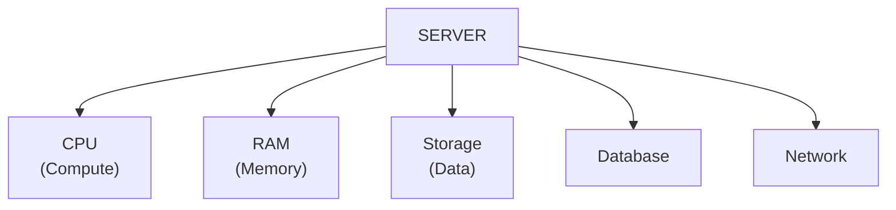

الـ Cloud بيديلك كل ده on-demand. مش لازم تشتري الحاجة دي كلها فيزيكياً.

---

### 🌍 أمثلة على Cloud Services اللي بتستخدمها كل يوم

فاكر لما بتفكر في "الـ Cloud" تفتكر حاجة تقنية معقدة؟

إنت بالفعل مستخدم الـ Cloud:

- **Gmail** → Cloud Email Service (بتدفع على الـ storage اللي بتستخدمه بس)
- **Dropbox** → Cloud Storage Service (متبني على AWS في الأصل!)
- **Netflix** → Video Streaming (متبني على AWS، بيخدم ملايين في نفس الوقت)
- **WhatsApp** → Messaging on Cloud Infrastructure

---

## 3. نماذج الـ Deployment

مش كل شركة بتستخدم الـ Cloud بنفس الطريقة. فيه **3 نماذج** مختلفة:

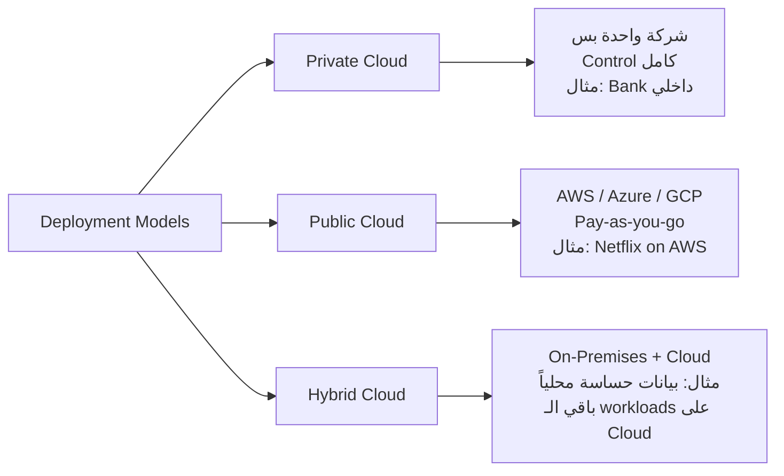

### Private Cloud 🔒
- بتستخدمها شركة واحدة بس
- مش متاحة للعامة
- بتديلك **Control كامل** والـ Security العالية
- مثال: بنك عايز يشغّل الأنظمة الداخلية بتاعته على infrastructure خاص

**الـ Trade-off:** تكلفة أعلى ومسؤولية كاملة عليك.

---

### Public Cloud ☁️
- مقدّم من third-party زي AWS أو Azure أو Google Cloud
- أي حد يدفع يقدر يستخدمها
- بتستفيد من الـ **Economies of Scale** — يعني AWS بتشتري hardware بمليارات الدولارات ودي بتخلي التكلفة عليك أرخص بكتير

**الـ Trade-off:** أقل control، بس أقل تكلفة وأسهل في الـ scaling.

---

### Hybrid Cloud 🔀
- بتفضل عندك جزء **On-Premises** (فيزيكي عندك) وجزء على الـ **Cloud**
- بتستخدمه لما عندك:
  - **Data حساسة** لازم تفضل عندك (مثلاً: بيانات عملاء محليين بسبب قوانين البلد)
  - **أنظمة قديمة (Legacy)** صعبة تتنقل للـ Cloud
  - بتحتاج **Flexibility** في الاثنين

**مثال حقيقي:** بنك كبير بيشغّل قاعدة البيانات بتاعته محلياً عشان compliance، بس بيستخدم AWS عشان الـ website والـ APIs.

---

## 4. خصائص الـ Cloud الخمسة

الـ NIST (National Institute of Standards and Technology) عرّف الـ Cloud Computing بـ **5 خصائص أساسية**. دول مهمين جداً للـ exam.

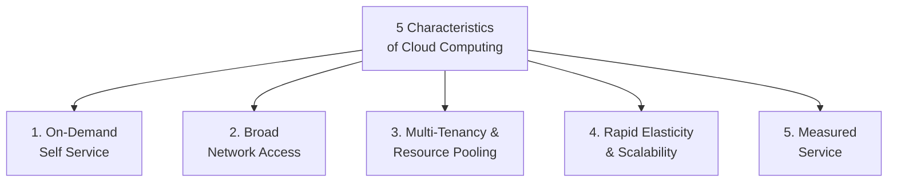

### 1️⃣ On-Demand Self Service
إنت بتـ provision الـ resources وبتشغّلها **من غير ما تتكلم مع حد** من الـ AWS team. بتدخل الـ Console أو بتستخدم الـ API وبتعمل server في دقيقتين.

### 2️⃣ Broad Network Access
الـ resources متاحة على الـ network وقادر توصلها من **أي device** — موبايل، لابتوب، تابلت. مش محتاج تكون في نفس المبنى.

### 3️⃣ Multi-Tenancy & Resource Pooling
**الصورة دي هتخليها واضحة:**

```
AWS Data Center فيه server واحد ضخم
         ↓
بيشتغل عليه: شركة A + شركة B + شركة C
         ↓
كل شركة شايفة بس resources بتاعتها
         ↓
نتيجة: تكلفة أقل على كل شركة
```

ده زي الـ apartment building — إنت ومئة حد تاني بتدفعوا إيجار في نفس العمارة، بس كل واحد عنده شقته الخاصة.

### 4️⃣ Rapid Elasticity & Scalability
**دي من أهم خصائص الـ Cloud.**

تخيّل إن موقعك بيتزاكر في Black Friday. الـ traffic بيزيد 10x.

في الـ Traditional IT: **بتوقع وبتخسر.**
في الـ Cloud: **الـ Auto Scaling بيضيف Servers تلقائياً في ثواني.**

وبعد الـ Black Friday لما الـ traffic رجع عادي: **الـ Servers الزيادة اتوقفت وقفنا الفاتورة.**

### 5️⃣ Measured Service
**Pay for what you use.** الاستخدام بيتقاس بدقة — بالساعة، بالـ GB، بالـ Request. مفيش تخمين.

---

## 5. مزايا الـ Cloud الستة

الـ AWS بتتكلم عن **6 Advantages of Cloud Computing** — دول اتكلم عنهم في الـ AWS Well-Architected Framework وبييجوا في الـ exam.

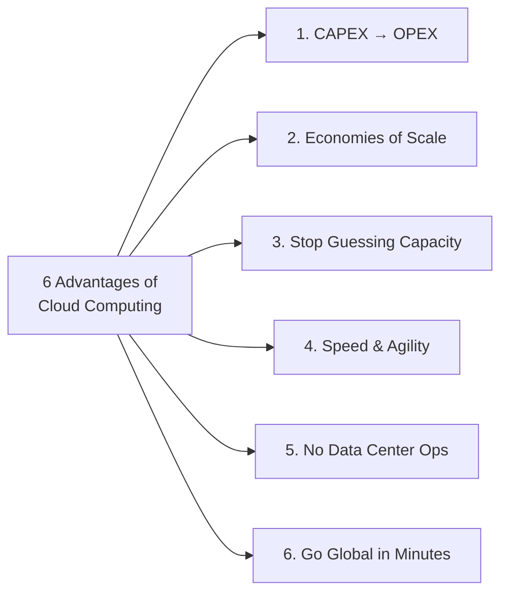

### 1️⃣ Trade CAPEX for OPEX
- **CAPEX (Capital Expenditure):** مصاريف رأسمالية — بتشتري hardware مقدمة
- **OPEX (Operational Expenditure):** مصاريف تشغيلية — بتدفع على الاستخدام بس

**التأثير:** شركة Startup مش محتاجة تدفع مليون جنيه في hardware قبل ما تثبت إن الـ business model شغّال.

### 2️⃣ Benefit from Massive Economies of Scale
AWS بتخدم ملايين العملاء في نفس الوقت → بتشتري hardware بأسعار منخفضة جداً → بتنقل جزء من الوفر ده عليك.

### 3️⃣ Stop Guessing Capacity
زمان: كنت بتشتري server يتحمل أعلى حمل متوقع → طول السنة الـ server شغّال بـ 20% من طاقته.
دلوقتي: بتبدأ بصغير وبتـ scale عند الحاجة بالظبط.

### 4️⃣ Increase Speed and Agility
بدل ما تستنى 3 أسابيع عشان الـ hardware يوصل ويتركّب، دلوقتي بتعمل server في **دقيقتين**.

### 5️⃣ Stop Spending Money on Running & Maintaining Data Centers
ركّز على الـ **business** اللي إنت شاطر فيه، مش على صيانة الـ hardware.

### 6️⃣ Go Global in Minutes
محتاج تـ deploy التطبيق في اليابان؟ بدل ما تفتح مكتب وتشتري servers هناك، بتختار **Tokyo Region** من الـ Console.

---

## 6. IaaS vs PaaS vs SaaS

دي أهم تقسيمة في الـ Cloud. وبتظهر في الـ exam بشكل منتظم.

الفكرة الأساسية: **مين مسؤول عن إيه؟**

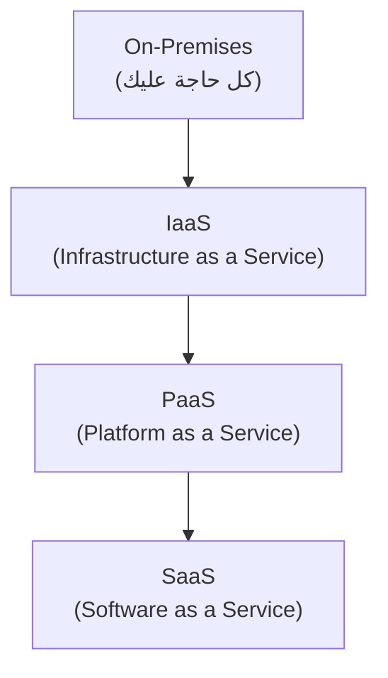

### 🏗️ الـ Stack الكامل

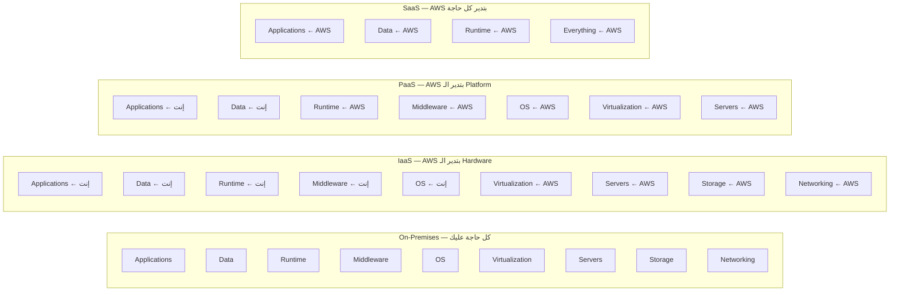

---

### IaaS — Infrastructure as a Service

**إنت بتأجر الـ Infrastructure الخام.**

AWS بتديلك: servers, networking, storage. إنت بتركّب فوقيهم كل حاجة تانية.

- **أعلى مستوى من الـ Flexibility** — زي ما بتشتري شقة بدون أثاث. إنت بتحط اللي إنت عايزه.
- **مثال على AWS:** Amazon EC2
- **أمثلة تانية:** GCP Compute Engine, Azure VMs, DigitalOcean, Linode

**مناسب لـ:** Developers عايزين control كامل على الـ environment بتاعتهم.

---

### PaaS — Platform as a Service

**إنت بس شغّال على الـ Application. AWS بتتكلف بالباقي.**

مش محتاج تفكر في OS, runtime, patching, networking. بس اكتب الكود وادفعه.

- **مثال على AWS:** AWS Elastic Beanstalk
- **أمثلة تانية:** Heroku, Google App Engine, Microsoft Azure App Service

**مناسب لـ:** Startups وDevelopers عايزين يركّزوا على الـ product مش على الـ infrastructure.

---

### SaaS — Software as a Service

**الـ software كامل جاهز. بس استخدمه.**

مش محتاج تعرف أي حاجة عن الـ infrastructure أو الـ platform.

- **أمثلة على AWS:** Amazon Rekognition (AI/ML service)
- **أمثلة تانية:** Gmail, Dropbox, Zoom, Salesforce

**مناسب لـ:** End users ومش developers بالضرورة.

---

### 📊 مقارنة سريعة

| | IaaS | PaaS | SaaS |
|---|---|---|---|
| **Control** | عالي | متوسط | منخفض |
| **Flexibility** | عالية | متوسطة | منخفضة |
| **Complexity** | عالية | متوسطة | منخفضة |
| **AWS Example** | EC2 | Elastic Beanstalk | Rekognition |
| **Non-AWS Example** | DigitalOcean | Heroku | Gmail |
| **مناسب لـ** | Full control setups | App-focused teams | End users |

---

## 7. تسعير AWS — المبدأ الجوهري

AWS بتـ charge على **3 محاور أساسية**:

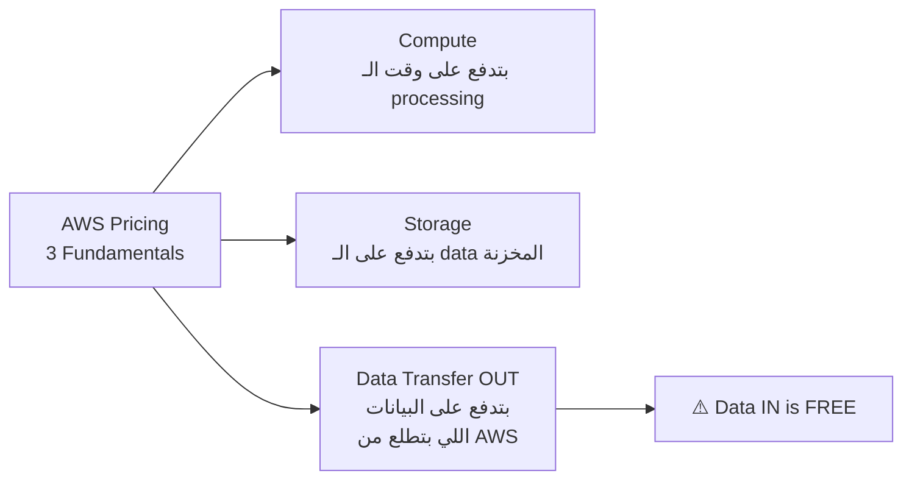

### 💡 النقطة الذهبية

> **Data transfer IN to AWS is always FREE.**
> **Data transfer OUT from AWS costs money.**

ده بيعني: لو رفعت ملف على S3 — مجاناً.
لو نزّلته — بتدفع.

الـ pricing model ده بيحل مشكلة الـ Traditional IT:
- **Traditional:** بتدفع حتى لو مش بتستخدم
- **AWS:** بتدفع بالظبط على اللي استخدمته

---

## 8. تاريخ AWS ومكانتها في السوق

### 📅 Timeline

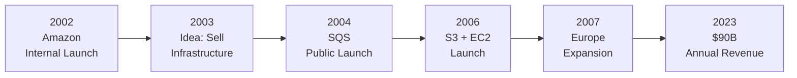

### 📊 الأرقام المهمة (للـ exam)
- **Revenue 2023:** $90 Billion
- **Market Share Q1 2024:** 31% (الأكبر)
- **Microsoft Azure:** 25% (الثاني)
- **Leader** في Gartner Magic Quadrant لـ 13 سنة متتالية
- **+1,000,000** active users

> **نصيحة الخبراء:** في الـ exam ممكن يسألك "which cloud provider has the largest market share" — الإجابة دايماً **AWS**.

---

### استخدامات AWS

AWS مش بس للـ websites. بتستخدمها في:
- Enterprise IT, Backup & Storage
- Big Data Analytics
- Website Hosting
- Mobile & Social Apps
- **Gaming** — حتى الـ games بتستخدمها

---

## 9. AWS Global Infrastructure

### 🗺️ التصوير الكبير

تخيّل معايا إن AWS عندها network من **Data Centers** منتشرة في كل أنحاء العالم. دول منظّمين على 3 مستويات:

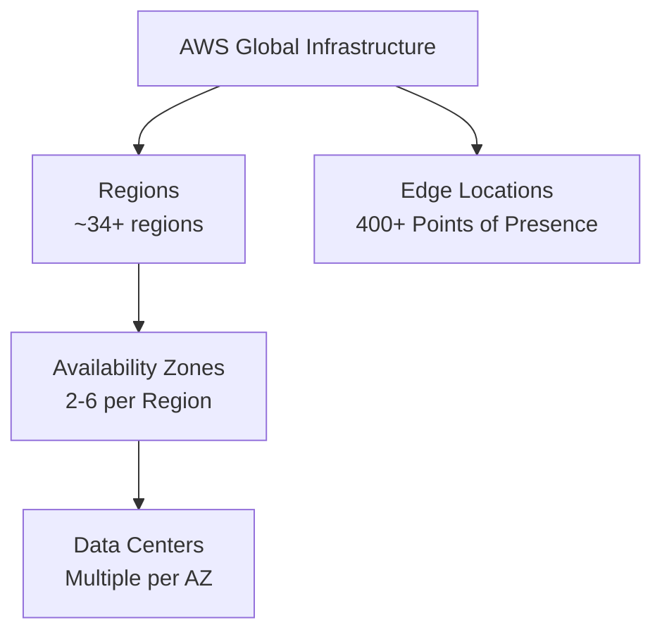

---

### 🌍 AWS Regions

**الـ Region هي cluster من الـ Data Centers في موقع جغرافي معين.**

- أسماء زي: `us-east-1`, `eu-west-3`, `ap-southeast-1`
- كل Region منفصلة عن التانية (**isolated**)
- **معظم الـ AWS services هي Region-scoped** — يعني لازم تختار Region وتشغّل فيها

#### 🤔 ازاي تختار Region؟

لو هتشغّل تطبيق جديد، فيه 4 عوامل بتختار على أساسها:

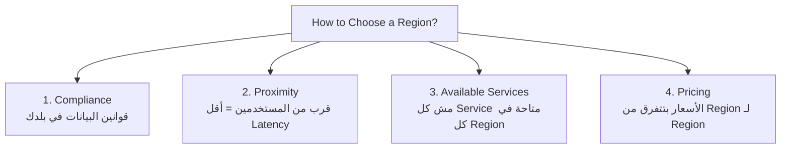

**مثال عملي:**
- لو بتعمل تطبيق للسوق المصري → اختار `me-south-1` (Bahrain) أو `eu-south-1` (Milan) عشان أقرب
- لو الـ compliance بيقول البيانات تفضل في أوروبا → اختار `eu-central-1`
- لو محتاج service معينة مش متاحة في كل مكان → شوف availability table

---

### 🏢 Availability Zones (AZs)

**كل Region فيها من 3 لـ 6 Availability Zones.**

الـ AZ هي **Data Center أو مجموعة Data Centers** في موقع جغرافي مختلف داخل نفس الـ Region.

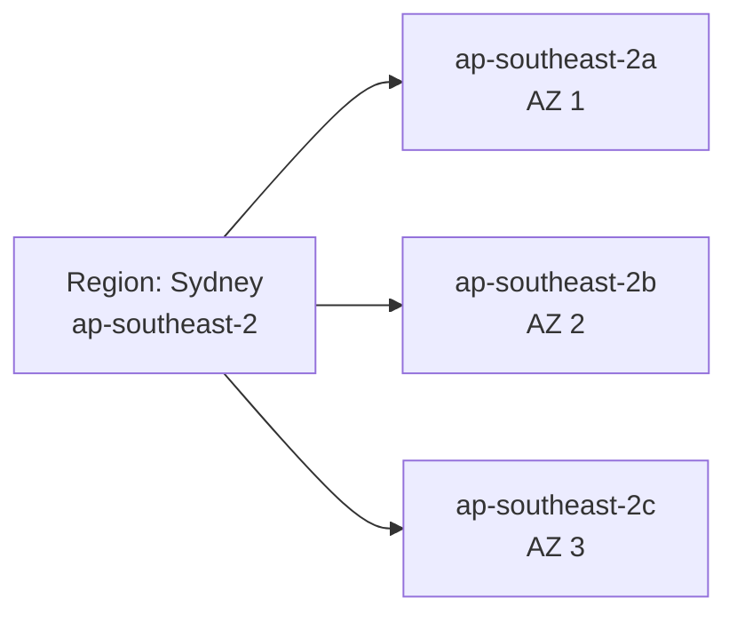

**ليه الـ AZs موجودة؟**

تخيّل لو Data Center واحدة فيها حريق. لو كل بياناتك فيها → **خلصت.**

الـ AZs بتديك **Fault Isolation** — لو AZ واحدة اتأثرت، التانية لسه شغّالة.

الـ AZs:
- **منفصلة جغرافياً** عن بعض (عشان كارثة واحدة متأثرشمهم كلهم)
- **متربطة ببعض** بـ High Bandwidth + Ultra-Low Latency networking
- بس **بعيدة بما يكفي** إن كارثة في واحدة متأثرش التانية

> **نصيحة الخبراء:** "Multi-AZ deployment" هو الأساس للـ High Availability في AWS. لما بتشغّل Production app، لازم تكون على أكثر من AZ.

---

### 📡 Edge Locations (Points of Presence)

**400+ Edge Location في 90+ مدينة في 40+ دولة.**

الـ Edge Locations مش بتـ run الـ compute عادةً. دورها الأساسي هو **Content Delivery** — تقريب المحتوى من المستخدمين.

```
المستخدم في القاهرة يطلب video من Netflix
              ↓
بدل ما الـ request يروح لـ Region في US
              ↓
الـ request بيروح لـ Edge Location أقرب (ممكن في القاهرة أو دبي)
              ↓
الـ video موجود في الـ Cache هناك
              ↓
المستخدم بياخده بـ Latency منخفض جداً ✅
```

**الـ Service الأساسية اللي بتستخدم Edge Locations:** Amazon CloudFront (CDN)

---

### 🌐 Global vs Regional Services

مش كل الـ AWS services بتشتغل على مستوى Region. فيه services **Global** — يعني مش محتاج تختار Region ليهم.

| النوع | الـ Services | الملاحظة |
|-------|-------------|----------|
| **Global** | IAM, Route 53, CloudFront, WAF | مش Region-specific |
| **Regional** | EC2, RDS, Lambda, S3, Rekognition | لازم تختار Region |

> ⚠️ **انتبه:** في الـ exam بييجي سؤال زي "which service is global?" — IAM و Route 53 هما الأكثر تكراراً.

---

## 10. The Shared Responsibility Model

ده من أهم المفاهيم في كل الـ AWS Exams.

**الفكرة البسيطة:**

> AWS مسؤولة عن **أمان الـ Cloud نفسه** (Security OF the Cloud).
> إنت مسؤول عن **أمان اللي إنت شغّاله جوه الـ Cloud** (Security IN the Cloud).

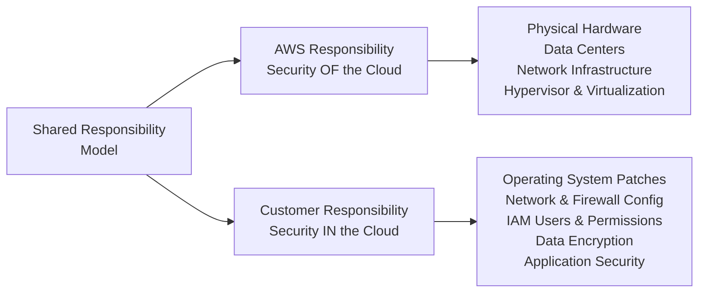

### 🔍 مثال عملي على EC2

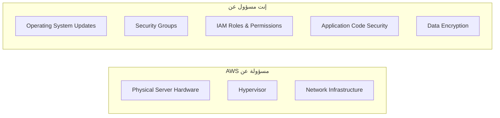

### طريقة سهلة للحفظ:

- **AWS = بتحمي السكينة نفسها** (the building, the walls, the infrastructure)
- **إنت = مسؤول عن اللي إنت شايله فيها** (your stuff inside)

زي لو إنت ساكن في شقة. شركة العمارة مسؤولة عن الحيطان والسكة والكهربا الرئيسية. إنت مسؤول عن قفل الشقة وأمان متاعك الشخصي.

---

### Shared Responsibility حسب نوع الـ Service

| نوع الـ Service | AWS مسؤولة عن | إنت مسؤول عن |
|-----------------|---------------|--------------|
| **IaaS (EC2)** | Hardware, Hypervisor | OS, Apps, Data, Networking |
| **PaaS (RDS)** | Hardware, OS, DB Engine | Data, User Management, Access |
| **SaaS (Rekognition)** | كل حاجة تقريباً | Data اللي بتبعته |

**القاعدة:** كلما فوقت من IaaS لـ SaaS، AWS بتاخد مسؤولية أكتر.

---

## 11. Exam Traps & Practice Questions

### 🚨 أهم الـ Exam Traps

**Trap 1: Private Cloud ≠ On-Premises دايماً**
بعض الناس بيفتكروا إن الـ Private Cloud هي نفس الـ On-Premises. مش صح. Private Cloud ممكن تكون على Cloud Provider بس مخصصة لك لوحدك (Dedicated).

**Trap 2: Hybrid Cloud مش بس AWS + On-Premises**
Hybrid Cloud يعني أي مزيج بين Cloud Environments، مش بالضرورة AWS.

**Trap 3: Data Transfer IN is FREE, OUT is NOT**
في الـ exam ممكن يسألك عن cost optimization وتتجاهل الـ data transfer costs.

**Trap 4: AZ = Data Center واحد؟ لأ!**
الـ AZ ممكن تكون **مجموعة Data Centers** — مش Data Center واحدة بالضرورة.

**Trap 5: IAM هو Global Service**
مش بيتبع Region — واحد من قلة الـ Global Services.

**Trap 6: Economies of Scale ≠ بس AWS بتوفّر**
الـ benefit ده بيتنقل للـ customer — AWS بتـ reduce أسعارها مع الوقت.

---

### 📝 Practice Questions

**Q1:** شركة عندها متطلبات compliance بتقول البيانات متغلقش من البلد. إيه نوع الـ Cloud deployment الأنسب ليها؟

- A) Public Cloud
- B) Private Cloud
- C) Hybrid Cloud
- D) Multi-Cloud

**الإجابة الصح: B**
**الشرح:** Private Cloud بيديهم Control كامل والـ data مش بتطلع. Hybrid Cloud ممكن تكون جواب لو عندهم جزء Public وجزء Private، بس هنا الـ requirement إن كل البيانات تفضل محلية.

---

**Q2:** إيه اللي يوصف بشكل صح مفهوم "Economies of Scale" في Cloud Computing؟

- A) الـ customer بيتحمل تكلفة Data Centers بالكامل
- B) AWS بتشتري hardware بأسعار منخفضة وبتوفّر الوفر ده للـ customers
- C) كل الـ customers بيستخدموا نفس الـ hardware بدون isolation
- D) الـ customer بيدفع مقدمة على capacity احتياطي

**الإجابة الصح: B**
**الشرح:** Economies of Scale = AWS بتشتري بكميات ضخمة → تكلفة أقل → بتـ pass الوفر ده للعملاء.

---

**Q3:** إنت Developer عايز تـ deploy تطبيق بدون ما تهتم بإدارة الـ servers أو الـ OS. إيه نوع الـ Cloud Service الأنسب؟

- A) IaaS
- B) PaaS
- C) SaaS
- D) On-Premises

**الإجابة الصح: B**
**الشرح:** PaaS بتخليك تركّز على الـ application بس. AWS Elastic Beanstalk مثال كلاسيكي.

---

**Q4:** أي من الخدمات دي هي Global (مش Region-scoped)؟

- A) Amazon EC2
- B) Amazon RDS
- C) AWS IAM
- D) AWS Lambda

**الإجابة الصح: C**
**الشرح:** IAM هو Global service. EC2, RDS, Lambda كلهم Regional.

---

**Q5:** شركة عايزة تـ deploy application في AWS وعايزة تحقق High Availability ضد failure في Data Center واحد. إيه الحل؟

- A) Deploy في Region واحدة بـ Single AZ
- B) Deploy في Multiple AZs في نفس الـ Region
- C) Deploy في Multiple Regions
- D) استخدام Edge Locations بس

**الإجابة الصح: B**
**الشرح:** لو AZ واحدة اتعطلت، التانية فاضلة شغّالة. دي الـ High Availability الأساسية. Multiple Regions هي Disaster Recovery — مستوى أعلى من الحماية.

---

**Q6:** إيه اللي هو مسؤولية الـ Customer في الـ Shared Responsibility Model لما بيستخدم Amazon EC2؟

- A) Physical Security for the Data Center
- B) Virtualization Infrastructure
- C) Patching the Operating System
- D) Maintaining the Network Hardware

**الإجابة الصح: C**
**الشرح:** إنت لما بتاخد EC2 instance، إنت مسؤول عن الـ OS بتاعته — patches, updates, configuration. الـ physical security والـ virtualization دي على AWS.

---

**Q7:** إيه المقصود بـ "Measured Service" في الـ Cloud Computing؟

- A) الـ Cloud provider بيقيس أداء الـ hardware
- B) الاستخدام بيتقاس والـ customers بيدفعوا على اللي استخدموه بالظبط
- C) الـ customers بيدفعوا رسوم شهرية ثابتة
- D) الـ Cloud provider بيقيس الـ network speed

**الإجابة الصح: B**
**الشرح:** Measured Service = pay-as-you-go — بتدفع على اللي بتستخدمه فعلاً.

---

## 12. Quick Revision

### 🧠 أهم النقط للحفظ السريع

**Cloud Computing:**
- On-demand delivery + Pay-as-you-go
- Solve Traditional IT problems: CAPEX, Scaling, Disasters, 24/7 ops

**Deployment Models:**
- Private: شركة واحدة، control كامل
- Public: AWS/Azure/GCP، للعامة
- Hybrid: مزيج من الاثنين

**5 Characteristics (NIST):**
1. On-Demand Self Service
2. Broad Network Access
3. Multi-Tenancy & Resource Pooling
4. Rapid Elasticity & Scalability
5. Measured Service

**6 Advantages:**
1. CAPEX → OPEX
2. Economies of Scale
3. Stop Guessing Capacity
4. Speed & Agility
5. No Data Center Operations
6. Go Global in Minutes

**Service Types:**
- IaaS = EC2 (Control كامل)
- PaaS = Elastic Beanstalk (Focus on App)
- SaaS = Rekognition, Gmail (Just use it)

**Pricing:**
- Compute + Storage + Data Transfer OUT
- Data Transfer IN = **FREE**

**Global Infrastructure:**
- Region → AZs (3-6) → Data Centers
- Edge Locations (400+) للـ CDN
- Global Services: IAM, Route 53, CloudFront, WAF
- Regional: EC2, RDS, Lambda, وغالبية الـ services

**AZ:** مش Data Center واحد — ممكن مجموعة. مشان الـ Fault Isolation.

**Shared Responsibility:**
- AWS = Security OF the Cloud (Hardware, Networking, DC)
- Customer = Security IN the Cloud (OS, IAM, Apps, Data)

---

> **📖 الجزء الثاني** → Route 53, CloudFront, Global Accelerator, AWS Outposts, Well-Architected Framework, AWS CAF, وAWS Ecosystem

---

*Notes generated from Stephane Maarek's CLF-C02 course slides — aligned with CLF-C02 exam objectives.*
