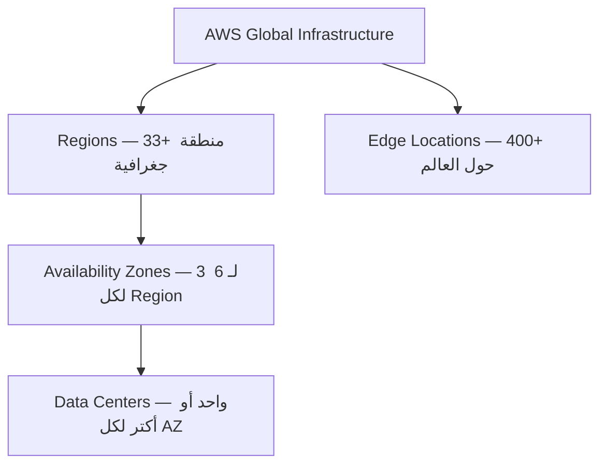

# ☁️ ما هو الـ Cloud Computing؟

### AWS Certified Cloud Practitioner — CLF-C02

---

## 🏚️ الحكاية بتبدأ من هنا — قبل الـ Cloud بزمان

تخيل معايا إنك في أوائل الـ 2000s وعندك فكرة لموقع إلكتروني. الفكرة جميلة، الـ Business Plan جاهز، بس عشان تشغّل الموقع ده، لازم تمر بكابوس اسمه **Traditional IT Infrastructure**.

وهتعدي على حبة خطوات زحمة زي انك : 
اول حاجه اصلا انك تشتري **Server** — جهاز فيزيائي ضخم بتكلفة عشرات الآلاف من الجنيهات أو الدولارات. 
بعدين لازم تلاقيله مكان — إما في بيتك في الأول، أو في أوضة في المكتب، أو لو الشركة كبرت تبني **Data Center** كامل. المبنى ده محتاج تبريد مستمر لأن الـ Servers بتولّد حرارة هايلة، ومحتاج كهرباء احتياطية لو انقطع التيار، ومحتاج حراسة وكاميرات وأنظمة حريق. كل ده قبل ما تكتب سطر كود واحد.

والأدهى من كده؟ إنك لازم **تخمن المستقبل** .. زي انك مثلا محتاج كام سيرفر؟!!
لو خمنت أقل من اللازم،.. يا عيني عليك لبست في الحيط و  يوم ما الموقع ينتشر وييجي عليه ضغط — هيقع. 
ولو خمنت أكتر من اللازم ، تبقى دفعت ملايين في أجهزة قاعدة مش بتشتغل. مع ذلك، لازم تدفع الإيجار والكهرباء والصيانة طول الوقت — حتى وإنت نايم وما فيش حد بيستخدم الموقع.
وفوق كل ده، لو اتحرق الـ Data Center أو انقطعت الكهرباء أو حصل زلزال — كل بياناتك وكل مواقعك وقعت. **Single Point of Failure** — نقطة ضعف واحدة بتودي كل حاجة في داهية ومعاها فلوسك وموقعك .
الناس كانت شايفة المشكلة دي وبتتساءل: **"ممكن نعمل إيه؟"**

---

## ☁️ الـ Cloud — لما شخص ذكي سأل "ليه لأ؟"

في 2002، داخل شركة **Amazon** نفسها، كانت في مشكلة مشابهة. فرق الـ Engineering المختلفة كل واحدة بتبني الـ Infrastructure بتاعتها من الصفر. Jeff Bezos وفريقه لاحظوا إن الـ Infrastructure دي هي في حد ذاتها "Core Competency" — يعني حاجة يمكن يبنوها كويس ويبيعوها للناس التانية.

في **2006**، أطلقوا للعالم ثلاث خدمات غيّرت وجه التقنية: **S3** للتخزين، **EC2** للسيرفرات، و**SQS** للـ Messaging. وكان ده الـ Launch الحقيقي لـ **Amazon Web Services (AWS)**.

التعريف الرسمي اللي لازم تحفظه:

> **Cloud Computing هو الـ On-Demand Delivery لـ Compute Power، Database Storage، Applications، وغيرها من الـ IT Resources — عبر Platform بنموذج Pay-as-you-go.**

كل كلمة في التعريف ده بتيجي في الـ Exam. 
**On-Demand** يعني متاح فوراً عند الطلب من غير ما تكلم حد أو تستنى. **Pay-as-you-go** يعني بتدفع بس على اللي استخدمته — زي فاتورة الكهرباء بالظبط. و**AWS owns and maintains the hardware** يعني هي اللي بتدير الأجهزة الفيزيائية، إنت مش شايفها ومش متعب نفسك بيها.

الـ Cloud زي الكهرباء. لما بتشغّل التلاجة في بيتك، مش بتفكر في المحطة اللي بتولّد الكهرباء ولا في الكابلات اللي تحت الأرض. بتضغط الزرار، بياخد الكهرباء، وبتدفع في آخر الشهر على قد ما استهلكت. **AWS هي المحطة — إنت بس بتوصل وبتستخدم.**

دلوقتي AWS بقت شركة بـ Revenue سنوي تجاوز الـ **90 Billion دولار في 2023**، بـ Market Share بيتجاوز **31%** — أكبر Cloud Provider في العالم بفارق كبير قدام Microsoft Azure اللي عندها 25%.

---

## 🏗️ مش كل Cloud زي بعض — نماذج النشر الثلاث

لما بتقرر تنقل لـ Cloud، عندك ثلاث طرق للتعامل مع الموضوع، وكل طريقة بتناسب حالة مختلفة.

**الأولى هي الـ Public Cloud** —
وده هو AWS وAzure وGoogle Cloud. الـ Infrastructure مش بتاعتك، بتاعة الـ Provider. 
إنت بتستأجر منه Resources وبتدفع على ما بتستخدم. متاح لأي حد على الإنترنت، وبتستفيد من كل مزايا الـ Cloud الكاملة.

**التانية هي الـ Private Cloud** — تخيل إنك بتبني نظام Cloud لكن بتاعك إنت لوحدك. مش بتشارك الـ Infrastructure مع حد تاني. بتاخد بعض مرونة الـ Cloud لكن بتتحمل كل التكاليف لوحدك. بتلاقيه في البنوك الكبيرة أو الحكومات اللي عندها بيانات حساسة جداً مش تقدر تحطها على الـ Public Cloud بسبب قوانين محلية.

**التالتة — والأكتر انتشاراً في الشركات الكبيرة — هي الـ Hybrid Cloud.** شركة زي بنك مصري ممكن تحتفظ بـ Core Banking System عندها On-Premises لأسباب تنظيمية وأمنية، وفي نفس الوقت تستخدم AWS للـ Website والـ Mobile App وأي حاجة مش حساسة. بتاخد أحسن ما في الاتنين — التحكم الكامل في البيانات الحساسة، والمرونة والتوفير في الباقي.

---

## ⭐ الخصائص الـ 5 للـ Cloud — اللي بيفرقه عن أي حاجة تانية

الـ NIST حددت خمس خصائص أساسية لأي Cloud حقيقي. دول مش تعريف أكاديمي — هم اللي بيشرحوا ليه الـ Cloud مختلف جوهرياً.

أول خاصية هي **On-Demand Self-Service** — إنت تقدر تشغّل Server أو تحجز Storage أو تعمل Database من غير ما تتكلم مع أي حد في AWS. كل حاجة Self-Service عبر الـ Console أو الـ CLI. مقارنةً بالتقليدي اللي كان محتاج أسابيع انتظار.

التانية هي **Broad Network Access** — الـ Resources متاحة من أي جهاز وأي مكان. موبايلك، لابتوبك، تابلتك — طالما عندك إنترنت.

التالتة — وهي اللي بتخلي AWS تقدر تكون رخيصة — هي **Multi-Tenancy والـ Resource Pooling**. إنت وألف شركة تانية ممكن تكونوا كلكم على نفس الـ Physical Server في Data Center بتاعة AWS — لكن كل واحد **معزول تماماً** عن التاني عبر الـ Virtualization. ده بيخلي AWS تقدر توزع تكلفة الـ Hardware الضخم على ملايين العملاء، وتوصللك بسعر ما تقدرش تحققه لو اشتريت Infrastructure لوحدك.

> [!abstract]+ ما هو الـ Virtualization وليه بيخلي الـ Cloud رخيصاً؟
>
> زمان، كان السيرفر "صندوق حديد" واحد بينزل عليه نظام تشغيل واحد، وخلاص. لو السيرفر ده قوي جداً وإنت شغال عليه موقع صغير — بترمي 90% من قوته في الأرض.
>
> الـ **Virtualization** جت وحطت طبقة Software ذكية اسمها الـ **Hypervisor** فوق الـ Hardware مباشرة. الـ Hypervisor ده وظيفته إنه ياخد الـ 64 جيجا رام الفيزيائية ويقسمهم: 4 جيجا لخالد، 8 جيجا لشركة X، 2 جيجا لتطبيق Y. كل واحد بياخد "سيرفر وهمي" اسمه **Virtual Machine**، وفي لغة AWS اسمه **EC2 Instance**. الـ Instance مش عارفة إنها عايشة مع جيران — فاكرة إن الـ Hardware كله بتاعها.
>
> تخيل عمارة كبيرة. لو أجّرتها كلها لوحدك — بتدفع تمن العمارة كلها. لو حوّلناها لشقق — كل واحد بيدفع على شقته بس، والتكاليف المشتركة زي الأمن والكهرباء الرئيسية بتتقسم على الكل. ده بالظبط هو الـ **Economies of Scale** — كل ما عدد العملاء زاد، التكلفة على الفرد بتقل جداً.
>
> **الـ Isolation** يعني لو VM لعميل حصل فيها Crash، الباقي ملهاش دعوة. **الـ Agility** يعني بدل ما تستنى أسابيع لسيرفر حديد يوصل، الـ Hypervisor بيعمل Instance في أقل من دقيقة.

الرابعة هي **Rapid Elasticity** — الـ Resources بتكبر وبتصغر تلقائياً حسب الـ Demand. موقعك في Black Friday بياخد 10 أضعاف الـ Traffic المعتاد؟ الـ Cloud بيضيف Servers تلقائياً في ثواني وبيشيلهم لما الـ Traffic يرجع. بتدفع بس على وقت الضغط.

الخامسة هي **Measured Service** — كل حاجة بتتقاس بالتفصيل. كام ثانية شغّلت السيرفر، كام GB خزنت، كام Data اتنقل. وبتدفع على قد ما بالظبط.

---

## 🚀 المزايا الـ 6 — ليه الشركات بتهاجر للـ Cloud؟

الأولى هي **التحول من CAPEX لـ OPEX**. الـ **CAPEX (Capital Expenditure)** يعني بتدفع فلوس ضخمة مقدمة على Hardware قبل ما تعرف هل الـ Business هينجح ولا لأ. الـ **OPEX (Operational Expenditure)** يعني بتدفع على الاستخدام الفعلي بس. Startup مصرية دلوقتي تقدر تبدأ بمئات الجنيهات في الشهر بدل ملايين مقدمة.

التانية هي **الـ Economies of Scale** — AWS بتشتري Hardware بأسعار منخفضة جداً لأنها بتشتري بالملايين، وبتوصلك بسعر ما تقدرش تحققه لو اشتريت لوحدك.

التالتة هي **وقف التخمين في الـ Capacity** — بدل ما تشتري سيرفر يتحمل أعلى حمل متوقع وهو شغال بـ 20% من طاقته طول السنة، دلوقتي بتبدأ بصغير وبتـ Scale عند الحاجة بالظبط.

الرابعة هي **الـ Agility والسرعة** — Startup مصرية تقدر دلوقتي تبدأ في ساعات وتوصل للـ Production في يوم، بدل ما تستنى أشهر لـ Hardware يوصل ويتركّب.

الخامسة هي **إنك بتوقف تصرف على Data Centers** — مش بتدفع فلوس في إيجار وكهرباء وتبريد وصيانة. كل الموارد دي بتوجهها لتطوير المنتج بتاعك.

السادسة هي الأقوى على الإطلاق من ناحية Business: **Go Global in Minutes**. قبل الـ Cloud، لو شركة مصرية عايزة تخدم عملاء في أمريكا وأوروبا وآسيا — كانت محتاجة Data Centers في كل حتة بملايين الدولارات. دلوقتي بضغطة في AWS Console، بتشغّل Resources في أي Region في العالم في دقايق.

---

## 🧩 IaaS وPaaS وSaaS — مش كل خدمة زي بعض

تخيل الـ IT Stack كعمارة من تسع طوابق: من تحت للفوق — Networking، Storage، Servers، Virtualization، OS، Middleware، Runtime، Data، Applications. في الـ On-Premises التقليدي — إنت مسؤول عن الـ 9 طوابق كلهم.

في **IaaS (Infrastructure as a Service)** — المثال الأبرز هو **Amazon EC2** — AWS بتدير الطوابق التحتانية الأربعة، وإنت مسؤول عن الـ 5 الفوقانية. يعني إنت بتختار الـ OS وبتركّب الـ Software وبتدير الـ Security. أعلى مستوى من الـ Flexibility ومعاه أعلى مستوى من المسؤولية.

في **PaaS (Platform as a Service)** — المثال هو **AWS Elastic Beanstalk** — AWS بتدير 7 طوابق من الـ 9، وإنت مسؤول بس عن الـ Data والـ Application اللي بتكتبها. بتحط الـ Code وElastic Beanstalk بيدير كل حاجة تانية تلقائياً.

في **SaaS (Software as a Service)** — المثال هو **Gmail** أو **AWS Rekognition** — الـ Provider مسؤول عن كل الـ 9 طوابق. إنت بس بتستخدم الـ Software جاهز من غير ما تفكر في أي حاجة تقنية.

الـ Trade-off واضح: كل ما روحت من IaaS لـ SaaS، قلّت مسؤوليتك وقلّت كمان مرونتك في التخصيص.

---

## 💰 التسعير — ثلاث فواتير بس

الـ Pricing Model على AWS قائم على ثلاث أسس فقط.

**الأول هو الـ Compute** — بتدفع على وقت تشغيل الـ Server. السيرفر شغّال؟ بتدفع. وقّفته؟ الدفع بيوقف.
**التاني هو الـ Storage** — بتدفع على حجم الـ Data اللي بتخزنه.
**التالت — وده الـ Trap الكلاسيكي في الـ Exam — هو Data Transfer.** 
البيانات اللي بتيجي لـ AWS (Transfer IN) = **مجاناً تماماً.** 
البيانات اللي بتخرج من AWS (Transfer OUT) = بتدفع عليها. 
AWS بتشجعك تحط بياناتك عندها بإنها مجانية عند الدخول — بس لما تيجي تنقلها بره، هناك بتدفع.

---

## 🌍 البنية العالمية — إزاي AWS موجودة في كل حتة

عشان تقدم خدمة عالمية موثوقة، AWS بنت infrastructure ضخمة متوزعة على العالم كله، مكوّنة من ثلاث طبقات متداخلة.

الطبقة الأولى هي **Regions** — مناطق جغرافية كبيرة في العالم، كل واحدة بكود مميز زي `us-east-1` لـ Virginia أو `me-south-1` لـ Bahrain — وده الأقرب للشرق الأوسط ومصر. معظم الـ AWS Services بتشتغل في حدود الـ Region اللي بتختارها، وكل Region منفصلة تماماً عن التانية.

جوا كل Region فيه **Availability Zones (AZs)** — كل Region فيها على الأقل 3 AZs وبالكثير 6. كل AZ هي Data Center أو أكتر، مفصولة جسمانياً عن التانية بكيلومترات، بكهرباء مستقلة وشبكة مستقلة. الفكرة هي إنك لو اتبنيت على أكتر من AZ — لو واحدة وقعت بسبب حريق أو كارثة طبيعية، التانية بتكمل الشغل من غير ما حد يحس بحاجة. ده بيوديك لـ **High Availability**.

الطبقة التالتة هي **Edge Locations** — وفيه أكتر من 400 منها في 90+ مدينة حول العالم. مش فيها Servers ضخمة زي الـ Regions، بس فيها **Cache** للمحتوى. الـ Service الأساسية اللي بتستخدم الـ Edge Locations هي **Amazon CloudFront** — الـ CDN بتاع AWS. لو موقعك في `us-east-1` وعندك مستخدمين في مصر، بدل ما كل Request يروح أمريكا ويرجع، CloudFront بيخزن نسخة من المحتوى في أقرب Edge Location لمصر، والمستخدم بياخد الصفحة بسرعة.

**إزاي تختار الـ Region المناسب؟** فيه أربع عوامل بالترتيب: الأهم دايماً هو **Compliance** — لو البيانات لازم تفضل في بلد معين بسبب قوانين محلية، مفيش كلام. بعده **Proximity** — كلما الـ Region أقرب لعملائك، كلما الـ Latency أقل. بعده **Available Services** — مش كل الـ Services متاحة في كل الـ Regions، الجديدة بتيجي في `us-east-1` الأول. وأخيراً **Pricing** — الأسعار بتختلف بين الـ Regions.

مش كل الـ Services بتشتغل على مستوى Region. **IAM وRoute 53 وCloudFront وWAF** هم **Global Services** — مش محتاج تختار Region ليهم. **EC2 وRDS وLambda** وغالبية الـ Services هم **Regional**.

---

## 🤝 الـ Shared Responsibility Model — مين مسؤول عن إيه؟

ده واحد من أهم الـ Concepts في الـ Exam كله. الجملتان اللي لازم تحفظهم:

> **AWS مسؤولة عن Security OF the Cloud.** **إنت (Customer) مسؤول عن Security IN the Cloud.**

AWS مسؤولة عن كل الـ Physical Infrastructure — المباني، الأجهزة، الشبكات الفيزيائية، الـ Hypervisor، والـ Managed Services اللي هي بتديرها. إنت مسؤول عن البيانات بتاعتك وتشفيرها، الـ OS على الـ EC2 وتحديثاته، الـ Network Configuration زي الـ Security Groups، الـ IAM وصلاحيات المستخدمين، والـ Application Code بتاعك.

التشبيه البسيط: صاحب العمارة (AWS) مسؤول عن الأساسات والمصعد والحراسة. إنت الساكن (Customer) مسؤول عن قفل بابك، نضافة شقتك، ومين بتدخله.

القاعدة العامة: كل ما اتحركت من IaaS لـ SaaS، AWS بتتحمل مسؤولية أكتر. على EC2 (IaaS) إنت مسؤول عن الـ OS. على RDS (PaaS) AWS بتدير الـ DB Engine وإنت مسؤول عن الـ Data فقط. على Rekognition (SaaS) AWS مسؤولة عن كل حاجة تقريباً وإنت مسؤول بس عن الـ Data اللي بتبعته.

---

## 🎯 فخاخ الـ Exam

**الـ Trap الأول — Data Transfer:** "كام تكلفة رفع بيانات لـ AWS؟" — الإجابة: صفر. مجاناً. اللي بيكلف هو الـ Transfer OUT فقط.

**الـ Trap التاني — Shared Responsibility:** "مين مسؤول عن تحديث الـ OS على EC2؟" — إنت، مش AWS. هي بتدير الـ Hardware فقط.

**الـ Trap التالت — Global vs Regional:** "IAM هو Global أم Regional؟" — Global. كمان Route 53 وCloudFront وWAF = Global. EC2 وS3 وRDS = Regional.

**الـ Trap الرابع — Elasticity vs Scalability:** Scalability = تقدر تكبر. Elasticity = بتكبر وبتصغر **تلقائياً** حسب الـ Demand.

**الـ Trap الخامس — Region Selection:** لو السؤال قال "data must remain within the country" — الإجابة دايماً **Compliance** كأول عامل.

**الـ Trap السادس — AZ:** الـ AZ مش Data Center واحدة بالضرورة — ممكن مجموعة. واللي بيحقق الـ High Availability هو الـ Multi-AZ، مش الـ Multi-Region اللي ده Disaster Recovery.

---

## 📝 أسئلة الـ Exam

### Q1. Which of the following BEST defines Cloud Computing according to AWS?

- A. Owning physical servers in a remote location managed by a third party
- B. On-demand delivery of IT resources with pay-as-you-go pricing
- C. Renting a fixed amount of server capacity on a monthly subscription
- D. Using open-source software hosted on shared community servers

> [!success]- ✅ Reveal Answer & Explanation
> **Correct Answer: B**
>
> ده التعريف الحرفي اللي AWS بتستخدمه. الكلمات المفتاحية هي "On-Demand" و"Pay-as-you-go". A غلط لأن في الـ Cloud إنت مش بتمتلك حاجة فيزيائية. C غلط لأن الـ Cloud مش Fixed capacity ومش Monthly subscription ثابتة. D غلط تماماً ومفيش علاقة بالـ Cloud definition.

---

### Q2. A startup needs to launch a web application immediately without upfront hardware costs. Which Cloud deployment model is MOST appropriate?

- A. Private Cloud
- B. Hybrid Cloud
- C. On-Premises
- D. Public Cloud

> [!success]- ✅ Reveal Answer & Explanation
> **Correct Answer: D**
>
> الـ Public Cloud هو اللي بيدي الـ Pay-as-you-go من غير أي CAPEX مقدم. الـ Private Cloud بيتكلف فلوس في الـ Setup وبتتحمل كل التكاليف لوحدك. الـ Hybrid بيتطلب جزء On-Premises. الـ On-Premises هو التقليدي نفسه اللي عايزين نهرب منه.

---

### Q3. A company is required by law to keep all customer data within Egypt. Which factor should PRIMARILY drive their AWS Region selection?

- A. Pricing
- B. Available Services
- C. Compliance
- D. Proximity to users

> [!success]- ✅ Reveal Answer & Explanation
> **Correct Answer: C**
>
> لما في قانون أو regulatory requirement يخص مكان البيانات — ده **دايماً** بيكون Compliance وده الأهم قبل أي عامل تاني. حتى لو الـ Region التانية أرخص أو أقرب أو فيها services أكتر — الـ Compliance بيـ Override كل حاجة.

---

### Q4. Which AWS services are GLOBAL and NOT tied to a specific Region? (Select TWO)

- A. Amazon EC2
- B. AWS IAM
- C. Amazon RDS
- D. Amazon Route 53
- E. AWS Lambda

> [!success]- ✅ Reveal Answer & Explanation
> **Correct Answers: B and D**
>
> **IAM** و**Route 53** هم Global Services — لما بتعمل IAM User أو Route 53 Record، بيكون متاح في كل الـ Regions تلقائياً. CloudFront وWAF كمان Global. كل الباقيين — EC2 وRDS وLambda — هم Regional، يعني بتحتاج تحددهم في Region معين وبيفضلوا فيه.

---

### Q5. According to the AWS Shared Responsibility Model, who is responsible for patching the operating system on an Amazon EC2 instance?

- A. AWS — because it manages all infrastructure
- B. The customer — because EC2 is IaaS and the OS is the customer's responsibility
- C. Both AWS and the customer share this responsibility equally
- D. A third-party managed service provider selected by AWS

> [!success]- ✅ Reveal Answer & Explanation
> **Correct Answer: B**
>
> EC2 هو IaaS. AWS بتدير الـ Physical Hardware، الـ Hypervisor، والـ Networking الفيزيائي. إنت لما بتاخد EC2 Instance، إنت مسؤول عن الـ OS اللي جوه — تحديثاته، الـ Patches، الـ Security Configuration. لو استخدمت RDS (PaaS) بدل كده، AWS بتدير الـ DB Engine وبتعمل الـ Patching — ده الفرق الجوهري بين IaaS وPaaS.

---

### Q6. What is the correct definition of "Elasticity" in Cloud Computing?

- A. The ability to manually add more servers when traffic increases
- B. The ability to automatically scale resources up and down based on demand
- C. The ability to store unlimited data in the cloud
- D. The ability to deploy applications in multiple regions simultaneously

> [!success]- ✅ Reveal Answer & Explanation
> **Correct Answer: B**
>
> **Elasticity** = تلقائي. الكلمة المفتاحية هي "automatically". بتختلف عن **Scalability** اللي معناها القدرة على الـ Scale (سواء يدوي أو تلقائي). لو السؤال قال "automatically scales" — فكّر Elasticity فوراً.

---

### Q7. A company wants to deploy a new service but must ensure that if one Data Center fails, the service remains available. What is the recommended approach in AWS?

- A. Deploy in a single Region with one AZ
- B. Deploy across multiple AZs within the same Region
- C. Deploy across multiple AWS Regions
- D. Use Edge Locations as backup compute

> [!success]- ✅ Reveal Answer & Explanation
> **Correct Answer: B**
>
> الـ Multi-AZ هو الـ Standard approach لـ High Availability. لو AZ واحدة وقعت، التانية بتكمل. الـ Multi-Region هو مستوى أعلى — ده Disaster Recovery مش High Availability. الـ Edge Locations مش فيها Compute للـ Application، هي للـ CDN بس.

---

## 📊 ملخص نهائي — الـ Cheat Sheet

| السؤال | الإجابة |
|--------|---------|
| تعريف Cloud Computing | On-demand delivery + Pay-as-you-go |
| أول 3 AWS Services (2006) | S3 + EC2 + SQS |
| AWS Market Share | 31% — الأكبر في العالم |
| EC2 = نوع الخدمة | IaaS |
| Elastic Beanstalk = نوع الخدمة | PaaS |
| Gmail / Rekognition = نوع الخدمة | SaaS |
| Global Services | IAM, Route 53, CloudFront, WAF |
| Data Transfer IN | مجاناً (FREE) |
| Data Transfer OUT | بيكلف |
| الـ AZs per Region | Min 3 — Max 6 |
| أهم عامل في اختيار الـ Region | Compliance |
| مسؤولية الـ OS على EC2 | Customer (أنت) |
| مسؤولية الـ Physical Hardware | AWS |
| Elasticity vs Scalability | Elasticity = تلقائي / Scalability = قدرة |
| Hybrid Cloud = لما | بيانات حساسة On-Prem + Cloud للباقي |
| CAPEX | مصاريف مقدمة على Hardware |
| OPEX | مصاريف على الاستخدام الفعلي |
| High Availability | Multi-AZ |
| Disaster Recovery | Multi-Region |

---

*القسم الجاي: **AWS Global Applications** — Route 53، CloudFront، Global Accelerator، Outposts، والـ Well-Architected Framework.*
