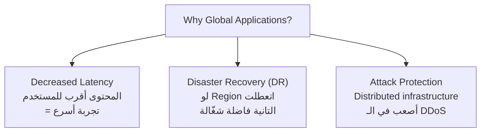
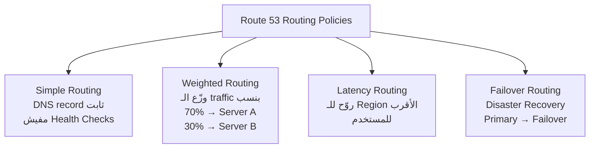
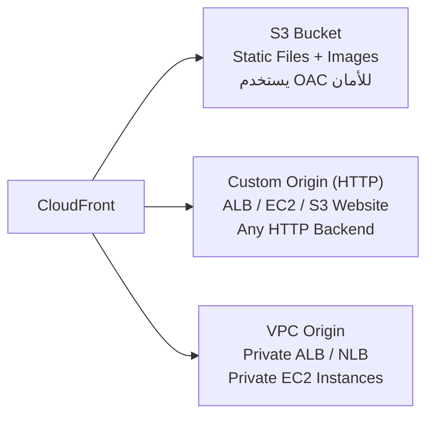
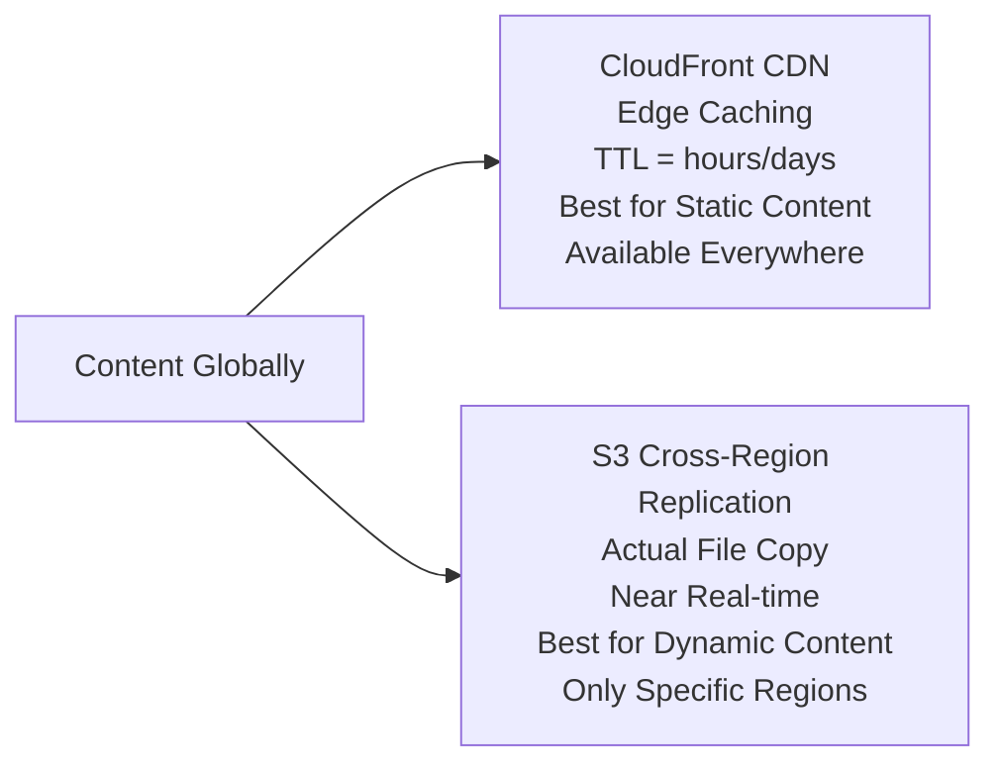
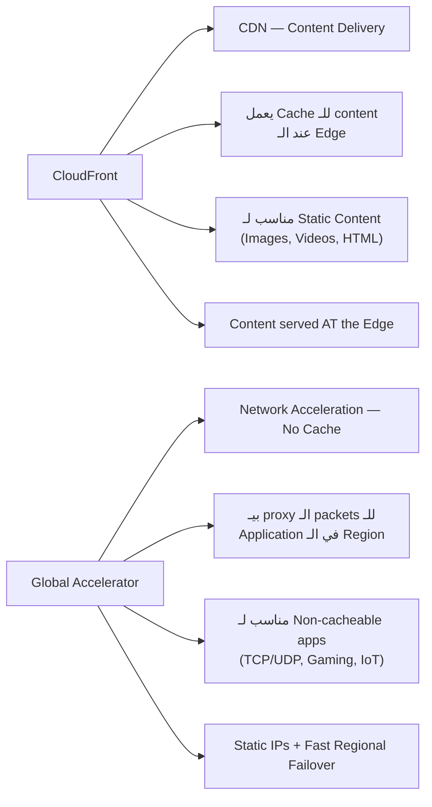
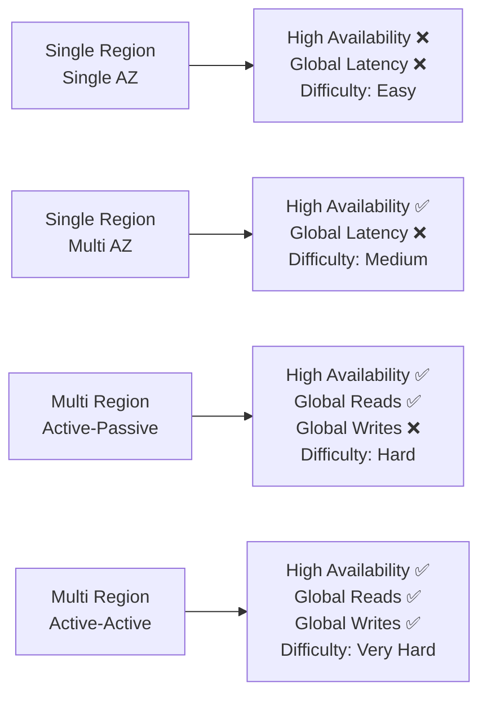
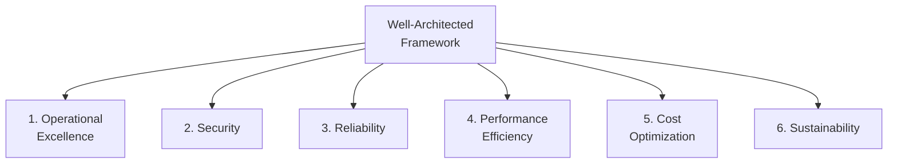
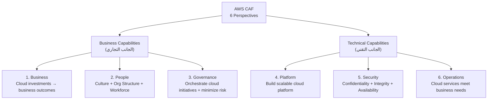
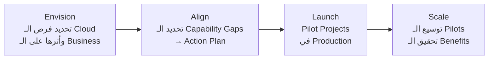
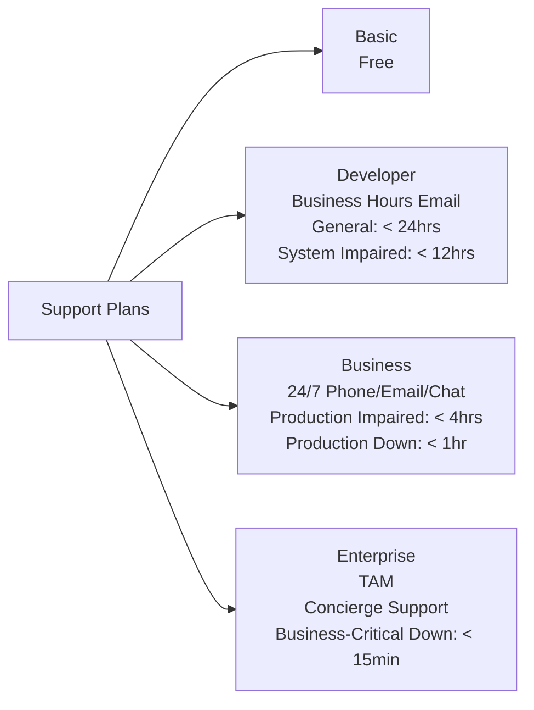

# Domain 1 — Cloud Concepts (Part 2 of 2)
## Global Applications + Well-Architected Framework + AWS Ecosystem

> **مستوى:** AWS Certified Cloud Practitioner (CLF-C02)
> **المصدر:** Stephane Maarek CLF-C02 Course
> **اللغة:** عربي مصري + English Technical Terms

---

## 📑 Table of Contents

1. [ليه نعمل Global Application؟](#1-ليه-نعمل-global-application)
2. [Route 53 — الـ DNS الذكي](#2-route-53--الـ-dns-الذكي)
3. [Amazon CloudFront — الـ CDN العالمي](#3-amazon-cloudfront--الـ-cdn-العالمي)
4. [S3 Transfer Acceleration](#4-s3-transfer-acceleration)
5. [AWS Global Accelerator](#5-aws-global-accelerator)
6. [CloudFront vs Global Accelerator](#6-cloudfront-vs-global-accelerator)
7. [AWS Outposts — الـ Cloud في Data Center بتاعك](#7-aws-outposts--الـ-cloud-في-data-center-بتاعك)
8. [AWS WaveLength و Local Zones](#8-aws-wavelength-و-local-zones)
9. [Global Application Architectures](#9-global-application-architectures)
10. [Well-Architected Framework — الـ 6 Pillars](#10-well-architected-framework--الـ-6-pillars)
11. [AWS Cloud Adoption Framework (CAF)](#11-aws-cloud-adoption-framework-caf)
12. [AWS Right Sizing](#12-aws-right-sizing)
13. [AWS Ecosystem — الـ Support والـ Community](#13-aws-ecosystem--الـ-support-والـ-community)
14. [Exam Traps & Practice Questions](#14-exam-traps--practice-questions)
15. [Quick Revision](#15-quick-revision)

---

## 1. ليه نعمل Global Application؟

تخيّل معايا إن عندك موقع بيخدم مستخدمين في مصر بس. كل حاجة شغّالة تمام.

بعدين قررت تتوسع وتاخد مستخدمين في اليابان.

المستخدم الياباني بيكتب `myapp.com`… وبيستنى 3 ثواني عشان الصفحة تفتح. ليه؟

لأن الـ server بتاعك في `us-east-1` — **الـ network packet بتاخد رحلة طويلة** من اليابان لأمريكا وراجع.

ده اللي بيسموه **Latency** — الوقت اللي الـ network packet بياخده عشان يوصل.

الحل: **Global Application** — تطبيق بيشتغل في أكتر من مكان جغرافي.

### ليه Global Applications مهمة؟



---

## 2. Route 53 — الـ DNS الذكي

### الـ DNS ده إيه أصلاً؟

تخيّل معايا إنك بتكلم حد على التليفون. محتاج رقمه. مش محتاج تحفظ الرقم نفسه — بتحفظ اسمه في الـ Contacts وتليفونك بيحوّله لرقم.

الـ **DNS (Domain Name System)** بيعمل بالظبط نفس الحاجة للإنترنت:
```
www.google.com  →  DNS  →  142.250.185.78
```

الاسم بيترجم لـ IP Address، وبكده الـ browser يعرف يوصل للـ server.

### Route 53 هو الـ Managed DNS Service بتاع AWS.

اسمه جاي من **port 53** — الـ port المعروف للـ DNS protocol.

### أنواع الـ DNS Records اللي محتاج تعرفها:

| Record Type | معناه | مثال |
|------------|-------|------|
| **A** | Domain → IPv4 | `google.com → 142.250.185.78` |
| **AAAA** | Domain → IPv6 | `google.com → 2001:0db8:...` |
| **CNAME** | Hostname → Hostname | `search.google.com → www.google.com` |
| **Alias** | Domain → AWS Resource | `myapp.com → my-alb.us-east-1.elb.amazonaws.com` |

> **نصيحة الخبراء:** في الـ exam، الـ **Alias record** مهم لأنه بيربط Domain بـ AWS Resources زي Load Balancer وCloudFront وS3.

---

### Route 53 Routing Policies

Route 53 مش بس بيحوّل الاسم لـ IP. ده بيعمل **Routing ذكي** بناءً على منطق معين.



**الاستخدامات الحقيقية:**
- **Weighted:** لو بتعمل A/B Testing — 90% على الـ version الجديدة، 10% تجربة
- **Latency:** مستخدمين في آسيا يروحوا لـ Tokyo Region، في أوروبا يروحوا لـ London Region
- **Failover:** لو الـ Primary server اتعطل، Route 53 تلقائياً بيـ redirect على الـ Backup

> **للـ exam:** Route 53 = Global Service (مش Regional) + DNS + Routing Policies + Health Checks + Disaster Recovery

---

## 3. Amazon CloudFront — الـ CDN العالمي

### المشكلة اللي CloudFront بيحلها

لو عندك صورة على S3 في `us-east-1` ومستخدم في استراليا بيطلبها:

```
المستخدم في استراليا
        ↓
الـ request بيتبعت لـ us-east-1 (أمريكا)
        ↓
الصورة بترجع من أمريكا لاستراليا
        ↓
⏳ Latency عالية — تجربة مستخدم سيئة
```

مع CloudFront:

```
المستخدم في استراليا
        ↓
الـ request بيروح لـ Edge Location في سيدني (أقرب نقطة)
        ↓
لو الصورة موجودة في الـ Cache → ترجع فوراً ✅
لو مش موجودة → Edge Location بتجيبها من الـ Origin (مرة واحدة) وتحفظها
        ↓
المستخدم التاني في سيدني بياخد نفس الصورة من الـ Cache مباشرة
```

### CloudFront = CDN (Content Delivery Network)

- **400+ Edge Locations** حول العالم
- المحتوى بيتـ cache بـ **TTL (Time to Live)** — ممكن يوم أو أكتر
- بيحمي من **DDoS** لأن الهجوم بيتشتت على Edge Locations كتير
- بيتكامل مع **AWS Shield** و**AWS WAF** للحماية

### CloudFront Origins (من فين بياخد المحتوى؟)



**Origin Access Control (OAC):** لما CloudFront بيوصل لـ S3، بتستخدم OAC عشان S3 Bucket يرفض أي access مباشر ويقبل بس من CloudFront.

---

### CloudFront vs S3 Cross Region Replication

الاتنين بيحلوا مشكلة الـ Latency، بس بطريقتين مختلفتين:



| | CloudFront | S3 Cross-Region Replication |
|---|---|---|
| **طريقة العمل** | Cache عند الـ Edge | نسخة حقيقية في Region تانية |
| **التحديث** | بعد انتهاء الـ TTL | Real-time تقريباً |
| **Read/Write** | Read (Cache) | Read Only |
| **المناسب لـ** | Static content لكل العالم | Dynamic content لـ regions محددة |
| **Setup** | Global تلقائي | بتحدده لكل Region يدوياً |

---

## 4. S3 Transfer Acceleration

### المشكلة

عايز ترفع ملف كبير جداً على S3 في Region بعيدة (مثلاً: انت في أمريكا وعايز ترفع على S3 في استراليا).

الـ Upload بيمشي على الـ **Public Internet** = بطيء ومش stable.

### الحل

```
إنت في أمريكا
     ↓
ترفع الملف على أقرب Edge Location (في أمريكا) → سريع جداً
     ↓
من Edge Location لـ S3 في استراليا → على AWS Private Network (أسرع وأثبت)
     ↓
✅ أسرع بكتير من الـ Public Internet
```

**S3 Transfer Acceleration = رفع على Edge Location → تكمل الرحلة على AWS Network.**

---

## 5. AWS Global Accelerator

### ازاي بيشتغل؟

```
المستخدم في أي مكان في العالم
         ↓
بيتوصل بـ 2 Static Anycast IP Addresses
         ↓
الـ traffic بيروح لأقرب Edge Location
         ↓
من Edge Location بيمشي على AWS Private Global Network
         ↓
يوصل لـ Application Server في الـ Region المحددة
```

**الفائدة:** الـ traffic بيمشي على **AWS's own private network** — أسرع وأثبت من الـ Public Internet (تحسن ~60%).

---

## 6. CloudFront vs Global Accelerator

دي مقارنة بتيجي في الـ exam كتير جداً.

الاتنين:
- بيستخدموا الـ AWS Global Network والـ Edge Locations
- بيتكاملوا مع AWS Shield لـ DDoS Protection

بس:



| | CloudFront | Global Accelerator |
|---|---|---|
| **الوظيفة** | Cache & Serve Content | Route Traffic Intelligently |
| **Caching** | ✅ نعم | ❌ لأ |
| **Static IPs** | ❌ | ✅ (Anycast IPs) |
| **Protocols** | HTTP/HTTPS | TCP, UDP |
| **مناسب لـ** | Static files, Web content | Gaming, VoIP, HTTP بيحتاج Static IP |

> **نصيحة الخبراء للـ exam:** سألوا عن "static IP"؟ → Global Accelerator. سألوا عن "cache content"؟ → CloudFront.

---

## 7. AWS Outposts — الـ Cloud في Data Center بتاعك

### المشكلة

كتير من الشركات الكبيرة (بنوك، حكومات، شركات صناعية) عندها **Hybrid Cloud** — يعني جزء من الـ workloads محلياً وجزء على AWS.

المشكلة: بيعملوا **2 نظام مختلف** — واحد للـ AWS Console وواحد للـ On-Premises infrastructure.

### الحل: AWS Outposts

**AWS بتجيب لك Rack فيزيكي وتحطه في Data Center بتاعك.**

الـ Rack ده بيشتغل بـ نفس AWS APIs، نفس الـ Console، نفس الـ Services.

```
AWS Cloud (us-east-1)
         ↕ (متوصل)
Outposts Rack في Data Center بتاعك
         ↓
بتستخدم نفس EC2, S3, EBS, RDS, EKS, ECS, EMR
```

**النقطة المهمة:** إنت مسؤول عن **Physical Security** للـ Rack الموجود عندك.

### فوايد Outposts
- Low-latency access لـ On-Premises systems
- Data Residency (البيانات تفضل عندك فيزيكياً)
- Easier migration path for legacy workloads
- Fully managed by AWS remotely

---

## 8. AWS WaveLength و Local Zones

### AWS WaveLength — للـ 5G

```
5G Mobile Users
      ↓
Telecom Carrier Network
      ↓
WaveLength Zone (AWS compute داخل شبكة الـ Telecom)
      ↓
Ultra-Low Latency ← الـ traffic ماخرجش من شبكة الـ Carrier
```

**Use Cases:** Smart Cities, Connected Vehicles, AR/VR, Real-time Gaming, ML diagnostics.

**الفكرة:** بدل ما الـ traffic يخرج من شبكة الـ Carrier ويروح AWS ويرجع، الـ compute موجود جوه شبكة الـ Carrier نفسها.

---

### AWS Local Zones

- **Extension من Region** قريبة من مدن كبيرة ما عندهاش Region كاملة
- مثال: `us-east-1` (N. Virginia) ومعاها Local Zones في Boston, Chicago, Dallas, Houston, Miami
- بتـ extend VPC بتاعك عشان يوصل لـ Local Zone
- Compatible مع EC2, RDS, ECS, EBS, ElastiCache

**الفرق عن WaveLength:**
- WaveLength = جوه شبكة الـ 5G Carrier
- Local Zones = AWS infrastructure في مدينة معينة

---

## 9. Global Application Architectures

الـ architectures دي بتتحدى بناءً على الـ Availability والـ Latency اللي بتحتاجه:



### Active-Passive
- Region A = Active (بتتعمل فيها reads وwrites)
- Region B = Passive (بتقرأ منها بس، مش بتكتب)
- الـ data بتتـ replicate من A لـ B
- لو A وقعت → B تبقى Active

### Active-Active
- الاتنين Region بيقبلوا reads وwrites
- أصعب في الـ Implementation (conflict resolution)
- أعلى مستوى من الـ Availability والـ Performance

---

## 10. Well-Architected Framework — الـ 6 Pillars

### الفكرة الأساسية

AWS طلعت الـ **Well-Architected Framework** عشان تساعد الـ engineers يبنوا systems صح على الـ Cloud.

الـ Framework بيقوم على **6 Pillars (ركائز)** — مش trade-offs، ده **synergy** — كلهم بيكملوا بعض.

### المبادئ العامة قبل الـ Pillars

- **Stop guessing capacity** — استخدم Auto Scaling
- **Test at production scale** — test systems under real load
- **Automate everything** — Infrastructure as Code
- **Evolutionary architecture** — allow for change
- **Data-driven decisions** — مش خبرة بس
- **Improve through game days** — simulate failure regularly

---



---

### Pillar 1: Operational Excellence 🛠️

> "تشغّل وتراقب systems عشان تديلها Business Value وتحسّن العمليات باستمرار"

**مبادئ التصميم:**
- **Perform operations as code** → Infrastructure as Code (CloudFormation, CDK)
- **Make frequent, small, reversible changes** → لو حاجة وقعت، ارجع بسهولة
- **Anticipate failure** → افترض إن الحاجة هتوقع وخطّط
- **Learn from all operational failures** → Post-Mortem culture

**AWS Services:**
- AWS CloudFormation (IaC)
- AWS Config (Configuration compliance)
- AWS CloudTrail (Audit logs)
- Amazon CloudWatch (Monitoring & Alerts)
- AWS Systems Manager

---

### Pillar 2: Security 🔒

> "حماية المعلومات والـ systems والـ assets مع delivery الـ business value"

**مبادئ التصميم:**
- **Strong Identity Foundation** → Principle of Least Privilege → IAM
- **Enable Traceability** → Logs, Metrics, Alerts
- **Apply Security at ALL Layers** → Edge Network, VPC, Subnet, Load Balancer, EC2, OS, Application
- **Automate Security Best Practices** → مش manual
- **Protect Data in Transit and at Rest** → Encryption
- **Keep People Away from Data** → Minimize human access to raw data
- **Prepare for Security Events** → Incident Response plans + automation

**AWS Services:**
```
Identity: IAM, AWS-STS, MFA, AWS Organizations
Detective: CloudTrail, CloudWatch, AWS Config
Protection: CloudFront, VPC, Shield, WAF, Inspector
Data: KMS, S3, EBS, RDS encryption
Incident: CloudWatch Events, automated response
```

---

### Pillar 3: Reliability 🏗️

> "قدرة الـ system يتعافى من مشاكل الـ infrastructure ويلاقي resources عند الحاجة"

**مبادئ التصميم:**
- **Test recovery procedures** → Simulate failures regularly (Game Days, Chaos Engineering)
- **Automatically recover from failure** → Health checks + Auto Scaling + Multi-AZ
- **Scale horizontally** → Multiple small instances بدل واحدة ضخمة
- **Stop guessing capacity** → Auto Scaling
- **Manage change in automation** → Infrastructure as Code

**AWS Services:**
- IAM, VPC (Foundations)
- Auto Scaling, CloudWatch (Change Management)
- CloudFormation, S3, Glacier, Route 53 (Failure Management)

---

### Pillar 4: Performance Efficiency ⚡

> "استخدام الـ computing resources بكفاءة وتحافظ على الكفاءة مع تغيّر الـ demand"

**مبادئ التصميم:**
- **Democratize advanced technologies** → استخدم Managed Services بدل ما تبنيها
- **Go global in minutes** → Easy deployment in multiple Regions
- **Use serverless architectures** → Lambda بدل EC2 في الحالات المناسبة
- **Experiment more often** → A/B testing سهل على الـ Cloud
- **Mechanical sympathy** → اعرف AWS services كويس وتختار الصح

**AWS Services:**
- Auto Scaling, Lambda (Selection)
- CloudFormation, CloudWatch (Monitoring)
- EBS, S3, RDS, ElastiCache, CloudFront (Tradeoffs)

---

### Pillar 5: Cost Optimization 💰

> "تشغّل systems وتديلها Business Value بأقل سعر ممكن"

**مبادئ التصميم:**
- **Adopt consumption mode** → Pay only for what you use
- **Measure overall efficiency** → CloudWatch
- **Stop spending on data center operations** → AWS بتعمل الـ infrastructure
- **Analyze & attribute expenditure** → Use Tags عشان تعرف كل حاجة بتكلف كام
- **Use managed services** → Reduce Total Cost of Ownership

**AWS Services:**
```
Awareness: Budgets, Cost Explorer, Cost & Usage Report
Resources: Spot Instances, Reserved Instances, S3 Glacier
Supply/Demand: Auto Scaling, Lambda
```

---

### Pillar 6: Sustainability 🌍

> "تقليل الأثر البيئي للـ Cloud workloads"

**مبادئ التصميم:**
- **Understand your impact** → قياس Carbon Footprint
- **Maximize utilization** → Right Sizing — مستخدمتش الـ instance بالكامل؟ صغّرها
- **Adopt new efficient hardware** → AWS Graviton Processors (ARM-based, أكتر كفاءة)
- **Use managed services** → Shared infrastructure
- **Reduce downstream impact** → تطبيقات محتاجة resource أقل من clients

**AWS Services:**
- EC2 Auto Scaling, Lambda, Fargate
- EC2 Graviton instances, Spot Instances
- S3 Intelligent Tiering, S3 Glacier, EFS-IA
- CloudFront (تقليل الـ data transfer)

---

### 🔧 AWS Well-Architected Tool

- **Free tool** في الـ AWS Console
- بتختار الـ workload وبتجاوب على أسئلة
- يقيّم ضد الـ 6 Pillars
- بيديلك Advice + Dashboard + Report

---

## 11. AWS Cloud Adoption Framework (CAF)

### إيه هو الـ CAF؟

لو الشركة عايزة تنقل من الـ Traditional IT للـ Cloud — ده مش بس تقني. ده تحوّل في culture وprocesses وtechnology.

الـ **AWS CAF** بيساعد الشركات تخطّط لـ Digital Transformation بشكل شامل.

الـ CAF بيقسّم الـ capabilities على **6 Perspectives:**



### طريقة سهلة للحفظ

**Business Capabilities (3):** Business, People, Governance — اللي بيهتموا بـ Strategy والـ Organization
**Technical Capabilities (3):** Platform, Security, Operations — اللي بيهتموا بـ الـ Technology نفسها

---

### CAF Transformation Domains

الـ CAF بيغطي 4 Transformation Domains:

| Domain | المعنى |
|--------|--------|
| **Technology** | Migration والـ Modernization للـ legacy systems |
| **Process** | Digitizing وAutomating العمليات |
| **Organization** | Reimagining Operating Model |
| **Product** | إنشاء Business Models جديدة وقيمة مضافة |

---

### CAF Transformation Phases



---

## 12. AWS Right Sizing

### المشكلة

كتير من الشركات لما بتعمل migration للـ Cloud — بتاخد الـ server القديم اللي كان عندها وبتشغّله 1:1 على الـ Cloud.

النتيجة: بتدفع على EC2 instance ضخمة وهي شغّالة بـ 20% من طاقتها.

### الحل: Right Sizing

> **Right Sizing = مطابقة الـ Instance Type والـ Size مع الـ workload بأقل تكلفة ممكنة.**

**المبدأ:** دايماً **ابدأ بصغير** — الـ Scaling Up سهل على الـ Cloud.

**امتى تعمل Right Sizing؟**
1. **قبل الـ Cloud Migration** — مش عايز تنقل حاجة oversized
2. **باستمرار بعد الـ Migration** — الـ requirements بتتغيّر

**الـ Tools المساعدة:**
- **AWS CloudWatch** — Monitoring of actual usage
- **AWS Cost Explorer** — Cost analysis
- **AWS Trusted Advisor** — Recommendations for Right Sizing
- **Third-party tools**

---

## 13. AWS Ecosystem — الـ Support والـ Community

### 📞 AWS Support Plans



**لازم تحفظهم بالظبط للـ exam:**

| Plan | Access | Timings المهمة |
|------|--------|----------------|
| **Basic** | Free | Documentation, Whitepapers, Forums |
| **Developer** | Business Hours Email | General < 24hrs, System Impaired < 12hrs |
| **Business** | 24/7 Phone + Email + Chat | Production Impaired < 4hrs, **Down < 1hr** |
| **Enterprise** | TAM + Concierge | **Business-Critical Down < 15 min** |

**TAM = Technical Account Manager** — مستشارك الشخصي من AWS في الـ Enterprise plan.

---

### 🛒 AWS Marketplace

**Digital catalog** فيه آلاف الـ Software solutions من Third-Party Vendors.

بتلاقي فيه:
- Custom AMIs (OS محضّر فيه software معين)
- CloudFormation Templates
- SaaS Solutions
- Containers

**النقطة المهمة:** لو اشتريت من الـ Marketplace، الفاتورة بتيجيلك في الـ AWS Bill بتاعك.

وممكن إنت كمان **تبيع Solutions** على الـ Marketplace.

---

### 🎓 AWS Training

- **AWS Digital & Classroom Training**
- **AWS Private Training** للمؤسسات
- **AWS Academy** بتساعد الجامعات تدرّس AWS
- **Stephane Maarek** وغيره من الـ Online Instructors 😄

---

### 🤝 AWS Partner Network (APN)

- **APN Technology Partners:** بيوفروا hardware, connectivity, software
- **APN Consulting Partners:** شركات Consulting بتساعد تبني على AWS
- **APN Training Partners:** بيساعدوك تتعلم AWS
- **AWS Competency Program:** شهادة تقنية للـ Partners في مجالات معينة

---

### 💬 AWS re:Post

**Community Q&A platform** — بديل الـ AWS Forums القديم.

- Community members بيجاوبوا بعض
- بتاخد **Reputation Points** لما بتجاوب صح
- الأسئلة اللي مش بتتجاوب من الـ Community بتروح لـ AWS Support Engineers
- **مش للأسئلة الـ Time-Sensitive** أو اللي فيها proprietary information

---

### 🔧 AWS IQ

- بتلاقي **AWS Certified Experts** للـ on-demand project work
- للـ Customers: بتعمل Request، بتاخد Proposals، بتختار Expert
- للـ Experts: بتعمل Profile، بتتوصل بـ Customers، بتاخد فلوس per Milestone
- الدفع بييجي في الـ AWS Bill بتاعك

---

### 🏢 AWS Managed Services (AMS)

لو الشركة مش عايزة تدير الـ Infrastructure بنفسها:

- AWS بتوفر team بتدير Infrastructure بتاعتك
- بيتعاملوا مع: Change Requests, Monitoring, Patch Management, Security, Backups
- **24/365** operation
- بيطبّقوا Best Practices
- بيقللوا الـ Operational Overhead

---

### 🌐 AWS Free Resources

- **AWS Blogs:** آخر أخبار وتحديثات
- **AWS Whitepapers:** Technical documents متعمقة
- **AWS Solutions Library:** Vetted Architecture Templates
- **AWS re:Post Knowledge Center:** أكتر الأسئلة شيوعاً

---

## 14. Exam Traps & Practice Questions

### 🚨 أهم الـ Exam Traps

**Trap 1: CloudFront vs Global Accelerator**
- CloudFront = Cache content at Edge
- Global Accelerator = Route traffic faster, NO cache, static IPs

**Trap 2: Route 53 هو Global Service**
مش بيتبع Region معينة.

**Trap 3: Support Plan Timings**
- Business-Critical Down = **< 15 minutes** (Enterprise ONLY)
- Production Down = **< 1 hour** (Business)
الاتنين دول بييجوا في الـ exam كتير.

**Trap 4: 6 Pillars مش Trade-offs**
السؤال ممكن يقول "وجود تعارض بين Cost و Security" — الإجابة إنهم Synergy مش تعارض.

**Trap 5: CAF Business Capabilities**
Business, People, **Governance** — مش "Operations". Operations هي الـ Technical Pillar.

**Trap 6: AWS Outposts Physical Security**
AWS بتـ manage الـ Outposts Rack remotely، بس إنت مسؤول عن الـ Physical Security بتاعته جوه Data Center بتاعك.

---

### 📝 Practice Questions

**Q1:** إيه الـ AWS Service الأنسب لتحسين الـ Latency لمستخدمين منتشرين حول العالم عن طريق Cache المحتوى الثابت؟

- A) AWS Global Accelerator
- B) Amazon CloudFront
- C) Amazon Route 53
- D) S3 Transfer Acceleration

**الإجابة: B**
**الشرح:** CloudFront = CDN = Cache at Edge = Static content globally. Global Accelerator مفيهوش Cache.

---

**Q2:** شركة عندها Application حساس جداً ومش قادرة تنقل بياناتها للـ Public Cloud لأسباب compliance. بس عايزة تستخدم AWS APIs وServices في نفس الوقت. إيه الحل؟

- A) Hybrid Cloud
- B) AWS Local Zones
- C) AWS Outposts
- D) AWS WaveLength

**الإجابة: C**
**الشرح:** AWS Outposts بيجيب AWS infrastructure فيزيكياً لـ Data Center بتاعتهم مع نفس الـ APIs.

---

**Q3:** أي من الـ Well-Architected Pillars بيركّز على "Pay only for what you use and eliminate waste"؟

- A) Reliability
- B) Performance Efficiency
- C) Cost Optimization
- D) Operational Excellence

**الإجابة: C**
**الشرح:** Cost Optimization Pillar هو اللي بيتعامل مع تقليل التكلفة والـ consumption model.

---

**Q4:** شركة عايزة تعمل Digital Transformation وعايزة تحدد الـ Capability Gaps في مؤسستها. إيه الـ AWS Framework الأنسب؟

- A) AWS Well-Architected Framework
- B) AWS Cloud Adoption Framework (CAF)
- C) AWS Trusted Advisor
- D) AWS Organizations

**الإجابة: B**
**الشرح:** AWS CAF هو اللي بيساعد المؤسسات في رحلة الـ Cloud Transformation وتحديد الـ Gaps عبر الـ 6 Perspectives بتاعته.

---

**Q5:** إيه الـ AWS Support Plan اللي بيديلك Technical Account Manager (TAM)؟

- A) Basic
- B) Developer
- C) Business
- D) Enterprise

**الإجابة: D**
**الشرح:** TAM موجود بس في الـ Enterprise Support Plan.

---

**Q6:** شركة عايزة تـ deploy application لمستخدمين في مدينة كبيرة معينها ما عندهاش AWS Region، وعايزة Latency منخفض جداً. إيه الحل؟

- A) AWS Outposts
- B) AWS WaveLength
- C) AWS Local Zones
- D) AWS Edge Locations

**الإجابة: C**
**الشرح:** Local Zones بتمد الـ Region لمدن كبيرة بدون Region كاملة. WaveLength للـ 5G Carrier Networks. Outposts للـ On-Premises. Edge Locations بس للـ CDN.

---

**Q7:** إيه الـ Pillar في الـ Well-Architected Framework اللي بيشجع على "Failing fast" وعمل changes صغيرة وقابلة للـ Revert؟

- A) Reliability
- B) Security
- C) Operational Excellence
- D) Performance Efficiency

**الإجابة: C**
**الشرح:** Operational Excellence بيشجع على "Make frequent, small, reversible changes."

---

**Q8:** ما هو دور الـ CAF "People Perspective"؟

- A) بناء الـ Cloud Platform التقني
- B) Bridge بين الـ Technology والـ Business مع التركيز على Culture والـ Workforce
- C) Governance وتقليل الـ Risks
- D) ضمان الـ Security والـ Compliance

**الإجابة: B**
**الشرح:** People Perspective = Culture + Organizational Structure + Leadership + Workforce Development.

---

## 15. Quick Revision

### 🧠 أهم النقط للحفظ السريع

**Route 53:**
- Global Service
- DNS + Smart Routing
- Simple, Weighted, Latency, Failover Policies
- Alias Record → AWS Resources

**CloudFront:**
- CDN + Cache at Edge Locations
- Origins: S3, ALB, Custom HTTP
- Great for Static Content globally
- DDoS Protection + WAF integration
- CloudFront ≠ S3 Cross-Region Replication

**S3 Transfer Acceleration:**
- Upload through Edge Location → AWS Private Network → S3

**Global Accelerator:**
- 2 Static Anycast IPs
- Route through AWS Private Network
- No Cache — just faster routing
- TCP/UDP support
- Fast Regional Failover + Static IPs

**CloudFront vs Global Accelerator:**
- CF = Cache | GA = No Cache
- CF = HTTP | GA = TCP/UDP
- CF = No Static IP | GA = Static IP

**Outposts:** AWS Rack in YOUR Data Center
**WaveLength:** AWS Compute inside 5G Carrier Network
**Local Zones:** Extend Region to specific cities

---

**Well-Architected Framework (6 Pillars):**
1. Operational Excellence — Run, Monitor, Improve
2. Security — Protect everything, Least Privilege
3. Reliability — Recover from failure, Auto Scale
4. Performance Efficiency — Use resources efficiently
5. Cost Optimization — Pay only for what you use
6. Sustainability — Minimize environmental impact

**AWS CAF (6 Perspectives):**
- Business (Strategy): Business, People, Governance
- Technical: Platform, Security, Operations

**CAF Phases:** Envision → Align → Launch → Scale

**Support Plans:**
- Basic: Free
- Developer: Business Hours, General < 24hrs
- Business: 24/7, Production Down < 1hr
- Enterprise: TAM + Concierge, Critical Down < **15 min**

**Right Sizing:** Match instance size to actual workload. Start small, scale up.

**AMS (AWS Managed Services):** AWS إدارة Infrastructure بتاعتك — Security, Patching, Monitoring.

---

> **📖 Domain 2** → Cloud Security & Compliance (IAM, Organizations, Shield, WAF, KMS, CloudTrail…)

---

*Notes generated from Stephane Maarek's CLF-C02 course slides — aligned with CLF-C02 exam objectives.*
