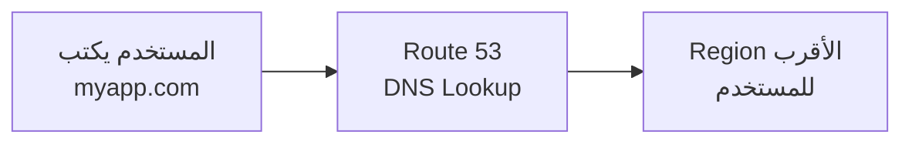
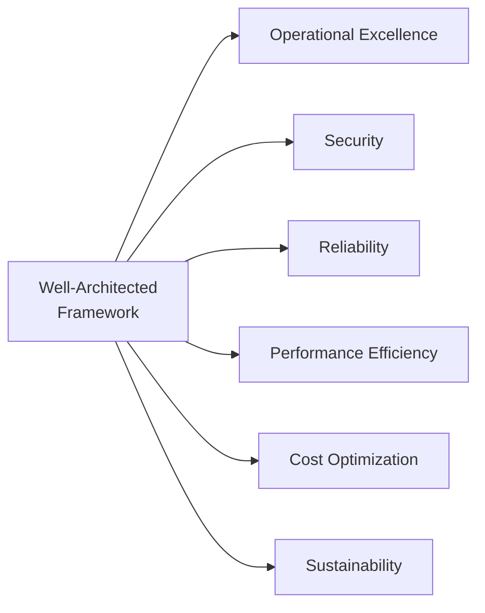

# 🌍 AWS Global Applications & الـ Well-Architected Framework

### AWS Certified Cloud Practitioner — CLF-C02

---

## 🌐 الحكاية بتبدأ من مشكلة المسافة

بعد ما فهمنا إن الـ Cloud بيخلينا نشتغل بسرعة وبكفاءة، في مشكلة تانية بتطلع لو الـ Business بدأ يكبر: **المسافة الجغرافية**.

تخيل إن عندك تطبيق Hosted في `us-east-1` في فيرجينيا وعندك مستخدمين في مصر واليابان وأستراليا. كل Request بيخرج من جهاز المستخدم، بيعدّي علي آلاف الكيلومترات من كابلات البحر، يوصل للـ Server في أمريكا، يرجع. ده الـ **Latency** — وده بيأثر على تجربة المستخدم بشكل مباشر.

الحل هو بناء **Global Applications** — تطبيقات بتشتغل في أكتر من مكان في نفس الوقت، عشان المستخدم دايماً يتكلم مع أقرب نقطة ليه. وعلشان تعمل ده على AWS، في ثلاث Tools رئيسية لازم تعرفهم: 
**Route 53** للـ DNS، 
**CloudFront** للـ CDN
، و**Global Accelerator** للـ Network Routing.

---

## 🗺️ Route 53 — الـ DNS الذكي

قبل ما نتكلم عن Route 53، لازم نفهم إيه هو الـ **DNS** أصلاً.

لما بتكتب `google.com` في المتصفح، التليفون بتاعك مش بيعرف فين `google.com` فيزيائياً. بيروح يسأل الـ **DNS Server**: "فين `google.com`؟" الـ DNS بيرد: "`google.com` موجود على IP Address `142.250.185.78`." ساعتها المتصفح بيروح للـ IP ده مباشرة.

الـ DNS هو كتاب التليفونات بتاع الإنترنت — بيحول الأسماء لأرقام. وRoute 53 هو الـ Managed DNS Service بتاع AWS، واسمه جاي من رقم الـ **Port 53** — اللي هو الـ Standard Port للـ DNS.

# AWS Route 53 Notes

> [!important] الـ **DNS Record Types** اللي لازم تعرفهم للـ **Exam**:
> * الـ **A Record** بيربط **Domain** بـ **IPv4 Address**.
> * الـ **AAAA Record** بيربط **Domain** بـ **IPv6**.
> * الـ **CNAME** بيربط **Hostname** بـ **Hostname** تاني.
> * والـ **Alias Record** — وده الأهم في **AWS** — بيربط **Domain** بـ **AWS Resource** زي **Load Balancer** أو **CloudFront Distribution** مباشرة.

---

### الأهم من كده هو الـ **Routing Policies**

> [!abstract] **Route 53** مش بس بيعمل **DNS** — هو بيعمل **Intelligent Routing** بناءً على منطق محدد:
> * الـ **Simple Routing** بيروح لـ **IP** ثابت.
> * الـ **Weighted Routing** بيوزع الـ **Traffic** بنسب — مثلاً **90%** على الـ **Version** الجديدة و**10%** للـ **Testing**.
> * الـ **Latency Routing** بيروح تلقائياً للـ **Region** الأقرب للمستخدم.
> * والـ **Failover Routing** بيتحول تلقائياً للـ **Backup** لو الـ **Primary** فشل — ده هو الـ **Disaster Recovery**.

> [!important] Route 53 هو Global Service
> مش مرتبط بـ Region معين. الـ DNS Records بتاعتك متاحة للعالم كله تلقائياً.

---

## 📡 Amazon CloudFront — الـ CDN العالمي

## 1. Big Picture (الصورة الكبيرة والمشكلة)

تخيل إنك رافع أبلكيشن زي "طلبات"، وحاطط الصور والفيديوهات والملفات بتاعتك جوة مخزن ملفات في أمريكا اسمه **S3 Bucket**.

الموقع اشتغل والناس في أستراليا بدأوا يدخلوا عليه. كل يوزر في أستراليا يفتح الأبلكيشن، موبايله يبعت ريكويست يسافر عبر المحيطات لغاية أمريكا عشان يجيب صورة البروفايل أو لوجو الموقع، ويرجع تاني.

- **النتيجة الهندسية:** الـ **Latency** (وقت الاستجابة) هتكون عالية جداً، والموقع هيبقى تقيل، وتجربة المستخدم سيئة.
    
- **الحل البديهي بس الغلط:** إننا نفتح مخزن S3 جديد في أستراليا ونقعد ننسخ الملفات يدوي.. ده وجع دماغ وهدر فلوس.
    

هنا بيظهر الـ **CloudFront** كـ **Content Delivery Network (CDN)** عشان يحل الأزمة دي بذكاء.

## 2. Core Concept (إزاي بيشتغل جوهرياً؟)

الـ CloudFront قايم على فكرة الـ **Caching** (الكاش أو التخزين المؤقت) في الـ **Edge Locations** (المراكز الطرفية اللي قريبة من اليوزرز في كل بلاد العالم).

تعال نشوف السيناريو اللي إنت كتبته خطوة بخطوة:

1. **الـ Request الأول (الـ Cache Miss):** أول مستخدم في أستراليا طلب صورة. الريكويست بيروح لأقرب **Edge Location** ليه في مدينة "سيدني". الـ Edge Location بيبص جوة جيبه، مابلاقيش الصورة (Cache Miss). فيقوم هو رايح يكلم الـ **Origin** (المصدر الأساسي اللي هو الـ S3 Bucket في أمريكا) ويجيب منه الصورة. ووهو بيديها لليوزر، **بيحتفظ بنسخة منها عنده في الكاش**.
    
2. **من الـ Request التاني وأنت طالع (الـ Cache Hit):** أي مستخدم تاني في أستراليا يطلب نفس الصورة، الـ Edge Location في سيدني بيطلعهاله من جيبه فوراً (Cache Hit) ويديها لليوزر في أجزاء من الثانية، من غير ما الريكويست يسافر أمريكا خالص.
    

## 3. Real Engineering Usage (الاستخدام الهندسي والـ OAC) وهو **Origin Access Control (OAC)**

لو إنت عامل موقع، وعايز الناس كلها تدخل عن طريق الـ CloudFront عشان الموقع يكون سريع ويحسب كاش. بس فيه يوزر خبيث (أو هكر) أخد اللينك المباشر بتاع الـ S3 Bucket اللي في أمريكا وبدأ يعمل Download للملفات من هناك علطول. كده هو بوظلك الـ Architecture وبيتخطى الكاش وبيزود عليك التكلفة.

- **الـ OAC** هي قفل أمني. بتقفل بيه الـ S3 Bucket وتقول: "محدش في العالم كله يقدر يشوف أو يفتح الـ Bucket دي، إلا الـ CloudFront بتاعي بس!". فاليوزر مجبر يمر عبر البوابة السريعة والمحمية.

## 4. Architecture Thinking (من فين بيجيب المحتوى؟)

الـ CloudFront مش بيكيش ملفات  S3 بس. الـ **Origin** (المصدر) بتاعه ممكن يكون:

- **S3 Bucket:** للملفات الثابتة (صور، فيديوهات، ملفات PDF).
    
- **Application Load Balancer / EC2:** لو عندك Backend API (بيطلع داتا متغيرة Dynamic) وعايز الـ CloudFront يسرع وصول الناس للـ API دي.
    
- **Custom Origin:** أي سيرفر برة AWS خالص وله عنوان HTTP شرعي.
    

## 5. Security & DDoS Protection (الحماية من الهجمات)

تخيل هكر عايز يوقع موقعك عن طريق هجوم **DDoS** (إنه يبعت ملايين الـ Requests الوهمية في نفس الثانية عشان السيرفر يهنج ويموت).

- **لو معندكش CloudFront:** الملايين دي هتروح تضرب الـ Load Balancer أو السيرفر بتاعك في أمريكا، فالسيستم هيقع فوراً.
    
- **لو عندك CloudFront:** الهجوم ده بيتوزع ويتشتت على الـ **400+ Edge Location** حول العالم. كل Edge Location بيشيل حبة صغيرة فالهجوم بيفشل ومبيصلش اصلاً للسيرفر الأساسي بتاعك. وبيتكامل أوتوماتيك مع **AWS Shield** (للحماية من الـ DDoS) ومع الـ **AWS WAF** (جدار حماية للـ Web Application).
    

## 6. Exam Traps (فخاخ الامتحان) 🚨

- **في الامتحان ركز في الكلمات دي:** لو جابلك سؤال فيه كلمات زي **"Global Content Delivery Network (CDN)"** أو **"Cache content at the edge"** أو **"Lower latency for global users"** ➔ الإجابة بدون تفكير هي **Amazon CloudFront**.
    
- **فخ الأمان الصريح:** لو سألك إزاي أمنع اليوزرز يوصلوا للـ S3 bucket مباشرة وأجبرهم يمروا عبر CloudFront ➔ الإجابة استخدام **Origin Access Control (OAC)** مع الـ S3 Bucket Policy.
    
- **فخ الـ DDoS:** خدمة بتقدم **Built-in DDoS protection** بفضل انتشارها العالمي ➔ **CloudFront** بتكامل مع **AWS Shield**.
    

## 7. Quick Revision (برشامة الذاكرة للـ CloudFront)

- **الوظيفة:** CDN بيعمل Caching للمحتوى في الـ Edge Locations عشان يقلل الـ Latency.
    
- **الـ Origins:** ممكن S3، أو Load Balancer، أو سيرفر خارجي.
    
- **الأمان:** بيستخدم **OAC** لحماية الـ S3، وبيحمي من الـ **DDoS** بالتعاون مع Shield وWAF.
    
## CloudFront vs S3 Cross-Region Replication:

## 1. Big Picture (الصورة الكبيرة والتشبيه المصري)

تخيل إنك كاتب كتاب مشهور جداً (الملفات بتاعتك)، والناس في كل بلاد العالم عايزين يقرأوه. عندك حلين:

- **الحل الأول (CloudFront):** تفتح مكتبات صغيرة (Edge Locations) في كل بلد، وتحط في كل مكتبة "نسخة ضوئية/تصوير" من الكتاب. لو حد دخل المكتبة دي، هياخد النسخة المصورة فوراً (Cache). ولو الكتاب الأصلي اتعدل، النسخ المصورة دي مش هتتعدل فوراً، هتستنى لما النسخة القديمة مدتها تخلص (TTL) ونبعت نجيب الجديد.
    
- **الحل الثاني (S3 Cross-Region Replication - CRR):** تروح تطبع كتاب أصلي حقيقي بكل صفحاته الغالية، وتشحنه لمخزن رئيسي تاني خالص في بلد تانية (Region تانية). المخزن ده فيه كتاب حقيقي كامل وجاهز للبيع (Real-time replica).
    

## 2. Core Concept (المفهوم الجوهري بالتفصيل)

### أ. CloudFront (Content Delivery Network - CDN)

- **إزاي بيشتغل؟** هو عبارة عن شبكة توزيع. الملف الأصلي بيفضل في مكانه (مثلاً ريجون أمريكا)، والـ CloudFront بياخد منه "كاش" (تخزين مؤقت) ويرميه في الـ 400+ Edge Location حول العالم.
    
- **التحديث (الـ TTL):** الـ TTL هي اختصار لـ **Time To Live**. ده عداد تنازلي (مثلاً 24 ساعة) الـ Edge Location بيفضل محتفظ بالملف فيه. طول ما الـ TTL شغال، لو إنت غيرت الملف الأصلي في أمريكا، اليوزر في أستراليا لسه بيشوف القديم من الكاش. أول ما الـ TTL يخلص، الـ Edge location يروح يجيب الجديد.
    

### ب. S3 Cross-Region Replication (CRR)

- **إزاي بيشتغل؟** ده مش كاش! ده نسخ حقيقي للملفات (Physical Replication). إنت عندك S3 Bucket في أمريكا، وبتعمل S3 Bucket حقيقي تاني في ريجون أستراليا، وبتقول لـ AWS: "أي ملف خالد يرفعه في أمريكا، انسخيه فوراً وحطي نسخة أصلية منه في أستراليا".
    
- **التحديث:** بيحصل في ثواني معدودة (Near Real-time). أول ما ترفع في Bucket "أ"، بيسمع في Bucket "ب".
    

## 3. Real Engineering Usage & Architecture (الاستخدام الهندسي والـ Scope)

كـ Software Engineer، إمتى تختار ده وإمتى تختار ده؟

- **CloudFront:** ممتازة للـ **Static Content** (صور الأبلكيشن، ملفات الـ CSS، الفيديوهات، الـ Static HTML) اللي العالم كله بيشوفها بنفس الشكل ومبتتغيرش كل دقيقة. الـ Scope بتاعه **Global تلقائياً** لأن أمازون بتوزعه على كل الـ Edge Locations برابط واحد.
    
- **S3 CRR:** ممتازة للـ **Dynamic Content** والبيانات الحساسة اللي ريجون تانية محتاجاها للـ Processing أو الـ Analytics. مثلاً، لو عندك سيستم بنكي أو سيستم لـ Blood Banks، والـ Database بترمي ملفات تقارير مالية أو طبية كل دقيقة، وتيم التحليلات في أوروبا محتاج يقرأ الملفات دي بـ Low latency. هنا هتعمل CRR لريجون أوروبا يدوياً عشان الداتا الحقيقية تكون هناك.
    

## 4. Pricing/Billing (منطق الفلوس)

- **في CloudFront:** إنت مش بتدفع تمن تخزين إضافي، لأن الملفات متخزنة في مكان واحد (الـ Origin) والـ Edge Locations بتاخد كاش ببلاش. بتدفع بس على الـ Data Transfer OUT لما اليوزر يعمل داونلود.
    
- **في S3 CRR:** إنت **بتدفع الضعف** في التخزين! لأنك حاجز مساحة تخزين فعلية في ريجون أمريكا ومساحة تخزين فعلية تانية في ريجون أستراليا، وكمان بتدفع تكلفة الـ Data Transfer بين الـ Regions وبعضها عشان الملفات تتنقل.
    

## 5. الجدول النهائي للمقارنة (The Ultimate Exam Table)

|**وجه المقارنة**|**Amazon CloudFront**|**S3 Cross-Region Replication (CRR)**|
|---|---|---|
|**طريقة العمل**|**Cache (تخزين مؤقت)** عند الـ Edge Locations|**نسخة حقيقية كاملة (Real Copy)** في Region تانية|
|**سرعة التحديث**|بعد انتهاء الـ **TTL** أو عمل Invalidation يدوياً|**Near Real-time** (تحديث فوري وتلقائي للملفات)|
|**أفضل استخدام**|**Static content** (صور، فيديوهات، ملفات CSS) للعالم كله|**Dynamic content** أو ملفات بحجم كامل لـ Regions محددة|
|**الـ Scope**|**Global تلقائياً** (يغطي 400+ Edge Location برابط واحد)|**Regional يدوياً** (تحدده لريجون معينة بالاسم)|
|**تكلفة التخزين**|مفيش تكلفة تخزين إضافية (بتدفع في الـ Origin بس)|**بتدفع الضعف** (تمن التخزين في الريجون الأولى والريجون الثانية)|
|**أبرز هدف**|تقليل الـ **Latency** وتحسين أداء القراءة للعملاء|الـ **Compliance** والـ **Disaster Recovery** للبيانات الحساسة|

## 6. Exam Traps (فخاخ الامتحان الصريحة) 🚨

- **فخ الـ Keyword (الكاش):** لو السؤال قالك: "الشركة عايزه تقلل الـ Latency لملفات الصور والفيديوهات للعملاء حول العالم باستخدام **Caching**" ➔ الإجابة فوراً **Amazon CloudFront**.
    
- **فخ الـ Keyword (النسخ الحقيقي):** لو قالك: "الشركة محتاجة الملفات تكون متوفرة في ريجون تانية وتكون **Read-only** ومحدثة في **Near real-time** لأغراض الـ Compliance أو الـ Disaster Recovery" ➔ الإجابة فوراً **S3 Cross-Region Replication**.
    
- **فخ الـ Scope:** الـ CloudFront هو **Global Service** (مش بتحدد ريجون للكاش، هو بيروح للشبكة العالمية). الـ CRR هو **Regional Configuration** (لازم تدخل على الـ Bucket يدوي وتختار الريجون التانية اللي عايز تنسخ ليها بالاسم).
    

## 7. Quick Revision (برشامة الذاكرة)

- **CloudFront** = Cache + TTL + Static Content للعالم كله.
    
- **S3 CRR** = Real-time + Duplicate Storage + Dynamic/Compliance لـ ريجون محددة.
    

---

## 🚀 S3 Transfer Acceleration

مشكلة مختلفة: مش عايزين نـ Download بسرعة — عايزين نـ **Upload** بسرعة. تخيل إنك في مصر وعايز ترفع ملف ضخم على S3 في `ap-southeast-2` في أستراليا. الـ Upload هيمشي على الـ Public Internet من مصر لأستراليا — بطيء وغير مستقر.

مع **S3 Transfer Acceleration**، الـ Upload بيروح لأقرب Edge Location لك (ممكن في مدينة قريبة منك)، ومن هناك الملف بيتنقل على **AWS's own private network** لـ S3 Bucket في أستراليا. الشبكة الخاصة بتاعة AWS أسرع وأثبت بكتير من الـ Public Internet.

---

## ⚡ AWS Global Accelerator

الـ **Global Accelerator** بيحل مشكلة مختلفة عن CloudFront. مش عايزين نـ Cache محتوى — عايزين كل الـ Traffic من أي حد في العالم يمشي على **AWS Private Network** بدل الـ Public Internet.

بيشتغل عن طريق إنك بتاخد **2 Static Anycast IP Addresses**. كل مستخدم في العالم لما بيتصل بالـ IP ده، الـ Traffic بيروح لأقرب Edge Location ليه، وبعدين من الـ Edge Location بيمشي على الـ AWS Private Global Network لـ Application بتاعك. الـ Private Network بتاعة AWS أحسن بكتير من الـ Public Internet من ناحية Latency وStability.

**أهم مقارنة في الـ Exam — CloudFront vs Global Accelerator:**

الاتنين بيستخدموا الـ Edge Locations والـ AWS Global Network، بس الفرق جوهري. **CloudFront** بيـ Cache المحتوى عند الـ Edge ويخدمه من هناك — مناسب للـ Static Content زي Images وVideos وHTML. **Global Accelerator** مفيهوش Cache خالص — بيـ Proxy الـ Traffic لـ Application في الـ Region — مناسب للـ Dynamic Applications، الـ Gaming، الـ IoT، وأي Application محتاج **Static IPs**.

> [!important] قاعدة الـ Exam
> السؤال بيتكلم عن "Static IP Addresses"؟ → **Global Accelerator.** بيتكلم عن "Cache content at the Edge"؟ → **CloudFront.** البروتوكول TCP/UDP من غير HTTP؟ → **Global Accelerator.**

---

## 🏢 AWS Outposts — الـ Cloud في بيتك

في شركات كبيرة — بنوك، حكومات، شركات صناعية — ممكن يكون فيه بيانات مش قادرين يحطوها على الـ Public Cloud بسبب Compliance أو Latency متطلبات أو أنظمة Legacy.

الـ **AWS Outposts** هو الحل. AWS بتبعتلك **Rack فيزيائي** جاهز وتحطه في Data Center بتاعتك. الـ Rack ده بيشتغل بنفس AWS APIs، نفس الـ Console، نفس الـ Services — EC2 وS3 وEBS وRDS وEKS وغيرهم. من وجهة نظرك كـ Developer، مش فارق معك إنت بتشتغل على Outposts أو على AWS الـ Public — نفس الـ Code، نفس الـ Tools.

النقطة المهمة للـ Exam: إنت مسؤول عن الـ **Physical Security** للـ Rack الموجود عندك. AWS بتديره remotely بس.

---

## 📶 AWS WaveLength و Local Zones

**AWS WaveLength** جاي لحالة نادرة جداً — التطبيقات اللي محتاجة Latency في حدود الـ milliseconds الواحدة مع مستخدمين الـ 5G. AWS بتحط Compute جوه شبكة الـ Telecom Carrier نفسها — يعني الـ Traffic مش بيخرج من الشبكة الخلوية خالص ومش بيروح لـ AWS Region. ده بيديك Ultra-Low Latency. مناسب لـ Smart Cities وConnected Vehicles والـ AR/VR.

**AWS Local Zones** فكرة مختلفة. بعض المدن الكبيرة في العالم ماعنهاش AWS Region كاملة — فـ AWS بتعمل "امتداد" للـ Region الأقرب في المدينة دي. مثلاً `us-east-1` في فيرجينيا عندها Local Zones في Boston وChicago وDallas وHouston. بتـ Extend الـ VPC بتاعتك للـ Local Zone وتشغّل EC2 وRDS وECS فيها.

الفرق بين الاتنين بسيط: WaveLength جوه شبكة الـ 5G Carrier، Local Zones امتداد للـ AWS Region في مدينة معينة.

---

## 🏗️ Well-Architected Framework — الـ 6 Pillars

AWS مش بس بتوفر Services — هي بتوفر كمان **Best Practices** لكيفية بناء Systems صح على الـ Cloud. ده هو الـ **Well-Architected Framework** — مجموعة من المبادئ الأساسية منظّمة في 6 Pillars.

مهم جداً تعرف: الـ 6 Pillars دول **مش Trade-offs بين بعض** — هم **Synergy** — كل Pillar بيكمّل التانيين وبتحتاجهم كلهم مع بعض.

---

**الـ Pillar الأول — Operational Excellence** بيتكلم عن تشغيل ومراقبة الـ Systems بشكل مستمر وتحسينها. المبدأ الأهم هنا هو "Perform operations as code" — يعني كل حاجة Infrastructure بتعملها عن طريق Code (CloudFormation, CDK) مش يدوي. مبدأ تاني مهم هو "Make frequent, small, reversible changes" — بدل الـ Big Bang Deployments، بتعمل تغييرات صغيرة وسهلة ترجع منها. الـ AWS Services المرتبطة بيه: CloudFormation، CloudTrail، CloudWatch، AWS Config.

**الـ Pillar التاني — Security** بيتكلم عن حماية كل حاجة. الـ Principle الأساسي هو **Least Privilege** — كل حد بياخد بس الصلاحيات اللي يحتاجها بالظبط. مبدأ تاني هو "Apply Security at ALL Layers" — مش بس على الـ Application، على الـ Network، الـ Subnet، الـ Load Balancer، الـ EC2، الـ OS، وكل حاجة. والمبدأ التالت "Enable Traceability" — كل حاجة بتتعمل لازم تتسجل. الـ Services: IAM، CloudTrail، CloudWatch، KMS، Shield، WAF، Inspector.

**الـ Pillar التالت — Reliability** بيتكلم عن قدرة الـ System يتعافى من المشاكل تلقائياً. المبدأ الأهم: "Automatically recover from failure" — الـ System المفروض يشتشف المشاكل ويتعافى من غير تدخل بشري. "Test recovery procedures" يعني لازم تجرب الـ Disaster Recovery بانتظام — مش تستنى الكارثة الحقيقية. "Scale horizontally" بدل Vertical Scaling لأن أكتر machines بتعني أقل risk per machine. الـ Services: Auto Scaling، CloudWatch، Route 53، Multi-AZ.

**الـ Pillar الرابع — Performance Efficiency** بيتكلم عن استخدام الـ Resources بكفاءة. المبدأ الأهم: "Use serverless architectures" — Lambda وFargate بتديك Performance من غير ما تدير Servers. "Democratize advanced technologies" — بدل ما تبني AI Model من الصفر، استخدم Rekognition أو SageMaker. "Go global in minutes" — بتـ Deploy في أي Region بسهولة. الـ Services: Lambda، Auto Scaling، CloudFront، ElastiCache.

**الـ Pillar الخامس — Cost Optimization** بيتكلم عن دفع أقل من غير ما تضحي بالـ Performance. المبدأ الأساسي: "Adopt a consumption model" — بتدفع على اللي بتستخدمه فعلاً. "Measure overall efficiency" — لازم تعرف كل حاجة بتكلفك كام. "Use Spot Instances" لو الـ Workload يتحمل Interruption. الـ Services: Cost Explorer، Budgets، Spot Instances، Reserved Instances، S3 Intelligent Tiering.

**الـ Pillar السادس — Sustainability** وده الأحدث، بيتكلم عن تقليل الأثر البيئي. المبدأ الأهم: "Maximize utilization" — لو عندك Instance شغّال بـ 20% من طاقته، صغّره. استخدم **Graviton Processors** من AWS — معالجات ARM بتستهلك طاقة أقل بكتير من x86 وبتديك نفس أو أحسن Performance. استخدم Lambda وFargate عشان الـ Shared Infrastructure بتاعتهم أكثر كفاءة من Dedicated Instances.

---

## 🚀 AWS Cloud Adoption Framework (CAF)

لما شركة بتقرر تنقل لـ Cloud، ده مش بس قرار تقني — ده تحوّل في Culture وProcesses والناس والـ Business كلها. الـ **AWS CAF** بيساعد المؤسسات تخطط لرحلة الـ Cloud Transformation دي بشكل شامل عبر **6 Perspectives**.

الـ 6 Perspectives بتتقسم لـ Business Capabilities وTechnical Capabilities. جهة الـ **Business Capabilities** فيها تلاتة: الـ **Business Perspective** بتتأكد إن الـ Cloud Investments بتحقق Business Outcomes حقيقية. الـ **People Perspective** بيتعامل مع الجانب الإنساني — Culture، Organizational Structure، وتطوير الـ Workforce. الـ **Governance Perspective** بيتعامل مع تنظيم مبادرات الـ Cloud وتقليل الـ Risks.

جهة الـ **Technical Capabilities** فيها تلاتة: الـ **Platform Perspective** بيتكلم عن بناء الـ Cloud Platform القابلة للـ Scale. الـ **Security Perspective** بيتأكد من الـ Confidentiality والـ Integrity والـ Availability. والـ **Operations Perspective** بيتأكد إن الـ Cloud Services بتحقق احتياجات الـ Business الفعلية.

> [!abstract]+ طريقة تحفظ الـ 6 Perspectives
>
> البيزنس بييجي قبل التقني دايماً.
>
> **Business Side (3):** Business → People → Governance
>
> **Technical Side (3):** Platform → Security → Operations
>
> ركّز إن "Governance" هي Business Capability مش Technical — ده Trap شائع في الـ Exam.

**مراحل الـ CAF الأربعة:** يبدأ بـ **Envision** — تحديد فرص الـ Cloud وأثرها على الـ Business. بعدين **Align** — تحديد الـ Capability Gaps وعمل Action Plan. بعدين **Launch** — تشغيل Pilot Projects في Production الحقيقي. وأخيراً **Scale** — توسيع الـ Pilots اللي نجحت وتحقيق الـ Benefits الكاملة.

---

## 💡 AWS Right Sizing

ده مفهوم بسيط جداً بس مهم للـ Exam. لما شركة بتعمل Migration للـ Cloud، الـ Mistake الشائعة هي إنها بتاخد الـ Server القديم (مثلاً 64-core مش بيستخدم إلا 10% منه) وبتنقله 1:1 على أكبر EC2 Instance. النتيجة: بتدفع على Resources مش بتستخدمها.

**Right Sizing** معناه: مطابقة الـ Instance Type والـ Size مع الـ Workload الفعلي بأقل تكلفة. المبدأ على AWS: **دايماً ابدأ بصغير**، لأن الـ Scale Up على الـ Cloud سهل في دقيقة. الـ Tools اللي بتساعدك: **CloudWatch** للـ Monitoring الفعلي، **Cost Explorer** لتحليل التكاليف، و**AWS Trusted Advisor** اللي بيديك Recommendations تلقائية للـ Right Sizing.

---

## 🛎️ AWS Ecosystem — الـ Support والـ Community

**الـ Support Plans:** أول حاجة بتختار لما بتفتح AWS Account هي الـ Support Plan. الـ **Basic** مجاني وبيديك Documentation والـ Forums بس. الـ **Developer** بيديك Email Support في Business Hours والـ Response Time لـ General Questions أقل من 24 ساعة ولو System Impaired أقل من 12 ساعة. الـ **Business** بيديك 24/7 Phone وEmail وChat، ولو Production Down فأقل من **1 ساعة**. الـ **Enterprise** بيديك كل ده وكمان **TAM (Technical Account Manager)** — مستشارك الشخصي من AWS — وResponse Time للـ Business-Critical Down أقل من **15 دقيقة**.

**AWS Marketplace:** Catalog رقمي فيه آلاف الـ Software Solutions من Third-Party Vendors. تقدر تشتري Software جاهز وفاتورته بتيجيلك في الـ AWS Bill العادي. وتقدر إنت كمان تبيع Solutions بتاعتك عليه.

**AWS IQ:** منصة بتلاقي فيها **AWS Certified Experts** للـ Freelance Work. بتعمل Request، بتاخد Proposals، بتختار Expert، والدفع بييجي في الـ AWS Bill بتاعتك.

**AWS re:Post:** Community Q&A Platform — بديل الـ AWS Forums القديم. بتسأل، الـ Community بتجاوب، وبتاخد Reputation Points لما بتجاوب صح. مهم تعرف إنه **مش للأسئلة الـ Time-Sensitive** أو اللي فيها Proprietary Information.

**AWS Managed Services (AMS):** لو الشركة مش عايزة تدير الـ Infrastructure بنفسها خالص — AWS بتوفر team كاملة تدير كل حاجة: Change Requests وMonitoring وPatching وSecurity وBackups. ده Fully Managed Operations على مدار **24/365**.

---

## 🎯 فخاخ الـ Exam

**الـ Trap الأول — CloudFront vs Global Accelerator:** CloudFront بيعمل Cache. Global Accelerator مفيهوش Cache خالص — هو بس بيـ Route الـ Traffic. لو السؤال قال "Static IPs" → Global Accelerator. لو قال "Cache static content" → CloudFront.

**الـ Trap التاني — Support Plan Timings:** بيتكلم عن "Business-Critical" أو "Mission-Critical" Down؟ → Enterprise فقط → أقل من 15 دقيقة. بيتكلم عن "Production Down"؟ → Business Plan → أقل من 1 ساعة. الأرقام دي بتيجي في الـ Exam بالظبط.

**الـ Trap التالت — CAF Governance:** "Governance" هي Business Capability مش Technical. كتير من الناس بيحطوها مع الـ Technical Side.

**الـ Trap الرابع — Well-Architected Pillars مش Trade-offs:** لو السؤال قال "يوجد تعارض بين Cost وSecurity" — الإجابة إنهم مش Trade-offs، هم Synergy ومفروض يتحققوا مع بعض.

**الـ Trap الخامس — Outposts Physical Security:** AWS بتدير الـ Outposts Remotely، بس إنت مسؤول عن الـ Physical Security للـ Rack الموجود عندك.

**الـ Trap السادس — re:Post مش للـ Urgent Issues:** re:Post هي Community Platform — مش الـ Channel الصح للمشاكل الـ Time-Sensitive. ديها Support Plan عندك.

---

## 📝 أسئلة الـ Exam

### Q1. A company wants to deliver static website content globally with the lowest possible latency for users in different countries. Which AWS service should they use?

- A. Amazon Route 53
- B. AWS Global Accelerator
- C. Amazon CloudFront
- D. S3 Transfer Acceleration

> [!success]- ✅ Reveal Answer & Explanation
> **Correct Answer: C**
>
> CloudFront هو الـ CDN — بيـ Cache الـ Static Content في الـ Edge Locations الأقرب للمستخدم. Static Website Content هو الـ Use Case الكلاسيكي للـ CloudFront. Route 53 مجرد DNS. Global Accelerator مفيهوش Cache. S3 Transfer Acceleration للـ Upload على S3 مش للـ Delivery.

---

### Q2. A global application needs two static IP addresses that will never change, and traffic must be routed over the AWS private network. Which service is MOST appropriate?

- A. Amazon CloudFront
- B. AWS Global Accelerator
- C. Amazon Route 53
- D. AWS Direct Connect

> [!success]- ✅ Reveal Answer & Explanation
> **Correct Answer: B**
>
> الكلمتان المفتاحيتان هنا هما "Static IP Addresses" و"AWS private network". Global Accelerator بيديك 2 Anycast Static IPs وبيـ Route الـ Traffic على الـ AWS Private Global Network. CloudFront مفيهوش Static IPs وهو CDN مش Network Router. Route 53 هو DNS بس. Direct Connect هو Dedicated connection بين On-Premises وAWS.

---

### Q3. According to the AWS Well-Architected Framework, which Pillar focuses on ensuring a system can recover from infrastructure failures automatically?

- A. Performance Efficiency
- B. Operational Excellence
- C. Reliability
- D. Cost Optimization

> [!success]- ✅ Reveal Answer & Explanation
> **Correct Answer: C**
>
> **Reliability Pillar** هو اللي بيتكلم عن "Automatically recover from failure" والـ High Availability والـ Fault Tolerance. Operational Excellence بيتكلم عن تشغيل وتحسين الـ Operations. Performance Efficiency عن كفاءة الـ Resources. Cost Optimization عن تقليل التكاليف.

---

### Q4. Which AWS Support Plan provides a Technical Account Manager (TAM) and guarantees a response time under 15 minutes for business-critical system failures?

- A. Basic
- B. Developer
- C. Business
- D. Enterprise

> [!success]- ✅ Reveal Answer & Explanation
> **Correct Answer: D**
>
> **TAM** و**15-minute response** هما الميزتان الحصريتان للـ **Enterprise Support Plan**. Business Plan بيديك 1 ساعة لـ Production Down. Developer بيديك Business Hours فقط. Basic مجاني ومفيش Support مخصص.

---

### Q5. A company has an on-premises Data Center and cannot move some sensitive workloads to the public cloud due to regulatory requirements. However, they want to use AWS APIs and services for these workloads. What should they use?

- A. AWS Local Zones
- B. AWS WaveLength
- C. AWS Outposts
- D. AWS Direct Connect

> [!success]- ✅ Reveal Answer & Explanation
> **Correct Answer: C**
>
> **AWS Outposts** بيجيب الـ AWS Hardware لـ Data Center بتاعتهم — نفس الـ APIs ونفس الـ Services بس الـ Data فاضلة On-Premises. Local Zones هي امتداد للـ Region في مدينة — مش On-Premises. WaveLength للـ 5G Networks. Direct Connect هو Network Connection بس، مش Compute.

---

### Q6. Which statement BEST describes the relationship between the six pillars of the AWS Well-Architected Framework?

- A. They are trade-offs — improving one pillar typically requires compromising another
- B. They are independent — each pillar applies only to specific types of workloads
- C. They are synergistic — all six should be pursued together for a well-architected system
- D. They are sequential — you must complete each pillar before moving to the next

> [!success]- ✅ Reveal Answer & Explanation
> **Correct Answer: C**
>
> الـ 6 Pillars هم **Synergy** مش Trade-offs. مش مفروض تضحي بالـ Security عشان تقلل التكاليف، ولا تضحي بالـ Cost Optimization عشان تزود الـ Performance. الـ Framework مصمم إنك تحقق الـ 6 مع بعض. ده من أهم المفاهيم الغلط اللي الناس بتقع فيها في الـ Exam.

---

### Q7. A solutions architect wants to deploy an application to serve users in Cairo with ultra-low latency, leveraging the local 5G network infrastructure. Which AWS service should they consider?

- A. AWS Outposts
- B. AWS Local Zones
- C. AWS WaveLength
- D. Amazon CloudFront

> [!success]- ✅ Reveal Answer & Explanation
> **Correct Answer: C**
>
> **WaveLength** بيتكامل مع شبكة الـ 5G Carrier نفسها — الـ Traffic ماخرجش من الشبكة الخلوية خالص. ده بيديك Ultra-Low Latency للـ 5G Users. Outposts للـ On-Premises. Local Zones امتداد للـ Region في مدن محددة على الـ AWS Network. CloudFront CDN للـ Static Content.

---

### Q8. Which perspective in the AWS Cloud Adoption Framework (CAF) focuses on organization culture, leadership, and workforce development?

- A. Business Perspective
- B. People Perspective
- C. Governance Perspective
- D. Operations Perspective

> [!success]- ✅ Reveal Answer & Explanation
> **Correct Answer: B**
>
> **People Perspective** هو اللي بيتعامل مع الجانب الإنساني في الـ Cloud Transformation — Culture وLeadership وOrganizational Structure وWorkforce Development. Business Perspective عن الـ Strategy والـ ROI. Governance عن التنظيم وتقليل الـ Risks. Operations عن التشغيل اليومي للـ Cloud Services.

---

## 📊 ملخص نهائي — الـ Cheat Sheet

| السؤال | الإجابة |
|--------|---------|
| Route 53 = نوع الخدمة | Global DNS + Smart Routing |
| Route 53 Routing لـ Disaster Recovery | Failover Routing |
| Route 53 Routing لـ A/B Testing | Weighted Routing |
| CloudFront = وظيفته | CDN — Cache at Edge Locations |
| CloudFront Origins | S3, ALB, EC2, Custom HTTP |
| CloudFront vs S3 CRR | CF = Cache / S3 CRR = Real Copy |
| S3 Transfer Acceleration | Upload → Edge → AWS Network → S3 |
| Global Accelerator = وظيفته | Route Traffic on AWS Private Network |
| Global Accelerator = ميزته | 2 Static Anycast IPs + No Cache |
| CloudFront vs Global Accelerator | CF = Cache / GA = No Cache + Static IPs |
| AWS Outposts | AWS Rack في Data Center بتاعك |
| AWS WaveLength | AWS Compute جوه 5G Carrier Network |
| AWS Local Zones | امتداد الـ Region لمدن محددة |
| Well-Architected Pillars | OE, Security, Reliability, Performance, Cost, Sustainability |
| Pillars هم | Synergy مش Trade-offs |
| CAF Business Capabilities | Business, People, Governance |
| CAF Technical Capabilities | Platform, Security, Operations |
| CAF Phases | Envision → Align → Launch → Scale |
| Support: Basic | مجاني، Documentation فقط |
| Support: Developer | Business Hours، General < 24hrs |
| Support: Business | 24/7، Production Down < 1hr |
| Support: Enterprise | TAM + Concierge، Critical Down < 15 min |
| AWS Marketplace | Third-Party Software على AWS Bill |
| AWS AMS | AWS تدير Infrastructure بتاعتك |
| Right Sizing | ابدأ صغير وـ Scale عند الحاجة |

---

*القسم الجاي: **EC2 — Elastic Compute Cloud** — السيرفرات الافتراضية، Instance Types، Security Groups، وكل خيارات الـ Purchasing.*
