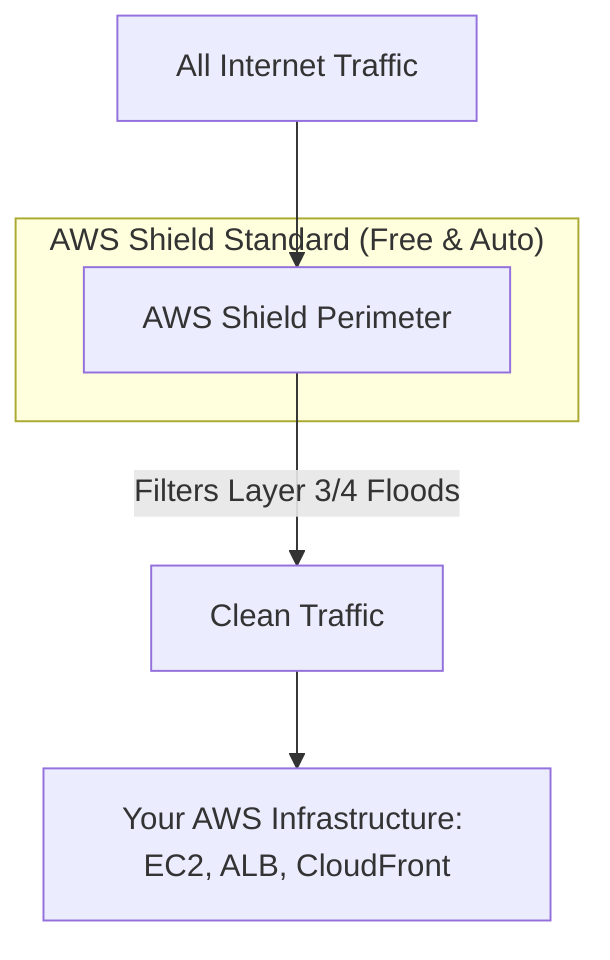
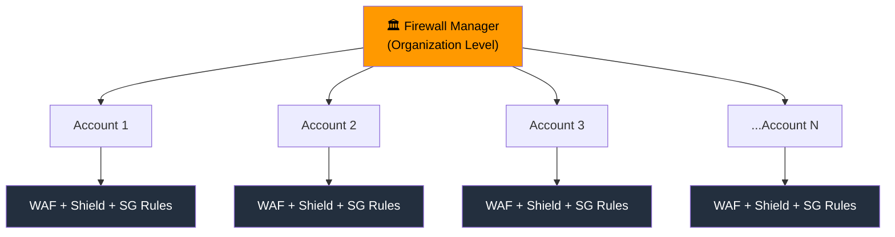

# 🛡️ Security & Compliance — الجزء الأول
### AWS Certified Cloud Practitioner — CLF-C02

---

## 🤝 الحكاية بتبدأ بسؤال مهم — مين مسؤول لو حصل حاجة؟

تخيل معايا إنك استأجرت شقة في عمارة. حصل حريق. السؤال الطبيعي: مين المسؤول؟ لو الحريق بدأ من العزل الكهربائي في جدران العمارة نفسها — ده مسؤولية صاحب العمارة. لو بدأ من سيجارة نسيتها في شقتك — ده مسؤوليتك إنت. المنطق ده بالظبط هو اللي AWS بنت عليه الـ **Shared Responsibility Model**.

لما بتشتغل على AWS، مش AWS وحدها المسؤولة عن كل حاجة. في حاجات AWS بتتكفل بيها — وفي حاجات إنت المسؤول عنها بالكامل. الـ Exam بيسألك عن الفرق ده في كل صورة ممكنة، فلازم تفهمه جوهرياً مش بس تحفظه.

---

## ⚖️ الـ Shared Responsibility Model — التقسيم الرسمي

الجملتان اللي لازم تعرفهم وبتيجيوا في كل امتحان:

> **AWS مسؤولة عن Security OF the Cloud.**
> **إنت (Customer) مسؤول عن Security IN the Cloud.**

**AWS** مسؤولة عن كل حاجة إنت مش شايفها — الـ Physical Infrastructure: المباني والأجهزة والكابلات والتبريد. الـ Hypervisors اللي بتشغّل الـ Virtualization. الشبكات الفيزيائية بين الـ Data Centers. والـ Managed Services نفسها — يعني لو AWS قالتلك "S3 آمن وDATA بتاعتك متفصلة عن باقي العملاء" — ده وعد AWS إنها بتحافظ عليه.

**إنت** مسؤول عن كل حاجة إنت بتقرر فيها — البيانات بتاعتك وتشفيرها، إعدادات الـ Network والـ Security Groups، مين يقدر يدخل على الـ AWS Account بتاعتك، الـ IAM Users والـ Roles، والـ Application Code اللي بتكتبه.

> [!abstract]+ تفاصيل التقسيم لكل Service — RDS وS3 كأمثلة
>
> ### الـ RDS — Database Service
> **AWS مسؤولة عن:**
> - إدارة الـ EC2 Instance اللي الـ Database شغّالة عليه.
> - إغلاق الـ SSH Access على الـ Instance التحتاني (إنت ما تقدرش تـ SSH عليه أصلاً في الـ Managed RDS).
> - الـ Automated Patching للـ OS والـ Database Software تلقائياً.
> - ضمان إن الـ Underlying Hardware شغّال ومصحي.
>
> **إنت مسؤول عن:**
> - فتح وإغلاق الـ Ports على الـ Security Group بتاع الـ Database.
> - إنشاء الـ Users والصلاحيات جوه الـ Database نفسه.
> - تقرير إنت هتخلي الـ Database Publicly Accessible ولا لا.
> - تفعيل الـ SSL Connections وضبط الـ Parameter Groups.
> - تفعيل الـ Encryption على الـ RDS.
>
> ### الـ S3 — Object Storage
> **AWS مسؤولة عن:**
> - ضمان التخزين اللا نهائي — إنت ما بتفكرش في السعة.
> - تشفير البيانات على مستوى الـ Infrastructure.
> - عزل بيانات العملاء المختلفين عن بعض.
> - ضمان إن موظفي AWS ما يقدروش يوصلوا لبياناتك.
>
> **إنت مسؤول عن:**
> - إعدادات الـ Bucket نفسها — هل هي Public أو Private.
> - الـ Bucket Policy — مين يقدر يقرأ أو يكتب.
> - الـ IAM Roles اللي بتوصّل بيها Services لاـ Bucket.
> - تفعيل الـ Encryption على المحتوى (SSE-S3 أو SSE-KMS).

**الـ Shared Controls** — وفيه حاجات في المنتصف اللي الاتنين مسؤولين عنها بشكل مختلف:
- **Patch Management** — AWS بتـ Patch الـ Infrastructure، إنت بتـ Patch الـ OS على الـ EC2 بتاعك.
- **Configuration Management** — AWS بتحافظ على إعدادات الأجهزة، إنت بتحافظ على إعدادات الـ Application.
- **Awareness & Training** — الاتنين مسؤولين عن تدريب فرقهم على الأمان.

> [!important] القاعدة الذهبية في الامتحان
> لما السؤال بيسألك "من مسؤول عن تحديث الـ OS على الـ EC2؟" — الإجابة إنت.
> لما بيسألك "من مسؤول عن الـ Physical Hardware؟" — الإجابة AWS.
> لما بيسألك عن "Managed Service زي RDS أو S3"، AWS مسؤولة عن الـ Underlying Infrastructure، وإنت مسؤول عن الـ Configuration.

---

## 💥 هجمات الـ DDoS — لما العدو بيجيب جيش

### أولاً: إيه هو الـ DDoS Attack أصلاً؟

تخيل انك فاتح مشروع ابليكشن طلبات ومعاك فرع معين شغال منه، والفرع ده يقدر يستقبل ويخدم 100 عميل في نفس الوقت مستريح. جاء هكر شرير مش حابب إن شركتك تنجح، فعمل إيه؟ سخر آلاف الأجهزة المخترقة حول العالم (بنسميها **Botnet**) وأمرهم كلهم في نفس الثانية يدخلوا على الموقع بتاعك ويطلبوا صفحات أو يعملوا عمليات وهمية.

الموقع بتاعك هيلاقي فجأة فيه 500,000 ريكويست جايين في نفس اللحظة. السيرفرات بتاعتك مش هتستحمل الضغط ده، الـ CPU هيوصل 100%، والسيستم كله هيقع (Crash). النتيجة؟ العميل الحقيقي الشرعي لما ييجي يفتح الموقع، هيلاقيه واقف ومش بيفتح. هو ده الـ DDoS — الهكر مش بيسرق بياناتك، هو بس **بيسد باب السيستم** بترافيك وهمي عشان يوقعه ويخسرك عملاء وفلوس.

 الهجمات دي بتحصل على مستويات مختلفة في الشبكة (Network Layers):

- **Layer 3 (Network Layer):** هجمات بتستهدف الـ IP والـ Routing (زي الـ Reflection Attacks).
    
- **Layer 4 (Transport Layer):** هجمات بتستهدف بروتوكولات النقل والتوصيل (زي الـ SYN Floods والـ UDP Floods).
    
- **Layer 7 (Application Layer):** هجمات ذكية بتستهدف كود الأبلكيشن نفسه والـ HTTP Requests (زي إنه يفضل يعمل لوجين أو سيرش ملايين المرات ورا بعض عشان يتعب الداتا بيز).
    

### ثانياً: دخول البطل — AWS Shield

هنا بيجي دور **AWS Shield**. ده نظام جدار حماية وفلترة ذكي جداً، بيقعد بره الـ Infrastructure بتاعتك خالص، وظيفته إنه يراقب الترافيك اللي جاي من الإنترنت لخدماتك، ويفصل الزبون الحقيقي عن الريكويست الوهمي بتاع الهكر.

أمازون بتقدم الخدمة دي في نسختين (Standard و Advanced)، والفرق بينهم جوهري هندسياً ومادياً:

### 1. AWS Shield Standard (الدرع الافتراضي المجاني)

ده الحارس اللي واقف على الباب أوتوماتيك. بمجرد ما تفتح حساب على AWS، الميزة دي بتكون **شغالة ومفعلة تلقائياً بنسبة 100% وببلاش** من غير ما تدفع مليم ولا ترفع تيكت تطلبها.

- **بيحمي إيه؟** بيحمي حسابك على مستوى الـ **Layer 3** والـ **Layer 4**.
    
- **نوع الهجمات اللي بيصدها:** الهجمات المشهورة والتقليدية جداً زي الـ SYN Floods و UDP Floods والـ Reflection attacks. النظام بيلمح الارتفاع المفاجئ وغير المنطقي في النوع ده من الـ Packets، وبيعمل لها فلترة (Mitigation) في الخلفية من غير ما الأبلكيشن بتاعك يحس بحاجة.
    
- **الـ Scope:** شغال على كل خدمات AWS بشكل عام وخصوصاً الخدمات اللي بتستقبل ترافيك من بره زي Amazon CloudFront و Amazon Route 53.
    

### 2. AWS Shield Advanced (الدرع الثقيل المدفوع)

ده بقى مش مجرد سيستم آلي، ده "غرفة عمليات وإدارة أزمات كاملة" مخصصة للشركات الكبرى (زي البنوك، منصات التجارة الضخمة، أو أبلكيشنز المليون مستخدم) اللي لو الموقع بتاعها وقع ساعة واحدة ممكن تخسر ملايين الدولارات.

الخدمة دي بتكلف **3,000 دولار في الشهر ثابته (Flat Fee)** لكل الـ Organization بتاعتك، وبتديك مميزات خرافية:

- **حماية شاملة لكل الطبقات (Layer 3/4/7):** بيحميك من الهجمات المعقدة والذكية جداً اللي بتستهدف الأبلكيشن نفسه (HTTP Floods)، وبيتكامل بشكل Native مع الـ **AWS WAF** (Web Application Firewall) عشان يكتب قواعد حماية ذكية أوتوماتيك وقت الهجوم.
    
- **الـ SRT (Shield Response Team):** (🚨 **أهم كلمة مفتاحية للامتحان**) أول ما بتشترك في الـ Advanced، بيكون ليك صلاحية تواصل 24/7 على مدار الساعة مع فريق مهندسين متخصصين في الـ Cybersecurity والـ DDoS جوه أمازون اسمهم الـ SRT (كان اسمهم زمان DRT). وقت ما يحصل عليك هجوم معقد وجديد، الناس دي بتدخل معاك لايف جوه السيستم وبتبني معمارية حماية وتكتب Rules فورية لصد الهجوم عنك.
    
- **الحماية المالية ضد الفواتير (DDoS Cost Protection):** تخيل لو إنت عامل Auto Scaling للسيرفرات بتاعتك. لما الهجوم يحصل والملايين الريكويستات تدخل، الـ Auto Scaling هيفهم إن ده ضغط حقيقي فيفتحلك 100 سيرفر زيادة عشان يشيلوا الحمل. الهجوم هيتصد، بس في آخر الشهر هتفاجأ بفاتورة مرعبة بسبب السيرفرات اللي فتحت دي! الـ Shield Advanced بيحميك من ده؛ AWS بتبص على الفاتورة وتعرف إن الزيادة دي كانت بسبب الهجوم، **فبتعوضك وبتشيل من عليك تكلفة الـ Scaling الزيادة دي تماماً**.
    
- **لوحة تحكم متطورة (Visibility & Alerts):** بيديك Dashboard تفصيلية لحظة بلحظة عن طبيعة الهجوم، جاي من أنهي بلاد، وحجم الـ Packets، وإيه الـ Mitigation اللي شغال حالياً.
    

### 🚨 فخاخ الـ Exam لـ ستيفان (Exam Traps):

1. **فخ التكلفة والدعم البشري:** لو جابلك سؤال في الامتحان وقال لك شركة محتاجة **"24/7 access to the AWS DDoS Response Team (DRT/SRT)"** أو محتاجة **"DDoS Cost Protection"** عشان يحميهم من قفزات الفواتير وقت الهجوم ➔ الإجابة بدون تفكير هي **AWS Shield Advanced**.
    
2. **فخ التفعيل والمصاريف:** لو قال لك شركة صغيرة خايفة من الـ DDoS وميزانيتها محدودة جداً وعايزة حماية من غير ما تدفع تكاليف إضافية أو تعمل إعدادات معقدة ➔ الإجابة هي **AWS Shield Standard** لأنه أوتوماتيك ومجاني.
    
3. **الخدمات المحمية بالـ Advanced:** الـ Advanced بيتم ربطه وتفعيله خصيصاً على خدمات معينة بالاسم: Elastic Load Balancing (ELB)، Amazon CloudFront، Amazon Route 53، و AWS Global Accelerator.
    

### برشامة الذاكرة (Quick Summary):

- **Shield Standard:** مجاني + تلقائي + بيصد هجمات الطبقة 3 و 4 (شبكة ونقل).
    
- **Shield Advanced:** بـ 3,000$ في الشهر + فريق SRT بشرائي معاك 24/7 + حماية مادية ضد فواتير الـ Scaling + بيحمي كمان الطبقة 7 (الأبلكيشن).

---

## 🔥 AWS WAF — حارس البوابة على الـ Layer 7

الـ **Shield** بيحميك من هجمات الـ Network. الـ **WAF (Web Application Firewall)** بيحميك من هجمات الـ Application — وده مستوى أعمق وأذكى.

الـ WAF بيشتغل على **Layer 7** — يعني بيفهم الـ HTTP/HTTPS. بيقدر يفحص كل Request بالتفصيل — الـ IP Address، الـ HTTP Headers، محتوى الـ Body، الـ URI. وبناءً على قواعد إنت بتحددها، بيسمح أو بيمنع.

بتنشره على: Application Load Balancer، API Gateway، وCloudFront.

الـ **Web ACL (Web Access Control List)** هي القلب — مجموعة Rules بتقول للـ WAF إيه يسمح وإيه يمنع:
- **IP Blocking** — بتحجب IPs معينة أو نطاقات بأكملها.
- **SQL Injection Protection** — بيتعرف على محاولات حقن SQL في الـ Parameters.
- **XSS (Cross-Site Scripting) Protection** — بيتعرف على Scripts خبيثة في الـ Requests.
- **Geo-Match** — بتحجب بلدان بأكملها. مثلاً: موقعك للسوق المصري فقط — بتحجب كل حاجة خارج مصر.
- **Rate-Based Rules** — لو IP معين بيرسل أكتر من عدد معين من الـ Requests في الدقيقة — بيتـ Block تلقائياً (ده بيساعد في صد الـ DDoS على مستوى الـ Application).

> [!important] Shield vs WAF — الفرق الجوهري
> - **Shield** = حماية من هجمات الـ Network (Layer 3/4) — SYN Floods وUDP Floods.
> - **WAF** = حماية من هجمات الـ Application (Layer 7) — SQL Injection وXSS وBot Traffic.
> - الاتنين ممكن يشتغلوا مع بعض — Shield يحمي الـ Infrastructure، WAF يحمي الـ Application.

---

## 🌐 AWS Network Firewall — حارس الـ VPC كله

الـ **Network Firewall** بيحمي الـ VPC بتاعتك كلها — مش بس الـ Web Application. بيشتغل من **Layer 3 لـ Layer 7**، وبيفحص كل الـ Traffic في كل الاتجاهات:
- Traffic جاي من الإنترنت لجوّا الـ VPC.
- Traffic خارج من الـ VPC للإنترنت.
- Traffic بين الـ VPCs المختلفة (VPC to VPC).
- Traffic عبر الـ Direct Connect أو الـ Site-to-Site VPN.

يعني هو Firewall شامل على مستوى الـ VPC كله — مش بس على الـ Web Layer.

---

## 🏛️ AWS Firewall Manager — إدارة الأمان على مستوى Organization كاملة

تخيل إن عندك 50 AWS Account في Organization واحدة. في كل Account عندك EC2 Instances وLoad Balancers وResources محتاجة تتأمن. مش معقول تروح لكل Account لوحدها وتعمل الإعدادات دي. هنا الـ **Firewall Manager** بييجي.

الـ Firewall Manager بيخليك تحدد **Security Policies مركزية** على مستوى الـ Organization كلها، وبتطبق تلقائياً على كل Account موجود وكل Account جديد هيتضاف:
- VPC Security Groups لـ EC2 والـ Load Balancers.
- WAF Rules على CloudFront وAPI Gateway.
- AWS Shield Advanced على كل الـ Resources.
- AWS Network Firewall على كل الـ VPCs.

الميزة الكبيرة: لما Account جديد بييتضاف للـ Organization — السياسات دي بتتطبق عليه **تلقائياً** من غير تدخل يدوي. ده بيضمن Compliance موحد على الكل.

---

## 🔍 Penetration Testing — لما إنت اللي بتهاجم

الـ **Penetration Testing** (أو الـ Pen Testing) هو إنك توظّف متخصص في الأمان — أو تعمله بنفسك — يحاول يخترق Infrastructure بتاعتك عشان يكتشف الثغرات قبل المهاجمين الحقيقيين. فكرة جيدة جداً — بس على AWS لازم تعرف القواعد.

**الخبر الكويس:** AWS بتسمحلك تعمل Pen Testing على عدد من الخدمات **من غير ما تاخد إذن مسبق**:
EC2 Instances وNAT Gateways وElastic Load Balancers — RDS — CloudFront — Aurora — API Gateway — Lambda وLambda Edge — Lightsail — Elastic Beanstalk.

**الخبر اللي لازم تنتبهله — الأشياء الممنوعة تماماً:**
- هجمات الـ DDoS أو أي شيء يشبهها (حتى Simulated DDoS).
- Port Flooding وProtocol Flooding.
- DNS Zone Walking عبر Route 53.
- Request Flooding (إغراق الـ Login Endpoint أو الـ API بـ Requests).

السبب بسيط — الأنشطة دي ممكن تأثر على عملاء AWS التانيين اللي على نفس الـ Infrastructure. لو عايز تعمل أي حاجة خارج القائمة المسموحة — بتتواصل مع AWS عبر `aws-security-simulatedevent@amazon.com` وبتاخد موافقة مسبقة.

> [!important] Trap مهم في الـ Exam
> لو السؤال سألك "هل تحتاج إذن من AWS قبل Pen Testing على EC2؟"
> الإجابة: **لا** — الـ 8 خدمات دي مسموح عليها Pen Testing بدون إذن.
> لو سألك عن DDoS Simulation: **لازم إذن وتواصل مسبق مع AWS.**

---

## 🔐 التشفير — Data at Rest vs Data in Transit

قبل ما نتكلم عن الـ Services التشفير، لازم تفهم مفهومين أساسيين بيبانوا في كل سؤال تشفير.

**Data at Rest** هو البيانات الساكنة — المخزونة على أي وسيلة: هارد ديسك، RDS Instance، S3 Bucket، Glacier. البيانات مش بتتحرك — بس لازم تتحفظ بأمان لو حد وصل للـ Storage Device بشكل مادي أو رقمي.

**Data in Transit** هو البيانات المتحركة — بتتنقل من مكان لمكان: من الـ On-Premises لـ AWS، من EC2 لـ DynamoDB، من المستخدم لموقعك. لو حد قدر يـ Intercept الـ Network Traffic ده، ما يلاقيش حاجة مقروءة.

الهدف: **تشفير البيانات في الحالتين**. وللموضوع ده، AWS عندها خدمتان رئيسيتان.

---

## 🗝️ AWS KMS — مفاتيح التشفير بيديرها AWS

الـ **KMS (Key Management Service)** هو الخدمة اللي بتدير مفاتيح التشفير عشانك. القاعدة البسيطة: لما بتسمع كلمة "Encryption" في أي AWS Service تقريباً — اعرف إن ورا الكواليس فيه **KMS**.

ليه KMS مش بتدير المفاتيح نفسك؟ لأن إدارة مفاتيح التشفير صعبة وخطرة — لو ضيّعت المفتاح، ضيّعت البيانات. AWS بتأخد عنك المسؤولية دي وبتضمنلك الأمان والـ Durability.

**Services بتطلب تفعيل يدوي (Opt-in) للتشفير:**
- EBS Volumes.
- S3 Buckets — الـ SSE-S3 دلوقتي enabled by default، بس الـ SSE-KMS لازم تختاره.
- Redshift Database.
- RDS Database.
- EFS Drives.

**Services بتتشفر تلقائياً دايماً:**
- CloudTrail Logs.
- S3 Glacier.
- Storage Gateway.

**أنواع مفاتيح الـ KMS:**

الـ KMS ما هوش مفتاح واحد — فيه أربع أنواع مختلفة بمسؤوليات مختلفة:

**Customer Managed Keys** — إنت اللي بتنشئها وبتديرها. تقدر تفعّلها أو تعطّلها، تحدد Policy التناوب (كل سنة مثلاً تتجدد تلقائياً)، وتقدر تـ Import مفتاح من عندك (Bring Your Own Key). أعلى مستوى من التحكم.

**AWS Managed Keys** — بتتعمل تلقائياً لما بتفعّل تشفير على Service معينة. مثلاً لما بتفعّل التشفير على RDS — AWS بتنشئ المفتاح باسم `aws/rds`. إنت مش بتديره مباشرة — AWS بتديره نيابةً عنك.

**AWS Owned Keys** — مفاتيح AWS بتملكها وبتستخدمها في حسابات كتير. إنت ما بتشوفهاش ولا بتتحكم فيها — هي بتحمي Resources معينة في Account بتاعك من غير ما تعرف.

**CloudHSM Keys** — مفاتيح بتتنشأ داخل الـ CloudHSM Hardware بتاعك. التشفير نفسه بيحصل جوه الـ HSM Cluster.

> [!abstract]+ جدول أنواع KMS Keys للمراجعة السريعة
>
> | النوع | مين بيديره؟ | مين بيتحكم فيه؟ | استخدامه |
> |-------|------------|----------------|---------|
> | Customer Managed | إنت | إنت بالكامل | عايز تحكم كامل + Rotation + BYOK |
> | AWS Managed | AWS | إنت مش بتتدخل | تشفير تلقائي للـ Services |
> | AWS Owned | AWS | AWS بالكامل | حماية داخلية، مش بتشوفه |
> | CloudHSM Keys | AWS Hardware + إنت | إنت بتدير المفتاح | متطلبات Compliance شديدة |

---

## 🖥️ CloudHSM — لما تحتاج Hardware حقيقي

الـ **CloudHSM** مش مجرد Software زي KMS — هو **Hardware Security Module** حقيقي بتمتلكه أنت (بشكل dedicated). AWS بتوفرلك الـ Hardware، بس إنت اللي بتدير مفاتيح التشفير بالكامل — AWS نفسها ما تقدرش توصّل لمفاتيحك.

الفرق الجوهري:
- **KMS** = AWS بتدير الـ Software وبتدير المفاتيح نيابةً عنك.
- **CloudHSM** = AWS بتوفر الـ Hardware الفيزيائي — بس إنت بتدير مفاتيحك بنفسك تماماً.

متى تستخدم CloudHSM؟ لو عندك متطلبات Compliance صارمة جداً (زي FIPS 140-2 Level 3) أو قوانين تقول إن المفاتيح لازم تكون تحت سيطرتك الكاملة المطلقة — مش AWS ولا أي طرف تالت.

> [!important] KMS vs CloudHSM — الفرق في الامتحان
> - "AWS manages encryption keys" → **KMS**
> - "You manage your own encryption keys entirely" → **CloudHSM**
> - "FIPS 140-2 Level 3 compliance" → **CloudHSM**
> - "Dedicated Hardware" → **CloudHSM**

---

## 🔒 AWS Certificate Manager (ACM) — شهادات الـ HTTPS

لما موقعك بيستخدم HTTPS بدل HTTP، ده معناه إن البيانات بين المستخدم وموقعك مشفّرة أثناء النقل. عشان كده لازم **SSL/TLS Certificate** — وثيقة رقمية بتثبت هوية موقعك وبتمكّن التشفير.

الـ **ACM (AWS Certificate Manager)** بيعملها سهلة جداً:
- بتـ Provision الـ Certificate بضغطة زرار.
- مجانية للـ Public TLS Certificates.
- بيجدد الشهادة تلقائياً قبل ما تنتهي — مش لازم تفكر فيها.
- بتنشرها على: Elastic Load Balancer، CloudFront، وAPI Gateway.

يعني الـ ACM بيأخد عنك كابوس إدارة الشهادات.

---

## 🔑 AWS Secrets Manager — خزينة الأسرار

الـ **Secrets Manager** خدمة متخصصة في تخزين الـ Secrets بشكل آمن — Database Passwords، API Keys، أي بيانات حساسة ما ينفعش تحطها في الـ Code أو في الـ Environment Variables عادية.

الميزة الأقوى فيه: **Automatic Rotation**. بتحدد إن الـ Password يتغير كل X أيام — الـ Secrets Manager بيولّد Password جديد تلقائياً، بيحدّثه في الـ Secret، ولو الـ Service دي RDS — بيحدّثه على الـ Database نفسها تلقائياً (باستخدام Lambda في الخلفية). كل ده من غير Downtime ومن غير تدخل يدوي.

التشفير: كل الـ Secrets مشفّرة باستخدام **KMS**.

> [!important] Secrets Manager vs Parameter Store — الفرق الأساسي
> الـ **Parameter Store** (جزء من Systems Manager) بيخزن Config والـ Secrets بشكل بسيط ومجاني.
> الـ **Secrets Manager** متخصص أكتر — بيضيف Automatic Rotation وDeep Integration مع RDS. لو السؤال ذكر "rotation" أو "database credentials" — **Secrets Manager**.

---

## 📋 AWS Artifact — مكتبة الوثائق القانونية

الـ **Artifact** مش Service تقنية بالمعنى الحرفي — ده **Portal** بيديك وصول فوري لوثائق الـ Compliance والاتفاقيات القانونية بتاعة AWS.

**Artifact Reports** — تقارير الأمان والـ Compliance اللي بيصدرها مدققون خارجيون: AWS ISO Certifications، PCI-DSS Reports، SOC 1/2/3 Reports. مهمة لما بتحتاج تثبت لعميل أو لجهة تنظيمية إن AWS بتلتزم بالمعايير.

**Artifact Agreements** — الاتفاقيات القانونية: زي الـ BAA (Business Associate Addendum) لمتطلبات الـ HIPAA في القطاع الصحي. بتراجعها وتوقّعها وتتتبع حالتها كلها من مكان واحد.

> [!important] Artifact في الامتحان
> لو السؤال قال "compliance reports" أو "audit documentation" أو "PCI/ISO/SOC reports" — الإجابة **AWS Artifact**.
> مش خدمة بتحميك — هي وثائق بتثبت الالتزام.

---

## 🎯 فخاخ الـ Exam — الجزء الأول

**الـ Trap الأول — Shield Standard مجاني ومفعّل تلقائياً:** كتير من الناس بيفتكروا إنك لازم تفعّل الحماية. لا — كل AWS Customer عنده Shield Standard من أول يوم من غير أي إعداد.

**الـ Trap التاني — WAF مش بديل Shield:** WAF بيحمي من SQL Injection وXSS (Layer 7). Shield بيحمي من DDoS (Layer 3/4). الاتنين بيكملوا بعض — مش بديل.

**الـ Trap التالت — KMS مش بيدير الـ Hardware:** KMS بيدير مفاتيح التشفير على مستوى الـ Software. لو السؤال قال "dedicated hardware" أو "you manage encryption keys entirely" — **CloudHSM** مش KMS.

**الـ Trap الرابع — Pen Testing على EC2 لا يحتاج إذن:** المستخدمين دايماً بيفتكروا إن أي Pen Testing على AWS يحتاج موافقة مسبقة. الـ 8 Services المذكورة — مسموح بدون إذن. الممنوع هو DDoS Simulation.

**الـ Trap الخامس — Data Transfer IN مجاني دايماً:** في الـ Encryption Context، البيانات اللي بتيجي لـ AWS مجانية. اللي بيكلف هو Transfer OUT. مش مرتبط بالتشفير — ده Pricing Rule عام.

**الـ Trap السادس — Secrets Manager vs Parameter Store:** دايماً "rotation" أو "RDS integration" → **Secrets Manager**. "Simple config values" أو "free" → **Parameter Store**.

**الـ Trap السابع — Firewall Manager بيحتاج AWS Organizations:** الـ Firewall Manager بيشتغل على مستوى Organization — مش على Account منفردة.

---

## 📝 أسئلة الـ Exam — الجزء الأول

### Q1. A company runs a web application on AWS. They need to protect it from SQL injection attacks and cross-site scripting (XSS). Which AWS service should they use?

- A. AWS Shield Standard
- B. AWS Shield Advanced
- C. AWS WAF
- D. AWS Network Firewall

> [!success]- ✅ Reveal Answer & Explanation
> **Correct Answer: C**
>
> الـ **AWS WAF** هو الخدمة المصممة للحماية من هجمات الـ Application Layer (Layer 7) — ومنها SQL Injection وXSS. بيعمل ده عن طريق Web ACL Rules بتفحص محتوى الـ HTTP Requests.
>
> **ليه الباقي غلط:**
> - **A و B** — الـ Shield بيحمي من هجمات الـ Network (Layer 3/4) زي DDoS. لا علاقة له بالـ SQL Injection.
> - **D** — الـ Network Firewall بيحمي الـ VPC كله على مستوى الـ Network — مش متخصص في هجمات الـ Application.

---

### Q2. What is the monthly cost of AWS Shield Standard for a company with 10 AWS accounts?

- A. $3,000 per account ($30,000 total)
- B. $100 per month per account
- C. Free — it is automatically enabled for all AWS customers
- D. It is included in the AWS Business Support plan only

> [!success]- ✅ Reveal Answer & Explanation
> **Correct Answer: C**
>
> الـ **AWS Shield Standard** مجاني تماماً ومفعّل تلقائياً لكل عملاء AWS بدون أي إعداد. مش محتاج تشتريه أو تفعّله.
>
> الـ **$3,000 شهرياً** هو سعر **AWS Shield Advanced** — وده optional وللشركات اللي محتاجة حماية متقدمة.
>
> **ليه الباقي غلط:**
> - **A** — الـ $3,000 هو تمن Shield Advanced لكل Organization — مش per account.
> - **D** — Shield Standard مش مرتبط بأي Support Plan.

---

### Q3. According to the AWS Shared Responsibility Model, which of the following is AWS's responsibility when a company uses Amazon RDS?

- A. Configuring the database security groups to restrict access
- B. Creating database users and assigning appropriate permissions
- C. Applying operating system patches to the underlying RDS instance
- D. Enabling encryption on the RDS database

> [!success]- ✅ Reveal Answer & Explanation
> **Correct Answer: C**
>
> في الـ **Managed Service** زي RDS، AWS مسؤولة عن كل الـ Underlying Infrastructure — وده يشمل التحديثات التلقائية للـ OS والـ Database Software نفسها. إنت ما تقدرش حتى تـ SSH على الـ Instance التحتاني في RDS — AWS هي اللي بتديره.
>
> **ليه الباقي غلط:**
> - **A** — إعداد الـ Security Groups مسؤولية Customer.
> - **B** — إنشاء الـ Users والصلاحيات جوه الـ Database مسؤولية Customer.
> - **D** — تفعيل الـ Encryption على RDS مسؤولية Customer — AWS بتوفر الأداة، بس إنت اللي بتفعّلها.

---

### Q4. A company needs to store database credentials securely and requires automatic rotation of these credentials every 30 days. Which AWS service best meets this requirement?

- A. AWS Systems Manager Parameter Store
- B. AWS KMS
- C. AWS Secrets Manager
- D. AWS Certificate Manager

> [!success]- ✅ Reveal Answer & Explanation
> **Correct Answer: C**
>
> الـ **Secrets Manager** هو الخيار الأمثل لإنه مصمم بالظبط للـ Database Credentials مع **Automatic Rotation**. بيغير الـ Password تلقائياً كل X أيام وبيحدّثه على الـ RDS Instance من غير Downtime.
>
> **ليه الباقي غلط:**
> - **A** — Parameter Store بيخزن الـ Config والـ Secrets بس ما عندوش Automatic Rotation تلقائي مدمج مع RDS.
> - **B** — KMS بيدير مفاتيح التشفير — مش الـ Credentials نفسها.
> - **D** — Certificate Manager للـ SSL/TLS Certificates — مش الـ Database Passwords.

---

### Q5. Which of the following activities are PROHIBITED in AWS penetration testing without prior approval? (Select TWO)

- A. Running vulnerability scans on Amazon EC2 instances you own
- B. Simulating a DDoS attack against your own AWS infrastructure
- C. Testing your Amazon RDS database for SQL injection vulnerabilities
- D. Performing port flooding attacks to test network resilience
- E. Running automated security scans on Amazon CloudFront distributions

> [!success]- ✅ Reveal Answer & Explanation
> **Correct Answers: B and D**
>
> **B (DDoS Simulation)** — أي Simulated DDoS ممنوع على AWS حتى لو على Infrastructure بتاعتك. السبب: الـ DDoS ممكن يأثر على عملاء تانيين على نفس الـ Shared Infrastructure. ده Prohibited بشكل قاطع.
>
> **D (Port Flooding)** — كمان ممنوع بشكل صريح في قائمة AWS Pen Testing Policy.
>
> **ليه الباقي مسموح:**
> - **A و C و E** — كلها Pen Testing عادي على Services في قائمة الـ 8 Services المسموح عليها (EC2، RDS، CloudFront) من غير إذن مسبق.

---

### Q6. A company's security team wants a single pane of glass to apply WAF rules, Shield Advanced protections, and VPC Security Group policies across all 20 AWS accounts in their organization. Which service enables this?

- A. AWS Config
- B. AWS Security Hub
- C. AWS Firewall Manager
- D. AWS Control Tower

> [!success]- ✅ Reveal Answer & Explanation
> **Correct Answer: C**
>
> الـ **AWS Firewall Manager** هو الخدمة المصممة بالظبط لإدارة Security Rules مركزياً على مستوى AWS Organization. بتحدد Policy مرة واحدة — وبتتطبق تلقائياً على كل الـ 20 Account وأي Account جديد.
>
> **ليه الباقي غلط:**
> - **A** — Config لتتبع التغييرات والـ Compliance — مش لتطبيق Firewall Rules.
> - **B** — Security Hub لتجميع النتائج الأمنية من خدمات مختلفة — مش لتطبيق Rules.
> - **D** — Control Tower لإعداد الـ Landing Zone وMulti-Account Governance — مش للـ Firewall Management.

---

### Q7. Which AWS service would you use to download an AWS SOC 2 compliance report to share with an external auditor?

- A. AWS Trusted Advisor
- B. AWS Artifact
- C. AWS Config
- D. AWS Inspector

> [!success]- ✅ Reveal Answer & Explanation
> **Correct Answer: B**
>
> الـ **AWS Artifact** هو البوابة الرسمية للوثائق والتقارير القانونية والـ Compliance الصادرة عن AWS ومن جهات تدقيق خارجية. SOC 2 Report، ISO Certifications، PCI-DSS — كلها موجودة في Artifact وتقدر تحملها مباشرة.
>
> **ليه الباقي غلط:**
> - **A** — Trusted Advisor بيقدم توصيات لتحسين الـ Infrastructure — مش بيوفر وثائق Compliance.
> - **C** — Config بيتتبع التغييرات على الـ Resources — مش بيصدر تقارير Compliance لجهات خارجية.
> - **D** — Inspector بيفحص الثغرات الأمنية في الـ EC2 وLambda — مش بيوفر وثائق Compliance.

---

### Q8. A solutions architect needs to implement HTTPS for a web application hosted behind an Application Load Balancer. The certificate must renew automatically. Which service should they use?

- A. AWS KMS with a Customer Managed Key
- B. AWS CloudHSM
- C. AWS Secrets Manager
- D. AWS Certificate Manager (ACM)

> [!success]- ✅ Reveal Answer & Explanation
> **Correct Answer: D**
>
> الـ **AWS Certificate Manager** هو الخدمة المصممة بالظبط لإصدار وإدارة SSL/TLS Certificates للـ HTTPS. بيتكامل مباشرة مع Elastic Load Balancers وCloudFront وAPI Gateway. والأهم: بيجدد الشهادة تلقائياً قبل انتهائها.
>
> **ليه الباقي غلط:**
> - **A** — KMS للـ Encryption Keys — مش لإصدار SSL/TLS Certificates.
> - **B** — CloudHSM للـ Hardware Security Modules وإدارة مفاتيح التشفير يدوياً.
> - **C** — Secrets Manager لتخزين الـ Credentials والـ Secrets وتدويرها — مش لإصدار Certificates.

---

## 📊 ملخص نهائي — الـ Cheat Sheet الجزء الأول

| السؤال | الإجابة |
|--------|---------|
| Shared Responsibility — OS على EC2 | Customer |
| Shared Responsibility — Physical Hardware | AWS |
| Shared Responsibility — OS patches على RDS | AWS |
| Shared Responsibility — RDS Encryption تفعيل | Customer |
| حماية من SQL Injection وXSS | WAF (Layer 7) |
| حماية من DDoS (Layer 3/4) | Shield |
| Shield Standard — السعر | مجاني — تلقائي لكل عميل |
| Shield Advanced — السعر | $3,000/شهر/Organization |
| WAF بينشر على | ALB، API Gateway، CloudFront |
| حماية VPC كامل Layer 3-7 | AWS Network Firewall |
| إدارة Security Rules على Organization | AWS Firewall Manager |
| Pen Testing — محتاج إذن؟ | لا — لـ 8 Services محددة |
| DDoS Simulation — مسموح؟ | لا — ممنوع دايماً |
| Encryption at Rest | KMS، CloudHSM |
| Encryption in Transit | SSL/TLS، ACM |
| AWS manages encryption keys | KMS |
| You manage encryption keys entirely | CloudHSM |
| FIPS 140-2 Level 3 | CloudHSM |
| Dedicated Hardware for encryption | CloudHSM |
| SSL/TLS Certificates لـ HTTPS | ACM |
| ACM مع — Automatic Renewal | ✅ نعم |
| تخزين Database Credentials + Auto Rotation | Secrets Manager |
| تقارير Compliance — SOC/PCI/ISO | AWS Artifact |
| KMS Keys — Customer Managed | إنت بتديرها — Rotation + BYOK |
| KMS Keys — AWS Managed | AWS بتديرها، إنت بتختارها عند التفعيل |
| KMS Keys — AWS Owned | مش بتشوفها — AWS شغّالة بيها في الخلفية |

---

*الجزء الجاي: **Security & Compliance — الجزء الثاني** — كشف التهديدات والرصد: GuardDuty، Inspector، Macie، Config، Security Hub، Detective، وخدمات الـ Advanced Identity.*
