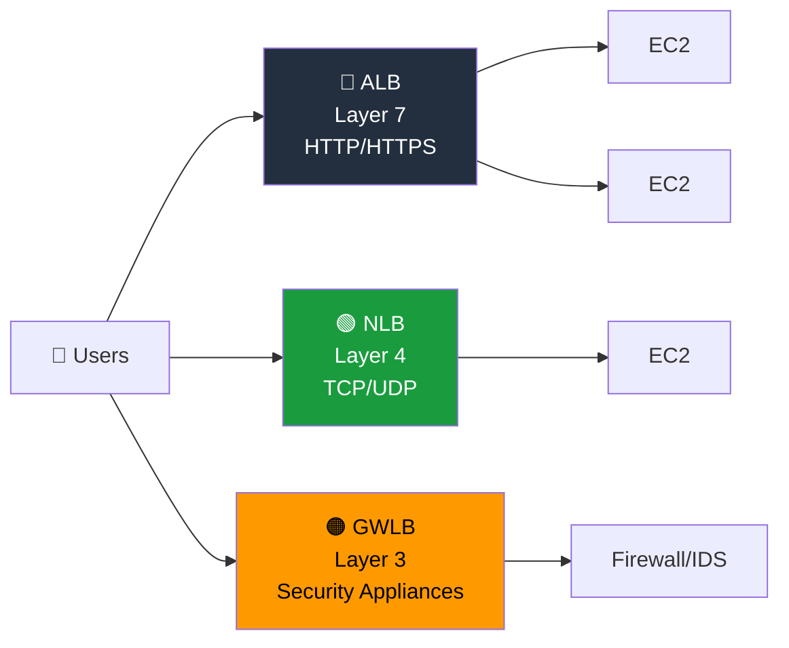
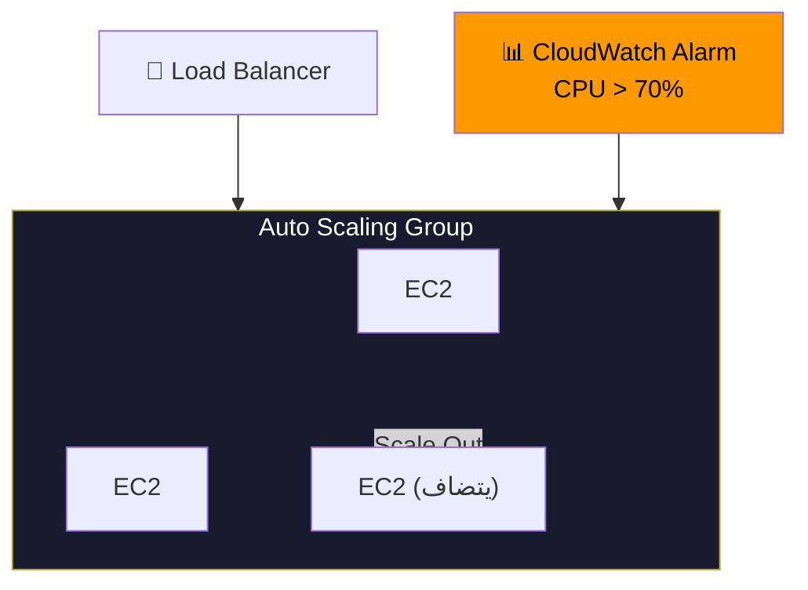

# ⚙️ Cloud Technology & Services — الجزء الأول
### AWS Certified Cloud Practitioner — CLF-C02
### EC2 + EC2 Storage + ELB & Auto Scaling

---

## 🖥️ الحكاية بتبدأ من السؤال الأساسي — إيه هو الـ Server اللي بتحتاجه؟

قبل الـ Cloud، لما كنت محتاج Server، كنت لازم تشتري Hardware فيزيائي بمواصفات محددة مسبقاً، تستنى التوصيل، تركّبه، تضبطه، وتاخد وقت طويل قبل ما تبدأ فعلاً. الـ **Amazon EC2 (Elastic Compute Cloud)** جاي يحل المشكلة دي بالكامل — بيوفرلك **Virtual Servers في الـ Cloud** تقدر تطلّعها في دقايق وتوقفها لما خلصت.

الـ EC2 هو الـ **IaaS** الأساسي في AWS — إنت مسؤول عن كل حاجة فوق الـ Hardware. وعشان تطلّع Instance، بتحتاج تحدد:

1. **Operating System** — Linux أو Windows أو Mac OS.
2. **Compute Power** — عدد الـ vCPUs وقوتهم.
3. **RAM** — قد إيه Memory محتاج.
4. **Storage** — إما Network-Attached (EBS أو EFS) أو Hardware مباشر (Instance Store).
5. **Network Card** — سرعة الشبكة والـ Public IP.
6. **Security Group** — الـ Firewall الخاص بالـ Instance.
7. **EC2 User Data** — Script بيتشغّل مرة واحدة عند أول Boot.

---

## 🚀 EC2 User Data — الـ Bootstrap Script

الـ **User Data** هو Script بتكتبه بيتشغّل تلقائياً **مرة واحدة بس** عند أول تشغيل للـ Instance. الهدف منه **Automate** المهام الأولية من غير تدخل يدوي. مثلاً:

1. تثبيت الـ Updates للـ OS.
2. تثبيت الـ Software اللي الـ Application بتحتاجه.
3. تحميل ملفات من الإنترنت.
4. تشغيل أي Script للإعداد الأولي.

نقطة مهمة: الـ User Data Script بيتشغّل بصلاحيات الـ **Root User**. وده معناه إنه يقدر يعمل أي حاجة على الـ System.

---

## 🏷️ EC2 Instance Types — مش كل Instance زي بعض

AWS بتوفر أنواع مختلفة من الـ Instances مصممة لـ Use Cases مختلفة. الـ Naming Convention بيتكون من:
- **حرف الـ Family** (زي `m` أو `c` أو `r`).
- **رقم الـ Generation** (رقم بيتزيد مع كل تحديث).
- **حجم الـ Instance** (زي `large` أو `2xlarge`).

يعني `m5.2xlarge` = Family M، الجيل الخامس، حجم 2xlarge.

**الأنواع الرئيسية لازم تعرفها:**

**1 — General Purpose (M, T):**
ده النوع الأكتر استخداماً — بيوفر توازن بين الـ Compute والـ Memory والـ Network. مناسب لـ Web Servers والـ Code Repositories وأي Workload متوسطة. الـ `t2.micro` هو الـ Free Tier Instance.

**2 — Compute Optimized (C):**
مصمم للـ Workloads اللي بتحتاج قوة حسابية عالية جداً:
- Batch Processing Jobs.
- Media Transcoding.
- High Performance Web Servers.
- High Performance Computing (HPC).
- Machine Learning و Scientific Modeling.
- Dedicated Gaming Servers.

**3 — Memory Optimized (R, X, z):**
مصمم للـ Workloads اللي بتشتغل على Data ضخم في الـ RAM:
- High Performance Relational/Non-Relational Databases.
- Distributed Web Scale Cache Stores.
- In-Memory Databases للـ Business Intelligence.
- Real-Time Processing of Big Unstructured Data.

**4 — Storage Optimized (I, D, H):**
مصمم للـ Workloads اللي محتاجة Read/Write عالي جداً من/للـ Local Storage:
- High Frequency OLTP Systems.
- Relational & NoSQL Databases.
- Cache for In-Memory Databases (زي Redis).
- Data Warehousing Applications.
- Distributed File Systems.

> [!important] قاعدة الامتحان
> - "High performance computing" أو "scientific modeling" → **Compute Optimized (C)**
> - "In-memory database" أو "real-time big data" → **Memory Optimized (R)**
> - "High frequency OLTP" أو "Redis cache" → **Storage Optimized (I)**
> - "Web server" أو "balanced workload" → **General Purpose (M, T)**

---

## 🔒 Security Groups — الـ Firewall بتاع الـ EC2

الـ **Security Groups** هي الطبقة الأساسية لأمان الشبكة على مستوى الـ EC2. بتشتغل زي **Firewall** — بتحدد مين يقدر يكلّم الـ Instance ومين لأ. كل Rule بتقول:

- **Protocol** — TCP أو UDP أو ICMP.
- **Port Range** — رقم البورت أو مدى من الـ Ports.
- **Source/Destination** — IP Address (CIDR) أو Security Group تاني.

**قواعد مهمة لازم تعرفها:**

1. **All inbound traffic is BLOCKED by default** — مفيش حاجة بتدخل الا لو فتحتها صراحةً.
2. **All outbound traffic is ALLOWED by default** — الـ Instance يقدر يتصل بأي حاجة برّا.
3. Security Group بيتحكم في الـ Traffic **قبل ما يوصل للـ Instance** — الـ Instance نفسه مش شايف الـ Traffic المتحجوب.
4. ممكن تربط نفس الـ Security Group بأكتر من Instance.
5. الـ Security Group **مقيد بـ Region وVPC** — مش بينقل من Region لـ Region.
6. ممكن Security Group يـ Reference Security Group تاني بدل الـ IP — ده بيسمح لـ Instances في SG معين يوصلوا لـ Instance في SG تاني.

**البورتات الأساسية اللي لازم تحفظها:**

| البورت | البروتوكول | الاستخدام |
|--------|-----------|-----------|
| 22 | SSH | تسجيل الدخول لـ Linux Instance |
| 21 | FTP | رفع ملفات |
| 22 | SFTP | رفع ملفات بأمان عبر SSH |
| 80 | HTTP | مواقع بدون تشفير |
| 443 | HTTPS | مواقع بتشفير |
| 3389 | RDP | تسجيل الدخول لـ Windows Instance |

> [!important] Timeout vs Connection Refused
> لو بتحاول توصل لـ Application وبتاخد **Timeout** — ده غالباً مشكلة **Security Group** (الـ Port مش مفتوح).
> لو بتاخد **Connection Refused** — الـ Security Group مش المشكلة، الـ Application نفسه مش شغّال أو مش على الـ Port ده.

---

## 💳 EC2 Purchasing Options — إزاي بتدفع؟

الـ EC2 بيوفر نماذج دفع مختلفة تناسب حالات مختلفة. فهم الفرق بينهم هو من أهم حاجات الامتحان.

**1 — On-Demand Instances:**
الأبسط والأغلى. بتدفع بالثانية (Linux/Windows) أو بالساعة (باقي الـ OS) من غير أي التزام. مناسب لـ:
- الـ Workloads قصيرة الأجل.
- التطبيقات الجديدة اللي مش عارف هتتصرف إزاي.
- الـ Testing والـ Development.

**2 — Reserved Instances (1 أو 3 سنين):**
بتدفع مقدماً مقابل خصم يصل لـ 72%. بتحجز مواصفات محددة (Instance Type وRegion وOS وTenancy). كل ما الـ Commitment أطول والدفع أكتر مقدماً، الخصم أكبر. نوعان:
- **Standard Reserved** — خصم أكبر، بس ما تقدرش تغير الـ Type.
- **Convertible Reserved** — خصم أقل (66%)، بس تقدر تغير الـ Instance Type والـ OS والـ Tenancy.

**3 — Savings Plans (1 أو 3 سنين):**
بتلتزم بمبلغ معين في الساعة (مثلاً $10/ساعة) لفترة محددة. الفرق عن الـ Reserved إنك مش مقيّد بـ Instance Type محدد — مرن في الـ Size والـ OS والـ Tenancy. بس مقيّد بالـ Instance Family والـ Region (مثلاً M5 في us-east-1 بس). أي استخدام فوق الـ Commitment بيتحسب بـ On-Demand.

**4 — Spot Instances:**
الأرخص على الإطلاق — خصم يصل لـ 90%. بتعمل **Bid** على AWS Capacity الفاضلة. لو الـ Spot Price أعلى من الـ Max Price بتاعك — AWS بتاخد الـ Instance منك في أي وقت. مناسب لـ:
- Batch Jobs وData Analysis وImage Processing.
- أي Workload ينفع يتوقف ويكمل بعدين.
- غير مناسب لـ Databases أو الـ Critical Applications.

**5 — Dedicated Hosts:**
بتحجز **سيرفر فيزيائي كامل** لاستخدامك وحدك. أغلى خيار. مناسب لـ:
- Software بـ Licensing معقد (BYOL — Bring Your Own License).
- شركات بمتطلبات Compliance وRegulatory صارمة.

**6 — Dedicated Instances:**
الـ Instance بتشتغل على Hardware خاص بيك — بس ممكن تشاركه مع Instances تانية في نفس الـ Account. مش بتتحكم في الـ Instance Placement على السيرفر.

**7 — Capacity Reservations:**
بتحجز Capacity في AZ معين لأي مدة — حتى لو ما شغّلتش الـ Instance. بتدفع On-Demand Rate سواء شغّلت أو لأ. مفيش Discount — بس ضمان إن الـ Capacity موجودة لما تحتاجها.

> [!abstract]+ تشبيه الـ Hotel — لتسهيل الحفظ
>
> - **On-Demand** = تيجي الـ Hotel أي وقت وتدفع التعريفة الكاملة.
> - **Reserved** = بتحجز غرفة مقدماً لمدة طويلة وبتاخد خصم.
> - **Savings Plans** = بتدفع مبلغ ثابت في الساعة وتقدر تقيم في أي نوع غرفة.
> - **Spot** = الـ Hotel بيبيع الغرف الفاضلة بسعر رخيص — بس ممكن تطردك لو حد دفع أكتر.
> - **Dedicated Host** = استأجرت المبنى كله.
> - **Capacity Reservations** = حجزت غرفة وبتدفع حتى لو ما جيتش.

---

## 💾 الجزء الثاني — EC2 Storage

---

## 📦 EBS — الهارد ديسك الشبكي

الـ **EBS (Elastic Block Store)** هو الـ Storage الافتراضي اللي بتربطه بالـ EC2 Instance. تخيّله "Flash Drive شبكي" — موجود على شبكة AWS بس بيتظاهر إنه هارد ديسك داخلي.

طبيعته:
1. **Network Drive** — بيتصل بالـ Instance عبر الشبكة، مش physically. معناه ممكن تشيله من Instance وتحطه في تاني.
2. **Bound to AZ** — الـ EBS Volume مقيّد بـ Availability Zone. Volume في `us-east-1a` ما تقدرش تربطه بـ Instance في `us-east-1b` مباشرة.
3. **Persist Data** — البيانات بتفضل حتى لو الـ Instance اتوقف أو اتحذف (بحسب الإعداد).
4. **Provisioned Capacity** — بتدفع على الـ Size المحجوزة حتى لو ما استخدمتهاش كلها.
5. **One Instance at a time** — في المستوى الأساسي (CCP)، Volume واحدة بتتربط بـ Instance واحدة.

**الـ Delete on Termination Attribute:** لما بتحذف الـ EC2 Instance:
- **الـ Root EBS Volume بتتحذف تلقائياً** (هي مش بيانات بس — هو الـ OS نفسه).
- **الـ Additional EBS Volumes لا تتحذف** بشكل افتراضي.

بتقدر تغير الإعداد ده من الـ Console أو CLI.

---

## 📸 EBS Snapshots — نسخة احتياطية في لحظة

الـ **Snapshot** هو نسخة احتياطية كاملة من الـ EBS Volume في لحظة معينة. القوة الحقيقية فيه: تقدر تاخد الـ Snapshot وتعمل منه Volume **في AZ تانية** أو حتى **Region تاني**. ده هو الطريقة الوحيدة لنقل EBS من AZ لـ AZ.

فيه ميزتان إضافيتان:
1. **Snapshot Archive** — تقدر تنقل الـ Snapshot لـ Storage أرخص بـ 75%. الاسترداد بياخد من 24 لـ 72 ساعة.
2. **Recycle Bin** — تقدر تضبط قواعد تحتفظ بالـ Snapshots المحذوفة لفترة (من يوم لسنة) كـ Safety Net ضد الحذف الغلط.

---

## 🖼️ AMI — الـ Machine Image الجاهز

الـ **AMI (Amazon Machine Image)** هو Template كامل للـ EC2 Instance — فيه الـ OS والـ Software والـ Configuration كلها. فكر فيه زي "Image" جاهزة تطلّع منها Instances بدون ما تبدأ من الصفر.

**ثلاث أنواع:**
1. **Public AMI** — AWS بتقدمها (Amazon Linux، Ubuntu، Windows، إلخ).
2. **Your Own AMI** — بتعملها إنت من Instance موجود، بتحفظ فيها كل الـ Software والـ Config.
3. **AWS Marketplace AMI** — شركات أو أفراد بيبنوا AMIs جاهزة (بعضها ببيعها).

**ليه Custom AMI؟** لأن بدلاً من إنك تطلّع Instance وتثبّت Software وتضبط Config في كل مرة — بتعمل ده مرة واحدة، وبتحفظ كـ AMI، وبعدين كل Instance جديدة بتطلعها جاهزة فوراً. ده بيسرّع الـ Boot Time جداً.

**عملية إنشاء Custom AMI:**
1. طلّع EC2 Instance وعمل عليه كل الـ Customizations.
2. وقّف الـ Instance (عشان الـ Data Integrity).
3. عمل AMI — ده بييخلق كمان EBS Snapshots للـ Volumes.
4. استخدم الـ AMI دي تطلّع Instances جديدة في أي AZ أو Region.

---

## 🏗️ EC2 Image Builder — Automate بناء الـ AMIs

الـ **EC2 Image Builder** خدمة Automate عملية بناء الـ AMIs وصيانتها. بدل ما تبني الـ AMI يدوياً، بتعمل Pipeline يشتغل على جدول (أسبوعي مثلاً أو عند كل Update للـ Packages) ويمر بالمراحل دي تلقائياً:

1. **Build** — بيطلع Instance مؤقت ويطبق عليه الـ Software والـ Config.
2. **Test** — بيشغّل Test Suite للتأكد إن الـ Image شغّالة وآمنة.
3. **Distribute** — بيوزّع الـ AMI على الـ Regions المطلوبة.

الـ Service نفسها **مجانية** — بتدفع بس على الـ EC2 Instances والـ Storage اللي بتستخدمها أثناء البناء.

---

## ⚡ EC2 Instance Store — السرعة مقابل الـ Persistence

الـ **Instance Store** هو Storage فيزيائي **ملصوق مباشرة بالـ Server** اللي الـ Instance شغّالة عليه. ده أسرع بكتير من الـ EBS لأنه مش Network Drive.

بس فيه Trade-off ضخم:
1. **Ephemeral** — لو الـ Instance اتوقفت أو اتحذفت، **البيانات بتتمسح نهائياً**.
2. **High I/O Performance** — أفضل بكتير من EBS لما تحتاج IOPS عالي جداً.

متى تستخدمه؟ للـ Buffer والـ Cache والـ Temporary Data — أي حاجة مش محتاج تفضلها. الـ Backup والـ Replication مسؤوليتك الكاملة.

---

## 📁 EFS — الـ Network File System المشترك

الـ **EFS (Elastic File System)** هو **Network File System** بتقدر تربطه بمئات الـ EC2 Instances في نفس الوقت — من AZs مختلفة في نفس الـ Region. ده الفرق الجوهري عن EBS اللي بيتربط بـ Instance واحد.

مميزاته:
1. **Multi-AZ** — بتربطه Instances في أي AZ داخل الـ Region.
2. **Highly Available** — مفيش Single Point of Failure.
3. **Scalable** — بيكبر تلقائياً مع البيانات، مش محتاج تحدد سعة مسبقاً.
4. **Linux Only** — مش بيشتغل مع Windows Instances.
5. **Pay per use** — بتدفع على اللي خزّنته فعلاً — مش على سعة محجوزة.
6. **Expensive** — حوالي 3 أضعاف تكلفة EBS gp2.

**EFS-IA (Infrequent Access)** — نسخة أرخص من EFS للملفات اللي ما بتتوصلهاش كل يوم. بتوفر حتى 92% من التكلفة. بتفعّل Lifecycle Policy تقول مثلاً "أي ملف ما اتوصلوش 60 يوم — انقله لـ EFS-IA" — وبيحصل تلقائياً وبشكل Transparent للـ Application.

---

## 📊 EBS vs EFS vs Instance Store — الفرق الجوهري

| الخاصية | EBS | EFS | Instance Store |
|---------|-----|-----|---------------|
| النوع | Block Storage | File System | Physical Disk |
| الربط | Instance واحدة | مئات Instances | Instance واحدة |
| النطاق | AZ واحد | Multi-AZ |مع السيرفر نفسه |
| الـ Persistence | نعم | نعم | لا (Ephemeral) |
| الأداء | جيد | متوسط | الأعلى |
| الاستخدام | OS وData | Shared Files | Cache وBuffer |

---

## 🗃️ Amazon FSx — لما تحتاج File System متخصص

الـ **Amazon FSx** بيوفرلك Managed File Systems من Third-Party — بدل ما تديرها نفسك. النوعان الأساسيان:

**FSx for Windows File Server:**
Windows Native File System بيدعم SMB Protocol والـ Windows NTFS. متكامل مع Microsoft Active Directory. مناسب لما عندك Windows Servers تحتاج Shared Storage بيعرف بروتوكولات Windows.

**FSx for Lustre:**
مصمم للـ High Performance Computing (HPC). الاسم مشتق من "Linux + Cluster". بيوصل لـ 100s GB/s وملايين IOPS بـ Latency أقل من ms. مناسب لـ Machine Learning وVideo Processing والـ Financial Modeling.

---

## ⚖️ الجزء الثالث — Elastic Load Balancing & Auto Scaling

---

## 📈 Scalability وHigh Availability — مفاهيم لازم تفهمها

قبل ما نتكلم عن الـ Services، في مفاهيم أساسية بيختلط فيهم الناس:

**Scalability** — قدرة النظام يتعامل مع حِمل أكبر. نوعان:
1. **Vertical Scalability (Scale Up/Down)** — بتكبّر الـ Instance نفسه. من `t2.micro` لـ `t2.large` مثلاً. ليه حد — مش ممكن تكبّر لما ما فيش Hardware أكبر. بيناسب الـ Databases.
2. **Horizontal Scalability (Scale Out/In)** — بتضيف Instances أكتر. بيناسب الـ Web Applications والـ Modern Distributed Systems.

**High Availability** — بتشغّل الـ Application في **أكتر من AZ** عشان لو واحدة وقعت، التانية بتكمل. الـ HA بيحتاج Horizontal Scaling عشان يشتغل صح.

**Elasticity** — مرحلة أعلى من الـ Scalability. النظام مش بس بيقدر يتوسع — بيتوسع ويتضيّق **تلقائياً** بناءً على الـ Load في اللحظة دي. ده هو جوهر الـ Cloud.

**Agility** — مفهوم مختلف تماماً — سرعة الحصول على الـ Resources. في السابق كانت تاخد أسابيع — دلوقتي ثواني.

> [!important] Exam Trap
> **Scalability ≠ Elasticity**
> - Scalability = يقدر يتوسع (يدوي أو تلقائي).
> - Elasticity = يتوسع ويتضيق **تلقائياً** بناءً على الـ Load.
> - Agility = سرعة الحصول على Resources (مش مرتبط بالـ Scale).

---

## 🔀 Elastic Load Balancer — موزّع الحِمل

الـ **Load Balancer** هو Server بيستقبل كل الـ Traffic القادم من المستخدمين وبيوزّعه على الـ EC2 Instances اللي ورّاه. المستخدم بيكلّم Load Balancer واحد بـ DNS ثابت، واللودبالانسر هو اللي يقرر يبعته لإنهي Instance.

**ليه تستخدم Load Balancer؟**
1. توزيع الـ Load على Instances متعددة.
2. تقديم **Single Point of Access** (DNS واحد) للـ Application.
3. **Health Checks** — لو Instance اتعطّل، اللودبالانسر بيوقف يبعتله Requests تلقائياً.
4. **SSL Termination** — بيتعامل مع الـ HTTPS ويبعت HTTP للـ Instances خلفه.
5. **High Availability** عبر Multi-AZ.

**الـ ELB (Elastic Load Balancer)** هو الـ Managed Load Balancer من AWS — AWS بتضمن تشغيله وتتكفل بالـ Updates والـ HA. فيه **4 أنواع:**

**1 — Application Load Balancer (ALB):**
يشتغل على **Layer 7** (الـ HTTP/HTTPS/gRPC). يفهم محتوى الـ Request ويقدر يوجّه بناءً على الـ URL Path أو الـ Hostname أو الـ HTTP Headers. بياخد Static DNS.

**2 — Network Load Balancer (NLB):**
يشتغل على **Layer 4** (الـ TCP/UDP). فائق السرعة — بيقدر يتعامل مع ملايين الـ Requests في الثانية. بياخد **Static IP عبر Elastic IP**. يستخدم لما تحتاج Ultra-High Performance أو Static IP.

**3 — Gateway Load Balancer (GWLB):**
يشتغل على **Layer 3** (الـ IP Packets). بيوجّه الـ Traffic لـ Third-Party Security Appliances (Firewalls وIntrusion Detection Systems). بيستخدم بروتوكول GENEVE.

**4 — Classic Load Balancer:**
نسخة قديمة تم إيقافها في 2023. ذُكر للتاريخ فقط.

---

## 🔄 Auto Scaling Groups — الـ Instances بتطلع وتتشال تلقائياً

الـ Load بتاع موقعك مش ثابت. في الصبح أقل، في الظهر أكتر، في العيد يتضاعف. الـ **ASG (Auto Scaling Group)** بيحل المشكلة دي بالكامل.

الـ ASG هو مجموعة من الـ EC2 Instances بتتإدار تلقائياً بناءً على الـ Load. بتحدد فيه:
1. **Minimum Size** — أقل عدد Instances شغّالة في أي وقت.
2. **Maximum Size** — أكبر عدد Instances تطلع في وقت الذروة.
3. **Desired Capacity** — العدد الحالي المطلوب.

الـ ASG بيعمل:
1. **Scale Out** — بيضيف Instances لما الـ Load يزيد.
2. **Scale In** — بيشيل Instances لما الـ Load ينزل.
3. **Health Check** — لو Instance Unhealthy، بيتشيل ويتعمل Replacement تلقائياً.
4. **Register with Load Balancer** — الـ Instances الجديدة بتتسجل تلقائياً في الـ ELB.

**استراتيجيات الـ Scaling:**

**1 — Manual Scaling:**
إنت بتغير الـ Desired Capacity يدوياً.

**2 — Dynamic Scaling:**
بيستجيب للـ Demand تلقائياً. نوعان:
- *Simple/Step Scaling* — مثلاً: لو الـ CPU > 70% → ضيف 2 Instances. لو CPU < 30% → اشيل 1.
- *Target Tracking* — مثلاً: حافظ على متوسط CPU عند 40% دايماً.

**3 — Scheduled Scaling:**
بناءً على وقت محدد. مثلاً: كل جمعة الساعة 5 المساء رفع الـ Min Capacity لـ 10 عشان الـ Traffic بيزيد.

**4 — Predictive Scaling:**
بيستخدم Machine Learning يتنبأ بالـ Traffic المستقبلي ويجهّز الـ Capacity مسبقاً. مناسب لما عندك Patterns متكررة ومتوقعة.

---

## 🎯 فخاخ الـ Exam

**الـ Trap الأول — EBS Locked to AZ:** لو سألك "كيف تنقل EBS Volume من AZ لـ AZ؟" — الإجابة دايماً عبر **Snapshot**. ما فيش طريقة مباشرة.

**الـ Trap التاني — EFS Linux Only:** الـ EFS بيشتغل بس مع Linux EC2. لو السؤال قال Windows Shared File System → **FSx for Windows**.

**الـ Trap التالت — Instance Store Ephemeral:** أي سؤال يقول "highest I/O performance" هو مش دايماً Instance Store — لو السؤال ذكر برضو "data persistence needed" فالإجابة EBS. الـ Instance Store بس لما الـ Temporary Data مقبولة.

**الـ Trap الرابع — ALB vs NLB:** "HTTP/HTTPS routing rules" أو "path-based routing" → ALB. "Ultra-high performance" أو "static IP" أو "TCP/UDP" → NLB.

**الـ Trap الخامس — Spot Not for Critical:** Spot مناسب لـ Batch Jobs وData Analysis — **مش** للـ Databases أو أي Workload محتاج Continuity.

**الـ Trap السادس — Dedicated Host vs Dedicated Instance:** Dedicated Host = سيرفر فيزيائي كامل ليك. Dedicated Instance = Hardware خاص بيك بس ممكن تشاركه مع Accounts تانية من نفس Organization مش موجود في EC2.

**الـ Trap السابع — Scalability ≠ Elasticity:** Elasticity = Auto-Scaling بناءً على الـ Load. Scalability = القدرة على التوسع — مش لازم تلقائي.

---

## 📝 أسئلة الـ Exam

### Q1. A company needs to run a high-performance in-memory caching layer for their web application. The data can be regenerated if lost. They need the absolute highest I/O performance possible. Which EC2 storage option should they use?

- A. EBS gp3 volume
- B. EFS with Provisioned Throughput
- C. EC2 Instance Store
- D. EBS io2 Block Express

> [!success]- ✅ Reveal Answer & Explanation
> **Correct Answer: C**
>
> الـ **Instance Store** بيوفر أعلى I/O Performance ممكنة لأنه Storage فيزيائي مربوط مباشرة بالـ Server. الـ Key Phrase هنا "highest I/O performance" مع "data can be regenerated if lost" — ده بيقولك إن الـ Ephemeral Nature مش مشكلة.
>
> **ليه الباقي غلط:**
> - **A و D** — الـ EBS بيوفر Performance كويسة بس مش الأعلى لأنه Network Drive — فيه Latency.
> - **B** — الـ EFS أبطأ من EBS وInstance Store لأنه Network File System مشترك.

---

### Q2. A company wants to run a Windows-based application on AWS that requires a shared file system that integrates with Microsoft Active Directory and supports the SMB protocol. Which storage solution should they use?

- A. Amazon EFS
- B. Amazon S3
- C. Amazon FSx for Windows File Server
- D. Amazon EBS with Multi-Attach

> [!success]- ✅ Reveal Answer & Explanation
> **Correct Answer: C**
>
> الـ **FSx for Windows File Server** هو الخيار الوحيد اللي بيدعم SMB Protocol وNTFS وActive Directory Integration. ده الـ Use Case المصمم له بالظبط.
>
> **ليه الباقي غلط:**
> - **A** — EFS بيدعم Linux فقط — مش Windows.
> - **B** — S3 Object Storage — مش File System بيدعم SMB.
> - **D** — EBS Multi-Attach محدود جداً ومش File System بالمعنى التقليدي.

---

### Q3. An e-commerce company experiences traffic spikes every Friday evening. They want to automatically add EC2 instances before the spike begins, based on historical patterns. Which ASG scaling strategy is MOST appropriate?

- A. Simple Scaling
- B. Target Tracking Scaling
- C. Scheduled Scaling
- D. Predictive Scaling

> [!success]- ✅ Reveal Answer & Explanation
> **Correct Answer: D**
>
> الـ **Predictive Scaling** هو الأنسب لما عندك **Predictable Time-Based Patterns**. بيستخدم ML يتعلم من التاريخ ويجهّز الـ Instances مسبقاً **قبل** ما الـ Traffic يجي — بدل ما يستنى الـ Load يزيد ويبدأ يـ Scale.
>
> **ليه الباقي غلط:**
> - **C (Scheduled)** — بيتطلب منك تحدد يدوياً الوقت والـ Capacity. Predictive أذكى لأنه بيتعلم من البيانات.
> - **A و B** — دول Reactive — بيستجيبوا للـ Load الحالي بدل ما يتوقعوا المستقبل.

---

### Q4. A media company needs an EC2 instance for video transcoding jobs that run for 2 hours daily. The jobs can be interrupted and resumed. Cost optimization is the top priority. Which purchasing option is MOST appropriate?

- A. On-Demand Instance
- B. Reserved Instance (1 year)
- C. Spot Instance
- D. Dedicated Host

> [!success]- ✅ Reveal Answer & Explanation
> **Correct Answer: C**
>
> الـ **Spot Instances** هي الأرخص (حتى 90% خصم) وهي مثالية لـ Workloads اللي "can be interrupted and resumed" — ده هو بالظبط وصف الـ Spot Use Case. الـ Video Transcoding هو مثال كلاسيكي على الـ Batch Jobs المناسبة للـ Spot.
>
> **ليه الباقي غلط:**
> - **A** — On-Demand الأغلى ولا فايدة من دفع التعريفة الكاملة لو الـ Job ينفع يتوقف.
> - **B** — Reserved Instance للـ Steady-State Workloads اللي شغّالة طول الوقت — 2 ساعة يومياً مش كافي يستحق الـ Commitment.
> - **D** — Dedicated Host الأغلى على الإطلاق وللـ Compliance Requirements.

---

### Q5. Which of the following are true about Security Groups? (Select TWO)

- A. Security Groups can allow or deny traffic
- B. All inbound traffic is blocked by default
- C. All outbound traffic is blocked by default
- D. A Security Group can be attached to only one EC2 instance
- E. Security Groups can reference other Security Groups

> [!success]- ✅ Reveal Answer & Explanation
> **Correct Answers: B and E**
>
> **B** — صح تماماً. كل الـ Inbound Traffic ممنوع by default — لازم تفتح الـ Ports صراحةً.
>
> **E** — صح. Security Group ينفع يـ Reference Security Group تاني بدل IP. ده بيسمح لـ Instances في SG معين يوصلوا لـ Instances في SG تاني تلقائياً.
>
> **ليه الباقي غلط:**
> - **A** — Security Groups بس بتـ Allow — مفيش Deny Rules في الـ Security Groups. الـ Deny بييجي من Network ACLs.
> - **C** — الـ Outbound مفتوح by default — مش مغلق.
> - **D** — Security Group واحد ممكن يتربط بأكتر من Instance.

---

### Q6. A company needs to migrate 200TB of data to Amazon S3. Their internet connection is limited to 100Mbps and is shared with other business operations. The transfer would take months over the network. What is the recommended solution?

- A. AWS Direct Connect
- B. AWS Snowball
- C. AWS DataSync
- D. S3 Transfer Acceleration

> [!success]- ✅ Reveal Answer & Explanation
> **Correct Answer: B**
>
> الـ **AWS Snowball** هو الحل لما نقل البيانات عبر الإنترنت هياخد وقت غير معقول. مع 200TB و100Mbps، الحساب بيقول إن النقل هياخد أكتر من شهر. القاعدة: "لو هياخد أكتر من أسبوع عبر الشبكة — استخدم Snowball." بتبعت Device فيزيائي، بتحمّل عليه البيانات، وبتبعته لـ AWS.
>
> **ليه الباقي غلط:**
> - **A** — Direct Connect للـ Dedicated Network Connection المستمر — مش للـ One-Time Migration.
> - **C** — DataSync للـ Online Data Transfer — بس ما بيحلش مشكلة الـ Bandwidth الضعيف.
> - **D** — S3 Transfer Acceleration بتسرّع الـ Upload عبر الإنترنت — بس ما بتحلش مشكلة الـ Bandwidth المحدود الأساسي.

---

## 📊 الـ Cheat Sheet — الجزء الأول

| السؤال | الإجابة |
|--------|---------|
| EC2 = نوع الخدمة | IaaS |
| User Data بيتشغّل | مرة واحدة عند أول Boot |
| Balanced workload (Web Server) | General Purpose (T, M) |
| High CPU, Batch Jobs, HPC | Compute Optimized (C) |
| In-Memory Database, Real-Time | Memory Optimized (R) |
| High IOPS, OLTP, Redis | Storage Optimized (I) |
| أرخص خيار | Spot Instances (حتى 90%) |
| BYOL أو Compliance | Dedicated Host |
| EBS مقيد بـ | AZ واحد |
| نقل EBS بين AZs | عبر Snapshot |
| EFS — Linux أم Windows؟ | Linux فقط |
| Windows Shared File System | FSx for Windows File Server |
| Highest I/O Performance (Temporary) | EC2 Instance Store |
| Inbound Traffic by Default | مغلق |
| Outbound Traffic by Default | مفتوح |
| Timeout Error | Security Group Issue |
| Connection Refused | Application Issue |
| ALB — Layer | Layer 7 (HTTP/HTTPS) |
| NLB — Layer | Layer 4 (TCP/UDP) — Ultra High Performance |
| GWLB — Layer | Layer 3 — Security Appliances |
| Scalability vs Elasticity | Elasticity = تلقائي |
| ASG + ML لتوقع Traffic | Predictive Scaling |
| ASG بناءً على وقت | Scheduled Scaling |

---

*الجزء الجاي: **S3 بالتفصيل — Storage Classes + Versioning + Replication + Snowball** وبعدين **Databases & Analytics**.*
