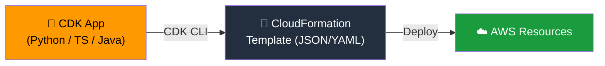
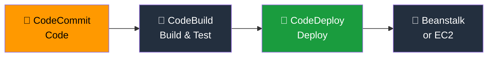
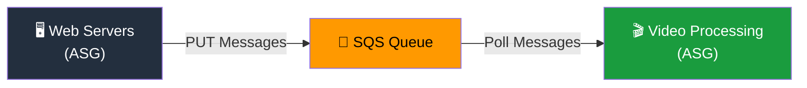

# 🚀 Cloud Technology & Services — الجزء الثالث
### AWS Certified Cloud Practitioner — CLF-C02
### Other Compute + Deploying at Scale + Cloud Integration

---

## 📦 الحكاية بتبدأ من — الـ Container ده إيه بالظبط؟

قبل الـ Containers، لما Developer بتكتب Code على جهازها وبيشتغل تمام — وبعدين ترفعه على السيرفر يوقع، الجملة الأشهر في التاريخ بتطلع: **"It works on my machine!"** المشكلة في الـ Dependencies والـ Libraries والـ OS Version اللي بتختلف بين البيئات.

الـ **Docker** حل المشكلة دي من جذورها — بيـ Package الـ App مع كل اللي تحتاجه (Code + Runtime + Libraries + Config) في **Container** واحد. الـ Container ده بيشتغل بنفس الطريقة بالظبط في أي مكان — على Laptop المطور، على Server التطوير، وعلى الـ Production.

---

## 🐋 Docker — المفاهيم الأساسية

الـ Docker بيشتغل بشكل مختلف عن الـ Virtual Machines التقليدية:
- **VM** = كل VM عندها OS كامل — بياكل Resources كتير.
- **Container** = بيتشارك الـ OS مع الـ Host ومع Containers تانية — خفيف جداً وبيتشغّل في ثواني.

**Docker Images** بتتخزن في **Repositories**:
1. **Docker Hub** — المستودع العام. فيه Images جاهزة لكل حاجة: Ubuntu، MySQL، Node.js، Python، إلخ.
2. **Amazon ECR (Elastic Container Registry)** — المستودع الخاص على AWS. بتخزن فيه الـ Images الخاصة بـ Applications بتاعتك عشان ECS أو Fargate يشغّلوها.

---

## 🏗️ Amazon ECS — Containers على EC2

الـ **ECS (Elastic Container Service)** بيشغّل الـ Docker Containers على AWS. الطريقة:
1. إنت بتـ Provision وتدير الـ EC2 Instances (الـ Infrastructure).
2. AWS بتتكفل ببدء وإيقاف الـ Containers وتوزيعها على الـ Instances.
3. متكامل مع الـ Application Load Balancer.

الـ ECS مناسب لما تحتاج **تحكم كامل في الـ Infrastructure** اللي الـ Containers شغّالة عليه.

---

## ☁️ AWS Fargate — Containers بدون Servers

الـ **Fargate** هو الحل الـ Serverless للـ Containers. الفرق الجوهري عن ECS:
1. ما فيش EC2 Instances تديرها أو تـ Provision.
2. بتقول بس: محتاج Container بـ X vCPU وY GB RAM.
3. Fargate بيشغّل الـ Container ويديره.
4. بتدفع بس على الـ CPU والـ RAM اللي الـ Container استخدمها فعلاً.

> [!important] ECS vs Fargate في الامتحان
> - **ECS** = بتدير الـ EC2 Instances نفسك + AWS بتدير الـ Containers.
> - **Fargate** = مش بتدير أي Servers — Serverless Containers.
> - السؤال بيقول "no infrastructure to manage" أو "serverless containers" → **Fargate**.

---

## ☸️ Amazon EKS — Kubernetes على AWS

الـ **EKS (Elastic Kubernetes Service)** بيشغّل **Managed Kubernetes Clusters** على AWS. الـ Kubernetes هو Open-Source System لإدارة وتوسيع وتوزيع الـ Containerized Applications.

الفرق الجوهري بين ECS وEKS:
1. **ECS** — AWS Proprietary System لإدارة الـ Containers.
2. **EKS** — Open-Source Kubernetes — اللي تتعلمه هنا بيشتغل على Azure وGCP وOn-Premises كمان.

الـ Containers في EKS تقدر تشتغل على:
1. EC2 Instances عادية.
2. Fargate — Serverless.

> [!important] متى تستخدم EKS؟
> لو الشركة عندها Kubernetes Expertise جاهزة أو عندها Kubernetes يشتغل On-Premises وعايزة تنقله لـ AWS بدون ما تغير كل حاجة → **EKS**.

---

## ⚡ AWS Lambda — الـ Function as a Service

الـ **Lambda** هو الـ Serverless Computing الأشهر في AWS. بدل ما تشغّل Server يفضل شغّال طول الوقت — بتكتب Function وبتشغّلها بس لما تحتاجها.

**الفرق بين EC2 وLambda:**

| EC2 | Lambda |
|-----|--------|
| Virtual Server في الـ Cloud | Virtual Functions — مش محتاج Server |
| محدود بالـ RAM والـ CPU | محدود بالوقت — Short Executions |
| شغّال طول الوقت | Run On-Demand |
| الـ Scaling يحتاج تدخل (ASG) | بيتوسع تلقائياً |

**مميزات Lambda:**
1. **Event-Driven** — بيتشغّل لما Event يحصل (مثلاً: ملف اتحمل على S3).
2. **متكامل** مع طول خدمات AWS.
3. **Pricing ممتاز** — أول مليون Request مجاني في الشهر.
4. **Languages** — Node.js، Python، Java، C#، Ruby، Go، Rust (عبر Custom Runtime).
5. **أقصى وقت تشغيل** — 15 دقيقة للـ Function الواحدة.
6. **RAM** — بتزيد الـ RAM وده بيزيد CPU والـ Network تلقائياً حتى 10GB.

**Pricing التفصيلي:**
1. **Per Request** — أول مليون Request مجاني. بعدين $0.20 لكل مليون.
2. **Per Duration** — أول 400,000 GB-seconds مجاناً في الشهر. بعدين $1 لكل 600,000 GB-second.

**أمثلة استخدام Lambda:**

**مثال 1 — Serverless Thumbnail Creation:**
1. User يرفع صورة على S3.
2. الـ Upload بيـ Trigger Lambda Function.
3. Lambda تعمل Thumbnail للصورة.
4. تحفظ الـ Thumbnail في S3 تاني.
5. تحفظ الـ Metadata في DynamoDB.

**مثال 2 — Serverless CRON Job:**
1. CloudWatch Events/EventBridge بيطلق Trigger كل ساعة مثلاً.
2. Lambda تشتغل وتعمل المهمة.
3. بدون Server شغّال طول الوقت في انتظار.

> [!important] Lambda Limitations للامتحان
> - **Max Execution Time**: 15 دقيقة.
> - **Max Memory**: 10 GB RAM.
> - Billing = per request + per GB-second.
> - Serverless — مفيش Servers تديرها.

---

## 🌐 Amazon API Gateway — بوابة الـ APIs

تخيل إنك عملت Lambda Function رائعة. بس إزاي الـ Users يوصلوها؟ الـ **API Gateway** هو الجواب — Managed Service بيخليك تبني وتنشر وتأمن وتراقب REST APIs وWebSocket APIs.

يشتغل مع Lambda عشان تعمل **Serverless API** كاملة:
1. Client بيبعت HTTP Request للـ API Gateway.
2. API Gateway بيـ Proxy الـ Request للـ Lambda.
3. Lambda بتشتغل وترجع Response.
4. API Gateway بيرجع الـ Response للـ Client.

مميزاته:
1. Serverless وScalable تلقائياً.
2. بيدعم Authentication وAuthorization.
3. API Throttling وAPI Keys.
4. Monitoring عبر CloudWatch.

---

## 🔄 AWS Batch — المهام الضخمة المجدولة

الـ **AWS Batch** مصمم للـ Batch Processing Jobs — مهام ليها بداية ونهاية (مش Continuous). مثلاً: معالجة مليون صورة، أو تحليل ملف ضخم.

كيف بيشتغل:
1. بتـ Submit الـ Job على Batch.
2. Batch بيطلع EC2 Instances أو Spot Instances تلقائياً بالقدر المناسب.
3. بيشغّل الـ Jobs عليهم.
4. لما خلصت — بيوقف الـ Instances.

**الـ Jobs** بتتعرّف كـ Docker Images وبتشتغل على ECS.

**Lambda vs Batch — الفرق:**

| Lambda | Batch |
|--------|-------|
| Time Limit (15 دقيقة) | No Time Limit |
| Limited Runtimes (اللغات المدعومة) | Any Runtime (Docker Image) |
| Serverless | يشتغل على EC2 (AWS بتديره) |
| Limited Disk Space | EBS / Instance Store للـ Storage |

> [!important] Batch في الامتحان
> "No time limit" أو "any Docker image" أو "large-scale batch processing" → **AWS Batch**.
> "Short tasks" أو "event-driven" أو "15 minutes max" → **Lambda**.

---

## 💡 Amazon Lightsail — البداية السهلة

الـ **Lightsail** هو بديل مبسّط للـ AWS كلها — مصمم للـ Developers اللي عندهم خبرة قليلة في الـ Cloud أو محتاجين حاجة بسيطة بسرعة.

بيوفر في مكان واحد بسعر ثابت ومتوقع:
1. Virtual Servers (زي EC2).
2. Storage (زي EBS).
3. Databases (زي RDS).
4. Networking (زي Route 53).

الـ Use Cases:
1. Simple Web Applications (LAMP، Nginx، MEAN، Node.js).
2. WordPress، Magento، Joomla.
3. Dev/Test Environments.

القيود:
1. **High Availability موجودة** — بس **لا يوجد Auto-Scaling**.
2. **Limited AWS Integrations** — مش بتقدر تربطه بكل خدمات AWS بسهولة.

> [!important] Lightsail في الامتحان
> "Simple application" أو "low and predictable pricing" أو "no cloud experience" أو "WordPress hosting" → **Lightsail**.
> لما السؤال يقول "limited AWS integrations" كـ Disadvantage → كمان **Lightsail**.

---

## 🏗️ الجزء الثاني — Deploying & Managing Infrastructure at Scale

---

## 📋 الحكاية بتبدأ — مشكلة كل Developer

الـ Developer ده مش مشكلته الكود بس. مشكلته كمان:
1. توفير الـ Infrastructure (EC2، ELB، RDS، إلخ).
2. Deploy الـ Code على السيرفرات.
3. ضبط الـ Configuration في كل بيئة.
4. التأكد إن الـ Production مطابق للـ Staging.
5. التعامل مع الـ Scaling.

AWS عندها مجموعة خدمات بتحل كل مشكلة من دول.

---

## 📄 AWS CloudFormation — الـ Infrastructure as Code

الـ **CloudFormation** هو الطريقة الـ Declarative لتعريف كل الـ AWS Infrastructure في ملف نصي (JSON أو YAML). بدل ما تروح الـ Console وتعمل كل حاجة يدوياً — بتكتب Template بيقول:
1. عايز Security Group بالمواصفات دي.
2. عايز EC2 Instances اتنين باستخدام الـ Security Group ده.
3. عايز Load Balancer قدامهم.

وبعدين CloudFormation بيعملها كلها بالترتيب الصح من غير تدخل.

**فوايد CloudFormation:**
1. **Infrastructure as Code** — الـ Infrastructure بقى كود يتراجع ويتـ Version Control.
2. **No Manual Resources** — ما فيش حاجة بتتعمل يدوياً — التحكم كامل.
3. **Cost Management** — كل Resource في الـ Stack بياخد Tag تعرف منه كم كلّف. وتقدر تقدّر التكلفة من الـ Template قبل ما تنشئ حاجة.
4. **Productivity** — تقدر تمسح Infrastructure وتعيد إنشائه في ثواني. مثلاً في بيئة Dev: بتشغّل الـ Stack الصبح وبتمسحه بالليل — توفير تكلفة.
5. **لا تعيد اختراع العجلة** — تقدر تستخدم Templates موجودة من الإنترنت.
6. **Supports almost all AWS Resources** — كل حاجة شوفتها في الكورس بتنشئها بـ CloudFormation.

**Infrastructure Composer** — أداة Visual في الـ Console بتخليك تصمم الـ Architecture بالـ Drag & Drop وبتولّد الـ CloudFormation Template تلقائياً.

---

## 🔧 AWS CDK — اكتب Infrastructure بلغتك المفضلة

الـ **CDK (Cloud Development Kit)** بيخليك تكتب الـ Infrastructure بلغات برمجة حقيقية بدل YAML:
1. JavaScript / TypeScript.
2. Python.
3. Java.
4. .NET.

الـ CDK بيـ Compile الكود ده لـ CloudFormation Template تلقائياً. يعني نفس نتيجة CloudFormation — بس بكود أذكى وأسهل.

**ليه CDK أحسن من CloudFormation مباشرة؟** لأن بتقدر تستخدم Loops وConditions والـ Object-Oriented Programming — حاجات ما تقدرش تعملها في YAML بسهولة.

مثالي لـ:
1. Lambda Functions — بتعرّف الـ Function والـ Infrastructure معاً في نفس الكود.
2. Docker Containers في ECS/EKS.

---

## 🌱 AWS Elastic Beanstalk — الـ PaaS للـ Developers

الـ **Elastic Beanstalk** هو الـ Developer-Centric View لـ Deploy الـ Application على AWS. بيستخدم تحت الغطاء كل الخدمات اللي عرفناها (EC2، ASG، ELB، RDS) — بس بيخبّيها في View واحد بسيط.

الـ Developer بيدي Beanstalk الكود بس — وBeanstalk بيتكفل بكل الباقي:
1. Instance Configuration والـ OS.
2. Deployment Strategy.
3. Capacity Provisioning.
4. Load Balancing والـ Auto-Scaling.
5. Application Health Monitoring.

**نوع الخدمة: PaaS (Platform as a Service)**. إنت مسؤول بس عن الـ Application Code. مجاني — بتدفع بس على الـ Resources اللي بيستخدمها.

**اللغات المدعومة:**
1. Go، Java SE، Java with Tomcat.
2. .NET on Windows، Node.js، PHP، Python، Ruby.
3. Single Container Docker، Multi-Container Docker.
4. Packer Builder.

**ثلاث Architecture Models:**
1. **Single Instance** — للـ Development البسيط.
2. **LB + ASG** — للـ Production Web Applications.
3. **ASG فقط** — للـ Background Workers في الـ Production.

---

## 🚀 AWS CodeDeploy — توصيل الكود للسيرفرات

الـ **CodeDeploy** بيـ Automate عملية توصيل الكود الجديد للسيرفرات. الميزة إنه **Hybrid Service** — بيشتغل على:
1. EC2 Instances.
2. On-Premises Servers.

الشرط الوحيد: الـ **CodeDeploy Agent** لازم يكون متثبّت على كل Server قبل الاستخدام.

بيتعامل مع الـ V1 → V2 Upgrades بشكل Automated ومنظم، وعنده Strategies مختلفة (Rolling، Blue/Green، إلخ).

---

## 📁 AWS CodeCommit — الـ Git على AWS

الـ Developers بحاجة يخزنوا الكود في Repository قبل ما يرسلوه للسيرفرات. **CodeCommit** هو الـ AWS Git Repository — منافس مباشر لـ GitHub.

مميزاته:
1. Source-Control Service يـ Host Git-Based Repositories.
2. تعاون سهل بين الـ Developers — كل تغيير بياخد Version تلقائياً.
3. Fully Managed، Scalable، Highly Available.
4. Private، Secured، ومتكامل مع AWS.

> [!important] ملاحظة مهمة
> AWS أعلنت إنها وقفت تطوير CodeCommit في 2024. الـ Exam مازال بيذكره — بس في الواقع الشركات بتتحرك لـ GitHub أو Bitbucket.

---

## 🔨 AWS CodeBuild — Build وTest في الـ Cloud

الـ **CodeBuild** هو الـ Build Service في السحابة. بيأخد الكود من الـ Repository ويعمل:
1. Compile الـ Source Code.
2. تشغيل الـ Tests.
3. ينتج Ready-to-Deploy Artifact.

مميزاته:
1. Fully Managed وServerless.
2. Continuously Scalable وHighly Available.
3. Pay-as-you-go — بتدفع بس على وقت الـ Build.

---

## 🔀 AWS CodePipeline — المايسترو

الـ **CodePipeline** هو الـ Orchestration Layer اللي بيربط كل الخدمات السابقة في Pipeline واحد متكامل. بيتبع الـ CI/CD Pattern:

مميزاته:
1. Fully Managed.
2. Compatible مع CodeCommit، CodeBuild، CodeDeploy، Beanstalk، CloudFormation.
3. كمان بيدعم GitHub وThird-Party Services.
4. Fast Delivery وRapid Updates.

---

## 📦 AWS CodeArtifact — مستودع الـ Dependencies

الـ Software Dependencies (الـ Libraries اللي الكود بيعتمد عليها) لازم تتخزن وتتمنج. الـ **CodeArtifact** هو Managed Artifact Management بياخد عنك المسؤولية دي.

بيدعم الـ Package Managers الشائعة:
1. **npm / yarn** — لـ JavaScript.
2. **pip / twine** — لـ Python.
3. **Maven / Gradle** — لـ Java.
4. **NuGet** — لـ .NET.

الـ Developers والـ CodeBuild بيجيبوا الـ Dependencies مباشرة من CodeArtifact.

---

## ⚙️ AWS Systems Manager (SSM) — إدارة الـ Fleet

الـ **SSM** مش Service واحدة — هو **Suite من أكتر من 10 Products** بتساعدك تدير EC2 Instances والـ On-Premises Servers على Scale كبير. هو كمان **Hybrid Service** — بيشتغل على الاتنين.

أهم ميزاته على مستوى الـ CCP:
1. **Patching Automation** — بتطبّق Updates وPatches على Fleet من السيرفرات تلقائياً.
2. **Run Command** — بتشغّل أوامر على Fleet كامل من السيرفرات من مكان واحد.
3. **SSM Parameter Store** — تخزين Configuration والـ Secrets بأمان.

**إزاي بيشتغل؟** بتثبّت الـ **SSM Agent** على كل Instance أو Server. الـ Agent ده بيخلي SSM يتحكم فيه من بعد. المشكلة الشائعة: لو Instance مش بيستجيب لـ SSM — الغالب إن الـ SSM Agent مش شغّال.

**SSM Session Manager — SSH بدون SSH:**
بيخليك تفتح Shell على EC2 أو On-Premises Servers من غير:
1. لا SSH Keys.
2. لا Bastion Hosts.
3. لا Port 22 مفتوح.

الوصول بيتحكم فيه IAM Permissions فقط. والـ Session Logs بتتبعت لـ S3 أو CloudWatch.

**SSM Parameter Store:**
Secure Storage للـ Configuration والـ Secrets:
1. API Keys وPasswords وConfiguration.
2. Serverless، Scalable، Durable، سهل الاستخدام بـ SDK.
3. تحكم في الوصول عبر IAM.
4. Version Tracking.
5. تشفير اختياري عبر KMS.

> [!important] Parameter Store vs Secrets Manager
> - **Parameter Store** — Simple، Free Tier موجود، بدون Automatic Rotation.
> - **Secrets Manager** — متخصص للـ Credentials، بيدعم Auto Rotation مع RDS.
> - لو السؤال ذكر "simple config values" أو "free" → **Parameter Store**.
> - لو ذكر "rotation" أو "database credentials" → **Secrets Manager**.

---

## 🔗 الجزء الثالث — Cloud Integration

---

## 📬 الحكاية بتبدأ — مشكلة الـ Communication بين الـ Services

لما عندك Application بيتكون من خدمات متعددة (Microservices)، لازم تتكلم مع بعض. في طريقتين:

**1 — Synchronous (مباشر):** Service A بتكلّم Service B وبتستنى الرد. المشكلة: لو Service B ببطيئة أو وقعت — Service A بتتأثر. ولو في Traffic Spike فجأي — كل حاجة بتتكسر.

**2 — Asynchronous (عبر Queue أو Topic):** Service A بتحط الـ Message في الـ Queue وبتكمل شغلها. Service B بتيجي وتاخد الـ Message من الـ Queue لما تكون جاهزة. الاتنين مستقلين عن بعض — **Decoupled**.

الـ AWS بتوفر ثلاث خدمات Integration رئيسية لهذا الغرض.

---

## 📨 Amazon SQS — Simple Queue Service

الـ **SQS** هو الـ Queue Service في AWS. الأقدم (أكتر من 10 سنين) والأكتر استخداماً للـ Decoupling.

**المفهوم البسيط:**
1. **Producer** بيبعت Message للـ Queue.
2. الـ Message بتفضل في الـ Queue لحد ما **Consumer** ياخدها.
3. بعد ما الـ Consumer يخلص معالجة الـ Message — بيمسحها من الـ Queue.

**مميزاته:**
1. Fully Managed — Serverless تقريباً.
2. يتعامل من رسالة واحدة في الثانية لـ **10,000+ في الثانية**.
3. Default Retention: 4 أيام — Maximum: **14 يوم**.
4. مفيش حد لعدد الـ Messages في الـ Queue.
5. بعد ما الـ Consumer يقرأ الـ Message — بتتمسح.
6. Multiple Consumers يقدروا يشاركوا الـ Work.

**SQS FIFO Queue:**
النوع الثاني من SQS — بيضمن إن الـ Messages بتتمعالج بالترتيب بالظبط (First In First Out). أبطأ قليلاً — بس لما الترتيب مهم.

**مثال تطبيقي:**

الـ Web Servers بيبعتوا Requests للـ Queue — الـ Video Processing Workers بياخدوا الـ Requests من القايمة. الاتنين بيـ Scale بشكل مستقل.

---

## 📢 Amazon SNS — Simple Notification Service

الـ **SNS** بيحل مشكلة مختلفة — إيه لو عايز تبعت نفس الـ Message لـ Subscribers كتير في نفس الوقت؟

**الـ Model: Pub/Sub (Publish/Subscribe)**
1. الـ **Publisher** بيبعت Message لـ **SNS Topic** مرة واحدة.
2. كل الـ **Subscribers** على الـ Topic بياخدوا الـ Message تلقائياً.

**الـ Subscribers ممكن يكونوا:**
1. SQS Queue.
2. Lambda Function.
3. Amazon Data Firehose.
4. Email.
5. SMS & Mobile Notifications.
6. HTTP/HTTPS Endpoints.

**الأرقام:**
1. حتى 12,500,000 Subscription لكل Topic.
2. حتى 100,000 Topic لكل Account.

**مقارنة SQS vs SNS:**

| SQS | SNS |
|-----|-----|
| Queue Model | Pub/Sub Model |
| Consumer واحد بياخد كل Message | كل Subscribers بياخدوا كل Message |
| Message بتفضل في الـ Queue (حتى 14 يوم) | No Message Retention |
| للـ Decoupling | للـ Broadcasting والـ Notifications |

---

## 🌊 Amazon Kinesis — Real-Time Data Streaming

الـ **Kinesis** هو الـ Managed Service لجمع ومعالجة وتحليل البيانات في Real-Time وعلى أي Scale.

الـ Exam بيطلب إنك تعرف الـ Concept وتتذكر المكونات الرئيسية:

1. **Amazon Kinesis Data Streams** — بيـ Ingest Data بـ Low Latency من مئات الآلاف من الـ Sources (IoT Devices، Click Streams، Metrics وLogs).
2. **Amazon Data Firehose** — بياخد البيانات من Kinesis Data Streams ويحطها في Destinations جاهزة زي S3 وRedshift وOpenSearch.

الـ Use Cases:
1. Real-Time Analytics على Click Streams.
2. IoT Data Processing.
3. Application Monitoring والـ Log Analysis.

> [!important] Kinesis في الامتحان
> "Real-time streaming data" أو "real-time big data" أو "IoT data at scale" → **Amazon Kinesis**.

---

## 🔀 Amazon MQ — للـ Legacy Applications

الـ SQS والـ SNS هم Proprietary من AWS ومش بيدعموا الـ Protocols التقليدية. الشركات اللي عندها Legacy Applications On-Premises بتستخدم Message Brokers تقليدية مثل **ActiveMQ** أو **RabbitMQ** وبتتكلم بـ Protocols زي:
1. MQTT.
2. AMQP.
3. STOMP.
4. OpenWire.
5. WSS.

لما الشركات دي بتيجي لـ AWS — بدل ما تعيد كتابة الـ Application بالكامل عشان تستخدم SQS/SNS — بتستخدم **Amazon MQ**.

الـ Amazon MQ هو Managed Message Broker Service لـ:
1. ActiveMQ.
2. RabbitMQ.

**الفرق عن SQS/SNS:**
1. Amazon MQ ما بـ Scale بنفس القوة زي SQS/SNS.
2. Amazon MQ بيشتغل على Servers (مش Serverless).
3. بيدعم Multi-AZ مع Failover.
4. عنده Queue Features (زي SQS) وTopic Features (زي SNS) في نفس الوقت.

> [!important] MQ في الامتحان
> "Migrating existing application that uses MQTT/AMQP/RabbitMQ/ActiveMQ to cloud" → **Amazon MQ**.
> "New application on AWS" → **SQS أو SNS**.

---

## 🎯 فخاخ الـ Exam — الجزء الثالث

**الـ Trap الأول — ECS vs Fargate:** كلاهما للـ Containers. ECS = إنت بتدير الـ EC2. Fargate = مش بتدير أي Infrastructure (Serverless). لو السؤال قال "no servers to manage" → **Fargate**.

**الـ Trap التاني — Lambda Max Time 15 دقيقة:** أي Workload هياخد أكتر من 15 دقيقة — مش مناسب لـ Lambda. استخدم **Batch** بدله.

**الـ Trap التالت — CloudFormation vs Beanstalk:** CloudFormation = IaaS — إنت بتحدد كل Resource. Beanstalk = PaaS — بتدي الكود وBeanstalk بيفكر في الـ Infrastructure.

**الـ Trap الرابع — CDK مش بديل CloudFormation:** CDK بيولّد CloudFormation Templates — هو Layer فوقيه مش بديل.

**الـ Trap الخامس — SQS بيمسح الـ Message بعد القراءة:** لو محتاج نفس الـ Message توصل لأكتر من Consumer — استخدم **SNS** مش SQS. SNS بيبعت لكل الـ Subscribers.

**الـ Trap السادس — Kinesis مش SQS:** SQS للـ Decoupling بين الـ Services. Kinesis للـ Real-Time Data Streaming والـ Analytics. لو السؤال قال "real-time streaming" → **Kinesis**.

**الـ Trap السابع — Amazon MQ للـ Migration بس:** لو بنبني Application جديدة — SQS/SNS. لو بنـ Migrate Application موجودة بتستخدم MQTT/AMQP — **Amazon MQ**.

**الـ Trap الثامن — SSM Session Manager مش محتاج SSH:** Port 22 مش لازم يكون مفتوح. الوصول عبر IAM Permissions فقط.

---

## 📝 أسئلة الـ Exam

### Q1. A company wants to run Docker containers on AWS without managing any EC2 instances. They want a serverless solution. Which service should they use?

- A. Amazon ECS with EC2 Launch Type
- B. AWS Fargate
- C. Amazon EKS with Managed Node Groups
- D. AWS Batch

> [!success]- ✅ Reveal Answer & Explanation
> **Correct Answer: B**
>
> الـ **Fargate** هو الـ Serverless Compute Engine للـ Containers. ما فيش EC2 Instances تديرها — بتحدد بس CPU والـ RAM، وFargate بيشغّل الـ Containers.
>
> **ليه الباقي غلط:**
> - **A** — ECS with EC2 Launch Type = إنت بتدير الـ EC2 Instances.
> - **C** — EKS مع Managed Node Groups = AWS بتدير الـ EC2 Nodes بشكل أسهل — بس مازالت EC2 موجودة.
> - **D** — Batch للـ Batch Processing Jobs — مش للـ Continuous Container Workloads.

---

### Q2. A company needs to run a data processing job that requires 6 hours of computation and needs to process large files from EBS storage. Which compute service is the MOST suitable?

- A. AWS Lambda
- B. Amazon EC2 Spot Instances
- C. AWS Batch
- D. AWS Fargate

> [!success]- ✅ Reveal Answer & Explanation
> **Correct Answer: C**
>
> الـ **AWS Batch** هو الأنسب لأسباب عدة:
> 1. **6 ساعات** أكتر من الـ 15 دقيقة الـ Max لـ Lambda.
> 2. بيدعم EBS Storage — Lambda عندها Limited Temp Disk فقط.
> 3. بتـ Package الـ Job كـ Docker Image وبتـ Submit — Batch يتكفل بالباقي.
>
> **ليه الباقي غلط:**
> - **A** — Lambda Max Execution Time 15 دقيقة فقط.
> - **B** — EC2 Spot ممكن — بس Batch بيديرهم تلقائياً ومش محتاج تـ Provision يدوياً.
> - **D** — Fargate للـ Container Workloads المستمرة — مش المهام الـ Batch الكبيرة باستخدام EBS.

---

### Q3. A developer wants to deploy a web application to AWS without worrying about infrastructure, load balancing, or auto scaling. The application is written in Python. Which service provides this capability?

- A. AWS CloudFormation
- B. Amazon EC2 with Auto Scaling
- C. AWS Elastic Beanstalk
- D. AWS CDK

> [!success]- ✅ Reveal Answer & Explanation
> **Correct Answer: C**
>
> الـ **Elastic Beanstalk** هو PaaS — Developer بتدي الكود بس وBeanstalk بيتكفل بكل حاجة تانية (EC2، ELB، ASG، Monitoring). بيدعم Python كـ Runtime.
>
> **ليه الباقي غلط:**
> - **A** — CloudFormation IaaS — إنت بتحدد كل Resource يدوياً.
> - **B** — EC2 + ASG = إنت بتدير الـ Infrastructure كاملاً.
> - **D** — CDK لكتابة الـ Infrastructure as Code — مش لـ Deploy الـ Application مباشرة.

---

### Q4. A company is modernizing a legacy on-premises application that uses RabbitMQ as a message broker. They want to migrate to AWS with minimal code changes. Which service is the BEST fit?

- A. Amazon SQS
- B. Amazon SNS
- C. Amazon Kinesis
- D. Amazon MQ

> [!success]- ✅ Reveal Answer & Explanation
> **Correct Answer: D**
>
> الـ **Amazon MQ** هو الـ Managed Message Broker اللي بيدعم RabbitMQ (وActiveMQ). لما الـ Application مكتوبة تتكلم مع RabbitMQ بالـ AMQP Protocol — Amazon MQ بيخلي الـ Migration تحصل بأقل تعديلات ممكنة.
>
> **ليه الباقي غلط:**
> - **A** — SQS Proprietary AWS — الـ Application محتاجة تتعدّل عشان تكلّمه.
> - **B** — SNS نفس المشكلة — Proprietary AWS Protocol.
> - **C** — Kinesis للـ Real-Time Data Streaming — مش Message Broker للـ Microservices.

---

### Q5. Which AWS service allows you to define your infrastructure using Python or TypeScript and automatically generates CloudFormation templates?

- A. AWS Elastic Beanstalk
- B. AWS CloudFormation directly
- C. AWS CDK
- D. AWS Systems Manager

> [!success]- ✅ Reveal Answer & Explanation
> **Correct Answer: C**
>
> الـ **AWS CDK** بيخليك تكتب الـ Infrastructure بلغات برمجة حقيقية (Python، TypeScript، Java، .NET) وبيـ Compile الكود لـ CloudFormation Template تلقائياً.
>
> **ليه الباقي غلط:**
> - **A** — Beanstalk PaaS — بتدي الكود مش الـ Infrastructure Definition.
> - **B** — CloudFormation بيحتاج YAML أو JSON — مش Python أو TypeScript.
> - **D** — SSM لإدارة الـ Servers والـ Patching — مش لكتابة الـ Infrastructure.

---

### Q6. A company has a notification system that needs to send alerts simultaneously to an email list, an SQS queue for further processing, and a Lambda function. Which AWS service best enables this fan-out pattern?

- A. Amazon SQS
- B. Amazon SNS
- C. Amazon Kinesis
- D. Amazon MQ

> [!success]- ✅ Reveal Answer & Explanation
> **Correct Answer: B**
>
> الـ **SNS** هو الـ Pub/Sub Service — بتبعت Message واحدة للـ Topic، وكل الـ Subscribers (Email + SQS + Lambda) بياخدوا نسخة منها في نفس الوقت. ده بالظبط الـ Fan-Out Pattern.
>
> **ليه الباقي غلط:**
> - **A** — SQS كل Message بياخدها Consumer واحد فقط — مش كل الـ Subscribers.
> - **C** — Kinesis للـ Real-Time Data Streams — مش للـ Notification Fan-Out.
> - **D** — Amazon MQ للـ Legacy Protocol Migration — مش للـ Fan-Out Pattern الجديد.

---

### Q7. A security team wants to SSH into EC2 instances without opening port 22 or managing SSH keys. Which SSM feature enables this?

- A. SSM Parameter Store
- B. SSM Run Command
- C. SSM Session Manager
- D. SSM Patch Manager

> [!success]- ✅ Reveal Answer & Explanation
> **Correct Answer: C**
>
> الـ **SSM Session Manager** بيخليك تفتح Shell على الـ EC2 Instance بأمان من غير ما تحتاج:
> 1. Port 22 مفتوح.
> 2. SSH Keys.
> 3. Bastion Host.
>
> كل الـ Access بيتتحكم فيه عبر IAM Permissions، والـ Sessions بتتسجل في S3/CloudWatch.
>
> **ليه الباقي غلط:**
> - **A** — Parameter Store لتخزين الـ Config والـ Secrets.
> - **B** — Run Command لتشغيل أوامر على Fleet من الـ Servers — مش Shell تفاعلي.
> - **D** — Patch Manager للـ OS Patching التلقائي.

---

## 📊 الـ Cheat Sheet — الجزء الثالث

| السؤال | الإجابة |
|--------|---------|
| Containers على EC2 (بتدير الـ Instances) | Amazon ECS |
| Serverless Containers | AWS Fargate |
| Private Docker Registry على AWS | Amazon ECR |
| Managed Kubernetes على AWS | Amazon EKS |
| Serverless Functions (FaaS) | AWS Lambda |
| Lambda Max Execution Time | 15 دقيقة |
| Lambda Max RAM | 10 GB |
| Lambda Free Tier | مليون Request + 400,000 GB-seconds شهرياً |
| Create & Publish APIs | Amazon API Gateway |
| Large-Scale Batch Jobs | AWS Batch |
| Batch vs Lambda | Batch = No time limit + Docker + EBS |
| Simple Apps / Low Cloud Experience | Amazon Lightsail |
| Lightsail Limitation | No Auto-Scaling |
| Infrastructure as Code (YAML/JSON) | AWS CloudFormation |
| Infrastructure as Code (Python/TS/Java) | AWS CDK |
| PaaS — Deploy Code لا Infrastructure | Elastic Beanstalk |
| Deploy Code على EC2/On-Premises | AWS CodeDeploy |
| Git Repository على AWS | AWS CodeCommit |
| Build وTest الكود | AWS CodeBuild |
| CI/CD Pipeline Orchestration | AWS CodePipeline |
| Artifact Management (npm، pip، Maven) | AWS CodeArtifact |
| إدارة Fleet من السيرفرات | AWS SSM |
| SSH بدون Port 22 | SSM Session Manager |
| Config وSecrets بسيطة | SSM Parameter Store |
| Queue — Decoupling | Amazon SQS |
| SQS Max Retention | 14 يوم |
| Fan-Out / Pub-Sub | Amazon SNS |
| SNS Subscribers | SQS، Lambda، Email، SMS، HTTP |
| Real-Time Data Streaming | Amazon Kinesis |
| Legacy RabbitMQ/ActiveMQ Migration | Amazon MQ |
| SQS vs SNS | SQS: Consumer واحد / SNS: كل Subscribers |

---

*القسم الجاي: **Global Infrastructure + Cloud Monitoring + VPC & Networking + Billing & Pricing** — Domain 3 Part B.*
