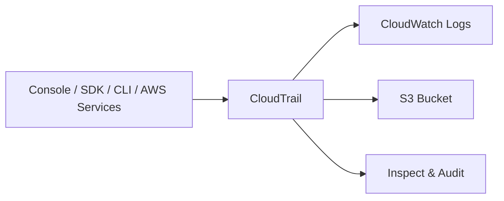
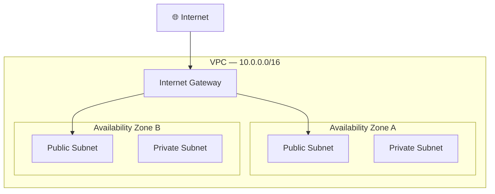

# 📊 Cloud Monitoring & VPC — الجزء الأول
### AWS Certified Cloud Practitioner — CLF-C02
---

## 🔍 الحكاية بتبدأ من ... — مشكلة الـ Visibility

تخيّل إنك شغّل تطبيق على AWS — instances شغّالة، databases بتتحدّث، requests بتيجي وبتروح. كل ده شغّال في الخفاء، وانت واقف برّه مش شايف حاجة. لو حاجة بطّلت أو بطّأت — هتعرف إزاي؟ هتحتاج Logs، هتحتاج Metrics، هتحتاج Alerts. ده بالظبط اللي بييجي يحله الـ Cloud Monitoring.

---

## ☁️ Amazon CloudWatch

الـ **CloudWatch** هو عين AWS على كل حاجة بتحصل في الـ Infrastructure. بيجمع **Metrics** من كل Service — يعني بيراقب المتغيرات الرقمية اللي بتعبّر عن صحة أو أداء كل Service. كل Metric بيجي مع **Timestamp** عشان تقدر تشوف التاريخ وتتابع التغيير في الوقت.

أهم الـ Metrics اللي بتجمعها CloudWatch:

1. **EC2 Instances** — CPU Utilization, Status Checks, Network In/Out. لاحظ: الـ RAM مش موجودة بالـ Default!
2. **EBS Volumes** — Disk Read/Writes.
3. **S3 Buckets** — BucketSizeBytes, NumberOfObjects, AllRequests.
4. **Billing** — Total Estimated Charge — بس متاحة في **us-east-1** فقط.
5. **Service Limits** — تقدر تعرف قدّيه استخدمت من الـ API Quota.
6. **Custom Metrics** — تقدر تبعت Metrics خاصة بيك — زي عدد الـ Active Users في التطبيق.

> [!important] EC2 Default Monitoring — فخ الـ RAM
> بالـ Default، الـ EC2 بتبعت Metrics كل **5 دقائق** — وده مجاني.
> لو عايز كل **دقيقة** → ده اسمه **Detailed Monitoring** وبيكلّف أكتر.
> الـ **RAM** مش بتتجمعها AWS تلقائياً — لو عايزها هتحتاج **CloudWatch Agent** أو Custom Metric.

### 🔔 CloudWatch Alarms

بعد ما تجمع الـ Metrics، الخطوة الجاية هي إنك تحدد حدود — لو العدّاد عدى الحد ده، عايز تعمل حاجة. ده هو الـ **Alarm**.

الـ Alarm بيشتغل على Metric وبيعمل واحدة من تلات Actions:

1. **Auto Scaling** — زيادة أو تقليل عدد الـ EC2 Instances تلقائياً.
2. **EC2 Actions** — Stop، Terminate، Reboot، أو Recover للـ Instance.
3. **SNS Notification** — يبعت رسالة على SNS Topic (واللي بعدها ممكن تبعت Email أو SMS).

الـ Alarm دايماً في واحدة من تلات حالات:

1. **OK** — الـ Metric في الحدود الطبيعية.
2. **ALARM** — الـ Metric عدّت الحد.
3. **INSUFFICIENT_DATA** — البيانات مش كفاية بعد عشان يحكم.

> [!abstract]+ مثال عملي — Billing Alarm
> أشهر استخدام للـ Alarms للمبتدئين هو إنك تعمل **Billing Alarm** على الـ CloudWatch Billing Metric.
> تحدد مثلاً إنك لو الفاتورة وصلت $10 — ييجيلك Email عشان تاخد بالك.
> المهم تاخد بالك: الـ Billing Metrics متاحة بس في **us-east-1**.

### 📝 CloudWatch Logs

الـ Metrics بتديك أرقام — لكن الـ **Logs** بتديك القصة الكاملة. CloudWatch Logs بيجمع الـ Log Files من:

1. **Elastic Beanstalk** — Application Logs.
2. **ECS** — Container Logs.
3. **AWS Lambda** — Function Logs.
4. **CloudTrail** — API Calls مبنية على Filter.
5. **Route 53** — DNS Queries.
6. **EC2 أو On-Premises Servers** — عن طريق الـ CloudWatch Logs Agent.

اللي بيميّز CloudWatch Logs إنه بيعمل **Real-time Monitoring** وبتقدر تتحكم في الـ **Retention Period** — يعني تحدد الـ Logs تتمسح بعد كام يوم.

> [!important] EC2 Logs — مش بتيجي لوحدها!
> بالـ Default، الـ EC2 Instance مش بتبعت Logs لـ CloudWatch خالص.
> عشان تبعت الـ Logs، محتاج:
> 1. تثبّت **CloudWatch Logs Agent** على الـ EC2 Instance.
> 2. تتأكد إن الـ **IAM Permissions** صح (الـ Instance Role عندها صلاحية تكتب في CloudWatch).
> 
> نفس الكلام بينطبق على **On-Premises Servers** — تقدر تثبّت الـ Agent هناك برضو وتبعت الـ Logs لـ CloudWatch.

---

## 🎯 Amazon EventBridge

لو CloudWatch بيراقب — EventBridge بيـ**react**. الفكرة إنك تحدد قاعدة: "لما يحصل الحدث ده، نفّذ الأكشن ده." وده بالظبط الـ **Event-Driven Architecture**.

EventBridge بيشتغل بطريقتين:

1. **Schedule (Cron Jobs)** — تحدد وقت ثابت وتشغّل Lambda أو أي Service. مثلاً: كل ساعة شغّل هذه الـ Function.
2. **Event Pattern** — React لحدث معين. مثلاً: لو الـ Root User اتلوج إن في الـ Console — ابعت Email على SNS.

الـ **Sources** (اللي بيبعتوا الأحداث) كتير جداً — S3 Events، CloudTrail API Calls، CodeBuild، Trusted Advisor، حتى External SaaS Partners. والـ **Destinations** (اللي بيستقبلوا الأوامر) برضو كتير — Lambda، SQS، SNS، ECS Tasks، Step Functions، CodePipeline، وغيرها.

> [!abstract]+ Event Buses — تلات أنواع
> EventBridge بيشتغل على مفهوم الـ **Event Bus**:
> 1. **Default Event Bus** — للـ AWS Services الرسمية.
> 2. **Partner Event Bus** — للـ SaaS Partners زي Zendesk أو Datadog.
> 3. **Custom Event Bus** — لـ Applications الخاصة بيك.
> 
> وفيه كمان **Schema Registry** — يساعدك تفهم شكل الـ Event اللي بييجيلك.
> وتقدر **تأرشف Events** وتعيد تشغيلها (Replay) وقت ما تحتاج.

---

## 🕵️ AWS CloudTrail

سؤال مهم: مين عمل الإجراء ده في الـ AWS Account؟ مين مسح الـ S3 Bucket ده؟ مين غيّر الـ IAM Policy دي؟ الإجابة موجودة في **CloudTrail**.

CloudTrail هو الـ **Audit Log** الرسمي لـ AWS — بيسجّل كل API Call اتعملت في الـ Account سواء من:

1. الـ **Console** (أي حد فتح AWS وضغط زرار).
2. الـ **SDK** (كود اتكتب واستخدم AWS SDK).
3. الـ **CLI** (أوامر اتكتبت من Terminal).
4. **AWS Services** نفسها (لما Service تستدعي Service تانية).

مميزات مهمة:

1. **Enabled by Default** — مش محتاج تفعّله، هو شغّال من أول ما تفتح Account.
2. تقدر تبعت الـ Logs لـ **CloudWatch Logs** أو **S3 Bucket** للحفظ طويل المدى.
3. بالـ Default بيطبّق على **كل الـ Regions** — لو عايز Region واحدة بس تقدر تحدده.
4. فيه **CloudTrail Insights** — بيحلل الـ Events تلقائياً ويكتشف الأنشطة الغريبة.

> [!important] القاعدة الذهبية للـ CloudTrail في الـ Exam
> **لو سألك السؤال: "Resource اتمسح في AWS — من أول حاجة تعملها؟"**
> الإجابة دايماً: **CloudTrail** — هو اللي بيديك تاريخ الـ API Calls وتعرف مين عمل إيه.

---

## 🔬 AWS X-Ray

تخيّل إن عندك تطبيق Microservices — Service بتكلم Service بتكلم Service. حاجة باظت وما بتعرفش في أنهي طبقة. اللي كنا بنعمله قبل ده كان:

1. نعمل Test Local.
2. نضيف Log Statements في كل حتة.
3. نعمل Re-deploy في Production.

ده وجع ومش scalable خالص. **X-Ray** جاي يحل المشكلة دي بالظبط.

X-Ray هو **Distributed Tracing Service** — بيرسم رحلة كل Request وهي بتعدي على الـ Services المختلفة، وبيديك **Visual Map** للـ Architecture كاملة.

X-Ray بيساعدك تعمل:

1. **Troubleshooting Performance** — تلاقي أين الـ Bottleneck.
2. **Understand Dependencies** — شوف العلاقات بين الـ Microservices.
3. **Pinpoint Service Issues** — تحدد أنهي Service بتسبب المشكلة بالظبط.
4. **Review Request Behavior** — اتفرّج على رحلة كل Request.
5. **Find Errors & Exceptions** — اعرف فين بيحصل الـ Errors.
6. **Check SLA Compliance** — هل بنحقق الـ Response Time المطلوب؟
7. **Identify Throttling** — فين بيحصل الـ Throttling؟
8. **Identify Impacted Users** — مين المستخدمين اللي اتأثروا؟

---

## 🤖 Amazon CodeGuru

ده واحد من الـ Services اللي بتسمعها وتقول "ده AI بيعمل Code Review؟" — وآه، ده بالظبط اللي بيعمله.

**CodeGuru** هو ML-Powered Service بيعمل حاجتين:

1. **CodeGuru Reviewer** — بيراجع الكود في وقت الـ Development ويديك Recommendations.
2. **CodeGuru Profiler** — بيراقب الـ Application في الـ Production ويديك Recommendations للـ Performance.

### CodeGuru Reviewer — في الكود

بيشوف الكود ويلاقي:
1. Common Coding Best Practices Violations.
2. Resource Leaks.
3. Security Vulnerabilities.
4. Input Validation Issues.

بيستخدم **Machine Learning** و **Automated Reasoning** — مبني على ملايين Code Reviews من Open-Source Projects وAmazon نفسها.
بيدعم **Java وPython فقط** (للـ CLF-C02).
بيتكامل مع **GitHub، Bitbucket، وAWS CodeCommit**.

### CodeGuru Profiler — في الـ Production

بيراقب سلوك التطبيق وقت الـ Runtime:
1. بيلاقي الكود اللي بياكل CPU زيادة عن اللازم.
2. بيديك **Heap Summary** — إيه الـ Objects اللي بتاكل Memory.
3. **Anomaly Detection** — لو في سلوك غريب.
4. Minimal Overhead على التطبيق أثناء الـ Profiling.
5. بيشتغل مع Apps على AWS وعلى On-Premises.

> [!abstract]+ CodeGuru في الـ Lifecycle
> - **Coding Phase** → CodeGuru Reviewer (built-in code reviews).
> - **Build & Test Phase** → CodeGuru Profiler (detect expensive lines pre-prod).
> - **Deploy & Measure Phase** → CodeGuru Profiler (performance + cost improvements in production).

---

## 🏥 AWS Health Dashboard

### Service History Dashboard

اللي كان اسمه "AWS Service Health Dashboard" — بيديك صورة شاملة عن صحة **كل الـ AWS Services في كل الـ Regions**. بيشوف التاريخ وفيه RSS Feed تقدر تشترك فيه.

### Account Health Dashboard

اللي كان اسمه "AWS Personal Health Dashboard (PHD)" — وده الأهم. الفرق الجوهري:

- **Service History** → صحة AWS بشكل عام (Generic).
- **Account Health** → تأثير مشاكل AWS على **Resources بتاعتك أنت** (Personalized).

ده بيديك:
1. **Alerts** لما AWS عندها Events بتأثر عليك.
2. **Remediation Guidance** — كيفية التعامل مع المشكلة.
3. **Proactive Notifications** للأحداث المجدولة.
4. تقدر تـ**Aggregate** البيانات من **AWS Organization** كاملة.

> [!important] Service History vs Account Health — فرق مهم في الـ Exam
> - **Service History** = الحالة العامة لـ AWS — "هل S3 شغّال في us-east-1?"
> - **Account Health** = تأثير المشاكل على Resources بتاعتك أنت شخصياً — "هل EC2 Instance بتاعتك في us-east-1 اتأثر؟"

---

## 🌐 VPC — Virtual Private Cloud

## ☁️ الحكاية بتبدأ من ... — عايز Network خاصة بيك في الـ Cloud

لما بتشغّل EC2 Instance، مش بتشغّلها في الفراغ — بتشغّلها جوه **Network**. على On-Premises كان عندك Network Physical في مبنى الشركة. على AWS، بتعمل نفس الفكرة لكن virtual — وده هو الـ **VPC**.

### 🔢 أنواع الـ IP Addresses في AWS

عشان تفهم الـ VPC، لازم تفهم الـ IP Addressing الأول:

**IPv4:**

1. **Public IPv4** — ممكن يتوصله من الـ Internet. الـ EC2 Instance بتاخد **Public IP جديدة** كل مرة توقفها وتشغّلها تاني (Stop/Start).
2. **Private IPv4** — بيستخدم جوه الـ Private Network بس (مش متاح من الإنترنت). الـ Private IP بتفضل **ثابتة** حتى بعد الـ Stop/Start.
3. **Elastic IP** — Public IPv4 **ثابتة** مرتبطة بـ Account بتاعك. تقدر تربطها بأي EC2 Instance وتفكّها متى ما تريد. لاحظ: **كل Public IPv4 على AWS بتكلّف $0.005 في الساعة** (حتى الـ Elastic IP).

**IPv6:**

1. كل الـ IP Addresses في IPv6 على AWS **Public** — مفيش Private Range.
2. الـ IPv6 **مجاني** على AWS.
3. مساحة ضخمة جداً (3.4 × 10³⁸ عنوان).

---

## 🏗️ VPC & Subnets

الـ **VPC** هو الـ Virtual Private Network بتاعتك في AWS — بيكون **Regional Resource** (مرتبط بـ Region).

جوه الـ VPC، بتقسّمه لـ **Subnets** — وكل Subnet مرتبطة بـ **Availability Zone** واحدة:

1. **Public Subnet** — متاحة من الإنترنت (فيها الـ Web Servers).
2. **Private Subnet** — مش متاحة من الإنترنت (فيها الـ Databases وBackend).

الـ **Route Tables** بتحدد إزاي الـ Traffic بيتحرك بين الـ Subnets وبرّا الـ VPC.

---

## 🚪 Internet Gateway & NAT Gateway

**مشكلة:** الـ Public Subnet محتاجة تتكلم مع الإنترنت. والـ Private Subnet محتاجة تـ**download updates** من الإنترنت من غير ما الإنترنت يقدر يوصلها.

**الحل:** تلت مكوّنات:

1. **Internet Gateway (IGW)** — بتركّبه على الـ VPC — بيسمح للـ Public Subnets تتكلم مع الإنترنت.
2. **NAT Gateway (AWS-Managed)** — بتحطّه في الـ Public Subnet — بيسمح للـ Private Subnet تخرج للإنترنت (outbound فقط) من غير ما تُعرَّض للـ Internet.
3. **NAT Instance (Self-Managed)** — نفس الفكرة لكن بتديره أنت — أرخص لكن أصعب.

---

## 🔒 Network ACL & Security Groups

الاتنين بيتحكموا في الـ Traffic، بس على مستويات مختلفة:

| الخاصية | Network ACL (NACL) | Security Group |
|---------|-------------------|----------------|
| المستوى | Subnet Level | Instance Level (EC2) |
| نوع الـ Rules | ALLOW و DENY | ALLOW فقط |
| الـ Rules بتشمل | IP Addresses فقط | IP Addresses + Security Groups |
| الـ State | Stateless | Stateful |
| الـ Evaluation | كل الـ Rules | بتوقف عند أول Match |

> [!important] Stateful vs Stateless — مهم جداً في الـ Exam
> - **Security Groups (Stateful):** لو سمحت الـ Inbound Traffic — الـ Outbound Response بيعدي تلقائياً مش محتاج Rule.
> - **NACL (Stateless):** لازم تكتب Rules لـ Inbound **وكمان** Outbound بشكل منفصل.
> - **Default NACL:** بيسمح كل حاجة (All traffic allowed).
> - **Custom NACL:** بيرفض كل حاجة by default.

---

## 📊 VPC Flow Logs

لو حاجة بتحصل غريبة في الـ Network — مين بيتكلم مع مين، من فين، إيه؟ **VPC Flow Logs** هي الإجابة.

بتـ**Capture** معلومات عن الـ IP Traffic في:

1. **VPC Level** — كل الـ Traffic في الـ VPC.
2. **Subnet Level** — Traffic في Subnet معينة.
3. **Network Interface Level** — Traffic في Interface معينة.

بيساعدك تـ**Troubleshoot**:
1. Subnets to Internet connectivity.
2. Subnets to Subnets connectivity.
3. Internet to Subnets connectivity.

بيشتغل كمان على الـ Managed Interfaces: ELB، ElastiCache، RDS، Aurora وغيرها.

الـ Logs تروح لـ: **S3، CloudWatch Logs، أو Amazon Data Firehose**.

---

## 🔗 VPC Peering

عايز VPCs تتكلم مع بعض؟ الـ **VPC Peering** بيخليهم يتعاملوا وكأنهم في نفس الـ Network.

قواعد مهمة:

1. الـ CIDR Ranges (نطاقات الـ IP) لازم تكون **غير متداخلة** (No Overlapping).
2. الـ Connection **مش Transitive** — يعني لو A متوصّل بـ B وB متوصّل بـ C، ده مش معناه إن A يتكلم مع C تلقائياً. لازم تعمل Peering منفصل بين A وC.

> [!important] Non-Transitive — Exam Trap
> VPC Peering **مش Transitive**. لو عندك 3 VPCs وعايزهم يتكلموا مع بعض — محتاج **3 Peering Connections** مش واحدة.
> (A↔B) + (B↔C) + (A↔C)

---

## 🔌 VPC Endpoints

عادةً لما EC2 في Private Subnet تتكلم مع S3 — الـ Traffic بيخرج للـ Public Internet وبعدين يرجع. ده:
- أبطأ.
- أغلى.
- أقل أمان.

الـ **VPC Endpoints** بتخلي الـ Traffic يفضل **جوه الـ AWS Network الخاص** من غير ما يخرج للـ Internet.

نوعين:

1. **VPC Endpoint Gateway** — بيستخدم مع **S3 وDynamoDB فقط**.
2. **VPC Endpoint Interface (ENI)** — بيستخدم مع **معظم الـ AWS Services** (بما فيها S3 وDynamoDB).

> [!important] S3 vs DynamoDB — Endpoint Type
> S3 وDynamoDB يدعموا الـ **Gateway Endpoint** (وده المجاني والأبسط) — وبرضو يدعموا الـ Interface Endpoint.
> باقي الـ Services → Interface Endpoint فقط.

---

## 🔐 AWS PrivateLink

لو عندك Service شغّالة في VPC وعايز تعرّضها لـ VPCs تانية (حتى لو عند Customers) من غير ما تعمل VPC Peering أو تخرج للـ Internet — الحل هو **PrivateLink**.

بيستخدم:

1. **Network Load Balancer** في الـ Service VPC.
2. **Elastic Network Interface (ENI)** في الـ Customer VPC.

ده الـ **Most Secure & Scalable** طريقة عشان تعرض Service لآلاف الـ VPCs.

---

## 🔒 Site-to-Site VPN & Direct Connect

عايز تربط الـ On-Premises Data Center بـ AWS؟ عندك خيارين:

**Site-to-Site VPN:**
1. بيمر على الـ **Public Internet**.
2. الـ Traffic مشفّر تلقائياً.
3. سريع في الإعداد.
4. محتاج **Customer Gateway (CGW)** on-premises و**Virtual Private Gateway (VGW)** على AWS.

**Direct Connect (DX):**
1. **Physical Connection مخصوصة** بين On-Premises وAWS.
2. بيمر على **Private Network** — مش عن طريق الإنترنت خالص.
3. أسرع وأثبت وأكثر أماناً.
4. بياخد على الأقل **شهر** عشان يتجهّز.

| الخاصية | Site-to-Site VPN | Direct Connect |
|---------|-----------------|----------------|
| الإنترنت | نعم (Public) | لا (Private) |
| الـ Encryption | تلقائي | مش تلقائي (محتاج MACsec) |
| الوقت | سريع (ساعات) | بطيء (شهر+) |
| التكلفة | أرخص | أغلى |
| الـ Bandwidth | محدود | ضخم |

---

## 💻 AWS Client VPN

لو الموظف نفسه (مش Data Center) عايز يتوصل بـ VPC من على Laptop بتاعه — **Client VPN** هو الحل.

بيستخدم **OpenVPN** — بيخليك تتوصل بالـ EC2 Instances عن طريق Private IP وكأنك جوّا الـ VPC نفسه. بيمر على الـ **Public Internet** لكن مشفّر.

---

## 🌉 Transit Gateway

لو عندك كتير من الـ VPCs وOn-Premises Networks وعايز توصّلهم ببعض — كل ما يزيد عدد الـ Connections، كل ما هتلاقي نفسك في **Mesh معقّد**.

**Transit Gateway** هو الحل — Hub-and-Spoke نموذج واحد:

1. كل VPC وكل On-Premises Network بيتوصل بـ **Transit Gateway واحد**.
2. الـ Transit Gateway بيتعامل مع الـ Routing كله.
3. بيدعم **Transitive Peering** — خلافاً لـ VPC Peering العادي.
4. بيشتغل مع **Direct Connect** وكمان **VPN**.

---

## 🎯 فخاخ الـ Exam

**الـ Trap الأول — RAM مش في Default Metrics:** الـ EC2 بتبعت CPU وNetwork بس بالـ Default. الـ RAM مش موجودة — محتاج CloudWatch Agent. لو السؤال سألك "كيف تراقب الـ RAM؟" → CloudWatch Agent + Custom Metric.

**الـ Trap الثاني — CloudTrail Enabled by Default:** كتير ناس بيفتكروا لازم تفعّله — لا، هو شغّال من أول ما تفتح Account. الـ Trap إنك تقول "عايزه يبدأ يسجّل" بدل ما تقول "روح اتفرّج على الـ Logs الموجودة."

**الـ Trap التالت — CloudTrail vs CloudWatch:** CloudWatch = Monitor Performance & Metrics. CloudTrail = Audit API Calls. لو السؤال قال "مين حذف الـ Resource ده؟" → CloudTrail. لو قال "CPU الـ Instance عالي؟" → CloudWatch.

**الـ Trap الرابع — VPC Peering Non-Transitive:** الـ Peering مش بينتقل. A↔B لا يعني A↔C حتى لو B↔C.

**الـ Trap الخامس — NAT Gateway vs Internet Gateway:** الـ IGW للـ Public Subnets عشان يتوصلوا بالإنترنت. الـ NAT Gateway للـ Private Subnets عشان يخرجوا للإنترنت من غير ما الإنترنت يقدر يوصلهم.

**الـ Trap السادس — Billing Metrics Region:** الـ Billing Metrics في CloudWatch متاحة بس في **us-east-1** — لو كنت في Region تانية مش هتلاقيها.

**الـ Trap السابع — Direct Connect Time:** Direct Connect بياخد **أكتر من شهر** في الإعداد. لو السؤال قال "urgent connectivity" → Site-to-Site VPN وليس Direct Connect.

**الـ Trap الثامن — NACL Stateless:** الـ NACL محتاج Rules للـ Inbound AND Outbound بشكل منفصل. الـ Security Groups Stateful — الـ Response بيعدي تلقائياً.

---

## 📝 أسئلة الـ Exam

### Q1. A company needs to monitor CPU utilization on their EC2 instances and automatically add more instances when CPU exceeds 80%. Which AWS services should they use together?

- A. AWS CloudTrail and Auto Scaling
- B. Amazon CloudWatch Alarms and EC2 Auto Scaling
- C. AWS X-Ray and Elastic Load Balancing
- D. Amazon EventBridge and Amazon SNS

> [!success]- ✅ Reveal Answer & Explanation
> **Correct Answer: B**
>
> الـ **CloudWatch Alarm** بتراقب الـ CPU Utilization Metric، ولما بيعدي 80% بتـTrigger **EC2 Auto Scaling** عشان يضيف Instances. ده بالظبط الـ Use Case الكلاسيكي.
>
> **ليه الباقي غلط:**
> - **A** — CloudTrail هو Audit لـ API Calls — مش بيراقب الـ Performance ومش بيتكلم مع Auto Scaling.
> - **C** — X-Ray هو Distributed Tracing — مش بيعمل Auto Scaling.
> - **D** — EventBridge ممكن يـTrigger Actions، لكن السؤال بيسأل عن Monitoring + Auto Scaling — CloudWatch Alarm هي الأنسب والأكثر شيوعاً.

---

### Q2. An AWS administrator needs to find out who deleted an S3 bucket in the AWS account yesterday. Which service should they check first?

- A. Amazon CloudWatch Logs
- B. AWS X-Ray
- C. AWS CloudTrail
- D. Amazon EventBridge

> [!success]- ✅ Reveal Answer & Explanation
> **Correct Answer: C**
>
> الـ **CloudTrail** بيسجّل كل API Call — بما فيها DeleteBucket. تقدر تتفرّج على الـ Event History وتعرف مين (User/Role)، إمتى، ومن فين (IP Address) عملت الـ Action.
>
> **ليه الباقي غلط:**
> - **A** — CloudWatch Logs بتحفظ Application Logs — مش API Audit Logs.
> - **B** — X-Ray هو لـ Distributed Tracing في الـ Applications — مش لـ Account Auditing.
> - **D** — EventBridge بيـReact للـ Events — مش بيسجّل التاريخ.

---

### Q3. A company wants to connect their on-premises data center to AWS privately, without using the public internet, for a high-bandwidth production workload. Which connectivity option is BEST suited?

- A. Site-to-Site VPN
- B. AWS Client VPN
- C. AWS Direct Connect
- D. VPC Peering

> [!success]- ✅ Reveal Answer & Explanation
> **Correct Answer: C**
>
> الـ **Direct Connect** بيعمل Physical Connection مخصوصة بين الـ On-Premises Data Center وAWS — بيمر على **Private Network** خالص، ده بيديك High Bandwidth وLatency منخفضة ومش بيعتمد على الإنترنت. ده هو الأنسب للـ Production Workloads الكبيرة.
>
> **ليه الباقي غلط:**
> - **A** — Site-to-Site VPN بيمر على Public Internet (حتى لو مشفّر) — مش "Private" بالمعنى الكامل.
> - **B** — Client VPN هو لاتصال الأفراد (Employees) بالـ VPC — مش لـ Data Center كامل.
> - **D** — VPC Peering هو لربط VPCs ببعض — مش لربط On-Premises بـ AWS.

---

### Q4. A developer is troubleshooting a microservices application where a specific API call is taking too long. They need to trace the request path across multiple services and identify the bottleneck. Which AWS service should they use?

- A. Amazon CloudWatch Logs
- B. AWS CloudTrail
- C. Amazon EventBridge
- D. AWS X-Ray

> [!success]- ✅ Reveal Answer & Explanation
> **Correct Answer: D**
>
> الـ **X-Ray** هو الـ Distributed Tracing Service — بيتبع الـ Request وهو بيعدي على كل الـ Microservices ويرسم Map بصري للرحلة. مصمم بالظبط لـ Troubleshooting Performance وتحديد الـ Bottlenecks في الـ Distributed Applications.
>
> **ليه الباقي غلط:**
> - **A** — CloudWatch Logs بتحفظ Log Lines — مش بتعمل Tracing عبر Services متعددة.
> - **B** — CloudTrail للـ API Audit — مش لـ Application Performance Tracing.
> - **C** — EventBridge للـ Event Routing — مش للـ Tracing.

---

### Q5. Which of the following statements about Network ACLs and Security Groups are CORRECT? (Select TWO)

- A. Security Groups can have both ALLOW and DENY rules
- B. Network ACLs are stateless and require explicit inbound and outbound rules
- C. Security Groups operate at the Subnet level
- D. Network ACLs are stateful, so return traffic is automatically allowed
- E. Security Groups are stateful, so return traffic is automatically allowed

> [!success]- ✅ Reveal Answer & Explanation
> **Correct Answer: B and E**
>
> - **B** — الـ NACL Stateless — لازم تكتب Rules للـ Inbound وللـ Outbound بشكل منفصل.
> - **E** — الـ Security Groups Stateful — لو سمحت Inbound Traffic، الـ Response بيعدي تلقائياً.
>
> **ليه الباقي غلط:**
> - **A** — Security Groups بتقبل ALLOW Rules **فقط** — مفيش DENY.
> - **C** — Security Groups بتشتغل على **Instance Level (EC2)** — مش Subnet Level. الـ NACLs هي اللي على Subnet Level.
> - **D** — الـ NACLs **Stateless** مش Stateful.

---

### Q6. A company's EC2 instances in a private subnet need to download software updates from the internet. The instances must NOT be directly accessible from the internet. What should be used?

- A. Internet Gateway attached to the private subnet
- B. NAT Gateway placed in a public subnet
- C. VPC Peering with a public VPC
- D. Elastic IP attached to each instance

> [!success]- ✅ Reveal Answer & Explanation
> **Correct Answer: B**
>
> الـ **NAT Gateway** هو المصمم بالظبط لده — بيسمح للـ Instances في الـ Private Subnet تخرج للإنترنت (Outbound) لكن مش بيسمح لأي حاجة من الإنترنت توصل الـ Instances (Inbound محجوب). بيتحط في **Public Subnet** ويتوصل بـ Internet Gateway.
>
> **ليه الباقي غلط:**
> - **A** — الـ Internet Gateway على مستوى الـ VPC مش الـ Subnet، وحتى لو ربطته بـ Private Subnet هيخلّها Public.
> - **C** — VPC Peering مش ليه علاقة بالوصول للإنترنت.
> - **D** — Elastic IP بتخلي الـ Instance متاحة من الإنترنت — عكس المطلوب.

---

### Q7. A company receives a notification that their EC2 instance will undergo scheduled maintenance by AWS. Which service provides this personalized notification?

- A. AWS Service Health Dashboard (Service History)
- B. AWS CloudTrail
- C. AWS Account Health Dashboard
- D. Amazon CloudWatch Alarms

> [!success]- ✅ Reveal Answer & Explanation
> **Correct Answer: C**
>
> الـ **AWS Account Health Dashboard** (المعروف قبل بالـ Personal Health Dashboard) هو اللي بيديك **Personalized View** — بيعرّفك بالأحداث اللي بتأثر على Resources بتاعتك أنت تحديداً، بما فيها Scheduled Maintenance.
>
> **ليه الباقي غلط:**
> - **A** — Service History Dashboard بيديك الوضع العام لـ AWS Services — مش مخصوص لـ Resources بتاعتك.
> - **B** — CloudTrail للـ API Audit — مش لـ Health Notifications.
> - **D** — CloudWatch Alarms بتـFire لما Metric تعدّي حد — مش لـ AWS Scheduled Maintenance.

---

## 📊 ملخص نهائي — الـ Cheat Sheet

| السؤال | الإجابة |
|--------|---------|
| CloudWatch — RAM موجودة by default؟ | لا — محتاج CloudWatch Agent |
| EC2 Default Monitoring Interval؟ | كل 5 دقائق |
| Detailed Monitoring Interval؟ | كل دقيقة (بيكلّف أكتر) |
| Billing Metrics متاحة في أنهي Region؟ | us-east-1 فقط |
| CloudWatch Alarm States؟ | OK, ALARM, INSUFFICIENT_DATA |
| مين عمل الـ API Call دي؟ | CloudTrail |
| CloudTrail Enabled by Default؟ | نعم |
| CloudTrail Logs بتروح فين؟ | CloudWatch Logs أو S3 |
| Distributed Tracing في Microservices؟ | AWS X-Ray |
| ML Code Review Service؟ | Amazon CodeGuru |
| CodeGuru Reviewer يدعم أنهي Languages؟ | Java وPython فقط |
| Service Health عام vs Personal؟ | Service History vs Account Health Dashboard |
| VPC — Regional أم Global Resource؟ | Regional |
| Public IP تتغير عند Stop/Start؟ | نعم (إلا لو Elastic IP) |
| Private IP تتغير عند Stop/Start؟ | لا، بتفضل ثابتة |
| IPv6 على AWS — Public أم Private؟ | Public فقط (مجاني) |
| Public IPv4 تكلّف كام؟ | $0.005 في الساعة |
| NAT Gateway بيتحط فين؟ | Public Subnet |
| الفرق بين NACL وSecurity Group؟ | NACL = Subnet + Stateless، SG = Instance + Stateful |
| VPC Peering Transitive؟ | لا — مش Transitive |
| VPC Endpoint Gateway بيدعم أنهي Services؟ | S3 وDynamoDB فقط |
| PrivateLink بيستخدم إيه؟ | NLB + ENI |
| Site-to-Site VPN بيمر على؟ | Public Internet (لكن مشفّر) |
| Direct Connect بيمر على؟ | Private Network (مش إنترنت) |
| Direct Connect بياخد كام وقت؟ | شهر على الأقل |
| Client VPN بيستخدم أنهي Protocol؟ | OpenVPN |
| Transit Gateway فايدته؟ | Hub-and-Spoke لآلاف VPCs + On-Premises |
| EventBridge بيختلف عن CloudWatch Events إزاي؟ | نفس الخدمة — EventBridge هو الاسم الجديد |

---
*الجزء الجاي: Machine Learning Services + Other AWS Services + Disaster Recovery & Migration*
