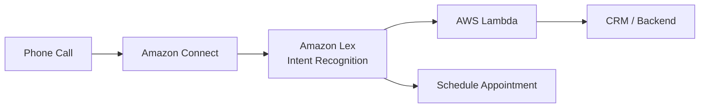
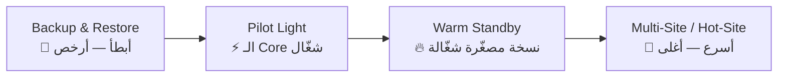

# 🤖 Machine Learning, Other Services & Migration — الجزء الثاني
### AWS Certified Cloud Practitioner — CLF-C02
---

## 🧠 الحكاية بتبدأ من ... — AWS والـ AI

AWS مش بس Infrastructure — عندها طبقة كاملة من الـ **Managed AI/ML Services**. الفكرة إنك ماتبنيش النماذج من الصفر — AWS عملت النماذج جاهزة وبتستخدمها عن طريق API. كل Service عندها Use Case محدد — وفي الـ Exam هتتسأل "أنهي Service لأنهي مشكلة؟"

---

## 👁️ Amazon Rekognition

المشكلة: عندك صورة أو فيديو وعايز تعرف فيه إيه أو مين. **Rekognition** هو الحل — بيحلّل الصور والفيديوهات باستخدام ML.

بيعمل:
1. **Object & Scene Detection** — يتعرّف على الأشياء والمشاهد في الصورة.
2. **Facial Analysis** — يحدد العمر والجنس والمشاعر.
3. **Face Search & Verification** — يقارن وجوه بـ Database من الوجوه.
4. **Celebrity Recognition** — يتعرّف على المشاهير.
5. **Content Moderation** — يكشف الـ Inappropriate Content تلقائياً.
6. **Text Detection** — يقرأ الـ Text الموجود جوّا الصورة.
7. **Pathing** — يتتبع حركة الأشخاص (مثلاً في تحليل المباريات الرياضية).

> [!abstract]+ Use Cases رئيسية
> - **Content Moderation** على Social Media — صور غير لائقة تتحذف تلقائياً.
> - **People Counting** في الأماكن العامة.
> - **User Verification** بالوجه.
> - **Sports Game Analysis** عن طريق الـ Pathing.

---

## 🎙️ Amazon Transcribe

**المشكلة:** عندك Audio أو Video وعايز تحوّله لـ Text. **Transcribe** هو Speech-to-Text Service من AWS.

بيستخدم تقنية **Automatic Speech Recognition (ASR)**. مميزاته:

1. بيحذف **Personally Identifiable Information (PII)** تلقائياً عن طريق الـ Redaction.
2. **Automatic Language Identification** — لو الـ Audio متعدد اللغات.
3. **Closed Captioning** — توليد Subtitles تلقائياً.
4. **Transcribe Customer Service Calls** — تسجيل وتحليل مكالمات الـ Support.
5. توليد **Metadata** للـ Media Assets عشان تكون Searchable.

---

## 🔊 Amazon Polly

**عكس Transcribe تماماً.** بدل ما تحوّل الكلام لـ Text — Polly بيحوّل الـ **Text لـ Speech** (Text-to-Speech).

بيستخدم **Deep Learning** عشان الصوت يطلع طبيعي وواقعي. بيستخدم في:
1. تطبيقات الـ Accessibility.
2. Audiobooks.
3. أي Application محتاج "يتكلم".

---

## 🌍 Amazon Translate

**Natural Language Translation** — بيترجم النصوص بين اللغات بدقة عالية. بيستخدم في:
1. **Localization** — تحويل الـ Website أو الـ App لعدة لغات.
2. ترجمة كميات ضخمة من الـ Content بكفاءة.

---

## 💬 Amazon Lex & Connect

**Amazon Lex** هو نفس التكنولوجيا اللي بتشغّل **Alexa**:

1. **Automatic Speech Recognition (ASR)** — يحوّل الكلام لـ Text.
2. **Natural Language Understanding (NLU)** — يفهم **نية** الكلام (Intent).
3. بيبني **Chatbots وCall Center Bots**.

**Amazon Connect:**

1. Cloud-based **Virtual Contact Center**.
2. بيستقبل المكالمات ويعمل Contact Flows.
3. بيتكامل مع الـ CRM Systems والـ AWS Services الأخرى.
4. **مفيش Upfront Payments** — Pay-as-you-go.
5. **أرخص بـ 80%** من مراكز الاتصال التقليدية.

---

## 📖 Amazon Comprehend

**Natural Language Processing (NLP)** — بيفهم الـ Text ويستخرج منه معلومات:

1. **Language Detection** — يحدد لغة النص.
2. **Key Phrases & Entities** — يستخرج الأماكن والأشخاص والعلامات التجارية.
3. **Sentiment Analysis** — يحدد هل النص إيجابي أم سلبي.
4. **Tokenization** — يحلّل النص grammatically.
5. **Topic Modeling** — ينظّم مجموعة من الملفات حسب الـ Topics تلقائياً.

**Use Cases:**
1. تحليل تفاعلات العملاء (Emails أو Reviews) لمعرفة ما يسبب التجربة الإيجابية أو السلبية.
2. تصنيف المقالات تلقائياً حسب الموضوع.

---

## 🧪 Amazon SageMaker AI

لو الـ Services السابقة كلها **Pre-built Models** — السؤال هو: إيه لو عايز تبني Model خاص بيك من الصفر؟ الإجابة هي **SageMaker**.

**SageMaker** هو الـ Fully Managed Platform لـ Developers وData Scientists عشان يبنوا ML Models:

1. جمع الـ **Historical Data** (Label).
2. **Build & Train** النموذج.
3. **Tune** النموذج.
4. **Deploy** النموذج.
5. **Apply** النموذج على بيانات جديدة وتاخد Predictions.

كل ده في مكان واحد من غير ما تحتاج Provision Servers.

> [!abstract]+ مثال من الشرح
> لو عندك بيانات تاريخية عن: سنين خبرة في IT، سنين خبرة في AWS، وقت قضيته في الكورس — SageMaker يبني نموذج يتوقّع Score الامتحان بتاعك. 🎯

---

## 🔍 Amazon Kendra

**المشكلة:** عندك Documents كتير جداً (PDFs، Word، HTML) وعايز تعمل Search Engine عليهم يفهم اللغة الطبيعية — مش مجرد Keyword Matching.

**Kendra** هو ML-Powered Document Search Engine:

1. بيستخرج الإجابات من جوّا الـ Documents.
2. بيدعم **Natural Language Search** — تسأل بشكل طبيعي.
3. **Incremental Learning** — بيتعلم من تفاعلات المستخدمين.
4. بيتكامل مع S3، RDS، Google Drive، SharePoint، OneDrive وغيرها.

**مثال:** تسأله "فين مكتب الـ IT Support?" — هو يقرأ كل الـ Documents ويجاوبك "الدور الأول".

---

## 🎯 Amazon Personalize

**Amazon.com نفسها** بتستخدم ده عشان تقولك "بما إنك اشتريت X، اشتري Y كمان". وده بالظبط ما **Personalize** بيقدّمه لك كـ Service.

1. Real-time **Personalized Recommendations**.
2. نفس التكنولوجيا اللي Amazon.com بتشتغل عليها.
3. بيتكامل مع Websites، Apps، Emails، SMS.
4. بيتنفّذ في **أيام** — مش شهور.
5. **Use Cases:** Retail Stores، Media & Entertainment.

---

## 📄 Amazon Textract

**المشكلة:** عندك Documents ممسوحة (Scanned) أو PDFs وعايز تستخرج البيانات منها آلياً.

**Textract** بيستخدم AI/ML عشان يستخرج:
1. الـ **Text والـ Handwriting** من أي Document.
2. الـ **Data من الـ Forms والـ Tables**.
3. أي نوع Document: PDFs، Images.

**Use Cases:**
1. **Financial Services** — Invoices وFinancial Reports.
2. **Healthcare** — Medical Records وInsurance Claims.
3. **Public Sector** — Tax Forms وID Documents والـ Passports.

> [!important] ملخص سريع — ML Services في الـ Exam
> | Service | بتعمل إيه بكلمة واحدة |
> |---------|----------------------|
> | Rekognition | Image/Video Analysis |
> | Transcribe | Speech → Text |
> | Polly | Text → Speech |
> | Translate | Language Translation |
> | Lex | Chatbot / ASR + NLU |
> | Connect | Cloud Contact Center |
> | Comprehend | NLP / Text Understanding |
> | SageMaker | Build Custom ML Models |
> | Kendra | Document Search (NLP) |
> | Personalize | Real-time Recommendations |
> | Textract | Extract Data from Documents |

---

## 🖥️ Other AWS Services

## 🏢 Amazon WorkSpaces

**المشكلة:** شركة عندها موظفين في أماكن مختلفة، كل واحد محتاج Desktop كامل (Windows أو Linux). شراء لابتوبات لكل حد غالي ومعقّد. **WorkSpaces** هو الحل.

**WorkSpaces** هو **Desktop-as-a-Service (DaaS)** — بيديك Virtual Desktop كامل على السحابة:

1. بيدعم **Windows وLinux Desktops**.
2. بيستبدل الـ On-Premises **VDI (Virtual Desktop Infrastructure)**.
3. يـ**Scale** لآلاف المستخدمين بسرعة.
4. Integrates مع **KMS** للـ Data Encryption.
5. **Pay-as-you-go** — Monthly أو Hourly.
6. بتقدر تنشره في **Multiple Regions** عشان يكون قريب من المستخدمين.

---

## 📱 Amazon AppStream 2.0

**المشكلة:** عايز تشغّل Application معيّن (مش Desktop كامل) على أي Device عن طريق Browser.

**AppStream 2.0** هو Desktop Application Streaming Service:

1. يشتغل على **Web Browser** — مش محتاج تثبّت حاجة على الجهاز.
2. بيشتغل مع **أي Device** عنده Browser.
3. تقدر تحدد **Instance Type** (CPU، RAM، GPU) لكل Application.

> [!important] WorkSpaces vs AppStream 2.0 — الفرق
> | الخاصية | WorkSpaces | AppStream 2.0 |
> |---------|-----------|--------------|
> | اللي بيـStream | Desktop كامل | Application واحدة |
> | كيفية الوصول | VDI Client | Web Browser |
> | الـ Use Case | موظفين محتاجين Desktop | تشغيل App بدون تثبيت |
> | الـ Mode | On-demand أو Always-on | Stream-only |

---

## 📡 AWS IoT Core

**IoT = Internet of Things** — الأجهزة اللي بتتوصل بالإنترنت وبتبعت Data (Sensors، Thermostats، Smart Devices).

**AWS IoT Core** بيخلّيك تربط هذه الأجهزة بـ AWS بسهولة:

1. **Serverless، Secure، وScalable** لمليارات الأجهزة وتريليونات الرسائل.
2. تقدر تتكلم مع الأجهزة حتى لو مش Connected في اللحظة دي.
3. بيتكامل مع Lambda، S3، SageMaker وغيرها.
4. بيبني IoT Apps تجمع البيانات وتحلّلها وتتخذ قرارات.

---

## 🔄 AWS AppSync

**المشكلة:** عايز تزامن البيانات بين Mobile وWeb Apps في **Real-time**.

**AppSync** هو Managed GraphQL Service:

1. **Real-time subscriptions** — Updates فورية على كل الأجهزة.
2. **Offline data synchronization** — بيشتغل حتى من غير إنترنت وبيزامن لما يرجع.
3. بيتكامل مع **DynamoDB وLambda**.
4. **Fine Grained Security**.
5. **AWS Amplify** بيستخدمه internally.

---

## 🚀 AWS Amplify

**الـ Full-Stack Development Platform** من AWS — بيساعدك تبني وتنشر Web وMobile Apps بسرعة.

بيجمع:
1. **Authentication** (عن طريق Cognito).
2. **Storage** (عن طريق S3).
3. **APIs** — REST وGraphQL (عن طريق AppSync).
4. **CI/CD Pipeline**.
5. **Analytics، AI/ML Predictions، Monitoring**.

---

## 🗺️ AWS Infrastructure Composer

بيخلّيك **تصمم وتبني Serverless Applications بصرياً**:

1. Drag & Drop لتصميم الـ Architecture.
2. بيولّد **Infrastructure as Code (IaC)** تلقائياً باستخدام CloudFormation.
3. تقدر تستورد CloudFormation أو SAM Templates موجودة وتتفرّج عليها.
4. مش محتاج تكون Expert في AWS عشان تستخدمه.

---

## 📲 AWS Device Farm

**المشكلة:** عندك Mobile App وعايز تختبره على أجهزة حقيقية متعددة — مش Emulators.

**Device Farm** هو Testing Service:

1. بيختبر الـ Web والـ Mobile Apps على **Real Devices** (مش Emulators).
2. بيشغّل الـ Tests على عدة Devices في نفس الوقت.
3. بيتحكم في **Device Settings** (GPS، Language، Wi-Fi، Bluetooth).
4. بيديك Reports، Logs، وScreenshots.

---

## 💾 AWS Backup

**المشكلة:** عندك Resources كتير على AWS (EC2، RDS، DynamoDB، EFS) وعايز تعمل Backup لكل حاجة من مكان واحد.

**AWS Backup** هو Centralized Backup Service:

1. **On-demand وScheduled Backups**.
2. **PITR (Point-in-time Recovery)** — ترجع لأي نقطة في الزمن.
3. **Retention Periods وLifecycle Management**.
4. **Cross-Region Backup** — احتياط في Region تانية.
5. **Cross-Account Backup** باستخدام AWS Organizations.

بيدعم: EC2، EBS، RDS، DynamoDB، EFS، Aurora، FSx، Storage Gateway.

---

## 🆘 Disaster Recovery Strategies

**المشكلة:** Data Center اتحرق — إيه اللي هيحصل للتطبيق بتاعك؟ الـ DR Strategies هي خططك للتعامل مع الكوارث.

في **4 استراتيجيات** مرتبة من الأرخص والأبطأ للأغلى والأسرع:

**1. Backup & Restore:**
- بتعمل Backup للبيانات على S3.
- لما يحصل الـ Disaster، بتيجي من الـ Backup وتبني كل حاجة.
- التكلفة: أقل تكلفة.
- وقت الاسترداد: أطول وقت (ساعات لأيام).

**2. Pilot Light:**
- بيشغّل الجزء **الأساسي فقط** من التطبيق على AWS باستمرار (زي DB مثلاً).
- عند الـ Disaster: بيـScale الباقي بسرعة.
- وقت الاسترداد: أسرع من Backup & Restore (دقائق لساعات).

**3. Warm Standby:**
- بيشغّل نسخة كاملة من التطبيق على AWS لكن بـ**Minimum Size**.
- عند الـ Disaster: بتـScale Up الـ Resources.
- وقت الاسترداد: أسرع (دقائق).

**4. Multi-Site / Hot-Site:**
- بيشغّل نسخة **كاملة بنفس الحجم** على AWS من غير ما الـ Disaster يحصل.
- عند الـ Disaster: الـ Traffic بيتحوّل فوراً.
- وقت الاسترداد: ثواني — لكن **الأغلى** بكتير.

> [!important] الـ DR Hierarchy في الـ Exam
> **Cost ↑ = RTO ↓ (Recovery Time Objective)**
> - Backup & Restore → Pilot Light → Warm Standby → Multi-Site/Hot-Site
> - لو السؤال قال "fastest recovery" → Multi-Site/Hot-Site
> - لو قال "lowest cost" → Backup & Restore

---

## ⚡ AWS Elastic Disaster Recovery (DRS)

كان اسمه **CloudEndure Disaster Recovery**. بيعمل Continuous Replication للـ Servers (Physical، Virtual، أو Cloud) على AWS:

1. **Continuous Block-level Replication** — بيـSync كل التغييرات في Seconds.
2. بيحمي Databases (Oracle، MySQL، SQL Server)، Enterprise Apps (SAP) وغيرها.
3. وقت الـ Failover: **دقائق**.
4. بيدعم الـ Failback بعد ما تنتهي الأزمة.

---

## 🔄 AWS DataSync

**المشكلة:** عندك Data ضخمة On-Premises وعايز تنقلها على AWS أو تزامنها بشكل منتظم.

**DataSync** هو Online Data Transfer Service:

1. بينقل كميات ضخمة من الـ Data من On-Premises لـ AWS.
2. بيـSync لـ: **S3 (أي Storage Class بما فيها Glacier)، EFS، FSx for Windows**.
3. الـ Replication Tasks ممكن تتجدول: **Hourly، Daily، Weekly**.
4. بعد أول تحميل كامل، كل الـ Transfers الجاية **Incremental** (بس اللي اتغيّر).

---

## 🚀 Cloud Migration — الـ 7Rs

## ✈️ الحكاية بتبدأ من ... — رحلة الـ Migration

لما شركة قررت تنقل لـ Cloud، مش كل التطبيقات بتتنقل بنفس الطريقة. في **7 استراتيجيات** مختلفة — كل Application بتختار الاستراتيجية الأنسب له:

1. **Retire** — إيقاف التطبيقات اللي مش محتاجها خالص. بيوفّر تكلفة وبيقلّل Attack Surface.

2. **Retain** — اللي مش هتنقله دلوقتي — لاسباب Compliance أو Technical. بيفضل On-Premises.

3. **Relocate** — نقل الـ App لنسخته السحابية بدون تعديل كبير. مثال: نقل من VMware On-Premises لـ VMware Cloud on AWS.

4. **Rehost (Lift & Shift)** — نقل الـ App كما هو على AWS من غير أي تعديل. يوفّر حتى **30% من التكلفة**. بيستخدم **AWS Application Migration Service**.

5. **Replatform (Lift & Reshape)** — نقل مع تحسين بسيط. مثال: نقل الـ Database لـ RDS أو الـ App لـ Elastic Beanstalk. مش هتغيّر الـ Core Architecture.

6. **Repurchase (Drop & Shop)** — تبيع الـ License القديمة وتشتري SaaS جديدة. مثال: CRM → Salesforce، HR → Workday. غالي في البداية لكن سريع في الـ Deploy.

7. **Refactor / Re-architect** — إعادة بناء التطبيق من الأساس باستخدام Cloud-Native Features. مثال: تحويل Monolith لـ Microservices أو Serverless. الأغلى لكن الأفضل للـ Long-term.

> [!important] الـ 7Rs — سهل تحفظهم
> **R**etire → **R**etain → **R**elocate → **R**ehost → **R**eplatform → **R**epurchase → **R**efactor
> من الأسرع والأسهل (Rehost) للأعمق والأصعب (Refactor).
> لو السؤال قال "minimal changes" → Rehost.
> لو قال "move to SaaS" → Repurchase.
> لو قال "cloud-native, microservices" → Refactor.

---

## 🔎 AWS Application Discovery Service

قبل ما تعمل Migration، لازم تفهم إيه اللي عندك On-Premises. **Application Discovery Service** بيجمع معلومات عن الـ Servers والـ Dependencies:

**طريقتان للـ Discovery:**

1. **Agentless Discovery (AWS Agentless Discovery Connector):**
   - بتحطّه على الـ VMware Hypervisor.
   - بيجمع: VM Inventory، Configuration، وPerformance History (CPU، Memory، Disk).

2. **Agent-based Discovery (AWS Application Discovery Agent):**
   - بتثبّته على كل Server.
   - بيجمع: System Configuration، Running Processes، وNetwork Connections بين الـ Systems.

الـ Data اللي بيجمعها بتتعرض في **AWS Migration Hub**.

---

## 🚁 AWS Application Migration Service (MGN)

ده الـ Service الرئيسي لـ **Rehost (Lift-and-Shift)**:

1. الـ Evolution من CloudEndure Migration وAWS Server Migration Service (SMS).
2. بيـConvert الـ Physical، Virtual، وCloud Servers عشان يشتغلوا على AWS.
3. **Continuous Replication** — بيبعت التغييرات باستمرار.
4. **Minimal Downtime** خلال الـ Cutover.
5. بيدعم طيف واسع من Platforms وOperating Systems وDatabases.

---

## 📊 AWS Migration Evaluator

قبل ما تقرر تنقل، محتاج **Business Case** — هل الـ Migration هيوفّر فعلاً؟

**Migration Evaluator** بيساعدك تبني الـ Case ده:

1. Install **Agentless Collector** On-Premises.
2. بيجمع Data عن Server Utilization.
3. بيحلّل الوضع الحالي ويحدد Target State.
4. بيديك **Quick Insights Report** بتكاليف مخصوصة.
5. بيبني الـ **Business Case** الكامل للـ Migration.

---

## 🎯 AWS Migration Hub

**المركز الرئيسي** لتتبع ومتابعة رحلة الـ Migration كاملة:

1. **Central Location** لـ Inventory Discovery، Assessment، Planning، والـ Tracking.
2. **Migration Hub Orchestrator** — Templates جاهزة لـ Enterprise Apps (SAP، SQL Server).
3. بيتكامل مع **Application Migration Service (MGN)** وDatabase Migration Service (DMS).

---

## 💥 AWS Fault Injection Simulator (FIS)

**Chaos Engineering** — فكرة إنك تضرب تطبيقك بشكل متعمّد عشان تعرف هيصمد ولا لا قبل ما Disaster حقيقي يحصل.

**FIS** هو Service منظّم للـ Chaos Engineering:

1. بيعمل **Fault Injection Experiments** — زيادة مفاجئة في CPU أو Memory.
2. بتلاحظ كيف النظام بيستجيب.
3. بتلاقي **Hidden Bugs وPerformance Bottlenecks**.
4. بيدعم: EC2، ECS، EKS، RDS.
5. فيه **Pre-built Templates** للأحداث الشائعة.

---

## 🔀 AWS Step Functions

**المشكلة:** عندك Workflow معقّد بيجمع Lambda Functions وServices مختلفة. كيف تنسّق بينهم؟

**Step Functions** هو Visual Workflow Orchestration Service:

1. بيبني **Serverless Visual Workflows** لـ Lambda Functions.
2. بيدعم: Sequence، Parallel، Conditions، Timeouts، Error Handling.
3. بيتكامل مع: EC2، ECS، API Gateway، SQS، On-Premises Servers.
4. بيدعم **Human Approval** Steps.
5. **Use Cases:** Order Fulfillment، Data Processing، Web Applications.

---

## 📡 AWS Ground Station

خدمة غريبة شوية — لكن ممكن تيجي في الـ Exam:

1. بيتحكم في **Satellite Communications**.
2. عنده **Global Network of Satellite Ground Stations** قريبة من AWS Regions.
3. بيـDownload الـ Satellite Data في VPC بتاعك في **Seconds**.
4. بيبعت البيانات لـ S3 أو EC2.
5. **Use Cases:** Weather Forecasting، Surface Imaging، Video Broadcasts.

---

## 📲 Amazon Pinpoint

**المشكلة:** عايز ترسل Marketing Campaigns على Scale — Email وSMS وPush Notifications.

**Pinpoint** هو **Marketing Communications Service**:

1. **Two-way Messaging** — Outbound وInbound.
2. بيدعم: Email، SMS، Push، Voice، In-app Messaging.
3. بتـ**Segment** الـ Audience وتخصّص الرسائل.
4. بيـ**Scale** لمليارات الرسائل في اليوم.
5. بتبني **Message Templates وDelivery Schedules وFull Campaigns**.

> [!important] Pinpoint vs SNS vs SES — الفرق المهم
> - **SNS/SES** — بتتحكم في كل رسالة بشكل Individual (المحتوى والـ Audience يدوياً).
> - **Pinpoint** — بتعمل **Campaigns** كاملة — Templates، Schedules، Segments، Analytics.
> - لو السؤال قال "marketing campaign" أو "bulk SMS to segments" → **Pinpoint**.
> - لو قال "send notification to subscribers" → **SNS**.

---

## 🎯 فخاخ الـ Exam

**الـ Trap الأول — Transcribe vs Polly:** الاتنين بيتعاملوا مع الصوت لكن عكس بعض. Transcribe = Speech → Text. Polly = Text → Speech. السؤال اللي بيقول "subtitles" أو "transcription" → Transcribe. اللي بيقول "text-to-speech" أو "app that talks" → Polly.

**الـ Trap التاني — Lex vs Transcribe:** كلاهما بيحوّل كلام لـ Text، لكن Lex بيفهم الـ **Intent** (نية المتكلم) وبيبني Chatbots. Transcribe بس بيكتب الكلام. لو السؤال قال "chatbot" أو "understand user intent" → Lex.

**الـ Trap التالت — Kendra vs Comprehend:** Kendra للـ **Document Search** — يدوّر في Documents ويجيب إجابة. Comprehend لـ **Text Analysis** — يحلل النص ويستخرج Sentiment والـ Entities. مختلفين تماماً.

**الـ Trap الرابع — DR Strategy Cost vs Speed:** السؤال بيخدعك بكلمات زي "most cost-effective" (= Backup & Restore) أو "near-zero downtime" (= Multi-Site). اعرف الـ Tradeoff: Cost ↑ ↔ Recovery Time ↓.

**الـ Trap الخامس — Rehost vs Replatform vs Refactor:** Rehost = زي ما هو. Replatform = نقل مع تحسين بسيط (مثال: RDS بدل DB على EC2). Refactor = إعادة بناء من الأساس. الكلمة الدالة "minimal changes" = Rehost. "managed service" = Replatform. "microservices/serverless" = Refactor.

**الـ Trap السادس — WorkSpaces vs AppStream:** WorkSpaces = Desktop كامل. AppStream = Application واحدة عن طريق Browser.

**الـ Trap السابع — DataSync vs Storage Gateway:** DataSync لنقل البيانات Online من On-Premises لـ AWS (Migration أو Sync). Storage Gateway لـ Hybrid Storage (جزء On-Premises وجزء AWS بشكل مستمر).

---

## 📝 أسئلة الـ Exam

### Q1. A company wants to automatically detect inappropriate content in user-uploaded images on their social media platform. Which AWS service should they use?

- A. Amazon Textract
- B. Amazon Rekognition
- C. Amazon Comprehend
- D. Amazon Kendra

> [!success]- ✅ Reveal Answer & Explanation
> **Correct Answer: B**
>
> الـ **Rekognition** هو الـ Image/Video Analysis Service اللي بيدعم **Content Moderation** كـ Built-in Feature — بيكشف الـ Inappropriate Content تلقائياً باستخدام ML. مصمم بالظبط لـ Use Case ده.
>
> **ليه الباقي غلط:**
> - **A** — Textract بيستخرج Text من Documents — مش بيحلل الصور.
> - **C** — Comprehend بيحلل النصوص (NLP) — مش الصور.
> - **D** — Kendra هو Search Engine للـ Documents — مش Image Analysis.

---

### Q2. A company needs to migrate their on-premises customer relationship management (CRM) system to AWS with minimal code changes. They want to move to a fully managed cloud version. Which migration strategy are they using?

- A. Rehost (Lift and Shift)
- B. Refactor / Re-architect
- C. Repurchase (Drop and Shop)
- D. Replatform (Lift and Reshape)

> [!success]- ✅ Reveal Answer & Explanation
> **Correct Answer: D**
>
> **Replatform** هو نقل الـ App مع تحسينات بسيطة — في الحالة دي الانتقال لـ Fully Managed Service من AWS من غير إعادة كتابة الـ Core Logic. مثال ده: نقل Database لـ RDS.
>
> **ليه الباقي غلط:**
> - **A** — Rehost = نقل كما هو من غير أي تعديل حتى في الـ Infrastructure.
> - **B** — Refactor = إعادة بناء من الصفر — أكتر تعقيداً من اللي السؤال بيوصفه.
> - **C** — Repurchase = شراء SaaS جديدة خالص (زي الانتقال من CRM خاص لـ Salesforce). السؤال بيقول "minimal code changes" مش "buy new product."

---

### Q3. A company wants to automatically extract data from scanned tax forms and passports to process applications faster. Which AWS service should they use?

- A. Amazon Comprehend
- B. Amazon Rekognition
- C. Amazon Textract
- D. Amazon Kendra

> [!success]- ✅ Reveal Answer & Explanation
> **Correct Answer: C**
>
> **Textract** مصمم بالظبط للـ Use Case ده — بيستخرج Text وData من Scanned Documents، Forms، وTables. Public Sector (Tax Forms، Passports) هو من أهم Use Cases بتاعته.
>
> **ليه الباقي غلط:**
> - **A** — Comprehend بيحلل النصوص — مش بيستخرجها من Scanned Documents.
> - **B** — Rekognition للصور والفيديو (Object Detection، Faces) — مش Document Parsing.
> - **D** — Kendra هو Search Engine — مش بيستخرج Data من Forms.

---

### Q4. A company is planning a disaster recovery strategy and wants the fastest possible recovery time with near-zero downtime. Cost is not a constraint. Which DR strategy should they choose?

- A. Backup and Restore
- B. Pilot Light
- C. Warm Standby
- D. Multi-Site / Hot-Site

> [!success]- ✅ Reveal Answer & Explanation
> **Correct Answer: D**
>
> **Multi-Site / Hot-Site** هو الأسرع — بيشغّل نسخة كاملة بنفس الحجم في AWS باستمرار. لما الـ Disaster يحصل، الـ Traffic بيتحوّل في ثواني. الـ Cost مش Constraint → الاختيار ده هو الأنسب.
>
> **ليه الباقي غلط:**
> - **A** — Backup & Restore الأبطأ والأرخص — وقت الاسترداد ساعات لأيام.
> - **B** — Pilot Light الـ Core بس شغّال — بياخد وقت عشان يـScale الباقي.
> - **C** — Warm Standby أفضل من Pilot Light لكن أبطأ من Hot-Site لأن الـ Resources بحجم أصغر.

---

### Q5. Which AWS service allows you to visually build serverless architectures and automatically generates CloudFormation templates?

- A. AWS Amplify
- B. AWS Step Functions
- C. AWS Infrastructure Composer
- D. AWS AppSync

> [!success]- ✅ Reveal Answer & Explanation
> **Correct Answer: C**
>
> **Infrastructure Composer** هو الـ Visual Design Tool للـ Serverless Applications اللي بيولّد IaC باستخدام CloudFormation تلقائياً.
>
> **ليه الباقي غلط:**
> - **A** — Amplify هو Full-Stack Development Platform — مش Visual IaC Designer.
> - **B** — Step Functions بيصمم Workflows للـ Lambda Functions — مش Infrastructure Architecture.
> - **D** — AppSync هو Managed GraphQL Service — مش Visual Designer.

---

### Q6. A company needs to send personalized marketing campaigns via SMS and email to different customer segments based on their behavior. Which service is MOST appropriate?

- A. Amazon SNS
- B. Amazon SES
- C. Amazon Pinpoint
- D. Amazon Connect

> [!success]- ✅ Reveal Answer & Explanation
> **Correct Answer: C**
>
> **Pinpoint** هو Marketing Communications Service — بيدعم **Segmentation، Personalization، Campaigns، Schedules** عبر Email وSMS وغيرهم. ده بالظبط الـ Use Case المطلوب.
>
> **ليه الباقي غلط:**
> - **A** — SNS للـ Pub/Sub Notifications العامة — مش للـ Marketing Campaigns والـ Segmentation.
> - **B** — SES للـ Transactional Emails — مش للـ Campaign Management والـ Segmentation.
> - **D** — Connect هو Cloud Contact Center للمكالمات الهاتفية — مش Marketing Campaigns.

---

### Q7. A company wants to test the resilience of their production application by intentionally causing failures such as CPU spikes and network disruptions to see how the system responds. Which AWS service should they use?

- A. Amazon CloudWatch
- B. AWS Fault Injection Simulator (FIS)
- C. AWS X-Ray
- D. AWS Step Functions

> [!success]- ✅ Reveal Answer & Explanation
> **Correct Answer: B**
>
> **AWS Fault Injection Simulator (FIS)** هو المصمم للـ **Chaos Engineering** — بيعمل Disruptive Events متعمدة (CPU Spikes، Network Issues) ويراقب ردود فعل النظام، عشان تكتشف الـ Bugs وتحسّن الـ Resilience.
>
> **ليه الباقي غلط:**
> - **A** — CloudWatch بيراقب — مش بيسبّب Failures.
> - **C** — X-Ray بيعمل Distributed Tracing — مش Chaos Testing.
> - **D** — Step Functions بينظّم Workflows — مش بيعمل Fault Injection.

---

### Q8. A company needs to continuously replicate their on-premises servers to AWS to ensure they can recover quickly in case of a disaster. Which service provides continuous block-level replication?

- A. AWS DataSync
- B. AWS Backup
- C. AWS Elastic Disaster Recovery (DRS)
- D. AWS Application Migration Service (MGN)

> [!success]- ✅ Reveal Answer & Explanation
> **Correct Answer: C**
>
> **Elastic Disaster Recovery (DRS)** هو المصمم للـ DR — بيعمل **Continuous Block-level Replication** للـ Servers بشكل مستمر، والـ Failover بياخد دقائق.
>
> **ليه الباقي غلط:**
> - **A** — DataSync لنقل وتزامن البيانات (Files) من On-Premises لـ AWS — مش Disaster Recovery للـ Servers.
> - **B** — Backup لعمل Backups (Snapshots) بشكل Scheduled — مش Continuous Replication.
> - **D** — Application Migration Service (MGN) للـ Migration (Rehost) — مش للـ Ongoing DR.

---

## 📊 ملخص نهائي — الـ Cheat Sheet

| السؤال | الإجابة |
|--------|---------|
| Image/Video Analysis؟ | Amazon Rekognition |
| Speech → Text؟ | Amazon Transcribe |
| Text → Speech؟ | Amazon Polly |
| Language Translation؟ | Amazon Translate |
| Chatbot + Intent Recognition؟ | Amazon Lex |
| Cloud Contact Center؟ | Amazon Connect |
| NLP / Text Understanding؟ | Amazon Comprehend |
| Build Custom ML Models؟ | Amazon SageMaker |
| NLP Document Search؟ | Amazon Kendra |
| Real-time Recommendations؟ | Amazon Personalize |
| Extract Data from Scanned Docs؟ | Amazon Textract |
| Full Desktop on Cloud؟ | Amazon WorkSpaces |
| Stream App via Browser؟ | Amazon AppStream 2.0 |
| Connect IoT Devices to AWS؟ | AWS IoT Core |
| Real-time Data Sync (GraphQL)؟ | AWS AppSync |
| Full-Stack Mobile/Web Development؟ | AWS Amplify |
| Visual Serverless Architecture Design؟ | AWS Infrastructure Composer |
| Test App on Real Mobile Devices؟ | AWS Device Farm |
| Centralized Backup Management؟ | AWS Backup |
| أبطأ وأرخص DR Strategy؟ | Backup & Restore |
| أسرع وأغلى DR Strategy؟ | Multi-Site / Hot-Site |
| Continuous Server Replication للـ DR؟ | AWS Elastic Disaster Recovery (DRS) |
| نقل Data ضخمة Online من On-Premises؟ | AWS DataSync |
| Migration Lift-and-Shift Tool؟ | AWS Application Migration Service (MGN) |
| Discovery قبل الـ Migration؟ | AWS Application Discovery Service |
| Tracking الـ Migration Progress؟ | AWS Migration Hub |
| Business Case للـ Migration؟ | AWS Migration Evaluator |
| Chaos Engineering على AWS؟ | AWS Fault Injection Simulator (FIS) |
| Orchestrate Lambda Workflows؟ | AWS Step Functions |
| Satellite Communications؟ | AWS Ground Station |
| Marketing Campaigns + Segmentation؟ | Amazon Pinpoint |
| Pinpoint vs SNS؟ | Pinpoint = Campaigns، SNS = Notifications |
| Rehost = ؟ | Lift and Shift — بدون تعديل |
| Replatform = ؟ | Lift and Reshape — تحسين بسيط |
| Refactor = ؟ | Re-architect — إعادة بناء Cloud-Native |
| Repurchase = ؟ | Drop and Shop — انتقال لـ SaaS |

---
*الجزء الجاي: Well-Architected Framework (6 Pillars) + AWS CAF + AWS Ecosystem*
