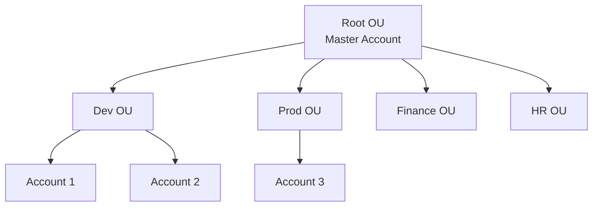
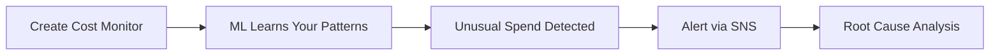

# 💰 Billing, Pricing & Support — Domain 4
### AWS Certified Cloud Practitioner — CLF-C02
---

## 🏦 الحكاية بتبدأ من ... — مشكلة إدارة الفلوس على AWS

تخيّل شركة كبيرة عندها عشرين Team — كل Team شغّالة على AWS. في نهاية الشهر جاءت فاتورة واحدة ضخمة — مش قادرين يعرفوا مين صرف إيه ولا ليه. وكمان الـ Devs بيشغّلوا Resources غير ضرورية وفيه Accounts مفيش عليها Governance. ده بالظبط اللي Domain 4 جاي يحله — كيف تدير، تفهم، وتتحكم في التكاليف على AWS.

---

## 🏢 AWS Organizations

الـ **Organizations** هو Service بيخلّيك تدير **Multiple AWS Accounts** من مكان واحد. الـ Account الرئيسي بيتسمى **Master Account (Management Account)**.

فوايد الـ Organizations:

1. **Consolidated Billing** — فاتورة واحدة لكل الـ Accounts.
2. **Aggregated Usage Discounts** — كل الـ Accounts بتحسب مع بعض في الـ Volume Pricing (أرخص).
3. **Pooling of Reserved Instances** — لو Account عنده Reserved Instances فاضلة، الـ Accounts التانية تستفيد منها.
4. **API للـ Account Creation** — تقدر تعمل Accounts تلقائياً بالكود.
5. **Service Control Policies (SCPs)** — تتحكم في صلاحيات الـ Accounts.

### 📂 Organizational Units (OUs)

الـ Accounts بتتنظّم في **OUs** — وتقدر تنظّمها بأكتر من طريقة:

1. **Business Unit** — Team الـ Finance في OU، Team الـ HR في OU.
2. **Environmental Lifecycle** — Dev OU، Test OU، Prod OU.
3. **Project-based** — كل مشروع في OU منفصلة.

### 🚦 Service Control Policies (SCPs)

الـ **SCP** بيحدد إيه اللي مسموح وإيه اللي ممنوع في الـ Account أو الـ OU:

1. بتقدر تعمل **Whitelist** (اسمح ببعض الخدمات فقط) أو **Blacklist** (امنع خدمات معينة).
2. بتطبق على مستوى **OU** أو **Account** مباشرة.
3. **لا تطبق على الـ Master Account** — هو دايماً عنده كل الصلاحيات.
4. بتطبق على **كل الـ Users والـ Roles** في الـ Account — بما فيهم الـ Root User!
5. **لا تؤثر على Service-Linked Roles** — دي أدوار AWS Services نفسها عشان تتكامل مع Organizations.
6. الـ SCP **لازم يكون فيها Explicit Allow** — ما بتسمحش بحاجة by default.

**Use Cases:**
1. منع استخدام EMR في الـ Dev Environment.
2. إجبار Compliance (PCI) عن طريق تعطيل Services معينة.

> [!important] SCP ≠ IAM Policy
> الـ SCP مش بتقدر تدي صلاحية لحد — هي **Guardrail** بس. الـ Max Permission اللي User يقدر ياخده هو تقاطع الـ SCP والـ IAM Policy بتاعته.
> لو الـ SCP منعت S3 والـ IAM أدت S3 → **مفيش وصول**.

### 💳 Consolidated Billing

لما بتفعّل **Consolidated Billing** في Organizations:

1. **One Bill** — فاتورة واحدة لكل الـ Accounts.
2. **Volume Discounts** — استخدام كل الـ Accounts بيتجمع عشان توصل لـ Tiers أرخص.
3. **Reserved Instances Sharing** — Account عنده Reserved Instance فاضلة، Account تانية بتاخد الـ Discount تلقائياً.
4. الـ Management Account تقدر **تلغي** الـ RI Sharing لأي Account لو عايزت.

---

## 🏛️ AWS Control Tower

لو Organizations هو الـ Infrastructure لإدارة الـ Accounts — **Control Tower** هو الطبقة اللي فوقيه بتضيف الـ Governance:

1. **Setup بنقرات** — بيضبط Multi-Account Environment على Best Practices تلقائياً.
2. **Guardrails تلقائية** — Policies بتتطبق تلقائياً على كل الـ Accounts الجديدة.
3. **Policy Violation Detection** — يكشف المخالفات ويـRemediates تلقائياً.
4. **Compliance Dashboard** — تتفرّج على الـ Compliance من مكان واحد.
5. **بيشتغل فوق Organizations** — بيضبط Organizations وSCPs في الخلفية.

> [!abstract]+ Organizations vs Control Tower
> - **AWS Organizations** = الأداة الأساسية لإنشاء وإدارة المـAccounts وSCPs.
> - **AWS Control Tower** = طبقة فوقيها بتضيف Automation وGovernance وGuardrails.
> Control Tower بيستخدم Organizations خلف الكواليس.

---

## 🤝 AWS Resource Access Manager (RAM)

**المشكلة:** عندك VPC Subnet أو Transit Gateway وعايز تشاركه مع Account تانية من غير ما تعمل نسخة تانية.

**AWS RAM** بيخلّيك **تشارك Resources** بين AWS Accounts أو داخل Organizations:

1. بتشارك مع **أي Account** أو داخل **Organization بتاعتك** فقط.
2. بتوفّر **Resource Duplication** — مش محتاج تعمل نفس الـ Resource في كل Account.

**Resources الممكن مشاركتها:**
1. Aurora DB Clusters.
2. VPC Subnets.
3. Transit Gateway.
4. Route 53 Resolver Rules.
5. EC2 Dedicated Hosts.
6. License Manager Configurations.

---

## 🛍️ AWS Service Catalog

**المشكلة:** موظف جديد بيفتح AWS Console ويشوف 200 Service — مش عارف يبدأ منين ومش متأكد من الـ Compliance.

**Service Catalog** بيحل ده:

1. الـ **Admin** بيعمل **Products** (CloudFormation Templates جاهزة ومـApproved).
2. بيجمّعهم في **Portfolios** وبيحدد مين عنده صلاحية الوصول.
3. الـ **User** بيشوف بس الـ Products المسموح له بيها ويـLaunch بنقرة.
4. الـ Products بتطلع **Ready to Use، Properly Configured، وProper Tagged**.

---

## 💵 Pricing Models في AWS

AWS بتشتغل بـ **4 نماذج تسعير**:

1. **Pay As You Go** — ادفع بس على اللي استخدمته. مفيش Commitment. أغلى لكن أمرن.
2. **Save When You Reserve** — التزم بمدة (سنة أو 3 سنين) وادفع أقل. أرخص لكن أقل مرونة.
3. **Pay Less By Using More** — كل ما استخدمت أكتر، كل ما السعر في الـ Unit أقل (Volume Discounts).
4. **Pay Less As AWS Grows** — AWS بتنقل وفورات الـ Scale لعملائها مع الوقت.

---

## 🆓 Free Services & Free Tier

**الـ Free Tier بييجي في تلات أشكال:**

1. **Always Free** — مش بتنتهي أبداً حتى بعد سنة. مثال: Lambda مليون Request/شهر.
2. **12 Months Free** — مجاني أول 12 شهر من إنشاء الـ Account. مثال: EC2 t2.micro.
3. **Trials** — مجاني لفترة قصيرة. مثال: Lightsail 30 يوم.

**أمثلة على الـ Always Free:**
1. **Lambda** — مليون Request في الشهر + 400,000 GB-seconds.
2. **DynamoDB** — 25 GB Storage + 200M Requests في الشهر.

**ملاحظة على الـ New Accounts:** بتاخد حتى $200 Credits. تختار Free Plan (ينتهي بعد 6 شهور أو لما الـ Credits تخلص) أو Paid Plan (بيتحاسب بعد استهلاك الـ Credits).

---

## 🖥️ Pricing by Service — التسعير حسب الخدمة

### EC2 Pricing

بتتحاسب على:
1. **عدد الـ Instances** اللي شغّالة.
2. **الـ Configuration** — Region، OS، Instance Type، Instance Size.
3. **ELB** — وقت التشغيل + كمية البيانات المعالجة.
4. **Detailed Monitoring** — لو فعّلته بيكلّف.

**نماذج الدفع:**

| النموذج | الخصم | التفاصيل |
|---------|-------|----------|
| On-Demand | لا يوجد | الحد الأدنى 60 ثانية — Linux/Windows بالثانية |
| Reserved | حتى 75% | 1 أو 3 سنين — All/Partial/No Upfront |
| Spot | حتى 90% | Bid على الـ Unused Capacity |
| Dedicated Host | — | On-Demand أو Reservation 1/3 سنين |
| Savings Plans | — | بديل مرن للـ Reserved |

### Lambda Pricing

1. **Pay per Call** — ادفع على عدد الـ Invocations.
2. **Pay per Duration** — ادفع على وقت التنفيذ (GB-seconds).

### ECS & Fargate Pricing

1. **ECS (EC2 Launch Type)** — مفيش رسوم إضافية على ECS نفسه — بتدفع على الـ EC2 Instances.
2. **Fargate** — بتدفع على **vCPU وMemory** المخصوصين للـ Containers.

### S3 Pricing

بتتحاسب على:
1. **Storage Class** — Standard أغلى، Glacier أرخص.
2. **عدد وحجم الـ Objects** (Volume Tiering).
3. **عدد ونوع الـ Requests** — PUT، GET لكل منهم سعر.
4. **Data Transfer OUT** من الـ Region — الـ Inbound مجاني.
5. **S3 Transfer Acceleration** — تكلفة إضافية.
6. **Lifecycle Transitions** — تكلفة على كل انتقال بين Classes.

### EBS Pricing

بتتحاسب على:
1. **Volume Type** — GP3، GP2، io1، st1، sc1.
2. **حجم الـ Storage** (GB per month).
3. **IOPS** — GP3 فيه Included IOPS، io1 تدفع على كل IOPS Provisioned.
4. **Snapshots** — تكلفة إضافية per GB per month.
5. **Data Transfer OUT** — Tiered. الـ Inbound مجاني.

### RDS Pricing

بتتحاسب على:
1. **Per Hour Billing**.
2. **Database Characteristics** — Engine (MySQL، Oracle)، Size، Memory Class.
3. **Purchase Type** — On-Demand أو Reserved (1-3 سنين).
4. **Deployment Type** — Single AZ أرخص من Multi-AZ.
5. **Backup Storage** — مجاني لغاية 100% من حجم الـ Database.

### CloudFront Pricing

1. **السعر بيختلف حسب الـ Geographic Region** (Edge Location).
2. **Data Transfer Out** — Volume Discount.
3. **عدد الـ HTTP/HTTPS Requests**.

### Networking Costs (Simplified)

> [!important] قواعد الـ Networking Cost
> - **Traffic جوّا نفس الـ AZ** → **مجاني** (Private IP).
> - **Traffic بين AZs (نفس الـ Region) — Private IP** → $0.01 per GB.
> - **Traffic بين AZs (نفس الـ Region) — Public IP أو Elastic IP** → $0.02 per GB.
> - **Traffic بين Regions** → $0.02 per GB.
>
> **القاعدة الذهبية للتوفير:**
> 1. استخدم **Private IP** بدل Public IP.
> 2. حاول تشغّل الـ Resources في نفس الـ AZ لو مش محتاج High Availability.

---

## 💾 Savings Plans

بديل أكثر مرونة من الـ Reserved Instances. بدل ما تـCommit على Instance معينة، بتـCommit على **مبلغ بالدولار في الساعة** لمدة سنة أو 3 سنين.

**3 أنواع:**

1. **EC2 Savings Plan:**
   - خصم حتى **72%**.
   - بتلتزم بـ Instance Family محددة في Region محددة (مثال: C5 في us-east-1).
   - مرن في الـ AZ والـ Size والـ OS.

2. **Compute Savings Plan:**
   - خصم حتى **66%**.
   - أكثر مرونة — بيشمل **EC2، Fargate، وLambda**.
   - مش مقيّد بـ Family أو Region أو Size أو OS.

3. **Machine Learning Savings Plan:**
   - للـ SageMaker بشكل أساسي.

**مهم:** الـ Savings Plans بيتضبطوا من **AWS Cost Explorer Console**.

> [!abstract]+ Reserved Instances vs Savings Plans
> | الخاصية | Reserved Instances | Savings Plans |
> |---------|------------------|---------------|
> | الـ Commitment | Instance محددة | $ في الساعة |
> | المرونة | أقل | أكتر |
> | الخصم | حتى 75% | حتى 72% |
> | الـ Coverage | EC2 (وبعض Services) | EC2 + Fargate + Lambda |

---

## 🤖 AWS Compute Optimizer

**المشكلة:** اشتريت Instance كبير عشان "على الأمان" ومش بيتستخدم أكتر من 20%.

**Compute Optimizer** بيحلها باستخدام ML:

1. بيحلّل الـ **CloudWatch Metrics** وبيشوف الـ Actual Usage.
2. بيقترح الـ **Optimal Resource Configuration**.
3. بيكتشف الـ Over-Provisioned والـ Under-Provisioned.
4. بيوفّر حتى **25%** على التكاليف.
5. بيدعم: **EC2 Instances، EC2 Auto Scaling Groups، EBS Volumes، Lambda Functions**.
6. تقدر تـ**Export** التوصيات لـ S3.

---

## 🧰 Billing & Costing Tools

### 📊 التصنيف الأهم في الـ Exam

الـ Tools بتنقسم لـ 3 فئات:

**Estimating Costs (قبل الإنشاء):**
- **AWS Pricing Calculator**

**Tracking Costs (بعد الإنشاء):**
- **Billing Dashboard**
- **Cost Allocation Tags**
- **Cost and Usage Reports**
- **Cost Explorer**

**Monitoring Against Plans (حماية من الإنفاق الزائد):**
- **Billing Alarms**
- **AWS Budgets**

---

### 🧮 AWS Pricing Calculator

متاح على `https://calculator.aws/` — بيساعدك **تقدّر تكلفة Architecture** قبل ما تنشئها على AWS. مش للـ Tracking — للـ Estimation فقط.

---

### 📋 AWS Billing Dashboard

نظرة عامة سريعة على التكاليف الحالية للشهر — High Level Overview. مش للتفاصيل الدقيقة.

---

### 🏷️ Cost Allocation Tags & Tagging

الـ **Tags** هي Key-Value Pairs بتحطّها على الـ Resources. بتساعدك تتتبع التكاليف بدقة.

**نوعان من الـ Tags:**

1. **AWS Generated Tags** — AWS بتعملها تلقائياً. بتبدأ بـ `aws:` (مثال: `aws:createdBy`).
2. **User-Defined Tags** — أنت بتعملها. بتبدأ بـ `user:` (مثال: `user:Environment`).

**Common Tags:** Name، Environment (dev/prod)، Team، Project، CostCenter.

**Resource Groups:** تقدر تجمّع Resources اللي عندها نفس الـ Tags في Group وتديرهم مع بعض.

> [!important] Cost Allocation Tags — لازم تفعّلها
> Tags موجودة على الـ Resources مش معناها هتظهر في الـ Billing Report تلقائياً.
> لازم تـ**Activate** الـ Tags في الـ Billing Console عشان تظهر في الـ Cost Reports.

---

### 📑 AWS Cost & Usage Reports (CUR)

**أشمل Dataset للتكاليف** على الإطلاق:

1. بيحتوي على **كل تفاصيل الاستخدام** — Service، Account، Region، Tags.
2. بيديك **Hourly أو Daily Line Items**.
3. بيشمل **Metadata** عن الـ Reserved Instances.
4. تقدر تـ**Integrate** مع: **Athena** (SQL Queries)، **Redshift** (Data Warehouse)، **QuickSight** (Visualization).

---

### 🔍 AWS Cost Explorer

بيخلّيك تـ**Visualize وتفهم وتدير** التكاليف بصرياً:

1. **Custom Reports** — حسب Service أو Account أو Region أو Tag.
2. **Granularity** — Monthly أو Hourly أو Resource Level.
3. **Savings Plan Recommendations** — بيقترح الأنسب لك.
4. **Forecast** — بيتوقع التكاليف للـ **12 شهر** بناءً على الـ Historical Usage.

---

### 🔔 Billing Alarms in CloudWatch

1. الـ Billing Data بيتخزن في CloudWatch في **us-east-1 فقط**.
2. بيراقب التكلفة **الفعلية** — مش المتوقعة.
3. **Simple Alarm** — أقل قوة من الـ Budgets.
4. **للتكلفة الإجمالية** — مش بيدعم Filtering متقدم.

---

### 💼 AWS Budgets

أقوى من الـ Billing Alarms — بتضبط **Budget** وتتلقى إشعارات:

**4 أنواع من الـ Budgets:**
1. **Usage Budget** — تراقب كمية الاستخدام (GB، Hours).
2. **Cost Budget** — تراقب المبلغ المصروف.
3. **Reservation Budget** — تراقب الـ RI Utilization.
4. **Savings Plans Budget** — تراقب الـ Savings Plans.

**مميزات:**
1. حتى **5 SNS Notifications** لكل Budget.
2. بتـ**Filter** حسب: Service، Account، Tag، Region، AZ، Instance Type، وغيرها.
3. بيدعم الـ RI Tracking — EC2، ElastiCache، RDS، Redshift.

---

### 🤖 AWS Cost Anomaly Detection

بيستخدم **ML** عشان يكتشف الإنفاق الغير طبيعي تلقائياً:

1. **مش محتاج تحدد Thresholds** — ML بيتعلم Pattern بتاعك.
2. بيكتشف **One-time Cost Spikes** وكمان **Continuous Increases**.
3. بيبعتلك **Root-Cause Analysis** — مش بس "في حاجة غلط".
4. بيراقب على مستوى: AWS Services، Member Accounts، Cost Allocation Tags.
5. بيبعت الإشعارات عن طريق **SNS** — Daily أو Weekly Summary أو Individual Alerts.

---

### ⚠️ AWS Service Quotas

كل Service على AWS عندها حدود (مثال: Lambda بتقدر تشغّل X Concurrent Executions). **Service Quotas** بيراقب هذه الحدود:

1. بيبعتلك إشعار لو **اقتربت من الـ Limit**.
2. بتعمل **CloudWatch Alarm** من الـ Service Quotas Console.
3. تقدر تطلب **Quota Increase** من نفس الـ Console.

---

## 🛡️ AWS Trusted Advisor

**High-level Account Assessment** من غير ما تثبّت حاجة. بيفحص الـ Account وبيديك Recommendations في **6 Categories**:

1. **Cost Optimization** — Resources مش بتتستخدم وممكن تتوقف.
2. **Performance** — Settings ممكن تتحسّن.
3. **Security** — Vulnerabilities وBest Practices.
4. **Fault Tolerance** — Redundancy وAvailability.
5. **Service Limits** — Quotas قريبة من الـ Maximum.
6. **Operational Excellence** — Best Practices التشغيلية.

**مستويات الوصول:**

| الـ Plan | الـ Checks |
|---------|-----------|
| **Basic / Developer** | 7 Core Checks فقط (مجاناً) |
| **Business / Enterprise** | Full Set of Checks + Programmatic Access (AWS Support API) |

> [!important] Trusted Advisor — الـ 7 Core Checks (Basic)
> الـ 7 Checks المجانية بتشمل:
> 1. S3 Bucket Permissions.
> 2. Security Groups (Specific Ports Unrestricted).
> 3. IAM Use.
> 4. MFA on Root Account.
> 5. EBS Public Snapshots.
> 6. RDS Public Snapshots.
> 7. Service Limits.

---

## 📞 AWS Support Plans — بالتفصيل

### 🆓 Basic Support Plan (مجاني)

1. **Customer Service & Communities** — 24x7 للـ Documentation والـ Forums.
2. **AWS Trusted Advisor** — 7 Core Checks فقط.
3. **AWS Personal Health Dashboard** — Personalized View للـ Service Health.
4. **مفيش Technical Support Engineer** مباشر.

---

### 👨‍💻 Developer Support Plan

1. **كل الـ Basic** + Email Access لـ **Cloud Support Associates** في Business Hours.
2. **Unlimited Cases** و**Unlimited Contacts**.
3. Response Times:
   - General Guidance: **< 24 ساعة عمل**.
   - System Impaired: **< 12 ساعة عمل**.

---

### 🏭 Business Support Plan (24/7)

للـ Production Workloads:

1. **Trusted Advisor** — Full Checks + API Access.
2. **24/7** Phone، Email، وChat لـ **Cloud Support Engineers**.
3. **Unlimited Cases وContacts**.
4. **Infrastructure Event Management** (برسوم إضافية).
5. Response Times:
   - General Guidance: **< 24 ساعة عمل**.
   - System Impaired: **< 12 ساعة عمل**.
   - Production Impaired: **< 4 ساعات**.
   - Production Down: **< 1 ساعة**.

---

### 🚀 Enterprise On-Ramp Support Plan (24/7)

للـ Production أو Business Critical Workloads — بين Business وEnterprise:

1. **كل الـ Business Plan** +
2. **Pool of TAMs** — مش TAM واحد مخصوص لك.
3. **Concierge Support Team** — للـ Billing والـ Best Practices.
4. **Infrastructure Event Management، Well-Architected Reviews**.
5. Response Times:
   - Production Impaired: **< 4 ساعات**.
   - Production Down: **< 1 ساعة**.
   - Business-Critical Down: **< 30 دقيقة**.

---

### 🏆 Enterprise Support Plan (24/7)

للـ Mission Critical Workloads — الأعلى مستوى:

1. **كل الـ Business Plan** +
2. **Designated TAM** — Technical Account Manager مخصوص لك شخصياً.
3. **Concierge Support Team**.
4. **Infrastructure Event Management، Well-Architected & Operations Reviews**.
5. **AWS Incident Detection and Response** (برسوم إضافية).
6. Response Times:
   - Production Impaired: **< 4 ساعات**.
   - Production Down: **< 1 ساعة**.
   - Business-Critical Down: **< 15 دقيقة**.

> [!important] Support Plans — جدول المقارنة الكامل
> | الخاصية | Basic | Developer | Business | Enterprise On-Ramp | Enterprise |
> |---------|-------|-----------|----------|-------------------|------------|
> | التكلفة | مجاني | ادفع | ادفع | ادفع | ادفع |
> | Trusted Advisor | 7 Checks | 7 Checks | Full | Full | Full |
> | Support Channel | لا يوجد | Email (Business Hours) | 24/7 Phone+Email+Chat | 24/7 Phone+Email+Chat | 24/7 Phone+Email+Chat |
> | TAM | لا | لا | لا | Pool of TAMs | Designated TAM |
> | Business-Critical SLA | لا | لا | لا | < 30 دقيقة | < 15 دقيقة |

---

## ✅ Account Best Practices — ملخص

1. إدارة الـ Multiple Accounts → **Organizations + SCPs**.
2. Governance الـ Accounts → **Control Tower**.
3. **Tags وCost Allocation Tags** لكل Resource.
4. **CloudTrail** على كل الـ Accounts — Logs تروح لـ Central S3.
5. **CloudWatch Logs** لـ Central Logging Account.
6. **IAM** — MFA، Least Privilege، Password Policy، Password Rotation.
7. **Config** لتسجيل كل التغييرات.
8. **CloudFormation** للـ Deploy عبر Accounts وRegions.
9. **Trusted Advisor** لـ Insights + Support Plan مناسب.
10. لو الـ Account اتـ**Compromise**:
    - غيّر الـ Root Password.
    - احذف وأعد إنشاء كل الـ Passwords والـ Keys.
    - اتصل بـ **AWS Support**.

---

## 🎯 فخاخ الـ Exam

**الـ Trap الأول — SCP لا تطبق على Master Account:** أهم فخ في الـ Organizations. الـ Master Account عنده كل الصلاحيات دايماً حتى لو في SCP بيمنع حاجة — هو مش عليه.

**الـ Trap الثاني — SCP على Root User:** ناس بتفتكر إن الـ Root User مش بتتأثر بالـ SCP — لا، الـ SCP بتطبق على Root User في الـ Account (غير الـ Master Account).

**الـ Trap التالت — Billing Alarms vs Budgets:** الـ Billing Alarm في CloudWatch أبسط وأقدم — بس بتراقب الـ Actual Cost بس ومش بتدعم Filtering متقدم. الـ Budgets أقوى — بتدعم Usage، Reservations، Savings Plans، وFilter متقدم.

**الـ Trap الرابع — Cost Explorer vs Pricing Calculator:** Pricing Calculator للـ **Estimation قبل الإنشاء**. Cost Explorer للـ **Analysis والـ Tracking بعد الإنشاء**. السؤال اللي يقول "estimate before deploying" → Pricing Calculator.

**الـ Trap الخامس — Enterprise vs Enterprise On-Ramp:** الاتنين عندهم TAM وConcierge، لكن:
- **Enterprise On-Ramp** → Pool of TAMs، Business-Critical < **30 دقيقة**.
- **Enterprise** → Designated TAM، Business-Critical < **15 دقيقة**.

**الـ Trap السادس — Trusted Advisor Full Checks:** الـ Full Set of Checks + API Access بيبدأ من الـ **Business Plan** مش Enterprise. Basic وDeveloper = 7 Core Checks فقط.

**الـ Trap السابع — Reserved Instances Sharing:** في Organizations، لو Account عنده Reserved Instances فاضلة — الـ Accounts التانية **بتستفيد تلقائياً**. الـ Management Account تقدر تلغي ده.

**الـ Trap التامن — Compute Optimizer vs Trusted Advisor:** كلاهم بيديك Recommendations، لكن:
- **Compute Optimizer** = ML-powered، متخصص في Rightsizing الـ Compute Resources.
- **Trusted Advisor** = General Best Practices في 6 Categories.

**الـ Trap التاسع — Cost Anomaly Detection لا تحتاج Threshold:** ده الفرق الجوهري — Cost Anomaly Detection بيستخدم ML ومش محتاج تحدد Threshold. الـ Budgets والـ Billing Alarms محتاجين Threshold.

---

## 📝 أسئلة الـ Exam

### Q1. A company wants to manage multiple AWS accounts, apply governance policies, and receive a single bill for all accounts. Which AWS service should they use?

- A. AWS Control Tower
- B. AWS IAM
- C. AWS Organizations
- D. AWS Service Catalog

> [!success]- ✅ Reveal Answer & Explanation
> **Correct Answer: C**
>
> الـ **AWS Organizations** هو الـ Service المباشر لإدارة Multiple Accounts مع Consolidated Billing وSCPs.
>
> **ليه الباقي غلط:**
> - **A** — Control Tower بيشتغل فوق Organizations وبيضيف Governance — لكن لو السؤال عن الـ Core: Accounts + Billing + SCPs → Organizations.
> - **B** — IAM لإدارة Users والـ Permissions داخل Account واحد.
> - **D** — Service Catalog لتوفير Products جاهزة للـ Users — مش لإدارة Accounts.

---

### Q2. A developer needs to estimate the cost of a new AWS architecture before building it. Which tool should they use?

- A. AWS Cost Explorer
- B. AWS Billing Dashboard
- C. AWS Budgets
- D. AWS Pricing Calculator

> [!success]- ✅ Reveal Answer & Explanation
> **Correct Answer: D**
>
> الـ **Pricing Calculator** على `calculator.aws` هو المصمم للـ Cost Estimation قبل الإنشاء — بتحدد الـ Architecture وهو بيقولك هتكلّف كام.
>
> **ليه الباقي غلط:**
> - **A** — Cost Explorer لتحليل الإنفاق الحالي والتاريخي — مش Estimation.
> - **B** — Billing Dashboard نظرة عامة على التكاليف الحالية.
> - **C** — Budgets لوضع حدود وتلقي إشعارات — مش Estimation.

---

### Q3. An organization notices unexpected cost spikes in their AWS bill but doesn't know which thresholds to set. Which service can automatically detect these anomalies without manual threshold configuration?

- A. AWS Budgets
- B. CloudWatch Billing Alarms
- C. AWS Cost Anomaly Detection
- D. AWS Trusted Advisor

> [!success]- ✅ Reveal Answer & Explanation
> **Correct Answer: C**
>
> الـ **Cost Anomaly Detection** هو الوحيد اللي بيستخدم ML ومش محتاج Thresholds — بيتعلم Pattern بتاعك وبيكتشف الشذوذ تلقائياً.
>
> **ليه الباقي غلط:**
> - **A** — Budgets محتاج تحدد Budget Amount وThreshold.
> - **B** — Billing Alarms محتاجة تحدد Amount ثابت.
> - **D** — Trusted Advisor بيديك Best Practice Recommendations — مش ML-based Anomaly Detection.

---

### Q4. A company applies a Service Control Policy (SCP) to an Organizational Unit (OU) that denies access to EC2. Which of the following is CORRECT?

- A. The Master Account will also be denied EC2 access
- B. The Root User in member accounts will bypass the SCP restriction
- C. Service-Linked Roles in member accounts can still use EC2
- D. All users and roles in member accounts, including Root, will be denied EC2 access

> [!success]- ✅ Reveal Answer & Explanation
> **Correct Answer: D**
>
> الـ SCP بتطبق على **كل الـ Users والـ Roles** في الـ Account — بما فيهم الـ **Root User**. مفيش استثناء للـ Root داخل الـ Member Accounts.
>
> **ليه الباقي غلط:**
> - **A** — الـ SCP **لا تطبق على الـ Master Account** أبداً.
> - **B** — الـ Root User في الـ Member Accounts **بيتأثر** بالـ SCP.
> - **C** — الـ Service-Linked Roles مش بتتأثر بالـ SCP (ده صح!) — لكن الـ Question بيقول "can still use EC2" في سياق إن الـ Users والـ Roles العادية كلها ممنوعة. الإجابة D هي الأصح لأنها تصف الـ Behavior الكامل.

---

### Q5. Which of the following are benefits of AWS Organizations Consolidated Billing? (Select TWO)

- A. Separate bills for each AWS account
- B. Volume discounts based on combined usage across all accounts
- C. Reserved Instances can be shared across accounts in the Organization
- D. Each account gets its own Savings Plans automatically
- E. The Master Account loses Reserved Instance benefits

> [!success]- ✅ Reveal Answer & Explanation
> **Correct Answer: B and C**
>
> - **B** — الاستخدام بيتجمع من كل الـ Accounts عشان تستفيد من الـ Volume Pricing.
> - **C** — Reserved Instances اللي عند Account بتشاركها تلقائياً مع باقي الـ Accounts في الـ Organization.
>
> **ليه الباقي غلط:**
> - **A** — Consolidated Billing = **فاتورة واحدة** — مش فواتير منفصلة.
> - **D** — الـ Savings Plans مش بتنشأ تلقائياً.
> - **E** — الـ Master Account بيحتفظ بكل الـ Benefits بل وبيستفيد من Consolidated Usage.

---

### Q6. A company needs the fastest possible response time for a business-critical system failure and wants a Technical Account Manager dedicated specifically to their account. Which support plan should they choose?

- A. Business Support Plan
- B. Enterprise On-Ramp Support Plan
- C. Enterprise Support Plan
- D. Developer Support Plan

> [!success]- ✅ Reveal Answer & Explanation
> **Correct Answer: C**
>
> الـ **Enterprise Support Plan** هو الوحيد اللي بيديك **Designated TAM** (مخصوص ليك شخصياً) وضمان الـ Response < **15 دقيقة** للـ Business-Critical System Down.
>
> **ليه الباقي غلط:**
> - **A** — Business Plan مفيش TAM ولا Business-Critical SLA.
> - **B** — Enterprise On-Ramp عنده Pool of TAMs (مش Designated) والـ Business-Critical = **30 دقيقة** مش 15.
> - **D** — Developer Plan مفيش TAM ومفيش 24/7 Support.

---

### Q7. A company wants to automatically get recommendations to reduce their EC2 and Lambda costs by right-sizing them based on actual usage metrics. Which AWS service provides this?

- A. AWS Trusted Advisor
- B. AWS Cost Explorer
- C. AWS Compute Optimizer
- D. AWS Budgets

> [!success]- ✅ Reveal Answer & Explanation
> **Correct Answer: C**
>
> الـ **Compute Optimizer** بيستخدم ML ويحلّل الـ CloudWatch Metrics عشان يقترح الـ Optimal Configuration لـ EC2 Instances، Auto Scaling Groups، EBS Volumes، وLambda Functions — وده بالظبط الـ Rightsizing.
>
> **ليه الباقي غلط:**
> - **A** — Trusted Advisor بيديك General Cost Optimization Checks — لكن مش ML-powered Rightsizing بنفس العمق.
> - **B** — Cost Explorer لتحليل وتوقع التكاليف — مش Rightsizing Recommendations.
> - **D** — Budgets لوضع حدود وإشعارات — مش Rightsizing.

---

### Q8. Which of the following correctly describes the difference between a Compute Savings Plan and an EC2 Savings Plan?

- A. EC2 Savings Plan provides higher discount and covers more services
- B. Compute Savings Plan applies to EC2 only, while EC2 Savings Plan covers EC2, Fargate, and Lambda
- C. Compute Savings Plan covers EC2, Fargate, and Lambda with up to 66% discount; EC2 Savings Plan is locked to an Instance Family with up to 72% discount
- D. Both plans provide the same discount and flexibility

> [!success]- ✅ Reveal Answer & Explanation
> **Correct Answer: C**
>
> - **Compute Savings Plan**: أكتر مرونة (أي Family، Region، Service) — يشمل EC2 + Fargate + Lambda — خصم حتى **66%**.
> - **EC2 Savings Plan**: مقيّد بـ Instance Family وRegion — بس خصم أعلى حتى **72%**.
>
> **ليه الباقي غلط:**
> - **A** — الـ EC2 Savings Plan خصمه أعلى لكن Coverage أقل — مش الاتنين.
> - **B** — العكس تماماً.
> - **D** — مختلفان في الخصم والمرونة.

---

## 📊 ملخص نهائي — الـ Cheat Sheet

| السؤال | الإجابة |
|--------|---------|
| إدارة Multiple Accounts؟ | AWS Organizations |
| Consolidated Billing فايدته؟ | فاتورة واحدة + Volume Discounts + RI Sharing |
| SCP بتطبق على Master Account؟ | لا — المaster Account دايماً ماله |
| SCP بتطبق على Root User؟ | نعم — في الـ Member Accounts |
| SCP مع Service-Linked Roles؟ | لا تؤثر عليهم |
| Governance فوق Organizations؟ | AWS Control Tower |
| مشاركة Resources بين Accounts؟ | AWS Resource Access Manager (RAM) |
| Self-Service Portal للمستخدمين؟ | AWS Service Catalog |
| الـ 4 Pricing Models؟ | Pay-as-you-go، Reserve، More=Less، AWS-grows |
| Free Tier — Lambda؟ | 1M Requests + 400K GB-seconds / شهر (Always Free) |
| Free Tier — DynamoDB؟ | 25 GB + 200M Requests / شهر (Always Free) |
| EC2 On-Demand Minimum؟ | 60 ثانية |
| EC2 Reserved Discount؟ | حتى 75% |
| EC2 Spot Discount؟ | حتى 90% |
| Lambda تكلفة؟ | Per Call + Per Duration |
| Fargate تكلفة؟ | Per vCPU + Memory |
| S3 — Data Transfer In مجاني؟ | نعم — Inbound مجاني |
| Traffic داخل نفس الـ AZ (Private IP)؟ | مجاني |
| Traffic بين AZs (Private IP)؟ | $0.01/GB |
| Traffic بين Regions؟ | $0.02/GB |
| EC2 Savings Plan خصم وCoverage؟ | 72% — EC2 Instance Family محددة |
| Compute Savings Plan خصم وCoverage؟ | 66% — EC2 + Fargate + Lambda |
| Compute Optimizer بيدعم؟ | EC2، Auto Scaling، EBS، Lambda |
| Estimation قبل الإنشاء؟ | AWS Pricing Calculator |
| Tracking التكاليف الحالية؟ | Cost Explorer / Billing Dashboard |
| أشمل Cost Dataset؟ | Cost & Usage Reports (CUR) |
| Forecast للـ 12 شهر؟ | AWS Cost Explorer |
| Cost Anomaly Detection محتاج Threshold؟ | لا — ML بيكتشف تلقائياً |
| AWS Budgets أنواعه؟ | Usage، Cost، Reservation، Savings Plans |
| Trusted Advisor Categories؟ | Cost، Performance، Security، Fault Tolerance، Service Limits، Operational Excellence |
| Trusted Advisor Full Checks من أنهي Plan؟ | Business Plan فصاعداً |
| Basic Plan Trusted Advisor Checks؟ | 7 Core Checks فقط |
| Business-Critical SLA — Enterprise On-Ramp؟ | < 30 دقيقة |
| Business-Critical SLA — Enterprise؟ | < 15 دقيقة |
| Designated TAM؟ | Enterprise Plan فقط |
| لو الـ Account اتـCompromise؟ | غيّر Root Password + احذف Keys + اتصل AWS Support |

---
*انتهى Domain 4 — Billing, Pricing & Support ✅*
*تغطية الـ CLF-C02 كاملة!*
