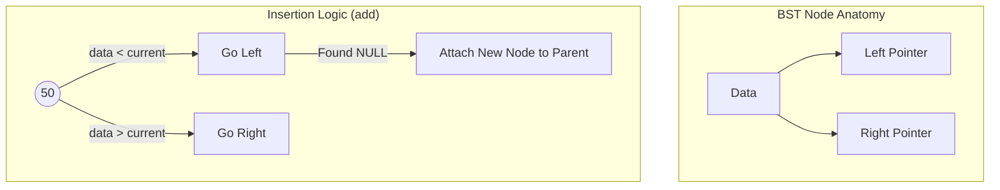
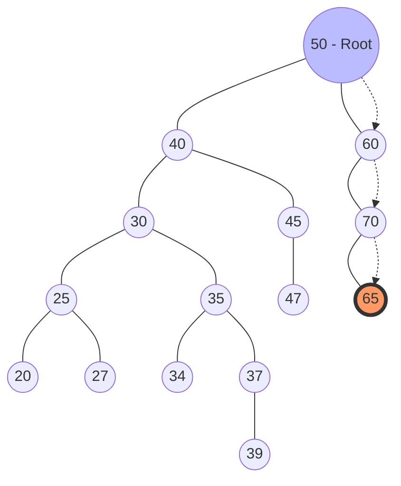
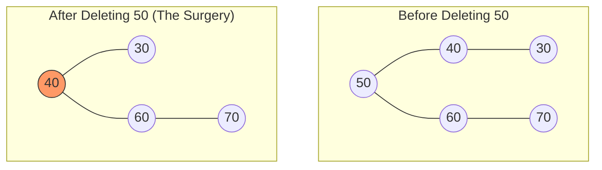

# Part 1: BST Anatomy & Iterative Insertion Logic (Mina's Implementation)

### 1. Preamble & Introduction (التمهيد)

الـ Binary Search Tree (BST) اللي بشمهندس مينا كاتبها هنا هي تطبيق حي لمبدأ التنظيم الهرمي للبيانات. الـ Mental Model اللي لازم يكون في دماغك هو "الميزان الذكي"؛ كل نود بتعمل فلترة للداتا اللي داخلة. لو القيمة أصغر بتروح الشمال، ولو أكبر بتروح اليمين، وده اللي بيحول عملية البحث من مشوار خطي ممل لرحلة سريعة جداً.

### 2. Historical Context (المشكلة والحل)

قبل اختراع الـ BST، كان المهندسين بيواجهوا مشكلة مع المصفوفات المرتبة (Sorted Arrays). الـ Array المترتب بيدينا سرعة بحث خرافية (O(log n))، بس لو حبيت "تضيف" عنصر في النص، لازم تشفت كل العناصر اللي بعده (O(n)) وده كان بطيء جداً. الـ BST ظهرت كحل وسط عبقري بيجمع بين سرعة البحث ومرونة الإضافة.

### 3. Deep Logic & Mechanics (التشريح البرمجي)

بشمهندس مينا بنى الكود على مرحلتين أساسيتين:

- **الـ Node (الطوبة الأساسية):**
    
    - الـ Node هنا شايلة الداتا (int data) واثنين Pointers (left و right).
        
    - الـ Constructor بتاعها بيضمن إن أي نود تتخلق تكون "يتيمة" في الأول، يعني الـ left والـ right بتوعها بـ NULL.
        
- **الـ add (محرك الإضافة):**
    
    - بشمهندس مينا استخدم الـ Iterative Approach (باستخدام while loop) مش الـ Recursion. وده في الـ C++ بيوفر ميموري في الـ Call Stack.
        
    - **التكنيك المستخدم:** الكود بيستخدم اثنين Pointers شغالين مع بعض؛ الـ current وده الـ "Scout" اللي بينط بين النودز عشان يلاقي مكان فاضي (NULL). والـ parent وده الـ "Follower" اللي بيفضل واقف عند النود اللي قبل الـ current بخطوة واحدة.
        
    - **ليه بنحتاج الـ parent؟** لأن الـ current لما يوصل لـ NULL بنكون "وقعنا" بره الشجرة، وعشان نربط النود الجديدة لازم يكون معانا عنوان "آخر نود" حقيقية وقفنا عندها.
        

### 4. Visualizing with Mermaid (التمثيل البصري)

ده شكل الشجرة والمنطق اللي بيمشي بيه الـ Insertion:

Code snippet



### 5. Memory & Low-Level Insights (نظرة عميقة للميموري)

- **Memory Layout:** الـ Tree كـ Object بيتحجز في الـ Stack، لكن لما بنعمل `new Node(data)`، إحنا بنطلب من نظام التشغيل (Linux) مساحة في الـ Heap Memory.
    
- **Pointers & Addresses:** العناوين دي بتكون عشوائية في الـ Heap، والـ BST هي اللي بتربطهم منطقياً ببعض عن طريق الـ Pointers.
    
- **نصيحة للمحترفين:** استخدام `new` بدون `delete` بيسبب Memory Leak. لاحظ إن بشمهندس مينا عامل Destructor في كلاس النود، وده تمهيد لعملية تنظيف الميموري اللي بنشوفها في الـ Remove.
    

### 6. Complexity Analysis (تحليل الكفاءة)

- **Time Complexity (Average):** الوقت المستغرق للإضافة هو O(log n) لأننا بنمشي في مسار واحد فقط من الـ Root للـ Leaf.
    
- **Time Complexity (Worst Case):** الوقت بيوصل لـ O(n) لو الشجرة بقت "مايلة" (Skewed) ناحية واحدة (كأنها Linked List).
    
- **Space Complexity:** هو O(n) لأننا بنحجز مكان في الـ Heap لكل نود بنضيفها.
    

### 7. C++ Code Snippets (من كود بشمهندس مينا)

منطق القفز (The Jump Logic):

ده الجزء اللي بيخلينا نتحرك جوه الشجرة لحد ما نلاقي المكان الفاضي المناسب:


```C++
while(current != NULL ){
    parent = current; // احتفظ بالأب قبل القفز للابن
    if(data > current ->data  ){
        current = current->right; // لو الداتا أكبر، ادخل يمين
    } else {
        current = current->left;  // لو الداتا أصغر، ادخل شمال
    }
}
```

---

### 5 Self-Check Questions (اختبر فهمك):

1. ليه بشمهندس مينا احتاج يستخدم Pointer اسمه `parent` وإحنا بنعمل `add`؟
    
2. إيه اللي هيحصل لو حاولنا نضيف قيمة موجودة أصلاً في الشجرة بناءً على الكود المكتوب؟
    
3. هل الـ `add` function في الكود ده بتستخدم الـ Recursion ولا الـ Loops؟ وليه؟
    
4. في الميموري، إيه الفرق بين مكان تخزين الـ `root` ومكان تخزين الـ `newNode`؟
    
5. لو الشجرة فاضية (root == NULL)، إزاي الكود بيتعامل مع أول عملية إضافة؟
    
    

---


# Part 2: Searching, Parental Links & Subtree Navigation (Mina's Implementation)

### 1. Preamble & Introduction (التمهيد)

الـ Navigation جوه الـ Binary Search Tree (BST) مش مجرد تدوير عشوائي أو "تخبيط"؛ هو عملية "صناعة قرار" (Decision Making) ذكية ومبنية على منطق رياضي ثابت11. الـ Mental Model اللي لازم يكون عندك هو إنك "مُحقق" ماشي ورا خريطة كنز؛ كل نود بتقابلها بتديك اتجاه إجباري بناءً على قيمتها: "هدفك أكبر مني؟ ارمي كل اللي على شمالي وروح يمين. أصغر؟ ارمي كل اللي على يميني وانزل شمال"2. في الجزء ده من كود بشمهندس مينا، التركيز كله على إزاي نلاقي نود معينة، وإزاي نتحرك "لفوق" (نجيب الـ Parent) مع إن النودز في الـ C++ هنا معندهاش Pointer مباشر للأب3.

### 2. Historical Context (لماذا الـ BST؟)

المشكلة التاريخية في الـ Linked Lists كانت إن الـ Search عملية مكلفة زمنياً لأنك لازم تعدي على العناصر واحد ورا التاني بالترتيب ($O(n)$)44. المهندسين استلهموا فكرة الـ Navigation في الـ BST من "خوارزمية تقسيم المجهود"؛ إنت في كل خطوة بترمى نص الاحتمالات وراك. دالة الـ `getNodeByData` هي المحرك اللي بيعمل الـ Binary Search ده بمرونة عالية جداً5.

### 3. Deep Logic & Mechanics (كيف نتحرك؟)

بشمهندس مينا صمم 3 أدوات (Functions) أساسية للتحرك جوه الشجرة:

- **الـ `getNodeByData` (The Scout):**
    
    - بتبدأ رحلتها دايماً من الـ `root` وتستخدم `while` loop للتحرك مادام الـ `current` مش بـ `NULL`
        
    - لو القيمة اللي بتدور عليها (`data`) بتساوي النود الحالية، بتبعتها فوراً وترجع العنوان.
        
    - لو الداتا أكبر، بنعمل "Jump" للجناح اليمين: `current = current->right`.
    - 
    - لو أصغر، بننزل للجناح الشمال: `current = current->left`.
        
- **الـ `getParent` (The Detective):**
    
    - بما إن النودز معندهاش Pointer للأب، بشمهندس مينا عمل "خدعة" برمجية؛ بيبدأ رحلة بحث جديدة من الـ `root`
        
    - وهو ماشي، بيسأل كل نود (`parent`): "هل ابنك اللي على الشمال أو اليمين هو النود اللي أنا ماسكها في إيدي (`current`)؟"
        
    - لو لقى العنوان مطابق، بيرجع النود الحالية كـ **Parent**
        
- **الـ `getMaxRight` (The Explorer):**
    
    - دي وظيفة "جشعة" (Greedy)؛ بتمسك طرف خيط (current node) وتفضل "تكسر يمين" بكل قوتها: `while(current->right != NULL)`.
        
    - دي بتجيب لك أكبر قيمة في الـ Subtree دي، ودي معلومة ذهبية هنحتاجها جداً لما نيجي نمسح نود (Removal)
        

### 4. Visualizing with Mermaid (مسار البحث عن 65)

تخيل لو الشجرة فيها القيم اللي في الـ `main` وإحنا بندور على نود **65**:




### 5. Memory & Low-Level Insights (نظرة للميموري والـ Linux)

- **Pointer Comparison:** في دالة الـ `getParent` ، الكود بيقارن "عناوين الميموري" مش القيم:
- `if(parent->left == current || parent->right == current)`.
    
- **Address Accuracy:** دي ممارسة هندسية دقيقة؛ لأن العناوين في الـ Heap مستحيل تتكرر لنودز مختلفة، حتى لو القيم متساوية، وده بيمنع أي لخبطة في الـ Navigation.
    
- **Iterative vs Recursive:** كل الدوال دي مكتوبة بشكل Iterative (باستخدام `while` loops).
    
- **Stack Space:** ده معناه إنها مبتستهلكش ميموري الـ Stack في الـ Recursion، وده أفضل للأداء في أنظمة Linux لو الشجرة عميقة جداً عشان نتفادى الـ Stack Overflow.
    
- **Error Handling:** لاحظ إن الـ `getParentMain` بترجع `-1` لو النود هي الـ `root` 19، وبترجع `-5` لو النود مش موجودة أصلاً.
    

### 6. Complexity Analysis (تحليل الكفاءة)

- **Time Complexity:** في المتوسط $O(\log n)$ للبحث أو إيجاد الأب2121. في أسوأ الحالات (شجرة مايلة) بتوصل لـ $O(n)$.
    
- **Space Complexity:** هو $O(1)$ لأننا بنستخدم Pointers فقط للتنقل (Iterative) ولا نحجز أي مساحات إضافية في الـ Heap أو الـ Stack أثناء البحث22.
    

---

### 7. C++ Code Snippets (من كود بشمهندس مينا)

منطق البحث الأساسي (The Search Core):

ده الجزء اللي بيحدد اتجاه الحركة بناءً على المقارنة23:


```c++
// Logic inside getNodeByData
while(current != NULL ){
    if(data == current->data){
        return current; // وصلنا للهدف (Found)
    }
    else if(data > current->data){
        current = current->right; // الهدف أكبر، ارمي الشمال وادخل يمين
    }
    else{
        current = current->left; // الهدف أصغر، ارمي اليمين وادخل شمال
    }
}
```

إيجاد الأب عن طريق العناوين (Finding the Parent):

الذكاء في الربط بين الأب والابن من غير Pointer عكسي24:


```C++
// Logic inside getParent
while (parent != NULL ){
    // هل الابن الشمال أو اليمين هو اللي بندور عليه؟ (مقارنة عناوين)
    if(parent->left == current || parent->right == current){
        return parent; 
    } else {
        // لو مش هو، كمل نزول في الشجرة بناءً على القيم
        if(current->data > parent->data){
            parent = parent->right;
        } else {
            parent = parent->left;
        }
    }
}
```

---

### 5 Self-Check Questions (اختبر فهمك):

1. ليه دالة الـ `getParent` بتبدأ البحث دايماً من الـ `root` مع إننا ممكن نكون في نص الشجرة؟ 25
    
2. إيه الفرق في الـ Return Type بين دالة `checkDataInTree` ودالة `getNodeByData`؟ 26262626
    
3. في الـ `main` 27، لو ناديت `getMaxRightMain(40)`، إيه النتيجة اللي هتطبع بناءً على الإضافة اللي تمت؟ 28
    
4. ليه دالة `getMaxRight` بتتحرك في اتجاه الـ `right` فقط؟ 29
    
5. لو ناديت `getParentMain` على قيمة مش موجودة أصلاً، إيه الـ Error Code اللي هيرجع؟ 30
    

---

يا محمد، ده كان **Part 2** بالتفصيل الممل ومن غير أي Internal Links عشان Obsidian. لو جاهز لـ **Part 3** (عملية الـ Removal الجراحية بالتفصيل)، قولي **Continue**.

هل تريدني أن أستمر في شرح الجزء الثالث (Node Removal Logic)؟
    

---

# Part 3: Node Removal - The Surgical Logic (Mina's Implementation)

### 1. Preamble & Introduction (التمهيد)

عملية الـ `removeNode` في كود بشمهندس مينا هي عملية "إعادة هيكلة" (Restructuring) كاملة. الـ Mental Model اللي لازم يكون عندك هو "خطة البديل"؛ لو شيلنا مدير (Node)، مين اللي ينفع يمسك مكانه بحيث الموظفين اللي تحته (Children) يفضلوا مترتبين صح ومحدش يتوه؟ الكود هنا بيتعامل مع سيناريوهات جراحية بتبدأ من الـ Root وتوصل لأصغر Leaf.

### 2. Historical Context (إدارة الـ Heap)

في لغات زي C++، مفيش "Garbage Collector" يلم ورانا الميموري اللي مش مستخدمة. المهندسين صمموا عمليات الحذف في الـ BST بحيث تضمن حاجتين: إن الـ Pointers متكونش بتشاور على "سراب" (Dangling Pointers)، وإن كل `new` عملناه في الـ Heap يتمسح بـ `delete` المقابل ليه عشان م يحصلش **Memory Leak**.

### 3. Deep Logic & Mechanics: حالات الحذف الجراحية

بشمهندس مينا قسم الـ `removeNode` لجزئين كبار:

#### أولاً: حذف الـ Root

لو النود اللي هنمسحها هي الـ Root، عندنا حالات:

- **نود وحيدة:** لو الـ Root ملوش ولاد، ببساطة بنخلي الـ `root = NULL`.
    
- **ابن واحد فقط:** لو له ابن شمال بس أو يمين بس، الابن ده بيترقى ويبقى هو الـ Root الجديد.
    
- **إبنين (الحالة المعقدة):** الكود بيختار الابن الشمال يكون هو الـ Root الجديد، وعشان ميضيعش الفرع اليمين القديم، بيروح يجيب الـ `getMaxRight` بتاع الفرع الشمال الجديد ويوصله بالفرع اليمين بتاع الـ Root القديم.
    

#### ثانياً: حذف نود مش Root

هنا بنحتاج الـ `getParent` عشان نعرف نربط الأب بالبديل الجديد:

- **الحالة 1 (Leaf Node):** النود ملهاش ولاد، فبنخلي الأب يشاور على `NULL` مكانها.
    
- **الحالة 2 (ابن واحد):** بنعمل "تخطي" (Bypass)؛ بنخلي الأب يشاور مباشرة على "حفيده" (ابن النود اللي هتتمسح).
    
- **الحالة 3 (إبنين):** بنطبق نفس فكرة الـ Root؛ بنجيب أقصى يمين في الفرع الشمال للنود الممسوحة ونربطه بالفرع اليمين بتاعها، وبعدين نربط الأب بالفرع الشمال ده.
    

### 4. Visualizing with Mermaid (حذف الـ Root 50)

بناءً على الكود، ده اللي بيحصل لما نمسح نود ليها إبنين زي الـ 50:

Code snippet



### 5. Memory & Low-Level Insights (نظرة للميموري والـ Linux)

- **The `delete` Operator:** الكود بيستخدم `delete current;` في آخر الدالة. في Linux، ده بيبعت إشارة للـ Memory Manager إن المساحة دي في الـ **Heap** بقت فاضية وممكن برنامج تاني يستخدمها.
    
- **Pointer Reassignment:** لاحظ إن بشمهندس مينا بيضبط الـ Pointers بتاعة الأب (parent->right أو parent->left) **قبل** ما يمسح النود. لو مسحنا الأول، هنفقد العنوان وهنعمل Crash للبرنامج.
    
- **Heap vs Stack:** الـ Pointers (current, parent, child) موجودين في الـ **Stack**، لكن النودز الحقيقية موجودة في الـ **Heap**2222.
    

### 6. Complexity Analysis (تحليل الكفاءة)

- **Time Complexity:** العملية بتاخد $O(H)$ حيث $H$ هو ارتفاع الشجرة. في المتوسط ده بيبقى $O(\log n)$ 3.
    
- **Space Complexity:** هو $O(1)$ لأننا شغالين Iterative باستخدام Pointers فقط، ومبنستخدمش الـ Recursion اللي ممكن يملى الـ Call Stack.
    

---

### 7. C++ Code Snippets (من كود بشمهندس مينا)

ربط الأب بالبديل الجديد (The Reconnection Logic):

ده الجزء اللي بيقرر الأب هيشاور على مين بعد ما الابن يتمسح:


```C++
// Decide which side of the parent to update
if(current->data > parent->data ){
    parent->right = child; // التوصيل بفرع اليمين
}
else {
    parent->left = child;  // التوصيل بفرع الشمال
}
// Finally, free the memory
delete current; 
```

**تجهيز البديل في حالة الـ Two Children:**


```C++
Node * newparent = current->left; // البديل هو الابن الشمال
Node * maxRight = getMaxRight(newparent); // دور على أقصى يمين فيه
maxRight->right = current->right; // اربط فرع اليمين القديم هنا
child = newparent; // ده اللي هيتربط في الأب الأصلي
```

---

### 5 Self-Check Questions (اختبر فهمك):

1. ليه بنحتاج نعمل `delete current;` في آخر الدالة حتى لو النود كانت Leaf؟
    
2. في حالة الـ Two Children، ليه بشمهندس مينا اختار الـ `getMaxRight` من الفرع الشمال بالذات؟
    
3. إيه اللي يحصل لو الـ `root` كان هو النود الوحيدة وعملنا `removeNode`؟
    
4. ليه الكود بيستخدم `current->data > parent->data` عشان يحدد اتجاه الربط؟
    
5. لو ناديت `removeNode` على رقم مش موجود، إزاي الكود بيتعامل مع ده؟
    

---

