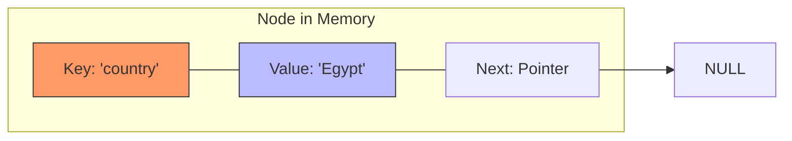

# الجزء الأول: الفلسفة والتحول (From Numbers to Meanings)

### 1. ليه الـ Dictionary هو "ملك" الـ Data Structures؟

في الكود اللي فات، كنا بنتعامل مع "مجموعة أرقام". لكن في الحقيقة، إحنا بنحتاج نربط معلومة بمعلومة تانية.

- **المثال الحي:** لو بتعمل سيستم لشركة اتصالات، إنت مش بتهتم برقم التليفون كقيمة رياضية، إنت بتهتم إن رقم "010..." مربوط باسم "محمد خالد".
    
- **الـ Key (المفتاح):** هو اللي بندور بيه (زي الاسم).
    
- **الـ Value (القيمة):** هي المعلومة اللي عاوزين نوصل لها (زي رقم التليفون أو العنوان).
    

### 2. معضلة الـ String (The String-to-Number Problem)

الكمبيوتر والمصفوفات (Arrays) مبيفهموش غير أرقام كـ Indices. عشان تخزن كلمة "Egypt" في مصفوفة، لازم تحول حروفها لرقم واحد يعبر عنها.

- **الحل:** بنعمل "مفرمة" بتمشي على حروف الكلمة حرف حرف، وتجمع قيمهم الـ ASCII وتضربهم في معامل رياضي عشان تطلع رقم "فريد" للكلمة دي.
    

### 3. الـ Node بـ "جيبين" (The New Node Structure)

دلوقتي الـ Node مبقتش شايلة "حاجة واحدة"، بقت شايلة "حاجتين" مربوطين ببعض:

1. **الـ Key:** وده اللي بنستخدمه في الـ Hash Function عشان نعرف مكانه فين.
    
2. **الـ Value:** وده الكنز اللي بنطلعه لما نلاقي الـ Key.
    

---

# الجزء الثاني: كود "فرفوش" (إزاي بنفرم الكلمة؟)

قبل ما نشوف كود بشمهندس مينا المعقد، تعال نشوف إزاي بنحول الكلمة لرقم بسيط جداً:


```C++
#include <iostream>
#include <string>

int simpleHash(std::string key, int size) {
    int hash = 0;
    for (char ch : key) {
        // بنجمع قيم الحروف ASCII
        hash += ch; 
    }
    // نضمن إن الرقم جوه حدود المصفوفة
    return hash % size; 
}

int main() {
    std::string name = "Salma";
    int index = simpleHash(name, 10);
    std::cout << "The word 'Salma' will be stored at Index: " << index << std::endl;
    return 0;
}
```
```output
The word 'Salma' will be stored at Index: 4
```

**المشكلة في الكود البسيط ده:** إن "Salma" وكلمة تانية فيها نفس الحروف بترتيب مختلف هيطلعوا نفس الرقم (Collision عالي جداً). عشان كدة بشمهندس مينا استخدم معادلة أقوى.

---

# الجزء الثالث: تشريح الـ Node الجديدة في كود مينا

بص يا هندسة، ده شكل الـ Node في الذاكرة دلوقتي:

### **The Code**


```C++
class Node
{
public:
    string key;   // "name"
    string value; // "Salma"
    Node *next;   // Pointer to the next entry in case of collision

    Node(string key, string value)
    {
        this->key = key;
        this->value = value;
        this->next = NULL;
    }
};
```

### **The Visualization (Mermaid)**

تخيل الـ Node كأنها صندوق فيه خانتين:




---

# الجزء الرابع: الـ Hash Function "الاحترافية"

بشمهندس مينا مستخدم معادلة اسمها $Polynomial\ Rolling\ Hash$.

### **The Logic & Goal**

إحنا مش بس بنجمع الحروف، إحنا بنضرب كل حرف في رقم $31$ عشان نخلي مكان الحرف يفرق. يعني كلمة "abc" تطلع رقم مختلف تماماً عن "cba".

### **The Code**


```C++
int HashFunction(string key) {
    int hash = 0;
    for (char ch : key) {
        // بنضرب القديم في 31 ونجمع عليه الحرف الجديد
        hash = hash * 31 + ch; 
    }
    // abs(hash) عشان نضمن إنه مش سالب لو حصل Overflow
    return abs(hash) % size; 
}
```

---

