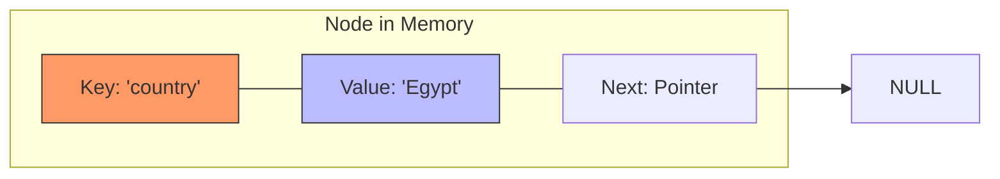
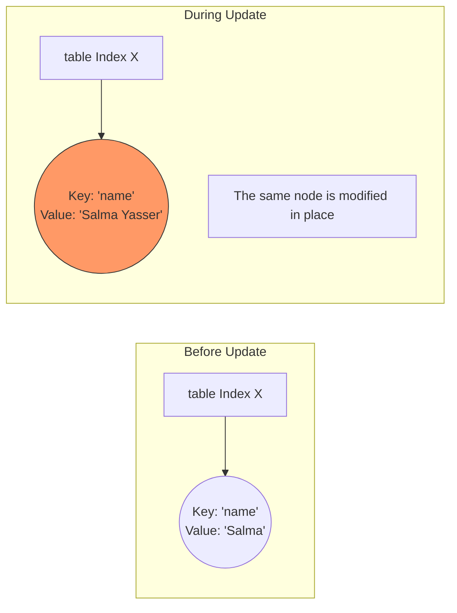
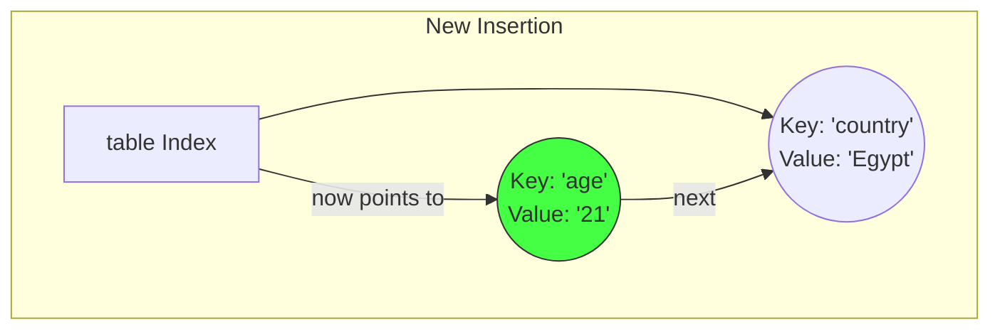
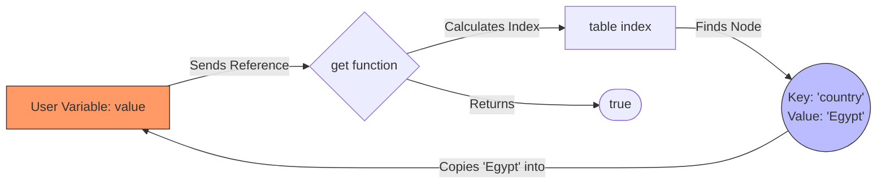
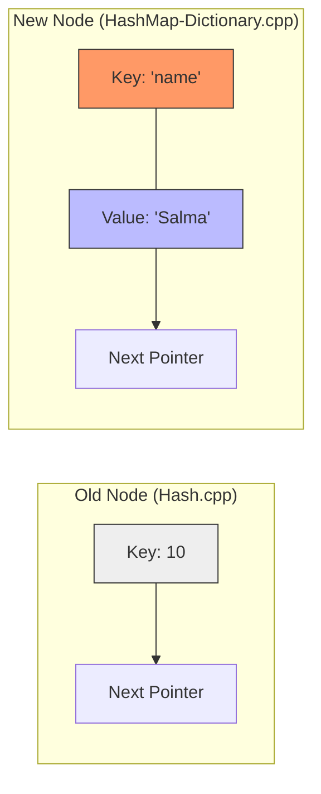

# الجزء الأول: الفلسفة والتحول (From Numbers to Meanings)

### 1. ليه الـ Dictionary هو "ملك" الـ Data Structures؟

في الكود اللي فات، كنا بنتعامل مع "مجموعة أرقام". لكن في الحقيقة، إحنا بنحتاج نربط معلومة بمعلومة تانية.

- **المثال الحي:** لو بتعمل سيستم لشركة اتصالات، إنت مش بتهتم برقم التليفون كقيمة رياضية، إنت بتهتم إن رقم "010..." مربوط باسم "محمد خالد".
    
- **الـ Key (المفتاح):** هو اللي بندور بيه (زي الاسم).
    
- **الـ Value (القيمة):** هي المعلومة اللي عاوزين نوصل لها (زي رقم التليفون أو العنوان).
    

### 2. معضلة الـ String (The String-to-Number Problem)

الكمبيوتر والمصفوفات (Arrays) مبيفهموش غير أرقام كـ Indices. عشان تخزن كلمة "Egypt" في مصفوفة، لازم تحول حروفها لرقم واحد يعبر عنها.

- **الحل:** بنعمل "مفرمة" بتمشي على حروف الكلمة حرف حرف، وتجمع قيمهم الـ ASCII وتضربهم في معامل رياضي عشان تطلع رقم "فريد" للكلمة دي.
    

### 3. الـ Node بـ "جيبين" (The New Node Structure)

دلوقتي الـ Node مبقتش شايلة "حاجة واحدة"، بقت شايلة "حاجتين" مربوطين ببعض:

1. **الـ Key:** وده اللي بنستخدمه في الـ Hash Function عشان نعرف مكانه فين.
    
2. **الـ Value:** وده الكنز اللي بنطلعه لما نلاقي الـ Key.
    

---

# الجزء الثاني: كود "فرفوش" (إزاي بنفرم الكلمة؟)

قبل ما نشوف كود بشمهندس مينا المعقد، تعال نشوف إزاي بنحول الكلمة لرقم بسيط جداً:


```C++
#include <iostream>
#include <string>

int simpleHash(std::string key, int size) {
    int hash = 0;
    for (char ch : key) {
        // بنجمع قيم الحروف ASCII
        hash += ch; 
    }
    // نضمن إن الرقم جوه حدود المصفوفة
    return hash % size; 
}

int main() {
    std::string name = "Salma";
    int index = simpleHash(name, 10);
    std::cout << "The word 'Salma' will be stored at Index: " << index << std::endl;
    return 0;
}
```
```output
The word 'Salma' will be stored at Index: 4
```

**المشكلة في الكود البسيط ده:** إن "Salma" وكلمة تانية فيها نفس الحروف بترتيب مختلف هيطلعوا نفس الرقم (Collision عالي جداً). عشان كدة بشمهندس مينا استخدم معادلة أقوى.

---

# الجزء الثالث: تشريح الـ Node الجديدة في كود مينا

بص يا هندسة، ده شكل الـ Node في الذاكرة دلوقتي:

### **The Code**


```C++
class Node
{
public:
    string key;   // "name"
    string value; // "Salma"
    Node *next;   // Pointer to the next entry in case of collision

    Node(string key, string value)
    {
        this->key = key;
        this->value = value;
        this->next = NULL;
    }
};
```

### **The Visualization (Mermaid)**

تخيل الـ Node كأنها صندوق فيه خانتين:




---

# الجزء الرابع: الـ Hash Function "الاحترافية"

بشمهندس مينا مستخدم معادلة اسمها $Polynomial\ Rolling\ Hash$.

### **The Logic & Goal**

إحنا مش بس بنجمع الحروف، إحنا بنضرب كل حرف في رقم $31$ عشان نخلي مكان الحرف يفرق. يعني كلمة "abc" تطلع رقم مختلف تماماً عن "cba".

### **The Code**


```C++
int HashFunction(string key) {
    int hash = 0;
    for (char ch : key) {
        // بنضرب القديم في 31 ونجمع عليه الحرف الجديد
        hash = hash * 31 + ch; 
    }
    // abs(hash) عشان نضمن إنه مش سالب لو حصل Overflow
    return abs(hash) % size; 
}
```

---


> [!faq]+ 🧐 كواليس الـ Hash Function: لغز الرقم 31 والـ abs()
> **ولا يهمك يا محمد**، دي حتة "رياضيات برمجة" تقيلة شوية ومحتاجة تخيل للميموري. تعال نفصصها "بشويش" عشان تفهم ليه بشمهندس مينا كتب السطرين دول بالظبط.
>
> ---
> ### 1️⃣ لغز الرقم 31 (ليه مش 2 أو 100؟)
> تخيل لو إحنا بنجمع حروف الكلمة بس (جمع تقليدي)، يعني كلمة "abc" وكلمة "cba":
> * **abc** = $97 + 98 + 99 = 294$
> * **cba** = $99 + 98 + 97 = 294$
> **النتيجة:** تصادم (Collision) فوري! لأن الترتيب مفرقش معانا.
>
> #### الحل: الـ Polynomial Rolling Hash
> إحنا عاوزين "وزن" لكل حرف حسب مكانه. فبنستخدم المعادلة دي:
> $$hash = (s[0] \times 31^{n-1}) + (s[1] \times 31^{n-2}) + \dots + (s[n-1] \times 31^0)$$
>
> **ليه 31 بالذات؟**
> 1.  **رقم أولي (Prime Number):** الأرقام الأولية بتوزع النواتج بشكل "عشوائي" أكتر في المصفوفة، فبتقلل إن كلمتين مختلفتين يروحوا لنفس الـ Index.
> 2.  **سرعة المعالج (CPU Optimization):** الـ CPU بيقدر يحسب الضرب في 31 بسرعة جداً باستخدام "الإزاحة" (Bit Shifting) لأن $31 \times i$ هي نفسها $(i \ll 5) - i$.
> 3.  **تغطية الحروف:** الرقم 31 كبير كفاية إنه يخلي كلمة "abc" تطلع ناتج بعيد جداً عن "abd"، وده بيمنع الزحمة في مكان واحد.
>
> ---
> ### 2️⃣ لغز الـ abs() (ليه بناخد القيمة المطلقة؟)
> هنا بقى المشكلة في "حجم الأوعية" في البرمجة. الـ `int` في C++ آخره رقم معين (حوالي 2 مليار).
>
> **إيه اللي بيحصل؟ (The Overflow)**
> * لما تقعد تضرب حروف الكلمة في 31 وتجمع، الرقم بيكبر بسرعة جداً ويعدي الـ 2 مليار.
> * **اللي بيحصل في الميموري:** الرقم "بيلف" (Wrap around) ويقلب لإشارة **سالب**.
> * **الكارثة:** لو جيت تعمل `(-500) % 10` (باقي القسمة)، الناتج هيطلع رقم سالب (مثلاً -0 أو -5).
> * **الانهيار (Crash):** مفيش حاجة اسمها `table[-5]`. الـ Array Index لازم يكون موجب دايماً.
>
> **وظيفة `abs()` الجراحية:**
> > بتقول للبرنامج: "مهما كان الرقم كبير ولف وبقى سالب، شيل الإشارة وخليه موجب بالعافية عشان لما أعمل باقي القسمة (%)، الـ Index يطلع رقم حقيقي ينفع أدخل بيه المصفوفة".
>
> ---
> ### 3️⃣ ملخص العملية في الميموري
> ```mermaid
> graph TD
>     Start[String: 'Egypt'] --> Loop[Loop through characters]
>     Loop --> Math["hash = (hash * 31) + ch"]
>     Math --> Overflow{Is hash > 2 Billion?}
>     Overflow -- Yes --> Negative[Hash becomes Negative]
>     Overflow -- No --> Positive[Hash stays Positive]
>     Negative --> ABS["abs(hash) makes it Positive"]
>     Positive --> Modulo["% size (keeps it in range)"]
>     ABS --> Modulo
>     Modulo --> Final[Valid Array Index]
> 
>     style Math fill:#f96,stroke:#333
>     style ABS fill:#bbf,stroke:#333
>     style Modulo fill:#4f4,stroke:#333
> ```
>
> #### 💻 كود توضيحي للـ Overflow
> جرب تشغل الكود الصغير ده عندك عشان تشوف الـ abs وهي بتنقذك:
> ```cpp
> #include <iostream>
> #include <cmath>
> 
> int main() {
>     int bigNumber = 2147483647; // أقصى قيمة للـ int
>     bigNumber = bigNumber + 100; // هيحصل Overflow ويقلب سالب
>     
>     std::cout << "Before abs: " << bigNumber << std::endl; 
>     std::cout << "After abs: " << abs(bigNumber) << std::endl;
>     
>     return 0;
> }
> ```
> **الخلاصة:** الحتة دي هي "تأمين" للكود عشان يشتغل مع أي كلمة مهما كان طولها ومن غير ما يعمل Run-time Error.

---

في الكود اللي فات كنا بنسميها `insert` لأننا بنرمي الداتا وخلاص، لكن هنا اسمها `put` لأن ليها "شخصيتين": **تحديث (Update)** لو المفتاح موجود، أو **إضافة (Insert)** لو أول مرة نشوفه.

---

# الجزء الخامس: دالة الـ `put` (The Upsert Logic)

### **1. المنطق والهدف (The Logic & Goal)**

تخيل إنك بتسجل رقم صاحبك "أحمد" على الموبايل:

- **لو "أحمد" مش عندك:** الموبايل بيعمل "Contact" جديد (Insert).
    
- **لو "أحمد" متسجل بس غير رقمه:** الموبايل مش بيعمل "أحمد" تاني، هو بيعدل الرقم القديم بس (Update).
    

الهدف هو الحفاظ على **فردية المفاتيح (Unique Keys)**؛ مينفعش الـ Key اللي اسمه "name" يتكرر مرتين في الجدول.

---

### **2. تشريح الكود (The Code Anatomy)**


```C++
void put(string key, string value) {
    // الخطوة 1: حساب المكان اللي المفروض المفتاح يكون فيه
    int index = HashFunction(key);
    Node* curr = table[index];

    // الخطوة 2: رحلة البحث عن "تحديث" (Phase 1: Update)
    while (curr != NULL) {
        if (curr->key == key) { // لو لقيت المفتاح موجود فعلاً
            curr->value = value; // حدث القيمة بتاعته (Value)
            return; // اخرج فوراً، المهمة تمت!
        }
        curr = curr->next;
    }

    // الخطوة 3: لو وصلنا هنا يبقى المفتاح جديد (Phase 2: Insert)
    Node* newNode = new Node(key, value);
    newNode->next = table[index]; // اربط في أول السلسلة (نفس منطق الكود اللي فات)
    table[index] = newNode;
}
```

---

### **3. تتبع الخطوات بـ Mermaid (The Scenarios)**

عشان تتخيل الفرق بين الحالتين في الميموري:

#### **السيناريو أ: تحديث قيمة موجودة (Update)**

لو عملنا `put("name", "Salma")` وبعدين `put("name", "Salma Yasser")`:




---

#### **السيناريو ب: تصادم وإضافة مفتاح جديد (Collision + Insert)**

لو عملنا `put("age", "21")` وطلع ليها نفس الـ Index بتاع "country":




---

### **4. ليه الترتيب ده مهم؟ (Search then Insert)**

بشمهندس مينا كتب الـ `while loop` الأول قبل ما يعمل `new Node`.

- **ليه؟** عشان يوفر ميموري. لو عملنا النود الجديدة في الأول وبعدين اكتشفنا إن المفتاح موجود، هنضطر نمسح النود اللي لسه عاملينها أو نلغي العملية. كدة هو بيدور الأول، لو ملقاش، يبدأ يحجز مكان في الميموري.
    

---

تعال بقى نكمل "الفص ملح وذاب" في دالة الـ **`get`** ودالة الـ **`remove`**، لأن فيهم تكات C++ احترافية.

# الجزء السادس: دالة الـ `get` (The Prize Retriever)

### **1. المنطق والهدف (The Logic & Goal)**

إحنا مش بس عاوزين نعرف القيمة موجودة ولا لا، إحنا عاوزين "نرجع" بيها.

المشكلة: الدالة في C++ بترجع حاجة واحدة بس. طب إزاي أرجع bool (يقولي لقيتها ولا لا) وأرجع في نفس الوقت الـ string (اللي هو القيمة)؟

**الحل:** نستخدم **الـ Pass by Reference (`&`)**. إحنا بندي للدالة "شنطة فاضية" (`result`) وهي بتملاها لينا جوه لو لقت المفتاح.

### **2. تشريح الكود (The Code Anatomy)**


```C++
bool get(string key, string& result) {
    int index = HashFunction(key);
    Node* curr = table[index];

    while (curr != NULL) {
        if (curr->key == key) {
            result = curr->value; // بنملا الشنطة اللي المستخدم بعتها
            return true; // بنأكد إننا لقيناها
        }
        curr = curr->next;
    }
    return false; // لو لفينا ومقليناش حاجة
}
```

### **3. الرسم التوضيحي (The Retrieval Flow)**

تخيل إنك بتنادي الدالة كدة: `dict.get("country", value);`

Code snippet



---

# الجزء السابع: دالة الـ `remove` (String-Based Surgery)

### **1. المنطق والهدف (The Logic & Goal)**

هي نفس فكرة الكود اللي فات (المحقق والمساعد)، بس الفرق إن المقارنة دلوقتي بتتم بـ Strings مش أرقام.

إحنا بنحسب الـ Index، وبنمشي بـ curr و prev؛ لو لقينا الـ key متطابق، بنعمل "الوصلة الجراحية" (Bypass) ونمسح النود.

### **2. تشريح الكود (The Code Anatomy)**


```C++
void remove(string key) {
    int index = HashFunction(key);
    Node* curr = table[index];
    Node* prev = NULL;

    while (curr != NULL) {
        if (curr->key == key) {
            if (prev == NULL) // لو الهدف في أول السلسلة
                table[index] = curr->next;
            else // لو الهدف في النص أو الآخر
                prev->next = curr->next;

            delete curr; // تحرير الميموري
            return;
        }
        prev = curr;
        curr = curr->next;
    }
}
```

---

# الجزء الثامن: الـ Update في الـ `main`

بص يا محمد على الحركة دي في الـ `main`:


```C++
dict.put("name", "Salma");
dict.put("name", "Salma Yasser"); // Update
```

السطر التاني ده مش هيضيف نود جديدة. هو هيروح للنود اللي فيها "Salma" ويمسح الكلمة دي ويحط مكانها "Salma Yasser" في نفس المكان في الميموري. وده اللي بيخلي الـ HashMap فعالة جداً في البرامج الكبيرة.

---

### **الخلاصة لمذاكرتك (The Takeaway for your Notes):**

1. **الـ Hash Function:** بقت أعقد عشان تتعامل مع الـ Strings (تضرب في 31 وتستخدم `abs`).
    
2. **الـ Node:** بقت شايلة معلومتين (Key, Value) بدل واحدة.
    
3. **الـ Put:** بقت "ذكية" بتعرف تعمل Update لو المفتاح موجود أصلاً.
    
4. **الـ Get:** بتستخدم الـ Reference عشان ترجع القيمة بأمان وكفاءة.
    

---
بص يا هندسة، دي مقارنة "الزتونة" اللي هتخليك تفرق بين الكودين بلمحة عين، وتفهم إزاي اتطورنا من مجرد تخزين أرقام لعمل قاموس (Dictionary) كامل:

---

### **1. المقارنة الهيكلية (Structure Comparison)**

|**وجه المقارنة**|**الكود الأول (Hash Table)**|**الكود الثاني (HashMap/Dictionary)**|
|---|---|---|
|**نوع البيانات**|بيخزن أرقام فقط (`int key`).|بيخزن مفتاح وقيمة (`string key`, `string value`).|
|**شكل الـ Node**|فيها "جيب" واحد للداتا (`key`).|فيها "جيبين"؛ واحد للمفتاح وواحد للمعلومة (`key`, `value`).|
|**المفرمة (Hash Function)**|بسيطة جداً: `key % size`.|احترافية: بتلف على حروف الكلمة وتضرب في 31 وتستخدم `abs()`.|

---

### **2. الفرق في "الذكاء" البرمجي (Logic Evolution)**

#### **الـ `insert` (القديم) vs الـ `put` (الجديد)**

- **في الكود القديم (`insert`):** البرنامج كان "بصمجي"؛ بيرمي الرقم في السلسلة وخلاص حتى لو الرقم موجود قبل كدة.
    
- **في الكود الجديد (`put`):** البرنامج بقى "ذكي"؛ بيلف الأول يدور على المفتاح، لو لقاه بيعمل **Update** للقيمة بتاعته، ولو ملقاهوش بيعمل **Insert** لنود جديدة.
    

#### **الـ `search` (القديم) vs الـ `get` (الجديد)**

- **في الكود القديم:** كان بس بيقولك "آه موجود" أو "لأ مش موجود" (`bool`).
    
- **في الكود الجديد:** مش بس بيقولك موجود، ده "بيناولك" القيمة اللي إنت عاوزها عن طريق الـ **Reference** (`string& result`).
    

---

### **3. تخيل الميموري (The Memory Shift)**




_لاحظ إن النود الجديدة في الـ Dictionary بقت شايلة معلومتين مربوطين ببعض بـ "أستك" واحد._

---

### **4. متى نستخدم هذا أو ذاك؟**

- **استخدم الـ Hash Table (الكود الأول):** لو إنت بس عاوز "تخزن" مجموعة أرقام وتعرف هي موجودة ولا لا بسرعة (مثلاً: أرقام المسجلين في مسابقة).
    
- **استخدم الـ HashMap (الكود الثاني):** لو عندك "قاموس" أو "قاعدة بيانات"؛ مفتاح بيوصلك لمعلومة (مثلاً: الاسم بيوصلك للرقم، أو الـ ID بيوصلك لبيانات الموظف).
    


