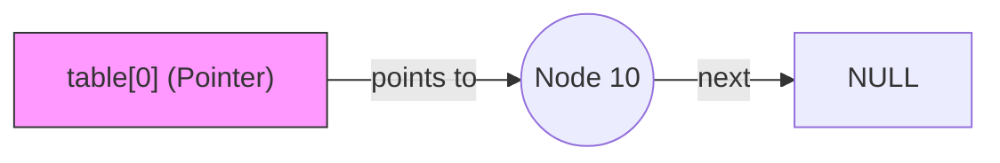
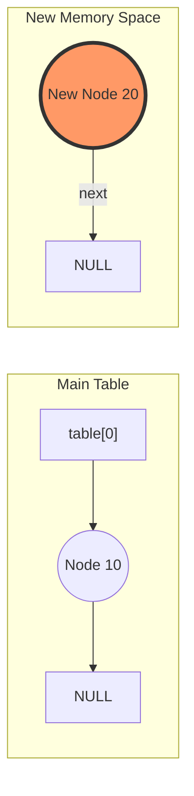
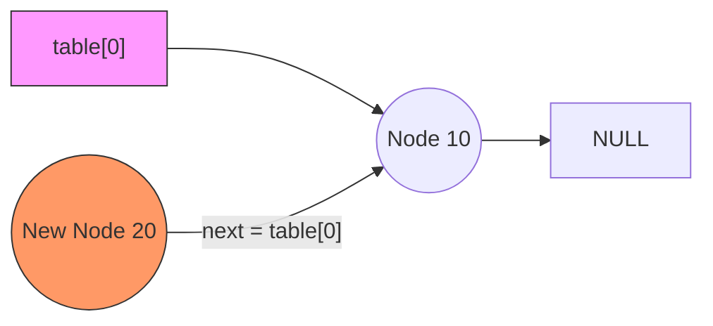
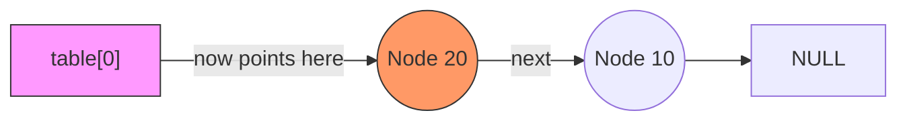

# الجزء الأول: الفلسفة العميقة (لماذا الـ Hashing؟)

### 1. معضلة البحث (The Search Dilemma)

تخيل لو عندك مخزن فيه **مليون** كرتونة، وكل كرتونة ليها "رقم تسلسلي" (Serial Number) مكون من 10 أرقام.

- **لو استخدمت Array أو Linked List:** عشان تلاقي كرتونة معينة، هتضطر تمشي عليهم واحدة واحدة. ده بياخد وقت $O(n)$.
    
- **لو استخدمت BST:** هتاخد وقت $O(\log n)$. يعني لو عندك مليون عنصر، هتعمل حوالي 20 مقارنة.
    

**السؤال الصعب:** هل نقدر نلاقي الكرتونة في **خطوة واحدة بس** ($O(1)$) مهما كان عدد الكراتين؟ الإجابة هي: **نعم، بالحساب لا بالتدوير.**

### 2. فكرة الـ "Direct Address Table" (الحل البدائي)

الحل الأسهل هو إننا نحجز مصفوفة (Array) حجمها يغطي كل الأرقام التسلسلية الممكنة. لو الأرقام من 0 لـ 99، هحجز Array فيها 100 خانة. الكرتونة رقم 50 هحطها في الـ Index رقم 50.

- **المشكلة:** لو الأرقام التسلسلية مكونة من 10 أرقام (مليار احتمال)، هتحتاج Array حجمها مليار! ده "إسراف" مرعب في الميموري لأنك غالباً معندكش غير 1000 كرتونة بس.
    

### 3. الحل العبقري: الـ Hashing (عملية التكميش)

الـ Hashing هو عملية "ضغط" أو "تكميش" للمجال الواسع (مليار رقم) لمجال صغير (مثلاً 100 خانة) باستخدام معادلة رياضية.

- **الـ Hash Function:** هي "المفرمة". تديها رقم ضخم (Key)، تطلعلنا رقم صغير (Index) يقع جوه حدود المصفوفة بتاعتنا.
    

---

# الجزء الثاني: الرياضيات وراء الـ Hash Function

المعادلة الأشهر والأبسط اللي استخدمها بشمهندس مينا هي **"باقي القسمة" (Modulo Operator)**:

$$index = key \pmod{size}$$

### ليه بنستخدم باقي القسمة؟

لأن ناتج باقي القسمة على أي رقم (مثلاً 10) مستحيل يطلع أكبر من 9 أو أصغر من 0. ده بيضمن إننا دايماً "جوه الملعب" (Array Bounds).

مثال عملي (عصر دماغ):

لو عندنا مصفوفة حجمها (Size) = 10.

1. الرقم **15**:-------------------->  $15 \pmod{10} = 5$. (سكنه في الخانة 5).
    
2. الرقم **7**:--------------------> $7 \pmod{10} = 7$. (سكنه في الخانة 7).
    
3. الرقم **25**:--------------------> $25 \pmod{10} = 5$. (**هنا بدأت المشكلة!**).
    

---

# الجزء الثالث: كارثة الـ Collision (التصادم)

بما إننا "بنكمش" أرقام كتير في مساحة صغيرة، طبيعي جداً إن رقمين مختلفين يروحوا لنفس المكان. ده بنسميه **Collision**.

### إزاي بنحل الخناقة دي؟ (Collision Resolution)

فيه مدرستين كبار، وبشمهندس مينا اختار المدرسة الأفضل في المرونة وهي **Separate Chaining**:

- **الفكرة:** بدل ما الخانة في المصفوفة تشيل "رقم"، هنخليها تشيل "عنوان" (Pointer). العنوان ده بيشاور على Linked List.
    
- **اللي بيحصل:** لو رقم 5 راح للخانة 5، هعمل نود وأحطها هناك. طب لو رقم 15 جه لنفس الخانة؟ هربطه "ورا" رقم 5 في نفس السلسلة.
    

---

# الجزء الرابع: كود "فرفوش" (تدريب بسيط قبل الجد)

تعال نطبق فكرة الـ Hash Function بس بشكل بسيط جداً بعيد عن التعقيدات، عشان نتأكد إن المفهوم وصل.


```C++
#include <iostream>

int main() {
    int tableSize = 10;
    int myData[] = {15, 22, 35, 42};

    for(int i = 0; i < 4; i++) {
        // حساب الـ Index
        int index = myData[i] % tableSize; 
        
        std::cout << "Value: " << myData[i] 
                  << " goes to Index: " << index << std::endl;
    }
    return 0;
}
```

```output
Value: 15 goes to Index: 5
Value: 22 goes to Index: 2
Value: 35 goes to Index: 5
Value: 42 goes to Index: 2

```

---

نور عليك يا محمد! إجابتك دقيقة 100%. إنت كدة مسكت طرف الخيط صح في الـ Hashing وهو **"توقع أماكن التصادم"**.

بما إنك حسبتها صح:

1. $15 \pmod 5 = 0$ و $35 \pmod 5 = 0$ (تصادم في الخانة 0).
    
2. $22 \pmod 5 = 2$ و $42 \pmod 5 = 2$ (تصادم في الخانة 2).
    

---

# الجزء الخامس: تخيل "المأساة" في الميموري

تخيل لو إنت عامل مصفوفة (Array) عادية من 5 خانات، وجيت تخزن الأرقام دي:

- هتحط الـ 15 في الخانة 0.
    
- لما تيجي تحط الـ 35، هتلاقي الخانة 0 محجوزة.. هتعمل إيه؟ لو "دهست" الـ 15 وحطيت الـ 35 مكانها، يبقى ضيعت بياناتك (Data Loss).
    

---

# الجزء السادس: كود "فرفوش" (إزاي بنحل الخناقة دي يدوياً؟)

قبل ما ندخل في "تقفل" كود بشمهندس مينا، تعال نشوف أبسط طريقة برمجية لحل المشكلة دي وهي **الـ Chaining** (إني أحول كل خانة لـ Array تانية صغيرة أو Linked List).

تعال نعمل كود "يدوي" جداً بيستخدم `vector` جوه `array` عشان نوضح الفكرة من غير تعقيد الـ Pointers:


```C++
#include <iostream>
#include <vector>

int main() {
    int size = 5;
    // مصفوفة من الـ Vectors (كل خانة عبارة عن شنطة بتشيل أرقام كتير)
    std::vector<int> hashTable[5]; 

    int keys[] = {15, 22, 35, 42};

    for(int i = 0; i < 4; i++) {
        int index = keys[i] % size;
        // بنضيف الرقم في الشنطة بتاعته حتى لو فيه غيره
        hashTable[index].push_back(keys[i]); 
    }

    // تعال نتفرج على شكل الجدول
    for(int i = 0; i < size; i++) {
        std::cout << "Index " << i << ": ";
        for(int val : hashTable[i]) {
            std::cout << val << " -> ";
        }
        std::cout << "NULL" << std::endl;
    }

    return 0;
}
```
```output
Index 0: 15 -> 35 -> NULL
Index 1: NULL
Index 2: 22 -> 42 -> NULL
Index 3: NULL
Index 4: NULL

```
### إيه اللي حصل هنا؟

1. في الخانة (Index 0): الـ Vector شال الـ 15 والـ 35 مع بعض.
    
2. في الخانة (Index 2): الـ Vector شال الـ 22 والـ 42 مع بعض.
    
3. باقي الخانات فضلت فاضية.
    


---

# الجزء السابع: ليه بشمهندس مينا مستخدمش الـ Vector؟

بما إننا في كورس Data Structures، الهدف إننا نبني كل حاجة من الصفر (Low-level). الـ `std::vector` اللي استخدمته أنا فوق هو أداة جاهزة في C++، لكن بشمهندس مينا عاوز يعلمك إزاي تبني الـ "الشنطة" دي باستخدام الـ **Linked List** يدوياً:

- لأن الـ Linked List في الميموري أكفأ بكتير في الإضافة والحذف المستمر.
    
- عشان تتعلم إزاي تتحكم في الـ Pointers بنفسك وتعرف الـ `Node** table` دي بتعمل إيه بالظبط.
    

---

## 1. The Core Structure (The Foundation)

### **The Problem & Logic**

في أي نظام تخزين، إحنا محتاجين "وعاء" يشيل الداتا. لو استخدمنا مصفوفة (Array) عادية، هنواجه مشكلة الحجم المحدود وصعوبة التعامل مع البيانات لو حصل زحمة في مكان واحد.

المنطق هنا إننا بنبني "مصفوفة من العناوين"؛ كل خانة في المصفوفة مش بتشيل القيمة نفسها، لكن بتشيل عنوان (Pointer) لأول "نود" في سلسلة مرتبطة (Linked List).

### **The Goal**

إنشاء هيكل مرن يقدر يتوسع "رأسياً" (عن طريق الـ Linked List) لما يحصل تصادم في البيانات في نفس الخانة.

### **The Code**


```C++
// Node structure to represent each element in the chain
class Node
{
public:
    int key;    // The actual data/value
    Node *next; // Pointer to the next node in the same bucket/chain

    Node(int key)
    {
        this->key = key;
        this->next = NULL; // Initialize next as NULL to mark the end
    }
};

class HashTable
{
    int size;     // Total number of buckets in the table
    Node **table; // Pointer to an array of Node pointers (The Table)
```

---

## 2. The Constructor (Memory Setup)

### **The Problem & Logic**

لما بنحجز مصفوفة في الميموري باستخدام `new` في C++، الخانات مبيكنش فيها أصفار، بيبقى فيها "زبالة" (Garbage Values) أو عناوين قديمة لبرامج تانية. لو سبناها كدة، البرنامج هيفتكر إن فيه "نودز" حقيقية موجودة وهيحاول يوصل ليها ويحصل `Crash`.

### **The Goal**

تجهيز المصفوفة في الـ Heap وتصفير كل الخانات (Set to `NULL`) عشان نضمن إن كل "سلسلة" بتبدأ من الفراغ.

### **The Code**


```C++
public:
    HashTable(int size)
    {
        this->size = size;
        // Step 1: Allocate an array of 'Node pointers' in the Heap
        table = new Node *[size];

        // Step 2: Initialize each pointer to NULL to avoid wild pointers
        for (int i = 0; i < size; i++)
        {
            table[i] = NULL; 
        }
    }
```

---

## 3. The Hash Function (The Mapping Logic)

### **The Problem & Logic**

إحنا عندنا مفاتيح (Keys) ممكن تكون أي رقم (مثلاً من 1 لحد مليون)، لكن عندنا مساحة محدودة في المصفوفة (مثلاً 10 خانات فقط). إزاي نخلي أي رقم كبير "يصغر" ويدخل جوه حدود المصفوفة (من 0 لـ 9)؟

المنطق هو استخدام **باقي القسمة (Modulo)**؛ لأن ناتج `X % 10` دايماً هيكون رقم بين 0 و 9.

### **The Goal**

تحويل الـ Key لـ Index "قانوني" وصحيح يقع داخل نطاق المصفوفة المحجوزة.

### **The Code**


```C++
    // Transforms the key into a valid array index
    int HashFunction(int key)
    {
        // Using modulo operator to keep the index within [0 to size-1]
        int index = key % size; 
        return index;
    }
```

---

## 4. The Insertion Logic (Handling Collisions)

### **The Problem & Logic**

دلوقتي حسبنا الـ Index وطلع مثلاً "0". رحت للخانة رقم 0 لقيت فيها فعلاً "نود" قديمة (تصادم). المنطق الأسرع والأذكى هو إننا مش بندور على آخر السلسلة عشان نضيف، إحنا بنضيف النود الجديدة في أول السلسلة (At the Head).

ليه؟ لأن الإضافة في الأول بتاخد خطوة واحدة بس $O(1)$، لكن لو دورت على الآخر هتاخد وقت $O(n)$.

### **The Goal**

إضافة النود الجديدة في الخانة المناسبة وربطها بالسلسلة الموجودة مسبقاً (إن وجدت) بدون ضياع البيانات القديمة.

### **The Code**


```C++
    void insert(int key)
    {
        // Step 1: Create the new node in memory
        Node *newNode = new Node(key);

        // Step 2: Determine which bucket/index it belongs to
        int index = HashFunction(key);

        // Step 3: Insert at the beginning of the linked list
        // Make the new node point to whatever is currently at that index
        newNode->next = table[index];

        // Step 4: Update the table index to point to the new node
        table[index] = newNode;
    }
```

---
## deep dive in the insert function:

### **1. المنطق والهدف (The Logic & Goal)**

الهدف إننا نحط النود الجديدة في **أول الطابور** (Head of the list).

- **المشكلة:** لو جيت وخليت "مقبض الباب" (`table[index]`) يمسك إيد النود الجديدة فوراً، إنت كدة سيبت إيد الناس اللي كانت واقفة قديم، وهيتوهوا في الميموري (Memory Leak).
    
- **الحل:** النود الجديدة لازم تمسك إيد "أول واحد قديم" الأول، وبعدين إحنا ننقل "مقبض الباب" للنود الجديدة.
    

---

### **2. تتبع الخطوات بالرسم (Step-by-Step Trace)**

نتخيل إن الـ `index` هو **0**، وإحنا بنضيف الرقم **20**، وكان فيه أصلاً الرقم **10** موجود قبل كدة.

#### **الحالة قبل الإضافة:**

- `table[0]` بيشاور على النود **10**.
    
- النود **10** بتشاور على `NULL`.
    

#### **الخطوة 3: `newNode->next = table[index];`**

إحنا عملنا نود جديدة اسمها **20**. دلوقتي بنقول للـ **20**: "يا 20، خلي الـ `next` بتاعك يمسك اللي الـ `table[0]` ماسكه دلوقتي".

- **النتيجة:** النود **20** بقت ماسكة إيد النود **10**.
    
- **لاحظ:** الـ `table[0]` لسه ماسك الـ **10** برضه.. إحنا كدة عملنا "وصلة مؤقتة".
    

#### **الخطوة 4: `table[index] = newNode;`**

دلوقتي نقدر ننقل "مقبض الباب" بأمان. بنقول للـ `table[0]`: "سيب الـ 10، وامسك النود الجديدة **20**".

- **النتيجة النهائية:** `table[0]` -> **20** -> **10** -> `NULL`.
    

---

### **3. تخيلها بـ Mermaid (سلسلة الإضافة)**

 الرسم هو أحسن وسيلة لتثبيت الـ Pointers في الدماغ. تعال نتخيل إننا بنضيف النود **20** في جدول حجمه **5**، وكان الجدول ده فيه أصلاً النود **10** عند الـ Index رقم **0**.

سأقسم لك العملية لـ **4 لقطات** (Frames) كأننا بنصور فيلم سينمائي للميموري.

---

### **الخطوة 0: الحالة قبل الإضافة (The Initial State)**

الجدول فيه النود **10**، والـ `table[0]` مشاور عليها.

Code snippet



---

### **الخطوة 1 و 2: إنشاء النود الجديدة (Node Creation)**

الكود: Node *newNode = new Node(20); و int index = HashFunction(20);.

دلوقتي عندنا نود "تايهة" في الميموري لسه ملهاش علاقة بالجدول.




---

### **الخطوة 3: التوصيل الآمن (newNode->next = table[index])**

دي أهم لقطة. إحنا بنقول للنود **20**: "يا 20، وصلي الـ `next` بتاعك باللي الـ `table[0]` ماسكه حالياً (اللي هو الـ 10)".

> **لاحظ:** الـ `table[0]` لسه مشاور على الـ 10، والـ 20 برضه بقت مشاورة على الـ 10. مفيش داتا ضاعت!




---

### **الخطوة 4: تحديث رأس الجدول (table[index] = newNode)**

آخر لقطة. دلوقتي بننقل "الخيط" بتاع `table[0]` عشان يمسك النود الجديدة **20**.




---

### **لماذا هذه الطريقة عبقرية؟**

1. **السرعة ($O(1)$):** مهما كان طول السلسلة (Chain) اللي عند الـ Index رقم 0، إنت دايماً بتعمل الخطوات دي في نفس الوقت. مش محتاج تمشي لآخر السلسلة عشان تضيف.
    
2. **الأمان:** لو كنت نفذت الخطوة 4 قبل الخطوة 3، كنت هتقطع الخيط اللي واصل للنود 10، وهتضيع منك للأبد في الميموري.
    

---

### **تحدي الـ Trace الجاي:**

تخيل لو ضفنا نود تالته قيمتها **30** عند نفس الـ Index (0).

1. مين اللي الـ `next` بتاعه هيشاور على الـ **20**؟
    
2. الـ `table[0]` هيشاور على مين في الآخر؟
    

---

### **4. ماذا لو عكسنا السطرين؟ (The Disaster)**

لو كتبت كدة:

1. `table[index] = newNode;`
    
2. `newNode->next = table[index];`
    

- **الكارثة:** في السطر الأول، إنت خليت `table[index]` يمسك النود الجديدة، وفقدت "للأبد" عنوان النود القديمة اللي كانت موجودة.
    
- السطر التاني هيخلي النود تشاور على "نفسها"، وهتعمل `Infinite Loop` والبرنامج هيهنج.
    

---

### **5. الكود بالكومنتات التفصيلية (The Code)**


```C++
void insert(int key)
{
    // Step 1: Create the new node
    Node *newNode = new Node(key);

    // Step 2: Get the bucket index
    int index = HashFunction(key);

    // Step 3: Secure the existing chain
    // Tell newNode: "Don't lose the people already in line!"
    // Point newNode's next to the current first node in this bucket
    newNode->next = table[index];

    // Step 4: Make newNode the new head
    // Now that the chain is secure, update the table to point to our newNode
    table[index] = newNode;
}
```

### **الخلاصة (The Takeaway):**

إحنا دايماً بنربط **"من الجديد للقديم"** الأول، وبعدين بنحدث **"عنوان البداية"**. ده هو سر الـ $O(1)$ Insertion؛ لأنك مش محتاج تمشي لآخر الطابور عشان تضيف، إنت دايماً بتبني من "قدام".


