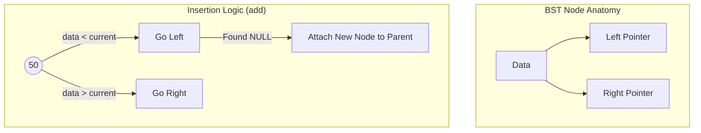
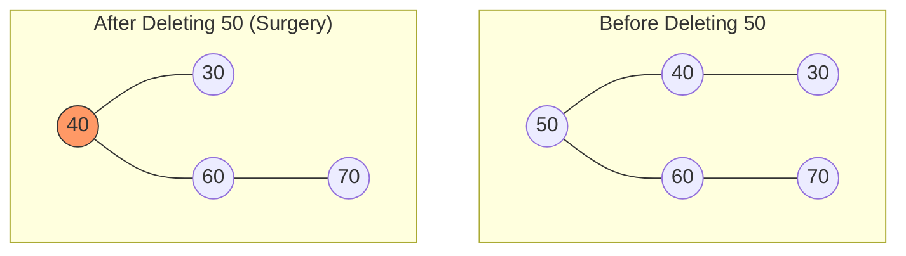

يا أهلاً بك يا محمد. ولا يهمك، التنسيق النظيف هو اللي بيخلي المذاكرة أمتع. أنا هعيد لك صياغة **الجزء الأول (Part 1)** بالكامل، مع التركيز على كل التفاصيل وبدون أي لينكات داخلية، عشان تكون جاهزة للنقل فوراً لـ Obsidian.

---

# Part 1: BST Anatomy & Iterative Insertion Logic (Mina's Implementation)

### 1. Preamble & Introduction (التمهيد)

الـ Binary Search Tree (BST) اللي بشمهندس مينا كاتبها هنا هي تطبيق حي لمبدأ التنظيم الهرمي للبيانات. الـ Mental Model اللي لازم يكون في دماغك هو "الميزان الذكي"؛ كل نود بتعمل فلترة للداتا اللي داخلة. لو القيمة أصغر بتروح الشمال، ولو أكبر بتروح اليمين، وده اللي بيحول عملية البحث من مشوار خطي ممل لرحلة سريعة جداً.

### 2. Historical Context (المشكلة والحل)

قبل اختراع الـ BST، كان المهندسين بيواجهوا مشكلة مع المصفوفات المرتبة (Sorted Arrays). الـ Array المترتب بيدينا سرعة بحث خرافية (O(log n))، بس لو حبيت "تضيف" عنصر في النص، لازم تشفت كل العناصر اللي بعده (O(n)) وده كان بطيء جداً. الـ BST ظهرت كحل وسط عبقري بيجمع بين سرعة البحث ومرونة الإضافة.

### 3. Deep Logic & Mechanics (التشريح البرمجي)

بشمهندس مينا بنى الكود على مرحلتين أساسيتين:

- **الـ Node (الطوبة الأساسية):**
    
    - الـ Node هنا شايلة الداتا (int data) واثنين Pointers (left و right).
        
    - الـ Constructor بتاعها بيضمن إن أي نود تتخلق تكون "يتيمة" في الأول، يعني الـ left والـ right بتوعها بـ NULL.
        
- **الـ add (محرك الإضافة):**
    
    - بشمهندس مينا استخدم الـ Iterative Approach (باستخدام while loop) مش الـ Recursion. وده في الـ C++ بيوفر ميموري في الـ Call Stack.
        
    - **التكنيك المستخدم:** الكود بيستخدم اثنين Pointers شغالين مع بعض؛ الـ current وده الـ "Scout" اللي بينط بين النودز عشان يلاقي مكان فاضي (NULL). والـ parent وده الـ "Follower" اللي بيفضل واقف عند النود اللي قبل الـ current بخطوة واحدة.
        
    - **ليه بنحتاج الـ parent؟** لأن الـ current لما يوصل لـ NULL بنكون "وقعنا" بره الشجرة، وعشان نربط النود الجديدة لازم يكون معانا عنوان "آخر نود" حقيقية وقفنا عندها.
        

### 4. Visualizing with Mermaid (التمثيل البصري)

ده شكل الشجرة والمنطق اللي بيمشي بيه الـ Insertion:

Code snippet



### 5. Memory & Low-Level Insights (نظرة عميقة للميموري)

- **Memory Layout:** الـ Tree كـ Object بيتحجز في الـ Stack، لكن لما بنعمل `new Node(data)`، إحنا بنطلب من نظام التشغيل (Linux) مساحة في الـ Heap Memory.
    
- **Pointers & Addresses:** العناوين دي بتكون عشوائية في الـ Heap، والـ BST هي اللي بتربطهم منطقياً ببعض عن طريق الـ Pointers.
    
- **نصيحة للمحترفين:** استخدام `new` بدون `delete` بيسبب Memory Leak. لاحظ إن بشمهندس مينا عامل Destructor في كلاس النود، وده تمهيد لعملية تنظيف الميموري اللي بنشوفها في الـ Remove.
    

### 6. Complexity Analysis (تحليل الكفاءة)

- **Time Complexity (Average):** الوقت المستغرق للإضافة هو O(log n) لأننا بنمشي في مسار واحد فقط من الـ Root للـ Leaf.
    
- **Time Complexity (Worst Case):** الوقت بيوصل لـ O(n) لو الشجرة بقت "مايلة" (Skewed) ناحية واحدة (كأنها Linked List).
    
- **Space Complexity:** هو O(n) لأننا بنحجز مكان في الـ Heap لكل نود بنضيفها.
    

### 7. C++ Code Snippets (من كود بشمهندس مينا)

منطق القفز (The Jump Logic):

ده الجزء اللي بيخلينا نتحرك جوه الشجرة لحد ما نلاقي المكان الفاضي المناسب:


```C++
while(current != NULL ){
    parent = current; // احتفظ بالأب قبل القفز للابن
    if(data > current ->data  ){
        current = current->right; // لو الداتا أكبر، ادخل يمين
    } else {
        current = current->left;  // لو الداتا أصغر، ادخل شمال
    }
}
```

---

### 5 Self-Check Questions (اختبر فهمك):

1. ليه بشمهندس مينا احتاج يستخدم Pointer اسمه `parent` وإحنا بنعمل `add`؟
    
2. إيه اللي هيحصل لو حاولنا نضيف قيمة موجودة أصلاً في الشجرة بناءً على الكود المكتوب؟
    
3. هل الـ `add` function في الكود ده بتستخدم الـ Recursion ولا الـ Loops؟ وليه؟
    
4. في الميموري، إيه الفرق بين مكان تخزين الـ `root` ومكان تخزين الـ `newNode`؟
    
5. لو الشجرة فاضية (root == NULL)، إزاي الكود بيتعامل مع أول عملية إضافة؟
    
    

---


    

---

# Part 3: Node Removal - The Surgical Logic

### 1. Preamble & Introduction

عملية الـ `removeNode` في كود بشمهندس مينا هي عملية "إعادة هيكلة"2. الـ Mental Model اللي لازم يكون عندك هو "خطة البديل"؛ لو شيلنا مدير (Node)، مين اللي ينفع يمسك مكانه بحيث الموظفين اللي تحته (Children) يفضلوا مترتبين صح؟ الكود هنا بيتعامل مع 3 سيناريوهات جراحية مختلفة3.

### 2. Historical Context

زمان، كانت الأنظمة بتعاني من الـ **Memory Fragmentation** والـ **Dangling Pointers**. لو مسحت نود من غير ما تضبط الـ Pointers اللي بتشاور عليها، السيستم هيضرب Crash. كود بشمهندس مينا بيطبق "خوارزمية الحذف" الكلاسيكية اللي بتضمن إن الشجرة تفضل "متصلة" دايماً4.

### 3. Deep Logic & Mechanics

بشمهندس مينا قسم الـ `removeNode` لجزئين كبار: **التعامل مع الـ Root** و **التعامل مع أي نود تانية**5. وفي الحالتين، إحنا بنواجه 3 حالات فرعية:

- **الحالة 1: الـ Leaf Node (نود ملهاش ولاد):**
    
    - دي أسهل حالة. بنخلي الـ `parent` يشاور على `NULL` بدل النود دي، وبعدين نمسحها من الميموري6.
        
- **الحالة 2: نود ليها إبن واحد (يمين أو شمال):**
    
    - هنا بنعمل "تخطي" (Bypass). بنخلي الـ `parent` يشاور مباشرة على "حفيده" (إبن النود اللي هتتمسح)، وبكده النود بقت معزولة وجاهزة للمسح7.
        
- **الحالة 3: نود ليها إبنين (الحالة المعقدة):**
    
    - بشمهندس مينا استخدم استراتيجية الـ **In-order Predecessor**8.
        
    - بيروح للفرع الشمال (`root->left`)9.
        
    - بيدور على أقصى اليمين في الفرع ده باستخدام `getMaxRight`10.
        
    - بيخلي أقصى اليمين ده يشاور على "الفرع اليمين" بتاع النود اللي هتتمسح، وبكده بنحافظ على الترتيب11.
        

### 4. Visualizing with Mermaid

تعال نشوف إيه اللي حصل لما مسحنا الـ **50** (الـ Root) في كود بشمهندس مينا:

Code snippet



### 5. Memory & Low-Level Insights

- **The `delete` Operator:** الكود بيستخدم `delete current;` في أخر الدالة12. دي خطوة "مقدسة" في الـ C++ عشان ترجع المساحة للـ **Heap** وتمنع الـ **Memory Leak**13.
    
- **Dangling Pointers:** لاحظ إن بشمهندس مينا قبل ما يعمل `delete` للعنصر، كان بيضبط الـ `parent->right` أو `parent->left` الأول14. لو عكسنا الخطوات دي، هنفقد العنوان وهنحاول نلمس ميموري مش موجودة (Undefined Behavior).
    
- **Null Checking:** الكود بيعمل `if (current == NULL)` في البداية كنوع من الـ Defensive Programming عشان يتأكد إننا مش بنمسح سراب15.
    

### 6. Complexity Analysis

- **Time Complexity:** عملية الحذف بتاخد $O(H)$ حيث $H$ هو ارتفاع الشجرة16. في المتوسط ده $O(\log n)$17.
    
- **Space Complexity:** $O(1)$ لأن الكود شغال Iterative (باستخدام Pointers) مش Recursive18.
    

---

### 7. Extensive Code Examples (C++)

Level 1: Removing a Leaf (The Simple Cut)

زي حالة مسح رقم 20 في الكود.


```C++
// If node is leaf, the child pointer remains NULL
if(current->right == NULL && current->left == NULL){
    child = NULL; // Parent will now point to NULL
}
```

Level 2: The "Bypass" (One Child Case)

زي حالة مسح رقم 70 في الكود.


```C++
// If it has only a right child, jump over the node
else if(current->left == NULL){
    child = current->right; // Grandparent connects to Grandchild
}
```

Level 3: The "Brain Transplant" (Two Children Case)

دي أصعب حتة في كود بشمهندس مينا.


```C++
// Case: Root has two children
Node * newRoot = root->left; // Pick left child
Node * maxRight = getMaxRight(newRoot); // Find biggest in left branch
maxRight->right = root->right; // Connect old right branch to it
root = newRoot; // Promote left child to be the new Root
```

---

### 5 Self-Check Questions:

1. في حالة الـ Two Children، ليه بشمهندس مينا اختار الـ `getMaxRight` من الفرع الشمال بالذات؟ 19
    
2. ليه بنحتاج نعمل `delete current;` في أخر الدالة مع إننا غيرنا مسار الـ Pointers؟ 20
    
3. لو مسحنا نود كانت هي الـ `left child` لأبوها، إزاي الكود بيعرف يضبط الـ `parent->left` مش الـ `parent->right`؟ 21
    
4. إيه اللي يحصل لو الـ `root` كان هو النود الوحيدة في الشجرة وعملنا `removeNode`؟ 22
    
5. في كود الـ `main` 23، بعد مسح الـ 50، مين النود اللي بقت هي الـ `root` الجديدة؟ 24
    
