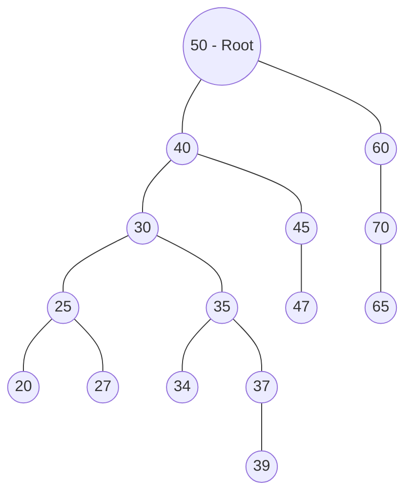
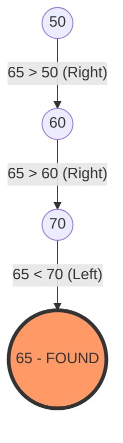

# Part 1: BST Anatomy & Insertion Logic (Mina's Implementation)

### 1. Preamble & Introduction

الـ Binary Search Tree اللي بشمهندس مينا كاتبها هنا هي تطبيق حي لمبدأ "Divide and Conquer" في تخزين البيانات111. الـ Mental Model اللي لازم يكون في دماغك هو "الفلترة التلقائية"؛ كل ما بتضيف عنصر، الشجرة بتفلتر مكانه بناءً على قيمته مقارنة بالـ Root، وده بيخلينا نحول البحث من مشوار طويل في Array لرحلة قصيرة في فروع الشجرة2222.

### 2. Historical Context

زمان في لغات زي C، كان التعامل مع الـ Arrays المترتبة بيعمل مشكلة "الجمود"؛ لو عايز تضيف رقم في النص لازم تشفت كل اللي بعده. المهندسين فكروا في الـ BST عشان يجمعوا بين سرعة الـ Binary Search وبين مرونة الـ Linked Lists في الإضافة والحذف، وده اللي الكود ده بيطبقه بالظبط باستخدام الـ Dynamic Memory3.

### 3. Deep Logic & Mechanics

في كود بشمهندس مينا، الـ `Node` هي الطوبة الأساسية4.

- **الـ Constructor:** بيصفر الـ `left` والـ `right` بـ `NULL` أول ما النود تتخلق5.
    
- **الـ `add` Function:** بتستخدم الـ Iterative Approach (مش الـ Recursive) عشان تلف جوه الشجرة6.
    
- **عملية الـ Jump:** الكود بيستخدم Pointer اسمه `current` عشان "ينط" بين النودز، و Pointer تاني اسمه `parent` عشان يفضل ماسك "إيد" النود اللي قبلها، لأننا أول ما نوصل لـ `NULL` بنكون محتاجين الـ `parent` عشان نربط فيه النود الجديدة7777.
    

### 4. Visualizing with Mermaid

ده شكل الشجرة اللي بتتبني في الـ `main` بتاع الكود88:

Code snippet



### 5. Memory & Low-Level Insights

- **Stack vs Heap:** الـ `Tree` Object نفسه ممكن يتحجز في الـ Stack، بس كل `Node` بتتخلق باستخدام `new` بتتحجز في الـ **Heap**9.
    
- **Pointers:** الكود بيعتمد على الـ Raw Pointers10. في أنظمة Linux، ده معناه إنك مسؤول عن الـ `delete` لكل نود عشان متعملش **Memory Leak**11.
    
- **Cache Locality:** بما إن النودز "مبعثرة" في الـ Heap، الـ Cache Locality هنا مش أحسن حاجة مقارنة بالـ Arrays، بس ده تمن المرونة في الإضافة12.
    

### 6. Complexity Analysis

- **Time Complexity (Insertion):** في المتوسط $O(\log n)$1313. بس خلي بالك، لو ضفت أرقام مترتبة (10, 20, 30)، الشجرة هتبقى Skewed والسرعة هتبقى $O(n)$14.
    
- **Space Complexity:** $O(n)$ لأننا بنحجز مكان لكل نود بنضيفها15.
    

---

### 7. Extensive Code Examples (C++)

بناءً على كود بشمهندس مينا، دي 3 مستويات من التعامل مع الـ BST:

Level 1: Basic Node Creation (The Atomic Level)

ده أبسط شكل لتعريف النود زي ما موجود في الكود16.


```c++
// Basic Node structure
class Node {
public:
    int data;
    Node *left, *right;
    Node(int val) {
        data = val;
        left = right = NULL; // Initializing pointers to NULL
    }
};
```

Level 2: Iterative Insertion Logic (Mina's Logic)

تطبيق الـ while loop عشان نلاقي مكان العنصر1717.


```c++
// Finding the right spot for the new data
while(current != NULL) {
    parent = current;
    if(data > current->data)
        current = current->right; // Go Right if bigger
    else
        current = current->left;  // Go Left if smaller
}
```

Level 3: Advanced Structure (Production Grade)

تطوير بسيط على الكود عشان يمنع الـ Memory Leaks باستخدام الـ Destructor بشكل Recursive.


```C++
// Adding a Recursive Destructor to ensure all nodes in Heap are freed
class Tree {
    Node* root;
public:
    ~Tree() {
        destroyTree(root);
    }
private:
    void destroyTree(Node* node) {
        if (node) {
            destroyTree(node->left);
            destroyTree(node->right);
            delete node; // Free memory safely
        }
    }
};
```

---

### 5 Self-Check Questions:

1. ليه بنحتاج Pointer اسمه `parent` وإحنا بنعمل `add` طالما عندنا الـ `current`؟ 18181818
    
2. في الـ `main` بتاع الكود، لو ضفنا رقم 36، هيروح يمين ولا شمال الـ 35؟ 19191919
    
3. إيه اللي يحصل في الميموري لو عملنا `new Node` وما مسحناهاش بعد الـ `removeNode`؟ 20
    
4. ليه الـ `displayLDR` بتطبع الأرقام مترتبة؟ 21
    
5. إيه الفرق بين الـ `root` لما يكون `NULL` وبين لما يكون بيشاور على نود ملهاش ولاد؟ 22
    


---

# Part 2: Searching, Parental Links & Subtree Navigation

### 1. Preamble & Introduction

الـ Navigation جوه الـ BST مش مجرد تدوير عشوائي؛ هو عملية "صناعة قرار" (Decision Making) في كل خطوة1. إنت بتسأل كل نود: "أروح يمين ولا شمال؟" لحد ما توصل لهدفك2. في الجزء ده، الكود بيركز على إزاي نلاقي نود معينة، وإزاي نطلع "لفوق" (نجيب الـ Parent) مع إن النودز معندهاش Pointer للأب3.

### 2. Historical Context

في الـ Linked Lists، الـ Search عملية مملة جداً لأنك لازم تعدي على الكل ($O(n)$). لكن في الـ BST، الفلسفة مستوحاة من فكرة "قواميس اللغة"؛ إنت بتفتح في النص، وبناءً على الحرف، بترمى نص القاموس وتبحث في النص التاني. بشمهندس مينا طبق ده بـ Iterative approach عشان يوفر في مساحة الـ Stack4.

### 3. Deep Logic & Mechanics

- **الـ `getNodeByData` (The Scout):** الكود بيبدأ من الـ `root` وبيستخدم `while` loop5. لو الـ `data` اللي معاك أكبر من النود الحالية، بترمى الجناح الشمال كله وتدخل يمين6. لو أصغر، بتدخل شمال7. دي بنسميها **Path Compression** في التفكير.
    
- **الـ `getParent` (The Detective):** دي "خدعة" برمجية ذكية8. بما إن النود معندهاش `parent*` يشاور لفوق، بشمهندس مينا بيبدأ رحلة بحث من الـ `root` وبيدور على النود اللي الـ `left` أو الـ `right` بتاعها هو الـ `current` اللي بندور عليه99.
    
- **الـ `getMaxRight` (The Greedy Explorer):** دي وظيفة بسيطة بس جوهرية في الـ Removal1010. بتبدأ من نود معينة وتفضل "تكسر يمين" لحد ما الـ `right` يكون بـ `NULL`11. دي بتجيب لك أكبر قيمة في الـ Subtree دي12.
    

### 4. Visualizing with Mermaid

تخيل لو بندور على نود **65** في الشجرة اللي بنيناها، المسار هيكون كالتالي:

Code snippet



### 5. Memory & Low-Level Insights

- **Pointer Comparison:** في دالة الـ `getParent` 1313، الكود بيقارن العناوين (Addresses) مش القيم: `if(parent->left == current || parent->right == current)`1414. ده أسرع وأدق لأن القيم ممكن تتكرر (لو السيستم بيسمح)، لكن العناوين في الـ Heap مستحيل تتكرر لنودز مختلفة.
    
- **Return Values:** لاحظ إن الـ `getParentMain` بترجع `-1` لو النود هي الـ `root` (ملهاش أب) 15، وبترجع `-5` لو النود مش موجودة أصلاً16. دي ممارسة كويسة في الـ C لإرجاع Error Codes واضحة.
    

### 6. Complexity Analysis

- **Search Complexity:** في المتوسط $O(\log n)$17.
    
- **GetParent Complexity:** برضه $O(\log n)$ لأننا بنمشي مسار واحد من الـ Root للنود18.
    
- **Space Complexity:** $O(1)$ لأن كل العمليات دي Iterative (باستخدام `while` loops) ومبتستهلكش الـ Call Stack191919.
    

---

### 7. Extensive Code Examples (C++)

بناءً على منطق بشمهندس مينا، دي 3 مستويات من التفكير في الـ Navigation:

Level 1: Basic Max Search (Greedy Strategy)

زي ما بشمهندس مينا عمل في الـ getMaxRight20.

C++

```C++
// Moving to the extreme right to find the maximum
Node* current = root;
while(current->right != NULL) {
    current = current->right; // Keep going right
}
return current; // The largest element
```

Level 2: Error Handling in Navigation (Mina's Wrapper)

إزاي تعمل Safe Function تنادي الـ Logic وتعالج الحالات الخاصة21.

C++

```C++
int getParentMain(int data) {
    Node *node = getNodeByData(data); // First find the node
    if(node != NULL) {
        Node *parent = getParent(node); // Then find its parent
        if(parent != NULL) return parent->data;
        return -1; // Case: Node is Root
    }
    return -5; // Case: Node doesn't exist
}
```

Level 3: Lab Challenge - Finding Max Depth (The Empty Lab Function)

في الكود، الـ getMaxDepth كانت فاضية. دي طريقة تنفيذها بالـ Recursion:


```C++
int getMaxDepth(Node* node) {
    if (node == NULL) return 0;
    // Calculate depth of each subtree
    int leftDepth = getMaxDepth(node->left);
    int rightDepth = getMaxDepth(node->right);
    // Use the larger one and add 1 for the current level
    return max(leftDepth, rightDepth) + 1;
}
```

---

### 5 Self-Check Questions:

1. ليه دالة `getParent` بتبدأ دايماً من الـ `root` مع إننا ممكن نكون في نص الشجرة؟ 22
    
2. إيه الفرق الجوهري في الميموري بين الـ `getNodeByData` والـ `getParent`؟ 232323
    
3. لو الشجرة عبارة عن نود واحدة بس (الـ Root)، الـ `getMaxRight` هترجع إيه؟ 24
    
4. ليه بشمهندس مينا استخدم `-5` كـ Error Code في الـ `getParentMain`؟ 25
    
5. إزاي نقدر نعدل `getNodeByData` عشان تشتغل Recursive بدل `while` loop؟ 26
    

---
