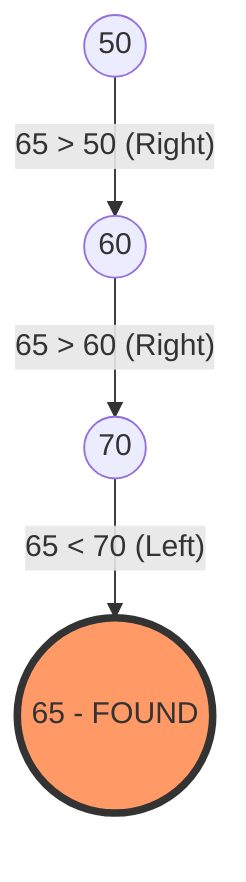
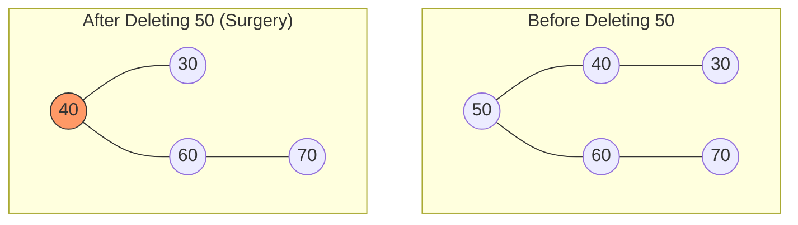

# Part 1: BST Anatomy & Iterative Insertion Logic (Mina's Implementation)

### 1. Preamble & Introduction

الـ Binary Search Tree اللي بشمهندس مينا كاتبها هنا هي تطبيق حي لمبدأ الـ **Hierarchical Data Organization**1. الـ Mental Model اللي لازم يكون في دماغك هو "الميزان الذكي"؛ كل نود بتعمل "Filtering" للداتا اللي داخلة2. لو القيمة أصغر بتروح الشمال، ولو أكبر بتروح اليمين، وده اللي بيحول عملية البحث من مشوار خطي ممل لرحلة سريعة جداً3.

### 2. Historical Context (The Problem)

قبل الـ BST، كان المهندسين بيواجهوا مشكلة مع الـ **Sorted Arrays**44. الـ Array المترتب بيدينا سرعة بحث خرافية ($O(\log n)$)، بس لو حبيت "تضيف" عنصر في النص، لازم تشفت كل العناصر اللي بعده ($O(n)$) وده كان كارثة في البرامج اللي فيها تعديل دقيق ودائم55. الـ BST ظهرت كحل وسط بيجمع بين سرعة البحث ومرونة الإضافة666.

### 3. Deep Logic & Mechanics: التشريح البرمجي

بشمهندس مينا بنى الكود على مرحلتين أساسيتين:

- **الـ Node (الطوبة الأساسية):**
    
    - الـ `Node` هنا شايلة `data` واثنين Pointers (`left` و `right`)7.
        
    - الـ Constructor بتاعها بيضمن إن أي نود تتخلق تكون "يتيمة" في الأول، يعني الـ `left` والـ `right` بتوعها بـ `NULL`8.
        
- **الـ `add(int data)` (محرك الإضافة):**
    
    - بشمهندس مينا استخدم الـ **Iterative Approach** (باستخدام `while`) مش الـ Recursion9. وده في الـ C++ بيوفر ميموري في الـ **Call Stack**.
        
    - **التكنيك المستخدم:** الكود بيستخدم اثنين Pointers شغالين مع بعض؛ الـ `current` وده الـ "Scout" اللي بينط بين النودز عشان يلاقي مكان فاضي (`NULL`)10. والـ `parent` وده الـ "Follower" اللي بيفضل واقف عند النود اللي قبل الـ `current` بخطوة واحدة11.
        
    - **ليه بنحتاج الـ `parent`؟** لأن الـ `current` لما يوصل لـ `NULL` بنكون "وقعنا" بره الشجرة، وعشان نربط النود الجديدة لازم يكون معانا عنوان "آخر نود" حقيقية وقفنا عندها121212.
        

### 4. Visualizing with Mermaid (The Structure)

ده تمثيل بصري للشجرة والـ `add` logic:

Code snippet

```
graph TD
    subgraph "BST Node Anatomy"
    N1[Data]
    N1 --> L[Left Pointer]
    N1 --> R[Right Pointer]
    end

    subgraph "Insertion Logic (add)"
    Root((50)) -- "data < current" --> Left[Go Left]
    Root -- "data > current" --> Right[Go Right]
    Left -- "Found NULL" --> NewNode[Attach New Node to Parent]
    end
```

### 5. Memory & Low-Level Insights

- **Memory Layout:** الـ `Tree` كـ Object بيتحجز في الـ Stack، لكن لما بنعمل `new Node(data)`، إحنا بنطلب من الـ Operating System مساحة في الـ **Heap Memory**13.
    
- **Pointers & Addresses:** في الـ Linux، العناوين دي بتكون عشوائية في الـ Heap، والـ BST هي اللي بتربطهم منطقياً ببعض14.
    
- **Linux Tip:** استخدام `new` بدون `delete` بيسبب **Memory Leak**. لاحظ إن بشمهندس مينا عامل `~Node()` فاضي، وده معناه إننا لازم نضمن مسح النودز يدوياً (وده اللي هنشوفه في الـ Remove)15.
    

### 6. Complexity Analysis

- **Time Complexity (Average):** $O(\log n)$ للبحث والإضافة16.
    
- **Time Complexity (Worst Case):** $O(n)$ لو الشجرة بقت "مسحوبة" (Skewed) ناحية واحدة17.
    
- **Space Complexity:** $O(n)$ لأننا بنحجز مكان لكل عنصر18.
    

---

### 7. C++ Code Snippets (Mina's Style)

Level 1: The Iterative Jump Logic

ده الجزء اللي بيخلينا نتحرك جوه الشجرة لحد ما نلاقي المكان الصح:

C++

```
// From Mina's add function 
while(current != NULL ){
    parent = current; // Keep track of the parent before jumping
    if(data > current->data){
        current = current->right; // Move right for larger values
    } else {
        current = current->left;  // Move left for smaller values
    }
}
```

---

### 5 Self-Check Questions:

1. ليه بشمهندس مينا استخدم `parent = current` جوه الـ `while` قبل ما يغير الـ `current`؟ 19
    
2. إيه اللي هيحصل لو ضفنا رقم موجود أصلاً في الشجرة بناءً على الكود ده؟ 202020
    
3. الـ `root` في البداية بيكون قيمته إيه؟ 21
    
4. هل الكود ده بيستخدم الـ Recursion في عملية الـ `add`؟ 22
    
5. ليه بنحتاج نعمل `Node * newNode = new Node(data)` في الـ Heap مش في الـ Stack؟ 23
    

---

**ده كان Part 1 يا محمد بالتفصيل الممل.** لو تمام، قولي **"Continue"** عشان أبعت لك **Part 2** (الخاص بالبحث والـ Navigation) بنفس القوة والتركيز.

هل تريدني أن أستمر في شرح الجزء الثاني (Searching & Navigation)؟
    


---

# Part 2: Searching, Parental Links & Subtree Navigation

### 1. Preamble & Introduction

الـ Navigation جوه الـ BST مش مجرد تدوير عشوائي؛ هو عملية "صناعة قرار" (Decision Making) في كل خطوة1. إنت بتسأل كل نود: "أروح يمين ولا شمال؟" لحد ما توصل لهدفك2. في الجزء ده، الكود بيركز على إزاي نلاقي نود معينة، وإزاي نطلع "لفوق" (نجيب الـ Parent) مع إن النودز معندهاش Pointer للأب3.

### 2. Historical Context

في الـ Linked Lists، الـ Search عملية مملة جداً لأنك لازم تعدي على الكل ($O(n)$). لكن في الـ BST، الفلسفة مستوحاة من فكرة "قواميس اللغة"؛ إنت بتفتح في النص، وبناءً على الحرف، بترمى نص القاموس وتبحث في النص التاني. بشمهندس مينا طبق ده بـ Iterative approach عشان يوفر في مساحة الـ Stack4.

### 3. Deep Logic & Mechanics

- **الـ `getNodeByData` (The Scout):** الكود بيبدأ من الـ `root` وبيستخدم `while` loop5. لو الـ `data` اللي معاك أكبر من النود الحالية، بترمى الجناح الشمال كله وتدخل يمين6. لو أصغر، بتدخل شمال7. دي بنسميها **Path Compression** في التفكير.
    
- **الـ `getParent` (The Detective):** دي "خدعة" برمجية ذكية8. بما إن النود معندهاش `parent*` يشاور لفوق، بشمهندس مينا بيبدأ رحلة بحث من الـ `root` وبيدور على النود اللي الـ `left` أو الـ `right` بتاعها هو الـ `current` اللي بندور عليه99.
    
- **الـ `getMaxRight` (The Greedy Explorer):** دي وظيفة بسيطة بس جوهرية في الـ Removal1010. بتبدأ من نود معينة وتفضل "تكسر يمين" لحد ما الـ `right` يكون بـ `NULL`11. دي بتجيب لك أكبر قيمة في الـ Subtree دي12.
    

### 4. Visualizing with Mermaid

تخيل لو بندور على نود **65** في الشجرة اللي بنيناها، المسار هيكون كالتالي:

Code snippet



### 5. Memory & Low-Level Insights

- **Pointer Comparison:** في دالة الـ `getParent` 1313، الكود بيقارن العناوين (Addresses) مش القيم: `if(parent->left == current || parent->right == current)`1414. ده أسرع وأدق لأن القيم ممكن تتكرر (لو السيستم بيسمح)، لكن العناوين في الـ Heap مستحيل تتكرر لنودز مختلفة.
    
- **Return Values:** لاحظ إن الـ `getParentMain` بترجع `-1` لو النود هي الـ `root` (ملهاش أب) 15، وبترجع `-5` لو النود مش موجودة أصلاً16. دي ممارسة كويسة في الـ C لإرجاع Error Codes واضحة.
    

### 6. Complexity Analysis

- **Search Complexity:** في المتوسط $O(\log n)$17.
    
- **GetParent Complexity:** برضه $O(\log n)$ لأننا بنمشي مسار واحد من الـ Root للنود18.
    
- **Space Complexity:** $O(1)$ لأن كل العمليات دي Iterative (باستخدام `while` loops) ومبتستهلكش الـ Call Stack191919.
    

---

### 7. Extensive Code Examples (C++)

بناءً على منطق بشمهندس مينا، دي 3 مستويات من التفكير في الـ Navigation:

Level 1: Basic Max Search (Greedy Strategy)

زي ما بشمهندس مينا عمل في الـ getMaxRight20.

C++

```C++
// Moving to the extreme right to find the maximum
Node* current = root;
while(current->right != NULL) {
    current = current->right; // Keep going right
}
return current; // The largest element
```

Level 2: Error Handling in Navigation (Mina's Wrapper)

إزاي تعمل Safe Function تنادي الـ Logic وتعالج الحالات الخاصة21.

C++

```C++
int getParentMain(int data) {
    Node *node = getNodeByData(data); // First find the node
    if(node != NULL) {
        Node *parent = getParent(node); // Then find its parent
        if(parent != NULL) return parent->data;
        return -1; // Case: Node is Root
    }
    return -5; // Case: Node doesn't exist
}
```

Level 3: Lab Challenge - Finding Max Depth (The Empty Lab Function)

في الكود، الـ getMaxDepth كانت فاضية. دي طريقة تنفيذها بالـ Recursion:


```C++
int getMaxDepth(Node* node) {
    if (node == NULL) return 0;
    // Calculate depth of each subtree
    int leftDepth = getMaxDepth(node->left);
    int rightDepth = getMaxDepth(node->right);
    // Use the larger one and add 1 for the current level
    return max(leftDepth, rightDepth) + 1;
}
```

---

### 5 Self-Check Questions:

1. ليه دالة `getParent` بتبدأ دايماً من الـ `root` مع إننا ممكن نكون في نص الشجرة؟ 22
    
2. إيه الفرق الجوهري في الميموري بين الـ `getNodeByData` والـ `getParent`؟ 232323
    
3. لو الشجرة عبارة عن نود واحدة بس (الـ Root)، الـ `getMaxRight` هترجع إيه؟ 24
    
4. ليه بشمهندس مينا استخدم `-5` كـ Error Code في الـ `getParentMain`؟ 25
    
5. إزاي نقدر نعدل `getNodeByData` عشان تشتغل Recursive بدل `while` loop؟ 26
    

---

# Part 3: Node Removal - The Surgical Logic

### 1. Preamble & Introduction

عملية الـ `removeNode` في كود بشمهندس مينا هي عملية "إعادة هيكلة"2. الـ Mental Model اللي لازم يكون عندك هو "خطة البديل"؛ لو شيلنا مدير (Node)، مين اللي ينفع يمسك مكانه بحيث الموظفين اللي تحته (Children) يفضلوا مترتبين صح؟ الكود هنا بيتعامل مع 3 سيناريوهات جراحية مختلفة3.

### 2. Historical Context

زمان، كانت الأنظمة بتعاني من الـ **Memory Fragmentation** والـ **Dangling Pointers**. لو مسحت نود من غير ما تضبط الـ Pointers اللي بتشاور عليها، السيستم هيضرب Crash. كود بشمهندس مينا بيطبق "خوارزمية الحذف" الكلاسيكية اللي بتضمن إن الشجرة تفضل "متصلة" دايماً4.

### 3. Deep Logic & Mechanics

بشمهندس مينا قسم الـ `removeNode` لجزئين كبار: **التعامل مع الـ Root** و **التعامل مع أي نود تانية**5. وفي الحالتين، إحنا بنواجه 3 حالات فرعية:

- **الحالة 1: الـ Leaf Node (نود ملهاش ولاد):**
    
    - دي أسهل حالة. بنخلي الـ `parent` يشاور على `NULL` بدل النود دي، وبعدين نمسحها من الميموري6.
        
- **الحالة 2: نود ليها إبن واحد (يمين أو شمال):**
    
    - هنا بنعمل "تخطي" (Bypass). بنخلي الـ `parent` يشاور مباشرة على "حفيده" (إبن النود اللي هتتمسح)، وبكده النود بقت معزولة وجاهزة للمسح7.
        
- **الحالة 3: نود ليها إبنين (الحالة المعقدة):**
    
    - بشمهندس مينا استخدم استراتيجية الـ **In-order Predecessor**8.
        
    - بيروح للفرع الشمال (`root->left`)9.
        
    - بيدور على أقصى اليمين في الفرع ده باستخدام `getMaxRight`10.
        
    - بيخلي أقصى اليمين ده يشاور على "الفرع اليمين" بتاع النود اللي هتتمسح، وبكده بنحافظ على الترتيب11.
        

### 4. Visualizing with Mermaid

تعال نشوف إيه اللي حصل لما مسحنا الـ **50** (الـ Root) في كود بشمهندس مينا:

Code snippet



### 5. Memory & Low-Level Insights

- **The `delete` Operator:** الكود بيستخدم `delete current;` في أخر الدالة12. دي خطوة "مقدسة" في الـ C++ عشان ترجع المساحة للـ **Heap** وتمنع الـ **Memory Leak**13.
    
- **Dangling Pointers:** لاحظ إن بشمهندس مينا قبل ما يعمل `delete` للعنصر، كان بيضبط الـ `parent->right` أو `parent->left` الأول14. لو عكسنا الخطوات دي، هنفقد العنوان وهنحاول نلمس ميموري مش موجودة (Undefined Behavior).
    
- **Null Checking:** الكود بيعمل `if (current == NULL)` في البداية كنوع من الـ Defensive Programming عشان يتأكد إننا مش بنمسح سراب15.
    

### 6. Complexity Analysis

- **Time Complexity:** عملية الحذف بتاخد $O(H)$ حيث $H$ هو ارتفاع الشجرة16. في المتوسط ده $O(\log n)$17.
    
- **Space Complexity:** $O(1)$ لأن الكود شغال Iterative (باستخدام Pointers) مش Recursive18.
    

---

### 7. Extensive Code Examples (C++)

Level 1: Removing a Leaf (The Simple Cut)

زي حالة مسح رقم 20 في الكود.


```C++
// If node is leaf, the child pointer remains NULL
if(current->right == NULL && current->left == NULL){
    child = NULL; // Parent will now point to NULL
}
```

Level 2: The "Bypass" (One Child Case)

زي حالة مسح رقم 70 في الكود.


```C++
// If it has only a right child, jump over the node
else if(current->left == NULL){
    child = current->right; // Grandparent connects to Grandchild
}
```

Level 3: The "Brain Transplant" (Two Children Case)

دي أصعب حتة في كود بشمهندس مينا.


```C++
// Case: Root has two children
Node * newRoot = root->left; // Pick left child
Node * maxRight = getMaxRight(newRoot); // Find biggest in left branch
maxRight->right = root->right; // Connect old right branch to it
root = newRoot; // Promote left child to be the new Root
```

---

### 5 Self-Check Questions:

1. في حالة الـ Two Children، ليه بشمهندس مينا اختار الـ `getMaxRight` من الفرع الشمال بالذات؟ 19
    
2. ليه بنحتاج نعمل `delete current;` في أخر الدالة مع إننا غيرنا مسار الـ Pointers؟ 20
    
3. لو مسحنا نود كانت هي الـ `left child` لأبوها، إزاي الكود بيعرف يضبط الـ `parent->left` مش الـ `parent->right`؟ 21
    
4. إيه اللي يحصل لو الـ `root` كان هو النود الوحيدة في الشجرة وعملنا `removeNode`؟ 22
    
5. في كود الـ `main` 23، بعد مسح الـ 50، مين النود اللي بقت هي الـ `root` الجديدة؟ 24
    
