# Hash Table - الدليل الشامل 🔥

> [!abstract] نظرة عامة **Hash Table** هو هيكل بيانات يسمح بالبحث والإضافة والحذف في وقت **O(1)** في المتوسط. يعتمد على تحويل المفاتيح (Keys) إلى مؤشرات (Indices) باستخدام دالة رياضية تسمى **Hash Function**.

---

## 📑 جدول المحتويات

- [[#الفلسفة العميقة - لماذا الـ Hashing؟]]
- [[#المكونات الأساسية للـ Hash Table]]
- [[#الـ Hash Function - القلب النابض]]
- [[#كارثة الـ Collision وحلولها]]
- [[#تطبيق عملي - بناء Hash Table من الصفر]]
    - [[#الـ Constructor]]
    - [[#دالة الـ Insert]]
    - [[#دالة الـ Search]]
    - [[#دالة الـ Remove]]
    - [[#الـ Destructor]]
- [[#حالة عملية - Detect Cycle in Linked List]]
- [[#التعقيد الزمني والمكاني]]

---

## الفلسفة العميقة - لماذا الـ Hashing؟

### 🎯 معضلة البحث (The Search Dilemma)

> [!question] السؤال الجوهري هل يمكننا الوصول لأي عنصر في **خطوة واحدة فقط** O(1) بدلاً من البحث الخطي O(n) أو الثنائي O(log n)؟

**السيناريو:** لديك مخزن به **مليون** صندوق، كل صندوق له رقم تسلسلي من 10 أرقام.

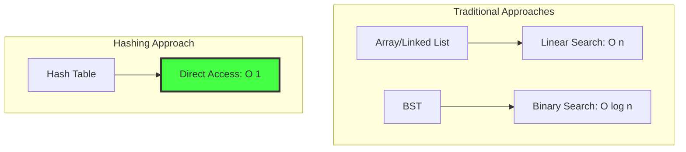

### 💡 التطور في التفكير

#### 1️⃣ **Direct Address Table** (الحل البدائي)

> [!info] الفكرة استخدام المفتاح مباشرة كـ index في المصفوفة.

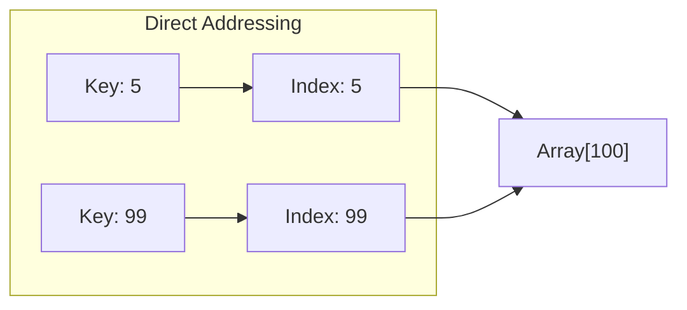

**المشكلة الكارثية:**

- لو الأرقام من 10 خانات (0 إلى 9,999,999,999)
- نحتاج مصفوفة حجمها **10 مليار** عنصر! 💥
- هدر رهيب للذاكرة لتخزين 1000 عنصر فقط

#### 2️⃣ **Hashing** (الحل العبقري)

> [!success] الحل الذكي **"ضغط"** المجال الواسع (مليار رقم) إلى مجال صغير (100 خانة) باستخدام معادلة رياضية.

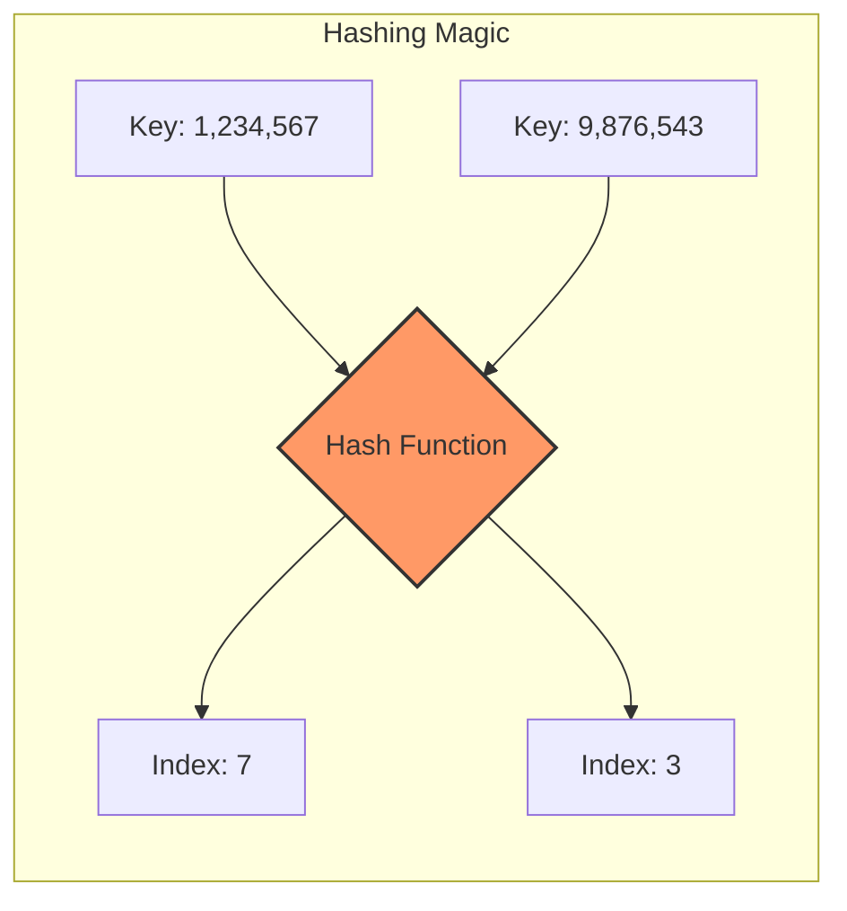

---

## المكونات الأساسية للـ Hash Table

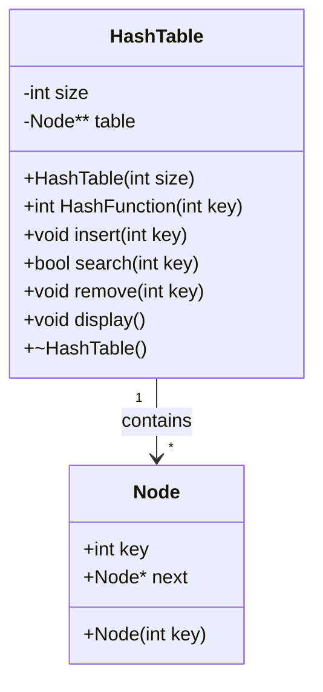

### 🧩 العناصر الأربعة

1. **Key (المفتاح):** البيانات الأصلية
2. **Hash Function (دالة التحويل):** المعادلة الرياضية
3. **Table (المصفوفة):** مصفوفة من المؤشرات
4. **Collision Handling (معالجة التصادم):** آلية حل التعارضات

---

## الـ Hash Function - القلب النابض

> [!tip] المعادلة الذهبية $$\text{index} = \text{key} \bmod \text{size}$$

### 🎲 لماذا Modulo (%)؟

باقي القسمة يضمن أن الناتج **دائماً** داخل حدود المصفوفة:

- `key % 10` → النتيجة من 0 إلى 9 ✅
- `key % 100` → النتيجة من 0 إلى 99 ✅

### 📊 أمثلة حسابية

```mermaid
graph TD
    subgraph "Hash Function Examples size=10"
    K1[Key: 15] --> C1["15 % 10 = 5"] --> I1[Index: 5]
    K2[Key: 7] --> C2["7 % 10 = 7"] --> I2[Index: 7]
    K3[Key: 25] --> C3["25 % 10 = 5"] --> I3[Index: 5 ⚠️ Collision!]
    K4[Key: 103] --> C4["103 % 10 = 3"] --> I4[Index: 3]
    end
    
    style I3 fill:#f66,stroke:#333,stroke-width:3px
```

### 🧪 كود التجربة

```cpp
int tableSize = 10;
int myData[] = {15, 22, 35, 42, 103};

for(int i = 0; i < 5; i++) {
    int index = myData[i] % tableSize; 
    cout << "Value: " << myData[i] 
         << " → Index: " << index << endl;
}
```

**Output:**

```
Value: 15  → Index: 5
Value: 22  → Index: 2
Value: 35  → Index: 5  ⚠️ Collision with 15
Value: 42  → Index: 2  ⚠️ Collision with 22
Value: 103 → Index: 3
```

---

## كارثة الـ Collision وحلولها

> [!danger] التصادم (Collision) عندما تُنتج دالة الـ Hash نفس الـ index لمفتاحين مختلفين.

### 🔥 أسباب التصادم

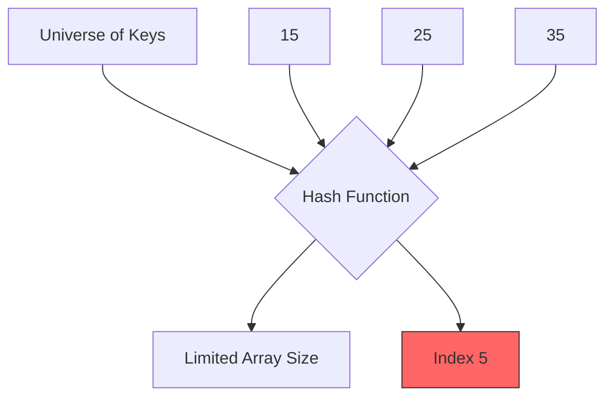

**مبدأ Pigeonhole Principle:**

- لو عندك 1000 مفتاح محتمل
- وعندك 10 خانات فقط
- **حتماً** سيحدث تصادم!

### ✅ الحل: Separate Chaining

> [!success] الفكرة الذهبية كل خانة في المصفوفة **لا تحمل قيمة**، بل تحمل **مؤشر** لـ Linked List.

```mermaid
graph TD
    subgraph "Hash Table with Chaining"
    T0["table[0]"] --> L0["15 → 25 → 35 → NULL"]
    T1["table[1]"] --> NULL1[NULL]
    T2["table[2]"] --> L2["22 → 42 → NULL"]
    T3["table[3]"] --> L3["103 → NULL"]
    T4["table[4]"] --> NULL4[NULL]
    end
    
    style L0 fill:#4f4,stroke:#333
    style L2 fill:#4f4,stroke:#333
```

### 🆚 مقارنة مع Open Addressing

|**Aspect**|**Separate Chaining**|**Open Addressing**|
|---|---|---|
|**المساحة**|تستخدم ذاكرة إضافية للـ pointers|كل شيء داخل المصفوفة|
|**التعامل مع الامتلاء**|يمكن إضافة عدد غير محدود|تتوقف عند امتلاء الجدول|
|**التعقيد**|أبسط في التنفيذ|أكثر تعقيداً|
|**الأداء**|ثابت حتى مع كثرة البيانات|يتدهور مع الامتلاء|

---

## تطبيق عملي - بناء Hash Table من الصفر

### 🏗️ هيكل الـ Node

```cpp
class Node {
public:
    int key;      // البيانات
    Node *next;   // المؤشر للتالي
    
    Node(int key) {
        this->key = key;
        this->next = NULL;
    }
};
```

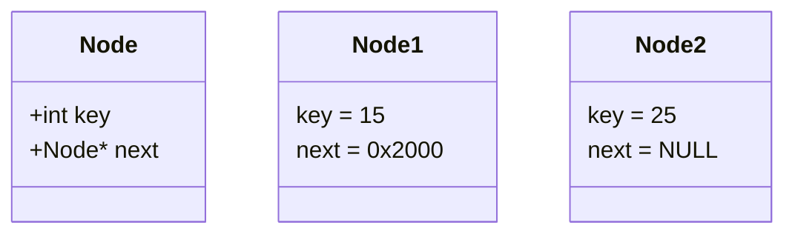

### 🏗️ هيكل الـ HashTable

```cpp
class HashTable {
    int size;        // عدد الخانات
    Node **table;    // مصفوفة من المؤشرات
    
public:
    HashTable(int size);
    int HashFunction(int key);
    void insert(int key);
    bool search(int key);
    void remove(int key);
    void display();
    ~HashTable();
};
```

```mermaid
graph LR
    subgraph "Memory Layout"
    HT[HashTable Object] --> Size[size: 10]
    HT --> Table[table: 0x1000]
    
    Table --> Array["Node* array[10]"]
    Array --> P0["[0]: 0x2000"]
    Array --> P1["[1]: NULL"]
    Array --> P2["[2]: 0x3000"]
    
    P0 --> Chain1["15 → 25 → NULL"]
    P2 --> Chain2["22 → 42 → NULL"]
    end
```

---

## الـ Constructor - تجهيز الذاكرة

### 🎯 الهدف

1. حجز مصفوفة من الـ pointers في الـ Heap
2. تصفير كل العناصر لتجنب Wild Pointers

### 🧩 الكود

```cpp
HashTable(int size) {
    this->size = size;
    
    // حجز مصفوفة من المؤشرات
    table = new Node*[size];
    
    // تصفير كل المؤشرات
    for (int i = 0; i < size; i++) {
        table[i] = NULL;
    }
}
```

### 📊 تتبع التنفيذ

```mermaid
sequenceDiagram
    participant Code
    participant Heap
    participant Table
    
    Code->>Heap: new Node*[5]
    Heap-->>Code: Address: 0x1000
    
    Code->>Table: table[0] = NULL
    Code->>Table: table[1] = NULL
    Code->>Table: table[2] = NULL
    Code->>Table: table[3] = NULL
    Code->>Table: table[4] = NULL
    
    Note over Table: جميع المؤشرات = NULL<br/>تجنب Garbage Values
```

### 🔍 الحالة بعد Constructor

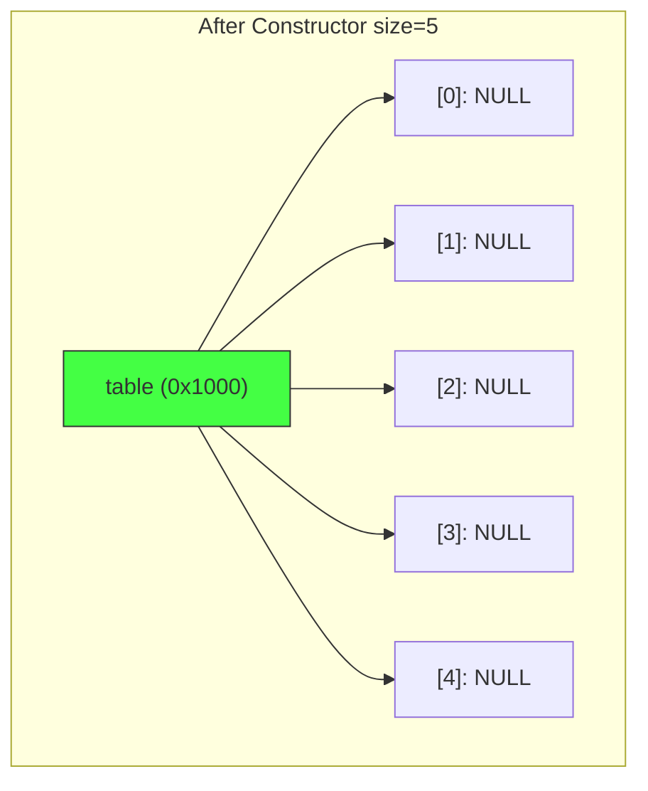

> [!warning] لماذا التصفير مهم؟ بدون `table[i] = NULL`، المؤشرات ستحتوي على قيم عشوائية (garbage) قد تشير لمناطق غير صالحة في الذاكرة، مما يسبب **Segmentation Fault**.

---

## دالة الـ Insert - إضافة العناصر

### 🎯 الهدف

إضافة node جديدة في **بداية** السلسلة (Head Insertion) لتحقيق O(1).

### 🧩 الكود الكامل

```cpp
void insert(int key) {
    // 1. إنشاء node جديدة
    Node *newNode = new Node(key);
    
    // 2. حساب الـ index
    int index = HashFunction(key);
    
    // 3. ربط الـ node بالسلسلة الحالية
    newNode->next = table[index];
    
    // 4. تحديث بداية السلسلة
    table[index] = newNode;
}
```

### 📊 تتبع تفصيلي - إضافة 20 عند index=0

#### الحالة الأولية

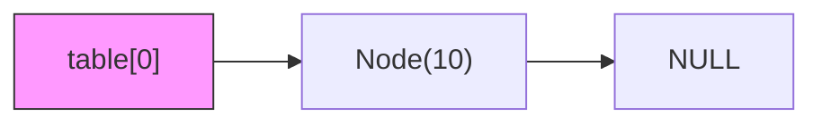

#### الخطوة 1: إنشاء Node جديدة

```cpp
Node *newNode = new Node(20);
```

```mermaid
graph TD
    subgraph "Existing Chain"
    T0["table[0]"] --> N10["Node(10)"]
    N10 --> NULL1[NULL]
    end
    
    subgraph "New Node في الذاكرة"
    NewN["newNode"] --> N20["Node(20)"]
    N20 --> NULL2[NULL]
    end
    
    style N20 fill:#f96,stroke:#333,stroke-width:3px
```

#### الخطوة 2: حساب Index

```cpp
int index = HashFunction(20);  // 20 % 10 = 0
```

#### الخطوة 3: التوصيل الآمن (CRITICAL!)

```cpp
newNode->next = table[index];
```

> [!danger] تحذير خطير **لو عكست ترتيب الخطوتين 3 و 4، ستفقد السلسلة القديمة للأبد!**

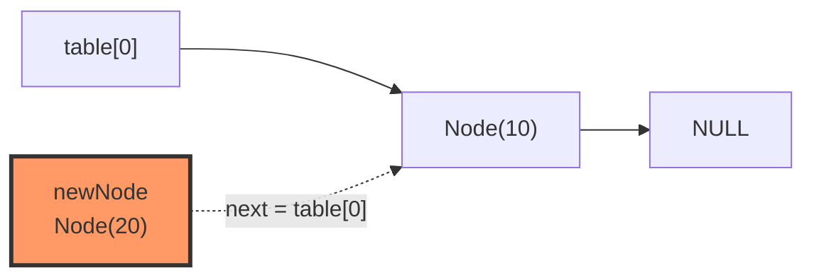

#### الخطوة 4: تحديث Head

```cpp
table[index] = newNode;
```

```mermaid
graph LR
    T0["table[0]"] -.->|"الآن يشير هنا"| NewN["Node(20)"]
    NewN --> N10["Node(10)"]
    N10 --> NULL1[NULL]
    
    style NewN fill:#4f4,stroke:#333,stroke-width:3px
```

### 🎬 Animation كاملة - إضافة 3 عناصر

```mermaid
%%{init: {'theme':'base'}}%%
sequenceDiagram
    participant User
    participant HT as HashTable
    participant Index0 as table[0]
    
    Note over User,Index0: Initial State: Empty
    
    User->>HT: insert(10)
    HT->>Index0: 10 % 10 = 0
    Index0->>Index0: 10 → NULL
    
    User->>HT: insert(20)
    HT->>Index0: 20 % 10 = 0
    Index0->>Index0: 20 → 10 → NULL
    
    User->>HT: insert(30)
    HT->>Index0: 30 % 10 = 0
    Index0->>Index0: 30 → 20 → 10 → NULL
    
    Note over Index0: Final Chain at index 0
```

### ⚡ لماذا O(1)؟

```mermaid
graph TD
    A[Insert Operation] --> B{العمليات}
    B --> C[Create Node: O 1]
    B --> D[Hash Function: O 1]
    B --> E[Link at Head: O 1]
    
    E --> F[Total: O 1]
    
    style F fill:#4f4,stroke:#333,stroke-width:3px
```

> [!success] الميزة الذهبية بغض النظر عن طول السلسلة، الإضافة **دائماً** في البداية = **خطوة واحدة**!

---

## دالة الـ Search - البحث عن العناصر

### 🎯 الهدف

التحقق من وجود مفتاح معين في الجدول بأسرع طريقة.

### 🧩 الكود

```cpp
bool search(int key) {
    // 1. حساب الموقع المتوقع
    int index = HashFunction(key);
    
    // 2. بدء المؤشر من أول السلسلة
    Node *curr = table[index];
    
    // 3. التنقل في السلسلة
    while (curr != NULL) {
        if (curr->key == key) {
            return true;  // وجدناه! ✅
        }
        curr = curr->next;
    }
    
    return false;  // غير موجود ❌
}
```

### 📊 تتبع تفصيلي - البحث عن 5

**الحالة:**

```
table[5]: 15 → 5 → 25 → NULL
```

#### Frame 1: الحساب والقفز

```mermaid
graph TD
    K[Key: 5] --> HF{HashFunction}
    HF -->|"5 % 10 = 5"| Idx[Index: 5]
    
    Idx --> T5["table[5]"]
    T5 --> Chain["15 → 5 → 25 → NULL"]
    
    style Idx fill:#f96,stroke:#333
```

#### Frame 2: البحث - المحاولة الأولى

```mermaid
graph LR
    T5["table[5]"] --> N15["15<br/>❌ Not Match"]
    N15 --> N5["5"]
    N5 --> N25["25"]
    N25 --> NULL1[NULL]
    
    Curr["curr"] -.->|"Checking..."| N15
    
    style N15 fill:#f66,stroke:#333
```

```
curr->key = 15
15 != 5  ❌
curr = curr->next
```

#### Frame 3: البحث - المحاولة الثانية

```mermaid
graph LR
    T5["table[5]"] --> N15["15"]
    N15 --> N5["5<br/>✅ MATCH!"]
    N5 --> N25["25"]
    N25 --> NULL1[NULL]
    
    Curr["curr"] -.->|"Found it!"| N5
    
    style N5 fill:#4f4,stroke:#333,stroke-width:4px
```

```
curr->key = 5
5 == 5  ✅
return true
```

### 🎬 Flowchart كامل للبحث

```mermaid
flowchart TD
    Start([search key]) --> Hash[Calculate index]
    Hash --> Init[curr = table index]
    Init --> Check{curr != NULL?}
    
    Check -->|No| NotFound[return false]
    Check -->|Yes| Compare{curr->key == key?}
    
    Compare -->|Yes| Found[return true]
    Compare -->|No| Next[curr = curr->next]
    Next --> Check
    
    style Found fill:#4f4,stroke:#333
    style NotFound fill:#f66,stroke:#333
```

### 🔬 حالة الفشل - البحث عن 99

```mermaid
sequenceDiagram
    participant Func as search 99
    participant HF as HashFunction
    participant Table as table[9]
    participant Chain as Linked List
    
    Func->>HF: 99 % 10 = 9
    HF-->>Func: index = 9
    
    Func->>Table: curr = table[9]
    Table-->>Func: curr = NULL
    
    Note over Func: curr == NULL<br/>Exit while loop
    
    Func-->>Func: return false
```

### ⚡ تحليل الأداء

|**Scenario**|**Time Complexity**|**Explanation**|
|---|---|---|
|Best Case|O(1)|العنصر في بداية السلسلة|
|Average Case|O(1 + α)|α = عدد العناصر / حجم الجدول|
|Worst Case|O(n)|كل العناصر في نفس الخانة|

> [!tip] Load Factor (α) $$\alpha = \frac{\text{Total Elements}}{\text{Table Size}}$$
> 
> للحفاظ على O(1)، يُفضل أن يكون α < 0.75

---

## دالة الـ Remove - حذف العناصر

### 🎯 التحدي الأكبر

الحذف يتطلب:

1. إيجاد الـ node
2. **قطع** الاتصال بشكل آمن
3. تحرير الذاكرة

> [!danger] الخطر الأكبر لو قطعت الاتصال بطريقة خاطئة، ستفقد باقي السلسلة!

### 🧩 الكود الكامل

```cpp
void remove(int key) {
    int index = HashFunction(key);
    Node *curr = table[index];  // المحقق الرئيسي
    Node *prev = NULL;          // المساعد (يحفظ السابق)
    
    while (curr != NULL) {
        if (curr->key == key) {
            // ✅ وجدنا الهدف!
            
            // Case 1: الهدف في البداية
            if (prev == NULL) {
                table[index] = curr->next;
            }
            // Case 2: الهدف في الوسط/النهاية
            else {
                prev->next = curr->next;  // الجسر
            }
            
            delete curr;  // تحرير الذاكرة
            return;
        }
        
        // التقدم للأمام
        prev = curr;
        curr = curr->next;
    }
}
```

### 📊 Case 1: حذف العنصر الأول (Head)

**الحالة الأولية:**

```
table[0]: 15 → 5 → 20 → NULL
Target: 15
```

#### Frame 1: الإعداد

```mermaid
graph LR
    T0["table[0]"] --> N15["15<br/>⚠️ Target"]
    N15 --> N5["5"]
    N5 --> N20["20"]
    N20 --> NULL1[NULL]
    
    Prev["prev"] --> NullBox[NULL]
    Curr["curr"] --> N15
    
    style N15 fill:#f96,stroke:#333,stroke-width:3px
```

```
prev = NULL  (لأننا في البداية)
curr->key = 15  ✅ Match!
```

#### Frame 2: التنفيذ

```cpp
if (prev == NULL) {
    table[index] = curr->next;
}
```

```mermaid
graph LR
    T0["table[0]"] -.->|"تحديث المؤشر"| N5["5"]
    N5 --> N20["20"]
    N20 --> NULL1[NULL]
    
    N15["15<br/>🗑️ سيُحذف"] -.-x N5
    
    style N15 fill:#ddd,stroke:#f00,stroke-dasharray: 5 5
```

#### Frame 3: النتيجة النهائية

```mermaid
graph LR
    T0["table[0]"] --> N5["5"]
    N5 --> N20["20"]
    N20 --> NULL1[NULL]
    
    style T0 fill:#4f4,stroke:#333
```

### 📊 Case 2: حذف عنصر من الوسط

**الحالة الأولية:**

```
table[0]: 15 → 5 → 20 → 25 → NULL
Target: 20
```

#### Frame 1: البحث - المحاولة الأولى

```mermaid
graph LR
    T0["table[0]"] --> N15["15"]
    N15 --> N5["5"]
    N5 --> N20["20"]
    N20 --> N25["25"]
    
    Prev["prev"] --> NullBox[NULL]
    Curr["curr"] --> N15
    
    Note1["curr->key = 15<br/>15 != 20 ❌"]
```

```
prev = NULL
curr = 15  ❌
التقدم: prev = curr, curr = curr->next
```

#### Frame 2: البحث - المحاولة الثانية

```mermaid
graph LR
    T0["table[0]"] --> N15["15"]
    N15 --> N5["5"]
    N5 --> N20["20"]
    N20 --> N25["25"]
    
    Prev["prev"] --> N15
    Curr["curr"] --> N5
```

```
prev = 15
curr = 5  ❌
التقدم: prev = curr, curr = curr->next
```

#### Frame 3: البحث - المحاولة الثالثة (Success!)

```mermaid
graph LR
    T0["table[0]"] --> N15["15"]
    N15 --> N5["5"]
    N5 --> N20["20<br/>✅ Target!"]
    N20 --> N25["25"]
    
    Prev["prev"] --> N5
    Curr["curr"] --> N20
    
    style N20 fill:#f96,stroke:#333,stroke-width:3px
```

```
prev = 5
curr = 20  ✅ Match!
```

#### Frame 4: الجراحة - بناء الجسر

```cpp
prev->next = curr->next;
```

> [!info] الجسر (The Bypass) نجعل الـ node السابقة (5) تشير مباشرة للـ node التالية (25)، متجاوزة الـ node المستهدفة (20).

```mermaid
graph LR
    T0["table[0]"] --> N15["15"]
    N15 --> N5["5<br/>(prev)"]
    N5 -.->|"The Bypass Bridge"| N25["25"]
    
    N20["20<br/>🗑️ Isolated"] -.-x N25
    
    style N20 fill:#ddd,stroke:#f00,stroke-dasharray: 5 5
    style N5 fill:#4f4,stroke:#333
```

#### Frame 5: التنظيف

```cpp
delete curr;
```

```mermaid
graph LR
    T0["table[0]"] --> N15["15"]
    N15 --> N5["5"]
    N5 --> N25["25"]
    N25 --> NULL1[NULL]
    
    style T0 fill:#4f4,stroke:#333
```

### 🎬 المقارنة بين الحال