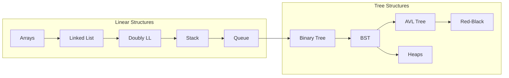

# 📦 Data Structures

> **هياكل البيانات هي "الأوعية" اللي بتخزن فيها الداتا. اختيار الوعاء الصح نص المعركة.**

---

## 📊 Operations Complexity Comparison

### Linear Structures

| Structure                           | Access | Search | Insert (Front) | Insert (End) | Delete |
| ----------------------------------- | ------ | ------ | -------------- | ------------ | ------ |
| [[2-Arrays\|Array]]                 | O(1) ⚡ | O(n)   | O(n)           | O(1)         | O(n)   |
| [[3-Linked List\|Linked List]]      | O(n)   | O(n)   | O(1) ⚡         | O(n)         | O(1)   |
| [[4-Doubly Linked List\|Doubly LL]] | O(n)   | O(n)   | O(1) ⚡         | O(1) ⚡       | O(1) ⚡ |
| [[6-Stack\|Stack]]                  | O(n)   | O(n)   | O(1) ⚡         | -            | O(1) ⚡ |
| [[7-Queue\|Queue]]                  | O(n)   | O(n)   | -              | O(1) ⚡       | O(1) ⚡ |

*With dynamic array (amortized)  
**With pointer to node

### Tree Structures

| Structure | Search | Insert | Delete | Space |
|-----------|--------|--------|--------|-------|
| [[11-Binary Tree\|Binary Tree]] | O(n) | O(n) | O(n) | O(n) |
| [[12-Binary Search Tree (BST)\|BST]] | O(h) | O(h) | O(h) | O(n) |
| [[13-AVL Tree\|AVL Tree]] | O(log n) ⚡ | O(log n) | O(log n) | O(n) |
| [[14-Red-Black Tree\|Red-Black]] | O(log n) ⚡ | O(log n) | O(log n) | O(n) |
| [[15-Heaps\|Heap]] | O(n) | O(log n) | O(log n) | O(n) |

*h = height of tree (can be n in worst case for BST)

---

## 🗂️ Topics by Category

### 📚 Fundamentals
- [[1-Introduction to Data Strucres|Introduction to Data Structures]]

### 📏 Linear Structures

#### Contiguous Memory
- [[2-Arrays|Arrays]] - Random access, fixed size

#### Linked Structures
- [[3-Linked List|Singly Linked List]] - Dynamic, sequential access
- [[4-Doubly Linked List|Doubly Linked List]] - Bidirectional traversal
- [[5-Circular Linked Lists|Circular Linked List]] - No end, round-robin

#### Abstract Data Types (ADTs)
- [[6-Stack|Stack]] - LIFO (Last In, First Out)
- [[7-Queue|Queue]] - FIFO (First In, First Out)
- [[8-Circular Queue|Circular Queue]] - Efficient memory use
- [[9-Double-Ended Queue|Deque]] - Insert/delete both ends

### 🌳 Non-Linear Structures

#### Tree Basics
- [[10-Introduction to trees|Introduction to Trees]]
- [[11-Binary Tree|Binary Tree]]
- [[12-Binary Search Tree (BST)|Binary Search Tree]]

#### Self-Balancing Trees
- [[13-AVL Tree|AVL Tree]] - Height-balanced
- [[14-Red-Black Tree|Red-Black Tree]] - Color-balanced

#### Specialized Trees
- [[15-Heaps|Heaps]] - Priority Queue implementation

---

## 🛤️ Learning Path

---

## 🎯 When to Use What?

| Scenario | Best Choice | Why |
|----------|-------------|-----|
| Fast random access needed | **Array** | O(1) access by index |
| Frequent insertions at front | **Linked List** | O(1) insert |
| Undo/Redo functionality | **Stack** | LIFO pattern |
| Task scheduling | **Queue** | FIFO pattern |
| Ordered data with fast search | **BST/AVL** | O(log n) search |
| Priority-based processing | **Heap** | O(1) max/min access |
| Database indexing | **B-Tree** | Disk-optimized |

---

## 🔗 Related
- [[Algorthims/_Algorithms MOC|Algorithms MOC]]
- [[problem solving/problem solving road map|Problem Solving Roadmap]]
