# HashMap / Dictionary - الدليل الشامل 📖

> [!abstract] نظرة عامة **HashMap** (أو **Dictionary**) هو تطور للـ Hash Table التقليدي. بدلاً من تخزين قيم منفردة، يخزن **أزواج من المفاتيح والقيم** (Key-Value Pairs)، مما يجعله مثالياً لتطبيقات القواميس وقواعد البيانات.

---

## 📑 جدول المحتويات

- [[#الفلسفة والتحول - من الأرقام للمعاني]]
- [[#المشكلة الجوهرية - String to Number]]
- [[#البنية الجديدة - Node بجيبين]]
- [[#الـ Hash Function الاحترافية]]
- [[#دالة الـ put - الإضافة الذكية]]
- [[#دالة الـ get - استرجاع القيم]]
- [[#دالة الـ remove - الحذف الجراحي]]
- [[#المقارنة الشاملة - Hash Table vs HashMap]]
- [[#حالات الاستخدام العملية]]

---

## الفلسفة والتحول - من الأرقام للمعاني

### 🎯 لماذا HashMap هو "ملك" الـ Data Structures؟

> [!question] السؤال الأساسي كيف نربط **معلومة بمعلومة أخرى** بدلاً من مجرد تخزين أرقام؟

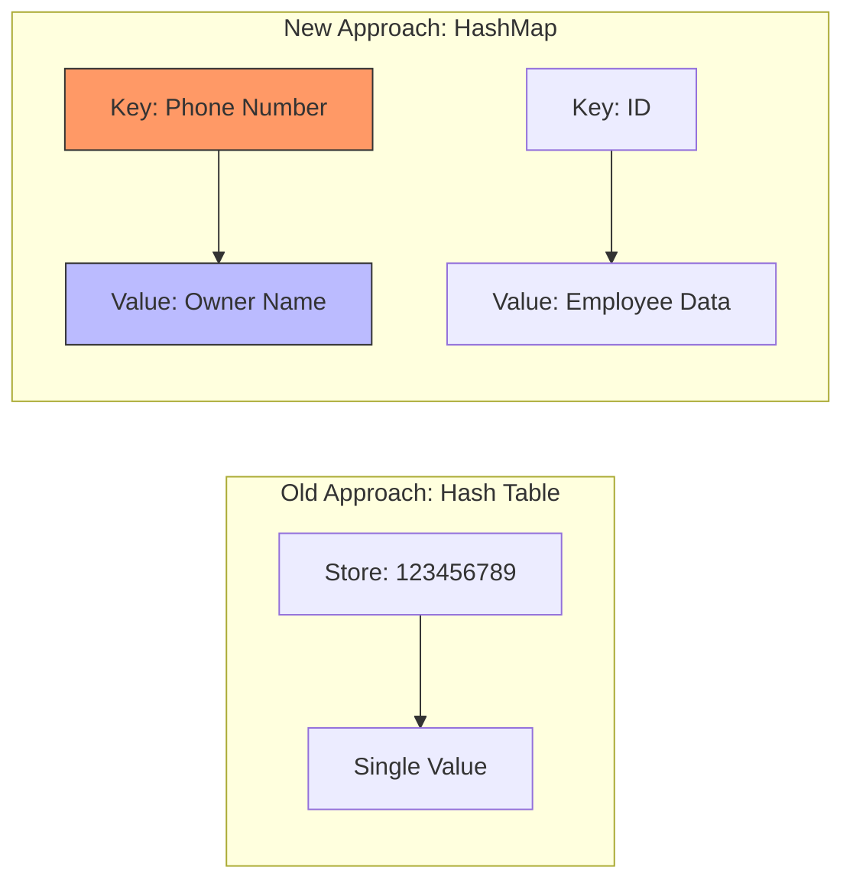

### 🌍 أمثلة من الحياة الواقعية

|**المجال**|**المفتاح (Key)**|**القيمة (Value)**|
|---|---|---|
|**الاتصالات**|رقم التليفون|اسم المالك|
|**الجامعة**|Student ID|بيانات الطالب|
|**التجارة الإلكترونية**|Product Code|معلومات المنتج|
|**الشبكات**|IP Address|اسم الجهاز|

### 🔄 التطور من Hash Table إلى HashMap

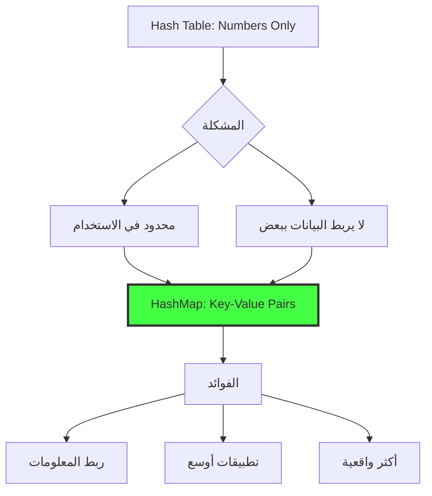

---

## المشكلة الجوهرية - String to Number

### 🧩 التحدي الأساسي

> [!danger] المعضلة المصفوفات (Arrays) تفهم **الأرقام فقط** كـ indices. كيف نحول **"Egypt"** إلى رقم يمثلها؟

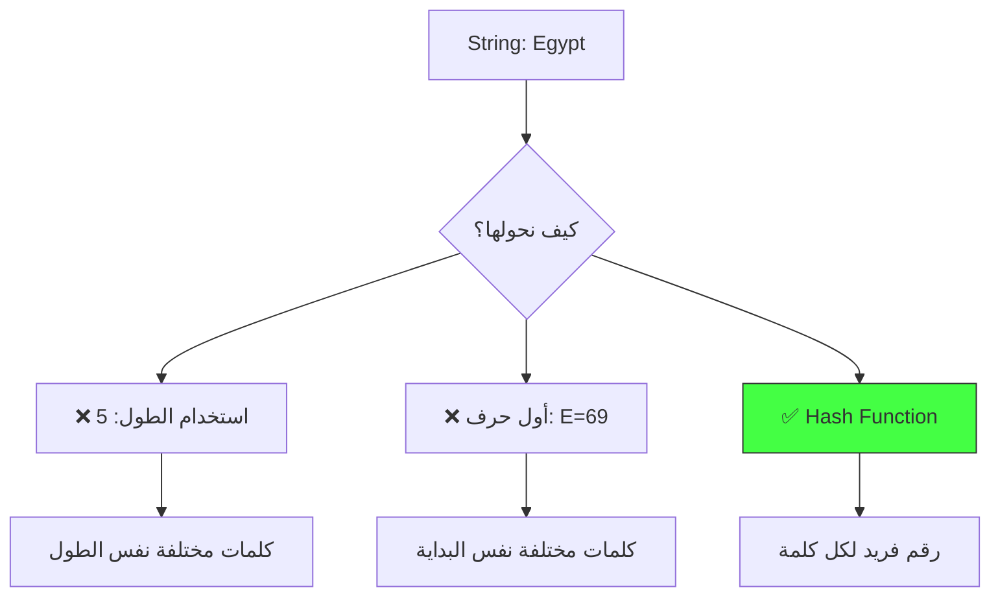

### 🔬 التجربة البسيطة - Simple Hash

```cpp
int simpleHash(string key, int size) {
    int hash = 0;
    for (char ch : key) {
        hash += ch;  // جمع قيم ASCII
    }
    return hash % size;
}
```

#### مثال تطبيقي

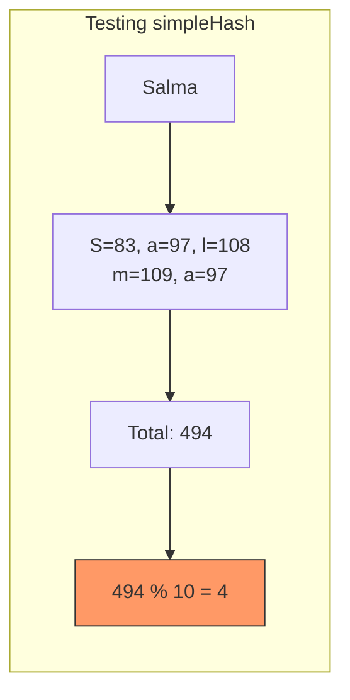

**Output:**

```
The word 'Salma' will be stored at Index: 4
```

### ⚠️ المشكلة الكارثية

> [!bug] Anagram Problem الكلمات التي تحتوي نفس الحروف بترتيب مختلف تُعطي نفس الـ hash!

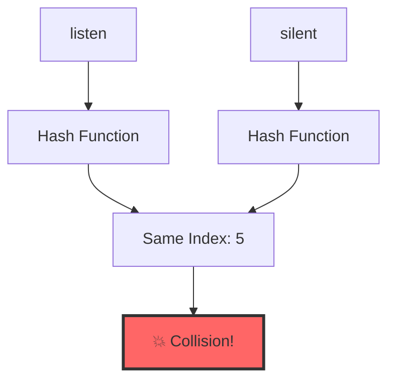

**مثال:**

- `"listen"` = 108+105+115+116+101+110 = **655**
- `"silent"` = 115+105+108+101+110+116 = **655** ⚠️

---

## البنية الجديدة - Node بجيبين

### 🏗️ التصميم المحدث

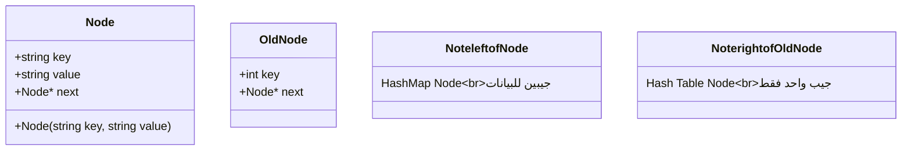

### 🧩 الكود

```cpp
class Node {
public:
    string key;      // المفتاح - للبحث
    string value;    // القيمة - الهدف
    Node *next;      // المؤشر التالي
    
    Node(string key, string value) {
        this->key = key;
        this->value = value;
        this->next = NULL;
    }
};
```

### 📊 التمثيل في الذاكرة

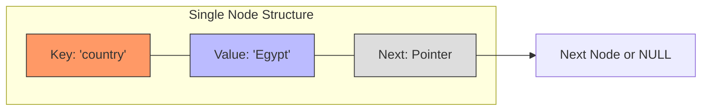

### 🔄 مقارنة مع الـ Node القديمة

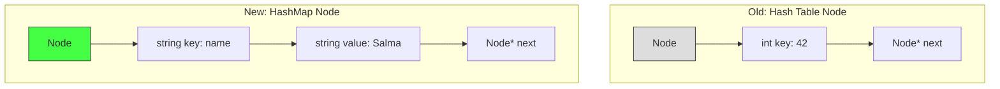

---

## الـ Hash Function الاحترافية

### 🎲 Polynomial Rolling Hash

> [!tip] المعادلة الذهبية $$\text{hash} = \sum_{i=0}^{n-1} (\text{ch}_i \times 31^{n-1-i})$$

### 🧩 الكود

```cpp
int HashFunction(string key) {
    int hash = 0;
    for (char ch : key) {
        hash = hash * 31 + ch;
    }
    return abs(hash) % size;
}
```

### 🔍 تحليل عميق - لماذا 31؟

> [!info] الأسباب الثلاثة
> 
> 1. **رقم أولي (Prime):** يحسن التوزيع ويقلل التصادمات
> 2. **تحسين CPU:** `31 * x = (x << 5) - x` (bit shifting أسرع)
> 3. **تغطية واسعة:** يجعل كلمات مختلفة قليلاً تنتج أرقام متباعدة جداً

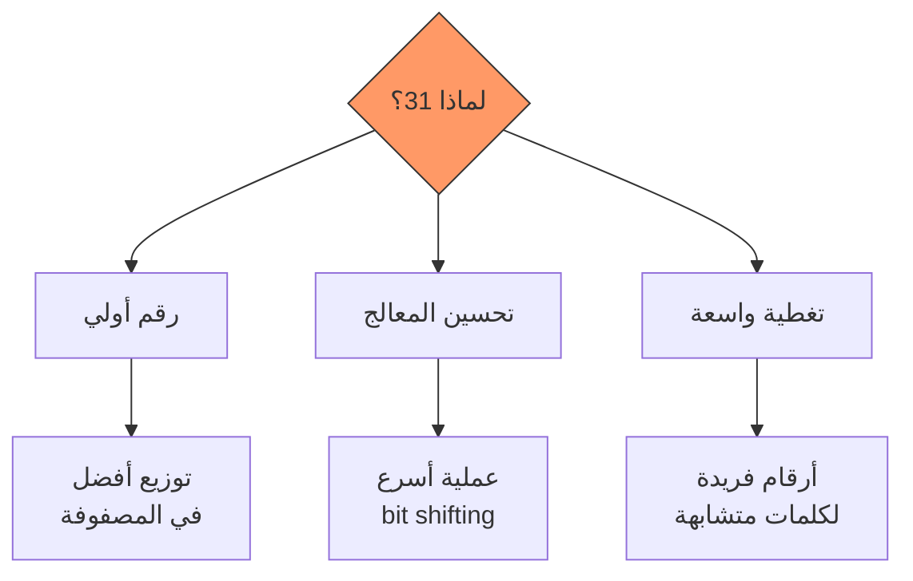

### 📊 مثال تفصيلي - hash("abc")

```mermaid
sequenceDiagram
    participant Loop
    participant Hash as hash variable
    participant Calc as Calculation
    
    Note over Hash: Initial: hash = 0
    
    Loop->>Hash: Process 'a' (ASCII=97)
    Hash->>Calc: 0 * 31 + 97 = 97
    Note over Hash: hash = 97
    
    Loop->>Hash: Process 'b' (ASCII=98)
    Hash->>Calc: 97 * 31 + 98 = 3105
    Note over Hash: hash = 3105
    
    Loop->>Hash: Process 'c' (ASCII=99)
    Hash->>Calc: 3105 * 31 + 99 = 96354
    Note over Hash: hash = 96354
    
    Note over Calc: Final: 96354 % size
```

**خطوة بخطوة:**

1. **حرف 'a':** `0 × 31 + 97 = 97`
2. **حرف 'b':** `97 × 31 + 98 = 3,105`
3. **حرف 'c':** `3,105 × 31 + 99 = 96,354`
4. **النتيجة:** `96,354 % 10 = 4`

### ⚠️ مشكلة الـ Overflow و abs()

> [!danger] Integer Overflow عند معالجة كلمات طويلة، قد يتجاوز الـ hash حد الـ `int` (≈2 billion) ويصبح سالباً!

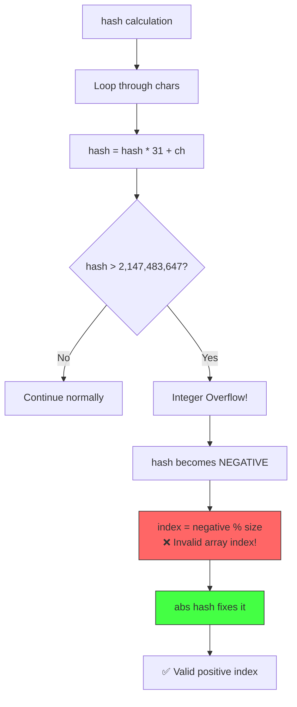

**مثال Overflow:**

```cpp
// قبل abs()
int hash = 2147483647;  // أقصى قيمة
hash = hash * 31 + 100; // Overflow!
// النتيجة: -2147483549 ❌

// بعد abs()
hash = abs(hash);       // 2147483549 ✅
int index = hash % 10;  // 9 ✅
```

### 🧪 تجربة عملية

```cpp
#include <iostream>
#include <cmath>

int main() {
    int bigNumber = 2147483647;
    bigNumber = bigNumber + 100;  // Overflow
    
    cout << "Before abs: " << bigNumber << endl;  // سالب
    cout << "After abs: " << abs(bigNumber) << endl;  // موجب
    
    return 0;
}
```

---

## دالة الـ put - الإضافة الذكية (Upsert)

### 🎯 ما هو Upsert؟

> [!tip] Upsert = Update + Insert
> 
> - إذا كان المفتاح **موجود** → **Update** القيمة
> - إذا كان المفتاح **جديد** → **Insert** node جديدة

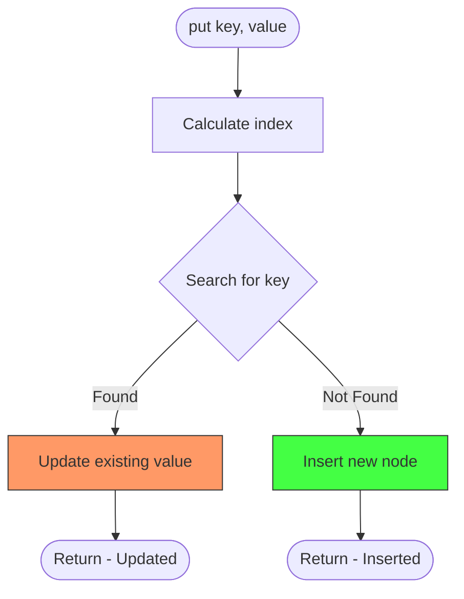

### 🧩 الكود الكامل

```cpp
void put(string key, string value) {
    // 1. حساب الموقع
    int index = HashFunction(key);
    Node* curr = table[index];
    
    // 2. البحث عن تحديث (Phase 1: Search & Update)
    while (curr != NULL) {
        if (curr->key == key) {
            curr->value = value;  // ✅ Update
            return;
        }
        curr = curr->next;
    }
    
    // 3. إضافة جديدة (Phase 2: Insert)
    Node* newNode = new Node(key, value);
    newNode->next = table[index];
    table[index] = newNode;
}
```

### 📊 السيناريو الأول - Update

**الحالة:** `put("name", "Salma")` ثم `put("name", "Salma Yasser")`

#### Frame 1: الحالة الأولية

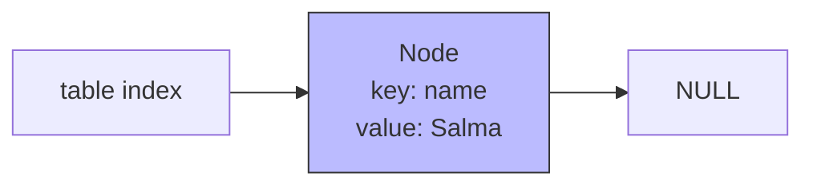

#### Frame 2: البحث والتحديث

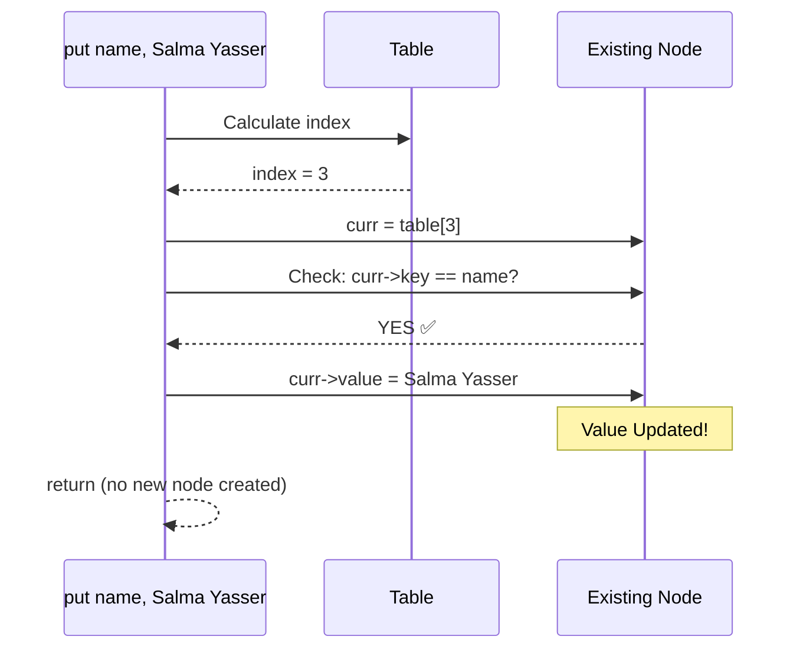

#### Frame 3: النتيجة

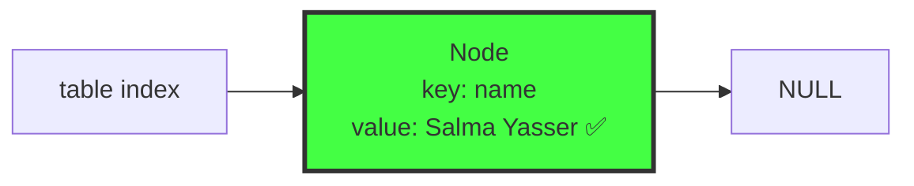

### 📊 السيناريو الثاني - Insert مع Collision

**الحالة:** `put("age", "21")` حيث `HashFunction("age") = same index as "country"`

#### Frame 1: الحالة الأولية

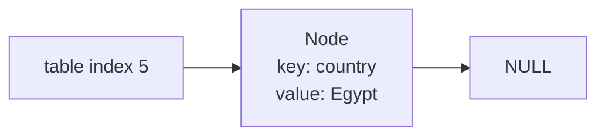

#### Frame 2: البحث (لا يوجد)

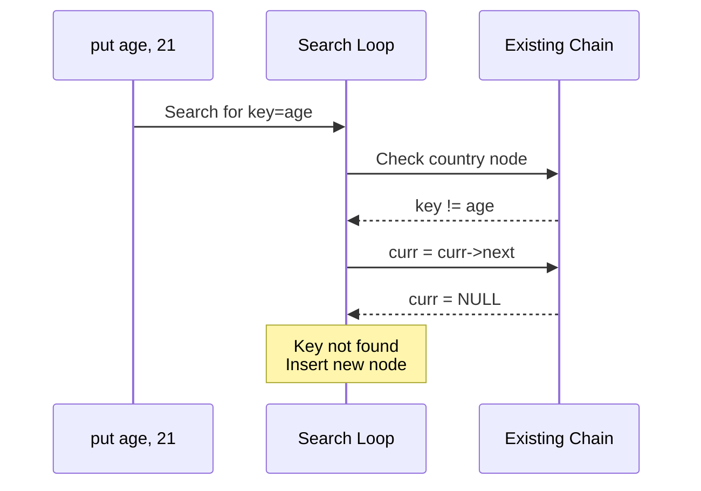

#### Frame 3: الإضافة

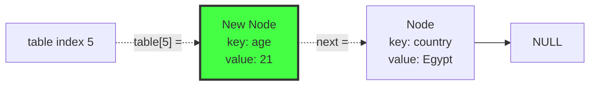

#### Frame 4: النتيجة النهائية

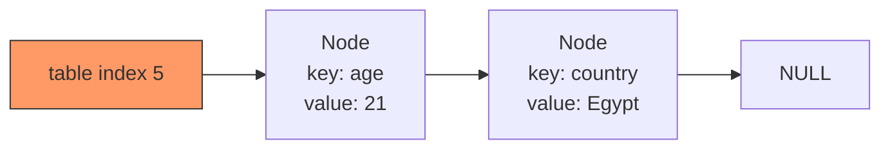

### 🎬 Animation كاملة - التتبع الكامل

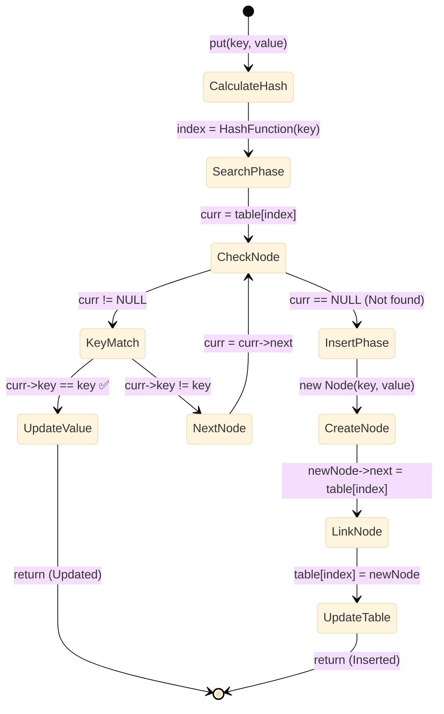

### ⚡ لماذا هذا الترتيب؟

> [!success] تحسين الذاكرة البحث **قبل** الإنشاء يوفر الذاكرة. لو أنشأنا الـ node أولاً ثم اكتشفنا أن المفتاح موجود، سنضطر لحذف الـ node الجديدة = **هدر**.

```mermaid
graph TD
    Approach1[❌ Wrong: Create then Check] --> Waste[Memory waste<br/>if key exists]
    Approach2[✅ Correct: Check then Create] --> Efficient[No waste<br/>create only if needed]
    
    style Approach2 fill:#4f4,stroke:#333
    style Approach1 fill:#f66,stroke:#333
```

---

## دالة الـ get - استرجاع القيم

### 🎯 التحدي

> [!question] المشكلة كيف نُرجع **قيمتين** من دالة واحدة؟
> 
> 1. **bool:** هل وجدنا المفتاح؟
> 2. **string:** ما هي القيمة؟

### 💡 الحل - Pass by Reference

```mermaid
graph LR
    User[User Code] -->|"Sends empty<br/>container"| Func{get function}
    Func -->|"Fills it if<br/>key found"| User
    Func -->|"Returns bool"| User
    
    style Func fill:#f96,stroke:#333
```

### 🧩 الكود

```cpp
bool get(string key, string& result) {
    int index = HashFunction(key);
    Node* curr = table[index];
    
    while (curr != NULL) {
        if (curr->key == key) {
            result = curr->value;  // ملء الحاوية
            return true;           // تأكيد الوجود
        }
        curr = curr->next;
    }
    
    return false;  // غير موجود
}
```

### 📊 تتبع التنفيذ - البحث عن "country"

**الحالة:**

```
table[7]: (name, Salma) → (country, Egypt) → NULL
```

#### Frame 1: الإعداد

```mermaid
graph TD
    User["User Code:<br/>string value;<br/>dict.get(country, value)"]
    
    User -->|"Passes reference"| GetFunc[get function]
    GetFunc -->|"Calculates"| Hash["HashFunction(country)<br/>= 7"]
    
    style GetFunc fill:#f96,stroke:#333
```

#### Frame 2: البحث - المحاولة الأولى

```mermaid
graph LR
    T[table 7] --> N1["Node<br/>key: name<br/>❌ Not Match"]
    N1 --> N2["Node<br/>key: country"]
    N2 --> NULL1[NULL]
    
    Curr[curr pointer] -.->|"Checking..."| N1
    
    style N1 fill:#f66,stroke:#333
```

```
curr->key = "name"
"name" != "country"  ❌
curr = curr->next
```

#### Frame 3: البحث - المحاولة الثانية (Success!)

```mermaid
graph LR
    T[table 7] --> N1["Node<br/>key: name"]
    N1 --> N2["Node<br/>key: country<br/>value: Egypt<br/>✅ MATCH!"]
    N2 --> NULL1[NULL]
    
    Curr[curr pointer] -.->|"Found it!"| N2
    Result[result variable] <-.->|"Copy value"| N2
    
    style N2 fill:#4f4,stroke:#333,stroke-width:4px
```

```
curr->key = "country"
"country" == "country"  ✅
result = "Egypt"
return true
```

#### Frame 4: العودة للمستخدم

```mermaid
sequenceDiagram
    participant User
    participant GetFunc as get country, result
    participant Node as Matching Node
    
    User->>GetFunc: Call get("country", value)
    GetFunc->>Node: Find node with key=country
    Node-->>GetFunc: Found! value=Egypt
    GetFunc->>GetFunc: result = Egypt
    GetFunc-->>User: return true
    
    Note over User: value now contains Egypt ✅
```

### 🎬 الاستخدام في main

```cpp
string value;
if (dict.get("name", value)) {
    cout << "name = " << value << endl;  // ✅ Salma Yasser
} else {
    cout << "name not found\n";
}
```

### 🔄 حالة الفشل

```mermaid
flowchart TD
    Start([get unknown_key, result]) --> Hash[Calculate index]
    Hash --> Init[curr = table index]
    Init --> Check{curr != NULL?}
    
    Check -->|Yes| Compare{curr->key == key?}
    Compare -->|No| Next[curr = curr->next]
    Next --> Check
    
    Compare -->|Yes| Found[result = curr->value<br/>return true]
    Check -->|No| NotFound[return false<br/>❌ result unchanged]
    
    style Found fill:#4f4,stroke:#333
    style NotFound fill:#f66,stroke:#333
```

---

## دالة الـ remove - الحذف الجراحي

### 🎯 التحدي

حذف node بناءً على **string key** بدلاً من **int**.

### 🧩 الكود

```cpp
void remove(string key) {
    int index = HashFunction(key);
    Node* curr = table[index];
    Node* prev = NULL;
    
    while (curr != NULL) {
        if (curr->key == key) {
            // Case 1: Head node
            if (prev == NULL) {
                table[index] = curr->next;
            }
            // Case 2: Middle/End node
            else {
                prev->next = curr->next;
            }
            
            delete curr;
            return;
        }
        
        prev = curr;
        curr = curr->next;
    }
}
```

### 📊 تتبع التنفيذ - حذف "age"

**الحالة:**

```
table[3]: (name, Salma) → (age, 21) → (country, Egypt) → NULL
Target: age
```

#### Frame 1: البحث

```mermaid
graph LR
    T[table 3] --> N1["name<br/>Salma"]
    N1 --> N2["age<br/>21<br/>⚠️ Target"]
    N2 --> N3["country<br/>Egypt"]
    N3 --> NULL1[NULL]
    
    Prev[prev] --> N1
    Curr[curr] --> N2
    
    style N2 fill:#f96,stroke:#333,stroke-width:3px
```

**الحالة:**

- `prev` يشير إلى `name`
- `curr` يشير إلى `age` ✅

#### Frame 2: الجراحة (Bypass)

```cpp
else {
    prev->next = curr->next;  // الجسر
}
```

```mermaid
graph LR
    T[table 3] --> N1["name<br/>Salma"]
    N1 -.->|"The Bypass"| N3["country<br/>Egypt"]
    
    N2["age<br/>21<br/>🗑️ Isolated"] -.-x N3
    N3 --> NULL1[NULL]
    
    style N2 fill:#ddd,stroke:#f00,stroke-dasharray: 5 5
    style N1 fill:#4f4,stroke:#333
```

#### Frame 3: التنظيف

```cpp
delete curr;
```

```mermaid
graph LR
    T[table 3] --> N1["name<br/>Salma"]
    N1 --> N3["country<br/>Egypt"]
    N3 --> NULL1[NULL]
    
    style T fill:#4f4,stroke:#333
```

### 🎬 Sequence Diagram كامل

```mermaid
sequenceDiagram
    participant User
    participant Remove as remove age
    participant Table as table[3]
    participant Chain as name→age→country
    
    User->>Remove: remove("age")
    Remove->>Remove: index = HashFunction("age") = 3
    Remove->>Table: curr = table[3]
    Table-->>Remove: curr = name node
    
    Note over Remove: Loop iteration 1
    Remove->>Remove: name != age, continue
    Remove->>Remove: prev=name, curr=age
    
    Note over Remove: Loop iteration 2
    Remove->>Remove: age == age ✅
    Remove->>Chain: prev->next = curr->next
    Chain-->>Remove: Bridge created
    Remove->>Remove: delete curr
    
    Note over Chain: Final: name→country→NULL
```

---

## المقارنة الشاملة - Hash Table vs HashMap

### 📊 الجدول المقارن

|**الخاصية**|**Hash Table**|**HashMap/Dictionary**|
|---|---|---|
|**نوع البيانات**|`int key` فقط|`string key, string value`|
|**Node Structure**|جيب واحد (key)|جيبين (key + value)|
|**Hash Function**|بسيطة: `key % size`|معقدة: Polynomial Rolling Hash|
|**Insert Operation**|`insert(int)` - يضيف دائماً|`put(key, value)` - Update أو Insert|
|**Search Operation**|`search(int)` → bool|`get(key, result)` → bool + value|
|**Use Case**|مجموعة أرقام|قاموس / قاعدة بيانات|
|**الذكاء**|بسيط|ذكي (يكتشف التكرار)|

### 🎨 المقارنة البصرية

```mermaid
graph TD
    subgraph "Hash Table Node"
    HT[Node] --> K1[int key: 42]
    K1 --> N1[Node* next]
    end
    
    subgraph "HashMap Node"
    HM[Node] --> K2[string key: name]
    K2 --> V2[string value: Salma]
    V2 --> N2[Node* next]
    end
    
    style HM fill:#4f4,stroke:#333,stroke-width:2px
    style HT fill:#ddd,stroke:#333
```

### 🔄 تطور العمليات

```mermaid
flowchart LR
    subgraph "Old: insert"
    I1[insert 10] --> I2[Always adds new node]
    I2 --> I3[No duplicate check]
    end
    
    subgraph "New: put"
    P1[put name, Salma] --> P2{Key exists?}
    P2 -->|Yes| P3[Update value]
    P2 -->|No| P4[Insert new node]
    end
    
    style P1 fill:#4f4,stroke:#333
    style I1 fill:#ddd,stroke:#333
```

### 🎯 متى تستخدم أيهما؟

```mermaid
graph TD
    Question{ما نوع التطبيق؟}
    
    Question -->|مجموعة أرقام| HT[Use Hash Table]
    Question -->|ربط معلومات| HM[Use HashMap]
    
    HT --> HTE1[تخزين IDs]
    HT --> HTE2[فحص الوجود فقط]
    HT --> HTE3[Detect duplicates]
    
    HM --> HME1[Phone book]
    HM --> HME2[Configuration files]
    HM --> HME3[Database indexing]
    HM --> HME4[Caching systems]
    
    style HM fill:#4f4,stroke:#333
    style HT fill:#bbf,stroke:#333
```

---

## حالات الاستخدام العملية

### 📱 المثال الأول: دليل الهاتف (Phone Book)

```cpp
HashTable phoneBook(100);

phoneBook.put("Ahmed", "0123456789");
phoneBook.put("Salma", "0109876543");
phoneBook.put("Mohamed", "0111222333");

// البحث عن رقم
string number;
if (phoneBook.get("Ahmed", number)) {
    cout << "Ahmed's number: " << number << endl;
}

// تحديث رقم
phoneBook.put("Ahmed", "0100000000");  // Update
```

```mermaid
graph LR
    subgraph "Phone Book HashMap"
    T0["Index 0"] --> NULL1[NULL]
    T1["Index 1"] --> A["Ahmed<br/>0100000000"]
    T2["Index 2"] --> S["Salma<br/>0109876543"]
    T3["Index 3"] --> M["Mohamed<br/>0111222333"]
    
    A --> NULL2[NULL]
    S --> NULL3[NULL]
    M --> NULL4[NULL]
    end
    
    style T1 fill:#f96,stroke:#333
    style T2 fill:#bbf,stroke:#333
    style T3 fill:#4f4,stroke:#333
```

### 🎓 المثال الثاني: سجل الطلاب (Student Records)

```cpp
HashTable students(50);

students.put("20210001", "Ahmed Mohamed - CS");
students.put("20210002", "Salma Yasser - IT");
students.put("20210003", "Karim Ali - AI");

// استعلام عن طالب
string info;
if (students.get("20210002", info)) {
    cout << "Student Info: " << info << endl;
}

// حذف طالب منسحب
students.remove("20210003");
```

### 🌐 المثال الثالث: DNS Lookup (تطبيق واقعي)

```mermaid
sequenceDiagram
    participant User
    participant Browser
    participant DNS as DNS HashMap
    participant Cache
    
    User->>Browser: Visit google.com
    Browser->>DNS: get("google.com", ip)
    
    alt Found in cache
        DNS-->>Browser: 172.217.14.206 ✅
    else Not found
        DNS->>Cache: Fetch from DNS server
        Cache-->>DNS: 172.217.14.206
        DNS->>DNS: put("google.com", "172.217.14.206")
        DNS-->>Browser: 172.217.14.206
    end
    
    Browser-->>User: Load website
```

### 💾 المثال الرابع: Configuration Manager

```cpp
HashTable config(20);

// تحميل الإعدادات
config.put("theme", "dark");
config.put("language", "ar");
config.put("fontSize", "14");
config.put("autoSave", "true");

// قراءة إعداد
string theme;
if (config.get("theme", theme)) {
    applyTheme(theme);
}

// تحديث إعداد
config.put("theme", "light");  // User changed theme
```

---

## تحليل الأداء والتعقيد

### ⏱️ التعقيد الزمني

|**Operation**|**Best Case**|**Average Case**|**Worst Case**|
|---|---|---|---|
|**put()**|O(1)|O(1)|O(n)*|
|**get()**|O(1)|O(1)|O(n)*|
|**remove()**|O(1)|O(1)|O(n)*|
|**HashFunction()**|O(k)**|O(k)**|O(k)**|

*عندما تكون كل العناصر في نفس الـ index  
**k = طول الـ string

```mermaid
graph TD
    Performance[أداء HashMap] --> Factor1[Load Factor]
    Performance --> Factor2[Hash Function Quality]
    Performance --> Factor3[String Length]
    
    Factor1 --> Good1["α < 0.75<br/>✅ O 1"]
    Factor1 --> Bad1["α > 1.0<br/>❌ O n"]
    
    Factor2 --> Good2[Polynomial 31<br/>✅ توزيع جيد]
    Factor2 --> Bad2[Simple Sum<br/>❌ تصادمات كثيرة]
    
    Factor3 --> Impact[وقت الـ hash<br/>يزيد مع الطول]
    
    style Good1 fill:#4f4,stroke:#333
    style Good2 fill:#4f4,stroke:#333
```

### 💾 التعقيد المكاني

$\text{Space} = O(n + m) + O(k \times n)$

حيث:

- **n:** عدد العناصر
- **m:** حجم الجدول
- **k:** متوسط طول الـ strings

```mermaid
pie title توزيع الذاكرة في HashMap
    "Nodes (keys + values)" : 50
    "Table Array" : 25
    "Pointers Overhead" : 15
    "String Data" : 10
```

---

## التحسينات والـ Best Practices

### ✅ نصائح للأداء الأمثل

> [!tip] Best Practices
> 
> 1. **اختر حجم جدول prime number** (مثل 97, 199, 401)
> 2. **راقب الـ Load Factor:** أعد بناء الجدول عند α > 0.75
> 3. **استخدم strings قصيرة كـ keys** عندما يكون ممكناً
> 4. **تجنب الـ keys المتشابهة جداً** (لتقليل التصادمات)

### 🔄 إعادة البناء (Rehashing)

عندما يمتلئ الجدول، نحتاج لإعادة بنائه بحجم أكبر:

```mermaid
flowchart TD
    Start[Current table size: 10] --> Check{Load Factor > 0.75?}
    Check -->|No| Continue[Continue normally]
    Check -->|Yes| Rehash[Create new table: size 20]
    
    Rehash --> Transfer[Transfer all elements]
    Transfer --> Recalc[Recalculate all indices]
    Recalc --> Delete[Delete old table]
    Delete --> Done[✅ More space]
    
    style Rehash fill:#f96,stroke:#333
    style Done fill:#4f4,stroke:#333
```

### 🎯 اختيار حجم الجدول

```cpp
// ❌ سيء
HashTable dict(10);  // حجم صغير جداً

// ✅ جيد
HashTable dict(101);  // prime number

// ✅ ممتاز (dynamic)
int estimatedSize = expectedElements / 0.75;
int tableSize = nextPrime(estimatedSize);
HashTable dict(tableSize);
```

---

## الأخطاء الشائعة وحلولها

### ❌ الخطأ 1: نسيان abs()

```cpp
// ❌ خطأ
int HashFunction(string key) {
    int hash = 0;
    for (char ch : key) {
        hash = hash * 31 + ch;
    }
    return hash % size;  // قد يكون سالباً!
}

// ✅ صحيح
return abs(hash) % size;
```

```mermaid
graph LR
    Without[Without abs] --> Neg[May return negative]
    Neg --> Crash[💥 Array index error]
    
    With[With abs] --> Pos[Always positive]
    Pos --> Safe[✅ Safe index]
    
    style Crash fill:#f66,stroke:#333
    style Safe fill:#4f4,stroke:#333
```

### ❌ الخطأ 2: مقارنة الـ Pointers بدلاً من الـ Values

```cpp
// ❌ خطأ
if (curr == key) {  // مقارنة pointer مع string!
    
// ✅ صحيح
if (curr->key == key) {  // مقارنة string مع string
```

### ❌ الخطأ 3: نسيان التحديث في put

```cpp
// ❌ خطأ - دائماً يضيف جديد
void put(string key, string value) {
    Node* newNode = new Node(key, value);
    newNode->next = table[index];
    table[index] = newNode;  // تكرار للمفاتيح!
}

// ✅ صحيح - يبحث أولاً
void put(string key, string value) {
    // Search phase...
    while (curr != NULL) {
        if (curr->key == key) {
            curr->value = value;  // Update
            return;
        }
        curr = curr->next;
    }
    // Insert phase...
}
```

---

## تطبيقات متقدمة

### 🔐 التطبيق 1: Password Manager

```cpp
class PasswordManager {
private:
    HashTable passwords;
    
public:
    PasswordManager() : passwords(100) {}
    
    void savePassword(string website, string password) {
        passwords.put(website, encrypt(password));
    }
    
    bool getPassword(string website, string& password) {
        string encrypted;
        if (passwords.get(website, encrypted)) {
            password = decrypt(encrypted);
            return true;
        }
        return false;
    }
};
```

### 📊 التطبيق 2: Word Frequency Counter

```cpp
HashTable wordCount(1000);

void countWords(string text) {
    // تقسيم النص لكلمات
    vector<string> words = split(text);
    
    for (string word : words) {
        string count;
        if (wordCount.get(word, count)) {
            // الكلمة موجودة - زود العداد
            int num = stoi(count);
            wordCount.put(word, to_string(num + 1));
        } else {
            // كلمة جديدة
            wordCount.put(word, "1");
        }
    }
}
```

```mermaid
graph TD
    Text[Input Text] --> Split[Split into words]
    Split --> Loop{For each word}
    
    Loop --> Check{Exists in map?}
    Check -->|Yes| Increment[count + 1]
    Check -->|No| Init[count = 1]
    
    Increment --> Update[put word, new count]
    Init --> Insert[put word, 1]
    
    Update --> Loop
    Insert --> Loop
    
    Loop --> Done[Word frequencies ready]
    
    style Done fill:#4f4,stroke:#333
```

### 🌍 التطبيق 3: Multi-language Dictionary

```cpp
HashTable enToAr(500);  // English to Arabic
HashTable arToEn(500);  // Arabic to English

// إضافة ترجمة
void addTranslation(string english, string arabic) {
    enToAr.put(english, arabic);
    arToEn.put(arabic, english);
}

// ترجمة كلمة
string translate(string word, string direction) {
    string translation;
    
    if (direction == "en-ar") {
        enToAr.get(word, translation);
    } else {
        arToEn.get(word, translation);
    }
    
    return translation;
}
```

---

## مقارنة مع STL

### 🆚 HashMap vs std::unordered_map

```mermaid
graph TD
    subgraph "Custom HashMap"
    CH[Our Implementation] --> CH1[تعليمي]
    CH --> CH2[كنترول كامل]
    CH --> CH3[Separate Chaining]
    end
    
    subgraph "STL unordered_map"
    STL[std::unordered_map] --> STL1[جاهز للإنتاج]
    STL --> STL2[محسّن]
    STL --> STL3[Template-based]
    end
    
    style STL fill:#4f4,stroke:#333
```

|**Feature**|**Custom HashMap**|**std::unordered_map**|
|---|---|---|
|**التعلم**|✅ ممتاز للفهم|❌ صندوق أسود|
|**الأداء**|جيد|⚡ ممتاز|
|**المرونة**|✅ كنترول كامل|محدود|
|**الأمان**|يحتاج حذر|✅ آمن|
|**Generic Types**|❌ strings فقط|✅ أي نوع|

### 📝 مثال مقارن

```cpp
// Custom HashMap
HashTable myDict(10);
myDict.put("name", "Salma");
string value;
myDict.get("name", value);

// STL unordered_map
#include <unordered_map>
std::unordered_map<string, string> stlDict;
stlDict["name"] = "Salma";
string value = stlDict["name"];
```

---

## الخلاصة النهائية

### 🎓 ما تعلمناه

```mermaid
mindmap
    root((HashMap))
        Evolution
            From Hash Table
            Key-Value Pairs
            Strings Support
        
        Core Concepts
            Polynomial Hash
            Upsert Logic
            Pass by Reference
        
        Operations
            put: O 1
            get: O 1
            remove: O 1
        
        Applications
            Phone Books
            Caches
            Databases
            Configs
```

### ✅ النقاط الرئيسية

> [!success] الدروس المستفادة
> 
> 1. **HashMap = Hash Table + Intelligence**
> 2. **String hashing** يحتاج معادلة قوية (Polynomial Rolling Hash)
> 3. **الـ abs()** ضروري لتجنب الـ overflow
> 4. **الـ put** ذكي: يبحث أولاً ثم يقرر
> 5. **الـ get** يستخدم reference لإرجاع القيمة
> 6. **التطبيقات** لا حصر لها في البرمجة الحقيقية

### 🚀 الخطوات التالية

```mermaid
flowchart LR
    Current[HashMap Mastered ✅] --> Next1[AVL Trees]
    Current --> Next2[Graphs]
    Current --> Next3[Tries]
    
    Next3 --> Advanced[Advanced String DS]
    
    style Current fill:#4f4,stroke:#333
```

---

## 🧪 تمارين للممارسة

### 📌 تمرين 1: LRU Cache

> [!question] التحدي استخدم HashMap لبناء **Least Recently Used Cache** بحجم محدد.

```cpp
class LRUCache {
private:
    HashTable cache;
    int capacity;
    
public:
    void put(string key, string value);
    bool get(string key, string& result);
    void evictLRU();  // حذف الأقل استخداماً
};
```

### 📌 تمرين 2: Two Sum Problem

> [!question] التحدي أوجد زوج من الأرقام مجموعهما يساوي target باستخدام HashMap.

```cpp
// مثال: [2, 7, 11, 15], target = 9
// الناتج: [0, 1] (لأن 2 + 7 = 9)

pair<int,int> twoSum(vector<int>& nums, int target);
```

### 📌 تمرين 3: Anagram Groups

> [!question] التحدي جمّع الكلمات المتشابهة (anagrams) باستخدام HashMap.

```cpp
// Input: ["eat", "tea", "tan", "ate", "nat", "bat"]
// Output: [["eat","tea","ate"], ["tan","nat"], ["bat"]]

vector<vector<string>> groupAnagrams(vector<string>& words);
```

---

## 📚 مراجع ومصادر إضافية

- [[Hash Table - Deep Dive]] - الجزء الأول
- [[String Algorithms]] - معالجة النصوص
- [[Time Complexity Analysis]] - تحليل الأداء
- [[Memory Management]] - إدارة الذاكرة في C++

### 🔗 روابط خارجية

- [LeetCode HashMap Problems](https://leetcode.com/tag/hash-table/)
- [GeeksforGeeks: Hashing](https://www.geeksforgeeks.org/hashing-data-structure/)
- [C++ Reference: unordered_map](https://en.cppreference.com/w/cpp/container/unordered_map)

---

## 🎯 الكلمة الأخيرة

> [!quote] الخلاصة "HashMap ليس مجرد هيكل بيانات، إنه **فلسفة** في ربط المعلومات. من دليل الهاتف إلى محركات البحث، كل شيء حولنا يستخدم هذا المبدأ." — مينا ناجي

```mermaid
graph LR
    Start[تعلمت Hash Table] --> Middle[فهمت HashMap]
    Middle --> Next[جاهز للـ Advanced DS]
    
    Next --> Tree[AVL Trees]
    Next --> Graph[Graph Algorithms]
    Next --> Trie[Trie & Suffix Arrays]
    
    style Middle fill:#4f4,stroke:#333,stroke-width:3px
```

---

**Last Updated:** 2025-01-11  
**Version:** 2.0  
**Tags:** #DataStructures #HashMap #Dictionary #Hashing #Strings #CPlusPlus #KeyValuePair

---

## 📋 ملحق: الكود الكامل

```cpp
#include <iostream>
#include <string>
using namespace std;

class Node {
public:
    string key;
    string value;
    Node *next;
    
    Node(string key, string value) {
        this->key = key;
        this->value = value;
        next = NULL;
    }
};

class HashTable {
    int size;
    Node** table;
    
public:
    HashTable(int size) {
        this->size = size;
        table = new Node*[size];
        for (int i = 0; i < size; i++)
            table[i] = NULL;
    }
    
    int HashFunction(string key) {
        int hash = 0;
        for (char ch : key) {
            hash = hash * 31 + ch;
        }
        return abs(hash) % size;
    }
    
    void put(string key, string value) {
        int index = HashFunction(key);
        Node* curr = table[index];
        
        // Update if exists
        while (curr != NULL) {
            if (curr->key == key) {
                curr->value = value;
                return;
            }
            curr = curr->next;
        }
        
        // Insert new
        Node* newNode = new Node(key, value);
        newNode->next = table[index];
        table[index] = newNode;
    }
    
    bool get(string key, string& result) {
        int index = HashFunction(key);
        Node* curr = table[index];
        
        while (curr != NULL) {
            if (curr->key == key) {
                result = curr->value;
                return true;
            }
            curr = curr->next;
        }
        return false;
    }
    
    void remove(string key) {
        int index = HashFunction(key);
        Node* curr = table[index];
        Node* prev = NULL;
        
        while (curr != NULL) {
            if (curr->key == key) {
                if (prev == NULL)
                    table[index] = curr->next;
                else
                    prev->next = curr->next;
                    
                delete curr;
                return;
            }
            prev = curr;
            curr = curr->next;
        }
    }
    
    void display() {
        for (int i = 0; i < size; i++) {
            cout << "Index " << i << ": ";
            Node* curr = table[i];
            while (curr != NULL) {
                cout << "(" << curr->key << ", " 
                     << curr->value << ") -> ";
                curr = curr->next;
            }
            cout << "NULL\n";
        }
    }
    
    ~HashTable() {
        for (int i = 0; i < size; i++) {
            Node* curr = table[i];
            while (curr != NULL) {
                Node* temp = curr;
                curr = curr->next;
                delete temp;
            }
        }
        delete[] table;
    }
};

int main() {
    HashTable dict(10);
    
    dict.put("name", "Salma");
    dict.put("age", "21");
    dict.put("country", "Egypt");
    dict.put("language", "C++");
    dict.put("name", "Salma Yasser");  // Update
    
    dict.display();
    
    string value;
    if (dict.get("name", value))
        cout << "\nname = " << value << endl;
    
    dict.remove("age");
    cout << "\nAfter removing age:\n";
    dict.display();
    
    return 0;
}
```

---

> [!tip] نصيحة نهائية **اطبع الكود وجرّبه** بنفسك. غيّر القيم، أضف functions جديدة، وحاول تحسين الأداء. **الممارسة** هي الطريق الوحيد للإتقان! 💪