# Hash Table - الدليل الشامل 🔥

> [!abstract] نظرة عامة **Hash Table** هو هيكل بيانات يسمح بالبحث والإضافة والحذف في وقت **O(1)** في المتوسط. يعتمد على تحويل المفاتيح (Keys) إلى مؤشرات (Indices) باستخدام دالة رياضية تسمى **Hash Function**.

---

## 📑 جدول المحتويات

- [[#الفلسفة العميقة - لماذا الـ Hashing؟]]
- [[#المكونات الأساسية للـ Hash Table]]
- [[#الـ Hash Function - القلب النابض]]
- [[#كارثة الـ Collision وحلولها]]
- [[#تطبيق عملي - بناء Hash Table من الصفر]]
    - [[#الـ Constructor]]
    - [[#دالة الـ Insert]]
    - [[#دالة الـ Search]]
    - [[#دالة الـ Remove]]
    - [[#الـ Destructor]]
- [[#حالة عملية - Detect Cycle in Linked List]]
- [[#التعقيد الزمني والمكاني]]

---

## الفلسفة العميقة - لماذا الـ Hashing؟

### 🎯 معضلة البحث (The Search Dilemma)

> [!question] السؤال الجوهري هل يمكننا الوصول لأي عنصر في **خطوة واحدة فقط** O(1) بدلاً من البحث الخطي O(n) أو الثنائي O(log n)؟

**السيناريو:** لديك مخزن به **مليون** صندوق، كل صندوق له رقم تسلسلي من 10 أرقام.

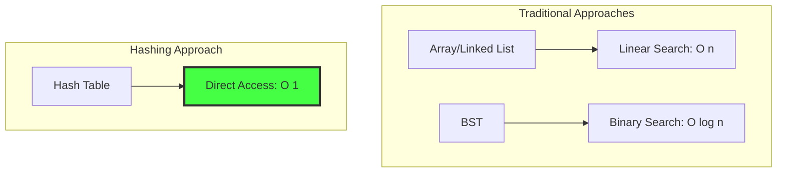

### 💡 التطور في التفكير

#### 1️⃣ **Direct Address Table** (الحل البدائي)

> [!info] الفكرة استخدام المفتاح مباشرة كـ index في المصفوفة.

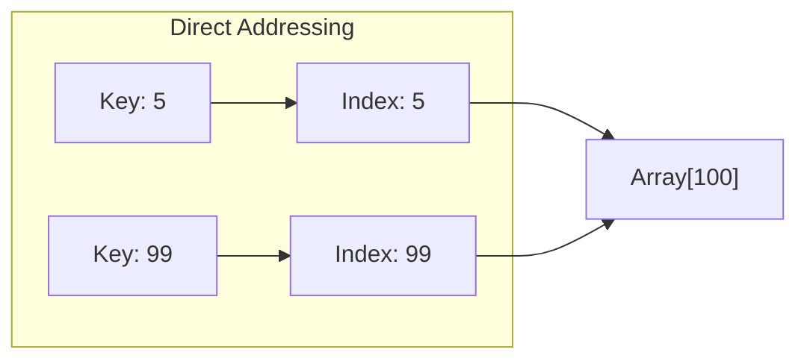

**المشكلة الكارثية:**

- لو الأرقام من 10 خانات (0 إلى 9,999,999,999)
- نحتاج مصفوفة حجمها **10 مليار** عنصر! 💥
- هدر رهيب للذاكرة لتخزين 1000 عنصر فقط

#### 2️⃣ **Hashing** (الحل العبقري)

> [!success] الحل الذكي **"ضغط"** المجال الواسع (مليار رقم) إلى مجال صغير (100 خانة) باستخدام معادلة رياضية.

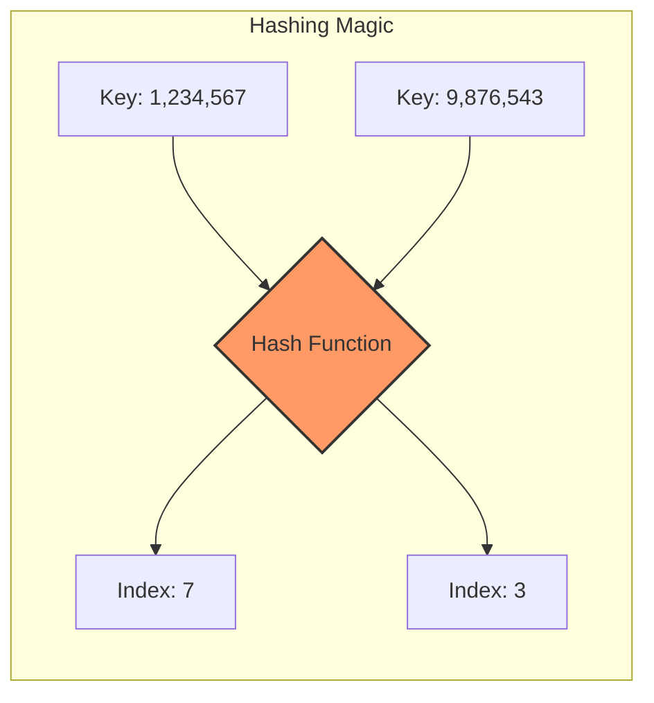

---

## المكونات الأساسية للـ Hash Table

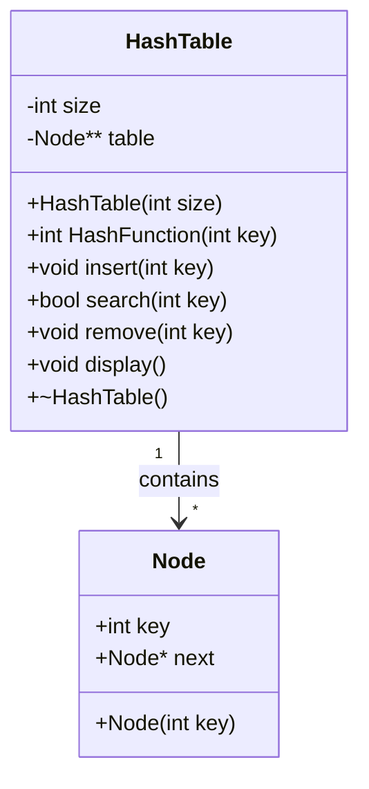

### 🧩 العناصر الأربعة

1. **Key (المفتاح):** البيانات الأصلية
2. **Hash Function (دالة التحويل):** المعادلة الرياضية
3. **Table (المصفوفة):** مصفوفة من المؤشرات
4. **Collision Handling (معالجة التصادم):** آلية حل التعارضات

---

## الـ Hash Function - القلب النابض

> [!tip] المعادلة الذهبية $$\text{index} = \text{key} \bmod \text{size}$$

### 🎲 لماذا Modulo (%)؟

باقي القسمة يضمن أن الناتج **دائماً** داخل حدود المصفوفة:

- `key % 10` → النتيجة من 0 إلى 9 ✅
- `key % 100` → النتيجة من 0 إلى 99 ✅

### 📊 أمثلة حسابية

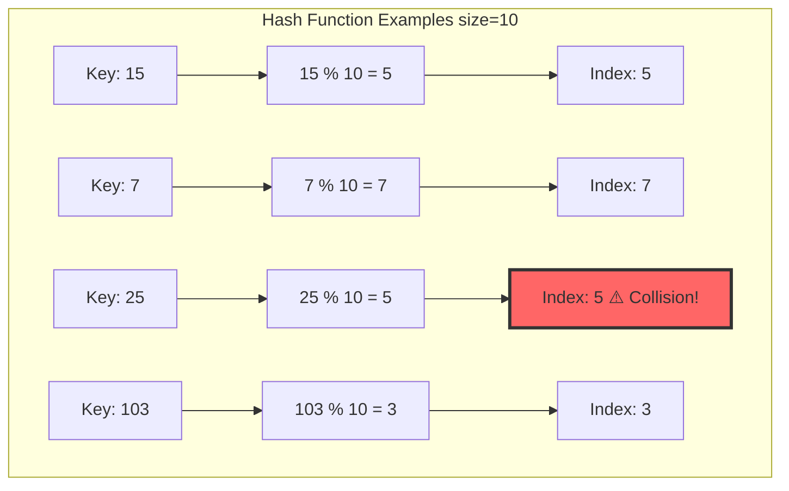

### 🧪 كود التجربة

```cpp
int tableSize = 10;
int myData[] = {15, 22, 35, 42, 103};

for(int i = 0; i < 5; i++) {
    int index = myData[i] % tableSize; 
    cout << "Value: " << myData[i] 
         << " → Index: " << index << endl;
}
```

**Output:**

```
Value: 15  → Index: 5
Value: 22  → Index: 2
Value: 35  → Index: 5  ⚠️ Collision with 15
Value: 42  → Index: 2  ⚠️ Collision with 22
Value: 103 → Index: 3
```

---

## كارثة الـ Collision وحلولها

> [!danger] التصادم (Collision) عندما تُنتج دالة الـ Hash نفس الـ index لمفتاحين مختلفين.

### 🔥 أسباب التصادم

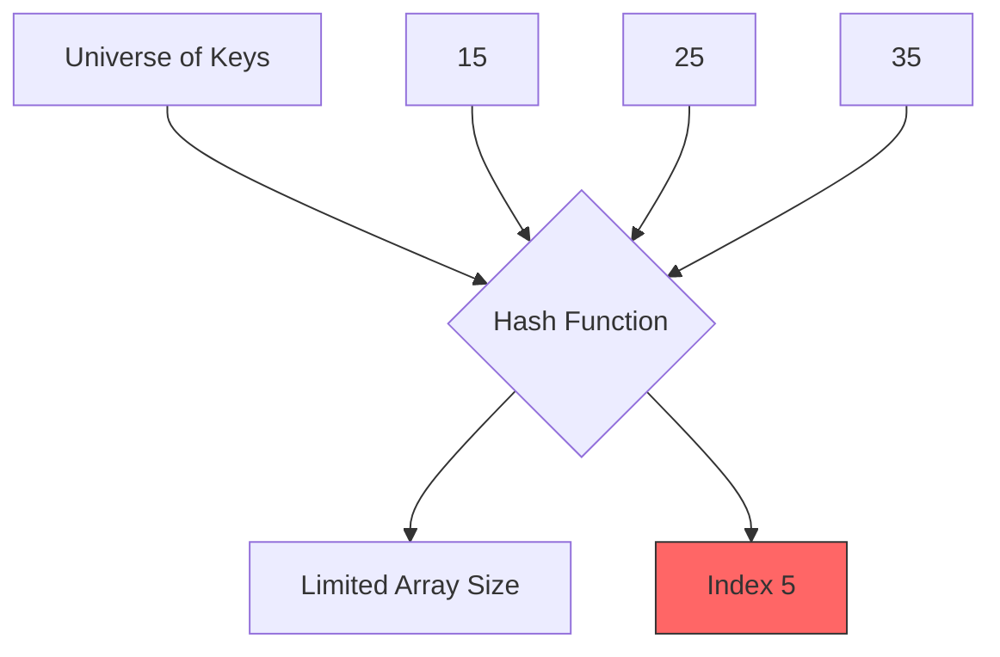

**مبدأ Pigeonhole Principle:**

- لو عندك 1000 مفتاح محتمل
- وعندك 10 خانات فقط
- **حتماً** سيحدث تصادم!

### ✅ الحل: Separate Chaining

> [!success] الفكرة الذهبية كل خانة في المصفوفة **لا تحمل قيمة**، بل تحمل **مؤشر** لـ Linked List.

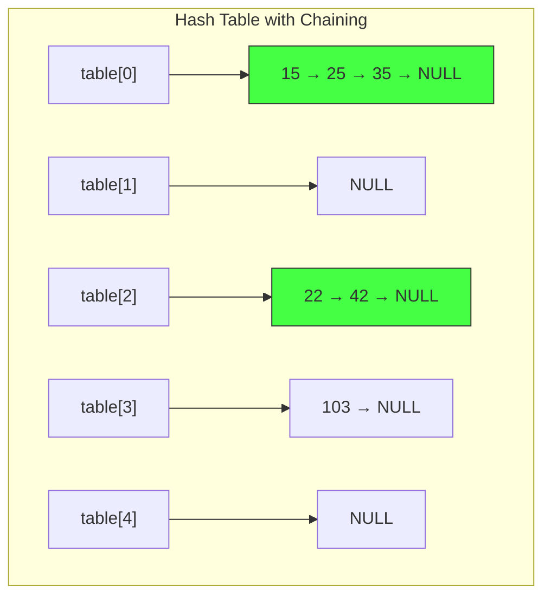

### 🆚 مقارنة مع Open Addressing

|**Aspect**|**Separate Chaining**|**Open Addressing**|
|---|---|---|
|**المساحة**|تستخدم ذاكرة إضافية للـ pointers|كل شيء داخل المصفوفة|
|**التعامل مع الامتلاء**|يمكن إضافة عدد غير محدود|تتوقف عند امتلاء الجدول|
|**التعقيد**|أبسط في التنفيذ|أكثر تعقيداً|
|**الأداء**|ثابت حتى مع كثرة البيانات|يتدهور مع الامتلاء|

---

## تطبيق عملي - بناء Hash Table من الصفر

### 🏗️ هيكل الـ Node

```cpp
class Node {
public:
    int key;      // البيانات
    Node *next;   // المؤشر للتالي
    
    Node(int key) {
        this->key = key;
        this->next = NULL;
    }
};
```

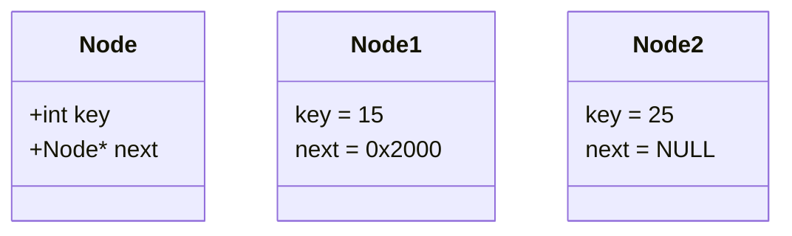

### 🏗️ هيكل الـ HashTable

```cpp
class HashTable {
    int size;        // عدد الخانات
    Node **table;    // مصفوفة من المؤشرات
    
public:
    HashTable(int size);
    int HashFunction(int key);
    void insert(int key);
    bool search(int key);
    void remove(int key);
    void display();
    ~HashTable();
};
```

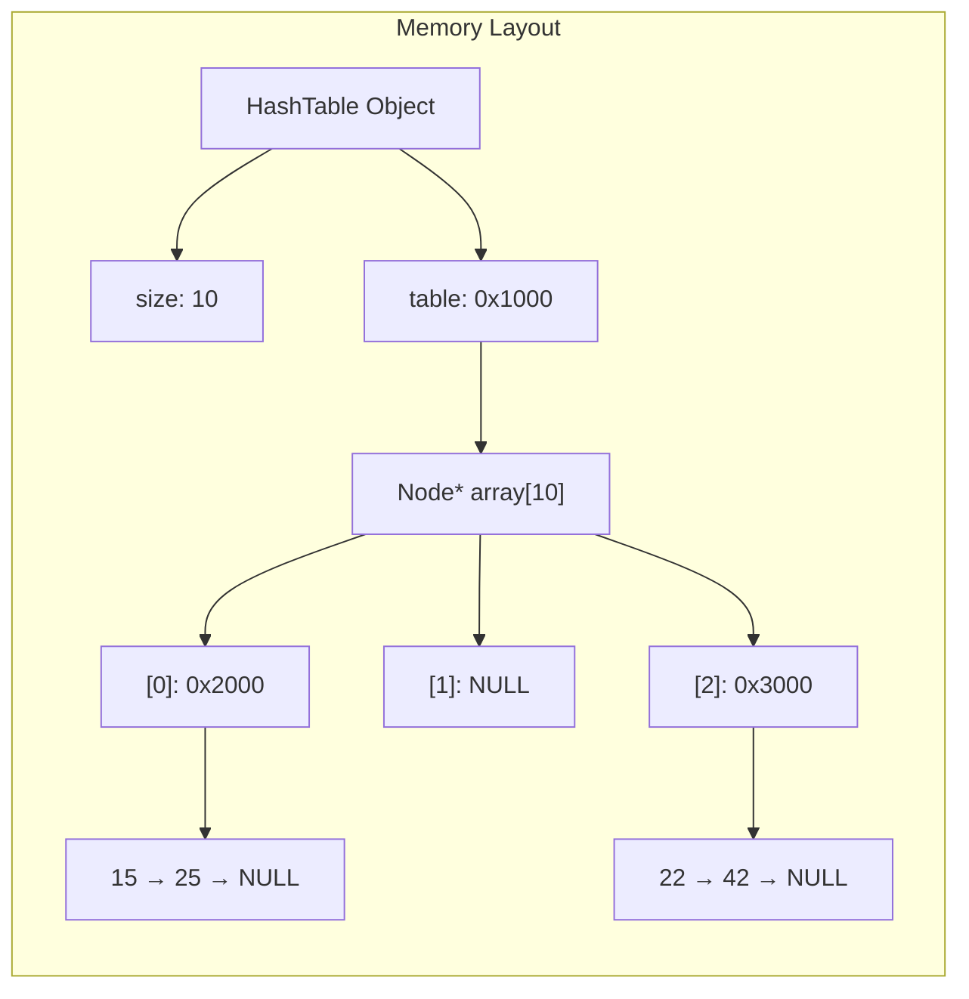

---

## الـ Constructor - تجهيز الذاكرة

### 🎯 الهدف

1. حجز مصفوفة من الـ pointers في الـ Heap
2. تصفير كل العناصر لتجنب Wild Pointers

### 🧩 الكود

```cpp
HashTable(int size) {
    this->size = size;
    
    // حجز مصفوفة من المؤشرات
    table = new Node*[size];
    
    // تصفير كل المؤشرات
    for (int i = 0; i < size; i++) {
        table[i] = NULL;
    }
}
```

### 📊 تتبع التنفيذ

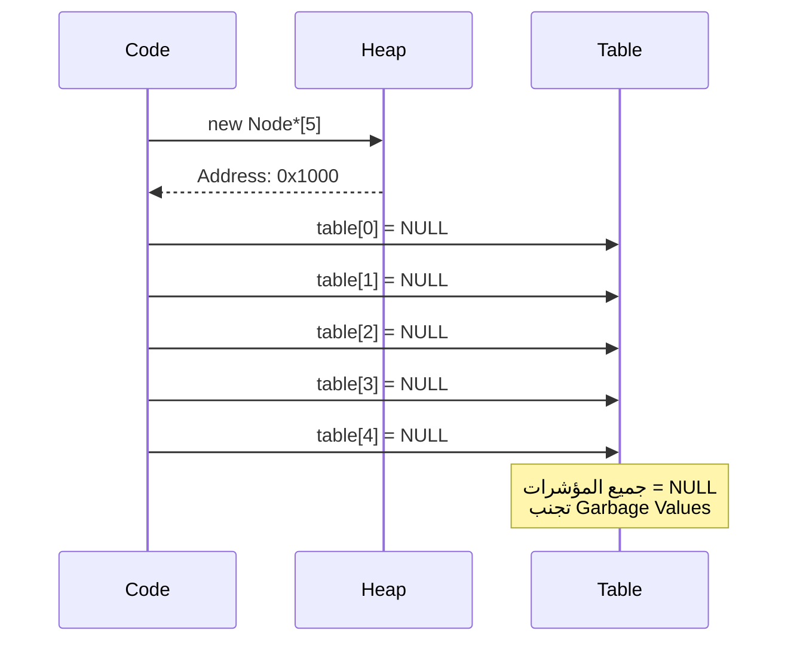

### 🔍 الحالة بعد Constructor

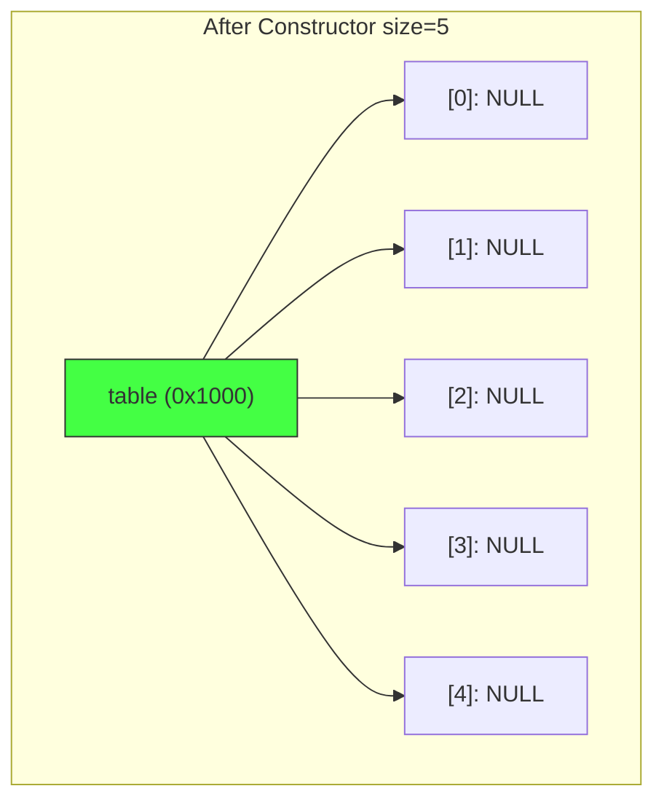

> [!warning] لماذا التصفير مهم؟ بدون `table[i] = NULL`، المؤشرات ستحتوي على قيم عشوائية (garbage) قد تشير لمناطق غير صالحة في الذاكرة، مما يسبب **Segmentation Fault**.

---

## دالة الـ Insert - إضافة العناصر

### 🎯 الهدف

إضافة node جديدة في **بداية** السلسلة (Head Insertion) لتحقيق O(1).

### 🧩 الكود الكامل

```cpp
void insert(int key) {
    // 1. إنشاء node جديدة
    Node *newNode = new Node(key);
    
    // 2. حساب الـ index
    int index = HashFunction(key);
    
    // 3. ربط الـ node بالسلسلة الحالية
    newNode->next = table[index];
    
    // 4. تحديث بداية السلسلة
    table[index] = newNode;
}
```

### 📊 تتبع تفصيلي - إضافة 20 عند index=0

#### الحالة الأولية

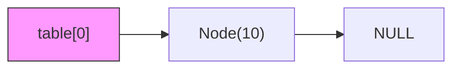

#### الخطوة 1: إنشاء Node جديدة

```cpp
Node *newNode = new Node(20);
```

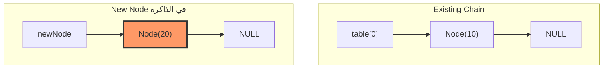

#### الخطوة 2: حساب Index

```cpp
int index = HashFunction(20);  // 20 % 10 = 0
```

#### الخطوة 3: التوصيل الآمن (CRITICAL!)

```cpp
newNode->next = table[index];
```

> [!danger] تحذير خطير **لو عكست ترتيب الخطوتين 3 و 4، ستفقد السلسلة القديمة للأبد!**

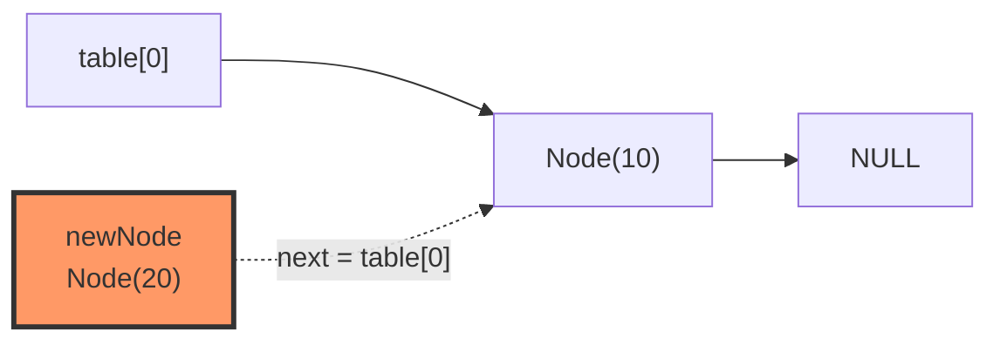

#### الخطوة 4: تحديث Head

```cpp
table[index] = newNode;
```

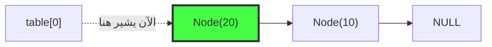

### 🎬 Animation كاملة - إضافة 3 عناصر

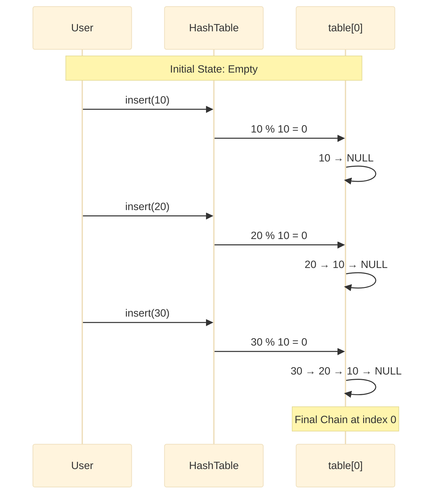

### ⚡ لماذا O(1)؟

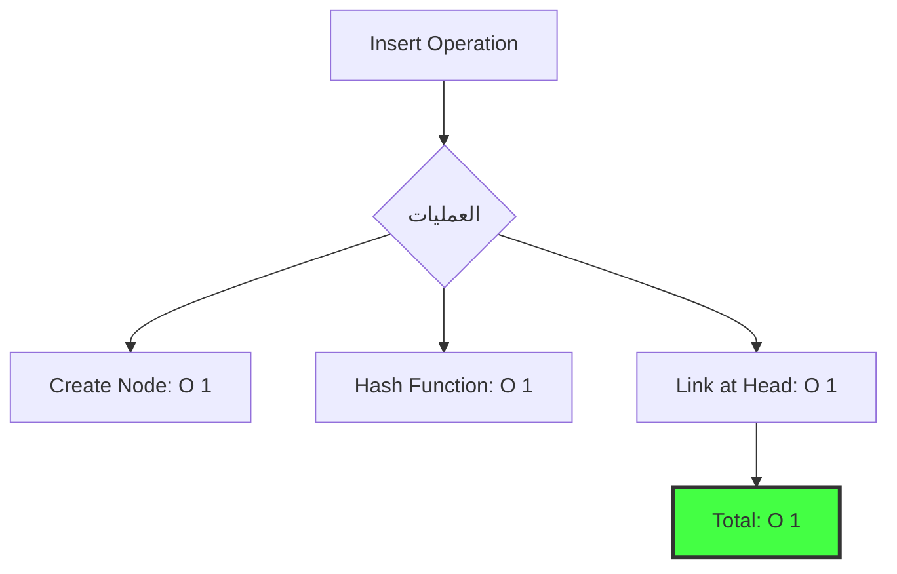

> [!success] الميزة الذهبية بغض النظر عن طول السلسلة، الإضافة **دائماً** في البداية = **خطوة واحدة**!

---

## دالة الـ Search - البحث عن العناصر

### 🎯 الهدف

التحقق من وجود مفتاح معين في الجدول بأسرع طريقة.

### 🧩 الكود

```cpp
bool search(int key) {
    // 1. حساب الموقع المتوقع
    int index = HashFunction(key);
    
    // 2. بدء المؤشر من أول السلسلة
    Node *curr = table[index];
    
    // 3. التنقل في السلسلة
    while (curr != NULL) {
        if (curr->key == key) {
            return true;  // وجدناه! ✅
        }
        curr = curr->next;
    }
    
    return false;  // غير موجود ❌
}
```

### 📊 تتبع تفصيلي - البحث عن 5

**الحالة:**

```
table[5]: 15 → 5 → 25 → NULL
```

#### Frame 1: الحساب والقفز

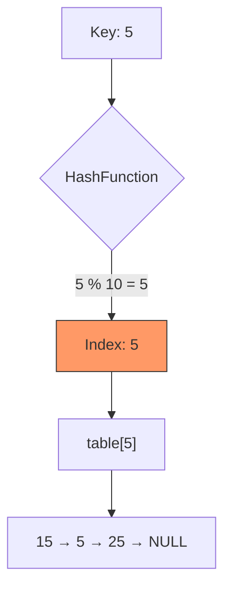

#### Frame 2: البحث - المحاولة الأولى

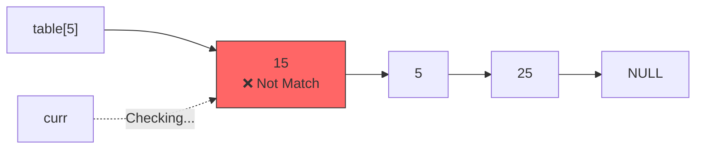

```
curr->key = 15
15 != 5  ❌
curr = curr->next
```

#### Frame 3: البحث - المحاولة الثانية

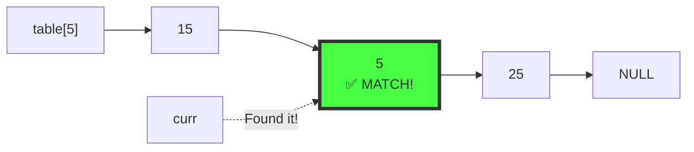

```
curr->key = 5
5 == 5  ✅
return true
```

### 🎬 Flowchart كامل للبحث

```mermaid
flowchart TD
    Start([search key]) --> Hash[Calculate index]
    Hash --> Init[curr = table index]
    Init --> Check{curr != NULL?}
    
    Check -->|No| NotFound[return false]
    Check -->|Yes| Compare{curr->key == key?}
    
    Compare -->|Yes| Found[return true]
    Compare -->|No| Next[curr = curr->next]
    Next --> Check
    
    style Found fill:#4f4,stroke:#333
    style NotFound fill:#f66,stroke:#333
```

### 🔬 حالة الفشل - البحث عن 99

```mermaid
sequenceDiagram
    participant Func as search 99
    participant HF as HashFunction
    participant Table as table[9]
    participant Chain as Linked List
    
    Func->>HF: 99 % 10 = 9
    HF-->>Func: index = 9
    
    Func->>Table: curr = table[9]
    Table-->>Func: curr = NULL
    
    Note over Func: curr == NULL<br/>Exit while loop
    
    Func-->>Func: return false
```

### ⚡ تحليل الأداء

|**Scenario**|**Time Complexity**|**Explanation**|
|---|---|---|
|Best Case|O(1)|العنصر في بداية السلسلة|
|Average Case|O(1 + α)|α = عدد العناصر / حجم الجدول|
|Worst Case|O(n)|كل العناصر في نفس الخانة|

> [!tip] Load Factor (α) $$\alpha = \frac{\text{Total Elements}}{\text{Table Size}}$$
> 
> للحفاظ على O(1)، يُفضل أن يكون α < 0.75

---

## دالة الـ Remove - حذف العناصر

### 🎯 التحدي الأكبر

الحذف يتطلب:

1. إيجاد الـ node
2. **قطع** الاتصال بشكل آمن
3. تحرير الذاكرة

> [!danger] الخطر الأكبر لو قطعت الاتصال بطريقة خاطئة، ستفقد باقي السلسلة!

### 🧩 الكود الكامل

```cpp
void remove(int key) {
    int index = HashFunction(key);
    Node *curr = table[index];  // المحقق الرئيسي
    Node *prev = NULL;          // المساعد (يحفظ السابق)
    
    while (curr != NULL) {
        if (curr->key == key) {
            // ✅ وجدنا الهدف!
            
            // Case 1: الهدف في البداية
            if (prev == NULL) {
                table[index] = curr->next;
            }
            // Case 2: الهدف في الوسط/النهاية
            else {
                prev->next = curr->next;  // الجسر
            }
            
            delete curr;  // تحرير الذاكرة
            return;
        }
        
        // التقدم للأمام
        prev = curr;
        curr = curr->next;
    }
}
```

### 📊 Case 1: حذف العنصر الأول (Head)

**الحالة الأولية:**

```
table[0]: 15 → 5 → 20 → NULL
Target: 15
```

#### Frame 1: الإعداد

```mermaid
graph LR
    T0["table[0]"] --> N15["15<br/>⚠️ Target"]
    N15 --> N5["5"]
    N5 --> N20["20"]
    N20 --> NULL1[NULL]
    
    Prev["prev"] --> NullBox[NULL]
    Curr["curr"] --> N15
    
    style N15 fill:#f96,stroke:#333,stroke-width:3px
```

```
prev = NULL  (لأننا في البداية)
curr->key = 15  ✅ Match!
```

#### Frame 2: التنفيذ

```cpp
if (prev == NULL) {
    table[index] = curr->next;
}
```

```mermaid
graph LR
    T0["table[0]"] -.->|"تحديث المؤشر"| N5["5"]
    N5 --> N20["20"]
    N20 --> NULL1[NULL]
    
    N15["15<br/>🗑️ سيُحذف"] -.-x N5
    
    style N15 fill:#ddd,stroke:#f00,stroke-dasharray: 5 5
```

#### Frame 3: النتيجة النهائية

```mermaid
graph LR
    T0["table[0]"] --> N5["5"]
    N5 --> N20["20"]
    N20 --> NULL1[NULL]
    
    style T0 fill:#4f4,stroke:#333
```

### 📊 Case 2: حذف عنصر من الوسط

**الحالة الأولية:**

```
table[0]: 15 → 5 → 20 → 25 → NULL
Target: 20
```

#### Frame 1: البحث - المحاولة الأولى

```mermaid
graph LR
    T0["table[0]"] --> N15["15"]
    N15 --> N5["5"]
    N5 --> N20["20"]
    N20 --> N25["25"]
    
    Prev["prev"] --> NullBox[NULL]
    Curr["curr"] --> N15
    
    Note1["curr->key = 15<br/>15 != 20 ❌"]
```

```
prev = NULL
curr = 15  ❌
التقدم: prev = curr, curr = curr->next
```

#### Frame 2: البحث - المحاولة الثانية

```mermaid
graph LR
    T0["table[0]"] --> N15["15"]
    N15 --> N5["5"]
    N5 --> N20["20"]
    N20 --> N25["25"]
    
    Prev["prev"] --> N15
    Curr["curr"] --> N5
```

```
prev = 15
curr = 5  ❌
التقدم: prev = curr, curr = curr->next
```

#### Frame 3: البحث - المحاولة الثالثة (Success!)

```mermaid
graph LR
    T0["table[0]"] --> N15["15"]
    N15 --> N5["5"]
    N5 --> N20["20<br/>✅ Target!"]
    N20 --> N25["25"]
    
    Prev["prev"] --> N5
    Curr["curr"] --> N20
    
    style N20 fill:#f96,stroke:#333,stroke-width:3px
```

```
prev = 5
curr = 20  ✅ Match!
```

#### Frame 4: الجراحة - بناء الجسر

```cpp
prev->next = curr->next;
```

> [!info] الجسر (The Bypass) نجعل الـ node السابقة (5) تشير مباشرة للـ node التالية (25)، متجاوزة الـ node المستهدفة (20).

```mermaid
graph LR
    T0["table[0]"] --> N15["15"]
    N15 --> N5["5<br/>(prev)"]
    N5 -.->|"The Bypass Bridge"| N25["25"]
    
    N20["20<br/>🗑️ Isolated"] -.-x N25
    
    style N20 fill:#ddd,stroke:#f00,stroke-dasharray: 5 5
    style N5 fill:#4f4,stroke:#333
```

#### Frame 5: التنظيف

```cpp
delete curr;
```

```mermaid
graph LR
    T0["table[0]"] --> N15["15"]
    N15 --> N5["5"]
    N5 --> N25["25"]
    N25 --> NULL1[NULL]
    
    style T0 fill:#4f4,stroke:#333
```

### 🎬 المقارنة بين الحالتين

```mermaid
graph TD
    subgraph "Case 1: Remove Head"
    A1[prev == NULL] --> B1[table index = curr->next]
    B1 --> C1[delete curr]
    end
    
    subgraph "Case 2: Remove Middle/End"
    A2[prev != NULL] --> B2[prev->next = curr->next]
    B2 --> C2[delete curr]
    end
    
    style B1 fill:#f96,stroke:#333
    style B2 fill:#f96,stroke:#333
```

### 🔄 تتبع كامل بـ Sequence Diagram

```mermaid
sequenceDiagram
    participant User
    participant RemoveFunc as remove 20
    participant Table as table[0]
    participant Chain as 15→5→20→25
    
    User->>RemoveFunc: remove(20)
    RemoveFunc->>RemoveFunc: index = 20 % 10 = 0
    RemoveFunc->>Table: curr = table[0]
    Table-->>RemoveFunc: curr = 15
    
    Note over RemoveFunc: Loop iteration 1
    RemoveFunc->>RemoveFunc: 15 != 20, continue
    RemoveFunc->>RemoveFunc: prev=15, curr=5
    
    Note over RemoveFunc: Loop iteration 2
    RemoveFunc->>RemoveFunc: 5 != 20, continue
    RemoveFunc->>RemoveFunc: prev=5, curr=20
    
    Note over RemoveFunc: Loop iteration 3
    RemoveFunc->>RemoveFunc: 20 == 20 ✅
    RemoveFunc->>Chain: prev->next = curr->next
    Chain-->>RemoveFunc: Bridge created
    RemoveFunc->>RemoveFunc: delete curr
    
    Note over Chain: Final: 15→5→25→NULL
```

---

## الـ Destructor - تنظيف الذاكرة

### 🎯 المهمة الحيوية

حذف **كل** الـ nodes في **كل** السلاسل، ثم حذف المصفوفة نفسها.

> [!danger] Memory Leak إذا لم نحذف الـ nodes يدوياً، ستبقى في الـ Heap للأبد (حتى بعد انتهاء البرنامج في بعض الأنظمة).

### 🧩 الكود

```cpp
~HashTable() {
    // المرحلة 1: حذف جميع السلاسل
    for (int i = 0; i < size; i++) {
        Node *curr = table[i];
        
        while (curr != NULL) {
            Node *temp = curr;      // حفظ العنوان
            curr = curr->next;      // التقدم
            delete temp;            // الحذف الآمن
        }
    }
    
    // المرحلة 2: حذف المصفوفة
    delete[] table;
}
```

### 📊 تتبع التنفيذ

#### الحالة الأولية

```mermaid
graph TD
    subgraph "Hash Table"
    T["table"]
    T --> T0["[0]: 15→25→NULL"]
    T --> T1["[1]: NULL"]
    T --> T2["[2]: 22→42→NULL"]
    T --> T3["[3]: 3→NULL"]
    T --> T4["[4]: NULL"]
    end
```

#### المرحلة 1: حذف السلسلة عند index=0

**Iteration 1:**

```mermaid
graph LR
    Curr["curr"] --> N15["15"]
    Temp["temp"] --> N15
    N15 --> N25["25"]
    
    Note1["delete temp<br/>✅ تم حذف 15"]
    
    style N15 fill:#f66,stroke:#333
```

**Iteration 2:**

```mermaid
graph LR
    Curr["curr"] --> N25["25"]
    Temp["temp"] --> N25
    N25 --> NULL1[NULL]
    
    Note1["delete temp<br/>✅ تم حذف 25"]
    
    style N25 fill:#f66,stroke:#333
```

**النتيجة:** `table[0] = NULL` (تلقائياً لأن curr أصبح NULL)

#### المرحلة 1: حذف السلسلة عند index=2

```mermaid
sequenceDiagram
    participant Loop
    participant Curr
    participant Memory
    
    Loop->>Curr: curr = table[2] (22)
    
    Note over Loop: Iteration 1
    Loop->>Memory: temp = 22
    Loop->>Curr: curr = curr->next (42)
    Loop->>Memory: delete 22 ❌
    
    Note over Loop: Iteration 2
    Loop->>Memory: temp = 42
    Loop->>Curr: curr = curr->next (NULL)
    Loop->>Memory: delete 42 ❌
    
    Note over Loop: curr == NULL, exit
```

#### المرحلة 2: حذف المصفوفة

```cpp
delete[] table;
```

```mermaid
graph TD
    Before["قبل: table يشير لمصفوفة<br/>في الـ Heap"] -->|delete[]| After["بعد: الذاكرة محررة<br/>table أصبح dangling pointer"]
    
    style Before fill:#f96,stroke:#333
    style After fill:#4f4,stroke:#333
```

### ⚠️ الترتيب مهم جداً!

> [!warning] لو عكست الترتيب
> 
> ```cpp
> delete[] table;  // ❌ حذف المصفوفة أولاً
> // الآن table[i] غير صالح!
> for (int i = 0; i < size; i++) {
>     // ❌ Segmentation Fault!
> }
> ```

---

## حالة عملية - Detect Cycle in Linked List

> [!example] LeetCode 141 اكتشف إذا كانت الـ Linked List تحتوي على دورة (Cycle).

### 🧩 المشكلة

```mermaid
graph LR
    N1((1)) --> N2((2))
    N2 --> N3((3))
    N3 --> N4((4))
    N4 -.->|Cycle!| N2
    
    style N2 fill:#f96,stroke:#333
```

### 💡 الفكرة باستخدام Hash Table

> [!tip] الاستراتيجية نسجل كل node نمر عليها. لو صادفنا node **مسجلة مسبقاً**، معناها عدنا لنفس المكان = **Cycle**!

### 🧩 الكود

```cpp
bool hasCycle(Node *head) {
    if (head == NULL || head->next == NULL)
        return false;
    
    HashTable ht(1000);  // دفتر التسجيل
    Node *curr = head;
    
    while (curr != NULL) {
        // هل زرنا هذه الـ node من قبل؟
        if (ht.search(curr->key)) {
            return true;  // نعم! وجدنا cycle
        }
        
        // تسجيل الزيارة
        ht.insert(curr->key);
        curr = curr->next;
    }
    
    return false;  // لا يوجد cycle
}
```

### 📊 تتبع التنفيذ

**السيناريو:** `1 → 2 → 3 → 4 → 2` (cycle)

```mermaid
%%{init: {'theme':'base'}}%%
sequenceDiagram
    participant Func as hasCycle
    participant HT as HashTable
    participant List as Linked List
    
    Note over Func,List: Start: curr = 1
    
    Func->>HT: search(1)?
    HT-->>Func: false
    Func->>HT: insert(1)
    Note over HT: {1}
    
    Func->>List: curr = 2
    Func->>HT: search(2)?
    HT-->>Func: false
    Func->>HT: insert(2)
    Note over HT: {1, 2}
    
    Func->>List: curr = 3
    Func->>HT: search(3)?
    HT-->>Func: false
    Func->>HT: insert(3)
    Note over HT: {1, 2, 3}
    
    Func->>List: curr = 4
    Func->>HT: search(4)?
    HT-->>Func: false
    Func->>HT: insert(4)
    Note over HT: {1, 2, 3, 4}
    
    Func->>List: curr = 2 (CYCLE!)
    Func->>HT: search(2)?
    HT-->>Func: TRUE ✅
    
    Note over Func: return true<br/>Cycle Detected!
```

### 🎯 الحالات المختلفة

```mermaid
graph TD
    Start{بداية الفحص}
    Start --> Check1{head == NULL?}
    Check1 -->|Yes| ReturnFalse1[return false]
    Check1 -->|No| Check2{head->next == NULL?}
    Check2 -->|Yes| ReturnFalse2[return false]
    Check2 -->|No| Loop[بدء الحلقة]
    
    Loop --> Search{search curr->key}
    Search -->|Found| ReturnTrue[return true ✅<br/>Cycle!]
    Search -->|Not Found| Insert[insert curr->key]
    Insert --> Next{curr->next != NULL?}
    Next -->|Yes| Loop
    Next -->|No| ReturnFalse3[return false<br/>No Cycle]
    
    style ReturnTrue fill:#4f4,stroke:#333
    style ReturnFalse1 fill:#f96,stroke:#333
    style ReturnFalse2 fill:#f96,stroke:#333
    style ReturnFalse3 fill:#f96,stroke:#333
```

### ⚠️ تحذير مهم

> [!bug] مشكلة في الكود الحالي الكود يخزن `curr->key` (القيمة)، لكن ماذا لو كان هناك:
> 
> ```
> 5 → 6 → 5  (no cycle, just duplicate value)
> ```
> 
> سيظن الكود أن هناك cycle خطأً!

**الحل الاحترافي:**

```cpp
// بدلاً من تخزين القيمة:
ht.insert(curr->key);  // ❌

// خزن العنوان (Address):
ht.insert(reinterpret_cast<int>(curr));  // ✅
```

---

## التعقيد الزمني والمكاني

### ⏱️ تحليل الوقت

|**Operation**|**Best Case**|**Average Case**|**Worst Case**|
|---|---|---|---|
|**Insert**|O(1)|O(1)|O(n)*|
|**Search**|O(1)|O(1)|O(n)*|
|**Delete**|O(1)|O(1)|O(n)*|

**Worst Case:** يحدث عندما تكون كل العناصر في نفس الـ index (سلسلة واحدة طويلة).

### 📊 العوامل المؤثرة

```mermaid
graph TD
    Performance[أداء Hash Table] --> LF[Load Factor α]
    Performance --> HQ[جودة Hash Function]
    Performance --> TS[حجم الجدول]
    
    LF --> Good["α < 0.75<br/>✅ أداء ممتاز"]
    LF --> Bad["α > 1.0<br/>❌ أداء سيء"]
    
    HQ --> Uniform[توزيع متساوي<br/>✅]
    HQ --> Clustered[تكتل في خانات<br/>❌]
    
    style Good fill:#4f4,stroke:#333
    style Bad fill:#f66,stroke:#333
```

### 💾 تحليل المساحة

$\text{Space} = O(n + m)$

حيث:

- **n:** عدد العناصر المخزنة
- **m:** حجم الجدول (عدد الخانات)

```mermaid
pie title توزيع الذاكرة
    "Nodes (n)" : 60
    "Table Array (m)" : 30
    "Pointers Overhead" : 10
```

---

## 🎓 الخلاصة والنصائح

### ✅ متى تستخدم Hash Table؟

```mermaid
graph LR
    A[Use Hash Table] --> B[البحث السريع مطلوب]
    A --> C[الترتيب غير مهم]
    A --> D[العمليات: Insert/Search/Delete]
    A --> E[الذاكرة متاحة]
    
    style A fill:#4f4,stroke:#333
```

### ❌ متى تتجنب Hash Table؟

```mermaid
graph LR
    A[Avoid Hash Table] --> B[تحتاج ترتيب البيانات]
    A --> C[تحتاج Min/Max بكفاءة]
    A --> D[الذاكرة محدودة جداً]
    A --> E[تحتاج Range Queries]
    
    style A fill:#f66,stroke:#333
```

### 🔧 نصائح للتحسين

> [!tip] Best Practices
> 
> 1. **اختر حجم جدول prime number:** يحسن التوزيع
> 2. **راقب الـ Load Factor:** أعد بناء الجدول عند α > 0.75
> 3. **استخدم hash function جيدة:** تجنب التصادمات
> 4. **للبيانات الحساسة:** استخدم العنوان بدلاً من القيمة

---

## 📚 مراجع إضافية

- [[Data Structures - Overview]]
- [[Linked Lists - Deep Dive]]
- [[Time Complexity Analysis]]
- [[Memory Management in C++]]

---

> [!quote] كلمة أخيرة "Hash Table هو السحر الذي يحول O(n) إلى O(1) - لكن السحر يحتاج فهم عميق ليعمل بكفاءة." — مينا ناجي

**Last Updated:** 2025-01-11  
**Tags:** #DataStructures #HashTable #Hashing #CPlusPlus #Algorithms