# 🏛️ DevArcheology AI — المرجع الكامل

> *"كل سطر كود عنده حكاية. إحنا بنساعد الـ developers يفهموا الـ WHY، مش بس الـ WHAT."*

**Version:** Defense-Ready | مارس 2026
**Track:** ITI Open Source Applications Development — Gen-AI Capstone
**Status:** 🟢 Gold Tier Target (99/100)

---

## 🗺️ فهرس المحتويات

1. [[#الحكاية — ليه المشروع ده موجود؟]]
2. [[#Business Domain والـ Market]]
3. [[#السؤال القاتل — إيه الفرق بينك وبين CodeRabbit؟]]
4. [[#خريطة المنافسين الحقيقية]]
5. [[#System Architecture — الصورة الكاملة]]
6. [[#الـ 6 Agents — محرك الذكاء]]
7. [[#الـ RAG Pipeline — Hybrid Retrieval]]
8. [[#مشكلة الـ Cold Start — محلولة]]
9. [[#مشكلة الـ Slack Permissions — محلولة]]
10. [[#VS Code Extension — السلاح اليومي]]
11. [[#Web Admin Portal — عقل الـ Team]]
12. [[#The Archaeology Trail — لحظة الـ WOW]]
13. [[#Developer DNA Profiles — القنبلة الـ Enterprise]]
14. [[#Tech Stack — الـ Hybrid Architecture]]
15. [[#Security — OWASP LLM Top 10]]
16. [[#Observability والـ Evaluation]]
17. [[#Business Model والـ Monetization]]
18. [[#تغطية الـ ITI Checklist]]
19. [[#Team Structure]]
20. [[#الـ 4-Week Timeline]]
21. [[#الـ KPIs والـ Success Metrics]]
22. [[#الـ 60-Second Wow Moment]]
23. [[#زيتونة الإنترفيو 🫒]]

---

## الحكاية — ليه المشروع ده موجود؟

### المشهد اللي كل developer اتجنن فيه

أحمد انضم لشركة fintech جديدة. اليوم التالت. فتح الـ payment processing module ولاقى الكود ده:

```javascript
// DO NOT CHANGE THIS TIMEOUT VALUE
const PAYMENT_RETRY_TIMEOUT = 847;
```

`847`؟ مش `1000`. مش `500`. `847` ليه؟

أحمد اتعب **4 ساعات** يحاول يفهم. عمل `git blame` — الـ commit message بتقول: *"fix timeout issue"*. دور في Jira — الـ ticket مقفول من غير description. سأل الـ senior dev — الـ senior dev اللي كتب الكود ده راح من 8 شهور.

**المعرفة راحت. الـ WHY مات.**

وده بيحصل في **35% من وقت كل developer** كل يوم — وقت بيتحرق في فهم كود موجود بدل ما يكتب features جديدة.

### تعريف المشكلة

```
THE CONTEXT GAP — الفجوة اللي محدش سدّها
─────────────────────────────────────────
WHAT اتغير  →  git blame, git log .......... ✅ محلولة (GitLens)
WHEN اتغير  →  commit timestamps ........... ✅ محلولة (GitLens)
WHO غيّر    →  author metadata ............. ✅ محلولة (GitLens)

WHY اتغير  →  ???????????????? ............. ❌ مفيش حل
WHY بالطريقة دي → ???????????????? ........ ❌ مفيش حل
WHY لسه موجود → ???????????????? .......... ❌ مفيش حل
```

الـ WHY موجودة متفرقة في **5 أدوات** مش بتتكلم مع بعضها خالص:

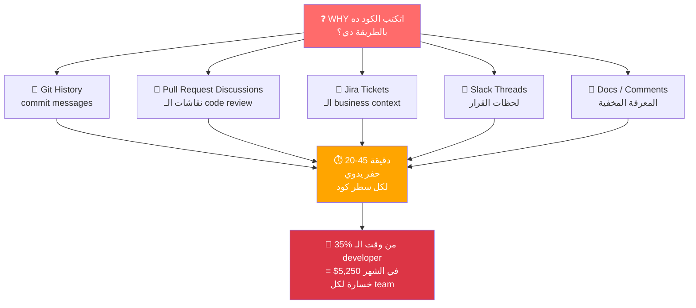

### الـ Vision

> DevArcheology AI هو أول **institutional memory system** للـ software teams — بيجمع Git و PRs و Jira و Slack في **narrative واحدة في 5 ثواني** بتجاوب على السؤال اللي محدش بيجاوبه: **WHY**.

---

## Business Domain والـ Market

### إحنا فين في الـ Market؟

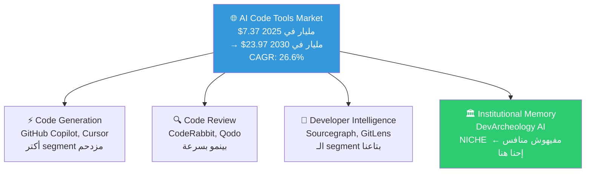

### الأرقام اللي لازم تحفظها غيباً

| الـ Stat | الرقم | ليه مهمة |
|---|---|---|
| AI Code Tools Market 2025 | **$7.37 Billion** | حجم الـ market اللي إحنا فيه |
| المتوقع 2030 | **$23.97 Billion** | CAGR 26.6% |
| Devs بيستخدموا AI يومياً | **97% من enterprise devs** | الـ market ناضج ومستعد يدفع |
| وقت الـ developer في فهم الكود | **35% من ساعات الشغل** | ده المشكلة بالأرقام |
| نسبة اللي **مش بيثقوا** في AI | **46% vs 33% واثقين** | الدقة مش feature — هي الـ product |
| Sourcegraph وقفوا Free tier | **يوليو 2025** | الـ gap اللي إحنا بندخل فيه |

### 3 إشارات مهمة في الـ Market

**إشارة 1 — الـ Adoption عالي، الـ Trust هو المشكلة:**
46% من الـ developers **مش واثقين** في الـ AI tools — أعلى من 33% الواثقين. ده معناه إن دقتك وشفافيتك في الـ citations مش nice-to-have. **هي الـ product نفسه.**

**إشارة 2 — مشكلة الـ "understanding" مش متحلتش:**
مفيش أداة واحدة في الـ market بتجاوب "ليه اتكتب الكود ده كده" بشكل direct. الـ whitespace موجود وحقيقي.

**إشارة 3 — Sourcegraph تراجع من الـ mid-market:**
يوليو 2025، Sourcegraph وقفوا Cody Free وCody Pro. راحوا Enterprise-only. الـ developer اللي كان بيستخدم Cody Free لفهم الـ codebase **ملقاش بديل.** ده الـ gap اللي إحنا بندخله.

---

## السؤال القاتل — إيه الفرق بينك وبين CodeRabbit؟

### اللحظة اللي تجمدت فيها

> *"إيه الفرق بين مشروعك وCodeRabbit وأي AI code reviewer تاني؟"*

تجمدت لأنك كنت بتفكر في الـ **features**. الـ supervisor كان بيسأل عن الـ **product category**. دول كلام مختلف خالص.

### الإجابة — الـ Timeline يحكيها

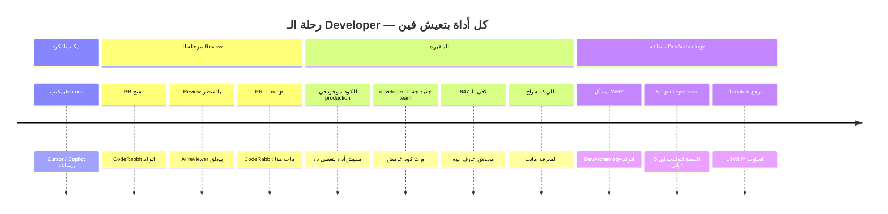

### الكلام اللي تحفظه وتقوله

**لما بيسألوك:** *"إيه الفرق بينك وبين CodeRabbit؟"*

**بتقول:**

> *"CodeRabbit وكل الـ AI code reviewers أدوات **forward-looking** — بتجاوب: 'هل المفروض نـ merge الكود ده؟' بتشتغل لما الـ PR بيتفتح، وبتموت لما الـ PR بيتـ merge.*
>
> *DevArcheology أداة **backward-looking** — بتجاوب: 'ليه الـ PR ده اتـ merge من سنتين؟' بتشتغل لما developer جديد يورث كود قديم ويحتاج يفهم قرار اتخد من حد مسيبش الشركة.*
>
> *التشبيه الصح: CodeRabbit هو **مهندس المباني** اللي بيفحص البيت قبل ما تسكن فيه. DevArcheology هو **المؤرخ** اللي بتكلمه بعد 10 سنين لما تلاقي حيطة غريبة وتحتاج تعرف هل شيلها هيخرّب البيت."*

### 3 نقط إثبات — مفيش رد عليهم

| النقطة | الحقيقة |
|---|---|
| **Data sources مختلفة خالص** | CodeRabbit بيقرا الـ diff الجديد بتاعك. DevArcheology بيقرا كل الـ Git history + كل الـ PRs المقفولة + كل الـ Jira tickets الأرشيف + كل Slack threads من 18 شهر. CodeRabbit مقدرش يوصل لحاجة من دي. |
| **User مختلف، لحظة مختلفة** | User الـ CodeRabbit = الـ developer اللي كتب الكود، قبل الـ merge. User الـ DevArcheology = الـ developer اللي ورث الكود، 6 شهور بعد ما اللي كتبه راح من الشركة. |
| **CodeRabbit بيخلق المشكلة اللي إحنا بنحلها** | كل قرار ذكي CodeRabbit وافق عليه بيبقى invisible بعد الـ merge. DevArcheology بيسترجع بالظبط القرارات دي بعد سنتين. مش منافسين — CodeRabbit بيغذي الـ RAG corpus بتاعنا. |

### الجملة القاتلة

> *"ورّيني CodeRabbit وهو بيشرح commit من سنتين كتبه developer راح من الشركة — وأنا هقفل DevArcheology النهارده."*

---

## خريطة المنافسين الحقيقية

### الـ Positioning Map

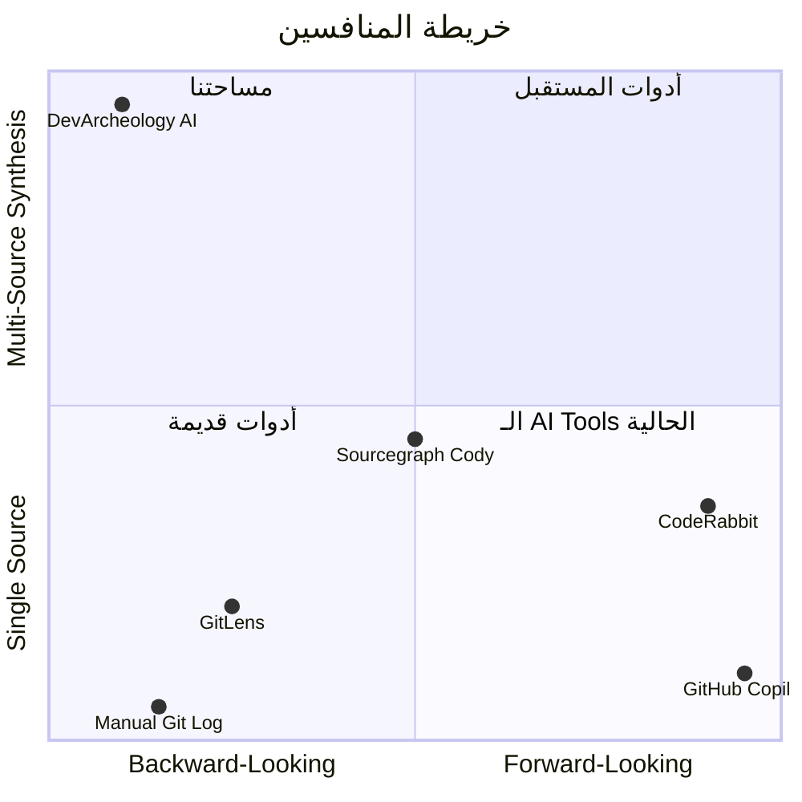

### Tier 1 — المنافسين المباشرين

#### GitLens by GitKraken

**بيعمل إيه:** Visualization للـ Git history جوا VS Code — blame annotations، commit graphs، file history.

**أضاف مؤخراً:** AI commit explanations، Jira Cloud integration، MCP support.

**الـ gap بتاعهم = مدخلنا:**
- GitLens بيوريك **شاهد القبر** بتاع الكود (WHO، WHEN، WHAT)
- DevArcheology بيحكيلك **السيرة الذاتية** (WHY في narrative كاملة)

**لما يسألوك عن GitLens:**
> *"GitLens ده data source لـ DevArcheology، مش منافس. إحنا بناخد الـ Git data بتاعه وبنضيف 4 layers context فوقيه."*

---

#### CodeRabbit

**بيعمل إيه:** AI code review على كل PR — line-by-line comments، bug detection، PR summaries.

**Scale:** أكتر من 2 مليون repository، 13 مليون+ PR اتراجعوا، 9,000+ organization.

**الـ pricing:** $12–24 في الشهر للـ user.

**الـ insight المهم:**
- CodeRabbit = **prospective** (بيراجع الكود قبل ما يدخل الـ production)
- DevArcheology = **retrospective** (بيشرح الكود اللي بقاله سنين في الـ production)
- **لحظة workflow مختلفة. مش منافسين.**

---

#### Sourcegraph / Cody

**بيعمل إيه:** Code search على مستوى الـ codebase كله، AI chat مع الـ codebase.

**Plot twist — يوليو 2025:** Sourcegraph **وقفوا** Cody Free وCody Pro. راحوا Enterprise-only. أطلقوا "Amp" للـ individual developers بشكل منفصل.

**معناه ليه لينا:** الـ mid-market اللي تركوه = نقطة دخولنا. الـ developer اللي كان بيستخدم Cody Free **ملقاش بديل.** الـ gap اتفتح من 8 شهور. **إحنا بندخل فيه.**

---

### الـ Invisible Competitor — الأخطر

**دماغ الـ developer + Slack search + manual git log.**

ده اللي الـ developers بيعملوه دلوقتي فعلاً:
1. يعمل `git blame` ← يجيب author + commit hash (دقيقتين)
2. يفتح الـ PR يدوياً ← يقرا 47 comment (10 دقايق)
3. يدور في Slack عن رقم الـ ticket ← يلاقي thread (8 دقايق)
4. يسأل الـ senior dev اللي كتبه ← راح من 8 شهور (∞ دقيقة)

**الإجمالي: 20-45 دقيقة لكل investigation، لكل commit، لكل developer.**

DevArcheology بيعمل ده في **5 ثواني**. ده هو الـ core value proposition.

---

### لما يسألوك عن أي منافس

| لو اتكلموا عن... | بتقول... |
|---|---|
| **GitLens** | "مش منافس — ده data source. هو بيوري WHO وWHEN، إحنا بنضيف WHY." |
| **CodeRabbit** | "لحظة workflow مختلفة خالص. هو بيموت لما الـ PR يتـ merge. إحنا بنتولد بعده." |
| **Sourcegraph** | "وقفوا الـ mid-market في يوليو 2025. إحنا بندخل الـ gap اللي تركوه." |
| **GitHub Copilot** | "Code generation، مش code understanding. Zero institutional memory." |
| **"أي AI reviewer"** | "الـ AI reviewers forward-looking. إحنا backward-looking. اطلب من أي واحد فيهم يشرح commit من سنتين لـ developer راح — مش هيقدر." |

---

## System Architecture — الصورة الكاملة

### الـ 30,000-Foot View

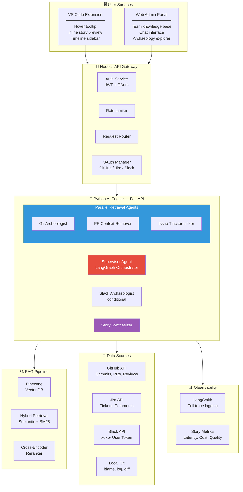

---

## الـ 6 Agents — محرك الذكاء

### ليه الـ Sequential Pipeline بيموتك

الـ proposal الأصلي كان 5 agents بيشتغلوا **واحد بعد التاني:**

```
Git Agent (3s) → PR Agent (3s) → Jira Agent (3s) → Slack Agent (3s) → Synth (4s)
Total: 16 ثانية ❌  (target بتاعك كان 5 ثواني)
```

### الـ Architecture المحسّن — Supervisor + Parallel

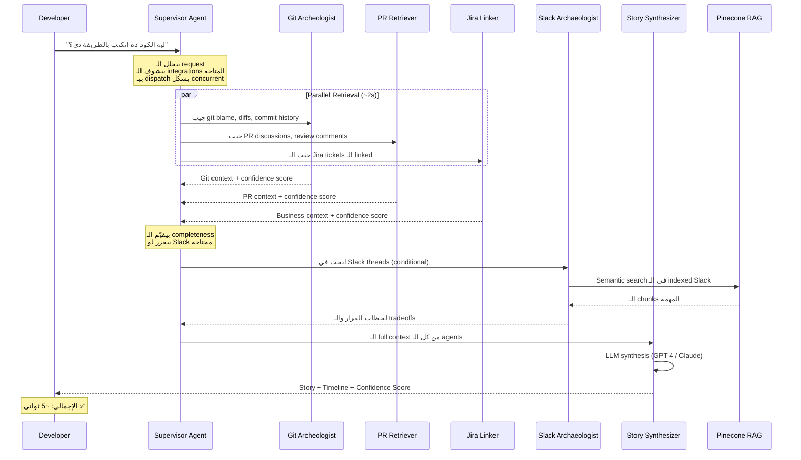

### الـ 6 Agents — مسؤوليات كل واحد

| # | الـ Agent | الدور | الـ Tools | لو فشل |
|---|---|---|---|---|
| 0 | **Supervisor** | بيـ orchestrate كل حاجة، بيقرر الـ parallelism، بيتعامل مع الـ failures | LangGraph state machine | Graceful degradation — بيـ skip الـ agents الفاشلة |
| 1 | **Git Archeologist** | `git blame`، `git log`، `git diff`، تحليل الـ commit messages | GitHub API, local git | يـ fallback للـ local git |
| 2 | **PR Context Retriever** | جلب نقاشات الـ PR، تعليقات الـ code review، نقاشات الـ team | GitHub REST API | يـ skip لو مفيش PR مرتبط |
| 3 | **Issue Tracker Linker** | ربط الكود بالـ business context عبر Jira/Linear | Jira REST API | بيقول "no business context" |
| 4 | **Slack Archaeologist** | البحث في الـ threads عن لحظات القرار | Slack API xoxp- token | بيـ skip لو مش connected |
| 5 | **Story Synthesizer** | بيجمع كل الـ context في narrative، بيكشف الـ technical debt | GPT-4 + Claude 3.5 Sonnet | مينفعش يفشل — عنده كل الـ weights |

### منطق القرار بتاع الـ Supervisor

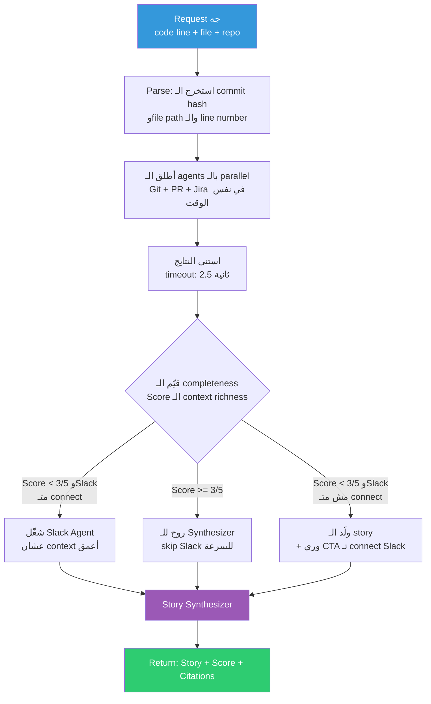

---

## الـ RAG Pipeline — Hybrid Retrieval

### إيه اللي بنـ index؟

| الـ Data Source | استراتيجية الـ Chunking | الـ Metadata Tags |
|---|---|---|
| Git commit messages | chunk واحد لكل commit | author, date, files_changed, hash |
| PR discussions | chunk واحد لكل thread | pr_id, participants, decision_outcome |
| Jira tickets + comments | chunk واحد لكل ticket | ticket_id, priority, linked_commits |
| Slack threads | chunk واحد لكل thread | channel, participants, timestamp |
| Code comments + docstrings | chunk واحد لكل function | file, line_range, author |

### الـ Hybrid Retrieval Pipeline

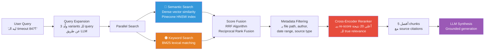

### الـ RAG Quality Metrics (RAGAS)

| الـ Metric | الـ Target | بيقيس إيه |
|---|---|---|
| **Context Precision** | > 80% | الـ chunks المستردة relevant فعلاً؟ |
| **Context Recall** | > 85% | فاتنا context مهم؟ |
| **Faithfulness** | > 90% | الـ story مبنية على sources حقيقية؟ |
| **Answer Relevancy** | > 85% | الـ story بتجاوب "WHY" تحديداً؟ |
| **Citation Accuracy** | 100% | كل claim ليه source حقيقي |

---

## مشكلة الـ Cold Start — محلولة

### المشكلة

DevArcheology بتولد stories غنية بس على repos فيها:
- commits كتير بـ messages مفيدة
- PRs مربوطة بنقاشات حقيقية
- Jira/Slack متـ connect

**يحصل إيه لما user جديد يفتح repo مفيهوش تاريخ؟**

### الحل بـ 3 Layers

#### Layer 1 — Demo Mode: Repos مـ index مسبقاً

بنـ ship من أول يوم بـ 3 repos **متـ index وجاهزة:**

| الـ Repo | ليه هي perfect |
|---|---|
| `microsoft/vscode` | 100K+ commit، قرارات مشهورة، PR history غني |
| `facebook/react` | قرار الـ Hooks (2018) — PR فيه 1,000+ comment. أشهر "WHY story" في الـ open source |
| `calcom/cal.com` | Full-stack حديث، نقاشات active، Linear tickets |

**Demo script:** الـ evaluator يفتح الـ Web Portal ← يضغط "Explore React" ← يـ hover على الـ commit اللي جاب الـ Hooks ← يشوف قصة كاملة من 5 sources في 5 ثواني. **Zero setup. Zero permissions. Maximum wow.**

#### Layer 2 — Story Richness Score (الـ Upgrade Funnel بتاعك)

```
┌─────────────────────────────────────────────────────┐
│  📊 Context Richness لـ الـ commit ده: 3/5           │
│                                                      │
│  ✅ Git Blame & Diff        — تاريخ كامل            │
│  ✅ PR Discussion           — 12 تعليق review       │
│  ✅ Code Comments           — 2 docstrings مهمة     │
│  ⚠️  Jira Ticket            — مش مربوط              │
│  ❌ Slack Threads           — مش متـ connect         │
│                                                      │
│  Story Confidence: MEDIUM                            │
│  ────────────────────────────────────────────────── │
│  🔗 وصّل Jira عشان تفهم الـ business context →     │
│  💬 وصّل Slack عشان تعرف لحظات القرار →            │
└─────────────────────────────────────────────────────┘
```

كل source ناقص = CTA تـ connect. **الـ cold start بقى الـ onboarding funnel.**

#### Layer 3 — Minimum Viable Story (Git فقط)

حتى لو في 50 commit وزيرو integrations، الـ Git لوحده بيدينا:
- **WHO** بنى ده (author pattern analysis)
- **WHEN** وفي إيه context (proximity للـ releases)
- **WHAT** مشكلة كانت موجودة (nearby commits context)
- **HOW** اتطور (diff analysis)

الـ framing: *"بناءً على الـ Git history فقط — وصّل Jira وSlack لتكملة القصة."*

---

## مشكلة الـ Slack Permissions — محلولة

### الأسطورة اللي كنت مصدّقها

> ❌ "محتاج Workspace Admin permissions عشان تقرا Slack messages."

### الحقيقة

Slack عنده نوعين tokens:
- **Bot Tokens (`xoxb-`)** — app-level، محتاج admin installation ← ده اللي كنت بتفكر فيه
- **User Tokens (`xoxp-`)** ← **ده اللي إحنا بنستخدمه فعلاً**

### حل الـ xoxp-

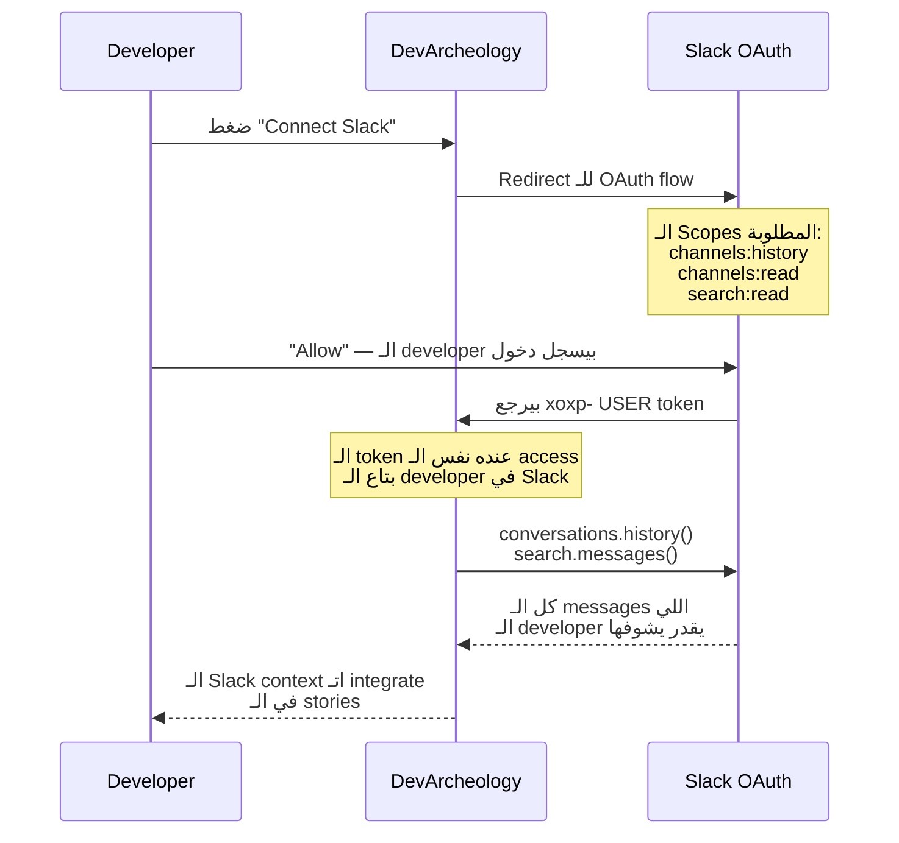

**الـ key insight:** الـ user token شايل بالظبط نفس الصلاحيات اللي الـ user عنده. لو تقدر تشوف channel في Slack، الـ DevArcheology token يقدر يقراه. **Zero admin approval. Zero IT department. Zero enterprise sales cycle.**

**Onboarding copy:** *"سجّل دخول بـ Slack — إحنا بنقرا بس الـ messages اللي انت شايفها أصلاً."*

**Privacy model:** كل developer الـ stories بتاعته مبنية على **view بتاعه** في Slack — ده feature مش bug. سمّيه **"Your Context View"** في الـ UI.

---

## VS Code Extension — السلاح اليومي

### رحلة الـ User

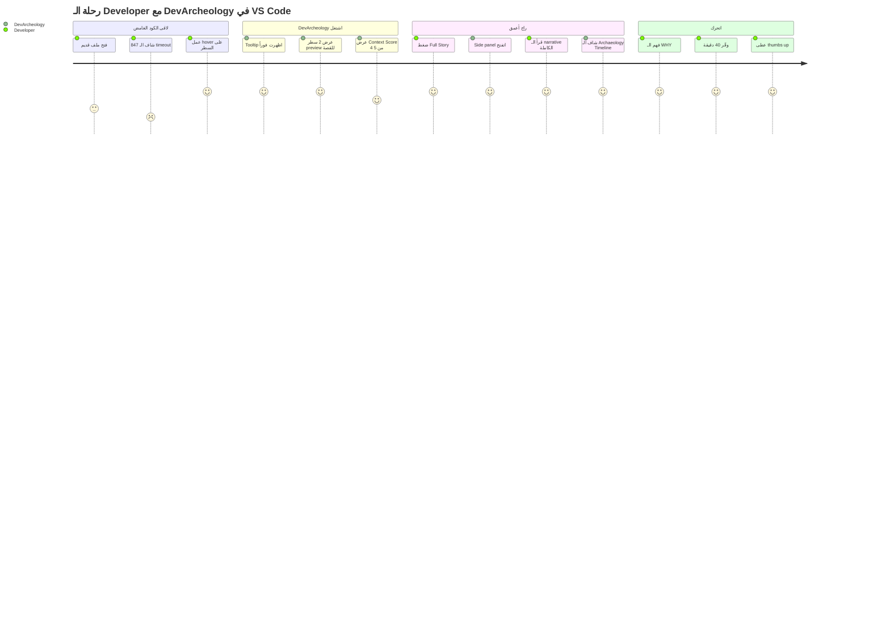

### Extension Features

| الـ Feature | الوصف | الأولوية |
|---|---|---|
| **Inline Hover Tooltip** | 2-سطر story preview + context score عند الـ hover | P0 — Week 1 |
| **Full Story Panel** | الـ narrative كاملة مع كل الـ sources والـ citations | P0 — Week 2 |
| **Archaeology Timeline** | Interactive timeline visualization | P1 — Week 3 |
| **Context Score Badge** | Visual indicator للـ story richness في الـ gutter | P1 — Week 3 |
| **Connect Integrations** | OAuth flows للـ Jira/Slack من جوا الـ extension | P1 — Week 3 |
| **Arabic Mode Toggle** | تحويل الـ story للعربي بضغطة | P2 — Week 4 |

---

## Web Admin Portal — عقل الـ Team

### Surface مختلفة، User مختلف

| الـ Surface | الـ Primary User | السؤال اللي بيجاوبه |
|---|---|---|
| VS Code Extension | Individual developer | "أنا بقرا الكود ده دلوقتي — ليه هو كده؟" |
| Web Admin Portal | Engineering manager / Tech lead | "الـ senior dev بتاعنا راح — إيه القرارات اللي اتخدت؟ إيه الـ technical debt؟" |

### Portal Features

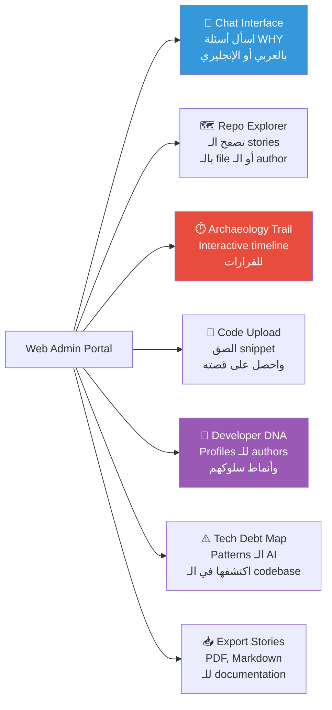

### ليه الـ Portal مهم للـ Evaluation

**الحقيقة المرة:** مش كل evaluator هيثبّت VS Code extension في 10 دقايق demo. كل evaluator هيضغط على رابط browser. الـ Web Portal **هو الـ evaluation surface الحقيقي.** ابنيه الأول. الـ extension هو السلاح اليومي. الـ portal هو الـ demo.

---

## The Archaeology Trail — لحظة الـ WOW

### إيه هو بالظبط

**خط زمني تفاعلي** — الـ visual اللي محدش عمله قبل كده في أي tool في الـ market.

```
━━━━━━━━━━━━━━━━━━━━━━━━━━━━━━━━━━━━━━━━━━━━━━━━━━━━━
ليه PAYMENT_RETRY_TIMEOUT = 847؟
━━━━━━━━━━━━━━━━━━━━━━━━━━━━━━━━━━━━━━━━━━━━━━━━━━━━━

 يناير 2023            مارس 2023             أغسطس 2023
    │                     │                     │
 [🎫 JIRA-441]        [💬 PR #892]          [📝 COMMIT a3f7c]
 "Payments بتـ timeout  "نقاش ساخن: 1000ms   "غيّرناه لـ 847ms —
  تحت الـ load"          ولا 500ms. 23 comment  النتيجة المثالية
  P0 incident            سارة: 'اخفّض'         من الـ load tests"
  5 بلاغات              أحمد: 'خطر أوي'
    │                     │                     │
    └─────────────────────┴─────────────────────┘
                           │
               [💬 SLACK #backend-eng]
               سارة بعد 3 شهور:
               "الـ 847 جاي من الـ p95
                latency في أسوأ يوم.
                DON'T CHANGE IT."

STORY CONFIDENCE: 5/5  ████████████████████ عالية
TECHNICAL DEBT FLAG: ⚠️ Magic number — فكّر تحطه في config
━━━━━━━━━━━━━━━━━━━━━━━━━━━━━━━━━━━━━━━━━━━━━━━━━━━━━
```

### الـ Implementation

- **Frontend:** D3.js timeline في الـ Web Portal، SVG مبسّط في الـ VS Code sidebar
- **Data:** كل event node بيـ link للـ source الأصلي (اضغط ← يفتح الـ PR/Jira/Slack الحقيقي)
- **Interaction:** Hover بيعرض الـ quote الكامل، click بيفتح الـ source document
- **Export:** تنزيل كـ PNG أو embed في الـ documentation

**ده هو الـ 60-second wow moment بتاعك.** محدش في الـ class عنده ده. محدش في الـ market عنده ده.

---

## Developer DNA Profiles — القنبلة الـ Enterprise

### إيه هو بالظبط

بعد تحليل commits وPR reviews كتير لنفس الـ author، DevArcheology بيولد **behavioral profiles** تلقائياً.

### مثال على Profile

```
┌─────────────────────────────────────────────────────┐
│  🧬 Developer DNA: سارة أحمد                         │
│  تم التحليل: 847 commit، 234 PR review              │
│                                                      │
│  خريطة الخبرة                                       │
│  ████████████████░░  Auth/Security (89%)            │
│  ████████████░░░░░░  Payment Systems (67%)          │
│  ████░░░░░░░░░░░░░░  Frontend (23%)                 │
│                                                      │
│  أنماط القرار                                        │
│  • بتـ over-engineer حدود الـ auth                  │
│  • اقترحت 3 تبسيطات اتـ overrule بسبب deadlines    │
│  • كودها أكتر comment بـ 40% من متوسط الـ team     │
│  • بتفضّل الـ explicit error handling               │
│                                                      │
│  تركيز المعرفة                                       │
│  ⚠️  SILO RISK: الـ author الوحيدة في payment-gateway/*│
│     آخر تعديل: 8 شهور                              │
│     الـ context البديل: ضعيف جداً                   │
│                                                      │
│  قيمة الـ Onboarding                                │
│  "اقرأ PRs سارة من يناير–مارس 2023 عشان تفهم      │
│   ليه الـ auth system بنيته كده."                  │
└─────────────────────────────────────────────────────┘
```

### ليه ده Gold-Tier Feature

محدش في الـ market بيعمل ده. GitLens بيوريك *مين* كتب الكود. DevArcheology بيقولك *إيه نوع الـ developer* اللي كتبه و*إيه الـ tradeoffs* اللي كان بيعمل.

**الـ Enterprise value propositions:**
- Developers جدد بيتـ onboard أسرع بـ 3x
- Tech leads بيكتشفوا الـ knowledge silos قبل ما تبقى crisis
- Engineering managers عندهم attribution موضوعي للـ technical debt
- لما developer بيمشي، الـ knowledge transfer report بيتولد تلقائياً

---

## Tech Stack — الـ Hybrid Architecture

### المشكلة مع Pure Python

الـ team بتاعك شاطرة في Node.js. Python + FastAPI + LangGraph هو الاختيار الأفضل للـ AI layer. لكن لو كل حاجة بالـ Python = bugs في Week 2 مش هتقدر تـ debug.

### الحل — Microservice Split واضح

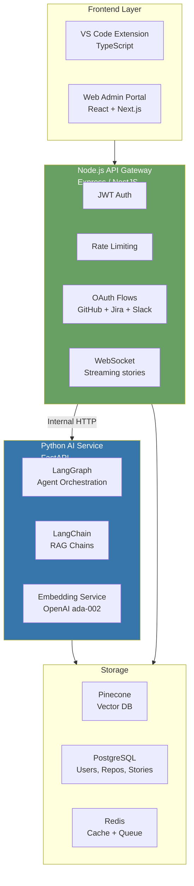

### خريطة ملكية الـ Team

| الـ Service | اللغة | مين بيـ own |
|---|---|---|
| VS Code Extension | TypeScript | الـ Frontend dev |
| Web Portal | React/Next.js | الـ Frontend dev |
| API Gateway | Node.js/Express | الـ Node.js devs ← قوتك |
| OAuth flows | Node.js | نفس الـ Node.js dev |
| AI Agent Service | Python/FastAPI | عضو أو اتنين بيتعلموا LangGraph |
| RAG Pipeline | Python | نفس الـ AI members |
| Pinecone integration | Python | نفس الـ AI members |
| PostgreSQL schema | SQL | أي backend dev |

**القاعدة:** لو الـ Python service اتعطل في Week 3، الـ Node.js gateway لسه شغال. الـ users بياخدوا "Story generation temporarily unavailable" بدل crash. **Microservice boundary = resilience + team ownership واضح.**

---

## Security — OWASP LLM Top 10

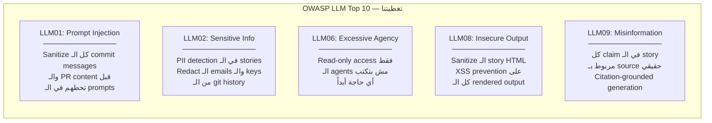

### القرارات الأمنية المهمة

| القرار | الـ Implementation | الـ Why |
|---|---|---|
| **Repo access scope** | بس الـ repos اللي الـ user عنده access ليها | مفيش user يقدر يوصل لـ data مش بتاعته |
| **Slack scope** | xoxp- user token — بس اللي الـ user شايفه أصلاً | لا privilege escalation |
| **No code execution** | الـ agents read-only خالص. لا `eval()`، لا shell commands | بيمنع الـ malicious commit message attacks |
| **Rate limiting** | 20 story/ساعة للـ user، 100 API call/ساعة | cost control + منع الـ abuse |
| **PII detection** | Scan الـ output عن emails وphone numbers وAPI keys قبل العرض | منع تسريب بيانات حساسة من commits قديمة |

---

## Observability والـ Evaluation

### LangSmith Integration

كل action للـ agent، كل retrieval، كل LLM call بيتـ trace بالكامل من أول يوم.

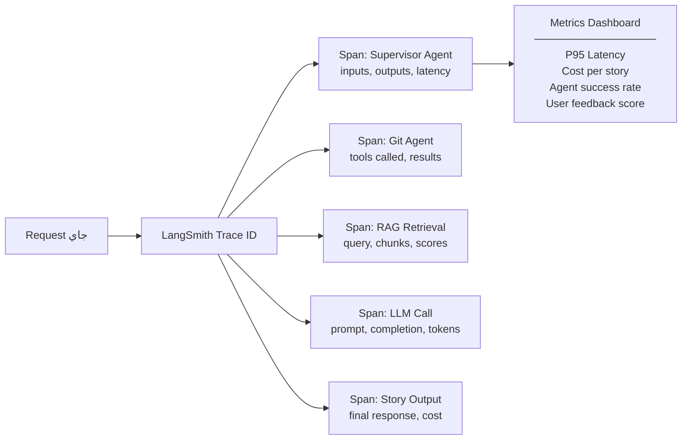

### حلقة الـ Continuous Improvement

```
Stories في الـ Production
       ↓
User يدي 👎 (thumbs down)
       ↓
Story متـ flag ← تـ evaluation queue
       ↓
الـ team بيراجع: الـ retrieval كان وحش ولا الـ synthesis؟
       ↓
Fix الـ prompt / الـ chunking / الـ reranker
       ↓
Regression test على golden dataset (50+ story مع ground truth)
       ↓
Deploy الـ version المحسّن
       ↓
قيّس: الـ thumbs-up rate اتحسن؟
```

---

## Business Model والـ Monetization

### الـ Pricing Tiers

| الـ Tier | السعر | إيه بتاخد |
|---|---|---|
| **Free** | $0/شهر | 10 stories/شهر، Git + GitHub فقط، الـ demo repos |
| **Developer** | $15/شهر | Stories unlimited، + Jira، Archaeology Trail |
| **Team** | $49/شهر لـ 5 devs | + Slack، Developer DNA، Tech Debt Map |
| **Enterprise** | Custom | On-premise، private LLM، SSO، SLA |

### الـ Sponsor Pitch (للـ Job Fair)

> *"DevArcheology بتوفّر على الـ senior engineers بتاعك 30 دقيقة كل مرة يلمسوا legacy code.*
>
> *5 senior engineers × 3 investigations يومياً × $50/ساعة = **$5,250 وفر في الشهر لكل team.**
>
> *الـ Team plan بتاعنا بـ $49/شهر. ده **ROI بـ 107x** من الشهر الأول."*

---

## تغطية الـ ITI Checklist

| Section في الـ Checklist | الـ Requirement | الـ Implementation | الـ Tier |
|---|---|---|---|
| **LLM Integration** | Primary LLM + fallback | GPT-4 synthesis + Claude 3.5 Sonnet + Gemini fallback | ✅ Gold |
| **LLM Advanced** | Function calling + Streaming | Agent tool calls + streaming story output | ✅ Gold |
| **RAG — Sources** | Multi-format | Git, PRs, Jira, Slack, code comments | ✅ Gold |
| **RAG — Chunking** | Semantic chunking + overlap | Per-commit، per-thread مع metadata | ✅ Gold |
| **RAG — Retrieval** | Hybrid search (min 2) | Semantic + BM25 + reranking | ✅ Gold |
| **RAG — Advanced** | Min 1 advanced feature | Multi-query RAG (3 query variants) | ✅ Gold |
| **Agents — Foundation** | Clear architecture | LangGraph ReAct مع state machine | ✅ Gold |
| **Agents — Tools** | Min 3 tools | git_blame, github_api, jira_api, slack_api, pinecone_search | ✅ Gold |
| **Agents — Multi** | 3+ agents coordinated | 6 agents: Supervisor + 4 parallel + Synthesizer | ✅ Gold |
| **Agents — Advanced** | Min 2 features | Human-in-loop + Agent self-reflection | ✅ Gold |
| **Multimodal** | Min 2 | Code diff visualization + Archaeology Trail + Code snippet upload | ✅ Gold |
| **Security** | OWASP LLM Top 10 | Prompt injection، PII، rate limiting، read-only agents | ✅ Gold |
| **Observability** | LLM platform | LangSmith full tracing + RAGAS evaluation | ✅ Gold |
| **UX** | Chat + Streaming + Citations | Web Portal chat + real-time streaming + citation bubbles | ✅ Gold |
| **Arabic** | Bilingual support | One-click Arabic mode، code-switching stories، RTL UI | ✅ Gold |
| **Cost Optimization** | Caching + budgets | Redis cache، cost dashboard، $0.10/story target | ✅ Gold |
| **Testing** | 60% coverage + LLM tests | 50+ golden stories، RAGAS metrics، adversarial tests | ✅ Gold |
| **Deployment** | Cloud + CI/CD | Railway/Render + GitHub Actions | ✅ Gold |

---

## Team Structure

| العضو | الدور | الـ Ownership |
|---|---|---|
| **محمد (أنت)** | Tech Lead + AI Engineer | LangGraph orchestration، agent design، architecture decisions |
| **العضو 2** | Backend Engineer | Node.js API Gateway، OAuth flows، PostgreSQL |
| **العضو 3** | AI/RAG Engineer | Python FastAPI، Pinecone، RAG pipeline، embeddings |
| **العضو 4** | Frontend Engineer | Web Admin Portal، React، Archaeology Trail (D3.js) |
| **العضو 5** | VS Code Extension | TypeScript extension، hover UI، sidebar |
| **العضو 6** | QA + Observability | LangSmith، RAGAS eval، testing suite، security |

---

## الـ 4-Week Timeline

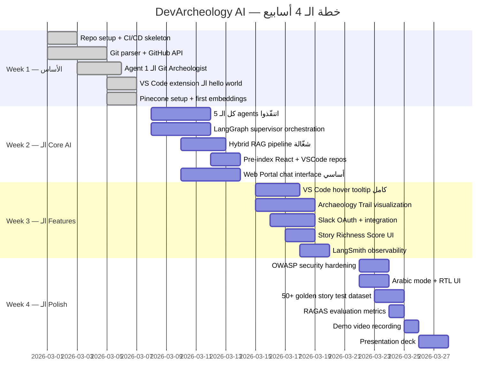

---

## الـ KPIs والـ Success Metrics

### Technical KPIs

| الـ Metric | الـ Target | بنقيسه إزاي |
|---|---|---|
| Story Generation Time (P95) | **< 5 ثواني** | LangSmith latency traces |
| Story Generation Time (P50) | **< 3 ثواني** | LangSmith latency traces |
| Agent Success Rate | **> 95%** | LangSmith error tracking |
| Cost per Story | **< $0.10** | LangSmith token cost attribution |
| Uptime وقت الـ Evaluation | **99%+** | UptimeRobot monitoring |
| Test Coverage | **> 60%** | Jest + pytest coverage |

### AI Quality KPIs

| الـ Metric | الـ Target | بيقيس إيه |
|---|---|---|
| Faithfulness | **> 90%** | الـ stories مبنية على sources حقيقية |
| Context Precision | **> 80%** | الـ chunks المستردة relevant |
| Answer Relevancy | **> 85%** | الـ story بتجاوب WHY تحديداً |
| Citation Accuracy | **100%** | كل claim ليه source حقيقي |

### UX KPIs

| الـ Metric | الـ Target |
|---|---|
| Thumbs Up Rate | **> 70%** |
| User Return Rate | **> 40% weekly** |
| وقت قراءة الـ Story | **> دقيقتين** (علامة engagement) |
| Integrations متـ connect لكل user | **> 2** (GitHub + Jira/Slack) |

---

## الـ 60-Second Wow Moment

### الـ Demo Script — احفظه كلمة كلمة

**الـ Setup:** الـ Web Portal مفتوح. الـ React repo متـ index مسبقاً.

> *"كل developer شاف اللحظة دي. بتفتح كود قديم وتلاقي حاجة زي دي:"*

```javascript
// DO NOT CHANGE THIS VALUE
const PAYMENT_RETRY_TIMEOUT = 847;
```

> *"847. مش 1000. مش 500. 847. ليه؟ كل أداة بتعرفها — GitLens، Copilot، CodeRabbit — مش هتقدر تجاوبك. أنا هجاوبك في 5 ثواني."*

[بيكتب في الـ Web Portal chat: *"ليه الـ payment retry timeout 847؟"*]

[الـ story بتـ stream في real-time — 5 ثواني]

> *"إيه اللي حصل: في يناير 2023، كان في P0 incident — payments بتـ timeout تحت الـ load. الـ team فتح PR #892. كان في 23 comment في الـ review. سارة قالت نخفّض عن 1000ms. أحمد قال ده خطر. عملوا load tests. الـ p95 latency في أسوأ يوم في الـ production كان 847ms. الرقم ده مش magic — هو قياس حقيقي. وبعد 3 شهور من الـ PR، سارة كتبت في Slack: 'الـ 847 جاي من الـ p95 latency في أسوأ يوم. DON'T CHANGE IT.' الـ message دي كانت مدفونة في Slack channel. اللي كتبها راح من 8 شهور. DevArcheology لاقاها في 4.3 ثانية."*

[بيضغط "View Archaeology Trail" — الـ timeline بيتعمل]

> *"ده biography بتاع قرار. مفيش أداة تانية في العالم كله بتوريك ده."*

**الوقت الكلي: 60 ثانية. الـ wow: maximum.**

---

## زيتونة الإنترفيو 🫒

*الإجابات اللي بتكسب بيها أي defense room.*

---

**سؤال: إيه هو DevArcheology AI في جملة واحدة؟**
> "DevArcheology هو أول institutional memory system للـ software teams — بيجمع Git وPRs وJira وSlack في narrative في 5 ثواني بتجاوب على السؤال اللي كل developer بيسأله ومفيش أداة بتجاوبه: ليه الكود ده اتكتب بالطريقة دي؟"

---

**سؤال: مين المنافسين بتوعك؟**
> "GitLens بيوري WHO وWHEN. CodeRabbit بيراجع الكود قبل الـ merge. Sourcegraph بيبحث في الـ code structure. محدش فيهم بيجاوب WHY — ومحدش بيشتغل على كود موجود أصلاً في الـ production. مفيش منافس مباشر."

---

**سؤال: إيه الفرق بينك وبين CodeRabbit؟**
> "CodeRabbit بيتولد لما الـ PR يتفتح ويموت لما يتـ merge. DevArcheology بيتولد يوم ما developer جديد يورث كود اتكتب من سنتين من حد راح من الشركة. أداة مختلفة، لحظة مختلفة، user مختلف، سؤال مختلف."

---

**سؤال: إيه حجم الـ market؟**
> "الـ AI Code Tools market بـ $7.37 مليار في 2025، بيوصل لـ $23.97 مليار في 2030 بـ CAGR 26.6%. إحنا شغالين في الـ Developer Intelligence sub-segment، والـ niche بتاعنا — institutional memory — مفيهوش players راسخين."

---

**سؤال: إيه بيحصل على repo مفيهوش history؟**
> "3 حاجات: أولاً — بنـ ship مع 3 repos مشهورة متـ index مسبقاً عشان تجربة Demo كاملة من أول يوم. تانياً — بنعرض Story Richness Score بيقولك بصدق إيه الـ context اللي عندنا وإيه الناقص. تالتاً — حتى بالـ Git data بس، بنولد minimum viable story ونستخدم كل source ناقص كـ CTA تـ connect أكتر."

---

**سؤال: محتاجين Slack admin permissions — ده بيتحل إزاي؟**
> "إحنا بنستخدم OAuth user tokens، مش bot tokens. الـ user token شايل نفس الـ Slack access اللي الـ developer عنده. Zero admin approval. Zero IT department. الـ developer بيـ connect Slack في 30 ثانية وإحنا بنقرا كل channel هو شايفه أصلاً."

---

**سؤال: إيه الـ business model؟**
> "Freemium self-serve. 10 stories مجاناً لاكتساب الـ users. $15/شهر للـ individual developer. $49/شهر لـ teams من 5. الـ ROI argument: team من 5 senior devs بتوفر 30 دقيقة لكل investigation، 3 investigations يومياً، بـ $50/ساعة — ده $5,250 وفر في الشهر مقابل $49. ROI بـ 107x."

---

**سؤال: ليه مشروعك أحسن من مشاريع زملائك؟**
> "3 أسباب. أول حاجة — أنا الـ project الوحيد في الـ class في الـ category بتاعه. 5 teams عملوا education AI. أنا بملك developer institutional memory لوحدي. تاني حاجة — الـ market بتاعي international. أي software team على GitHub في أي بلد هو customer بتاعي. تالت حاجة — الـ demo بتاعي live وقابل للقياس. بجاوب سؤال محدد بإجابة محددة في 5 ثواني. ده مش theoretical."

---

**سؤال: إيه اللي هتبنيه بعد الـ MVP؟**
> "3 حاجات بالأولوية. Developer DNA Profiles — behavioral patterns بتتـ extract تلقائياً من الـ commit history لتسريع الـ onboarding. Graph RAG — تمثيل العلاقات بين القرارات كـ knowledge graph مش بس document chunks. وEnterprise on-premise option للشركات المالية والـ healthcare اللي مش تقدر ترسل كودها لـ external APIs."

---

**الجملة الأخيرة اللي تختم بيها أي presentation:**

> *"الكود دايماً عنده حكاية. DevArcheology بيضمن إنها متتضيعش."* 🏛️

---

> **آخر تحديث:** مارس 2026 | **Status:** Defense-Ready
> **Tags:** #capstone #DevArcheology #AI #LangGraph #RAG #MultiAgent #ITI #عربي
