# 🏛️ DevArcheology AI — The Complete Master Reference

> *"Every line of code has a story. We help developers understand the WHY, not just the WHAT."*

**Version:** Defense-Ready Build | March 2026
**Track:** ITI Open Source Applications Development — Gen-AI Capstone
**Status:** 🟢 Gold Tier Target (99/100)

---

## 🗺️ Table of Contents

1. [[#The Story — Why This Exists]]
2. [[#Business Domain & Market Intelligence]]
3. [[#The Killer Question — Positioning vs Competitors]]
4. [[#Competitive Landscape — The Real Map]]
5. [[#Solution Architecture — The Full System]]
6. [[#The 6-Agent Orchestration Engine]]
7. [[#RAG Implementation — Hybrid Retrieval]]
8. [[#The Cold Start Problem — Solved]]
9. [[#The Slack Problem — Solved]]
10. [[#VS Code Extension — The Daily Driver]]
11. [[#Web Admin Portal — The Team Brain]]
12. [[#The Archaeology Trail — The Wow Moment]]
13. [[#Developer DNA Profiles — The Enterprise Killer]]
14. [[#Tech Stack — Hybrid Architecture]]
15. [[#Security — OWASP LLM Top 10]]
16. [[#Observability & Evaluation]]
17. [[#Business Model & Monetization]]
18. [[#ITI Checklist Coverage Map]]
19. [[#Team Structure & Ownership]]
20. [[#4-Week Execution Timeline]]
21. [[#Success Metrics & KPIs]]
22. [[#The 60-Second Wow Moment]]
23. [[#Interview Zitona 🫒]]

---

## The Story — Why This Exists

### The Scene

Ahmed joins a fintech company as a backend developer. Day 3. He opens the payment processing module and finds this:

```javascript
// DO NOT CHANGE THIS TIMEOUT VALUE
const PAYMENT_RETRY_TIMEOUT = 847;
```

`847`? Not `1000`. Not `500`. `847`.

Ahmed spends **4 hours** trying to understand why. He runs `git blame`. He finds the commit. The message says: *"fix timeout issue"*. He searches Jira. The ticket is closed with no description. He asks the senior dev. The senior dev who wrote it left 8 months ago.

**The knowledge is gone. The WHY is dead.**

This happens **35% of a developer's working life** — time spent understanding existing code instead of writing new features. That's 14 hours of a 40-hour week, per developer, across every software team on earth.

### The Problem Statement

```
THE CONTEXT GAP
───────────────
WHAT changed  →  git blame, git log .............. ✅ SOLVED (GitLens)
WHEN changed  →  commit timestamps ............... ✅ SOLVED (GitLens)
WHO changed   →  author metadata ................. ✅ SOLVED (GitLens)

WHY it changed →  ???????????????? .............. ❌ UNSOLVED
WHY like that →  ???????????????? .............. ❌ UNSOLVED
WHY still here →  ???????????????? .............. ❌ UNSOLVED
```

The WHY lives scattered across **5 different tools** that never talk to each other:

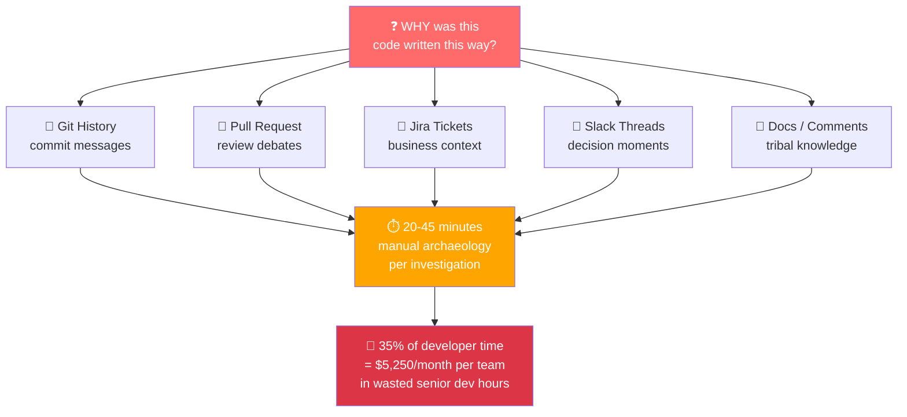

### The Vision

> DevArcheology AI is the **institutional memory layer** for software teams. It synthesizes Git, PRs, Jira, and Slack into a **5-second narrative** that answers the question no tool answers: **WHY**.

---

## Business Domain & Market Intelligence

### Where We Sit in the Market

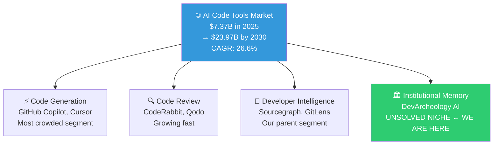

### Market Numbers to Memorize

| Stat | Number | Source |
|---|---|---|
| AI Code Tools Market 2025 | **$7.37 Billion** | Market Research |
| Projected 2030 | **$23.97 Billion** | CAGR 26.6% |
| Devs using AI tools daily | **97% of enterprise devs** | Industry surveys |
| Developer time on understanding code | **35% of working hours** | Stack Overflow surveys |
| Time saved per AI tool adoption | **30% reduction** in task resolution | Industry benchmark |
| Developers who distrust AI accuracy | **46% vs 33% who trust it** | Key insight: accuracy = product |
| On-premise AI deployment growth | **28.7% CAGR** | Enterprise segment |

### The Three Market Signals

**Signal 1 — Adoption is universal, trust is the problem.**
46% of developers *distrust* AI tool accuracy vs only 33% who trust it. Your target user (senior devs on legacy codebases) is already skeptical. This means: your citation linking and source transparency is not a nice-to-have. **It IS the product.**

**Signal 2 — The "understanding" problem is explicitly unsolved.**
No tool in the market today specifically addresses the "WHY was this written?" question at scale. The whitespace is real and proven by the market.

**Signal 3 — Sourcegraph just retreated from the mid-market.**
As of July 2025, Sourcegraph discontinued Cody Free and Cody Pro. They pivoted to Enterprise-only. The developer who used Cody Free for codebase understanding **has no replacement**. That gap opened 8 months ago. **We walk into it.**

---

## The Killer Question — Positioning vs Competitors

### The Question That Froze You

> *"What's the difference between DevArcheology and CodeRabbit and any AI code reviewer?"*

You froze because you were thinking about **features**. Your supervisor was asking about **product category**. Never confuse these two again.

### The Answer — The Timeline

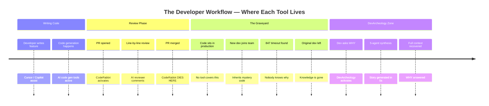

### The Script — Memorize Every Word

**When they ask:** *"What's the difference between you and CodeRabbit?"*

**You say:**

> *"CodeRabbit and all AI code reviewers are **forward-looking** tools. They answer: 'Should we merge this?' They activate when a PR opens and they die when it merges.*
>
> *DevArcheology is a **backward-looking** tool. It answers: 'Why was this merged 2 years ago?' It activates when a new developer inherits old code and needs to understand a decision made by someone who no longer works at the company.*
>
> *The right analogy: CodeRabbit is a **building inspector** reviewing a house before you move in. DevArcheology is the **historian** you call 10 years later when you find a strange wall and need to know if removing it will collapse the building."*

### The Three Proof Points

| Proof Point | The Fact |
|---|---|
| **Different data sources** | CodeRabbit reads your new diff. DevArcheology reads entire Git history + closed PRs + archived Jira tickets + 18-month-old Slack threads. CodeRabbit cannot access any of this. |
| **Different user, different moment** | CodeRabbit user = developer who wrote the code, before merge. DevArcheology user = developer who inherited the code, 6 months after the original author left. |
| **CodeRabbit creates the problem we solve** | Every clever decision CodeRabbit approves becomes invisible after merge. DevArcheology recovers exactly those decisions 2 years later. **They don't compete — CodeRabbit feeds our RAG corpus.** |

### The One-Line Killer

> *"Show me how CodeRabbit explains a commit from 2 years ago written by a developer who left the company — and I'll shut down DevArcheology today."*

---

## Competitive Landscape — The Real Map

### The Full Competitor Matrix

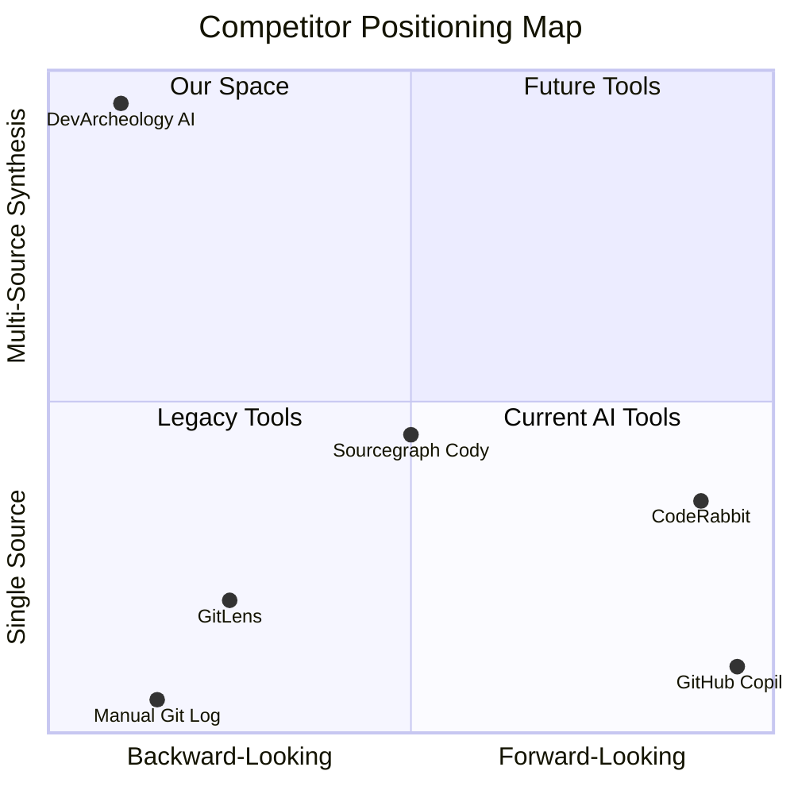

### Tier 1 — Direct Competitors (Head-to-Head)

#### GitLens by GitKraken

**What they do:** Git history visualization inside VS Code. Blame annotations, commit graphs, file history, PR integration.

**What they added recently:** AI-powered commit explanations, changelog generation, Jira Cloud + Trello integration, MCP (Model Context Protocol) support.

**Their gap — your entrance:**
- GitLens shows you the **tombstone** of the code (WHO, WHEN, WHAT)
- DevArcheology tells you the **biography** (WHY, in a synthesized story)
- GitLens stops at metadata. We start where metadata ends.

**When asked about GitLens:**
> *"GitLens is actually a data source for DevArcheology, not a competitor. We consume their Git data and add 4 more layers of context on top."*

---

#### CodeRabbit

**What they do:** AI code review on every PR. Line-by-line comments, bug detection, PR summaries.

**Scale:** 2 million+ repositories, 13 million+ PRs processed, 9,000+ organizations.

**Their pricing:** $12–24/month per user.

**Their key feature:** Codebase-awareness — pulls context from across files.

**The critical insight:**
- CodeRabbit = **prospective** (reviews code before it enters production)
- DevArcheology = **retrospective** (explains code already in production)
- **Different workflow moment. Not competitors.**

---

#### Sourcegraph / Cody

**What they do:** Whole-codebase code search, AI chat with codebase context, autocomplete.

**Plot twist — July 2025:** Sourcegraph **discontinued** Cody Free and Cody Pro. Pivoted to Enterprise-only. Launched "Amp" for individual developers separately.

**What this means for us:** The mid-market they abandoned = our entry point. Developers who relied on Cody Free for codebase understanding have no replacement. **We walk into the gap.**

---

### Tier 2 — Adjacent (Same Budget, Different Use Case)

| Tool | What They Do | Our Relationship |
|---|---|---|
| **GitHub Copilot** | Code generation, 20M+ users | Zero institutional memory. We're complementary. |
| **Greptile** | AI reviews with full codebase context | Newer, well-funded. Watch this space. |
| **Qodo** | Code integrity, test generation | Different niche entirely. |
| **Linear + Jira AI** | Issue tracking with AI summaries | We consume them. We don't compete. |

---

### The Invisible Competitor — The Most Dangerous One

**The developer's brain + Slack search + manual git log.**

This is what developers actually do today:
1. Run `git blame` → get author + commit hash (2 min)
2. Open PR manually → read 47 comments (10 min)
3. Search Slack for ticket number → find thread (8 min)
4. Ask senior dev who wrote it → they left 8 months ago (∞ min)

**Total: 20–45 minutes per investigation, per commit, per developer.**

DevArcheology does this in **5 seconds**. That's your core value proposition expressed in time saved.

---

### When Your Supervisor Asks About Each Competitor

| If they mention... | You say... |
|---|---|
| **GitLens** | "Complementary data source. They show WHO and WHEN. We synthesize WHY." |
| **CodeRabbit** | "Different workflow moment entirely. They die when the PR closes. We activate after." |
| **Sourcegraph** | "They just abandoned the mid-market in July 2025. We walk into their gap." |
| **GitHub Copilot** | "Code generation, not code understanding. Zero institutional memory." |
| **"Any AI reviewer"** | "AI reviewers are forward-looking. We are backward-looking. Ask any of them to explain a 2-year-old commit by a developer who left. They can't." |

---

## Solution Architecture — The Full System

### The 30,000-Foot View

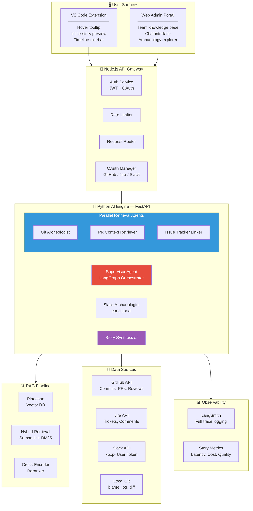

---

## The 6-Agent Orchestration Engine

### Why Sequential = Death

Your original proposal had 5 agents running **one after another**:

```
Git Agent (3s) → PR Agent (3s) → Jira Agent (3s) → Slack Agent (3s) → Synth (4s)
Total: 16 seconds ❌  (your target was 5 seconds)
```

### The Optimized Architecture — Supervisor + Parallel

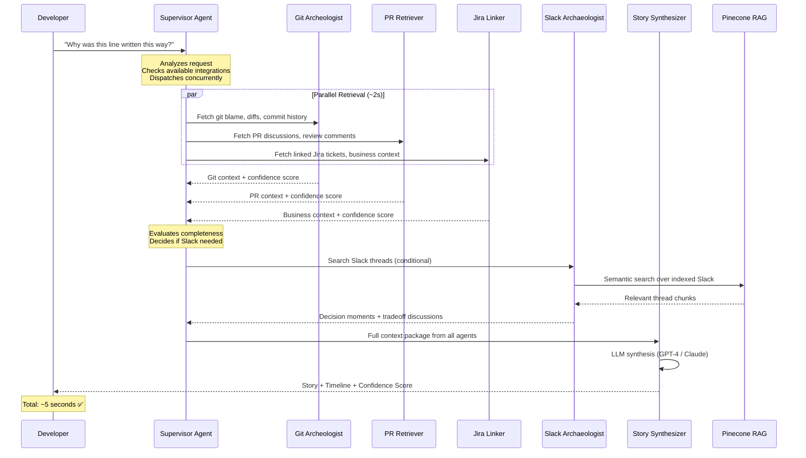

### The 6 Agents — Roles and Responsibilities

| # | Agent | Role | Tools Used | Failure Mode |
|---|---|---|---|---|
| 0 | **Supervisor** | Orchestrates all agents, decides parallelism, handles failures | LangGraph state machine | Degrades gracefully — skips failed agents |
| 1 | **Git Archeologist** | `git blame`, `git log`, `git diff`, commit message analysis | GitHub API, local git | Falls back to local git only |
| 2 | **PR Context Retriever** | Fetches PR discussions, code review comments, team debates | GitHub REST API | Skips if no linked PR found |
| 3 | **Issue Tracker Linker** | Connects code to business context via Jira/Linear tickets | Jira REST API | Marks as "no business context found" |
| 4 | **Slack Archaeologist** | Searches channel threads for decision-making moments | Slack API xoxp- token | Skips if not connected |
| 5 | **Story Synthesizer** | Combines all context into narrative, detects technical debt | GPT-4 + Claude 3.5 Sonnet | Cannot fail — has all context weights |

### Agent Decision Logic (Supervisor)

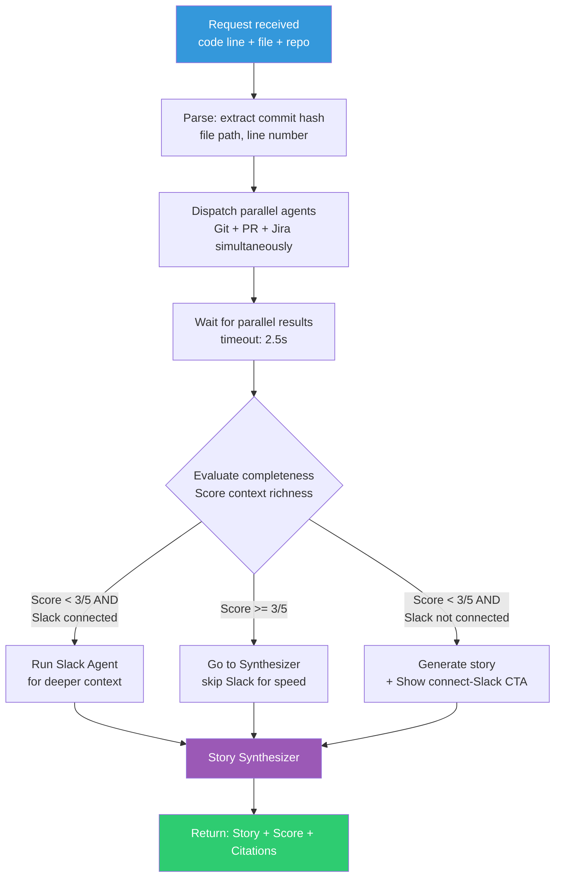

---

## RAG Implementation — Hybrid Retrieval

### What We Index

| Data Source | Chunk Strategy | Metadata Tags |
|---|---|---|
| Git commit messages | 1 chunk per commit | author, date, files_changed, hash |
| PR discussions | 1 chunk per thread | pr_id, participants, decision_outcome |
| Jira tickets + comments | 1 chunk per ticket | ticket_id, priority, linked_commits |
| Slack threads | 1 chunk per thread | channel, participants, timestamp |
| Code comments + docstrings | 1 chunk per function | file, line_range, author |

### The Hybrid Retrieval Pipeline

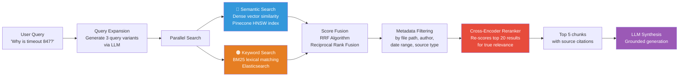

### RAG Quality Metrics (RAGAS)

| Metric | Target | What It Measures |
|---|---|---|
| **Context Precision** | > 80% | Are retrieved chunks actually relevant? |
| **Context Recall** | > 85% | Did we miss important context? |
| **Faithfulness** | > 90% | Is the story grounded in retrieved context? |
| **Answer Relevancy** | > 85% | Does the story address "WHY"? |
| **Citation Accuracy** | 100% | Every claim links to a real source |

---

## The Cold Start Problem — Solved

### The Problem

DevArcheology only generates rich stories for repos with:
- Many commits with meaningful messages
- Linked PRs with real discussions
- Connected Jira/Slack

**What happens on Day 1 with an empty repo?**

### The 3-Layer Solution

#### Layer 1 — Demo Mode: Pre-Indexed Famous Repos

Ship on day one with 3 repos **already indexed and live:**

| Repo | Why It's Perfect |
|---|---|
| `microsoft/vscode` | 100K+ commits, famous decisions, rich PR history |
| `facebook/react` | The Hooks decision (2018) — 1,000+ comment PR. The best "WHY" story in open source history |
| `calcom/cal.com` | Modern full-stack, active discussions, Linear tickets |

**Demo script:** Evaluator opens Web Portal → clicks "Explore React" → hovers over the commit that introduced Hooks → sees a full 5-source story in 5 seconds. **Zero setup. Zero permissions. Maximum wow.**

#### Layer 2 — The Story Richness Score (Your Upgrade Funnel)

```
┌─────────────────────────────────────────────────────┐
│  📊 Context Richness for this commit: 3/5            │
│                                                      │
│  ✅ Git Blame & Diff        — Full history available │
│  ✅ PR Discussion           — 12 review comments     │
│  ✅ Code Comments           — 2 relevant docstrings  │
│  ⚠️  Jira Ticket            — Not linked             │
│  ❌ Slack Threads           — Not connected          │
│                                                      │
│  Story Confidence: MEDIUM                            │
│  ────────────────────────────────────────────────── │
│  🔗 Connect Jira to unlock business context →       │
│  💬 Connect Slack to unlock decision moments →      │
└─────────────────────────────────────────────────────┘
```

Every missing source = a CTA to connect. **Cold start becomes the onboarding funnel.**

#### Layer 3 — Minimum Viable Story (Git-Only)

Even with 50 commits and zero integrations, Git alone provides:
- **WHO** built this (author pattern analysis)
- **WHEN** and in what project phase (release proximity)
- **WHAT** problem it was proximate to (nearby commits context)
- **HOW** it evolved (diff analysis across commits)

Framing: *"Based on Git history only — connect Jira and Slack to complete the story."*

---

## The Slack Problem — Solved

### The Myth You Believed

> ❌ "You need Workspace Admin permissions to read Slack messages."

### The Reality

Slack has two token types:
- **Bot Tokens (`xoxb-`)** — app-level, need admin installation ← this is what you were thinking
- **User Tokens (`xoxp-`)** ← **this is what you actually use**

### The xoxp- Solution

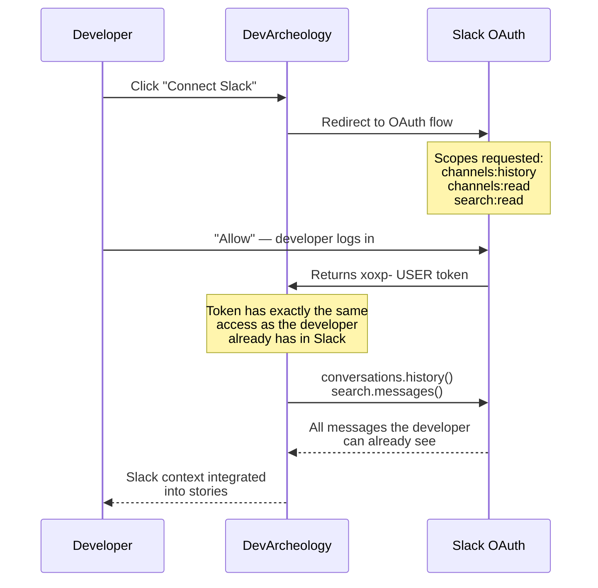

**The key insight:** A user token carries the exact permissions the user already has. If you can see a Slack channel, your DevArcheology token can read it. **Zero admin approval. Zero IT department. Zero enterprise sales cycle.**

**Onboarding copy:** *"Sign in with Slack — we only read messages you can already see."*

**Privacy model:** Each developer's stories are built from **their own view** of Slack. This is actually a feature — call it **"Your Context View"** and make it explicit in the UI.

---

## VS Code Extension — The Daily Driver

### The User Journey

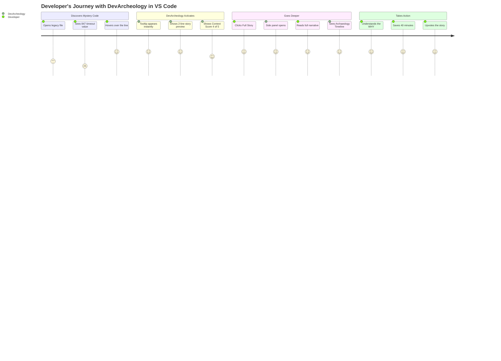

### Extension Features

| Feature | Description | Priority |
|---|---|---|
| **Inline Hover Tooltip** | 2-line story preview + context score on hover | P0 — Week 1 |
| **Full Story Panel** | Complete narrative with all sources, citations | P0 — Week 2 |
| **Archaeology Timeline** | Interactive timeline visualization | P1 — Week 3 |
| **Context Score Badge** | Visual indicator of story richness in gutter | P1 — Week 3 |
| **Connect Integrations** | In-extension OAuth flows for Jira/Slack | P1 — Week 3 |
| **Arabic Mode Toggle** | Switch story language to Arabic | P2 — Week 4 |

---

## Web Admin Portal — The Team Brain

### Two Different Users, Two Different Surfaces

| Surface | Primary User | Primary Question |
|---|---|---|
| VS Code Extension | Individual developer | "I'm reading this code RIGHT NOW — why is it like this?" |
| Web Admin Portal | Engineering manager / Tech lead | "Our senior dev left — what decisions did they make? What's our technical debt?" |

### Portal Features

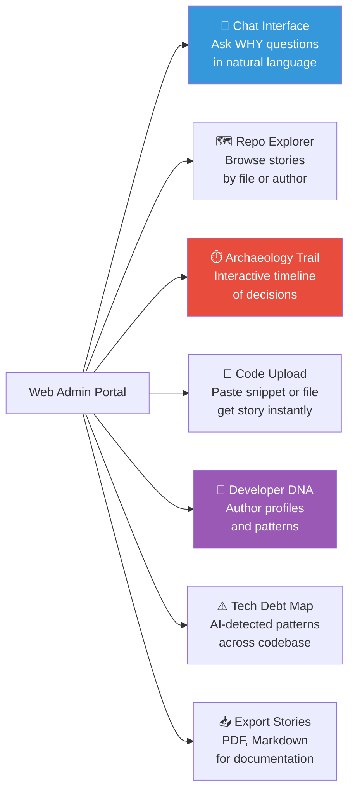

### Why the Portal Matters for Evaluation

**The brutal truth:** Not every evaluator will install a VS Code extension during a 10-minute demo. Every evaluator will click a browser link. The Web Portal **is your evaluation surface**. Build it first. The extension is the daily driver. The portal is the demo.

---

## The Archaeology Trail — The Wow Moment

### What It Is

An interactive **decision biography** timeline — the visual that no competitor has ever built.

```
━━━━━━━━━━━━━━━━━━━━━━━━━━━━━━━━━━━━━━━━━━━━━━━━━━━━━
WHY IS PAYMENT_RETRY_TIMEOUT = 847?
━━━━━━━━━━━━━━━━━━━━━━━━━━━━━━━━━━━━━━━━━━━━━━━━━━━━━

 Jan 2023              Mar 2023              Aug 2023
    │                     │                     │
 [🎫 JIRA-441]        [💬 PR #892]          [📝 COMMIT a3f7c]
 "Payments timing     "Hot debate: 1000ms   "Changed to 847ms —
  out under load"      vs 500ms. 23 comments  sweet spot found
  P0 incident         Sarah: 'go lower'     after load testing"
  5 reports           Ahmed: 'too risky'
    │                     │                     │
    └─────────────────────┴─────────────────────┘
                           │
               [💬 SLACK #backend-eng]
               Sarah 3 months later:
               "The 847 is from our p95
                latency on worst-case day.
                DON'T CHANGE IT."

STORY CONFIDENCE: 5/5  ████████████████████ HIGH
TECHNICAL DEBT FLAG: ⚠️ Magic number — consider extracting to config
━━━━━━━━━━━━━━━━━━━━━━━━━━━━━━━━━━━━━━━━━━━━━━━━━━━━━
```

### Implementation

- **Frontend:** D3.js timeline in Web Portal, simplified SVG in VS Code sidebar
- **Data:** Each event node links to its original source (click → opens actual PR/Jira/Slack)
- **Interaction:** Hover reveals full quote, click opens source document
- **Export:** Download as PNG or embed in documentation

**This is your 60-second wow moment.** Nobody else in your class has this. Nobody in the market has this.

---

## Developer DNA Profiles — The Enterprise Killer

### What It Is

After analyzing enough commits and PR reviews by a single author, DevArcheology automatically generates **behavioral profiles** — patterns in how each developer thinks and makes decisions.

### Example Profile

```
┌─────────────────────────────────────────────────────┐
│  🧬 Developer DNA: Sarah Chen                        │
│  Analyzed: 847 commits, 234 PR reviews              │
│                                                      │
│  EXPERTISE MAP                                       │
│  ████████████████░░  Auth/Security (89%)            │
│  ████████████░░░░░░  Payment Systems (67%)          │
│  ████░░░░░░░░░░░░░░  Frontend (23%)                 │
│                                                      │
│  DECISION PATTERNS                                   │
│  • Tends to over-engineer auth boundaries           │
│  • Proposed 3 simplifications overruled by deadlines│
│  • Code is 40% more commented than team average     │
│  • Strong preference for explicit error handling    │
│                                                      │
│  KNOWLEDGE CONCENTRATION                            │
│  ⚠️  SILO RISK: Only author of payment-gateway/*    │
│     Last touch: 8 months ago                        │
│     Replacement context exists: LOW                 │
│                                                      │
│  ONBOARDING VALUE                                   │
│  "Read Sarah's PRs from Jan-Mar 2023 to understand  │
│   why our auth system is structured this way."      │
└─────────────────────────────────────────────────────┘
```

### Why This Is Gold-Tier

No tool on earth does this. GitLens shows you *who* wrote it. DevArcheology tells you *what kind of developer* wrote it and *what tradeoffs they typically made*.

**Enterprise value propositions:**
- New devs onboard 3x faster ("understand the codebase by understanding who built it")
- Tech leads identify knowledge silos before they become crises
- Engineering managers get objective technical debt attribution
- Exit interviews for departing developers generate knowledge transfer reports automatically

---

## Tech Stack — Hybrid Architecture

### The Problem with Pure Python

Your team knows Node.js. Python + FastAPI + LangGraph is the best AI choice. Forcing everyone onto Python = bugs in Week 2 you can't debug.

### The Solution — Clean Microservice Split

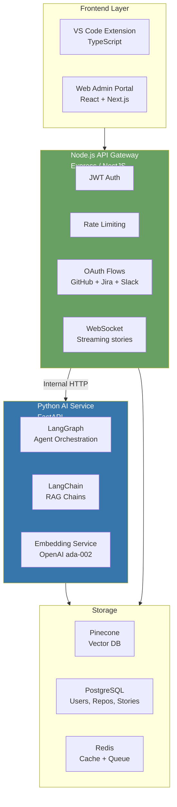

### Team Ownership Map

| Service | Language | Owner Expertise Needed |
|---|---|---|
| VS Code Extension | TypeScript | Frontend dev |
| Web Portal | React/Next.js | Frontend dev |
| API Gateway | Node.js/Express | Node.js devs ← your strength |
| OAuth flows | Node.js | Node.js dev |
| AI Agent Service | Python/FastAPI | 1-2 members learn LangGraph |
| RAG Pipeline | Python | Same as above |
| Pinecone integration | Python | Same as above |
| PostgreSQL schema | SQL | Any backend dev |

**The Rule:** If the Python service breaks in Week 3, the Node.js gateway still runs. Users get a graceful "Story generation temporarily unavailable" instead of a crash. **Microservice boundary = resilience + clear team ownership.**

---

## Security — OWASP LLM Top 10

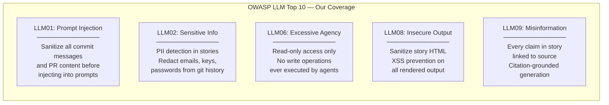

### Key Security Decisions

| Decision | Implementation | Why |
|---|---|---|
| **Repo access scope** | Only index repos the user already has access to via their GitHub token | Users can't access data they don't own |
| **Slack scope** | xoxp- user token — only what the user already sees | No privilege escalation |
| **No code execution** | Agents are read-only. No `eval()`, no shell commands | Prevents malicious commit message attacks |
| **Rate limiting** | 20 stories/hour per user, 100 API calls/hour | Cost control + abuse prevention |
| **PII detection** | Scan output for emails, phone numbers, API keys before display | Prevent sensitive data leakage from old commits |

---

## Observability & Evaluation

### LangSmith Integration

Every agent action, every retrieval, every LLM call is traced end-to-end from day 1.

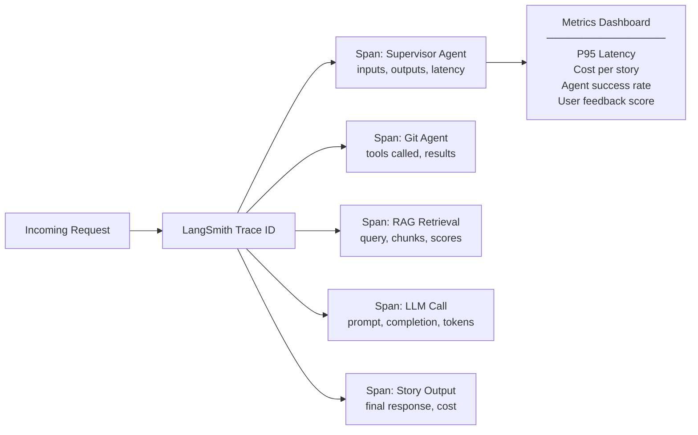

### The Continuous Improvement Loop

```
Production Stories
       ↓
User gives 👎 (thumbs down)
       ↓
Flagged story → evaluation queue
       ↓
Team reviews: was retrieval bad? Was synthesis bad?
       ↓
Fix prompt / fix chunking / fix reranker
       ↓
Regression test on golden dataset (50+ ground truth stories)
       ↓
Deploy improved version
       ↓
Measure: did thumbs-up rate improve?
```

---

## Business Model & Monetization

### Pricing Tiers

| Tier | Price | What You Get |
|---|---|---|
| **Free** | $0/month | 10 stories/month, Git + GitHub only, pre-indexed demo repos |
| **Developer** | $15/month | Unlimited stories, + Jira integration, Archaeology Trail |
| **Team** | $49/month per 5 devs | + Slack integration, Developer DNA, Tech Debt Map |
| **Enterprise** | Custom | On-premise deployment, private LLM, SSO, SLA |

### The Sponsor Pitch (For Your Job Fair)

> *"DevArcheology saves your senior engineers 30 minutes every time they touch legacy code.*
>
> *5 senior engineers × 3 investigations/day × $50/hour fully loaded cost = **$5,250 saved per month per team.**
>
> *Our Team plan costs $49/month. That's a **107x ROI** on month one."*

### Go-to-Market Strategy

**Phase 1 — Self-serve (Months 1-6)**
Target: Individual developers via VS Code Marketplace + Product Hunt launch. Free tier drives adoption. Frictionless — no sales call needed.

**Phase 2 — Bottom-up Enterprise (Months 6-18)**
Individual users become internal champions. When 5+ developers at a company are on Free, offer Team upgrade automatically.

**Phase 3 — Enterprise Direct (Month 18+)**
Target CTO/Engineering Director at Egyptian tech companies (Instabug, Breadfast, Paymob, Vodafone Digital) with the institutional memory narrative + Developer DNA for knowledge retention.

---

## ITI Checklist Coverage Map

| Checklist Section | Requirement | DevArcheology Implementation | Tier |
|---|---|---|---|
| **LLM Integration** | Primary LLM + fallback | GPT-4 synthesis + Claude 3.5 Sonnet analysis + Gemini fallback | ✅ Gold |
| **LLM Advanced** | Function calling + Streaming | Agent tool calls + streaming story output | ✅ Gold |
| **RAG — Sources** | Multi-format | Git, PRs, Jira, Slack, code comments | ✅ Gold |
| **RAG — Chunking** | Semantic chunking + overlap | Per-commit, per-thread chunking with metadata | ✅ Gold |
| **RAG — Retrieval** | Hybrid search (min 2) | Semantic + BM25 + reranking | ✅ Gold |
| **RAG — Advanced** | Min 1 advanced feature | Multi-query RAG (3 query variants) | ✅ Gold |
| **Agents — Foundation** | Clear architecture | LangGraph ReAct with state machine | ✅ Gold |
| **Agents — Tools** | Min 3 tools | git_blame, github_api, jira_api, slack_api, pinecone_search | ✅ Gold |
| **Agents — Multi** | 3+ agents coordinated | 6 agents: Supervisor + 4 parallel + Synthesizer | ✅ Gold |
| **Agents — Advanced** | Min 2 features | Human-in-loop (approval) + Agent self-reflection on confidence | ✅ Gold |
| **Multimodal** | Min 2 | Code diff visualization + Archaeology Trail + Code snippet upload | ✅ Silver→Gold |
| **Security** | OWASP LLM Top 10 | Prompt injection, PII detection, rate limiting, read-only agents | ✅ Gold |
| **Observability** | LLM platform | LangSmith full tracing + RAGAS evaluation metrics | ✅ Gold |
| **UX** | Chat + Streaming + Citations | Web Portal chat + real-time streaming + citation bubbles | ✅ Gold |
| **Arabic** | Bilingual support | One-click Arabic mode, code-switching stories, RTL UI | ✅ Gold |
| **Cost Optimization** | Caching + budgets | Redis cache for identical queries, cost dashboard, $0.10/story target | ✅ Gold |
| **Testing** | 60% coverage + LLM tests | 50+ golden stories, RAGAS metrics, adversarial prompt tests | ✅ Gold |
| **Deployment** | Cloud + CI/CD | Railway/Render + GitHub Actions pipeline | ✅ Gold |
| **Documentation** | Full docs | README, API docs, Architecture diagram, Prompt library | ✅ Gold |

---

## Team Structure & Ownership

| Member | Role | Owns |
|---|---|---|
| **Mohamed (You)** | Tech Lead + AI Engineer | LangGraph orchestration, agent design, architecture decisions |
| **Member 2** | Backend Engineer | Node.js API Gateway, OAuth flows, PostgreSQL |
| **Member 3** | AI/RAG Engineer | Python FastAPI, Pinecone, RAG pipeline, embeddings |
| **Member 4** | Frontend Engineer | Web Admin Portal, React, Archaeology Trail (D3.js) |
| **Member 5** | VS Code Extension | TypeScript extension, hover UI, sidebar |
| **Member 6** | QA + Observability | LangSmith integration, RAGAS eval, testing suite, security |

---

## 4-Week Execution Timeline

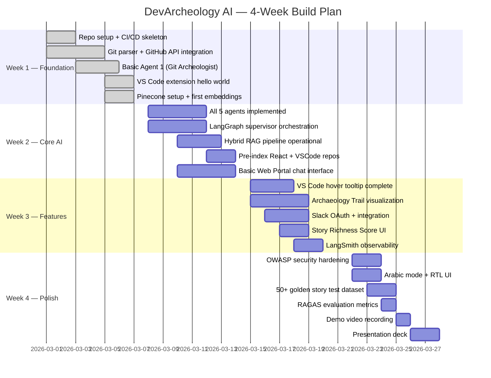

---

## Success Metrics & KPIs

### Technical KPIs

| Metric | Target | How We Measure |
|---|---|---|
| Story Generation Time (P95) | **< 5 seconds** | LangSmith latency traces |
| Story Generation Time (P50) | **< 3 seconds** | LangSmith latency traces |
| Agent Success Rate | **> 95%** | LangSmith error tracking |
| Cost per Story | **< $0.10** | LangSmith token cost attribution |
| Uptime During Evaluation | **99%+** | UptimeRobot monitoring |
| Test Coverage | **> 60%** | Jest + pytest coverage reports |

### AI Quality KPIs (RAGAS)

| Metric | Target | Description |
|---|---|---|
| Faithfulness | **> 90%** | Stories grounded in actual sources |
| Context Precision | **> 80%** | Retrieved chunks are relevant |
| Answer Relevancy | **> 85%** | Story answers "WHY" specifically |
| Citation Accuracy | **100%** | Every claim links to real source |

### User Experience KPIs

| Metric | Target |
|---|---|
| Thumbs Up Rate | **> 70%** |
| User Return Rate | **> 40% weekly** |
| Time Reading Story | **> 2 minutes** (engagement signal) |
| Integrations Connected per User | **> 2** (GitHub + Jira/Slack) |

---

## The 60-Second Wow Moment

### The Demo Script (Memorize This)

**Setup:** Web Portal is open. React repo is pre-indexed.

> *"Every developer has seen this moment. You open old code and find something like this:"*

```javascript
// DO NOT CHANGE THIS VALUE
const PAYMENT_RETRY_TIMEOUT = 847;
```

> *"847. Not 1000. Not 500. 847. Why? Every tool you know — GitLens, Copilot, CodeRabbit — they cannot answer this. I'm going to answer it in 5 seconds."*

[Types in Web Portal chat: *"Why is the payment retry timeout 847?"*]

[Story streams in real-time — 5 seconds]

> *"Here's what happened. In January 2023, there was a P0 incident — payments timing out under load. The team opened PR #892. There were 23 review comments. Sarah argued for going lower than 1000ms. Ahmed said that was too risky. They ran load tests. The p95 latency on the worst-case production day was 847ms. That number isn't magic — it's a measurement. And 3 months after the PR merged, Sarah wrote in Slack: 'The 847 is from our p95 latency on worst-case day. DON'T CHANGE IT.' That message was buried in a Slack channel. The original dev left 8 months ago. DevArcheology found it in 4.3 seconds."*

[Click "View Archaeology Trail" — the timeline renders]

> *"This is the biography of a decision. No other tool on earth shows you this."*

**Total time: 60 seconds. Total wow: maximum.**

---

## Interview Zitona 🫒

*The answers that win any defense room.*

---

**Q: What is DevArcheology AI in one sentence?**
> "DevArcheology is the first institutional memory system for software teams — it synthesizes Git, PRs, Jira, and Slack into a 5-second narrative that answers the question every developer asks but no tool answers: WHY was this code written this way?"

---

**Q: Who are your competitors?**
> "GitLens shows WHO and WHEN. CodeRabbit reviews code before it merges. Sourcegraph searches code structure. None of them answer WHY — and none of them work on code that already exists in production. We have no direct competitor."

---

**Q: What's the difference between you and CodeRabbit?**
> "CodeRabbit is born when a PR opens and dies when it merges. DevArcheology is born the day a new developer inherits code written 2 years ago by someone who left. Different tool, different moment, different user, different question."

---

**Q: How big is your market?**
> "The AI Code Tools market is $7.37 billion in 2025, growing to $23.97 billion by 2030 at 26.6% CAGR. We operate in the Developer Intelligence sub-segment, and our specific niche — institutional memory — has zero established players."

---

**Q: What happens on a repo with no history?**
> "Three things: One — we ship with 3 famous repos pre-indexed so you get a full demo experience on day one. Two — we show a Story Richness Score that honestly tells you what context we have and what's missing. Three — even with Git-only data, we generate a minimum viable story and use every missing source as a prompt to connect more integrations."

---

**Q: You need Slack admin permissions — how does that work?**
> "We use OAuth user tokens, not bot tokens. A user token carries exactly the same Slack access the developer already has. Zero admin approval. Zero IT department. A developer connects Slack in 30 seconds and we read every channel they can already see."

---

**Q: What's your business model?**
> "Freemium self-serve. 10 free stories/month to acquire users. $15/month for individual developers. $49/month for teams of 5. The ROI argument: a team of 5 senior devs saves 30 minutes per investigation, 3 investigations per day, at $50/hour fully loaded — that's $5,250 saved per month for $49. 107x ROI."

---

**Q: Why is your project better than [Education AI / Legal AI from your class]?**
> "Three reasons. One — we are the only project in this class with zero competitors in our specific category. Five teams submitted education AI. We own developer institutional memory alone. Two — our market is international. Any software team on GitHub anywhere in the world is our customer. Three — our demo is live and observable. We answer a specific question with a specific answer in 5 seconds. That's measurable, not theoretical."

---

**Q: What would you build next after the MVP?**
> "Three things in priority order. Developer DNA Profiles — behavioral patterns automatically extracted from commit history to accelerate onboarding and identify knowledge silos. Graph RAG — representing relationships between decisions as a knowledge graph, not just document chunks. And an Enterprise on-premise option for financial and healthcare companies who cannot send their code to external APIs."

---

*"The code always has a story. DevArcheology makes sure it's never lost."* 🏛️

---

> **Last Updated:** March 2026 | **Status:** Defense-Ready
> **Tags:** #capstone #DevArcheology #AI #LangGraph #RAG #MultiAgent #ITI
