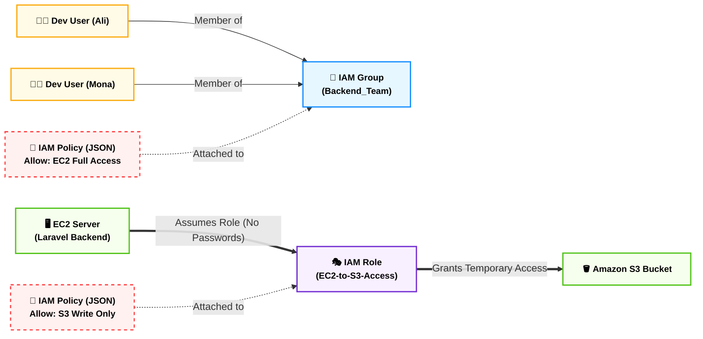
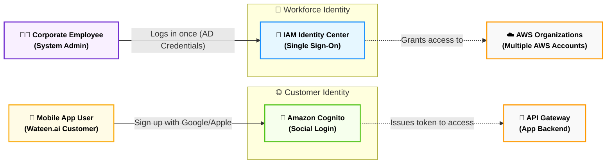
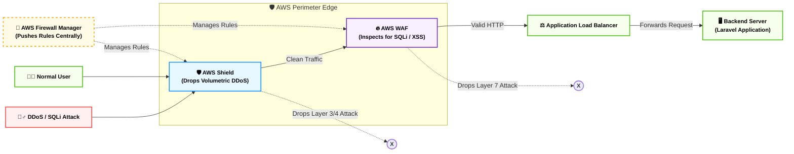
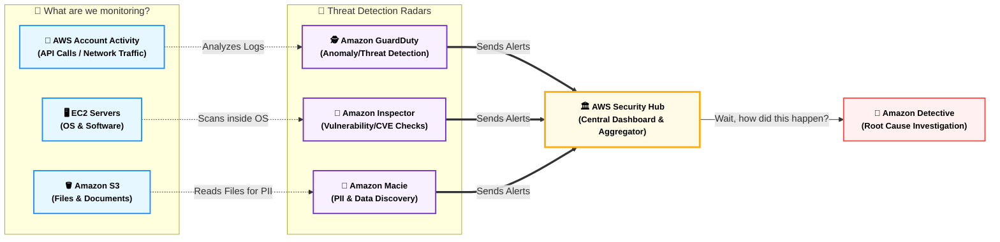
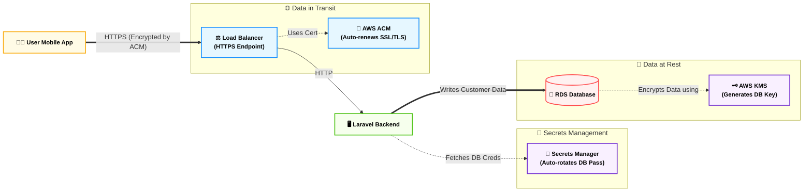

# Domain 2: Security & Compliance (قلعة الحماية والامتثال)

## المحطة الأولى: أساسيات الهوية، الصلاحيات، وميزان المحاسبة - الجزء الأول (AWS IAM Core)

**أصل الحكاية والمشكلة المعمارية (The Core Problem):**

تخيل إنك استلمت بيئة العمل السحابية الخاصة بمشروع (Wateen.ai). أول ما بتفتح حساب أمازون، بتستخدم إيميلك وباسوردك. الحساب ده اسمه **(Root User)**، وده معاه "توكيل عام مفتوح". يقدر يمسح الشركة كلها بضغطة زرار، أو يشتري سيرفرات بمليون دولار.

المشكلة بتبدأ لما تعين معاك 5 مطورين (Backend و Frontend). هل هتديهم الإيميل والباسورد بتوع الـ Root؟ مستحيل! ولو كل مطور عمل حساب أمازون منفصل، إزاي هتربط شغلهم ببعض؟

والمصيبة الأكبر: لو عندك كود Laravel شغال على سيرفر EC2 ومحتاج يرفع صور على S3، هل هتكتب الباسورد بتاع الـ S3 جوه الكود؟ (ده انتحار أمني، لو الكود اتسرب على GitHub الشركة هتتدمر).

هنا بتتدخل خدمة **IAM (Identity and Access Management)**. دي "إدارة الجوازات والهجرة" بتاعة حسابك. هي اللي بتحدد (مين) يقدر يدخل، ويقدر يعمل (إيه) بالظبط، وبتلغي تماماً فكرة الـ Hardcoded passwords.

### ⚙️ المكونات الأربعة الأساسية لـ IAM (The 4 Pillars)

في الامتحان وبيئة العمل الحقيقية، الـ IAM مبني على 4 أعمدة رئيسية لازم تفرق بينهم بصرامة:

#### 1. المستخدمين (IAM Users) - "الموظفين"

دول الأشخاص الحقيقيين (أو البرامج الخارجية) اللي بيتعاملوا مع الحساب. كل مطور بنعمله User ليه اسم خاص بيه.

- **طرق الدخول (كيف يثبتون هويتهم؟):**
    
    - **الواجهة الرسومية (Console):** لو هو إنسان، بيدخل بالـ (Username & Password).
        
    - **سطر الأوامر والكود (CLI / SDK):** لو هو سكريبت أو مبرمج بيشتغل من الـ Terminal، بيدخل بحاجة اسمها **(Access Keys)**. دي عبارة عن (Access Key ID & Secret Access Key). بتشتغل زي المفتاح، وممنوع منعاً باتاً تترفع على أي Public Repository.
        

#### 2. المجموعات (IAM Groups) - "الأقسام"

بدل ما تدي صلاحية لكل مبرمج لوحده (وده كابوس إداري)، إنت بتعمل مجموعة اسمها (Backend_Devs) وتديها صلاحية "التحكم في سيرفرات الـ EC2 وقواعد البيانات". أي User هتحطه جوه المجموعة دي، هياخد الصلاحية أوتوماتيك. ولما الموظف يستقيل، بتشيله من المجموعة فالصلاحيات تتسحب منه فوراً.

- 🚨 **القاعدة المعمارية الذهبية:** دائماً أعطِ الصلاحيات للمجموعات وليس للأفراد.
    

#### 3. الأدوار (IAM Roles) - "كارنيه الزائر المؤقت"

ده **أهم سؤال في الامتحان!** الـ Role مش شخص، ده "قناع" أو "كارنيه زائر مؤقت" بتلبسه عشان تعمل مهمة معينة، وبعدين تقلعه. الـ Role ملوش باسورد ثابت.

- **متى نستخدمه؟**
    
    - **سيرفرات أمازون (EC2 Roles / Instance Profiles):** عشان نخلي سيرفر الـ EC2 يكلم الـ S3 بأمان، مبنديلوش Access Keys أبداً. بندي للسيرفر Role مؤقت (Temporary Credentials) يتغير لوحده كل كام ساعة.
        
    - **الوصول العابر للحسابات (Cross-Account Access):** لو في شركة تانية (Third-party) عايزة تدخل حسابك تعمل فحص وتمشي، بتديلهم Role مؤقت بدل ما تعملهم Users دائمين.
        

#### 4. السياسات (IAM Policies) - "الدستور"

دي ملفات مكتوبة بلغة (JSON) بتحدد بالظبط المسموح والممنوع، وبيتم ربطها بالـ Users، Groups، أو Roles.

- **مبدأ أقل الصلاحيات (Principle of Least Privilege):** إدي للموظف أو السيرفر الصلاحية اللي تخليه يعمل شغله بس، ولا مليم زيادة. (مثلاً: صلاحية قراءة فقط للمحاسب).
    
- **قاعدة المنع القاطع (Explicit Deny):** لو الموظف واخد Policy بتقول "مسموح يفتح سيرفرات"، وPolicy تانية بتقول "ممنوع يفتح سيرفرات"، دايماً **(الممنوع بيكسب ويغلب أي حاجة تانية!)**.
    

### ⚙️ حماية الرووت (The Root User Best Practices)

الامتحان بيركز جداً على إزاي بتحمي الحساب الرئيسي. دول التلات قواعد المقدسة:

1. **لا تستخدمه أبداً في الشغل اليومي:** أول ما تفتح الحساب، ادخل بالـ Root، اعمل لنفسك IAM User بصلاحيات Admin (AdministratorAccess)، واقفل الـ Root وماتستخدموش تاني أبداً إلا في الطوارئ (زي قفل الحساب نهائياً أو تغيير خطة الدفع).
    
2. **فعل الـ MFA فوراً:** (Multi-Factor Authentication). اربط الـ Root بتطبيق على موبايلك أو مفتاح USB (زي YubiKey) عشان لو الباسورد اتسرق، الهاكر ميقدرش يدخل من غير الجهاز الفيزيائي بتاعك.
    
3. **لا تنشئ له Access Keys:** ممنوع تماماً تعمل Access Keys للـ Root User.
    

### 📊 شفرات الامتحان: الخلاصة الفورية لأساسيات IAM

|**السيناريو في الامتحان (Keyword)**|**الإجابة الصحيحة (IAM Component)**|
|---|---|
|`First account created`, `God mode`, `Should not be used for daily tasks`|**Root User**|
|`Add extra layer of protection`, `Requires physical device / app`|**MFA (Multi-Factor Authentication)**|
|`Programmatic access`, `CLI / SDK access`, `ID and Secret`|**Access Keys**|
|`Assign permissions to multiple users simultaneously`, `Best practice for users`|**IAM Groups**|
|`Temporary credentials`, `EC2 needs to access S3`, `Cross-account access`|**IAM Roles**|
|`JSON documents`, `Grant or deny permissions`|**IAM Policies**|
|`Give users exactly the permissions they need, nothing more`|**Principle of Least Privilege**|

---
## الجزء الثاني (Advanced Identity & Shared Responsibility)

**رؤية الـ Tech Lead:**

في الجزء الأول، ظبطنا صلاحيات فريق التطوير الصغير بتاعنا باستخدام IAM. بس ماذا لو الشركة كبرت وبقى عندك 5,000 موظف، و50 حساب أمازون (AWS Accounts)، وعشرات التطبيقات الخارجية (زي Office 365 و Salesforce)؟ هل هتعمل لكل موظف 50 حساب IAM؟ (هتتجنن كـ Admin!).

وماذا عن مشروع الـ (Mobile App) بتاعنا اللي هيستخدمه 2 مليون عميل؟ هل هتعمل للعملاء حسابات IAM؟!

ولما السيستم ده كله يشتغل ويحصل اختراق لا قدر الله.. مين اللي هيتحاسب قدام القانون؟ إنت ولا أمازون؟

الجزء ده بيحل عقدة "الهوية على نطاق واسع" (Identity at Scale)، وبيحط النقط على الحروف في "ميزان المحاسبة".

### ⚙️ أولاً: هويات الشركات الضخمة والعملاء (Advanced Identity)

أمازون فصلت بين هوية "الموظف اللي بيدير السيستم" وهوية "العميل اللي بيستخدم الأبلكيشن".

#### 1. الدخول الموحد للموظفين (AWS IAM Identity Center)

_(الخدمة دي كان اسمها زمان AWS SSO - Single Sign-On)_

- **المشكلة المعمارية:** الموظف عنده باسورد للـ Email، وباسورد لـ AWS Account 1، وباسورد لـ AWS Account 2. لو نسي واحد بيكلم الـ IT، ولو استقال لازم نقفل 10 حسابات يدوياً.
    
- **الحل:** الـ Identity Center بيعمل شاشة دخول واحدة (Portal). الموظف بيدخل مرة واحدة الصبح، بيلاقي قدامه كل حسابات أمازون والتطبيقات اللي ليه صلاحية عليها.
    
- **الربط مع الـ On-Premises:** لو شركتك أصلاً عندها سيرفر (Windows Active Directory) بيتدير منه الموظفين، أمازون بتديك خدمة اسمها **(AWS Directory Service)**. الخدمة دي بتعمل كوبري بين شبكة الشركة و AWS، بحيث الموظف يدخل على الكلاود بنفس باسورد الكمبيوتر بتاعه في المكتب!
    
- 🚨 **الكلمات الدلالية:** `Single Sign-On (SSO)`, `Centrally manage access to multiple AWS accounts and business applications`, `Active Directory integration`.
    

#### 2. هوية عملاء التطبيقات (Amazon Cognito)

- **المشكلة المعمارية:** تطبيق (Wateen.ai) محتاج نظام تسجيل دخول (Sign up / Sign in) للعملاء، وعايزين العميل يقدر يدخل بـ (Google, Facebook, Apple).
    
- **الحل:** **Amazon Cognito** هو الـ (Customer IAM). ملوش أي علاقة بـ IAM Users! ده بيبنيلك قاعدة بيانات للعملاء (User Pools)، وبيخليهم يسجلوا دخول بالسوشيال ميديا (Identity Federation). ولما العميل يدخل، Cognito بيديله "توكن" أو تصريح مؤقت يخليه يقدر يرفع صورة مثلاً على S3 (Identity Pools) من غير ما يضر حسابك.
    
- 🚨 **الكلمات الدلالية:** `Authentication for web and mobile apps`, `Social identity providers (Google, Facebook)`, `Customer Identity`.
    

### ⚙️ ثانياً: ميزان المحاسبة (The Shared Responsibility Model)

ده قانون أمازون الصارم. لو حصل حريق في شقتك الإيجار، مين اللي بيدفع؟ لو الحريق من كهرباء العمارة، المالك يدفع. لو إنت نسيت البوتجاز شغال، إنت تدفع!

**القاعدة الذهبية في الامتحان:**

> ☁️ **AWS مسؤولة عن:** `Security OF the Cloud` (أمان السحابة نفسها).
> 
> 👨‍💻 **العميل (إنت) مسؤول عن:** `Security IN the Cloud` (الأمان داخل السحابة).

**توزيع المهام (التفاصيل المعمارية):**

1. **مسؤوليات AWS المطلقة:**
    
    - حراسة الداتا سنتر الحقيقية، الكاميرات، البوابات، التبريد، الكهرباء.
        
    - صيانة كابلات الشبكات الفيزيائية (Network hardware).
        
    - برنامج الـ Hypervisor اللي بيقسم السيرفرات.
        
2. **مسؤوليات العميل (إنت) المطلقة:**
    
    - بيانات العملاء (Customer Data). إنت اللي بتحدد تتشفر ولا لأ.
        
    - إعدادات الـ IAM (لو إديت باسوردك لواحد صاحبك، أمازون ملهاش دعوة).
        
    - إعدادات الـ Security Groups (لو فتحت بورت 22 للإنترنت كله، دي غلطتك).
        
3. **المسؤوليات المتغيرة حسب الخدمة (تريكة الامتحان!):**
    
    - **في الـ EC2 (IaaS):** إنت اللي بتنزل نظام التشغيل (OS)، فإنت المسؤول عن عمل (Updates / Patches) للويندوز أو اللينكس.
        
    - **في الـ RDS أو DynamoDB (PaaS / Managed):** أمازون هي اللي مسؤولة عن تحديث الـ OS وتحديث محرك الداتابيز، إنت مسؤول بس عن ضبط الباسوردات وتفعيل التشفير.
        

### ⚙️ ثالثاً: قوانين اختبار الاختراق (Penetration Testing)

لو جبت شركة "هاكرز أخلاقيين" (White Hats) عشان يختبروا أمان سيستمك قبل ما تطلقه للجمهور:

- **قديماً:** كنت لازم تبعت إيميل لأمازون تاخد إذن قبل ما تعمل أي هجوم.
    
- **حالياً (في الامتحان):** أمازون بتسمحلك تعمل (Pen Testing) **بدون إذن مسبق** لـ 8 خدمات أساسية (منهم EC2, RDS, API Gateway). إنت بتهكر السيرفر بتاعك براحتك.
    
- 🛑 **المحرمات (الخط الأحمر):** ممنوع منعاً باتاً تحت أي ظرف إنك تعمل هجوم (DDoS Simulation) عشان تختبر السيستم بيستحمل ولا لأ، إلا لو معاك **تصريح رسمي مسبق** من أمازون، لأن الهجوم ده بيأثر على شبكة أمازون كلها والعملاء التانيين!
    

### 📊 شفرات الامتحان: الخلاصة للمحطة الأولى (الجزء الثاني)

|**السيناريو المعماري في الامتحان (Keyword)**|**الإجابة الصحيحة**|
|---|---|
|`Single Sign-On`, `Centrally manage access to multiple accounts and apps`|**AWS IAM Identity Center**|
|`Add authentication to mobile/web apps`, `Sign in with Apple/Google`|**Amazon Cognito**|
|`Security OF the cloud`, `Physical infrastructure`, `Hypervisors`|**AWS Responsibility**|
|`Security IN the cloud`, `Customer data`, `IAM configuration`|**Customer Responsibility**|
|`OS Patching on EC2 instances`|**Customer Responsibility**|
|`OS Patching on RDS instances`|**AWS Responsibility**|
|`Perform penetration testing on EC2`|**Permitted without prior approval**|
|`Simulate a DDoS attack`|**Prohibited (Requires prior approval)**|

---
## المحطة الثانية: دروع الشبكات وحراسة البوابات - الجزء الأول (Perimeter Defense & Firewalls)

**رؤية الـ Tech Lead (أصل الحكاية والمشكلة المعمارية):**

تخيل إنك أطلقت منصة (Wateen.ai) وبقت لايف، والـ Backend المبني بـ Laravel 13 شغال زي الفل. فجأة، المنافسين بتوعك سلطوا عليك "جيش من الأجهزة المخترقة" (Botnet) عشان يبعتوا 10 مليون ريكويست في الثانية للسيرفر بتاعك عشان يوقعوه (هجوم DDoS).

وفي نفس الوقت، في هاكر صغير (Script Kiddie) بيحاول يكتب كود خبيث في خانة "تسجيل الدخول" عشان يسحب الداتا من الـ Database بتاعتك (هجوم SQL Injection).

لو السيرفر بتاعك هو اللي بيستقبل الضربات دي مباشرة، هيقع في ثواني! عشان كده المعمارية السليمة بتقول: "ابني خطوط دفاع (Firewalls) بره الشبكة خالص، تصد الضربات قبل ما توصل للكود بتاعك". أمازون بتديك 4 دروع رئيسية للعملية دي.

### ⚙️ أولاً: درع الصد العنيف (AWS Shield)

الـ Shield هو "البودي جارد" العنيف اللي بيقف بره خالص. وظيفته الوحيدة إنه يصد هجمات حجب الخدمة الموزعة (DDoS Attacks) اللي بتحصل في طبقات الشبكة (Layer 3 & 4).

الامتحان بيخيرك بين نوعين من الدرع ده:

1. **Shield Standard (المجاني):**
    
    - ده شغال أوتوماتيك على كل حسابات أمازون من غير ما تدوس على أي زرار، ومجاني 100%. بيصد الهجمات الشائعة والمعروفة.
        
2. **Shield Advanced (الاحترافي المدفوع):**
    
    - ده بيكلف **3,000 دولار في الشهر** للمنظمة كلها!
        
    - **ليه تدفع الرقم ده؟** لأنه بيحميك من الهجمات المعقدة جداً، وبيديك خط ساخن 24/7 مع فريق متخصص في أمازون (DDoS Response Team - DRT).
        
    - **الميزة القاتلة:** لو حصل عليك هجوم، والـ Auto Scaling بتاعك فتح 100 سيرفر عشان يستوعب الهجوم ده، أمازون هتعفيك من فاتورة الـ 100 سيرفر دول (DDoS Cost Protection)!
        

### ⚙️ ثانياً: مفتش الحقائب الذكي (AWS WAF - Web Application Firewall)

الـ Shield بيصد "الكمية"، بس الـ **WAF** بيصد "النوعية". ده المفتش اللي بيفتح كل ريكويست ويقرأ اللي جواه. بيشتغل في طبقة التطبيقات (Layer 7).

- **الوظيفة المعمارية:** بيفهم الـ (HTTP/HTTPS). لو لقى الريكويست جواه كود خبيث زي (SQL Injection) أو (Cross-Site Scripting - XSS)، بيعمله Block فوراً.
    
- **الحظر الجغرافي (Geo-Blocking):** تقدر تقوله: "امنع أي ريكويست جاي من دولة معينة".
    
- **أماكن التركيب:** الـ WAF مش بيتركب على الـ EC2 مباشرة! بيتركب على البوابات الأمامية زي: `Application Load Balancer (ALB)`, `API Gateway`, و `Amazon CloudFront`.
    

### ⚙️ ثالثاً: سور الشبكة العظيم (AWS Network Firewall)

الـ WAF بيحمي "تطبيق الويب"، بس ماذا لو عايز تحمي الـ (VPC) كلها بكل اللي فيها (داتا بيز، سيرفرات داخلية، أجهزة وهمية)؟

- هنا بنستخدم **AWS Network Firewall**. ده جدار حماية شامل بيشتغل من (Layer 3 لحد Layer 7). بيراقب كل الترافيك اللي داخل واللي خارج من الـ VPC بتاعتك، ويقدر يمنع السيرفرات الداخلية إنها تدخل على مواقع مشبوهة (Outbound filtering).
    

### ⚙️ رابعاً: قائد جيش الدروع (AWS Firewall Manager)

**المشكلة المعمارية:** تخيل إن شركتك عندها 50 حساب أمازون (AWS Accounts) جوه (AWS Organizations)، وكل حساب فيه 10 Load Balancers. هل هتدخل تعمل إعدادات الـ WAF والـ Shield لكل واحد فيهم بـ إيدك؟

- **الحل (Firewall Manager):** دي شاشة الإدارة المركزية. بتكتب فيها "قانون أمني" (Rule) مرة واحدة بس، وهو بياخد القانون ده يطبقه على كل الـ 50 حساب أوتوماتيك. ولو حد فتح حساب جديد، القانون هيتطبق عليه فوراً.
    
- 🚨 **الكلمة الدلالية في الامتحان:** `Centrally manage firewall rules across multiple accounts in AWS Organizations`.
    

### 📊 شفرات الامتحان: الخلاصة الفورية لدروع الشبكات

الجدول ده بيقفل أي سؤال عن الـ Firewalls، ركز على "الطبقة" (Layer) و "النوعية":

|**السيناريو المعماري في الامتحان (Keyword)**|**الإجابة الصحيحة (AWS Service)**|
|---|---|
|`Protect against DDoS attacks`, `Always-on network flow monitoring`|**AWS Shield (Standard)**|
|`DDoS cost protection`, `24/7 access to DDoS Response Team (DRT)`|**AWS Shield Advanced**|
|`Protect against SQL injection and Cross-Site Scripting (XSS)`|**AWS WAF**|
|`Filter HTTP/HTTPS traffic`, `Layer 7 protection`, `Geo-blocking`|**AWS WAF**|
|`Centrally manage firewall rules across multiple AWS accounts`|**AWS Firewall Manager**|
|`Protect entire VPC traffic (Layer 3-7)`, `Outbound filtering`|**AWS Network Firewall**|

---
## المحطة الثانية: دروع الشبكات وغرف التحقيق - الجزء الثاني (Threat Detection & Analytics)

**رؤية الـ Tech Lead (أصل الحكاية والمشكلة المعمارية):**

في الجزء اللي فات، إحنا بنينا أسوار عالية جداً (Shield و WAF) عشان نمنع الهاكرز من الدخول. بس ماذا لو الخطر "جوه البيت" أصلاً؟

تخيل إن مبرمج بالغلط رفع مفاتيح الـ (IAM Access Keys) على GitHub، وهاكر أخدها وبدأ يعمل API Calls يمسح بيها قواعد البيانات الساعة 3 الفجر. أو سيرفر EC2 اتفيرس وبقى بيعمل (Crypto Mining). أو الأسوأ: ملف Excel مليان أرقام كروت فيزا لعملاء (Wateen.ai) اترفع بالغلط على S3 Bucket وبقى متاح للـ Public!

الدروع الخارجية (WAF/Shield) مش هتشوف كل ده لأن ده بيحصل جوه الحساب نفسه. عشان كده، أمازون بتديك 5 "رادارات" وكلاب حراسة بتشتغل بالذكاء الاصطناعي عشان تراقب وتكشف أي حركة خيانة من جوه.

### ⚙️ أولاً: المحقق الذكي للتهديدات النشطة (Amazon GuardDuty)

الـ **GuardDuty** هو "رادار الكلاود". خدمة شغالة بالـ (Machine Learning) بتراقب حسابك 24/7 عشان تكتشف أي نشاط مشبوه (Anomaly Detection).

- **طريقة العمل (بياكل إيه؟):** الـ GuardDuty مش بيحتاج تسطب أي برنامج. هو بيتغذى في الكواليس على 3 مصادر داتا رئيسية:
    
    1. `CloudTrail Logs` (لو حد عمل API Call غريب).
        
    2. `VPC Flow Logs` (لو سيرفراتك بتكلم عناوين IPs في دول مشبوهة).
        
    3. `DNS Logs` (لو سيرفر بيحاول يوصل لموقع هكرز).
        
- **النتيجة:** لو لقى حاجة غريبة، بيضرب إنذار (Finding) فوراً.
    
- 🚨 **الكلمات الدلالية في الامتحان:** `Intelligent threat detection`, `Machine learning to detect anomalies`, `Monitors CloudTrail, VPC Flow Logs, and DNS logs`.
    

### ⚙️ ثانياً: مفتش ثغرات النظام (Amazon Inspector)

الـ **Inspector** هو "مهندس الجودة الأمني". ده ملوش دعوة بالتهديدات النشطة، ده بيدور على "نقاط الضعف" (Vulnerabilities) قبل ما الهاكر يستغلها.

- **طريقة العمل:** بيدخل جوه سيرفرات الـ (EC2) بتاعتك، أو جوه صور الحاويات (Docker Containers في ECR)، ويفحص البرامج اللي متسطبة عليها. لو لقى إنك مسطب نسخة قديمة من (PHP) أو (Linux) فيها ثغرة معروفة عالمياً (CVE)، بيطلعلك تقرير يقولك: _"السيرفر ده فيه ثغرة كذا، ولازم تعمله Update فوراً"_.
    
- 🚨 **الكلمات الدلالية في الامتحان:** `Automated vulnerability management`, `Discover software vulnerabilities and unintended network exposure`, `CVEs (Common Vulnerabilities and Exposures)`.
    

### ⚙️ ثالثاً: كلب الحراسة للبيانات الحساسة (Amazon Macie)

الـ **Macie** خدمة متخصصة في حاجة واحدة بس: **الـ Amazon S3**.

- **المشكلة:** عندك آلاف الملفات في S3 وماتعرفش إيه اللي جواها.
    
- **الحل:** الـ Macie بيستخدم الـ (Machine Learning) ومعالجة اللغات الطبيعية (NLP) عشان يقرأ الملفات دي. لو لقى أي بيانات حساسة (PII - Personally Identifiable Information) زي: أرقام بطاقات ائتمان، أرقام جوازات سفر، أو أسماء عملاء.. بيضرب إنذار ويقولك: _"الملف ده فيه داتا خطيرة، ولازم تشفره أو تقفله"_.
    
- 🚨 **الكلمات الدلالية في الامتحان:** `Discover and protect sensitive data in S3`, `Personally Identifiable Information (PII)`, `Uses pattern matching and machine learning`.
    

### ⚙️ رابعاً: شاشة العرض المركزية (AWS Security Hub)

**المشكلة المعمارية:** الـ GuardDuty بيطلع إنذارات، والـ Inspector بيطلع إنذارات، والـ Macie بيطلع إنذارات، والـ WAF بيطلع إنذارات. كـ Tech Lead، هل هفتح 10 شاشات كل يوم الصبح؟

- **الحل (Security Hub):** دي "شاشة القيادة" (Single Pane of Glass). بتجمع كل الإنذارات من كل خدمات الأمن في أمازون (ومن شركاء زي Palo Alto و Trend Micro)، وتحطهم في مكان واحد.
    
- الأهم من كده: إنها بتديك (Security Score) نسبة مئوية (مثلاً 75%) وتقولك إنت مطابق لمعايير الأمان العالمية (زي CIS Foundations) بنسبة كام.
    
- 🚨 **الكلمات الدلالية في الامتحان:** `Central security posture management`, `Aggregates alerts from multiple services`, `Single place to view security alerts`.
    

### ⚙️ خامساً: المحقق الجنائي العميق (Amazon Detective)

الـ Security Hub قالك: _"في هجوم حصل"_. بس إنت عايز تعرف: _"الهجوم ده بدأ إزاي؟ والهاكر دخل منين؟ وراح فين بعد كده؟"_.

- **الحل (Detective):** الخدمة دي بتجمع جبال من الداتا من (GuardDuty و CloudTrail و VPC Flow Logs)، وتبني بيها **رسومات بيانية (Graphs)** معقدة جداً. الرسومات دي بتخلي المحقق الأمني يشوف مسار الهاكر بالزمن، ويعرف السبب الجذري (Root Cause) للمشكلة بسرعة.
    
- 🚨 **الكلمات الدلالية في الامتحان:** `Investigate the root cause of security issues`, `Interactive visualizations and graphs`, `Analyze, investigate, and quickly identify root causes`.
    

### 📊 شفرات الامتحان: التفرقة القاضية بين خدمات الأمن

أكتر سؤال بيوقع الناس في الامتحان هو الفرق بين (GuardDuty) و (Inspector). احفظ الجدول ده صم:

|**السيناريو المعماري في الامتحان (Keyword)**|**الإجابة الصحيحة (AWS Service)**|
|---|---|
|`Intelligent threat detection`, `Anomaly detection`, `Machine learning for threats`|**Amazon GuardDuty**|
|`Automated vulnerability management`, `Check for CVEs`, `Software vulnerabilities`|**Amazon Inspector**|
|🚨 _فخ الامتحان:_ `Vulnerabilities` ➔ **Inspector**|🚨 _فخ الامتحان:_ `Active Threats` ➔ **GuardDuty**|
|`Discover and protect sensitive data`, `Find PII in S3 buckets`|**Amazon Macie**|
|`Central security dashboard`, `Aggregate security alerts/findings`|**AWS Security Hub**|
|`Investigate root cause`, `Interactive visualizations / graphs for investigation`|**Amazon Detective**|

---
## المحطة الثالثة: أقبية التشفير وإدارة الأسرار والامتثال (Encryption, Secrets & Compliance)

**رؤية الـ Tech Lead (أصل الحكاية والمشكلة المعمارية):**

إحنا أمنّا الشبكة من بره بـ (WAF/Shield)، وراقبناها من جوه بـ (GuardDuty). بس ماذا لو الهاكر قدر يتخطى كل ده ويوصل للـ Database بتاعتك، أو دخل داتا سنتر أمازون وسرق الهارد ديسك الفيزيائي اللي عليه بيانات عملاء (Wateen.ai)؟ أو الأسوأ.. قدر يعترض الداتا وهي بتتنقل في كابلات الإنترنت بين العميل والسيرفر؟

هنا بتظهر القاعدة الذهبية الأخيرة في الأمان: **التشفير (Encryption)**. لو الهاكر أخد الداتا، هياخدها عبارة عن طلاسم مشفرة ملهاش أي قيمة من غير "المفتاح".

الجزء ده بيشرح إزاي أمازون بتدير مفاتيح التشفير، إزاي بتخبي الباسوردات، وإزاي بتطلع ورق قانوني يثبت إنك ماشي صح.

### ⚙️ أولاً: التشفير في حالة السكون (Encryption at Rest - KMS vs CloudHSM)

لما تحب تشفر داتا متخزنة على هارد ديسك (EBS) أو في (S3)، إنت محتاج "مفتاح تشفير". أمازون بتديك خدمتين لإدارة المفاتيح دي، والامتحان بيعشق المقارنة بينهم:

#### 1. مدير المفاتيح المرن (AWS KMS - Key Management Service)

- **الفكرة:** خدمة مدارة (Managed Service) بتخلق وتدير مفاتيح التشفير.
    
- **الكواليس المعمارية:** الـ KMS بيستخدم أجهزة هاردوير مشتركة (Multi-tenant) بين عملاء أمازون. ميزته القاتلة إنه مدمج مع كل خدمات أمازون (S3, EBS, RDS..). بضغطة زرار، السيرفر بتاعك بيتشفر.
    
- 🚨 **الكلمات الدلالية:** `AWS manages encryption keys`, `Integrated with most AWS services`, `Multi-tenant hardware`.
    

#### 2. الخزنة الحديدية الخاصة (AWS CloudHSM)

- **المشكلة:** بعض البنوك والجهات الحكومية بتقولك: "ممنوع أستخدم مفاتيح تشفير على أجهزة مشتركة مع ناس تانية، وممنوع أمازون نفسها يكون ليها أي وصول للمفاتيح دي!".
    
- **الحل (CloudHSM):** أمازون بتأجرلك جهاز هاردوير كامل خاص بيك لوحدك (Dedicated Hardware) جوه الداتا سنتر. إنت اللي بتدير المفاتيح بالكامل (أمازون مبتشوفهاش)، والجهاز ده مطابق لأعلى معايير الأمان العسكرية.
    
- 🚨 **الكلمات الدلالية:** `Dedicated Hardware for encryption`, `You manage encryption keys entirely`, `FIPS 140-2 Level 3 compliance`.
    

### ⚙️ ثانياً: التشفير أثناء النقل (Encryption in Transit - ACM)

الداتا لازم تتشفر وهي ماشية في سلك الإنترنت (من موبايل اليوزر لحد السيرفر). ده بيتم عن طريق شهادات (SSL/TLS) اللي بتخلي الموقع يبدأ بـ (HTTPS).

- **الحل المعماري (AWS Certificate Manager - ACM):**
    
    الخدمة دي بتطلعلك شهادات SSL مجانية تماماً عشان تركبها على الـ Load Balancer أو הـ CloudFront بتاعك.
    
- **الميزة القاتلة:** الشهادات القديمة كانت بتنتهي كل سنة ولازم مهندس يدخل يجددها بإيده، ولو نسي الموقع بيقع! הـ ACM بيعمل **(Automatic Renewal)**، يعني بيجدد الشهادة لوحده قبل ما تخلص.
    
- 🚨 **الكلمات الدلالية:** `SSL/TLS Certificates for HTTPS`, `Automatic Renewal`.
    

### ⚙️ ثالثاً: خزنة الباسوردات السحرية (AWS Secrets Manager)

- **المشكلة المعمارية:** إنت عندك كود Laravel 13 بيكلم داتابيز PostgreSQL. لو كتبت الـ Username والـ Password جوه كود الـ PHP (Hardcoded)، دي كارثة! أي مبرمج جديد هيشوفهم.
    
- **الحل:** بنخزن الباسورد في **Secrets Manager**. الكود بتاعك بيروح يكلم الخدمة دي وقت التشغيل، وياخد منها الباسورد ويفتح الداتابيز.
    
- **الميزة القاتلة (Auto-Rotation):** الخدمة دي تقدر تغير باسورد الداتابيز أوتوماتيك (مثلاً كل 30 يوم) من غير ما الموقع يقع ومن غير ما أي مبرمج يتدخل!
    
- 🚨 **الكلمات الدلالية:** `Store database credentials`, `Automatic rotation of secrets`, `Eliminate hardcoded passwords`.
    

### ⚙️ رابعاً: دولاب الورق القانوني (AWS Artifact)

- **المشكلة:** جالك مدقق حسابات (Auditor) أو جهة حكومية وقالتلك: "اثبتلي إن الداتا سنتر بتاعة أمازون اللي إنت حاطط عليها شغلنا مطابقة لمعايير أمان بطاقات الائتمان (PCI-DSS) أو معايير الأيزو (ISO)".
    
- **الحل:** بتفتح **AWS Artifact**. دي مش خدمة بتعمل حاجة تقنية، دي مجرد "بوابة ملفات" (Portal) بتنزل منها تقارير الأمان والشهادات القانونية بتاعة أمازون نفسها عشان تديها للمدققين.
    
- 🚨 **الكلمات الدلالية:** `Compliance reports`, `SOC, PCI, ISO certifications`, `Download AWS security and compliance documents`, `Agreements (BAA)`.
    

### 📊 شفرات الامتحان: التفرقة النهائية للتشفير والامتثال

الجدول ده بيحسم الـ Security Domain بالكامل، الكلمة الدلالية بتشاور على الخدمة فوراً:

|**السيناريو المعماري في الامتحان (Keyword)**|**الإجابة الصحيحة (AWS Service)**|
|---|---|
|`AWS manages encryption keys`, `Integrated with S3/EBS`|**AWS KMS (Key Management Service)**|
|`Dedicated hardware for encryption`, `You manage keys entirely`, `FIPS 140-2 Level 3`|**AWS CloudHSM**|
|`SSL/TLS Certificates for HTTPS`, `Automatic renewal`|**AWS Certificate Manager (ACM)**|
|`Store database credentials securely`, `Automatic password rotation`|**AWS Secrets Manager**|
|`On-demand access to AWS compliance reports`, `ISO, PCI, SOC documents`|**AWS Artifact**|
|_تريكة: System Manager Parameter Store_|زيه زي Secrets Manager، لكن **مبيعملش Auto-Rotation** ومجاني!|

