# Domain 3: Cloud Technology & Services

## 1. التشريح العميق والموسع لمعمارية EC2 (Elastic Compute Cloud)

**أصل الحكاية (The Core Problem):**

زمان، لو عايز ترفع أبلكيشن (سواء كان شغال بـ Node.js، أو Backend بـ Laravel 13)، كنت لازم تشتري سيرفر فيزيكال (حتة حديدة)، وتستنى شهور يوصلك، وتجيب مهندس شبكات يركبه في الـ Rack، وتسطب نظام التشغيل. الكارثة إنك لو الأبلكيشن بتاعك ضرب وبقى عليه ضغط، السيرفر الفيزيكال ده هيقع، وعشان تكبره لازم تشتري رامات وبروسيسور فيزيكال وتطفي السيرفر وتركبهم.

من هنا ظهر الـ **EC2**. الفكرة مش تأجير سيرفر، الفكرة في الـ **(Virtualization)**. أمازون جابت سيرفرات عملاقة، واستخدمت برامج (Hypervisors) عشان تقطع السيرفرات دي لـ "خوادم افتراضية" صغيرة. إنت بتبني السيرفر بتاعك كأنه "مكعبات ليجو" من خلال الـ API أو الـ Console، وفي 40 ثانية بيكون شغال.

### ⚙️ تفكيك مكعبات الـ EC2 (The 4 Core Building Blocks)

عشان تخلق سيرفر EC2، أمازون بتجبرك تختار 4 مكونات رئيسية، كل مكون فيهم وراه بحر من التفاصيل الهندسية:

#### 1. الـ AMI (Amazon Machine Image) - "أسطمبة الروح"

الـ AMI مش مجرد "نسخة أوبونتو". دي عبارة عن (صورة مجمدة - Immutable Image) من الهارد ديسك، بتحتوي على نظام التشغيل وأي برامج متسطبة عليه.

- **الأنواع في الامتحان:**
    
    1. **AWS Managed AMIs:** صور أمازون هي اللي عاملاها ومسؤولة عن تحديثها (زي Amazon Linux 2023 أو Ubuntu 24.04 صافي).
        
    2. **AWS Marketplace:** صور شركات تانية عاملاها وبتبيعها. مثلاً ممكن تشتري صورة جاهزة متسطب عليها (F5 Load Balancer) أو فايروال جاهز وتدفع تمن رخصة السوفت وير مع ثمن السيرفر.
        
    3. **Custom AMIs (Golden Image):** ودي أهم لقطة ليك كمهندس! إنت بتعمل سيرفر عادي، تسطب عليه الـ PHP والـ Nginx وتظبط إعدادات الـ Laravel بتاعتك، وبعدين تاخد من السيرفر ده (صورة - Snapshot). الصورة دي بقت (Golden AMI) خاصة بيك. بعد كده، تقدر تخلق 100 سيرفر في ثانية واحدة من الصورة دي، وكلهم هيطلعوا متسطب عليهم كل حاجة جاهزة!
        

#### 2. عائلات السيرفرات (Instance Types) - "العضلات والهيكل"

أمازون مش بتديك عضلات عشوائية. اسم السيرفر في أمازون (زي `m5.large`) بيتكون من 3 حتت: حرف (M) بيمثل العائلة، رقم (5) بيمثل الجيل، وكلمة (large) بتمثل الحجم.

- **عائلة الأغراض العامة (General Purpose - T & M):**
    
    دي السيرفرات اللي الـ CPU والرامات فيها متوازنين.
    

> [!warning] تحذير معماري (T-Series CPU Credits)
> 
> عائلة الـ **T** (زي t2.micro) بتشتغل بنظام الـ (Burstable Performance). يعني إيه؟ يعني طول ما السيرفر بتاعك هادي، بيجمع حاجة اسمها (CPU Credits). ولما يحصل ضغط مفاجئ، بيحرق الكريدت دي عشان يشتغل بأقصى طاقة. لو الكريدت خلصت، السيرفر بيهنج وبيبقى بطيء جداً. دي تريكة خطيرة في بيئة العمل!

- **عائلة المعالجة (Compute Optimized - C):**
    
    المعالجات هنا جبارة. بتستخدمها لو الكود بتاعك بيعمل حسابات معقدة، ريندرينج، أو بيعالج فيديوهات.
    
- **عائلة الذاكرة (Memory Optimized - R & X):**
    
    هنا الرامات هي اللي ضخمة جداً. دي مثالية لقواعد البيانات اللي بتحتاج تحط الداتا كلها في الميموري عشان سرعة الاستجابة (In-Memory Databases) زي Redis أو Memcached.
    
- **عائلة التخزين (Storage Optimized - I & D):**
    
    بتديك هاردات (NVMe) راكبة في اللوحة الأم مباشرة (مش عن طريق الشبكة) عشان توفرلك سرعة قراءة وكتابة (IOPS) مجنونة. ممتازة للـ Big Data والـ NoSQL Databases.
    

#### 3. سكريبت الإفاقة (User Data / Bootstrapping) - "البرمجة الآلية"

- **المشكلة:** لما الـ Auto Scaling يقرر يبني سيرفر جديد الساعة 3 الفجر، السيرفر بيطلع "أبيض" حتى لو من الـ AMI. مين هيسحب آخر كود إنت عملتله Push على GitHub؟ ومين هيعمل `npm install` أو `composer update`؟
    
- **الحل (User Data):** ده سكريبت (Bash Script) إنت بتكتبه في إعدادات الـ EC2.
    
- **القاعدة الذهبية:** السكريبت ده بيشتغل **بصلاحيات الـ root**، وبيشتغل **مرة واحدة فقط لا غير** في دورة حياة السيرفر (لحظة الولادة الأولى). لو عملت Restart للسيرفر، السكريبت ده مش هيشتغل تاني.
    

#### 4. مفاتيح الأمان (Key Pairs - Asymmetric Cryptography)

إزاي هتدخل على السيرفر بتاعك وتكتب أوامر (SSH) من غير ما تكتب Username و Password كل شوية، وفي نفس الوقت تحميه من الهاكرز؟

- أمازون بتستخدم "التشفير غير المتماثل". بتولد مفتاحين:
    
    1. **Public Key (المفتاح العام):** أمازون بتاخده وتزرعه جوه السيرفر بتاعك في ملف `~/.ssh/authorized_keys`.
        
    2. **Private Key (المفتاح الخاص):** ده ملف بينزل على جهازك الشخصي بامتداد `.pem`.
        
- **تريكة الامتحان:** أمازون **لا تحتفظ** بنسخة من المفتاح الخاص بتاعك. لو الملف ده اتمسح من على جهازك، فقدت السيطرة الكاملة على السيرفر ومستحيل تدخل عليه بـ SSH تاني!
    

### 🏗️ اللوحة المعمارية التفصيلية لتكوين الـ EC2 (Mermaid)

الخريطة دي بتفصل التفاعل المعقد بين الـ 4 مكونات عشان يخلقوا السيرفر النهائي (الكود خالي من الـ HTML ليتوافق مع Obsidian):


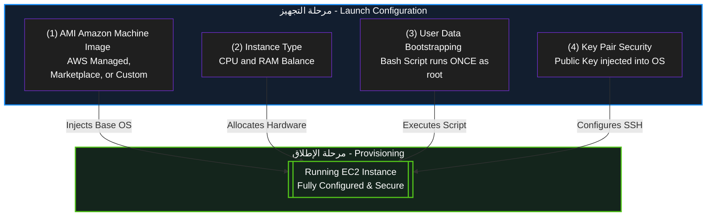

---
## 2. أمن السيرفرات: مجموعات الأمان (Security Groups)

**أصل الحكاية (The Core Problem):**

أي سيرفر EC2 بتخلقه وبتديله (Public IP) عشان الناس تدخله من على النت، بيبقى عامل زي بيت بيبانه وشبابيكه مفتوحة في شارع ضلمة؛ أي هاكر يقدر يعمل عليه (Port Scan) ويدخله. في الـ IT القديم، كنا بنشتري أجهزة (Hardware Firewalls) غالية جداً ونحطها على باب الشركة. في السحابة، أمازون اخترعت الـ **Security Groups (SG)**: ده فايروال افتراضي (Virtual Firewall) مجاني، بيحوط السيرفر بتاعك كأنه "درع شخصي"، وبيفلتر أي داتا داخلة أو طالعة.

### ⚙️ القواعد الهندسية للـ Security Groups (دستور الامتحان)

الـ Security Groups مش بتشتغل بالبركة، ليها 4 قواعد صارمة الامتحان بيلعب عليهم في السيناريوهات:

#### 1. مبدأ المنع الافتراضي (Default Deny)

- **القاعدة:** أول ما بتخلق SG جديد، بيكون **مانع كل حاجة داخلة للسيرفر (Inbound = Deny All)**، و**سامح بكل حاجة طالعة من السيرفر (Outbound = Allow All)**.
    
- **السيناريو:** لو عملت سيرفر وسطبت عليه موقع، الموقع مش هيفتح للناس إلا لو إنت دخلت بنفسك فتحت (Port 80 للـ HTTP) أو (Port 443 للـ HTTPS) في الـ Inbound Rules.
    

#### 2. حالة الاتصال (Stateful) - 🚨 [أهم تريكة في الامتحان]

- **المعنى المعماري:** الـ Security Group عندها "ذاكرة". يعني لو هي سمحت لريكويست إنه يدخل (Inbound)، هتسمح للرد بتاع الـ ريكويست ده إنه يخرج (Outbound) أوتوماتيك، **حتى لو إنت قافل كل الـ Outbound Rules!**
    
- **الفرق الجوهري:** في فايروال تاني في أمازون اسمه (NACL) ده بيكون (Stateless) مابيفهمش، لو فتحت الدخول لازم تفتح الخروج بإيدك. لكن الـ SG ذكية (Stateful).
    

#### 3. القواعد الإيجابية فقط (Allow Rules Only)

- إنت في الـ SG تقدر تقول: "اسمح لـ IP كذا إنه يدخل".
    
- لكن **مستحيل** تقول: "امنع IP كذا إنه يدخل". الـ SG مفيهاش (Deny Rules). لو عايز تمنع حد معين، بتسيبه بره القواعد المسموحة، فالـ SG هتمنعه بالديفولت.
    

#### 4. لغة التخاطب (IPs vs Security Groups)

- في الـ Inbound Rules، ممكن تفتح الباب لـ IP معين (مثلاً IP بيتك عشان تعمل SSH).
    
- **الحركة المعمارية الأذكى:** تقدر تفتح الباب لـ Security Group تانية!
    
    - _مثال:_ عندك سيرفر داتابيز (EC2-DB). بدل ما تفتحه للنت، هتقوله في الـ SG بتاعته: "ماتقبلش أي ريكويستات إلا لو جاية من الـ SG بتاعة سيرفر الـ Laravel (EC2-Web)". دي بتعمل طبقة حماية مرعبة (Micro-segmentation).
        

### 🏗️ اللوحة المعمارية: كيف يعمل الـ Security Group (Mermaid)

الرسمة دي بتوضح قاعدة الـ (Stateful) وإزاي الدرع بيحمي السيرفر:

Code snippet

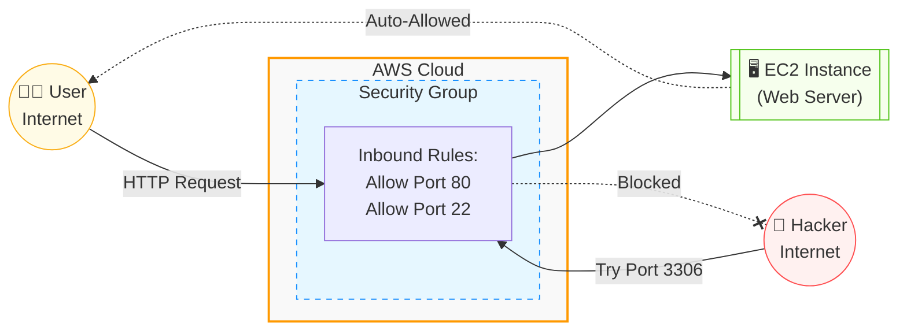


---
## 3. أنظمة الدفع وتسعير خوادم EC2 (Pricing Models)

أمازون عملت 4 أنظمة دفع (Payment Methods) عشان تناسب كل السيناريوهات. اختيار النظام الغلط ممكن يخسّر الشركة ملايين، عشان كده الأسئلة دي **مؤكدة 100% في الامتحان**.

### ⚙️ تفكيك خطط الدفع (للامتحان)

#### (1) الدفع عند الاستخدام (On-Demand Instances)

- **الفكرة:** بتأجر السيرفر وتدفع بالثانية (أو بالساعة) اللي بيشتغل فيها بس. مفيش أي عقود ولا التزامات مقدمة.
    
- **الاستخدام (سيناريو الامتحان):** لو عندك أبلكيشن جديد لسه بتجربه ومش عارف الترافيك بتاعه هيكون إيه (Unpredictable workloads)، أو بتعمل (Test/Dev) لفترة قصيرة.
    
- **العيب:** دي **أغلى** خطة دفع عادية في أمازون.
    

#### (2) الخوادم المحجوزة (Reserved Instances - RI) & (Savings Plans)

- **الفكرة:** إنت بتمضي عقد مع أمازون إنك هتفضل تستخدم السيرفرات دي لمدة (سنة أو 3 سنين). مقابل العقد والالتزام ده، أمازون بتعملك خصم بيوصل لـ **72%** من سعر الـ On-Demand.
    
- **الاستخدام (سيناريو الامتحان):** لو الأبلكيشن بتاعك شغال 24/7 وحالته مستقرة (Steady-state workloads)، زي قواعد البيانات الأساسية للشركة أو موقع شغال بقاله سنين.
    

#### (3) الخوادم الرخيصة (Spot Instances) - 🚨 [أكثر سؤال بيتكرر]

- **الفكرة:** أمازون عندها سيرفرات فاضية في الداتا سنتر محدش مأجرها، فبتعرضها بخصم مرعب بيوصل لـ **90%**!
    
- **الكارثة (الشرط):** أمازون تقدر تسحب منك السيرفر ده وتطفيه في أي لحظة (بتديك إنذار دقيقتين بس) لو حد تاني احتاجه ودفع سعره On-Demand.
    
- **الاستخدام (سيناريو الامتحان):** العمليات اللي "عادي لو وقفت ونكملها بعدين" زي (Batch Processing)، ريندر الفيديوهات، تحليل البيانات، أو معالجة الصور.
    
- **تحذير:** إياك تختارها في الامتحان لو السيناريو بيقولك "تطبيق ويب بيخدم عملاء حالياً" أو "داتابيز حرجة".
    

#### (4) الخوادم المخصصة (Dedicated Hosts)

- **الفكرة:** إنت بتأجر "سيرفر حديد" بالكامل ليك لوحدك في الداتا سنتر، محدش من عملاء أمازون التانيين بيشاركك فيه.
    
- **الاستخدام (سيناريو الامتحان):** في حالتين بس:
    
    - لو الشركة عندها **قوانين امتثال صارمة (Strict Compliance)** بتمنع مشاركة الهاردوير لأسباب أمنية.
        
    - لو عندك **رخصة سوفت وير (Software License)** خاصة بشركتك (زي Windows Server أو Oracle) بتشترط إنها تنزل على هاردوير محدد ومستقل.
        
- **العيب:** دي أغلى حاجة ممكن تأجرها في أمازون على الإطلاق.
    

### 🏗️ خريطة اتخاذ القرار في التسعير (Mermaid)

الرسمة دي بتلخصلك إزاي تختار الإجابة الصح في الامتحان بناءً على الكلمة الدلالية (Keyword) اللي في السيناريو:


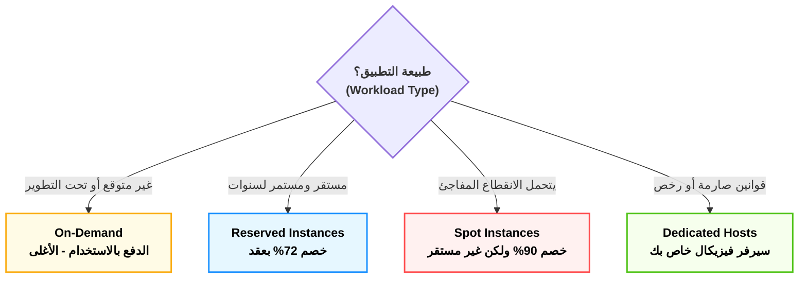

---

### 📊 جدول المقارنة الشامل لخطط تسعير EC2 (الخلاصة للامتحان)

|**خطة الدفع (Pricing Model)**|**التكلفة والخصم**|**الفكرة الجوهرية (المعنى الهندسي)**|**الكلمة الدلالية في الامتحان (Exam Keywords)**|
|---|---|---|---|
|**On-Demand**<br><br>  <br><br>(الدفع عند الاستخدام)|الأغلى (بدون خصم)|تأجير حر بالثانية/الساعة بدون أي عقود أو التزامات مسبقة.|Unpredictable, Spiky, Short-term, Testing & Development|
|**Reserved Instances**<br><br>  <br><br>(الخوادم المحجوزة)|خصم يصل لـ **72%**|عقد التزام (Commitment) لمدة سنة أو 3 سنوات مع أمازون.|Steady-state, Predictable, Long-term, 1 or 3 years commitment|
|**Spot Instances**<br><br>  <br><br>(الخوادم الرخيصة الفائضة)|خصم يصل لـ **90%**|استغلال هاردوير أمازون الفاضي، لكن يمكن سحبه بإنذار (دقيقتين) فقط!|Fault-tolerant, Batch processing, Can be interrupted, Stateless|
|**Dedicated Hosts**<br><br>  <br><br>(الخوادم المخصصة)|الأغلى على الإطلاق|سيرفر فيزيكال كامل (Hardware) مخصص لشركتك فقط غير مشترك مع أحد.|Strict Compliance, Regulatory requirements, Software Licensing (BYOL)|

> [!info] نصيحة أخيرة للحل السريع
> 
> في الامتحان، أول ما عينك تلمح كلمة **(Interruptible)** أو **(Batch)** روح فوراً للـ **Spot**. وأول ما تلمح كلمة **(License)** أو **(Compliance)** اختار **Dedicated Hosts** وإنت مغمض!

---
## 4. المكملات الهندسية لـ EC2 (تريكات مخفية في الامتحان)

في 3 مفاهيم أساسية بيكملوا معمارية الـ EC2، وأسئلتهم بتيجي في الامتحان على هيئة "فخوخ" (Traps):

### (1) العناوين الثابتة: Elastic IP (EIP)

- **المشكلة:** لما بتعمل سيرفر EC2 جديد (مثلاً عليه مشروع Laravel 13)، أمازون بتديله Public IP مجاني عشان الناس تدخله. الكارثة إنك لو عملت للسيرفر (Stop) ورجعت عملتله (Start)، الـ IP ده بيتغير! لو إنت رابط الـ IP ده بدومين (زي .com)، الموقع هيقع.
    
- **الحل المعماري:** الـ **Elastic IP**. ده IP ثابت (Static IPv4) إنت بتحجزه لنفسك ويفضل بتاعك للأبد، وتربطه بالسيرفر، ولو السيرفر عمل ريستارت هيفضل الـ IP زي ما هو.
    
- 🚨 **فخ الامتحان (التسعير الغريب):** الـ Elastic IP **مجاني** طول ما هو مربوط بسيرفر شغال (Running). لكن لو إنت حاجزه وراميه عندك ومش رابطه بسيرفر، أو رابطه بسيرفر مطفي (Stopped).. **أمازون هتبدأ تسحب منك فلوس عليه!** (بيعملوا كده عشان الناس ماتحجزش الـ IPs وتخلصها على الفاضي).
    

### (2) فخ التسعير: Dedicated Hosts vs Dedicated Instances

في الامتحان، هيحاول يلخبطك بين الاتنين دول لأنهم شبه بعض جداً:

- **Dedicated Instances (الخوادم المخصصة):** سيرفرات شغالة على هاردوير (Physical Server) مخصص لشركتك إنت بس. مفيش أي عميل تاني من أمازون هيشاركك نفس الحديدة. (تستخدم للـ Compliance والأمان العادي).
    
- **Dedicated Hosts (المضيف المخصص):** نفس اللي فوق، بس بيزيد عليها إن أمازون بتديك **(Visibility - رؤية كاملة)** لعدد الـ Sockets والـ Cores بتاعة البروسيسور.
    
- 🚨 **الكلمة الدلالية (Keyword):** أول ما تشوف في السؤال كلمة **BYOL (Bring Your Own License)** أو رخص سوفت وير بتتحاسب بعدد الكورز (زي Oracle أو Windows Server)، إياك تختار Instances، لازم تختار **Dedicated Hosts**!
    

### (3) مجموعات التسكين (Placement Groups)

أمازون بتسألك: "عايزني أرصلك السيرفرات بتاعتك فين في الداتا سنتر؟"

ليها 3 استراتيجيات (كل واحدة لسيناريو معين):

1. **Cluster (التكتل):**
    
    - **الفكرة:** بنرص السيرفرات كلها في نفس الـ Rack (نفس الدولاب) جنب بعض بالظبط.
        
    - **السيناريو:** لو عندك سيرفرات بتكلم بعض بسرعة جنونية ومحتاج (Low Latency) وتأخير شبه معدوم، زي الـ High Performance Computing (HPC).
        
    - **العيب:** لو الـ Rack ده الكهربا قطعت عنه، السيرفرات كلها هتقع مرة واحدة.
        
2. **Spread (الانتشار):**
    
    - **الفكرة:** بنوزع السيرفرات بحيث كل سيرفر يتحط في (Rack) مستقل، ليه كهربا ونتورك مختلفة.
        
    - **السيناريو:** لو عندك أبلكيشن حساس جداً (Critical Application) ومش عايز أي نسبة خطأ (High Availability). لو راك ولع، الباقي شغال.
        
    - **العيب:** الحد الأقصى 7 سيرفرات بس في كل منطقة (AZ).
        
3. **Partition (التقسيم):**
    
    - **الفكرة:** بنقسم السيرفرات لـ (مجموعات/Partitions). كل مجموعة في Rack لوحدها.
        
    - **السيناريو:** بتستخدم دايماً مع الـ Big Data وأنظمة قواعد البيانات الموزعة زي (Hadoop, Cassandra, Kafka).
        


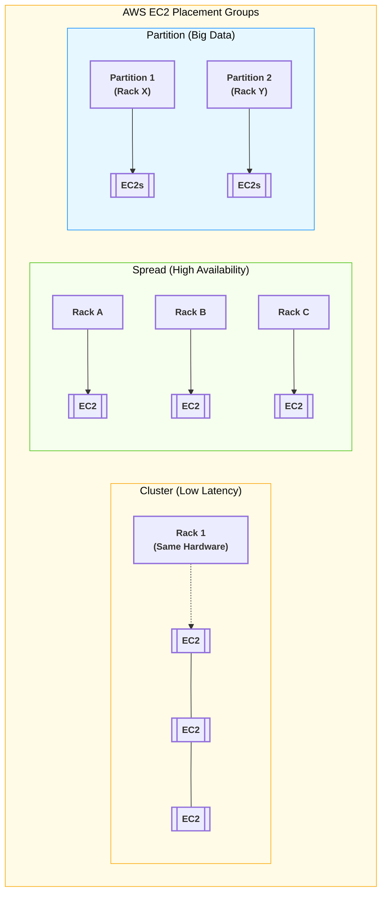

----
## 2. عوالم التخزين المرفقة (Attached Storage) - الجزء الأول: معمارية EBS

**أصل الحكاية والمشكلة الأساسية:**

أي سيرفر EC2 بتخلقه محتاج "هارد ديسك" عشان يتسطب عليه نظام التشغيل (Linux/Windows) وتتخزن عليه ملفاتك وقواعد البيانات. في السيرفرات القديمة (On-Premises)، الهارد كان بيبقى راكب بمسامير جوه اللوحة الأم، ولو المازربورد اتحرقت، الداتا كلها بتطير.

أمازون غيرت اللعبة دي واخترعت ما يسمى بـ **(التخزين المربوط بالشبكة - Network-Attached Storage)**. الهارد بقى مفصول عن السيرفر فيزيكال، ومربوط بيه بكابل شبكة داخلي فائق السرعة. يعني لو السيرفر ولع، الهارد هيفضل سليم وتقدر توصله بسيرفر تاني في ثواني!

### ⚙️ التشريح العميق لـ Amazon EBS (Elastic Block Store)

عشان تفهم الـ EBS صح وتحل أسئلته المعقدة في الامتحان، لازم نفكك اسمه ونفهم القوانين اللي بتحكمه:

#### (أ) يعني إيه Block Storage (تخزين الكتل)؟

- **المعنى الهندسي:** الهارد ده بيقسم الداتا لـ "بلوكات" (Blocks) صغيرة جداً بحجم ثابت.
    
- **ليه ده يهمنا؟** تخيل عندك قاعدة بيانات (Database) حجمها 50 جيجا، وفي يوزر عمل Update لحرف واحد في اسمه. لو الهارد ده بيخزن كـ (ملفات كاملة)، هيضطر يمسح الـ 50 جيجا ويكتبهم من جديد عشان حرف! لكن في الـ (Block Storage)، الهارد بيروح للبلوك المعين (اللي حجمه كام كيلو بايت) اللي فيه الحرف ده ويعدله بس في أجزاء من الثانية.
    
- **الخلاصة للامتحان:** الـ EBS **سريع جداً جداً** ومثالي لأنظمة التشغيل وقواعد البيانات (Databases) اللي محتاجة سرعة قراءة وكتابة لحظية.
    

#### (ب) القوانين المعمارية الصارمة للـ EBS (دستور الامتحان)

الـ EBS ليه 3 قوانين حاكمة مستحيل كسرها، والامتحان بيلعب عليهم في السيناريوهات:

1. **حبيس المنطقة (AZ Locked):**
    
    لما بتخلق هارد EBS، بيتولد جوه مبنى واحد (Availability Zone - مثلاً `us-east-1a`). السيرفر (EC2) اللي هيركب عليه لازم وحتماً يكون معاه في نفس الـ AZ.
    
    _(السبب: الهارد والسيرفر مربوطين بكابلات. مستحيل تركب هارد في مبنى `1a` على سيرفر في مبنى `1b` لأن الكابل مش هيوصل والسرعة هتقل)._
    
2. **الزواج الفردي (One-to-One):**
    
    هارد الـ EBS العادي بيركب في **سيرفر واحد فقط** في نفس اللحظة. مينفعش تجيب سيرفرين وتوصلهم بنفس هارد الـ EBS العادي عشان يقرأوا ويكتبوا مع بعض. (عشان تعمل كده هتحتاج هارد EFS اللي هنشرحه في الجزء الثالث).
    
3. **البقاء أو الفناء (Delete on Termination):**
    
    دي تريكة خبيثة جداً في الامتحان وفي بيئة العمل:
    
    - **الهارد الأساسي (Root Volume):** ده اللي بينزل عليه نظام التشغيل. الديفولت بتاعه إنه **بيتمسح ويُدمر أوتوماتيك** لو إنت مسحت السيرفر (Terminated).
        
    - **الهاردات الإضافية (Data Volumes):** دي اللي بتركبها عشان تشيل عليها الداتابيز أو الصور. الديفولت بتاعها إنها **بتفضل عايشة** حتى لو السيرفر اتدمر.
        
        _(ملاحظة: إنت كمهندس تقدر تغير الإعدادات دي براحتك قبل إطلاق السيرفر)._
        

#### (ج) اللقطات الاحتياطية (EBS Snapshots) - الهروب من السجن

- **المشكلة:** طالما الهارد "حبيس" في مبنى `1a`، إزاي أعمل منه باك أب (Backup) وأنقله لمبنى `1b` عشان أحمي الأبلكيشن لو المبنى الأول وقع؟
    
- **الحل المعماري (Snapshot):** إنت بتاخد "لقطة" (صورة طبق الأصل) من الهارد.
    
    - اللقطة دي مش بتتخزن على EBS، دي بتروح تتخزن في خدمة التخزين العملاقة **(Amazon S3)** لأنها أرخص وبتتوزع على كل المباني.
        
    - بعدها بتروح للمبنى التاني `1b`، وتقوله "اصنعلي هارد EBS جديد من اللقطة اللي متخزنة في الـ S3". وكده إنت استنسخت الهارد ونقلته من مبنى لمبنى!
        

> [!info] معلومة هامة للامتحان (Incremental Backups)
> 
> الـ Snapshots في أمازون بتشتغل بنظام (الزيادة التراكمية - Incremental). يعني أول لقطة بتاخد مساحة الهارد كله (مثلاً 10 جيجا). لو ضفت ملف حجمه 1 جيجا وأخدت لقطة تانية، اللقطة التانية هتحفظ الـ 1 جيجا الجديد بس، وده بيوفرلك فلوس كتير جداً في التخزين!


```mermaid
flowchart TD
    classDef default font-weight:bold,font-size:14px,stroke-width:2px;

    subgraph Region ["AWS Region (e.g., us-east-1)"]
        direction LR
        
        subgraph AZ_A ["Availability Zone A (us-east-1a)"]
            direction TB
            EC2_1[["🖥️ EC2 Instance</br>(App Server)"]]
            EBS_1[("💾 EBS Volume</br>Network Attached")]
            
            EC2_1 <==>|Fast Local Network| EBS_1
        end

        S3[("🪣 Amazon S3</br>Global Storage</br>Holds Snapshots")]

        subgraph AZ_B ["Availability Zone B (us-east-1b)"]
            direction TB
            EBS_2[("💾 New EBS Volume</br>Created from Snapshot")]
            EC2_2[["🖥️ New EC2 Instance</br>(Backup Server)"]]
            
            EBS_2 <==>|Fast Local Network| EC2_2
        end

        %% Snapshot Travel Process
        EBS_1 -.->|Take Snapshot| S3
        S3 -.->|Restore Snapshot| EBS_2
    end

    classDef ec2 fill:#f6ffed,stroke:#52c41a,color:#000;
    classDef ebs fill:#e6f7ff,stroke:#1890ff,color:#000;
    classDef s3 fill:#fffbe6,stroke:#faad14,color:#000;
    classDef az fill:#fdfdfd,stroke:#ff4d4f,stroke-width:3px,color:#000,stroke-dasharray: 5 5;

    class EC2_1,EC2_2 ec2;
    class EBS_1,EBS_2 ebs;
    class S3 s3;
    class AZ_A,AZ_B az;
```

---
##  الجزء الثاني: أنواع هاردات EBS (SSD vs HDD)

**أصل الحكاية (The Core Problem):**

ليه أمازون معملتش هارد واحد موحد وخلاص؟ لأن الداتا مش زي بعضها. لو إنت بتعمل سيرفر داتابيز (PostgreSQL) عليه ملايين العمليات في الثانية، إنت محتاج هارد "سريع جداً". لكن لو بتخزن ملفات "سجلات" (Logs) مش بتفتحها غير مرة كل كام شهر، حرام تدفع فلوس في هارد سريع!

عشان كده، أمازون قسمت الـ EBS لعائلتين كبار: **SSD** (سريع وغالي)، و **HDD** (بطيء ورخيص).

### ⚙️ فك طلاسم السرعة (IOPS vs Throughput)

قبل ما نحفظ أنواع الهاردات، لازم نفهم أمازون بتقيس سرعة الهارد إزاي في الكواليس:

1. **الـ IOPS (Input/Output Operations Per Second):** - ده مقياس **"سرعة الاستجابة"**. تخيل إنك بتبعت آلاف العربيات الملاكي الصغيرة والسريعة جداً.
    
    - **الاستخدام:** قواعد البيانات (Databases) اللي بتكتب وتقرأ أرقام صغيرة جداً بس بمعدل ملايين المرات في الثانية (Low Latency).
        
2. **الـ Throughput (معدل النقل - MiB/s):**
    
    - ده مقياس **"عرض الماسورة"**. تخيل إنك بتبعت عربية نقل مقطورة بطيئة، بس بتشيل أطنان من البضاعة في النقلة الواحدة.
        
    - **الاستخدام:** الـ Big Data ونقل الفيديوهات والملفات الضخمة اللي بتتقرأ ورا بعضها (Sequential Data).
        

### ⚙️ عائلات الـ EBS (دستور الامتحان)

#### أولاً: عائلة الـ SSD (Solid State Drives)

دي الهاردات السريعة اللي بتعتمد على الـ IOPS.

> [!info] ملاحظة هامة
> 
> عائلة الـ SSD هي **الوحيدة** اللي مسموح تنزل عليها نظام تشغيل (Boot Volumes).

- **(1) الهارد المتوازن: General Purpose SSD (gp2 / gp3)**
    
    - **الفكرة:** هارد بيوازن بين السعر والأداء. ده "الديفولت" بتاع أمازون لأي سيرفر جديد.
        
    - **التريكة الهندسية:** في الـ `gp2` القديم، السرعة (IOPS) كانت مربوطة بحجم الهارد. يعني لو عايز سرعة أكبر، لازم تشتري جيجات أكتر حتى لو مش محتاجها! أمازون حلت المشكلة دي في الـ `gp3`، وبقيت تقدر ترفع السرعة لوحدها من غير ما تزود الحجم (عشان توفر فلوس).
        
    - **سيناريو الامتحان:** أي تطبيق ويب عادي (زي تطبيق بـ Laravel)، أو Boot volume، أو بيئات التطوير والاختبار.
        
- **(2) الوحش الكاسر: Provisioned IOPS SSD (io1 / io2 / io2 Block Express)**
    
    - **الفكرة:** أغلى وأسرع هارد في أمازون، مخصص للأنظمة الحرجة جداً (Mission-Critical).
        
    - **السيناريو:** لو الداتابيز بتاعتك محتاجة أكتر من `16,000 IOPS` (سرعة جنونية)، أو لو الأبلكيشن بتاعك بيتعامل مع معاملات مالية (Billion-dollar DBs) ومفيش أي مجال للتأخير.
        
    - **الكلمات الدلالية في الامتحان:** `Critical Database`, `High IOPS`, `Sub-millisecond Latency`, `> 16,000 IOPS`.
        

#### ثانياً: عائلة الـ HDD (Hard Disk Drives)

دي هاردات ميكانيكية بتعتمد على عرض الماسورة (Throughput).

> [!warning] تحذير امتحان صارم
> 
> عائلة الـ HDD **مستحيل** تنزل عليها نظام تشغيل (Cannot be a Boot Volume). دي بتستخدم كهاردات "إضافية" للداتا فقط.

- **(3) هارد النقل الضخم: Throughput Optimized HDD (st1)**
    
    - **الفكرة:** هارد الماسورة الواسعة. رخيص ومصمم لنقل الداتا الضخمة والمستمرة.
        
    - **السيناريو:** الـ Big Data، أنظمة الـ Data Warehouses، ومعالجة سجلات النظام (Log Processing).
        
    - **الكلمات الدلالية:** `Big Data`, `Data Warehouse`, `Streaming workloads`.
        
- **(4) هارد الأرشيف: Cold HDD (sc1)**
    
    - **الفكرة:** ده "أرخص" هارد EBS في أمازون على الإطلاق.
        
    - **السيناريو:** الداتا "الباردة" (Cold Data) اللي محتاجينها تفضل واصلة بالسيرفر عشان لو احتاجنالها، بس مش بندخل عليها غير نادراً جداً.
        
    - **الكلمات الدلالية:** `Lowest Cost`, `Infrequently Accessed`, `Archive`.
        


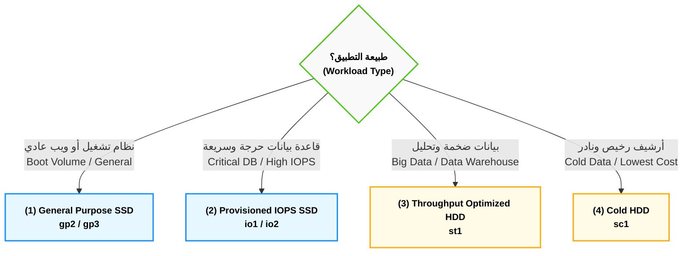

---
##  الجزء الثالث: الهارد المشترك (Amazon EFS)

**أصل الحكاية والمشكلة الأساسية:**

في الـ EBS، الهارد بيركب في "سيرفر واحد" وفي "مبنى واحد (AZ)". طب لو عندي سيستم كبير شغال وراه 10 سيرفرات EC2 متوزعين في 3 مباني (AZs) مختلفة، وكلهم محتاجين يقرأوا ويكتبوا في نفس الفولدر (`/uploads`) في نفس اللحظة؟

لو يوزر رفع صورة، هتنزل على سيرفر 1. لو يوزر تاني دخل والـ Load Balancer رماه على سيرفر 2، مش هيلاقي الصورة!

من هنا أمازون اخترعت الـ **EFS (Elastic File System)**: ده "هارد شبكي مشترك" (Shared File System) موجود في السحابة، بيكبر لوحده، بيوصل لآلاف السيرفرات في نفس اللحظة، وعابر للمباني (Multi-AZ).

### ⚙️ القواعد الهندسية للـ EFS (دستور الامتحان)

الـ EFS ليه قوانين صارمة جداً، وأسئلته في الامتحان بتيجي "مباشرة" لو إنت حافظ التريكات دي:

#### (أ) حصرية نظام التشغيل (Linux Only) - 🚨 [فخ الامتحان الأول]

- **القاعدة:** الـ EFS مصمم عشان يشتغل ببروتوكول اسمه (NFSv4 - Network File System)، وده بروتوكول بيفهمه اللينكس بس (زي Ubuntu و Amazon Linux).
    
- **سيناريو الامتحان:** لو جابلك سؤال بيقولك الشركة عندها سيرفرات **Windows** ومحتاجين هارد مشترك.. **إياك تختار EFS!** الإجابة الصح وقتها هتكون خدمة تانية خالص اسمها **Amazon FSx for Windows**.
    

#### (ب) التواجد في عدة مباني (Multi-AZ Built-in)

الداتا اللي بتترفع على الـ EFS بتتنسخ في الكواليس بشكل لحظي (Synchronously) في أكتر من AZ جوه الـ Region. يعني الـ High Availability بتاعته مبنية جواه. مش محتاج تعمل Snapshots عشان تحمي الداتا من إن مبنى يقع، هو بيحمي نفسه.

#### (ج) التمدد التلقائي والتسعير (Elasticity & Pricing)

- **في الـ EBS:** إنت بتشتري هارد 100 جيجا، بتدفع تمنهم بالكامل سواء حطيت فيهم ملفات أو سيبتهم فاضيين.
    
- **في الـ EFS:** إنت **مابتحددش مساحة أصلاً**. الهارد ده بيكبر ويصغر أوتوماتيك على حسب الملفات اللي جواه، وبتدفع تمن الجيجات اللي إنت ماليها بالظبط.
    
- **العيب المعماري (Trade-off):** الـ EFS **أغلى بكتير** من الـ EBS (تقريباً 3 أضعاف السعر)، عشان كده بنستخدمه للضرورة القصوى (للملفات المشتركة بس، مش لنظام التشغيل).
    

### ⚙️ طبقات التوفير الذكية (EFS Storage Classes)

بما إن الـ EFS غالي، أمازون عملت فيه "طبقات" (Tiers) عشان توفرلك فلوس بناءً على استخدامك للملفات:

1. **الطبقة القياسية (Standard):**
    
    دي للملفات الساخنة اللي السيرفرات بتفتحها وتعدل فيها كل يوم (ودي الطبقة الأغلى).
    
2. **طبقة الوصول النادر (EFS-IA - Infrequent Access):**
    
    للملفات اللي مش بتفتحها كتير. السعر هنا بيقل جداً (أرخص بحوالي 92%)، بس أمازون بتفرض عليك "رسوم بسيطة" كل مرة تفتح فيها الملف.
    
3. **نظام الإدارة الآلي (Lifecycle Management):**
    
    إنت بتشغل الخاصية دي في الإعدادات وتقوله: "أي ملف على الـ EFS محدش فتحه بقاله 30 يوم، انقله أوتوماتيك من طبقة الـ Standard لطبقة الـ IA عشان أوفر فاتورتي". دي بتيجي في الامتحان تحت كلمة (Cost Optimization for EFS).
    

> [!info] ملاحظة هندسية للامتحان (EFS One Zone)
> 
> لو إنت بتعمل بيئة تجارب (Test/Dev) ومش فارق معاك لو الداتا ضاعت، ممكن تختار (EFS One Zone). ده بيخزن الداتا في AZ واحدة بس، وده بيخليه أرخص 47% من الـ EFS العادي. بس لو الـ AZ دي وقعت، الداتا بتاعتك كلها طارت.


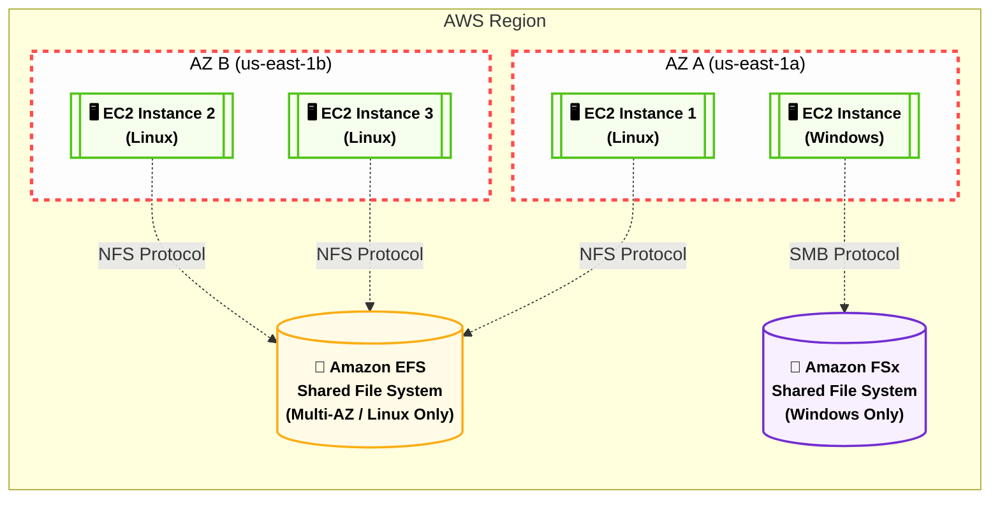

---
## الجزء الرابع: الخلاصة وشفرات الامتحان

**أصل الحكاية:**

في امتحان الـ CLF-C02، أمازون مش بتختبر حفظك للتعريفات، هي بتختبر قدرتك كـ (Architect) إنك تختار الأداة الصح للسيناريو الصح بأقل تكلفة. الأسئلة هنا بتيجي في شكل "شركة عندها تطبيق بيعمل كذا.. تختار أنهي نوع تخزين؟"

### ⚙️ شفرات الامتحان (The Exam Keywords)

أول ما تشوف الكلمات دي في السؤال، اختار الخدمة دي وإنت مغمض:

#### (أ) شفرات الـ EBS (Elastic Block Store)

- `Boot Volume` أو `Operating System` ➔ **EBS (gp2/gp3)**
    
- `Relational Database`, `Low Latency`, `High IOPS` ➔ **EBS (io1/io2)**
    
- `Single EC2 instance`, `Block level storage` ➔ **EBS**
    
- `Backup to another AZ/Region` ➔ **EBS Snapshots**
    

#### (ب) شفرات الـ EFS (Elastic File System)

- `Shared File System`, `Hundreds of EC2 instances` ➔ **EFS**
    
- `Linux instances`, `NFS protocol` ➔ **EFS**
    
- `Multi-AZ shared storage`, `Grows automatically` ➔ **EFS**
    

#### (ج) شفرات الـ FSx (خدمات الملفات المتخصصة)

- `Windows Server`, `SMB protocol`, `Active Directory` ➔ **Amazon FSx for Windows File Server**
    
- `High Performance Computing (HPC)`, `Machine Learning`, `Lustre` ➔ **Amazon FSx for Lustre**
    

### 📊 الجدول الذهبي للمقارنة (EBS vs EFS vs FSx)

|**وجه المقارنة**|**Amazon EBS**|**Amazon EFS**|**Amazon FSx for Windows**|
|---|---|---|---|
|**نوع التخزين**|Block Storage (مكعبات)|File Storage (ملفات)|File Storage (ملفات)|
|**عدد السيرفرات المسموح**|سيرفر واحد فقط (1:1)|آلاف السيرفرات (Many:1)|آلاف السيرفرات (Many:1)|
|**نظام التشغيل المدعوم**|Windows و Linux|**Linux فقط (NFS)**|**Windows فقط (SMB)**|
|**نطاق التواجد (Scope)**|AZ واحدة فقط (مبنى واحد)|Multi-AZ (عدة مباني)|Single أو Multi-AZ|
|**التسعير (Pricing)**|تدفع للمساحة المحجوزة مسبقاً|تدفع لما تستخدمه فعلياً فقط|تدفع للمساحة المحجوزة مسبقاً|

> [!tip] نصيحة ذهبية للحل السريع
> 
> أي سؤال يطلب منك "هارد مشترك" (Shared Storage) عينك تروح فوراً على نظام التشغيل: لو قالك Linux اختار EFS، لو قالك Windows اختار FSx.


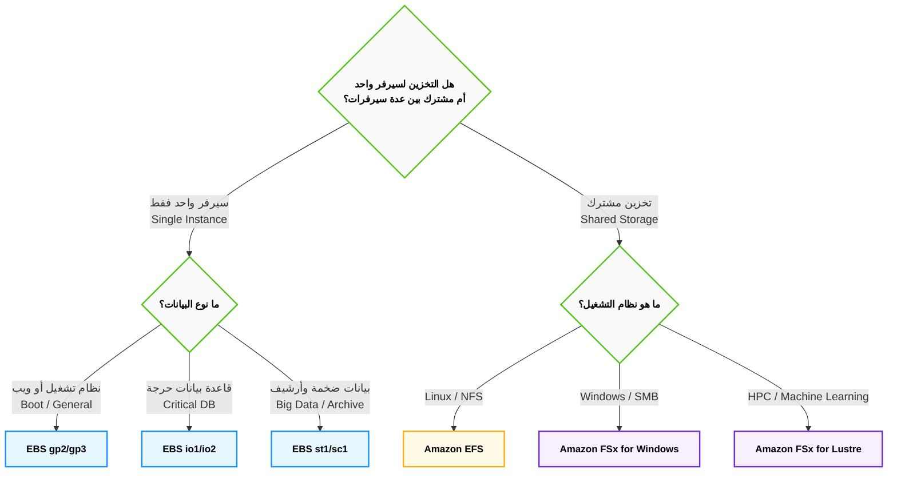

---
## 3. وحش التخزين اللانهائي (Amazon S3) - الجزء الأول: المعمارية والتشريح الدقيق

**أصل الحكاية والمشكلة المعمارية (The Core Problem):**

في عالم التخزين المرفق (EBS و EFS)، إنت محكوم بقواعد صارمة: الهارد لازم يتوصل بسيرفر (EC2)، ومقيد ببروتوكولات أنظمة التشغيل (Linux/Windows)، وليه حد أقصى في المساحة، ولازم تكون جوه شبكة أمازون المغلقة (VPC) عشان توصل للملفات.

لكن، تخيل إنك بتبني سيستم زي Netflix، أو منصة تواصل اجتماعي، أو حتى بتعمل سيستم لحفظ ملفات الـ Backup لشركتك. إنت محتاج مكان "سحري" مساحته لا نهائية، مش محتاج توصله بسيرفر أصلاً، وأي مستخدم يقدر يرفع أو ينزل ملفات من خلال الإنترنت مباشرة بـ (URL).

هنا ظهرت خدمة **Amazon S3 (Simple Storage Service)**. دي أقدم خدمة في تاريخ أمازون، والعمود الفقري للإنترنت الحديث. الـ S3 مش هارد ديسك، ده **(مخزن كيانات - Object Storage)** شغال عن طريق الـ Web APIs.

### ⚙️ التشريح العميق لمعمارية S3 (Under the Hood)

عشان تقفل أسئلة الـ S3 في الامتحان، لازم تمسح مفاهيم الهاردات العادية من دماغك، وتفهم الـ 3 أركان اللي بيقوم عليهم:

#### الركن الأول: حرب التخزين (Object Storage vs Block Storage)

الامتحان بيعشق المقارنة دي في سيناريوهات الشركات:

- **تخزين الكتل (EBS - Block Storage):** الهارد بيقطع الملف لـ "بلوكات". لو عندك ملف داتابيز (PostgreSQL) حجمه 100 جيجا، واليوزر "محمد" غير رقم تليفونه، الهارد هيروح يغير الـ 4 كيلو بايت بتوع رقم التليفون بس. (عشان كده EBS سريع جداً).
    
- **تخزين الكيانات (S3 - Object Storage):** الـ S3 بيشوف الملف كـ "صندوق أسود مقفول" (Immutable Object). لو عندك فيديو حجمه 100 جيجا على S3، وعايز تعدل فيه بيكسل واحد بس، الـ S3 مابيعرفش يعدل أجزاء.. **لازم ترفع الـ 100 جيجا كلهم من جديد فوق الملف القديم!**
    
- 🚨 **قاعدة الامتحان الصارمة:** إياك ثم إياك تختار S3 لو السيناريو بيقولك "قاعدة بيانات نشطة (Active Database)" أو "نظام تشغيل (OS)". الـ S3 مخصص فقط للملفات الثابتة (Static Files) زي الصور، الفيديوهات، ملفات الـ PDF، والـ Backups.
    

#### الركن الثاني: الحاوية (The Bucket) - قوانين الجردل

أي ملف هترفعه على S3، لازم يتحط جوه حاوية رئيسية اسمها (Bucket). الجردل ده ليه 3 قوانين دستورية في الامتحان:

1. **الاسم الفريد عالمياً (Globally Unique Name):**
    
    اسم الجردل بتاعك لازم يكون فريد على مستوى الكوكب كله في كل حسابات أمازون. ليه؟ لأن الجردل بيتحول لـ رابط إنترنت (URL) بالشكل ده: `https://my-unique-bucket.s3.amazonaws.com`. لو حد في اليابان حجز اسم `test-bucket`، إنت مستحيل تقدر تحجزه تاني أبداً.
    
2. **وهم العالمية (Global Console vs Regional Storage):**
    
    لما تفتح لوحة تحكم أمازون (Console)، هتلاقي الـ S3 مكتوب عليه (Global) زيه زي الـ IAM. بس دي خدعة!
    
    🚨 **الـ Data محبوسة:** لما بتيجي تخلق الجردل، أمازون بتجبرك تختار **Region** (مثلاً `us-east-1`). الداتا بتاعتك بتتخزن في المباني بتاعة المنطقة دي، و**مستحيل** أمازون تنقلها لمنطقة تانية من وراك (ده عشان قوانين سيادة البيانات Compliance & Data Sovereignty).
    
3. **السعة اللانهائية (Infinite Capacity):**
    
    إنت مابتحددش مساحة للجردل. الجردل ده ملوش قاع، ارمي فيه من زيرو بايت لحد إكسابايت (Exabytes)، وأمازون هتحاسبك بالجيجا اللي بتستخدمها بس.
    

#### الركن الثالث: الكيان (The Object) - تشريح الملف

الملف جوه الـ S3 مش زي الملف جوه الويندوز. الملف (Object) بيتكون من 5 أجزاء متركبة فوق بعض:

1. **المفتاح (Key):**
    
    ده مش بس اسم الملف، ده **المسار الكامل** للملف.
    
    🚨 **تريكة الفولدرات الوهمية:** الـ S3 **مفهوش فولدرات حقيقية** (Flat Namespace). لو إنت رافع صورة المسار بتاعها `images/2026/profile.jpg`، الـ S3 مش بيكريت فولدر اسمه `images` وجواه فولدر `2026`. هو بيعتبر الجملة الطويلة دي كلها هي "اسم الملف" (Key). واجهة أمازون بس هي اللي بترسملك شكل الفولدرات عشان تريح عينك (بيسموها Prefixes).
    
2. **القيمة (Value):**
    
    دي الداتا الفعلية (الـ Bytes) بتاعة الصورة أو الفيديو.
    
    _حدود الامتحان:_ مساحة الملف الواحد (Object) بتبدأ من 0 بايت لحد أقصى حاجة **5 تيرابايت (5TB)** للملف الواحد.
    
3. **البيانات الوصفية (Metadata):**
    
    معلومات عن الملف. (زي تاريخ الرفع، نوع الملف `Content-Type`، أو معلومات إنت بتضيفها بنفسك).
    
4. **العلامات (Tags):**
    
    كلمات دلالية إنت بتلزقها على الملف (مثلاً `Project: Project13` أو `Department: HR`). دي خطيرة جداً لأنك بتستخدمها عشان تظبط فواتيرك وتعرف كل مشروع بيصرف كام تخزين.
    
5. **معرف الإصدار (Version ID):**
    
    (هنشرحه بالتفصيل في جزء الحماية). كود فريد بيتحط للملف لو إنت مفعل خاصية الاحتفاظ بالنسخ القديمة.
    


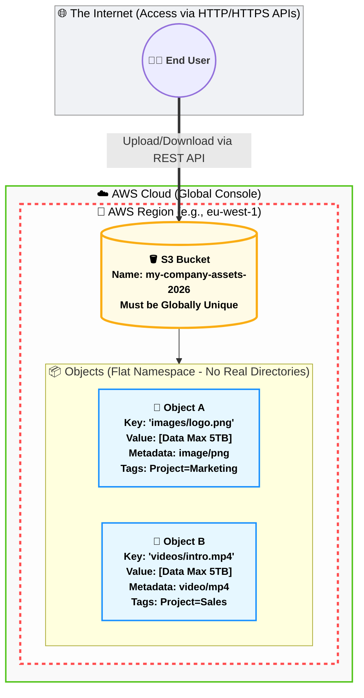
---
## الجزء الثاني: طبقات التخزين (Storage Classes)

**أصل الحكاية والمشكلة المعمارية (The Core Problem):**

تخيل إن شركتك عندها 100 تيرابايت من البيانات. البيانات دي متقسمة كالتالي:

- صور ومقالات اليوزرز بيدخلوا عليها كل ثانية.
    
- ملفات باك أب (Backup) لبيانات الشهر اللي فات، بنحتاجها مرة كل كام أسبوع.
    
- سجلات ضريبية وقانونية (Compliance) من سنة 2020، القانون بيجبرنا نحتفظ بيها 7 سنين بس إحنا مش بنفتحها أصلاً.
    

هل من العقل إننا نحط كل الداتا دي في نفس "الجردل" وندفع عليها نفس الفاتورة الغالية؟ طبعاً لأ.

أمازون عملت ما يسمى بـ **(طبقات التخزين - Storage Classes)**. الفكرة هنا عاملة زي "درجات الحرارة": الداتا الساخنة (Hot) اللي بنستخدمها كتير بتتحط في طبقة غالية وسريعة. والداتا المتجمدة (Cold) اللي مش بنفتحها بتترمي في أرخص طبقة في أمازون كلها.

_🚨 أسئلة الطبقات دي مؤكدة 100% في الامتحان، واللعبة كلها في حفظ "الكلمات الدلالية"._

### ⚙️ تفكيك طبقات التخزين (من الأغلى للأرخص)

#### (أ) طبقة الداتا الساخنة: S3 Standard

- **الفكرة:** دي الطبقة الافتراضية (Default). بتديك استجابة في أجزاء من الثانية (Milliseconds). الداتا بتاعتك بتتنسخ أوتوماتيك في 3 مباني (Multi-AZ) عشان لو مبنيين ولعوا الداتا متضيعش!
    
- **التسعير:** دي **أغلى** طبقة في الـ S3. بتدفع على التخزين، ومفيش رسوم على فتح الملفات.
    
- **سيناريو الامتحان:** `Frequently accessed data`, `Dynamic websites`, `Mobile applications`, `Default class`.
    

#### (ب) الطبقة الذكية: S3 Intelligent-Tiering

- **الفكرة:** لو إنت عندك داتا مش عارف اليوزرز هيستخدموها كتير ولا لأ (Unpredictable workload). أمازون بتشغّل "ذكاء اصطناعي" يراقب الملفات بتاعتك. لو لقى ملف محدش فتحه بقاله 30 يوم، يقوم ناقله أوتوماتيك لطبقة أرخص عشان يوفرلك فلوس، ولما حد يفتحه يرجعه تاني للطبقة الغالية.
    
- **التسعير:** بتدفع رسوم شهرية بسيطة لأمازون مقابل "المراقبة الأوتوماتيكية" دي.
    
- **سيناريو الامتحان:** `Unknown access patterns`, `Unpredictable workloads`, `Automatic cost optimization`.
    

#### (ج) طبقات الداتا الدافئة: Infrequent Access (IA)

دي للملفات اللي مش بنفتحها كل يوم، بس لما بنعوزها، بنعوزها "فوراً وبسرعة".

_هنا أمازون بتعمل معاك ديل: هقلل لك سعر التخزين جداً، بس هفرض عليك غرامة (Retrieval Fee) كل مرة تفتح فيها الملف._

1. **S3 Standard-IA (Infrequent Access):**
    
    - الداتا منسوخة في 3 مباني (Multi-AZ).
        
    - **سيناريو الامتحان:** `Disaster Recovery backups`, `Long-term storage accessed once a month`.
        
2. **S3 One Zone-IA (الطبقة الخطرة):**
    
    - **تريكة الامتحان:** دي الطبقة **الوحيدة** في الـ S3 اللي بتخزن الداتا في **(مبنى واحد فقط - Single AZ)**.
        
    - ده بيخليها أرخص بـ 20% من الـ Standard-IA، بس لو المبنى ده اتدمر، الداتا طارت للأبد!
        
    - **سيناريو الامتحان:** `Reproducible data` (داتا نقدر نعملها توليد تاني لو ضاعت، زي الـ Thumbnails بتاعة الصور المصغرة)، `Secondary backups`.
        

#### (د) عائلة التجميد العميق: Amazon Glacier

دي الداتا اللي اتجمدت وبقت "أرشيف". مساحة التخزين هنا برخص التراب، بس الفخ فين؟ الفخ إنك لو طلبت تفتح الملف، أمازون هتقولك "استنى على ما نسيحهولك!".

العائلة دي فيها 3 مستويات حسب سرعة الذوبان:

1. **S3 Glacier Instant Retrieval:**
    
    - بتفتح الملف في أجزاء من الثانية. بس سعر التخزين أغلى شوية من إخواتها. أرخص من IA لو بتفتح الداتا مرة كل ربع سنة.
        
2. **S3 Glacier Flexible Retrieval:**
    
    - عشان تفتح الملف، لازم تستنى من **دقيقة لحد 12 ساعة** حسب الفلوس اللي هتدفعها في الاسترجاع.
        
    - **سيناريو الامتحان:** `Occasional data retrieval`, `Backups not needed immediately`.
        
3. **S3 Glacier Deep Archive (أرخص شيء في أمازون):**
    
    - دي أرخص خدمة تخزين في AWS كلها. حرفياً ببلاش.
        
    - بس عشان تفتح ملف، لازم تستنى **12 ساعة كاملة**!
        
    - **سيناريو الامتحان (مؤكد):** `Regulatory compliance` (الامتثال للقوانين)، `Retain data for 7-10 years`، `Long-term archive`.
        

### ⚙️ إدارة دورة الحياة (S3 Lifecycle Rules) - المايسترو الآلي

بدل ما تدخل بنفسك تنقل الملفات من طبقة للتانية، أمازون عملتلك **Lifecycle Policies**. ده سكريبت إنت بتكتبه مرة واحدة وبيشتغل أوتوماتيك:

- _مثال معمارى:_ إنت بتقول لأمازون: "لما أرفع ملف جديد، حطه في الـ `Standard`. بعد 30 يوم، انقله للـ `Standard-IA`. بعد 90 يوم، ارميه في الـ `Glacier Deep Archive`. وبعد 365 يوم.. **امسحه خالص (Expire)**".
    
- **أهمية الامتحان:** دي الأداة الأولى لتحقيق مبدأ الـ (Cost Optimization) في التخزين.
    


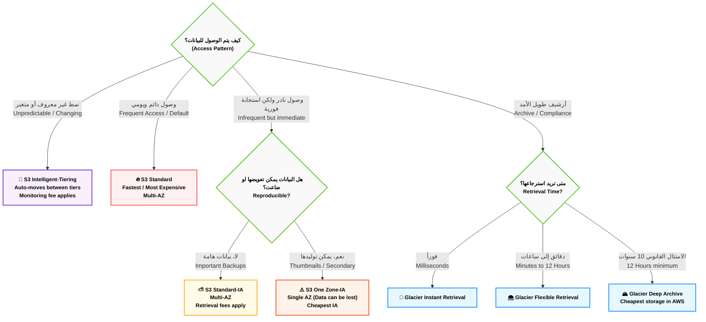

---
## الجزء الثالث: حماية البيانات والأمان (Security & Data Protection)

**أصل الحكاية والمشكلة المعمارية:**

الـ S3 بطبيعته متصل بالإنترنت. لو معملتش طبقات حماية (Layers of Security)، الداتا بتاعتك في خطر من 3 حاجات: المسح بالخطأ (Accidental Deletion)، التعديل الخاطئ (Overwrites)، وتسريب البيانات (Data Leaks).

أمازون وفرتلك ترسانة أسلحة عشان تقفل الجردل بتاعك بالضبة والمفتاح.

### ⚙️ السلاح الأول: إدارة الإصدارات (S3 Versioning) - آلة الزمن

- **المشكلة:** في الـ S3 العادي، لو رفعت ملف اسمه `index.html`، وبعدين رفعت ملف تاني بنفس الاسم، الملف القديم هيتمسح للأبد والجديد هيحل محله. طب لو مسحت الملف بالغلط؟ مفيش سلة مهملات (Recycle Bin) ترجعه منها!
    
- **الحل المعماري (Versioning):** أول ما بتفعل الخاصية دي على الجردل، الـ S3 بيشتغل كأنه (Git). لو رفعت ملف جديد بنفس الاسم، الـ S3 بيحتفظ بالملف القديم في الكواليس وبيديله (Version ID)، ويخلي الجديد هو الأساسي.
    
- **الحماية من الحذف:** لو دوست (Delete) لملف، الـ S3 مابيمسحوش بجد! هو بيحط فوقه حاجة اسمها (Delete Marker - علامة حذف) عشان يختفي من قدامك، بس لو دخلت في الإعدادات تقدر تشيل العلامة دي وترجع الملف عادي جداً!
    

> [!warning] قوانين الـ Versioning في الامتحان 🚨
> 
> 1. **طريق باتجاه واحد:** بمجرد ما تفعل الـ Versioning على جردل، **مستحيل تعمله Disable (إلغاء)**. تقدر بس تعمله (Suspend - إيقاف مؤقت).
>     
> 2. **التكلفة:** إنت بتدفع فلوس على كل الإصدارات القديمة اللي متخزنة! يعني لو ملف حجمه جيجا، وعدلته 5 مرات، إنت كده بتدفع تمن 5 جيجا مش جيجا واحدة.
>     

#### (أ) الحماية القصوى: المصادقة الثنائية للحذف (MFA Delete)

لو عايز تمنع أي حد (حتى الـ Root User بتاع الحساب) إنه يمسح إصدار قديم من الملف بشكل نهائي، بتفعل خاصية الـ `MFA Delete`. وقتها، مستحيل أمر المسح النهائي يتنفذ إلا لو الشخص معاه الموبايل بتاعك ودخل الكود المكون من 6 أرقام (زي كود البنك).

### ⚙️ السلاح الثاني: القفل الجنائي (S3 Object Lock / WORM)

- **المشكلة:** البنوك والمستشفيات عندهم قوانين حكومية (Compliance) بتجبرهم يحتفظوا بالسجلات لمدة 7 سنين بدون ما "أي مخلوق" يقدر يعدلها أو يمسحها، حتى لو كان صاحب الشركة نفسه.
    
- **الحل (WORM - Write Once, Read Many):** إكتب مرة واحدة واقرأ كتير. لما بتفعل الـ Object Lock على ملف، بتحدد مدة (مثلاً 5 سنين). خلال الـ 5 سنين دول، الملف ده **استحالة** يتمسح أو يتعدل، ولا حتى عن طريق خدمة الدعم الفني بتاعة أمازون شخصياً!
    
- **الكلمات الدلالية في الامتحان:** `Compliance`, `WORM model`, `Prevent deletion for fixed amount of time`, `Regulatory requirements`.
    

### ⚙️ السلاح الثالث: حراس البوابات (Access Control & Security)

إزاي نتحكم مين يشوف الداتا ومين لأ؟ عندنا 3 طبقات للحماية (الامتحان بيسأل في الفرق بينهم):

1. **سياسات المستخدمين (IAM Policies):**
    
    - دي بتتركب على **اليوزر (الشخص)**. يعني بكتب قاعدة أقول فيها: "المبرمج أحمد من حقه يقرأ الملفات اللي في جردل HR".
        
2. **سياسات الجردل (Bucket Policies):** - 🚨 أهم حاجة في S3
    
    - دي بتتركب على **الجردل نفسه** (Resource-based). ده ملف (JSON Document) بكتب فيه قوانين صارمة للجردل كله.
        
    - **سيناريو الامتحان:** إزاي تخلي الجردل كله (Public) عشان تستضيف عليه موقع ويب؟ عن طريق الـ Bucket Policy إنك تعمل `Allow` للـ `Principal: *` (يعني تسمح لأي حد في العالم).
        
    - **سيناريو تاني:** إزاي أجبر الناس إنهم ميرفعوش ملفات إلا لو كانوا جوه شبكة الشركة؟ بعمل Bucket Policy تمنع (Deny) أي حد הـ IP بتاعه مش بتاع الشركة.
        
3. **زرار الأمان النووي (Block Public Access - BPA):**
    
    - **المشكلة:** مبرمج صغير دخل عدل الـ Bucket Policy وخلى بيانات العملاء كلها Public بالغلط.
        
    - **الحل:** أمازون عملت خاصية اسمها (Block Public Access) ومفعلة كـ الديفولت. الخاصية دي عامله زي "السكينة الرئيسية بتاعة الكهربا". لو هي شغالة (ON)، فإنها بتعمل (Override / إبطال) لأي Bucket Policy بتسمح بالوصول العام، وتمنع الداتا إنها تطلع على النت مهما حصل!
        

### ⚙️ السلاح الرابع: التشفير (Data Encryption)

لو هاكر قدر يخترق سيرفرات أمازون ويسرق الهاردات الفيزيكال اللي عليها الداتا بتاعتك، هيلاقي الداتا دي "متشفرة" (مكتوبة بلغة غير مفهومة) ومستحيل يقرأها.

أمازون في الامتحان بتسألك عن **التشفير أثناء السكون (Encryption at Rest)** وليه طرق:

- **SSE-S3:** التشفير الأساسي، أمازون هي اللي بتشفر الداتا وهي اللي بتحتفظ بمفاتيح التشفير. _(ملاحظة: أمازون مؤخراً خلت النوع ده شغال أوتوماتيك على أي ملف يترفع بدون تدخلك)._
    
- **SSE-KMS:** إنت بتستخدم خدمة اسمها `AWS KMS` عشان تدير إنت مفاتيح التشفير بنفسك، وتعرف مين استخدم المفتاح إمتى (Auditing).
    
- **SSE-C (Customer Provided):** إنت اللي بتصنع مفتاح التشفير بره أمازون، وبتبعته لأمازون تشفر بيه الملف وبعدين أمازون بتمسح المفتاح من عندها.
    


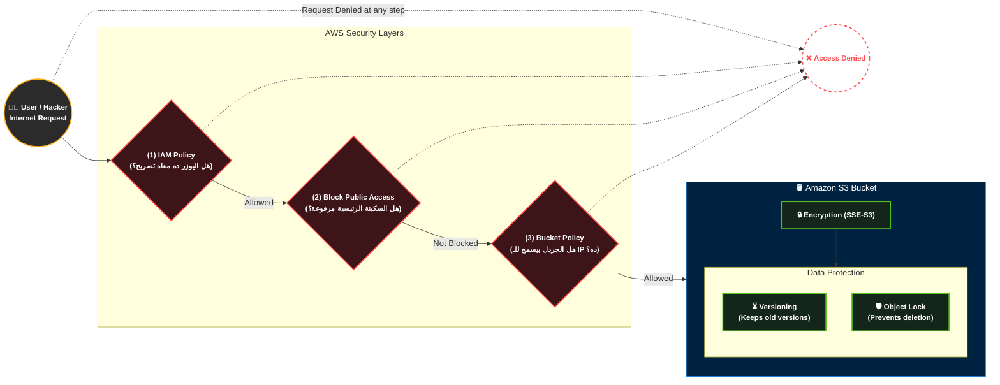

---
## الجزء الرابع: المكملات السحرية (الاستضافة والهجرة)

**أصل الحكاية (The Core Problem):**

إحنا كده فهمنا إن S3 بيخزن الداتا وبيحميها وبيوفر فلوسها. بس أمازون مبتقفش عند التخزين العادي؛ الامتحان بيختبرك في "الحلول المعمارية المبتكرة" اللي بتعتمد على S3 في الكواليس، زي إنك تشغل موقع كامل من غير ما تشتري سيرفر (EC2) أصلاً، أو إزاي تنقل "بيتابايت" من الداتا من شركتك لأمازون لو النت عندك بطيء جداً.

### ⚙️ أولاً: الاستضافة الساكنة (S3 Static Website Hosting)

- **الفكرة السحرية:** الـ S3 يقدر يشتغل كـ (Web Server) يستضيف موقعك بالكامل ويطلعه للناس على النت، وكل ده بتكلفة شبه معدومة (سنتات في الشهر) ومن غير ما تدير أي سيرفر (Serverless).
    
- **الشرط المعماري (🚨 تريكة الامتحان):** الـ S3 بيستضيف **(مواقع ساكنة - Static Websites) فقط**. يعني ملفات `HTML`, `CSS`, `JavaScript` (زي مشاريع React أو Vue.js).
    
- **الممنوعات:** **مستحيل** تشغل عليه كود (Backend) زي `PHP` (Laravel) أو `Node.js` أو `Python`، ومستحيل تركب عليه داتابيز مباشرة. لو موقعك فيه Backend، الـ S3 بيشيل الـ Frontend بس، والـ Backend بيروح لـ EC2 أو Lambda.
    
- **إعدادات الامتحان:** عشان الموقع يشتغل، لازم تعمل حاجتين:
    
    1. تقفل زرار الـ (Block Public Access).
        
    2. تضيف (Bucket Policy) بتعمل `Allow` لأكشن اسمه `s3:GetObject` لكل الناس `*`.
        

### ⚙️ ثانياً: عائلة الجليد ونقل البيانات (AWS Snow Family)

- **المشكلة:** لو شركتك عندها داتا حجمها 100 بيتابايت (Petabytes)، وعايز ترفعهم لأمازون، لو استخدمت أسرع خط إنترنت في العالم هياخد سنين!
    
- **الحل (Offline Migration):** أمازون بتبعتلك "جهاز هاردوير" لحد باب شركتك عن طريق شركة شحن. توصله في السيرفرات بتاعتك، تنقل الداتا بسرعة الكابلات، وبعدين تشحنه تاني لأمازون، وهم يفرغوه في الـ S3!
    

**أفراد العائلة (أسئلة مؤكدة في الامتحان):**

1. **AWS Snowcone:**
    
    - **الوصف:** أصغر جهاز (وزنه 2 كيلو تقريباً). بيشيل داتا من 8 لـ 14 تيرابايت.
        
    - **السيناريو:** الأماكن المتطرفة (Edge Computing) زي المستشفيات الميدانية أو السفن اللي مفيهاش نت، ومحتاجين نجمع داتا ونبعتها.
        
2. **AWS Snowball Edge:**
    
    - **الوصف:** جهاز بحجم "شنطة السفر". بيشيل داتا لحد 80 تيرابايت.
        
    - **السيناريو:** نقل الداتا الضخمة (Petabyte-scale migration)، أو معالجة الداتا محلياً في المصانع لأن الجهاز جواه (مُعالج CPU) يقدر يشغل كود قبل ما يتبعت لأمازون (Compute Optimized).
        
3. **AWS Snowmobile (شاحنة البيانات):**
    
    - **الوصف:** سيارة نقل بمقطورة (18-Wheeler Truck) بتيجي تقف قدام الداتا سنتر بتاعك!
        
    - **السيناريو:** نقل الـ (Exabytes) من البيانات (الـ 1 إكسابايت = ألف بيتابايت = مليون تيرابايت). دي بتستخدم لنقل داتا سنتر كاملة لشركة ضخمة.
        

### ⚙️ ثالثاً: بوابات التخزين الهجينة (AWS Storage Gateway)

- **المشكلة:** شركتك عندها داتا سنتر خاص بيها (On-Premises)، ومش عايزين ينقلوا كل حاجة للكلاود. عايزين يخلوا السيرفرات اللي في الشركة كأنها "متوصلة" بالـ S3 في أمازون عشان المساحة متخلصش أبداً (Hybrid Cloud Storage).
    
- **الحل (Storage Gateway):** ده سوفت وير (Virtual Machine) بتسطبه على سيرفرات الشركة بتاعتك، بيلعب دور "الكوبري" بين أجهزة الشركة وخدمات أمازون (S3, EBS, Glacier).
    

**الأنواع في الامتحان (كلمات دلالية):**

1. **بوابة الملفات (File Gateway / Amazon S3 File Gateway):**
    
    - السيرفرات بتاعتك بتتعامل معاه كأنه هارد شبكة عادي (ببروتوكولات NFS أو SMB). الكوبري بياخد الملفات دي ويرفعها أوتوماتيك لـ **Amazon S3**.
        
    - **السيناريو:** `Extend on-premises file storage to S3`, `NFS/SMB to S3`.
        
2. **بوابة الكتل (Volume Gateway):**
    
    - السيرفرات بتتعامل معاه كأنه هارد "بلوكات" (iSCSI). الكوبري بياخد الداتا ويحولها لـ **EBS Snapshots** عشان يعملها باك أب في الكلاود.
        
    - **السيناريو:** `iSCSI block storage`, `Disaster recovery with EBS snapshots`.
        
3. **بوابة الشرائط (Tape Gateway):**
    
    - في الشركات القديمة جداً، بيعملوا أرشيف للداتا على "شرائط مغناطيسية" (Physical Tapes). الكوبري ده بيوهم السيرفرات إنها لسه بتكتب على شرائط، بس هو في الحقيقة بياخد الداتا ويرميها في **Amazon Glacier**.
        
    - **السيناريو:** `Virtual Tape Library (VTL)`, `Replace physical tapes with Glacier`.
        


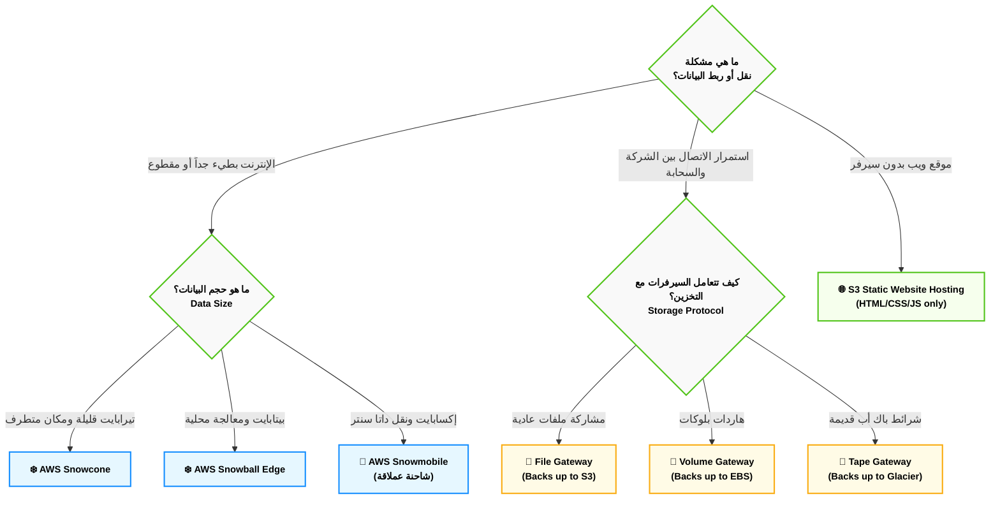

## 1. قواعد البيانات وتحليل البيانات (Databases & Analytics) - الجزء الأول: عائلة الـ SQL (RDS & Aurora)

**أصل الحكاية والمشكلة المعمارية (The Core Problem):**

زمان، لما كنا بنبني Backend قوي (زي نظام بـ Laravel 13 مثلاً)، كنا بنعمل سيرفر (EC2)، وندخل نسطب عليه قاعدة البيانات (PostgreSQL أو MySQL) بإيدينا. المشكلة إنك كمهندس كنت بتتحول لـ "حارس أمن" للداتابيز؛ لازم تعمل Backups كل يوم، تنزل تحديثات أمنية لنظام التشغيل، ولو السيرفر هنج أو الهارد باظ، الداتا بتضيع والموقع بيقع!

من هنا أمازون قالتلك: "ركز إنت في الكود وهندسة التطبيق، وسيب إدارة الداتابيز عليا". واخترعت خدمات قواعد البيانات المدارة (Managed Database Services).

### ⚙️ أولاً: خدمة قواعد البيانات العلائقية (Amazon RDS)

الـ **RDS (Relational Database Service)** هي خدمة بتخليك تطلق قاعدة بيانات (SQL) في ثواني، وأمازون بتتكفل بكل المهام الروتينية (النسخ الاحتياطي، تحديثات السوفت وير، تغيير الهاردوير، والـ Patching).

**محركات البحث المدعومة (الـ 6 محركات في الامتحان):**

الـ RDS مش داتابيز في حد ذاتها، دي "حاضنة" بتشغل 6 أنواع من قواعد البيانات:

1. Amazon Aurora (اختراع أمازون)
    
2. PostgreSQL
    
3. MySQL
    
4. MariaDB
    
5. Oracle
    
6. Microsoft SQL Server
    

#### 🛡️ استراتيجيات المعمارية في RDS (موضع أسئلة الامتحان)

الامتحان بيركز على إزاي بتخلي الداتابيز بتاعتك "مستحيل تقع" (High Availability) وإزاي "تسرعها" (Scalability).

**1. النشر في مناطق متعددة (RDS Multi-AZ Deployment): للحماية من الكوارث**

- **الفكرة:** لما بتفعل الخاصية دي، أمازون بتخلق سيرفر داتابيز "أساسي" (Primary) في مبنى (AZ-A)، وسيرفر تاني "احتياطي" (Standby) في مبنى تاني خالص (AZ-B).
    
- **الكواليس (Synchronous Replication):** أي داتا بتتكتب في الأساسي، بتتنسخ "في نفس اللحظة" للاحتياطي.
    
- **السيناريو:** لو المبنى الأول ولع، أمازون بتعمل (Automatic Failover) وتحول الـ Traffic أوتوماتيك للاحتياطي من غير ما الموقع بتاعك يقع أو الكود بتاعك يتغير.
    
- **الكلمة الدلالية في الامتحان:** `High Availability`, `Disaster Recovery`, `Automatic Failover`. 
- (🚨 **تحذير:** الـ Standby ممنوع تقرأ منه داتا، هو نايم مستني الكارثة تحصل بس).
- 
    

**2. النُسخ المخصصة للقراءة (RDS Read Replicas): لتسريع الأداء**

- **المشكلة:** تطبيقك عليه ضغط رهيب. اليوزرز بيقرأوا مقالات أو بيسحبوا تقارير ضخمة، وده مأثر على سرعة كتابة طلبات الشراء في الداتابيز.
    
- **الحل المعماري:** بتعمل (Read Replica). دي نسخة طبق الأصل من الداتابيز، بس "للقراءة فقط". بتخلي الـ Backend بتاعك يبعت كل أوامر الـ (SELECT) للنسخة دي، ويسيب الداتابيز الأساسية لأوامر الـ (INSERT / UPDATE) بس.
    
- **الكواليس (Asynchronous Replication):** النسخ هنا بياخد أجزاء من الثانية. وتقدر تعمل لحد 5 نسخ قراءة.
    
- **الكلمة الدلالية في الامتحان:** `Performance`, `Scalability`, `Read-heavy workloads`, `Offload read traffic`.

![[Pasted image 20260604151832.png]]
    
**3- النسخ المخصصة للقراءة بس في regions كامله مختلفة:**
بتعمل انت نسخ في ريجونز مختلفه بحالها بص على الصورة : 
![[Pasted image 20260604152123.png]]

### ⚙️ ثانياً: وحش أمازون الخاص (Amazon Aurora)

**أصل الحكاية:** أمازون شافت إن MySQL و PostgreSQL العاديين ليهم حدود في السرعة على الكلاود. فقررت تبني قاعدة بيانات "Cloud-Native" من الصفر، مصممة مخصوص للعمل على البنية التحتية بتاعة AWS.

**القواعد الهندسية للـ Aurora (دستور الامتحان):**

1. **التوافق التام (Compatibility):** الـ Aurora بتفهم كود **MySQL** و **PostgreSQL**. يعني لو الأبلكيشن بتاعك متبرمج عليهم، هتنقله للـ Aurora من غير ما تغير حرف في الكود.
    
2. **السرعة الخارقة:** الـ Aurora أسرع **5 مرات** من الـ MySQL العادي، وأسرع **3 مرات** من الـ PostgreSQL العادي!
    
3. **التمدد الذاتي للتخزين (Auto-scaling Storage):** إنت مابتحددش مساحة هارد للـ Aurora. هي بتبدأ بـ 10 جيجا، وكل ما تتملي، أمازون تزودها 10 جيجا أوتوماتيك لحد ما توصل لـ **256 تيرابايت**.
    
4. **حماية البيانات المجنونة (6 Copies):** أول ما بتخلق Aurora، أمازون أوتوماتيك بتنسخ الداتا بتاعتك **6 مرات** وتوزعها على **3 مباني (AZs)** مختلفة، حتى لو إنت مطلبشت ده! (ده بيخليها تقريباً من المستحيل تفقد بياناتك).
5. الاورورا اغلى من ال rds بحوالي 20% بس هي اكفأ 
    

> [!info] تريكة امتحان: Aurora Serverless
> 
> لو السيناريو بيقولك إن عندك أبلكيشن بيجيله ضغط "عشوائي وغير متوقع" (Unpredictable workloads)، وإنت مش عايز تدفع فلوس لسيرفر داتابيز شغال طول الوقت على الفاضي، الحل هو **Aurora Serverless**. دي داتابيز بتكبر وتصغر وتقفل خالص لوحدها حسب الضغط، وبتدفع بالثانية!
![[Pasted image 20260604152211.png]]

### 🏗️ اللوحة المعمارية: الفرق بين Multi-AZ و Read Replicas (Mermaid)

الخريطة دي بتوضح شكل الاتصال وإزاي بنحمي الداتابيز ونسرعها في نفس الوقت (تم استخدام `<br/>` لتوافق أوبسيديان):


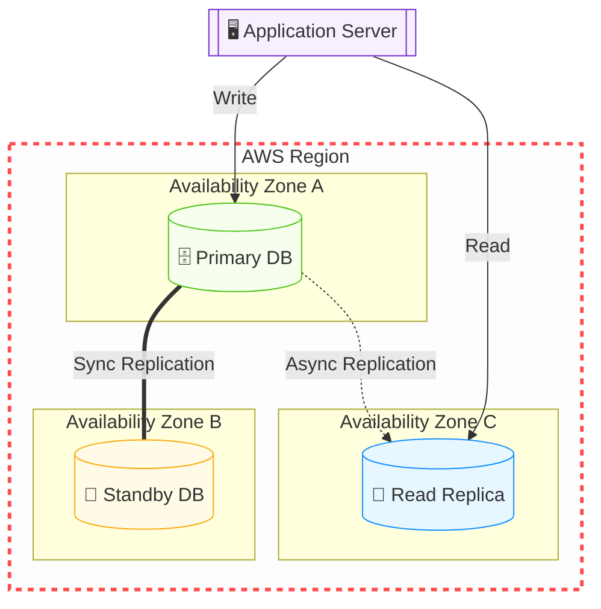

---
في خدمة كاشينج لل sql  امازون بتديهالك عشان تسرع الشغل معاها واسمها  elastic cache :
![[Pasted image 20260604153124.png]]

### 📊 شفرات الامتحان: الخلاصة لاختيار الـ DB

|**الكلمة الدلالية في سيناريو الامتحان (Keyword)**|**الإجابة الصحيحة (Service)**|
|---|---|
|`Relational DB`, `SQL`, `Complex Joins`, `Managed Service`|**Amazon RDS**|
|`Disaster Recovery`, `High Availability`, `Automatic Failover`|**RDS Multi-AZ**|
|`Improve performance`, `Heavy read traffic`, `Scalability`|**RDS Read Replicas**|
|`Proprietary AWS DB`, `5x faster than MySQL`, `Cloud-Native`|**Amazon Aurora**|
|`Relational DB`, `Unpredictable workload`, `Infrequent usage`|**Amazon Aurora Serverless**|
|`Full OS control`, `Custom DB patches`, `Specific OS level access`|**Database on Amazon EC2** (مش RDS خالص)|

---
##  الجزء الثاني: وحش الـ NoSQL (Amazon DynamoDB)

**أصل الحكاية والمشكلة المعمارية (The Core Problem):**

الـ RDS والـ SQL عموماً عظيمة جداً طول ما إنت عندك "علاقات" معقدة (جداول مربوطة ببعض بـ Foreign Keys). بس إيه المشكلة؟

المشكلة إن الـ SQL بطيء لما الضغط يوصل لملايين الطلبات في الثانية (زي مثلاً لو بتبني لعبة أونلاين وعايز تحفظ الـ Score بتاع 10 مليون لاعب في نفس اللحظة، أو بتعمل سلة مشتريات لموقع زي أمازون في الـ Black Friday). الـ SQL هنا هيهنج لأنه بيحاول يراجع كل العلاقات (Joins) قبل ما يكتب.

هنا ظهر مفهوم الـ **NoSQL (Not Only SQL)**. الفكرة هنا: "إنسى الجداول والعلاقات المعقدة، إحنا هنخزن الداتا على هيئة (مفتاح وقيمة - Key/Value) أو (ملفات JSON). ارمي الداتا واسحبها في أجزاء من الثانية!". بطل القصة دي في أمازون هو **Amazon DynamoDB**.

### ⚙️ التشريح العميق لـ Amazon DynamoDB (دستور الامتحان)

الـ DynamoDB مش مجرد قاعدة بيانات، دي "ظاهرة" في أمازون، وليها 4 قوانين معمارية بتيجي في الامتحان دايماً:

**1. البنية التحتية (Serverless Database):**

إنت في DynamoDB **مابتختارش سيرفرات**، ولا رامات، ولا بتحدد مساحة هارد. دي خدمة (Serverless) بالكامل. إنت بس بتعمل "جدول" (Table) وترمي فيه الداتا، وأمازون بتكبر السيرفرات في الكواليس أوتوماتيك لدرجة إنها ممكن تستحمل تيرابايتات من الداتا بدون أي تدخل منك.

**2. السرعة الجنونية (Single-digit Millisecond Latency):**

الـ DynamoDB بيضمنلك إن أي عملية قراءة أو كتابة هتاخد أقل من 10 مللي ثانية (Single-digit)، سواء الجدول ده فيه 100 ريكورد أو فيه 10 مليار ريكورد! السرعة ثابتة مبتتغيرش.

**3. التواجد المدمج (Multi-AZ by Default):**

عكس الـ RDS اللي كان لازم تختار تفعّل الـ Multi-AZ وتدفع فلوس زيادة، الـ DynamoDB بيعمل نسخ للداتا بتاعتك في 3 مباني (AZs) مختلفة **أوتوماتيك وبشكل افتراضي** عشان يضمن إن الداتا عمرها ما تضيع.

**4. نموذج البيانات (Key-Value & Document):**

الداتا هنا مش بتتحط في أعمدة وصفوف ثابتة. كل (Item) ممكن يكون ليه شكل مختلف. (مثلاً: مستخدم تحطله اسمه وسنه، ومستخدم تاني تحطله اسمه وعنوانه وهواياته). ده بيخليها مرنة جداً للتطبيقات الحديثة.
![[Pasted image 20260604152535.png]]
### 🚀 تسريع الوحش: محرك الـ DAX (DynamoDB Accelerator)

أمازون قالتلك: "الـ 10 مللي ثانية بطيئة بالنسبة لبعض التطبيقات (زي التداول المالي أو الألعاب اللحظية)، إحنا عايزين سرعة بالـ (ميكرو ثانية - Microseconds)!".

- **الحل المعماري (DAX):** ده نظام تخزين مؤقت (In-Memory Cache) مبني **مخصوص** للـ DynamoDB.
    
- **الكواليس:** بدل ما الأبلكيشن بتاعك يروح يقرأ من الداتابيز كل مرة، بيقرأ من الـ DAX (اللي شايل الداتا في الرامات). وده بينزل سرعة الاستجابة من مللي ثانية لـ ميكرو ثانية (أسرع 1000 مرة).
    
- 🚨 **تريكة الامتحان:** أول ما تشوف كلمة `Microseconds` مع `DynamoDB`، الإجابة فوراً هي **DAX**.
    

### 🌍 الانتشار العالمي: الجداول العالمية (Global Tables)

- **المشكلة:** الأبلكيشن بتاعك نجح عالمياً، بقى عندك مستخدمين في أمريكا وفي أستراليا. لو الداتابيز بتاعتك في أمريكا، المستخدم الأسترالي هيعاني من بطء (Latency) عشان الداتا بتسافر عبر المحيط.
    
- **الحل المعماري (Global Tables):** الخاصية دي بتخلي الـ DynamoDB ينسخ الجدول بتاعك في كذا منطقة جغرافية (Regions) في نفس الوقت.
    
- **الكواليس (Active-Active Replication):** المستخدم الأمريكي بيكتب ويقرأ من نسخة أمريكا، والأسترالي بيكتب ويقرأ من نسخة أستراليا، والنسختين بيكلموا بعض في الكواليس ويوحدوا الداتا!
    
- 🚨 **الكلمة الدلالية في الامتحان:** `Multi-Region scaling for DynamoDB`, `Active-Active global database`.
    
![[Pasted image 20260604152658.png]]
### 🏗️ اللوحة المعمارية: ديناميكية DynamoDB و DAX (Mermaid)

الرسمة دي بتوضح إزاي الأبلكيشن بيتعامل مع الـ DAX قبل ما يوصل للـ DynamoDB عشان ياخد أقصى سرعة ممكنة (تم استخدام `<br/>` لتوافق أوبسيديان):

Code snippet

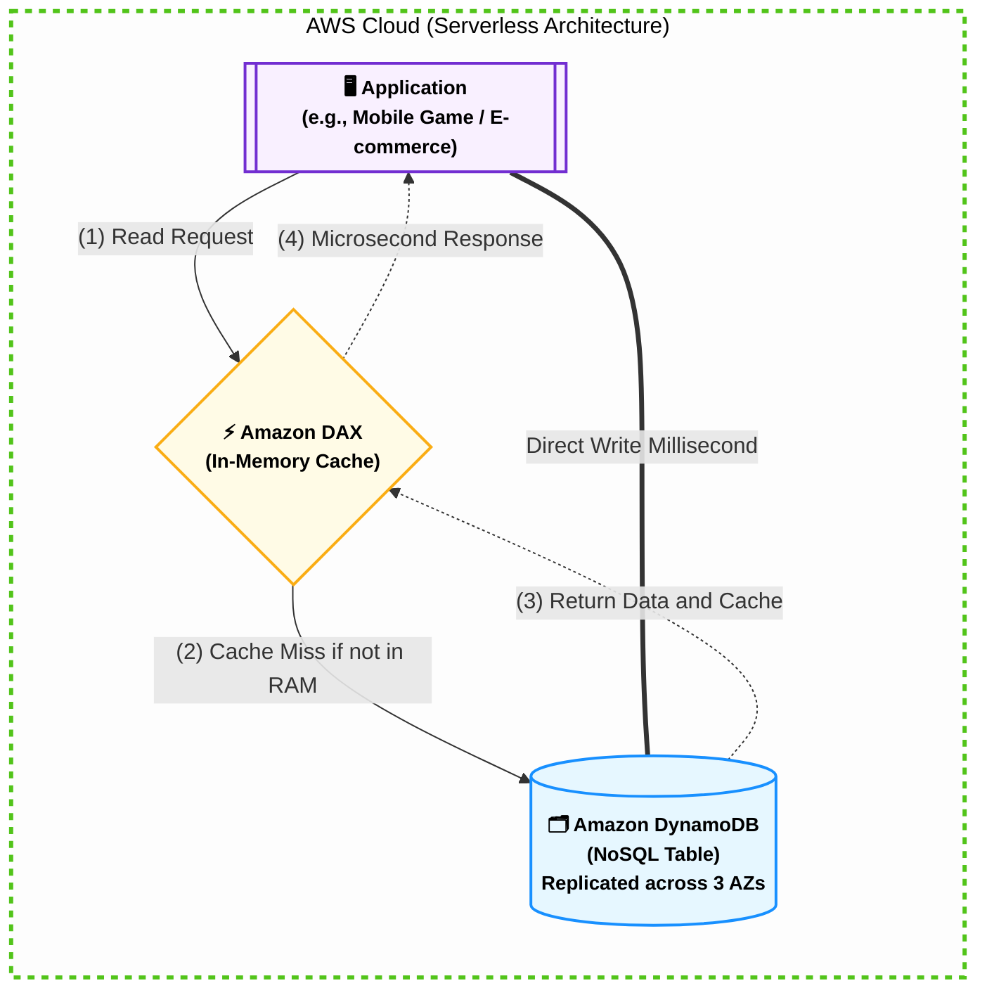

### 📊 شفرات الامتحان: متى تختار DynamoDB؟

الامتحان هيجيبلك سيناريوهات، أول ما تلمح الكلمات دي، اختار DynamoDB فوراً:

|**الكلمة الدلالية في سيناريو الامتحان (Keyword)**|**التفسير المعماري**|
|---|---|
|`Key-Value database`, `Document database`|النوع الأساسي لقاعدة البيانات (NoSQL).|
|`Single-digit millisecond latency at any scale`|السرعة الثابتة مهما زاد حجم البيانات أو الضغط.|
|`Serverless database`, `No infrastructure to manage`|إنت بتدير الداتا بس، أمازون بتدير السيرفرات.|
|`Microsecond latency for DynamoDB`|الإجابة هنا هتكون **DAX** (لتسريع الـ DynamoDB).|
|`Active-Active database across multiple regions`|الإجابة هنا هتكون **DynamoDB Global Tables**.|
|`Shopping cart`, `Gaming leaderboards`, `Session state`|أشهر استخدامات الـ DynamoDB في بيئة العمل.|

---
## الجزء الثالث: مستودعات البيانات والتحليلات (Redshift & Athena)

**أصل الحكاية والمشكلة المعمارية (The Core Problem):**

تخيل إنك بنيت سيستم مبيعات ضخم. الداتابيز الأساسية بتاعتك (RDS أو DynamoDB) بتسجل آلاف عمليات البيع كل دقيقة. مدير الشركة طلب منك تقرير معقد جداً: _"عايز أعرف مبيعات منتج معين في آخر 5 سنين، متقسمة بالشهور والمحافظات، ومقارنتها بمبيعات نفس المنتج لشركة تانية"_.

لو كتبت كود `SQL` يعمل `JOIN` و `GROUP BY` على قاعدة البيانات الأساسية بتاعتك (اللي شغالة لايف)، الـ CPU هيوصل 100%، والداتابيز هتهنج، والموقع هيقع!

هنا ظهر مفهوم فصل المعمارية لجزئين:

1. **OLTP (Online Transaction Processing):** دي الـ RDS اللي بتسجل الشغل اليومي السريع.
    
2. **OLAP (Online Analytical Processing):** دي "مستودعات البيانات" اللي بناخد فيها نسخة من الداتا كل يوم بالليل، عشان نعمل عليها التحليلات الثقيلة براحتنا من غير ما نأثر على الموقع. بطل القصة دي هو **Amazon Redshift**.
    

### ⚙️ أولاً: وحش التحليلات ومستودعات البيانات (Amazon Redshift)

الـ Redshift هو (Data Warehouse) أو مستودع بيانات مصمم خصيصاً لتحليل البيانات الضخمة جداً (بيتابايت - Petabytes) بسرعة خرافية.

**القواعد الهندسية للـ Redshift (دستور الامتحان):**

1. **التخزين العمودي (Columnar Storage):**
    
    على عكس الـ RDS اللي بيخزن الداتا في "صفوف"، الـ Redshift بيخزنها في "أعمدة". يعني لو بتعمل استعلام عن "سعر المنتجات"، هو بيسحب عمود السعر بس من غير ما يقرأ باقي بيانات الجدول. ده بيقلل القراءة من الهارد جداً وبيسرع التحليل.
    
2. **المعالجة المتوازية (Massively Parallel Processing - MPP):**
    
    الـ Redshift بيقسم الاستعلام المعقد (Query) بتاعك على كذا سيرفر جوه الكلاستر (Cluster) يشتغلو فيه مع بعض في نفس اللحظة، ويرجعولك النتيجة في ثواني.
    
3. **التسعير التنافسي:**
    
    أمازون بتفتخر إن Redshift بيكلف 1/10 (عُشر) تكلفة مستودعات البيانات التقليدية اللي الشركات بتعملها (On-Premises).
    

- 🚨 **الكلمات الدلالية في الامتحان:** `Data Warehouse`, `Analytics`, `OLAP`, `Petabyte-scale data warehousing`.
    

### ⚙️ ثانياً: استعلامات السحابة المباشرة (Amazon Athena)

**المشكلة:** طب لو الداتا بتاعتك أصلاً مش في داتابيز؟ لو الداتا عبارة عن ملايين ملفات الـ (Logs / Text / CSV) مرمية في جردل (S3 Bucket)؟ عشان تحللها، هتحتاج تعمل سيرفر، وتسطب عليه داتابيز، وتعمل (Import) للملفات دي من S3 للداتابيز.. حوار طويل ومكلف!

**الحل السحري (Athena):**

دي خدمة (Serverless) عبارة عن "محرك بحث SQL" طاير في الهوا. إنت بتفتح الـ Athena، تكتب كود `SELECT * FROM S3-Bucket`، وهي بتنزل تقرأ الملفات اللي جوه الـ S3 مباشرة وتطلعلك النتيجة!

**قواعد Athena في الامتحان:**

1. **بدون خوادم (Serverless):** مفيش سيرفرات بتديرها ولا داتابيز بتسطبها.
    
2. **الدفع بالاستخدام (Pay per Query):** بتدفع فلوس على كل تيرا بايت (TB) الـ Athena بتعمله (Scan) جوه S3. (عشان كده يفضل تضغط ملفاتك قبل ما ترميها في S3 عشان تقلل الفاتورة).
    
3. **الاستخدام الأشهر:** تحليل سجلات النظام (Log Analysis) زي الـ VPC Flow Logs أو CloudTrail Logs.
    

- 🚨 **الكلمات الدلالية في الامتحان:** `Query data in S3 directly`, `Serverless SQL`, `Analyze logs in S3`, `Standard SQL`.
    
![[Pasted image 20260604153730.png]]
### ⚙️ ثالثاً: مكملات البيانات الضخمة (Amazon EMR)

_(دي بتيجي كسؤال عابر في الامتحان، بس لازم تكون عارفها)._

**Amazon EMR (Elastic MapReduce):**

لو الشركة بتاعتك عندها داتا ضخمة جداً (Big Data) وبتستخدم تقنيات مفتوحة المصدر زي **Hadoop** أو **Apache Spark**، بدل ما تبني سيرفرات كتير عشان تشغلهم، الـ EMR بيعملك الكلاستر ده كله جاهز للإطلاق في دقايق.

- 🚨 **الكلمات الدلالية في الامتحان:** `Hadoop cluster`, `Apache Spark`, `Big data framework`.
    

### 🏗️ اللوحة المعمارية: مسار البيانات للتحليلات (Mermaid)

الرسمة دي بتوضح إزاي الداتا بتمشي من مرحلة العمليات اليومية (OLTP) لمرحلة التحليلات (OLAP)، وتم تطبيق كل قواعد أوبسيديان المعمارية الصارمة عليها (روابط خارجية، نصوص محمية، `flowchart LR`، و `<br/>`):


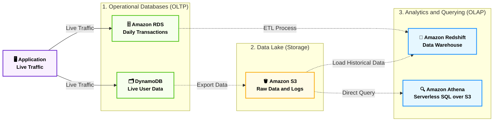

### 📊 شفرات الامتحان: متى تختار أي خدمة تحليل؟

|**الكلمة الدلالية في سيناريو الامتحان (Keyword)**|**الإجابة الصحيحة (Service)**|
|---|---|
|`Data Warehouse`, `Petabyte-scale analytics`, `Complex analytical queries`|**Amazon Redshift**|
|`Analyze data directly in S3`, `Serverless interactive query`, `Standard SQL`|**Amazon Athena**|
|`Hadoop`, `Spark`, `Managed Big Data framework`|**Amazon EMR**|

---
##  الجزء الرابع: التخزين المؤقت والهجرة (ElastiCache & DMS)

**أصل الحكاية والمشكلة المعمارية (The Core Problem):**

إحنا كده غطينا الداتابيز العادية (RDS) والسريعة (DynamoDB) والتحليلات (Redshift). بس في بيئة العمل الحقيقية، بتظهر مشكلتين كبار:

1. **أزمة القراءة المتكررة:** لو عندك موقع إخباري، ملايين الناس بتدخل تقرأ نفس الخبر الرئيسي. لو الأبلكيشن راح يقرأ الخبر ده من الـ RDS مليون مرة في الدقيقة، الداتابيز هتقع! محتاجين حاجة تشيل الحمل ده.
    
2. **أزمة الانتقال للسحابة:** الشركة مقتنعة بـ AWS، بس الداتابيز بتاعتهم موجودة على سيرفراتهم القديمة (On-Premises). إزاي ننقل الداتا دي للسحابة من غير ما الموقع يقف دقيقة واحدة؟
    

هنا أمازون بتتدخل بخدمتين هم أبطال الجزء ده: **ElastiCache** و **DMS**.

### ⚙️ أولاً: التخزين المؤقت في الذاكرة (Amazon ElastiCache)

الـ ElastiCache عبارة عن خدمة بتقدم (In-Memory Data Store). يعني الداتا مش بتتخزن على هارد ديسك بطيء، دي بتتخزن في "الرامات" (RAM) بتاعة السيرفر، وده بيخلي سرعة الاستجابة بأجزاء من المللي ثانية (Sub-millisecond latency).

_ملاحظة: ElastiCache بيستخدم لتخفيف الضغط عن قواعد البيانات العلائقية (RDS)، زي ما الـ DAX بيخفف الضغط عن الـ DynamoDB._

**محركات الـ ElastiCache (أسئلة المقارنة في الامتحان):**

1. **Redis:**
    
    - هو المحرك الأقوى والأكثر استخداماً.
        
    - بيدعم البيانات المعقدة (Lists, Sets).
        
    - **تريكة الامتحان:** Redis بيدعم الـ (Multi-AZ) والـ (Backups)، يعني لو السيرفر وقع، الداتا مش بتطير.
        
2. **Memcached:**
    
    - أبسط بكتير ومصمم للأشياء البسيطة جداً (Strings).
        
    - بيدعم الـ (Multi-threading) يعني بيستغل معالجات السيرفر بكفاءة.
        
    - **تريكة الامتحان:** لا يدعم الـ Multi-AZ ولا الـ Backups. لو السيرفر رستر، الرامات بتفضى والداتا بتطير!
        

- 🚨 **الكلمات الدلالية في الامتحان:** `Sub-millisecond latency`, `In-memory data store`, `Alleviate database load`, `Improve read performance for RDS`.
    

### ⚙️ ثانياً: خدمة هجرة قواعد البيانات (AWS DMS)

**AWS Database Migration Service (DMS)** هي الخدمة السحرية اللي بتنقل الداتابيز بتاعتك من أي مكان لـ AWS (أو العكس) بسرعة وبدون ما توقف الأبلكيشن بتاعك (Zero Downtime Migration).

**أنواع الهجرة في الامتحان:**

1. **الهجرة المتجانسة (Homogeneous Migration):**
    
    إنت بتنقل من نفس النوع لنفس النوع. (مثلاً: Oracle على سيرفرات الشركة ➔ Oracle على Amazon RDS). هنا إنت بتستخدم DMS مباشرة عشان ينقل الداتا.
    
2. **الهجرة غير المتجانسة (Heterogeneous Migration):**
    
    إنت بتنقل من نوع لنوع تاني خالص (عشان توفر فلوس الرخص). (مثلاً: Oracle على سيرفرات الشركة ➔ Amazon Aurora).
    
    - **أداة الامتحان السحرية (SCT):** الـ DMS بينقل الداتا بس (الصفوف والأعمدة). لكن عشان تترجم "هيكل الجدول" (Schema) والـ (Stored Procedures) من لغة أوراكل للغة أورورا، لازم تستخدم أداة مساعدة مع الـ DMS اسمها **AWS Schema Conversion Tool (SCT)**.
        

- 🚨 **الكلمات الدلالية في الامتحان:** `Migrate databases securely`, `Continuous replication during migration`, `Change database engine`, `SCT`.
    

### 🏗️ اللوحة المعمارية: مسار التخزين المؤقت والهجرة (Mermaid)

الرسمة دي معمولة بـ (flowchart LR) ومطبقة لكل القواعد الصارمة (نصوص محمية بـ " "، أسهم نقية، وتخصيص خارج الـ Subgraphs) عشان تظهر معاك بأفضل جودة:


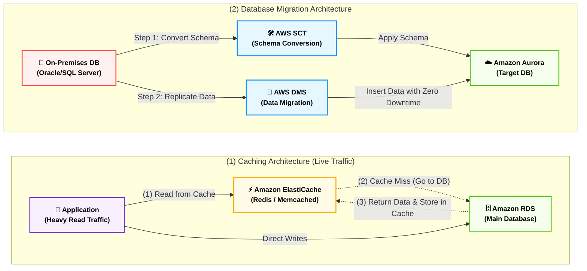
![[Pasted image 20260604154256.png]]

---
## 🚨 الملحق المعماري المتقدم: قواعد البيانات المتخصصة والتحليلات

**رؤية الـ Tech Lead (أصل الحكاية):**

إحنا اتكلمنا قبل كده عن الـ (RDS) للجداول، والـ (DynamoDB) للـ NoSQL السريع. بس ماذا لو الداتا بتاعتك "معقدة" جداً؟ زي إنك بتبني شبكة تواصل اجتماعي (فيسبوك) وعايز تعرف مين صاحب مين؟ أو بتبني سيستم لإنترنت الأشياء (IoT) بيسجل درجة حرارة المصنع كل ثانية؟

أمازون عملت لكل نوع داتا معقد "داتابيز مخصوصة ليه"، وعملت أدوات ذكية عشان تحلل الداتا دي وتطلع منها رسومات بيانية للمديرين.

### ⚙️ أولاً: قواعد البيانات المتخصصة (Specialized Databases)

الامتحان هنا بيختبرك في "تطابق نوع البيانات مع قاعدة البيانات المناسبة":

#### 1. داتابيز المستندات (Amazon DocumentDB)

- **المشكلة:** إنت مبرمج متعود تشتغل بـ **(MongoDB)** وعايز تستخدمها على أمازون عشان تخزن ملفات الـ (JSON)، بس عايز أمازون تديرها بالكامل زى ما بتدير (Aurora).
    
- **الحل المعماري:** الـ DocumentDB هي الـ (AWS Implementation) الموازية لـ MongoDB.
    
- **الكواليس:** خدمة مدارة بالكامل (Fully Managed)، الداتا بتتنسخ في 3 مباني (Multi-AZ)، والمساحة بتكبر لوحدها (Auto-grows) بزيادات 10 جيجابايت.
    
- 🚨 **الكلمات الدلالية:** `MongoDB compatible`, `Store, query, and index JSON data`, `NoSQL database for documents`.
    

#### 2. داتابيز العلاقات المعقدة (Amazon Neptune)

- **المشكلة:** بتبني شبكة تواصل اجتماعي (Social Network) أو نظام كشف احتيال (Fraud Detection). عايز تعرف "أحمد صاحب محمود، ومحمود عمل لايك لبوست منى". لو عملت ده بـ SQL هتحتاج (Complex Joins) والسيستم هيموت!
    
- **الحل المعماري:** الـ Neptune هي قاعدة بيانات شبكية **(Graph Database)**. مصممة مخصوص عشان تخزن مليارات "العلاقات" (Relations) وتستعلم عنها في أجزاء من المللي ثانية.
    
- 🚨 **الكلمات الدلالية:** `Graph database`, `Highly connected datasets`, `Social networking`, `Fraud detection`, `Knowledge graphs (Wikipedia)`.
    

#### 3. داتابيز الزمن (Amazon Timestream)

- **المشكلة:** عندك حساسات (Sensors) في مصنع بتبعت قراءات لدرجة الحرارة كل ثانية. الداتا دي اسمها (Time-series data).
    
- **الحل المعماري:** الـ Timestream هي داتابيز (Serverless) مخصصة لتخزين وتحليل تريليونات الأحداث (Events) المرتبطة بالزمن يومياً.
    
- **الميزة:** أسرع 1000 مرة وأرخص 10 مرات من قواعد البيانات العادية (Relational databases) في التعامل مع البيانات الزمنية، وفيها دوال تحليل مبنية جواها.
    
- 🚨 **الكلمات الدلالية:** `Time series database`, `Store and analyze trillions of events per day`, `Identify patterns over time in near real-time`.
    

### ⚙️ ثانياً: معالجة وتحليل البيانات (Analytics & BI)

#### 4. الخلاط الآلي (AWS Glue)

- **الوظيفة المعمارية:** خدمة (Serverless) بتعمل **(ETL - Extract, Transform, Load)**.
    
- **السيناريو:** بتاخد الداتا المنعكشة من S3 أو RDS، تنضفها وتحولها (Transform)، وبعدين ترميها جاهزة للتحليل في (Amazon Redshift).
    
- **الميزة القاتلة (Glue Data Catalog):** بيعمل "فهرس" مركزي لكل الداتا بتاعتك عشان خدمات تانية زي (Athena و EMR) تقدر تستخدمها.
    
- 🚨 **الكلمات الدلالية:** `Managed ETL service`, `Serverless`, `Prepare and transform data for analytics`, `Glue Data Catalog`.
    

#### 5. شاشات المديرين (Amazon QuickSight)

- **الوظيفة المعمارية:** خدمة ذكاء أعمال **(Business Intelligence - BI)** مدعومة بالـ Machine Learning.
    
- **السيناريو:** مدير الشركة عايز يشوف "رسم بياني" تفاعلي (Interactive Dashboards) لمبيعات السنة اللي فاتت. الـ QuickSight بيسحب الداتا من (RDS, S3, Athena) ويطلعها في شكل رسومات بيانية رائعة.
    
- **الميزة:** Serverless وبتدفع على قد الجلسة (Per-session pricing).
    
- 🚨 **الكلمات الدلالية:** `Business intelligence (BI) service`, `Create interactive dashboards`, `Building visualizations`, `Get business insights`.
    

### ⚙️ ثالثاً: اللامركزية (Amazon Managed Blockchain)

- **المشكلة:** كذا شركة (مثلاً بنوك مختلفة) عايزين يعملوا حركات مالية مع بعض، بس مفيش حد فيهم "بيثق" في التاني، ومش عايزين "جهة مركزية" (Central Authority) تتحكم فيهم.
    
- **الحل المعماري:** البلوك تشين! أمازون بتقدملك خدمة مدارة عشان تنضم لشبكة بلوك تشين عامة، أو تعمل شبكتك الخاصة (Scalable private network).
    
- **الكواليس:** متوافقة مع أشهر منصتين في العالم: (Hyperledger Fabric) و (Ethereum).
    
- 🚨 **الكلمات الدلالية:** `Multiple parties execute transactions without a trusted central authority`, `Hyperledger Fabric & Ethereum`.
    


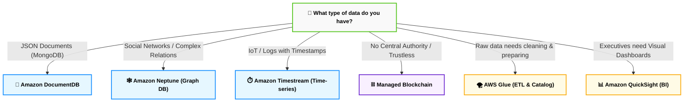

### 📊 شفرات الامتحان: الخلاصة الفورية (The Traps)

الجدول ده مبني حرفياً على السلايدات المرفوعة عشان يقفل لك أي سؤال مقارنة:

|**السيناريو في الامتحان (Exam Keyword)**|**الإجابة الصحيحة (AWS Service)**|
|---|---|
|`AWS-implementation of MongoDB`, `Store JSON data`|**Amazon DocumentDB**|
|`Graph database`, `Highly connected datasets`, `Social networks`|**Amazon Neptune**|
|`Time series database`, `Analyze trillions of events (IoT)`|**Amazon Timestream**|
|`Serverless ETL`, `Prepare and transform data`, `Data Catalog`|**AWS Glue**|
|`Business Intelligence (BI)`, `Interactive dashboards`, `Visualizations`|**Amazon QuickSight**|
|`Execute transactions without a trusted central authority`, `Ethereum`|**Amazon Managed Blockchain**|

---
![[Pasted image 20260604154846.png]]

## 🗄️ الخلاصة المعمارية لقواعد البيانات والتحليلات (Databases & Analytics Summary)

الجدول ده بيجمع كل خدمات البيانات في AWS بناءً على "حالة الاستخدام" (Use Case). الكلمة الدلالية هنا بتشاور على الإجابة فوراً:

### 1. قواعد البيانات الأساسية (Core Databases)

| نوع قاعدة البيانات (DB Type) | الخدمة (AWS Service) | الكلمة الدلالية في الامتحان (Keywords) |
| --- | --- | --- |
| **Relational (OLTP)** | **RDS & Aurora** | SQL, Relational, Complex Queries. |
| **In-Memory Cache** | **ElastiCache** | Sub-millisecond latency, Reduce load on RDS. |
| **Key/Value (NoSQL)** | **DynamoDB** | Serverless, Single-digit millisecond latency. |
| **DynamoDB Cache** | **DAX** | Microsecond latency specifically for DynamoDB. |

> [!important] 🚨 تريكة التوافر في الـ Relational (RDS/Aurora)
> * **Multi-AZ:** مخصصة للتعافي من الكوارث (Disaster Recovery).
> * **Read Replicas:** مخصصة لتحسين الأداء وتخفيف ضغط القراءة (Performance).
> * **Multi-Region:** مخصصة للتعافي من الكوارث عالمياً وتقليل الـ Latency للعملاء في قارات أخرى.
> 
> 

---

### 2. قواعد البيانات المتخصصة (Specialized Databases)

| نوع البيانات (Data Type) | الخدمة (AWS Service) | الكلمة الدلالية في الامتحان (Keywords) |
| --- | --- | --- |
| **JSON / MongoDB** | **DocumentDB** | "Aurora for MongoDB", NoSQL Document database. |
| **Graph / Relationships** | **Amazon Neptune** | Highly connected datasets, Social networks, Fraud detection. |
| **Time-Series** | **Amazon Timestream** | Trillions of events per day, IoT, Time-stamped data. |
| **Decentralized / Trustless** | **Amazon Managed Blockchain** | Hyperledger Fabric, Ethereum, No central authority. |

---

### 3. تحليل البيانات والذكاء (Analytics & BI)

| المهمة التحليلية (Analytics Task) | الخدمة (AWS Service) | الكلمة الدلالية في الامتحان (Keywords) |
| --- | --- | --- |
| **Data Warehouse (OLAP)** | **Amazon Redshift** | SQL analytics, Petabyte-scale data warehousing. |
| **Hadoop / Big Data** | **Amazon EMR** | Hadoop cluster, Apache Spark, Process vast amounts of data. |
| **Query S3 Directly** | **Amazon Athena** | Serverless SQL, Query data natively on Amazon S3. |
| **ETL & Data Catalog** | **AWS Glue** | Managed Extract-Transform-Load (ETL), Data Catalog service. |
| **Business Dashboards** | **Amazon QuickSight** | Serverless BI, Interactive dashboards on your data. |

---

### 4. هجرة البيانات (Data Migration)

| المهمة (Task) | الخدمة (AWS Service) | الكلمة الدلالية في الامتحان (Keywords) |
| --- | --- | --- |
| **Database Migration** | **AWS DMS** | Migrate databases with near-zero downtime. |

---
## 2. الحوسبة المتقدمة وطرق النشر (Compute, Deploy & Integration) - الجزء الأول: عوالم الحاويات (Containers & Docker)

**أصل الحكاية والمشكلة المعمارية (The Core Problem):**

زمان، لو عندك مشروع (Backend) بـ Laravel ومشروع تاني بـ Node.js وعايز تشغلهم على نفس السيرفر (EC2)، كنت بتعاني من تضارب المكاتب والإصدارات (Dependency Conflicts). الحل القديم كان إننا نعمل (Virtual Machines - VMs)، بس الـ VM تقيلة جداً لأن كل واحدة بتحتاج "نظام تشغيل كامل" (Linux/Windows) خاص بيها، وده بيستهلك رامات وبروسيسور على الفاضي.

هنا ظهر السحر بتاع الـ **Containers (الحاويات)** وبطلها **Docker**.

فكرة الحاوية إنك بتحط الكود بتاعك (مثلاً مشروع الـ Laravel) مع كل المكاتب اللي بيحتاجها في "صندوق مقفول". الصندوق ده خفيف جداً، مفيش جواه نظام تشغيل كامل، هو بيستلف النواة (Kernel) بتاعة السيرفر الأساسي. الميزة المعمارية الجبارة هنا: "لو الحاوية اشتغلت على جهازك في اللاب (Ubuntu مثلاً)، هتشتغل بنفس الكفاءة بالظبط على سيرفرات أمازون بدون أي أخطاء".

لما يكون عندك 10 حاويات، تقدر تديرهم بنفسك. بس لما يكون عندك 1000 حاوية (Microservices)، محتاج "مايسترو" ينظمهم، يفتحهم، يراقبهم، ولو واحدة ماتت يخلق غيرها. أمازون بتقدملك 3 أبطال في المعركة دي.

### ⚙️ أولاً: المايسترو (Container Orchestration)

في الامتحان، أمازون بتخيرك بين نوعين من "المايسترو" لإدارة الحاويات:

#### 1. Amazon ECS (Elastic Container Service)

- **الفكرة:** ده المايسترو "الخاص بأمازون" (AWS-Native). مصمم عشان يكون سهل الاستخدام، وبيندس بقوة مع خدمات أمازون التانية (زي الـ Load Balancers والـ IAM).
    
- **السيناريو:** لو الشركة بتاعتك عايزة تشغل Docker، وكل البنية التحتية بتاعتها جوه AWS، ومش عايزين يوجعوا دماغهم بتعقيدات برمجية، الـ ECS هو الحل المثالي.
    
![[Pasted image 20260604155354.png]]
#### 2. Amazon EKS (Elastic Kubernetes Service)

- **الفكرة:** ده المايسترو "مفتوح المصدر" (Open-Source). أمازون جابت تكنولوجيا **Kubernetes** (اللي جوجل اخترعتها وبقت المعيار العالمي) وعملتلها إدارة على الكلاود.
    
- **السيناريو المعماري (🚨 تريكة امتحان):** لو الشركة بتاعتك بتستخدم (Multi-Cloud) يعني جزء من السيرفرات على AWS وجزء على Google Cloud أو On-Premises، وعايزين سيستم يقدر يشتغل في أي مكان بنفس الكود (No Vendor Lock-in)، لازم تختار **EKS**.
    
- **الكلمات الدلالية:** `Kubernetes`, `K8s`, `Open-source container orchestration`, `Migrate existing Kubernetes`.
    
![[Pasted image 20260604155415.png]]
### ⚙️ ثانياً: العضلات (The Compute Engine)

الـ ECS والـ EKS هما المايسترو، بس الحاوية (Container) في النهاية محتاجة "رامات وبروسيسور" حقيقيين عشان تشتغل عليهم. هنا أمازون بتديك طريقين (ودي من أهم أسئلة الامتحان):

#### الطريق الأول: الدفع المسبق والإدارة (EC2 Launch Type)

- **الفكرة:** إنت بتروح تخلق سيرفرات **EC2** عادية جداً، وتسطب عليها برنامج صغير (Agent)، وتقول للـ ECS: "العب براحتك ونزل الحاويات بتاعتك على السيرفرات دي".
    
- **العيوب:** إنت هنا بتدفع تمن سيرفر الـ EC2 سواء كان مليان حاويات أو فاضي. وإنت اللي مسؤول عن تحديث نظام التشغيل (OS Patching) بتاع السيرفر.
    
- **السيناريو:** لو إنت محتاج تحكم كامل في السيرفر أو عندك رخص معينة.
    

#### الطريق الثاني: الحوسبة السحرية (AWS Fargate) - 🚨 [سؤال مؤكد]

- **الفكرة:** ده الـ **(Serverless Compute for Containers)**. هنا إنت مبتمتلكش ولا سيرفر EC2! إنت بتروح للـ Fargate وتقوله: "أنا عندي الحاوية دي، محتاجلها 2 جيجا رام و 1 كور بروسيسور.. شغلها".
    
- **الكواليس:** أمازون بتخلق بيئة معزولة في الكواليس، تشغل حاويتك، وتحاسبك **بالثانية** على حجم الرامات والـ CPU اللي الحاوية استهلكتهم فقط! مفيش سيرفرات تديرها، مفيش تحديثات لنظام التشغيل، مفيش صداع.
    
- **الكلمات الدلالية في الامتحان:** `Serverless containers`, `No infrastructure to manage`, `Pay per container`.
    ![[Pasted image 20260604155513.png]]

### ⚙️ ثالثاً: المخزن (Amazon ECR)

**Amazon ECR (Elastic Container Registry):**

زي ما الـ GitHub هو مخزن للأكواد، وزي ما الـ S3 هو مخزن للملفات، الـ ECR هو **"المخزن الآمن لصور الحاويات (Docker Images)"**.

قبل ما المايسترو (ECS أو EKS) يشغل أي حاوية، لازم يروح يسحب الصورة بتاعتها من الـ ECR. (ممتاز في الامتحان لو سألك عن مكان تخزين الحاويات بأمان وتشفير).
![[Pasted image 20260604155600.png]]
### 🏗️ اللوحة المعمارية: عوالم الحاويات في أمازون (Mermaid)

الرسمة دي معمولة بـ `flowchart LR` ومطبقة لكل القواعد الصارمة بتاعتك في أوبسيديان، بتوضح العلاقة بين المخزن، المايسترو، والعضلات:


### 📊 شفرات الامتحان: الخلاصة لاختيار الحاويات

عشان تحل أي سؤال عن الـ Containers في 5 ثواني، احفظ الكلمات الدلالية دي:

|**الكلمة الدلالية في سيناريو الامتحان (Keyword)**|**الإجابة الصحيحة (AWS Service)**|
|---|---|
|`Run Docker containers`, `AWS-native orchestration`, `Deep AWS integration`|**Amazon ECS**|
|`Kubernetes`, `K8s`, `Open-source orchestration`, `Migrate from on-premises K8s`|**Amazon EKS**|
|`Serverless containers`, `Run containers without managing EC2`, `Don't want to manage infrastructure`|**AWS Fargate**|
|`Store Docker images`, `Container registry`, `Securely store container images`|**Amazon ECR**|

---
### 1. إيه هو الـ Serverless؟

- هو نموذج أو منظور جديد (New paradigm) بيعفي المطورين تماماً من صداع "إدارة السيرفرات".
    
- كل اللي على المطور إنه يكتب الكود ويرفعه (Deploy code)، وتحديداً بيرفع دوال برمجية صغيرة (Functions) بتنفذ مهمة محددة.
    

### 2. البداية والتطور

- **في البداية:** كان مصطلح Serverless بيعني تقنياً **FaaS (Function as a Service)**، وأمازون هي اللي قادت الثورة دي وأسست المفهوم بخدمة **AWS Lambda**.
    
- **الآن:** المفهوم اتوسع جداً! مبقاش مقتصر على الكود بس، بل شمل أي خدمة "مُدارة بالكامل" إنت مش محتاج تدير السيرفرات اللي تحتها، زي:
    
    - قواعد البيانات (مثال: DynamoDB).
        
    - التخزين (مثال: Amazon S3).
        
    - أنظمة المراسلة (مثال: SQS و SNS).
        

### 3. الجملة الأهم (The Catch) 🚨

- **"Serverless does not mean there are no servers..."**
    
- كلمة "بدون خوادم" مش معناها إن الكود طاير في الهواء بدون هاردوير. السيرفرات الحقيقية موجودة وشغالة جوه الداتا سنتر، لكن الفكرة إنك كمطور **مابتشوفهاش، مابتحجزهاش (Provision)، ومابتتعبش في إدارتها (Manage)**. أمازون هي اللي بتقوم بكل العمليات دي في الكواليس.
    

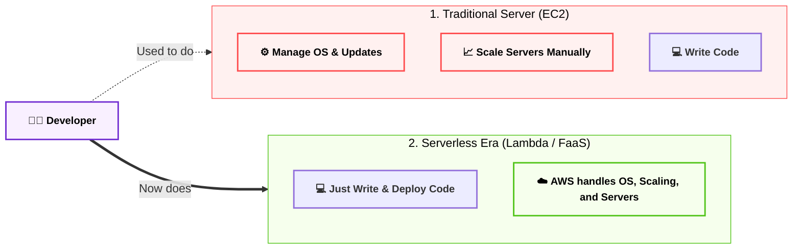
![[Pasted image 20260604160421.png]]

---

## الجزء الثاني: الحوسبة بدون خوادم (Serverless & Batch)

**أصل الحكاية والمشكلة المعمارية (The Core Problem):**

عشان تفهم السحر ده، خليني أضربلك مثال من بره الكلاود خالص. لو إنت عايز تشرب كوباية عصير كل يوم، النظام القديم (EC2) بيقولك: "روح اشتري عصارة، وادفع تمنها بالكامل، وحطها في المطبخ، ونضفها كل يوم سواء استخدمتها أو لأ".

نظام الـ **Serverless (بدون خوادم)** بيقولك: "روح المحل، اطلب كوباية العصير، وادفع تمن الكوباية دي بس، وامشي!". مفيش عصارة تشتريها، مفيش مطبخ تنضفه.

في عالم البرمجة، بدل ما تأجر سيرفر EC2 كامل يفضل شغال 24 ساعة عشان يستنى يوزر يرفع صورة فيعملها (Resize)، إنت بتدي لأمازون "الكود" بتاعك بس. ولما اليوزر يرفع الصورة، أمازون تشغل الكود لمدة ثانية واحدة، وتحاسبك على الثانية دي، وبعدين تقفل الكود!

### ⚙️ أولاً: بطل الساحة (AWS Lambda)

الـ **AWS Lambda** هي الخدمة اللي غيرت شكل الكلاود في العالم. دي خدمة حوسبة (Compute) بتسمحلك تشغل أكواد برمجية (زي Node.js, Python, Java) من غير ما تفكر في أي بنية تحتية.

**القواعد الهندسية للـ Lambda (دستور الامتحان):**

1. **الاعتماد على الأحداث (Event-Driven):**
    
    الـ Lambda مش بتشتغل لوحدها. دي عاملة زي "المصيدة"، نايمة مستنية حدث (Event) يحصل عشان تصحى.
    
    _أمثلة على الأحداث في الامتحان:_
    
    - ملف جديد اترفع في **Amazon S3** ➔ يصحي الـ Lambda عشان تضغطه.
        
    - داتا جديدة اتكتبت في **DynamoDB** ➔ تصحي الـ Lambda عشان تبعت إيميل.
        ![[Pasted image 20260604161314.png]]
    - يوزر طلب لينك من **API Gateway** ➔ يصحي الـ Lambda عشان تجيبله الداتا.
    - ![[Pasted image 20260604161250.png]]
        
2. **مدة التنفيذ القصوى (The 15-Minute Rule) 🚨 [أهم فخ في الامتحان]:**
    
    الـ Lambda مصممة للمهام السريعة الخاطفة. أقصى مدة يقدر الكود بتاعك يفضل شغال فيها هي **15 دقيقة فقط**. لو الكود محتاج 16 دقيقة، أمازون هتقفل عليه الكود وتعمله (Timeout Error). لو جابلك سيناريو لمهمة بتاخد ساعات، إياك تختار Lambda!
    
3. **التسعير العبقري (Pay per Millisecond):**
    
    التسعير هنا بيتحسب بحاجتين:
    
    - **عدد الطلبات (Requests):** أول مليون طلب في الشهر "مجاناً" دايماً!
        
    - **مدة التشغيل (Compute Time):** بتدفع على كل "مللي ثانية" (Millisecond) الكود اشتغل فيها. لو الكود خلص في 200 مللي ثانية، هتدفع تمن الـ 200 مللي ثانية بس.
        

### ⚙️ ثانياً: معالجة المهام الثقيلة (AWS Batch)

**المشكلة المعمارية:**

طب لو الشركة بتاعتنا بتعمل تحليل لصور الأقمار الصناعية، أو بنعمل ريندر لفيلم أنيميشن 3D، والعملية الواحدة بتاخد **10 ساعات**؟ الـ Lambda هترفع إيدها وتقول "أنا آخري 15 دقيقة". والـ EC2 العادي هيحتاج مننا نكتب كود معقد عشان نفتح السيرفرات ونقفلها بعد ما الفيلم يخلص.

**الحل السحري (AWS Batch):**

دي خدمة مصممة لإدارة الـ (Batch Processing) أو "المهام المجمعة". إنت بترمي لأمازون 100,000 مهمة (Jobs) وتقولها "خلصيلي دول".

**الكواليس في AWS Batch:**

- الـ Batch مش سيرفر، هو "مدير". بيروح يشوف المهام بتاعتك محتاجة رامات وبروسيسور قد إيه.
    
- بيروح أوتوماتيك يخلق سيرفرات **EC2** (وغالباً بيختار **Spot Instances** الرخيصة جداً عشان يوفرلك فلوس).
    
- يشغل المهام بتاعتك عليها (في شكل Docker Containers)، ولما المهام كلها تخلص، **يقفل السيرفرات لوحده** ويمسحها عشان الفاتورة تقف!
    
- 🚨 **الميزة الجوهرية:** مفيش حد أقصى للوقت (No time limit). المهمة تقعد يوم، يومين، براحتها.
    
![[Pasted image 20260604161421.png]]
### 🏗️ اللوحة المعمارية: متى تختار Lambda ومتى تختار Batch؟ (Mermaid)

الرسمة دي معمولة بـ `flowchart LR` ومطبقة لكل القواعد الصارمة بتاعتك (نصوص محمية، الروابط في النهاية)، وبتلخص الفرق الجوهري في الامتحان:


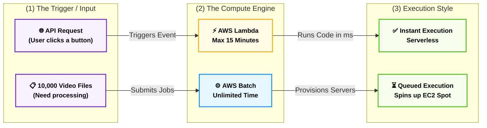

### 📊 شفرات الامتحان: الخلاصة لاختيار طريقة الحوسبة

دي الشفرات اللي هتخليك تلقط الإجابة في أسئلة الـ Compute من أول سطر:


|**الكلمة الدلالية في سيناريو الامتحان (Keyword)**|**الإجابة الصحيحة (AWS Service)**|
|---|---|
|`Run code without managing servers`, `Event-driven compute`, `Pay by millisecond`|**AWS Lambda**|
|`Task runs for 5 minutes`, `Triggered by S3 upload`|**AWS Lambda**|
|`Task runs for 3 hours`, `Long-running processes`|**AWS Batch** (أو EC2) - إياك تختار Lambda|
|`Process 100,000 images`, `Batch processing`, `Dynamically provisions EC2 Spot`|**AWS Batch**|
|`Run Docker containers`, `Microservices architecture`|**Amazon ECS / EKS**|
![[Pasted image 20260604161559.png]]

## ☁️ خادم المبتدئين السحري (Amazon Lightsail)

**رؤية الـ Tech Lead (أصل الحكاية والمشكلة المعمارية):**

تخيل إن عندك عميل عايز يرفع مدونة (WordPress) بسيطة، أو موقع (Node.js) صغير، وميزانيته محدودة جداً. لو دخلت تبنيله المعمارية بالطريقة العادية، هتحتاج تعمل (VPC) وتظبط الـ (Subnets)، وتخلق سيرفر (EC2)، وتركبله هارد (EBS)، وتعمل داتابيز (RDS)، وتربطهم بـ (Route 53). حوار معقد جداً على مشروع بسيط، وتكلفته مش مضمونة آخر الشهر!

عشان كده أمازون عملت **Amazon Lightsail**. دي مش خدمة كلاود معقدة، ده (Virtual Private Server - VPS) متقفل في كرتونة واحدة جاهزة للتشغيل، وبسعر ثابت كل شهر.

### ⚙️ التشريح الهندسي لـ Lightsail (من السلايد)

**1. الكرتونة المتكاملة (All-in-One Solution):**

الخدمة دي بتديك سيرفر وهمي (Virtual server)، مع مساحة تخزين، وقاعدة بيانات، وشبكة.. كلهم مدمجين في واجهة واحدة بسيطة جداً. هي البديل السهل لـ (EC2, RDS, ELB, EBS, Route 53).

**2. التسعير المتوقع (Low & Predictable Pricing):**

دي أهم ميزة للشركات الصغيرة. إنت بتدفع اشتراك شهري ثابت (مثلاً 5 دولار في الشهر). مفيش مفاجآت في الفاتورة ولا حساب بالمللي ثانية زي باقي خدمات أمازون.

**3. لا يتطلب خبرة (Little Cloud Experience):**

لو معاك مبرمج لسه بيبدأ ومش فاهم يعني إيه (Subnets) ولا (Security Groups)، الـ Lightsail هو الحل المثالي ليه لأنه بيخفي كل التعقيدات دي.

**4. القوالب الجاهزة (Pre-configured Templates):**

عشان تنجز شغلك في ثواني، بيوفرلك قوالب جاهزة بضغطة زرار لـ:

- بيئات الويب (LAMP, Nginx, MEAN, Node.js).
    
- أنظمة إدارة المحتوى (WordPress, Magento, Joomla).
    

### 🚨 فخاخ الامتحان (The Architectural Trade-offs)

بصفتك مهندس، لازم تعرف إمتى **ماتستخدمش** الـ Lightsail، والسلايد حددت ده بوضوح في آخر نقطة:

- **غياب التمدد التلقائي (No Auto-scaling):** الـ Lightsail **مستحيل** يكبر السيرفرات لوحده لو حصل ضغط فجأة. لو الترافيك زاد جداً، الموقع هيقع.
    
- **تكامل محدود (Limited AWS Integrations):** بما إنه "صندوق مقفول"، ربطه بباقي خدمات أمازون المعقدة بيكون صعب جداً ومحدود.
    
- **التوافر (High Availability):** رغم غياب الـ Auto-scaling، أمازون لسه بتدعم التوافر العالي في الـ Lightsail (زي إنك تعمل Load Balancer بسيط جواه).
    
![[Pasted image 20260604162116.png]]


```mermaid
flowchart LR
    %% Global Styling
    classDef default font-weight:bold,font-size:14px,stroke-width:2px;
    classDef complex fill:#fff1f0,stroke:#ff4d4f,color:#000;
    classDef simple fill:#f6ffed,stroke:#52c41a,color:#000;

    subgraph The_EC2_Way ["🧩 The AWS Way (EC2) - Requires Expertise"]
        direction TB
        VPC["VPC & Networking"]
        EC2["EC2 (Compute)"]
        EBS["EBS (Storage)"]
        RDS["RDS (Database)"]
        VPC --- EC2 --- EBS --- RDS
    end

    subgraph The_Lightsail_Way ["📦 Amazon Lightsail - For Beginners"]
        direction TB
        Box["One Predictable Monthly Price<br/>(Includes Server, DB, Storage & Network)"]
    end

    %% Apply Classes
    class The_EC2_Way,VPC,EC2,EBS,RDS complex;
    class The_Lightsail_Way,Box simple;
```

### 📊 شفرات الامتحان: الخلاصة لـ Lightsail

لو شفت الكلمات دي في سيناريو الامتحان، اختار Lightsail فوراً:

| **السيناريو في الامتحان (Exam Keyword)**                           | **الإجابة المعمارية الصح**                        |
| ------------------------------------------------------------------ | ------------------------------------------------- |
| `Low and predictable pricing`, `Fixed monthly price`               | **Amazon Lightsail**                              |
| `Simple web applications`, `WordPress`, `Magento`                  | **Amazon Lightsail**                              |
| `Users with little cloud experience`, `Simpler alternative to EC2` | **Amazon Lightsail**                              |
| `Needs Auto-scaling to handle unpredictable traffic`               | **Amazon EC2 + ASG** _(إياك تختار Lightsail هنا)_ |

---
##  الجزء الثالث: البنية التحتية والنشر (IaC & PaaS)

**أصل الحكاية والمشكلة المعمارية (The Core Problem):**

تخيل إنك مطلوب منك تبني بنية تحتية لشركة: هتعمل شبكة (VPC)، جواها 4 سيرفرات (EC2)، متوصلين بـ Load Balancer، وفي الخلفية داتابيز (RDS) وجردل (S3). هتدخل على لوحة التحكم (Console) وتعمل ده كله بـ "الماوس" في حوالي 3 ساعات.

تاني يوم المدير قالك: "العميل عايز نسخة تانية طبق الأصل من السيستم ده في منطقة أوروبا!". هل هتدخل تضيع 3 ساعات تانية وتغلط في الإعدادات؟

هنا ظهر السحر: **البنية التحتية ككود (Infrastructure as Code - IaC)** و **منصات النشر (PaaS)**. أمازون بتقدم لك أداتين بيحلوا المشكلة دي بس بطريقتين مختلفتين تماماً.

### ⚙️ أولاً: مهندس البناء الآلي (AWS CloudFormation)

الـ **CloudFormation** هو أداة الـ (IaC) الرسمية من أمازون. الفكرة إنك مابتستخدمش الماوس خالص! إنت بتكتب "ملف نصي" (Template) بلغة `JSON` أو `YAML`، توصف فيه كل اللي إنت عايزه.

**القواعد الهندسية للـ CloudFormation في الامتحان:**

1. **أتمتة البنية التحتية (Automation & Repeatability):** بترفع الملف النصي لأمازون، والـ CloudFormation بيمشي عليه سطر سطر ويبني السيرفرات والشبكات بالترتيب الصح. لو عايز نسخة تانية في أوروبا، بتاخد نفس الملف وتشغله هناك، السيستم هيتبني في 5 دقايق بالضبط وبدون أي خطأ بشري!
    
2. **الـ Stack (الرزمة):** لما الـ CloudFormation بيبني الموارد دي، بيجمعهم كلهم في حاجة واحدة اسمها (Stack). لو حبيت تمسح السيستم كله، بتمسح الـ Stack، وأمازون بتدمر كل حاجة اتخلقت بسببه أوتوماتيك (عشان متنساش سيرفر شغال يسحب فلوس).
    
3. **AWS CDK (مكمل برمجي):** لو إنت مابتحبش تكتب `JSON/YAML`، أمازون عملتلك أداة اسمها **Cloud Development Kit (CDK)**، بتخليك تكتب البنية التحتية بلغات البرمجة العادية اللي إنت متعود عليها (زي TypeScript أو Python)، والـ CDK بيحولها لـ CloudFormation في الكواليس.
    ![[Pasted image 20260604190752.png]]
    ![[Pasted image 20260604190844.png]]

- 🚨 **الكلمات الدلالية في الامتحان:** `Infrastructure as Code (IaC)`, `JSON/YAML templates`, `Automate infrastructure provisioning`, `Repeatable deployments`.
    ![[Pasted image 20260604190641.png]]
    ![[Pasted image 20260604190659.png]]
    ![[Pasted image 20260604190720.png]]
    

### ⚙️ ثانياً: الصديق الصدوق للمطورين (AWS Elastic Beanstalk)

الـ **Elastic Beanstalk** هي خدمة بتندرج تحت تصنيف (Platform as a Service - PaaS).

**المشكلة:** إنت مبرمج، كاتب كود عظيم بـ **Laravel 13** أو **Node.js**، بس متعرفش حاجة عن الشبكات، ولا الـ Load Balancers، ولا إزاي تعمل Auto Scaling. إنت عايز حد ياخد الكود يشغلهولك وخلاص!

**الحل المعماري:**

1. إنت بتعمل (Upload) لملفات الكود بتاعك (ZIP file) للـ Elastic Beanstalk.
    
2. الخدمة دي بتشتغل كـ "مدير مشاريع ذكي". بتشوف كودك (PHP مثلاً)، فتروح هي لوحدها تفتح سيرفرات EC2، تسطب عليها Linux و Apache/Nginx و PHP، وتعمل Load Balancer، وتظبط الشبكة، وتعمل Deploy للكود بتاعك والموقع يشتغل!
    
3. **تريكة الامتحان:** رغم إن الـ Beanstalk بيبني كل حاجة أوتوماتيك، إلا إنه بيفضّل سايبلك **(التحكم الكامل - Full Control)**. يعني تقدر تدخل بـ SSH على السيرفرات اللي هو عملها وتعدل فيها براحتك (عكس الـ Serverless اللي بيخفي عنك السيرفر تماماً).
    ![[Pasted image 20260604191241.png]]

- 🚨 **الكلمات الدلالية في الامتحان:** `PaaS`, `Focus on writing code`, `Deploy web applications automatically`, `Don't worry about underlying infrastructure`, `Retain full control over EC2`.
    


```mermaid
flowchart LR
    %% Global Styling
    classDef default font-weight:bold,font-size:14px,stroke-width:2px;
    classDef dev fill:#f9f0ff,stroke:#722ed1,color:#000;
    classDef cfn fill:#e6f7ff,stroke:#1890ff,color:#000;
    classDef eb fill:#fffbe6,stroke:#faad14,color:#000;
    classDef aws fill:#f6ffed,stroke:#52c41a,color:#000;

    subgraph Input ["(1) What You Write (Input)"]
        direction TB
        Template["📄 Template<br/>(JSON / YAML Code)"]
        Code["💻 Source Code<br/>(Laravel / Node.js)"]
    end

    subgraph Engine ["(2) AWS Automation Engine"]
        direction TB
        CFN["⚙️ AWS CloudFormation<br/>(Infrastructure as Code)"]
        EB["🚀 AWS Elastic Beanstalk<br/>(Platform as a Service)"]
    end

    subgraph Output ["(3) The Final Result"]
        direction TB
        Infra["🏗️ Custom Infrastructure<br/>(VPC, S3, RDS, EC2)"]
        WebApp["🌐 Web Application<br/>(Load Balanced & Auto Scaled)"]
    end

    %% Connections defined strictly outside subgraphs with protected text
    Template -->|"Uploads Template"| CFN
    CFN -->|"Builds Everything"| Infra

    Code -->|"Uploads Code"| EB
    EB -->|"Provisions & Deploys"| WebApp

    %% Apply Classes
    class Template,Code dev;
    class CFN cfn;
    class EB eb;
    class Infra,WebApp aws;
```

### 📊 شفرات الامتحان: الخلاصة لاختيار أداة النشر

السؤال هنا بييجي مباشر جداً، احفظ المفاتيح دي:

|**الكلمة الدلالية في سيناريو الامتحان (Keyword)**|**الإجابة الصحيحة (AWS Service)**|
|---|---|
|`Automate infrastructure provisioning`, `Infrastructure as Code`, `JSON/YAML`|**AWS CloudFormation**|
|`Developer wants to focus on code`, `Deploy web apps easily`, `PaaS`|**AWS Elastic Beanstalk**|
|`Provision infrastructure using standard programming languages (Python/JS)`|**AWS CDK**|

---

##  الجزء الرابع: مصنع الأكواد (Developer Tools & CI/CD)

**أصل الحكاية والمشكلة المعمارية (The Core Problem):**

تخيل إنك بتبني مشروع معقد جداً، زي منصة ذكاء اصطناعي بتحلل نصوص طبية، أو مساعد ذكي للرد الآلي (IVR). التيم بتاعك بيكتب كود ليل نهار. لو كل مطور خلص الكود بتاعه ودخل رفعه بنفسه على السيرفر (Manual Deployment)، الكود هيضرب، والسيرفر هيقع، والعملاء هيهربوا!

عشان نحل ده، ظهر مفهوم **(CI/CD - التكامل المستمر والنشر المستمر)**. الفكرة هنا إننا نبني "مصنع آلي" للأكواد (Assembly Line): المطور يرفع الكود، المصنع يختبره أوتوماتيك، يجهزه، ويرميه على السيرفرات بدون أي تدخل بشري.

أمازون عملتلك عائلة كاملة من الأدوات بتبدأ بكلمة `Code` عشان تدير المصنع ده من الألف للياء.

### ⚙️ أبطال مصنع الأكواد (The AWS Code Family)

كل خدمة من دول بتلعب دور محدد جداً في رحلة الكود، والامتحان بيسألك في وظيفة كل واحدة:

**1. مخزن المواد الخام (AWS CodeCommit):**

- **الوظيفة:** دي خدمة إدارة الأكواد المصدرية (Source Control Service). هي النسخة الخاصة بأمازون من `GitHub` أو `GitLab`.
    
- **الفكرة:** مكان آمن جداً ومقفل عليه بتشفير أمازون، التيم بيرفع عليه الكود بتاعهم باستخدام أوامر `Git` العادية.
    
- **الكلمة الدلالية في الامتحان:** `Private Git repository`, `Source control`, `Securely store source code`.
    ![[Pasted image 20260604191858.png]]

**2. خط التجميع والاختبار (AWS CodeBuild):**

- **الوظيفة:** الكود اللي طالع من المطورين ده "مادة خام". الـ CodeBuild بياخده، يعملّه تجميع (Compiling)، ويشغل عليه اختبارات الأمان (Unit Tests)، ويطلعه في شكل "رزمة جاهزة للتشغيل" (Artifact).
    
- **الميزة:** هو (Serverless)، يعني أمازون بتشغل سيرفرات في الكواليس تعمل الـ Build وتقفلها فوراً، وإنت بتدفع بالدقيقة.
    
- **الكلمة الدلالية في الامتحان:** `Compile source code`, `Run tests`, `Produce software packages`, `Continuous Integration (CI)`.
    ![[Pasted image 20260604191925.png]]

**3. أسطول التوصيل (AWS CodeDeploy):**

- **الوظيفة:** دي الخدمة اللي بتاخد الرزمة الجاهزة اللي طلعت من الـ CodeBuild، وتعملها نشر (Deployment) على السيرفرات بتاعتك.
    
- **تريكة الامتحان:** الـ CodeDeploy مش بينشر على EC2 بس! ده يقدر ينشر الكود بتاعك على (AWS Fargate)، وعلى (AWS Lambda)، وحتى على سيرفرات الشركة بتاعتك (On-Premises Servers).
    
- **الكلمة الدلالية في الامتحان:** `Automate code deployments`, `Maintain application uptime during deployment`.
    ![[Pasted image 20260604192025.png]]

**4. مدير المصنع (AWS CodePipeline): 🚨 [أهم خدمة فيهم]**

- **الوظيفة:** ده المايسترو اللي بيربط التلات خدمات اللي فوق ببعض عشان يعمل الـ (CI/CD Pipeline) الكامل.
    
- **السيناريو المعماري:** إنت بتقول للـ CodePipeline: "أول ما مبرمج يعمل Push لكود جديد في `CodeCommit`، ابعته فوراً لـ `CodeBuild` يختبره، ولو نجح، ابعته لـ `CodeDeploy` يرفعه على السيرفر". كل ده بيحصل أوتوماتيك كأنه شلال ورا بعضه!
    
- **الكلمة الدلالية في الامتحان:** `Automate release pipelines`, `CI/CD`, `Visualize and automate the different stages`.
    ![[Pasted image 20260604192108.png]]
    #### 5. مخزن الحزم الآمن (AWS CodeArtifact)

- **الوظيفة:** مخزن مركزي مغلق وآمن للشركة لإدارة وتخزين واسترجاع الحزم والمكتبات البرمجية (Dependencies) اللي بيحتاجها الكود بدلاً من تحميلها كل مرة من الإنترنت العام.
    
- **الفكرة المعمارية:** بيشتغل كـ كوبري آمن ومُدار بالكامل (Fully Managed) بين المطورين أو أدوات الـ CI/CD وبين المستودعات العامة، مع حماية السيستم من ثغرات الحزم الخارجية.
    
- **التوافق التام:** مدمج وجاهز للعمل مباشرة مع أشهر مديري الحزم عالمياً:
    
    - `npm` و `yarn` (عالم JavaScript).
        
    - `pip` و `twine` (عالم Python).
        
    - `Maven` و `Gradle` (عالم Java).
        
    - `NuGet` (عالم .NET).
        
- **الكلمة الدلالية في الامتحان:** `Secure and scalable artifact management`, `Manage software packages and code dependencies`, `Works with npm, pip, Maven`.
- ![[Pasted image 20260604193452.png]]

### ⚙️ المكملات السحرية للمطورين

أمازون كمان وفرت أدوات بتسهل حياة المطور قبل حتى ما يكتب الكود:

- **AWS Cloud9:**
    
    تخيل إنك فاتح (VS Code) بس جوه المتصفح بتاعك! الـ Cloud9 هو (Cloud-based IDE) بيخليك تكتب كود وتشغله من أي جهاز في العالم، ومدمج جواه الـ Terminal متوصل بأمازون مباشرة.
    
    - **الكلمة الدلالية:** `Write, run, and debug code with just a browser`, `Cloud IDE`.
        
- **AWS X-Ray:**
    
    لو الكود بتاعك بطيء ومش عارف المشكلة منين، الـ X-Ray بيدخل جوه الكود ويعمل (Tracing) يتتبع الريكويست وهو معدي في السيرفرات والداتابيز، ويقولك بالظبط إيه اللي مأخر الرد!
    
    - **الكلمة الدلالية:** `Analyze and debug production applications`, `Trace user requests`.
        


```mermaid
flowchart LR
    %% Global Styling
    classDef default font-weight:bold,font-size:14px,stroke-width:2px;
    classDef dev fill:#f9f0ff,stroke:#722ed1,color:#000;
    classDef commit fill:#e6f7ff,stroke:#1890ff,color:#000;
    classDef build fill:#fffbe6,stroke:#faad14,color:#000;
    classDef deploy fill:#f6ffed,stroke:#52c41a,color:#000;
    classDef pipeline fill:#fff1f0,stroke:#ff4d4f,stroke-width:3px,stroke-dasharray: 5 5,color:#000;

    Developer["👨‍💻 Developer<br/>Pushes Code"]

    subgraph Pipeline ["🔄 AWS CodePipeline (The CI/CD Maestro)"]
        direction LR
        Commit["📦 AWS CodeCommit<br/>Git Repository"]
        Build["⚙️ AWS CodeBuild<br/>Compile & Test"]
        Deploy["🚀 AWS CodeDeploy<br/>Automated Deployment"]
    end

    Target["🌐 Production Servers<br/>(EC2, Lambda, or On-Prem)"]

    %% Connections defined strictly outside subgraphs with protected text
    Developer -->|"git push"| Commit
    Commit -->|"Triggers automatically"| Build
    Build -->|"Passes Artifacts"| Deploy
    Deploy -->|"Updates App safely"| Target

    %% Apply Classes
    class Developer dev;
    class Commit commit;
    class Build build;
    class Deploy deploy;
    class Pipeline pipeline;
    class Target dev;
```

### 📊 شفرات الامتحان: التفرقة بين عائلة Code

السؤال هنا مضمون 100% لو حفظت وظيفة كل أداة بالكلمة المفتاحية:

|**الكلمة الدلالية في سيناريو الامتحان (Keyword)**|**الإجابة الصحيحة (AWS Service)**|
|---|---|
|`Version control`, `Git-based repositories`, `Secure source code`|**AWS CodeCommit**|
|`Run tests`, `Compile code`, `Produce deployment packages`|**AWS CodeBuild**|
|`Deploy to EC2/Lambda/On-Premises`, `Rolling updates`|**AWS CodeDeploy**|
|`Automate release process`, `Orchestrate CI/CD workflow`|**AWS CodePipeline**|
|`Write code in browser`, `Cloud-based IDE`|**AWS Cloud9**|
|`Debug microservices`, `Trace performance bottlenecks`|**AWS X-Ray**|

---


---

![[Pasted image 20260604193616.png]]
![[Pasted image 20260604193625.png]]

---
## الجزء الخامس: فك الارتباط (Decoupling & Integration)

**أصل الحكاية والمشكلة المعمارية (The Core Problem):**

في البرمجة القديمة، كنا بنبني التطبيقات ككتلة واحدة (Monolithic Architecture). يعني لو اليوزر داس على زرار "شراء"، الويب سيرفر بيكلم الداتابيز مباشرة عشان يسجل الطلب. المشكلة إن لو في (Black Friday) و100 ألف يوزر داسوا "شراء" في نفس الثانية، الداتابيز هتهنج وموقعك هيقع كله!

أمازون قالتلك: "لازم تفصل مكونات السيستم عن بعضها (Decoupling)، عشان لو جزء وقع أو بقى بطيء، باقي السيستم يفضل شغال". إزاي؟ عن طريق إننا نحط "مخدة" أو "طابور" في النص يمتص الصدمة.

### ⚙️ أولاً: طوابير الرسائل (Amazon SQS)

الـ **SQS (Simple Queue Service)** هي أول خدمة أمازون عملتها في تاريخها! عبارة عن "طابور انتظار" (Queue).

- **الكواليس (Pull-Based):** لما الـ 100 ألف يوزر يدوسوا "شراء"، الويب سيرفر مش بيكلم الداتابيز! الويب سيرفر بياخد الطلبات يرميها في طابور الـ SQS (اللي مستحيل يقع). بعدين سيرفر الداتابيز (أو الـ Worker) يصحى براحته، ويروح يسحب (Pull) الطلبات من الطابور واحد ورا التاني ويعالجها.
    
- **الميزة المعمارية:** إنت كده عملت (Buffer) امتص الضغط، ومنعت السيستم إنه يفقد أي رسالة أو يقع.
    
- 🚨 **الكلمات الدلالية في الامتحان:** `Decouple applications`, `Message queue`, `Buffer requests`, `Pull-based`.
    

### ⚙️ ثانياً: مكبر الصوت والإشعارات (Amazon SNS)

الـ **SNS (Simple Notification Service)** هو نظام الـ (Pub/Sub) أو مكبر الصوت بتاع أمازون.

- **الكواليس (Push-Based):** بدل ما تستنى حد يجي يسحب منك الرسالة زي الـ SQS، الـ SNS بياخد الرسالة و"يزقها" (Push) فوراً لكل المشتركين معاه.
    
- **الاستخدامات (Subscribers):** الـ SNS بيقدر يبعت الرسالة دي لـ:
    
    1. إيميلات أو رسائل SMS للمستخدمين.
        
    2. سيرفرات HTTP/HTTPS.
        
    3. طوابير SQS (ودي حركة معمارية مشهورة جداً اسمها Fan-out).
        
    4. يشغل بيها أكواد AWS Lambda.
        
- 🚨 **الكلمات الدلالية في الامتحان:** `Pub/Sub`, `Send emails or SMS`, `Push notifications`, `Fan-out architecture`.
    

### ⚙️ ثالثاً: وحش البيانات اللحظية (Amazon Kinesis)

**المشكلة:** طب لو الداتا اللي جاية دي مش مجرد طلبات شراء؟ لو الداتا دي عبارة عن (ملايين السجلات اللحظية) زي أجهزة الـ IoT في مصنع، أو تتبع الـ GPS لعربيات أوبر، أو تحليل أسهم البورصة، والبيانات بتتدفق كأنها "نهر لا يتوقف".

الـ SQS العادي مش مصمم للسرعة والأحجام دي.

**الحل السحري (Kinesis):**

دي الخدمة المخصصة للـ (Real-time Data Streaming). بتستقبل ملايين البيانات في الثانية الواحدة، وتحللها في نفس اللحظة!

- 🚨 **الكلمات الدلالية في الامتحان:** `Real-time data streaming`, `Ingest large scale data streams`, `Analyze IoT or log data in real-time`.
    

### ⚙️ رابعاً: ناقل الأحداث المركزي (Amazon EventBridge)

_(كانت بتسمى زمان CloudWatch Events)._

تخيل الـ EventBridge كأنه "سنترال" بيربط خدمات أمازون ببعضها، وبيربط أمازون بخدمات خارجية (SaaS) زي Zendesk أو Datadog.

الفكرة: إنت بتكتب قاعدة (Rule) وتقول: "لما يحصل الحدث الفلاني (مثلاً سيرفر EC2 حالته اتغيرت لـ Stopped)، شغل الإجراء الفلاني (ابعت إيميل بـ SNS أو شغل Lambda)".

- 🚨 **الكلمات الدلالية في الامتحان:** `Serverless event bus`, `Connect applications using events`, `Integrate with SaaS`.
    


```mermaid
flowchart LR
    %% Global Styling
    classDef default font-weight:bold,font-size:14px,stroke-width:2px;
    classDef app fill:#f9f0ff,stroke:#722ed1,color:#000;
    classDef queue fill:#fffbe6,stroke:#faad14,color:#000;
    classDef topic fill:#e6f7ff,stroke:#1890ff,color:#000;
    classDef worker fill:#f6ffed,stroke:#52c41a,color:#000;
    classDef bad fill:#fff1f0,stroke:#ff4d4f,color:#000,stroke-dasharray: 5 5;

    subgraph Tightly_Coupled ["1. Tightly Coupled (Bad Architecture)"]
        direction LR
        App1["📱 Frontend App"]
        DB1["🗄️ Backend/DB"]
    end

    subgraph Decoupled ["2. Decoupled Architecture (Best Practice)"]
        direction LR
        App2["📱 Frontend App"]
        SNS["📢 Amazon SNS<br/>(Push/Notify)"]
        SQS["📨 Amazon SQS<br/>(Queue/Buffer)"]
        Worker["⚙️ Processing Server<br/>(Pulls Data safely)"]
    end

    %% Connections defined strictly outside subgraphs
    App1 -->|"Direct Call (Crashes if overloaded)"| DB1
    
    App2 -->|"Publishes 1 Message"| SNS
    SNS -->|"Fans out to"| SQS
    SQS -.->|"Worker pulls when ready"| Worker

    %% Apply Classes
    class App1 app;
    class DB1 bad;
    class App2 app;
    class SNS topic;
    class SQS queue;
    class Worker worker;
```

### 📊 شفرات الامتحان: الخلاصة لفك الارتباط

|**الكلمة الدلالية في سيناريو الامتحان (Keyword)**|**الإجابة الصحيحة (AWS Service)**|
|---|---|
|`Decouple`, `Message queue`, `Buffer`, `Pull messages`|**Amazon SQS**|
|`Pub/Sub`, `Push notifications`, `Send emails/SMS to multiple subscribers`|**Amazon SNS**|
|`Real-time streaming`, `IoT big data streams`, `Real-time analytics`|**Amazon Kinesis**|
|`Serverless event bus`, `Connect SaaS apps to AWS`|**Amazon EventBridge**|

---
## 🛠️ مراجعة شاملة (1): عمالقة الحوسبة ومنصات النشر (Compute & PaaS)

**القصة المعمارية (الخلاصة):**

رحلة تشغيل أي كود في أمازون بتمشي في مستويات من "التحكم الكامل" إلى "الراحة الكاملة". كل ما بتطلع لمستوى أعلى، أمازون بتشيل عنك إدارة السيرفرات (EC2)، لحد ما توصل لمرحلة الـ Serverless اللي بتخليك تدفع بالمللي ثانية أو منصات النشر اللي بتبني كل حاجة بضغطة زر.

### 📊 الجدول الذهبي: خريطة اتخاذ القرار للحوسبة

|**السيناريو في الامتحان (Use Case)**|**الخدمة المعمارية (AWS Service)**|**ليه اخترناها؟ (The Why)**|
|---|---|---|
|تحكم كامل في الـ OS، تسطيب رخص مخصصة، أو تطبيقات تقليدية جداً|**Amazon EC2**|الـ (IaaS) الأساسي. إنت بتدير كل حاجة من أول نظام التشغيل (Linux/Windows).|
|تشغيل حاويات (Docker) مع رغبة في تقليل الإدارة (Serverless Containers)|**AWS Fargate**|بتشغل الحاوية فوراً بدون ما تفتح أو تدير سيرفرات EC2.|
|أداة إدارة حاويات (Orchestration) متوافقة مع الكلاودات التانية (Multi-Cloud)|**Amazon EKS**|بتستخدم تكنولوجيا Kubernetes المفتوحة المصدر لعدم التقيد بأمازون (No Vendor Lock-in).|
|أداة إدارة حاويات (Orchestration) مدمجة بعمق مع خدمات أمازون|**Amazon ECS**|أداة أمازون الخاصة (Native)، أسهل في الإعداد من EKS.|
|كود بيشتغل كرد فعل لحدث (Event-driven) وبيخلص في أقل من 15 دقيقة|**AWS Lambda**|حوسبة بالمللي ثانية، بتنام وتصحى لوحدها (Serverless Function).|
|مهام تقيلة (ريندر، تحليل بيانات) بتاخد ساعات، مع توفير التكلفة|**AWS Batch**|بتخلق سيرفرات Spot رخيصة أوتوماتيك، تخلص المهمة، وتمسحها.|
|مطور عايز يرفع الكود بس (ZIP file) والخدمة تبني السيرفر والشبكة|**AWS Elastic Beanstalk**|الـ (PaaS) المثالي للمطورين اللي ميعرفوش بنية تحتية، مع بقاء التحكم في الـ EC2.|
|بناء بنية تحتية كاملة (VPC, S3, EC2) باستخدام ملف كود (JSON/YAML)|**AWS CloudFormation**|الـ (IaC) الرسمي لأتمتة إنشاء الداتا سنتر وتكرارها بدون أخطاء بشرية.|


```mermaid
flowchart LR
    %% Global Styling
    classDef default font-weight:bold,font-size:14px,stroke-width:2px;
    classDef question fill:#f9f9f9,stroke:#52c41a,color:#000;
    classDef ec2 fill:#f6ffed,stroke:#52c41a,color:#000;
    classDef container fill:#e6f7ff,stroke:#1890ff,color:#000;
    classDef serverless fill:#fffbe6,stroke:#faad14,color:#000;
    classDef paas fill:#f9f0ff,stroke:#722ed1,color:#000;

    Start["🤔 How do you want to run the App?"]
    
    %% Paths
    Start -->|"I need full OS control"| EC2["🖥️ Amazon EC2<br/>(IaaS - Manage Everything)"]
    
    Start -->|"I have Docker Containers"| ContQ["Kubernetes or AWS Native?"]
    ContQ -->|"Kubernetes (Multi-Cloud)"| EKS["☸️ Amazon EKS"]
    ContQ -->|"AWS Native"| ECS["⚙️ Amazon ECS"]
    EKS -->|"Where to run them?"| Fargate["☁️ AWS Fargate<br/>(Serverless Compute)"]
    ECS -->|"Where to run them?"| Fargate
    
    Start -->|"I just have code functions"| CodeQ["How long does it run?"]
    CodeQ -->|"< 15 Minutes (Event-Driven)"| Lambda["⚡ AWS Lambda<br/>(Serverless Functions)"]
    CodeQ -->|"> 15 Minutes (Heavy Data)"| Batch["📦 AWS Batch<br/>(Batch Processing)"]
    
    Start -->|"I want to upload code and relax"| Beanstalk["🚀 Elastic Beanstalk<br/>(PaaS - Auto Provisioning)"]

    %% Apply Classes
    class Start,ContQ,CodeQ question;
    class EC2 ec2;
    class EKS,ECS container;
    class Fargate,Lambda,Batch serverless;
    class Beanstalk paas;
```

## 🛠️ مراجعة شاملة (2): مصنع الأكواد وممتصات الصدمات (CI/CD & Integration)

**القصة المعمارية (الخلاصة):**

بعد ما اخترنا هنشغل الكود فين (الجزء الأول)، لازم نضمن إن الكود بيوصل للسيرفرات بأمان وبشكل أوتوماتيكي (مصنع CI/CD). ولما الموقع يشتغل ويجيله ملايين الزيارات، لازم نحط "مساعدين وممتصات صدمات" (Decoupling) بين أجزاء السيستم عشان الداتابيز متقعش من الضغط.

### 📊 الجدول الذهبي: أدوات المطورين وفك الارتباط

|**الخدمة (AWS Service)**|**الوظيفة المعمارية (The Role)**|**الكلمة الدلالية الثابتة في الامتحان (Keyword)**|
|---|---|---|
|**AWS CodeCommit**|"خزنة الكود" الآمنة والخاصة بالشركة.|`Git repository`, `Source control`, `Version control`.|
|**AWS CodeBuild**|"مفتش الجودة" اللي بيعمل Compile ويشغل الـ Unit Tests.|`Run tests`, `Compile code`, `Continuous Integration (CI)`.|
|**AWS CodeDeploy**|"عامل الدليفري" اللي بيرفع الكود الجديد للسيرفرات بدون توقف.|`Automate deployments`, `Deploy to EC2/Lambda/On-Prem`.|
|**AWS CodePipeline**|"مدير المصنع" اللي بيربط (Commit ➔ Build ➔ Deploy) ببعض.|`Orchestrate CI/CD`, `Automate release process`.|
|**Amazon SQS**|"الطابور / ممتص الصدمات" بيفصل الـ Frontend عن الـ Backend.|`Decouple`, `Message queue`, `Buffer`, `Pull-based`.|
|**Amazon SNS**|"مكبر الصوت" بيبعت إشعارات للجميع في نفس اللحظة.|`Pub/Sub`, `Push notifications`, `Email/SMS`, `Fan-out`.|
|**Amazon EventBridge**|"سنترال الكلاود" بيربط الأحداث ببعضها أو بخدمات خارجية.|`Serverless event bus`, `SaaS integration`, `Trigger actions`.|


```mermaid
flowchart LR
    %% Global Styling
    classDef default font-weight:bold,font-size:14px,stroke-width:2px;
    classDef dev fill:#f9f0ff,stroke:#722ed1,color:#000;
    classDef cicd fill:#fffbe6,stroke:#faad14,color:#000;
    classDef compute fill:#f6ffed,stroke:#52c41a,color:#000;
    classDef decouple fill:#e6f7ff,stroke:#1890ff,color:#000;

    subgraph Factory ["1. The CI/CD Assembly Line (Managed by CodePipeline)"]
        direction LR
        Commit["📦 CodeCommit<br/>(Git Push)"]
        Build["⚙️ CodeBuild<br/>(Test & Compile)"]
        Deploy["🚀 CodeDeploy<br/>(Release)"]
    end

    subgraph Production ["2. Production Architecture (Decoupled)"]
        direction LR
        Server["🖥️ Web Server<br/>(EC2 / Fargate)"]
        SNS["📢 Amazon SNS<br/>(Topic / Pub-Sub)"]
        SQS["📨 Amazon SQS<br/>(Queue / Buffer)"]
        Worker["⚡ AWS Lambda<br/>(Background Worker)"]
    end

    %% Connections
    Developer["👨‍💻 Developer"] -->|"Writes Code"| Commit
    Commit -->|"Triggers"| Build
    Build -->|"Artifacts"| Deploy
    Deploy -->|"Updates App safely"| Server
    
    Server -->|"Order Received (Push)"| SNS
    SNS -->|"Fan-out Notification"| SQS
    SQS -.->|"Pulls Message when ready"| Worker

    %% Apply Classes
    class Developer dev;
    class Commit,Build,Deploy cicd;
    class Server,Worker compute;
    class SNS,SQS decouple;
```

---

## 3. الشبكات وتوصيل المحتوى (Networking & Content Delivery) - الجزء الأول: أساسيات الشبكة وتصميم الـ VPC (VPC Core & Subnetting)

**أصل الحكاية والمشكلة المعمارية (The Core Problem):**

تخيل إنك اشتريت قطعة أرض وبنيت عليها عمارة، ومن غير ما تعمل بوابة رئيسية ولا أقفال للشقق، سبت العمارة مفتوحة على الشارع العمومي مباشرة! أي حد معدي في الشارع يقدر يدخل غرف النوم، ويشوف الخزنة، ويلعب في الأجهزة. دي الكارثة اللي كانت هتحصل لو أمازون سابت السيرفرات (EC2) وقواعد البيانات (RDS) بتاعتك تترمي في الكلاود من غير سور يحميها.

في عالم الـ IT التقليدي، كنا بنبني داتا سنتر حقيقية محاطة بأسوار، وبندخل نعمل إعدادات الـ Routers والـ Switches عشان نعزل السيرفرات الحساسة عن الإنترنت.

في السحابة، أمازون نقلت المفهوم ده بالكامل برمجياً واخترعت خدمة **Amazon VPC (Virtual Private Cloud)**. الـ VPC هي "الداتا سنتر الوهمية" الخاصة بشركتك جوه سحابة أمازون. حتة أرض معزولة تماماً ومنفصلة عن باقي الشركات وعن الإنترنت العام، إنت اللي بتحدد قوانينها، ومين يكلم مين، ومين يشوف الإنترنت ومين يستخبى منه.

### ⚙️ أولاً: لغة الأرقام وتخطيط المساحة (VPC CIDR Blocks)

لما بتيجي تحجز حتة الأرض بتاعتك (VPC) في أمازون، أول حاجة بتطلبها منك هي تحديد "نطاق أرقام الـ IP" اللي السيرفرات بتاعتك هتاخدها. التخطيط ده بيتم باستخدام نظام برمي صلب اسمه **CIDR (Classless Inter-Domain Routing)**.

- **شكل الـ CIDR Block:** بتلاقيه مكتوب في الامتحان بالشكل ده: `10.0.0.0/16`
    
- **تفكيك الشفرة الرقمية للامتحان:**
    
    - الجزء الأول (`10.0.0.0`): ده بداية عنوان الشبكة.
        
    - الجزء الثاني بعد السلاش (`/16`): ده بيحدد عدد الـ IPs المتاحة جوه الشبكة. كل ما الرقم ده **يقل**، مساحة الأرض **تكبر** وعدد الـ IPs يزيد!
        
    - القيمة `/16` بتديك **65,536 عنوان IP** متاحين جوه الـ VPC بتاعتك.
        
    - القيمة `/24` (زي `10.0.1.0/24`) بتديك **256 عنوان IP** فقط.
        
- 🚨 **قاعدة التعديل في الامتحان:** بمجرد ما تبني الـ VPC وتديلها CIDR Block أساسي، **مستحيل تغيره** أو تعدله! تقدر بس تضيف عليه (Secondary CIDR) لو المساحة خلصت منك.
    

### ⚙️ ثانياً: تقسيم الأرض إلى حارات (Subnets)

الـ VPC مساحتها ضخمة جداً (65 ألف IP مثلاً). المعمارية السليمة بتقول إننا مستحيل نرمي كل السيرفرات مع بعض في نفس المساحة. لازم نقسم الـ VPC لـ "حارات" أو "أقسام أصغر" بيسموها **Subnets**.

- **قانون الجغرافيا الصارم:** الـ VPC بتغطي المنطقة بالكامل (Region - مثلاً `eu-west-1` في إيرلندا). أما الـ Subnet، فلازم وحتماً تعيش جوه **مبنى واحد فقط (Availability Zone)**. مستحيل الـ Subnet الواحدة تتمدد عبر مبنيين!
    

الامتحان بيركز على نوعين أساسيين من الـ Subnets حسب اتصالهم بالعالم الخارجي:

#### 1. الحارة العامة (Public Subnet)

- **المعنى الهندسي:** دي حارة متصلة بالإنترنت الخارجي مباشرة بالاتجاهين (رايح جاي).
    
- **الاستخدام المعماري:** بنحط فيها السيرفرات اللي "لازم" الناس في الشارع تشوفها وتكلمها، زي سيرفرات الـ Frontend، ومواقع الويب العامة، والـ Load Balancers.
    

#### 2. الحارة المستخبية / الخاصة (Private Subnet)

- **المعنى الهندسي:** دي حارة معزولة تماماً عن الإنترنت الخارجي. لا حد بره يقدر يوصلها، ولا هي بتقدر تشوف بره مباشرة.
    
- **الاستخدام المعماري:** دي المكان السري اللي بنخزن فيه "أسرار الشركة" والداتا الحرجة، زي قواعد البيانات (RDS - PostgreSQL)، والـ Backend (مشروع Laravel 13 أو Node.js)، وأنظمة التخزين الداخلية.
    

### 🚨 ثالثاً: الخمسة IPs الضائعة (AWS Reserved IPs)

دي تريكة رياضية بتيجي في أسئلة الحسابات جوه الامتحان، ولازم تكون حافظها صم:

لو إنت عملت Subnet مساحتها الـ CIDر بتاعها `/24`، المفروض حسابياً تديك 256 عنوان IP. بس لو دخلت على واجهة أمازون، هتلاقي المتاح ليك **251 IP بس**! فين الـ 5 الباقيين؟

أمازون **تحجز أوتوماتيك أول 4 عناويين وآخر عنوان** في كل Subnet لحسابها الخاص عشان تشغل بيهم الشبكة، ومستحيل إنت تستخدمهم:

1. `10.0.0.0`: عنوان الشبكة نفسه (Network Address).
    
2. `10.0.0.1`: محجوز للـ Router الافتراضي بتاع AWS.
    
3. `10.0.0.2`: محجوز لسيرفر الـ DNS الخاص بأمازون.
    
4. `10.0.0.3`: محجوز لأي استخدامات مستقبلية (Future use).
    
5. `10.0.0.255`: عنوان البث الشبكي (Network Broadcast Address) - رغم إن أمازون مابتستخدمش الـ Broadcast بس بتحجزه برضه!
    

> [!danger] فخ الحسابات في الامتحان 🚨
> 
> لو جالك سؤال بيقولك: شركة محتاجة تبني Subnet تشيل **252 سيرفر**، هل الـ CIDR بقيمة `/24` هيكفي؟
> 
> **الإجابة: لأ طبعاً!** لأن الـ `/24` بتديك 256، وبنطرح منهم 5 بتوع أمازون، يتبقى 251 IP صافي. الشركة كده هينقصها IP واحد والسيستم هيضرب. لازم نختار مساحة أكبر (زي `/23`).


```mermaid
flowchart LR
    %% Global Styling
    classDef default font-weight:bold,font-size:14px,stroke-width:2px;
    classDef region fill:#fdfdfd,stroke:#ff4d4f,stroke-width:3px,stroke-dasharray: 5 5,color:#000;
    classDef vpc fill:#f9f9f9,stroke:#ff9900,stroke-width:3px,color:#000;
    classDef az fill:#fafafa,stroke:#8c8c8c,stroke-dasharray: 3 3,color:#000;
    classDef public fill:#e6f7ff,stroke:#1890ff,color:#000;
    classDef private fill:#fff1f0,stroke:#ff4d4f,color:#000;

    subgraph AWS_Region ["📍 AWS Region (e.g., eu-west-1)"]
        
        subgraph VPC ["☁️ Virtual Private Cloud (VPC)<br/>CIDR: 10.0.0.0/16 (65,536 IPs)"]
            
            subgraph AZ_A ["🏠 Availability Zone A"]
                PubSub1["🌐 Public Subnet A<br/>CIDR: 10.0.1.0/24<br/>Available: 251 IPs"]
                PrivSub1["🔒 Private Subnet A<br/>CIDR: 10.0.2.0/24<br/>Available: 251 IPs"]
            end

            subgraph AZ_B ["🏠 Availability Zone B"]
                PubSub2["🌐 Public Subnet B<br/>CIDR: 10.0.3.0/24<br/>Available: 251 IPs"]
                PrivSub2["🔒 Private Subnet B<br/>CIDR: 10.0.4.0/24<br/>Available: 251 IPs"]
            end

        end
    end

    %% Logical cross-AZ communication lines defined outside the boxes
    PubSub1 --- PrivSub1
    PubSub2 --- PrivSub2
    PrivSub1 -.->|"Internal Traffic Only"| PrivSub2

    %% Apply Classes
    class AWS_Region region;
    class VPC vpc;
    class AZ_A,AZ_B az;
    class PubSub1,PubSub2 public;
    class PrivSub1,PrivSub2 private;
```

### 📊 شفرات الامتحان: الكلمات الدلالية لأساسيات الشبكة

|**السيناريو في سيناريو الامتحان (Keyword)**|**الإجابة المعمارية الصح**|
|---|---|
|`Logically isolated virtual network`, `Your own data center in AWS`|**Amazon VPC**|
|`VPC spans multiple...`|**Availability Zones** جوه نفس المنطقة (Region).|
|`Subnet spans multiple Availability Zones`|**غلط تماماً (False)**، الـ Subnet محبوسة جوه AZ واحدة.|
|`How many IPs are reserved by AWS in a single subnet?`|**5 IPs** ثابتة ومستحيل تعديلها.|
|`Deploy web application facing the public internet`|توضع في **Public Subnet**.|
|`Deploy backend database holding customer records safely`|توضع في **Private Subnet**.|

---
## الجزء الثاني: بوابات العبور والاتصال بالإنترنت (VPC Gateways & Connectivity)

**أصل الحكاية والمشكلة المعمارية (The Core Problem):**

في الجزء الأول، إحنا بنّينا الـ VPC وقسمناها لـ حارات عامة (Public Subnets) وحارات مستخبية (Private Subnets). بس في وضعها الحالي، الشبكة دي عاملة زي "أوضة عزل صحي" مقفولة بالخرسانة؛ لا السيرفرات اللي جوه قادرة تشوف الإنترنت الخارجي، ولا أي يوزر على النت قادر يدخل للموقع بتاعك.

علشان السيرفرات دي تبدأ تؤدي وظيفتها، محتاجين نفتح "بوابات" في سور الـ VPC. بس التحدي الهندسي هنا هو التحكم في اتجاه الحركة (Traffic Direction):

1. السيرفرات اللي في الحارة العامة (زي الـ Load Balancer) محتاجة بوابة تفتح الاتصال في الاتجاهين: الناس تدخل لها من النت، وهي ترد عليهم.
    
2. السيرفرات اللي في الحارة الخاصة (زي سيرفر الـ Backend بـ Laravel 13 أو قاعدة بيانات PostgreSQL) محتاجة تطلع للإنترنت "في اتجاه واحد فقط" عشان تسحب تحديثات أمنية (OS Patches أو Composer packages) من غير ما أي مخلوق بره الشبكة يقدر يشم رقم الـ IP بتاعها أو يبدأ اتصال معاها.
    

أمازون حلت المعضلة دي باختراع نوعين من البوابات هما ملوك الأسئلة في هذا الجزء.

### ⚙️ أولاً: بوابة الإنترنت المفتوحة (Amazon Internet Gateway - IGW)

الـ **Internet Gateway (IGW)** هي المكون المسؤول عن ربط الـ VPC بالإنترنت الخارجي بشكل مباشر وفتح باب الاتصال في الاتجاهين (Bi-directional).

**القوانين المعمارية للـ IGW في الامتحان:**

1. **الربط الفردي (One-to-One):** الـ VPC الواحدة مستحيل يركب عليها أكتر من Internet Gateway واحد في نفس اللحظة. هو كابل رئيسي واحد بيتوصل بالشبكة كلها.
    
2. **التوفر التلقائي المتأصل (Built-in High Availability):** الـ IGW مش سيرفر فيزيكال ولا جهاز هيخنق الترافيك (No Bottleneck)؛ ده مكون برمجى (Software-defined) بيتمدد لوحده ليستوعب أي حجم ترافيك في العالم ومستحيل يقع.
    
3. **دورها في خلق الـ Public Subnet:** الـ Subnet مابتتولدش "عامة" من تلقاء نفسها. إنت بتخليها Public لما تدخل على جدول التوجيه بتاعها (Route Table) وتقوله: _"أي ريكويست عايز يروح للإنترنت الخارجي `0.0.0.0/0`، ارميه على الـ IGW"_.
    

- 🚨 **الكلمات الدلالية في الامتحان:** `Allows internet traffic to and from the VPC`, `Two-way traffic`, `Horizontal scaling by default`.
    

### ⚙️ ثانياً: حارس الاتصال أحادي الاتجاه (NAT Gateway)

**المشكلة المعمارية (The Challenge):**

عندك سيرفر داتابيز PostgreSQL مستخبي جوه الـ Private Subnet. نزل تحديث أمني حرج ولازم السيرفر ينزله حالاً من النت. لو ربطت الـ Private Subnet بالـ IGW مباشرة، بقت Public والهاكرز هيخترقوها! طب العمل إيه؟

**الحل السحري (NAT Gateway):**

كلمة NAT هي اختصار لـ (Network Address Translation). الـ NAT Gateway هو "سيرفر وسيط ذكي ومحمي" بتشتريه وتزرعه جوه الـ **Public Subnet** (🚨 ركز في المكان: بيتحط في الحارة العامة بس بيخدم الحارة الخاصة).

**إزاي الـ NAT Gateway بيشتغل في الكواليس؟**

1. سيرفر الداتابيز اللي جوه الـ Private Subnet يبعت طلب تحديث: _"عايز أطلع للإنترنت"_.
    
2. الطلب بيروح للـ NAT Gateway اللي قاعد في الحارة العامة.
    
3. الـ NAT Gateway بياخد الطلب، ويمسح الـ Private IP بتاع الداتابيز، ويحط الـ Public IP بتاعه هو (المعروف بـ Elastic IP)، ويطلع يجيب التحديث من النت.
    
4. لما النت يرد بالملفات، الـ NAT Gateway يستلمها ويسلمها للداتابيز في الكواليس.
    
5. **النتيجة القاتلة للامتحان:** الداتابيز طلعت للنت وجابت التحديث، بس أي حد بره على الإنترنت شاف الـ NAT Gateway ومقدرش يعرف إن في داتابيز مستخبية وراه! الاتصال يخرج من عندك بس محدش يقدر يبدأ اتصال يدخل بسببه (Outbound Only).
    

> [!warning] دستور الـ NAT Gateway للامتحان 🚨
> 
> 1. **مكان الإطلاق:** بيتم إنشاؤه دايماً جوه الـ **Public Subnet**.
>     
> 2. **التسعير والإدارة:** الـ NAT Gateway هو خدمة مدارة (Managed) من أمازون، بس هو سيرفر حقيقي شغال في الكواليس؛ يعني بتدفع عليه فلوس بالساعة وعلى حجم الداتا المارة فيه (عكس الـ IGW المجاني تماماً).
>     
> 3. **حبيس المبنى (AZ Locked):** الـ NAT Gateway بيعيش جوه AZ واحدة. المعمارية الاحترافية بتقول لو عندك سيرفرات في 3 مباني، أعمل NAT Gateway في كل مبنى عشان لو مبنى وقع، الباقي يفضل شغال (High Availability).
>     

### ⚙️ ثالثاً: الحماية المتقدمة للـ IPv6 بـ (Egress-Only Internet Gateway)

**أصل الحكاية:** نظام الـ IPv4 القديم كانت الـ IPs فيه قليلة، فعشان كده اخترعنا الـ NAT Gateway عشان يوفر ويخفي الـ IPs. لكن في نظام الـ **IPv6** الجديد، عندنا أرقام IPs لا نهائية، فكل سيرفر في الكلاود (حتى لو في حارة خاصة) بياخد Public IPv6 فريد عالمياً ومفيش حاجة اسمها NAT في الـ IPv6.

طب إزاي نحمي السيرفرات الخاصة اللي شغالة بـ IPv6 ونخليها تطلع للنت ومحدش يدخلها؟

- **الحل المعماري:** اخترعت أمازون بوابة مخصصة اسمها **Egress-Only Internet Gateway**.
    
- **الوظيفة:** دي بتلعب نفس دور الـ NAT Gateway بالظبط بس مخصصة لعالم الـ **IPv6**. بتسمح للترافيك الخرج فقط (Outbound) وتمنع أي ترافيك جاي من بره (Inbound).
    
- 🚨 **تريكة الامتحان:** أول ما تلمح في السؤال `IPv6` مع جملة `Outbound only internet traffic`، إياك تختار NAT Gateway! الإجابة الصح فوراً هي **Egress-Only Internet Gateway**.
    

### 🏗️ اللوحة المعمارية: مسار التدفق الشبكي للبوابات (Mermaid)

الرسمة المعمارية دي (flowchart LR) بتوضح إزاي الـ Traffic بيمشي في اتجاهين عبر الـ IGW، وفي اتجاه واحد عبر الـ NAT Gateway (تم تطبيق القواعد الصارمة لحماية أوبسيديان):


```mermaid
flowchart LR
    %% Global Styling
    classDef outside fill:#f0f2f5,stroke:#8c8c8c,color:#000,stroke-width:2px;
    classDef public fill:#e6f7ff,stroke:#1890ff,color:#000,stroke-width:2px;
    classDef private fill:#fff1f0,stroke:#ff4d4f,color:#000,stroke-width:2px;
    classDef gateway fill:#fffbe6,stroke:#faad14,color:#000,stroke-width:2px;

    Hacker("👨‍💻 المستخدم / الهاكر<br>(على الإنترنت العادي)"):::outside
    
    subgraph VPC ["☁️ AWS VPC (سور الشركة)"]
        direction LR
        IGW{"🚪 Internet Gateway<br>(البوابة الرئيسية)"}:::gateway

        subgraph Public ["🟢 صالة الاستقبال (Public Subnet)"]
            direction TB
            Web["🖥️ Web Server<br>(مسموح للكل يشوفه)"]:::public
            NAT["🛵 NAT Gateway<br>(عامل الدليفري)"]:::gateway
        end

        subgraph Private ["🔴 الخزنة السرية (Private Subnet)"]
            direction TB
            App["⚙️ Backend / Laravel"]:::private
            DB[("🗄️ Database")]:::private
        end
    end

    %% مسار الزوار العاديين (رايح جاي)
    Hacker <==>|"ترافيك الإنترنت"| IGW
    IGW <==>|"دخول للريسبشن"| Web
    Web <==>|"اتصال داخلي آمن"| App
    App <==> DB

    %% مسار عامل الدليفري (NAT)
    App -.->|"محتاج تحديث من النت"| NAT
    DB -.->|"محتاج تحديث من النت"| NAT
    NAT -.->|"يخرج يجيب الطلب ويرجع"| IGW
    
    %% المنع الحاسم
    Hacker -.-x|"مستحيل يدخل للخزنة مباشرة ❌"| Private
```

### 📊 شفرات الامتحان: التفرقة الحاسمة بين بوابات الشبكة

الجدول ده بيقفل لك أي لغبطة بين الـ Gateways في الامتحان:

|**الميزة / الخدمة**|**Internet Gateway (IGW)**|**NAT Gateway**|**Egress-Only IGW**|
|---|---|---|---|
|**نوع بروتوكول الـ IP**|IPv4 & IPv6|IPv4 فقط|IPv6 فقط 🚨|
|**اتجاه الترافيك المسموح**|اتجاهين (Inbound & Outbound)|اتجاه واحد (Outbound Only)|اتجاه واحد (Outbound Only)|
|**مكان التثبيت المعماري**|على سور الـ VPC الخارجي|جوه الـ **Public Subnet**|على سور الـ VPC الخارجي|
|**الاستخدام الأساسي**|ربط السيرفرات العامة بالنت|حماية السيرفرات الخاصة (IPv4)|حماية السيرفرات الخاصة (IPv6)|
|**التكلفة والـتأجير**|مجاني تماماً|مدفوع بالساعة وحجم الداتا|مجاني تماماً|

---
## 3. الشبكات وتوصيل المحتوى (Networking & Content Delivery) - الجزء الثالث: التوجيه والحماية الداخلية (Routing & Security)

**أصل الحكاية والمشكلة المعمارية (The Core Problem):**

إحنا عملنا الـ VPC، وقسمناها لـ Subnets، وركبنا بوابات (IGW و NAT). بس الداتا جوه الشبكة دي "عمياء"؛ لو سيرفر عايز يكلم سيرفر تاني أو يطلع للنت، مش عارف الطريق! محتاجين "عسكري مرور" يوجه الترافيك.

ولو الداتا عرفت طريقها، إيه اللي يمنع هاكر إنه يستغل إن الباب مفتوح ويدخل يبوظ الداتابيز أو يسرق كود تطبيقك؟ هنا محتاجين "حراس أمن".

أمازون بتوفرلك عسكري المرور (Route Tables)، ونوعين من حراس الأمن (Security Groups و NACLs) والامتحان بيعشق المقارنة الدموية بين الحارسين دول!

### ⚙️ أولاً: عسكري المرور (Route Tables)

الـ **Route Table (جدول التوجيه)** هو خريطة أو جدول قواعد بيتحط على كل حارة (Subnet) عشان يقول للبيانات تمشي إزاي.

**قواعد عسكري المرور في الامتحان:**

1. **القاعدة المحلية الثابتة (The Local Route):** أول ما بتبني الـ VPC، أمازون بتعمل قاعدة أوتوماتيك في كل جداول التوجيه بتقول: _"أي سيرفر جوه الـ VPC يقدر يكلم أي سيرفر تاني جوه الـ VPC مباشرة"_. القاعدة دي اسمها (Local Route) ومستحيل تمسحها أو تعدلها.
    
2. **توجيه الإنترنت:**
    
    عشان الـ Public Subnet تبقى فعلاً Public، لازم إنت تدخل بـ إيدك في الـ Route Table بتاعها وتضيف قاعدة بتقول: _"أي وجهة غير معروفة `0.0.0.0/0`، ارميها على الـ Internet Gateway (IGW)"_.
    
3. **توجيه الـ NAT:**
    
    عشان الـ Private Subnet تطلع تجيب تحديثات، بتدخل في الـ Route Table بتاعها وتقول: _"أي وجهة غير معروفة `0.0.0.0/0`، ارميها للـ NAT Gateway"_.
    

### ⚙️ ثانياً: حراس الأمن (Security Groups vs. NACLs)

ده **أهم سؤال في قسم الشبكات بالكامل**. أمازون عاملة طبقتين للحماية، طبقة على مستوى الـ Subnet (الشارع)، وطبقة على مستوى الـ EC2 (باب العمارة).

#### 1. الحارس الشخصي: مجموعات الأمان (Security Groups - SGs)

- **المكان:** بيقف على باب **السيرفر (EC2 Instance)**.
    
- **طبيعة العمل (Stateful):** ده حارس "عنده ذاكرة". لو سمح لريكويست إنه يدخل السيرفر، هيسمح للرد بتاع الريكويست ده إنه يخرج أوتوماتيك بدون ما يبص في القواعد!
    
- **القواعد (Allow Only):** تقدر تقول للحارس ده "اسمح للناس دي تدخل"، بس **مستحيل** تقوله "امنع فلان". لو ماكتبتش اسم حد في المسموح ليهم، الحارس هيمنعه بالديفولت (Default Deny).
    
- **الاستخدام المعماري:** ده اللي بنفتحه عشان نسمح للـ Port 80 (HTTP) إنه يدخل لسيرفرات الويب، أو نسمح لسيرفر الـ Laravel 13 إنه يكلم سيرفر الـ PostgreSQL.
    

#### 2. عسكري الشارع: قائمة التحكم في الوصول (Network ACLs - NACLs)

- **المكان:** بيقف على أول الـ **Subnet (الحارة كلها)**.
    
- **طبيعة العمل (Stateless):** ده عسكري "بينسى" (Stateless). لو سمح لريكويست إنه يدخل الحارة، ولما الريكويست ييجي يخرج تاني، العسكري هيوقفه ويقوله "وريني تصريح الخروج!". لازم تكتب قاعدة للدخول (Inbound) وقاعدة للخروج (Outbound) منفصلين.
    
- **القواعد (Allow & Deny):** هنا بقى تقدر تمنع! يعني لو اكتشفت إن في IP معين بيعمل عليك هجوم (DDoS)، تقدر تكتب قاعدة صريحة في الـ NACL بتقول: _"امنع (Deny) الـ IP رقم كذا من دخول الشارع كله"_.
    
- **ترتيب الأوامر:** الـ NACL بيقيم القواعد بـ "الأرقام" (مثلاً قاعدة رقم 100، ثم 110). لو قاعدة 100 بتقول "اسمح"، وقاعدة 110 بتقول "امنع نفس الشخص"، العسكري هينفذ رقم 100 الأقل ويدخله.
    

### 🏗️ اللوحة المعمارية: رحلة الريكويست بين حراس الأمن (Mermaid)

الرسمة دي (flowchart LR) بتوريك إزاي الهاكر أو اليوزر بيعدي على طبقات الحماية المتعددة (تم تطبيق كل قواعد أوبسيديان الصارمة):

```mermaid
flowchart LR

    %% Global Styling
    classDef default font-weight:bold,font-size:14px,stroke-width:2px;

    %% ستايلات الألوان الغامقة
    classDef user fill:#2b2b2b,stroke:#faad14,color:#fff;
    classDef nacl fill:#1e1b3d,stroke:#722ed1,color:#fff;
    classDef sg fill:#002342,stroke:#1890ff,color:#fff;
    classDef app fill:#14251c,stroke:#52c41a,color:#fff;
    classDef boundary fill:transparent,stroke:#888,stroke-width:2px,stroke-dasharray: 5 5,color:#fff;

    User["👨‍💻 Internet User"]

    subgraph VPC_Subnet ["🌐 VPC Subnet Boundary"]
        NACL["🛡️ Network ACL<br>(Stateless - Evaluates Rules in Order)"]
    end

    subgraph EC2_Boundary ["🖥️ EC2 Instance Boundary"]
        SG["🔐 Security Group<br>(Stateful - Allows Implicit Return)"]
        App["⚙️ Web Application<br>(Laravel / Node.js)"]
    end

    %% Inbound Path - تم تصحيح الأرقام
    User -->|"(1) Hits Subnet"| NACL
    NACL -->|"(2) Passes Inbound Rule"| SG
    SG -->|"(3) Passes Inbound Rule"| App

    %% Outbound Path (Return Traffic) - تم تصحيح الأرقام
    App -.->|"(4) SG Remembers & Auto-Allows"| SG
    SG -.->|"(5) NACL Forgets! Must explicitly allow Outbound"| NACL
    NACL -.->|"(6) Returns Response"| User

    %% Apply Classes
    class User user;
    class NACL nacl;
    class SG sg;
    class App app;
    class VPC_Subnet,EC2_Boundary boundary;
```

### 📊 شفرات الامتحان: الجدول الذهبي (Security Group vs NACL)

ده أكتر جدول هيخليك تحل أسئلة الحماية في ثواني:

|**وجه المقارنة**|**Security Group (SG)**|**Network ACL (NACL)**|
|---|---|---|
|**مستوى الحماية**|على مستوى الـ **Instance (EC2)**|على مستوى الـ **Subnet (الحارة)**|
|**الذاكرة (النوع)**|**Stateful** (بيتذكر ويسمح بالرجوع أوتوماتيك)|**Stateless** (بينسى، لازم تصريح دخول وخروج)|
|**أنواع القواعد**|قواعد السماح فقط (**Allow rules only**)|السماح والمنع (**Allow and Deny rules**)|
|**تقييم القواعد**|بيقيم كل القواعد مع بعض|بيقيم القواعد بـ **الترتيب الرقمي** (الأقل أولاً)|
|**لو عايز أمنع IP معين للهاكر**|مستحيل تعمله هنا!|بتعمل **Deny rule** صريحة هنا!|

---
##  الجزء الرابع: الاتصالات الداخلية والسرية (VPC Peering & Endpoints)

**أصل الحكاية والمشكلة المعمارية (The Core Problem):**

إحنا أمنّا الشبكة بتاعتنا (VPC) وخبينا سيرفرات الـ Backend اللي شغالة بـ **Laravel 13** جوه الـ Private Subnet. بس في بيئة العمل، هتواجهنا مشكلتين كبار جداً بيكسرو العزلة دي:

1. **أزمة الشركات والمايكروسيرفس:** شركتك اشترت شركة تانية، الشركة الجديدة عندها VPC خاصة بيها. إزاي نخلي السيرفرات اللي في شبكتنا تكلم السيرفرات اللي في شبكتهم بشكل "سري" من غير ما نطلع الترافيك على الإنترنت العام ونتعرض للاختراق؟
    
2. **أزمة خدمات أمازون العامة:** سيرفر الـ Laravel بتاعك اللي في الحارة الخاصة عايز يرفع صورة لـ (Amazon S3) أو يقرأ داتا من (DynamoDB). المشكلة إن S3 و DynamoDB دي خدمات (Public) ليها عناوين على الإنترنت. عشان نوصلهم لازم نعدي على الـ NAT Gateway والـ IGW، وده هيكلفنا فلوس كتير جداً وهيعرض الداتا للإنترنت.
    

أمازون عملت حلين معماريين بييجوا في الامتحان بنسبة 100% عشان يحلوا الأزمتين دول.

### ⚙️ أولاً: كوبري شراكة الشبكات (VPC Peering)

الـ **VPC Peering** هو كوبري سري "مباشر" بيربط شبكتين (2 VPCs) ببعض في الكواليس باستخدام شبكة أمازون الخاصة (مش الإنترنت العام). السيرفرات في الشبكة الأولى بتكلم السيرفرات في الشبكة التانية باستخدام الـ (Private IPs) كأنهم في نفس الأوضة!

**دستور الـ VPC Peering في الامتحان (🚨 فخوخ مؤكدة):**

1. **ممنوع تداخل العناوين (No Overlapping CIDRs):** مستحيل تربط شبكتين ليهم نفس أرقام الـ IP. يعني لو VPC-A واخدة `10.0.0.0/16` و VPC-B واخدة `10.0.0.0/16`، الكوبري مش هيتبني. لازم الشبكتين يكون ليهم عناوين مختلفة.
    
2. **ليست متعدية (Not Transitive):** دي أهم تريكة في الامتحان! لو شبكة (A) مربوطة بـ (B)، وشبكة (B) مربوطة بـ (C).. ده **لا يعني أبداً** إن (A) تقدر تكلم (C) من خلال (B)! عشان (A) تكلم (C)، لازم تبني كوبري مباشر جديد بينهم.
    
3. **عابرة للحدود:** الـ Peering ممكن يربط شبكتين في نفس الحساب، أو في حسابين أمازون مختلفين، أو حتى في منطقتين جغرافيتين مختلفتين (Cross-Region Peering).
    

### ⚙️ ثانياً: البوابات السرية (VPC Endpoints / AWS PrivateLink)

عشان تحل أزمة إن السيرفرات المستخبية توصل لخدمات أمازون (زي S3) من غير إنترنت ولا NAT Gateway، أمازون اخترعت الـ **VPC Endpoints**.

دي عبارة عن "نفق سري" بيطلع من جوه الـ VPC بتاعتك يوصل لخدمات أمازون مباشرة عبر شبكة أمازون الداخلية.

الامتحان هيسألك في الفرق بين نوعين من الـ Endpoints دول:

#### 1. بوابات التوجيه (Gateway Endpoints) - 🚨 [المجانية]

- **الفكرة:** بتدخل على عسكري المرور (Route Table) وتقوله: _"أي ترافيك رايح لـ S3، ارميه في النفق ده"_.
    
- **الخدمات المدعومة (حفظ صم):** النوع ده بيشتغل مع خدمتين فقط لا غير: **Amazon S3** و **Amazon DynamoDB**.
    
- **التكلفة:** مجاني تماماً (لا تدفع رسوم على الإنشاء ولا على نقل البيانات).
    

#### 2. بوابات الواجهة (Interface Endpoints / AWS PrivateLink) - 🚨 [المدفوعة]

- **الفكرة:** أمازون بتزرع "كارت شبكة وهمي" (ENI) جوه الـ Private Subnet بتاعتك، وبتديله (Private IP). السيرفر بتاعك بيكلم الـ IP ده كأنه سيرفر زميله، وفي الحقيقة الـ IP ده هو نفق واصل بالخدمة التانية.
    
- **الخدمات المدعومة:** أي خدمة تانية غير (S3 و DynamoDB). زي مثلاً لو عايز توصل لـ SQS، أو SNS، أو Kinesis، أو حتى خدمة بتاعت شركة تانية خالص مبنية على AWS.
    
- **التكلفة:** مدفوعة (بتدفع بالساعة وعلى كل جيجابايت بتعدي منها).
    

```mermaid
flowchart LR
    %% Global Styling
    classDef default font-weight:bold,font-size:14px,stroke-width:2px;
    classDef vpc fill:#f9f9f9,stroke:#ff9900,stroke-width:3px,color:#000;
    classDef private fill:#fff1f0,stroke:#ff4d4f,color:#000;
    classDef service fill:#e6f7ff,stroke:#1890ff,color:#000;
    classDef gateway fill:#fffbe6,stroke:#faad14,color:#000;

    subgraph VPC_A ["☁️ VPC A (CIDR: 10.0.0.0/16)"]
        direction TB
        AppA["🖥️ Laravel 13 Server<br/>(Private Subnet)"]
        GW_Endpoint["🚪 Gateway Endpoint"]
    end

    subgraph VPC_B ["☁️ VPC B (CIDR: 192.168.0.0/16)"]
        direction TB
        AppB["🖥️ Data Analytics Server<br/>(Private Subnet)"]
    end

    Peering{"🔗 VPC Peering Connection<br/>(Private AWS Network)"}
    S3["🪣 Amazon S3<br/>(AWS Public Service)"]

    %% Connections defined entirely outside subgraphs with protected text
    AppA -->|"Requests Private IP"| Peering
    Peering -->|"Reaches Server"| AppB
    
    AppA -->|"Route Table sends S3 traffic to"| GW_Endpoint
    GW_Endpoint -->|"Secure Tunnel (No Internet)"| S3

    %% Apply Classes
    class VPC_A,VPC_B vpc;
    class AppA,AppB private;
    class S3 service;
    class Peering,GW_Endpoint gateway;
```

### 📊 شفرات الامتحان: الخلاصة لاختيار طريقة الاتصال

الجدول ده بيحل أي عقدة في أسئلة الـ Connectivity جوه الـ VPC:

|**السيناريو المعماري في الامتحان (Keyword)**|**الإجابة الصحيحة (AWS Service)**|
|---|---|
|`Connect two VPCs together privately`, `Use private IPs between VPCs`|**VPC Peering**|
|`VPC A connected to VPC B, VPC B to C. Can A talk to C?`|**No (Not Transitive)**|
|`Access S3 or DynamoDB privately without NAT or Internet`|**Gateway Endpoint**|
|`Access SQS or Kinesis privately without internet`|**Interface Endpoint (PrivateLink)**|
|`Connect thousands of VPCs together easily`|_(هناخدها الجزء القادم)_ **Transit Gateway**|

---
##  الجزء الخامس: التوصيل العالمي والسرعة (Global Edge Network)

**أصل الحكاية والمشكلة المعمارية (The Core Problem):**

تخيل إنك بنيت موقع عظيم (Backend بـ Laravel و Frontend بـ Vue.js) ورفعته على سيرفرات أمازون في أمريكا (Region: `us-east-1`). المستخدم اللي في أمريكا الموقع هيفتح معاه في 20 مللي ثانية (طلقة!). بس لو مستخدم من مصر أو اليابان حاول يفتح الموقع، الطلب بتاعه هيمشي في كابلات تحت المحيطات، والموقع هيفتح في 300 مللي ثانية، ولو الموقع فيه صور وفيديوهات، السيرفر في أمريكا هينهار من كتر الضغط الجاي من كل قارات العالم!

هنا ظهر مفهوم **الشبكة الطرفية (Edge Network)**. الفكرة: "لو العميل بعيد عن السيرفر، إحنا هنجيب السيرفر لحد باب بيت العميل!".

أمازون عندها مئات النقاط الموزعة حول العالم اسمها **(Edge Locations)**، بتستخدمها لتقديم خدمتين من أخطر خدمات تسريع الإنترنت في الامتحان: **CloudFront** و **Global Accelerator**.

### ⚙️ أولاً: شبكة توصيل المحتوى (Amazon CloudFront)

الـ **CloudFront** هو خدمة الـ (CDN - Content Delivery Network) الخاصة بأمازون. دي الخدمة اللي بتخلي الصور، الفيديوهات، وملفات الـ (JS/CSS) بتاعتك تفتح في اليابان في نفس اللحظة اللي بتفتح فيها في أمريكا.

**الكواليس المعمارية (إزاي بيشتغل؟):**

1. **المصدر (The Origin):** ده المكان الأصلي اللي متخزن فيه الداتا بتاعتك (ممكن يكون S3 Bucket، أو سيرفر EC2، أو Load Balancer).
    
2. **التخزين المؤقت (Caching):** لما أول يوزر في مصر يطلب صورة من موقعك، الطلب بيروح لـ أقرب نقطة لأمازون في الشرق الأوسط (Edge Location). النقطة دي بتروح تجيب الصورة من السيرفر في أمريكا، **وتحتفظ بنسخة منها (Cache)**.
    
3. **السرعة الجنونية:** لما تاني يوزر في مصر (أو حتى مليون يوزر) يطلبوا نفس الصورة، النقطة الطرفية دي هترد عليهم فوراً في 5 مللي ثانية من غير ما ترجع للسيرفر الأصلي في أمريكا أصلاً! السيرفر بتاعك ارتاح، والمستخدم طار من الفرحة.
    

**دستور الـ CloudFront في الامتحان 🚨:**

- **الحماية الصارمة (OAC):** لو مخزن ملفاتك في S3 وعامل CloudFront عشان يسرعها، الهاكر ممكن يروح للـ S3 مباشرة ويسحب الملفات ويحملك فاتورة ضخمة. الحل هو خاصية **(OAC - Origin Access Control)**، دي بتخلي الـ S3 يرفض أي طلب يجيله من أي مكان، إلا لو كان جي من الـ CloudFront.
    
- **الأمان الطرفي:** الـ CloudFront بيوفر حماية مجانية من هجمات الـ DDoS لأنه بيصد الملايين من الطلبات المزيفة عند الحدود (Edge) قبل ما توصل لسيرفراتك الداخلية.
    

### ⚙️ ثانياً: مسرّع الإنترنت العالمي (AWS Global Accelerator)

**المشكلة المعمارية الجديدة:** الـ CloudFront ممتاز جداً مع "الملفات" والـ (HTTP/HTTPS). بس ماذا لو إنت عامل "لعبة أونلاين" بتستخدم بروتوكول (UDP)، أو عندك تطبيق إنترنت أشياء (IoT) بيرفع داتا لحظية، أو داتا بتتغير كل ثانية ومينفعش يتعملها (Cache)؟

هنا يتدخل **AWS Global Accelerator**. الخدمة دي مش بتعمل Caching، دي بتعمل **(Routing Optimization - تحسين مسار التوجيه)**.

**الكواليس المعمارية:**

- الإنترنت العام (Public Internet) عامل زي الدائري في وقت الزحمة؛ مليان مطبات، والسيرفرات اللي في النص ممكن توقع رزم البيانات (Packet Loss).
    
- أمازون بتقولك: الـ Global Accelerator هيديك **(2 Static Anycast IP Addresses)**.
    
- لما اليوزر في اليابان يكتب الـ IP ده، الطلب مش هيمشي في الإنترنت العام لحد أمريكا! الطلب هيدخل في أقرب (Edge Location) في اليابان، ومن هناك هيركب "الكابلات الخاصة الفايبر بتاعة أمازون" (AWS Global Backbone) اللي فاضية وسريعة جداً، لحد ما يوصل لسيرفرك في أمريكا.
    
- **النتيجة:** سرعة استجابة خرافية وثبات في الاتصال للألعاب والتطبيقات الحساسة للوقت.
    

```mermaid
flowchart LR

    %% ستايلات مطابقة تماماً للصورة (خلفية داكنة مع حدود ملونة وكتابة بيضاء)
    classDef default font-weight:bold,font-size:14px,color:#fff;
    classDef user fill:#000000,stroke:#d35400,stroke-width:2px;
    classDef edge fill:#000000,stroke:#0088ff,stroke-width:2px;
    classDef origin fill:#000000,stroke:#00cc00,stroke-width:2px;
    classDef aws_edge fill:transparent,stroke:#888800,stroke-width:2px;
    classDef aws_region fill:transparent,stroke:#d35400,stroke-width:2px;

    User1["👨‍💻 User in Egypt<br>(Requests Image)"]
    User2["🎮 Gamer in Japan<br>(UDP Traffic)"]

    subgraph AWS_Edge_Network ["🌍 AWS Global Edge Network"]
        direction TB
        CF["⚡ Amazon CloudFront<br>(Caches Content Locally)"]
        GA["🚀 Global Accelerator<br>(Routes via Private Backbone)"]
    end

    subgraph AWS_Region ["📍 AWS Region (USA)"]
        direction TB
        S3["🪣 Amazon S3<br>(Image Origin)"]
        EC2["🖥️ EC2 Game Server<br>(No Caching allowed)"]
    end

    %% مسار CloudFront (تم استبدال النقط بأقواس لتفادي الخطأ)
    User1 -->|"(1) Give me Logo.png"| CF
    CF -.->|"(2) Cache Miss (Goes to Origin)"| S3
    S3 -.->|"(3) Returns & Caches"| CF
    CF -->|"(4) Fast Response to User"| User1

    %% مسار Global Accelerator (تم استبدال النقط بأقواس لتفادي الخطأ)
    User2 -->|"(1) Connects to closest Edge"| GA
    GA ==>|"(2) Bypasses Public Internet<br>Uses AWS Private Fiber"| EC2
    EC2 ==>|"(3) Fast Stable Return"| GA
    GA -->|"(4) Low Latency Gameplay"| User2

    %% تطبيق الستايلات
    class User1,User2 user;
    class CF,GA edge;
    class S3,EC2 origin;
    class AWS_Edge_Network aws_edge;
    class AWS_Region aws_region;
```

### 📊 شفرات الامتحان: التفرقة القاضية بين وحوش السرعة

السؤال ده دايماً بيلخبط الناس في الامتحان لأن الخدمتين ليهم علاقة بـ "السرعة" والـ "Edge Locations". احفظ الجدول ده صم:

|**وجه المقارنة في الامتحان (Keyword)**|**الإجابة: Amazon CloudFront**|**الإجابة: AWS Global Accelerator**|
|---|---|---|
|**طريقة العمل الأساسية**|بيخزن المحتوى (Caching) عشان ميرجعش للمصدر|بيحسن مسار التوجيه (Routing Optimization) مفيش Cache|
|**البروتوكولات المدعومة**|HTTP & HTTPS|TCP & UDP (مناسب للألعاب و IoT)|
|**الكلمات الدلالية في السؤال**|`Deliver static/dynamic content`, `CDN`, `Cache at Edge`, `Low latency global delivery`|`Bypass public internet`, `AWS global network`, `Two static IP addresses`, `UDP/TCP routing`|
|**طريقة الحماية للمصدر**|بنستخدم (OAC) عشان نحمي الـ S3|مدمج مع AWS Shield للحماية من DDoS على مستوى الشبكة|

---
## دليل العناوين والربط الهجين (Route 53 & Hybrid Connectivity)

**أصل الحكاية والمشكلة المعمارية (The Core Problem):**

لحد دلوقتي، إحنا بنينا شبكة (VPC)، أمنّاها، وسرعناها. بس في عقبتين كبار لازم نحلهم عشان السيستم يبقى جاهز 100%:

1. **أزمة الذاكرة البشرية:** السيرفرات بتتعامل بأرقام (IP Addresses زي `192.0.2.44`). مستحيل تطلب من عملائك يحفظوا الرقم ده عشان يدخلوا على موقعك. محتاجين "دليل تليفونات" يترجم الاسم (`www.wateen-ai.com`) للرقم ده.
    
2. **أزمة الكلاود الهجين (Hybrid Cloud):** تخيل إن شركتك عندها سيرفرات حقيقية في المبنى بتاعهم (On-Premises) عليها داتا حساسة جداً، وممنوع تترفع على الكلاود. إزاي نربط السيرفرات الفيزيكال دي بشبكة أمازون (VPC) كأنهم في شبكة واحدة، وبأعلى درجات الأمان؟
    

أمازون بتنهي قسم الشبكات بالرد على المعضلتين دول من خلال **Route 53** وخدمات **الاتصال الهجين**.

### ⚙️ أولاً: دليل التليفونات الذكي (Amazon Route 53)

الـ **Route 53** هو خدمة الـ (DNS - Domain Name System) المدارة بالكامل من أمازون. الاسم `53` جي من رقم الـ (Port 53) اللي بيشتغل عليه بروتوكول الـ DNS عالمياً. الخدمة دي بتعمل حاجتين أساسيتين: تسجيل أسماء النطاقات (Domains)، وتوجيه الزوار (Routing).
![[Pasted image 20260604224852.png]]
**سياسات التوجيه المعمارية في الامتحان (Routing Policies):**

أمازون مش مجرد بترد بالـ IP، دي بتفكر قبل ما ترد!

1. **التوجيه البسيط (Simple Routing):** اليوزر بيسأل على الموقع، Route 53 بيديله الـ IP بتاع سيرفر واحد بس (مناسب للمواقع البسيطة).
    
2. **توجيه الأوزان (Weighted Routing):** بتقول لـ Route 53: _"ابعت 80% من الزوار للسيرفر القديم، و 20% للسيرفر الجديد عشان نجرب التحديث"_.
    ![[Pasted image 20260604224954.png]]
3. **توجيه زمن الوصول (Latency Routing):** الـ Route 53 بيشوف اليوزر مكانه فين، ويديله الـ IP بتاع أقرب سيرفر ليه عشان الموقع يفتح أسرع.
    
4. **توجيه الطوارئ (Failover Routing) - 🚨 مهم للامتحان:** الـ Route 53 بيعمل (Health Check) كل ثانية على السيرفر الأساسي. لو لقاه وقع (Unhealthy)، بيحول كل الزوار فوراً للسيرفر الاحتياطي (Disaster Recovery).
5. ![[Pasted image 20260604225010.png]]
    

### ⚙️ ثانياً: شبكات الربط الهجين (Connecting On-Premises to AWS)

في الامتحان، السيناريو دايماً بييجي كالتالي: "شركة عندها داتا سنتر فعلية وعايزة تربطها بالـ VPC في أمازون". عندك 3 حلول معمارية تتدرج في التكلفة والسرعة:

#### 1. النفق المشفر (AWS Site-to-Site VPN)

- **الفكرة:** إنت بتستخدم "الإنترنت العام" عشان تربط داتا سنتر الشركة بأمازون. بس عشان النت العام مليان هاكرز، أمازون بتعملك "نفق مشفر" (IPsec Tunnel) الداتا بتمشي جواه محدش يقدر يقرأها.
    
- **المميزات:** رخيص جداً، وتقدر تشغله في خلال **دقايق**.
    
- **العيوب:** بما إنك بتستخدم النت العام، سرعة الاتصال مش مضمونة (ممكن تكون سريعة الصبح وبطيئة بالليل حسب زحمة النت).
    
- 🚨 **الكلمات الدلالية:** `Quick to set up`, `Encrypted connection over the public internet`.
    

#### 2. الكابل الخاص (AWS Direct Connect - DX)

- **الفكرة:** إنسى الإنترنت العام خالص! إنت هنا بتأجر كابل (Fiber Optic) حقيقي ممدود تحت الأرض من مقر شركتك لحد داتا سنتر أمازون مباشرة.
    
- **المميزات:** سرعة خرافية وثابتة جداً، وأمان مطلق (لأن الداتا مابتشوفش الإنترنت أصلاً).
    
- **العيوب:** غالي جداً، وبياخد **شهور** عشان يتم تركيبه وحفره (Takes more than a month to set up).
    
- 🚨 **الكلمات الدلالية:** `Bypass the public internet`, `Consistent network performance`, `Physical dedicated connection`.
    

#### 3. مايسترو الشبكات العملاقة (AWS Transit Gateway)

- **المشكلة:** طب لو شركتك كبرت وبقى عندك 100 شبكة (VPC) و 5 مقرات (On-Premises)، هل هتعمل VPC Peering بين كل دول وبعضهم؟ هتحتاج تبني آلاف الكباري (Nighmare!).
    
- **الحل المعماري:** الـ Transit Gateway بيشتغل بنظام (Hub-and-Spoke). هو جهاز "راوتر مركزي" في النص. إنت بتربط الـ 100 VPC بالمكان المركزي ده، وتربط مقرات الشركة بيه. أي حد عايز يكلم أي حد، بيعدي على الـ Transit Gateway وهو يوجهه!
    
- 🚨 **الكلمات الدلالية:** `Hub-and-Spoke architecture`, `Connect thousands of VPCs and on-premises networks`, `Simplify network topology`.
    


```mermaid
flowchart LR

    %% ستايلات مطابقة للمظهر الداكن (خلفية سوداء مع حدود ملونة وكتابة بيضاء)
    classDef default font-weight:bold,font-size:14px,color:#fff;
    classDef user fill:#000000,stroke:#d35400,stroke-width:2px;
    classDef dns fill:#000000,stroke:#0088ff,stroke-width:2px;
    classDef vpc fill:#000000,stroke:#d35400,stroke-width:2px;
    classDef onprem fill:#000000,stroke:#00cc00,stroke-width:2px;
    classDef hybrid fill:#000000,stroke:#e63946,stroke-width:2px;
    classDef aws fill:transparent,stroke:#d35400,stroke-width:2px,stroke-dasharray: 5 5;

    User["👨‍💻 Internet User"]
    R53["🌐 Amazon Route 53<br>(DNS / Health Checks)"]

    subgraph AWS_Cloud ["☁️ AWS Cloud"]
        direction TB
        VPC1["🔒 VPC A (App)"]
        VPC2["🔒 VPC B (DB)"]
        TGW["🔀 AWS Transit Gateway<br>(Central Hub)"]
    end

    subgraph Corporate ["🏢 Corporate Data Center (On-Prem)"]
        LocalServers["🗄️ Local Servers"]
    end

    %% مسار المستخدم (تم استبدال النقط بأقواس لتفادي خطأ أوبسيديان)
    User -->|"(1) Types website name"| R53
    R53 -->|"(2) Returns best IP (Latency/Failover)"| User
    User -->|"(3) Connects securely to"| VPC1

    %% مسار الاتصال بالشركات (Hybrid)
    Corporate -->|"VPN (Fast setup, over Internet)<br>or Direct Connect (Slow setup, No Internet)"| TGW

    %% التوجيه الداخلي
    TGW --- VPC1
    TGW --- VPC2

    %% تطبيق الستايلات
    class User user;
    class R53 dns;
    class VPC1,VPC2 vpc;
    class AWS_Cloud aws;
    class Corporate,LocalServers onprem;
    class TGW hybrid;
```

### 📊 شفرات الامتحان: الخلاصة النهائية للربط والتوجيه

|**السيناريو في الامتحان (Keyword)**|**الإجابة المعمارية الصح (AWS Service)**|
|---|---|
|`Highly available and scalable DNS`, `Domain registration`, `Route users to healthy endpoints`|**Amazon Route 53**|
|`Need to connect on-premises to AWS quickly`, `Over the internet`|**AWS Site-to-Site VPN**|
|`Must bypass the internet`, `Need consistent performance`, `Takes weeks to set up`|**AWS Direct Connect**|
|`Connect thousands of VPCs together`, `Hub and Spoke network topology`|**AWS Transit Gateway**|

---

## 4. الإدارة، المراقبة، والتمدد (Management, Governance & Scaling) - الجزء الأول: التمدد المرن وموازنة الأحمال (Auto Scaling & ELB)

**أصل الحكاية والمشكلة المعمارية (The Core Problem):**

تخيل إنك رافع مشروع الـ **Laravel 13** بتاعك على سيرفر EC2 واحد ومواصفاته قوية جداً. فجأة، عملت حملة إعلانية، ودخل مليون مستخدم في نفس اللحظة. الـ CPU بتاع السيرفر وصل 100% والموقع وقع (Single Point of Failure).

المهندس التقليدي هيقولك: "اطفي السيرفر وكبّر الرامات والبروسيسور" (وهو ما يُعرف بالـ Vertical Scaling). بس ده معناه إن الموقع هيقف أثناء التكبير، وفي حد أقصى لحجم السيرفر.

المهندس السحابي (Cloud Architect) هيقولك: "لا تكبر السيرفر، زوّد عدد السيرفرات!" (وهو ما يُعرف بالـ Horizontal Scaling). يعني بدل سيرفر واحد كبير، نشغل 10 سيرفرات صغيرة يشيلوا الحمل مع بعض.

عشان نعمل ده أوتوماتيك، محتاجين خدمتين بيكملوا بعض زي التوأم: **Elastic Load Balancer (ELB)** يوزع الزوار، و **Auto Scaling Group (ASG)** يزود ويقلل السيرفرات حسب الضغط.

### ⚙️ أولاً: موزع المرور (Elastic Load Balancing - ELB)

الـ ELB هو جهاز توجيه ذكي بيقف قدام السيرفرات بتاعتك. بدل ما المستخدم يكلم سيرفر الـ Laravel 13 مباشرة، هو بيكلم الـ ELB، والـ ELB يوزع الطلبات بالتساوي على السيرفرات اللي وراه. ولو لقى سيرفر وقع (Unhealthy)، بيبطل يبعتله زوار لحد ما يرجع يشتغل!

أمازون بتخيرك في الامتحان بين 3 أنواع من الـ Load Balancers:

#### 1. موازن تطبيقات الويب (Application Load Balancer - ALB)

- **مستوى العمل:** بيشتغل في طبقة التطبيقات (Layer 7)، يعني بيفهم الـ (HTTP/HTTPS) وبيقدر يقرأ محتوى الريكويست.
    
- **الميزة المعمارية (Path-based Routing):** ده أذكى واحد فيهم! يقدر يوجه الزوار بناءً على الرابط. لو يوزر طلب `yourwebsite.com/api`، الـ ALB يوجهه لسيرفرات الـ Laravel 13. ولو طلب `yourwebsite.com/images`، يوجهه لسيرفرات تانية خالص.
    
- 🚨 **الكلمة الدلالية:** `HTTP/HTTPS`, `Layer 7`, `Path-based routing`, `Web applications`.
    

#### 2. موازن السرعة الفائقة (Network Load Balancer - NLB)

- **مستوى العمل:** بيشتغل في طبقة الشبكة (Layer 4)، يعني بيفهم الـ (TCP/UDP).
    
- **الميزة المعمارية:** مش بيفهم محتوى الريكويست، بس بيقدر يعالج "ملايين الطلبات في الثانية" بسرعة خرافية (Ultra-low latency).
    
- **تريكة الامتحان:** ده النوع الوحيد اللي أمازون بتديله **(Static IP)**.
    
- 🚨 **الكلمة الدلالية:** `TCP/UDP`, `Layer 4`, `Ultra-low latency`, `Millions of requests per second`, `Static IP`.
    

#### 3. موازن الحماية (Gateway Load Balancer - GWLB)

- **الميزة المعمارية:** بيشتغل في (Layer 3). ده مش بيوزع زوار للموقع! ده بنستخدمه عشان نوزع الترافيك على أجهزة "جدران حماية وفحص فيروسات" (Firewalls & Intrusion Detection Systems) من شركات خارجية (Third-party) قبل ما الداتا تدخل شبكتنا.
    
- 🚨 **الكلمة الدلالية:** `Third-party firewalls`, `Intrusion detection`, `Layer 3`.
    

### ⚙️ ثانياً: وحش التمدد التلقائي (Auto Scaling Group - ASG)

الـ ELB بيوزع الترافيك على السيرفرات الموجودة، بس مين اللي بيخلق السيرفرات دي أصلاً؟ هنا بييجي دور الـ **ASG**.

**مكونات الـ ASG المعمارية:**

1. **قالب الإطلاق (Launch Template):** ده "الكتالوج" اللي بنقول للـ ASG فيه: "لما تحب تخلق سيرفر جديد، استخدم الـ AMI الفلانية، و الـ Instance Type (مثلاً t3.micro)، وحط الكود بتاعنا عليه".
    
2. **حدود المجموعة (Group Size):** بتحدد 3 أرقام:
    
    - `Minimum`: أقل عدد سيرفرات (مثلاً 2 عشان نضمن High Availability).
        
    - `Maximum`: أقصى عدد سيرفرات (مثلاً 10 عشان الفاتورة ماتفتحش مننا).
        
    - `Desired`: العدد المفضل حالياً (مثلاً 2).
        

**استراتيجيات التمدد في الامتحان (Scaling Policies):**

الـ ASG مش بيكبر ويصغر عشوائي، إنت اللي بتحدد الاستراتيجية:

1. **التمدد الديناميكي (Dynamic / Target Tracking):** بتقوله: _"حافظ لي على استهلاك الـ CPU عند 50%"_. لو الضغط زاد والـ CPU وصل 70%، الـ ASG هيضيف سيرفرات (Scale Out) لحد ما ينزل لـ 50%. ولما الضغط يقل، هيمسح سيرفرات (Scale In) عشان يوفر فلوسك.
    
2. **التمدد المجدول (Scheduled Scaling):** إنت عارف إن عندك تخفيضات يوم الجمعة الساعة 8 الصبح. بتبرمج الـ ASG يضيف 5 سيرفرات يوم الجمعة الساعة 7:50 الصبح قبل ما الزحمة تبدأ.
    
3. **التمدد الاستباقي بالذكاء الاصطناعي (Predictive Scaling):** بتسيب الـ ASG يراقب موقعك لكام أسبوع، وهو بالـ (Machine Learning) هيتوقع أوقات الزحمة ويكبر السيرفرات لوحده قبلها!
    


```mermaid
flowchart LR
    %% Global Styling
    classDef default font-weight:bold,font-size:14px,stroke-width:2px;
    classDef user fill:#fffbe6,stroke:#faad14,color:#000;
    classDef elb fill:#e6f7ff,stroke:#1890ff,color:#000;
    classDef asg fill:#f9f9f9,stroke:#ff9900,stroke-width:3px,stroke-dasharray: 5 5,color:#000;
    classDef ec2 fill:#f6ffed,stroke:#52c41a,color:#000;

    Users["👨‍💻 Internet Users"]
    ALB["⚖️ Application Load Balancer<br/>(Distributes Traffic)"]

    subgraph AWS_ASG ["📈 Auto Scaling Group (Min: 2, Max: 6)"]
        direction TB
        
        subgraph AZ_A ["🏠 Availability Zone A"]
            EC2_1["🖥️ Laravel 13 EC2<br/>(Active)"]
        end
        
        subgraph AZ_B ["🏠 Availability Zone B"]
            EC2_2["🖥️ Laravel 13 EC2<br/>(Active)"]
            EC2_3["🖥️ Laravel 13 EC2<br/>(Dynamically Added)"]
        end
    end

    %% Connections strictly outside
    Users -->|"HTTP Requests"| ALB
    ALB -->|"Health Check Pass -> Route"| EC2_1
    ALB -->|"Health Check Pass -> Route"| EC2_2
    ALB -->|"Health Check Pass -> Route"| EC2_3

    %% Apply Classes
    class Users user;
    class ALB elb;
    class AWS_ASG asg;
    class EC2_1,EC2_2,EC2_3 ec2;
```

### 📊 شفرات الامتحان: التفرقة بين خدمات التوزيع والتمدد

|**السيناريو المعماري في الامتحان (Keyword)**|**الإجابة الصحيحة (AWS Service)**|
|---|---|
|`Automatically add or remove EC2 instances`, `Match supply with demand`, `Scale out and scale in`|**AWS Auto Scaling Group**|
|`Distribute incoming traffic across multiple targets`, `Single point of contact for users`|**Elastic Load Balancer (ELB)**|
|`Layer 7`, `HTTP/HTTPS`, `Path-based routing`, `Web applications`|**Application Load Balancer (ALB)**|
|`Layer 4`, `TCP/UDP`, `Millions of requests/sec`, `Ultra-low latency`, `Static IP`|**Network Load Balancer (NLB)**|
|`Scale based on a known upcoming event (e.g., Black Friday)`|**Scheduled Scaling Policy**|

---
##  الجزء الثاني: ثالوث المراقبة المقدس (CloudWatch vs CloudTrail vs Config)

**أصل الحكاية والمشكلة المعمارية (The Core Problem):**

إنت دلوقتي بنيت سيستم متكامل، السيرفرات شغالة والداتابيز في أمان. بس فجأة، لقيت فاتورة أمازون ضخمة جداً لأن في سيرفر اتعمله (Create) من وراك، وسيرفر تاني الـ CPU بتاعه وصل 100% ومحدش حس بيه، وسيرفر تالت حد فتح الـ Port بتاعه للإنترنت بالغلط!

لو إنت مش مركب "كاميرات مراقبة وعدادات"، الكلاود هيكون بالنسبة لك "صندوق أسود" مرعب.

أمازون عملتلك 3 خدمات أساسية (الثالوث المقدس) عشان تجاوب على 3 أسئلة مختلفة تماماً:

1. **كيف تعمل الأنظمة؟ (How is it performing?)** ➔ `CloudWatch`
    
2. **من فعل هذا؟ (Who did this?)** ➔ `CloudTrail`
    
3. **ماذا تغير في الإعدادات؟ (What changed?)** ➔ `AWS Config`
    

### ⚙️ أولاً: عداد الأداء والإنذارات (Amazon CloudWatch)

الـ **CloudWatch** هو "الدكتور" اللي بيقيس نبض وضغط السيستم بتاعك. هو عينه دايماً على الأداء (Performance).

**وظائف CloudWatch في الامتحان:**

1. **المقاييس (Metrics):** بيجمع أرقام عن كل حاجة. (مثلاً: استهلاك الـ CPU، حجم استهلاك الرامات، عدد الريكويستات اللي دخلت للـ Load Balancer).
    
2. **الإنذارات (Alarms):** إنت بتظبط قاعدة (مثلاً: لو الـ CPU عدى 80% لمدة 5 دقايق، اضرب إنذار!). الإنذار ده ممكن يبعتلك رسالة على الموبايل (عن طريق SNS)، أو يكلم الـ Auto Scaling يخليه يزود سيرفر جديد.
    
3. **السجلات (Logs):** ده المكان اللي بترمي فيه الـ Logs بتاعة الأبلكيشن بتاعك (زي سجلات الأخطاء في مشروع Laravel 13، أو سجلات زوار الـ Nginx).
    

- 🚨 **الكلمات الدلالية:** `Monitor performance`, `Metrics`, `Set alarms`, `Application logs`, `Trigger Auto Scaling`.
    

### ⚙️ ثانياً: كاميرا المراقبة الجنائية (AWS CloudTrail)

الـ **CloudTrail** هو "المحقق الجنائي" أو كاميرا المراقبة الأمنية. الخدمة دي مابتهتمش السيرفر سريع ولا بطيء، دي بتهتم بـ **(الأفعال والأشخاص)**.

**الفكرة المعمارية:** أي حركة بتتعمل جوه حساب أمازون بتاعك (سواء من واجهة الموقع Console، أو سطر الأوامر CLI، أو حتى كود برمجي SDK) بتعتبر في الكواليس (API Call).

الـ CloudTrail بيسجل كل API Call في ملف غير قابل للتعديل ويقولك:

- **مين** اللي عمل الإجراء؟ (اسم اليوزر).
    
- **إمتى** عمله؟ (التاريخ والوقت).
    
- **إيه** هو الإجراء؟ (مثلاً: `TerminateInstances` مسح سيرفر).
    
- **منين** عمله؟ (رقم الـ IP اللي دخل منه).
    
- 🚨 **الكلمات الدلالية:** `Track user activity`, `API calls`, `Audit`, `Governance`, `Who made this change?`.
    

### ⚙️ ثالثاً: مفتش المطابقة والإعدادات (AWS Config)

الـ **AWS Config** هو "مفتش الجودة". الخدمة دي مابتبصش على الـ CPU، ولا بتبص مين اللي داس على الزرار، دي بتبص على **(حالة الموارد والإعدادات)**.

**الوظائف الجوهرية في الامتحان:**

1. **شريط الزمن للإعدادات (Resource Inventory & History):** الـ Config بيسجل شكل السيرفر بتاعك وقت ما اتولد، وأي تغيير بيحصل في إعداداته بيسجله. يعني تقدر ترجع بالزمن وتعرف: _"السيرفر ده كان مفتوح له Port 80 يوم الخميس اللي فات ولا لأ؟"_.
    
2. **المطابقة للقوانين (Compliance):** إنت كمهندس أمن بتحط قوانين (Rules). مثلاً: _"ممنوع أي هارد ديسك (EBS) يتخلق من غير تشفير"_. الـ Config بيفحص كل الهاردات طول الوقت، ولو لقى هارد مش مشفر، بيعمل عليه علامة حمراء (Non-compliant) وممكن يبعت إنذار أو يصلحه أوتوماتيك!
    

- 🚨 **الكلمات الدلالية:** `Configuration history`, `Assess, audit, and evaluate configurations`, `Compliance with internal policies`.
    


```mermaid
flowchart LR

    %% ستايلات المظهر الداكن (خلفية سوداء، حدود نيون، كتابة بيضاء)
    classDef default font-weight:bold,font-size:14px,color:#fff;
    classDef user fill:#000000,stroke:#9c27b0,stroke-width:2px;
    classDef ec2 fill:#000000,stroke:#00cc00,stroke-width:2px;
    classDef monitor fill:#000000,stroke:#0088ff,stroke-width:2px;
    classDef audit fill:#000000,stroke:#ff9800,stroke-width:2px;
    classDef compliance fill:#000000,stroke:#e63946,stroke-width:2px;
    classDef trinity fill:transparent,stroke:#888888,stroke-width:2px,stroke-dasharray: 5 5;

    Admin["👨‍💻 Admin User"]
    Server["🖥️ EC2 Server<br>(Running App)"]

    subgraph The_Holy_Trinity ["👁️ The Holy Trinity of Monitoring"]
        direction TB
        CT["🕵️ AWS CloudTrail<br>(The Auditor)"]
        CFG["📜 AWS Config<br>(The Inspector)"]
        CW["📈 Amazon CloudWatch<br>(The Doctor)"]
    end

    %% The Action (تم استبدال النقط بأقواس)
    Admin -->|"(1) Modifies Instance Type<br>(API Call)"| Server

    %% The Reactions (تم استبدال النقط بأقواس)
    Admin -.->|"(2) Logs: Admin X called ModifyInstance API"| CT
    Server -.->|"(3) Logs: EC2 changed from t2.micro to t3.large"| CFG
    Server -.->|"(4) Tracks: CPU Usage dropped from 90% to 30%"| CW

    %% Apply Classes
    class Admin user;
    class Server ec2;
    class CT audit;
    class CFG compliance;
    class CW monitor;
    class The_Holy_Trinity trinity;
```

### 📊 شفرات الامتحان: التفرقة القاضية بين خدمات المراقبة

الجدول ده هو الـ (Cheat Sheet) اللي هيدخلك الامتحان تحل أي سؤال في ثانية:

|**السؤال اللي بتسأله لنفسك (The Question)**|**الخدمة المسؤولة (AWS Service)**|**الكلمة الدلالية في الامتحان (Exam Keyword)**|
|---|---|---|
|**إيه اللي بيحصل في السيستم كأداء؟** (عايز أشوف استهلاك الـ CPU والرامات)|**Amazon CloudWatch**|`Performance`, `Metrics`, `Alarms`, `Dashboards`|
|**مين اللي عمل المصيبة دي؟** (عايز أعرف مين مسح الداتابيز إمبارح)|**AWS CloudTrail**|`API Activity`, `User Actions`, `Auditing`, `Traceability`|
|**إيه اللي اتغير في الإعدادات؟** (عايز أتأكد إن كل السيرفرات مطابقة لقوانين الأمان)|**AWS Config**|`Configuration History`, `Compliance`, `Evaluate Rules`|

---
##  الجزء الثالث: الإدارة المركزية وحوكمة الشركات (Organizations & Systems Manager)

**أصل الحكاية والمشكلة المعمارية (The Core Problem):**

شركتك كبرت. في الأول كان عندك حساب أمازون (Account) واحد بتعمل فيه كل حاجة. دلوقتي الشركة بقى فيها تيم للمطورين (Dev)، وتيم للمحاسبين (Finance)، وتيم للإنتاج (Production). لو كل التيمات دي شغالة في نفس الحساب، مبرمج مبتدئ ممكن يمسح داتابيز الإنتاج بالغلط!

المعمارية السليمة (Best Practice) بتقول: _"افصل كل بيئة في حساب أمازون مستقل"_. بس هنا هتظهر كارثة إدارية: إزاي هتدفع 50 فاتورة لـ 50 حساب؟ وإزاي تضمن إن محدش في الـ 50 حساب دول ينسى يشغل الـ CloudTrail (كاميرا المراقبة)؟ وإزاي تعمل تحديث أمني لـ 1000 سيرفر شغالين عليهم مشروع الـ Laravel 13 بتاعك من غير ما تدخل عليهم واحد واحد؟

أمازون حلت المعضلة دي بأدوات "إدارة الأسطول" (Fleet Management & Governance).

### ⚙️ أولاً: المظلة الإدارية للشركة (AWS Organizations)

الـ **Organizations** هي الخدمة اللي بتلم كل حسابات أمازون بتاعت شركتك تحت مظلة (شاشة) واحدة.

**الفوائد الجوهرية في الامتحان:**

1. **الفاتورة الموحدة (Consolidated Billing):** بدل ما تدفع 50 فاتورة، بتدفع فاتورة واحدة من الحساب الرئيسي (Root Account). الأجمل إن أمازون بتديك (Volume Discounts).. يعني لو كل حساب استهلك شوية S3، أمازون بتجمع الاستهلاك ده كله وتديك خصم الكمية!
    
2. **الوحدات التنظيمية (Organizational Units - OUs):** بتخليك تقسم الحسابات لمجلدات. (مثلاً مجلد لحسابات الـ HR، ومجلد لحسابات الـ Dev).
    
3. **سياسات التحكم الصارمة (Service Control Policies - SCPs) 🚨:** دي أقوى ميزة أمنية. الـ SCP عبارة عن قانون بتفرضه من فوق على الـ Account كله.
    
    - _مثال معمارى:_ تقدر تعمل SCP على مجلد الـ Dev يقول: "ممنوع أي شخص في الحسابات دي يشتري سيرفرات غالية، وممنوع يقفلوا الـ CloudTrail". الـ SCP أقوى من أي صلاحيات (IAM)، حتى الـ Admin بتاع الحساب مابيقدرش يكسر الـ SCP!
        

- 🚨 **الكلمات الدلالية:** `Manage multiple AWS accounts`, `Consolidated billing`, `Volume discounts`, `Service Control Policies (SCPs)`, `Restrict account privileges`.
    

### ⚙️ ثانياً: مصنع الكلاود الآمن (AWS Control Tower)

لو إنت لسه بتبني الشركة من الصفر، ومش عايز توجع دماغك بإعداد الـ Organizations والـ SCPs خطوة بخطوة، أمازون عملتلك زرار سحري اسمه **Control Tower**.

- **الفكرة:** دي خدمة بتبنيلك (Landing Zone) أو بيئة عمل متعددة الحسابات مطابقة تماماً لمعايير الأمان العالمية (Best Practices) في ضغطة زر.
    
- **الكواليس:** الـ Control Tower بيستخدم AWS Organizations في الكواليس، وبيسطب الـ CloudTrail، وبيحط قوانين جاهزة اسمها (Guardrails) عشان يمنع أي حد يعمل مصيبة.
    
- 🚨 **الكلمات الدلالية:** `Automate landing zone setup`, `Multi-account environment best practices`, `Guardrails`.
    

### ⚙️ ثالثاً: قائد أسطول السيرفرات (AWS Systems Manager - SSM)

الـ **Systems Manager (SSM)** هو الساحر اللي بيتحكم في السيرفرات (EC2 أو حتى سيرفرات الشركة الحقيقية On-Premises) من شاشة واحدة، بدون ما تحتاج تدخل بـ SSH!

**أدوات الـ SSM في الامتحان:**

1. **SSM Run Command:** لو عايز تسطب تحديث لمشروعك على 1000 سيرفر في نفس اللحظة، بتكتب الأمر هنا، وهو بيروح ينفذه على كل السيرفرات ويجيبلك النتيجة. (وداعاً للـ SSH البطيء!).
    
2. **SSM Patch Manager:** بيعمل تحديثات (OS Patches) لأنظمة الويندوز واللينكس أوتوماتيك لكل سيرفراتك في أوقات إنت بتحددها.
    
3. **SSM Parameter Store:** ده المكان الآمن (والمجاني) اللي بتخزن فيه "الباسوردات" و "الـ API Keys" بتاعت مشروعك متشفّرة، والسيرفرات بتروح تقرأها من هناك بدل ما تكتب الباسورد جوه كود الـ PHP.
    

- 🚨 **الكلمات الدلالية:** `Manage fleet of EC2 and on-premises instances`, `Run scripts on multiple instances`, `Automate patching`, `Securely store configuration data and secrets`.
    


```mermaid
flowchart LR
    %% Global Styling
    classDef default font-weight:bold,font-size:14px,stroke-width:2px;
    classDef root fill:#f0f2f5,stroke:#8c8c8c,color:#000;
    classDef ou fill:#e6f7ff,stroke:#1890ff,color:#000;
    classDef acc fill:#f6ffed,stroke:#52c41a,color:#000;
    classDef scp fill:#fff1f0,stroke:#ff4d4f,stroke-width:3px,color:#000;

    Root["👑 Root Account<br/>(AWS Organizations - Consolidated Billing)"]

    subgraph OU_Prod ["📁 Production OU"]
        direction TB
        ProdAcc["🏢 Prod Account 1"]
    end

    subgraph OU_Dev ["📁 Developers OU"]
        direction TB
        DevAcc1["💻 Dev Account 1"]
        DevAcc2["💻 Dev Account 2"]
    end

    SCP["🛑 Service Control Policy (SCP)<br/>Rule: Deny disabling CloudTrail<br/>Rule: Deny large EC2 instances"]

    %% Connections
    Root -->|"Groups into"| OU_Prod
    Root -->|"Groups into"| OU_Dev
    
    %% SCP Applied
    SCP -.->|"Applies strictly to"| OU_Dev
    
    %% Developer Action
    Admin["👨‍💻 Dev Admin"] -->|"Tries to disable CloudTrail"| DevAcc1
    DevAcc1 -.-x|"Action Blocked by SCP (Even for Admins)"| SCP

    %% Apply Classes
    class Root root;
    class OU_Prod,OU_Dev ou;
    class ProdAcc,DevAcc1,DevAcc2 acc;
    class SCP scp;
    class Admin root;
```

### 📊 شفرات الامتحان: الخلاصة للحوكمة المركزية

|**السيناريو في الامتحان (Keyword)**|**الإجابة الصحيحة (AWS Service)**|
|---|---|
|`Consolidated billing`, `Centrally manage multiple accounts`, `Volume discounts`|**AWS Organizations**|
|`Restrict permissions for an entire AWS account`, `Apply policies across multiple accounts`|**Service Control Policies (SCPs)**|
|`Set up a secure, multi-account AWS environment based on best practices`, `Landing zone`|**AWS Control Tower**|
|`Execute commands across thousands of EC2 instances without SSH`|**AWS Systems Manager (Run Command)**|
|`Automate OS patching across AWS and on-premises`|**AWS Systems Manager (Patch Manager)**|
|`Store secrets, passwords, and license codes securely`|**AWS Systems Manager (Parameter Store)**|

---
##  الجزء الرابع: إدارة التكلفة والمستشار الآلي (Cost Management & Trusted Advisor)

**أصل الحكاية والمشكلة المعمارية (The Core Problem):**

أكبر كابوس بيواجه أي مهندس كلاود مش إن السيرفر يقع، الكابوس الحقيقي هو (صدمة الفاتورة - Bill Shock). الكلاود شغال بنظام (Pay-as-you-go). لو سطبت مشروع الـ **Laravel 13** بتاعك على 10 سيرفرات ضخمة يوم الخميس ونسيتهم شغالين طول الويك إند، هتيجي يوم الأحد تلاقي فاتورة بآلاف الدولارات!

في الداتا سنتر القديمة، المحاسب كان بيدفع تمن السيرفر مرة واحدة وخلاص (CapEx). في السحابة، الفلوس بتتسحب بالثانية (OpEx). عشان كده أمازون وفرتلك ترسانة من أدوات الفلوس عشان تتوقع، تراقب، وتتحكم في كل سنت بيخرج من جيبك، بالإضافة لمستشار آلي بيقولك توفر الفلوس دي إزاي.

### ⚙️ أولاً: ترسانة إدارة التكلفة (AWS Cost Management Tools)

الامتحان بيركز على 4 أدوات أساسية، كل واحدة بتلعب دور في مرحلة معينة من حياة المشروع:

**1. حاسبة الأسعار (AWS Pricing Calculator):**

- **المرحلة (قبل البناء):** الأداة دي بتستخدمها _قبل_ ما تفتح أي سيرفر. بتدخل تقولها: "أنا ناوي أفتح 3 سيرفرات EC2، وداتابيز RDS، وهستهلك 50 جيجا نت". هي تحسبلك التكلفة التقديرية للشهر، عشان تاخد موافقة مديرك.
    
- 🚨 **الكلمة الدلالية:** `Estimate costs before provisioning`, `Forecast cost of a new architecture`.
    

**2. مستكشف التكلفة (AWS Cost Explorer):**

- **المرحلة (المراقبة والتنبؤ):** دي شاشة (Dashboard) بتوريك إنت صرفت إيه في الـ 12 شهر اللي فاتوا، والأهم إنها **تتوقع (Forecast)** إنت هتصرف إيه في الـ 12 شهر اللي جايين بناءً على استهلاكك الحالي. تقدر تفلتر الفاتورة وتقول: "وريني أنا صرفت كام على الـ EC2 لوحده؟".
    
- 🚨 **الكلمة الدلالية:** `Visualize, understand, and manage AWS costs`, `Forecast future costs over 12 months`.
    

**3. الميزانية والإنذارات (AWS Budgets):**

- **المرحلة (التحكم الاستباقي):** هنا إنت بتحط "سقف" للفلوس. مثلاً بتعمل ميزانية بـ 100 دولار في الشهر. لو الاستهلاك وصل 80 دولار (أو لو الـ Cost Explorer _توقع_ إنه هيعدي الـ 100 دولار)، الـ AWS Budgets هيبعتلك إنذار (Email أو SMS) فوراً عشان تلحق نفسك وتقفل السيرفرات.
    
- 🚨 **الكلمة الدلالية:** `Set custom budgets`, `Receive alerts when costs exceed thresholds`.
    

**4. تقرير التكلفة والاستخدام (AWS Cost & Usage Report - CUR):**

- **المرحلة (التحليل العميق جداً):** ده مش رسم بياني، ده ملف (Excel / CSV) معقد جداً بيترمي جوه S3 Bucket. الملف ده فيه تفصيلة كل "ميكرو-سنت" اتصرف في حسابك بالساعة وبالدقيقة. الشركات الكبيرة بتاخد الملف ده تحلله بـ (Amazon Athena) عشان تطلع تقارير دقيقة جداً.
    
- 🚨 **الكلمة الدلالية:** `Most comprehensive set of cost and usage data`, `Highly detailed billing report`.
    

### ⚙️ ثانياً: المستشار الآلي السحري (AWS Trusted Advisor)

الـ **Trusted Advisor** ده اختراع أمازون عشان تحميك من أخطائك! ده مش بيراقب الفلوس بس، ده بيعمل (Scan) كامل لحسابك كله، ويقارنه بالمعايير المثالية لأمازون، ويديك نصائح بالألوان (أخضر: تمام، أصفر: تحذير، أحمر: كارثة).

**أعمدة التقييم الـ 5 في الامتحان (حفظ صم):**

1. **تحسين التكلفة (Cost Optimization):** بيلف في حسابك، لو لقى سيرفر EC2 شغال بس الـ CPU بتاعه 0% بقاله أسبوع (Idle)، بيقولك: _"السيرفر ده ملوش لازمة، اقفله ووفر فلوسك!"_.
    
2. **الأداء (Performance):** لو لقى داتابيز بطيئة أو شغالة على هارد ديسك قديم (Magnetic)، بينصحك تحدثه لـ (SSD) عشان الموقع يسرع.
    
3. **الأمان (Security):** لو لقى (Security Group) مفتوح للإنترنت بالكامل (Port 22 لـ `0.0.0.0/0`) أو S3 Bucket الداتا اللي فيها مكشوفة للعالم، بيضرب إنذار أحمر فوراً!
    
4. **التسامح مع الأخطاء (Fault Tolerance):** لو لقى سيرفراتك كلها في مبنى واحد (AZ واحدة)، بينصحك توزعها على كذا مبنى عشان لو واحد وقع الموقع ميموتش.
    
5. **حدود الخدمة (Service Limits):** أمازون حاطة حد أقصى افتراضي (مثلاً متقدرش تفتح أكتر من 20 سيرفر في المنطقة). لو إنت وصلت لـ 18 سيرفر، المستشار ده بينبهك عشان تطلب زيادة الحد قبل ما السيستم بتاعك يقف.
    

```mermaid
flowchart LR

%% Global Styling
classDef default font-weight:bold,font-size:14px,stroke-width:2px;
classDef pre fill:#f9f0ff,stroke:#722ed1,color:#000;
classDef active fill:#e6f7ff,stroke:#1890ff,color:#000;
classDef alert fill:#fff1f0,stroke:#ff4d4f,color:#000;
classDef advisor fill:#fffbe6,stroke:#faad14,color:#000;

subgraph Phase1 ["(1) Before Building (Planning)"]
    Calc["🧮 AWS Pricing Calculator<br>(Estimates Future Cost)"]
end

subgraph Phase2 ["(2) While Running (Monitoring)"]
    direction TB
    Explorer["📊 AWS Cost Explorer<br>(Visualize & Forecast)"]
    CUR["📄 Cost & Usage Report<br>(Granular CSV Data)"]
end

subgraph Phase3 ["(3) Automated Protections"]
    direction TB
    Budgets["🚨 AWS Budgets<br>(Sends Alerts if over limit)"]
    TA["🧙‍♂️ AWS Trusted Advisor<br>(Finds idle servers to save money)"]
end

%% Connections
Calc -->|"Approve Budget"| Explorer
Explorer -.->|"Analyzes trends"| Budgets
Budgets -->|"Trigger SMS/Email"| Admin["👨‍💻 Cloud Admin"]
Explorer -.->|"Generates detailed raw data"| CUR
TA -->|"Scans for Waste & Security Risks"| Admin

%% Apply Classes
class Phase1,Calc pre;
class Explorer,CUR active;
class Budgets alert;
class TA advisor;
```

### 📊 شفرات الامتحان: التفرقة بين أدوات التكلفة والمستشار

الجدول ده بيقفل أي لغبطة في أسئلة التكلفة (Cost):

|**السيناريو في الامتحان (Keyword)**|**الإجابة الصحيحة (AWS Service)**|
|---|---|
|`Estimate the cost of a new web application`, `Before provisioning`|**AWS Pricing Calculator**|
|`Visualize your costs over the past months`, `Forecast costs for the next 12 months`|**AWS Cost Explorer**|
|`Get alerted when spending exceeds $500`|**AWS Budgets**|
|`Most comprehensive billing data`, `Detailed spreadsheet of costs`|**AWS Cost & Usage Report (CUR)**|
|`Find underutilized EC2 instances to save money`, `Check for unrestricted Security Groups`, `5 pillars check`|**AWS Trusted Advisor**|

---
## 5. الذكاء الاصطناعي، الهجرة، وبيئة العمل (AI, Migration & EUC) - الجزء الأول: عائلة الذكاء الاصطناعي وتحليل البيانات (AI/ML Data)

**أصل الحكاية والمشكلة المعمارية (The Core Problem):**

عشان تبني موديل ذكاء اصطناعي (AI Model) من الصفر، إنت محتاج جيش من علماء البيانات (Data Scientists)، وسيرفرات بـ GPUs تكلفتها خرافية، وشهور من تدريب الخوارزميات.

أمازون قسمت عالم الذكاء الاصطناعي لطبقتين عشان تحل المشكلة دي:

1. **الطبقة السفلية (للمحترفين):** منصات بتديك الأدوات والسيرفرات عشان تبني وتدرب الموديل الخاص بيك إنت من الصفر.
    
2. **الطبقة العلوية (للمطورين العاديين):** خدمات ذكاء اصطناعي "جاهزة" (Pre-trained APIs). أمازون دربتها بمليارات الدولارات، وإنت كمطور (زي شغلك على Laravel أو Node.js) مجرد بتبعتلها الصورة أو النص عبر API، وهي ترد عليك بالنتيجة في مللي ثانية من غير ما تفهم أي حاجة في الخوارزميات المعقدة!
    

### ⚙️ أولاً: مصنع الذكاء الاصطناعي (Amazon SageMaker)

الـ **SageMaker** هو الخدمة الأم والأضخم في عالم الـ ML في أمازون. ده مش خدمة جاهزة، ده "المصنع" اللي بتبني فيه الذكاء الاصطناعي.

- **الوظيفة المعمارية:** الخدمة دي بتغطي دورة حياة الـ Machine Learning بالكامل (Build, Train, Deploy). بتوفر بيئة عمل للمطورين، وبتخلق سيرفرات أوتوماتيك لتدريب الموديل، وبعدين تعمل له استضافة (Hosting) عشان اليوزرز يستخدموه.
    
- **مثال معماري:** لو بتبني منصة ذكاء اصطناعي (زي مشروع **وتين Wateen.ai** مثلاً) هدفها تحليل داتا تاريخية عشان تتوقع النواقص في فصائل الدم، إنت هنا بتستخدم **SageMaker** لتدريب الموديل على بيانات بنوك الدم القديمة عشان يطلعلك التوقعات المستقبلية بدقة.
    
- 🚨 **الكلمات الدلالية في الامتحان:** `Build, train, and deploy machine learning models`, `Fully managed ML service`.
    

### ⚙️ ثانياً: محلل الصور والفيديوهات (Amazon Rekognition)

الـ **Rekognition** هو خدمة الـ (Computer Vision) الجاهزة. إنت بتبعتله صورة أو فيديو وهو يحللها.

- **قدرات الخدمة في الامتحان:**
    
    1. التعرف على الوجوه (Facial Recognition) ومطابقتها.
        
    2. اكتشاف المشاعر (طول ما اليوزر باصص للكاميرا زعلان ولا فرحان).
        
    3. اكتشاف المحتوى غير اللائق (Content Moderation) في الصور المرفوعة.
        
    4. قراءة النصوص من الصور العادية.
        
- 🚨 **الكلمات الدلالية في الامتحان:** `Analyze images and videos`, `Facial recognition`, `Identify objects in pictures`.
    

### ⚙️ ثالثاً: مستخرج النصوص والبيانات (Amazon Textract)

الـ **Textract** مش مجرد (OCR) عادي بيقرأ الحروف، ده خدمة ذكاء اصطناعي بتفهم "هيكل" الورقة.

- **الوظيفة المعمارية:** بيقدر يستخرج النصوص، الخط اليدوي، الجداول، والفورمات المطبوعة من المستندات الممسوحة ضوئياً (Scanned Documents).
    
- **دمج معماري:** في منصات رقمنة الدفاتر الورقية، الـ Textract بيسحب الخط اليدوي من دفاتر السجلات الطبية أو المالية بمنتهى الدقة ويحولها لـ JSON، وتقدر تاخد الداتا دي تخزنها في داتابيز فوراً أو تبعتها لـ SageMaker يحللها.
    
- 🚨 **الكلمات الدلالية في الامتحان:** `Extract text and handwriting from scanned documents`, `Extract data from forms and tables`.
    

### ⚙️ رابعاً: محلل المشاعر والنصوص (Amazon Comprehend)

الـ **Comprehend** هو خدمة معالجة اللغات الطبيعية (NLP). بتبعتله نص (مقال، تويتة، ريفيو لمنتج) وهو بيحلل المعنى اللي وراه.

- **الوظيفة المعمارية:** بيعمل (Sentiment Analysis)، يعني يقولك التويتة دي صاحبها "غاضب" ولا "سعيد". وبيقدر يطلع الكلمات المفتاحية (Key phrases)، وأسماء الأماكن والأشخاص (Entities) من جوه النص.
    
- 🚨 **الكلمات الدلالية في الامتحان:** `Natural Language Processing (NLP)`, `Discover insights and relationships in text`, `Sentiment analysis`.
    


```mermaid
flowchart LR

%% Global Styling
classDef default font-weight:bold,font-size:14px,stroke-width:2px;
classDef input fill:#f9f0ff,stroke:#722ed1,color:#000;
classDef ai_ready fill:#e6f7ff,stroke:#1890ff,color:#000;
classDef ai_custom fill:#fffbe6,stroke:#faad14,color:#000;
classDef output fill:#f6ffed,stroke:#52c41a,color:#000;

subgraph Inputs ["(1) Raw Data Input"]
    direction TB
    Doc["📄 Handwritten Ledger<br>(Scanned PDF)"]
    Review["💬 Customer Review<br>(Text)"]
    Img["📸 Security Camera<br>(Image)"]
end

subgraph AI_Ready_APIs ["(2) AWS Pre-trained AI APIs"]
    direction TB
    Textract["📝 Amazon Textract<br>(Extracts Handwriting)"]
    Comprehend["🧠 Amazon Comprehend<br>(Sentiment Analysis)"]
    Rekog["👁️ Amazon Rekognition<br>(Facial/Object Detection)"]
end

subgraph Custom_AI ["(3) Custom ML Platform"]
    SageMaker["⚙️ Amazon SageMaker<br>(Trains Model on Extracted Data)"]
end

Result["📊 Dashboard & Predictions"]

%% Connections
Doc -->|"API Call"| Textract
Review -->|"API Call"| Comprehend
Img -->|"API Call"| Rekog

Textract -->|"Passes JSON Data"| SageMaker
SageMaker -->|"Predicts Shortages"| Result

Comprehend -.->|"Negative/Positive"| Result
Rekog -.->|"Identified Persons"| Result

%% Apply Classes
class Doc,Review,Img input;
class Textract,Comprehend,Rekog ai_ready;
class SageMaker ai_custom;
class Result output;
```

### 📊 شفرات الامتحان: خدمات تحليل البيانات

الأسئلة هنا مباشرة جداً، بتعتمد على إنك تلقط الكلمة من السؤال وتختار الخدمة:

|**الكلمة الدلالية في الامتحان (Exam Keyword)**|**الإجابة الصحيحة (AWS Service)**|
|---|---|
|`Build, train, and deploy custom ML models`|**Amazon SageMaker**|
|`Identify faces`, `Object detection in videos`, `Content moderation`|**Amazon Rekognition**|
|`Extract text`, `Extract handwriting`, `Read scanned documents/tables`|**Amazon Textract**|
|`Analyze sentiment`, `NLP`, `Find relationships in text data`|**Amazon Comprehend**|

---
## الجزء الثاني: عائلة الذكاء الاصطناعي والتفاعل البشري (AI Human Interaction)

**أصل الحكاية والمشكلة المعمارية (The Core Problem):**

تخيل إنك بتبني "مساعد ذكي للرد الآلي (IVR)" عشان يرد على تليفونات العملاء في مصر ويحجز لهم مواعيد. عشان السيستم ده ينجح، لازم يسمع صوت العميل (اللي بيكلمك في التليفون)، ويحوله لنص، وبعدين يفهم العميل عايز إيه (نية العميل)، وبعدين يقرر الرد، ويحول الرد ده لصوت بشري طبيعي ينطقه للعميل.

لو حاولت تبرمج ده من الصفر، هتاخد سنين! أمازون وفرتلك مجموعة من الـ APIs الجاهزة اللي بتدمجها في كودك فوراً عشان السيستم بتاعك يسمع، ينطق، ويترجم.

### ⚙️ أولاً: حنجرة الكلاود (Amazon Polly)

الـ **Polly** هو خدمة تحويل "النص إلى كلام" (Text-to-Speech).

- **الوظيفة المعمارية:** بتبعت للـ API نص مكتوب، والـ Polly بيرد عليك بملف صوتي (MP3) بصوت بشري طبيعي جداً (فيه أصوات رجالة وستات ولغات كتير).
    
- **تريكة في بيئة العمل:** بيستخدم تقنية (Deep Learning) عشان ينطق الكلمات صح حسب السياق (يعني بيفرق بين كلمة Read في المضارع والماضي).
    
- 🚨 **الكلمات الدلالية في الامتحان:** `Turn text into lifelike speech`, `Text-to-Speech (TTS)`, `Create applications that talk`.
    

### ⚙️ ثانياً: أُذن الكلاود (Amazon Transcribe)

الـ **Transcribe** هو العكس تماماً لـ Polly! ده خدمة تحويل "الكلام إلى نص" (Speech-to-Text).

- **الوظيفة المعمارية:** بتبعتله ملف صوتي (أو بث صوتي مباشر Live Stream لمكالمة خدمة عملاء)، وهو بيسمع الصوت ويحوله لنص مكتوب (JSON) عشان كود الـ Backend بتاعك يقدر يقراه ويفهمه. بيقدر كمان يفرق بين أصوات المتحدثين (Speaker Diarization - يعني يقولك العميل قال إيه وموظف خدمة العملاء قال إيه).
    
- 🚨 **الكلمات الدلالية في الامتحان:** `Speech to text`, `Automatic Speech Recognition (ASR)`, `Transcribe audio`.
    

### ⚙️ ثالثاً: عقل المساعد الذكي (Amazon Lex)

الـ **Lex** هو الخدمة اللي بتعمل بيها (Chatbots) ومساعدين صوتيين. (معلومة: Lex هو نفس العقل اللي شغال جواه جهاز Alexa بتاع أمازون).

- **الوظيفة المعمارية:** الـ Lex بياخد النص (اللي طلعلنا من Transcribe) ويفهم "النية" (Intent).
    
- **مثال:** لو العميل قال: "عايز أحجز تذكرة"، أو "احجزلي رحلة"، الـ Lex بيفهم بالذكاء الاصطناعي إن الاتنين معناهم واحد (حجز طيران)، ويبدأ يسأل العميل: "رايح فين؟ وإمتى؟" لحد ما يجمع كل الداتا ويبعتها لكود الـ (AWS Lambda) عشان يسجل الحجز في الداتابيز.
    
- 🚨 **الكلمات الدلالية في الامتحان:** `Conversational interfaces`, `Chatbots`, `Voice and text assistants`, `Powered by the same technology as Alexa`.
    

### ⚙️ رابعاً: المترجم الفوري (Amazon Translate)

الـ **Translate** هو خدمة الترجمة الآلية العصبية (Neural Machine Translation).

- **الوظيفة المعمارية:** بتديله نص بلغة، يترجمه للغة تانية فوري. ميزته المعمارية إنه بيدمج بسهولة مع الـ Lex والـ Comprehend. يعني ممكن العميل يكلم الشات بوت بالفرنساوي، الـ Translate يترجمه إنجليزي للـ Lex، والـ Lex يرد بالإنجليزي، والـ Translate يرجعه فرنساوي تاني للعميل!
    
- 🚨 **الكلمات الدلالية في الامتحان:** `Fluent translation of text`, `Highly accurate language translation`.
    

### ⚙️ خامساً: محرك البحث المؤسسي (Amazon Kendra)

الـ **Kendra** هو مش مجرد بحث عادي، ده "محرك بحث مبني بالذكاء الاصطناعي للشركات".

- **المشكلة المعمارية:** الشركة عندها آلاف الملفات (PDFs، و Word، وملفات في S3، وصفحات ويكيبيديا داخلية). لو موظف بيبحث عن معلومة، البحث العادي بالكلمة مش دايماً بيجيب النتيجة.
    
- **الحل:** الـ Kendra بيفهم اللغات الطبيعية. الموظف بيكتب: _"إمتى بيفتح مكتب الـ HR؟"_، الـ Kendra بيدور جوه الملفات، وبيطلع الإجابة المباشرة _"الساعة 9 صباحاً"_ مش مجرد لينكات للملفات!
    
- 🚨 **الكلمات الدلالية في الامتحان:** `Enterprise search service`, `Highly accurate machine learning search`, `Search across different content repositories`.
    

```mermaid
flowchart LR

%% Global Styling
classDef default font-weight:bold,font-size:14px,stroke-width:2px;
classDef user fill:#fffbe6,stroke:#faad14,color:#000;
classDef voice fill:#e6f7ff,stroke:#1890ff,color:#000;
classDef brain fill:#f9f0ff,stroke:#722ed1,color:#000;
classDef backend fill:#f6ffed,stroke:#52c41a,color:#000;

Caller["📞 Customer<br>(Speaking on Phone)"]

subgraph AWS_Voice_AI ["🗣️ Voice Processing Layer"]
    direction TB
    Transcribe["👂 Amazon Transcribe<br>(Audio ➔ Text)"]
    Polly["👄 Amazon Polly<br>(Text ➔ Audio)"]
end

subgraph AWS_Conversational_AI ["🧠 Cognitive Layer"]
    Lex["🤖 Amazon Lex<br>(Understands Intent)"]
end

Lambda["⚡ AWS Lambda<br>(Executes Backend Code)"]

%% The Inbound Flow - FIXED NUMBERS
Caller -->|"(1) Speaks: I need an appointment"| Transcribe
Transcribe -->|"(2) Sends Text"| Lex
Lex -->|"(3) Triggers Action"| Lambda

%% The Outbound Flow - FIXED NUMBERS
Lambda -.->|"(4) Confirms: Done, Sir"| Lex
Lex -.->|"(5) Sends Text Response"| Polly
Polly -.->|"(6) Speaks: Appointment Confirmed"| Caller

%% Apply Classes
class Caller user;
class Transcribe,Polly voice;
class Lex brain;
class Lambda backend;
```

### 📊 شفرات الامتحان: خدمات التفاعل البشري

الجدول ده بيقفل أي لغبطة، ركز على الاتجاه (من إيه لـ إيه):

|**الكلمة الدلالية في الامتحان (Exam Keyword)**|**الإجابة الصحيحة (AWS Service)**|
|---|---|
|`Turn text into speech`, `Lifelike speech`|**Amazon Polly**|
|`Speech to text`, `Transcribe audio`|**Amazon Transcribe**|
|`Chatbots`, `Conversational interfaces`, `Alexa technology`|**Amazon Lex**|
|`Language translation`, `Fluent translation`|**Amazon Translate**|
|`Enterprise search`, `Machine learning search for internal documents`|**Amazon Kendra**|

---
## الجزء الثالث: استراتيجيات الهجرة العميقة (Cloud Adoption & 7Rs)

**أصل الحكاية والمشكلة المعمارية (The Core Problem):**

عملية نقل شركة كاملة من سيرفرات حقيقية (On-Premises) للسحابة مش مجرد "Copy و Paste" لشوية ملفات. دي عملية بتشبه نقل شركة كاملة من مبنى قديم متهالك لـ "برج ذكي" متطور. لو نقلت العفش القديم زي ما هو وحطيته في البرج الذكي، إنت كده مستفدتش حاجة من التكنولوجيا الجديدة!

عشان كده، نقل أي شركة بيحتاج "خطة هندسية وإدارية". أمازون وفرتلك إطار عمل للشركة كلها اسمه **(AWS CAF)**، ووفرتلك 7 استراتيجيات للتعامل مع "العفش القديم" (الأبلكيشنز) اسمهم **(The 7 Rs)**. الامتحان بيعشق الجزء ده!

### ⚙️ أولاً: إطار تبني السحابة (AWS Cloud Adoption Framework - CAF)

الـ **CAF** هو دليل إرشادي (Framework) أمازون عملته عشان تساعد الشركات إنها تنقل للكلاود بدون ما يحصل فوضى إدارية أو تقنية. الدليل ده بيقسم الشركة لـ **6 وجهات نظر (Perspectives)**، مقسومين لنصين:

**1. الجانب الإداري (Business Capabilities):**

- **الأعمال (Business):** بيركز على الـ (ROI - العائد على الاستثمار). إزاي الكلاود هيزود أرباح الشركة ويحقق أهدافها الاستراتيجية.
    
- **الأشخاص (People):** بيركز على تدريب الموظفين وتطوير مهاراتهم عشان يقدروا يتعاملوا مع الكلاود (التغيير الثقافي).
    
- **الحوكمة (Governance):** بيركز على تقليل المخاطر، والالتزام بالقوانين (Compliance)، وإدارة ميزانية الكلاود.
    

**2. الجانب التقني (Technical Capabilities):**

- **المنصة (Platform):** بيركز على بنية الكلاود نفسها (اختيار السيرفرات، قواعد البيانات، وتصميم المعمارية).
    
- **الأمان (Security):** بيركز على التشفير، الصلاحيات (IAM)، وحماية البيانات.
    
- **العمليات (Operations):** بيركز على مراقبة النظام بعد ما يشتغل (CloudWatch)، وإصلاح الأعطال اليومية.
    

### ⚙️ ثانياً: استراتيجيات الهجرة السبع (The 7 Rs of Migration)

تخيل إنك بتنقل سيرفرات مشروعك القديم، إزاي هتتعامل مع كل سيرفر؟ أمازون حددت 7 استراتيجيات بييجوا في الامتحان على هيئة "سيناريوهات":

1. **إعادة الاستضافة - Rehost (Lift and Shift):**
    
    - **الفكرة:** شيل السيرفر زي ما هو من الداتا سنتر، وارميه على (EC2) في أمازون بدون أي تعديل في الكود.
        
    - **الميزة:** أسرع وأرخص طريقة للهجرة.
        
2. **إعادة المنصة - Replatform (Lift, Tinker, and Shift):**
    
    - **الفكرة:** هتنقل الأبلكيشن، بس هتعمل "تعديلات خفيفة جداً" عشان تستفيد من خدمات الكلاود.
        
    - **مثال معماري:** بدل ما تنقل الداتابيز بتاعتك على EC2 وتديرها بنفسك، هتنقلها لـ (Amazon RDS) عشان أمازون تديرها لك.
        
3. **إعادة البناء المعماري - Refactor / Re-architect:**
    
    - **الفكرة:** إنت هترمي العفش القديم، وتبني الأبلكيشن من الصفر باستخدام تقنيات الكلاود الحديثة (Cloud-Native).
        
    - **مثال معماري:** هتلغي الـ EC2 خالص، وتعيد كتابة الكود عشان يشتغل بـ (AWS Lambda) كـ Serverless. دي أغلى وأبطأ طريقة في البداية، بس بتديك أقصى كفاءة للمستقبل.
        
4. **إعادة الشراء - Repurchase (Drop and Shop):**
    
    - **الفكرة:** الشركة هتتخلى عن الأبلكيشن القديم بتاعها تماماً، وتشتري رخصة لبرنامج جاهز (SaaS - Software as a Service) من على الإنترنت. (مثلاً: الاستغناء عن سيرفر الإيميلات القديم وشراء Office 365).
        
5. **النقل المباشر - Relocate:**
    
    - **الفكرة:** خاصة جداً بسيرفرات (VMware). لو شركتك شغالة بـ VMware، تقدر تنقل السيرفرات الوهمية دي لخدمة (VMware Cloud on AWS) زي ما هي بالظبط وبدون أي تغيير في الإعدادات.
        
6. **الاحتفاظ - Retain (Do Nothing):**
    
    - **الفكرة:** في سيرفرات قديمة جداً أو عليها داتا حساسة مينفعش تتنقل دلوقتي. القرار هنا هو "سيبها مكانها لحد ما نشوفلها حل بعدين".
        
7. **التقاعد - Retire:**
    
    - **الفكرة:** إنت بتعمل جرد لقيت سيرفرات مفيش حد بيستخدمها بقاله سنين بس بتسحب كهرباء. القرار: "اطفيها وارميها" (وفرت فلوس).
        


```mermaid
flowchart LR
    %% Global Styling
    classDef default font-weight:bold,font-size:14px,stroke-width:2px;
    classDef start fill:#f9f9f9,stroke:#52c41a,color:#000;
    classDef action fill:#e6f7ff,stroke:#1890ff,color:#000;
    classDef target fill:#fffbe6,stroke:#faad14,color:#000;
    classDef abandon fill:#fff1f0,stroke:#ff4d4f,color:#000;

    App["🏢 Existing On-Premise Application"]

    subgraph The_7_Rs ["🔄 The 7 Migration Strategies"]
        direction TB
        Rehost["1. Rehost<br/>(Lift & Shift)"]
        Replatform["2. Replatform<br/>(Lift, Tinker & Shift)"]
        Refactor["3. Refactor<br/>(Re-architect)"]
        Repurchase["4. Repurchase<br/>(Drop & Shop)"]
        Relocate["5. Relocate<br/>(VMware to AWS)"]
        Retain["6. Retain<br/>(Do nothing yet)"]
        Retire["7. Retire<br/>(Kill it)"]
    end

    %% Routing logic outside subgraphs
    App -->|"Move exactly as is"| Rehost
    App -->|"Move with minor tweaks (e.g., RDS)"| Replatform
    App -->|"Rewrite code for Cloud-Native"| Refactor
    App -->|"Abandon and buy SaaS"| Repurchase
    App -->|"Move VMware infrastructure"| Relocate
    App -->|"Too critical to move now"| Retain
    App -->|"Useless app"| Retire

    %% Apply Classes
    class App start;
    class Rehost,Replatform,Relocate action;
    class Refactor target;
    class Repurchase,Retire abandon;
```

### 📊 شفرات الامتحان: التفرقة بين الـ 7Rs

السؤال هنا مضمون، بيحكيلك قصة شركة وبيسألك دي أي استراتيجية:

|**سيناريو الامتحان (Exam Keyword)**|**الإجابة الصحيحة (Migration Strategy)**|
|---|---|
|`Move applications without making any changes`, `Lift and shift`|**Rehost**|
|`Make a few cloud optimizations`, `Move database to Amazon RDS`, `Lift, tinker, and shift`|**Replatform**|
|`Re-write the application`, `Change architecture to Serverless/Microservices`|**Refactor / Re-architect**|
|`Move to a different product`, `Switch to a SaaS offering`|**Repurchase**|
|`Move VMware workloads to AWS`|**Relocate**|
|`Keep the application on-premises for now`|**Retain**|
|`Decommission or remove the application completely`|**Retire**|

---
## الجزء الرابع: أدوات الهجرة الفعلية (Migration Tools)

**أصل الحكاية والمشكلة المعمارية (The Core Problem):**

في الجزء اللي فات إحنا حطينا الخطة (The 7 Rs). افترض إنك أخدت قرار إنك هتعمل (Rehost - Lift and Shift) لسيرفرات الشركة الحقيقية (On-Premises) اللي عليها مشاريع الـ **Laravel 13** وقواعد البيانات.

المشكلة هنا مرعبة: داتا سنتر الشركة فيها 500 سيرفر، محدش في الشركة فاكر السيرفر رقم 44 ده بيكلم السيرفر رقم 90 ولا لأ! لو نقلت سيرفر ونسيت التاني، السيستم كله هيقع (Dependency Hell). ولما تبدأ تنقل، إزاي هتابع الـ 500 سيرفر وتعرف مين اتنقل، ومين لسه، ومين طلع فيه Error؟

أمازون عملتلك "غرفة عمليات" وأدوات استكشاف بتدخل جوه شبكة شركتك القديمة وتفصصها قبل ما تنقل مسمار واحد.

### ⚙️ أولاً: الكشافة والاستطلاع (AWS Application Discovery Service)

دي الخدمة اللي بتنزل "تستكشف" الداتا سنتر القديمة بتاعتك قبل ما تعمل أي حاجة.

**طريقة العمل المعمارية:**

- **جمع البيانات:** إنت بتسطب أداة صغيرة (Agent) على السيرفرات القديمة، أو بتخليها تبص على الـ VMware من بره (Agentless).
    
- **رسم الخريطة:** الخدمة دي بتبدأ تراقب السيرفرات لمدة أسبوع أو اتنين. بتسجل مواصفات السيرفر (الرامات والبروسيسور الحقيقية اللي بيستخدمها)، والأهم من كده: **بتسجل كل اتصالات الشبكة (Network Dependencies)**.
    
- **النتيجة:** بتطلعلك خريطة بتقولك: _"سيرفر الـ Laravel ده بيكلم سيرفر الـ PostgreSQL ده كل يوم الساعة 2 بالليل، فلازم لما تنقلهم، تنقلهم هما الاتنين مع بعض كـ (مجموعة) عشان السيستم ميقعش"_.
    
- 🚨 **الكلمات الدلالية في الامتحان:** `Plan migration projects`, `Gather information about on-premises data centers`, `Map server dependencies`.
    

### ⚙️ ثانياً: غرفة العمليات المركزية (AWS Migration Hub)

الـ **Migration Hub** مش بينقل الداتا بنفسه! ده مجرد (Dashboard) أو شاشة تتبع مركزية.

- **الوظيفة المعمارية:** لما يكون عندك تيم شغال بينقل الداتابيز بـ (DMS)، وتيم تاني بينقل السيرفرات بـ (MGN)، إنت كـ Tech Lead محتاج شاشة واحدة تفتحها الصبح تشوف (Progress Bar) لكل الأبلكيشنز.
    
- الـ Migration Hub بيتصل بكل أدوات أمازون (وحتى أدوات الشركات التانية) ويجمعلك حالتهم في مكان واحد عشان تعرف إنت نقلت كام % من الشركة.
    
- 🚨 **الكلمات الدلالية في الامتحان:** `Single place to track migration progress`, `Track status of migrations across multiple tools`.
    

### ⚙️ ثالثاً: الناقل الآلي للسيرفرات (AWS Application Migration Service - MGN)

_(ملاحظة: الخدمة دي حلت محل خدمة قديمة اسمها SMS)._

الـ **MGN** هو الأداة الفعلية اللي بتعمل (Rehost) أو (Lift and Shift) للسيرفرات بتاعتك.

- **الكواليس (Continuous Block-Level Replication):** إنت بتسطب أداة على سيرفر الشركة الحقيقي. الأداة دي بتاخد نسخة من كل (Block) أو بايت بيتكتب على الهارد ديسك هناك، وتبعته أوتوماتيك لـ AWS باستمرار.
    
- **الصفر انقطاع (Near-Zero Downtime):** لما ييجي يوم النقل (Cutover)، إنت بتطفي السيرفر القديم، وتدوس زرار في MGN، فيقوم فاتحلك سيرفر EC2 جديد عليه نفس الأبلكيشن ونفس الداتا بالمللي في ثواني!
    
- 🚨 **الكلمات الدلالية في الامتحان:** `Lift and shift (rehost) servers`, `Continuous block-level replication`, `Automated migration`.
    

### ⚙️ رابعاً: ناقل الملفات السريع (AWS DataSync)

طب لو إنت مش عايز تنقل "سيرفر كامل بنظام التشغيل بتاعه"، إنت بس عندك جهاز تخزين (NAS) في الشركة عليه 50 تيرا بايت من ملفات الـ (PDF والصور) وعايز تنقلهم لـ (Amazon S3) أو (EFS) بسرعة وبشكل آمن؟

- هنا بتستخدم **AWS DataSync**. دي خدمة بتنقل الملفات عبر الإنترنت أو عبر الـ Direct Connect بسرعة أضعاف سرعة النقل العادية، وبتتأكد إن مفيش ملف وقع في السكة، وبتشفر الداتا وهي بتتنقل.
    
- 🚨 **الكلمات الدلالية في الامتحان:** `Automate moving data between on-premises storage and Amazon S3/EFS/FSx`, `Data transfer service`.
    

```mermaid
flowchart LR

%% Global Styling
classDef default font-weight:bold,font-size:14px,stroke-width:2px;
classDef onprem fill:#f6ffed,stroke:#52c41a,color:#000;
classDef scout fill:#fffbe6,stroke:#faad14,color:#000;
classDef hub fill:#f9f0ff,stroke:#722ed1,color:#000;
classDef move fill:#e6f7ff,stroke:#1890ff,color:#000;
classDef cloud fill:#f9f9f9,stroke:#ff9900,stroke-width:3px,color:#000;

subgraph Corporate_DataCenter ["🏢 Corporate Data Center (On-Premises)"]
    direction TB
    AppServer["🖥️ App Server"]
    FileStore["🗂️ NAS Storage"]
end

subgraph AWS_Cloud ["☁️ AWS Cloud Environment"]
    direction TB
    EC2["🖥️ Amazon EC2<br>(Lifted & Shifted)"]
    S3["🪣 Amazon S3<br>(File Destination)"]
end

%% Tools
Discovery["🔍 AWS Application<br>Discovery Service<br>(Maps Dependencies)"]
Hub["📊 AWS Migration Hub<br>(Central Tracking Dashboard)"]
MGN["🔄 AWS Application<br>Migration Service (MGN)"]
DataSync["📦 AWS DataSync<br>(Fast File Transfer)"]

%% Connections outside subgraphs - FIXED NUMBERS
AppServer -.->|"(1) Scout records specs & network"| Discovery
Discovery -.->|"(2) Sends data to plan migration"| Hub

AppServer ==>|"(3) Continuously replicates blocks"| MGN
MGN ==>|"(4) Launches instance on Cutover"| EC2

MGN -.->|"Updates progress status"| Hub

FileStore -->|"Transfers terabytes of files"| DataSync
DataSync -->|"Saves directly to"| S3

%% Apply Classes
class Corporate_DataCenter,AppServer,FileStore onprem;
class Discovery scout;
class Hub hub;
class MGN,DataSync move;
class AWS_Cloud,EC2,S3 cloud;
```

### 📊 شفرات الامتحان: التفرقة بين أدوات الهجرة ونقل البيانات

في الامتحان، الكلمة المفتاحية بتحدد الأداة فوراً:

|**السيناريو في الامتحان (Exam Keyword)**|**الإجابة الصحيحة (AWS Service)**|
|---|---|
|`Track the progress of migrations`, `Single location to monitor migration status`|**AWS Migration Hub**|
|`Map IT dependencies`, `Gather specs of on-premises servers before migration`|**AWS Application Discovery Service**|
|`Lift and shift servers`, `Rehost applications`, `Continuous block replication`|**AWS Application Migration Service (MGN)**|
|`Move large amounts of data/files between on-premises and S3/EFS`|**AWS DataSync**|
|`Move a database while it remains operational` (خدناها في الداتابيز)|**AWS Database Migration Service (DMS)**|

---
##  الجزء الخامس: حوسبة الموظفين وخدمة العملاء (End-User Computing & Connect)

**أصل الحكاية والمشكلة المعمارية (The Core Problem):**

شركتك قررت تطبق نظام العمل من المنزل (Work From Home). المهندسين محتاجين أجهزة قوية جداً عشان يكتبوا كود الـ **Laravel 13** ويشغلوا برامج تقيلة، وموظفين الحسابات بيتعاملوا مع داتا مالية حساسة جداً.

لو إديت لكل موظف لاب توب فيزيكال غالي، ممكن يتسرق، أو يبوظ، أو الهاكرز يخترقوه ويسرقوا الداتا اللي عليه. ولو الشركة فيها 10 آلاف موظف، تخيل حجم فريق الـ IT المطلوب عشان يعمل صيانة وتحديث للويندوز لكل اللابات دي!

الحل السحابي (End-User Computing): "ماتديش الموظف لاب توب.. إديله شاشة وكيبورد، وخليه يفتح جهاز كمبيوتر كامل موجود جوه الكلاود!". الداتا عمرها ما بتنزل على جهاز الموظف، والصيانة بتتم مركزياً. أمازون بتقدم خدمتين لده، وخدمة تالتة لمركز خدمة العملاء.

### ⚙️ أولاً: الكمبيوتر الوهمي الشخصي (Amazon WorkSpaces)

الـ **WorkSpaces** هي خدمة (Desktop-as-a-Service - DaaS) أو (VDI). دي بتوفر كمبيوتر كامل (نظام تشغيل ويندوز أو لينكس) شغال 24 ساعة في السحابة.

- **الوظيفة المعمارية:** الموظف بيفتح اللاب توب التعبان بتاعه في البيت، بيشغل برنامج صغير، فجأة بيلاقي قدامه "شاشة ويندوز" تانية سريعة جداً. بيشتغل، بيسيف ملفاته، ولما يقفل، اللاب توب بتاعه مفيش عليه بايت واحد من داتا الشركة! الداتا كلها متخزنة ومحمية جوه الـ VPC بتاعة أمازون.
    
- **الاستمرارية (Persistent):** الجهاز ده بتاع الموظف، لو غير خلفية الشاشة أو نزل برنامج، هيلاقيه موجود لما يفتح بكرة.
    
- 🚨 **الكلمات الدلالية في الامتحان:** `Virtual Desktop Infrastructure (VDI)`, `Desktop-as-a-Service (DaaS)`, `Secure cloud desktops`, `Replace traditional physical desktops`.
    

### ⚙️ ثانياً: بث التطبيقات الثقيلة (Amazon AppStream 2.0)

الـ **AppStream 2.0** بيلعب لعبة تانية خالص. ماذا لو إنت مش عايز تدي الموظف "ويندوز كامل"؟ إنت بس عايزه يفتح برنامج (Photoshop) أو برنامج الـ (ERP) التقيل بتاع الشركة من غير ما يسطبه؟

- **الوظيفة المعمارية:** الخدمة دي بتعمل (Streaming) للبرنامج نفسه جوه الـ Web Browser بتاع الموظف! يعني الموظف بيفتح جوجل كروم، ويلاقي جواه برنامج الفوتوشوب شغال بـ سرعة خرافية كأنه يوتيوب فيديو، بس هو بيتحكم فيه.
    
- **اللا-استمرارية (Non-Persistent):** في الغالب، الموظف لما يقفل المتصفح، الجلسة بتتمسح. مفيش خلفية شاشة ولا سطح مكتب يتسيف. (ممتاز لتوفير التكلفة).
    
- 🚨 **الكلمات الدلالية في الامتحان:** `Stream desktop applications to a web browser`, `No need to manage a full desktop OS`, `Deliver applications`.
    

### ⚙️ ثالثاً: مركز خدمة العملاء السحابي (Amazon Connect)

بما إننا بنتكلم عن بيئة عمل الموظفين، موظفين خدمة العملاء (Call Center) محتاجين سيستم يردوا منه على التليفونات.

زمان كنت بتشتري سنترال سيسكو (PBX) بملايين. دلوقتي أمازون عملت **Amazon Connect**.

- **الوظيفة المعمارية:** ده (Contact Center) سحابي كامل بيشتغل في دقايق. الموظف بيلبس السماعة ويفتح المتصفح، ويبدأ يستقبل مكالمات وشات (Omnichannel).
    
- **الميزة القاتلة:** مفيش عقود ولا رخص سنوية. بتدفع بالدقيقة (Pay per minute)! وبيقدر يندمج فوراً مع الذكاء الاصطناعي (زي خدمة **Lex** اللي شرحناها) عشان يعمل رد آلي ذكي قبل ما يحول المكالمة للموظف.
    
- 🚨 **الكلمات الدلالية في الامتحان:** `Cloud-based contact center`, `Omnichannel customer service`, `Virtual call center`, `Pay-as-you-go call center`.
    


```mermaid
flowchart LR

%% Global Styling
classDef default font-weight:bold,font-size:14px,stroke-width:2px;
classDef user fill:#fffbe6,stroke:#faad14,color:#000;
classDef euc fill:#e6f7ff,stroke:#1890ff,color:#000;
classDef cloud fill:#f9f9f9,stroke:#ff9900,stroke-width:3px,color:#000;
classDef callcenter fill:#f9f0ff,stroke:#722ed1,color:#000;
classDef security fill:#f6ffed,stroke:#52c41a,color:#000;

subgraph Remote_Workers ["🏠 Work From Home"]
    direction TB
    Dev["👨‍💻 Developer<br>(Needs Full OS)"]
    Temp["👩‍💼 Temp Worker<br>(Needs only 1 App)"]
    Agent["🎧 Call Center Agent<br>(Needs to answer calls)"]
end

subgraph AWS_Cloud ["☁️ AWS Cloud Environment"]
    direction TB
    WS["🖥️ Amazon WorkSpaces<br>(Persistent Full Desktop)"]
    AppS["🚀 Amazon AppStream 2.0<br>(Streams Specific App to Browser)"]
    Connect["📞 Amazon Connect<br>(Cloud Contact Center)"]
    
    %% The Fix: A dedicated node to anchor the security arrows
    SecVault[("🔒 AWS Secure Storage<br>(No local data)")]
end

%% Connections
Dev -->|"Logs into remote VDI"| WS
Temp -->|"Opens web browser to use App"| AppS
Agent -->|"Logs into web portal to take calls"| Connect

%% Security Flow Concept - Pointing to the vault instead of the subgraph border
WS -.->|"Data never leaves AWS"| SecVault
AppS -.->|"Pixels streamed, nothing downloaded"| SecVault

%% Apply Classes
class Remote_Workers user;
class Dev,Temp,Agent user;
class WS,AppS euc;
class Connect callcenter;
class SecVault security;
class AWS_Cloud cloud;
```

### 📊 شفرات الامتحان: التفرقة الحاسمة بين أدوات الموظفين

السؤال بين WorkSpaces و AppStream 2.0 بيعتمد على تريكة واحدة: "هل العميل محتاج OS كامل ولا برنامج بس؟"

|**السيناريو في الامتحان (Exam Keyword)**|**الإجابة الصحيحة (AWS Service)**|
|---|---|
|`Provision cloud-based virtual desktops`, `DaaS`, `VDI`, `Persistent desktop`|**Amazon WorkSpaces**|
|`Stream desktop applications securely to a browser`, `Non-persistent app delivery`, `No full OS needed`|**Amazon AppStream 2.0**|
|`Set up a cloud-based contact center`, `Call center`, `Omnichannel service`|**Amazon Connect**|

---
## 6. الإطار المعماري السليم (AWS Well-Architected Framework) - مسك الختام وعقلية الـ Tech Lead

**أصل الحكاية والمشكلة المعمارية (The Core Problem):**

أي مبرمج مبتدئ يقدر يكتب كود ويرفعه على سيرفر ويخلي الموقع يشتغل. بس الفرق بين المبرمج العادي والـ (Senior Tech Lead) هو سؤال واحد: _"هل السيستم ده هيعيش؟"_

لو حصل هجوم مفاجئ، لو الداتابيز ولعت، لو مدير الحسابات شاف فاتورة الكلاود آخر الشهر.. هل السيستم هيصمد ولا الشركة هتقفل؟

أمازون جمعت أخطاء وكوارث آلاف الشركات على مدار سنين، وطلعت بـ "دستور هندسي" اسمه **(Well-Architected Framework)**. الدستور ده مبني على **6 عواميد أساسية**، لو طبقتها على مشروع الـ **Laravel 13** بتاعك، أمازون تضمنلك إن السيستم بتاعك لا يقهر. الامتحان بيعتبر العواميد الستة دول سؤال إجباري، ولازم تعرف تفرق بينهم بالمللي.

### ⚙️ التشريح العميق للعواميد الستة (The 6 Pillars)

#### 1. التميز التشغيلي (Operational Excellence)

- **فلسفة الـ Tech Lead:** "إزاي ندير السيستم ده يومياً من غير ما نتدخل بإيدينا؟"
    
- **التطبيق المعماري:** ده العمود الخاص بكتابة البنية التحتية ككود (Infrastructure as Code) زي ما بنعمل بـ CloudFormation، وعمل خطوط إنتاج أوتوماتيكية (CI/CD) بـ CodePipeline. الفكرة إننا نتوقع إن الأخطاء هتحصل (Anticipate failure)، فنتعلم منها ونحدث الكود يومياً بدون ما العميل يحس.
    
- 🚨 **الكلمات الدلالية:** `Run and monitor systems`, `Automate changes`, `CI/CD`, `Infrastructure as code`, `Anticipate failure`.
    

#### 2. الأمان (Security)

- **فلسفة الـ Tech Lead:** "إزاي نحمي الداتا بتاعتنا من الهاكرز ومن أخطاء الموظفين؟"
    
- **التطبيق المعماري:** تطبيق مبدأ "أقل الصلاحيات" (Least Privilege) باستخدام IAM. حماية البيانات وهي متخزنة (At rest) أو وهي بتتنقل (In transit) باستخدام التشفير (KMS). وتتبع أي حركة مشبوهة في السيستم بكاميرات المراقبة (CloudTrail).
    
- 🚨 **الكلمات الدلالية:** `Protect data, systems, and assets`, `IAM`, `Encryption`, `Traceability`, `Principle of least privilege`.
    

#### 3. الموثوقية (Reliability)

- **فلسفة الـ Tech Lead:** "لو سيرفر وقع، السيستم هيفضل شغال كأن شيئاً لم يكن؟"
    
- **التطبيق المعماري:** ده عمود "التسامح مع الأخطاء" (Fault Tolerance). بنطبقه لما نوزع سيرفراتنا على أكتر من مبنى (Multi-AZ)، ولما نستخدم الـ (Auto Scaling) عشان نعوض أي سيرفر يقع. القاعدة هنا: _اختبر التعافي من الكوارث قبل ما الكارثة تحصل!_
    
- 🚨 **الكلمات الدلالية:** `Recover from infrastructure or service disruptions`, `Mitigate disruptions`, `Multi-AZ`, `Test recovery procedures`.
    

#### 4. كفاءة الأداء (Performance Efficiency)

- **فلسفة الـ Tech Lead:** "هل إحنا بنستخدم التكنولوجيا الصح ولا بنعك؟"
    
- **التطبيق المعماري:** بدل ما تعمل سيرفر داتابيز EC2 وتديره بنفسك ويبقى بطيء، استخدم (DynamoDB) لو الداتا بتاعتك NoSQL، أو استخدم (Serverless - Lambda) عشان الكود يشتغل في مللي ثانية. العمود ده بيقولك "اختار الأداة الصح للمهمة الصح".
    
- 🚨 **الكلمات الدلالية:** `Use computing resources efficiently`, `Go global in minutes`, `Serverless architecture`, `Choose the right resource types`.
    

#### 5. تحسين التكلفة (Cost Optimization)

- **فلسفة الـ Tech Lead:** "هل بندفع فلوس في الهوا؟"
    
- **التطبيق المعماري:** استخدام أداة (Trusted Advisor) عشان نقفل السيرفرات اللي مبنستخدمهاش (Idle resources)، واستخدام (Spot Instances) في المهام اللي مش حساسة عشان نوفر 90% من الفلوس، ومراقبة الفاتورة بـ (AWS Budgets).
    
- 🚨 **الكلمات الدلالية:** `Avoid unnecessary costs`, `Pay only for what you need`, `Right-size resources`, `Use spot instances`.
    

#### 6. الاستدامة (Sustainability) - _العمود الأحدث_

- **فلسفة الـ Tech Lead:** "هل السيستم بتاعنا بيضر البيئة وبيستهلك طاقة وكهرباء عالفاضي؟"
    
- **التطبيق المعماري:** تقليل البصمة الكربونية (Carbon Footprint). لما تستخدم خدمات مدارة (Managed Services) زي S3 و Lambda، أمازون بتدير الكهرباء والتبريد بكفاءة أعلى بكتير من إنك تشغل سيرفراتك الخاصة 24 ساعة بدون داعي.
    
- 🚨 **الكلمات الدلالية:** `Environmental impacts`, `Reduce energy consumption`, `Carbon footprint`, `Use managed services to reduce impact`.
    

### ⚙️ أداة المراجعة المعمارية (AWS Well-Architected Tool)

أمازون مسابتكش تحفظ العواميد دي وتطبقها بالبركة. عملتلك خدمة مجانية جوه الكونسول اسمها **(AWS Well-Architected Tool)**.

إنت بتفتح الأداة دي، وتبدأ تجاوب على شوية أسئلة عن السيستم بتاعك (مثلاً: إزاي بتعمل باك أب للداتابيز؟). الأداة بتقيم إجاباتك، وتطلعلك تقرير يقولك: _"إنت عندك ثغرة أمنية عالية الخطورة (High Risk) في عمود الأمان، وتكلفة مهدرة في عمود التكلفة.. ودي خطوات الحل"_.


```mermaid
flowchart LR
    %% Global Styling
    classDef default font-weight:bold,font-size:14px,stroke-width:2px;
    classDef sys fill:#f9f0ff,stroke:#722ed1,stroke-width:3px,color:#000;
    classDef pillar fill:#e6f7ff,stroke:#1890ff,color:#000;
    classDef tool fill:#fffbe6,stroke:#faad14,color:#000;

    System["🏢 Your Workload<br/>(Laravel 13 / DB / APIs)"]

    subgraph The_6_Pillars ["🏛️ AWS Well-Architected Framework"]
        direction TB
        OpEx["⚙️ Operational Excellence<br/>(Automation & CI/CD)"]
        Sec["🔐 Security<br/>(IAM & Encryption)"]
        Rel["🛡️ Reliability<br/>(Multi-AZ & Recovery)"]
        Perf["🚀 Performance<br/>(Serverless & Right Tools)"]
        Cost["💰 Cost Optimization<br/>(Right-sizing & Spot)"]
        Sust["🌍 Sustainability<br/>(Carbon Footprint)"]
    end

    WATool["🛠️ AWS Well-Architected Tool<br/>(Review & Assess Risks)"]

    %% Connections outside subgraphs
    OpEx --- System
    Sec --- System
    Rel --- System
    Perf --- System
    Cost --- System
    Sust --- System

    System -.->|"Evaluated by"| WATool

    %% Apply Classes
    class System sys;
    class OpEx,Sec,Rel,Perf,Cost,Sust pillar;
    class WATool tool;
```

### 📊 شفرات الامتحان: التفرقة السريعة بين العواميد الستة

|**الكلمة الدلالية في سؤال الامتحان (Exam Keyword)**|**العمود المعماري الصحيح (The Pillar)**|
|---|---|
|`Run and monitor`, `Automation`, `CI/CD pipeline`|**Operational Excellence**|
|`Protect data`, `Encryption`, `IAM`, `Least privilege`|**Security**|
|`Recover from failure`, `Multi-AZ`, `Mitigate disruption`|**Reliability**|
|`Choose the right resource type`, `Serverless`, `Speed`|**Performance Efficiency**|
|`Reduce idle resources`, `Spot instances`, `Pay only for what you use`|**Cost Optimization**|
|`Reduce environmental impact`, `Carbon footprint`, `Green IT`|**Sustainability**|
|`Review architecture against best practices`, `Identify high-risk issues`|**AWS Well-Architected Tool** (الخدمة نفسها)|

---
## 7. الملحق المعماري (1): بوابات السيرفرليس والشبكات العملاقة (API Gateway & Transit Gateway)

**رؤية الـ Tech Lead:**

في الكلاود، إحنا دايماً بنواجه مشكلتين لما السيستم بيكبر:

1. إزاي نربط كود "مخفي" ملوش سيرفر (زي AWS Lambda) بالعالم الخارجي وموبايلات المستخدمين بأمان؟
    
2. إزاي نربط مئات الشبكات (VPCs) ببعضها من غير ما نعمل "شبكة عنكبوتية" معقدة ومستحيلة الإدارة؟
    
    الخدمتين دول هما الحل المعماري السليم (Best Practice) اللي أمازون بتفرضه عليك في بيئة الـ Production.
    

### ⚙️ أولاً: الباب الأمامي للسيرفرليس (Amazon API Gateway)

**أصل الحكاية والمشكلة المعمارية:**

تخيل إنك بتكتب كود الـ Backend لمشروع (Wateen.ai) عشان يستقبل طلبات التبرع بالدم. قررت إنك مش هتستخدم سيرفرات EC2 خالص وهتشتغل (Serverless) بالكامل، فكتبت الكود بـ Node.js ورفعته على **AWS Lambda**.

الفكرة العبقرية دي وفرتلك فلوس كتير، بس خلقت مشكلة قاتلة: **الـ Lambda كود "نايم" في الكواليس، ملوش عنوان IP عام، ومابيفهمش (HTTP/HTTPS)!** إزاي تطبيق الموبايل بتاع المستخدمين هيبعت ريكويست للكود ده؟ ولو افترضنا إنك فتحت الـ Lambda للإنترنت مباشرة (وده مستحيل معمارياً)، إيه اللي يمنع هاكر إنه يبعت مليون ريكويست في الثانية ويفلّس حسابك في أمازون؟

**الحل المعماري (API Gateway):**

الـ API Gateway هو "الباب الأمامي" (Front Door) أو حارس الأمن اللي بيقف قدام الـ Backend بتاعك. الخدمة دي مخصصة لإنشاء، نشر، وإدارة الـ (RESTful APIs) والـ (WebSocket APIs) على مستوى عالمي.

**الكواليس المعمارية (كيف تعمل؟):**

1. **الاستقبال والتوجيه:** تطبيق الموبايل بيبعت ريكويست لـ رابط الـ API Gateway (مثلاً: `api.wateen.ai/donate`). البوابة بتاخد الريكويست، تفهمه، وتعمل (Trigger) وتصحي دالة الـ Lambda المخصصة للرابط ده.
    
2. **الحماية من الإفلاس (Throttling):** لو حصل هجوم (DDoS) أو زحمة مفاجئة، الـ API Gateway عنده خاصية اسمها (Throttling). يعني ممكن تقوله: _"أقصى عدد مسموح بيه هو 1000 ريكويست في الثانية"_. أي ريكويست زيادة، البوابة هترفضه فوراً (Error 429) قبل ما يوصل للـ Lambda ويكلفك فلوس!
    
3. **التوثيق (Authentication):** البوابة بتمنع أي حد مجهول إنه يعدي. بتدمجها مع خدمة (Amazon Cognito) عشان تتأكد إن اليوزر ده مسجل دخول (Logged In) قبل ما تصحي الـ Lambda.
    

- 🚨 **الكلمات الدلالية في الامتحان:** `Create, publish, and secure REST/HTTP APIs`, `Expose Lambda as HTTP endpoint`, `Serverless API backend`, `Front door for applications`.
    

### ⚙️ ثانياً: سنترال الشبكات العملاقة (AWS Transit Gateway)

**أصل الحكاية والمشكلة المعمارية:**

في الشبكات (Domain 3 - Part 4)، إحنا اتعلمنا إن لو عندنا شبكتين (VPC A) و (VPC B) عايزين يكلموا بعض في السر، بنعمل بينهم كوبري اسمه **(VPC Peering)**.

بس في الشركات الضخمة، الموضوع مبيبقاش شبكتين! تخيل شركتك عندها 100 شبكة (VPC) متوزعين، وعندها 3 داتا سنتر حقيقيين (On-Premises).

عشان نربط الـ 100 شبكة دول ببعض بـ الـ VPC Peering، هنحتاج نعمل **4,950 كوبري**! (لأن الـ Peering مش متعدي Transitive). دي "شبكة عنكبوتية" لو حصل فيها عطل، مستحيل مهندس الشبكات يعرف يكتشفه.

**الحل المعماري (Transit Gateway - TGW):**

الـ Transit Gateway هو جهاز (Router) مركزي ضخم جداً بيشتغل بنظام **(Hub-and-Spoke)** أو "المركز والأطراف".

بدل ما كل شبكة تمد كوبري للشبكة التانية، إنت بتبني TGW واحد في النص (Hub).

- كل الـ 100 شبكة (VPCs) بتتوصل بالـ TGW ده بكابل واحد بس لكل شبكة (Spokes).
    
- كل كابلات الـ VPN اللي جاية من داتا سنتر الشركة الحقيقية بتتوصل بالـ TGW.
    
- **النتيجة:** لو (VPC 1) عايز يكلم (VPC 99)، الداتا بتروح للسنترال المركزي (TGW)، وهو اللي بيوجهها فوراً. الشبكة العنكبوتية اختفت، وبقت شبكة مركزية بسيطة جداً (Simplify network topology).
    
- 🚨 **الكلمات الدلالية في الامتحان:** `Hub-and-spoke networking`, `Connect thousands of VPCs and on-premises networks`, `Simplify network topology`, `Transitive routing`.
    


```mermaid
flowchart LR
    %% Global Styling
    classDef default font-weight:bold,font-size:14px,stroke-width:2px;
    classDef client fill:#fffbe6,stroke:#faad14,color:#000;
    classDef serverless fill:#f9f0ff,stroke:#722ed1,color:#000;
    classDef network fill:#e6f7ff,stroke:#1890ff,stroke-width:3px,color:#000;
    classDef vpc fill:#f6ffed,stroke:#52c41a,color:#000;
    classDef onprem fill:#fff1f0,stroke:#ff4d4f,color:#000;

    App["📱 Wateen Mobile App<br/>(Client)"]

    subgraph Serverless_Layer ["⚡ Serverless Backend"]
        direction LR
        APIGW["🚪 API Gateway<br/>(REST API / Throttling)"]
        Lambda["⚙️ AWS Lambda<br/>(Business Logic)"]
    end

    subgraph Enterprise_Network ["🌐 Hub-and-Spoke Network"]
        direction TB
        TGW["🔀 AWS Transit Gateway<br/>(Central Hub)"]
        VPC_DB["☁️ VPC A (Database)"]
        VPC_Log["☁️ VPC B (Logging)"]
    end

    Corporate["🏢 On-Premises HQ<br/>(VPN)"]

    %% Flow Connections (Defined Outside)
    App -->|"HTTP GET /donate"| APIGW
    APIGW -->|"Triggers execution"| Lambda

    %% Internal routing
    Lambda -.->|"Needs to save data"| TGW
    
    TGW --- VPC_DB
    TGW --- VPC_Log
    TGW --- Corporate

    %% Apply Classes
    class App client;
    class APIGW,Lambda serverless;
    class TGW network;
    class VPC_DB,VPC_Log vpc;
    class Corporate onprem;
```

### 📊 شفرات الامتحان: الخلاصة للبوابات والشبكات

الجدول ده بيضمنلك إنك تلقط الخدمتين دول من أول كلمة في السؤال:

|**السيناريو المعماري في الامتحان (Keyword)**|**الإجابة الصحيحة (AWS Service)**|
|---|---|
|`Expose Lambda as HTTP endpoint`, `Create, publish, and secure REST APIs`|**Amazon API Gateway**|
|`Serverless API backend`, `Front door for applications to access backend`|**Amazon API Gateway**|
|`Connect thousands of VPCs`, `Hub-and-spoke networking topology`|**AWS Transit Gateway**|
|`Simplify network management across multiple VPCs and on-premises VPNs`|**AWS Transit Gateway**|

---
## 7. الملحق المعماري (2): مصانع الكلاود ومحلل المشاعر (Elastic Beanstalk vs CloudFormation & Comprehend)

**رؤية الـ Tech Lead:**

في عالم الكلاود، إحنا دايماً بنسأل نفسنا: "مين اللي هيبني السيستم؟". لو اللي هيبني السيستم ده "مطور برمجيات" (Developer) بيكتب كود Laravel 13 وعايز يرفعه ويشوفه شغال من غير ما يوجع دماغه بالشبكات.. هنديله أداة تريحه.

لكن لو اللي هيبني السيستم "مهندس معماري" (Cloud Architect) عايز يبني مدينة كاملة (VPC, Subnets, DB, EC2) ويتحكم في كل مسمار فيها، هنديله أداة تانية خالص.

هنا بيظهر أشهر سؤال مقارنة في الامتحان بين الخدمتين دول.

### ⚙️ أولاً: خدمة النشر المريحة للمطورين (AWS Elastic Beanstalk)

**أصل الحكاية والمشكلة المعمارية:**

المطور كتب الكود وخلصه. عشان يرفعه على الكلاود بالطريقة العادية، لازم يروح يبني EC2، ويسطب عليه Linux، وبعدين يسطب Apache/Nginx، وبعدين يعمل Load Balancer، ويظبط الـ Auto Scaling، ويربطهم ببعض. المطور مبيعرفش يعمل كل ده، وممكن يغلط غلطة أمنية توقع السيستم.

**الحل المعماري (Elastic Beanstalk):**

دي خدمة بتصنف كـ (PaaS - Platform as a Service).

- **طريقة العمل:** المطور بيضغط الكود بتاعه في ملف (ZIP file) ويرفعه على Beanstalk.
    
- **السحر اللي بيحصل:** الخدمة بتاخد الكود، وتتكفل هي بكل البنية التحتية! هي اللي بتخلق الـ EC2، وتسطب بيئة التشغيل، وتعمل الـ Load Balancer، وتراقب صحة السيرفرات (Health Monitoring).
    
- **التحكم:** رغم إنها بتعمل كل حاجة أوتوماتيك، إنت لسه تقدر تدخل على الـ EC2 اللي هي عملته وتعدل فيه لو حبيت (بعكس الـ Lambda اللي مبتشوفش فيها السيرفر أصلاً).
    
- 🚨 **الكلمات الدلالية في الامتحان:** `Upload code as a ZIP file`, `PaaS`, `AWS handles capacity provisioning, load balancing, and auto-scaling`, `Developer-friendly`.
    

### ⚙️ ثانياً: البنية التحتية ككود (AWS CloudFormation)

**أصل الحكاية والمشكلة المعمارية:**

المهندس المعماري بنى شبكة عملاقة لفرع الشركة في أمريكا (تتكون من 10 سيرفرات، و3 قواعد بيانات، وVPC معقدة). الشركة قررت تفتح فرع جديد في اليابان، وعايزين "نسخة طبق الأصل" من السيستم ده هناك. لو المهندس دخل يعملهم بـ إيده (Manual Click) من واجهة أمازون، هياخد أسابيع، ونسبة الخطأ البشري (Human Error) هتكون 100%.

**الحل المعماري (CloudFormation):**

الخدمة دي بتصنف كـ (IaC - Infrastructure as Code).

- **طريقة العمل:** المهندس بيكتب "ملف نصي" بلغة (JSON أو YAML) بيوصف فيه كل قطعة في السيستم (مثلاً: سطر لإنشاء الـ VPC، وسطر للـ EC2، وهكذا).
    
- **السحر اللي بيحصل:** بتبعت الملف ده لـ CloudFormation، وهو بيقرأه ويبني الداتا سنتر كلها بالترتيب الصح.
    
- **الميزة القاتلة (الاستنساخ):** تقدر تاخد الملف ده وتعمل منه 50 نسخة طبق الأصل في أي منطقة في العالم في ثواني!
    
- 🚨 **الكلمات الدلالية في الامتحان:** `Infrastructure as Code (IaC)`, `Deploy infrastructure in a repeatable manner`, `Provision resources using JSON or YAML templates`.
    

### ⚙️ ثالثاً: محلل المشاعر والنصوص (Amazon Comprehend)

_(إضافة حيوية لعائلة الذكاء الاصطناعي)_

**أصل الحكاية والمشكلة المعمارية:**

الشركة بيجيلها 100 ألف تقييم (Review) وتغريدة كل يوم عن منتجاتها. مدير التسويق عايز يعرف: "هل الناس مبسوطة من المنتج الجديد ولا غاضبة؟ وإيه أكتر كلمات اتكررت في شكاوى العملاء؟". مستحيل تعين جيش من الموظفين يقرأوا 100 ألف رسالة يومياً ويحللوها!

**الحل المعماري (Amazon Comprehend):**

ده خدمة معالجة لغات طبيعية (NLP) جاهزة من أمازون. بتبعتلها النص (Text) عن طريق API، وهي بترد عليك بـ:

1. **تحليل المشاعر (Sentiment Analysis):** بتقولك النص ده (إيجابي، سلبي، محايد، أو مختلط).
    
2. **استخراج الكيانات (Entities):** بتطلعلك أسماء (الأشخاص، الأماكن، العلامات التجارية، والتواريخ) من وسط الكلام.
    
3. **العبارات المفتاحية (Key Phrases):** بتلخص لك أهم الجمل اللي بتعبر عن سياق النص.
    

- 🚨 **الكلمات الدلالية في الامتحان:** `Natural Language Processing (NLP)`, `Analyze text sentiment`, `Extract key phrases, entities, or language from text`.
    


```mermaid
flowchart TB
    %% Global Styling
    classDef default font-weight:bold,font-size:14px,stroke-width:2px;
    classDef dev fill:#fffbe6,stroke:#faad14,color:#000;
    classDef arch fill:#e6f7ff,stroke:#1890ff,color:#000;
    classDef tool fill:#f9f0ff,stroke:#722ed1,color:#000;
    classDef result fill:#f6ffed,stroke:#52c41a,color:#000;

    Dev["👨‍💻 Developer<br/>(Has Code, wants a running app)"]
    Arch["👷‍♂️ Cloud Architect<br/>(Has a Design, wants a repeatable datacenter)"]

    subgraph Elastic_Beanstalk ["🚀 AWS Elastic Beanstalk (PaaS)"]
        direction TB
        Upload["📁 Uploads App Code (ZIP)"]
        AutoProv["⚙️ AWS builds servers, load balancers, and scaling"]
    end

    subgraph CloudFormation ["📜 AWS CloudFormation (IaC)"]
        direction TB
        Template["📝 Writes JSON/YAML Template"]
        Engine["🏗️ Engine reads template & builds precise infrastructure"]
    end

    ResultApp["🌐 Running Web Application"]
    ResultInfra["🏢 Exact Replica of Entire Infrastructure"]

    %% Connections
    Dev --> Upload
    Upload --> AutoProv
    AutoProv --> ResultApp

    Arch --> Template
    Template --> Engine
    Engine --> ResultInfra

    %% Apply Classes
    class Dev dev;
    class Arch arch;
    class Elastic_Beanstalk,Upload,AutoProv tool;
    class CloudFormation,Template,Engine tool;
    class ResultApp,ResultInfra result;
```

```mermaid
flowchart LR
    %% Global Styling
    classDef default font-weight:bold,font-size:14px,stroke-width:2px;
    classDef raw fill:#fff1f0,stroke:#ff4d4f,color:#000;
    classDef ai fill:#f9f9f9,stroke:#ff9900,stroke-width:3px,color:#000;
    classDef insights fill:#f6ffed,stroke:#52c41a,color:#000;

    Review["📝 Customer Review:<br/>'The new iPhone battery is terrible!'"]

    Comprehend["🧠 Amazon Comprehend<br/>(NLP Engine)"]

    subgraph Outputs ["📊 Extracted Insights"]
        direction TB
        Sent["😠 Sentiment: Negative"]
        Entity["📱 Entity: iPhone"]
        Key["🔑 Key Phrase: terrible battery"]
    end

    %% Connections
    Review -->|"API Call with text"| Comprehend
    Comprehend -->|"Returns JSON analysis"| Outputs

    %% Apply Classes
    class Review raw;
    class Comprehend ai;
    class Outputs,Sent,Entity,Key insights;
```

### 📊 شفرات الامتحان: الخلاصة للملحق المعماري الثاني

|**السيناريو المعماري في الامتحان (Keyword)**|**الإجابة الصحيحة (AWS Service)**|
|---|---|
|`Upload code as a ZIP file`, `PaaS`, `AWS handles capacity and load balancing`|**AWS Elastic Beanstalk**|
|`Infrastructure as Code (IaC)`, `JSON or YAML templates`, `Deploy in a repeatable manner`|**AWS CloudFormation**|
|`Natural Language Processing (NLP)`, `Analyze customer sentiment (Positive/Negative)`|**Amazon Comprehend**|
|`Extract key phrases, entities, and language from text`|**Amazon Comprehend**|

---
## 🏆 المراجعة المعمارية الكبرى (Domain 3) - الجزء الأول: بناء الأساسات (الخرسانة والمحركات)

**رؤية الـ Tech Lead (The Big Picture):**

إحنا مش بنراجع عشان نحفظ، إحنا بنراجع عشان "نربط الخيوط ببعضها". في المنهج إحنا درسنا كل خدمة لوحدها، بس في بيئة العمل الحقيقية (Production)، الخدمات دي بتشتغل كـ "تروس في ماكينة واحدة".

تخيل إننا بنبني منصة عملاقة بـ **Laravel 13** و **Node.js**. عشان المنصة دي تقوم، محتاجين 3 عواميد أساسية: "محركات تشغل الكود"، "مخازن تشيل الملفات"، و"ذاكرة تحفظ البيانات". دي هي (الأساسات) اللي مستحيل أي سيستم يقوم من غيرها.

### ⚙️ أولاً: غرفة المحركات (Compute) - أين يعيش الكود؟

أمازون بتديك 4 مستويات لتشغيل الكود بتاعك، من أول التحكم الكامل لحد الراحة التامة:

1. **التحكم الفيزيائي (Amazon EC2):** السيرفر الخام (IaaS). إنت بتختار نظام التشغيل (Linux/Windows)، وإنت اللي بتعمل Update بإيدك. بنستخدمه لو محتاجين تحكم كامل في بيئة العمل.
    
2. **عصر الحاويات (Amazon ECS & EKS):** لو الكود بتاعك متقسم (Microservices) جوه (Docker Containers)، أمازون بتديرلك الحاويات دي. ولو مش عايز تدير السيرفرات اللي تحت الحاويات، بتشغلهم على **AWS Fargate** (Serverless Compute).
    
3. **اللمسة السحرية (AWS Lambda):** كود بيشتغل في مللي ثانية كرد فعل لحدث (Event-driven) وبيدفعك بالمللي ثانية. مفيش سيرفرات بتديرها، مفيش نظام تشغيل بتشوفه.
    
4. **زرار النشر السريع (AWS Elastic Beanstalk):** الـ PaaS المفضل للمطورين. إرمي كود الـ Laravel وهو هيبني الـ EC2 والـ Load Balancer والـ Auto Scaling لوحده.
    

### ⚙️ ثانياً: خزائن الكلاود (Storage) - أين نضع الملفات؟

الكود لوحده ملوش لازمة من غير مكان يخزن فيه الصور، الفيديوهات، وملفات النظام.

1. **المخزن اللانهائي (Amazon S3):** تخزين الكائنات (Object Storage). ده المكان اللي بنرمي فيه صور وفيديوهات المستخدمين، وملفات الباك أب. رخيص، مساحته لا نهائية، ولازم يكون متصل بالإنترنت.
    
2. **قرص السيرفر (Amazon EBS):** تخزين الكتل (Block Storage). ده "الهارد ديسك" الـ (SSD أو HDD) اللي بيتركب جوه سيرفر الـ EC2 عشان ينزل عليه نظام التشغيل وقواعد البيانات. سريع جداً بس غالي، ومربوط بـ AZ واحدة.
    
3. **الهارد المشترك (Amazon EFS):** تخزين الملفات (File Storage). ده هارد ديسك "شير" يقدر يتركب في آلاف سيرفرات اللينكس (EC2) في نفس اللحظة. ممتاز لمشاريع الـ CMS والمقالات.
    

### ⚙️ ثالثاً: ذاكرة النظام (Databases) - أين نحتفظ بالعلاقات؟

الداتا بتاعة المستخدمين، الفواتير، والطلبات محتاجة عقل منظم يحفظها:

1. **الدفاتر المنظمة (Amazon RDS & Aurora):** قواعد البيانات العلاقية (SQL). زي (PostgreSQL, MySQL). جداول وصفوف وعلاقات. الـ RDS خدمة مدارة بتعملك الباك أب، والـ Aurora هو وحش أمازون اللي أسرع 5 مرات من الـ MySQL العادي.
    
2. **سرعة البرق (Amazon DynamoDB):** قواعد البيانات غير العلاقية (NoSQL). لو عندك داتا ضخمة جداً ومش منظمة في جداول ثابتة (زي الـ Carts في مواقع الشراء أو الـ High scores في الألعاب)، ده بيقرأ ويكتب في أجزاء من المللي ثانية، وهو (Serverless).
    
3. **محلل البيانات (Amazon Redshift):** مخزن البيانات (Data Warehouse). ده المكان اللي بنرمي فيه داتا الشركة بتاعت الـ 10 سنين اللي فاتت عشان نعمل عليها تحليلات مالية معقدة (Analytics & BI).
    


```mermaid
flowchart LR
    %% Global Styling
    classDef default font-weight:bold,font-size:14px,stroke-width:2px;
    classDef compute fill:#f6ffed,stroke:#52c41a,color:#000;
    classDef storage fill:#e6f7ff,stroke:#1890ff,color:#000;
    classDef db fill:#fffbe6,stroke:#faad14,color:#000;
    classDef user fill:#f9f0ff,stroke:#722ed1,color:#000;

    User["👨‍💻 Application User"]

    subgraph The_Compute_Engine ["⚙️ Compute Layer (The Brains)"]
        EC2["🖥️ EC2 Server<br/>(Laravel 13 App)"]
        Lambda["⚡ Lambda Function<br/>(Image Resizer)"]
    end

    subgraph The_Storage_Vaults ["🗂️ Storage Layer (The Vaults)"]
        EBS["💾 Amazon EBS<br/>(OS & DB Disk)"]
        S3["🪣 Amazon S3<br/>(User Images & Backups)"]
    end

    subgraph The_Memory ["🗄️ Database Layer (The Memory)"]
        RDS[("🐘 Amazon RDS<br/>(PostgreSQL - Users Data)")]
    end

    %% Connections
    User -->|"Uploads Profile Pic"| EC2
    EC2 -->|"Saves original pic to"| S3
    S3 -->|"Triggers Event"| Lambda
    Lambda -->|"Resizes & saves thumbnail to"| S3

    EC2 -->|"Reads/Writes OS Data"| EBS
    EC2 -->|"Queries User Info"| RDS

    %% Apply Classes
    class User user;
    class EC2,Lambda compute;
    class EBS,S3 storage;
    class RDS db;
```

### 📊 شفرات الامتحان: الخلاصة الفورية للأساسات

|**السيناريو في الامتحان**|**الإجابة الصحيحة (AWS Service)**|
|---|---|
|`Serverless compute`, `Run code without provisioning servers`, `< 15 minutes`|**AWS Lambda**|
|`PaaS`, `Easy to deploy web applications`, `Handles capacity provisioning`|**AWS Elastic Beanstalk**|
|`Object storage`, `Store images and backups`, `Internet accessible`|**Amazon S3**|
|`Block storage`, `Boot volume for EC2`, `High performance`|**Amazon EBS**|
|`Managed relational database`, `SQL`, `Automated backups`|**Amazon RDS**|
|`Key-value database`, `NoSQL`, `Single-digit millisecond latency`|**Amazon DynamoDB**|
|`Data warehouse`, `Run complex analytics queries`, `Petabyte-scale`|**Amazon Redshift**|

---
## 🏆 المراجعة المعمارية الكبرى (Domain 3) - الجزء الثاني: الجهاز العصبي (الشبكات، التمدد، وفك الارتباط)

**رؤية الـ Tech Lead (The Big Picture):**

إحنا بنينا الأساسات (السيرفرات والداتابيز) في الجزء الأول. بس السيرفرات دي لوحدها عاملة زي "الجزر المنعزلة"؛ لا تقدر تكلم بعض، ولا الإنترنت قادر يوصلها. ولو وصلها ترافيك مفاجئ، هتنهار!

هنا بييجي دور "الجهاز العصبي" للسيستم. إزاي نبني سور يحمي السيرفرات دي (VPC)؟ إزاي نخليها تتكاثر لوحدها تحت الضغط (Auto Scaling)؟ وإزاي نحط "ممتص صدمات" (SQS) عشان لو حصل هجوم من الريكويستات، الداتابيز متقعش؟

### ⚙️ أولاً: قلعة الحماية (Amazon VPC & Security) - كيف نعزل السيستم؟

الكلاود مكان عام، بس الـ **VPC (Virtual Private Cloud)** هي حتة الأرض اللي اشتريتها وبنيت عليها السور بتاعك.

1. **الشارع العام (Public Subnet):** دي الحارة اللي متوصلة بالإنترنت مباشرة عن طريق الـ **(Internet Gateway - IGW)**. بنحط فيها الـ Load Balancer عشان يستقبل الزوار.
    
2. **الغرفة السرية (Private Subnet):** دي الحارة المعزولة. بنخبي فيها كود الـ **Laravel 13** بتاعك وقواعد البيانات. عشان السيرفرات دي تعمل Update من غير ما حد من بره يشوفها، بنركبلها **(NAT Gateway)** في الحارة العامة.
    
3. **حراس الأمن:**
    
    - **NACL:** عسكري المرور على أول الحارة (Subnet). ده (Stateless) بينسى بسرعة، ولازم تديله أوامر صريحة (اسمح بالدخول، واسمح بالخروج). ميزته القاتلة: يقدر يـ **Block (Deny)** أي IP خبيث.
        
    - **Security Group:** البودي جارد اللي واقف على باب السيرفر (EC2). ده (Stateful) ذكي ومابينساش، لو دخّل الريكويست هيخرجه أوتوماتيك. بيسمح بس (Allow) وميقدرش يمنع IP محدد.
        

### ⚙️ ثانياً: الموزع وماكينة الاستنساخ (ELB & Auto Scaling) - كيف نصمد أمام الملايين؟

تخيل إن السيستم بتاعك جاله مليون زائر فجأة. إزاي هنتعامل؟

1. **موزع الأحمال (Application Load Balancer - ALB):** ده المايسترو اللي واقف في الـ Public Subnet. بيفهم الـ (HTTP/HTTPS - Layer 7)، وبيستقبل المليون ريكويست ويوزعهم بالعدل على السيرفرات اللي وراه.
    
2. **ماكينة الاستنساخ (Auto Scaling Group - ASG):** دي الأداة اللي بتراقب استهلاك الـ CPU. لو لقت السيرفرات بتعاني، بتخلق سيرفرات جديدة فوراً (Scale Out) وتربطها بالـ Load Balancer. ولما الزحمة تخلص، بتمسحها (Scale In) عشان توفر فلوسك.
    

### ⚙️ ثالثاً: ممتصات الصدمات (Decoupling) - كيف نمنع انهيار النظام؟

لو الـ Frontend بيكلم الـ Backend مباشرة، والـ Backend بيكلم الداتابيز مباشرة (Tightly Coupled)، أي بطء في الداتابيز هيوقع السيستم كله! لازم نفصلهم عن بعض.

1. **طابور الانتظار (Amazon SQS):** الـ Queue. بدل ما نرمي الطلبات على السيرفر، بنرميها في الطابور. وسيرفرات الـ Backend تسحب (Pull) الطلبات براحتها. كده مفيش ريكويست بيضيع، والسيستم عمره ما بيقع.
    
2. **مكبر الصوت (Amazon SNS):** الـ Pub/Sub. سيرفر الـ Backend عايز يبعت رسالة لـ 5 مليون يوزر ولـ 3 طوابير SQS في نفس اللحظة. بيبعت رسالة واحدة للـ SNS، وهو بيعملها (Push / Fan-out) للجميع.
    

```mermaid
flowchart LR
    %% Global Styling
    classDef default font-weight:bold,font-size:14px,stroke-width:2px;
    classDef user fill:#fffbe6,stroke:#faad14,color:#000;
    classDef vpc fill:#f9f9f9,stroke:#ff9900,stroke-width:3px,color:#000;
    classDef public fill:#e6f7ff,stroke:#1890ff,color:#000;
    classDef private fill:#fff1f0,stroke:#ff4d4f,color:#000;
    classDef decouple fill:#f9f0ff,stroke:#722ed1,color:#000;

    User["👨‍💻 Internet User"]
    IGW["🚪 Internet Gateway (IGW)"]

    subgraph AWS_VPC ["☁️ AWS VPC Fortress"]
        direction TB
        
        ALB["⚖️ Application Load Balancer<br/>(Public Subnet)"]
        
        subgraph ASG ["📈 Auto Scaling Group (Private Subnet)"]
            direction TB
            App1["🖥️ Web Server 1"]
            App2["🖥️ Web Server 2"]
        end
    end

    SQS["📨 Amazon SQS<br/>(Shock Absorber Queue)"]
    Worker["⚙️ Backend Worker<br/>(Database Writer)"]

    %% External to Internal
    User -->|"HTTPS Request"| IGW
    IGW -->|"Routes to"| ALB
    ALB -->|"Balances load"| App1
    ALB -->|"Balances load"| App2

    %% Decoupling mechanism
    App1 -->|"Send Task"| SQS
    App2 -->|"Send Task"| SQS
    SQS -.->|"Worker pulls when ready"| Worker

    %% Apply Classes
    class User user;
    class AWS_VPC vpc;
    class ALB public;
    class ASG,App1,App2 private;
    class SQS,Worker decouple;
```

### 📊 شفرات الامتحان: الخلاصة الفورية للشبكات والتمدد

|**السيناريو في الامتحان**|**الإجابة الصحيحة (AWS Service)**|
|---|---|
|`Logically isolated virtual network`, `Provision a logically isolated section`|**Amazon VPC**|
|`Connect VPC to the internet`, `Allow internet traffic`|**Internet Gateway (IGW)**|
|`Allow private instances to download updates without inbound access`|**NAT Gateway** (or Egress-Only IGW for IPv6)|
|`Stateful firewall at the instance level`, `Allow rules only`|**Security Group**|
|`Stateless firewall at the subnet level`, `Deny specific IPs`|**Network ACL (NACL)**|
|`Add or remove instances automatically based on demand`|**Auto Scaling Group**|
|`Decouple applications`, `Message queue`, `Buffer requests`|**Amazon SQS**|
|`Pub/Sub`, `Send notifications`, `Fan-out messages`|**Amazon SNS**|

---
## 🏆 المراجعة المعمارية الكبرى (Domain 3) - الجزء الثالث والأخير: عيون الكلاود والذكاء الاصطناعي (المراقبة، الهجرة، والابتكار)

**رؤية الـ Tech Lead (The Big Picture):**

إحنا بنينا الأساسات (السيرفرات والداتابيز) في الجزء الأول، وركبنا الجهاز العصبي (الشبكات والتمدد) في الجزء الثاني. دلوقتي السيستم شغال، بس لو سبناه كده هنبقى عاملين زي اللي سايق طيارة وهو مغمي عينيه!

محتاجين "عيون" تراقب الأداء (Monitoring)، وتراقب مين بيدخل السيستم (Auditing)، وتحمينا من فواتير الكلاود المرعبة. ولما السيستم يستقر، هنبدأ نضيف ليه لمسة السحر (الذكاء الاصطناعي) عشان نحاكي مشاريع التخرج القوية، ونطبق قواعد الهندسة السليمة (Well-Architected).

### ⚙️ أولاً: غرفة المراقبة والتحكم (Management & Governance) - من يراقب السحابة؟

الكلاود بدون مراقبة هو ثقب أسود بيبلع الفلوس. التفرقة هنا في الامتحان بتعتمد على "إنت بتراقب إيه بالظبط؟".

1. **طبيب النظام (Amazon CloudWatch):** ده بيراقب "الأداء". بيشوف استهلاك الـ CPU، الرامات، وعدد الزوار. وهو اللي بيدي إشارة للـ Auto Scaling عشان يكبر أو يصغر. (الكلمة السرية: `Metrics, Alarms, Logs`).
    
2. **كاميرا المراقبة (AWS CloudTrail):** ده بيراقب "الأشخاص". ملوش دعوة بالـ CPU، ده بيسجل أي (API Call) حصلت في حسابك. مين مسح الداتابيز؟ مين قفل السيرفر؟ (الكلمة السرية: `Audit, User Activity, API calls`).
    
3. **مفتش المطابقة (AWS Config):** ده بيراقب "الإعدادات". بيشوف هل السيرفرات مطابقة لقوانين الشركة ولا لأ. (الكلمة السرية: `Configuration history, Compliance`).
    
4. **المستشار المالي والأمني (AWS Trusted Advisor):** ده بيفحص حسابك كله ويقارنه بـ 5 عواميد (Cost, Security, Performance, Fault Tolerance, Service Limits) ويقولك إزاي توفر فلوس وتقفل الثغرات.
    

### ⚙️ ثانياً: طبقة الابتكار والذكاء الاصطناعي (AI / ML) - كيف نجعل النظام يفكر؟

بدل ما تبني خوارزميات من الصفر، أمازون بتديك APIs جاهزة تدمجها في مشروعك فوراً:

1. **التعامل مع المستندات والصور:**
    
    - لو بتبني منصة زي **وتين (Wateen.ai)** وعايز تقرأ السجلات الورقية المكتوبة بخط اليد لبنوك الدم، هتستخدم **(Amazon Textract)** عشان يستخرج النصوص والجداول.
        
    - لو عايز تتعرف على وجوه المستخدمين أو تكتشف محتوى غير لائق في الصور، هتستخدم **(Amazon Rekognition)**.
        
2. **التعامل مع الصوتيات والعملاء:**
    
    - عشان تخلي السيستم ينطق وترد على العملاء آلياً: **(Amazon Polly)**.
        
    - عشان تسمع العميل وتحول صوته لنص: **(Amazon Transcribe)**.
        
    - عشان تفهم "نية" العميل وتبني شات بوت ذكي: **(Amazon Lex)**.
        
3. **المصنع المخصص:** لو عايز تدرب موديل ذكاء اصطناعي خاص بيك يتوقع نقص فصائل الدم بناءً على الداتا التاريخية، هنا بتدخل معمل المحترفين **(Amazon SageMaker)**.
    

### ⚙️ ثالثاً: الهجرة والهندسة السليمة (Migration & Well-Architected)

لو بتنقل شركتك للكلاود، لازم تمشي على خطة. ولو بتبني سيستم جديد، لازم تبنيه صح.

1. **أدوات الهجرة (Migration):**
    
    - بتراقب السيرفرات القديمة وتعرف علاقاتها ببعض: **(Application Discovery Service)**.
        
    - بتنقل السيرفرات كـ (Lift and Shift) من غير تعديل الكود: **(AWS MGN)**.
        
    - بتابع تقدم كل ده من شاشة واحدة: **(Migration Hub)**.
        
2. **الأعمدة الستة (Well-Architected Framework):**
    
    - **التميز التشغيلي:** الأتمتة (CI/CD) وكتابة البنية التحتية ككود.
        
    - **الأمان:** تشفير الداتا وإعطاء أقل الصلاحيات (IAM).
        
    - **الموثوقية:** السيستم بيتعافى لوحده لو سيرفر وقع (Multi-AZ).
        
    - **كفاءة الأداء:** اختيار الأداة الصح (مثلاً Serverless بدل EC2).
        
    - **تحسين التكلفة:** قفل السيرفرات اللي ملهاش لازمة.
        
    - **الاستدامة:** تقليل استهلاك الطاقة والبصمة الكربونية.
        


```mermaid
flowchart LR
    %% Global Styling
    classDef default font-weight:bold,font-size:14px,stroke-width:2px;
    classDef app fill:#f6ffed,stroke:#52c41a,color:#000;
    classDef monitor fill:#e6f7ff,stroke:#1890ff,color:#000;
    classDef audit fill:#fffbe6,stroke:#faad14,color:#000;
    classDef ai fill:#f9f0ff,stroke:#722ed1,color:#000;

    Admin["👨‍💻 Cloud Architect"]

    subgraph The_Workload ["⚙️ The Production Workload"]
        App["🖥️ Laravel / Node.js App<br/>(Running on EC2)"]
        AI["🧠 Amazon Textract & Lex<br/>(AI Features)"]
    end

    subgraph The_Observers ["👁️ Management & Governance"]
        CW["📈 CloudWatch<br/>(Monitors CPU & Logs)"]
        CT["🕵️ CloudTrail<br/>(Tracks API Calls)"]
        TA["🧙‍♂️ Trusted Advisor<br/>(Cost & Security Scans)"]
    end

    %% Connections
    App -->|"Sends Logs & Metrics"| CW
    App <-->|"Calls AI APIs"| AI
    Admin -->|"Makes Config Changes"| CT
    
    CW -.->|"Alerts if CPU is high"| Admin
    TA -.->|"Recommends Cost Savings"| Admin

    %% Apply Classes
    class The_Workload,App app;
    class CW,TA monitor;
    class CT audit;
    class AI ai;
```

### 📊 شفرات الامتحان: الخلاصة النهائية للمراقبة والذكاء الاصطناعي

|**السيناريو المعماري في الامتحان (Keyword)**|**الإجابة الصحيحة (AWS Service)**|
|---|---|
|`Monitor performance`, `Metrics and Alarms`|**Amazon CloudWatch**|
|`Track user activity`, `API calls`, `Who did what?`|**AWS CloudTrail**|
|`Review architecture against best practices`, `5 Pillars check`|**AWS Trusted Advisor**|
|`Extract text/handwriting from scanned documents`|**Amazon Textract**|
|`Build, train, and deploy machine learning models`|**Amazon SageMaker**|
|`Conversational interfaces`, `Chatbots`|**Amazon Lex**|
|`Track the progress of migrations in one place`|**AWS Migration Hub**|
|`Provision cloud-based virtual desktops`, `DaaS`, `VDI`|**Amazon WorkSpaces**|

