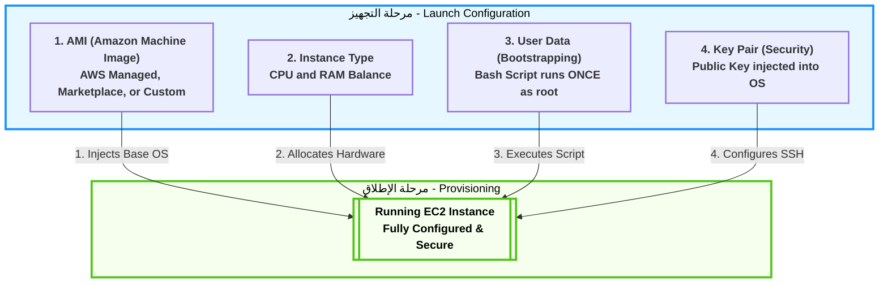
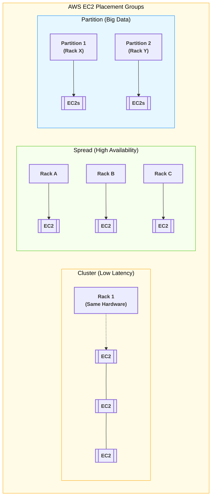
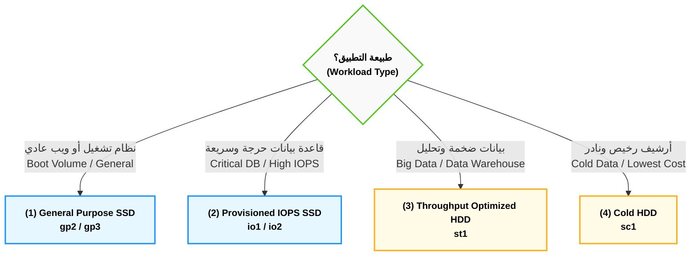
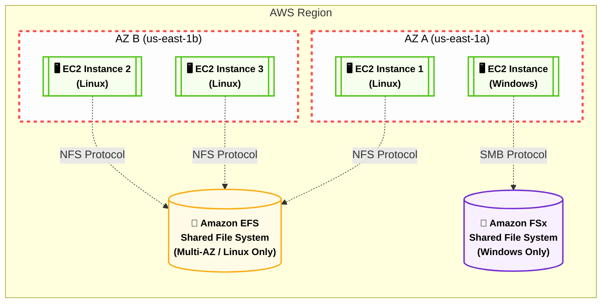
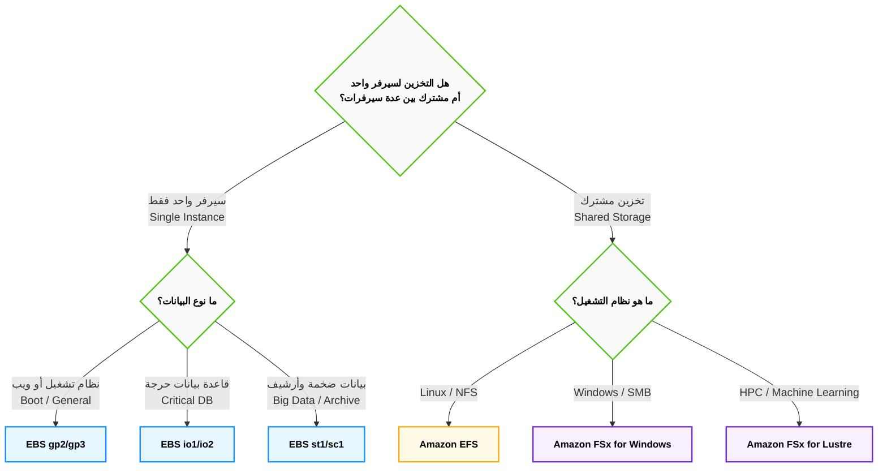

# Domain 3: Cloud Technology & Services

## 1. التشريح العميق والموسع لمعمارية EC2 (Elastic Compute Cloud)

**أصل الحكاية (The Core Problem):**

زمان، لو عايز ترفع أبلكيشن (سواء كان شغال بـ Node.js، أو Backend بـ Laravel 13)، كنت لازم تشتري سيرفر فيزيكال (حتة حديدة)، وتستنى شهور يوصلك، وتجيب مهندس شبكات يركبه في الـ Rack، وتسطب نظام التشغيل. الكارثة إنك لو الأبلكيشن بتاعك ضرب وبقى عليه ضغط، السيرفر الفيزيكال ده هيقع، وعشان تكبره لازم تشتري رامات وبروسيسور فيزيكال وتطفي السيرفر وتركبهم.

من هنا ظهر الـ **EC2**. الفكرة مش تأجير سيرفر، الفكرة في الـ **(Virtualization)**. أمازون جابت سيرفرات عملاقة، واستخدمت برامج (Hypervisors) عشان تقطع السيرفرات دي لـ "خوادم افتراضية" صغيرة. إنت بتبني السيرفر بتاعك كأنه "مكعبات ليجو" من خلال الـ API أو الـ Console، وفي 40 ثانية بيكون شغال.

### ⚙️ تفكيك مكعبات الـ EC2 (The 4 Core Building Blocks)

عشان تخلق سيرفر EC2، أمازون بتجبرك تختار 4 مكونات رئيسية، كل مكون فيهم وراه بحر من التفاصيل الهندسية:

#### 1. الـ AMI (Amazon Machine Image) - "أسطمبة الروح"

الـ AMI مش مجرد "نسخة أوبونتو". دي عبارة عن (صورة مجمدة - Immutable Image) من الهارد ديسك، بتحتوي على نظام التشغيل وأي برامج متسطبة عليه.

- **الأنواع في الامتحان:**
    
    1. **AWS Managed AMIs:** صور أمازون هي اللي عاملاها ومسؤولة عن تحديثها (زي Amazon Linux 2023 أو Ubuntu 24.04 صافي).
        
    2. **AWS Marketplace:** صور شركات تانية عاملاها وبتبيعها. مثلاً ممكن تشتري صورة جاهزة متسطب عليها (F5 Load Balancer) أو فايروال جاهز وتدفع تمن رخصة السوفت وير مع ثمن السيرفر.
        
    3. **Custom AMIs (Golden Image):** ودي أهم لقطة ليك كمهندس! إنت بتعمل سيرفر عادي، تسطب عليه الـ PHP والـ Nginx وتظبط إعدادات الـ Laravel بتاعتك، وبعدين تاخد من السيرفر ده (صورة - Snapshot). الصورة دي بقت (Golden AMI) خاصة بيك. بعد كده، تقدر تخلق 100 سيرفر في ثانية واحدة من الصورة دي، وكلهم هيطلعوا متسطب عليهم كل حاجة جاهزة!
        

#### 2. عائلات السيرفرات (Instance Types) - "العضلات والهيكل"

أمازون مش بتديك عضلات عشوائية. اسم السيرفر في أمازون (زي `m5.large`) بيتكون من 3 حتت: حرف (M) بيمثل العائلة، رقم (5) بيمثل الجيل، وكلمة (large) بتمثل الحجم.

- **عائلة الأغراض العامة (General Purpose - T & M):**
    
    دي السيرفرات اللي الـ CPU والرامات فيها متوازنين.
    

> [!warning] تحذير معماري (T-Series CPU Credits)
> 
> عائلة الـ **T** (زي t2.micro) بتشتغل بنظام الـ (Burstable Performance). يعني إيه؟ يعني طول ما السيرفر بتاعك هادي، بيجمع حاجة اسمها (CPU Credits). ولما يحصل ضغط مفاجئ، بيحرق الكريدت دي عشان يشتغل بأقصى طاقة. لو الكريدت خلصت، السيرفر بيهنج وبيبقى بطيء جداً. دي تريكة خطيرة في بيئة العمل!

- **عائلة المعالجة (Compute Optimized - C):**
    
    المعالجات هنا جبارة. بتستخدمها لو الكود بتاعك بيعمل حسابات معقدة، ريندرينج، أو بيعالج فيديوهات.
    
- **عائلة الذاكرة (Memory Optimized - R & X):**
    
    هنا الرامات هي اللي ضخمة جداً. دي مثالية لقواعد البيانات اللي بتحتاج تحط الداتا كلها في الميموري عشان سرعة الاستجابة (In-Memory Databases) زي Redis أو Memcached.
    
- **عائلة التخزين (Storage Optimized - I & D):**
    
    بتديك هاردات (NVMe) راكبة في اللوحة الأم مباشرة (مش عن طريق الشبكة) عشان توفرلك سرعة قراءة وكتابة (IOPS) مجنونة. ممتازة للـ Big Data والـ NoSQL Databases.
    

#### 3. سكريبت الإفاقة (User Data / Bootstrapping) - "البرمجة الآلية"

- **المشكلة:** لما الـ Auto Scaling يقرر يبني سيرفر جديد الساعة 3 الفجر، السيرفر بيطلع "أبيض" حتى لو من الـ AMI. مين هيسحب آخر كود إنت عملتله Push على GitHub؟ ومين هيعمل `npm install` أو `composer update`؟
    
- **الحل (User Data):** ده سكريبت (Bash Script) إنت بتكتبه في إعدادات الـ EC2.
    
- **القاعدة الذهبية:** السكريبت ده بيشتغل **بصلاحيات الـ root**، وبيشتغل **مرة واحدة فقط لا غير** في دورة حياة السيرفر (لحظة الولادة الأولى). لو عملت Restart للسيرفر، السكريبت ده مش هيشتغل تاني.
    

#### 4. مفاتيح الأمان (Key Pairs - Asymmetric Cryptography)

إزاي هتدخل على السيرفر بتاعك وتكتب أوامر (SSH) من غير ما تكتب Username و Password كل شوية، وفي نفس الوقت تحميه من الهاكرز؟

- أمازون بتستخدم "التشفير غير المتماثل". بتولد مفتاحين:
    
    1. **Public Key (المفتاح العام):** أمازون بتاخده وتزرعه جوه السيرفر بتاعك في ملف `~/.ssh/authorized_keys`.
        
    2. **Private Key (المفتاح الخاص):** ده ملف بينزل على جهازك الشخصي بامتداد `.pem`.
        
- **تريكة الامتحان:** أمازون **لا تحتفظ** بنسخة من المفتاح الخاص بتاعك. لو الملف ده اتمسح من على جهازك، فقدت السيطرة الكاملة على السيرفر ومستحيل تدخل عليه بـ SSH تاني!
    

### 🏗️ اللوحة المعمارية التفصيلية لتكوين الـ EC2 (Mermaid)

الخريطة دي بتفصل التفاعل المعقد بين الـ 4 مكونات عشان يخلقوا السيرفر النهائي (الكود خالي من الـ HTML ليتوافق مع Obsidian):




---
## 2. أمن السيرفرات: مجموعات الأمان (Security Groups)

**أصل الحكاية (The Core Problem):**

أي سيرفر EC2 بتخلقه وبتديله (Public IP) عشان الناس تدخله من على النت، بيبقى عامل زي بيت بيبانه وشبابيكه مفتوحة في شارع ضلمة؛ أي هاكر يقدر يعمل عليه (Port Scan) ويدخله. في الـ IT القديم، كنا بنشتري أجهزة (Hardware Firewalls) غالية جداً ونحطها على باب الشركة. في السحابة، أمازون اخترعت الـ **Security Groups (SG)**: ده فايروال افتراضي (Virtual Firewall) مجاني، بيحوط السيرفر بتاعك كأنه "درع شخصي"، وبيفلتر أي داتا داخلة أو طالعة.

### ⚙️ القواعد الهندسية للـ Security Groups (دستور الامتحان)

الـ Security Groups مش بتشتغل بالبركة، ليها 4 قواعد صارمة الامتحان بيلعب عليهم في السيناريوهات:

#### 1. مبدأ المنع الافتراضي (Default Deny)

- **القاعدة:** أول ما بتخلق SG جديد، بيكون **مانع كل حاجة داخلة للسيرفر (Inbound = Deny All)**، و**سامح بكل حاجة طالعة من السيرفر (Outbound = Allow All)**.
    
- **السيناريو:** لو عملت سيرفر وسطبت عليه موقع، الموقع مش هيفتح للناس إلا لو إنت دخلت بنفسك فتحت (Port 80 للـ HTTP) أو (Port 443 للـ HTTPS) في الـ Inbound Rules.
    

#### 2. حالة الاتصال (Stateful) - 🚨 [أهم تريكة في الامتحان]

- **المعنى المعماري:** الـ Security Group عندها "ذاكرة". يعني لو هي سمحت لريكويست إنه يدخل (Inbound)، هتسمح للرد بتاع الـ ريكويست ده إنه يخرج (Outbound) أوتوماتيك، **حتى لو إنت قافل كل الـ Outbound Rules!**
    
- **الفرق الجوهري:** في فايروال تاني في أمازون اسمه (NACL) ده بيكون (Stateless) مابيفهمش، لو فتحت الدخول لازم تفتح الخروج بإيدك. لكن الـ SG ذكية (Stateful).
    

#### 3. القواعد الإيجابية فقط (Allow Rules Only)

- إنت في الـ SG تقدر تقول: "اسمح لـ IP كذا إنه يدخل".
    
- لكن **مستحيل** تقول: "امنع IP كذا إنه يدخل". الـ SG مفيهاش (Deny Rules). لو عايز تمنع حد معين، بتسيبه بره القواعد المسموحة، فالـ SG هتمنعه بالديفولت.
    

#### 4. لغة التخاطب (IPs vs Security Groups)

- في الـ Inbound Rules، ممكن تفتح الباب لـ IP معين (مثلاً IP بيتك عشان تعمل SSH).
    
- **الحركة المعمارية الأذكى:** تقدر تفتح الباب لـ Security Group تانية!
    
    - _مثال:_ عندك سيرفر داتابيز (EC2-DB). بدل ما تفتحه للنت، هتقوله في الـ SG بتاعته: "ماتقبلش أي ريكويستات إلا لو جاية من الـ SG بتاعة سيرفر الـ Laravel (EC2-Web)". دي بتعمل طبقة حماية مرعبة (Micro-segmentation).
        

### 🏗️ اللوحة المعمارية: كيف يعمل الـ Security Group (Mermaid)

الرسمة دي بتوضح قاعدة الـ (Stateful) وإزاي الدرع بيحمي السيرفر:

Code snippet

```mermaid
flowchart LR
    classDef default font-weight:bold,font-size:14px,stroke-width:2px;

    User(("👨‍💻 User</br>Internet"))
    Hacker(("🦹 Hacker</br>Internet"))

    subgraph AWS_Cloud ["AWS Cloud"]
        subgraph SG ["🛡️ Security Group (Stateful Firewall)"]
            direction TB
            Inbound["Inbound Rules:</br>✅ Allow Port 80 (HTTP)</br>✅ Allow Port 22 (Your IP)"]
        end
        EC2[["🖥️ EC2 Instance</br>(Web Server)"]]
    end

    %% User Traffic
    User -->|1. HTTP Request (Port 80)| Inbound
    Inbound -->|Allowed!| EC2
    EC2 -.->|2. Auto-Allowed out</br>(Because SG is Stateful)| User

    %% Hacker Traffic
    Hacker -->|Try Port 3306 (DB)| Inbound
    Inbound -.-x|Blocked!</br>(Implicit Deny)| Hacker

    classDef aws fill:#f9f9f9,stroke:#ff9900,stroke-width:3px,color:#000;
    classDef sg fill:#e6f7ff,stroke:#1890ff,stroke-width:3px,color:#000,stroke-dasharray: 5 5;
    classDef ec2 fill:#f6ffed,stroke:#52c41a,stroke-width:3px,color:#000;
    classDef user fill:#fffbe6,stroke:#faad14,color:#000;
    classDef hacker fill:#fff1f0,stroke:#ff4d4f,color:#000;

    class AWS_Cloud aws;
    class SG sg;
    class EC2 ec2;
    class User user;
    class Hacker hacker;
```

بصة سريعة على الكود ده بعد ما ضفنا فيه الـ `</br>`، وقولي لو طالع معاك مظبوط وشكله نضيف في أوبسيديان.

---
## 3. أنظمة الدفع وتسعير خوادم EC2 (Pricing Models)

**أصل الحكاية (The Core Problem):**

الامتحان مش بس بيختبرك في التكنولوجيا، ده بيركز جداً على "إدارة التكلفة" (Cost Optimization). السيرفرات مش بتتدفع بطريقة واحدة؛ أمازون عملت 4 أنظمة دفع (Payment Methods) عشان تناسب كل السيناريوهات. اختيار النظام الغلط ممكن يخسّر الشركة ملايين، عشان كده الأسئلة دي **مؤكدة 100% في الامتحان**.

### ⚙️ تفكيك خطط الدفع (للامتحان)

#### (1) الدفع عند الاستخدام (On-Demand Instances)

- **الفكرة:** بتأجر السيرفر وتدفع بالثانية (أو بالساعة) اللي بيشتغل فيها بس. مفيش أي عقود ولا التزامات مقدمة.
    
- **الاستخدام (سيناريو الامتحان):** لو عندك أبلكيشن جديد لسه بتجربه ومش عارف الترافيك بتاعه هيكون إيه (Unpredictable workloads)، أو بتعمل (Test/Dev) لفترة قصيرة.
    
- **العيب:** دي **أغلى** خطة دفع عادية في أمازون.
    

#### (2) الخوادم المحجوزة (Reserved Instances - RI) & (Savings Plans)

- **الفكرة:** إنت بتمضي عقد مع أمازون إنك هتفضل تستخدم السيرفرات دي لمدة (سنة أو 3 سنين). مقابل العقد والالتزام ده، أمازون بتعملك خصم بيوصل لـ **72%** من سعر الـ On-Demand.
    
- **الاستخدام (سيناريو الامتحان):** لو الأبلكيشن بتاعك شغال 24/7 وحالته مستقرة (Steady-state workloads)، زي قواعد البيانات الأساسية للشركة أو موقع شغال بقاله سنين.
    

#### (3) الخوادم الرخيصة (Spot Instances) - 🚨 [أكثر سؤال بيتكرر]

- **الفكرة:** أمازون عندها سيرفرات فاضية في الداتا سنتر محدش مأجرها، فبتعرضها بخصم مرعب بيوصل لـ **90%**!
    
- **الكارثة (الشرط):** أمازون تقدر تسحب منك السيرفر ده وتطفيه في أي لحظة (بتديك إنذار دقيقتين بس) لو حد تاني احتاجه ودفع سعره On-Demand.
    
- **الاستخدام (سيناريو الامتحان):** العمليات اللي "عادي لو وقفت ونكملها بعدين" زي (Batch Processing)، ريندر الفيديوهات، تحليل البيانات، أو معالجة الصور.
    
- **تحذير:** إياك تختارها في الامتحان لو السيناريو بيقولك "تطبيق ويب بيخدم عملاء حالياً" أو "داتابيز حرجة".
    

#### (4) الخوادم المخصصة (Dedicated Hosts)

- **الفكرة:** إنت بتأجر "سيرفر حديد" بالكامل ليك لوحدك في الداتا سنتر، محدش من عملاء أمازون التانيين بيشاركك فيه.
    
- **الاستخدام (سيناريو الامتحان):** في حالتين بس:
    
    - لو الشركة عندها **قوانين امتثال صارمة (Strict Compliance)** بتمنع مشاركة الهاردوير لأسباب أمنية.
        
    - لو عندك **رخصة سوفت وير (Software License)** خاصة بشركتك (زي Windows Server أو Oracle) بتشترط إنها تنزل على هاردوير محدد ومستقل.
        
- **العيب:** دي أغلى حاجة ممكن تأجرها في أمازون على الإطلاق.
    

### 🏗️ خريطة اتخاذ القرار في التسعير (Mermaid)

الرسمة دي بتلخصلك إزاي تختار الإجابة الصح في الامتحان بناءً على الكلمة الدلالية (Keyword) اللي في السيناريو:

Code snippet

```mermaid
flowchart TD
    classDef default font-weight:bold,font-size:16px,stroke-width:2px;

    Start{"طبيعة التطبيق؟</br>(Workload Type)"}

    Start -->|غير متوقع أو تحت التطوير</br>(Unpredictable / Short-term)| OnDemand["On-Demand</br>الدفع بالاستخدام - الأغلى"]
    
    Start -->|مستقر ومستمر لسنوات</br>(Steady-state / Long-term)| RI["Reserved Instances</br>خصم 72% بعقد"]
    
    Start -->|يتحمل الانقطاع المفاجئ</br>(Fault-tolerant / Batch)| Spot["Spot Instances</br>خصم 90% ولكن غير مستقر"]
    
    Start -->|قوانين صارمة أو رخص</br>(Compliance / Licensing)| Dedicated["Dedicated Hosts</br>سيرفر فيزيكال خاص بك"]

    classDef ondemand fill:#fffbe6,stroke:#faad14,color:#000;
    classDef ri fill:#e6f7ff,stroke:#1890ff,color:#000;
    classDef spot fill:#fff1f0,stroke:#ff4d4f,color:#000;
    classDef dedicated fill:#f6ffed,stroke:#52c41a,color:#000;

    class OnDemand ondemand;
    class RI ri;
    class Spot spot;
    class Dedicated dedicated;
```

كده ملف الـ EC2 اتقفل بالضبة والمفتاح في النوتس بتاعتك:

1. المعمارية الفنية (AMI, Types, User Data, Keys).
    
2. الحماية (Security Groups).
    
3. خطط الدفع والتسعير (Pricing Models).
    

---

### 📊 جدول المقارنة الشامل لخطط تسعير EC2 (الخلاصة للامتحان)

|**خطة الدفع (Pricing Model)**|**التكلفة والخصم**|**الفكرة الجوهرية (المعنى الهندسي)**|**الكلمة الدلالية في الامتحان (Exam Keywords)**|
|---|---|---|---|
|**On-Demand**<br><br>  <br><br>(الدفع عند الاستخدام)|الأغلى (بدون خصم)|تأجير حر بالثانية/الساعة بدون أي عقود أو التزامات مسبقة.|Unpredictable, Spiky, Short-term, Testing & Development|
|**Reserved Instances**<br><br>  <br><br>(الخوادم المحجوزة)|خصم يصل لـ **72%**|عقد التزام (Commitment) لمدة سنة أو 3 سنوات مع أمازون.|Steady-state, Predictable, Long-term, 1 or 3 years commitment|
|**Spot Instances**<br><br>  <br><br>(الخوادم الرخيصة الفائضة)|خصم يصل لـ **90%**|استغلال هاردوير أمازون الفاضي، لكن يمكن سحبه بإنذار (دقيقتين) فقط!|Fault-tolerant, Batch processing, Can be interrupted, Stateless|
|**Dedicated Hosts**<br><br>  <br><br>(الخوادم المخصصة)|الأغلى على الإطلاق|سيرفر فيزيكال كامل (Hardware) مخصص لشركتك فقط غير مشترك مع أحد.|Strict Compliance, Regulatory requirements, Software Licensing (BYOL)|

> [!info] نصيحة أخيرة للحل السريع
> 
> في الامتحان، أول ما عينك تلمح كلمة **(Interruptible)** أو **(Batch)** روح فوراً للـ **Spot**. وأول ما تلمح كلمة **(License)** أو **(Compliance)** اختار **Dedicated Hosts** وإنت مغمض!

---
## 4. المكملات الهندسية لـ EC2 (تريكات مخفية في الامتحان)

في 3 مفاهيم أساسية بيكملوا معمارية الـ EC2، وأسئلتهم بتيجي في الامتحان على هيئة "فخوخ" (Traps):

### (1) العناوين الثابتة: Elastic IP (EIP)

- **المشكلة:** لما بتعمل سيرفر EC2 جديد (مثلاً عليه مشروع Laravel 13)، أمازون بتديله Public IP مجاني عشان الناس تدخله. الكارثة إنك لو عملت للسيرفر (Stop) ورجعت عملتله (Start)، الـ IP ده بيتغير! لو إنت رابط الـ IP ده بدومين (زي .com)، الموقع هيقع.
    
- **الحل المعماري:** الـ **Elastic IP**. ده IP ثابت (Static IPv4) إنت بتحجزه لنفسك ويفضل بتاعك للأبد، وتربطه بالسيرفر، ولو السيرفر عمل ريستارت هيفضل الـ IP زي ما هو.
    
- 🚨 **فخ الامتحان (التسعير الغريب):** الـ Elastic IP **مجاني** طول ما هو مربوط بسيرفر شغال (Running). لكن لو إنت حاجزه وراميه عندك ومش رابطه بسيرفر، أو رابطه بسيرفر مطفي (Stopped).. **أمازون هتبدأ تسحب منك فلوس عليه!** (بيعملوا كده عشان الناس ماتحجزش الـ IPs وتخلصها على الفاضي).
    

### (2) فخ التسعير: Dedicated Hosts vs Dedicated Instances

في الامتحان، هيحاول يلخبطك بين الاتنين دول لأنهم شبه بعض جداً:

- **Dedicated Instances (الخوادم المخصصة):** سيرفرات شغالة على هاردوير (Physical Server) مخصص لشركتك إنت بس. مفيش أي عميل تاني من أمازون هيشاركك نفس الحديدة. (تستخدم للـ Compliance والأمان العادي).
    
- **Dedicated Hosts (المضيف المخصص):** نفس اللي فوق، بس بيزيد عليها إن أمازون بتديك **(Visibility - رؤية كاملة)** لعدد الـ Sockets والـ Cores بتاعة البروسيسور.
    
- 🚨 **الكلمة الدلالية (Keyword):** أول ما تشوف في السؤال كلمة **BYOL (Bring Your Own License)** أو رخص سوفت وير بتتحاسب بعدد الكورز (زي Oracle أو Windows Server)، إياك تختار Instances، لازم تختار **Dedicated Hosts**!
    

### (3) مجموعات التسكين (Placement Groups)

أمازون بتسألك: "عايزني أرصلك السيرفرات بتاعتك فين في الداتا سنتر؟"

ليها 3 استراتيجيات (كل واحدة لسيناريو معين):

1. **Cluster (التكتل):**
    
    - **الفكرة:** بنرص السيرفرات كلها في نفس الـ Rack (نفس الدولاب) جنب بعض بالظبط.
        
    - **السيناريو:** لو عندك سيرفرات بتكلم بعض بسرعة جنونية ومحتاج (Low Latency) وتأخير شبه معدوم، زي الـ High Performance Computing (HPC).
        
    - **العيب:** لو الـ Rack ده الكهربا قطعت عنه، السيرفرات كلها هتقع مرة واحدة.
        
2. **Spread (الانتشار):**
    
    - **الفكرة:** بنوزع السيرفرات بحيث كل سيرفر يتحط في (Rack) مستقل، ليه كهربا ونتورك مختلفة.
        
    - **السيناريو:** لو عندك أبلكيشن حساس جداً (Critical Application) ومش عايز أي نسبة خطأ (High Availability). لو راك ولع، الباقي شغال.
        
    - **العيب:** الحد الأقصى 7 سيرفرات بس في كل منطقة (AZ).
        
3. **Partition (التقسيم):**
    
    - **الفكرة:** بنقسم السيرفرات لـ (مجموعات/Partitions). كل مجموعة في Rack لوحدها.
        
    - **السيناريو:** بتستخدم دايماً مع الـ Big Data وأنظمة قواعد البيانات الموزعة زي (Hadoop, Cassandra, Kafka).
        

### 🏗️ خريطة هندسة مجموعات التسكين (Mermaid)

Code snippet




---


----
## 2. عوالم التخزين المرفقة (Attached Storage) - الجزء الأول: معمارية EBS

**أصل الحكاية والمشكلة الأساسية:**

أي سيرفر EC2 بتخلقه محتاج "هارد ديسك" عشان يتسطب عليه نظام التشغيل (Linux/Windows) وتتخزن عليه ملفاتك وقواعد البيانات. في السيرفرات القديمة (On-Premises)، الهارد كان بيبقى راكب بمسامير جوه اللوحة الأم، ولو المازربورد اتحرقت، الداتا كلها بتطير.

أمازون غيرت اللعبة دي واخترعت ما يسمى بـ **(التخزين المربوط بالشبكة - Network-Attached Storage)**. الهارد بقى مفصول عن السيرفر فيزيكال، ومربوط بيه بكابل شبكة داخلي فائق السرعة. يعني لو السيرفر ولع، الهارد هيفضل سليم وتقدر توصله بسيرفر تاني في ثواني!

### ⚙️ التشريح العميق لـ Amazon EBS (Elastic Block Store)

عشان تفهم الـ EBS صح وتحل أسئلته المعقدة في الامتحان، لازم نفكك اسمه ونفهم القوانين اللي بتحكمه:

#### (أ) يعني إيه Block Storage (تخزين الكتل)؟

- **المعنى الهندسي:** الهارد ده بيقسم الداتا لـ "بلوكات" (Blocks) صغيرة جداً بحجم ثابت.
    
- **ليه ده يهمنا؟** تخيل عندك قاعدة بيانات (Database) حجمها 50 جيجا، وفي يوزر عمل Update لحرف واحد في اسمه. لو الهارد ده بيخزن كـ (ملفات كاملة)، هيضطر يمسح الـ 50 جيجا ويكتبهم من جديد عشان حرف! لكن في الـ (Block Storage)، الهارد بيروح للبلوك المعين (اللي حجمه كام كيلو بايت) اللي فيه الحرف ده ويعدله بس في أجزاء من الثانية.
    
- **الخلاصة للامتحان:** الـ EBS **سريع جداً جداً** ومثالي لأنظمة التشغيل وقواعد البيانات (Databases) اللي محتاجة سرعة قراءة وكتابة لحظية.
    

#### (ب) القوانين المعمارية الصارمة للـ EBS (دستور الامتحان)

الـ EBS ليه 3 قوانين حاكمة مستحيل كسرها، والامتحان بيلعب عليهم في السيناريوهات:

1. **حبيس المنطقة (AZ Locked):**
    
    لما بتخلق هارد EBS، بيتولد جوه مبنى واحد (Availability Zone - مثلاً `us-east-1a`). السيرفر (EC2) اللي هيركب عليه لازم وحتماً يكون معاه في نفس الـ AZ.
    
    _(السبب: الهارد والسيرفر مربوطين بكابلات. مستحيل تركب هارد في مبنى `1a` على سيرفر في مبنى `1b` لأن الكابل مش هيوصل والسرعة هتقل)._
    
2. **الزواج الفردي (One-to-One):**
    
    هارد الـ EBS العادي بيركب في **سيرفر واحد فقط** في نفس اللحظة. مينفعش تجيب سيرفرين وتوصلهم بنفس هارد الـ EBS العادي عشان يقرأوا ويكتبوا مع بعض. (عشان تعمل كده هتحتاج هارد EFS اللي هنشرحه في الجزء الثالث).
    
3. **البقاء أو الفناء (Delete on Termination):**
    
    دي تريكة خبيثة جداً في الامتحان وفي بيئة العمل:
    
    - **الهارد الأساسي (Root Volume):** ده اللي بينزل عليه نظام التشغيل. الديفولت بتاعه إنه **بيتمسح ويُدمر أوتوماتيك** لو إنت مسحت السيرفر (Terminated).
        
    - **الهاردات الإضافية (Data Volumes):** دي اللي بتركبها عشان تشيل عليها الداتابيز أو الصور. الديفولت بتاعها إنها **بتفضل عايشة** حتى لو السيرفر اتدمر.
        
        _(ملاحظة: إنت كمهندس تقدر تغير الإعدادات دي براحتك قبل إطلاق السيرفر)._
        

#### (ج) اللقطات الاحتياطية (EBS Snapshots) - الهروب من السجن

- **المشكلة:** طالما الهارد "حبيس" في مبنى `1a`، إزاي أعمل منه باك أب (Backup) وأنقله لمبنى `1b` عشان أحمي الأبلكيشن لو المبنى الأول وقع؟
    
- **الحل المعماري (Snapshot):** إنت بتاخد "لقطة" (صورة طبق الأصل) من الهارد.
    
    - اللقطة دي مش بتتخزن على EBS، دي بتروح تتخزن في خدمة التخزين العملاقة **(Amazon S3)** لأنها أرخص وبتتوزع على كل المباني.
        
    - بعدها بتروح للمبنى التاني `1b`، وتقوله "اصنعلي هارد EBS جديد من اللقطة اللي متخزنة في الـ S3". وكده إنت استنسخت الهارد ونقلته من مبنى لمبنى!
        

> [!info] معلومة هامة للامتحان (Incremental Backups)
> 
> الـ Snapshots في أمازون بتشتغل بنظام (الزيادة التراكمية - Incremental). يعني أول لقطة بتاخد مساحة الهارد كله (مثلاً 10 جيجا). لو ضفت ملف حجمه 1 جيجا وأخدت لقطة تانية، اللقطة التانية هتحفظ الـ 1 جيجا الجديد بس، وده بيوفرلك فلوس كتير جداً في التخزين!

### 🏗️ اللوحة المعمارية: دورة حياة الـ EBS والـ Snapshots

```mermaid
flowchart TD
    classDef default font-weight:bold,font-size:14px,stroke-width:2px;

    subgraph Region ["AWS Region (e.g., us-east-1)"]
        direction LR
        
        subgraph AZ_A ["Availability Zone A (us-east-1a)"]
            direction TB
            EC2_1[["🖥️ EC2 Instance</br>(App Server)"]]
            EBS_1[("💾 EBS Volume</br>Network Attached")]
            
            EC2_1 <==>|Fast Local Network| EBS_1
        end

        S3[("🪣 Amazon S3</br>Global Storage</br>Holds Snapshots")]

        subgraph AZ_B ["Availability Zone B (us-east-1b)"]
            direction TB
            EBS_2[("💾 New EBS Volume</br>Created from Snapshot")]
            EC2_2[["🖥️ New EC2 Instance</br>(Backup Server)"]]
            
            EBS_2 <==>|Fast Local Network| EC2_2
        end

        %% Snapshot Travel Process
        EBS_1 -.->|Take Snapshot| S3
        S3 -.->|Restore Snapshot| EBS_2
    end

    classDef ec2 fill:#f6ffed,stroke:#52c41a,color:#000;
    classDef ebs fill:#e6f7ff,stroke:#1890ff,color:#000;
    classDef s3 fill:#fffbe6,stroke:#faad14,color:#000;
    classDef az fill:#fdfdfd,stroke:#ff4d4f,stroke-width:3px,color:#000,stroke-dasharray: 5 5;

    class EC2_1,EC2_2 ec2;
    class EBS_1,EBS_2 ebs;
    class S3 s3;
    class AZ_A,AZ_B az;
```

الرسمة دي بتوضح إزاي الهارد مربوط بالشبكة الفردية، وإزاي اللقطة بتسافر بين المباني (تم استخدام الـ `</br>` لفصل السطور بدون أخطاء):




---
##  الجزء الثاني: أنواع هاردات EBS (SSD vs HDD)

**أصل الحكاية (The Core Problem):**

ليه أمازون معملتش هارد واحد موحد وخلاص؟ لأن الداتا مش زي بعضها. لو إنت بتعمل سيرفر داتابيز (PostgreSQL) عليه ملايين العمليات في الثانية، إنت محتاج هارد "سريع جداً". لكن لو بتخزن ملفات "سجلات" (Logs) مش بتفتحها غير مرة كل كام شهر، حرام تدفع فلوس في هارد سريع!

عشان كده، أمازون قسمت الـ EBS لعائلتين كبار: **SSD** (سريع وغالي)، و **HDD** (بطيء ورخيص).

### ⚙️ فك طلاسم السرعة (IOPS vs Throughput)

قبل ما نحفظ أنواع الهاردات، لازم نفهم أمازون بتقيس سرعة الهارد إزاي في الكواليس:

1. **الـ IOPS (Input/Output Operations Per Second):** - ده مقياس **"سرعة الاستجابة"**. تخيل إنك بتبعت آلاف العربيات الملاكي الصغيرة والسريعة جداً.
    
    - **الاستخدام:** قواعد البيانات (Databases) اللي بتكتب وتقرأ أرقام صغيرة جداً بس بمعدل ملايين المرات في الثانية (Low Latency).
        
2. **الـ Throughput (معدل النقل - MiB/s):**
    
    - ده مقياس **"عرض الماسورة"**. تخيل إنك بتبعت عربية نقل مقطورة بطيئة، بس بتشيل أطنان من البضاعة في النقلة الواحدة.
        
    - **الاستخدام:** الـ Big Data ونقل الفيديوهات والملفات الضخمة اللي بتتقرأ ورا بعضها (Sequential Data).
        

### ⚙️ عائلات الـ EBS (دستور الامتحان)

#### أولاً: عائلة الـ SSD (Solid State Drives)

دي الهاردات السريعة اللي بتعتمد على الـ IOPS.

> [!info] ملاحظة هامة
> 
> عائلة الـ SSD هي **الوحيدة** اللي مسموح تنزل عليها نظام تشغيل (Boot Volumes).

- **(1) الهارد المتوازن: General Purpose SSD (gp2 / gp3)**
    
    - **الفكرة:** هارد بيوازن بين السعر والأداء. ده "الديفولت" بتاع أمازون لأي سيرفر جديد.
        
    - **التريكة الهندسية:** في الـ `gp2` القديم، السرعة (IOPS) كانت مربوطة بحجم الهارد. يعني لو عايز سرعة أكبر، لازم تشتري جيجات أكتر حتى لو مش محتاجها! أمازون حلت المشكلة دي في الـ `gp3`، وبقيت تقدر ترفع السرعة لوحدها من غير ما تزود الحجم (عشان توفر فلوس).
        
    - **سيناريو الامتحان:** أي تطبيق ويب عادي (زي تطبيق بـ Laravel)، أو Boot volume، أو بيئات التطوير والاختبار.
        
- **(2) الوحش الكاسر: Provisioned IOPS SSD (io1 / io2 / io2 Block Express)**
    
    - **الفكرة:** أغلى وأسرع هارد في أمازون، مخصص للأنظمة الحرجة جداً (Mission-Critical).
        
    - **السيناريو:** لو الداتابيز بتاعتك محتاجة أكتر من `16,000 IOPS` (سرعة جنونية)، أو لو الأبلكيشن بتاعك بيتعامل مع معاملات مالية (Billion-dollar DBs) ومفيش أي مجال للتأخير.
        
    - **الكلمات الدلالية في الامتحان:** `Critical Database`, `High IOPS`, `Sub-millisecond Latency`, `> 16,000 IOPS`.
        

#### ثانياً: عائلة الـ HDD (Hard Disk Drives)

دي هاردات ميكانيكية بتعتمد على عرض الماسورة (Throughput).

> [!warning] تحذير امتحان صارم
> 
> عائلة الـ HDD **مستحيل** تنزل عليها نظام تشغيل (Cannot be a Boot Volume). دي بتستخدم كهاردات "إضافية" للداتا فقط.

- **(3) هارد النقل الضخم: Throughput Optimized HDD (st1)**
    
    - **الفكرة:** هارد الماسورة الواسعة. رخيص ومصمم لنقل الداتا الضخمة والمستمرة.
        
    - **السيناريو:** الـ Big Data، أنظمة الـ Data Warehouses، ومعالجة سجلات النظام (Log Processing).
        
    - **الكلمات الدلالية:** `Big Data`, `Data Warehouse`, `Streaming workloads`.
        
- **(4) هارد الأرشيف: Cold HDD (sc1)**
    
    - **الفكرة:** ده "أرخص" هارد EBS في أمازون على الإطلاق.
        
    - **السيناريو:** الداتا "الباردة" (Cold Data) اللي محتاجينها تفضل واصلة بالسيرفر عشان لو احتاجنالها، بس مش بندخل عليها غير نادراً جداً.
        
    - **الكلمات الدلالية:** `Lowest Cost`, `Infrequently Accessed`, `Archive`.
        

### 🏗️ خريطة اتخاذ القرار في الامتحان (EBS Volume Types)

الرسمة دي (Mermaid) هتخليك تلقط الإجابة الصح في الامتحان بمجرد ما تقرأ الكلمة الدلالية (Keyword) في السيناريو (تم استخدام `</br>` لضمان التوافق التام مع أوبسيديان):

Code snippet




---
##  الجزء الثالث: الهارد المشترك (Amazon EFS)

**أصل الحكاية والمشكلة الأساسية:**

في الـ EBS، الهارد بيركب في "سيرفر واحد" وفي "مبنى واحد (AZ)". طب لو عندي سيستم كبير شغال وراه 10 سيرفرات EC2 متوزعين في 3 مباني (AZs) مختلفة، وكلهم محتاجين يقرأوا ويكتبوا في نفس الفولدر (`/uploads`) في نفس اللحظة؟

لو يوزر رفع صورة، هتنزل على سيرفر 1. لو يوزر تاني دخل والـ Load Balancer رماه على سيرفر 2، مش هيلاقي الصورة!

من هنا أمازون اخترعت الـ **EFS (Elastic File System)**: ده "هارد شبكي مشترك" (Shared File System) موجود في السحابة، بيكبر لوحده، بيوصل لآلاف السيرفرات في نفس اللحظة، وعابر للمباني (Multi-AZ).

### ⚙️ القواعد الهندسية للـ EFS (دستور الامتحان)

الـ EFS ليه قوانين صارمة جداً، وأسئلته في الامتحان بتيجي "مباشرة" لو إنت حافظ التريكات دي:

#### (أ) حصرية نظام التشغيل (Linux Only) - 🚨 [فخ الامتحان الأول]

- **القاعدة:** الـ EFS مصمم عشان يشتغل ببروتوكول اسمه (NFSv4 - Network File System)، وده بروتوكول بيفهمه اللينكس بس (زي Ubuntu و Amazon Linux).
    
- **سيناريو الامتحان:** لو جابلك سؤال بيقولك الشركة عندها سيرفرات **Windows** ومحتاجين هارد مشترك.. **إياك تختار EFS!** الإجابة الصح وقتها هتكون خدمة تانية خالص اسمها **Amazon FSx for Windows**.
    

#### (ب) التواجد في عدة مباني (Multi-AZ Built-in)

الداتا اللي بتترفع على الـ EFS بتتنسخ في الكواليس بشكل لحظي (Synchronously) في أكتر من AZ جوه الـ Region. يعني الـ High Availability بتاعته مبنية جواه. مش محتاج تعمل Snapshots عشان تحمي الداتا من إن مبنى يقع، هو بيحمي نفسه.

#### (ج) التمدد التلقائي والتسعير (Elasticity & Pricing)

- **في الـ EBS:** إنت بتشتري هارد 100 جيجا، بتدفع تمنهم بالكامل سواء حطيت فيهم ملفات أو سيبتهم فاضيين.
    
- **في الـ EFS:** إنت **مابتحددش مساحة أصلاً**. الهارد ده بيكبر ويصغر أوتوماتيك على حسب الملفات اللي جواه، وبتدفع تمن الجيجات اللي إنت ماليها بالظبط.
    
- **العيب المعماري (Trade-off):** الـ EFS **أغلى بكتير** من الـ EBS (تقريباً 3 أضعاف السعر)، عشان كده بنستخدمه للضرورة القصوى (للملفات المشتركة بس، مش لنظام التشغيل).
    

### ⚙️ طبقات التوفير الذكية (EFS Storage Classes)

بما إن الـ EFS غالي، أمازون عملت فيه "طبقات" (Tiers) عشان توفرلك فلوس بناءً على استخدامك للملفات:

1. **الطبقة القياسية (Standard):**
    
    دي للملفات الساخنة اللي السيرفرات بتفتحها وتعدل فيها كل يوم (ودي الطبقة الأغلى).
    
2. **طبقة الوصول النادر (EFS-IA - Infrequent Access):**
    
    للملفات اللي مش بتفتحها كتير. السعر هنا بيقل جداً (أرخص بحوالي 92%)، بس أمازون بتفرض عليك "رسوم بسيطة" كل مرة تفتح فيها الملف.
    
3. **نظام الإدارة الآلي (Lifecycle Management):**
    
    إنت بتشغل الخاصية دي في الإعدادات وتقوله: "أي ملف على الـ EFS محدش فتحه بقاله 30 يوم، انقله أوتوماتيك من طبقة الـ Standard لطبقة الـ IA عشان أوفر فاتورتي". دي بتيجي في الامتحان تحت كلمة (Cost Optimization for EFS).
    

> [!info] ملاحظة هندسية للامتحان (EFS One Zone)
> 
> لو إنت بتعمل بيئة تجارب (Test/Dev) ومش فارق معاك لو الداتا ضاعت، ممكن تختار (EFS One Zone). ده بيخزن الداتا في AZ واحدة بس، وده بيخليه أرخص 47% من الـ EFS العادي. بس لو الـ AZ دي وقعت، الداتا بتاعتك كلها طارت.

### 🏗️ اللوحة المعمارية: ديناميكية الـ EFS

الرسمة دي بتوضح إزاي الـ EFS بيربط السيرفرات ببعضها عبر المباني المختلفة (تم الاعتماد على `</br>` حصرياً لتوافق أوبسيديان):




---
## الجزء الرابع: الخلاصة وشفرات الامتحان

**أصل الحكاية:**

في امتحان الـ CLF-C02، أمازون مش بتختبر حفظك للتعريفات، هي بتختبر قدرتك كـ (Architect) إنك تختار الأداة الصح للسيناريو الصح بأقل تكلفة. الأسئلة هنا بتيجي في شكل "شركة عندها تطبيق بيعمل كذا.. تختار أنهي نوع تخزين؟"

### ⚙️ شفرات الامتحان (The Exam Keywords)

أول ما تشوف الكلمات دي في السؤال، اختار الخدمة دي وإنت مغمض:

#### (أ) شفرات الـ EBS (Elastic Block Store)

- `Boot Volume` أو `Operating System` ➔ **EBS (gp2/gp3)**
    
- `Relational Database`, `Low Latency`, `High IOPS` ➔ **EBS (io1/io2)**
    
- `Single EC2 instance`, `Block level storage` ➔ **EBS**
    
- `Backup to another AZ/Region` ➔ **EBS Snapshots**
    

#### (ب) شفرات الـ EFS (Elastic File System)

- `Shared File System`, `Hundreds of EC2 instances` ➔ **EFS**
    
- `Linux instances`, `NFS protocol` ➔ **EFS**
    
- `Multi-AZ shared storage`, `Grows automatically` ➔ **EFS**
    

#### (ج) شفرات الـ FSx (خدمات الملفات المتخصصة)

- `Windows Server`, `SMB protocol`, `Active Directory` ➔ **Amazon FSx for Windows File Server**
    
- `High Performance Computing (HPC)`, `Machine Learning`, `Lustre` ➔ **Amazon FSx for Lustre**
    

### 📊 الجدول الذهبي للمقارنة (EBS vs EFS vs FSx)

|**وجه المقارنة**|**Amazon EBS**|**Amazon EFS**|**Amazon FSx for Windows**|
|---|---|---|---|
|**نوع التخزين**|Block Storage (مكعبات)|File Storage (ملفات)|File Storage (ملفات)|
|**عدد السيرفرات المسموح**|سيرفر واحد فقط (1:1)|آلاف السيرفرات (Many:1)|آلاف السيرفرات (Many:1)|
|**نظام التشغيل المدعوم**|Windows و Linux|**Linux فقط (NFS)**|**Windows فقط (SMB)**|
|**نطاق التواجد (Scope)**|AZ واحدة فقط (مبنى واحد)|Multi-AZ (عدة مباني)|Single أو Multi-AZ|
|**التسعير (Pricing)**|تدفع للمساحة المحجوزة مسبقاً|تدفع لما تستخدمه فعلياً فقط|تدفع للمساحة المحجوزة مسبقاً|

> [!tip] نصيحة ذهبية للحل السريع
> 
> أي سؤال يطلب منك "هارد مشترك" (Shared Storage) عينك تروح فوراً على نظام التشغيل: لو قالك Linux اختار EFS، لو قالك Windows اختار FSx.

### 🏗️ خريطة اتخاذ القرار في الامتحان (Storage Decision Tree)

الرسمة دي (Mermaid) بتلخص خطوات تفكيرك وأنت بتقرأ أي سؤال عن التخزين المرفق:



---


---
